# PFC-PFI-BAIV-F2C Section 07: MCP Integration Architecture

**Document Reference:** `pfc-pfi-baiv-f2c-07-mcp-integration-architecture.md`  
**Phase:** 4 - MCP & Production  
**Version:** 1.0.0  
**Last Updated:** 2025-01-03  
**Schema Base:** schema.org + Custom Extensions

---

## Document Overview

This document defines the Model Context Protocol (MCP) integration architecture for Platform Foundation Core (PF-Core), enabling bidirectional design-to-code workflows, real-time token synchronization, and ontology-centric component generation across Figma, Notion, and custom MCP servers.

---

## Table of Contents

1. [MCP Architecture Overview](#1-mcp-architecture-overview)
2. [Figma MCP Integration](#2-figma-mcp-integration)
3. [Notion MCP Integration](#3-notion-mcp-integration)
4. [Custom MCP Servers](#4-custom-mcp-servers)
5. [MCP Extraction Workflows](#5-mcp-extraction-workflows)
6. [Agent Orchestration Patterns](#6-agent-orchestration-patterns)
7. [Data Flow & Synchronization](#7-data-flow--synchronization)
8. [Security & Governance](#8-security--governance)

---

## 1. MCP Architecture Overview

### 1.1 Strategic Context

MCP servers transform external systems into queryable, executable metadata sources for AI agents, enabling:

- **Design System as Executable Ontology** - Figma components become traversable schema
- **Knowledge Graph Integration** - Notion databases as semantic data sources
- **Real-time Synchronization** - Live validation against source-of-truth systems
- **Vendor Independence** - Standardized protocol across disparate tools

### 1.2 MCP Server Ecosystem

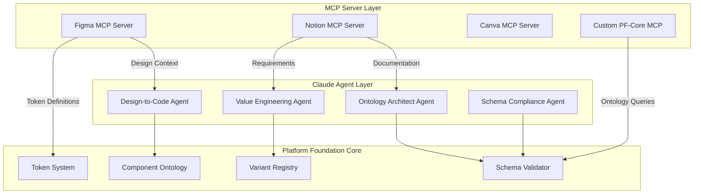

### 1.3 Core MCP Capabilities

| MCP Server | Primary Use Case | PF-Core Integration Point |
|------------|------------------|---------------------------|
| **Figma MCP** | Design-to-code extraction | Component Ontology, Token System |
| **Notion MCP** | Knowledge management, requirements | Documentation, VE-RRR Frameworks |
| **Canva MCP** | Marketing asset generation | Brand variant templates |
| **Custom PF-Core MCP** | Ontology queries, validation | Schema compliance, governance |

### 1.4 MCP Protocol Structure

```json
{
  "@context": "https://schema.org",
  "@type": "SoftwareApplication",
  "name": "MCP Server",
  "applicationCategory": "DeveloperApplication",
  "offers": {
    "@type": "Offer",
    "itemOffered": {
      "@type": "Service",
      "serviceType": "MCPTool",
      "provider": {
        "@type": "Organization",
        "name": "Tool Provider"
      }
    }
  },
  "potentialAction": [
    {
      "@type": "Action",
      "name": "tool_invocation",
      "target": {
        "@type": "EntryPoint",
        "urlTemplate": "mcp://server/tool/{tool_name}",
        "httpMethod": "POST"
      },
      "object": {
        "@type": "PropertyValue",
        "name": "parameters",
        "valueReference": "ToolParameterSchema"
      }
    }
  ]
}
```

---

## 2. Figma MCP Integration

### 2.1 Available Figma MCP Tools

| Tool Name | Function | PF-Core Use Case |
|-----------|----------|------------------|
| `get_design_context` | Extract component structure + styling | Component generation, variant validation |
| `get_variable_defs` | Extract design token definitions | Token synchronization, cascade validation |
| `get_code_connect_map` | Map Figma nodes to code components | Code Connect integration |
| `get_metadata` | Get node/page structure (XML) | Design system discovery |
| `get_screenshot` | Render node as image | Visual regression testing |
| `create_design_system_rules` | Generate governance rules | Automated rule generation |
| `whoami` | Validate authentication | Multi-tenant verification |

### 2.2 Design Context Extraction Workflow

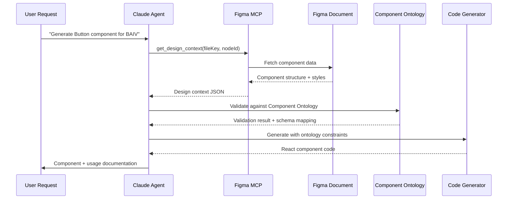

### 2.3 Token Synchronization Workflow

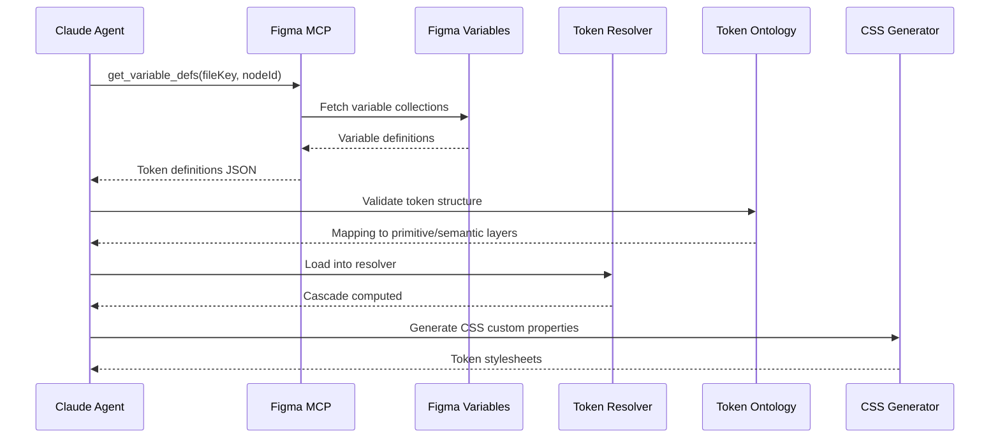

### 2.4 Figma MCP Tool Schemas

#### 2.4.1 get_design_context Schema

```json
{
  "@context": "https://schema.org",
  "@type": "Action",
  "name": "get_design_context",
  "description": "Extract component structure and styling from Figma node",
  "potentialAction": {
    "@type": "ConsumeAction",
    "object": {
      "@type": "CreativeWork",
      "identifier": "FigmaNode",
      "additionalProperty": [
        {
          "@type": "PropertyValue",
          "name": "fileKey",
          "description": "Figma file identifier",
          "valueRequired": true,
          "valuePattern": "^[a-zA-Z0-9]+$"
        },
        {
          "@type": "PropertyValue",
          "name": "nodeId",
          "description": "Component node ID (e.g., '123:456')",
          "valueRequired": true,
          "valuePattern": "^(?:-?\\d+[:-]-?\\d+)$"
        },
        {
          "@type": "PropertyValue",
          "name": "clientLanguages",
          "description": "Target programming languages (e.g., 'typescript')",
          "defaultValue": "typescript"
        },
        {
          "@type": "PropertyValue",
          "name": "clientFrameworks",
          "description": "Target frameworks (e.g., 'react')",
          "defaultValue": "react"
        }
      ]
    }
  },
  "result": {
    "@type": "StructuredValue",
    "additionalProperty": [
      {
        "@type": "PropertyValue",
        "name": "code",
        "description": "Generated component code"
      },
      {
        "@type": "PropertyValue",
        "name": "assets",
        "description": "Download URLs for referenced assets",
        "valueReference": {
          "@type": "ItemList",
          "itemListElement": {
            "@type": "ImageObject"
          }
        }
      },
      {
        "@type": "PropertyValue",
        "name": "componentStructure",
        "description": "Component anatomy for ontology validation",
        "valueReference": "ComponentOntology"
      }
    ]
  }
}
```

#### 2.4.2 get_variable_defs Schema

```json
{
  "@context": "https://schema.org",
  "@type": "Action",
  "name": "get_variable_defs",
  "description": "Extract design token definitions from Figma Variables",
  "potentialAction": {
    "@type": "ConsumeAction",
    "object": {
      "@type": "CreativeWork",
      "identifier": "FigmaVariables",
      "additionalProperty": [
        {
          "@type": "PropertyValue",
          "name": "fileKey",
          "valueRequired": true
        },
        {
          "@type": "PropertyValue",
          "name": "nodeId",
          "valueRequired": true
        }
      ]
    }
  },
  "result": {
    "@type": "StructuredValue",
    "name": "TokenDefinitions",
    "additionalProperty": [
      {
        "@type": "PropertyValue",
        "name": "primitiveTokens",
        "description": "Primitive layer tokens (colors, sizes, etc.)",
        "valueReference": {
          "@type": "ItemList",
          "itemListElement": {
            "@type": "PropertyValue",
            "name": "tokenName",
            "value": "tokenValue"
          }
        }
      },
      {
        "@type": "PropertyValue",
        "name": "semanticTokens",
        "description": "Semantic layer tokens referencing primitives",
        "valueReference": "PrimitiveTokens"
      },
      {
        "@type": "PropertyValue",
        "name": "collections",
        "description": "Variable collections (modes, themes)",
        "valueReference": {
          "@type": "ItemList"
        }
      }
    ]
  }
}
```

### 2.5 Code Connect Integration

Code Connect maps Figma components to actual codebase implementations, creating an executable design system ontology.

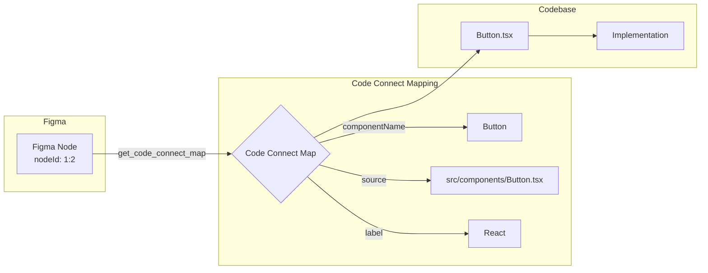

**Code Connect Tool Usage:**

```javascript
// Agent retrieves Code Connect mapping
const mapping = await figmaMCP.get_code_connect_map({
  fileKey: "abc123",
  nodeId: "1:2"
});

// Returns:
{
  "1:2": {
    "codeConnectSrc": "src/components/Button.tsx",
    "codeConnectName": "Button"
  }
}

// Agent uses mapping to:
// 1. Validate implementation exists
// 2. Compare Figma design vs actual code
// 3. Generate usage documentation
// 4. Suggest refactoring if drift detected
```

---

## 3. Notion MCP Integration

### 3.1 Notion MCP Tools

| Tool Name | Function | PF-Core Use Case |
|-----------|----------|------------------|
| `notion-search` | Semantic search across workspace | Requirements discovery, documentation retrieval |
| `notion-fetch` | Fetch page/database by ID | Component documentation, VE-RRR frameworks |
| `notion-create-pages` | Create pages with properties | Automated documentation generation |
| `notion-update-page` | Update page content/properties | Synchronize component metadata |
| `notion-create-database` | Create database with schema | Project tracking, knowledge bases |
| `notion-update-database` | Update database schema | Dynamic schema evolution |

### 3.2 Knowledge Discovery Workflow

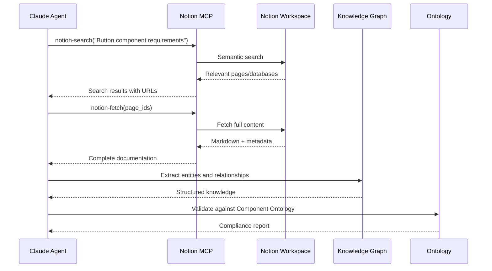

### 3.3 VE-RRR Framework Storage

Platform Foundation Core stores Value Engineering frameworks in Notion databases:

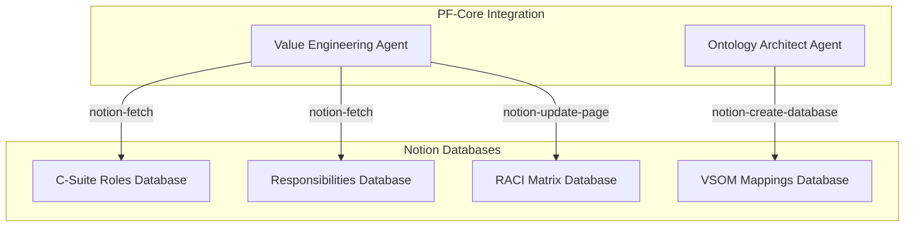

### 3.4 Documentation Synchronization

**Automated Component Documentation:**

```typescript
// Agent synchronizes component metadata to Notion
async function syncComponentDocumentation(component: Component) {
  const notionPage = await notionMCP.notion_create_pages({
    parent: { database_id: "component-registry-db" },
    pages: [{
      properties: {
        "Component Name": component.name,
        "Type": component.type,
        "Status": "Active",
        "Figma Link": component.figmaUrl,
        "Code Location": component.codeConnectSrc
      },
      content: generateMarkdownDoc(component)
    }]
  });
  
  return notionPage;
}
```

---

## 4. Custom MCP Servers

### 4.1 PF-Core Ontology MCP Server

Custom MCP server providing direct access to PF-Core ontologies and validation services.

**Server Capabilities:**

| Tool Name | Function |
|-----------|----------|
| `query_component_ontology` | SPARQL/GraphQL queries against Component Ontology |
| `validate_component` | Validate component against ontology rules |
| `get_token_cascade` | Compute token resolution cascade |
| `get_variant_schema` | Retrieve variant configuration schema |
| `execute_governance_rule` | Run governance validation rules |

### 4.2 Ontology Query Tool Schema

```json
{
  "@context": "https://schema.org",
  "@type": "Action",
  "name": "query_component_ontology",
  "description": "Execute SPARQL queries against Component Ontology",
  "potentialAction": {
    "@type": "SearchAction",
    "query-input": {
      "@type": "PropertyValue",
      "valueName": "sparql_query",
      "description": "SPARQL query string",
      "valueRequired": true
    },
    "target": {
      "@type": "EntryPoint",
      "urlTemplate": "mcp://pf-core/ontology/query"
    }
  },
  "result": {
    "@type": "StructuredValue",
    "name": "QueryResults",
    "additionalProperty": {
      "@type": "PropertyValue",
      "name": "bindings",
      "valueReference": {
        "@type": "ItemList",
        "itemListElement": {
          "@type": "PropertyValue"
        }
      }
    }
  }
}
```

### 4.3 Component Validation Tool

```typescript
// Example: Validate component against ontology
const validationResult = await pfCoreMCP.validate_component({
  component: {
    "@type": "Component",
    "name": "Button",
    "category": "action",
    "variants": ["primary", "secondary"],
    "states": ["default", "hover", "active", "disabled"],
    "anatomy": {
      "container": { "required": true },
      "label": { "required": true },
      "icon": { "required": false }
    }
  },
  rules: [
    "component-naming-convention",
    "required-anatomy-elements",
    "valid-variant-names",
    "state-coverage-minimum"
  ]
});

// Returns:
{
  "valid": true,
  "violations": [],
  "warnings": [
    {
      "rule": "state-coverage-minimum",
      "message": "Consider adding 'loading' state",
      "severity": "low"
    }
  ],
  "conformanceScore": 0.95
}
```

---

## 5. MCP Extraction Workflows

### 5.1 Design-to-Code Generation Workflow

**Complete end-to-end flow from Figma design to production code:**

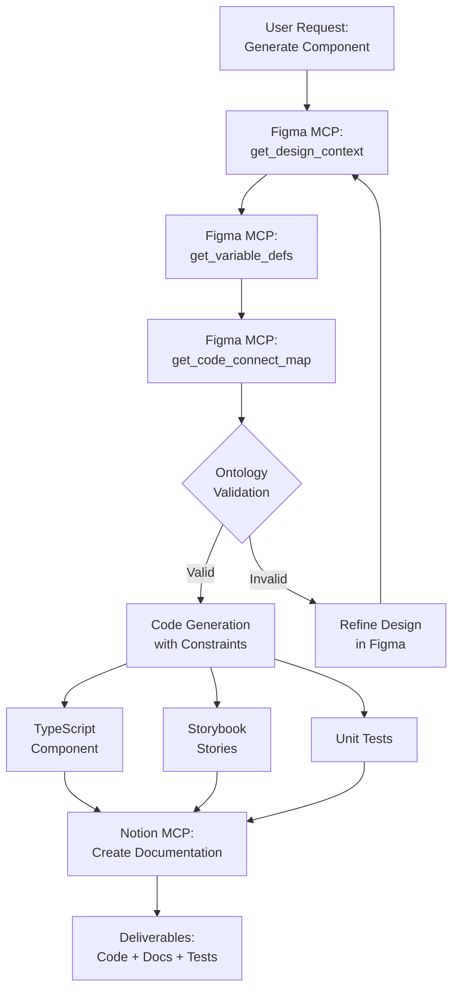

**Agent Code Example:**

```typescript
async function generateComponentFromFigma(
  figmaUrl: string,
  targetPlatform: "baiv" | "air" | "w4m" | "djm"
) {
  // Step 1: Extract Figma context
  const { fileKey, nodeId } = parseFigmaUrl(figmaUrl);
  const designContext = await figmaMCP.get_design_context({
    fileKey,
    nodeId,
    clientLanguages: "typescript",
    clientFrameworks: "react"
  });
  
  // Step 2: Extract tokens
  const tokens = await figmaMCP.get_variable_defs({ fileKey, nodeId });
  
  // Step 3: Check Code Connect
  const codeConnect = await figmaMCP.get_code_connect_map({ fileKey, nodeId });
  
  // Step 4: Validate against ontology
  const validation = await pfCoreMCP.validate_component({
    component: designContext.componentStructure,
    rules: ["all"]
  });
  
  if (!validation.valid) {
    throw new ValidationError(validation.violations);
  }
  
  // Step 5: Resolve token cascade for target platform
  const resolvedTokens = await pfCoreMCP.get_token_cascade({
    platform: targetPlatform,
    tokenRefs: tokens
  });
  
  // Step 6: Generate code
  const componentCode = generateReactComponent({
    structure: designContext.componentStructure,
    tokens: resolvedTokens,
    variant: targetPlatform
  });
  
  // Step 7: Generate tests
  const tests = generateUnitTests(componentCode);
  
  // Step 8: Generate Storybook stories
  const stories = generateStories(componentCode, tokens);
  
  // Step 9: Create Notion documentation
  await notionMCP.notion_create_pages({
    parent: { database_id: "component-registry" },
    pages: [{
      properties: {
        "Component Name": componentCode.name,
        "Platform": targetPlatform,
        "Figma URL": figmaUrl,
        "Status": "Generated"
      },
      content: generateComponentMarkdown(componentCode, validation)
    }]
  });
  
  return {
    code: componentCode,
    tests,
    stories,
    tokens: resolvedTokens,
    validation
  };
}
```

### 5.2 Token Synchronization Workflow

**Bidirectional sync between Figma Variables and PF-Core Token System:**

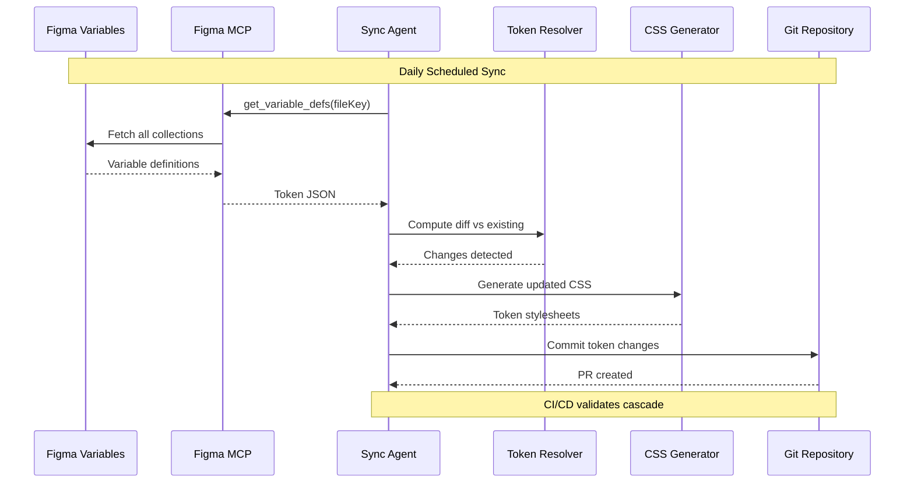

### 5.3 Knowledge Discovery & Gap Analysis Workflow

**Using Notion MCP for automated knowledge discovery:**

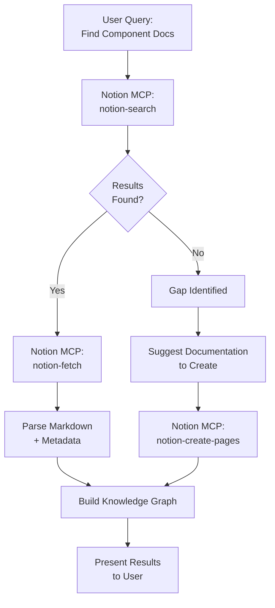

**Agent Implementation:**

```typescript
async function discoverComponentKnowledge(componentName: string) {
  // Search Notion workspace
  const searchResults = await notionMCP.notion_search({
    query: `${componentName} component`,
    query_type: "internal"
  });
  
  if (searchResults.length === 0) {
    // Gap identified - create documentation
    const generatedDocs = await generateComponentDocs(componentName);
    
    await notionMCP.notion_create_pages({
      parent: { page_id: "component-docs-parent" },
      pages: [{
        properties: { "title": `${componentName} Component` },
        content: generatedDocs.markdown
      }]
    });
    
    return { status: "created", docs: generatedDocs };
  }
  
  // Fetch full documentation
  const fullDocs = await Promise.all(
    searchResults.map(result =>
      notionMCP.notion_fetch({ id: result.url })
    )
  );
  
  // Build knowledge graph
  const knowledgeGraph = buildGraphFromDocs(fullDocs);
  
  return { status: "found", docs: fullDocs, graph: knowledgeGraph };
}
```

---

## 6. Agent Orchestration Patterns

### 6.1 Multi-Agent Coordination

**Specialized agents collaborate via MCP servers:**

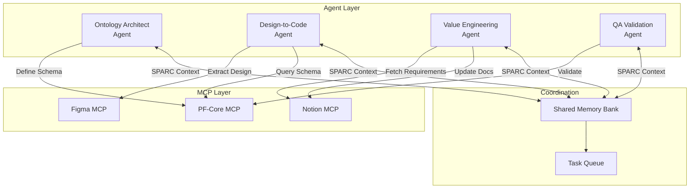

### 6.2 SPARC Framework Integration

**Memory Bank persistence across MCP interactions:**

```typescript
// SPARC Memory Bank schema for MCP workflows
interface SPARCMemoryBank {
  specification: {
    userRequest: string;
    figmaUrl?: string;
    notionDocs?: string[];
    targetPlatform: string;
    requirements: string[];
  };
  
  pseudocode: {
    workflowSteps: string[];
    mcpCalls: MCPCall[];
    dataFlow: DataFlowGraph;
  };
  
  architecture: {
    components: Component[];
    ontologyRules: OntologyRule[];
    tokenMappings: TokenMapping[];
  };
  
  refinement: {
    validationResults: ValidationResult[];
    iterations: Iteration[];
    decisions: Decision[];
  };
  
  completion: {
    deliverables: Deliverable[];
    documentation: string[];
    testResults: TestResult[];
  };
}

// Agent persists context across sessions
async function executeSPARCWorkflow(memoryBank: SPARCMemoryBank) {
  // Specification phase
  memoryBank.specification = await gatherRequirements();
  
  // Pseudocode phase
  memoryBank.pseudocode = await planMCPWorkflow(
    memoryBank.specification
  );
  
  // Architecture phase
  memoryBank.architecture = await extractDesignContext(
    memoryBank.pseudocode.mcpCalls
  );
  
  // Refinement phase
  memoryBank.refinement = await validateAndRefine(
    memoryBank.architecture
  );
  
  // Completion phase
  memoryBank.completion = await generateDeliverables(
    memoryBank.refinement
  );
  
  // Persist to Notion for team visibility
  await notionMCP.notion_create_pages({
    parent: { database_id: "sparc-memory-bank" },
    pages: [{
      properties: {
        "Workflow ID": memoryBank.id,
        "Status": "Complete"
      },
      content: serializeSPARCMemoryBank(memoryBank)
    }]
  });
  
  return memoryBank;
}
```

### 6.3 BMAD Method for Planning

**Breaking down complex MCP workflows using BMAD:**

```mermaid
flowchart LR
    subgraph "BMAD Analyst Agent"
        A1[Analyze User Request]
        A2[Identify MCP Tools Needed]
        A3[Create Document Shards]
    end
    
    subgraph "BMAD PM Agent"
        PM1[Prioritize Extraction Tasks]
        PM2[Define Dependencies]
        PM3[Create Task Breakdown]
    end
    
    subgraph "BMAD Architect Agent"
        AR1[Design Data Flow]
        AR2[Define Schemas]
        AR3[Plan Validation Steps]
    end
    
    A1 --> A2 --> A3
    A3 --> PM1 --> PM2 --> PM3
    PM3 --> AR1 --> AR2 --> AR3
    
    AR3 --> EXEC[Execute SPARC Workflow]
```

**Document Sharding for Large Ontologies:**

```typescript
// BMAD document sharding for token ontology (90% token savings)
async function shardTokenOntology(fullOntology: TokenOntology) {
  const shards = {
    primitive: extractPrimitiveTokens(fullOntology),
    semantic: extractSemanticTokens(fullOntology),
    component: extractComponentTokens(fullOntology),
    platform: extractPlatformTokens(fullOntology)
  };
  
  // Store shards in Notion
  for (const [shardType, shardData] of Object.entries(shards)) {
    await notionMCP.notion_create_pages({
      parent: { database_id: "ontology-shards" },
      pages: [{
        properties: {
          "Shard Type": shardType,
          "Size": JSON.stringify(shardData).length
        },
        content: `# ${shardType} Token Shard\n\n${formatTokenShard(shardData)}`
      }]
    });
  }
  
  return shards;
}
```

---

## 7. Data Flow & Synchronization

### 7.1 Real-Time Synchronization Architecture

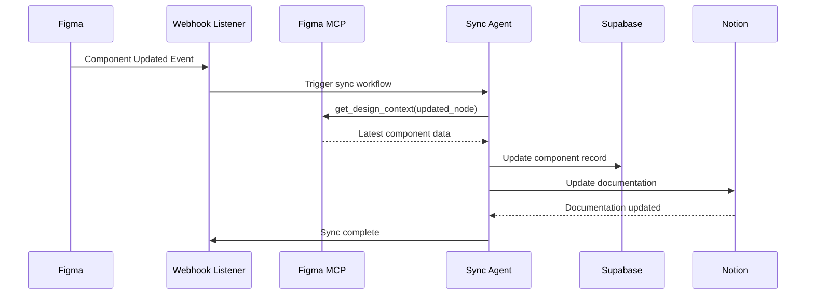

### 7.2 Caching Strategy

**Minimize MCP calls with intelligent caching:**

```typescript
interface MCPCache {
  designContext: Map<string, { data: any; timestamp: Date }>;
  tokens: Map<string, { data: any; timestamp: Date }>;
  codeConnect: Map<string, { data: any; timestamp: Date }>;
}

const CACHE_TTL = {
  designContext: 60 * 60 * 1000, // 1 hour
  tokens: 24 * 60 * 60 * 1000,   // 24 hours
  codeConnect: 7 * 24 * 60 * 60 * 1000 // 7 days
};

async function getCachedDesignContext(
  fileKey: string,
  nodeId: string,
  cache: MCPCache
) {
  const cacheKey = `${fileKey}:${nodeId}`;
  const cached = cache.designContext.get(cacheKey);
  
  if (cached && Date.now() - cached.timestamp.getTime() < CACHE_TTL.designContext) {
    return cached.data;
  }
  
  // Cache miss - fetch from MCP
  const data = await figmaMCP.get_design_context({ fileKey, nodeId });
  cache.designContext.set(cacheKey, { data, timestamp: new Date() });
  
  return data;
}
```

### 7.3 Batch Processing

**Optimize MCP calls with batch operations:**

```typescript
async function batchExtractComponents(figmaNodes: FigmaNode[]) {
  // Group by file for efficient extraction
  const nodesByFile = groupBy(figmaNodes, 'fileKey');
  
  const results = await Promise.all(
    Object.entries(nodesByFile).map(async ([fileKey, nodes]) => {
      // Single MCP call for metadata
      const metadata = await figmaMCP.get_metadata({
        fileKey,
        nodeId: nodes[0].pageId
      });
      
      // Batch extract design context for all nodes
      const contexts = await Promise.all(
        nodes.map(node =>
          figmaMCP.get_design_context({
            fileKey,
            nodeId: node.id
          })
        )
      );
      
      return { fileKey, metadata, contexts };
    })
  );
  
  return results.flat();
}
```

---

## 8. Security & Governance

### 8.1 Authentication & Authorization

**MCP server authentication patterns:**

```typescript
// Figma MCP uses OAuth tokens
const figmaAuth = {
  type: "oauth",
  token: process.env.FIGMA_ACCESS_TOKEN,
  scopes: ["files:read", "variables:read"]
};

// Notion MCP uses integration tokens
const notionAuth = {
  type: "integration",
  token: process.env.NOTION_INTEGRATION_TOKEN,
  workspace_id: process.env.NOTION_WORKSPACE_ID
};

// Custom PF-Core MCP uses API keys with RBAC
const pfCoreAuth = {
  type: "api_key",
  key: process.env.PF_CORE_API_KEY,
  role: "architect" // analyst | pm | architect | developer
};
```

### 8.2 Rate Limiting & Quotas

```typescript
interface RateLimitConfig {
  figma: {
    requestsPerMinute: 60;
    burstLimit: 10;
  };
  notion: {
    requestsPerSecond: 3;
    burstLimit: 5;
  };
  pfCore: {
    requestsPerMinute: 100;
    burstLimit: 20;
  };
}

class MCPRateLimiter {
  private queues: Map<string, Queue> = new Map();
  
  async execute<T>(
    server: "figma" | "notion" | "pfCore",
    operation: () => Promise<T>
  ): Promise<T> {
    const queue = this.getQueue(server);
    return queue.add(operation);
  }
  
  private getQueue(server: string): Queue {
    if (!this.queues.has(server)) {
      const config = RateLimitConfig[server];
      this.queues.set(
        server,
        new Queue({
          concurrent: config.burstLimit,
          interval: 60000 / config.requestsPerMinute
        })
      );
    }
    return this.queues.get(server)!;
  }
}
```

### 8.3 Audit Logging

**Comprehensive MCP interaction logging:**

```typescript
interface MCPAuditLog {
  "@context": "https://schema.org",
  "@type": "Action",
  "timestamp": string;
  "agent": {
    "@type": "SoftwareAgent",
    "name": string;
    "version": string;
  };
  "server": string;
  "tool": string;
  "parameters": object;
  "result": {
    "status": "success" | "error";
    "duration": number;
    "dataSize": number;
  };
  "user": {
    "@type": "Person",
    "identifier": string;
  };
}

async function logMCPInteraction(log: MCPAuditLog) {
  // Store in Supabase for compliance
  await supabase.from("mcp_audit_logs").insert(log);
  
  // Also log to Notion for team visibility
  await notionMCP.notion_create_pages({
    parent: { database_id: "mcp-audit-db" },
    pages: [{
      properties: {
        "Timestamp": log.timestamp,
        "Agent": log.agent.name,
        "Server": log.server,
        "Tool": log.tool,
        "Status": log.result.status
      },
      content: `\`\`\`json\n${JSON.stringify(log, null, 2)}\n\`\`\``
    }]
  });
}
```

### 8.4 Data Privacy & Compliance

**GDPR/SOC2 compliance for MCP data:**

```typescript
interface DataGovernancePolicy {
  retention: {
    designContext: "90 days";
    tokens: "indefinite";
    auditLogs: "7 years";
  };
  
  piiDetection: {
    enabled: true;
    redactInLogs: true;
    alertOnDetection: true;
  };
  
  encryption: {
    atRest: "AES-256";
    inTransit: "TLS 1.3";
  };
  
  accessControl: {
    rbac: true;
    mfa: true;
    ipWhitelist: string[];
  };
}

async function sanitizeMCPData(data: any): Promise<any> {
  // Detect and redact PII
  const piiPatterns = [
    /\b\d{3}-\d{2}-\d{4}\b/g, // SSN
    /\b[\w.-]+@[\w.-]+\.\w+\b/g, // Email
    // ... more patterns
  ];
  
  let sanitized = JSON.stringify(data);
  
  for (const pattern of piiPatterns) {
    sanitized = sanitized.replace(pattern, "[REDACTED]");
  }
  
  return JSON.parse(sanitized);
}
```

---

## 9. Implementation Checklist

### 9.1 Figma MCP Setup

- [ ] Install Figma MCP server
- [ ] Configure OAuth authentication
- [ ] Test `get_design_context` on sample components
- [ ] Test `get_variable_defs` on token collections
- [ ] Set up Code Connect mappings
- [ ] Implement caching layer
- [ ] Configure rate limiting
- [ ] Set up audit logging

### 9.2 Notion MCP Setup

- [ ] Install Notion MCP server
- [ ] Create integration token
- [ ] Configure workspace access
- [ ] Test semantic search
- [ ] Set up VE-RRR databases
- [ ] Implement documentation sync
- [ ] Configure SPARC Memory Bank storage

### 9.3 Custom PF-Core MCP

- [ ] Design ontology query API
- [ ] Implement SPARQL endpoint
- [ ] Create validation service
- [ ] Build token cascade resolver
- [ ] Set up RBAC
- [ ] Implement API key authentication
- [ ] Deploy MCP server
- [ ] Create agent SDK integration

### 9.4 Agent Orchestration

- [ ] Define agent roles (OAA, DTC, VEA, QAA)
- [ ] Implement SPARC workflow engine
- [ ] Set up BMAD planning agents
- [ ] Configure shared Memory Bank
- [ ] Implement task queue
- [ ] Create agent coordination protocols
- [ ] Test multi-agent scenarios

---

## 10. Next Steps

This document provides the foundation for MCP integration. Proceed to:

- **Section 08:** Code Generation Patterns & Templates
- **Section 09:** Agent SDK Integration & Deployment

---

**End of Section 07**
