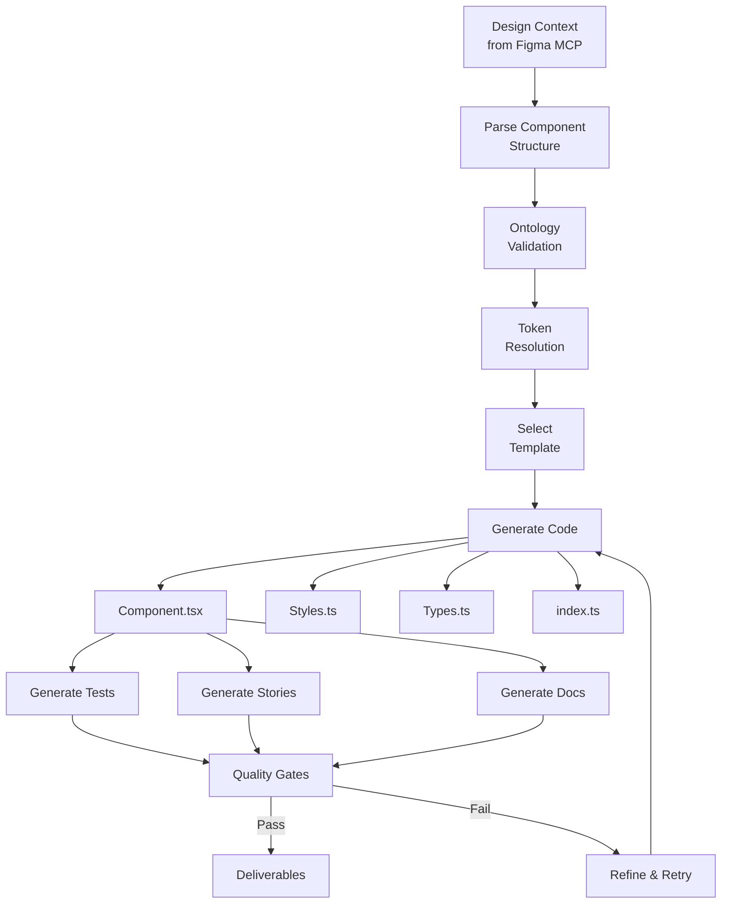

# PFC-PFI-BAIV-F2C Section 08: Code Generation Patterns & Templates

**Document Reference:** `pfc-pfi-baiv-f2c-08-code-generation-patterns.md`  
**Phase:** 4 - MCP & Production  
**Version:** 1.0.0  
**Last Updated:** 2025-01-03  
**Schema Base:** schema.org + Custom Extensions

---

## Document Overview

This document defines code generation patterns, templates, and agent-driven workflows for Platform Foundation Core (PF-Core), enabling consistent, ontology-compliant component generation across all platform variants (BAIV, AIR, W4M, DJM).

---

## Table of Contents

1. [Code Generation Architecture](#1-code-generation-architecture)
2. [Component Generation Patterns](#2-component-generation-patterns)
3. [Token Resolution & CSS Generation](#3-token-resolution--css-generation)
4. [Template Library](#4-template-library)
5. [Agent-Driven Generation Workflows](#5-agent-driven-generation-workflows)
6. [Test Generation Patterns](#6-test-generation-patterns)
7. [Documentation Generation](#7-documentation-generation)
8. [Quality Assurance & Validation](#8-quality-assurance--validation)

---

## 1. Code Generation Architecture

### 1.1 Generation Pipeline Overview



### 1.2 Code Generation Principles

**Ontology-Centric Generation:**
- Every component MUST conform to Component Ontology
- Token references MUST be resolvable through cascade
- Variant structure MUST match platform schema
- Anatomy MUST include all required elements

**Platform-Specific Adaptation:**
- Base components from PF-Core
- Platform Instance overrides (BAIV, AIR, W4M, DJM)
- Client whitelabel customization
- Functional enhancement layer

**Quality & Consistency:**
- TypeScript for type safety
- ESLint + Prettier compliance
- Automated test coverage >80%
- Storybook stories for all variants
- Complete JSDoc documentation

### 1.3 File Structure Pattern

```
components/
└── Button/
    ├── Button.tsx              # Main component implementation
    ├── Button.types.ts         # TypeScript interfaces
    ├── Button.styles.ts        # Token-based styling
    ├── Button.test.tsx         # Unit + integration tests
    ├── Button.stories.tsx      # Storybook stories
    ├── Button.ontology.json    # Ontology metadata
    ├── index.ts                # Public API exports
    └── README.md               # Component documentation
```

---

## 2. Component Generation Patterns

### 2.1 Base Component Template

```typescript
/**
 * @component Button
 * @category action
 * @ontology ComponentOntology#Button
 * @platform pf-core
 * @version 1.0.0
 */

import React, { forwardRef } from 'react';
import { ButtonProps, ButtonVariant, ButtonSize } from './Button.types';
import { useButtonStyles } from './Button.styles';
import { useComponentTracking } from '@pf-core/analytics';

/**
 * Button component following PF-Core Component Ontology
 * 
 * @example
 * ```tsx
 * <Button variant="primary" size="medium" onClick={handleClick}>
 *   Click Me
 * </Button>
 * ```
 */
export const Button = forwardRef<HTMLButtonElement, ButtonProps>(
  (
    {
      children,
      variant = 'primary',
      size = 'medium',
      disabled = false,
      loading = false,
      iconLeft,
      iconRight,
      fullWidth = false,
      className,
      onClick,
      ...restProps
    },
    ref
  ) => {
    // Analytics tracking
    const { track } = useComponentTracking('Button');
    
    // Compute styles from tokens
    const styles = useButtonStyles({ variant, size, disabled, loading });
    
    // Handle click with tracking
    const handleClick = (event: React.MouseEvent<HTMLButtonElement>) => {
      if (!disabled && !loading) {
        track('click', { variant, size });
        onClick?.(event);
      }
    };
    
    // Render anatomy per ontology
    return (
      <button
        ref={ref}
        className={`pf-button ${className || ''}`}
        css={styles.container}
        disabled={disabled || loading}
        onClick={handleClick}
        data-variant={variant}
        data-size={size}
        data-testid="pf-button"
        {...restProps}
      >
        {/* Icon Left (optional anatomy) */}
        {iconLeft && (
          <span css={styles.iconLeft} data-testid="pf-button-icon-left">
            {iconLeft}
          </span>
        )}
        
        {/* Label (required anatomy) */}
        <span css={styles.label} data-testid="pf-button-label">
          {loading ? 'Loading...' : children}
        </span>
        
        {/* Icon Right (optional anatomy) */}
        {iconRight && (
          <span css={styles.iconRight} data-testid="pf-button-icon-right">
            {iconRight}
          </span>
        )}
        
        {/* Loading Indicator (conditional anatomy) */}
        {loading && (
          <span css={styles.loadingIndicator} data-testid="pf-button-loading">
            <LoadingSpinner size={size} />
          </span>
        )}
      </button>
    );
  }
);

Button.displayName = 'Button';
```

### 2.2 TypeScript Types Template

```typescript
/**
 * @file Button.types.ts
 * @description Type definitions for Button component
 */

import { ComponentPropsWithRef } from 'react';

/**
 * Button variants per Component Ontology
 * @see ComponentOntology#Button.variants
 */
export type ButtonVariant =
  | 'primary'
  | 'secondary'
  | 'tertiary'
  | 'danger'
  | 'ghost'
  | 'link';

/**
 * Button sizes per Component Ontology
 * @see ComponentOntology#Button.sizes
 */
export type ButtonSize = 'small' | 'medium' | 'large';

/**
 * Button states per Component Ontology
 * @see ComponentOntology#Button.states
 */
export type ButtonState =
  | 'default'
  | 'hover'
  | 'active'
  | 'focus'
  | 'disabled'
  | 'loading';

/**
 * Button anatomy per Component Ontology
 * @see ComponentOntology#Button.anatomy
 */
export interface ButtonAnatomy {
  /** Container element (required) */
  container: React.ComponentType;
  /** Text label (required) */
  label: React.ComponentType;
  /** Left icon (optional) */
  iconLeft?: React.ComponentType;
  /** Right icon (optional) */
  iconRight?: React.ComponentType;
  /** Loading indicator (conditional) */
  loadingIndicator?: React.ComponentType;
}

/**
 * Button component props
 */
export interface ButtonProps extends ComponentPropsWithRef<'button'> {
  /** Visual variant */
  variant?: ButtonVariant;
  /** Size variation */
  size?: ButtonSize;
  /** Disabled state */
  disabled?: boolean;
  /** Loading state */
  loading?: boolean;
  /** Icon to display on left */
  iconLeft?: React.ReactNode;
  /** Icon to display on right */
  iconRight?: React.ReactNode;
  /** Full width button */
  fullWidth?: boolean;
  /** Button content */
  children: React.ReactNode;
}

/**
 * Ontology metadata schema
 */
export interface ButtonOntology {
  '@context': 'https://schema.org';
  '@type': 'Component';
  '@id': 'ComponentOntology#Button';
  name: 'Button';
  category: 'action';
  variants: ButtonVariant[];
  sizes: ButtonSize[];
  states: ButtonState[];
  anatomy: ButtonAnatomy;
  tokens: {
    primitive: string[];
    semantic: string[];
    component: string[];
  };
  validation: {
    required: string[];
    optional: string[];
    conditional: string[];
  };
}
```

### 2.3 Token-Based Styling Template

```typescript
/**
 * @file Button.styles.ts
 * @description Token-based styling using CSS-in-JS
 */

import { css } from '@emotion/react';
import { useTokenResolver } from '@pf-core/tokens';
import { ButtonVariant, ButtonSize } from './Button.types';

interface StyleProps {
  variant: ButtonVariant;
  size: ButtonSize;
  disabled: boolean;
  loading: boolean;
}

export function useButtonStyles({ variant, size, disabled, loading }: StyleProps) {
  // Resolve tokens through cascade
  const tokens = useTokenResolver({
    component: 'Button',
    variant,
    size,
    state: disabled ? 'disabled' : loading ? 'loading' : 'default'
  });
  
  return {
    container: css`
      /* Layout */
      display: inline-flex;
      align-items: center;
      justify-content: center;
      gap: ${tokens.get('component.button.gap')};
      
      /* Spacing */
      padding: ${tokens.get('component.button.padding.y')} 
               ${tokens.get('component.button.padding.x')};
      min-height: ${tokens.get('component.button.minHeight')};
      
      /* Typography */
      font-family: ${tokens.get('semantic.font.family.sans')};
      font-size: ${tokens.get('component.button.fontSize')};
      font-weight: ${tokens.get('component.button.fontWeight')};
      line-height: ${tokens.get('component.button.lineHeight')};
      
      /* Visual */
      background-color: ${tokens.get('component.button.background')};
      color: ${tokens.get('component.button.color')};
      border: ${tokens.get('component.button.border.width')} solid 
              ${tokens.get('component.button.border.color')};
      border-radius: ${tokens.get('component.button.borderRadius')};
      
      /* Shadow */
      box-shadow: ${tokens.get('component.button.shadow')};
      
      /* Transition */
      transition: all ${tokens.get('semantic.animation.duration.fast')} 
                  ${tokens.get('semantic.animation.easing.easeInOut')};
      
      /* Interaction */
      cursor: ${disabled || loading ? 'not-allowed' : 'pointer'};
      user-select: none;
      
      /* States */
      &:hover:not(:disabled) {
        background-color: ${tokens.get('component.button.background', 'hover')};
        border-color: ${tokens.get('component.button.border.color', 'hover')};
        transform: ${tokens.get('component.button.transform', 'hover')};
      }
      
      &:active:not(:disabled) {
        background-color: ${tokens.get('component.button.background', 'active')};
        transform: ${tokens.get('component.button.transform', 'active')};
      }
      
      &:focus-visible {
        outline: ${tokens.get('semantic.focus.width')} solid 
                 ${tokens.get('semantic.focus.color')};
        outline-offset: ${tokens.get('semantic.focus.offset')};
      }
      
      &:disabled {
        opacity: ${tokens.get('semantic.opacity.disabled')};
      }
    `,
    
    label: css`
      /* Prevent text selection during click */
      pointer-events: none;
      
      /* Ensure proper alignment */
      display: inline-flex;
      align-items: center;
    `,
    
    iconLeft: css`
      display: inline-flex;
      margin-right: ${tokens.get('component.button.icon.gap')};
    `,
    
    iconRight: css`
      display: inline-flex;
      margin-left: ${tokens.get('component.button.icon.gap')};
    `,
    
    loadingIndicator: css`
      position: absolute;
      inset: 0;
      display: flex;
      align-items: center;
      justify-content: center;
      background-color: ${tokens.get('component.button.background')};
    `
  };
}
```

### 2.4 Platform Variant Generation

**BAIV Platform Button Variant:**

```typescript
/**
 * @component ButtonBAIV
 * @extends Button
 * @platform baiv
 * @description BAIV-specific Button with enhanced analytics
 */

import React, { forwardRef } from 'react';
import { Button } from '@pf-core/components';
import { ButtonProps } from '@pf-core/components/Button/Button.types';
import { useBAIVAnalytics } from '@baiv/analytics';
import { useBAIVTokens } from '@baiv/tokens';

export const ButtonBAIV = forwardRef<HTMLButtonElement, ButtonProps>(
  (props, ref) => {
    // BAIV-specific analytics
    const { trackBAIVEvent } = useBAIVAnalytics();
    
    // Override tokens with BAIV values
    const baivTokens = useBAIVTokens();
    
    const handleClick = (event: React.MouseEvent<HTMLButtonElement>) => {
      trackBAIVEvent('button_click', {
        variant: props.variant,
        context: 'baiv_platform'
      });
      
      props.onClick?.(event);
    };
    
    return (
      <Button
        ref={ref}
        {...props}
        onClick={handleClick}
        data-platform="baiv"
      />
    );
  }
);

ButtonBAIV.displayName = 'ButtonBAIV';
```

---

## 3. Token Resolution & CSS Generation

### 3.1 Token Cascade Resolution

```typescript
/**
 * Token Resolution Engine
 * Resolves tokens through 4-tier cascade: Primitive → Semantic → Component → Platform
 */

interface TokenResolutionContext {
  component: string;
  variant?: string;
  size?: string;
  state?: string;
  platform?: string;
}

export class TokenResolver {
  private primitiveTokens: Map<string, any>;
  private semanticTokens: Map<string, any>;
  private componentTokens: Map<string, any>;
  private platformTokens: Map<string, any>;
  
  constructor(
    primitiveTokens: TokenDefinitions,
    semanticTokens: TokenDefinitions,
    componentTokens: TokenDefinitions,
    platformTokens: TokenDefinitions
  ) {
    this.primitiveTokens = new Map(Object.entries(primitiveTokens));
    this.semanticTokens = new Map(Object.entries(semanticTokens));
    this.componentTokens = new Map(Object.entries(componentTokens));
    this.platformTokens = new Map(Object.entries(platformTokens));
  }
  
  /**
   * Resolve token with full cascade
   * Priority: Platform > Component > Semantic > Primitive
   */
  resolve(
    tokenPath: string,
    context: TokenResolutionContext
  ): string {
    // Build fully qualified token path
    const fullPath = this.buildTokenPath(tokenPath, context);
    
    // Try platform override first
    if (context.platform) {
      const platformValue = this.platformTokens.get(
        `${context.platform}.${fullPath}`
      );
      if (platformValue) return this.resolveReference(platformValue);
    }
    
    // Try component token
    const componentValue = this.componentTokens.get(fullPath);
    if (componentValue) return this.resolveReference(componentValue);
    
    // Try semantic token
    const semanticValue = this.semanticTokens.get(fullPath);
    if (semanticValue) return this.resolveReference(semanticValue);
    
    // Fall back to primitive
    const primitiveValue = this.primitiveTokens.get(fullPath);
    if (primitiveValue) return primitiveValue;
    
    // Token not found - log warning and return fallback
    console.warn(`Token not found: ${fullPath}`);
    return this.getFallbackValue(tokenPath);
  }
  
  /**
   * Resolve token references (e.g., {semantic.color.primary})
   */
  private resolveReference(value: any): string {
    if (typeof value !== 'string') return value;
    
    const referenceMatch = value.match(/^\{(.+)\}$/);
    if (!referenceMatch) return value;
    
    const referencePath = referenceMatch[1];
    return this.resolve(referencePath, {});
  }
  
  /**
   * Build token path with context
   */
  private buildTokenPath(
    tokenPath: string,
    context: TokenResolutionContext
  ): string {
    const parts = [tokenPath];
    
    if (context.variant) parts.push(context.variant);
    if (context.size) parts.push(context.size);
    if (context.state) parts.push(context.state);
    
    return parts.join('.');
  }
  
  /**
   * Fallback values for critical tokens
   */
  private getFallbackValue(tokenPath: string): string {
    const fallbacks: Record<string, string> = {
      'color': '#000000',
      'background': '#ffffff',
      'spacing': '0px',
      'fontSize': '16px',
      'fontWeight': '400',
      'borderRadius': '0px'
    };
    
    for (const [key, value] of Object.entries(fallbacks)) {
      if (tokenPath.includes(key)) return value;
    }
    
    return 'inherit';
  }
}
```

### 3.2 CSS Custom Properties Generation

```typescript
/**
 * Generate CSS custom properties from token cascade
 */

export function generateCSSCustomProperties(
  tokens: TokenDefinitions,
  platform?: string
): string {
  const lines: string[] = [':root {'];
  
  // Sort tokens for consistent output
  const sortedTokens = Object.entries(tokens).sort(([a], [b]) => 
    a.localeCompare(b)
  );
  
  for (const [tokenPath, value] of sortedTokens) {
    const cssVarName = `--${tokenPath.replace(/\./g, '-')}`;
    const resolvedValue = resolveTokenValue(value, tokens);
    
    lines.push(`  ${cssVarName}: ${resolvedValue};`);
  }
  
  lines.push('}');
  
  return lines.join('\n');
}

/**
 * Example output:
 * 
 * :root {
 *   --primitive-color-blue-500: #3b82f6;
 *   --semantic-color-primary: var(--primitive-color-blue-500);
 *   --component-button-background: var(--semantic-color-primary);
 *   --baiv-component-button-background: #1e40af;
 * }
 */
```

### 3.3 Token Documentation Generation

```typescript
/**
 * Generate token documentation in Markdown
 */

export function generateTokenDocumentation(
  tokens: TokenDefinitions,
  tier: 'primitive' | 'semantic' | 'component' | 'platform'
): string {
  const doc: string[] = [
    `# ${tier.toUpperCase()} Tokens`,
    '',
    `Generated: ${new Date().toISOString()}`,
    '',
    '## Token Reference',
    ''
  ];
  
  // Group tokens by category
  const grouped = groupTokensByCategory(tokens);
  
  for (const [category, categoryTokens] of Object.entries(grouped)) {
    doc.push(`### ${category}`);
    doc.push('');
    doc.push('| Token | Value | Reference |');
    doc.push('|-------|-------|-----------|');
    
    for (const [path, value] of Object.entries(categoryTokens)) {
      const resolved = resolveTokenValue(value, tokens);
      const reference = value !== resolved ? value : '-';
      doc.push(`| \`${path}\` | \`${resolved}\` | \`${reference}\` |`);
    }
    
    doc.push('');
  }
  
  return doc.join('\n');
}
```

---

## 4. Template Library

### 4.1 Available Templates

| Template | Purpose | Output Files |
|----------|---------|--------------|
| `component-base` | Base component structure | .tsx, .types.ts, .styles.ts, index.ts |
| `component-platform` | Platform-specific variant | .tsx, .types.ts |
| `component-composite` | Composite component | .tsx, .types.ts, .context.tsx |
| `token-definition` | Token schema | .json, .ts, .css |
| `ontology-schema` | Ontology definition | .json, .ttl, .md |
| `test-suite` | Comprehensive tests | .test.tsx, .spec.ts |
| `storybook-stories` | Storybook documentation | .stories.tsx |
| `documentation` | Component docs | README.md, API.md |

### 4.2 Template Selection Logic

```typescript
export function selectTemplate(
  componentType: string,
  platform?: string,
  complexity?: 'simple' | 'complex' | 'composite'
): TemplateConfig {
  // Platform variant takes precedence
  if (platform && platform !== 'pf-core') {
    return {
      template: 'component-platform',
      baseTemplate: 'component-base',
      extends: '@pf-core/components'
    };
  }
  
  // Composite components
  if (complexity === 'composite') {
    return {
      template: 'component-composite',
      includeContext: true,
      includeHooks: true
    };
  }
  
  // Default base component
  return {
    template: 'component-base',
    includeAllFiles: true
  };
}
```

### 4.3 Template Variables

```typescript
interface TemplateVariables {
  // Component metadata
  componentName: string;
  componentCategory: string;
  componentDescription: string;
  
  // Platform context
  platform: 'pf-core' | 'baiv' | 'air' | 'w4m' | 'djm';
  platformVersion: string;
  
  // Ontology data
  variants: string[];
  sizes: string[];
  states: string[];
  anatomy: Record<string, AnatomyElement>;
  
  // Token mappings
  primitiveTokens: string[];
  semanticTokens: string[];
  componentTokens: string[];
  
  // Generation metadata
  generatedAt: string;
  generatedBy: string;
  sourceDesignUrl?: string;
  
  // Validation rules
  requiredProps: string[];
  optionalProps: string[];
  conditionalProps: string[];
}
```

---

## 5. Agent-Driven Generation Workflows

### 5.1 Design-to-Code Agent Workflow

```typescript
/**
 * Design-to-Code Agent
 * Orchestrates complete component generation from Figma to production code
 */

export class DesignToCodeAgent {
  private figmaMCP: FigmaMCPClient;
  private pfCoreMCP: PFCoreMCPClient;
  private notionMCP: NotionMCPClient;
  private templateEngine: TemplateEngine;
  private validator: ComponentValidator;
  
  async generateComponent(
    figmaUrl: string,
    targetPlatform: string
  ): Promise<GenerationResult> {
    // SPARC: Specification Phase
    const spec = await this.createSpecification(figmaUrl, targetPlatform);
    
    // SPARC: Pseudocode Phase
    const plan = await this.planGeneration(spec);
    
    // SPARC: Architecture Phase
    const architecture = await this.designArchitecture(plan);
    
    // SPARC: Refinement Phase
    const refined = await this.refineAndValidate(architecture);
    
    // SPARC: Completion Phase
    const result = await this.generateDeliverables(refined);
    
    return result;
  }
  
  /**
   * SPARC Phase 1: Specification
   */
  private async createSpecification(
    figmaUrl: string,
    targetPlatform: string
  ): Promise<ComponentSpecification> {
    const { fileKey, nodeId } = parseFigmaUrl(figmaUrl);
    
    // Extract design context
    const designContext = await this.figmaMCP.get_design_context({
      fileKey,
      nodeId,
      clientLanguages: 'typescript',
      clientFrameworks: 'react'
    });
    
    // Extract tokens
    const tokens = await this.figmaMCP.get_variable_defs({
      fileKey,
      nodeId
    });
    
    // Check for Code Connect
    const codeConnect = await this.figmaMCP.get_code_connect_map({
      fileKey,
      nodeId
    });
    
    // Search for existing documentation
    const docs = await this.notionMCP.notion_search({
      query: `${designContext.name} component`,
      query_type: 'internal'
    });
    
    return {
      name: designContext.name,
      category: inferCategory(designContext),
      variants: designContext.variants,
      states: designContext.states,
      anatomy: designContext.anatomy,
      tokens,
      codeConnect,
      existingDocs: docs,
      platform: targetPlatform,
      figmaUrl
    };
  }
  
  /**
   * SPARC Phase 2: Pseudocode
   */
  private async planGeneration(
    spec: ComponentSpecification
  ): Promise<GenerationPlan> {
    return {
      steps: [
        'Validate component against ontology',
        'Resolve token cascade for platform',
        'Select appropriate templates',
        'Generate component files',
        'Generate test suite',
        'Generate Storybook stories',
        'Generate documentation',
        'Run quality gates'
      ],
      validations: [
        'Ontology conformance',
        'Token resolution',
        'TypeScript compilation',
        'ESLint compliance',
        'Test coverage >80%'
      ],
      outputs: [
        'Component.tsx',
        'Component.types.ts',
        'Component.styles.ts',
        'Component.test.tsx',
        'Component.stories.tsx',
        'README.md'
      ]
    };
  }
  
  /**
   * SPARC Phase 3: Architecture
   */
  private async designArchitecture(
    plan: GenerationPlan
  ): Promise<ComponentArchitecture> {
    // Validate against ontology
    const validation = await this.pfCoreMCP.validate_component({
      component: plan.specification.anatomy,
      rules: ['all']
    });
    
    if (!validation.valid) {
      throw new ValidationError(validation.violations);
    }
    
    // Resolve tokens
    const resolvedTokens = await this.pfCoreMCP.get_token_cascade({
      platform: plan.specification.platform,
      tokenRefs: plan.specification.tokens
    });
    
    // Select templates
    const templates = this.selectTemplates(plan.specification);
    
    return {
      validation,
      resolvedTokens,
      templates,
      fileStructure: this.planFileStructure(plan.specification)
    };
  }
  
  /**
   * SPARC Phase 4: Refinement
   */
  private async refineAndValidate(
    architecture: ComponentArchitecture
  ): Promise<RefinedArchitecture> {
    const iterations: Iteration[] = [];
    let currentIteration = 0;
    let isValid = false;
    
    while (!isValid && currentIteration < 3) {
      // Generate code
      const generatedCode = await this.generateCodeFromArchitecture(architecture);
      
      // Run validators
      const validationResults = await this.validator.validateAll(generatedCode);
      
      isValid = validationResults.every(r => r.passed);
      
      if (!isValid) {
        // Refine architecture based on failures
        architecture = await this.refineArchitecture(
          architecture,
          validationResults
        );
      }
      
      iterations.push({
        number: currentIteration,
        valid: isValid,
        results: validationResults
      });
      
      currentIteration++;
    }
    
    if (!isValid) {
      throw new Error('Failed to generate valid component after 3 iterations');
    }
    
    return {
      architecture,
      iterations,
      finalValidation: iterations[iterations.length - 1].results
    };
  }
  
  /**
   * SPARC Phase 5: Completion
   */
  private async generateDeliverables(
    refined: RefinedArchitecture
  ): Promise<GenerationResult> {
    // Generate all files
    const files = await this.generateAllFiles(refined.architecture);
    
    // Generate tests
    const tests = await this.generateTests(files.component);
    
    // Generate stories
    const stories = await this.generateStories(files.component);
    
    // Generate documentation
    const docs = await this.generateDocumentation(files.component);
    
    // Create Notion documentation
    await this.notionMCP.notion_create_pages({
      parent: { database_id: 'component-registry' },
      pages: [{
        properties: {
          'Component Name': files.component.name,
          'Platform': files.component.platform,
          'Status': 'Generated',
          'Figma URL': files.component.figmaUrl
        },
        content: docs.markdown
      }]
    });
    
    return {
      files,
      tests,
      stories,
      docs,
      validation: refined.finalValidation,
      metadata: {
        generatedAt: new Date().toISOString(),
        platform: files.component.platform,
        iterations: refined.iterations.length
      }
    };
  }
}
```

### 5.2 Batch Generation Workflow

```typescript
/**
 * Batch generate components from Figma file
 */

export async function batchGenerateComponents(
  figmaFileKey: string,
  targetPlatform: string
): Promise<BatchGenerationResult> {
  const agent = new DesignToCodeAgent();
  
  // Get file metadata
  const metadata = await figmaMCP.get_metadata({
    fileKey: figmaFileKey,
    nodeId: '0:1' // Root page
  });
  
  // Extract all component nodes
  const componentNodes = extractComponentNodes(metadata);
  
  // Generate in parallel (with rate limiting)
  const results = await Promise.allSettled(
    componentNodes.map(async (node) => {
      const figmaUrl = `https://figma.com/design/${figmaFileKey}?node-id=${node.id}`;
      return agent.generateComponent(figmaUrl, targetPlatform);
    })
  );
  
  // Aggregate results
  const successful = results.filter(r => r.status === 'fulfilled');
  const failed = results.filter(r => r.status === 'rejected');
  
  return {
    total: componentNodes.length,
    successful: successful.length,
    failed: failed.length,
    results: successful.map(r => r.value),
    errors: failed.map(r => r.reason)
  };
}
```

---

## 6. Test Generation Patterns

### 6.1 Unit Test Template

```typescript
/**
 * @file Button.test.tsx
 * @description Unit tests for Button component
 */

import React from 'react';
import { render, screen, fireEvent, waitFor } from '@testing-library/react';
import { axe, toHaveNoViolations } from 'jest-axe';
import { Button } from './Button';
import { TokenProvider } from '@pf-core/tokens';

expect.extend(toHaveNoViolations);

describe('Button', () => {
  describe('Rendering', () => {
    it('renders with default props', () => {
      render(
        <TokenProvider>
          <Button>Click Me</Button>
        </TokenProvider>
      );
      
      expect(screen.getByTestId('pf-button')).toBeInTheDocument();
      expect(screen.getByText('Click Me')).toBeInTheDocument();
    });
    
    it('renders all variants', () => {
      const variants = ['primary', 'secondary', 'tertiary', 'danger', 'ghost', 'link'];
      
      variants.forEach(variant => {
        const { container } = render(
          <TokenProvider>
            <Button variant={variant}>Button</Button>
          </TokenProvider>
        );
        
        expect(container.querySelector(`[data-variant="${variant}"]`)).toBeInTheDocument();
      });
    });
    
    it('renders all sizes', () => {
      const sizes = ['small', 'medium', 'large'];
      
      sizes.forEach(size => {
        const { container } = render(
          <TokenProvider>
            <Button size={size}>Button</Button>
          </TokenProvider>
        );
        
        expect(container.querySelector(`[data-size="${size}"]`)).toBeInTheDocument();
      });
    });
    
    it('renders with icons', () => {
      const { rerender } = render(
        <TokenProvider>
          <Button iconLeft={<span>←</span>}>Button</Button>
        </TokenProvider>
      );
      
      expect(screen.getByTestId('pf-button-icon-left')).toBeInTheDocument();
      
      rerender(
        <TokenProvider>
          <Button iconRight={<span>→</span>}>Button</Button>
        </TokenProvider>
      );
      
      expect(screen.getByTestId('pf-button-icon-right')).toBeInTheDocument();
    });
  });
  
  describe('Interactions', () => {
    it('calls onClick when clicked', () => {
      const handleClick = jest.fn();
      
      render(
        <TokenProvider>
          <Button onClick={handleClick}>Click Me</Button>
        </TokenProvider>
      );
      
      fireEvent.click(screen.getByTestId('pf-button'));
      
      expect(handleClick).toHaveBeenCalledTimes(1);
    });
    
    it('does not call onClick when disabled', () => {
      const handleClick = jest.fn();
      
      render(
        <TokenProvider>
          <Button onClick={handleClick} disabled>Click Me</Button>
        </TokenProvider>
      );
      
      fireEvent.click(screen.getByTestId('pf-button'));
      
      expect(handleClick).not.toHaveBeenCalled();
    });
    
    it('does not call onClick when loading', () => {
      const handleClick = jest.fn();
      
      render(
        <TokenProvider>
          <Button onClick={handleClick} loading>Click Me</Button>
        </TokenProvider>
      );
      
      fireEvent.click(screen.getByTestId('pf-button'));
      
      expect(handleClick).not.toHaveBeenCalled();
    });
  });
  
  describe('States', () => {
    it('displays loading state', () => {
      render(
        <TokenProvider>
          <Button loading>Click Me</Button>
        </TokenProvider>
      );
      
      expect(screen.getByTestId('pf-button-loading')).toBeInTheDocument();
      expect(screen.getByText('Loading...')).toBeInTheDocument();
    });
    
    it('is disabled when disabled prop is true', () => {
      render(
        <TokenProvider>
          <Button disabled>Click Me</Button>
        </TokenProvider>
      );
      
      expect(screen.getByTestId('pf-button')).toBeDisabled();
    });
  });
  
  describe('Accessibility', () => {
    it('has no accessibility violations', async () => {
      const { container } = render(
        <TokenProvider>
          <Button>Click Me</Button>
        </TokenProvider>
      );
      
      const results = await axe(container);
      expect(results).toHaveNoViolations();
    });
    
    it('supports keyboard navigation', () => {
      const handleClick = jest.fn();
      
      render(
        <TokenProvider>
          <Button onClick={handleClick}>Click Me</Button>
        </TokenProvider>
      );
      
      const button = screen.getByTestId('pf-button');
      button.focus();
      
      expect(button).toHaveFocus();
      
      fireEvent.keyDown(button, { key: 'Enter' });
      expect(handleClick).toHaveBeenCalledTimes(1);
      
      fireEvent.keyDown(button, { key: ' ' });
      expect(handleClick).toHaveBeenCalledTimes(2);
    });
  });
  
  describe('Token Resolution', () => {
    it('resolves tokens correctly', () => {
      const { container } = render(
        <TokenProvider>
          <Button variant="primary" size="medium">Button</Button>
        </TokenProvider>
      );
      
      const button = container.querySelector('[data-testid="pf-button"]');
      const styles = window.getComputedStyle(button);
      
      // Verify token values are applied
      expect(styles.getPropertyValue('background-color')).toBeTruthy();
      expect(styles.getPropertyValue('color')).toBeTruthy();
      expect(styles.getPropertyValue('border-radius')).toBeTruthy();
    });
  });
});
```

### 6.2 Integration Test Template

```typescript
/**
 * @file Button.integration.test.tsx
 * @description Integration tests for Button with other components
 */

import React from 'react';
import { render, screen, fireEvent } from '@testing-library/react';
import { Button } from './Button';
import { Form } from '../Form';
import { TokenProvider } from '@pf-core/tokens';
import { AnalyticsProvider } from '@pf-core/analytics';

describe('Button Integration Tests', () => {
  it('works within a form', () => {
    const handleSubmit = jest.fn();
    
    render(
      <TokenProvider>
        <Form onSubmit={handleSubmit}>
          <Button type="submit">Submit</Button>
        </Form>
      </TokenProvider>
    );
    
    fireEvent.click(screen.getByText('Submit'));
    expect(handleSubmit).toHaveBeenCalled();
  });
  
  it('tracks analytics events', () => {
    const mockTrack = jest.fn();
    
    render(
      <TokenProvider>
        <AnalyticsProvider track={mockTrack}>
          <Button variant="primary">Track Me</Button>
        </AnalyticsProvider>
      </TokenProvider>
    );
    
    fireEvent.click(screen.getByText('Track Me'));
    
    expect(mockTrack).toHaveBeenCalledWith('click', {
      variant: 'primary',
      size: 'medium'
    });
  });
});
```

---

## 7. Documentation Generation

### 7.1 Component README Template

````markdown
# Button Component

**Category:** Action  
**Platform:** PF-Core  
**Version:** 1.0.0

## Overview

The Button component provides interactive clickable elements following the PF-Core Component Ontology. It supports multiple variants, sizes, states, and optional icon placement.

## Installation

```bash
npm install @pf-core/components
```

## Usage

```tsx
import { Button } from '@pf-core/components';

function MyComponent() {
  return (
    <Button variant="primary" onClick={() => console.log('Clicked!')}>
      Click Me
    </Button>
  );
}
```

## Props

| Prop | Type | Default | Description |
|------|------|---------|-------------|
| `variant` | `ButtonVariant` | `'primary'` | Visual variant |
| `size` | `ButtonSize` | `'medium'` | Size variation |
| `disabled` | `boolean` | `false` | Disabled state |
| `loading` | `boolean` | `false` | Loading state |
| `iconLeft` | `ReactNode` | - | Icon displayed on left |
| `iconRight` | `ReactNode` | - | Icon displayed on right |
| `fullWidth` | `boolean` | `false` | Full width button |

## Variants

- **Primary:** Main call-to-action
- **Secondary:** Secondary actions
- **Tertiary:** Tertiary actions
- **Danger:** Destructive actions
- **Ghost:** Minimal emphasis
- **Link:** Link-style button

## Examples

### With Icons

```tsx
<Button iconLeft={<ChevronLeft />}>Back</Button>
<Button iconRight={<ChevronRight />}>Next</Button>
```

### Loading State

```tsx
<Button loading>Processing...</Button>
```

### Full Width

```tsx
<Button fullWidth>Submit Form</Button>
```

## Accessibility

- Fully keyboard navigable
- Screen reader compatible
- WCAG 2.1 AA compliant
- Proper ARIA attributes

## Token Reference

This component uses the following token tiers:

- **Primitive:** `primitive.color.*`, `primitive.spacing.*`
- **Semantic:** `semantic.color.primary`, `semantic.animation.*`
- **Component:** `component.button.*`

## Ontology Conformance

This component conforms to `ComponentOntology#Button`:

- ✅ Required anatomy: container, label
- ✅ Optional anatomy: iconLeft, iconRight
- ✅ All required states implemented
- ✅ Token cascade validated

## Related Components

- `IconButton` - Icon-only button variant
- `ButtonGroup` - Group of related buttons
- `ToggleButton` - Toggle state button

## Migration Guide

### From v0.x to v1.x

```tsx
// Before
<Button primary>Click</Button>

// After
<Button variant="primary">Click</Button>
```

## License

MIT © Quantum Lane AI Solutions
````

---

## 8. Quality Assurance & Validation

### 8.1 Validation Gates

```typescript
/**
 * Quality gates for component generation
 */

export interface QualityGate {
  name: string;
  validator: (code: GeneratedCode) => Promise<ValidationResult>;
  required: boolean;
  severity: 'error' | 'warning';
}

export const QUALITY_GATES: QualityGate[] = [
  {
    name: 'Ontology Conformance',
    validator: validateOntologyConformance,
    required: true,
    severity: 'error'
  },
  {
    name: 'TypeScript Compilation',
    validator: validateTypeScriptCompilation,
    required: true,
    severity: 'error'
  },
  {
    name: 'ESLint Compliance',
    validator: validateESLintCompliance,
    required: true,
    severity: 'error'
  },
  {
    name: 'Test Coverage',
    validator: validateTestCoverage,
    required: true,
    severity: 'warning'
  },
  {
    name: 'Accessibility',
    validator: validateAccessibility,
    required: true,
    severity: 'error'
  },
  {
    name: 'Token Resolution',
    validator: validateTokenResolution,
    required: true,
    severity: 'error'
  },
  {
    name: 'Documentation Completeness',
    validator: validateDocumentation,
    required: false,
    severity: 'warning'
  }
];

async function runQualityGates(
  code: GeneratedCode
): Promise<QualityGateResults> {
  const results = await Promise.all(
    QUALITY_GATES.map(async (gate) => {
      const result = await gate.validator(code);
      return {
        gate: gate.name,
        passed: result.passed,
        required: gate.required,
        severity: gate.severity,
        issues: result.issues
      };
    })
  );
  
  const failed = results.filter(r => !r.passed);
  const errors = failed.filter(r => r.severity === 'error');
  const warnings = failed.filter(r => r.severity === 'warning');
  
  return {
    passed: errors.length === 0,
    results,
    summary: {
      total: QUALITY_GATES.length,
      passed: results.filter(r => r.passed).length,
      failed: failed.length,
      errors: errors.length,
      warnings: warnings.length
    }
  };
}
```

### 8.2 Continuous Validation

```typescript
/**
 * Watch mode for continuous validation during development
 */

export async function watchAndValidate(
  componentPath: string
): Promise<void> {
  const watcher = chokidar.watch(componentPath, {
    persistent: true,
    ignoreInitial: false
  });
  
  watcher.on('change', async (filePath) => {
    console.log(`\n🔍 Validating ${filePath}...`);
    
    const code = await fs.readFile(filePath, 'utf-8');
    const results = await runQualityGates({ code, path: filePath });
    
    if (results.passed) {
      console.log('✅ All quality gates passed!');
    } else {
      console.error(`❌ ${results.summary.errors} errors, ${results.summary.warnings} warnings`);
      
      results.results
        .filter(r => !r.passed)
        .forEach(r => {
          const icon = r.severity === 'error' ? '❌' : '⚠️';
          console.log(`${icon} ${r.gate}:`);
          r.issues.forEach(issue => console.log(`  - ${issue}`));
        });
    }
  });
}
```

---

## 9. Implementation Checklist

### 9.1 Code Generation Setup

- [ ] Install template engine
- [ ] Configure TypeScript compiler
- [ ] Set up ESLint and Prettier
- [ ] Install testing frameworks
- [ ] Configure Storybook
- [ ] Set up token resolver
- [ ] Create template library
- [ ] Implement quality gates

### 9.2 Agent Configuration

- [ ] Deploy Design-to-Code Agent
- [ ] Configure SPARC workflow engine
- [ ] Set up Memory Bank persistence
- [ ] Connect MCP servers (Figma, Notion, PF-Core)
- [ ] Implement batch generation pipeline
- [ ] Configure rate limiting
- [ ] Set up error handling

### 9.3 CI/CD Integration

- [ ] GitHub Actions workflow for validation
- [ ] Automated test execution
- [ ] Code coverage reporting
- [ ] Visual regression testing
- [ ] Storybook deployment
- [ ] Documentation generation
- [ ] Slack notifications

---

## 10. Next Steps

This document provides comprehensive code generation patterns. Proceed to:

- **Section 09:** Agent SDK Integration & Deployment
- Begin implementing templates and validators

---

**End of Section 08**
