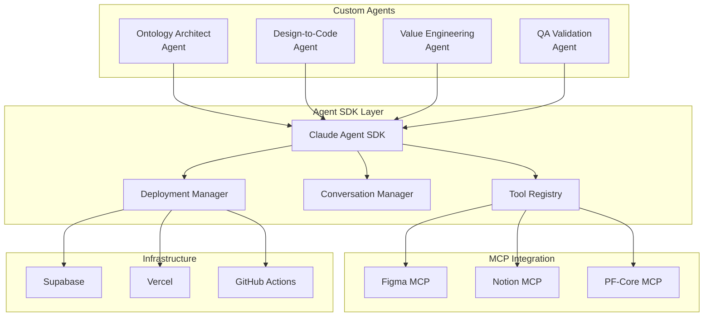
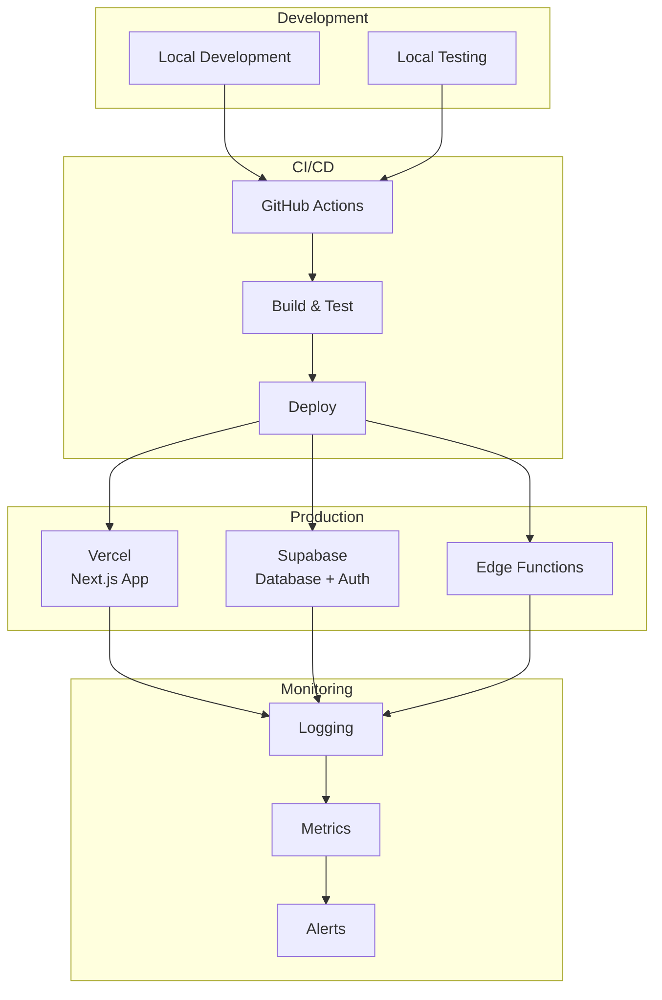

# PFC-PFI-BAIV-F2C Section 09: Agent SDK Integration & Deployment

**Document Reference:** `pfc-pfi-baiv-f2c-09-agent-sdk-deployment.md`  
**Phase:** 4 - MCP & Production  
**Version:** 1.0.0  
**Last Updated:** 2025-01-03  
**Schema Base:** schema.org + Custom Extensions

---

## Document Overview

This document defines the Claude Agent SDK integration architecture, deployment patterns, and production orchestration for Platform Foundation Core (PF-Core) agent system, enabling scalable, secure, and maintainable AI-driven component generation workflows.

---

## Table of Contents

1. [Agent SDK Architecture](#1-agent-sdk-architecture)
2. [Agent Implementations](#2-agent-implementations)
3. [Deployment Patterns](#3-deployment-patterns)
4. [Production Orchestration](#4-production-orchestration)
5. [Monitoring & Observability](#5-monitoring--observability)
6. [Security & Compliance](#6-security--compliance)
7. [Scaling & Performance](#7-scaling--performance)
8. [Maintenance & Operations](#8-maintenance--operations)

---

## 1. Agent SDK Architecture

### 1.1 Claude Agent SDK Overview

The Claude Agent SDK provides structured frameworks for building production-grade AI agents with tool integration, conversation management, and deployment capabilities.



### 1.2 Agent SDK Core Concepts

**Agent Definition:**
```typescript
import { Agent, Tool } from '@anthropic-ai/agent-sdk';

interface AgentConfig {
  name: string;
  description: string;
  tools: Tool[];
  systemPrompt: string;
  model: 'claude-sonnet-4-5' | 'claude-opus-4-1';
  maxTokens?: number;
  temperature?: number;
}

// Create agent instance
const agent = new Agent(config);
```

**Tool Integration:**
```typescript
interface Tool {
  name: string;
  description: string;
  inputSchema: JSONSchema;
  handler: (input: any) => Promise<any>;
}
```

**Conversation Management:**
```typescript
interface Conversation {
  id: string;
  messages: Message[];
  metadata: Record<string, any>;
}

interface Message {
  role: 'user' | 'assistant';
  content: string | ContentBlock[];
  metadata?: Record<string, any>;
}
```

### 1.3 PF-Core Agent System Architecture

```typescript
/**
 * PF-Core Agent System
 * Orchestrates specialized agents for component generation
 */

export class PFCoreAgentSystem {
  private ontologyAgent: OntologyArchitectAgent;
  private designToCodeAgent: DesignToCodeAgent;
  private valueEngineeringAgent: ValueEngineeringAgent;
  private qaAgent: QAValidationAgent;
  private orchestrator: AgentOrchestrator;
  
  constructor(config: SystemConfig) {
    // Initialize specialized agents
    this.ontologyAgent = new OntologyArchitectAgent(config.ontology);
    this.designToCodeAgent = new DesignToCodeAgent(config.generation);
    this.valueEngineeringAgent = new ValueEngineeringAgent(config.valueEngineering);
    this.qaAgent = new QAValidationAgent(config.qa);
    
    // Initialize orchestrator
    this.orchestrator = new AgentOrchestrator({
      agents: [
        this.ontologyAgent,
        this.designToCodeAgent,
        this.valueEngineeringAgent,
        this.qaAgent
      ],
      memoryBank: config.memoryBank,
      taskQueue: config.taskQueue
    });
  }
  
  /**
   * Main entry point for component generation workflow
   */
  async generateComponent(request: GenerationRequest): Promise<GenerationResult> {
    // Create workflow task
    const workflow = await this.orchestrator.createWorkflow({
      type: 'component-generation',
      request,
      agents: ['ontology', 'design-to-code', 'qa']
    });
    
    // Execute workflow
    const result = await this.orchestrator.execute(workflow);
    
    return result;
  }
}
```

---

## 2. Agent Implementations

### 2.1 Ontology Architect Agent

```typescript
/**
 * Ontology Architect Agent
 * Manages Component Ontology, validates schemas, and ensures compliance
 */

import { Agent, Tool } from '@anthropic-ai/agent-sdk';

export class OntologyArchitectAgent extends Agent {
  private pfCoreMCP: PFCoreMCPClient;
  
  constructor(config: OntologyAgentConfig) {
    super({
      name: 'OntologyArchitect',
      description: 'Manages component ontologies and validates compliance',
      model: 'claude-sonnet-4-5',
      systemPrompt: `
        You are the Ontology Architect for Platform Foundation Core.
        
        Your responsibilities:
        1. Define and maintain Component Ontology schemas
        2. Validate component structures against ontology rules
        3. Ensure semantic consistency across platform variants
        4. Generate ontology documentation
        5. Manage schema versioning and evolution
        
        You have access to:
        - PF-Core MCP for ontology queries
        - Notion MCP for documentation
        - Figma MCP for design validation
        
        Always ensure components conform to ontology constraints.
        Use schema.org as the foundation for all ontology definitions.
      `,
      tools: [
        this.createQueryOntologyTool(),
        this.createValidateComponentTool(),
        this.createDefineSchemaversioning
        this.createGenerateDocumentationTool()
      ]
    });
    
    this.pfCoreMCP = new PFCoreMCPClient(config.mcpEndpoint);
  }
  
  /**
   * Tool: Query Ontology
   */
  private createQueryOntologyTool(): Tool {
    return {
      name: 'query_ontology',
      description: 'Execute SPARQL queries against Component Ontology',
      inputSchema: {
        type: 'object',
        properties: {
          query: {
            type: 'string',
            description: 'SPARQL query string'
          }
        },
        required: ['query']
      },
      handler: async (input) => {
        return await this.pfCoreMCP.query_component_ontology(input);
      }
    };
  }
  
  /**
   * Tool: Validate Component
   */
  private createValidateComponentTool(): Tool {
    return {
      name: 'validate_component',
      description: 'Validate component structure against ontology rules',
      inputSchema: {
        type: 'object',
        properties: {
          component: {
            type: 'object',
            description: 'Component structure to validate'
          },
          rules: {
            type: 'array',
            items: { type: 'string' },
            description: 'Validation rules to apply'
          }
        },
        required: ['component']
      },
      handler: async (input) => {
        return await this.pfCoreMCP.validate_component(input);
      }
    };
  }
  
  /**
   * Tool: Define Schema
   */
  private createDefineSchemaversioning(): Tool {
    return {
      name: 'define_schema',
      description: 'Define new component schema in ontology',
      inputSchema: {
        type: 'object',
        properties: {
          componentName: { type: 'string' },
          category: { type: 'string' },
          anatomy: { type: 'object' },
          variants: { type: 'array' },
          states: { type: 'array' }
        },
        required: ['componentName', 'category', 'anatomy']
      },
      handler: async (input) => {
        // Create ontology definition
        const ontology = this.buildOntologyDefinition(input);
        
        // Persist to PF-Core MCP
        await this.pfCoreMCP.create_component_schema(ontology);
        
        // Document in Notion
        await this.documentSchema(ontology);
        
        return { success: true, ontology };
      }
    };
  }
}
```

### 2.2 Design-to-Code Agent

```typescript
/**
 * Design-to-Code Agent
 * Extracts design context from Figma and generates production code
 */

export class DesignToCodeAgent extends Agent {
  private figmaMCP: FigmaMCPClient;
  private pfCoreMCP: PFCoreMCPClient;
  private notionMCP: NotionMCPClient;
  private templateEngine: TemplateEngine;
  
  constructor(config: DesignToCodeAgentConfig) {
    super({
      name: 'DesignToCode',
      description: 'Generates production code from Figma designs',
      model: 'claude-sonnet-4-5',
      systemPrompt: `
        You are the Design-to-Code Agent for Platform Foundation Core.
        
        Your responsibilities:
        1. Extract component structures from Figma designs
        2. Resolve design tokens through cascade
        3. Generate TypeScript/React components
        4. Create comprehensive test suites
        5. Generate Storybook documentation
        
        You follow SPARC methodology:
        - Specification: Analyze Figma design context
        - Pseudocode: Plan generation workflow
        - Architecture: Design code structure
        - Refinement: Validate and iterate
        - Completion: Deliver all artifacts
        
        Always ensure generated code:
        - Conforms to Component Ontology
        - Uses token cascade for styling
        - Includes complete test coverage
        - Has proper TypeScript types
        - Follows ESLint/Prettier standards
      `,
      tools: [
        this.createExtractDesignTool(),
        this.createResolveTokensTool(),
        this.createGenerateCodeTool(),
        this.createValidateCodeTool()
      ]
    });
    
    this.figmaMCP = new FigmaMCPClient(config.figmaToken);
    this.pfCoreMCP = new PFCoreMCPClient(config.mcpEndpoint);
    this.notionMCP = new NotionMCPClient(config.notionToken);
    this.templateEngine = new TemplateEngine(config.templates);
  }
  
  /**
   * Tool: Extract Design Context
   */
  private createExtractDesignTool(): Tool {
    return {
      name: 'extract_design',
      description: 'Extract component structure from Figma',
      inputSchema: {
        type: 'object',
        properties: {
          figmaUrl: { type: 'string' },
          platform: { type: 'string', enum: ['baiv', 'air', 'w4m', 'djm'] }
        },
        required: ['figmaUrl', 'platform']
      },
      handler: async (input) => {
        const { fileKey, nodeId } = parseFigmaUrl(input.figmaUrl);
        
        // Extract design context
        const designContext = await this.figmaMCP.get_design_context({
          fileKey,
          nodeId,
          clientLanguages: 'typescript',
          clientFrameworks: 'react'
        });
        
        // Extract tokens
        const tokens = await this.figmaMCP.get_variable_defs({
          fileKey,
          nodeId
        });
        
        // Check Code Connect
        const codeConnect = await this.figmaMCP.get_code_connect_map({
          fileKey,
          nodeId
        });
        
        return {
          design: designContext,
          tokens,
          codeConnect,
          platform: input.platform
        };
      }
    };
  }
  
  /**
   * Tool: Generate Code
   */
  private createGenerateCodeTool(): Tool {
    return {
      name: 'generate_code',
      description: 'Generate component code from design context',
      inputSchema: {
        type: 'object',
        properties: {
          designContext: { type: 'object' },
          tokens: { type: 'object' },
          platform: { type: 'string' }
        },
        required: ['designContext', 'tokens', 'platform']
      },
      handler: async (input) => {
        // Validate against ontology
        const validation = await this.pfCoreMCP.validate_component({
          component: input.designContext.anatomy,
          rules: ['all']
        });
        
        if (!validation.valid) {
          throw new ValidationError(validation.violations);
        }
        
        // Resolve tokens
        const resolvedTokens = await this.pfCoreMCP.get_token_cascade({
          platform: input.platform,
          tokenRefs: input.tokens
        });
        
        // Generate files
        const files = await this.templateEngine.generate({
          component: input.designContext,
          tokens: resolvedTokens,
          platform: input.platform
        });
        
        return {
          files,
          validation,
          tokens: resolvedTokens
        };
      }
    };
  }
}
```

### 2.3 Value Engineering Agent

```typescript
/**
 * Value Engineering Agent
 * Manages VE-RRR frameworks and C-Suite ontologies
 */

export class ValueEngineeringAgent extends Agent {
  private notionMCP: NotionMCPClient;
  
  constructor(config: ValueEngineeringAgentConfig) {
    super({
      name: 'ValueEngineering',
      description: 'Manages Value Engineering frameworks and role ontologies',
      model: 'claude-sonnet-4-5',
      systemPrompt: `
        You are the Value Engineering Agent for Platform Foundation Core.
        
        Your responsibilities:
        1. Maintain C-Suite role ontologies (25 roles)
        2. Manage VE-RRR alignment frameworks
        3. Discover sector-specific patterns
        4. Generate VSOM accountability mappings
        5. Create Extended RACI-X models
        
        You have access to:
        - Notion databases for VE-RRR frameworks
        - PF-Core MCP for ontology management
        
        Always ensure role definitions:
        - Align with VSOM framework
        - Include complete RACI-X mappings
        - Reference industry-specific patterns
        - Support multi-platform deployment
      `,
      tools: [
        this.createFetchRolesTool(),
        this.createDiscoverPatternsTool(),
        this.createGenerateRACITool()
      ]
    });
    
    this.notionMCP = new NotionMCPClient(config.notionToken);
  }
  
  /**
   * Tool: Fetch Roles
   */
  private createFetchRolesTool(): Tool {
    return {
      name: 'fetch_roles',
      description: 'Fetch C-Suite role definitions from Notion',
      inputSchema: {
        type: 'object',
        properties: {
          sector: { type: 'string' },
          roles: { type: 'array', items: { type: 'string' } }
        }
      },
      handler: async (input) => {
        const searchResults = await this.notionMCP.notion_search({
          query: `C-Suite roles ${input.sector || ''}`,
          query_type: 'internal'
        });
        
        const roles = await Promise.all(
          searchResults.map(result =>
            this.notionMCP.notion_fetch({ id: result.url })
          )
        );
        
        return { roles, sector: input.sector };
      }
    };
  }
}
```

### 2.4 QA Validation Agent

```typescript
/**
 * QA Validation Agent
 * Runs comprehensive quality gates and validation
 */

export class QAValidationAgent extends Agent {
  private validator: ComponentValidator;
  
  constructor(config: QAAgentConfig) {
    super({
      name: 'QAValidation',
      description: 'Validates code quality and runs quality gates',
      model: 'claude-sonnet-4-5',
      systemPrompt: `
        You are the QA Validation Agent for Platform Foundation Core.
        
        Your responsibilities:
        1. Run ontology conformance validation
        2. Execute TypeScript compilation checks
        3. Validate ESLint/Prettier compliance
        4. Verify test coverage >80%
        5. Run accessibility audits
        6. Validate token resolution
        
        Never approve components that fail critical quality gates.
        Provide detailed feedback for refinement when validation fails.
      `,
      tools: [
        this.createRunQualityGatesTool(),
        this.createValidateAccessibilityTool(),
        this.createCheckTestCoverageTool()
      ]
    });
    
    this.validator = new ComponentValidator(config.validation);
  }
  
  /**
   * Tool: Run Quality Gates
   */
  private createRunQualityGatesTool(): Tool {
    return {
      name: 'run_quality_gates',
      description: 'Run all quality gates on generated code',
      inputSchema: {
        type: 'object',
        properties: {
          code: { type: 'object' },
          gates: { type: 'array', items: { type: 'string' } }
        },
        required: ['code']
      },
      handler: async (input) => {
        return await this.validator.runAll(input.code, input.gates);
      }
    };
  }
}
```

---

## 3. Deployment Patterns

### 3.1 Deployment Architecture



### 3.2 Next.js Deployment Configuration

```typescript
// next.config.js
/** @type {import('next').NextConfig} */
const nextConfig = {
  reactStrictMode: true,
  swcMinify: true,
  
  // Environment variables
  env: {
    NEXT_PUBLIC_ANTHROPIC_API_KEY: process.env.ANTHROPIC_API_KEY,
    NEXT_PUBLIC_SUPABASE_URL: process.env.SUPABASE_URL,
    NEXT_PUBLIC_SUPABASE_ANON_KEY: process.env.SUPABASE_ANON_KEY,
    FIGMA_ACCESS_TOKEN: process.env.FIGMA_ACCESS_TOKEN,
    NOTION_INTEGRATION_TOKEN: process.env.NOTION_INTEGRATION_TOKEN,
  },
  
  // API routes configuration
  async rewrites() {
    return [
      {
        source: '/api/agents/:path*',
        destination: '/api/agents/:path*',
      },
      {
        source: '/api/mcp/:path*',
        destination: '/api/mcp/:path*',
      },
    ];
  },
  
  // Security headers
  async headers() {
    return [
      {
        source: '/:path*',
        headers: [
          {
            key: 'X-Frame-Options',
            value: 'DENY',
          },
          {
            key: 'X-Content-Type-Options',
            value: 'nosniff',
          },
          {
            key: 'Referrer-Policy',
            value: 'strict-origin-when-cross-origin',
          },
        ],
      },
    ];
  },
};

module.exports = nextConfig;
```

### 3.3 Supabase Edge Functions

```typescript
// supabase/functions/agent-orchestrator/index.ts

import { serve } from 'https://deno.land/std@0.168.0/http/server.ts';
import { createClient } from 'https://esm.sh/@supabase/supabase-js@2';
import { PFCoreAgentSystem } from './agents.ts';

serve(async (req) => {
  try {
    // Initialize Supabase client
    const supabase = createClient(
      Deno.env.get('SUPABASE_URL')!,
      Deno.env.get('SUPABASE_SERVICE_ROLE_KEY')!
    );
    
    // Parse request
    const { action, payload } = await req.json();
    
    // Initialize agent system
    const agentSystem = new PFCoreAgentSystem({
      anthropicApiKey: Deno.env.get('ANTHROPIC_API_KEY')!,
      supabase,
      figmaToken: Deno.env.get('FIGMA_ACCESS_TOKEN')!,
      notionToken: Deno.env.get('NOTION_INTEGRATION_TOKEN')!,
    });
    
    // Route to appropriate agent workflow
    let result;
    switch (action) {
      case 'generate_component':
        result = await agentSystem.generateComponent(payload);
        break;
      case 'validate_ontology':
        result = await agentSystem.validateOntology(payload);
        break;
      case 'discover_patterns':
        result = await agentSystem.discoverPatterns(payload);
        break;
      default:
        throw new Error(`Unknown action: ${action}`);
    }
    
    // Log to Supabase
    await supabase.from('agent_logs').insert({
      action,
      payload,
      result,
      timestamp: new Date().toISOString()
    });
    
    return new Response(JSON.stringify(result), {
      headers: { 'Content-Type': 'application/json' },
    });
    
  } catch (error) {
    console.error('Agent orchestrator error:', error);
    
    return new Response(JSON.stringify({ error: error.message }), {
      status: 500,
      headers: { 'Content-Type': 'application/json' },
    });
  }
});
```

### 3.4 GitHub Actions Workflow

```yaml
# .github/workflows/deploy-agents.yml

name: Deploy PF-Core Agents

on:
  push:
    branches: [main, develop]
  pull_request:
    branches: [main]

env:
  NODE_VERSION: '20.x'
  DENO_VERSION: '1.x'

jobs:
  test:
    runs-on: ubuntu-latest
    steps:
      - uses: actions/checkout@v3
      
      - name: Setup Node.js
        uses: actions/setup-node@v3
        with:
          node-version: ${{ env.NODE_VERSION }}
          cache: 'npm'
      
      - name: Install dependencies
        run: npm ci
      
      - name: Run linting
        run: npm run lint
      
      - name: Run type checking
        run: npm run type-check
      
      - name: Run unit tests
        run: npm run test:unit
      
      - name: Run integration tests
        run: npm run test:integration
        env:
          ANTHROPIC_API_KEY: ${{ secrets.ANTHROPIC_API_KEY }}
          SUPABASE_URL: ${{ secrets.SUPABASE_URL }}
          SUPABASE_ANON_KEY: ${{ secrets.SUPABASE_ANON_KEY }}
      
      - name: Generate coverage report
        run: npm run test:coverage
      
      - name: Upload coverage to Codecov
        uses: codecov/codecov-action@v3

  deploy-vercel:
    needs: test
    if: github.ref == 'refs/heads/main'
    runs-on: ubuntu-latest
    steps:
      - uses: actions/checkout@v3
      
      - name: Deploy to Vercel
        uses: amondnet/vercel-action@v25
        with:
          vercel-token: ${{ secrets.VERCEL_TOKEN }}
          vercel-org-id: ${{ secrets.VERCEL_ORG_ID }}
          vercel-project-id: ${{ secrets.VERCEL_PROJECT_ID }}
          vercel-args: '--prod'

  deploy-supabase:
    needs: test
    if: github.ref == 'refs/heads/main'
    runs-on: ubuntu-latest
    steps:
      - uses: actions/checkout@v3
      
      - name: Setup Deno
        uses: denoland/setup-deno@v1
        with:
          deno-version: ${{ env.DENO_VERSION }}
      
      - name: Deploy Edge Functions
        run: |
          supabase functions deploy agent-orchestrator \
            --project-ref ${{ secrets.SUPABASE_PROJECT_REF }}
        env:
          SUPABASE_ACCESS_TOKEN: ${{ secrets.SUPABASE_ACCESS_TOKEN }}
```

---

## 4. Production Orchestration

### 4.1 Agent Orchestrator Implementation

```typescript
/**
 * Agent Orchestrator
 * Coordinates multi-agent workflows with task queue and memory management
 */

export class AgentOrchestrator {
  private agents: Map<string, Agent>;
  private memoryBank: SPARCMemoryBank;
  private taskQueue: TaskQueue;
  private supabase: SupabaseClient;
  
  constructor(config: OrchestratorConfig) {
    this.agents = new Map(
      config.agents.map(agent => [agent.name, agent])
    );
    this.memoryBank = config.memoryBank;
    this.taskQueue = config.taskQueue;
    this.supabase = config.supabase;
  }
  
  /**
   * Create workflow from user request
   */
  async createWorkflow(request: WorkflowRequest): Promise<Workflow> {
    const workflow: Workflow = {
      id: generateId(),
      type: request.type,
      status: 'pending',
      createdAt: new Date(),
      request: request.request,
      steps: await this.planWorkflowSteps(request),
      memory: this.memoryBank.create()
    };
    
    // Persist to Supabase
    await this.supabase.from('workflows').insert(workflow);
    
    return workflow;
  }
  
  /**
   * Execute workflow
   */
  async execute(workflow: Workflow): Promise<WorkflowResult> {
    try {
      workflow.status = 'running';
      await this.updateWorkflow(workflow);
      
      // Execute steps sequentially
      for (const step of workflow.steps) {
        const agent = this.agents.get(step.agentName);
        if (!agent) {
          throw new Error(`Agent not found: ${step.agentName}`);
        }
        
        // Execute step
        const stepResult = await this.executeStep(agent, step, workflow.memory);
        
        // Update workflow
        workflow.memory = stepResult.memory;
        step.status = 'completed';
        step.result = stepResult.data;
        
        await this.updateWorkflow(workflow);
      }
      
      workflow.status = 'completed';
      await this.updateWorkflow(workflow);
      
      return {
        success: true,
        workflow,
        result: workflow.steps[workflow.steps.length - 1].result
      };
      
    } catch (error) {
      workflow.status = 'failed';
      workflow.error = error.message;
      await this.updateWorkflow(workflow);
      
      throw error;
    }
  }
  
  /**
   * Execute single workflow step
   */
  private async executeStep(
    agent: Agent,
    step: WorkflowStep,
    memory: SPARCMemory
  ): Promise<StepResult> {
    // Create conversation
    const conversation = await agent.createConversation({
      systemPrompt: step.prompt,
      context: memory
    });
    
    // Execute
    const result = await agent.execute(conversation, step.input);
    
    // Update memory
    memory[step.phase] = result.output;
    
    return {
      data: result.output,
      memory,
      metadata: {
        agentName: agent.name,
        stepName: step.name,
        duration: result.duration,
        tokensUsed: result.tokensUsed
      }
    };
  }
  
  /**
   * Plan workflow steps based on request type
   */
  private async planWorkflowSteps(
    request: WorkflowRequest
  ): Promise<WorkflowStep[]> {
    switch (request.type) {
      case 'component-generation':
        return [
          {
            name: 'Extract Design',
            agentName: 'DesignToCode',
            phase: 'specification',
            prompt: 'Extract design context from Figma',
            input: { figmaUrl: request.request.figmaUrl }
          },
          {
            name: 'Validate Ontology',
            agentName: 'OntologyArchitect',
            phase: 'architecture',
            prompt: 'Validate component against ontology',
            input: { component: '{{specification.design}}' }
          },
          {
            name: 'Generate Code',
            agentName: 'DesignToCode',
            phase: 'completion',
            prompt: 'Generate production code',
            input: {
              design: '{{specification.design}}',
              validation: '{{architecture.validation}}'
            }
          },
          {
            name: 'Run QA',
            agentName: 'QAValidation',
            phase: 'refinement',
            prompt: 'Run quality gates',
            input: { code: '{{completion.code}}' }
          }
        ];
      
      default:
        throw new Error(`Unknown workflow type: ${request.type}`);
    }
  }
}
```

### 4.2 Task Queue Implementation

```typescript
/**
 * Task Queue
 * Manages asynchronous agent task execution with priority and retry logic
 */

export class TaskQueue {
  private queue: PriorityQueue<Task>;
  private workers: Worker[];
  private supabase: SupabaseClient;
  
  constructor(config: TaskQueueConfig) {
    this.queue = new PriorityQueue({
      compare: (a, b) => b.priority - a.priority
    });
    this.workers = this.createWorkers(config.workerCount);
    this.supabase = config.supabase;
  }
  
  /**
   * Add task to queue
   */
  async enqueue(task: Task): Promise<void> {
    // Persist task
    await this.supabase.from('tasks').insert(task);
    
    // Add to queue
    this.queue.enqueue(task);
    
    // Notify workers
    this.notifyWorkers();
  }
  
  /**
   * Process tasks
   */
  private async processTask(task: Task): Promise<void> {
    try {
      task.status = 'processing';
      task.startedAt = new Date();
      await this.updateTask(task);
      
      // Execute task
      const result = await task.handler(task.payload);
      
      task.status = 'completed';
      task.completedAt = new Date();
      task.result = result;
      await this.updateTask(task);
      
    } catch (error) {
      task.attempts++;
      
      if (task.attempts >= task.maxAttempts) {
        task.status = 'failed';
        task.error = error.message;
      } else {
        task.status = 'retrying';
        // Re-enqueue with exponential backoff
        await this.scheduleRetry(task);
      }
      
      await this.updateTask(task);
    }
  }
}
```

---

## 5. Monitoring & Observability

### 5.1 Logging Strategy

```typescript
/**
 * Structured logging for agent operations
 */

export class AgentLogger {
  private supabase: SupabaseClient;
  
  async logAgentExecution(log: AgentExecutionLog): Promise<void> {
    await this.supabase.from('agent_execution_logs').insert({
      '@context': 'https://schema.org',
      '@type': 'Action',
      'agent': log.agentName,
      'workflow': log.workflowId,
      'step': log.stepName,
      'timestamp': new Date().toISOString(),
      'duration': log.duration,
      'tokensUsed': log.tokensUsed,
      'status': log.status,
      'input': log.input,
      'output': log.output,
      'metadata': log.metadata
    });
  }
  
  async logMCPInteraction(log: MCPInteractionLog): Promise<void> {
    await this.supabase.from('mcp_interaction_logs').insert({
      '@context': 'https://schema.org',
      '@type': 'Action',
      'server': log.server,
      'tool': log.tool,
      'timestamp': new Date().toISOString(),
      'duration': log.duration,
      'status': log.status,
      'parameters': log.parameters,
      'result': log.result
    });
  }
}
```

### 5.2 Metrics Collection

```typescript
/**
 * Metrics for agent performance monitoring
 */

export class AgentMetrics {
  private metrics: Map<string, Metric> = new Map();
  
  record(metric: Metric): void {
    this.metrics.set(metric.name, metric);
  }
  
  async export(): Promise<MetricsReport> {
    return {
      timestamp: new Date().toISOString(),
      metrics: Array.from(this.metrics.values()),
      summary: this.computeSummary()
    };
  }
  
  private computeSummary(): MetricsSummary {
    return {
      totalExecutions: this.metrics.get('executions')?.value || 0,
      averageDuration: this.metrics.get('avg_duration')?.value || 0,
      successRate: this.metrics.get('success_rate')?.value || 0,
      totalTokensUsed: this.metrics.get('tokens_used')?.value || 0
    };
  }
}
```

---

## 6. Security & Compliance

### 6.1 Authentication & Authorization

```typescript
/**
 * RBAC for agent system
 */

export class AgentAccessControl {
  private supabase: SupabaseClient;
  
  async authorizeAgentExecution(
    user: User,
    action: string
  ): Promise<boolean> {
    // Check user role
    const { data: roles } = await this.supabase
      .from('user_roles')
      .select('role')
      .eq('user_id', user.id);
    
    // Check permissions
    const hasPermission = roles.some(r =>
      this.rolePermissions[r.role]?.includes(action)
    );
    
    return hasPermission;
  }
  
  private rolePermissions: Record<string, string[]> = {
    admin: ['*'],
    architect: ['generate_component', 'validate_ontology', 'manage_schema'],
    developer: ['generate_component', 'validate_component'],
    viewer: ['view_components', 'view_documentation']
  };
}
```

---

## 7. Scaling & Performance

### 7.1 Horizontal Scaling

```typescript
/**
 * Scale agent workers based on queue depth
 */

export class AgentScaler {
  async scaleWorkers(queueDepth: number): Promise<void> {
    const targetWorkers = Math.min(
      Math.ceil(queueDepth / 10),
      MAX_WORKERS
    );
    
    const currentWorkers = await this.getWorkerCount();
    
    if (targetWorkers > currentWorkers) {
      await this.spawnWorkers(targetWorkers - currentWorkers);
    } else if (targetWorkers < currentWorkers) {
      await this.terminateWorkers(currentWorkers - targetWorkers);
    }
  }
}
```

---

## 8. Implementation Checklist

### 8.1 Agent Setup

- [ ] Implement OntologyArchitectAgent
- [ ] Implement DesignToCodeAgent
- [ ] Implement ValueEngineeringAgent
- [ ] Implement QAValidationAgent
- [ ] Create AgentOrchestrator
- [ ] Set up SPARCMemoryBank
- [ ] Configure TaskQueue
- [ ] Implement logging system

### 8.2 Deployment

- [ ] Configure Next.js application
- [ ] Set up Supabase Edge Functions
- [ ] Create GitHub Actions workflows
- [ ] Configure Vercel deployment
- [ ] Set up environment variables
- [ ] Implement monitoring
- [ ] Configure alerting

### 8.3 Production Readiness

- [ ] Run security audit
- [ ] Perform load testing
- [ ] Implement rate limiting
- [ ] Set up backup procedures
- [ ] Create runbook documentation
- [ ] Train operations team
- [ ] Establish SLAs

---

**End of Section 09 - Phase 4 Complete**

All Phase 4 deliverables created successfully. Proceed to implementation.
