# PFC-PFI-BAIV Figma Design System Visual Guide

**Document Type:** Visual Reference Guide  
**Version:** 1.0.0  
**Companion to:** PFC-PFI-BAIV-figma-design-system-unified-guide-v1.0.0.md  
**Platform:** BAIV — Be AI Visible  
**Last Updated:** 2026-01-02  
**Change Control:** Registry-Managed Artifact

---

## Overview

This visual guide provides Mermaid diagrams to illustrate the concepts, hierarchies, and workflows described in the PFC-PFI-BAIV Figma Design System Unified Guide v1.0.0.

---

## Table of Contents

1. [Design System Architecture Overview](#1-design-system-architecture-overview)
2. [Layer Naming Structure](#2-layer-naming-structure)
3. [Token Architecture](#3-token-architecture)
4. [BAIV Brand System](#4-baiv-brand-system)
5. [Workflows & Processes](#5-workflows--processes)
6. [Implementation Roadmap](#6-implementation-roadmap)

---

## 1. Design System Architecture Overview

### 1.1 Complete Design System Structure

```mermaid
graph TB
    subgraph DesignSystem["🎨 FIGMA DESIGN SYSTEM"]
        subgraph Layers["LAYER NAMING SYSTEM"]
            L1["Page & Section Structure"]
            L2["Layout Components"]
            L3["Content Components"]
            L4["Interactive Components"]
            L5["State Management"]
        end
        
        subgraph Tokens["TOKEN SYSTEM"]
            T1["Primitive Tokens"]
            T2["Semantic Tokens"]
            T3["Component Tokens"]
            T4["Theme Modes"]
        end
        
        subgraph Brand["BAIV BRAND"]
            B1["Color Palette"]
            B2["Typography System"]
            B3["Component Library"]
            B4["Status System"]
        end
    end
    
    subgraph Output["📤 OUTPUT"]
        O1["Figma Library"]
        O2["CSS Variables"]
        O3["Code Components"]
        O4["Documentation"]
    end
    
    Layers --> O1
    Tokens --> O2
    Brand --> O3
    DesignSystem --> O4
    
    style DesignSystem fill:#e3f2fd
    style Layers fill:#fff3e0
    style Tokens fill:#e8f5e9
    style Brand fill:#fce4ec
    style Output fill:#f3e5f5
```



### 1.2 Design-to-Code Pipeline

```mermaid
flowchart LR
    subgraph Figma["🎨 FIGMA"]
        F1["Design Files<br/>with Named Layers"]
        F2["Token Libraries<br/>with Variables"]
        F3["Component Library<br/>Published"]
    end
    
    subgraph MCP["🔌 FIGMA MCP"]
        M1["Extract Layers"]
        M2["Extract Tokens"]
        M3["Extract Components"]
    end
    
    subgraph Code["💻 CODEBASE"]
        C1["CSS Variables"]
        C2["React Components"]
        C3["Tailwind Config"]
        C4["Documentation"]
    end
    
    F1 --> M1
    F2 --> M2
    F3 --> M3
    
    M1 --> C2
    M2 --> C1
    M2 --> C3
    M3 --> C2
    
    M1 --> C4
    M2 --> C4
    M3 --> C4
    
    style Figma fill:#a5d6ff
    style MCP fill:#c7ecff
    style Code fill:#b8e6b8
```



---

## 2. Layer Naming Structure

### 2.1 Layer Hierarchy Tree


### 2.2 Naming Pattern Breakdown

```mermaid
flowchart LR
    subgraph Pattern["NAMING PATTERN"]
        direction LR
        Cat["category/"]
        Type["type/"]
        Var["variant/"]
        State["state"]
    end
    
    subgraph Examples["EXAMPLES"]
        direction TB
        E1["button/primary/hover"]
        E2["input/text/focus"]
        E3["card/stat"]
        E4["nav-item/active"]
    end
    
    subgraph Rules["RULES"]
        direction TB
        R1["✅ lowercase only"]
        R2["✅ slash for hierarchy"]
        R3["✅ hyphen for multi-word"]
        R4["✅ underscore for internal"]
        R5["❌ no spaces"]
    end
    
    Pattern --> Examples
    Pattern --> Rules
    
    style Pattern fill:#e3f2fd
    style Examples fill:#c8e6c9
    style Rules fill:#fff9c4
```



### 2.3 Component Layer Structure


### 2.4 State Suffix Flow

```mermaid
stateDiagram-v2
    [*] --> Default: button/primary
    
    Default --> Hover: /hover
    Default --> Focus: /focus
    Default --> Active: /active
    Default --> Disabled: /disabled
    Default --> Loading: /loading
    
    Hover --> Active: click
    Hover --> Default: mouse leave
    
    Active --> Default: release
    
    Focus --> Active: click while focused
    Focus --> Default: blur
    
    Loading --> Default: complete
    Loading --> Error: fail
    
    Error --> Default: reset
    
    Disabled --> [*]: cannot interact
    
    note right of Default
        Base state with no suffix
    
    note right of Hover
        button/primary/hover
    
    note right of Active
        button/primary/active
```

---

## 3. Token Architecture

### 3.1 Three-Tier Token Hierarchy

```mermaid
graph TB
    subgraph Primitive["🔷 TIER 1: PRIMITIVE TOKENS<br/>(Raw Design Values)"]
        direction TB
        P1["primitive/color/blue/600<br/>#00A4BF"]
        P2["primitive/color/blue/700<br/>#005260"]
        P3["primitive/spacing/4<br/>16px"]
        P4["primitive/typography/fontSize/base<br/>16px"]
        P5["primitive/borderRadius/md<br/>4px"]
    end
    
    subgraph Semantic["🔶 TIER 2: SEMANTIC TOKENS<br/>(Meaningful Context)"]
        direction TB
        S1["semantic/color/primary/default<br/>{primitive/color/blue/600}"]
        S2["semantic/color/primary/active<br/>{primitive/color/blue/700}"]
        S3["semantic/spacing/button/x<br/>{primitive/spacing/4}"]
        S4["semantic/typography/body/size<br/>{primitive/typography/fontSize/base}"]
        S5["semantic/border/radius/default<br/>{primitive/borderRadius/md}"]
    end
    
    subgraph Component["🔸 TIER 3: COMPONENT TOKENS<br/>(Component-Specific)"]
        direction TB
        C1["component/button/primary/background<br/>{semantic/color/primary/default}"]
        C2["component/button/primary/background-hover<br/>{semantic/color/primary/active}"]
        C3["component/button/padding/x<br/>{semantic/spacing/button/x}"]
    end
    
    P1 -.->|references| S1
    P2 -.->|references| S2
    P3 -.->|references| S3
    P4 -.->|references| S4
    P5 -.->|references| S5
    
    S1 -.->|references| C1
    S2 -.->|references| C2
    S3 -.->|references| C3
    
    style Primitive fill:#fff3e0
    style Semantic fill:#e3f2fd
    style Component fill:#e8f5e9
```



### 3.2 Token Aliasing Chain

```mermaid
flowchart LR
    subgraph Chain["TOKEN ALIASING CHAIN"]
        direction LR
        
        Value["Actual Value<br/>#00A4BF"]
        Prim["Primitive Token<br/>primitive/color/blue/600"]
        Sem["Semantic Token<br/>semantic/color/primary/default"]
        Comp["Component Token<br/>component/button/primary/bg"]
        
        Value -->|"defines"| Prim
        Prim -->|"referenced by"| Sem
        Sem -->|"referenced by"| Comp
    end
    
    subgraph CSS["CSS OUTPUT"]
        direction TB
        CSS1["--blue-600: #00A4BF;"]
        CSS2["--primary-default: var(--blue-600);"]
        CSS3["--button-primary-bg: var(--primary-default);"]
    end
    
    subgraph Benefits["BENEFITS"]
        direction TB
        B1["✅ Single source of truth"]
        B2["✅ Change propagation"]
        B3["✅ Theme flexibility"]
        B4["✅ Consistency"]
    end
    
    Chain --> CSS
    Chain --> Benefits
    
    style Chain fill:#e3f2fd
    style CSS fill:#c8e6c9
    style Benefits fill:#fff9c4
```



### 3.3 Color Token System

```mermaid
graph TB
    subgraph ColorSystem["🎨 COLOR TOKEN SYSTEM"]
        subgraph Primitives["PRIMITIVE COLORS"]
            direction TB
            Gray["Gray Scale<br/>50 → 950"]
            Blue["Blue Scale<br/>500 → 900"]
            Red["Red Scale<br/>500 → 900"]
            Green["Green Scale<br/>500 → 900"]
            Yellow["Yellow Scale<br/>500 → 900"]
        end
        
        subgraph SemanticColors["SEMANTIC COLORS"]
            direction TB
            BG["Background<br/>default, subtle, muted"]
            FG["Foreground<br/>default, muted, inverse"]
            Border["Border<br/>default, subtle, strong"]
            Primary["Primary<br/>default, hover, active"]
            Status["Status<br/>success, warning, error, info"]
        end
        
        subgraph ComponentColors["COMPONENT COLORS"]
            direction TB
            ButtonBG["Button Backgrounds"]
            CardBG["Card Backgrounds"]
            InputBG["Input Backgrounds"]
            AlertBG["Alert Backgrounds"]
        end
    end
    
    Primitives --> SemanticColors
    SemanticColors --> ComponentColors
    
    style Primitives fill:#fff3e0
    style SemanticColors fill:#e3f2fd
    style ComponentColors fill:#e8f5e9
```



### 3.4 Spacing Token System

```mermaid
graph LR
    subgraph SpacingSystem["📏 SPACING TOKEN SYSTEM"]
        subgraph PrimSpacing["PRIMITIVE SPACING<br/>(4px Grid)"]
            direction TB
            PS0["0 → 0px"]
            PS1["1 → 4px"]
            PS2["2 → 8px"]
            PS3["3 → 12px"]
            PS4["4 → 16px"]
            PS6["6 → 24px"]
            PS8["8 → 32px"]
            PS12["12 → 48px"]
            PS16["16 → 64px"]
        end
        
        subgraph SemSpacing["SEMANTIC SPACING"]
            direction TB
            PageX["page/x"]
            PageY["page/y"]
            Section["section"]
            CardPad["card/padding"]
            ButtonX["button/x"]
            ButtonY["button/y"]
            StackGap["stack/default"]
        end
        
        subgraph Usage["USAGE CONTEXT"]
            direction TB
            U1["Page Layout"]
            U2["Component Padding"]
            U3["Stack Gaps"]
            U4["Grid Gutters"]
        end
    end
    
    PrimSpacing --> SemSpacing
    SemSpacing --> Usage
    
    style PrimSpacing fill:#fff3e0
    style SemSpacing fill:#e3f2fd
    style Usage fill:#e8f5e9
```



### 3.5 Typography Token System


### 3.6 Theme Modes System

```mermaid
graph TB
    subgraph ThemeSystem["🌓 THEME MODE SYSTEM"]
        subgraph Collections["TOKEN COLLECTIONS"]
            direction TB
            Colors["Colors Collection"]
            Spacing["Spacing Collection"]
            Radius["Border Radius Collection"]
        end
        
        subgraph ColorModes["COLOR MODES"]
            direction TB
            Light["Light Mode<br/>(default)"]
            Dark["Dark Mode"]
            HighContrast["High Contrast<br/>(optional)"]
        end
        
        subgraph SpacingModes["SPACING MODES"]
            direction TB
            Default["Default<br/>(default)"]
            Compact["Compact"]
            Comfortable["Comfortable"]
        end
        
        subgraph RadiusModes["RADIUS MODES"]
            direction TB
            DefRadius["Default<br/>(default)"]
            Sharp["Sharp"]
            Rounded["Rounded"]
        end
        
        Collections --> ColorModes
        Collections --> SpacingModes
        Collections --> RadiusModes
        
        subgraph Application["APPLICATION"]
            direction TB
            App["User switches mode<br/>↓<br/>All tokens update<br/>↓<br/>UI updates automatically"]
        end
        
        ColorModes --> Application
        SpacingModes --> Application
        RadiusModes --> Application
    end
    
    style Collections fill:#e3f2fd
    style ColorModes fill:#fff3e0
    style SpacingModes fill:#e8f5e9
    style RadiusModes fill:#f3e5f5
    style Application fill:#fce4ec
```



---

## 4. BAIV Brand System

### 4.1 BAIV Color Palette


### 4.2 BAIV Typography System

```mermaid
graph LR
    subgraph BAIVTypography["📝 BAIV TYPOGRAPHY"]
        subgraph Fonts["FONT FAMILIES"]
            direction TB
            Headings["Headings<br/>Titillium Web<br/>Display, Bold"]
            Body["Body Text<br/>Open Sans<br/>Regular, Medium"]
            Code["Code<br/>Fira Code<br/>Monospace"]
        end
        
        subgraph Scale["TYPE SCALE"]
            direction TB
            H1["H1: 48px / Bold"]
            H2["H2: 36px / Bold"]
            H3["H3: 30px / Semibold"]
            H4["H4: 24px / Semibold"]
            BodyLg["Body Large: 18px / Regular"]
            BodyDef["Body Default: 16px / Regular"]
            BodySm["Body Small: 14px / Regular"]
            Caption["Caption: 12px / Regular"]
        end
        
        subgraph Tokens["TOKEN MAPPING"]
            direction TB
            T1["primitive/typography/fontFamily/display<br/>→ Titillium Web"]
            T2["primitive/typography/fontFamily/sans<br/>→ Open Sans"]
            T3["primitive/typography/fontFamily/mono<br/>→ Fira Code"]
        end
    end
    
    Fonts --> Scale
    Fonts --> Tokens
    
    style Fonts fill:#e3f2fd
    style Scale fill:#fff3e0
    style Tokens fill:#e8f5e9
```



### 4.3 BAIV Component Library


---

## 5. Workflows & Processes

### 5.1 Design System Workflow


### 5.2 Token Creation Workflow

```mermaid
flowchart LR
    subgraph Step1["1️⃣ PRIMITIVES"]
        direction TB
        P1["Define Raw Values"]
        P2["Create in Figma"]
        P3["Test Values"]
        
        P1 --> P2 --> P3
    end
    
    subgraph Step2["2️⃣ SEMANTIC"]
        direction TB
        S1["Create Semantic Tokens"]
        S2["Reference Primitives"]
        S3["Test Aliases"]
        
        S1 --> S2 --> S3
    end
    
    subgraph Step3["3️⃣ COMPONENT"]
        direction TB
        C1["Create Component Tokens"]
        C2["Reference Semantic"]
        C3["Apply to Components"]
        
        C1 --> C2 --> C3
    end
    
    subgraph Step4["4️⃣ MODES"]
        direction TB
        M1["Create Mode Variants"]
        M2["Test Mode Switching"]
        M3["Verify Consistency"]
        
        M1 --> M2 --> M3
    end
    
    subgraph Step5["5️⃣ PUBLISH"]
        direction TB
        Pub1["Publish Library"]
        Pub2["Extract via MCP"]
        Pub3["Generate CSS"]
        
        Pub1 --> Pub2 --> Pub3
    end
    
    Step1 --> Step2 --> Step3 --> Step4 --> Step5
    
    style Step1 fill:#fff3e0
    style Step2 fill:#e3f2fd
    style Step3 fill:#e8f5e9
    style Step4 fill:#f3e5f5
    style Step5 fill:#fce4ec
```



### 5.3 Change Control Process


### 5.4 Publishing & Deployment Flow


---

## 6. Implementation Roadmap

### 6.1 Implementation Phases


### 6.2 Implementation Checklist Flow

```mermaid
flowchart TB
    Start([Start Implementation]) --> Setup
    
    subgraph Setup["INITIAL SETUP"]
        direction TB
        S1["✅ Read unified guide"]
        S2["✅ Setup Figma file structure"]
        S3["✅ Create token collections"]
        S4["✅ Setup theme modes"]
        
        S1 --> S2 --> S3 --> S4
    end
    
    subgraph Layers["LAYER NAMING"]
        direction TB
        L1["✅ Rename existing frames"]
        L2["✅ Apply page/section hierarchy"]
        L3["✅ Implement component naming"]
        L4["✅ Add internal prefixes"]
        
        L1 --> L2 --> L3 --> L4
    end
    
    subgraph Tokens["TOKEN IMPLEMENTATION"]
        direction TB
        T1["✅ Define primitives"]
        T2["✅ Create semantic aliases"]
        T3["✅ Setup component tokens"]
        T4["✅ Test token propagation"]
        
        T1 --> T2 --> T3 --> T4
    end
    
    subgraph Brand["BAIV BRAND"]
        direction TB
        B1["✅ Apply brand colors"]
        B2["✅ Set typography"]
        B3["✅ Configure status colors"]
        B4["✅ Test consistency"]
        
        B1 --> B2 --> B3 --> B4
    end
    
    subgraph Code["CODE INTEGRATION"]
        direction TB
        C1["✅ Extract via MCP"]
        C2["✅ Generate CSS"]
        C3["✅ Test in dev"]
        C4["✅ Document for devs"]
        
        C1 --> C2 --> C3 --> C4
    end
    
    subgraph Gov["GOVERNANCE"]
        direction TB
        G1["✅ Register in registry"]
        G2["✅ Setup review schedule"]
        G3["✅ Train team"]
        G4["✅ Create cheat sheets"]
        
        G1 --> G2 --> G3 --> G4
    end
    
    Setup --> Layers
    Layers --> Tokens
    Tokens --> Brand
    Brand --> Code
    Code --> Gov
    Gov --> Complete([Implementation Complete])
    
    style Start fill:#e8f5e9
    style Complete fill:#c8e6c9
    style Setup fill:#e3f2fd
    style Layers fill:#fff3e0
    style Tokens fill:#e8f5e9
    style Brand fill:#f3e5f5
    style Code fill:#fce4ec
    style Gov fill:#c8e6c9
```

### 6.3 Success Metrics Dashboard

```mermaid
graph TB
    subgraph Metrics["📊 SUCCESS METRICS"]
        subgraph Adoption["ADOPTION METRICS"]
            direction TB
            A1["Components Using<br/>Naming Conventions<br/>Target: 100%"]
            A2["Tokens Defined<br/>vs Required<br/>Target: 100%"]
            A3["Team Members<br/>Trained<br/>Target: 100%"]
            A4["Library Subscribers<br/>Target: All teams"]
        end
        
        subgraph Quality["QUALITY METRICS"]
            direction TB
            Q1["Naming Convention<br/>Compliance<br/>Target: 95%+"]
            Q2["Token Aliasing<br/>Correct Usage<br/>Target: 100%"]
            Q3["Documentation<br/>Coverage<br/>Target: 100%"]
            Q4["Code Generation<br/>Success Rate<br/>Target: 95%+"]
        end
        
        subgraph Efficiency["EFFICIENCY METRICS"]
            direction TB
            E1["Design to Code<br/>Time Reduction<br/>Target: 50%"]
            E2["Component Reuse<br/>Rate<br/>Target: 80%+"]
            E3["Design Consistency<br/>Score<br/>Target: 95%+"]
            E4["Developer Satisfaction<br/>Target: 4.5/5"]
        end
        
        subgraph Maintenance["MAINTENANCE METRICS"]
            direction TB
            M1["Monthly Audits<br/>Completed<br/>Target: 100%"]
            M2["Change Requests<br/>Processing Time<br/>Target: <5 days"]
            M3["Breaking Changes<br/>Per Quarter<br/>Target: <2"]
            M4["Registry Updates<br/>On Time<br/>Target: 100%"]
        end
    end
    
    style Adoption fill:#e3f2fd
    style Quality fill:#c8e6c9
    style Efficiency fill:#fff9c4
    style Maintenance fill:#f3e5f5
```

---

## 7. Quick Reference Diagrams

### 7.1 Layer Naming Quick Reference

```mermaid
mindmap
  root((Layer<br/>Naming))
    Pages
      page/dashboard
      page/settings
      page/profile
    Sections
      section/hero
      section/features
      section/footer
    Layout
      container/lg
      grid/3-col
      stack/vertical
    Content
      heading/h1
      body/default
      caption
    Components
      button/primary
      card/default
      input/text
    Navigation
      nav/primary
      nav-item/active
      tabs
    Forms
      form/login
      field/email
      error/password
    States
      /hover
      /active
      /focus
      /disabled
    Internal
      _bg
      _icon
      _label
```

### 7.2 Token Naming Quick Reference

```mermaid
mindmap
  root((Token<br/>Naming))
    Primitive
      color/blue/600
      spacing/4
      fontSize/base
      borderRadius/md
    Semantic
      color/primary/default
      spacing/button/x
      sizing/icon/md
      border/default
    Component
      button/primary/bg
      card/default/border
      input/border-focus
    Collections
      Colors
        Light
        Dark
      Spacing
        Default
        Compact
      Radius
        Default
        Rounded
```

### 7.3 Complete System Overview

```mermaid
graph TB
    subgraph System["🎨 COMPLETE DESIGN SYSTEM"]
        subgraph Input["INPUT"]
            direction TB
            DesignReq["Design Requirements"]
            BrandGuide["BAIV Brand Guidelines"]
            DevNeeds["Developer Needs"]
        end
        
        subgraph Figma["FIGMA IMPLEMENTATION"]
            direction TB
            Layers["Named Layers<br/>Hierarchy & Structure"]
            Tokens["Design Tokens<br/>Primitive → Semantic → Component"]
            Components["Component Library<br/>Published & Versioned"]
            Modes["Theme Modes<br/>Light, Dark, etc."]
        end
        
        subgraph Process["PROCESS"]
            direction TB
            MCP["Figma MCP<br/>Extraction"]
            Transform["Transform<br/>& Generate"]
            Validate["Validate<br/>& Test"]
        end
        
        subgraph Output["OUTPUT"]
            direction TB
            CSS["CSS Variables<br/>& Styles"]
            CodeComp["Code Components<br/>React, etc."]
            Docs["Documentation<br/>& Guides"]
            Registry["Registry<br/>Tracking"]
        end
        
        subgraph Governance["GOVERNANCE"]
            direction TB
            Version["Version Control"]
            Change["Change Management"]
            Review["Review Process"]
            Training["Team Training"]
        end
    end
    
    Input --> Figma
    Figma --> Process
    Process --> Output
    Output --> Governance
    Governance -.->|"Informs"| Input
    
    style Input fill:#e3f2fd
    style Figma fill:#fff3e0
    style Process fill:#e8f5e9
    style Output fill:#f3e5f5
    style Governance fill:#fce4ec
```

---

## Document Registry

### Registry Metadata

```yaml
artifact_type: visual_guide
artifact_id: PFC-PFI-BAIV-DS-VISUAL-GUIDE-001
version: 1.0.0
companion_to: PFC-PFI-BAIV-DS-GUIDE-001
status: active
owner: PF-Core Design Team
reviewers:
  - Design Lead
  - Frontend Architect
  - Solution Architect
review_date: 2026-01-02
next_review: 2026-04-02
change_control: true
registry_path: /PF-Core/Design-System/Guides/Visual/
```

### Related Documents

- **Primary Guide:** PFC-PFI-BAIV-figma-design-system-unified-guide-v1.0.0.md
- **Source Documents:**
  - figma-ds-layer-naming-cheat-sheet.md v2.0.0
  - token-naming-reference.md
  - PFC-Figma2Claude-QuickStart-Appendix-A-Tokens.md v1.0.0

---

## Support & Contact

**Questions or Issues:**
- Design System Slack: `#pf-core-design-system`
- Documentation: PF-Prototype-Shared Repository
- Registry: PF-Core Registry Portal

---

**End of Visual Guide**

*This is a registry-controlled artifact. All changes must follow the change control process outlined in the unified guide.*
