# BAIV Design System — Visual Guide

## Documentation Overview & Workflow Diagrams

**Version:** 2.0.0  
**Platform:** BAIV — Be AI Visible  
**Last Updated:** December 2024

---

## Introduction

This visual guide provides a comprehensive overview of the BAIV Design System documentation package. The diagrams below illustrate how each document connects to the overall workflow, from initial Figma Make generation through to production-ready React/Next.js code.

The BAIV Design System enables rapid UI development by establishing a consistent token-based approach that bridges design and code. Whether you're generating layouts with Figma Make, structuring designs manually, or extracting via MCP for Claude code generation, these documents provide the standards, checklists, and reference materials needed at each stage.

---

## 1. Document Package Overview

The BAIV Design System documentation consists of nine interconnected files, each serving a specific purpose in the design-to-code workflow. The master reference guide contains the complete specification, while specialized documents provide focused guidance for specific tasks. The JSON files contain machine-readable token definitions and mapping rules that Claude uses during code generation.

```mermaid
flowchart TB
    subgraph MASTER["📚 MASTER DOCUMENT"]
        CRG["figma-ds-complete-reference-guide.md<br/>━━━━━━━━━━━━━━━━━━━━━━<br/>Complete BAIV specification<br/>All tokens, conventions, workflows"]
    end

    subgraph WORKFLOW["🔄 WORKFLOW GUIDES"]
        TPP["figma-ds-10-point-plan.md<br/>━━━━━━━━━━━━━━━━━━━━━━<br/>Step-by-step alignment<br/>80 min → 40 min with practice"]
        
        ENG["figma-ds-enforcement-guide.md<br/>━━━━━━━━━━━━━━━━━━━━━━<br/>Compliance enforcement<br/>4-layer validation system"]
        
        MVP["figma-ds-mvp-workflow-guide.md<br/>━━━━━━━━━━━━━━━━━━━━━━<br/>Streamlined pipeline<br/>Code Connect appendix"]
    end

    subgraph REFERENCE["📋 QUICK REFERENCES"]
        STR["figma-ds-structuring-checklist.md<br/>━━━━━━━━━━━━━━━━━━━━━━<br/>8-phase restructuring<br/>Layer hierarchy guide"]
        
        LNC["figma-ds-layer-naming-cheat-sheet.md<br/>━━━━━━━━━━━━━━━━━━━━━━<br/>Naming conventions<br/>One-page reference"]
        
        PMT["figma-ds-prompt-templates.md<br/>━━━━━━━━━━━━━━━━━━━━━━<br/>7 Figma Make prompts<br/>BAIV-specific templates"]
    end

    subgraph DATA["💾 TOKEN DATA"]
        TKN["figma-ds-baiv-tokens.json<br/>━━━━━━━━━━━━━━━━━━━━━━<br/>Complete token library<br/>Colors, spacing, typography"]
        
        MAP["figma-ds-mapping-rules.json<br/>━━━━━━━━━━━━━━━━━━━━━━<br/>Auto-mapping config<br/>Figma → Code translation"]
    end

    CRG --> TPP
    CRG --> ENG
    CRG --> MVP
    CRG --> STR
    CRG --> LNC
    CRG --> PMT
    CRG --> TKN
    CRG --> MAP

    TPP --> STR
    TPP --> LNC
    ENG --> TPP
    MVP --> TKN
    MVP --> MAP
    PMT --> TPP

    style CRG fill:#00A4BF,color:#fff
    style TKN fill:#005260,color:#fff
    style MAP fill:#005260,color:#fff
    style TPP fill:#E84E1C,color:#fff
    style ENG fill:#E84E1C,color:#fff
    style MVP fill:#E84E1C,color:#fff
    style STR fill:#CEC528,color:#000
    style LNC fill:#CEC528,color:#000
    style PMT fill:#CEC528,color:#000
```

---

## 2. End-to-End Pipeline

The BAIV design system workflow transforms AI-generated Figma Make layouts into production-ready code through a structured pipeline. Each stage has specific documentation support, ensuring consistency and quality throughout the process. The 10-point alignment plan is the core methodology, with other documents providing detailed guidance for specific phases.

---

## 3. BAIV Token Hierarchy

The BAIV token system follows a three-tier architecture: primitive tokens define raw values, semantic tokens provide contextual meaning, and component tokens specify exact usage. This hierarchy ensures consistency while maintaining flexibility for theming and customization. The token library supports light and dark modes through semantic aliasing.

---

## 4. Enforcement & Validation Flow

Enforcement happens at four layers to ensure BAIV compliance throughout the workflow. Input enforcement validates prompts before generation, environment enforcement ensures the token library is properly configured, validation checks output against BAIV standards, and remediation fixes any violations. This multi-layer approach catches issues early and reduces rework.

```mermaid
flowchart TB
    subgraph L1["🎯 LAYER 1: INPUT ENFORCEMENT"]
        direction LR
        PR["Prompt Template<br/>BAIV colors specified?"]
        FN["Fonts Included?<br/>Titillium + Open Sans"]
        SEC["Sections Listed?<br/>Complete structure"]
        
        PR --> G1{"Gate 1<br/>Pass?"}
        FN --> G1
        SEC --> G1
    end

    subgraph L2["📁 LAYER 2: ENVIRONMENT"]
        direction LR
        LIB["BAIV Token Library<br/>Enabled?"]
        TMP["Template File<br/>Ready?"]
        
        LIB --> G2{"Gate 2<br/>Pass?"}
        TMP --> G2
    end

    subgraph L3["✅ LAYER 3: VALIDATION"]
        direction LR
        CLR["Colors Correct?<br/>#00A4BF, #E84E1C..."]
        TYP["Typography?<br/>Titillium, Open Sans"]
        NAM["Layer Names?<br/>No defaults"]
        AL["Auto Layout?<br/>All containers"]
        
        CLR --> G3{"Gate 3<br/>Pass?"}
        TYP --> G3
        NAM --> G3
        AL --> G3
    end

    subgraph L4["🔧 LAYER 4: REMEDIATION"]
        direction LR
        FIX["Fix Violations"]
        TIME{"< 30 min?"}
        REGEN["Regenerate<br/>Improve prompt"]
    end

    subgraph FINAL["🚀 FINAL"]
        PRE["Pre-Check<br/>All BAIV tokens bound"]
        MCP["MCP Extract"]
        CODE["Claude Code Gen"]
    end

    G1 -->|"✓"| L2
    G1 -->|"✗"| REV1["Revise Prompt"]
    REV1 --> PR

    G2 -->|"✓"| GEN["Figma Make<br/>Generate"]
    G2 -->|"✗"| SETUP["Enable Library"]
    SETUP --> LIB

    GEN --> L3

    G3 -->|"✓"| PRE
    G3 -->|"✗"| FIX

    FIX --> TIME
    TIME -->|"Yes"| G3
    TIME -->|"No"| REGEN
    REGEN --> PR

    PRE --> MCP --> CODE

    style G1 fill:#00A4BF,color:#fff
    style G2 fill:#00A4BF,color:#fff
    style G3 fill:#00A4BF,color:#fff
    style FIX fill:#E84E1C,color:#fff
    style REGEN fill:#CF057D,color:#fff
    style CODE fill:#019587,color:#fff
```

---

## 5. BAIV Component Library

The BAIV component library defines standard UI elements with consistent token usage across all variants. Each component maps to specific BAIV tokens for colors, spacing, and typography. Components are extracted during the alignment process and become reusable React components in the final code output.

```mermaid
flowchart TB
    subgraph BUTTONS["🔘 BUTTONS"]
        direction LR
        BP["button/primary<br/>━━━━━━━━━━<br/>bg: #00A4BF<br/>text: white"]
        BS["button/secondary<br/>━━━━━━━━━━<br/>bg: #E84E1C<br/>text: white"]
        BA["button/accent<br/>━━━━━━━━━━<br/>bg: #CEC528<br/>text: dark"]
        BO["button/outline<br/>━━━━━━━━━━<br/>border: #00A4BF<br/>text: #00A4BF"]
        BG["button/ghost<br/>━━━━━━━━━━<br/>bg: transparent<br/>text: default"]
    end

    subgraph CARDS["🃏 CARDS"]
        direction LR
        CD["card/default<br/>━━━━━━━━━━<br/>bg: white<br/>border: gray"]
        CS["card/stat<br/>━━━━━━━━━━<br/>icon: #00A4BF<br/>highlight: accent"]
        CF["card/feature<br/>━━━━━━━━━━<br/>icon: brand<br/>hover: subtle"]
    end

    subgraph ALERTS["⚠️ ALERTS"]
        direction LR
        AS["alert/success<br/>━━━━━━━━━━<br/>bg: success/50<br/>border: #019587"]
        AW["alert/warning<br/>━━━━━━━━━━<br/>bg: warning/50<br/>border: #CF057D"]
        AE["alert/error<br/>━━━━━━━━━━<br/>bg: accent/50<br/>border: #CEC528"]
        AI["alert/info<br/>━━━━━━━━━━<br/>bg: info/50<br/>border: #1C3E8E"]
    end

    subgraph BADGES["🏷️ BADGES"]
        direction LR
        BDS["badge/success<br/>#019587"]
        BDW["badge/warning<br/>#CF057D"]
        BDE["badge/error<br/>#CEC528"]
        BDI["badge/info<br/>#1C3E8E"]
    end

    subgraph INPUTS["📝 INPUTS"]
        direction LR
        IT["input/text<br/>━━━━━━━━━━<br/>border: gray<br/>focus: #00A4BF"]
        IS["input/search<br/>━━━━━━━━━━<br/>icon: muted<br/>focus: #00A4BF"]
    end

    subgraph NAV["🧭 NAVIGATION"]
        direction LR
        NP["nav/primary<br/>━━━━━━━━━━<br/>active: #00A4BF<br/>bg: white"]
        NS["nav/sidebar<br/>━━━━━━━━━━<br/>active: #00A4BF<br/>bg: #CCE8EE"]
    end

    style BP fill:#00A4BF,color:#fff
    style BS fill:#E84E1C,color:#fff
    style BA fill:#CEC528,color:#000
    style AS fill:#019587,color:#fff
    style AW fill:#CF057D,color:#fff
    style AE fill:#CEC528,color:#000
    style AI fill:#1C3E8E,color:#fff
    style BDS fill:#019587,color:#fff
    style BDW fill:#CF057D,color:#fff
    style BDE fill:#CEC528,color:#000
    style BDI fill:#1C3E8E,color:#fff
```

---

## 6. Layer Naming Structure

The BAIV layer naming convention follows a consistent pattern that directly maps to React component structure. This semantic naming enables Claude to generate properly organized code with meaningful component names and file structures. The hierarchy mirrors the final code architecture.

```mermaid
flowchart TB
    subgraph PAGE["📄 PAGE LEVEL"]
        PG["page/dashboard"]
    end

    subgraph LAYOUT["📐 LAYOUT LEVEL"]
        HD["header"]
        MN["main"]
        FT["footer"]
        SB["sidebar/left"]
    end

    subgraph SECTION["📑 SECTION LEVEL"]
        SH["section/hero"]
        SF["section/features"]
        SS["section/stats"]
    end

    subgraph CONTAINER["📦 CONTAINER LEVEL"]
        CT["container"]
        GR["grid/3-col"]
        CG["card-grid"]
    end

    subgraph COMPONENT["🧩 COMPONENT LEVEL"]
        BP["button/primary"]
        BS["button/secondary"]
        CD["card/stat"]
        IN["input/text"]
        BD["badge/success"]
        NI["nav-item/active"]
    end

    subgraph INTERNAL["⚙️ INTERNAL PARTS"]
        IC["_icon"]
        LB["_label"]
        BG["_bg"]
    end

    PG --> HD
    PG --> MN
    PG --> FT
    PG --> SB

    MN --> SH
    MN --> SF
    MN --> SS

    SH --> CT
    SF --> GR
    SS --> CG

    CT --> BP
    CT --> BS
    GR --> CD
    CG --> CD
    CT --> IN
    HD --> NI

    BP --> IC
    BP --> LB
    CD --> BG

    style PG fill:#00A4BF,color:#fff
    style HD fill:#005260,color:#fff
    style MN fill:#005260,color:#fff
    style FT fill:#005260,color:#fff
    style SH fill:#E84E1C,color:#fff
    style SF fill:#E84E1C,color:#fff
    style SS fill:#E84E1C,color:#fff
    style BP fill:#CEC528,color:#000
    style CD fill:#CEC528,color:#000
```

---

## 7. Code Generation Output

The Claude Agent SDK generates a complete React/Next.js project structure from the extracted Figma design. The output includes TypeScript components, CSS variable definitions for BAIV tokens, Tailwind configuration, and utility functions. Each component references BAIV tokens through CSS custom properties.

```mermaid
flowchart TB
    subgraph INPUT["📥 MCP INPUT"]
        DC["Design Context<br/>Layer hierarchy, styles"]
        VD["Variable Defs<br/>Token values"]
        MR["Mapping Rules<br/>figma-ds-mapping-rules.json"]
    end

    subgraph CLAUDE["🤖 CLAUDE AGENT SDK"]
        AN["Analyze Structure"]
        MP["Map to Tokens"]
        GN["Generate Code"]
    end

    subgraph OUTPUT["📤 CODE OUTPUT"]
        direction TB
        
        subgraph COMP["components/"]
            UI["ui/<br/>Button.tsx<br/>Card.tsx<br/>Input.tsx<br/>Badge.tsx"]
            LY["layout/<br/>Header.tsx<br/>Footer.tsx<br/>Sidebar.tsx"]
            PG["page/<br/>Dashboard.tsx"]
            SC["sections/<br/>HeroSection.tsx<br/>StatsSection.tsx"]
        end
        
        subgraph STYLES["styles/"]
            TK["baiv-tokens.css<br/>━━━━━━━━━━━━━━<br/>--baiv-primary: #00A4BF<br/>--baiv-secondary: #E84E1C<br/>--baiv-accent: #CEC528<br/>--font-heading: Titillium Web<br/>--font-primary: Open Sans"]
        end
        
        subgraph CONFIG["config/"]
            TW["tailwind.config.ts<br/>━━━━━━━━━━━━━━<br/>colors: baiv palette<br/>fontFamily: custom"]
        end
        
        subgraph LIB["lib/"]
            UT["utils.ts<br/>cn() helper"]
        end
    end

    DC --> AN
    VD --> AN
    MR --> MP

    AN --> MP --> GN

    GN --> COMP
    GN --> STYLES
    GN --> CONFIG
    GN --> LIB

    style DC fill:#00A4BF,color:#fff
    style VD fill:#00A4BF,color:#fff
    style CLAUDE fill:#005260,color:#fff
    style TK fill:#E84E1C,color:#fff
    style TW fill:#CEC528,color:#000
```

---

## 8. Document Usage Guide

Different documents serve different needs during the workflow. Use this decision tree to find the right document for your current task. The master reference contains everything, while specialized documents provide focused, actionable guidance for specific situations.

```mermaid
flowchart TB
    START{"What do you<br/>need to do?"}
    
    START -->|"Everything in one place"| CRG["📚 figma-ds-complete-reference-guide.md<br/>Master document"]
    
    START -->|"Follow the workflow"| TPP["🔄 figma-ds-10-point-plan.md<br/>Step-by-step process"]
    
    START -->|"Enforce standards"| ENG["✅ figma-ds-enforcement-guide.md<br/>Validation & compliance"]
    
    START -->|"Restructure layers"| STR["📋 figma-ds-structuring-checklist.md<br/>8-phase checklist"]
    
    START -->|"Look up naming"| LNC["🏷️ figma-ds-layer-naming-cheat-sheet.md<br/>Quick reference"]
    
    START -->|"Write Figma Make prompts"| PMT["💬 figma-ds-prompt-templates.md<br/>7 BAIV templates"]
    
    START -->|"Understand pipeline"| MVP["🚀 figma-ds-mvp-workflow-guide.md<br/>Overview + Code Connect"]
    
    START -->|"Import tokens"| TKN["💾 figma-ds-baiv-tokens.json<br/>Token definitions"]
    
    START -->|"Configure mapping"| MAP["⚙️ figma-ds-mapping-rules.json<br/>Figma → Code rules"]

    style CRG fill:#00A4BF,color:#fff
    style TPP fill:#E84E1C,color:#fff
    style ENG fill:#E84E1C,color:#fff
    style STR fill:#CEC528,color:#000
    style LNC fill:#CEC528,color:#000
    style PMT fill:#CEC528,color:#000
    style MVP fill:#E84E1C,color:#fff
    style TKN fill:#005260,color:#fff
    style MAP fill:#005260,color:#fff
```

---

## BAIV Brand Color Reference

For reference throughout all diagrams, these are the official BAIV brand colors used consistently across the design system:

---

## Typography Reference

---

## Version History

| Version | Date | Changes |
|---------|------|---------|
| 2.0.0 | Dec 2024 | BAIV brand integration, visual guide |
| 1.0.0 | Dec 2024 | Initial documentation |
