# High-Level Design: Agentic Solution Implementation Template

**Version:** 1.0.0  
**Date:** December 30, 2025  
**Scope:** Complete template for agentic solution implementation  
**References:** PFC_AGENTIC_MVP_VISUAL_GUIDE_v2.2.md, AGENT_BUILD_MASTER_LIST.md, PF-CORE-OAA-AGENT-REGISTRY-INTEGRATION.md

---

## Table of Contents

1. [Problem Statement](#problem-statement)
2. [Current State Analysis](#current-state-analysis)
3. [Architecture Overview](#architecture-overview)
4. [Architecture Layers](#architecture-layers)
5. [Implementation Roadmap](#implementation-roadmap)
6. [Design System Integration](#design-system-integration)
7. [Success Criteria](#success-criteria)
8. [Templates & Patterns](#templates--patterns)
9. [Risk Mitigation](#risk-mitigation)
10. [Measurement & Tracking](#measurement--tracking)

---

## Problem Statement

The HLD-High-level directory contains comprehensive specifications for agentic solutions including Value Engineering frameworks, Agent specifications, OAA Registry integration, Figma design systems, and security requirements. These need consolidation into a unified template that addresses all aspects of agent-based solution implementation while maintaining design consistency and security standards.

---

## Current State Analysis

### Existing Assets

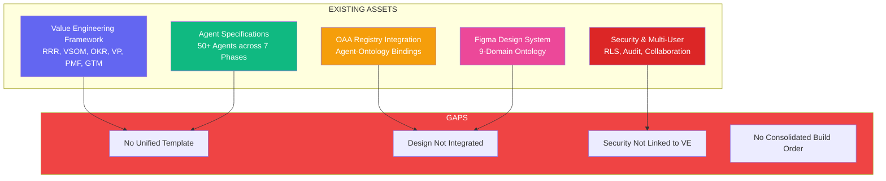

### Gap Analysis

| Gap | Impact | Solution |
|-----|--------|----------|
| No unified template | Inconsistent implementations | Create comprehensive HLD template |
| Design system not integrated | UI/code mismatch | Integrate Figma tokens with agent specs |
| Security patterns not linked | Compliance risks | Connect RLS to VE workflow |
| No consolidated build order | Dependencies unclear | Define critical path and tiers |

---

## Architecture Overview

### System Context Diagram

```mermaid
graph TB
    subgraph "PF-CORE PLATFORM"
        subgraph "LAYER 1: VALUE ENGINEERING"
            VE_STRATEGIC[Strategic Foundation<br/>RRR • VSOM • OKR]
            VE_MARKET[Market Strategy<br/>VP • PMF • GTM]
            VE_CONTEXT[Client-Org Context<br/>Tenant • Instance]
        end
        
        subgraph "LAYER 2: OAA AGENT (CRITICAL PATH)"
            OAA_CORE[OAA Agent<br/>Create • Test • Document]
            REGISTRY[OAA Registry<br/>Ontologies • Bindings]
            ONTOLOGIES[Ontologies<br/>Discovery • Content • VE]
        end
        
        subgraph "LAYER 3: AGENT ECOSYSTEM"
            TIER1[Tier 1: Core Agents<br/>OAA • VE]
            TIER2[Tier 2: Planning Agents<br/>PM • Architect]
            TIER3[Tier 3: Execution Agents<br/>Developer • Test]
        end
        
        subgraph "LAYER 4: DESIGN SYSTEM & UI"
            DESIGN_TOKENS[Design Tokens<br/>Primitive • Semantic • Component]
            FIGMA_MCP[Figma MCP<br/>Extraction • Variables]
            CODE_GEN[Code Generation<br/>React • Next.js • Tailwind]
        end
        
        subgraph "LAYER 5: DATA & API"
            DATABASE[Supabase PostgreSQL<br/>JSONB • RLS]
            API_LAYER[REST API<br/>Zod • Types]
            SECURITY[Security Foundation<br/>Tenant Isolation • Audit]
        end
        
        subgraph "LAYER 6: INTEGRATION"
            ORCHESTRATION[Agent Orchestration<br/>Context • Handoff]
            EXTERNAL[External Integrations<br/>Figma • Airtable • GitHub]
        end
    end
    
    VE_STRATEGIC --> VE_MARKET
    VE_MARKET --> VE_CONTEXT
    VE_CONTEXT --> OAA_CORE
    
    OAA_CORE --> REGISTRY
    REGISTRY --> ONTOLOGIES
    ONTOLOGIES --> TIER1
    
    TIER1 --> TIER2
    TIER2 --> TIER3
    
    TIER3 --> DESIGN_TOKENS
    DESIGN_TOKENS --> FIGMA_MCP
    FIGMA_MCP --> CODE_GEN
    
    CODE_GEN --> DATABASE
    DATABASE --> API_LAYER
    API_LAYER --> SECURITY
    
    SECURITY --> ORCHESTRATION
    ORCHESTRATION --> EXTERNAL
    
    style VE_STRATEGIC fill:#6366F1,color:#fff
    style VE_MARKET fill:#EC4899,color:#fff
    style OAA_CORE fill:#DC2626,color:#fff
    style TIER1 fill:#F59E0B,color:#fff
    style DESIGN_TOKENS fill:#00A4BF,color:#fff
    style DATABASE fill:#0891B2,color:#fff
```

### Complete Data Flow

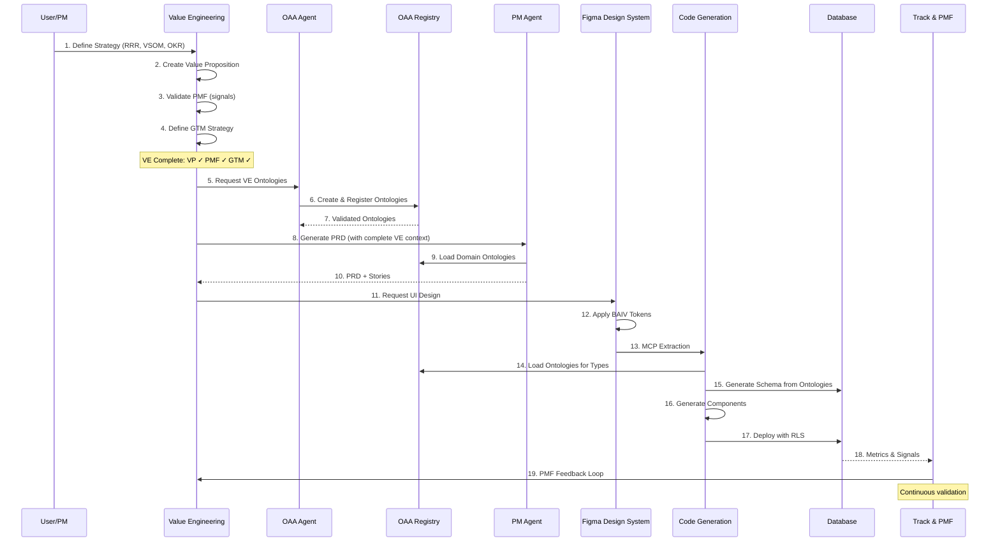

---

## Architecture Layers

### Layer 1: Value Engineering Foundation

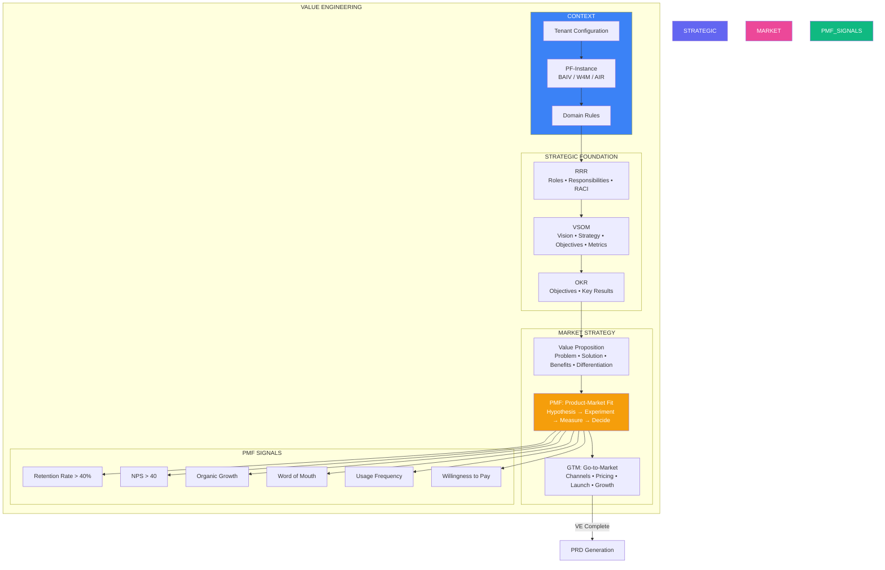

**Key Principle:** VP, PMF, and GTM are WITHIN VE, not separate phases. Must complete before PRD generation.

**PMF Gate:** Only proceed to PRD when PMF signals are strong (retention > 40%, NPS > 40, organic growth evident).

---

### Layer 2: OAA Agent & Ontology System

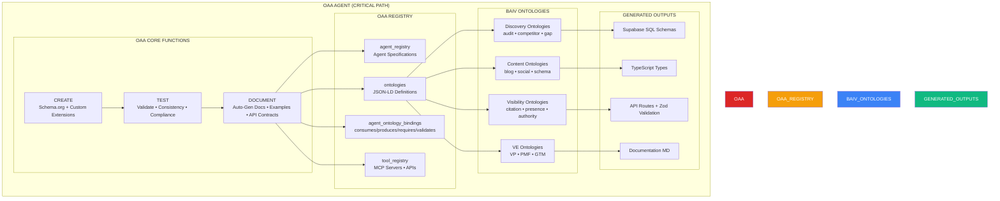

**Why First:** All components depend on validated ontologies for schema generation, type definitions, and API contracts.

**Ontology-Driven Pattern:** Write ontology once → generate schemas, types, APIs, docs automatically.

---

### Layer 3: Agent Ecosystem

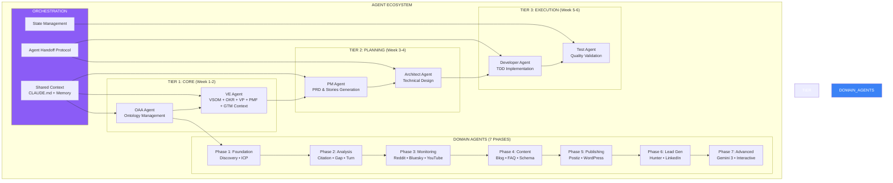

**Design Pattern:** Every agent is standalone + callable. No shared dependencies, no cross-contamination per client.

**Agent Classification:**
- **Orchestrator:** Coordinates workflows (PM, VE, Workflow)
- **Domain Specialist:** Deep expertise (Discovery, Citation, Gap)
- **Utility:** Reusable services (Schema, Meta, Image)
- **Integration:** External systems (WordPress, Airtable, GitHub)

---

### Layer 4: Design System & UI

```mermaid
graph TB
    subgraph "FIGMA DESIGN-TO-CODE PIPELINE"
        subgraph "DESIGN TOKENS (3-TIER)"
            PRIMITIVE[Primitive Tokens<br/>primitive/color/brand/primary → #00A4BF]
            SEMANTIC[Semantic Tokens<br/>semantic/color/primary/default → {brand/primary}]
            COMPONENT[Component Tokens<br/>component/button/primary/background → {primary/default}]
        end
        
        subgraph "DESIGN DOMAINS"
            D1[Primitives<br/>Colors • Dimensions • Typography]
            D2[Semantics<br/>Naming • Hierarchy • Purpose]
            D3[Components<br/>Atoms • Molecules • Organisms]
            D4[Layout<br/>Auto Layout → Flexbox/Grid]
            D5[Behaviour<br/>States • Transitions • Animations]
        end
        
        subgraph "MCP EXTRACTION"
            MCP_DESIGN[get_design_context<br/>Layer Hierarchy • Styles • Layout]
            MCP_VAR[get_variable_defs<br/>Collections • Variables • Modes]
        end
        
        subgraph "CODE GENERATION"
            REACT[React/Next.js<br/>Components + TypeScript]
            TAILWIND[Tailwind CSS<br/>Utility Classes + Config]
            SHADCN[shadcn/ui<br/>Component Library]
        end
        
        subgraph "UI PANELS"
            PM_PANEL[Program Manager<br/>VE Strategic + Market + Context]
            PLAN_PANEL[Plan<br/>VE Summary + PRD + Stories]
            BUILD_PANEL[Build<br/>OAA + Data + TDD + Actions]
            TRACK_PANEL[Track<br/>Progress + Quality + PMF Signals]
        end
    end
    
    PRIMITIVE --> SEMANTIC
    SEMANTIC --> COMPONENT
    
    COMPONENT --> D1
    D1 --> D2
    D2 --> D3
    D3 --> D4
    D4 --> D5
    
    D5 --> MCP_DESIGN
    MCP_DESIGN --> MCP_VAR
    
    MCP_VAR --> REACT
    MCP_VAR --> TAILWIND
    
    REACT --> SHADCN
    TAILWIND --> SHADCN
    
    SHADCN --> PM_PANEL
    SHADCN --> PLAN_PANEL
    SHADCN --> BUILD_PANEL
    SHADCN --> TRACK_PANEL
    
    style DESIGN_TOKENS fill:#00A4BF,color:#fff
    style DESIGN_DOMAINS fill:#E84E1C,color:#fff
    style MCP_EXTRACTION fill:#CEC528,color:#000
    style CODE_GENERATION fill:#019587,color:#fff
    style UI_PANELS fill:#6366F1,color:#fff
```

**BAIV Design Tokens:**
- **Brand:** Primary #00A4BF, Secondary #E84E1C, Accent #CEC528
- **Status:** Success #019587, Warning #CF057D, Error #CEC528, Info #1C3E8E
- **Typography:** Heading (Titillium Web), Body (Open Sans)

---

### Layer 5: Data & API Architecture

```mermaid
graph TB
    subgraph "DATA & API ARCHITECTURE"
        subgraph "DATABASE (Supabase PostgreSQL)"
            TABLES[Standard Table Pattern<br/>id • tenant_id • metadata JSONB • data JSONB]
            RLS[Row Level Security<br/>Tenant Isolation + Service Bypass]
            INDEXES[Indexes<br/>Performance Optimization]
        end
        
        subgraph "SECURITY FOUNDATION"
            CONTEXT_FN[set_tenant_context()<br/>Session Management]
            AUDIT_LOG[audit_log<br/>All Mutations Tracked]
            ORG_STATE[organization_cycle_state<br/>Workflow Management]
            PRESENCE[user_presence<br/>Real-time Collaboration]
            LOCKS[dataset_edit_locks<br/>Concurrent Editing]
        end
        
        subgraph "API LAYER"
            REST[REST Endpoints<br/>Generated from Ontologies]
            ZOD[Zod Validation<br/>Runtime Schema Checks]
            TYPES[TypeScript Types<br/>Compile-time Safety]
            TRANSFORM[Data Transform<br/>Ontology Mapping]
        end
        
        subgraph "ONTOLOGY-DRIVEN FLOW"
            ONT[JSON-LD Ontology]
            GEN[Code Generator]
        end
    end
    
    ONT --> GEN
    
    GEN --> TABLES
    GEN --> REST
    GEN --> TYPES
    
    TABLES --> RLS
    RLS --> INDEXES
    
    CONTEXT_FN --> AUDIT_LOG
    AUDIT_LOG --> ORG_STATE
    ORG_STATE --> PRESENCE
    PRESENCE --> LOCKS
    
    LOCKS --> REST
    
    REST --> ZOD
    ZOD --> TYPES
    TYPES --> TRANSFORM
    
    style DATABASE fill:#0891B2,color:#fff
    style SECURITY_FOUNDATION fill:#DC2626,color:#fff
    style API_LAYER fill:#F59E0B,color:#fff
    style ONTOLOGY_DRIVEN_FLOW fill:#10B981,color:#fff
```

**Database Table Pattern:**
```sql
CREATE TABLE {table_name} (
    id UUID PRIMARY KEY,
    tenant_id UUID NOT NULL,
    -- Core queryable fields
    metadata JSONB DEFAULT '{}',
    data JSONB DEFAULT '{}',
    -- Audit fields
    created_at TIMESTAMPTZ,
    updated_at TIMESTAMPTZ
);
```

**Benefits:**
- Schema evolution without migrations
- Ontology compliance guaranteed
- Query flexibility maintained
- Version tolerance built-in

---

### Layer 6: Integration & Orchestration

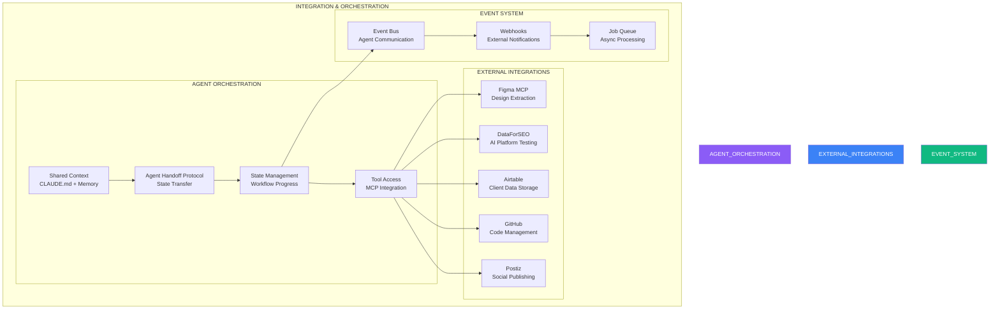

---

## Implementation Roadmap

### 6-Week Timeline

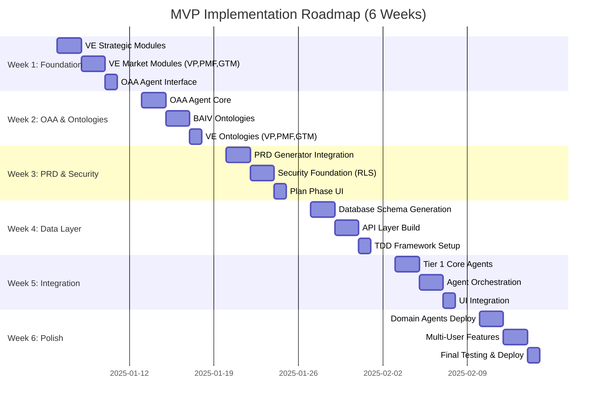

### Week-by-Week Breakdown

#### Week 1: Foundation & VE Complete

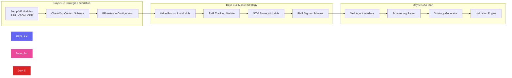

#### Week 2: OAA Agent & Ontologies

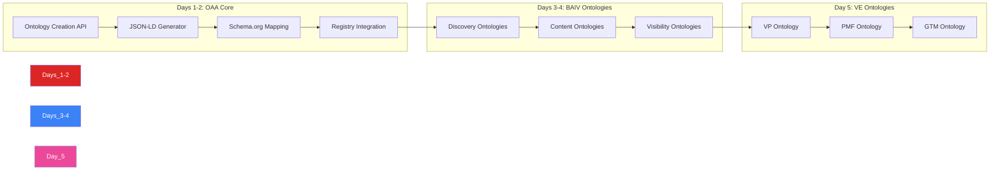

---

## Design System Integration

### Design System Checklist

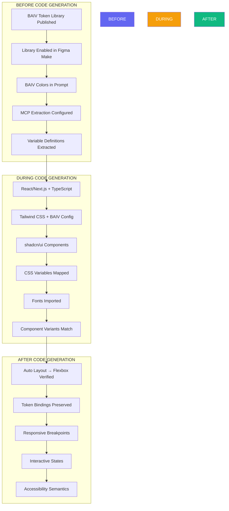

---

## Success Criteria

### MVP Complete Definition

```mermaid
graph TB
    subgraph "MVP SUCCESS CRITERIA"
        subgraph "FOUNDATION"
            F1[✓ OAA Agent: Create, Test, Document]
            F2[✓ VE Strategic: RRR, VSOM, OKR]
            F3[✓ VE Market: VP, PMF, GTM]
            F4[✓ VE to PRD Flow Complete]
        end
        
        subgraph "DEVELOPMENT"
            D1[✓ PRD Generation Automated]
            D2[✓ Plan Phase: Specs & Stories]
            D3[✓ Security: RLS + Audit]
            D4[✓ Build Phase: DB + API from Ontologies]
            D5[✓ TDD: 80%+ Coverage]
        end
        
        subgraph "DESIGN & TRACKING"
            DS1[✓ Design System: BAIV Tokens in Code]
            DS2[✓ Figma→Code Verified]
            DS3[✓ Track Phase: Progress + PMF Signals]
            DS4[✓ PMF Feedback Loop Active]
        end
        
        subgraph "INTEGRATION"
            I1[✓ End-to-End Workflow Operational]
            I2[✓ Agent Orchestration Working]
            I3[✓ Security Verified]
            I4[✓ Documentation Complete]
        end
    end
    
    F1 --> F2 --> F3 --> F4
    F4 --> D1
    D1 --> D2 --> D3 --> D4 --> D5
    D5 --> DS1
    DS1 --> DS2 --> DS3 --> DS4
    DS4 --> I1
    I1 --> I2 --> I3 --> I4
    
    style FOUNDATION fill:#6366F1,color:#fff
    style DEVELOPMENT fill:#F59E0B,color:#fff
    style DESIGN_TRACKING fill:#00A4BF,color:#fff
    style INTEGRATION fill:#10B981,color:#fff
```

### Definition of Done (Every Work Item)

1. **Value Aligned** - ties to VE strategic context
2. **PMF Validated** - evidence of market fit
3. **Ontology Valid** - registered in OAA Registry
4. **Tests First** - TDD approach, red→green→refactor
5. **80%+ Coverage** - verified by Vitest
6. **Documented** - auto-generated from ontologies + manual docs

---

## Templates & Patterns

### Agent Specification Template

See `UNIVERSAL_AGENT_TEMPLATE.md` for complete template with:
- Agent metadata structure
- JSON-LD specification format
- Architecture diagrams (mermaid)
- Ontology binding patterns
- Authority boundary configuration
- Implementation structure
- Testing requirements
- Deployment checklist

### Database Table Pattern

```sql
CREATE TABLE {table_name} (
    id UUID PRIMARY KEY DEFAULT gen_random_uuid(),
    tenant_id UUID NOT NULL REFERENCES tenants(id),
    -- Core queryable fields
    name TEXT,
    status TEXT,
    -- Flexible ontology data
    metadata JSONB DEFAULT '{}',
    data JSONB DEFAULT '{}',
    -- Audit fields
    created_at TIMESTAMPTZ DEFAULT NOW(),
    updated_at TIMESTAMPTZ DEFAULT NOW()
);

-- RLS
ALTER TABLE {table_name} ENABLE ROW LEVEL SECURITY;
CREATE POLICY {table_name}_tenant_isolation ON {table_name}
    FOR ALL USING (tenant_id = current_setting('app.current_tenant_id', true)::UUID);
CREATE POLICY {table_name}_service_bypass ON {table_name}
    FOR ALL TO service_role USING (true);

-- Audit trigger
CREATE TRIGGER {table_name}_audit
    AFTER INSERT OR UPDATE OR DELETE ON {table_name}
    FOR EACH ROW EXECUTE FUNCTION audit_trigger_func();
```

---

## Risk Mitigation

### Technical Risks

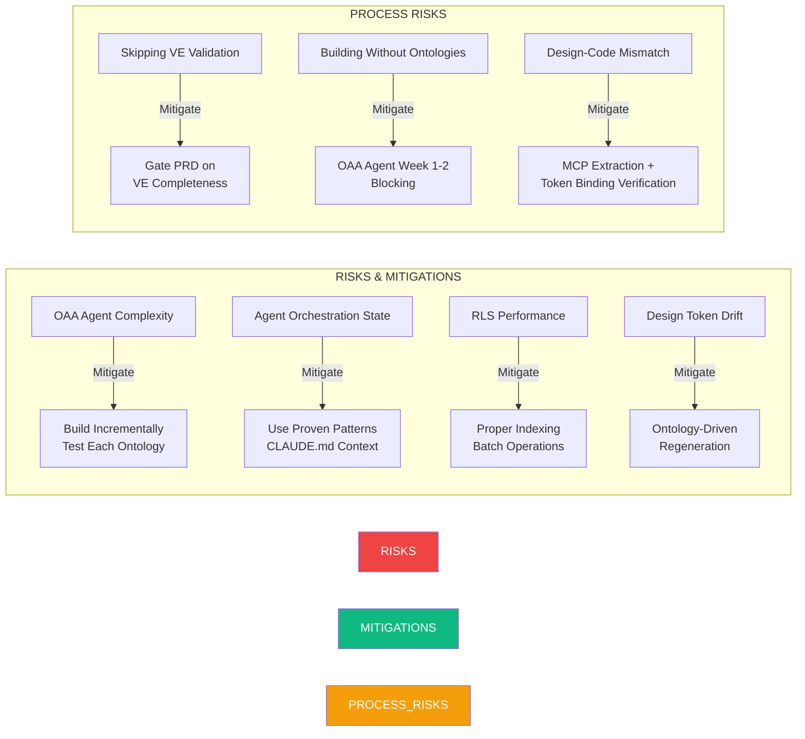

---

## Measurement & Tracking

### Leading Indicators (Week-by-Week)

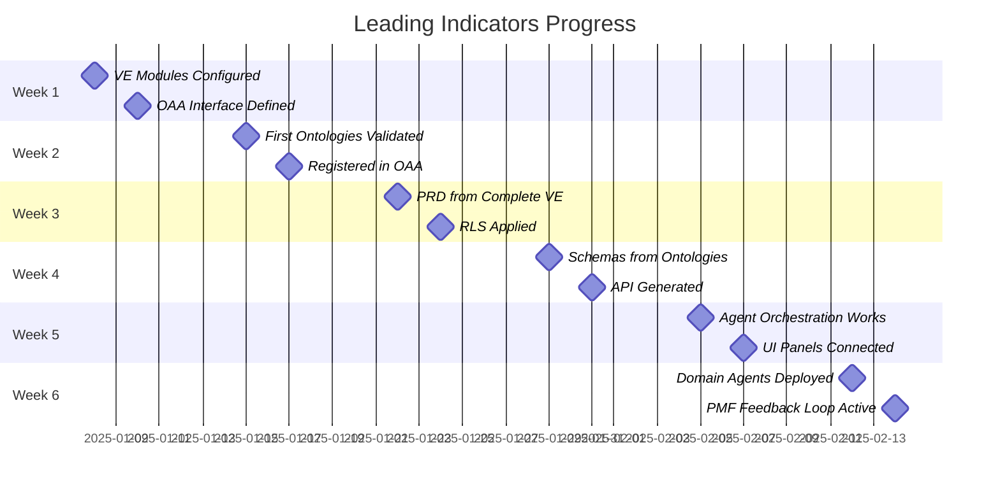

### Key Metrics Dashboard

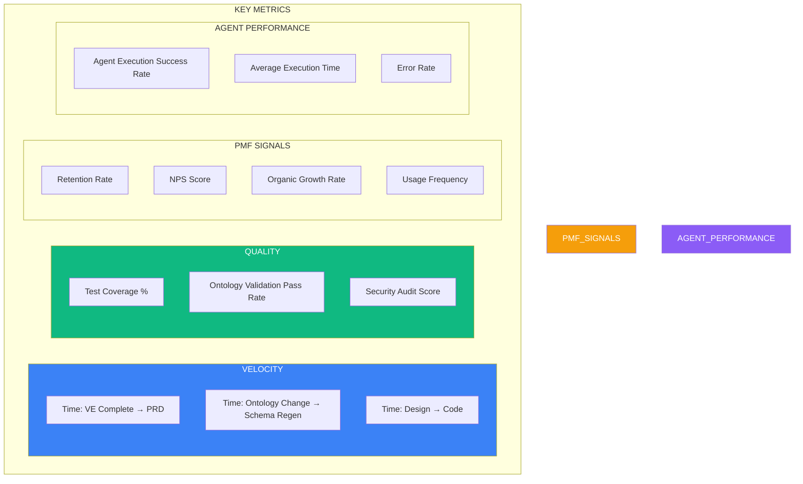

---

## Next Steps

1. **Select Domain** - Choose BAIV, W4M, or AIR for initial implementation
2. **Initialize Repository** - Setup PF-Core structure with domain instance
3. **Week 1 Kickoff** - Begin VE module configuration
4. **OAA Agent Priority** - Dedicate resources to critical path
5. **Design System Prep** - Publish BAIV token library to Figma

---

**Document Version:** 1.0.0  
**Last Updated:** December 30, 2025  
**Maintained By:** PF-Core Platform Team  
**Related Documents:**
- `UNIVERSAL_AGENT_TEMPLATE.md` - Standard agent implementation template
- `PFC_AGENTIC_MVP_VISUAL_GUIDE_v2.2.md` - Detailed VE framework
- `AGENT_BUILD_MASTER_LIST.md` - Complete agent inventory
- `PF-CORE-OAA-AGENT-REGISTRY-INTEGRATION.md` - Registry integration specs
