# High-Level Design: Agentic Solution Implementation Template

**Version:** 1.3.0  
**Date:** December 31, 2025  
**Changelog:**
- v1.3.0 - Added Instance Integration Architecture and PF-Core Module Catalog
- v1.2.0 - Fixed Layer 3-6 mermaid diagrams
- v1.1.0 - Fixed initial mermaid diagram rendering issues
**Scope:** Complete template for agentic solution implementation  
**References:** PFC_AGENTIC_MVP_VISUAL_GUIDE_v2.2.md, AGENT_BUILD_MASTER_LIST.md, PF-CORE-OAA-AGENT-REGISTRY-INTEGRATION.md, PFC-PFI-BAIV_MODULE_CATALOG.md, PFC-PFI-BAIV_INTEGRATION_BRIDGES.md

---

## Table of Contents

1. [Problem Statement](#problem-statement)
2. [Current State Analysis](#current-state-analysis)
3. [Instance Integration Architecture](#instance-integration-architecture)
4. [Architecture Overview](#architecture-overview)
5. [Architecture Layers](#architecture-layers)
6. [Implementation Roadmap](#implementation-roadmap)
7. [Design System Integration](#design-system-integration)
8. [Success Criteria](#success-criteria)
9. [Templates & Patterns](#templates--patterns)
10. [Risk Mitigation](#risk-mitigation)
11. [Measurement & Tracking](#measurement--tracking)

---

## Problem Statement

The HLD-High-level directory contains comprehensive specifications for agentic solutions including Value Engineering frameworks, Agent specifications, OAA Registry integration, Figma design systems, and security requirements. These need consolidation into a unified template that addresses all aspects of agent-based solution implementation while maintaining design consistency and security standards.

---

## Current State Analysis

### Existing Assets

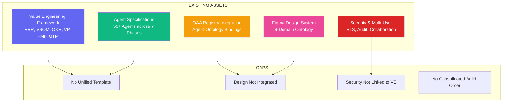

### Gap Analysis

| Gap | Impact | Solution |
|-----|--------|----------|
| No unified template | Inconsistent implementations | Create comprehensive HLD template |
| Design system not integrated | UI/code mismatch | Integrate Figma tokens with agent specs |
| Security patterns not linked | Compliance risks | Connect RLS to VE workflow |
| No consolidated build order | Dependencies unclear | Define critical path and tiers |

---

## Instance Integration Architecture

### Platform Foundation Core (PF-Core) Integration

Every PF-Instance (BAIV, W4M, AIR) leverages a shared **Platform Foundation Core (PF-Core)** containing reusable modules, integration bridges, and patterns. This architecture enables rapid instance deployment while maintaining consistency and reducing duplication.

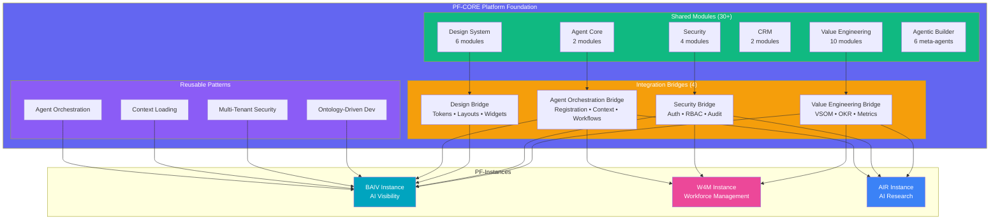

### PF-Core Module Catalog

For complete module inventory and specifications, see **PFC-PFI-BAIV_MODULE_CATALOG.md** which documents:

**Value Engineering Modules (10):**
- VE-VSOM, VE-OKR-Objectives, VE-OKR-Key-Results, VE-Value-Proposition, VE-PMF-Product-Market-Fit, VE-PMF-Signals, VE-GTM-Strategy, VE-GTM-Channels, VE-GTM-Pricing, VE-Business-Models (planned)

**Security Modules (4):**
- SEC-Authentication, SEC-RBAC-Authorization, SEC-Multi-User-Collaboration, SEC-Audit-Logging

**Design System Modules (6):**
- DESIGN-Design-Tokens, DESIGN-Component-Library, DESIGN-Layout-System, DESIGN-Figma-Integration, DESIGN-Theme-Management, DESIGN-Accessibility

**CRM Modules (2):**
- CRM-Customer-Organization, CRM-Universal-Brand

**Agent Core Modules (2):**
- AGENT-OAA-Agent, AGENT-Agent-Orchestrator

**Agentic Builder Meta-Agents (6):**
- META-Program-Manager, META-Platform-Manager, META-Product-Manager, META-Solution-Architect, META-Solution-Builder, META-Test-Driven-Design

### Integration Bridge Configuration

Each bridge provides a **4-level configuration hierarchy**:

1. **Platform Level** - PF-Core defaults (all instances inherit)
2. **Instance Level** - Instance-specific overrides (BAIV, W4M, AIR)
3. **Tenant Level** - Client-specific configuration
4. **User Level** - Personal preferences

**Example: Value Engineering Bridge**
```typescript
interface VEBridgeConfig {
  // Platform → Instance → Tenant → User cascade
  vsom_template: VsomTemplate;      // Customizable at all levels
  okr_structure: OkrStructure;      // Instance and tenant configurable
  pmf_thresholds: PmfThresholds;    // Tenant configurable
  role_mappings: RoleMapping[];     // All levels
}
```

For complete bridge specifications, see:
- **PFC-PFI-BAIV_INTEGRATION_BRIDGES.md** - All 4 bridge architectures
- **PFC-PFI-BAIV_AGENTIC_BUILDER_GUIDE.md** - Meta-agent usage patterns
- **PFC-PFI-BAIV_GAP_ANALYSIS_ARCHITECTURE.md** - Platform vs product gap analysis

### Instance Implementation Pattern

**Step 1: Select PF-Core Modules**
- Review module catalog
- Identify required modules for instance
- Configure bridges

**Step 2: Configure Integration Bridges**
- Value Engineering Bridge (required)
- Security Bridge (required)
- Design Bridge (UI instances)
- Agent Orchestration Bridge (agentic instances)

**Step 3: Extend with Instance-Specific Agents**
- Domain specialists (BAIV: Citation Tester, Gap Analyzer, Content Generator)
- Instance workflows
- Custom ontologies

**Step 4: Apply Reusable Patterns**
- Ontology-driven development
- Multi-tenant security (RLS)
- Context loading
- Agent orchestration

---

## Architecture Overview

### System Context Diagram


### Complete Data Flow


---

## Architecture Layers

### Layer 1: Value Engineering Foundation

**PF-Core Modules:** VE-VSOM, VE-OKR-Objectives, VE-OKR-Key-Results, VE-Value-Proposition, VE-PMF-Product-Market-Fit, VE-PMF-Signals, VE-GTM-Strategy, VE-GTM-Channels, VE-GTM-Pricing, VE-Business-Models

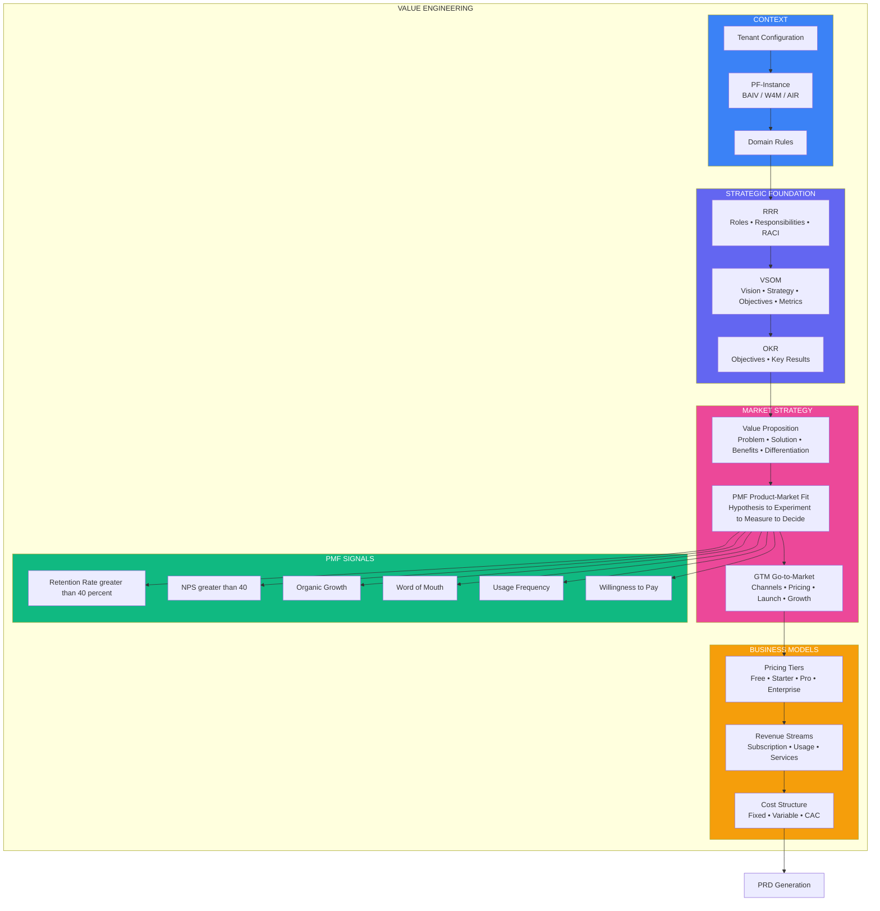

**Key Principle:** VP, PMF, and GTM are WITHIN VE, not separate phases. Must complete before PRD generation.

**PMF Gate:** Only proceed to PRD when PMF signals are strong (retention > 40%, NPS > 40, organic growth evident).

**Business Models:** Define pricing tiers, revenue streams, and cost structure as part of GTM strategy using VE-Business-Models module (planned for Q1 2025).

---

### Layer 2: OAA Agent & Ontology System

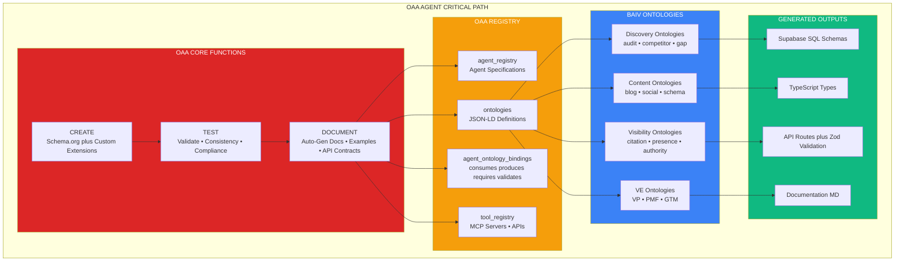

**Why First:** All components depend on validated ontologies for schema generation, type definitions, and API contracts.

**Ontology-Driven Pattern:** Write ontology once → generate schemas, types, APIs, docs automatically.

---

### Layer 3: Agent Ecosystem

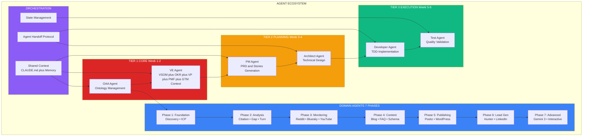

**Design Pattern:** Every agent is standalone + callable. No shared dependencies, no cross-contamination per client.

**Agent Classification:**
- **Orchestrator:** Coordinates workflows (PM, VE, Workflow)
- **Domain Specialist:** Deep expertise (Discovery, Citation, Gap)
- **Utility:** Reusable services (Schema, Meta, Image)
- **Integration:** External systems (WordPress, Airtable, GitHub)

---

### Layer 4: Design System & UI

```mermaid
graph TB
    subgraph PIPELINE["FIGMA DESIGN-TO-CODE PIPELINE"]
        subgraph TOKENS["DESIGN TOKENS 3-TIER"]
            PRIMITIVE["Primitive Tokens<br/>primitive color brand primary to #00A4BF"]
            SEMANTIC["Semantic Tokens<br/>semantic color primary default to brand primary"]
            COMPONENT["Component Tokens<br/>component button primary background to primary default"]
        end
        
        subgraph DOMAINS["DESIGN DOMAINS"]
            D1["Primitives<br/>Colors • Dimensions • Typography"]
            D2["Semantics<br/>Naming • Hierarchy • Purpose"]
            D3["Components<br/>Atoms • Molecules • Organisms"]
            D4["Layout<br/>Auto Layout to Flexbox Grid"]
            D5["Behaviour<br/>States • Transitions • Animations"]
        end
        
        subgraph MCP["MCP EXTRACTION"]
            MCP_DESIGN["get_design_context<br/>Layer Hierarchy • Styles • Layout"]
            MCP_VAR["get_variable_defs<br/>Collections • Variables • Modes"]
        end
        
        subgraph CODEGEN["CODE GENERATION"]
            REACT["React Next.js<br/>Components plus TypeScript"]
            TAILWIND["Tailwind CSS<br/>Utility Classes plus Config"]
            SHADCN["shadcn ui<br/>Component Library"]
        end
        
        subgraph PANELS["UI PANELS"]
            PM_PANEL["Program Manager<br/>VE Strategic plus Market plus Context"]
            PLAN_PANEL["Plan<br/>VE Summary plus PRD plus Stories"]
            BUILD_PANEL["Build<br/>OAA plus Data plus TDD plus Actions"]
            TRACK_PANEL["Track<br/>Progress plus Quality plus PMF Signals"]
        end
    end
    
    PRIMITIVE --> SEMANTIC
    SEMANTIC --> COMPONENT
    
    COMPONENT --> D1
    D1 --> D2
    D2 --> D3
    D3 --> D4
    D4 --> D5
    
    D5 --> MCP_DESIGN
    MCP_DESIGN --> MCP_VAR
    
    MCP_VAR --> REACT
    MCP_VAR --> TAILWIND
    
    REACT --> SHADCN
    TAILWIND --> SHADCN
    
    SHADCN --> PM_PANEL
    SHADCN --> PLAN_PANEL
    SHADCN --> BUILD_PANEL
    SHADCN --> TRACK_PANEL
    
    style TOKENS fill:#00A4BF,color:#fff
    style DOMAINS fill:#E84E1C,color:#fff
    style MCP fill:#CEC528,color:#000
    style CODEGEN fill:#019587,color:#fff
    style PANELS fill:#6366F1,color:#fff
```

**BAIV Design Tokens:**
- **Brand:** Primary #00A4BF, Secondary #E84E1C, Accent #CEC528
- **Status:** Success #019587, Warning #CF057D, Error #CEC528, Info #1C3E8E
- **Typography:** Heading (Titillium Web), Body (Open Sans)

---

### Layer 5: Data & API Architecture

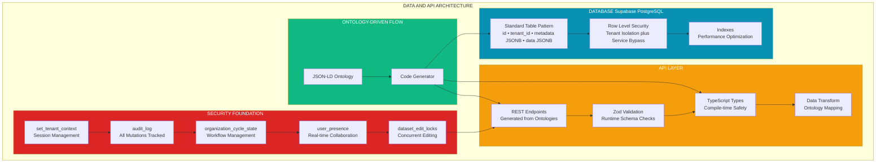

**Database Table Pattern:**
```sql
CREATE TABLE {table_name} (
    id UUID PRIMARY KEY,
    tenant_id UUID NOT NULL,
    -- Core queryable fields
    metadata JSONB DEFAULT '{}',
    data JSONB DEFAULT '{}',
    -- Audit fields
    created_at TIMESTAMPTZ,
    updated_at TIMESTAMPTZ
);
```

**Benefits:**
- Schema evolution without migrations
- Ontology compliance guaranteed
- Query flexibility maintained
- Version tolerance built-in

---

### Layer 6: Integration & Orchestration

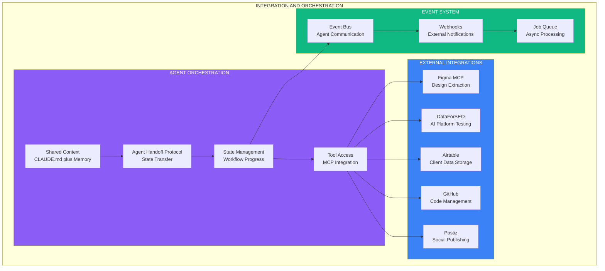

---

## Implementation Roadmap

### 6-Week Timeline


### Week-by-Week Breakdown

#### Week 1: Foundation & VE Complete

```mermaid
graph LR
    subgraph DAYS12["Days 1-2 Strategic Foundation"]
        A1["Setup VE Modules<br/>RRR VSOM OKR"]
        A2["Client-Org Context Schema"]
        A3["PF-Instance Configuration"]
    end
    
    subgraph DAYS34["Days 3-4 Market Strategy"]
        B1["Value Proposition Module"]
        B2["PMF Tracking Module"]
        B3["GTM Strategy Module"]
        B4["PMF Signals Schema"]
    end
    
    subgraph DAY5["Day 5 OAA Start"]
        C1["OAA Agent Interface"]
        C2["Schema.org Parser"]
        C3["Ontology Generator"]
        C4["Validation Engine"]
    end
    
    A1 --> A2 --> A3
    A3 --> B1
    B1 --> B2 --> B3 --> B4
    B4 --> C1
    C1 --> C2 --> C3 --> C4
    
    style DAYS12 fill:#6366F1,color:#fff
    style DAYS34 fill:#EC4899,color:#fff
    style DAY5 fill:#DC2626,color:#fff
```

#### Week 2: OAA Agent & Ontologies

```mermaid
graph LR
    subgraph DAYS12W2["Days 1-2 OAA Core"]
        A["Ontology Creation API"]
        B["JSON-LD Generator"]
        C["Schema.org Mapping"]
        D["Registry Integration"]
    end
    
    subgraph DAYS34W2["Days 3-4 BAIV Ontologies"]
        E["Discovery Ontologies"]
        F["Content Ontologies"]
        G["Visibility Ontologies"]
    end
    
    subgraph DAY5W2["Day 5 VE Ontologies"]
        H["VP Ontology"]
        I["PMF Ontology"]
        J["GTM Ontology"]
    end
    
    A --> B --> C --> D
    D --> E --> F --> G
    G --> H --> I --> J
    
    style DAYS12W2 fill:#DC2626,color:#fff
    style DAYS34W2 fill:#3B82F6,color:#fff
    style DAY5W2 fill:#EC4899,color:#fff
```

---

## Design System Integration

### Design System Checklist

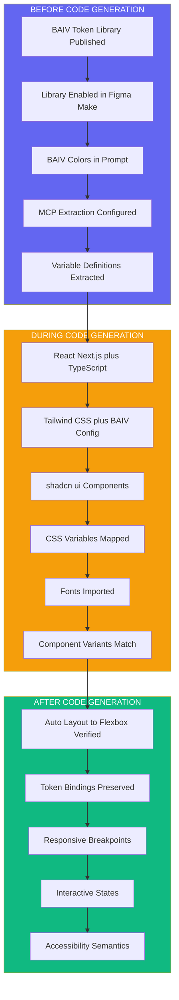

---

## Success Criteria

### MVP Complete Definition

```mermaid
graph TB
    subgraph CRITERIA["MVP SUCCESS CRITERIA"]
        subgraph FOUNDATION["FOUNDATION"]
            F1["Complete OAA Agent: Create Test Document"]
            F2["Complete VE Strategic: RRR VSOM OKR"]
            F3["Complete VE Market: VP PMF GTM"]
            F4["Complete VE to PRD Flow"]
        end
        
        subgraph DEVELOPMENT["DEVELOPMENT"]
            D1["Complete PRD Generation Automated"]
            D2["Complete Plan Phase: Specs and Stories"]
            D3["Complete Security: RLS plus Audit"]
            D4["Complete Build Phase: DB plus API from Ontologies"]
            D5["Complete TDD: 80 percent plus Coverage"]
        end
        
        subgraph DESIGN["DESIGN AND TRACKING"]
            DS1["Complete Design System: BAIV Tokens in Code"]
            DS2["Complete Figma to Code Verified"]
            DS3["Complete Track Phase: Progress plus PMF Signals"]
            DS4["Complete PMF Feedback Loop Active"]
        end
        
        subgraph INTEGRATION["INTEGRATION"]
            I1["Complete End-to-End Workflow Operational"]
            I2["Complete Agent Orchestration Working"]
            I3["Complete Security Verified"]
            I4["Complete Documentation Complete"]
        end
    end
    
    F1 --> F2 --> F3 --> F4
    F4 --> D1
    D1 --> D2 --> D3 --> D4 --> D5
    D5 --> DS1
    DS1 --> DS2 --> DS3 --> DS4
    DS4 --> I1
    I1 --> I2 --> I3 --> I4
    
    style FOUNDATION fill:#6366F1,color:#fff
    style DEVELOPMENT fill:#F59E0B,color:#fff
    style DESIGN fill:#00A4BF,color:#fff
    style INTEGRATION fill:#10B981,color:#fff
```

### Definition of Done (Every Work Item)

1. **Value Aligned** - ties to VE strategic context
2. **PMF Validated** - evidence of market fit
3. **Ontology Valid** - registered in OAA Registry
4. **Tests First** - TDD approach, red→green→refactor
5. **80%+ Coverage** - verified by Vitest
6. **Documented** - auto-generated from ontologies + manual docs

---

## Templates & Patterns

### Agent Specification Template

See `UNIVERSAL_AGENT_TEMPLATE.md` for complete template with:
- Agent metadata structure
- JSON-LD specification format
- Architecture diagrams (mermaid)
- Ontology binding patterns
- Authority boundary configuration
- Implementation structure
- Testing requirements
- Deployment checklist

### Database Table Pattern

```sql
CREATE TABLE {table_name} (
    id UUID PRIMARY KEY DEFAULT gen_random_uuid(),
    tenant_id UUID NOT NULL REFERENCES tenants(id),
    -- Core queryable fields
    name TEXT,
    status TEXT,
    -- Flexible ontology data
    metadata JSONB DEFAULT '{}',
    data JSONB DEFAULT '{}',
    -- Audit fields
    created_at TIMESTAMPTZ DEFAULT NOW(),
    updated_at TIMESTAMPTZ DEFAULT NOW()
);

-- RLS
ALTER TABLE {table_name} ENABLE ROW LEVEL SECURITY;
CREATE POLICY {table_name}_tenant_isolation ON {table_name}
    FOR ALL USING (tenant_id = current_setting('app.current_tenant_id', true)::UUID);
CREATE POLICY {table_name}_service_bypass ON {table_name}
    FOR ALL TO service_role USING (true);

-- Audit trigger
CREATE TRIGGER {table_name}_audit
    AFTER INSERT OR UPDATE OR DELETE ON {table_name}
    FOR EACH ROW EXECUTE FUNCTION audit_trigger_func();
```

---

## Risk Mitigation

### Technical Risks

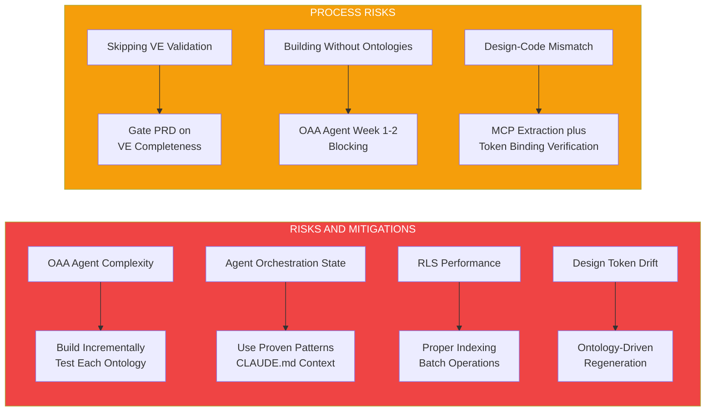

---

## Measurement & Tracking

### Leading Indicators (Week-by-Week)


### Key Metrics Dashboard

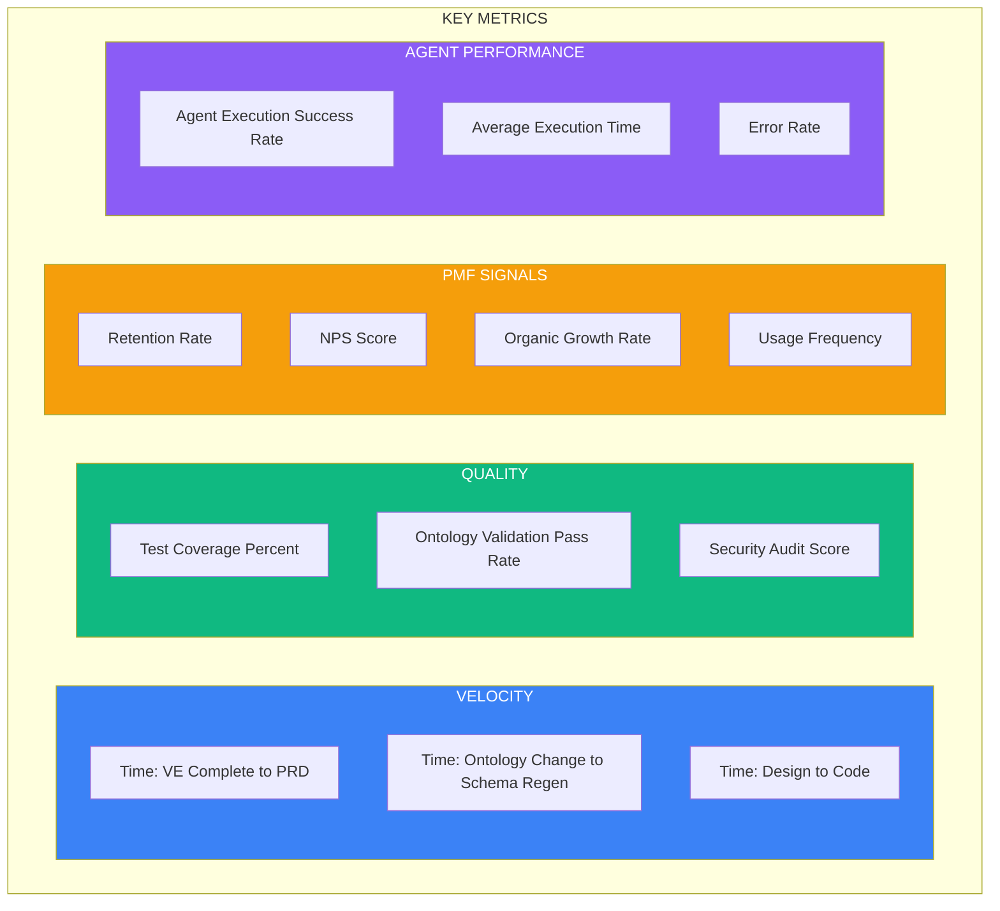

---

## Next Steps

1. **Select Domain** - Choose BAIV, W4M, or AIR for initial implementation
2. **Initialize Repository** - Setup PF-Core structure with domain instance
3. **Week 1 Kickoff** - Begin VE module configuration
4. **OAA Agent Priority** - Dedicate resources to critical path
5. **Design System Prep** - Publish BAIV token library to Figma

---

**Document Version:** 1.3.0  
**Last Updated:** December 31, 2025  
**Maintained By:** PF-Core Platform Team  
**Related Documents:**
- `UNIVERSAL_AGENT_TEMPLATE.md` - Standard agent implementation template
- `PFC_AGENTIC_MVP_VISUAL_GUIDE_v2.2.md` - Detailed VE framework
- `AGENT_BUILD_MASTER_LIST.md` - Complete agent inventory
- `PF-CORE-OAA-AGENT-REGISTRY-INTEGRATION.md` - Registry integration specs
- `PFC-PFI-BAIV_MODULE_CATALOG.md` - Complete PF-Core module inventory
- `PFC-PFI-BAIV_INTEGRATION_BRIDGES.md` - Integration bridge specifications
- `PFC-PFI-BAIV_AGENTIC_BUILDER_GUIDE.md` - Meta-agent build patterns
- `PFC-PFI-BAIV_GAP_ANALYSIS_ARCHITECTURE.md` - Dual-layer gap analysis
