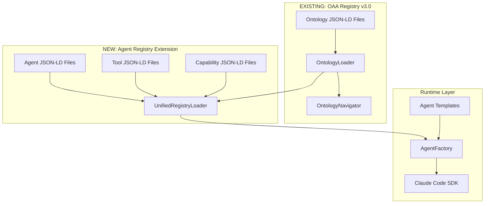
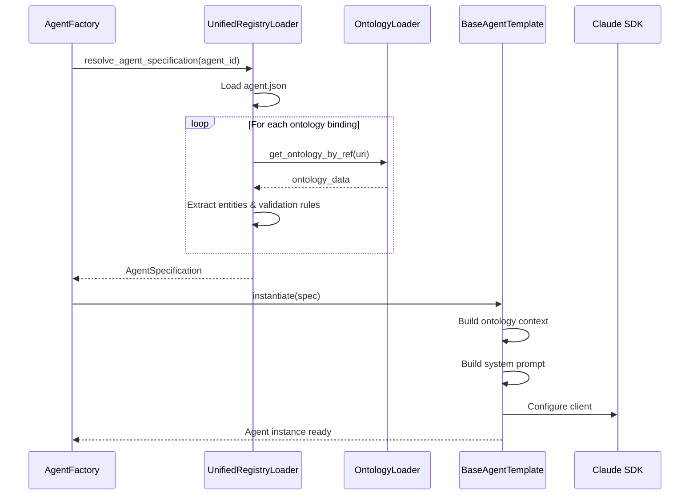

# PF-Core Unified OAA Registry Integration

**Extending OAA Registry v3.0 with Agent Registry & Claude Code SDK**

| Attribute | Value |
|-----------|-------|
| **Document Version** | 2.0.0 |
| **Date** | December 2025 |
| **Classification** | Technical Architecture |
| **Status** | APPROVED |
| **Extends** | OAA Registry v3.0 |
| **Integrates With** | OntologyLoader, OntologyNavigator, Claude Code SDK |

---

## Executive Summary

This document defines the integration architecture that extends the **existing OAA Registry v3.0** to include:

1. **Agent Registry** - Agent specifications with ontology bindings
2. **Tool Registry** - MCP integrations and external services
3. **Capability Registry** - Reusable cross-agent functions

The integration builds upon the existing `OntologyLoader` and `OntologyNavigator` classes, adding semantic agent-ontology binding that enables intelligent orchestration through the knowledge graph. All agents are implemented using **Claude Code SDK** with template-based patterns.

---

## Table of Contents

1. [Current OAA Registry Structure](#1-current-oaa-registry-structure)
2. [Unified Registry Architecture](#2-unified-registry-architecture)
3. [Agent Registry Extension](#3-agent-registry-extension)
4. [Claude Code SDK Integration](#4-claude-code-sdk-integration)
5. [Agent Templates](#5-agent-templates)
6. [Ontology-Agent Binding](#6-ontology-agent-binding)
7. [Implementation](#7-implementation)
8. [Migration Plan](#8-migration-plan)

---

## 1. Current OAA Registry Structure

### 1.1 Existing Ontology File Structure

The current OAA Registry v3.0 uses JSON-LD ontology files:

```
ontologies/
├── 01-ai-visibility-ontology.json      # AI platform visibility
├── 02-universal-brand-ontology.json    # Brand & discovery
├── 03-customer-organization-ontology.json  # Customer profiles
├── 04-gap-analysis-ontology.json       # Gap identification
├── 05-cmo-okr-ontology.json           # Marketing OKRs
├── ontology-loader.py                  # OntologyLoader class
├── ontology-relationships.md           # Cross-ontology mappings
└── README.md                           # Usage documentation
```

### 1.2 Existing Ontology JSON-LD Structure

```json
{
  "@context": {
    "@vocab": "https://schema.org/",
    "baiv": "https://baiv.co.uk/ontology/",
    "owl": "http://www.w3.org/2002/07/owl#",
    "rdfs": "http://www.w3.org/2000/01/rdf-schema#"
  },
  "@type": "Ontology",
  "@id": "baiv:ontology:<name>",
  "name": "Ontology Name",
  "version": "1.0.0",
  "description": "Purpose description",
  "dateCreated": "ISO8601",
  "dateModified": "ISO8601",
  "creator": "BAIV Ontology Architect",
  "domain": "Domain classification",
  "purpose": "Use case description",
  
  "schemaOrgAlignment": {
    "baseTypes": ["schema.org types"],
    "rationale": "Why these types",
    "extensions": ["Custom extensions"]
  },
  
  "entities": [
    {
      "@type": "baiv:EntityDefinition",
      "@id": "baiv:EntityName",
      "name": "EntityName",
      "schemaOrgBase": "schema:BaseType",
      "description": "Entity description",
      "properties": [
        {
          "name": "propertyName",
          "type": "Text|Number|Date|Object|ItemList",
          "required": true|false,
          "schemaOrgProperty": "schema:property",
          "description": "Property description",
          "constraints": {},
          "example": "Example value"
        }
      ]
    }
  ],
  
  "relationshipMappings": {
    "relationships": [
      {
        "from": "EntityA",
        "to": "EntityB",
        "relationship": "HAS_RELATIONSHIP",
        "cardinality": "1:1|1:N|N:N"
      }
    ]
  }
}
```

### 1.3 Existing OntologyLoader Class

```python
class OntologyLoader:
    """Current implementation - load and validate ontologies"""
    
    def __init__(self, ontologies_dir: str = "ontologies"):
        self.ontologies_dir = Path(ontologies_dir)
        self.loaded_ontologies: Dict[str, Dict] = {}
        self.validation_errors: Dict[str, List[str]] = {}
    
    def load(self, filename: str) -> Optional[Dict]
    def load_all(self) -> Dict[str, Dict]
    def validate_ontology(self, filename: str, data: Dict) -> bool
    def get_ontology(self, filename: str) -> Optional[Dict]
    def get_ontology_by_type(self, ontology_type: str) -> Optional[Dict]
    def list_loaded_ontologies(self) -> List[str]

class OntologyNavigator:
    """Current implementation - query loaded ontologies"""
    
    def get_query_categories(self, platform: Optional[str] = None) -> List[Dict]
    def get_content_formats(self) -> List[Dict]
    def get_discovery_pathways(self) -> Dict
    def get_platform_behavior(self, platform: str) -> Optional[Dict]
```

---

## 2. Unified Registry Architecture

### 2.1 Extended Registry Model

```
┌─────────────────────────────────────────────────────────────────────────────┐
│                    UNIFIED OAA REGISTRY v4.0                                 │
│              (Extends OAA Registry v3.0 with Agent Integration)              │
├─────────────────────────────────────────────────────────────────────────────┤
│                                                                             │
│  ┌─────────────────────────────────────────────────────────────────────┐   │
│  │                 EXISTING: OAA Registry v3.0                          │   │
│  │                                                                      │   │
│  │  ┌─────────────────────────────────────────────────────────────┐    │   │
│  │  │  ONTOLOGY REGISTRY (JSON-LD Files)                          │    │   │
│  │  │                                                              │    │   │
│  │  │  • 01-ai-visibility-ontology.json                           │    │   │
│  │  │  • 02-universal-brand-ontology.json                         │    │   │
│  │  │  • 03-customer-organization-ontology.json                   │    │   │
│  │  │  • 04-gap-analysis-ontology.json                            │    │   │
│  │  │  • 05-cmo-okr-ontology.json                                 │    │   │
│  │  │  • 06-vsom-ontology.json (NEW)                              │    │   │
│  │  └─────────────────────────────────────────────────────────────┘    │   │
│  │                                                                      │   │
│  │  ┌─────────────────────────────────────────────────────────────┐    │   │
│  │  │  OntologyLoader + OntologyNavigator                         │    │   │
│  │  └─────────────────────────────────────────────────────────────┘    │   │
│  └─────────────────────────────────────────────────────────────────────┘   │
│                                    │                                        │
│                                    ▼                                        │
│  ┌─────────────────────────────────────────────────────────────────────┐   │
│  │                 NEW: Agent Registry Extension                        │   │
│  │                                                                      │   │
│  │  ┌───────────────┐   ┌───────────────┐   ┌───────────────┐         │   │
│  │  │    AGENT      │   │     TOOL      │   │  CAPABILITY   │         │   │
│  │  │   REGISTRY    │   │   REGISTRY    │   │   REGISTRY    │         │   │
│  │  │               │   │               │   │               │         │   │
│  │  │ • Agent specs │   │ • MCP tools   │   │ • Functions   │         │   │
│  │  │ • Authority   │   │ • APIs        │   │ • Patterns    │         │   │
│  │  │ • Ontology    │   │ • Credentials │   │ • Composition │         │   │
│  │  │   bindings    │   │               │   │   rules       │         │   │
│  │  └───────┬───────┘   └───────┬───────┘   └───────┬───────┘         │   │
│  │          │                   │                   │                  │   │
│  │          └───────────────────┼───────────────────┘                  │   │
│  │                              ▼                                      │   │
│  │  ┌─────────────────────────────────────────────────────────────┐   │   │
│  │  │  UnifiedRegistryLoader + AgentNavigator                     │   │   │
│  │  └─────────────────────────────────────────────────────────────┘   │   │
│  └─────────────────────────────────────────────────────────────────────┘   │
│                                    │                                        │
│                                    ▼                                        │
│  ┌─────────────────────────────────────────────────────────────────────┐   │
│  │              REGISTRY GRAPH (Knowledge Graph Layer)                  │   │
│  │                                                                      │   │
│  │    Ontology ◄──[consumes]──── Agent ────[requires_tool]──► Tool     │   │
│  │       │                         │                            │       │   │
│  │       │                         │                            │       │   │
│  │   [extends]              [implements]                  [implements]  │   │
│  │       │                         │                            │       │   │
│  │       ▼                         ▼                            ▼       │   │
│  │    Ontology               Capability ◄───────────────► Capability   │   │
│  │                                                                      │   │
│  └─────────────────────────────────────────────────────────────────────┘   │
│                                                                             │
└─────────────────────────────────────────────────────────────────────────────┘
```

### 2.2 File Structure Extension

```
registry/
├── ontologies/                          # EXISTING - unchanged
│   ├── 01-ai-visibility-ontology.json
│   ├── 02-universal-brand-ontology.json
│   ├── 03-customer-organization-ontology.json
│   ├── 04-gap-analysis-ontology.json
│   ├── 05-cmo-okr-ontology.json
│   ├── 06-vsom-ontology.json           # NEW
│   ├── ontology-loader.py              # EXISTING - extended
│   └── README.md
│
├── agents/                              # NEW
│   ├── platform/
│   │   ├── master-orchestrator.agent.json
│   │   ├── strategic-context.agent.json
│   │   └── health-monitor.agent.json
│   ├── baiv/
│   │   ├── content-strategy.agent.json
│   │   ├── visibility-analysis.agent.json
│   │   ├── gap-analysis.agent.json
│   │   └── report-generator.agent.json
│   ├── w4m/
│   │   ├── value-engineering.agent.json
│   │   ├── program-manager.agent.json
│   │   └── roi-tracking.agent.json
│   ├── air/
│   │   ├── ai-strategy.agent.json
│   │   ├── maturity-assessment.agent.json
│   │   └── innovation.agent.json
│   └── agent-loader.py                  # NEW
│
├── tools/                               # NEW
│   ├── mcp/
│   │   ├── figma-bridge.tool.json
│   │   └── supabase-client.tool.json
│   ├── integrations/
│   │   ├── claude-api.tool.json
│   │   └── web-search.tool.json
│   └── tool-loader.py                   # NEW
│
├── capabilities/                        # NEW
│   ├── graph-traversal.capability.json
│   ├── schema-validation.capability.json
│   └── capability-loader.py             # NEW
│
├── templates/                           # NEW - Claude Code SDK templates
│   ├── base-agent.template.py
│   ├── domain-agent.template.py
│   ├── integration-agent.template.py
│   └── orchestrator-agent.template.py
│
└── unified-registry-loader.py           # NEW - unified access
```

---

## 3. Agent Registry Extension

### 3.1 Agent Specification JSON-LD Structure

Following the same JSON-LD pattern as existing ontologies:

```json
{
  "@context": {
    "@vocab": "https://schema.org/",
    "pf": "https://platform-foundation.io/agent/",
    "baiv": "https://baiv.co.uk/ontology/",
    "owl": "http://www.w3.org/2002/07/owl#"
  },
  "@type": "pf:AgentSpecification",
  "@id": "pf:agent:baiv-content-strategy-1.0",
  
  "name": "Content Strategy Agent",
  "version": "1.0.0",
  "description": "Analyzes brand positioning and generates content recommendations",
  "dateCreated": "2025-12-01",
  "dateModified": "2025-12-20",
  "creator": "BAIV Platform Team",
  
  "classification": {
    "agentType": "domain_specialist",
    "domain": "baiv",
    "tier": "tier2",
    "class": 3
  },
  
  "ontologyBindings": {
    "description": "Ontologies this agent interacts with",
    "consumes": [
      {
        "@ref": "baiv:ontology:ai-visibility",
        "version": "1.1.0",
        "nodeTypes": ["QueryCategory", "PlatformBehavior", "ContentFormat"],
        "purpose": "Understand AI platform behavior and content requirements"
      },
      {
        "@ref": "baiv:ontology:universal-brand",
        "version": "1.0.0",
        "nodeTypes": ["DiscoveryPathway", "BrandCore", "ValueProposition"],
        "purpose": "Access brand context and discovery pathways"
      },
      {
        "@ref": "baiv:ontology:gap-analysis",
        "version": "1.1.0",
        "nodeTypes": ["Gap", "ImprovementOpportunity"],
        "purpose": "Read identified gaps for strategy development"
      }
    ],
    "produces": [
      {
        "@ref": "pf:ontology:content-recommendation",
        "version": "1.0.0",
        "nodeTypes": ["ContentRecommendation", "PriorityScore", "ContentPlan"],
        "purpose": "Generate content strategy outputs"
      }
    ],
    "requires": [
      {
        "@ref": "pf:ontology:vsom",
        "version": "1.0.0",
        "nodeTypes": ["VisionStatement", "StrategicObjective"],
        "purpose": "Strategic alignment context"
      }
    ]
  },
  
  "authorityBoundary": {
    "tier1Access": {
      "read": true,
      "write": false,
      "nodeTypes": ["vsom_vision", "vsom_strategy", "vsom_objective"]
    },
    "tier2Access": {
      "domains": ["baiv"],
      "read": true,
      "write": true,
      "nodeTypes": ["content_strategy", "gap_analysis", "brand_positioning"]
    },
    "tier3Access": {
      "tenantScope": "current",
      "read": true,
      "write": true,
      "nodeTypes": ["customer_brand", "content_recommendation", "discovery_path"]
    },
    "allowedActions": [
      "graph_read",
      "graph_write",
      "edge_create",
      "traverse_down",
      "traverse_lateral"
    ],
    "prohibitedActions": [
      "graph_delete",
      "traverse_up",
      "export"
    ],
    "limits": {
      "maxNodesPerQuery": 200,
      "maxTraversalDepth": 4,
      "rateLimitPerMinute": 30
    }
  },
  
  "claudeConfig": {
    "model": "claude-sonnet-4-20250514",
    "maxTokens": 4096,
    "temperature": 0.7,
    "systemPromptTemplate": "domain-agent-prompt.md",
    "tools": [
      "read_strategic_context",
      "read_domain_graph",
      "read_tenant_graph",
      "write_tenant_node",
      "analyze_gaps",
      "generate_recommendations"
    ]
  },
  
  "dependencies": {
    "requiredAgents": [
      "pf:agent:strategic-context-1.0"
    ],
    "optionalAgents": [
      "pf:agent:baiv-gap-analysis-1.0"
    ],
    "requiredTools": [
      "pf:tool:claude-api",
      "pf:tool:supabase-graph"
    ]
  },
  
  "implementation": {
    "templateBase": "domain-agent.template.py",
    "entryPoint": "agents/baiv/content_strategy_agent.py",
    "className": "ContentStrategyAgent"
  },
  
  "testing": {
    "requiredCoverage": 85,
    "testSuites": ["unit", "integration", "authority", "tenant_isolation"],
    "performanceTargets": {
      "maxResponseTimeMs": 5000,
      "maxMemoryMb": 1024
    }
  }
}
```

### 3.2 Agent-Ontology Relationship Types

```
┌─────────────────────────────────────────────────────────────────────────────┐
│                    AGENT-ONTOLOGY RELATIONSHIPS                              │
├─────────────────────────────────────────────────────────────────────────────┤
│                                                                             │
│  CONSUMES ──────────────────────────────────────────────────────────────   │
│  Agent reads instances of this ontology                                     │
│  Example: Content Strategy Agent CONSUMES ai-visibility-ontology            │
│  → Agent can read QueryCategory, PlatformBehavior nodes                     │
│                                                                             │
│  PRODUCES ──────────────────────────────────────────────────────────────   │
│  Agent creates instances of this ontology                                   │
│  Example: Content Strategy Agent PRODUCES content-recommendation-ontology   │
│  → Agent can write ContentRecommendation, PriorityScore nodes               │
│                                                                             │
│  REQUIRES ──────────────────────────────────────────────────────────────   │
│  Agent needs this ontology for context (read-only strategic)                │
│  Example: Content Strategy Agent REQUIRES vsom-ontology                     │
│  → Agent reads VSOM context but cannot write to it                          │
│                                                                             │
│  VALIDATES_AGAINST ─────────────────────────────────────────────────────   │
│  Agent validates outputs against this ontology schema                       │
│  Example: All agents VALIDATE_AGAINST schema-org-base                       │
│  → All outputs must pass schema.org compliance                              │
│                                                                             │
└─────────────────────────────────────────────────────────────────────────────┘
```

---

## 4. Claude Code SDK Integration

### 4.1 Integration Architecture

```
┌─────────────────────────────────────────────────────────────────────────────┐
│                    CLAUDE CODE SDK INTEGRATION                               │
├─────────────────────────────────────────────────────────────────────────────┤
│                                                                             │
│  ┌─────────────────────────────────────────────────────────────────────┐   │
│  │                    AGENT INSTANTIATION FLOW                          │   │
│  │                                                                      │   │
│  │   1. Load Agent Spec ──► 2. Resolve Ontology Bindings               │   │
│  │          │                         │                                 │   │
│  │          ▼                         ▼                                 │   │
│  │   agent.json file          OntologyLoader.get_ontology()            │   │
│  │                                    │                                 │   │
│  │                                    ▼                                 │   │
│  │   3. Load Template ◄────── Ontology Context Injection               │   │
│  │          │                                                           │   │
│  │          ▼                                                           │   │
│  │   4. Configure Claude SDK ──► 5. Build System Prompt                │   │
│  │          │                         │                                 │   │
│  │          ▼                         ▼                                 │   │
│  │   Anthropic client         Ontology-aware prompt with:              │   │
│  │   + tools config           - Entity definitions                      │   │
│  │                            - Property schemas                        │   │
│  │                            - Validation rules                        │   │
│  │                            - Relationship mappings                   │   │
│  │                                    │                                 │   │
│  │                                    ▼                                 │   │
│  │   6. Instantiate Agent ────► Ready for execution                    │   │
│  │                                                                      │   │
│  └─────────────────────────────────────────────────────────────────────┘   │
│                                                                             │
└─────────────────────────────────────────────────────────────────────────────┘
```

### 4.2 Extended OntologyLoader

```python
"""
Extended OntologyLoader with Agent Registry Support
Extends existing OntologyLoader to include agent, tool, and capability loading
"""

from pathlib import Path
from typing import Dict, List, Optional, Any, Set
import json
from dataclasses import dataclass, field

# Import existing loader
from ontologies.ontology_loader import OntologyLoader, OntologyNavigator


@dataclass
class OntologyBinding:
    """Resolved ontology binding for an agent"""
    ontology_uri: str
    ontology_version: str
    ontology_data: Dict[str, Any]
    node_types: List[str]
    entities: Dict[str, Any]
    validation_rules: Dict[str, Any]
    relationship_mappings: List[Dict]


@dataclass 
class AgentAuthorityBoundary:
    """Authority boundary extracted from agent spec"""
    agent_id: str
    agent_type: str
    venture_domain: str
    
    tier1_access: Dict = field(default_factory=dict)
    tier2_access: Dict = field(default_factory=dict)
    tier3_access: Dict = field(default_factory=dict)
    
    allowed_actions: List[str] = field(default_factory=list)
    prohibited_actions: List[str] = field(default_factory=list)
    limits: Dict = field(default_factory=dict)


@dataclass
class AgentSpecification:
    """Complete agent specification with resolved bindings"""
    agent_id: str
    name: str
    version: str
    classification: Dict
    authority: AgentAuthorityBoundary
    ontology_bindings: Dict[str, List[OntologyBinding]]
    claude_config: Dict
    dependencies: Dict
    implementation: Dict


class UnifiedRegistryLoader:
    """
    Unified loader for ontologies, agents, tools, and capabilities.
    Extends existing OntologyLoader functionality.
    """
    
    def __init__(self, registry_dir: str = "registry"):
        self.registry_dir = Path(registry_dir)
        
        # Initialize existing ontology loader
        self.ontology_loader = OntologyLoader(
            str(self.registry_dir / "ontologies")
        )
        self.ontology_navigator = OntologyNavigator(self.ontology_loader)
        
        # New registries
        self.agents: Dict[str, Dict] = {}
        self.tools: Dict[str, Dict] = {}
        self.capabilities: Dict[str, Dict] = {}
        
        # Relationship graph
        self.registry_edges: List[Dict] = []
    
    def load_all(self) -> Dict[str, Any]:
        """Load all registry components"""
        result = {
            'ontologies': self.ontology_loader.load_all(),
            'agents': self._load_agents(),
            'tools': self._load_tools(),
            'capabilities': self._load_capabilities()
        }
        
        # Build relationship graph
        self._build_registry_graph()
        
        return result
    
    def _load_agents(self) -> Dict[str, Dict]:
        """Load all agent specifications"""
        agents_dir = self.registry_dir / "agents"
        
        if not agents_dir.exists():
            print(f"⚠️  Agents directory not found: {agents_dir}")
            return {}
        
        # Load from all domain subdirectories
        for domain_dir in agents_dir.iterdir():
            if domain_dir.is_dir():
                for agent_file in domain_dir.glob("*.agent.json"):
                    try:
                        with open(agent_file, 'r') as f:
                            agent_data = json.load(f)
                        
                        agent_id = agent_data.get('@id', agent_file.stem)
                        self.agents[agent_id] = agent_data
                        print(f"✅ Loaded agent: {agent_id}")
                        
                    except Exception as e:
                        print(f"❌ Error loading {agent_file}: {e}")
        
        return self.agents
    
    def _load_tools(self) -> Dict[str, Dict]:
        """Load all tool specifications"""
        tools_dir = self.registry_dir / "tools"
        
        if not tools_dir.exists():
            return {}
        
        for tool_file in tools_dir.rglob("*.tool.json"):
            try:
                with open(tool_file, 'r') as f:
                    tool_data = json.load(f)
                
                tool_id = tool_data.get('@id', tool_file.stem)
                self.tools[tool_id] = tool_data
                print(f"✅ Loaded tool: {tool_id}")
                
            except Exception as e:
                print(f"❌ Error loading {tool_file}: {e}")
        
        return self.tools
    
    def _load_capabilities(self) -> Dict[str, Dict]:
        """Load all capability specifications"""
        cap_dir = self.registry_dir / "capabilities"
        
        if not cap_dir.exists():
            return {}
        
        for cap_file in cap_dir.glob("*.capability.json"):
            try:
                with open(cap_file, 'r') as f:
                    cap_data = json.load(f)
                
                cap_id = cap_data.get('@id', cap_file.stem)
                self.capabilities[cap_id] = cap_data
                print(f"✅ Loaded capability: {cap_id}")
                
            except Exception as e:
                print(f"❌ Error loading {cap_file}: {e}")
        
        return self.capabilities
    
    def _build_registry_graph(self) -> None:
        """Build relationship graph between registry entries"""
        self.registry_edges = []
        
        for agent_id, agent_data in self.agents.items():
            bindings = agent_data.get('ontologyBindings', {})
            
            # CONSUMES relationships
            for binding in bindings.get('consumes', []):
                self.registry_edges.append({
                    'source': agent_id,
                    'target': binding.get('@ref'),
                    'relationship': 'consumes',
                    'nodeTypes': binding.get('nodeTypes', [])
                })
            
            # PRODUCES relationships
            for binding in bindings.get('produces', []):
                self.registry_edges.append({
                    'source': agent_id,
                    'target': binding.get('@ref'),
                    'relationship': 'produces',
                    'nodeTypes': binding.get('nodeTypes', [])
                })
            
            # REQUIRES relationships
            for binding in bindings.get('requires', []):
                self.registry_edges.append({
                    'source': agent_id,
                    'target': binding.get('@ref'),
                    'relationship': 'requires',
                    'nodeTypes': binding.get('nodeTypes', [])
                })
            
            # Tool dependencies
            deps = agent_data.get('dependencies', {})
            for tool_ref in deps.get('requiredTools', []):
                self.registry_edges.append({
                    'source': agent_id,
                    'target': tool_ref,
                    'relationship': 'requires_tool'
                })
    
    def resolve_agent_specification(
        self, 
        agent_id: str
    ) -> Optional[AgentSpecification]:
        """
        Resolve complete agent specification with ontology bindings.
        This is the main entry point for agent instantiation.
        """
        if agent_id not in self.agents:
            print(f"❌ Agent not found: {agent_id}")
            return None
        
        agent_data = self.agents[agent_id]
        
        # Resolve ontology bindings
        resolved_bindings = {
            'consumes': [],
            'produces': [],
            'requires': []
        }
        
        bindings = agent_data.get('ontologyBindings', {})
        
        for binding_type in ['consumes', 'produces', 'requires']:
            for binding_ref in bindings.get(binding_type, []):
                resolved = self._resolve_ontology_binding(binding_ref)
                if resolved:
                    resolved_bindings[binding_type].append(resolved)
        
        # Build authority boundary
        auth_data = agent_data.get('authorityBoundary', {})
        authority = AgentAuthorityBoundary(
            agent_id=agent_id,
            agent_type=agent_data.get('classification', {}).get('agentType', 'utility'),
            venture_domain=agent_data.get('classification', {}).get('domain', 'pf-core'),
            tier1_access=auth_data.get('tier1Access', {}),
            tier2_access=auth_data.get('tier2Access', {}),
            tier3_access=auth_data.get('tier3Access', {}),
            allowed_actions=auth_data.get('allowedActions', []),
            prohibited_actions=auth_data.get('prohibitedActions', []),
            limits=auth_data.get('limits', {})
        )
        
        return AgentSpecification(
            agent_id=agent_id,
            name=agent_data.get('name', ''),
            version=agent_data.get('version', '1.0.0'),
            classification=agent_data.get('classification', {}),
            authority=authority,
            ontology_bindings=resolved_bindings,
            claude_config=agent_data.get('claudeConfig', {}),
            dependencies=agent_data.get('dependencies', {}),
            implementation=agent_data.get('implementation', {})
        )
    
    def _resolve_ontology_binding(
        self, 
        binding_ref: Dict
    ) -> Optional[OntologyBinding]:
        """Resolve an ontology reference to full binding"""
        ont_ref = binding_ref.get('@ref', '')
        
        # Map reference to filename
        # e.g., "baiv:ontology:ai-visibility" -> "01-ai-visibility-ontology.json"
        ontology_data = self._find_ontology_by_ref(ont_ref)
        
        if not ontology_data:
            print(f"⚠️  Could not resolve ontology: {ont_ref}")
            return None
        
        # Extract entities for requested node types
        requested_types = binding_ref.get('nodeTypes', [])
        entities = {}
        validation_rules = {}
        
        for entity in ontology_data.get('entities', []):
            entity_name = entity.get('name', '')
            if entity_name in requested_types or not requested_types:
                entities[entity_name] = entity
                
                # Build validation rules from properties
                for prop in entity.get('properties', []):
                    if prop.get('constraints'):
                        rule_key = f"{entity_name}.{prop['name']}"
                        validation_rules[rule_key] = prop['constraints']
        
        return OntologyBinding(
            ontology_uri=ont_ref,
            ontology_version=binding_ref.get('version', '1.0.0'),
            ontology_data=ontology_data,
            node_types=requested_types,
            entities=entities,
            validation_rules=validation_rules,
            relationship_mappings=ontology_data.get('relationshipMappings', {}).get('relationships', [])
        )
    
    def _find_ontology_by_ref(self, ref: str) -> Optional[Dict]:
        """Find ontology data by reference URI"""
        # Check loaded ontologies for matching @id
        for filename, data in self.ontology_loader.loaded_ontologies.items():
            if data.get('@id') == ref:
                return data
            # Also check by partial match
            if ref.split(':')[-1] in data.get('@id', ''):
                return data
        
        return None
    
    def get_agents_consuming_ontology(self, ontology_ref: str) -> List[str]:
        """Find all agents that consume a specific ontology"""
        return [
            edge['source'] 
            for edge in self.registry_edges 
            if edge['target'] == ontology_ref and edge['relationship'] == 'consumes'
        ]
    
    def get_agents_producing_ontology(self, ontology_ref: str) -> List[str]:
        """Find all agents that produce instances of a specific ontology"""
        return [
            edge['source'] 
            for edge in self.registry_edges 
            if edge['target'] == ontology_ref and edge['relationship'] == 'produces'
        ]
    
    def get_agent_dependency_chain(self, agent_id: str) -> List[str]:
        """Get ordered list of agents in dependency chain"""
        deps = self.agents.get(agent_id, {}).get('dependencies', {})
        required = deps.get('requiredAgents', [])
        
        chain = []
        for dep_agent in required:
            # Recursively get dependencies
            chain.extend(self.get_agent_dependency_chain(dep_agent))
            chain.append(dep_agent)
        
        return chain
```

---

## 5. Agent Templates

### 5.1 Base Agent Template (Claude Code SDK)

```python
"""
BASE AGENT TEMPLATE
===================
Template for all PF-Core agents using Claude Code SDK.
Integrates with UnifiedRegistryLoader for ontology-aware execution.
"""

from abc import ABC, abstractmethod
from typing import List, Dict, Any, Optional
from dataclasses import dataclass, field
from datetime import datetime
from uuid import UUID
from anthropic import Anthropic

# Import unified registry
from registry.unified_registry_loader import (
    UnifiedRegistryLoader,
    AgentSpecification,
    AgentAuthorityBoundary,
    OntologyBinding
)


@dataclass
class TenantContext:
    """Immutable tenant context for RLS enforcement"""
    tenant_id: UUID
    venture_domain: str
    user_id: Optional[UUID] = None
    user_role: str = 'user'
    session_id: str = ''


@dataclass
class AgentResult:
    """Standard agent result wrapper"""
    success: bool
    data: Optional[Any] = None
    errors: List[Dict] = field(default_factory=list)
    metadata: Dict = field(default_factory=dict)


class BaseAgentTemplate(ABC):
    """
    Base template for all PF-Core agents.
    
    Integrates with:
    - UnifiedRegistryLoader for ontology bindings
    - Claude Code SDK for LLM reasoning
    - Graph client for tiered data access
    - Audit logger for compliance
    """
    
    def __init__(
        self,
        agent_spec: AgentSpecification,
        graph_client: 'GraphClient',
        audit_logger: 'AuditLogger'
    ):
        self.spec = agent_spec
        self.authority = agent_spec.authority
        self.graph = graph_client
        self.audit = audit_logger
        
        # Initialize Claude client
        self.claude = Anthropic()
        self.claude_config = agent_spec.claude_config
        
        # Build ontology context for prompts
        self.ontology_context = self._build_ontology_context()
        
        # Build system prompt
        self.system_prompt = self._build_system_prompt()
    
    def _build_ontology_context(self) -> Dict[str, Any]:
        """Build ontology context from resolved bindings"""
        context = {
            'consumes': {},
            'produces': {},
            'requires': {}
        }
        
        for binding_type, bindings in self.spec.ontology_bindings.items():
            for binding in bindings:
                context[binding_type][binding.ontology_uri] = {
                    'version': binding.ontology_version,
                    'node_types': binding.node_types,
                    'entities': {
                        name: {
                            'properties': [
                                p['name'] for p in entity.get('properties', [])
                            ],
                            'required': [
                                p['name'] for p in entity.get('properties', [])
                                if p.get('required')
                            ]
                        }
                        for name, entity in binding.entities.items()
                    },
                    'validation_rules': binding.validation_rules
                }
        
        return context
    
    def _build_system_prompt(self) -> str:
        """Build ontology-aware system prompt for Claude"""
        return f"""
You are {self.spec.name} (v{self.spec.version}), a specialized agent in the PF-Core platform.

## Agent Classification
- Type: {self.spec.classification.get('agentType')}
- Domain: {self.spec.classification.get('domain')}
- Tier: {self.spec.classification.get('tier')}

## Domain Ontologies You Work With

### Ontologies You CONSUME (read from):
{self._format_ontology_section('consumes')}

### Ontologies You PRODUCE (write to):
{self._format_ontology_section('produces')}

### Ontologies You REQUIRE (strategic context):
{self._format_ontology_section('requires')}

## Authority Boundaries
- Tier 1 (Strategic): Read={self.authority.tier1_access.get('read', False)}, Write={self.authority.tier1_access.get('write', False)}
- Tier 2 (Domain): Domains={self.authority.tier2_access.get('domains', [])}, Read={self.authority.tier2_access.get('read', False)}, Write={self.authority.tier2_access.get('write', False)}
- Tier 3 (Tenant): Scope={self.authority.tier3_access.get('tenantScope', 'none')}, Read={self.authority.tier3_access.get('read', False)}, Write={self.authority.tier3_access.get('write', False)}

## Allowed Actions
{', '.join(self.authority.allowed_actions)}

## PROHIBITED Actions (NEVER do these)
{', '.join(self.authority.prohibited_actions)}

## Operational Rules
1. ALWAYS validate outputs against the PRODUCES ontology schemas
2. NEVER exceed your authority boundaries
3. ALWAYS include tenant_id in Tier 3 operations
4. Log all graph mutations for audit
5. Return structured data matching ontology entity definitions
"""
    
    def _format_ontology_section(self, binding_type: str) -> str:
        """Format ontology bindings for system prompt"""
        bindings = self.ontology_context.get(binding_type, {})
        
        if not bindings:
            return "None"
        
        sections = []
        for uri, data in bindings.items():
            entity_desc = []
            for name, entity in data['entities'].items():
                props = ', '.join(entity['properties'][:5])  # First 5 props
                if len(entity['properties']) > 5:
                    props += f" (+{len(entity['properties'])-5} more)"
                entity_desc.append(f"  - {name}: [{props}]")
            
            sections.append(f"""
**{uri}** (v{data['version']})
Node Types: {', '.join(data['node_types'])}
Entities:
{chr(10).join(entity_desc)}
""")
        
        return "\n".join(sections)
    
    # ========================================================================
    # ONTOLOGY VALIDATION
    # ========================================================================
    
    def validate_against_ontology(
        self, 
        data: Dict[str, Any], 
        entity_type: str,
        binding_type: str = 'produces'
    ) -> tuple[bool, List[str]]:
        """Validate data against ontology entity schema"""
        errors = []
        
        # Find the entity definition
        entity_def = None
        for uri, ont_context in self.ontology_context.get(binding_type, {}).items():
            if entity_type in ont_context['entities']:
                entity_def = ont_context['entities'][entity_type]
                validation_rules = ont_context['validation_rules']
                break
        
        if not entity_def:
            return False, [f"Unknown entity type: {entity_type}"]
        
        # Check required fields
        for required_field in entity_def.get('required', []):
            if required_field not in data:
                errors.append(f"Missing required field: {required_field}")
        
        # Apply validation rules
        for rule_key, rule in validation_rules.items():
            if rule_key.startswith(f"{entity_type}."):
                field_name = rule_key.split('.')[1]
                if field_name in data:
                    value = data[field_name]
                    
                    # Enum validation
                    if 'enum' in rule and value not in rule['enum']:
                        errors.append(f"{field_name} must be one of: {rule['enum']}")
                    
                    # Range validation
                    if 'minimum' in rule and value < rule['minimum']:
                        errors.append(f"{field_name} must be >= {rule['minimum']}")
                    if 'maximum' in rule and value > rule['maximum']:
                        errors.append(f"{field_name} must be <= {rule['maximum']}")
        
        return len(errors) == 0, errors
    
    # ========================================================================
    # AUTHORITY ENFORCEMENT
    # ========================================================================
    
    def check_authority(
        self, 
        action: str, 
        tier: str, 
        node_types: List[str] = None
    ) -> bool:
        """Check if action is permitted"""
        if action in self.authority.prohibited_actions:
            return False
        
        if action not in self.authority.allowed_actions:
            return False
        
        tier_access = getattr(self.authority, f'{tier}_access', {})
        
        if 'read' in action and not tier_access.get('read', False):
            return False
        if 'write' in action and not tier_access.get('write', False):
            return False
        
        if node_types:
            allowed_types = set(tier_access.get('nodeTypes', []))
            if '*' not in allowed_types and not set(node_types).issubset(allowed_types):
                return False
        
        return True
    
    def require_authority(self, action: str, tier: str, node_types: List[str] = None):
        """Raise if authority check fails"""
        if not self.check_authority(action, tier, node_types):
            raise PermissionError(
                f"Agent {self.spec.agent_id} lacks authority for {action} on {tier}"
            )
    
    # ========================================================================
    # GRAPH ACCESS (with authority enforcement)
    # ========================================================================
    
    async def read_tier1(self, node_types: List[str] = None) -> List[Dict]:
        """Read from Tier 1 strategic graph"""
        self.require_authority('graph_read', 'tier1', node_types)
        return await self.graph.query(tier='tier1', node_types=node_types)
    
    async def read_tier2(
        self, 
        domain: str,
        node_types: List[str] = None,
        tenant_context: TenantContext = None
    ) -> List[Dict]:
        """Read from Tier 2 domain graph"""
        self.require_authority('graph_read', 'tier2', node_types)
        
        if domain not in self.authority.tier2_access.get('domains', []):
            raise PermissionError(f"No access to domain: {domain}")
        
        return await self.graph.query(
            tier='tier2',
            domain=domain,
            node_types=node_types,
            tenant_context=tenant_context
        )
    
    async def read_tier3(
        self, 
        tenant_context: TenantContext,
        node_types: List[str] = None
    ) -> List[Dict]:
        """Read from Tier 3 tenant graph"""
        self.require_authority('graph_read', 'tier3', node_types)
        return await self.graph.query(
            tier='tier3',
            tenant_context=tenant_context,
            node_types=node_types
        )
    
    async def write_tier3(
        self, 
        tenant_context: TenantContext,
        node: Dict[str, Any],
        entity_type: str
    ) -> Dict[str, Any]:
        """Write to Tier 3 with ontology validation"""
        node_types = [node.get('node_type', entity_type)]
        self.require_authority('graph_write', 'tier3', node_types)
        
        # Validate against PRODUCES ontology
        valid, errors = self.validate_against_ontology(
            node.get('properties', node),
            entity_type,
            'produces'
        )
        
        if not valid:
            raise ValueError(f"Ontology validation failed: {errors}")
        
        # Add metadata
        node['metadata'] = node.get('metadata', {})
        node['metadata']['created_by'] = self.spec.agent_id
        node['metadata']['created_at'] = datetime.utcnow().isoformat()
        node['metadata']['ontology_validated'] = True
        
        result = await self.graph.write(
            tier='tier3',
            tenant_context=tenant_context,
            node=node
        )
        
        # Audit log
        await self.audit.log(
            agent_id=self.spec.agent_id,
            action='graph_write',
            tier='tier3',
            tenant_id=str(tenant_context.tenant_id),
            node_id=result.get('id'),
            entity_type=entity_type
        )
        
        return result
    
    # ========================================================================
    # CLAUDE INTEGRATION
    # ========================================================================
    
    async def invoke_claude(
        self,
        messages: List[Dict],
        tools: List[Dict] = None
    ) -> Dict[str, Any]:
        """Invoke Claude with ontology-aware context"""
        response = self.claude.messages.create(
            model=self.claude_config.get('model', 'claude-sonnet-4-20250514'),
            max_tokens=self.claude_config.get('maxTokens', 4096),
            temperature=self.claude_config.get('temperature', 0.7),
            system=self.system_prompt,
            messages=messages,
            tools=tools
        )
        
        return {
            "content": response.content,
            "usage": {
                "input_tokens": response.usage.input_tokens,
                "output_tokens": response.usage.output_tokens
            },
            "stop_reason": response.stop_reason
        }
    
    # ========================================================================
    # ABSTRACT METHODS
    # ========================================================================
    
    @abstractmethod
    async def execute(
        self, 
        tenant_context: TenantContext, 
        **kwargs
    ) -> AgentResult:
        """Execute agent's primary function"""
        pass
```

---

## 6. Ontology-Agent Binding

### 6.1 Binding Resolution Flow

```
┌─────────────────────────────────────────────────────────────────────────────┐
│                    ONTOLOGY-AGENT BINDING RESOLUTION                         │
├─────────────────────────────────────────────────────────────────────────────┤
│                                                                             │
│  1. AGENT SPECIFICATION LOADED                                              │
│     ┌──────────────────────────────────────────────┐                       │
│     │  content-strategy.agent.json                 │                       │
│     │                                              │                       │
│     │  ontologyBindings:                           │                       │
│     │    consumes:                                 │                       │
│     │      - @ref: "baiv:ontology:ai-visibility"  │                       │
│     │        nodeTypes: [QueryCategory, ...]      │                       │
│     └──────────────────────────────────────────────┘                       │
│                              │                                              │
│                              ▼                                              │
│  2. ONTOLOGY REFERENCE RESOLVED                                             │
│     ┌──────────────────────────────────────────────┐                       │
│     │  OntologyLoader.get_ontology_by_ref()        │                       │
│     │                                              │                       │
│     │  "baiv:ontology:ai-visibility"               │                       │
│     │       ↓                                      │                       │
│     │  01-ai-visibility-ontology.json              │                       │
│     └──────────────────────────────────────────────┘                       │
│                              │                                              │
│                              ▼                                              │
│  3. ENTITY DEFINITIONS EXTRACTED                                            │
│     ┌──────────────────────────────────────────────┐                       │
│     │  For each nodeType in binding:               │                       │
│     │                                              │                       │
│     │  QueryCategory:                              │                       │
│     │    properties: [category, intent_type, ...]  │                       │
│     │    required: [category, intent_type]        │                       │
│     │    constraints: {enum: [...]}               │                       │
│     └──────────────────────────────────────────────┘                       │
│                              │                                              │
│                              ▼                                              │
│  4. VALIDATION RULES COMPILED                                               │
│     ┌──────────────────────────────────────────────┐                       │
│     │  QueryCategory.intent_type:                  │                       │
│     │    enum: [informational, transactional, ...] │                       │
│     │                                              │                       │
│     │  QueryCategory.confidence:                   │                       │
│     │    minimum: 0, maximum: 100                  │                       │
│     └──────────────────────────────────────────────┘                       │
│                              │                                              │
│                              ▼                                              │
│  5. ONTOLOGY CONTEXT INJECTED INTO SYSTEM PROMPT                           │
│     ┌──────────────────────────────────────────────┐                       │
│     │  Claude now knows:                           │                       │
│     │  - What entities it can read/write           │                       │
│     │  - Required properties for each              │                       │
│     │  - Validation constraints                    │                       │
│     │  - Relationship patterns                     │                       │
│     └──────────────────────────────────────────────┘                       │
│                                                                             │
└─────────────────────────────────────────────────────────────────────────────┘
```

### 6.2 Runtime Validation

```python
# Example: Agent writing a content recommendation

async def generate_recommendation(
    self,
    tenant_context: TenantContext,
    gap_data: Dict
) -> AgentResult:
    """Generate content recommendation with ontology validation"""
    
    # Claude generates recommendation
    response = await self.invoke_claude(
        messages=[{
            "role": "user",
            "content": f"Generate content recommendation for gap: {gap_data}"
        }]
    )
    
    # Parse Claude's response
    recommendation = self._parse_recommendation(response)
    
    # Validate against PRODUCES ontology (content-recommendation)
    valid, errors = self.validate_against_ontology(
        recommendation,
        entity_type="ContentRecommendation",
        binding_type="produces"
    )
    
    if not valid:
        # Log validation failure
        await self.audit.log(
            agent_id=self.spec.agent_id,
            action='validation_failed',
            details={'errors': errors, 'data': recommendation}
        )
        
        return AgentResult(
            success=False,
            errors=[{'code': 'VALIDATION_FAILED', 'details': errors}]
        )
    
    # Write validated node to Tier 3
    result = await self.write_tier3(
        tenant_context=tenant_context,
        node={
            'node_type': 'content_recommendation',
            'properties': recommendation,
            'tier': 'tier3',
            'domain': 'baiv'
        },
        entity_type="ContentRecommendation"
    )
    
    return AgentResult(success=True, data=result)
```

---

## 7. Implementation

### 7.1 Database Schema for Registry Graph

```sql
-- ============================================================================
-- UNIFIED REGISTRY TABLES
-- Extension to existing schema for agent-ontology relationships
-- ============================================================================

-- Registry entries (agents, tools, capabilities)
CREATE TABLE oaa_registry (
    id UUID PRIMARY KEY DEFAULT gen_random_uuid(),
    
    -- Type classification
    registry_type VARCHAR(20) NOT NULL 
        CHECK (registry_type IN ('ontology', 'agent', 'tool', 'capability')),
    
    -- JSON-LD identity
    uri VARCHAR(500) NOT NULL UNIQUE,
    type VARCHAR(100) NOT NULL,
    name VARCHAR(200) NOT NULL,
    version VARCHAR(20) NOT NULL,
    
    -- Domain classification
    domain VARCHAR(20) NOT NULL 
        CHECK (domain IN ('pf-core', 'baiv', 'w4m', 'air')),
    tier VARCHAR(10) NOT NULL 
        CHECK (tier IN ('tier1', 'tier2', 'tier3')),
    
    -- Full specification (JSON)
    specification JSONB NOT NULL,
    
    -- Lifecycle
    status VARCHAR(20) DEFAULT 'active' 
        CHECK (status IN ('draft', 'active', 'deprecated', 'retired')),
    
    -- Timestamps
    created_at TIMESTAMPTZ DEFAULT NOW(),
    updated_at TIMESTAMPTZ DEFAULT NOW()
);

-- Registry relationships (agent-ontology bindings)
CREATE TABLE oaa_registry_edges (
    id UUID PRIMARY KEY DEFAULT gen_random_uuid(),
    
    source_uri VARCHAR(500) NOT NULL,
    target_uri VARCHAR(500) NOT NULL,
    
    relationship_type VARCHAR(50) NOT NULL
        CHECK (relationship_type IN (
            'consumes',
            'produces',
            'requires',
            'validates_against',
            'requires_tool',
            'implements',
            'extends',
            'supersedes'
        )),
    
    -- Additional binding metadata
    node_types JSONB DEFAULT '[]',
    properties JSONB DEFAULT '{}',
    
    created_at TIMESTAMPTZ DEFAULT NOW(),
    
    UNIQUE(source_uri, target_uri, relationship_type)
);

-- Indexes
CREATE INDEX idx_registry_type ON oaa_registry(registry_type);
CREATE INDEX idx_registry_domain ON oaa_registry(domain);
CREATE INDEX idx_registry_status ON oaa_registry(status);
CREATE INDEX idx_registry_edges_source ON oaa_registry_edges(source_uri);
CREATE INDEX idx_registry_edges_target ON oaa_registry_edges(target_uri);
CREATE INDEX idx_registry_edges_type ON oaa_registry_edges(relationship_type);
```

---

## 8. Migration Plan

### 8.1 Phase 1: Registry Infrastructure (Week 1-2)

| Task | Description | Owner |
|------|-------------|-------|
| Create registry directory structure | Set up agents/, tools/, capabilities/ folders | Platform Team |
| Extend OntologyLoader | Add UnifiedRegistryLoader class | Platform Team |
| Create database tables | Deploy oaa_registry and oaa_registry_edges | DB Team |
| Migrate ontology references | Add @id URIs to existing ontology files | Platform Team |

### 8.2 Phase 2: Agent Specifications (Week 3-4)

| Task | Description | Owner |
|------|-------------|-------|
| Create agent spec template | Finalize JSON-LD structure for agents | Architecture |
| Define platform agents | master-orchestrator, strategic-context, health-monitor | Platform Team |
| Define BAIV agents | content-strategy, visibility-analysis, gap-analysis, report-generator | BAIV Team |
| Define W4M agents | value-engineering, program-manager, roi-tracking | W4M Team |
| Define AIR agents | ai-strategy, maturity-assessment, innovation | AIR Team |

### 8.3 Phase 3: Template Implementation (Week 5-6)

| Task | Description | Owner |
|------|-------------|-------|
| Implement BaseAgentTemplate | Core template with ontology binding | Platform Team |
| Implement DomainAgentTemplate | Domain-specific extensions | Platform Team |
| Create agent factory | Instantiation from registry | Platform Team |
| Unit tests | Authority boundary and validation tests | QA Team |

### 8.4 Phase 4: Integration Testing (Week 7-8)

| Task | Description | Owner |
|------|-------------|-------|
| End-to-end agent tests | Full workflow with ontology validation | QA Team |
| Cross-agent orchestration | Multi-agent composition testing | Platform Team |
| Performance benchmarks | Validate response times and resource usage | Platform Team |
| Documentation | API docs, developer guides | Documentation |

---

## Appendix: Mermaid Diagrams

### A.1 Unified Registry Architecture



### A.2 Agent-Ontology Binding Flow



---

*© 2025 Platform Foundation Core Holdings. All rights reserved.*
