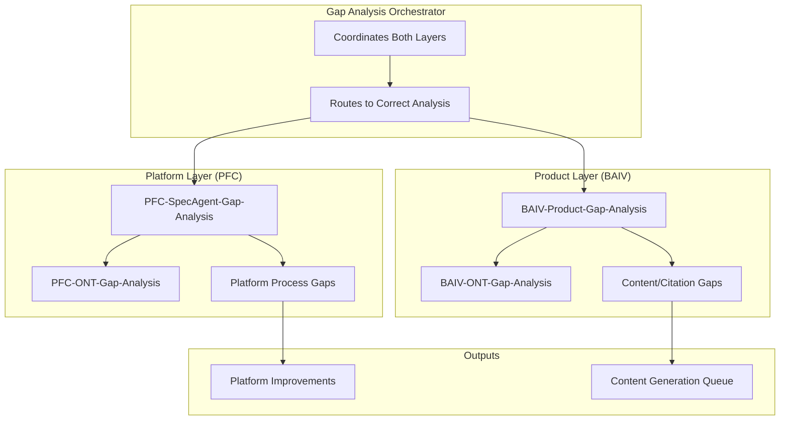

# PFC-PFI-BAIV Gap Analysis Architecture v1.0.0

**Dual-Layer Gap Analysis: Platform vs Product**

| Attribute | Value |
|-----------|-------|
| **Document Version** | 1.0.0 |
| **Date** | December 31, 2025 |
| **Purpose** | Distinguish platform-level vs product-level gap analysis |
| **Status** | 🟢 Active |
| **Owner** | Platform Architecture Team |
| **Parent Documents** | BAIV_INTEGRATION_PLAN.md, PFC-PFI-BAIV_MODULE_CATALOG.md |
| **Related Artifacts** | UNIVERSAL_AGENT_TEMPLATE.md, PFC-PFI-BAIV_INTEGRATION_BRIDGES.md |

---

## Executive Summary

Gap Analysis in the PF-Core/BAIV architecture operates on **two distinct layers** that must not be confused:

**1. Platform Layer: PFC-SpecAgent-Gap-Analysis**
- **Scope:** Platform process and capability gaps
- **Ontology:** PFC-ONT-Gap-Analysis
- **Focus:** Module coverage, integration completeness, transferability
- **Output:** Platform improvement recommendations
- **Transferable:** BAIV, W4M, AIR, all instances

**2. Product Layer: BAIV-Product-Gap-Analysis**
- **Scope:** AI Visibility content and citation gaps
- **Ontology:** BAIV-ONT-Gap-Analysis
- **Focus:** Topic coverage, keyword gaps, citation gaps
- **Output:** Content generation priorities
- **Transferable:** BAIV only

**Key Challenge:**
These two gap analysis types serve different purposes but can be confused because they share the term "Gap Analysis." This document clarifies the distinction and provides implementation guidance.

---

## 1. Gap Analysis Dual-Layer Architecture

### 1.1 Overview



### 1.2 Layer Comparison

| Aspect | Platform Layer (PFC) | Product Layer (BAIV) |
|--------|---------------------|----------------------|
| **Agent Name** | PFC-SpecAgent-Gap-Analysis | BAIV-Gap-Analyzer-Agent |
| **Ontology** | PFC-ONT-Gap-Analysis | BAIV-ONT-Gap-Analysis |
| **Scope** | Platform capabilities | Product content |
| **Input** | Module coverage, integration status | Citation results, competitor analysis |
| **Analysis Focus** | Missing modules, integration gaps, transferability issues | Missing topics, keyword gaps, citation opportunities |
| **Output** | Platform roadmap items | Content generation tasks |
| **Frequency** | Quarterly reviews | Per audit run |
| **Owner** | Platform Architecture Team | BAIV Product Team |
| **Transferable** | Yes (all instances) | No (BAIV only) |

---

## 2. Platform Layer: PFC-SpecAgent-Gap-Analysis

### 2.1 Purpose

Identifies gaps in platform capabilities, module coverage, and cross-instance transferability to inform platform development priorities.

**Module ID:** `pfc-agent-gap-analysis-v1.0.0`  
**Type:** PFC-Only (SpecAgent)  
**Ontology:** PFC-ONT-Gap-Analysis  
**Scope:** Platform-wide capability assessment

### 2.2 Gap Categories

**1. Module Coverage Gaps**
- Missing PFC modules (identified in roadmap but not implemented)
- Incomplete module implementations
- Module feature gaps

**Example:**
```json
{
  "gap_type": "module_coverage",
  "gap_id": "gap-pfc-001",
  "title": "VE-Business Models Module Missing",
  "description": "VE-Business Models module defined in catalog but not implemented",
  "severity": "high",
  "impact": "Instances cannot define pricing tiers without manual configuration",
  "affected_instances": ["BAIV", "W4M", "AIR"],
  "recommendation": "Implement VE-Business Models module in Q1 2025",
  "priority": "P1"
}
```

**2. Integration Gaps**
- Incomplete integration bridges
- Missing bridge configurations
- Integration validation failures

**Example:**
```json
{
  "gap_type": "integration",
  "gap_id": "gap-pfc-002",
  "title": "Design Bridge Widget Library Incomplete",
  "description": "Design Bridge specified but widget library not fully implemented",
  "severity": "medium",
  "impact": "Instances must build custom widgets instead of using platform library",
  "affected_instances": ["BAIV"],
  "recommendation": "Complete widget library with 15+ reusable widgets",
  "priority": "P1"
}
```

**3. Transferability Gaps**
- Patterns that don't transfer well to new instances
- Instance-specific workarounds that should be platform-level
- Configuration complexity barriers

**Example:**
```json
{
  "gap_type": "transferability",
  "gap_id": "gap-pfc-003",
  "title": "Agent Orchestration Pattern Not Documented",
  "description": "BAIV implements agent orchestration but pattern not documented for W4M",
  "severity": "medium",
  "impact": "W4M must re-discover orchestration patterns instead of reusing",
  "affected_instances": ["W4M", "AIR"],
  "recommendation": "Document agent orchestration patterns in UAT",
  "priority": "P2"
}
```

**4. Quality Gaps**
- Missing test coverage
- Incomplete documentation
- Missing validation criteria

**Example:**
```json
{
  "gap_type": "quality",
  "gap_id": "gap-pfc-004",
  "title": "Integration Bridge Tests Missing",
  "description": "Integration bridges defined but no automated tests",
  "severity": "high",
  "impact": "Bridge failures not detected until production",
  "affected_instances": ["All"],
  "recommendation": "Write integration tests for all 4 bridges",
  "priority": "P0"
}
```

### 2.3 Gap Analysis Process

**Step 1: Coverage Assessment**
- Review module catalog (30 modules)
- Check implementation status per module
- Identify missing or incomplete modules

**Step 2: Integration Validation**
- Test all 4 integration bridges
- Validate configuration cascades
- Check bridge validation criteria

**Step 3: Transferability Review**
- Assess patterns used in BAIV
- Identify instance-specific workarounds
- Document reusable patterns

**Step 4: Quality Audit**
- Check test coverage (target: 80%+)
- Review documentation completeness
- Validate quality gates

**Step 5: Prioritization**
- Score gaps by severity and impact
- Prioritize by affected instances
- Create platform roadmap items

### 2.4 PFC-ONT-Gap-Analysis Specification

**Ontology Structure:**

```json
{
  "@context": "https://schema.org",
  "@type": "PlatformGapAnalysis",
  "@id": "pfc-ont-gap-analysis-v1.0.0",
  "name": "Platform Gap Analysis Ontology",
  "description": "Defines platform-level capability gaps",
  "properties": {
    "gap_id": {
      "type": "string",
      "description": "Unique gap identifier",
      "pattern": "^gap-pfc-\\d{3}$"
    },
    "gap_type": {
      "type": "string",
      "enum": ["module_coverage", "integration", "transferability", "quality"],
      "description": "Category of platform gap"
    },
    "title": {
      "type": "string",
      "description": "Short gap description"
    },
    "description": {
      "type": "string",
      "description": "Detailed gap explanation"
    },
    "severity": {
      "type": "string",
      "enum": ["critical", "high", "medium", "low"],
      "description": "Gap severity level"
    },
    "impact": {
      "type": "string",
      "description": "Business/technical impact description"
    },
    "affected_instances": {
      "type": "array",
      "items": {
        "type": "string"
      },
      "description": "Instances affected by this gap"
    },
    "recommendation": {
      "type": "string",
      "description": "Recommended action to close gap"
    },
    "priority": {
      "type": "string",
      "enum": ["P0", "P1", "P2", "P3"],
      "description": "Implementation priority"
    },
    "identified_date": {
      "type": "string",
      "format": "date-time"
    },
    "target_close_date": {
      "type": "string",
      "format": "date-time"
    },
    "status": {
      "type": "string",
      "enum": ["open", "in_progress", "closed", "deferred"],
      "description": "Gap resolution status"
    }
  }
}
```

### 2.5 Platform Gap Analysis Agent Implementation

**Agent Specification:**

```typescript
class PFCGapAnalysisAgent extends BaseAgent {
  agentId = 'pfc-agent-gap-analysis-v1.0.0';
  agentType = 'orchestrator';
  tier = 1; // Platform tier
  
  ontologyBindings = {
    consumes: [
      'PFC-ONT-Module-Catalog',
      'PFC-ONT-Integration-Bridges'
    ],
    produces: [
      'PFC-ONT-Gap-Analysis'
    ],
    requires: [],
    validates: []
  };
  
  async execute(input: {
    analysis_type: 'module_coverage' | 'integration' | 'transferability' | 'quality';
    scope?: string[];
  }): Promise<any> {
    // 1. Load module catalog and bridge specs
    const moduleCatalog = await this.loadOntology('PFC-ONT-Module-Catalog');
    const integrationBridges = await this.loadOntology('PFC-ONT-Integration-Bridges');
    
    // 2. Run gap analysis based on type
    let gaps = [];
    
    if (input.analysis_type === 'module_coverage' || !input.analysis_type) {
      gaps = gaps.concat(await this.analyzeModuleCoverage(moduleCatalog));
    }
    
    if (input.analysis_type === 'integration' || !input.analysis_type) {
      gaps = gaps.concat(await this.analyzeIntegrations(integrationBridges));
    }
    
    if (input.analysis_type === 'transferability' || !input.analysis_type) {
      gaps = gaps.concat(await this.analyzeTransferability(moduleCatalog));
    }
    
    if (input.analysis_type === 'quality' || !input.analysis_type) {
      gaps = gaps.concat(await this.analyzeQuality());
    }
    
    // 3. Prioritize gaps
    const prioritizedGaps = this.prioritizeGaps(gaps);
    
    // 4. Generate recommendations
    const recommendations = this.generateRecommendations(prioritizedGaps);
    
    // 5. Log analysis
    await logAuditEvent({
      event_type: 'platform_gap_analysis',
      category: 'agent_activity',
      actor: this.agentId,
      subject: 'platform-gaps',
      result: 'success',
      metadata: {
        gaps_identified: gaps.length,
        critical_gaps: gaps.filter(g => g.severity === 'critical').length
      }
    });
    
    return {
      gaps: prioritizedGaps,
      recommendations,
      summary: {
        total_gaps: gaps.length,
        by_severity: this.countBySeverity(gaps),
        by_type: this.countByType(gaps)
      }
    };
  }
  
  private async analyzeModuleCoverage(catalog: any): Promise<any[]> {
    // Check which modules are defined but not implemented
    const gaps = [];
    
    for (const module of catalog.modules) {
      if (module.status === 'not_implemented') {
        gaps.push({
          gap_type: 'module_coverage',
          gap_id: `gap-pfc-${gaps.length + 1}`.padStart(11, '0'),
          title: `${module.name} Module Missing`,
          description: `${module.name} module defined in catalog but not implemented`,
          severity: module.priority === 'P0' ? 'critical' : 'high',
          impact: module.impact_description,
          affected_instances: module.instances || ['All'],
          recommendation: `Implement ${module.name} module`,
          priority: module.priority,
          status: 'open'
        });
      }
    }
    
    return gaps;
  }
  
  private async analyzeIntegrations(bridges: any): Promise<any[]> {
    // Check integration bridge completeness
    const gaps = [];
    
    for (const bridge of bridges.bridges) {
      if (!bridge.validation_passed) {
        gaps.push({
          gap_type: 'integration',
          gap_id: `gap-pfc-${gaps.length + 1}`.padStart(11, '0'),
          title: `${bridge.name} Bridge Incomplete`,
          description: bridge.validation_failures.join(', '),
          severity: 'high',
          impact: `Instances cannot use ${bridge.name} bridge`,
          affected_instances: bridge.affected_instances,
          recommendation: `Complete ${bridge.name} bridge implementation`,
          priority: 'P0',
          status: 'open'
        });
      }
    }
    
    return gaps;
  }
}
```

### 2.6 Platform Gap Analysis Output Example

**Report:**
```markdown
# Platform Gap Analysis Report
**Date:** December 31, 2025
**Analyst:** PFC-SpecAgent-Gap-Analysis
**Scope:** Full platform assessment

## Summary
- **Total Gaps:** 12
- **Critical:** 2
- **High:** 5
- **Medium:** 4
- **Low:** 1

## Critical Gaps (P0)

### GAP-PFC-001: Integration Bridge Tests Missing
- **Type:** Quality
- **Severity:** Critical
- **Impact:** Bridge failures not detected until production
- **Affected:** All instances
- **Recommendation:** Write integration tests for all 4 bridges
- **Target Close:** Q1 2025

### GAP-PFC-002: VE-Business Models Module Missing
- **Type:** Module Coverage
- **Severity:** Critical
- **Impact:** Instances cannot define pricing tiers
- **Affected:** BAIV, W4M, AIR
- **Recommendation:** Implement VE-Business Models module
- **Target Close:** Q1 2025

## High Priority Gaps (P1)
[5 gaps listed...]

## Recommendations
1. Prioritize integration tests (GAP-PFC-001)
2. Implement VE-Business Models module (GAP-PFC-002)
3. Complete Design Bridge widget library (GAP-PFC-003)
4. Document agent orchestration patterns (GAP-PFC-004)
5. Add PMF survey templates (GAP-PFC-005)
```

---

## 3. Product Layer: BAIV-Product-Gap-Analysis

### 3.1 Purpose

Identifies content and citation gaps in BAIV's AI Visibility domain to prioritize content generation for clients.

**Module ID:** `agent-baiv-gap-analyzer-v1.0.0`  
**Type:** Domain Specialist  
**Ontology:** BAIV-ONT-Gap-Analysis  
**Scope:** AI Visibility content gaps

### 3.2 Gap Categories

**1. Topic Coverage Gaps**
- Topics competitors are cited for but client is not
- Industry topics missing from client content

**Example:**
```json
{
  "gap_type": "topic_coverage",
  "gap_id": "gap-baiv-001",
  "client_brand": "Acme SaaS",
  "competitor_brand": "Competitor X",
  "topic": "AI-powered marketing automation",
  "competitor_citations": 8,
  "client_citations": 0,
  "priority": "P0",
  "recommendation": "Create content on AI-powered marketing automation",
  "keywords": ["AI marketing", "marketing automation", "predictive analytics"],
  "estimated_impact": "High - competitor cited 8x on this topic"
}
```

**2. Keyword Gaps**
- Keywords with search volume but no client content
- Keywords competitors rank for but client doesn't

**Example:**
```json
{
  "gap_type": "keyword",
  "gap_id": "gap-baiv-002",
  "client_brand": "Acme SaaS",
  "keyword": "best CRM for small business",
  "search_volume": 5400,
  "competitor_citations": 5,
  "client_citations": 0,
  "difficulty": "medium",
  "priority": "P1",
  "recommendation": "Create guide: 'Best CRM for Small Business in 2025'"
}
```

**3. Citation Opportunity Gaps**
- Queries where AI platforms cite no one (whitespace opportunity)
- Queries where client has relevant content but isn't cited

**Example:**
```json
{
  "gap_type": "citation_opportunity",
  "gap_id": "gap-baiv-003",
  "client_brand": "Acme SaaS",
  "query": "How to improve customer retention with CRM",
  "platforms_tested": ["ChatGPT", "Claude", "Gemini", "Perplexity"],
  "platforms_cite_no_one": ["Gemini", "Perplexity"],
  "client_has_content": true,
  "content_url": "https://acme.com/blog/customer-retention",
  "priority": "P2",
  "recommendation": "Optimize existing content for AI platform citation"
}
```

**4. Competitor Advantage Gaps**
- Topics where competitors dominate citations
- Unique competitor value propositions

**Example:**
```json
{
  "gap_type": "competitor_advantage",
  "gap_id": "gap-baiv-004",
  "client_brand": "Acme SaaS",
  "competitor_brand": "Competitor Y",
  "advantage_description": "Competitor Y cited for 'AI-powered lead scoring' in 90% of queries",
  "client_position": "Not cited for this topic",
  "priority": "P0",
  "recommendation": "Develop thought leadership on AI-powered lead scoring"
}
```

### 3.3 Gap Analysis Process

**Step 1: Citation Analysis**
- Run Citation Tester on 50-100 queries
- Identify queries where client not cited
- Identify queries where competitors cited

**Step 2: Topic Clustering**
- Cluster queries by topic
- Identify topic patterns where client missing
- Calculate competitor citation frequency per topic

**Step 3: Keyword Research**
- Extract keywords from competitor citations
- Identify high-volume keywords client missing
- Score keyword difficulty and opportunity

**Step 4: Content Audit**
- Check if client has content on gap topics
- Assess content quality and relevance
- Identify content optimization opportunities

**Step 5: Prioritization**
- Score gaps by: citation frequency, search volume, difficulty
- Apply priority formula: Priority = (Impact * Feasibility) / Effort
- Output prioritized gap list for content generation

### 3.4 BAIV-ONT-Gap-Analysis Specification

**Ontology Structure:**

```json
{
  "@context": "https://schema.org",
  "@type": "ContentGapAnalysis",
  "@id": "baiv-ont-gap-analysis-v1.0.0",
  "name": "BAIV Content Gap Analysis Ontology",
  "description": "Defines AI Visibility content and citation gaps",
  "properties": {
    "gap_id": {
      "type": "string",
      "description": "Unique gap identifier",
      "pattern": "^gap-baiv-\\d{3}$"
    },
    "gap_type": {
      "type": "string",
      "enum": ["topic_coverage", "keyword", "citation_opportunity", "competitor_advantage"],
      "description": "Category of content gap"
    },
    "client_brand": {
      "type": "string",
      "description": "Client brand name"
    },
    "competitor_brand": {
      "type": "string",
      "description": "Competitor brand (if applicable)"
    },
    "topic": {
      "type": "string",
      "description": "Content topic"
    },
    "keywords": {
      "type": "array",
      "items": {
        "type": "string"
      },
      "description": "Related keywords"
    },
    "competitor_citations": {
      "type": "number",
      "description": "Times competitor cited for this topic"
    },
    "client_citations": {
      "type": "number",
      "description": "Times client cited for this topic"
    },
    "search_volume": {
      "type": "number",
      "description": "Monthly search volume"
    },
    "difficulty": {
      "type": "string",
      "enum": ["easy", "medium", "hard"],
      "description": "Content creation difficulty"
    },
    "priority": {
      "type": "string",
      "enum": ["P0", "P1", "P2", "P3"],
      "description": "Content generation priority"
    },
    "recommendation": {
      "type": "string",
      "description": "Recommended content to create"
    },
    "estimated_impact": {
      "type": "string",
      "description": "Expected impact of closing gap"
    },
    "identified_date": {
      "type": "string",
      "format": "date-time"
    },
    "status": {
      "type": "string",
      "enum": ["open", "content_created", "optimized", "closed"],
      "description": "Gap resolution status"
    }
  }
}
```

### 3.5 BAIV Gap Analyzer Agent Implementation

**Agent Specification:**

```typescript
class BAIVGapAnalyzerAgent extends BaseAgent {
  agentId = 'agent-baiv-gap-analyzer-v1.0.0';
  agentType = 'domain_specialist';
  tier = 2;
  
  ontologyBindings = {
    consumes: [
      'BAIV-ONT-AI-Visibility', // Citation results
      'BAIV-ONT-Universal-Brand', // Client brand
      'BAIV-ONT-Customer-Organization' // Client context
    ],
    produces: [
      'BAIV-ONT-Gap-Analysis' // Content gaps
    ],
    requires: [
      've-context' // Strategic objectives
    ],
    validates: []
  };
  
  async execute(input: {
    citation_results: any[];
    competitor_url: string;
    client_brand: string;
    tenant_id: string;
    user_id: string;
  }): Promise<any> {
    // 1. Load context
    await this.setTenantContext(input.tenant_id, input.user_id);
    const veContext = await this.loadOntology('ve-context');
    
    // 2. Analyze citation patterns
    const topicClusters = this.clusterByTopic(input.citation_results);
    
    // 3. Identify gaps per type
    const topicGaps = this.identifyTopicGaps(topicClusters, input.client_brand);
    const keywordGaps = this.identifyKeywordGaps(topicClusters);
    const citationOpportunities = this.identifyCitationOpportunities(input.citation_results);
    const competitorAdvantages = this.identifyCompetitorAdvantages(topicClusters);
    
    // 4. Combine and prioritize
    const allGaps = [
      ...topicGaps,
      ...keywordGaps,
      ...citationOpportunities,
      ...competitorAdvantages
    ];
    
    const prioritizedGaps = this.prioritizeGaps(allGaps);
    
    // 5. Generate content recommendations
    const contentRecommendations = this.generateContentRecommendations(prioritizedGaps);
    
    // 6. Log activity
    await logAuditEvent({
      event_type: 'gap_analysis',
      category: 'agent_activity',
      actor: this.agentId,
      subject: `gaps-${input.tenant_id}`,
      result: 'success',
      metadata: {
        gaps_identified: allGaps.length,
        p0_gaps: allGaps.filter(g => g.priority === 'P0').length,
        competitor_url: input.competitor_url
      }
    });
    
    return {
      gaps: prioritizedGaps,
      content_recommendations: contentRecommendations,
      summary: {
        total_gaps: allGaps.length,
        by_priority: this.countByPriority(allGaps),
        by_type: this.countByType(allGaps)
      }
    };
  }
  
  private clusterByTopic(citationResults: any[]): any {
    // Use LLM to cluster queries by topic
    // Return: { topic: string, queries: [], competitor_citations: number, client_citations: number }[]
  }
  
  private identifyTopicGaps(clusters: any, clientBrand: string): any[] {
    const gaps = [];
    
    for (const cluster of clusters) {
      if (cluster.competitor_citations > 0 && cluster.client_citations === 0) {
        gaps.push({
          gap_type: 'topic_coverage',
          gap_id: `gap-baiv-${gaps.length + 1}`.padStart(13, '0'),
          client_brand: clientBrand,
          topic: cluster.topic,
          competitor_citations: cluster.competitor_citations,
          client_citations: 0,
          keywords: cluster.keywords,
          priority: cluster.competitor_citations >= 5 ? 'P0' : 'P1',
          recommendation: `Create content on ${cluster.topic}`,
          estimated_impact: `Competitor cited ${cluster.competitor_citations}x on this topic`
        });
      }
    }
    
    return gaps;
  }
  
  private prioritizeGaps(gaps: any[]): any[] {
    // Priority formula: (competitor_citations * search_volume) / difficulty
    return gaps.sort((a, b) => {
      const scoreA = this.calculateGapScore(a);
      const scoreB = this.calculateGapScore(b);
      return scoreB - scoreA;
    });
  }
  
  private calculateGapScore(gap: any): number {
    const competitorWeight = gap.competitor_citations || 0;
    const volumeWeight = (gap.search_volume || 1000) / 1000;
    const difficultyPenalty = gap.difficulty === 'hard' ? 0.5 : gap.difficulty === 'medium' ? 0.75 : 1;
    
    return competitorWeight * volumeWeight * difficultyPenalty;
  }
}
```

### 3.6 BAIV Gap Analysis Output Example

**Report:**
```markdown
# Content Gap Analysis Report
**Client:** Acme SaaS
**Competitor:** Competitor X
**Date:** December 31, 2025
**Analyst:** BAIV-Gap-Analyzer-Agent

## Summary
- **Total Gaps:** 24
- **P0 (Critical):** 6
- **P1 (High):** 12
- **P2 (Medium):** 6

## P0 Gaps (High-Priority Content)

### GAP-BAIV-001: AI-Powered Marketing Automation
- **Type:** Topic Coverage
- **Competitor Citations:** 8
- **Client Citations:** 0
- **Search Volume:** 4,500/month
- **Keywords:** "AI marketing", "marketing automation", "predictive analytics"
- **Recommendation:** Create comprehensive guide on AI-powered marketing automation
- **Estimated Impact:** High - competitor dominating this topic

### GAP-BAIV-002: Lead Scoring Best Practices
- **Type:** Competitor Advantage
- **Competitor Citations:** 12
- **Client Citations:** 1
- **Search Volume:** 3,200/month
- **Keywords:** "lead scoring", "qualify leads", "sales prioritization"
- **Recommendation:** Develop thought leadership content on lead scoring
- **Estimated Impact:** Very High - competitor cited 12x vs our 1x

[4 more P0 gaps...]

## P1 Gaps (Medium-Priority Content)
[12 gaps listed...]

## Content Recommendations
1. Create "Ultimate Guide to AI-Powered Marketing Automation" (GAP-BAIV-001)
2. Write "Lead Scoring Best Practices for B2B SaaS" (GAP-BAIV-002)
3. Develop "CRM Implementation Checklist" (GAP-BAIV-003)
4. Optimize existing customer retention content (GAP-BAIV-004)
5. Create video series on email marketing automation (GAP-BAIV-005)
```

---

## 4. Gap Analysis Orchestrator

### 4.1 Purpose

Coordinates platform and product gap analysis without confusion, routing requests to the correct layer.

### 4.2 Orchestrator Logic

```typescript
class GapAnalysisOrchestrator {
  async analyzeGaps(request: {
    analysis_scope: 'platform' | 'product' | 'both';
    context: any;
  }): Promise<any> {
    const results: any = {};
    
    // Route to platform layer if needed
    if (request.analysis_scope === 'platform' || request.analysis_scope === 'both') {
      const pfcAgent = new PFCGapAnalysisAgent();
      results.platform_gaps = await pfcAgent.execute({
        analysis_type: request.context.platform_analysis_type
      });
    }
    
    // Route to product layer if needed
    if (request.analysis_scope === 'product' || request.analysis_scope === 'both') {
      if (request.context.instance === 'BAIV') {
        const baivAgent = new BAIVGapAnalyzerAgent();
        results.product_gaps = await baivAgent.execute({
          citation_results: request.context.citation_results,
          competitor_url: request.context.competitor_url,
          client_brand: request.context.client_brand,
          tenant_id: request.context.tenant_id,
          user_id: request.context.user_id
        });
      }
      // Add W4M, AIR gap analyzers when implemented
    }
    
    return results;
  }
  
  determineScope(userIntent: string): 'platform' | 'product' {
    // Classify user intent to route correctly
    const platformKeywords = [
      'module', 'integration', 'bridge', 'transferability',
      'platform capability', 'architecture gap'
    ];
    
    const productKeywords = [
      'content', 'citation', 'topic', 'keyword',
      'competitor', 'AI visibility', 'search'
    ];
    
    const hasPlatformKeywords = platformKeywords.some(kw => 
      userIntent.toLowerCase().includes(kw)
    );
    
    const hasProductKeywords = productKeywords.some(kw =>
      userIntent.toLowerCase().includes(kw)
    );
    
    if (hasPlatformKeywords && !hasProductKeywords) {
      return 'platform';
    } else if (hasProductKeywords && !hasPlatformKeywords) {
      return 'product';
    } else {
      // Default to product for BAIV users, platform for architects
      return 'product';
    }
  }
}
```

### 4.3 User Intent Examples

**Platform Gap Analysis Intent:**
- "What platform capabilities are we missing?"
- "Are there any integration gaps in the bridges?"
- "Which modules are not yet implemented?"
- "What transferability issues do we have?"

**Product Gap Analysis Intent (BAIV):**
- "What content gaps does our client have?"
- "Which topics are competitors cited for but we're not?"
- "What keywords should we target?"
- "Where are our citation opportunities?"

### 4.4 Orchestrator Output

```json
{
  "request": {
    "user_intent": "Analyze all gaps",
    "scope_determined": "both",
    "timestamp": "2025-12-31T00:00:00Z"
  },
  "platform_gaps": {
    "total": 12,
    "critical": 2,
    "high": 5,
    "gaps": [
      {
        "gap_id": "gap-pfc-001",
        "type": "quality",
        "title": "Integration Bridge Tests Missing",
        "priority": "P0"
      }
    ],
    "recommendations": [
      "Write integration tests for all 4 bridges",
      "Implement VE-Business Models module"
    ]
  },
  "product_gaps": {
    "total": 24,
    "p0": 6,
    "p1": 12,
    "gaps": [
      {
        "gap_id": "gap-baiv-001",
        "type": "topic_coverage",
        "topic": "AI-powered marketing automation",
        "priority": "P0"
      }
    ],
    "content_recommendations": [
      "Create guide on AI-powered marketing automation",
      "Write lead scoring best practices article"
    ]
  }
}
```

---

## 5. Implementation Guidance

### 5.1 BAIV Implementation Requirements

**For Platform Gap Analysis (PFC layer):**
- ⬜ Not implemented by BAIV (PFC-only)
- Platform Architecture Team runs quarterly
- BAIV consumes platform gap analysis results
- BAIV provides feedback on platform gaps affecting them

**For Product Gap Analysis (BAIV layer):**
- ✅ Must implement BAIV-Gap-Analyzer-Agent
- BAIV-ONT-Gap-Analysis must be registered in OAA
- Gap Analyzer runs after Citation Tester in workflow
- Gaps feed into Content Generator Agent

### 5.2 Agent Registration

**Platform Agent (PFC):**
```yaml
agent_id: pfc-agent-gap-analysis-v1.0.0
agent_name: PFC SpecAgent Gap Analysis
agent_type: orchestrator
tier: 1
ontology_bindings:
  consumes:
    - PFC-ONT-Module-Catalog
    - PFC-ONT-Integration-Bridges
  produces:
    - PFC-ONT-Gap-Analysis
  requires: []
authority_boundary:
  can_read: [module_catalog, integration_status]
  can_write: [platform_gaps_table]
  can_delete: []
```

**Product Agent (BAIV):**
```yaml
agent_id: agent-baiv-gap-analyzer-v1.0.0
agent_name: BAIV Gap Analyzer Agent
agent_type: domain_specialist
tier: 2
ontology_bindings:
  consumes:
    - BAIV-ONT-AI-Visibility
    - BAIV-ONT-Universal-Brand
    - BAIV-ONT-Customer-Organization
  produces:
    - BAIV-ONT-Gap-Analysis
  requires:
    - ve-context
authority_boundary:
  can_read: [audit_results, competitor_data]
  can_write: [gaps_table]
  can_delete: []
```

### 5.3 Database Schema

**Platform Gaps Table:**
```sql
CREATE TABLE platform_gaps (
  gap_id VARCHAR(20) PRIMARY KEY,
  gap_type VARCHAR(50) NOT NULL,
  title VARCHAR(200) NOT NULL,
  description TEXT,
  severity VARCHAR(20),
  impact TEXT,
  affected_instances TEXT[],
  recommendation TEXT,
  priority VARCHAR(10),
  identified_date TIMESTAMPTZ DEFAULT NOW(),
  target_close_date TIMESTAMPTZ,
  status VARCHAR(20) DEFAULT 'open',
  created_by VARCHAR(100),
  updated_at TIMESTAMPTZ DEFAULT NOW()
);
```

**Product Gaps Table (BAIV):**
```sql
CREATE TABLE gaps (
  gap_id VARCHAR(20) PRIMARY KEY,
  tenant_id UUID NOT NULL REFERENCES tenants(id),
  audit_id UUID REFERENCES audits(id),
  gap_type VARCHAR(50) NOT NULL,
  client_brand VARCHAR(200),
  competitor_brand VARCHAR(200),
  topic VARCHAR(200),
  keywords TEXT[],
  competitor_citations INTEGER DEFAULT 0,
  client_citations INTEGER DEFAULT 0,
  search_volume INTEGER,
  difficulty VARCHAR(20),
  priority VARCHAR(10),
  recommendation TEXT,
  estimated_impact TEXT,
  identified_date TIMESTAMPTZ DEFAULT NOW(),
  status VARCHAR(20) DEFAULT 'open',
  created_by UUID REFERENCES users(id),
  updated_at TIMESTAMPTZ DEFAULT NOW()
);

-- RLS Policy
CREATE POLICY "gaps_tenant_isolation"
ON gaps
FOR ALL
USING (tenant_id = current_setting('app.current_tenant_id')::UUID);
```

### 5.4 Validation Checklist

**Platform Layer (PFC):**
- [ ] PFC-ONT-Gap-Analysis registered in OAA
- [ ] PFC-SpecAgent-Gap-Analysis implemented
- [ ] Platform gaps table created
- [ ] Quarterly gap analysis scheduled
- [ ] Gap reports shared with instances

**Product Layer (BAIV):**
- [ ] BAIV-ONT-Gap-Analysis registered in OAA
- [ ] BAIV-Gap-Analyzer-Agent implemented
- [ ] Gaps table created with RLS policies
- [ ] Agent integrated in audit workflow (after Citation Tester)
- [ ] Gaps feed into Content Generator
- [ ] Gap status tracking implemented

**Orchestration:**
- [ ] Gap Analysis Orchestrator implemented
- [ ] Intent classification logic tested
- [ ] Both layers can be invoked independently
- [ ] Combined analysis returns both platform and product gaps

---

## 6. Summary

### 6.1 Key Takeaways

**1. Two Distinct Layers**
- Platform layer (PFC) analyzes capability gaps
- Product layer (BAIV) analyzes content gaps
- Must not be confused

**2. Different Ontologies**
- PFC-ONT-Gap-Analysis for platform
- BAIV-ONT-Gap-Analysis for product
- Different properties and purposes

**3. Different Agents**
- PFC-SpecAgent-Gap-Analysis (PFC-only, orchestrator, tier 1)
- BAIV-Gap-Analyzer-Agent (BAIV instance, domain specialist, tier 2)

**4. Different Outputs**
- Platform: Module/integration/transferability recommendations
- Product: Content generation priorities

**5. Orchestration Required**
- Gap Analysis Orchestrator routes requests
- Intent classification determines layer
- Both layers can run independently

### 6.2 BAIV Action Items

- [ ] Implement BAIV-Gap-Analyzer-Agent per UAT
- [ ] Register BAIV-ONT-Gap-Analysis in OAA
- [ ] Create gaps table with RLS policies
- [ ] Integrate into audit workflow
- [ ] Connect to Content Generator Agent
- [ ] Test gap prioritization algorithm
- [ ] Validate 80%+ test coverage

### 6.3 Platform Action Items

- [ ] Implement PFC-SpecAgent-Gap-Analysis
- [ ] Register PFC-ONT-Gap-Analysis in OAA
- [ ] Create platform_gaps table
- [ ] Schedule quarterly gap analysis
- [ ] Share gap reports with instances
- [ ] Track gap closure metrics

---

## Appendix: Gap Analysis Comparison Table

| Aspect | Platform (PFC) | Product (BAIV) |
|--------|---------------|----------------|
| **Agent Name** | PFC-SpecAgent-Gap-Analysis | BAIV-Gap-Analyzer-Agent |
| **Agent Type** | Orchestrator | Domain Specialist |
| **Tier** | 1 (Platform) | 2 (Product) |
| **Ontology** | PFC-ONT-Gap-Analysis | BAIV-ONT-Gap-Analysis |
| **Scope** | Platform capabilities | AI Visibility content |
| **Input** | Module catalog, bridge status | Citation results, competitor analysis |
| **Analysis** | Missing modules, integration gaps | Missing topics, keyword gaps |
| **Output** | Platform roadmap items | Content generation tasks |
| **Frequency** | Quarterly | Per audit |
| **Owner** | Platform Architecture Team | BAIV Product Team |
| **Transferable** | Yes (all instances) | No (BAIV only) |
| **Priority Format** | P0/P1/P2/P3 | P0/P1/P2/P3 |
| **Status Values** | open, in_progress, closed, deferred | open, content_created, optimized, closed |
| **Database** | platform_gaps | gaps (tenant-isolated) |
| **Examples** | "Integration tests missing", "VE-Business Models module missing" | "AI marketing automation topic gap", "Lead scoring keyword gap" |

---

**Document Version:** 1.0.0  
**Status:** 🟢 Active  
**Next Review:** After Phase 1 implementation  
**Related Documents:** PFC-PFI-BAIV_MODULE_CATALOG.md, UNIVERSAL_AGENT_TEMPLATE.md, PFC-PFI-BAIV_INTEGRATION_BRIDGES.md
