# PF-Core Agentic Development Stack
## MVP Visual Guide

**Document:** PFC_AGENTIC_MVP_VISUAL_GUIDE_v1.md  
**Version:** 1.0.0  
**Date:** December 2025  
**Timeline:** 4 Weeks to Production  

---

## Part 1: High-Level Overview

### 1.1 The Big Picture

The Agentic Development Stack automates the journey from **Idea → Working Code** through three integrated layers that map directly to your Figma UI structure.

```mermaid
graph TB
    subgraph "YOUR FIGMA UI STRUCTURE"
        subgraph PM["🎯 PROGRAM MANAGER / SOLUTION ARCHITECT"]
            VSOM[VSOM Context]
            Strategy[Strategic Alignment]
            Governance[Governance & Approval]
        end
        
        subgraph PLAN["📋 PLAN"]
            Brief[Create Brief]
            PRD[Generate PRD]
            Arch[Design Architecture]
            Stories[Shard Stories]
        end
        
        subgraph BUILD["🔨 BUILD"]
            TDD[TDD Cycle]
            Code[Write Code]
            Test[Run Tests]
            Review[Code Review]
        end
        
        subgraph TRACK["📊 TRACK"]
            Issues[Issue Tracking]
            Progress[Progress Dashboard]
            Metrics[Quality Metrics]
            Dependencies[Dependency Graph]
        end
    end
    
    PM --> PLAN
    PLAN --> BUILD
    BUILD --> TRACK
    TRACK -.->|Feedback Loop| PM
    
    style PM fill:#6366F1,color:#fff
    style PLAN fill:#3B82F6,color:#fff
    style BUILD fill:#10B981,color:#fff
    style TRACK fill:#F59E0B,color:#fff
```

### 1.2 Framework Mapping

Each Figma UI section maps to a specific framework in our agentic stack:

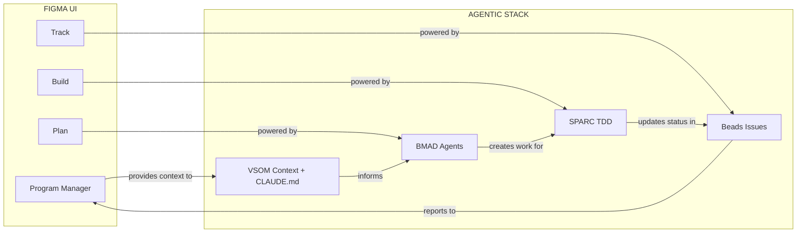

### 1.3 The Three Frameworks Explained

| Framework | Purpose | Maps to UI | What It Does |
|-----------|---------|------------|--------------|
| **BMAD** | Planning | Plan | AI agents create specs, PRDs, architecture, stories |
| **SPARC** | Building | Build | TDD workflow: write tests first, then code |
| **Beads** | Tracking | Track | Git-native issue tracking with dependencies |

---

## Part 2: How It Works

### 2.1 Complete Flow Diagram

```mermaid
flowchart TB
    subgraph INPUT["📥 INPUT"]
        Feature[Feature Request]
        VSOM[VSOM Strategic Context]
    end
    
    subgraph PLAN_PHASE["📋 PLAN PHASE (BMAD)"]
        direction TB
        PM_Agent[🤖 PM Agent]
        Arch_Agent[🤖 Architect Agent]
        
        PM_Agent -->|creates| PRD[PRD + Stories]
        Arch_Agent -->|creates| Schema[Schema + API Design]
        
        PRD --> Gate{Human<br/>Approval?}
        Schema --> Gate
        
        Gate -->|Yes| Convert[Convert to Issues]
        Gate -->|No| PM_Agent
    end
    
    subgraph BUILD_PHASE["🔨 BUILD PHASE (SPARC)"]
        direction TB
        Dev_Agent[🤖 Developer Agent]
        
        RED[🔴 RED: Write Failing Test]
        GREEN[🟢 GREEN: Minimal Code]
        REFACTOR[🔵 REFACTOR: Clean Up]
        
        Dev_Agent --> RED
        RED --> GREEN
        GREEN --> REFACTOR
        REFACTOR -->|More tests needed?| RED
        REFACTOR -->|Done| Complete[✅ Task Complete]
    end
    
    subgraph TRACK_PHASE["📊 TRACK PHASE (BEADS)"]
        direction TB
        Issues[Issue Board]
        Ready[Ready Queue]
        InProgress[In Progress]
        Done[Done]
        
        Issues --> Ready
        Ready --> InProgress
        InProgress --> Done
    end
    
    Feature --> PLAN_PHASE
    VSOM -.->|context| PLAN_PHASE
    
    Convert --> Issues
    Ready -->|pick task| Dev_Agent
    Complete --> Done
    
    style PLAN_PHASE fill:#3B82F6,color:#fff
    style BUILD_PHASE fill:#10B981,color:#fff
    style TRACK_PHASE fill:#F59E0B,color:#fff
```

### 2.2 Agent Interaction Model

```mermaid
sequenceDiagram
    participant User
    participant UI as Figma UI
    participant PM as PM Agent
    participant Arch as Architect Agent
    participant Dev as Developer Agent
    participant Beads as Beads Tracker
    participant Code as Codebase
    
    User->>UI: Request Feature
    UI->>PM: Trigger Plan Phase
    
    Note over PM: Creates PRD + Stories
    PM->>UI: Present for Review
    UI->>User: Approval Gate
    User->>UI: Approve ✓
    
    UI->>Arch: Design Architecture
    Note over Arch: Creates Schema + API
    Arch->>UI: Present for Review
    UI->>User: Approval Gate
    User->>UI: Approve ✓
    
    UI->>Beads: Create Issues
    Note over Beads: Epic + Tasks Created
    
    loop For Each Task
        Beads->>Dev: Ready Task
        Note over Dev: TDD Cycle
        Dev->>Code: 🔴 Write Failing Test
        Dev->>Code: 🟢 Write Code
        Dev->>Code: 🔵 Refactor
        Dev->>Beads: Mark Complete
    end
    
    Beads->>UI: Update Dashboard
    UI->>User: Feature Complete! 🎉
```

### 2.3 Figma UI Integration Points

```mermaid
graph TB
    subgraph FIGMA["FIGMA MAKE → NEXT.JS"]
        subgraph ProgramManager["Program Manager View"]
            Dashboard[Executive Dashboard]
            VSOM_View[VSOM Alignment View]
            Health[Health Indicators]
        end
        
        subgraph PlanView["Plan View"]
            NewFeature[New Feature Form]
            SpecReview[Spec Review Panel]
            ApprovalButtons[Approve / Reject]
            StoryList[Story Breakdown]
        end
        
        subgraph BuildView["Build View"]
            TaskPicker[Pick Task]
            TDDPanel[TDD Assistant Panel]
            CodePreview[Code Preview]
            TestStatus[Test Status]
        end
        
        subgraph TrackView["Track View"]
            Kanban[Kanban Board]
            DepGraph[Dependency Graph]
            Burndown[Progress Charts]
            CoverageReport[Coverage Report]
        end
    end
    
    subgraph BACKEND["AGENTIC BACKEND"]
        BMAD_API[BMAD Agent API]
        SPARC_API[SPARC TDD API]
        Beads_API[Beads API]
        Claude_SDK[Claude Agent SDK]
    end
    
    NewFeature -->|POST /api/plan| BMAD_API
    ApprovalButtons -->|POST /api/approve| BMAD_API
    TaskPicker -->|GET /api/ready| Beads_API
    TDDPanel -->|POST /api/tdd| SPARC_API
    Kanban -->|GET /api/issues| Beads_API
    
    BMAD_API --> Claude_SDK
    SPARC_API --> Claude_SDK
    
    style FIGMA fill:#f5f5f5
    style BACKEND fill:#1F2937,color:#fff
```

---

## Part 3: Component Deep Dives

### 3.1 BMAD Planning Layer

```mermaid
graph TB
    subgraph BMAD["BMAD PLANNING LAYER"]
        subgraph Agents["AI Agents"]
            PM[🤖 PM Agent<br/>Creates PRDs & Stories]
            Architect[🤖 Architect Agent<br/>Designs Schema & API]
            Developer[🤖 Developer Agent<br/>TDD Implementation]
        end
        
        subgraph Outputs["Artifacts Created"]
            PRD[📄 PRD Document]
            Stories[📋 User Stories]
            Schema[🗃️ Database Schema]
            API[🔌 API Contracts]
        end
        
        subgraph Context["Injected Context"]
            VSOM_CTX[VSOM Strategy]
            Ontology[Ontology Registry]
            Standards[Coding Standards]
        end
    end
    
    Context -->|informs| Agents
    PM --> PRD
    PM --> Stories
    Architect --> Schema
    Architect --> API
    
    style Agents fill:#3B82F6,color:#fff
    style Outputs fill:#10B981,color:#fff
    style Context fill:#8B5CF6,color:#fff
```

**PM Agent Responsibilities:**
- Analyze feature request against VSOM context
- Create Problem Statement with business impact
- Write User Stories (< 4 hours each)
- Define Acceptance Criteria (Gherkin format)

**Architect Agent Responsibilities:**
- Design database schema (Supabase + RLS)
- Define API endpoints (REST patterns)
- Specify component structure (Next.js + shadcn)
- Ensure schema.org compliance

### 3.2 SPARC Build Layer

```mermaid
graph LR
    subgraph SPARC["SPARC TDD LAYER"]
        subgraph Cycle["TDD Cycle"]
            RED["🔴 RED<br/>Write Failing Test"]
            GREEN["🟢 GREEN<br/>Minimal Code to Pass"]
            BLUE["🔵 REFACTOR<br/>Clean & Optimize"]
        end
        
        subgraph Quality["Quality Gates"]
            Coverage[80%+ Coverage]
            Lint[Lint Clean]
            Types[Type Safe]
        end
    end
    
    RED -->|test fails| GREEN
    GREEN -->|test passes| BLUE
    BLUE -->|more tests?| RED
    BLUE -->|done| Quality
    
    style RED fill:#DC2626,color:#fff
    style GREEN fill:#10B981,color:#fff
    style BLUE fill:#3B82F6,color:#fff
```

**TDD Workflow:**
1. **RED**: Write a test that describes expected behavior (it will fail)
2. **GREEN**: Write minimum code to make test pass
3. **REFACTOR**: Improve code quality while keeping tests green
4. **REPEAT**: Until all acceptance criteria are covered

### 3.3 Beads Tracking Layer

```mermaid
graph TB
    subgraph BEADS["BEADS TRACKING LAYER"]
        subgraph IssueTypes["Issue Hierarchy"]
            Epic[🎯 Epic<br/>Major Feature]
            Task[📋 Task<br/>Individual Story]
        end
        
        subgraph States["Issue States"]
            Backlog[📥 Backlog]
            Ready[✅ Ready]
            InProgress[🔄 In Progress]
            Done[✅ Done]
        end
        
        subgraph Features["Key Features"]
            Labels[🏷️ Labels<br/>domain, priority]
            Deps[🔗 Dependencies<br/>blocks / blocked-by]
            Branch[🌿 Auto Branch<br/>feat/pfc-123-name]
        end
    end
    
    Epic --> Task
    Task --> Backlog
    Backlog -->|dependencies met| Ready
    Ready -->|bd start| InProgress
    InProgress -->|bd complete| Done
    
    style Epic fill:#7C3AED,color:#fff
    style Ready fill:#10B981,color:#fff
    style InProgress fill:#F59E0B,color:#fff
```

**Label Taxonomy:**
- `domain:ui` / `domain:api` / `domain:db` - Technical area
- `priority:high` / `priority:medium` / `priority:low` - Urgency
- `layer:vision` / `layer:strategy` / `layer:metrics` - VSOM alignment

---

## Part 4: Integration Architecture

### 4.1 End-to-End Data Flow

```mermaid
flowchart LR
    subgraph UI["FIGMA UI (Next.js)"]
        PlanUI[Plan View]
        BuildUI[Build View]
        TrackUI[Track View]
    end
    
    subgraph API["API LAYER"]
        PlanAPI[/api/plan]
        TDDAPI[/api/tdd]
        IssueAPI[/api/issues]
    end
    
    subgraph Agents["AGENT LAYER"]
        BMAD[BMAD Agents]
        SPARC[SPARC TDD]
        Beads[Beads CLI]
    end
    
    subgraph Storage["STORAGE"]
        Supabase[(Supabase)]
        Git[(Git Repo)]
        Files[/docs/*.md]
    end
    
    PlanUI <-->|REST| PlanAPI
    BuildUI <-->|REST| TDDAPI
    TrackUI <-->|REST| IssueAPI
    
    PlanAPI --> BMAD
    TDDAPI --> SPARC
    IssueAPI --> Beads
    
    BMAD --> Files
    BMAD --> Beads
    SPARC --> Git
    Beads --> Git
    
    SPARC --> Supabase
    
    style UI fill:#EC4899,color:#fff
    style API fill:#6366F1,color:#fff
    style Agents fill:#10B981,color:#fff
    style Storage fill:#1F2937,color:#fff
```

### 4.2 Figma Make Pipeline

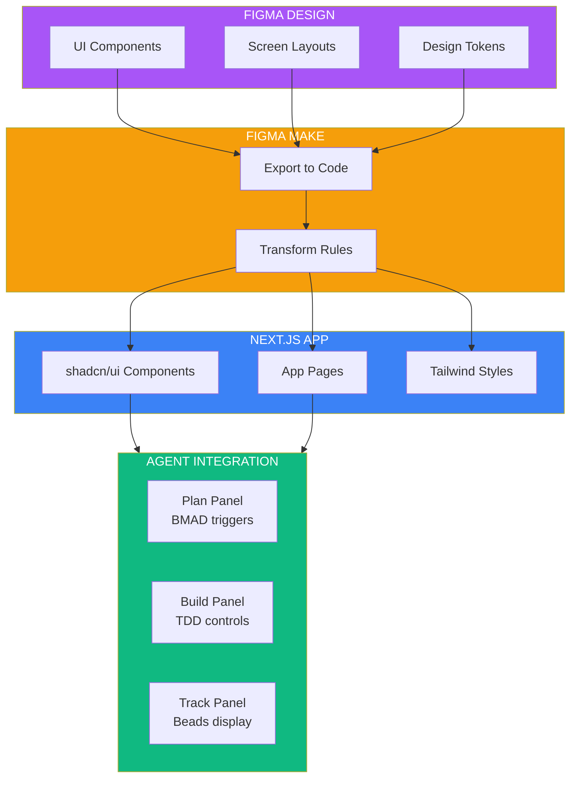

### 4.3 UI Panel Specifications

```mermaid
graph TB
    subgraph PlanPanel["📋 PLAN PANEL"]
        direction TB
        P1[Feature Input Form]
        P2[VSOM Alignment Selector]
        P3[Generated PRD Preview]
        P4[Story Breakdown View]
        P5[Approve / Revise Buttons]
    end
    
    subgraph BuildPanel["🔨 BUILD PANEL"]
        direction TB
        B1[Task Selector Dropdown]
        B2[Story Context Display]
        B3[TDD Phase Indicator]
        B4[Test Results Console]
        B5[Coverage Gauge]
        B6[Complete Task Button]
    end
    
    subgraph TrackPanel["📊 TRACK PANEL"]
        direction TB
        T1[Kanban Board]
        T2[Dependency Graph]
        T3[Sprint Progress Bar]
        T4[Quality Metrics]
        T5[Recent Activity Feed]
    end
    
    style PlanPanel fill:#3B82F6,color:#fff
    style BuildPanel fill:#10B981,color:#fff
    style TrackPanel fill:#F59E0B,color:#fff
```

---

## Part 5: Step-by-Step Implementation Plan

### 5.1 Implementation Roadmap

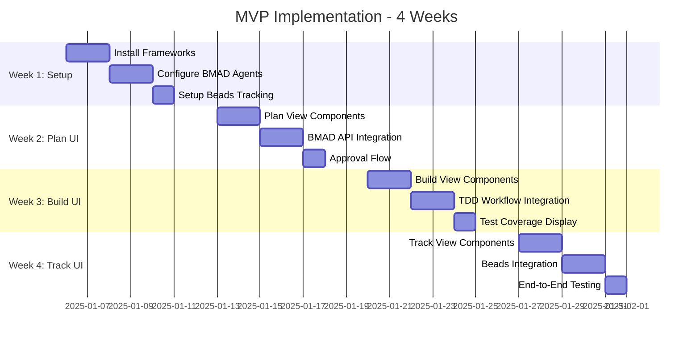

### 5.2 Week 1: Foundation Setup

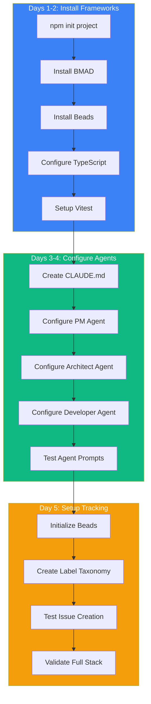

#### Day 1-2 Commands

```bash
# Initialize project
mkdir pf-core && cd pf-core
npm init -y

# Install core dependencies
npm install -D typescript vitest @vitest/coverage-c8 @types/node
npm install zod uuid

# Install frameworks
npx bmad-method install
npm install -g beads-cli

# Create directory structure
mkdir -p .bmad/agents .beads .claude docs/{specs,stories} src tests scripts
```

#### Day 3-4: Agent Configuration Files

**CLAUDE.md** (Project Context)
```markdown
# PF-Core Agentic Development

## Stack
- BMAD for planning (PM, Architect, Developer agents)
- SPARC TDD for building (80%+ coverage)
- Beads for tracking (git-native issues)

## Rules
1. TDD is mandatory - tests first
2. Schema.org base for all schemas
3. Multi-tenant: tenant_id + RLS always
4. 80% minimum test coverage

## Agents
Use these prompts to activate agents:
- "Act as PM Agent..." for specs/stories
- "Act as Architect Agent..." for technical design
- "Act as Developer Agent..." for TDD coding
```

#### Day 5: Beads Setup

```bash
# Initialize Beads
bd init --prefix pfc

# Create labels
bd label create domain:ui --color "#EC4899"
bd label create domain:api --color "#F59E0B"
bd label create domain:db --color "#0891B2"
bd label create priority:high --color "#DC2626"
bd label create priority:medium --color "#3B82F6"

# Validate
bd status
```

### 5.3 Week 2: Plan UI Integration

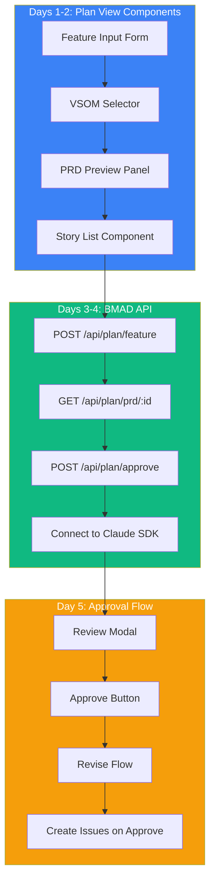

#### API Route: Plan Feature

```typescript
// src/app/api/plan/feature/route.ts
import { NextRequest, NextResponse } from 'next/server';
import Anthropic from '@anthropic-ai/sdk';

const PM_AGENT_PROMPT = `Act as the PFC PM Agent.
Create a spec with:
1. Problem statement (2-3 sentences)
2. Solution overview
3. User stories (< 4 hours each)
4. Acceptance criteria (Gherkin format)

Feature request: {feature}
VSOM Layer: {vsomLayer}`;

export async function POST(req: NextRequest) {
  const { feature, vsomLayer } = await req.json();
  
  const client = new Anthropic();
  const message = await client.messages.create({
    model: 'claude-sonnet-4-20250514',
    max_tokens: 4096,
    messages: [{
      role: 'user',
      content: PM_AGENT_PROMPT
        .replace('{feature}', feature)
        .replace('{vsomLayer}', vsomLayer)
    }]
  });
  
  return NextResponse.json({
    prd: message.content[0].text,
    status: 'pending_approval'
  });
}
```

### 5.4 Week 3: Build UI Integration

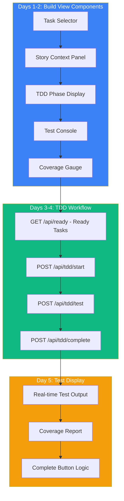

#### API Route: TDD Start

```typescript
// src/app/api/tdd/start/route.ts
import { NextRequest, NextResponse } from 'next/server';
import Anthropic from '@anthropic-ai/sdk';

const DEVELOPER_AGENT_PROMPT = `Act as the PFC Developer Agent using TDD.

Task: {taskTitle}
Acceptance Criteria:
{acceptanceCriteria}

Start with RED phase - write failing tests that cover:
1. Happy path
2. Edge cases
3. Error handling

Use Vitest. Return only the test code.`;

export async function POST(req: NextRequest) {
  const { taskId, taskTitle, acceptanceCriteria } = await req.json();
  
  const client = new Anthropic();
  const message = await client.messages.create({
    model: 'claude-sonnet-4-20250514',
    max_tokens: 4096,
    messages: [{
      role: 'user',
      content: DEVELOPER_AGENT_PROMPT
        .replace('{taskTitle}', taskTitle)
        .replace('{acceptanceCriteria}', acceptanceCriteria)
    }]
  });
  
  // Update Beads status
  // exec(`bd start ${taskId}`);
  
  return NextResponse.json({
    phase: 'red',
    testCode: message.content[0].text
  });
}
```

### 5.5 Week 4: Track UI Integration

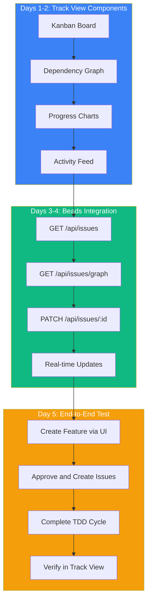

#### API Route: Issues List

```typescript
// src/app/api/issues/route.ts
import { NextRequest, NextResponse } from 'next/server';
import { execSync } from 'child_process';

export async function GET(req: NextRequest) {
  const { searchParams } = new URL(req.url);
  const status = searchParams.get('status') || 'all';
  
  // Query Beads
  const result = execSync(`bd list --status ${status} --json`);
  const issues = JSON.parse(result.toString());
  
  // Transform for Kanban
  const kanban = {
    backlog: issues.filter(i => i.status === 'backlog'),
    ready: issues.filter(i => i.status === 'ready'),
    inProgress: issues.filter(i => i.status === 'in_progress'),
    done: issues.filter(i => i.status === 'done')
  };
  
  return NextResponse.json(kanban);
}
```

---

## Part 6: UI Component Specifications

### 6.1 Plan Panel Components

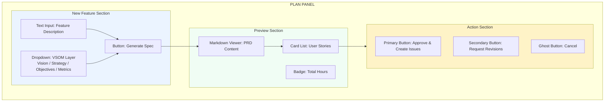

### 6.2 Build Panel Components

```mermaid
graph TB
    subgraph BuildPanel["BUILD PANEL"]
        subgraph TaskSelect["Task Selection"]
            ReadyTasks[Dropdown: Ready Tasks]
            TaskDetails[Card: Selected Task Details]
            StartBtn[Button: Start TDD]
        end
        
        subgraph TDDCycle["TDD Cycle"]
            PhaseIndicator[Progress: RED → GREEN → REFACTOR]
            TestConsole[Code Block: Test Output]
            CoverageBar[Progress Bar: Coverage %]
        end
        
        subgraph Complete["Completion"]
            Summary[Card: What was built]
            Coverage[Badge: Final Coverage]
            CompleteBtn[Button: Complete Task]
        end
    end
    
    ReadyTasks --> TaskDetails
    TaskDetails --> StartBtn
    StartBtn --> PhaseIndicator
    PhaseIndicator --> TestConsole
    TestConsole --> CoverageBar
    CoverageBar --> Complete
    
    style TaskSelect fill:#EBF4FF
    style TDDCycle fill:#F0FDF4
    style Complete fill:#FEF3C7
```

### 6.3 Track Panel Components

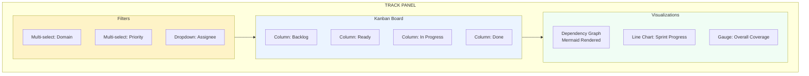

---

## Part 7: Quick Reference

### 7.1 Complete Flow Summary

```mermaid
graph LR
    A[💡 Feature Idea] --> B[📋 Plan]
    B --> C[✅ Approve]
    C --> D[📥 Issues Created]
    D --> E[🔨 TDD Build]
    E --> F[✅ Tests Pass]
    F --> G[📊 Track Complete]
    G --> H[🚀 Ship It]
    
    style A fill:#A855F7,color:#fff
    style B fill:#3B82F6,color:#fff
    style C fill:#10B981,color:#fff
    style D fill:#F59E0B,color:#fff
    style E fill:#3B82F6,color:#fff
    style F fill:#10B981,color:#fff
    style G fill:#F59E0B,color:#fff
    style H fill:#EC4899,color:#fff
```

### 7.2 Agent Prompt Quick Reference

| Agent | Trigger Phrase | Output |
|-------|---------------|--------|
| PM | "Act as PM Agent..." | PRD + Stories |
| Architect | "Act as Architect Agent..." | Schema + API |
| Developer | "Act as Developer Agent..." | Tests + Code |

### 7.3 Beads Commands

| Command | Purpose |
|---------|---------|
| `bd ready` | Show tasks ready to work |
| `bd start <id>` | Begin working on task |
| `bd complete <id>` | Mark task done |
| `bd graph` | Show dependency graph |

### 7.4 TDD Cycle

```
🔴 RED      → Write failing test
🟢 GREEN   → Write minimal code to pass
🔵 REFACTOR → Clean up, keep tests green
🔁 REPEAT   → Until all criteria covered
```

---

## Part 8: Success Criteria

### 8.1 MVP Complete Checklist

- [ ] **Setup**: All frameworks installed and configured
- [ ] **Plan UI**: Can create feature → generate PRD → approve
- [ ] **Build UI**: Can pick task → TDD cycle → complete
- [ ] **Track UI**: Can view Kanban → see dependencies → track progress
- [ ] **Integration**: Full flow works end-to-end
- [ ] **Quality**: 80%+ test coverage achieved
- [ ] **Team**: All developers productive with workflow

### 8.2 Definition of Done

```mermaid
graph LR
    subgraph Done["✅ DEFINITION OF DONE"]
        A[Tests Written First]
        B[80%+ Coverage]
        C[Code Reviewed]
        D[Beads Updated]
        E[Documentation]
    end
    
    A --> B --> C --> D --> E
    
    style Done fill:#10B981,color:#fff
```

---

*MVP Visual Guide - Understanding through diagrams, implementing through action.*
