# PF-Core Agentic Development Stack
## MVP Visual Guide v2.2

**Document:** PFC_AGENTIC_MVP_VISUAL_GUIDE_v2.2.md  
**Version:** 2.2.0  
**Date:** December 2025  
**Timeline:** 6 Weeks to Production  

---

## Document Overview

This guide provides a comprehensive visual walkthrough of the PF-Core Agentic Development Stack. It maps directly to the Figma UI structure (Program Manager/Solution Architect → Plan → Build → Track) and establishes the critical principle that **Value Engineering drives everything**.

**Key Update in v2.2:** Value Proposition, PMF (Product-Market Fit), and GTM (Go-to-Market) are now correctly positioned as components WITHIN Value Engineering—not separate phases. This reflects the reality that these strategic elements must be defined before any PRD work begins.

The document is organized to answer three questions:
1. **What are we building?** (Parts 1-3: Architecture & Components)
2. **How does it work?** (Parts 4-5: Flows & Integration)
3. **How do we build it?** (Parts 6-9: Implementation & Reference)

---

## Part 1: The Complete Picture

### 1.1 Value Engineering First (Complete Structure)

**Scope:** This diagram establishes the complete Value Engineering framework, showing that Value Proposition, PMF, and GTM are integral components within VE—not downstream activities. The VE phase encompasses strategic foundations (RRR, VSOM, OKR), value definition (Value Proposition), and market strategy (PMF, GTM).

**Purpose:** To correct a common misconception that Value Proposition is separate from Value Engineering. In reality, you cannot complete Value Engineering without defining the Value Proposition, validating Product-Market Fit, and establishing Go-to-Market strategy. Only after VE is complete (including VP, PMF, GTM) do we proceed to PRD generation. This ensures every product decision is grounded in validated market strategy.

```mermaid
flowchart TB
    subgraph VE["🎯 VALUE ENGINEERING (Complete Framework)"]
        direction TB
        
        subgraph STRATEGIC["STRATEGIC FOUNDATION"]
            RRR[RRR: Roles, Responsibilities, RACI]
            VSOM[VSOM: Vision, Strategy, Objectives, Metrics]
            OKR[OKR: Objectives & Key Results]
        end
        
        subgraph VALUE_DEF["VALUE DEFINITION"]
            VP[💎 Value Proposition<br/>Problem • Solution • Benefits • Differentiation]
        end
        
        subgraph MARKET["MARKET STRATEGY"]
            PMF[📊 PMF: Product-Market Fit<br/>Validation • Signals • Iteration]
            GTM[🚀 GTM: Go-to-Market<br/>Channels • Pricing • Launch]
        end
        
        STRATEGIC --> VALUE_DEF
        VALUE_DEF --> MARKET
    end
    
    subgraph CONTEXT["🏢 CLIENT-ORG CONTEXT"]
        Tenant[Tenant Configuration]
        Instance[PF-Instance: BAIV / W4M / AIR]
        Domain[Domain-Specific Rules]
    end
    
    CONTEXT -->|contextualizes| VE
    
    VE -->|drives| PRD[📄 PRD Generation]
    PRD -->|creates| PLAN[📋 Plan: Specs & Stories]
    PLAN -->|guides| BUILD[🔨 Build: Code & Data]
    BUILD -->|tracked by| TRACK[📊 Track: Progress & Quality]
    
    style VE fill:#6366F1,color:#fff
    style STRATEGIC fill:#8B5CF6,color:#fff
    style VALUE_DEF fill:#EC4899,color:#fff
    style MARKET fill:#F59E0B,color:#fff
    style CONTEXT fill:#1F2937,color:#fff
    style PRD fill:#3B82F6,color:#fff
    style PLAN fill:#10B981,color:#fff
    style BUILD fill:#06B6D4,color:#fff
    style TRACK fill:#14B8A6,color:#fff
```

### 1.2 The Correct Flow Hierarchy

**Scope:** This diagram presents the five distinct layers of our development stack. Note that Layer 1 (Value Engineering) is now comprehensive—it includes Strategic Foundation, Value Proposition, PMF, and GTM as sub-components, all of which must be completed before proceeding to Layer 2.

**Purpose:** To establish clear boundaries showing that Value Engineering is substantial strategic work that must be completed before PRD generation begins. Layers 2-5 (PRD, Plan, Build, Track) only proceed after VE delivers validated Value Proposition with PMF signals and GTM strategy. This prevents the common failure mode of building products without validated market fit.

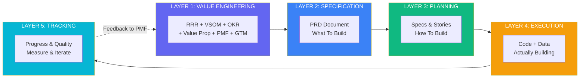

### 1.3 Mapping to Figma UI Structure

**Scope:** This diagram shows exactly how our agentic stack maps to the four main sections of the Figma UI design. The Program Manager section now explicitly includes Value Proposition, PMF, and GTM modules alongside RRR, VSOM, and OKR.

**Purpose:** To bridge the gap between conceptual architecture and actual user interface. The Program Manager panel is now understood to be where ALL Value Engineering work happens—including market strategy. This means executives complete VP, PMF, and GTM before any work flows to the Plan section.

```mermaid
graph TB
    subgraph "FIGMA UI STRUCTURE"
        subgraph PM["🎯 PROGRAM MANAGER / SOLUTION ARCHITECT"]
            subgraph VE_Core["Value Engineering Core"]
                RRR_UI[RRR Module]
                VSOM_UI[VSOM Manager]
                OKR_UI[OKR Cascade]
            end
            subgraph VE_Market["Value & Market Strategy"]
                VP_UI[Value Proposition Builder]
                PMF_UI[PMF Validation]
                GTM_UI[GTM Strategy]
            end
            Context_UI[Client-Org Context]
        end
        
        subgraph PLAN["📋 PLAN"]
            PRD_UI[PRD Generator]
            Spec_UI[Spec Manager]
            Story_UI[Story Board]
        end
        
        subgraph BUILD["🔨 BUILD"]
            OAA_UI[OAA Ontology Agent]
            TDD_UI[TDD Workspace]
            Data_UI[Data Mapper]
            API_UI[API Builder]
        end
        
        subgraph TRACK["📊 TRACK"]
            Issues_UI[Issue Tracker]
            Progress_UI[Progress Dashboard]
            Quality_UI[Quality Metrics]
            PMF_Metrics[PMF Signals Dashboard]
        end
    end
    
    PM -->|"Validated VP + PMF + GTM"| PLAN
    PLAN -->|"Specs & Stories"| BUILD
    BUILD -->|"Status Updates"| TRACK
    TRACK -.->|"PMF Feedback"| PM
    
    style PM fill:#6366F1,color:#fff
    style VE_Core fill:#8B5CF6,color:#fff
    style VE_Market fill:#EC4899,color:#fff
    style PLAN fill:#3B82F6,color:#fff
    style BUILD fill:#10B981,color:#fff
    style TRACK fill:#F59E0B,color:#fff
```

---

## Part 2: Value Engineering Foundation (Complete)

### 2.1 Value Engineering Complete Structure

**Scope:** This diagram breaks down all six components within Value Engineering: the three strategic foundation modules (RRR, VSOM, OKR) and the three market strategy modules (Value Proposition, PMF, GTM). Each module produces specific outputs that collectively inform PRD generation.

**Purpose:** To show Value Engineering as a comprehensive framework, not just "strategy stuff." RRR establishes governance, VSOM establishes direction, OKR establishes measurement, VP defines value, PMF validates market fit, and GTM plans market entry. All six must be completed—skipping PMF or GTM leads to building products nobody wants or can't reach customers.

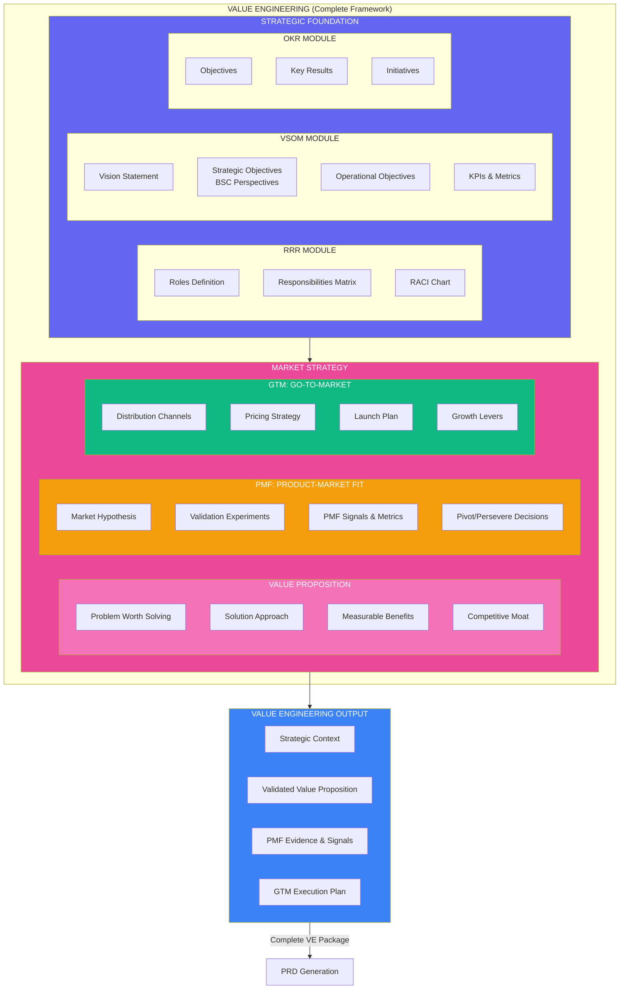

### 2.2 Value Proposition Detail

**Scope:** This diagram zooms into the Value Proposition module, showing its four core components (Problem, Solution, Benefits, Differentiation) and how it connects to both upstream (VSOM alignment) and downstream (PMF validation) modules.

**Purpose:** To establish that Value Proposition is not a one-time exercise but an iterative component that must align with strategy (VSOM) and be validated by market (PMF). The VP module captures the "why build this" in concrete terms—what problem we solve, how we solve it, what benefits result, and why we win versus alternatives.

```mermaid
flowchart TB
    subgraph VP_DETAIL["💎 VALUE PROPOSITION MODULE"]
        subgraph Inputs["INPUTS FROM VSOM"]
            Vision_In[Vision Alignment]
            Strategy_In[Strategic Fit]
            Metrics_In[Success Metrics]
        end
        
        subgraph Core["VP CORE COMPONENTS"]
            Problem["🎯 PROBLEM<br/>Pain points, frequency, severity<br/>Who has it, how they cope today"]
            Solution["💡 SOLUTION<br/>Approach, key capabilities<br/>Why this approach wins"]
            Benefits["📈 BENEFITS<br/>Quantified outcomes<br/>Time/cost/quality improvements"]
            Diff["🏆 DIFFERENTIATION<br/>Competitive moat<br/>Why hard to replicate"]
        end
        
        subgraph Outputs["OUTPUTS TO PMF"]
            Hypotheses[Testable Hypotheses]
            Metrics_Out[Success Metrics]
            Target_Segment[Target Segment Definition]
        end
    end
    
    Inputs --> Core
    Problem --> Solution --> Benefits --> Diff
    Core --> Outputs
    
    style VP_DETAIL fill:#EC4899,color:#fff
    style Core fill:#F472B6,color:#fff
```

### 2.3 PMF (Product-Market Fit) Module

**Scope:** This diagram details the PMF module, showing the validation cycle: Hypothesis → Experiment → Measure → Decide (pivot or persevere). It includes specific PMF signals we track and the decision framework for when to proceed to GTM.

**Purpose:** To establish PMF as a rigorous validation process, not just gut feel. Before spending resources on GTM and PRD, we must have evidence of product-market fit. The PMF module defines what signals indicate fit (retention, NPS, organic growth, etc.) and enforces a decision gate—only proceed when PMF signals are strong.

```mermaid
flowchart TB
    subgraph PMF_DETAIL["📊 PMF: PRODUCT-MARKET FIT MODULE"]
        subgraph Inputs["FROM VALUE PROPOSITION"]
            VP_Hypotheses[Testable Hypotheses]
            Target[Target Segment]
            Success_Def[Success Definition]
        end
        
        subgraph Validation["VALIDATION CYCLE"]
            Hypothesis["📝 HYPOTHESIS<br/>What we believe is true"]
            Experiment["🧪 EXPERIMENT<br/>MVP, prototype, landing page"]
            Measure["📏 MEASURE<br/>Collect signal data"]
            Decide["⚖️ DECIDE<br/>Pivot or Persevere"]
        end
        
        subgraph Signals["PMF SIGNALS"]
            Retention[Retention Rate > 40%]
            NPS[NPS > 40]
            Organic[Organic Growth]
            WOM[Word of Mouth]
            Usage[Usage Frequency]
            WTP[Willingness to Pay]
        end
        
        subgraph Gate["PMF GATE"]
            Pass["✅ PMF ACHIEVED<br/>Proceed to GTM"]
            Fail["🔄 ITERATE<br/>Return to VP"]
        end
    end
    
    Inputs --> Hypothesis
    Hypothesis --> Experiment --> Measure --> Decide
    Decide -->|"Signals Strong"| Signals
    Decide -->|"Signals Weak"| Hypothesis
    Signals --> Gate
    
    style PMF_DETAIL fill:#F59E0B,color:#fff
    style Validation fill:#FBBF24,color:#000
    style Signals fill:#FCD34D,color:#000
    style Gate fill:#10B981,color:#fff
```

### 2.4 GTM (Go-to-Market) Module

**Scope:** This diagram details the GTM module, showing the four key components: Channels (how we reach customers), Pricing (how we capture value), Launch (how we enter market), and Growth (how we scale). It shows GTM as the bridge between validated PMF and actual PRD work.

**Purpose:** To establish that GTM strategy must be defined BEFORE PRD, not after. Knowing your distribution channels affects product features (API for partners? Self-serve onboarding?). Knowing pricing affects scope (what's in free tier vs. paid?). GTM ensures we build what we can actually sell and deliver.

```mermaid
flowchart TB
    subgraph GTM_DETAIL["🚀 GTM: GO-TO-MARKET MODULE"]
        subgraph Inputs["FROM PMF"]
            PMF_Evidence[PMF Evidence]
            Segment[Validated Segment]
            WTP_Data[Willingness to Pay Data]
        end
        
        subgraph Core["GTM CORE COMPONENTS"]
            Channels["📣 CHANNELS<br/>Direct, Partner, PLG<br/>Content, Paid, Events"]
            Pricing["💰 PRICING<br/>Model (subscription, usage, hybrid)<br/>Tiers, packaging"]
            Launch["🎯 LAUNCH<br/>Beta strategy<br/>Launch sequence"]
            Growth["📈 GROWTH<br/>Acquisition loops<br/>Expansion revenue"]
        end
        
        subgraph Outputs["GTM OUTPUTS"]
            Channel_Reqs[Channel Requirements<br/>→ affects PRD features]
            Pricing_Reqs[Pricing Requirements<br/>→ affects tier scope]
            Launch_Timeline[Launch Timeline<br/>→ affects priorities]
            Growth_Metrics[Growth Metrics<br/>→ affects tracking]
        end
    end
    
    Inputs --> Core
    Channels --> Pricing --> Launch --> Growth
    Core --> Outputs
    Outputs -->|"Inform PRD"| PRD[PRD Generation]
    
    style GTM_DETAIL fill:#10B981,color:#fff
    style Core fill:#34D399,color:#000
    style Outputs fill:#6EE7B7,color:#000
```

### 2.5 Client-Org Context & PF-Instance

**Scope:** This diagram illustrates the relationship between PF-Core (the shared platform foundation) and the three PF-Instances (BAIV, W4M, AIR). Each instance inherits core VE capabilities but extends them with instance-specific context, ontologies, and PMF/GTM strategies.

**Purpose:** To demonstrate that while the VE framework is shared, each venture (BAIV, W4M, AIR) has unique market strategy requirements. BAIV's PMF signals differ from W4M's. BAIV's GTM channels differ from AIR's. The instance context captures these differences while leveraging shared infrastructure.

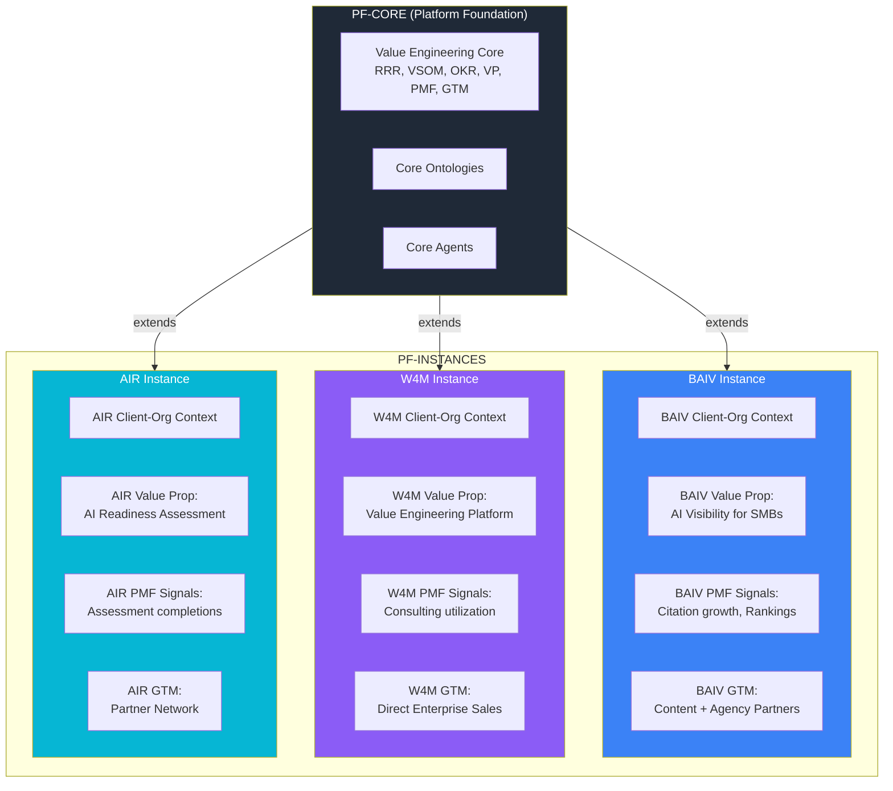

### 2.6 Value Engineering to PRD Flow

**Scope:** This sequence diagram shows the complete temporal flow within Value Engineering: Strategic Foundation → Value Proposition → PMF Validation → GTM Strategy → PRD Generation. It highlights the validation gates and iteration loops.

**Purpose:** To provide a step-by-step understanding of how work flows through Value Engineering before reaching PRD. Note the PMF validation loop—if PMF signals are weak, we iterate on VP rather than pushing forward. Only after PMF is validated and GTM is defined do we generate PRD. This prevents building products without market validation.

```mermaid
sequenceDiagram
    participant FOUND as Strategic Foundation
    participant VP as Value Proposition
    participant PMF as PMF Validation
    participant GTM as GTM Strategy
    participant PRD as PRD Generator
    
    Note over FOUND: Define governance & direction
    FOUND->>FOUND: Define RRR (Roles/RACI)
    FOUND->>FOUND: Configure VSOM (Strategy)
    FOUND->>FOUND: Set OKRs (Objectives)
    
    FOUND->>VP: Strategic Context
    Note over VP: Define value creation
    VP->>VP: Problem Statement
    VP->>VP: Solution Approach
    VP->>VP: Benefits & Differentiation
    
    VP->>PMF: Testable Hypotheses
    Note over PMF: Validate market fit
    
    loop Until PMF Achieved
        PMF->>PMF: Run Experiment
        PMF->>PMF: Measure Signals
        alt Signals Weak
            PMF->>VP: Iterate Value Prop
        else Signals Strong
            PMF->>PMF: PMF Achieved ✓
        end
    end
    
    PMF->>GTM: PMF Evidence
    Note over GTM: Plan market entry
    GTM->>GTM: Define Channels
    GTM->>GTM: Set Pricing
    GTM->>GTM: Plan Launch
    
    GTM->>PRD: Complete VE Package
    Note over PRD: Now safe to build
    PRD->>PRD: Generate Requirements
    PRD->>PRD: Create Specs & Stories
```

---

## Part 3: OAA Agent - Critical Early Component

### 3.1 Why OAA Agent First

**Scope:** This diagram emphasizes the critical dependency that makes the OAA (Ontology, Agent, Ability) Agent the first component we must build. It shows OAA's three core functions (Create, Test, Document) and how all other platform components depend on validated ontologies.

**Purpose:** To establish the build order priority. Without OAA Agent, we cannot create validated ontologies. Without validated ontologies, we cannot generate database schemas, type definitions, or API contracts. Without those, we cannot build features. This diagram should end any debate about what to build first—OAA is the critical path. BAIV specifically requires AI Visibility ontologies before any feature development can proceed.

```mermaid
flowchart TB
    subgraph OAA_CRITICAL["🔴 OAA AGENT - BUILD FIRST"]
        direction TB
        
        subgraph Create["CREATE"]
            Schema_Create[Create Ontology from Schema.org]
            Custom_Create[Add Custom Extensions]
            JSONLD_Create[Generate JSON-LD]
        end
        
        subgraph Test["TEST"]
            Validate[Validate Structure]
            Consistency[Check Consistency]
            Registry[Register in OAA Registry]
        end
        
        subgraph Document["DOCUMENT"]
            Generate_Docs[Auto-Generate Documentation]
            Examples[Create Usage Examples]
            API_Docs[Document API Contracts]
        end
    end
    
    subgraph DEPENDENCIES["EVERYTHING DEPENDS ON OAA"]
        DB[Database Schemas]
        API[API Contracts]
        Agents[Other Agents]
        UI[UI Components]
        VE_Storage[VE Module Storage<br/>VP, PMF, GTM Data]
    end
    
    Create --> Test --> Document
    Document --> DEPENDENCIES
    
    style OAA_CRITICAL fill:#DC2626,color:#fff
    style DEPENDENCIES fill:#F59E0B,color:#fff
```

### 3.2 OAA Agent Architecture

**Scope:** This diagram details the internal architecture of the OAA Agent, showing its inputs (Schema.org vocabulary, business requirements, existing ontologies), processing stages, and outputs (JSON-LD ontology, SQL schemas, TypeScript definitions, documentation). It also shows integration with the OAA Registry for version control and compliance.

**Purpose:** To provide developers with a clear specification for building the OAA Agent. Each box represents a distinct capability that must be implemented. The Registry integration is crucial—ontologies must be versioned, tracked for dependencies, and validated for compliance. This architecture ensures ontologies are not just created but properly managed throughout their lifecycle.

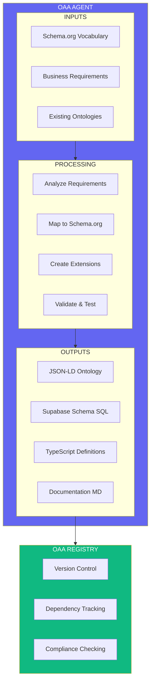

### 3.3 OAA Agent for BAIV

**Scope:** This diagram shows the specific ontologies required for the BAIV (Be AI Visible) instance. These are organized into three categories: Discovery ontologies (audit, competitor, gap analysis), Content ontologies (blog, social, schema markup), and Visibility ontologies (citation, presence, authority).

**Purpose:** To define the concrete deliverables the OAA Agent must produce for BAIV to function. These aren't abstract concepts—they're actual JSON-LD files that will be created, validated, and registered. This gives the development team a clear target list for Week 2 of implementation. Without these ontologies, BAIV cannot store discovery results, generate content briefs, or track AI visibility metrics.

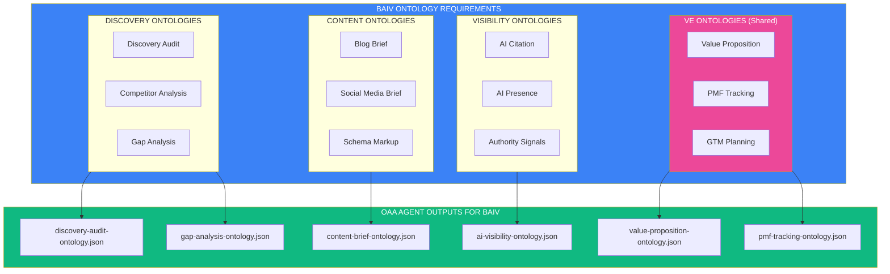

---

## Part 4: Build Phase - Data Mapping

### 4.1 Build Architecture

**Scope:** This diagram shows the complete Build phase architecture, organized into four layers: Data Layer (Supabase, JSONB, RLS), API Layer (REST endpoints, validation, transforms), Agent Layer (OAA, PM, Architect, Developer agents), and UI Layer (Figma Make → Next.js → shadcn). It shows how validated VE outputs (including VP, PMF, GTM) flow into the Build phase.

**Purpose:** To establish the technical stack and its interconnections. Developers need to understand that ontologies from OAA feed the Data Layer, which provides the foundation for APIs, which are consumed by Agents, which power the UI. This layered architecture ensures clean separation of concerns while maintaining data integrity through the ontology-driven approach.

```mermaid
flowchart TB
    subgraph VE_INPUT["FROM VALUE ENGINEERING"]
        VP_Validated[Validated Value Prop]
        PMF_Validated[PMF Evidence]
        GTM_Defined[GTM Strategy]
        Ontologies[Validated Ontologies]
    end
    
    subgraph PRD_INPUT["FROM PRD/PLAN"]
        Specs[Approved Specs]
        Stories[Prioritized Stories]
    end
    
    subgraph BUILD_PHASE["🔨 BUILD PHASE"]
        subgraph DataLayer["DATA LAYER"]
            DB[(Supabase PostgreSQL)]
            JSONB[JSONB Storage]
            RLS[Row Level Security]
        end
        
        subgraph APILayer["API LAYER"]
            REST[REST Endpoints]
            Validation[Schema Validation]
            Transform[Data Transform]
        end
        
        subgraph AgentLayer["AGENT LAYER"]
            OAA[OAA Agent]
            PM_Agent[PM Agent]
            Arch_Agent[Architect Agent]
            Dev_Agent[Developer Agent]
        end
        
        subgraph UILayer["UI LAYER"]
            Figma[Figma Make]
            NextJS[Next.js Components]
            ShadcnUI[shadcn/ui]
        end
    end
    
    VE_INPUT --> BUILD_PHASE
    PRD_INPUT --> BUILD_PHASE
    
    Ontologies --> DataLayer
    DataLayer --> APILayer
    APILayer --> AgentLayer
    AgentLayer --> UILayer
    
    style VE_INPUT fill:#6366F1,color:#fff
    style PRD_INPUT fill:#3B82F6,color:#fff
    style DataLayer fill:#0891B2,color:#fff
    style APILayer fill:#F59E0B,color:#fff
    style AgentLayer fill:#8B5CF6,color:#fff
    style UILayer fill:#EC4899,color:#fff
```

### 4.2 Data Mapping Flow

**Scope:** This diagram traces how a single ontology (JSON-LD) generates multiple downstream artifacts: database tables, TypeScript types, and API routes. It shows the transformation chain from semantic definition to executable code.

**Purpose:** To demonstrate the power of ontology-driven development. Write the ontology once, and the OAA Agent generates everything else—database schemas with proper JSONB columns, TypeScript interfaces for type safety, and Zod schemas for runtime validation. This eliminates the "schema drift" problem where database, types, and API fall out of sync. When you change the ontology, regenerate everything.

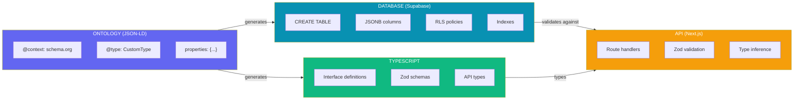

### 4.3 JSONB Storage Pattern

**Scope:** This diagram details our JSONB storage pattern for Supabase tables. It shows the standard table structure (id, tenant_id, core fields, metadata JSONB, data JSONB, timestamps) and explains why this pattern provides flexibility while maintaining queryability.

**Purpose:** To establish the database design pattern all tables must follow. The combination of fixed columns for frequently-queried fields and JSONB columns for flexible/evolving data gives us the best of both worlds. This pattern enables ontology evolution without database migrations—new ontology properties go into the JSONB columns. The benefits (schema evolution, ontology compliance, query flexibility, version tolerance) justify the slight complexity increase.

```mermaid
flowchart TB
    subgraph Pattern["JSONB STORAGE PATTERN"]
        subgraph Table["SUPABASE TABLE"]
            ID[id: UUID]
            TenantID[tenant_id: UUID]
            CoreFields[Core Fields: TEXT, INT, etc]
            Metadata[metadata: JSONB]
            Data[data: JSONB]
            Timestamps[created_at, updated_at]
        end
        
        subgraph JSONB_Content["JSONB CONTENT"]
            Flexible[Flexible Schema Data]
            Ontology_Data[Ontology-Defined Fields]
            Extensions[Custom Extensions]
        end
        
        subgraph Benefits["BENEFITS"]
            B1[Schema Evolution]
            B2[Ontology Compliance]
            B3[Query Flexibility]
            B4[Version Tolerance]
        end
    end
    
    Table --> JSONB_Content
    JSONB_Content --> Benefits
    
    style Table fill:#0891B2,color:#fff
    style JSONB_Content fill:#F59E0B,color:#fff
    style Benefits fill:#10B981,color:#fff
```

---

## Part 5: Complete System Flow

### 5.1 End-to-End Flow with All Components

**Scope:** This comprehensive diagram shows the complete flow from Value Engineering (including VP, PMF, GTM) through to Track. Each phase is expanded to show its key activities, and the arrows show the progression and feedback loops between phases.

**Purpose:** To provide a single "big picture" view of how all components work together. Note that Phase 1 (Value Engineering) now includes VP, PMF validation, and GTM strategy—all must complete before PRD. The feedback loop from Track goes back to PMF, enabling continuous validation of product-market fit based on real usage data.

```mermaid
flowchart TB
    subgraph VE_PHASE["1️⃣ VALUE ENGINEERING (Complete)"]
        subgraph VE_Foundation["Foundation"]
            RRR_1[Define RRR]
            VSOM_1[Configure VSOM]
            OKR_1[Set OKRs]
        end
        subgraph VE_Market["Market Strategy"]
            VP_1[Create Value Proposition]
            PMF_1[Validate PMF]
            GTM_1[Define GTM Strategy]
        end
        CTX_1[Set Client-Org Context]
    end
    
    subgraph PRD_PHASE["2️⃣ PRD GENERATION"]
        PRD_Gen[Generate PRD<br/>Python Scripts + Agents]
        PRD_Review[Review & Refine]
        PRD_Approve[Approve PRD]
    end
    
    subgraph PLAN_PHASE["3️⃣ PLAN"]
        Spec_Gen[Generate Specs]
        Story_Create[Create Stories]
        Story_Prioritize[Prioritize & Estimate]
        Issues_Create[Create Beads Issues]
    end
    
    subgraph BUILD_PHASE["4️⃣ BUILD"]
        OAA_First[OAA: Create Ontologies]
        DB_Create[Create Database Schema]
        API_Create[Build API Endpoints]
        TDD_Code[TDD: Write Code]
        UI_Build[Build UI Components]
    end
    
    subgraph TRACK_PHASE["5️⃣ TRACK"]
        Progress[Track Progress]
        Quality[Monitor Quality]
        PMF_Track[Track PMF Signals]
        Feedback[Gather Feedback]
    end
    
    VE_Foundation --> VE_Market
    VE_PHASE --> PRD_PHASE
    PRD_PHASE --> PLAN_PHASE
    PLAN_PHASE --> BUILD_PHASE
    BUILD_PHASE --> TRACK_PHASE
    TRACK_PHASE -.->|"PMF Feedback"| PMF_1
    
    style VE_PHASE fill:#6366F1,color:#fff
    style VE_Foundation fill:#8B5CF6,color:#fff
    style VE_Market fill:#EC4899,color:#fff
    style PRD_PHASE fill:#3B82F6,color:#fff
    style PLAN_PHASE fill:#10B981,color:#fff
    style BUILD_PHASE fill:#F59E0B,color:#fff
    style TRACK_PHASE fill:#06B6D4,color:#fff
```

### 5.2 Agent Orchestration

**Scope:** This diagram shows how the various AI agents interact and hand off work to each other. It distinguishes between Core Agents (OAA, VE) that must be built first, Planning Agents (PM, Architect), and Execution Agents (Developer, Test). The VE Agent now explicitly handles VP, PMF, and GTM context.

**Purpose:** To define the agent ecosystem architecture. Not all agents are equal—Core Agents provide foundational capabilities that other agents depend on. The VE Agent provides complete strategic context including Value Proposition, PMF evidence, and GTM strategy to inform PRD generation. This diagram helps developers understand agent dependencies when planning build order.

```mermaid
flowchart TB
    subgraph Agents["AGENT ECOSYSTEM"]
        subgraph Core_Agents["CORE AGENTS (Build First)"]
            OAA_Agent[🔴 OAA Agent<br/>Ontology Management]
            VE_Agent[🎯 VE Agent<br/>VSOM + OKR + VP + PMF + GTM Context]
        end
        
        subgraph Planning_Agents["PLANNING AGENTS"]
            PM_Agent[PM Agent<br/>PRD & Stories]
            Arch_Agent[Architect Agent<br/>Technical Design]
        end
        
        subgraph Execution_Agents["EXECUTION AGENTS"]
            Dev_Agent[Developer Agent<br/>TDD Implementation]
            Test_Agent[Test Agent<br/>Quality Validation]
        end
    end
    
    subgraph Orchestration["ORCHESTRATION"]
        Context[Shared Context<br/>CLAUDE.md + Memory]
        Handoff[Agent Handoff Protocol]
        State[State Management]
    end
    
    Core_Agents --> Orchestration
    Planning_Agents --> Orchestration
    Execution_Agents --> Orchestration
    
    OAA_Agent -->|"provides ontologies"| PM_Agent
    OAA_Agent -->|"provides schemas"| Arch_Agent
    VE_Agent -->|"provides VP + PMF + GTM context"| PM_Agent
    PM_Agent -->|"provides specs"| Arch_Agent
    Arch_Agent -->|"provides design"| Dev_Agent
    
    style Core_Agents fill:#DC2626,color:#fff
    style Planning_Agents fill:#3B82F6,color:#fff
    style Execution_Agents fill:#10B981,color:#fff
```

---

## Part 6: Step-by-Step Implementation Plan

### 6.1 Implementation Roadmap (6 Weeks)

**Scope:** This Gantt chart shows the complete 6-week implementation timeline, broken into weekly milestones. Week 1 now includes VE Module setup for VP, PMF, and GTM alongside the strategic foundation modules.

**Purpose:** To provide project management visibility into the build sequence. Week 1-2 focuses on OAA Agent and VE modules (critical path), Week 3 on PRD integration, Week 4 on Build infrastructure, Week 5 on Integration, and Week 6 on Polish. The VE modules (including VP, PMF, GTM) are built in Week 1 because they're needed to test the full flow.

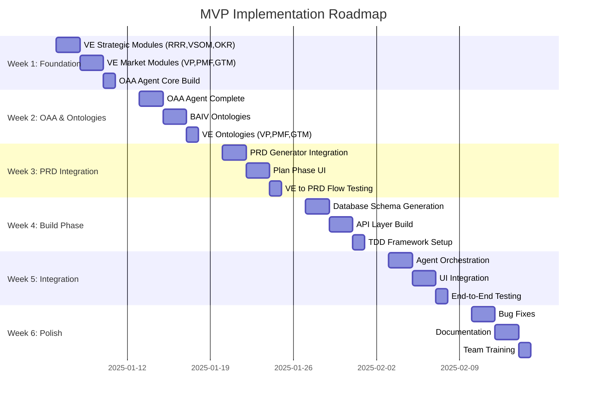

### 6.2 Week 1: Foundation & VE Complete

**Scope:** This flowchart details the Day 1-5 activities for Week 1, now organized into three phases: Strategic Foundation Setup (Days 1-2), Market Strategy Setup (Days 3-4), and OAA Agent Start (Day 5). This ensures all VE modules including VP, PMF, and GTM are configured before ontology work begins.

**Purpose:** To give the development team a clear daily checklist for Week 1. By the end of Week 1, we should have complete VE module structure (RRR, VSOM, OKR, VP, PMF, GTM), instance configurations, and OAA Agent interface defined. This comprehensive foundation is essential for Week 2's ontology work.

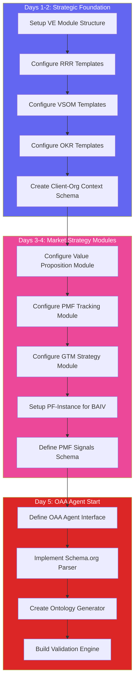

### 6.3 Week 2: Complete OAA Agent

**Scope:** This flowchart details Week 2 activities: completing the OAA Agent core (Days 1-2), creating all BAIV ontologies (Days 3-4), and creating VE ontologies for VP, PMF, GTM storage (Day 5). This ensures we have ontologies for both BAIV features AND Value Engineering data.

**Purpose:** To ensure the critical path item (OAA Agent) is fully functional by end of Week 2. The specific BAIV ontologies AND VE ontologies must both be complete—we need to store Value Propositions, PMF tracking data, and GTM plans just as much as we need to store Discovery Audits.

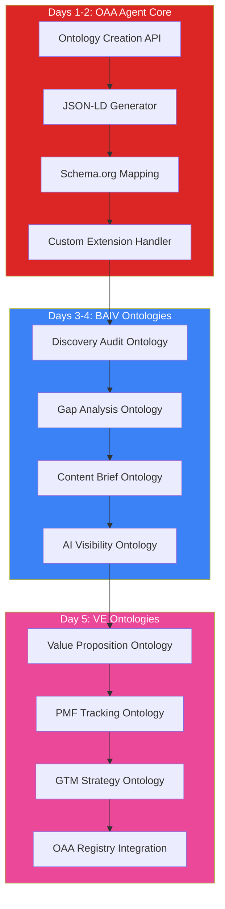

### 6.4 Week 3: PRD Integration

**Scope:** This flowchart details Week 3 activities: integrating the PRD Generator with existing Python scripts (Days 1-2), creating the Plan Phase UI components (Days 3-4), and testing the complete VE → PRD flow (Day 5).

**Purpose:** To connect Value Engineering outputs (including VP, PMF, GTM) to PRD generation. The PRD Generator must receive complete VE context—not just strategic alignment but also validated Value Proposition, PMF evidence, and GTM strategy. By end of Week 3, users can complete VE and generate a PRD through the UI.

```mermaid
flowchart TB
    subgraph Day1_2["Days 1-2: PRD Generator Integration"]
        A1[Integrate Existing Python Scripts]
        A2[Connect PM Agent]
        A3[Wire VE Context to PRD<br/>VP + PMF + GTM]
        A4[Template Processing]
        A5[Story Generation]
    end
    
    subgraph Day3_4["Days 3-4: Plan Phase UI"]
        B1[VE Summary Display]
        B2[PRD Preview Panel]
        B3[Story Board View]
        B4[Approval Workflow]
    end
    
    subgraph Day5["Day 5: VE to PRD Flow Testing"]
        C1[Test: RRR → VSOM → OKR Flow]
        C2[Test: VP → PMF → GTM Flow]
        C3[Test: Complete VE → PRD Generation]
        C4[Test: PRD → Stories Breakdown]
    end
    
    A1 --> A2 --> A3 --> A4 --> A5
    A5 --> B1 --> B2 --> B3 --> B4
    B4 --> C1 --> C2 --> C3 --> C4
    
    style Day1_2 fill:#8B5CF6,color:#fff
    style Day3_4 fill:#3B82F6,color:#fff
    style Day5 fill:#10B981,color:#fff
```

### 6.5 Week 4: Build Phase - Data Layer

**Scope:** This flowchart details Week 4 activities: using OAA to generate database schemas from ontologies (Days 1-2), building the API layer (Days 3-4), and setting up the TDD framework (Day 5).

**Purpose:** To transform ontologies into working infrastructure. The OAA Agent's schema generation capabilities (built in Week 2) now produce actual Supabase tables with RLS policies. The API layer implements CRUD operations with Zod validation derived from ontologies. The TDD setup with Vitest ensures all subsequent code has test coverage from the start.

```mermaid
flowchart TB
    subgraph Day1_2["Days 1-2: Database Schema"]
        A1[OAA Generates SQL from Ontologies]
        A2[Apply RLS Policies]
        A3[Create JSONB Columns]
        A4[Setup Indexes]
        A5[Run Migrations]
    end
    
    subgraph Day3_4["Days 3-4: API Layer"]
        B1[Generate API Routes from Ontologies]
        B2[Implement Zod Validation]
        B3[Add Type Safety]
        B4[Connect to Supabase]
    end
    
    subgraph Day5["Day 5: TDD Setup"]
        C1[Configure Vitest]
        C2[Setup Coverage]
        C3[Create Test Helpers]
        C4[Write First Tests]
    end
    
    A1 --> A2 --> A3 --> A4 --> A5
    A5 --> B1 --> B2 --> B3 --> B4
    B4 --> C1 --> C2 --> C3 --> C4
    
    style Day1_2 fill:#0891B2,color:#fff
    style Day3_4 fill:#F59E0B,color:#fff
    style Day5 fill:#10B981,color:#fff
```

### 6.6 Week 5: Integration

**Scope:** This flowchart details Week 5 activities: building the agent orchestration layer (Days 1-2), integrating all UI panels with their backend services (Days 3-4), and running end-to-end tests (Day 5).

**Purpose:** To connect all previously-built components into a working system. Agent orchestration enables agents to share context and hand off work. UI integration wires the Figma Make components to actual APIs. End-to-end testing validates the complete flow from Value Engineering (including VP, PMF, GTM) through to completed code.

```mermaid
flowchart TB
    subgraph Day1_2["Days 1-2: Agent Orchestration"]
        A1[Context Sharing Protocol]
        A2[Agent Handoff System]
        A3[State Management]
        A4[Error Handling]
    end
    
    subgraph Day3_4["Days 3-4: UI Integration"]
        B1[Connect VE Panel<br/>RRR, VSOM, OKR, VP, PMF, GTM]
        B2[Connect Plan Panel to PRD]
        B3[Connect Build Panel to TDD]
        B4[Connect Track Panel to Beads + PMF]
    end
    
    subgraph Day5["Day 5: E2E Testing"]
        C1[Full Flow: VE → VP → PMF → GTM → PRD → Build]
        C2[Agent Communication Tests]
        C3[Data Integrity Tests]
        C4[PMF Signal Tracking Tests]
    end
    
    A1 --> A2 --> A3 --> A4
    A4 --> B1 --> B2 --> B3 --> B4
    B4 --> C1 --> C2 --> C3 --> C4
    
    style Day1_2 fill:#8B5CF6,color:#fff
    style Day3_4 fill:#EC4899,color:#fff
    style Day5 fill:#10B981,color:#fff
```

### 6.7 Week 6: Polish & Training

**Scope:** This flowchart details the final week: fixing integration issues discovered in Week 5 (Days 1-2), completing documentation (Days 3-4), and training the team (Day 5).

**Purpose:** To ensure the MVP is production-ready. Bug fixes address issues found in E2E testing. Documentation includes API docs, agent usage guides, VE module guides (with VP, PMF, GTM), ontology references, and workflow tutorials—essential for team adoption. Training ensures all developers can use the system effectively.

```mermaid
flowchart TB
    subgraph Day1_2["Days 1-2: Bug Fixes"]
        A1[Fix Integration Issues]
        A2[Resolve Edge Cases]
        A3[Performance Optimization]
    end
    
    subgraph Day3_4["Days 3-4: Documentation"]
        B1[API Documentation]
        B2[VE Module Guide<br/>RRR, VSOM, OKR, VP, PMF, GTM]
        B3[Agent Usage Guide]
        B4[Ontology Reference]
    end
    
    subgraph Day5["Day 5: Team Training"]
        C1[VE Workflow Walkthrough]
        C2[VP → PMF → GTM Process]
        C3[Agent Interaction Demo]
        C4[Go-Live Checklist]
    end
    
    A1 --> A2 --> A3
    A3 --> B1 --> B2 --> B3 --> B4
    B4 --> C1 --> C2 --> C3 --> C4
    
    style Day1_2 fill:#DC2626,color:#fff
    style Day3_4 fill:#3B82F6,color:#fff
    style Day5 fill:#10B981,color:#fff
```

---

## Part 7: UI Panel Specifications

### 7.1 Program Manager Panel (Value Engineering Complete)

**Scope:** This diagram shows the component structure for the Program Manager panel in the Figma UI. It now has four main sections: Strategic Foundation (RRR, VSOM, OKR), Value Definition (Value Proposition), Market Strategy (PMF, GTM), and Context (instance selector, tenant config).

**Purpose:** To specify what UI components must be built for the Program Manager section. This is where executives and solution architects complete ALL Value Engineering work—including Value Proposition creation, PMF validation, and GTM strategy—before anything flows to Plan. The Status section provides real-time visibility into PMF signals and GTM readiness.

```mermaid
graph TB
    subgraph PMPanel["PROGRAM MANAGER PANEL"]
        subgraph Strategic_Section["Strategic Foundation"]
            RRR_Tab[RRR Tab<br/>Roles & RACI Matrix]
            VSOM_Tab[VSOM Tab<br/>Vision → Metrics Cascade]
            OKR_Tab[OKR Tab<br/>Objectives & Key Results]
        end
        
        subgraph VP_Section["Value Definition"]
            VP_Builder[Value Proposition Builder<br/>Problem • Solution • Benefits]
            VP_Canvas[Value Prop Canvas View]
        end
        
        subgraph Market_Section["Market Strategy"]
            PMF_Tab[PMF Tab<br/>Hypotheses • Experiments • Signals]
            GTM_Tab[GTM Tab<br/>Channels • Pricing • Launch]
            PMF_Dashboard[PMF Signals Dashboard]
        end
        
        subgraph Context_Section["Context Section"]
            Instance_Select[Instance Selector<br/>BAIV / W4M / AIR]
            Tenant_Config[Tenant Configuration]
            Readiness_Gate[VE Readiness Gate<br/>✓ VP ✓ PMF ✓ GTM]
        end
    end
    
    style Strategic_Section fill:#6366F1,color:#fff
    style VP_Section fill:#EC4899,color:#fff
    style Market_Section fill:#F59E0B,color:#fff
    style Context_Section fill:#10B981,color:#fff
```

### 7.2 Plan Panel (PRD → Specs → Stories)

**Scope:** This diagram shows the component structure for the Plan panel. It has four sections: VE Summary (displays VP, PMF status, GTM overview), PRD Generation (generate button, preview, edit), Stories (list, prioritization, issue creation), and Approval (checklist, approve/reject buttons).

**Purpose:** To specify the workflow for creating and approving plans. Note that Plan panel STARTS with a VE Summary—users see the validated Value Proposition, PMF evidence, and GTM strategy before generating PRD. This ensures PRD generation has complete context. The VE Readiness indicator confirms all prerequisites are met.

```mermaid
graph TB
    subgraph PlanPanel["PLAN PANEL"]
        subgraph VE_Summary["VE Summary (Read-Only)"]
            VP_Display[Value Proposition Summary]
            PMF_Status[PMF Status: ✓ Validated]
            GTM_Overview[GTM Strategy Overview]
            VE_Ready[VE Readiness: ✓ Complete]
        end
        
        subgraph PRD_Section["PRD Generation"]
            Generate_Btn[Generate PRD Button]
            PRD_Preview[PRD Preview<br/>Markdown Viewer]
            Edit_PRD[Edit & Refine]
        end
        
        subgraph Story_Section["Stories"]
            Story_List[Story List<br/>Estimated Hours]
            Prioritize[Drag & Drop Priority]
            Create_Issues[Create Beads Issues]
        end
        
        subgraph Approval["Approval"]
            Review_Checklist[Review Checklist]
            Approve_Btn[Approve & Proceed to Build]
            Reject_Btn[Request Changes]
        end
    end
    
    VE_Summary --> PRD_Section --> Story_Section --> Approval
    
    style VE_Summary fill:#6366F1,color:#fff
    style PRD_Section fill:#8B5CF6,color:#fff
    style Story_Section fill:#3B82F6,color:#fff
    style Approval fill:#10B981,color:#fff
```

### 7.3 Build Panel (OAA + TDD + Data)

**Scope:** This diagram shows the component structure for the Build panel. It has four sections: OAA Ontology Agent (browser, create, test, docs), Data Mapping (schema view, API view, types), TDD Workspace (task select, phase indicator, test console, coverage), and Actions (run tests, generate code, complete task).

**Purpose:** To specify the developer workspace. The OAA section provides ontology management—critical for maintaining data consistency. Data Mapping shows what the ontologies produce. TDD Workspace is where actual coding happens with test-first discipline. The Build panel is where specs become working software.

```mermaid
graph TB
    subgraph BuildPanel["BUILD PANEL"]
        subgraph OAA_Section["OAA Ontology Agent"]
            Ontology_List[Ontology Browser]
            Create_Ontology[Create New Ontology]
            Test_Ontology[Test & Validate]
            Doc_Ontology[View Documentation]
        end
        
        subgraph Data_Section["Data Mapping"]
            Schema_View[Database Schema<br/>Generated from Ontology]
            API_View[API Endpoints<br/>Auto-generated]
            Types_View[TypeScript Types]
        end
        
        subgraph TDD_Section["TDD Workspace"]
            Task_Select[Select Ready Task]
            Phase_Indicator[RED → GREEN → REFACTOR]
            Test_Console[Test Output Console]
            Coverage_Gauge[Coverage: 80%+]
        end
        
        subgraph Actions["Actions"]
            Run_Tests[Run Tests]
            Generate_Code[Generate Code]
            Complete_Task[Complete Task]
        end
    end
    
    OAA_Section --> Data_Section --> TDD_Section --> Actions
    
    style OAA_Section fill:#DC2626,color:#fff
    style Data_Section fill:#0891B2,color:#fff
    style TDD_Section fill:#10B981,color:#fff
    style Actions fill:#F59E0B,color:#fff
```

### 7.4 Track Panel (Progress + PMF Signals)

**Scope:** This diagram shows the component structure for the Track panel. It now includes a dedicated PMF Signals section that displays real-world product-market fit metrics, feeding back into the VE loop.

**Purpose:** To specify the tracking and feedback UI. The PMF Signals section is critical—it shows retention rates, NPS scores, usage patterns, and other indicators that validate (or invalidate) the original PMF hypothesis. This data flows back to the Program Manager panel to inform VP iterations.

```mermaid
graph TB
    subgraph TrackPanel["TRACK PANEL"]
        subgraph Progress_Section["Progress Tracking"]
            Kanban[Kanban Board]
            Burndown[Sprint Burndown]
            Velocity[Velocity Chart]
        end
        
        subgraph Quality_Section["Quality Metrics"]
            Coverage[Test Coverage: 80%+]
            Bugs[Bug Count]
            Tech_Debt[Tech Debt Tracker]
        end
        
        subgraph PMF_Section["PMF Signals"]
            Retention[Retention Rate]
            NPS[NPS Score]
            Usage[Usage Frequency]
            Organic[Organic Growth Rate]
            WTP[Willingness to Pay]
        end
        
        subgraph Feedback["Feedback Loop"]
            PMF_Alert[PMF Signal Alerts]
            Iterate_Trigger[Trigger VP Iteration]
            GTM_Adjust[GTM Adjustment Needed]
        end
    end
    
    Progress_Section --> Quality_Section
    Quality_Section --> PMF_Section
    PMF_Section --> Feedback
    Feedback -.->|"Back to VE"| PM[Program Manager]
    
    style Progress_Section fill:#3B82F6,color:#fff
    style Quality_Section fill:#10B981,color:#fff
    style PMF_Section fill:#F59E0B,color:#fff
    style Feedback fill:#EC4899,color:#fff
```

---

## Part 8: Quick Reference

### 8.1 Complete Flow Summary

**Scope:** This simplified diagram shows the entire flow in one line: Value Engineering (with VP, PMF, GTM inside) → PRD → Plan → Build → Track, with the OAA Agent providing ontologies to multiple stages and PMF feedback flowing back.

**Purpose:** To provide a memorable summary of the system. When explaining PF-Core to someone in 30 seconds, this is the diagram to draw. Note that VP, PMF, and GTM are INSIDE Value Engineering, not separate. The feedback loop from Track goes specifically to PMF for continuous validation.

```mermaid
graph LR
    subgraph VE["🎯 VALUE ENGINEERING"]
        VE_Core[RRR + VSOM + OKR]
        VP[💎 Value Prop]
        PMF[📊 PMF]
        GTM[🚀 GTM]
    end
    
    VE --> PRD[📄 PRD]
    PRD --> PLAN[📋 Plan]
    PLAN --> BUILD[🔨 Build]
    BUILD --> TRACK[📊 Track]
    TRACK -.->|"PMF Signals"| PMF
    
    OAA[🔴 OAA Agent]
    OAA -.->|"Ontologies"| VE
    OAA -.->|"Schemas"| BUILD
    
    style VE fill:#6366F1,color:#fff
    style VP fill:#EC4899,color:#fff
    style PMF fill:#F59E0B,color:#fff
    style GTM fill:#10B981,color:#fff
    style PRD fill:#3B82F6,color:#fff
    style PLAN fill:#14B8A6,color:#fff
    style BUILD fill:#06B6D4,color:#fff
    style TRACK fill:#8B5CF6,color:#fff
    style OAA fill:#DC2626,color:#fff
```

### 8.2 Key Principles

| Principle | Description |
|-----------|-------------|
| **Value First** | Everything starts with Value Engineering—RRR, VSOM, OKR, VP, PMF, GTM |
| **VP Inside VE** | Value Proposition is a component OF Value Engineering, not separate |
| **PMF Before PRD** | Must validate Product-Market Fit before generating requirements |
| **GTM Informs Features** | Go-to-Market strategy affects what features to build |
| **Ontology Driven** | OAA Agent creates, tests, and documents all schemas |
| **TDD Mandatory** | 80%+ test coverage required—write tests before code |
| **PMF Feedback Loop** | Track feeds real PMF signals back to VE for iteration |

### 8.3 Build Order

```
1. 🔴 OAA Agent (Week 1-2) - CRITICAL FIRST
2. 🎯 VE Strategic Modules - RRR, VSOM, OKR (Week 1)
3. 💎 VE Market Modules - VP, PMF, GTM (Week 1)
4. 📄 PRD Generator Integration (Week 3)
5. 🔨 Data Layer (Week 4)
6. 🧪 TDD Framework (Week 4)
7. 🔗 Integration (Week 5)
8. ✨ Polish (Week 6)
```

### 8.4 Agent Quick Reference

| Agent | Purpose | Inputs | Outputs |
|-------|---------|--------|---------|
| **OAA** | Ontology management | Requirements, Schema.org | JSON-LD, SQL, Types, Docs |
| **VE** | Complete strategic context | VSOM, OKR, VP, PMF, GTM | Strategic alignment + Market strategy |
| **PM** | PRD & Stories | Complete VE Package | PRD.md, Stories |
| **Architect** | Technical design | PRD | Schema, API design |
| **Developer** | TDD coding | Stories | Tests, Code |

### 8.5 VE Completeness Checklist

Before proceeding to PRD, verify:

- [ ] **RRR**: Roles defined, RACI complete
- [ ] **VSOM**: Vision → Strategy → Objectives → Metrics cascade
- [ ] **OKR**: Objectives with Key Results defined
- [ ] **VP**: Problem, Solution, Benefits, Differentiation documented
- [ ] **PMF**: Hypothesis tested, signals positive
- [ ] **GTM**: Channels, Pricing, Launch plan defined

---

## Part 9: Success Criteria

### 9.1 MVP Complete Checklist

- [ ] **OAA Agent**: Can create, test, and document ontologies
- [ ] **VE Strategic**: RRR, VSOM, OKR modules functional
- [ ] **VE Market**: VP, PMF, GTM modules functional
- [ ] **VE to PRD**: Complete VE flows to PRD generation
- [ ] **PRD Generation**: Automated from VE using existing scripts
- [ ] **Plan Phase**: Specs and Stories generated correctly
- [ ] **Build Phase**: Database, API from ontologies working
- [ ] **TDD**: 80%+ coverage achieved
- [ ] **Track Phase**: Progress + PMF signals displayed
- [ ] **PMF Feedback**: Signals flow back to VE
- [ ] **Integration**: Full flow works end-to-end

### 9.2 Definition of Done

**Scope:** This simple flow shows the six criteria that must be met for any work item to be considered "done": Value Aligned, PMF Validated, Ontology Valid, Tests First, 80%+ Coverage, and Documented.

**Purpose:** To establish a consistent quality bar across all development work. Every PR, every feature, every module must pass all six criteria. Note the addition of "PMF Validated"—we don't ship features that haven't been validated against product-market fit evidence.

```mermaid
graph LR
    subgraph Done["✅ DEFINITION OF DONE"]
        A[Value Aligned]
        B[PMF Validated]
        C[Ontology Valid]
        D[Tests First]
        E[80%+ Coverage]
        F[Documented]
    end
    
    A --> B --> C --> D --> E --> F
    
    style Done fill:#10B981,color:#fff
```

---

*MVP Visual Guide v2.2 - Value Engineering Complete: VP, PMF, GTM as integral components*
