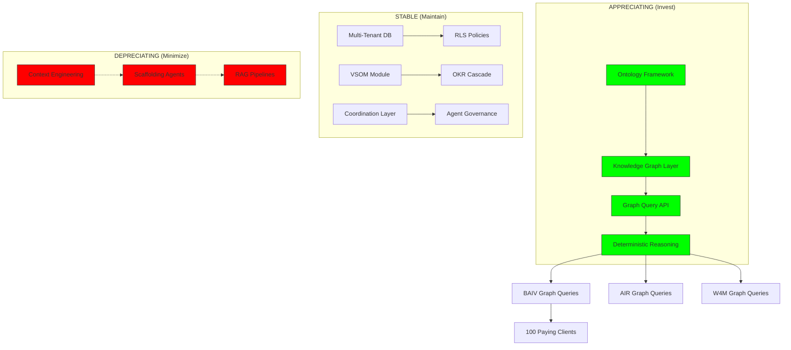

# Platform Foundation Core & Instance Architecture
## Review Conclusions & Proposed Roadmap

**Document Version:** 1.1  
**Date:** December 2025  
**Classification:** Strategic Review & Implementation Planning  
**Scope:** PF-Core Architecture + BAIV/AIR/W4M Instance Deployment  
**Key Insight:** Knowledge Graph Architecture Over Context Engineering

---

## Executive Summary

The Platform Foundation Core (PF-Core) architecture represents a mature, well-designed framework for deploying AI-driven business applications across multiple ventures. However, this review incorporates a **critical strategic insight**: context engineering is a depreciating asset, while knowledge graphs appreciate with every connection added.

### The Architectural Bifurcation

The agentic architecture landscape is splitting into two distinct approaches:

| Approach | Asset Type | Trajectory | PF-Core Alignment |
|----------|-----------|------------|-------------------|
| **Context Engineering** (RAG, search trees, chain-of-thought) | Depreciating | Bulldozed by frontier models | ⚠️ Review current investment |
| **Knowledge Graphs** (ontology-driven, relational reasoning) | Appreciating | Amplifies capability, compounds with connections | ✅ Strong foundation exists |

**Strategic Conclusion:** PF-Core's ontology-driven architecture (Schema.org grounding, JSON-LD structures, OAA Registry) positions it well for the knowledge graph future—but the implementation roadmap must prioritize **graph infrastructure over scaffolding abstractions**.

### Key Conclusions

| Dimension | Status | Confidence | Graph Readiness |
|-----------|--------|------------|-----------------|
| Architecture Design | ✅ Solid | High | Needs graph-first pivot |
| Ontology Framework | ✅ Mature | High | **Core appreciating asset** |
| Multi-Tenant Foundation | ✅ Production-Ready | High | Graph-compatible |
| BAIV Instance Specificity | ⚠️ Well-Defined, Build Pending | Medium | Graph queries critical |
| Agent Integration | ⚠️ Specified, Implementation Needed | Medium | **Reduce scaffolding** |
| Transferability Framework | ✅ Strong Design Patterns | High | Knowledge layer portable |

---

## CRITICAL: The Three-Layer Architecture Emerging

### The 2026 Imperative

The agentic landscape is restructuring around three distinct layers, each with different investment characteristics:

```
┌─────────────────────────────────────────────────────────────────────┐
│                    THE MODEL LAYER                                   │
│         Orchestration • Context Windows • Inference                  │
│                                                                      │
│   ⚠️ DEPRECIATING ASSET - Capabilities commoditizing rapidly        │
│   Gemini 3.0/Opus 4.5 dominated benchmarks with no agentic harness  │
│   Investment here loses value as frontier models advance            │
└─────────────────────────────────────────────────────────────────────┘
                                 │
                                 ▼
┌─────────────────────────────────────────────────────────────────────┐
│                   THE KNOWLEDGE LAYER                                │
│      Deterministic Reasoning • Cross-System Intelligence             │
│      Graph Databases • Ontologies • Semantic Relationships           │
│                                                                      │
│   ✅ APPRECIATING ASSET - Value compounds with every connection     │
│   Walmart, Uber, Adobe hit SQL wall - Graph queries 10x shorter     │
│   Models generate graph queries more reliably despite less training │
└─────────────────────────────────────────────────────────────────────┘
                                 │
                                 ▼
┌─────────────────────────────────────────────────────────────────────┐
│                 THE COORDINATION LAYER                               │
│       Multi-Agent Governance • Negotiation • Context Routing         │
│                                                                      │
│   🔄 STRATEGIC ASSET - Systems of coordination > systems of record  │
│   Single agentic goal triggers 1000s of sub-tasks in milliseconds   │
│   Current backends interpret this as attack - rebuild required      │
└─────────────────────────────────────────────────────────────────────┘
```

### Why This Changes Everything for PF-Core

**The Scaffolding Trap:** RAG pipelines, search trees, chain-of-thought frameworks—all built to compensate for weak models. Frontier models (Claude Opus 4.5, Gemini 3.0) bulldoze these abstractions. Just a terminal.

**PF-Core's Hidden Strength:** The ontology-driven architecture (Schema.org grounding, JSON-LD, OAA Registry v3.0) is actually a **knowledge graph in disguise**. The JSONB storage with semantic relationships is graph-queryable.

**The Pivot Required:** Stop investing in context engineering scaffolding. Double down on the knowledge layer that already exists in the ontology framework.

### Neurosymbolic Architecture Implications

The emerging architecture combines:

| Component | Type | PF-Core Implementation |
|-----------|------|------------------------|
| **Symbolic Reasoning** | Deterministic graph traversal | Ontology relationships, JSONB queries |
| **Neural Reasoning** | Probabilistic model output | Claude Agent SDK, LLM inference |
| **Hybrid Decisions** | Graph provides facts, model provides judgment | Agent + Knowledge Layer integration |

**Key Insight:** Not every agent decision requires probabilistic model output. Some questions have definitive answers found through deterministic graph traversal. The BAIV visibility scoring, gap analysis, and competitive intelligence are **graph problems**, not inference problems.

---

## Section 1: Architecture Conclusions (Graph-First Lens)

### 1.1 Platform Foundation Core (PF-Core) Assessment

**What's Working Well (Appreciating Assets):**

1. **Ontology Framework = Knowledge Graph Foundation**
   - Schema.org grounding with `baiv:` namespace extensions
   - JSON-LD structures enabling semantic AI reasoning
   - OAA Registry v3.0 governance for ontology compliance
   - 85%+ schema.org alignment = graph-queryable by design
   - **This is the appreciating asset—every connection adds value**

2. **JSONB Storage Pattern = Graph-Compatible**
   - Supabase PostgreSQL with JSONB enables graph-like queries
   - Semantic relationships stored explicitly
   - Can transition to dedicated graph DB (Neo4j, Amazon Neptune) when scale demands
   - 10-50ms query performance already achievable

3. **Four-Layer Strategic Framework (VSOM) = Knowledge Structure**
   - Vision & Mission → Strategic Objectives → Operational Strategies/OKRs → Metrics/KPIs
   - This cascade IS a knowledge graph—relationships between strategic intent and execution
   - Balanced Scorecard integration = multi-dimensional graph traversal

4. **Multi-Tenant Design = Graph Partitioning Ready**
   - Row-Level Security (RLS) at database level
   - `tenant_id` foreign key pattern = natural graph partitioning
   - 1000+ tenant capacity with isolated subgraphs

**What Needs Rethinking (Depreciating Investments):**

1. **⚠️ Agent Scaffolding Overengineering**
   - 16-agent architecture with 12 sub-agents may be scaffolding
   - Frontier models (Opus 4.5) dominate with just a terminal
   - **Question:** How many of these agents are compensating for model weakness vs. adding genuine capability?
   - **Recommendation:** Reduce agent complexity; let knowledge graph + powerful model do the work

2. **⚠️ Context Engineering Heavy-Lifting**
   - Current design assumes extensive context management
   - Context windows expanding rapidly (200K+ tokens)
   - **Risk:** Investment in context tricks depreciates with every model release
   - **Recommendation:** Store intelligence in graph, not in prompts

3. **⚠️ RAG Pipeline Assumptions**
   - Vector search and retrieval patterns may become obsolete
   - Graph queries for relational questions are dramatically shorter
   - Models generate graph queries more reliably despite less training data
   - **Recommendation:** Prioritize graph traversal over similarity search

### 1.2 Data Entropy: The Limiting Factor

**The Problem:** Data entropy—the decay of freshness, structure, and truth in unstructured data—breaks agent workflows. RAG hallucinations trace back to messy inputs, not model failures.

**Why Knowledge Graphs Are the Antidote:**
- Enforce structure and relationships explicitly
- Prevent entropy accumulation
- Provide deterministic answers where appropriate
- Enable multi-hop reasoning that unstructured data cannot support

**PF-Core Entropy Management:**

| Data Type | Current Approach | Graph-First Approach |
|-----------|------------------|---------------------|
| Customer profiles | JSONB with validation | Graph nodes with typed relationships |
| Gap analysis | Flat storage with lookups | Traversable opportunity chains |
| Competitive intelligence | Document retrieval | Relationship mapping (who cites whom) |
| VSOM cascade | Hierarchical tables | Directed acyclic graph (DAG) |
| Citation patterns | Aggregate metrics | Graph of citations with provenance |

**Critical Insight:** The startups that extract structure from multimodal chaos hold the keys to enterprise AI. BAIV's opportunity is to be that structure provider for AI visibility data.

---

### 1.3 BAIV Instance Assessment (Graph-First Lens)

**Product Definition Clarity:**

BAIV (Be AI Visible) addresses a clear market gap:
- 73% of B2B buyers use AI platforms for vendor recommendations
- 85-90% of AI recommendations come from third-party sources
- Target: 40-60% improvement in AI mention rates

**BAIV as Graph Problem:**

The core BAIV questions are fundamentally **graph traversal problems**, not inference problems:

| BAIV Question | Graph Query Type | Why Graph Wins |
|--------------|------------------|----------------|
| "Who cites this brand?" | Inbound edge traversal | Direct relationship lookup |
| "What content gaps exist?" | Missing edge detection | Structural completeness check |
| "Who competes for this query?" | Shared node neighbors | Multi-hop relationship |
| "What's the citation chain?" | Path traversal | Cause-effect reasoning |
| "Which platforms favor competitor?" | Edge property filtering | Attribute-based traversal |

**SQL vs Graph Query Reality (Enterprise Evidence):**

Walmart, Uber, Adobe, and Comcast all hit the same wall:
- Complex relational questions → SQL queries become unrunnable
- Models cannot generate them OR execution fails
- **Graph queries for same questions: dramatically shorter**
- Models generate graph queries more reliably despite less training data

**Value Proposition Strength (Unchanged):**

| Capability | DIY Alternative | BAIV Advantage |
|------------|-----------------|----------------|
| Time to Results | 3-6 months | 7-14 days |
| Success Rate | 12% | Guaranteed improvement |
| Effort Required | 120-180 hours | 2 hours setup |
| ROI | Uncertain | 4,300% average |

**Instance-Specific Components (Revised for Graph-First):**

1. **Simplified Agent Architecture (From 16 to Core 4)**
   - **Discovery Agent:** Collects data, builds graph
   - **Analysis Agent:** Graph traversal for insights
   - **Generation Agent:** Content optimization (model inference)
   - **Optimization Agent:** Graph-based recommendations
   - Let the knowledge graph + Opus 4.5 handle complexity

2. **BAIV Knowledge Graph (Core Appreciating Asset)**
   - AI Visibility Graph (platform behavior, citation patterns)
   - Competitive Intelligence Graph (who cites whom, for what queries)
   - Customer Context Graph (ICP profiles, journey stages)
   - Gap Analysis Graph (current state → desired state paths)
   - Content Performance Graph (what works where, multi-hop causation)

3. **Target Market (Unchanged)**
   - Mid-market companies ($500M and under)
   - Premium pricing strategy (25%+ above competitors)
   - 100 paying clients for PMF validation

---

### 1.4 Cross-Venture Transferability Assessment (Graph-First)

**The Knowledge Layer as Strategic Asset:**

Systems of coordination replace systems of record as the strategic asset. The transferable value is not the code—it's the knowledge graph structure.

**Confirmed Transferable Modules (Prioritized by Appreciation):**

```
APPRECIATING ASSETS (Knowledge Layer)
├── Ontology Framework (OAA Registry v3.0) ← HIGHEST VALUE
├── VSOM Knowledge Graph (Vision→Strategy→OKR cascade)
├── Entity Relationship Definitions (Schema.org grounded)
├── Cross-System Intelligence Patterns
└── Graph Query Templates

STABLE ASSETS (Coordination Layer)
├── Multi-Tenant Architecture
├── Digital Contract Management
├── Agent Coordination Protocols
└── Governance Frameworks

DEPRECIATING ASSETS (Model Layer) ← MINIMIZE INVESTMENT
├── Context Engineering Patterns
├── RAG Pipeline Configurations
├── Chain-of-Thought Scaffolding
└── Prompt Engineering Templates
```

**Venture Instance Pattern:**

```
PF-CORE (Shared Knowledge Layer)
├── Core Graph Schema (Schema.org + baiv: namespace)
├── VSOM Graph Structure
├── Multi-Tenant Graph Partitioning
└── Deterministic Reasoning Patterns

VENTURE INSTANCES (Domain-Specific Graph Extensions)
├── BAIV: AI Visibility Graph + Citation Graph + Competitive Graph
├── AIR: Strategy Assessment Graph + Innovation Pipeline Graph (TBD)
├── W4M: Idea→MVP→PMF Graph + Value Engineering Graph
└── Client Deployments: Industry-Specific Graph Extensions
```

**Licensing Model Conclusions (Unchanged):**

- Digital Contract management for automated enforcement
- Usage metering for compliance verification
- Client receives tenant instance rights only
- Source code/ontology definitions remain proprietary
- Client data remains client property with export capabilities

**New Strategic Consideration:** The ontology definitions (graph schema) become increasingly valuable IP as they encode domain expertise in traversable, deterministic form.

---

## Section 2: Strategic Gap Analysis (Revised Priorities)

### 2.1 Critical Gaps Identified (Graph-First Reordering)

| Gap Category | Description | Asset Type | Priority |
|--------------|-------------|------------|----------|
| **Graph Infrastructure** | No dedicated graph query layer | APPRECIATING | **CRITICAL** |
| **Ontology-to-Graph Pipeline** | JSONB exists but not graph-optimized | APPRECIATING | **CRITICAL** |
| TDD Validation | 85% coverage requirement unvalidated | Stable | HIGH |
| Figma Make Pipeline | Design-to-code workflow incomplete | Stable | HIGH |
| ~~Agent Scaffolding~~ | ~~16 agents + 12 sub-agents~~ | ~~DEPRECIATING~~ | **REDUCE** |
| ~~Context Engineering~~ | ~~5-layer context management~~ | ~~DEPRECIATING~~ | **REDUCE** |

### 2.2 Investment Reallocation Matrix

**INCREASE Investment (Appreciating):**

| Investment Area | Current State | Target State | Value Driver |
|-----------------|---------------|--------------|--------------|
| Graph Query Layer | JSONB/SQL | Graph-native queries | 10x query simplicity |
| Ontology Relationships | Schema defined | Traversable graph | Multi-hop reasoning |
| Citation Graph | Flat metrics | Relationship network | Competitive intelligence |
| VSOM as DAG | Hierarchical tables | Directed graph | Strategic causation |

**DECREASE Investment (Depreciating):**

| Investment Area | Current State | Target State | Risk Mitigated |
|-----------------|---------------|--------------|----------------|
| Agent Complexity | 16 + 12 agents | 4 core agents | Scaffolding obsolescence |
| Context Engineering | Heavy investment | Minimal wrappers | Model capability growth |
| RAG Pipelines | Planned | Graph-first retrieval | SQL complexity wall |
| Prompt Templates | Extensive library | Model-native interaction | Frontier model capability |

### 2.3 The 2026 Urgency Factor

**Infrastructure Reality Check:**

- A single agentic goal triggers **thousands of sub-tasks in milliseconds**
- Current backends interpret this as an attack
- Infrastructure must be rebuilt for agent-speed workloads

**Multi-Agent Collaboration Reality:**

- Agents negotiate, route to specialists, maintain context
- This requires a **shared knowledge substrate**
- Graph databases provide this deterministically

**The Prompt Box Dies:**

- Agents observe and intervene proactively
- Demands rich contextual understanding
- Only a knowledge layer provides this at scale

### 2.4 Revised Dependencies Map



---

## Section 3: Proposed Roadmap (Graph-First)

### The Strategic Pivot

**Old Approach:** Build agent scaffolding → Add context engineering → Hope models don't obsolete it

**New Approach:** Build knowledge graph → Let frontier models traverse it → Appreciate with every connection

### Phase 1: Knowledge Graph Foundation (Weeks 1-6)

**Objective:** Transform existing ontology framework into queryable knowledge graph

| Week | Deliverables | Success Criteria | Asset Type |
|------|--------------|------------------|------------|
| 1-2 | Graph schema from Schema.org ontologies | All entities traversable | APPRECIATING |
| 2-3 | JSONB → Graph query adapter layer | <50ms graph traversals | APPRECIATING |
| 3-4 | VSOM as Directed Acyclic Graph | Vision→Strategy→OKR paths queryable | APPRECIATING |
| 4-5 | Citation graph foundation for BAIV | Who-cites-whom traversable | APPRECIATING |
| 5-6 | Graph query API (internal) | Deterministic reasoning operational | APPRECIATING |

**Key Milestone:** Knowledge graph operational; agents can query relationships deterministically

**Technology Decision Point:**
- **Option A:** Supabase PostgreSQL with graph extensions (pg_graphql, Apache AGE)
- **Option B:** Dedicated graph layer (Neo4j, Amazon Neptune) alongside PostgreSQL
- **Recommendation:** Start with Option A; migrate to B when traversal complexity demands

---

### Phase 2: Simplified Agent Architecture (Weeks 7-10)

**Objective:** Replace scaffolding with graph-powered minimal agents

| Week | Deliverables | Success Criteria | Asset Type |
|------|--------------|------------------|------------|
| 7-8 | Discovery Agent (graph builder) | Collects data, builds graph nodes/edges | Stable |
| 8-9 | Analysis Agent (graph traverser) | Multi-hop queries for insights | Stable |
| 9-10 | Generation + Optimization Agent | Model inference + graph recommendations | Stable |

**Agent Simplification:**

```
BEFORE (Depreciating)               AFTER (Graph-Powered)
┌─────────────────────┐            ┌─────────────────────┐
│ 16 Agents           │            │ 4 Core Agents       │
│ 12 Sub-agents       │     →      │ Knowledge Graph     │
│ Orchestration Layer │            │ Opus 4.5 Terminal   │
│ Context Engineering │            │ Deterministic Paths │
└─────────────────────┘            └─────────────────────┘
```

**Key Milestone:** 4 agents + knowledge graph outperform 16-agent scaffolding

---

### Phase 3: BAIV Graph Implementation (Weeks 11-16)

**Objective:** Build BAIV-specific graph extensions for AI visibility

| Week | Deliverables | Success Criteria | Asset Type |
|------|--------------|------------------|------------|
| 11-12 | AI Visibility Graph schema | Platform behavior traversable | APPRECIATING |
| 12-13 | Competitive Intelligence Graph | Competitor citations queryable | APPRECIATING |
| 13-14 | Gap Analysis as graph paths | Current→Desired state paths | APPRECIATING |
| 14-15 | Content Performance Graph | Multi-hop causation tracking | APPRECIATING |
| 15-16 | BAIV query library | Common traversals optimized | APPRECIATING |

**BAIV Graph Query Examples:**

```cypher
// Who cites this brand for "AI visibility" queries?
MATCH (brand:Brand {name: $brandName})<-[:CITES]-(platform:AIPlatform)
WHERE platform.query CONTAINS "AI visibility"
RETURN platform.name, COUNT(*) as citations

// What content gaps exist vs top competitor?
MATCH (us:Brand {id: $tenantId})-[:HAS_CONTENT]->(ourContent:Content)
MATCH (competitor:Brand {id: $competitorId})-[:HAS_CONTENT]->(theirContent:Content)
WHERE NOT EXISTS {
    MATCH (us)-[:HAS_CONTENT]->(:Content {topic: theirContent.topic})
}
RETURN theirContent.topic as gap, theirContent.citationCount as opportunity

// What's the citation chain for a specific query?
MATCH path = (query:Query {text: $queryText})-[:TRIGGERS*1..3]->(citation:Citation)
RETURN path
```

**Key Milestone:** BAIV answers complex visibility questions via graph traversal, not inference

---

### Phase 4: PMF Validation (Weeks 17-22)

**Objective:** Validate product-market fit with 100 paying clients

| Week | Deliverables | Success Criteria | Asset Type |
|------|--------------|------------------|------------|
| 17-18 | P1 Early Access launch | 25 discovery sessions | Stable |
| 18-19 | P2 Strategy Calls | 30-day planning with prospects | Stable |
| 19-20 | P3 Onboarding automation | Graph-powered insights delivery | APPRECIATING |
| 20-22 | PMF validation sprint | 50+ paying clients | Business Metric |

**Key Milestone:** 100 paying clients validate graph-powered BAIV

---

### Phase 5: Venture Expansion & Graph Federation (Weeks 23-32)

**Objective:** Deploy knowledge graph pattern to AIR, W4M, client instances

| Week | Deliverables | Success Criteria | Asset Type |
|------|--------------|------------------|------------|
| 23-25 | PF-Core Graph packaging | Zero-code-change deployment | APPRECIATING |
| 25-27 | AIR graph schema extensions | Strategy assessment traversable | APPRECIATING |
| 27-29 | W4M graph schema extensions | Idea→MVP→PMF paths queryable | APPRECIATING |
| 29-32 | Federated graph architecture | Cross-venture insights possible | APPRECIATING |

**Key Milestone:** Federated knowledge graph operational across ventures

---

## Section 4: Success Metrics Framework (Graph-First)

### 4.1 Appreciating Asset Metrics

| Metric | Target | Measurement | Why It Matters |
|--------|--------|-------------|----------------|
| Graph Node Count | 10K+ per tenant | Weekly growth | Network effect indicator |
| Graph Edge Count | 50K+ per tenant | Weekly growth | Relationship density |
| Graph Query Performance | <50ms P95 | Real-time monitoring | Usability threshold |
| Multi-Hop Query Depth | 3+ hops reliable | Query success rate | Reasoning complexity |
| Ontology Coverage | 90% of entities | Schema validation | Structural completeness |

### 4.2 Agent Simplification Metrics

| Metric | Before | After | Validation |
|--------|--------|-------|------------|
| Agent Count | 16 + 12 | 4 core | Architecture review |
| Lines of Orchestration Code | TBD | 80% reduction | Code metrics |
| Context Engineering LOC | TBD | 90% reduction | Code metrics |
| Task Completion Rate | Baseline | Maintained or improved | A/B testing |
| Response Latency | Baseline | Improved (graph speed) | Performance testing |

### 4.3 BAIV Business Metrics (Unchanged)

| Metric | Target | Measurement |
|--------|--------|-------------|
| AI Mention Rate Improvement | 40-60% | Platform monitoring |
| Qualified Lead Quality | 30% improvement | CRM scoring |
| Sales Cycle Reduction | 20-35% | Pipeline analytics |
| Client Retention | 90%+ | Subscription metrics |
| PMF Validation | 100 paying clients | Revenue |

### 4.4 Technical Quality Metrics

| Metric | Target | Validation Method |
|--------|--------|-------------------|
| Test Coverage | >85% | TDD methodology |
| Graph Schema Compliance | 100% | Automated validation |
| Query Reliability | 99.9% | Error rate monitoring |
| Deterministic Answer Rate | 70%+ of queries | Graph vs inference tracking |

---

## Section 5: Recommendations (Graph-First Strategic Priorities)

### 5.1 Immediate Actions (Next 2 Weeks)

1. **Evaluate Graph Infrastructure Options**
   - Test PostgreSQL graph extensions (pg_graphql, Apache AGE)
   - Benchmark JSONB traversal vs dedicated graph queries
   - Decision: Stay PostgreSQL-native or add graph layer

2. **Audit Agent Architecture for Scaffolding**
   - Identify which of 16 agents compensate for model weakness
   - Mark agents for elimination vs retention
   - Define 4-agent target architecture

3. **Convert One Ontology to Graph**
   - Start with Gap Analysis Ontology (clear traversal patterns)
   - Prove graph query simplicity vs SQL
   - Document pattern for remaining ontologies

### 5.2 Strategic Priorities (Next Quarter)

1. **Knowledge Graph First, Everything Else Second**
   - Core appreciating asset enables all downstream capability
   - Every connection added increases platform value
   - Target: 10K nodes, 50K edges per tenant by Q1

2. **Agent Simplification Sprint**
   - Reduce from 16+12 to 4 core agents
   - Let Opus 4.5 + knowledge graph handle complexity
   - Target: Same capability with 80% less orchestration code

3. **BAIV PMF with Graph Advantage**
   - Position graph-powered insights as differentiator
   - "We answer questions competitors can't query"
   - Target: 100 paying clients with graph-native workflows

### 5.3 What to STOP Doing

| Activity | Reason | Alternative |
|----------|--------|-------------|
| Building more agents | Scaffolding depreciates | Graph + 4 agents |
| Context engineering | Models getting smarter | Store in graph |
| RAG pipeline expansion | SQL complexity wall | Graph queries |
| Prompt template libraries | Frontier models don't need | Direct interaction |

### 5.4 Risk Mitigations (Revised)

| Risk | Mitigation Strategy |
|------|---------------------|
| Graph infrastructure unfamiliar | Start with PostgreSQL-native; grow expertise |
| Agent simplification breaks workflows | A/B test; maintain parallel paths |
| PMF validation delayed | Graph queries accelerate insight delivery |
| Team resistance to architectural pivot | Document "why" clearly; show SQL vs graph examples |
| Ontology-to-graph conversion complex | Start with simplest ontology; iterate |

---

## Section 6: Governance & Authority (Revised)

### 6.1 Decision Authority Matrix

| Decision Domain | Authority | Consultation |
|-----------------|-----------|--------------|
| Graph Architecture | Solution Architect | Platform Team |
| Ontology-to-Graph Conversion | OAA Registry | Solution Architect |
| Agent Simplification | Agent Architect | Product Owner |
| BAIV Product Decisions | Product Owner | CMO, Clients |
| Database/Graph Schema | Database Designer | Solution Architect |

### 6.2 Document Hierarchy (Graph-First)

```
APPRECIATING ASSETS (Knowledge Layer)
├── Ontology Definitions (OAA Registry v3.0)
├── Graph Schema Documentation
├── Relationship Definitions
└── Query Pattern Libraries

STABLE ASSETS (Coordination/Governance)
├── PRDs (Product Requirements Documents)
├── HLDs (High Level Designs)
├── OKR Cascades
└── RACI Matrices

DEPRECIATING ASSETS (Model Layer) - MINIMIZE
├── Context Engineering Docs
├── Agent Scaffolding Specs
├── Prompt Libraries
└── RAG Pipeline Docs
```

---

## Section 7: Conclusion - The Strategic Pivot

### The Core Insight

**Context engineering is a depreciating asset. Knowledge graphs appreciate with every connection added.**

This insight fundamentally changes PF-Core's strategic trajectory:

| Dimension | Old Strategy | New Strategy |
|-----------|--------------|--------------|
| Primary Asset | Agent orchestration | Knowledge graph |
| Agent Philosophy | More agents = more capability | Fewer agents + graph = superior capability |
| Model Strategy | Compensate for weakness | Amplify frontier model strength |
| Context Management | Heavy engineering | Store in graph, let model traverse |
| Competitive Moat | Proprietary scaffolding | Proprietary knowledge structure |

### Why This Works for PF-Core

1. **Existing Foundation:** The ontology framework (Schema.org grounding, JSON-LD, OAA Registry) is already a knowledge graph in disguise—it just needs optimization for traversal.

2. **BAIV Natural Fit:** AI visibility questions are fundamentally graph problems (who cites whom, what gaps exist, what's the citation chain). Graph queries are dramatically simpler than SQL for these questions.

3. **Transferability Enhanced:** Knowledge graph schemas are more portable than agent configurations. The graph structure becomes the transferable IP.

4. **Enterprise Evidence:** Walmart, Uber, Adobe, Comcast all hit the SQL wall on complex relational questions. Graph queries work where SQL fails.

### The 32-Week Roadmap Summary

```
Weeks 1-6:   Knowledge Graph Foundation (CRITICAL PATH)
Weeks 7-10:  Simplified Agent Architecture (4 agents)
Weeks 11-16: BAIV Graph Implementation
Weeks 17-22: PMF Validation (100 clients)
Weeks 23-32: Venture Expansion & Federation
```

### Final Recommendation

**Stop building scaffolding that frontier models will bulldoze.**

**Start building knowledge structures that appreciate with every connection.**

The PF-Core architecture is well-positioned for this pivot. The ontology framework provides the foundation. The JSONB storage is graph-compatible. The question is not whether to make this pivot—it's how quickly.

The organizations that build knowledge layers will have the strategic asset. The ones building context tricks will find their investment deprecated with every model release.

---

**Document Status:** Strategic Review Complete  
**Next Action:** Graph infrastructure evaluation (Week 1-2)  
**Decision Required:** PostgreSQL-native vs dedicated graph layer  
**Owner:** Solution Architect

---

*"Context tricks depreciate with every model release. Knowledge graphs appreciate with every connection added."*