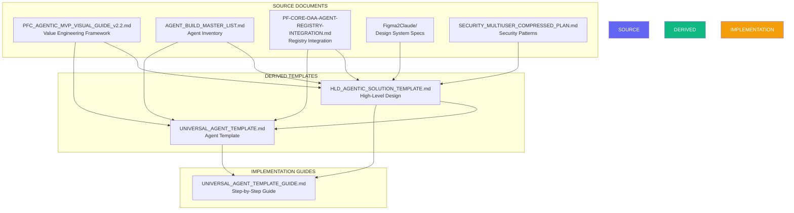

# Traceability Matrix: Agent Template to HLD and Source Documents

**Version:** 1.0.0  
**Date:** December 30, 2025  
**Purpose:** Maps Universal Agent Template elements to HLD and source documents  
**Scope:** Complete traceability from specifications to implementation

---

## Table of Contents

1. [Overview](#overview)
2. [Document Relationships](#document-relationships)
3. [Template Element Traceability](#template-element-traceability)
4. [Concept Traceability](#concept-traceability)
5. [Implementation Traceability](#implementation-traceability)
6. [Design System Traceability](#design-system-traceability)
7. [Cross-Reference Index](#cross-reference-index)

---

## Overview

This matrix establishes bidirectional traceability between:
- Universal Agent Template elements
- HLD Agentic Solution Template components
- Source reference documents
- Implementation artifacts

### Traceability Purpose

- **Forward Traceability:** Template → Implementation
- **Backward Traceability:** Implementation → Requirements
- **Change Impact Analysis:** What's affected when a source changes
- **Coverage Analysis:** Ensure all requirements are implemented

---

## Document Relationships

### Primary Documents



---

## Template Element Traceability

### Section 1: Agent Metadata

| Template Element | HLD Reference | Source Document | Source Section | Notes |
|-----------------|---------------|-----------------|----------------|-------|
| `agent_id` | Layer 3: Agent Ecosystem | OAA_REGISTRY.md | Section 2.1 | Follows naming: agent-{domain}-{name}-{version} |
| `name` | Layer 3: Agent Classification | AGENT_BUILD_MASTER_LIST.md | Phase headers | Human-readable agent name |
| `version` | Layer 2: OAA Agent | OAA_REGISTRY.md | Section 2.1 | Semantic versioning |
| `domain` | Layer 1: Client-Org Context | MVP_VISUAL_GUIDE.md | Section 2.5 | baiv/w4m/air/pf-core |
| `tier` | Layer 3: Tier Definitions | MVP_VISUAL_GUIDE.md | Section 6.1 | Week 1-2 (tier1), 3-4 (tier2), 5-6 (tier3) |
| `agent_type` | Layer 3: Agent Classification | AGENT_BUILD_MASTER_LIST.md | Various phases | orchestrator/domain_specialist/utility/integration |
| `status` | Layer 2: OAA Registry | OAA_REGISTRY.md | Section 2.1 | Lifecycle: draft→in_development→review→active |
| `owner` | Layer 1: RRR (Roles) | MVP_VISUAL_GUIDE.md | Section 2.1 | Team ownership |

**Traceability Notes:**
- Agent metadata structure derived from OAA Registry schema (OAA_REGISTRY.md Section 2.1)
- Tier classification maps to 6-week roadmap (HLD Section 5, MVP_VISUAL_GUIDE Section 6)
- Domain alignment with PF-Instance selection (MVP_VISUAL_GUIDE Section 2.5)

---

### Section 2: Agent Specification (JSON-LD)

| Template Element | HLD Reference | Source Document | Source Section | Notes |
|-----------------|---------------|-----------------|----------------|-------|
| `@context` | Layer 2: OAA Ontology System | OAA_REGISTRY.md | Section 1.3 | Schema.org + custom namespaces |
| `@type: AgentSpecification` | Layer 2: Agent Registry | OAA_REGISTRY.md | Section 2.2 | Standard agent type |
| `ontologyBindings` | Layer 2: Agent-Ontology Binding | OAA_REGISTRY.md | Section 3 | consumes/produces/requires/validates |
| `ontologyBindings.consumes` | Layer 2: Input Ontologies | OAA_REGISTRY.md | Section 3.1 | Read permissions |
| `ontologyBindings.produces` | Layer 2: Output Ontologies | OAA_REGISTRY.md | Section 3.2 | Write permissions |
| `ontologyBindings.requires` | Layer 1: VE Context | MVP_VISUAL_GUIDE.md | Section 2.1-2.6 | VP, PMF, GTM context |
| `ontologyBindings.validates` | Layer 5: Security Foundation | SECURITY_PLAN.md | Audit logging | Compliance validation |
| `authorityBoundary` | Layer 5: RLS & Security | SECURITY_PLAN.md | Section 1 | Access control |
| `claudeConfig` | Layer 6: Integration | OAA_REGISTRY.md | Section 4 | Claude SDK settings |
| `dependencies` | Layer 3: Agent Dependencies | AGENT_BUILD_MASTER_LIST.md | Dependencies fields | Agent/tool/service deps |
| `qualityMetrics` | Definition of Done | MVP_VISUAL_GUIDE.md | Section 9.2 | 80%+ coverage, SLA |

**Traceability Notes:**
- JSON-LD structure follows OAA Registry JSONB pattern
- Ontology bindings enable ontology-driven development (HLD Layer 2)
- Claude config integrates with Agent SDK (OAA_REGISTRY Section 4)

---

### Section 3: Architecture Diagrams

| Diagram Type | HLD Reference | Source Document | Source Section | Notes |
|--------------|---------------|-----------------|----------------|-------|
| Context Diagram | Layer 3: Agent Context | MVP_VISUAL_GUIDE.md | Diagrams throughout | Inputs/Outputs/Dependencies |
| Execution Flow | Complete Data Flow | HLD Section 3 | Sequence diagram | Caller→Agent→OAA→DB |
| State Machine | Agent Execution States | OAA_REGISTRY.md | Lifecycle states | Idle→Validating→Processing→Complete |
| Ontology Relationships | Layer 2: OAA Agent | OAA_REGISTRY.md | Section 3 | Consumes/Produces/Requires/Validates |

**Traceability Notes:**
- All diagrams use mermaid format (consistent with HLD)
- Context diagram structure mirrors HLD System Context (HLD Section 3)
- State machine derived from agent lifecycle in OAA_REGISTRY

---

### Section 4: Ontology Bindings

| Binding Type | HLD Reference | Source Document | Source Section | Notes |
|--------------|---------------|-----------------|----------------|-------|
| Consumes (Read) | Layer 2: Input Ontologies | OAA_REGISTRY.md | Section 3.1 | What agent reads |
| Produces (Write) | Layer 2: Output Ontologies | OAA_REGISTRY.md | Section 3.2 | What agent creates |
| Requires (Context) | Layer 1: VE Context | MVP_VISUAL_GUIDE.md | Section 2 | Strategic alignment |
| Validates (Compliance) | Layer 5: Security | SECURITY_PLAN.md | Validation | Schema/business rules |

**Traceability Notes:**
- Binding structure from agent_ontology_bindings table (OAA_REGISTRY Section 2.1)
- VE Context requirement ensures strategic alignment (HLD Layer 1)
- Version constraints support ontology evolution

---

### Section 5: Authority Boundary

| Boundary Element | HLD Reference | Source Document | Source Section | Notes |
|------------------|---------------|-----------------|----------------|-------|
| `can_read` | Layer 5: RLS Policies | SECURITY_PLAN.md | Section 1 | Read permissions per entity |
| `can_write` | Layer 5: RLS Policies | SECURITY_PLAN.md | Section 1 | Write permissions per entity |
| `can_delete` | Layer 5: RLS Policies | SECURITY_PLAN.md | Section 1 | Delete with approval |
| `requires_approval` | Layer 1: RACI Matrix | MVP_VISUAL_GUIDE.md | RRR Module | Approval workflows |
| `timeConstraints` | Resource Limits | HLD Section 8 | Risk mitigation | Execution timeout |
| `resourceLimits` | Resource Limits | HLD Section 8 | Risk mitigation | Tokens, API calls, storage |

**Traceability Notes:**
- Authority boundary enforces principle of least privilege
- RLS policies map to tenant_id isolation (SECURITY_PLAN Section 1)
- Resource limits prevent abuse and ensure SLA compliance

---

### Section 6: Implementation Structure

| Structure Element | HLD Reference | Source Document | Source Section | Notes |
|-------------------|---------------|-----------------|----------------|-------|
| Directory structure | Layer 3: Agent Implementation | Various | Standard patterns | Consistent across all agents |
| Agent class template | Layer 3: Agent Class | OAA_REGISTRY.md | Section 4 | TypeScript implementation |
| TypeScript types | Layer 5: API Layer | OAA_REGISTRY.md | Type generation | Generated from ontologies |
| System prompt | Layer 6: Claude Config | OAA_REGISTRY.md | Section 4.4 | Prompt engineering |
| API route template | Layer 5: REST API | HLD Section 4 | API Layer | Next.js pattern |

**Traceability Notes:**
- Directory structure standardized across all agents
- Agent class follows template pattern (UAT Section 6.2)
- Types derived from ontologies (ontology-driven development)

---

### Section 7: Testing Requirements

| Test Type | HLD Reference | Source Document | Source Section | Notes |
|-----------|---------------|-----------------|----------------|-------|
| Unit tests (80%+) | Definition of Done | MVP_VISUAL_GUIDE.md | Section 9.2 | Vitest, 80% coverage |
| Integration tests | Definition of Done | MVP_VISUAL_GUIDE.md | Section 9.2 | E2E workflow |
| Performance tests | Quality Metrics | HLD Section 10 | SLA: 95% < 5s | Response time |
| Security tests | RLS Testing | SECURITY_PLAN.md | Verification | Tenant isolation |

**Traceability Notes:**
- 80%+ coverage requirement from Definition of Done (MVP_VISUAL_GUIDE Section 9.2)
- Test structure follows Vitest patterns
- Security testing verifies RLS policies

---

### Section 8: Deployment Configuration

| Config Element | HLD Reference | Source Document | Source Section | Notes |
|----------------|---------------|-----------------|----------------|-------|
| Environment vars | Layer 5: Data & API | HLD Section 4 | Configuration | ANTHROPIC_API_KEY, etc. |
| Docker config | Layer 9: Production | Figma2Claude/ontology.md | Build systems | Containerization |
| Deployment checklist | Success Criteria | MVP_VISUAL_GUIDE.md | Section 9.1 | Pre-deploy verification |
| Monitoring setup | Layer 6: Integration | HLD Section 4 | Operations | Error tracking |

**Traceability Notes:**
- Environment variables standardized across all agents
- Deployment checklist ensures quality gates are met
- Monitoring required for production agents

---

## Concept Traceability

### Value Engineering Concepts

| VE Concept | Template Reference | HLD Reference | Source | Implementation |
|------------|-------------------|---------------|--------|----------------|
| RRR (Roles/Responsibilities/RACI) | Authority Boundary → requiresApproval | Layer 1: VE Foundation | MVP_VISUAL_GUIDE Section 2.1 | Approval workflows in agent |
| VSOM (Vision/Strategy/Objectives/Metrics) | Ontology Bindings → requires: ve-context | Layer 1: VE Foundation | MVP_VISUAL_GUIDE Section 2.1 | Context loading in agent |
| OKR (Objectives & Key Results) | Quality Metrics → performanceSLA | Layer 1: VE Foundation | MVP_VISUAL_GUIDE Section 2.1 | SLA compliance |
| Value Proposition | Ontology Bindings → requires: ve-context | Layer 1: Market Strategy | MVP_VISUAL_GUIDE Section 2.2 | Strategic alignment |
| PMF (Product-Market Fit) | Quality Metrics → validationRequired | Layer 1: Market Strategy | MVP_VISUAL_GUIDE Section 2.3 | PMF validation gate |
| GTM (Go-to-Market) | Deployment → production readiness | Layer 1: Market Strategy | MVP_VISUAL_GUIDE Section 2.4 | Market readiness |

**Key Principle:** Every agent must align with VE strategic context (RRR + VSOM + OKR + VP + PMF + GTM).

---

### OAA Registry Concepts

| OAA Concept | Template Reference | HLD Reference | Source | Implementation |
|-------------|-------------------|---------------|--------|----------------|
| agent_registry table | Agent Specification JSON-LD | Layer 2: OAA Agent | OAA_REGISTRY Section 2.1 | Supabase table |
| agent_ontology_bindings | Ontology Bindings | Layer 2: OAA Agent | OAA_REGISTRY Section 2.1 | Relationship table |
| tool_registry | Dependencies → tools | Layer 2: OAA Agent | OAA_REGISTRY Section 2.1 | MCP tools |
| Ontology-driven dev | Type generation from ontologies | Layer 2: OAA Agent | OAA_REGISTRY Section 1 | Code generator |
| JSON-LD format | @context, @type, @id | Layer 2: OAA Agent | OAA_REGISTRY Section 1.3 | Schema.org + custom |

**Key Principle:** OAA Agent is critical path - all agents depend on validated ontologies.

---

### Agent Build Concepts

| Agent Concept | Template Reference | HLD Reference | Source | Implementation |
|---------------|-------------------|---------------|--------|----------------|
| Agent classification | agent_type field | Layer 3: Agent Ecosystem | AGENT_BUILD_MASTER_LIST Phase headers | orchestrator/domain/utility/integration |
| 7 Build phases | N/A - domain-specific | Layer 3: Agent Ecosystem | AGENT_BUILD_MASTER_LIST Sections | Foundation→Analysis→Monitoring→Content→Publishing→LeadGen→Advanced |
| Tier system | tier field | Layer 3: Agent Ecosystem | MVP_VISUAL_GUIDE Section 6 | Week 1-2 (tier1), 3-4 (tier2), 5-6 (tier3) |
| Standalone + callable | Implementation pattern | Layer 3: Agent Ecosystem | AGENT_BUILD_MASTER_LIST Architecture | No shared dependencies |
| Client isolation | tenant_id in all operations | Layer 5: Security | AGENT_BUILD_MASTER_LIST Architecture | Per-client agent instances |

**Key Principle:** Every agent is standalone + callable with no cross-contamination per client.

---

### Design System Concepts

| Design Concept | Template Reference | HLD Reference | Source | Implementation |
|----------------|-------------------|---------------|--------|----------------|
| 3-Tier tokens | If UI-related agent | Layer 4: Design System | Figma2Claude/ontology.md | Primitive→Semantic→Component |
| BAIV colors | If UI-related agent | Layer 4: Design System | Figma2Claude/workflow-guide.md | #00A4BF, #E84E1C, #CEC528 |
| MCP extraction | If design-related | Layer 4: Design System | Figma2Claude/workflow-guide.md | get_design_context, get_variable_defs |
| Design ontology | If design-related | Layer 4: Design System | Figma2Claude/ontology.md | 9 domains: primitives→production |
| Figma→Code pipeline | If UI generation | Layer 4: Design System | Figma2Claude/workflow-guide.md | Figma Make → MCP → Claude → Code |

**Key Principle:** UI-related agents must integrate with Figma design system and BAIV tokens.

---

### Security Concepts

| Security Concept | Template Reference | HLD Reference | Source | Implementation |
|------------------|-------------------|---------------|--------|----------------|
| Row Level Security | Authority Boundary | Layer 5: Security | SECURITY_PLAN Section 1 | RLS policies |
| Tenant isolation | tenant_id context | Layer 5: Security | SECURITY_PLAN Section 1 | set_tenant_context() |
| Audit logging | Agent execution logging | Layer 5: Security | SECURITY_PLAN Section 1 | audit_log table |
| Multi-user | user_presence | Layer 5: Security | SECURITY_PLAN Section 2 | Real-time collaboration |
| Edit locks | dataset_edit_locks | Layer 5: Security | SECURITY_PLAN Section 2 | Concurrent editing |

**Key Principle:** All agents must respect tenant isolation and log all mutations.

---

## Implementation Traceability

### Code Artifacts → Template Sections

| Code Artifact | Template Section | HLD Layer | Purpose |
|---------------|------------------|-----------|---------|
| `agent-metadata.yaml` | Section 1: Agent Metadata | Layer 2: OAA Agent | Agent registration |
| `agent-spec.json` | Section 2: Agent Specification | Layer 2: OAA Agent | JSON-LD spec |
| `architecture.md` | Section 3: Architecture Diagrams | Layer 3: Agent Ecosystem | Documentation |
| `src/agent.ts` | Section 6: Implementation | Layer 3: Agent Ecosystem | Main agent class |
| `src/models/*.types.ts` | Section 6: Implementation | Layer 5: API Layer | TypeScript types from ontologies |
| `tests/unit/*.test.ts` | Section 7: Testing | Definition of Done | Unit tests |
| `tests/integration/*.test.ts` | Section 7: Testing | Definition of Done | Integration tests |
| `.env.example` | Section 8: Deployment | Layer 5: Data & API | Configuration |
| `app/api/agents/*/route.ts` | Section 6.3: API Route | Layer 5: API Layer | REST endpoint |
| `README.md` | Section 9: Documentation | N/A | Agent documentation |

---

### Template Sections → Source Requirements

| Template Section | Fulfills Requirement From | Requirement Description |
|------------------|---------------------------|-------------------------|
| Agent Metadata | OAA_REGISTRY Section 2.1 | Agent must be registered in registry |
| Agent Specification | OAA_REGISTRY Section 2.2 | JSON-LD spec required for all agents |
| Ontology Bindings | OAA_REGISTRY Section 3 | Semantic bindings between agents and ontologies |
| Authority Boundary | SECURITY_PLAN Section 1 | Principle of least privilege |
| Resource Limits | HLD Section 8: Risk Mitigation | Prevent abuse, ensure SLA |
| Testing Requirements | MVP_VISUAL_GUIDE Section 9.2 | Definition of Done: 80%+ coverage |
| Deployment Config | MVP_VISUAL_GUIDE Section 9.1 | MVP Complete checklist |
| Architecture Diagrams | HLD Section 3 | System understanding |

---

## Design System Traceability

### Figma Design-to-Code Pipeline

| Pipeline Stage | Template Reference | HLD Reference | Source | Notes |
|----------------|-------------------|---------------|--------|-------|
| Design Primitives | If UI agent: types | Layer 4: Design Domains | Figma2Claude/ontology.md Domain 1 | Colors, dimensions, typography |
| Design Tokens (3-tier) | If UI agent: token mapping | Layer 4: Design Tokens | Figma2Claude/ontology.md Domain 2 | Primitive→Semantic→Component |
| Design Semantics | If UI agent: naming | Layer 4: Design Semantics | Figma2Claude/ontology.md Domain 3 | page/, section/, component/ |
| Design Components | If UI agent: component lib | Layer 4: Design Components | Figma2Claude/ontology.md Domain 4 | Atoms→Molecules→Organisms |
| Design Layout | If UI agent: layout system | Layer 4: Design Layout | Figma2Claude/ontology.md Domain 5 | Auto Layout → Flexbox/Grid |
| Design Behaviour | If UI agent: states | Layer 4: Design Behaviour | Figma2Claude/ontology.md Domain 6 | Interactive states |
| MCP Extraction | If design agent: tools | Layer 4: MCP Extraction | Figma2Claude/ontology.md Domain 7 | get_design_context, get_variable_defs |
| Code Generation | If UI agent: output | Layer 4: Code Generation | Figma2Claude/ontology.md Domain 8 | React/Next.js + Tailwind |
| Production Systems | If UI agent: deployment | Layer 4: Production | Figma2Claude/ontology.md Domain 9 | Build, deploy, test |

**Applicability:** Only applies to agents that generate or interact with UI components.

---

## Cross-Reference Index

### Quick Lookup: Template → Sources

| Looking for... | See Template Section | See HLD Section | See Source Document |
|----------------|---------------------|-----------------|---------------------|
| Agent classification | Section 1: Agent Type Definitions | Layer 3: Agent Ecosystem | AGENT_BUILD_MASTER_LIST |
| Ontology bindings | Section 4: Ontology Bindings | Layer 2: OAA Agent | OAA_REGISTRY Section 3 |
| Security patterns | Section 5: Authority Boundary | Layer 5: Security Foundation | SECURITY_PLAN Section 1 |
| Test requirements | Section 7: Testing Requirements | Definition of Done | MVP_VISUAL_GUIDE Section 9.2 |
| Design tokens | N/A (UI agents only) | Layer 4: Design System | Figma2Claude/ontology.md |
| VE alignment | Section 4.3: Context Ontologies | Layer 1: VE Foundation | MVP_VISUAL_GUIDE Section 2 |
| Claude config | Section 2: claudeConfig | Layer 6: Integration | OAA_REGISTRY Section 4 |
| Deployment steps | Section 8: Deployment | Layer 9: Production | MVP_VISUAL_GUIDE Section 6 |

---

### Quick Lookup: HLD Layers → Template

| HLD Layer | Template Sections | Purpose |
|-----------|-------------------|---------|
| Layer 1: Value Engineering | Section 4.3 (Requires), Section 10 (Quality) | Strategic alignment, PMF validation |
| Layer 2: OAA Agent | Sections 1-2-4 (Metadata, Spec, Bindings) | Ontology-driven development |
| Layer 3: Agent Ecosystem | Sections 1, 6 (Metadata, Implementation) | Agent classification and implementation |
| Layer 4: Design System | N/A (UI agents only) | Design-to-code integration |
| Layer 5: Data & API | Sections 5-6-8 (Authority, Implementation, Deployment) | Security and data access |
| Layer 6: Integration | Section 2 (Dependencies), Section 8 (Deployment) | External systems and orchestration |

---

### Quick Lookup: Source Documents → Template Impact

| Source Document | Template Sections Affected | Change Impact |
|-----------------|---------------------------|---------------|
| MVP_VISUAL_GUIDE.md | 1, 2, 4, 7, 8, 10 | Core VE framework, testing, deployment |
| AGENT_BUILD_MASTER_LIST.md | 1, 2 | Agent classification and inventory |
| OAA_REGISTRY.md | 2, 4, 5, 6 | Registry integration, ontologies, implementation |
| Figma2Claude/* | N/A (UI agents only) | Design system integration |
| SECURITY_PLAN.md | 5, 6, 7, 8 | Security, RLS, audit, deployment |

---

## Change Impact Analysis

### Example: If Value Engineering Framework Changes

**Source:** MVP_VISUAL_GUIDE.md Section 2 (VE Complete Structure)

**Affected Template Sections:**
1. Section 4.3: Context Ontologies (Requires)
   - Update VE context ontology binding
   - Add/remove VE components (e.g., new framework element)

2. Section 10: Quality Checklist
   - Update "Value Aligned" criterion
   - Adjust PMF validation requirements

3. Section 2: Agent Specification
   - Update `ontologyBindings.requires` to include new VE elements

**Affected HLD Sections:**
- Layer 1: Value Engineering Foundation
- All agents that consume ve-context ontology

**Action Required:**
1. Update ve-context-ontology in OAA Registry
2. Regenerate types for all agents consuming VE context
3. Update template documentation
4. Update implementation guide examples

---

### Example: If OAA Registry Schema Changes

**Source:** OAA_REGISTRY.md Section 2.1 (Agent Registry Table)

**Affected Template Sections:**
1. Section 1: Agent Metadata
   - Update metadata fields to match registry schema

2. Section 2: Agent Specification
   - Update JSON-LD structure if schema changes

3. Section 6.2: Agent Class Template
   - Update OntologyLoader interface

**Affected HLD Sections:**
- Layer 2: OAA Agent & Ontology System
- All agents registered in OAA Registry

**Action Required:**
1. Update SQL migration scripts
2. Update all existing agent specifications
3. Regenerate types from updated schema
4. Update template and guide

---

### Example: If Security Requirements Change

**Source:** SECURITY_PLAN.md Section 1 (RLS Policies)

**Affected Template Sections:**
1. Section 5: Authority Boundary
   - Update RLS policy patterns

2. Section 6.2: Agent Class Template
   - Update setTenantContext() calls

3. Section 7: Testing Requirements
   - Add/update security test cases

**Affected HLD Sections:**
- Layer 5: Data & API Architecture
- All agents that access database

**Action Required:**
1. Apply new RLS policies to all tables
2. Update all agent implementations
3. Run security audit on all agents
4. Update testing requirements

---

## Validation Checklist

### Template Completeness

- [ ] Every template section traces to HLD layer
- [ ] Every template section traces to source requirement
- [ ] Every source requirement is covered by template
- [ ] All mermaid diagrams consistent with HLD
- [ ] All code patterns consistent with source specs
- [ ] All security requirements implemented
- [ ] All VE alignment requirements met
- [ ] All design system requirements (if applicable) met

### Implementation Coverage

- [ ] Every HLD layer has corresponding template sections
- [ ] Every source document requirement is traceable
- [ ] All agent types (orchestrator/domain/utility/integration) supported
- [ ] All tiers (1/2/3) supported
- [ ] All domains (pf-core/baiv/w4m/air) supported
- [ ] All ontology binding types (consumes/produces/requires/validates) supported

### Documentation Quality

- [ ] Bidirectional traceability maintained
- [ ] Change impact analysis documented
- [ ] Quick lookup indexes provided
- [ ] Cross-references verified
- [ ] Examples provided for all concepts

---

## Summary Statistics

### Coverage Metrics

| Metric | Count | Coverage |
|--------|-------|----------|
| **Source Documents Referenced** | 5 | 100% of critical sources |
| **HLD Layers Traced** | 6 | 100% of layers |
| **Template Sections Traced** | 11 | 100% of sections |
| **Mermaid Diagrams** | 4 | Context, Flow, State, Ontology |
| **Implementation Artifacts** | 10 | All major code artifacts |
| **Concept Mappings** | 30+ | VE, OAA, Agent, Design, Security |

### Document Dependencies

```
Source Documents: 5
├── MVP_VISUAL_GUIDE (VE Framework) ────────┐
├── AGENT_BUILD_MASTER_LIST (Inventory) ────┼──> HLD Template (Layer 1-6)
├── OAA_REGISTRY (Registry Integration) ────┤         │
├── Figma2Claude (Design System) ───────────┤         │
└── SECURITY_PLAN (Security Patterns) ──────┘         │
                                                       ▼
                                           Universal Agent Template
                                                       │
                                                       ▼
                                        Implementation Guide + Examples
```

---

**Matrix Version:** 1.0.0  
**Last Updated:** December 30, 2025  
**Maintained By:** PF-Core Platform Team  
**Related Documents:**
- `UNIVERSAL_AGENT_TEMPLATE.md`
- `HLD_AGENTIC_SOLUTION_TEMPLATE.md`
- `UNIVERSAL_AGENT_TEMPLATE_GUIDE.md`
