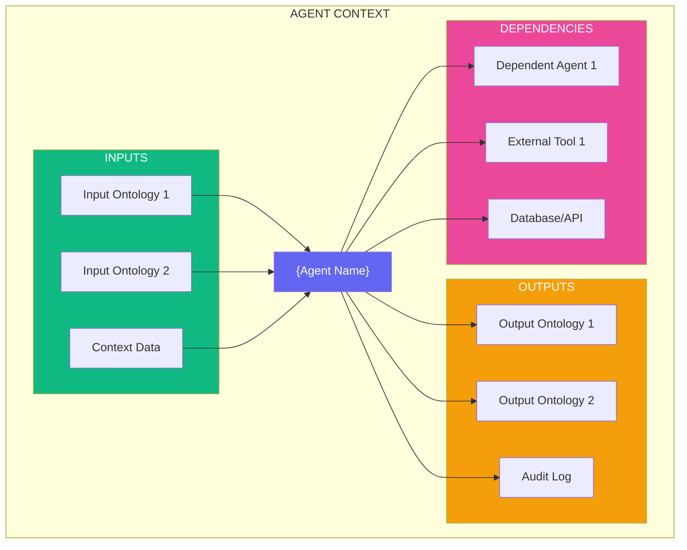
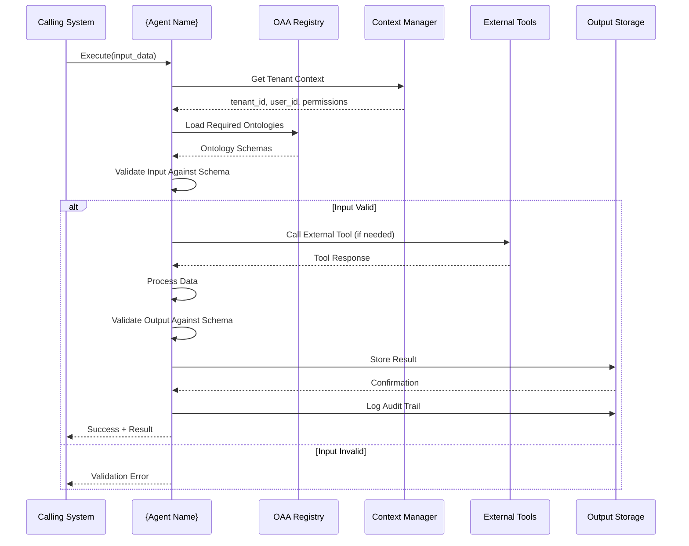
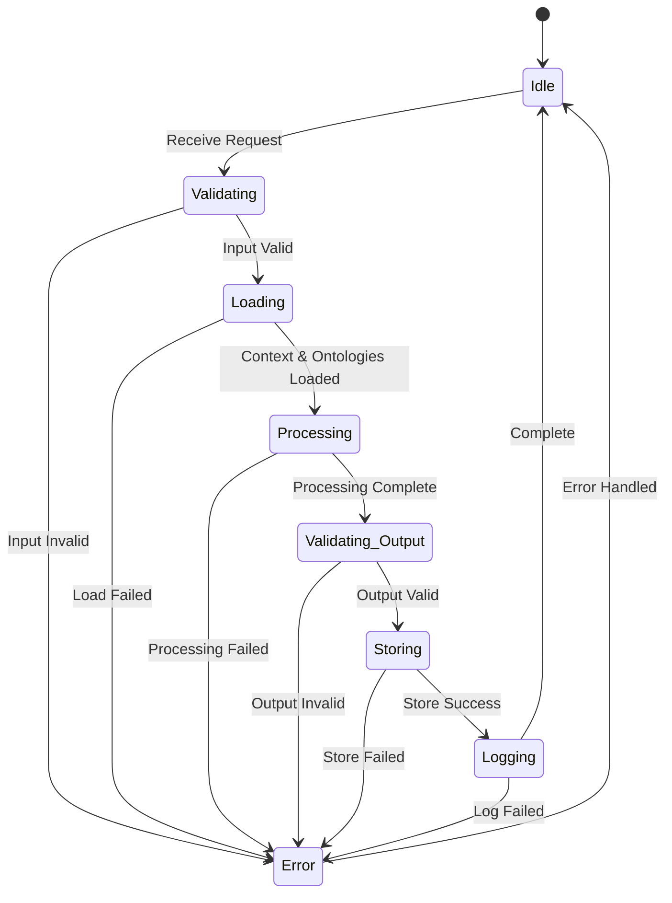
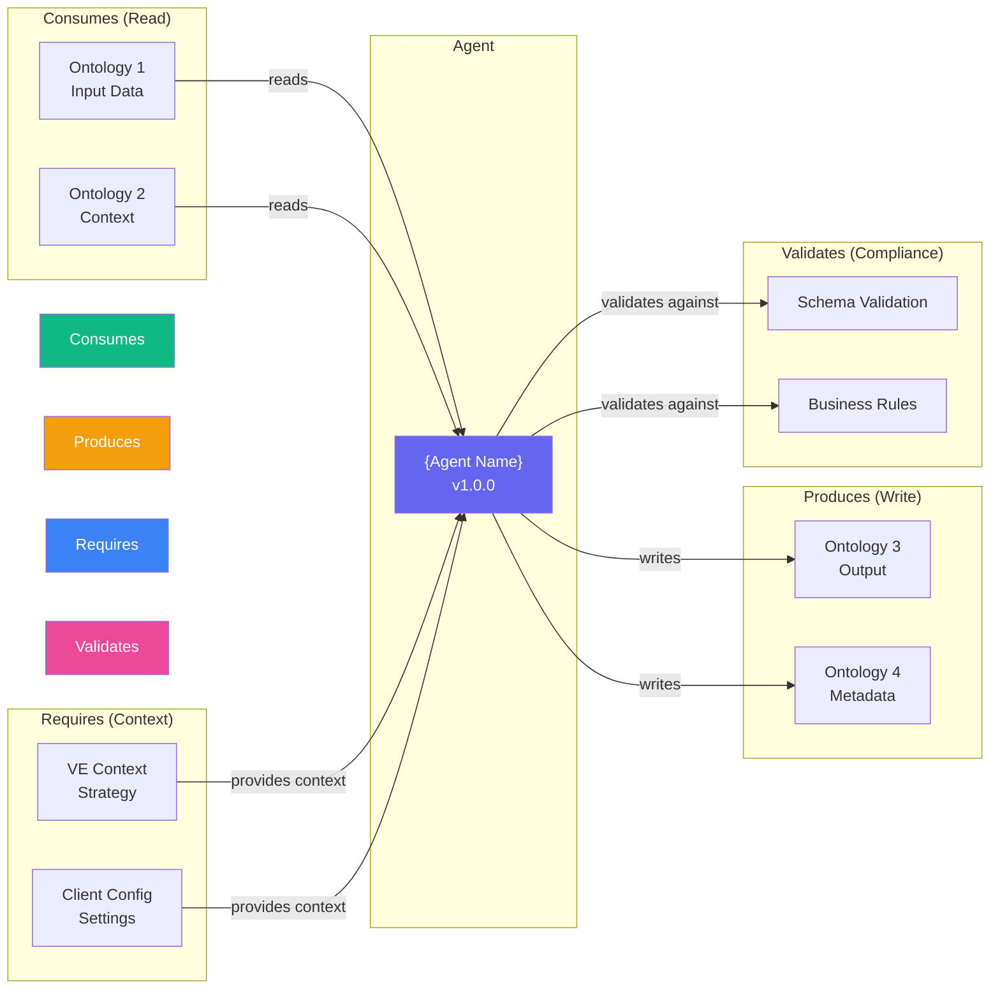

# Universal Agent Template

**Version:** 1.0.0  
**Date:** December 30, 2025  
**Purpose:** Standard template for all agent implementations across PF-Core platform  
**Applies To:** All agent types (Core, Planning, Execution, Domain-Specific)

---

## Template Structure

Every agent implementation must include the following sections in order:

1. Agent Metadata
2. Agent Specification (JSON-LD)
3. Architecture Diagrams
4. Ontology Bindings
5. Authority Boundary
6. Implementation Structure
7. Testing Requirements
8. Deployment Configuration

---

## 1. Agent Metadata

```yaml
# agent-metadata.yaml
agent_id: "agent-{domain}-{name}-{version}"
name: "{Agent Name}"
version: "1.0.0"
domain: "baiv|w4m|air|pf-core"
tier: "tier1|tier2|tier3"
agent_type: "orchestrator|domain_specialist|utility|integration"
status: "draft|in_development|review|active|deprecated|retired"
owner: "{team_name}"
created_date: "YYYY-MM-DD"
last_updated: "YYYY-MM-DD"
```

### Agent Type Definitions

| Type | Purpose | Examples |
|------|---------|----------|
| **orchestrator** | Coordinates multiple agents, manages workflows | PM Agent, VE Agent, Workflow Orchestrator |
| **domain_specialist** | Deep expertise in specific domain | Discovery Agent, Citation Tester, Gap Analyzer |
| **utility** | Provides reusable services | Schema Generator, Meta Generator, Image Generator |
| **integration** | Connects to external systems | WordPress Publisher, Airtable Sync, GitHub Integration |

### Tier Definitions

| Tier | Build Priority | Characteristics |
|------|---------------|-----------------|
| **Tier 1** | Week 1-2 | Core infrastructure agents, blocking dependencies |
| **Tier 2** | Week 3-4 | Planning and coordination agents |
| **Tier 3** | Week 5-6 | Execution and domain-specific agents |

---

## 2. Agent Specification (JSON-LD)

Every agent must have a JSON-LD specification registered in the OAA Registry.

```json
{
  "@context": {
    "@vocab": "https://schema.org/",
    "pf": "https://pf-core/ontology/",
    "baiv": "https://baiv.co.uk/ontology/"
  },
  "@type": "pf:AgentSpecification",
  "@id": "pf:agent:{domain}-{name}-{version}",
  
  "name": "{Agent Name}",
  "description": "{Brief description of agent purpose and capabilities}",
  "version": "1.0.0",
  "domain": "{baiv|w4m|air|pf-core}",
  "agent_type": "{orchestrator|domain_specialist|utility|integration}",
  "tier": "{tier1|tier2|tier3}",
  
  "ontologyBindings": {
    "consumes": [
      {
        "ontologyId": "{ontology-id}",
        "nodeTypes": ["EntityType1", "EntityType2"],
        "purpose": "Read {entity} data for processing",
        "versionConstraint": ">=1.0.0"
      }
    ],
    "produces": [
      {
        "ontologyId": "{ontology-id}",
        "nodeTypes": ["OutputType1", "OutputType2"],
        "purpose": "Generate {output} entities",
        "versionConstraint": "~1.1.0"
      }
    ],
    "requires": [
      {
        "ontologyId": "{context-ontology-id}",
        "nodeTypes": ["ContextType"],
        "purpose": "VE strategic context",
        "versionConstraint": ">=1.0.0"
      }
    ],
    "validates": [
      {
        "ontologyId": "{validation-ontology-id}",
        "nodeTypes": ["ValidationType"],
        "purpose": "Ensure compliance with standards",
        "versionConstraint": ">=1.0.0"
      }
    ]
  },
  
  "authorityBoundary": {
    "canRead": ["entity_type_1", "entity_type_2"],
    "canWrite": ["entity_type_3", "entity_type_4"],
    "canDelete": [],
    "requiresApproval": ["critical_action_1"],
    "timeConstraints": {
      "maxExecutionTime": "5m",
      "cooldownPeriod": "0s"
    },
    "resourceLimits": {
      "maxTokens": 100000,
      "maxAPICalls": 100,
      "maxStorageMB": 50
    }
  },
  
  "claudeConfig": {
    "model": "claude-opus-4-20250514",
    "systemPrompt": "{path/to/system-prompt.md}",
    "tools": [
      "tool-id-1",
      "tool-id-2"
    ],
    "maxTokens": 4096,
    "temperature": 0.7,
    "promptCaching": true
  },
  
  "dependencies": {
    "agents": ["agent-id-1", "agent-id-2"],
    "tools": ["tool-id-1", "tool-id-2"],
    "services": ["supabase", "airtable"]
  },
  
  "qualityMetrics": {
    "testCoverage": 80,
    "performanceSLA": "95% < 5s",
    "errorRate": "< 1%",
    "validationRequired": true
  }
}
```

---

## 3. Architecture Diagrams

### 3.1 Agent Context Diagram



### 3.2 Agent Execution Flow



### 3.3 Agent State Machine



### 3.4 Agent-Ontology Relationship



---

## 4. Ontology Bindings

### 4.1 Input Ontologies (Consumes)

| Ontology ID | Node Types | Purpose | Required | Version |
|------------|------------|---------|----------|---------|
| `ontology-input-1` | EntityType1, EntityType2 | Primary data source | Yes | >=1.0.0 |
| `ontology-input-2` | ContextType | Additional context | No | >=1.0.0 |

### 4.2 Output Ontologies (Produces)

| Ontology ID | Node Types | Purpose | Validation | Version |
|------------|------------|---------|------------|---------|
| `ontology-output-1` | ResultType1 | Primary output | Required | ~1.1.0 |
| `ontology-output-2` | MetadataType | Execution metadata | Optional | >=1.0.0 |

### 4.3 Context Ontologies (Requires)

| Ontology ID | Node Types | Purpose | When Used | Version |
|------------|------------|---------|-----------|---------|
| `ve-context` | ValueProposition, PMF, GTM | Strategic alignment | Always | >=1.0.0 |
| `client-config` | TenantConfig | Client-specific settings | Always | >=1.0.0 |

### 4.4 Validation Ontologies

| Ontology ID | Node Types | Purpose | Severity | Version |
|------------|------------|---------|----------|---------|
| `schema-validation` | Schema | Structural validation | Error | >=1.0.0 |
| `business-rules` | Rule | Business logic validation | Warning | >=1.0.0 |

---

## 5. Authority Boundary

### 5.1 Access Control

```yaml
authority_boundary:
  # Read permissions
  can_read:
    - entity_type: "discovery_audit"
      scope: "tenant"
      conditions: ["tenant_id = current_tenant"]
    - entity_type: "client_context"
      scope: "tenant"
      conditions: ["tenant_id = current_tenant"]
  
  # Write permissions
  can_write:
    - entity_type: "gap_analysis"
      scope: "tenant"
      conditions: ["tenant_id = current_tenant", "stage = 'analysis'"]
      requires_approval: false
    - entity_type: "content_brief"
      scope: "tenant"
      conditions: ["tenant_id = current_tenant"]
      requires_approval: false
  
  # Delete permissions (usually restricted)
  can_delete:
    - entity_type: "draft_content"
      scope: "tenant"
      conditions: ["tenant_id = current_tenant", "status = 'draft'"]
      requires_approval: true
  
  # Critical actions requiring approval
  requires_approval:
    - action: "advance_cycle_stage"
      approver_role: "owner|admin"
    - action: "publish_content"
      approver_role: "editor|admin"
```

### 5.2 Resource Limits

```yaml
resource_limits:
  execution:
    max_execution_time: "5m"
    timeout_action: "graceful_shutdown"
    retry_attempts: 3
    retry_backoff: "exponential"
  
  api_calls:
    max_per_execution: 100
    max_per_minute: 200
    rate_limit_action: "queue"
  
  tokens:
    max_input_tokens: 50000
    max_output_tokens: 50000
    max_total_tokens: 100000
  
  storage:
    max_storage_mb: 50
    max_file_size_mb: 10
    allowed_mime_types: ["application/json", "text/markdown"]
  
  cooldown:
    between_executions: "0s"
    after_error: "30s"
    after_rate_limit: "60s"
```

---

## 6. Implementation Structure

### 6.1 Directory Structure

```
agents/{domain}/{agent-name}/
├── agent-spec.json              # JSON-LD specification
├── agent-metadata.yaml          # Metadata and configuration
├── README.md                    # Agent documentation
├── src/
│   ├── index.ts                 # Main entry point
│   ├── agent.ts                 # Agent class implementation
│   ├── handlers/                # Request handlers
│   │   ├── execute.handler.ts
│   │   └── validate.handler.ts
│   ├── services/                # Business logic
│   │   ├── processor.service.ts
│   │   └── validator.service.ts
│   ├── models/                  # TypeScript types
│   │   ├── input.types.ts
│   │   └── output.types.ts
│   └── utils/                   # Utility functions
│       ├── ontology.utils.ts
│       └── context.utils.ts
├── prompts/
│   ├── system-prompt.md         # Claude system prompt
│   └── templates/               # Prompt templates
│       ├── processing.template.md
│       └── validation.template.md
├── tests/
│   ├── unit/                    # Unit tests
│   │   ├── agent.test.ts
│   │   └── services.test.ts
│   ├── integration/             # Integration tests
│   │   └── e2e.test.ts
│   └── fixtures/                # Test data
│       ├── input-samples.json
│       └── expected-outputs.json
├── config/
│   ├── development.yaml
│   ├── staging.yaml
│   └── production.yaml
└── package.json
```

### 6.2 Agent Class Template

```typescript
// src/agent.ts
import { Anthropic } from '@anthropic-ai/sdk';
import { OntologyLoader } from '@/lib/ontology';
import { ContextManager } from '@/lib/context';
import { AuditLogger } from '@/lib/audit';

export interface AgentConfig {
  agentId: string;
  domain: string;
  tenantId: string;
  userId?: string;
}

export interface AgentInput<T = any> {
  data: T;
  context?: Record<string, any>;
  options?: Record<string, any>;
}

export interface AgentOutput<T = any> {
  success: boolean;
  data?: T;
  error?: string;
  metadata: {
    executionTime: number;
    tokensUsed: number;
    validationPassed: boolean;
  };
}

export class {AgentName}Agent {
  private readonly config: AgentConfig;
  private readonly anthropic: Anthropic;
  private readonly ontologyLoader: OntologyLoader;
  private readonly contextManager: ContextManager;
  private readonly auditLogger: AuditLogger;
  private readonly systemPrompt: string;

  constructor(config: AgentConfig) {
    this.config = config;
    this.anthropic = new Anthropic({
      apiKey: process.env.ANTHROPIC_API_KEY,
    });
    this.ontologyLoader = new OntologyLoader();
    this.contextManager = new ContextManager();
    this.auditLogger = new AuditLogger();
    this.systemPrompt = this.loadSystemPrompt();
  }

  /**
   * Main execution method
   */
  async execute<TInput, TOutput>(
    input: AgentInput<TInput>
  ): Promise<AgentOutput<TOutput>> {
    const startTime = Date.now();

    try {
      // 1. Set tenant context
      await this.contextManager.setContext({
        tenantId: this.config.tenantId,
        userId: this.config.userId,
      });

      // 2. Load required ontologies
      const ontologies = await this.loadOntologies();

      // 3. Validate input
      const validationResult = await this.validateInput(input, ontologies);
      if (!validationResult.valid) {
        throw new Error(`Input validation failed: ${validationResult.error}`);
      }

      // 4. Load VE context if required
      const veContext = await this.loadVEContext();

      // 5. Process with Claude
      const result = await this.process(input, ontologies, veContext);

      // 6. Validate output
      const outputValidation = await this.validateOutput(result, ontologies);
      if (!outputValidation.valid) {
        throw new Error(`Output validation failed: ${outputValidation.error}`);
      }

      // 7. Store result
      await this.storeResult(result);

      // 8. Log audit trail
      await this.auditLogger.log({
        agentId: this.config.agentId,
        action: 'execute',
        tenantId: this.config.tenantId,
        userId: this.config.userId,
        input: input.data,
        output: result,
        executionTime: Date.now() - startTime,
      });

      return {
        success: true,
        data: result as TOutput,
        metadata: {
          executionTime: Date.now() - startTime,
          tokensUsed: 0, // TODO: Track from Claude response
          validationPassed: true,
        },
      };
    } catch (error) {
      // Log error
      await this.auditLogger.logError({
        agentId: this.config.agentId,
        tenantId: this.config.tenantId,
        error: error.message,
        executionTime: Date.now() - startTime,
      });

      return {
        success: false,
        error: error.message,
        metadata: {
          executionTime: Date.now() - startTime,
          tokensUsed: 0,
          validationPassed: false,
        },
      };
    }
  }

  /**
   * Load required ontologies from OAA Registry
   */
  private async loadOntologies() {
    const spec = await this.ontologyLoader.loadAgentSpec(this.config.agentId);
    
    const ontologies = {
      consumes: [],
      produces: [],
      requires: [],
      validates: [],
    };

    // Load all specified ontologies
    for (const binding of spec.ontologyBindings.consumes) {
      const ontology = await this.ontologyLoader.load(binding.ontologyId);
      ontologies.consumes.push(ontology);
    }

    // Load produces, requires, validates similarly...

    return ontologies;
  }

  /**
   * Validate input against consumed ontologies
   */
  private async validateInput(input: AgentInput, ontologies: any) {
    // TODO: Implement schema validation using ontologies
    return { valid: true };
  }

  /**
   * Validate output against produced ontologies
   */
  private async validateOutput(output: any, ontologies: any) {
    // TODO: Implement schema validation using ontologies
    return { valid: true };
  }

  /**
   * Load VE context (RRR, VSOM, OKR, VP, PMF, GTM)
   */
  private async loadVEContext() {
    return await this.contextManager.getVEContext(this.config.tenantId);
  }

  /**
   * Process input with Claude
   */
  private async process(input: AgentInput, ontologies: any, veContext: any) {
    const response = await this.anthropic.messages.create({
      model: 'claude-opus-4-20250514',
      max_tokens: 4096,
      system: [
        {
          type: 'text',
          text: this.systemPrompt,
          cache_control: { type: 'ephemeral' },
        },
        {
          type: 'text',
          text: JSON.stringify(veContext),
          cache_control: { type: 'ephemeral' },
        },
      ],
      messages: [
        {
          role: 'user',
          content: JSON.stringify(input.data),
        },
      ],
    });

    // Extract result from response
    const textContent = response.content.find((c) => c.type === 'text');
    return JSON.parse(textContent.text);
  }

  /**
   * Store result in database
   */
  private async storeResult(result: any) {
    // TODO: Store in Supabase using ontology-defined schema
  }

  /**
   * Load system prompt from file
   */
  private loadSystemPrompt(): string {
    // TODO: Load from prompts/system-prompt.md
    return '';
  }
}
```

### 6.3 API Route Template

```typescript
// api/agents/{agent-name}/route.ts
import { NextRequest, NextResponse } from 'next/server';
import { {AgentName}Agent } from '@/agents/{domain}/{agent-name}/src/agent';
import { setTenantContext } from '@/lib/context';

export async function POST(request: NextRequest) {
  try {
    // Extract tenant context from headers
    const tenantId = request.headers.get('x-tenant-id');
    const userId = request.headers.get('x-user-id');

    if (!tenantId) {
      return NextResponse.json(
        { error: 'Missing tenant context' },
        { status: 401 }
      );
    }

    // Set database context
    await setTenantContext(tenantId, userId);

    // Parse request body
    const body = await request.json();

    // Initialize agent
    const agent = new {AgentName}Agent({
      agentId: 'agent-{domain}-{name}-1.0',
      domain: '{domain}',
      tenantId,
      userId,
    });

    // Execute agent
    const result = await agent.execute(body);

    if (!result.success) {
      return NextResponse.json(
        { error: result.error, metadata: result.metadata },
        { status: 400 }
      );
    }

    return NextResponse.json({
      data: result.data,
      metadata: result.metadata,
    });
  } catch (error) {
    console.error('Agent execution error:', error);
    return NextResponse.json(
      { error: 'Internal server error' },
      { status: 500 }
    );
  }
}
```

---

## 7. Testing Requirements

### 7.1 Test Coverage Requirements

- **Unit Tests:** 80%+ coverage
- **Integration Tests:** All critical paths
- **E2E Tests:** Complete workflow validation

### 7.2 Unit Test Template

```typescript
// tests/unit/agent.test.ts
import { describe, it, expect, beforeEach, vi } from 'vitest';
import { {AgentName}Agent } from '../src/agent';

describe('{AgentName}Agent', () => {
  let agent: {AgentName}Agent;

  beforeEach(() => {
    agent = new {AgentName}Agent({
      agentId: 'agent-test-1.0',
      domain: 'test',
      tenantId: 'tenant-test',
      userId: 'user-test',
    });
  });

  describe('execute', () => {
    it('should successfully process valid input', async () => {
      const input = {
        data: { /* test data */ },
      };

      const result = await agent.execute(input);

      expect(result.success).toBe(true);
      expect(result.data).toBeDefined();
      expect(result.metadata.validationPassed).toBe(true);
    });

    it('should fail with invalid input', async () => {
      const input = {
        data: { /* invalid data */ },
      };

      const result = await agent.execute(input);

      expect(result.success).toBe(false);
      expect(result.error).toBeDefined();
    });

    it('should respect resource limits', async () => {
      // Test timeout, token limits, etc.
    });
  });

  describe('ontology validation', () => {
    it('should validate input against consumed ontologies', async () => {
      // Test schema validation
    });

    it('should validate output against produced ontologies', async () => {
      // Test output schema
    });
  });

  describe('authority boundary', () => {
    it('should respect read permissions', async () => {
      // Test access control
    });

    it('should respect write permissions', async () => {
      // Test write restrictions
    });

    it('should require approval for critical actions', async () => {
      // Test approval workflow
    });
  });
});
```

### 7.3 Integration Test Template

```typescript
// tests/integration/e2e.test.ts
import { describe, it, expect, beforeAll, afterAll } from 'vitest';
import { createSupabaseClient } from '@/lib/supabase';
import { {AgentName}Agent } from '../src/agent';

describe('{AgentName}Agent Integration', () => {
  let supabase;
  let testTenantId: string;

  beforeAll(async () => {
    supabase = createSupabaseClient();
    
    // Create test tenant
    const { data } = await supabase
      .from('tenants')
      .insert({ name: 'Test Tenant' })
      .select()
      .single();
    
    testTenantId = data.id;
  });

  afterAll(async () => {
    // Cleanup test data
    await supabase.from('tenants').delete().eq('id', testTenantId);
  });

  it('should complete full workflow', async () => {
    const agent = new {AgentName}Agent({
      agentId: 'agent-test-1.0',
      domain: 'test',
      tenantId: testTenantId,
    });

    // Execute agent
    const result = await agent.execute({
      data: { /* test data */ },
    });

    expect(result.success).toBe(true);

    // Verify data in database
    const { data } = await supabase
      .from('{output_table}')
      .select()
      .eq('tenant_id', testTenantId);

    expect(data).toHaveLength(1);
  });
});
```

---

## 8. Deployment Configuration

### 8.1 Environment Variables

```bash
# .env.example
# Agent Configuration
AGENT_ID=agent-{domain}-{name}-1.0
AGENT_DOMAIN={domain}
AGENT_TIER={tier}

# Claude Configuration
ANTHROPIC_API_KEY=sk-ant-...
CLAUDE_MODEL=claude-opus-4-20250514
CLAUDE_MAX_TOKENS=4096

# Database
SUPABASE_URL=https://...
SUPABASE_SERVICE_ROLE_KEY=...

# External Services
AIRTABLE_API_KEY=...
DATAFOREO_API_KEY=...

# Resource Limits
MAX_EXECUTION_TIME=300000  # 5 minutes in ms
MAX_TOKENS=100000
MAX_API_CALLS=100
```

### 8.2 Docker Configuration

```dockerfile
# Dockerfile
FROM node:20-alpine

WORKDIR /app

COPY package*.json ./
RUN npm ci --production

COPY . .

RUN npm run build

EXPOSE 3000

CMD ["npm", "start"]
```

### 8.3 Deployment Checklist

- [ ] Agent specification registered in OAA Registry
- [ ] All required ontologies exist and are valid
- [ ] Environment variables configured
- [ ] Database tables created with RLS policies
- [ ] API routes deployed
- [ ] Tests passing (80%+ coverage)
- [ ] System prompt reviewed and approved
- [ ] Authority boundary verified
- [ ] Resource limits tested
- [ ] Monitoring and logging configured
- [ ] Documentation complete
- [ ] Team training completed

---

## 9. Documentation Requirements

### 9.1 README.md Structure

```markdown
# {Agent Name}

## Overview
Brief description of agent purpose and capabilities.

## Domain
{baiv|w4m|air|pf-core}

## Agent Type
{orchestrator|domain_specialist|utility|integration}

## Tier
{tier1|tier2|tier3}

## Quick Start

### Installation
```bash
npm install
```

### Configuration
```bash
cp .env.example .env
# Edit .env with your configuration
```

### Run Tests
```bash
npm test
```

### Deploy
```bash
npm run deploy
```

## Ontology Bindings

### Consumes
- `ontology-1`: Purpose

### Produces
- `ontology-2`: Purpose

### Requires
- `ve-context`: Strategic context

## Authority Boundary

### Permissions
- Read: entity_type_1, entity_type_2
- Write: entity_type_3
- Requires Approval: critical_action_1

### Resource Limits
- Max Execution Time: 5m
- Max Tokens: 100,000
- Max API Calls: 100

## API Reference

### POST /api/agents/{agent-name}

Request:
```json
{
  "data": { ... }
}
```

Response:
```json
{
  "success": true,
  "data": { ... },
  "metadata": { ... }
}
```

## Development

### Project Structure
- `src/` - Source code
- `tests/` - Test files
- `prompts/` - Claude prompts
- `config/` - Configuration files

### Testing
```bash
npm run test:unit
npm run test:integration
npm run test:coverage
```

## Deployment

See deployment guide in `/docs/deployment.md`

## Support

Contact: {team_email}
```

---

## 10. Quality Checklist

Before marking an agent as "Active", verify:

### Development
- [ ] Agent specification (JSON-LD) created
- [ ] Metadata file complete
- [ ] All ontology bindings defined
- [ ] Authority boundary specified
- [ ] System prompt written and tested
- [ ] Agent class implemented
- [ ] API route created
- [ ] TypeScript types defined

### Testing
- [ ] Unit tests written (80%+ coverage)
- [ ] Integration tests written
- [ ] E2E test workflow complete
- [ ] All tests passing
- [ ] Performance tested (< 5s for 95%)
- [ ] Resource limits tested
- [ ] Error scenarios tested

### Documentation
- [ ] README.md complete
- [ ] API documentation written
- [ ] Architecture diagrams created
- [ ] Deployment guide written
- [ ] System prompt documented
- [ ] Examples provided

### Security
- [ ] RLS policies applied
- [ ] Tenant isolation verified
- [ ] Audit logging implemented
- [ ] Authority boundary enforced
- [ ] Resource limits enforced
- [ ] Cross-tenant access blocked

### Operations
- [ ] Registered in OAA Registry
- [ ] Monitoring configured
- [ ] Logging configured
- [ ] Error alerting setup
- [ ] Deployment automated
- [ ] Rollback tested

### Compliance
- [ ] Value Engineering alignment verified
- [ ] PMF validation (if applicable)
- [ ] Design system compliance (if UI)
- [ ] Ontology validation passing
- [ ] Definition of Done met

---

## 11. Version History Template

```markdown
## Changelog

### [1.0.0] - YYYY-MM-DD
#### Added
- Initial agent implementation
- Core functionality
- Basic ontology bindings

#### Changed
- N/A

#### Deprecated
- N/A

#### Removed
- N/A

#### Fixed
- N/A

#### Security
- Initial security implementation
```

---

## Usage Examples

See `docs/examples/` for complete examples:

- Example 1: Basic agent implementation
- Example 2: Agent with multiple ontologies
- Example 3: Orchestrator agent coordinating others
- Example 4: Integration agent with external APIs

---

**Template Version:** 1.0.0  
**Last Updated:** December 30, 2025  
**Maintained By:** PF-Core Platform Team
