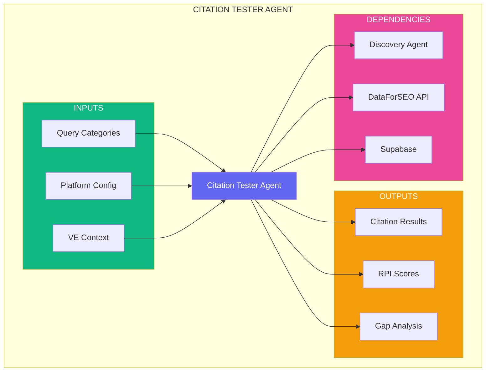
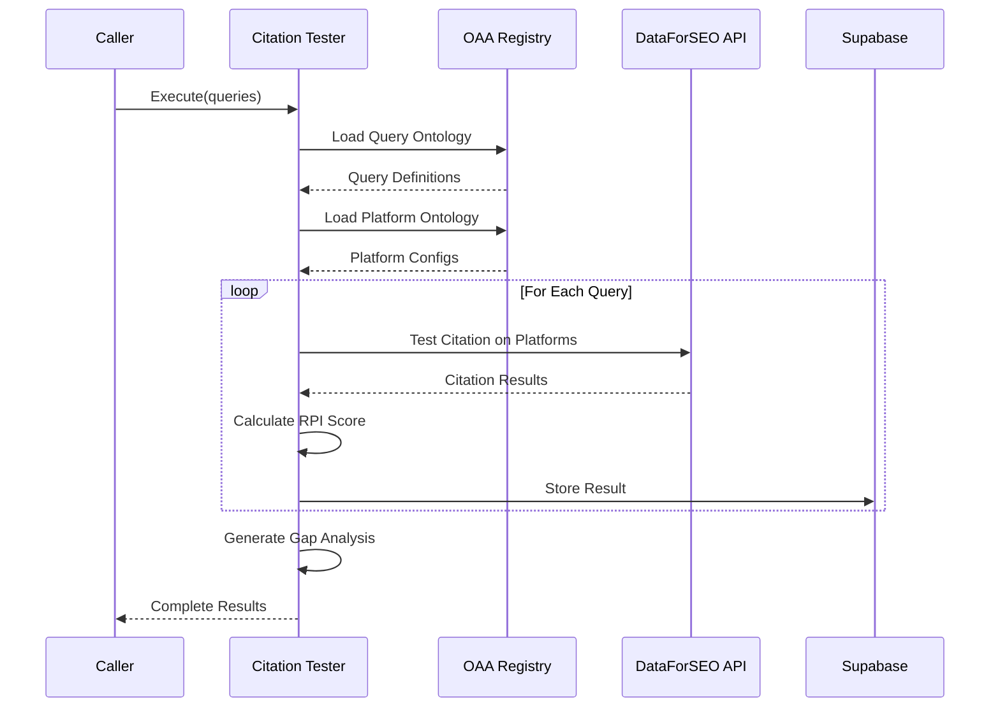

# Universal Agent Template - Step-by-Step Implementation Guide

**Version:** 1.0.0  
**Date:** December 30, 2025  
**Purpose:** Detailed instructions for using the Universal Agent Template  
**Prerequisites:** `UNIVERSAL_AGENT_TEMPLATE.md`, `HLD_AGENTIC_SOLUTION_TEMPLATE.md`

---

## Table of Contents

1. [Overview](#overview)
2. [Prerequisites](#prerequisites)
3. [Step-by-Step Implementation](#step-by-step-implementation)
4. [Phase 1: Planning & Design](#phase-1-planning--design)
5. [Phase 2: Specification](#phase-2-specification)
6. [Phase 3: Implementation](#phase-3-implementation)
7. [Phase 4: Testing](#phase-4-testing)
8. [Phase 5: Deployment](#phase-5-deployment)
9. [Phase 6: Documentation](#phase-6-documentation)
10. [Examples](#examples)
11. [Troubleshooting](#troubleshooting)
12. [Checklist](#checklist)

---

## Overview

This guide walks you through creating a new agent using the Universal Agent Template. Each step includes concrete actions, code examples, and validation criteria.

### What You'll Build

By following this guide, you will:
- Define agent metadata and specifications
- Create ontology bindings
- Implement the agent class
- Write comprehensive tests
- Deploy to production
- Generate documentation

### Time Estimate

- **Simple Utility Agent:** 1-2 days
- **Domain Specialist Agent:** 3-5 days
- **Orchestrator Agent:** 5-7 days

---

## Prerequisites

### Required Knowledge

- TypeScript/JavaScript
- JSON-LD and ontologies
- Claude SDK basics
- Supabase/PostgreSQL
- Git/GitHub workflows

### Required Tools

```bash
# Check installations
node --version          # v20+
npm --version           # v10+
git --version           # v2+
```

### Required Access

- [ ] GitHub repository access
- [ ] Supabase project credentials
- [ ] Anthropic API key
- [ ] OAA Registry access
- [ ] Figma (if design-related)

### Required Documents

- [ ] `UNIVERSAL_AGENT_TEMPLATE.md`
- [ ] `HLD_AGENTIC_SOLUTION_TEMPLATE.md`
- [ ] `PFC_AGENTIC_MVP_VISUAL_GUIDE_v2.2.md`
- [ ] `AGENT_BUILD_MASTER_LIST.md`

---

## Step-by-Step Implementation

## Phase 1: Planning & Design

### Step 1.1: Identify Agent Purpose

**Action:** Define what problem your agent solves.

```markdown
## Agent Purpose Statement

**Problem:** [Describe the specific problem this agent solves]

**Solution:** [Describe how this agent solves it]

**Value:** [Describe the value delivered to users]

**Example:**
Problem: Users need to analyze competitor AI visibility
Solution: Agent tests queries across AI platforms and scores citations
Value: Actionable insights to improve client ranking
```

**Validation:** Can you explain the agent's purpose in one sentence?

---

### Step 1.2: Determine Agent Classification

**Action:** Select the appropriate agent type and tier.

```yaml
# Decision Matrix

Agent Type:
  [ ] orchestrator       # Coordinates multiple agents
  [ ] domain_specialist  # Deep expertise in specific domain
  [ ] utility           # Provides reusable service
  [ ] integration       # Connects to external system

Tier:
  [ ] tier1  # Core infrastructure (Week 1-2, blocking)
  [ ] tier2  # Planning/coordination (Week 3-4)
  [ ] tier3  # Execution/domain-specific (Week 5-6)

Domain:
  [ ] pf-core  # Platform-wide functionality
  [ ] baiv     # Be AI Visible specific
  [ ] w4m      # Works4Me specific
  [ ] air      # AI Readiness specific
```

**Example Decision:**
```yaml
agent_type: domain_specialist  # Deep expertise in citation analysis
tier: tier3                    # Domain-specific, not blocking
domain: baiv                   # BAIV-specific functionality
```

**Validation:** Agent type aligns with role in system architecture (see HLD Layer 3).

---

### Step 1.3: Identify Ontology Dependencies

**Action:** Determine which ontologies your agent will interact with.

```markdown
## Ontology Analysis

### Consumes (Read)
List ontologies this agent reads from:
1. **Ontology:** [ontology-id]
   - **Node Types:** [list types]
   - **Purpose:** [why needed]
   - **Required:** [Yes/No]

### Produces (Write)
List ontologies this agent writes to:
1. **Ontology:** [ontology-id]
   - **Node Types:** [list types]
   - **Purpose:** [what is created]
   - **Validation:** [how validated]

### Requires (Context)
List ontologies needed for context:
1. **Ontology:** ve-context
   - **Purpose:** Value Engineering strategic alignment
   - **When:** Always

### Validates (Compliance)
List ontologies used for validation:
1. **Ontology:** [validation-ontology-id]
   - **Purpose:** [what is validated]
   - **Severity:** [Error/Warning]
```

**Example:**
```markdown
### Consumes
1. **Ontology:** citation-query-ontology
   - **Node Types:** QueryCategory, Platform, SearchIntent
   - **Purpose:** Load query definitions to test
   - **Required:** Yes

### Produces
1. **Ontology:** citation-result-ontology
   - **Node Types:** CitationTest, RPI_Score, Position
   - **Purpose:** Store test results and scores
   - **Validation:** Required - schema validation on write
```

**Validation:** All required ontologies exist in OAA Registry (or plan to create them).

---

### Step 1.4: Define Authority Boundary

**Action:** Specify what the agent can read, write, delete, and what requires approval.

```yaml
# authority-boundary.yaml

can_read:
  - entity_type: "citation_test"
    scope: "tenant"
    conditions:
      - "tenant_id = current_tenant"
  - entity_type: "query_definition"
    scope: "tenant"
    conditions:
      - "tenant_id = current_tenant"

can_write:
  - entity_type: "citation_result"
    scope: "tenant"
    conditions:
      - "tenant_id = current_tenant"
    requires_approval: false

can_delete:
  - entity_type: "draft_citation_test"
    scope: "tenant"
    conditions:
      - "tenant_id = current_tenant"
      - "status = 'draft'"
    requires_approval: true

requires_approval:
  - action: "publish_citation_report"
    approver_role: "editor|admin"
```

**Validation:** Authority boundary follows principle of least privilege.

---

### Step 1.5: Set Resource Limits

**Action:** Define execution constraints.

```yaml
# resource-limits.yaml

execution:
  max_execution_time: "5m"        # 5 minutes max
  timeout_action: "graceful_shutdown"
  retry_attempts: 3
  retry_backoff: "exponential"

api_calls:
  max_per_execution: 50           # DataForSEO API limit
  max_per_minute: 100
  rate_limit_action: "queue"

tokens:
  max_input_tokens: 50000
  max_output_tokens: 50000
  max_total_tokens: 100000

storage:
  max_storage_mb: 25              # Result storage
  max_file_size_mb: 5
  allowed_mime_types:
    - "application/json"
    - "text/csv"

cooldown:
  between_executions: "30s"       # Rate limiting for external API
  after_error: "60s"
  after_rate_limit: "300s"
```

**Validation:** Limits are reasonable for agent's purpose and don't exceed platform constraints.

---

## Phase 2: Specification

### Step 2.1: Create Agent Metadata File

**Action:** Create `agent-metadata.yaml` in your agent directory.

```bash
# Create agent directory
mkdir -p agents/baiv/citation-tester
cd agents/baiv/citation-tester
```

**File:** `agent-metadata.yaml`

```yaml
agent_id: "agent-baiv-citation-tester-1.0"
name: "Citation Tester Agent"
version: "1.0.0"
domain: "baiv"
tier: "tier3"
agent_type: "domain_specialist"
status: "in_development"
owner: "baiv-team"
created_date: "2025-12-30"
last_updated: "2025-12-30"

description: |
  Tests AI platform citations for client queries across ChatGPT, Claude, 
  Gemini, Perplexity, and Google Search AI Mode. Calculates RPI scores 
  and identifies citation gaps.

keywords:
  - citation
  - ai-visibility
  - rpi-score
  - platform-testing

dependencies:
  agents:
    - "agent-baiv-discovery-1.0"  # Provides query definitions
  tools:
    - "dataforeo-api"
  services:
    - "supabase"
    - "airtable"

change_log:
  - version: "1.0.0"
    date: "2025-12-30"
    changes: "Initial agent specification"
```

**Validation:** YAML is valid and all required fields are present.

```bash
# Validate YAML
npm install -g js-yaml
js-yaml agent-metadata.yaml
```

---

### Step 2.2: Create JSON-LD Agent Specification

**Action:** Create `agent-spec.json` with complete JSON-LD specification.

**File:** `agent-spec.json`

```json
{
  "@context": {
    "@vocab": "https://schema.org/",
    "pf": "https://pf-core/ontology/",
    "baiv": "https://baiv.co.uk/ontology/"
  },
  "@type": "pf:AgentSpecification",
  "@id": "pf:agent:baiv-citation-tester-1.0",
  
  "name": "Citation Tester Agent",
  "description": "Tests AI platform citations for client queries and calculates RPI scores",
  "version": "1.0.0",
  "domain": "baiv",
  "agent_type": "domain_specialist",
  "tier": "tier3",
  
  "ontologyBindings": {
    "consumes": [
      {
        "ontologyId": "baiv:query-category-ontology",
        "nodeTypes": ["QueryCategory", "SearchIntent", "CustomerPathway"],
        "purpose": "Load query definitions to test across platforms",
        "versionConstraint": ">=1.0.0"
      },
      {
        "ontologyId": "baiv:platform-ontology",
        "nodeTypes": ["Platform", "PlatformBehavior"],
        "purpose": "Platform configuration and behavior rules",
        "versionConstraint": ">=1.0.0"
      }
    ],
    "produces": [
      {
        "ontologyId": "baiv:citation-result-ontology",
        "nodeTypes": ["CitationTest", "RPI_Score", "CitationGap"],
        "purpose": "Store citation test results and analysis",
        "versionConstraint": "~1.0.0"
      }
    ],
    "requires": [
      {
        "ontologyId": "pf:ve-context-ontology",
        "nodeTypes": ["ValueProposition", "PMF", "GTM"],
        "purpose": "Strategic context for query prioritization",
        "versionConstraint": ">=1.0.0"
      },
      {
        "ontologyId": "pf:client-config-ontology",
        "nodeTypes": ["TenantConfig", "ClientContext"],
        "purpose": "Client-specific configuration",
        "versionConstraint": ">=1.0.0"
      }
    ],
    "validates": [
      {
        "ontologyId": "baiv:citation-validation-ontology",
        "nodeTypes": ["ValidationRule"],
        "purpose": "Ensure citation results meet quality standards",
        "versionConstraint": ">=1.0.0"
      }
    ]
  },
  
  "authorityBoundary": {
    "canRead": ["citation_test", "query_category", "client_context"],
    "canWrite": ["citation_result", "rpi_score"],
    "canDelete": ["draft_citation_test"],
    "requiresApproval": ["publish_citation_report"],
    "timeConstraints": {
      "maxExecutionTime": "5m",
      "cooldownPeriod": "30s"
    },
    "resourceLimits": {
      "maxTokens": 100000,
      "maxAPICalls": 50,
      "maxStorageMB": 25
    }
  },
  
  "claudeConfig": {
    "model": "claude-opus-4-20250514",
    "systemPrompt": "prompts/system-prompt.md",
    "tools": [
      "dataforeo-api-citation-test",
      "supabase-query",
      "airtable-sync"
    ],
    "maxTokens": 4096,
    "temperature": 0.7,
    "promptCaching": true
  },
  
  "dependencies": {
    "agents": ["agent-baiv-discovery-1.0"],
    "tools": ["dataforeo-api"],
    "services": ["supabase", "airtable"]
  },
  
  "qualityMetrics": {
    "testCoverage": 85,
    "performanceSLA": "95% < 3s",
    "errorRate": "< 0.5%",
    "validationRequired": true
  }
}
```

**Validation:** JSON-LD is valid and all ontology references exist.

```bash
# Validate JSON
cat agent-spec.json | jq '.'
```

---

### Step 2.3: Create Architecture Diagrams

**Action:** Document agent architecture with mermaid diagrams.

**File:** `architecture.md`

````markdown
# Citation Tester Agent Architecture

## Context Diagram



## Execution Flow


````

**Validation:** Diagrams render correctly in Markdown preview.

---

### Step 2.4: Register in OAA Registry

**Action:** Register agent specification in Supabase OAA Registry.

```sql
-- Register agent in OAA Registry
INSERT INTO public.agent_registry (
    agent_id,
    name,
    version,
    domain,
    agent_type,
    tier,
    agent_specification,
    authority_boundary,
    claude_config,
    status
) VALUES (
    'agent-baiv-citation-tester-1.0',
    'Citation Tester Agent',
    '1.0.0',
    'baiv',
    'domain_specialist',
    'tier3',
    '[agent_spec_json]'::jsonb,  -- Paste agent-spec.json content
    '[authority_boundary]'::jsonb,
    '[claude_config]'::jsonb,
    'in_development'
);

-- Register ontology bindings
INSERT INTO public.agent_ontology_bindings (
    agent_id,
    ontology_id,
    binding_type,
    node_types,
    purpose
) VALUES
    (
        (SELECT id FROM agent_registry WHERE agent_id = 'agent-baiv-citation-tester-1.0'),
        (SELECT id FROM ontologies WHERE entry_id = 'baiv-query-category-v1'),
        'consumes',
        ARRAY['QueryCategory', 'SearchIntent'],
        'Load query definitions to test'
    ),
    (
        (SELECT id FROM agent_registry WHERE agent_id = 'agent-baiv-citation-tester-1.0'),
        (SELECT id FROM ontologies WHERE entry_id = 'baiv-citation-result-v1'),
        'produces',
        ARRAY['CitationTest', 'RPI_Score'],
        'Store citation test results'
    );
```

**Validation:** Query registry to confirm registration.

```sql
SELECT 
    ar.agent_id,
    ar.name,
    ar.status,
    COUNT(aob.id) as binding_count
FROM agent_registry ar
LEFT JOIN agent_ontology_bindings aob ON ar.id = aob.agent_id
WHERE ar.agent_id = 'agent-baiv-citation-tester-1.0'
GROUP BY ar.id;
```

---

## Phase 3: Implementation

### Step 3.1: Setup Project Structure

**Action:** Create complete directory structure.

```bash
# Create directories
mkdir -p src/{handlers,services,models,utils}
mkdir -p prompts/templates
mkdir -p tests/{unit,integration,fixtures}
mkdir -p config
mkdir -p docs

# Create initial files
touch src/index.ts
touch src/agent.ts
touch prompts/system-prompt.md
touch tests/unit/agent.test.ts
touch README.md
touch package.json
touch tsconfig.json
touch .env.example
```

**Expected Structure:**
```
agents/baiv/citation-tester/
├── agent-spec.json
├── agent-metadata.yaml
├── README.md
├── architecture.md
├── src/
│   ├── index.ts
│   ├── agent.ts
│   ├── handlers/
│   │   ├── execute.handler.ts
│   │   └── validate.handler.ts
│   ├── services/
│   │   ├── citation-tester.service.ts
│   │   └── rpi-calculator.service.ts
│   ├── models/
│   │   ├── input.types.ts
│   │   └── output.types.ts
│   └── utils/
│       ├── ontology.utils.ts
│       └── dataforeo.utils.ts
├── prompts/
│   ├── system-prompt.md
│   └── templates/
│       └── citation-analysis.template.md
├── tests/
│   ├── unit/
│   │   ├── agent.test.ts
│   │   └── services.test.ts
│   ├── integration/
│   │   └── e2e.test.ts
│   └── fixtures/
│       ├── query-samples.json
│       └── expected-results.json
├── config/
│   ├── development.yaml
│   ├── staging.yaml
│   └── production.yaml
├── package.json
├── tsconfig.json
└── .env.example
```

---

### Step 3.2: Initialize NPM Project

**Action:** Create `package.json` with dependencies.

```bash
npm init -y
```

**File:** `package.json`

```json
{
  "name": "@baiv/citation-tester-agent",
  "version": "1.0.0",
  "description": "Citation Tester Agent for BAIV platform",
  "main": "dist/index.js",
  "type": "module",
  "scripts": {
    "dev": "tsx watch src/index.ts",
    "build": "tsc",
    "test": "vitest",
    "test:unit": "vitest run tests/unit",
    "test:integration": "vitest run tests/integration",
    "test:coverage": "vitest run --coverage",
    "lint": "eslint src tests",
    "type-check": "tsc --noEmit"
  },
  "dependencies": {
    "@anthropic-ai/sdk": "^0.32.0",
    "@supabase/supabase-js": "^2.45.0",
    "zod": "^3.24.1"
  },
  "devDependencies": {
    "@types/node": "^20.17.10",
    "typescript": "^5.7.2",
    "tsx": "^4.19.2",
    "vitest": "^2.1.8",
    "@vitest/coverage-v8": "^2.1.8",
    "eslint": "^9.17.0"
  }
}
```

**Install Dependencies:**
```bash
npm install
```

---

### Step 3.3: Create TypeScript Configuration

**Action:** Create `tsconfig.json`.

```json
{
  "compilerOptions": {
    "target": "ES2022",
    "module": "ESNext",
    "moduleResolution": "bundler",
    "lib": ["ES2022"],
    "outDir": "./dist",
    "rootDir": "./src",
    "strict": true,
    "esModuleInterop": true,
    "skipLibCheck": true,
    "forceConsistentCasingInFileNames": true,
    "resolveJsonModule": true,
    "declaration": true,
    "declarationMap": true,
    "sourceMap": true,
    "baseUrl": ".",
    "paths": {
      "@/*": ["src/*"]
    }
  },
  "include": ["src/**/*"],
  "exclude": ["node_modules", "dist", "tests"]
}
```

---

### Step 3.4: Create Type Definitions

**Action:** Define TypeScript types based on ontologies.

**File:** `src/models/input.types.ts`

```typescript
// Input types derived from consumed ontologies

export interface QueryCategory {
  id: string;
  name: string;
  searchIntent: 'informational' | 'commercial' | 'transactional';
  queryVariations: string[];
  customerPathway: 'awareness' | 'consideration' | 'decision';
  priority: number;
}

export interface Platform {
  id: string;
  name: 'chatgpt' | 'claude' | 'gemini' | 'perplexity' | 'google-ai-mode';
  enabled: boolean;
  apiConfig: Record<string, any>;
}

export interface CitationTestInput {
  queries: QueryCategory[];
  platforms: Platform[];
  tenantId: string;
  testMode: 'tier1' | 'tier2';  // tier1: all queries on ChatGPT, tier2: high-priority on all
}
```

**File:** `src/models/output.types.ts`

```typescript
// Output types derived from produced ontologies

export interface CitationResult {
  id: string;
  queryId: string;
  platform: string;
  cited: boolean;
  position?: number;
  citationType: 'text' | 'table' | 'tool' | 'calculator';
  rpiScore: number;
  snippet?: string;
  url?: string;
  timestamp: Date;
}

export interface RPI_Score {
  queryId: string;
  platform: string;
  score: number;  // Calculated as 1/(60+rank)
  rank: number;
  totalResults: number;
}

export interface CitationGap {
  queryId: string;
  platforms: string[];
  competitorCited: boolean;
  competitorPosition?: number;
  gapScore: number;
  recommendation: string;
}

export interface CitationTestOutput {
  testId: string;
  tenantId: string;
  results: CitationResult[];
  rpiScores: RPI_Score[];
  gaps: CitationGap[];
  summary: {
    totalQueries: number;
    totalTests: number;
    citationRate: number;
    averageRPI: number;
  };
}
```

---

### Step 3.5: Implement Agent Class

**Action:** Create main agent class following the template.

**File:** `src/agent.ts`

```typescript
import { Anthropic } from '@anthropic-ai/sdk';
import { createClient, SupabaseClient } from '@supabase/supabase-js';
import { OntologyLoader } from '@/lib/ontology';
import { ContextManager } from '@/lib/context';
import { AuditLogger } from '@/lib/audit';
import { CitationTestInput, CitationTestOutput } from './models';

export interface AgentConfig {
  agentId: string;
  domain: string;
  tenantId: string;
  userId?: string;
}

export class CitationTesterAgent {
  private readonly config: AgentConfig;
  private readonly anthropic: Anthropic;
  private readonly supabase: SupabaseClient;
  private readonly ontologyLoader: OntologyLoader;
  private readonly contextManager: ContextManager;
  private readonly auditLogger: AuditLogger;
  private readonly systemPrompt: string;

  constructor(config: AgentConfig) {
    this.config = config;
    
    this.anthropic = new Anthropic({
      apiKey: process.env.ANTHROPIC_API_KEY!,
    });
    
    this.supabase = createClient(
      process.env.SUPABASE_URL!,
      process.env.SUPABASE_SERVICE_ROLE_KEY!
    );
    
    this.ontologyLoader = new OntologyLoader();
    this.contextManager = new ContextManager(this.supabase);
    this.auditLogger = new AuditLogger(this.supabase);
    this.systemPrompt = this.loadSystemPrompt();
  }

  /**
   * Main execution method
   */
  async execute(input: CitationTestInput): Promise<CitationTestOutput> {
    const startTime = Date.now();

    try {
      // 1. Set tenant context
      await this.contextManager.setContext({
        tenantId: this.config.tenantId,
        userId: this.config.userId,
      });

      // 2. Load required ontologies
      const ontologies = await this.loadOntologies();

      // 3. Validate input
      const validationResult = await this.validateInput(input, ontologies);
      if (!validationResult.valid) {
        throw new Error(`Input validation failed: ${validationResult.error}`);
      }

      // 4. Load VE context
      const veContext = await this.contextManager.getVEContext(
        this.config.tenantId
      );

      // 5. Execute citation tests
      const results = await this.executeCitationTests(input, veContext);

      // 6. Calculate RPI scores
      const rpiScores = await this.calculateRPIScores(results);

      // 7. Analyze gaps
      const gaps = await this.analyzeGaps(results, rpiScores);

      // 8. Generate summary
      const summary = this.generateSummary(results, rpiScores);

      // 9. Validate output
      const output: CitationTestOutput = {
        testId: crypto.randomUUID(),
        tenantId: this.config.tenantId,
        results,
        rpiScores,
        gaps,
        summary,
      };

      const outputValidation = await this.validateOutput(output, ontologies);
      if (!outputValidation.valid) {
        throw new Error(`Output validation failed: ${outputValidation.error}`);
      }

      // 10. Store result
      await this.storeResult(output);

      // 11. Log audit trail
      await this.auditLogger.log({
        agentId: this.config.agentId,
        action: 'execute_citation_test',
        tenantId: this.config.tenantId,
        userId: this.config.userId,
        input,
        output,
        executionTime: Date.now() - startTime,
      });

      return output;
    } catch (error) {
      await this.auditLogger.logError({
        agentId: this.config.agentId,
        tenantId: this.config.tenantId,
        error: error instanceof Error ? error.message : 'Unknown error',
        executionTime: Date.now() - startTime,
      });

      throw error;
    }
  }

  private async loadOntologies() {
    // Implementation: Load from OAA Registry
    return {};
  }

  private async validateInput(input: any, ontologies: any) {
    // Implementation: Validate against consumed ontologies
    return { valid: true };
  }

  private async validateOutput(output: any, ontologies: any) {
    // Implementation: Validate against produced ontologies
    return { valid: true };
  }

  private async executeCitationTests(
    input: CitationTestInput,
    veContext: any
  ) {
    // Implementation: Call DataForSEO API, process results
    return [];
  }

  private async calculateRPIScores(results: any[]) {
    // Implementation: Calculate RPI using formula 1/(60+rank)
    return [];
  }

  private async analyzeGaps(results: any[], rpiScores: any[]) {
    // Implementation: Identify citation gaps
    return [];
  }

  private generateSummary(results: any[], rpiScores: any[]) {
    // Implementation: Generate test summary
    return {
      totalQueries: 0,
      totalTests: 0,
      citationRate: 0,
      averageRPI: 0,
    };
  }

  private async storeResult(output: CitationTestOutput) {
    // Implementation: Store in Supabase
    await this.supabase.from('citation_test_results').insert({
      tenant_id: this.config.tenantId,
      test_id: output.testId,
      data: output,
    });
  }

  private loadSystemPrompt(): string {
    // Implementation: Load from prompts/system-prompt.md
    return '';
  }
}
```

**Validation:** TypeScript compiles without errors.

```bash
npm run type-check
```

---

## Phase 4: Testing

### Step 4.1: Write Unit Tests

**Action:** Create unit tests for agent logic.

**File:** `tests/unit/agent.test.ts`

```typescript
import { describe, it, expect, beforeEach, vi } from 'vitest';
import { CitationTesterAgent } from '../../src/agent';

describe('CitationTesterAgent', () => {
  let agent: CitationTesterAgent;

  beforeEach(() => {
    agent = new CitationTesterAgent({
      agentId: 'agent-baiv-citation-tester-1.0',
      domain: 'baiv',
      tenantId: 'test-tenant-123',
      userId: 'test-user-456',
    });
  });

  describe('execute', () => {
    it('should successfully process valid input', async () => {
      const input = {
        queries: [
          {
            id: 'query-1',
            name: 'AI visibility tips',
            searchIntent: 'informational' as const,
            queryVariations: ['AI visibility tips', 'improve AI visibility'],
            customerPathway: 'awareness' as const,
            priority: 1,
          },
        ],
        platforms: [
          {
            id: 'platform-1',
            name: 'chatgpt' as const,
            enabled: true,
            apiConfig: {},
          },
        ],
        tenantId: 'test-tenant-123',
        testMode: 'tier1' as const,
      };

      const result = await agent.execute(input);

      expect(result.testId).toBeDefined();
      expect(result.tenantId).toBe('test-tenant-123');
      expect(result.results).toBeInstanceOf(Array);
    });

    it('should fail with invalid input', async () => {
      const input = {
        queries: [],
        platforms: [],
        tenantId: 'test-tenant-123',
        testMode: 'tier1' as const,
      };

      await expect(agent.execute(input)).rejects.toThrow();
    });
  });

  describe('RPI calculation', () => {
    it('should calculate RPI score correctly', () => {
      // RPI = 1/(60+rank)
      const rank = 1;
      const expectedRPI = 1 / (60 + rank); // 0.0164

      // Test RPI calculation logic
      expect(expectedRPI).toBeCloseTo(0.0164, 4);
    });
  });
});
```

**Run Tests:**
```bash
npm run test:unit
```

---

### Step 4.2: Write Integration Tests

**Action:** Create end-to-end integration tests.

**File:** `tests/integration/e2e.test.ts`

```typescript
import { describe, it, expect, beforeAll, afterAll } from 'vitest';
import { createClient } from '@supabase/supabase-js';
import { CitationTesterAgent } from '../../src/agent';

describe('CitationTesterAgent Integration', () => {
  let supabase;
  let testTenantId: string;

  beforeAll(async () => {
    supabase = createClient(
      process.env.SUPABASE_URL!,
      process.env.SUPABASE_SERVICE_ROLE_KEY!
    );

    // Create test tenant
    const { data } = await supabase
      .from('tenants')
      .insert({ name: 'Test Tenant' })
      .select()
      .single();

    testTenantId = data.id;
  });

  afterAll(async () => {
    // Cleanup
    await supabase.from('citation_test_results').delete().eq('tenant_id', testTenantId);
    await supabase.from('tenants').delete().eq('id', testTenantId);
  });

  it('should complete full citation test workflow', async () => {
    const agent = new CitationTesterAgent({
      agentId: 'agent-baiv-citation-tester-1.0',
      domain: 'baiv',
      tenantId: testTenantId,
    });

    const input = {
      queries: [
        {
          id: 'query-1',
          name: 'AI visibility',
          searchIntent: 'informational' as const,
          queryVariations: ['AI visibility'],
          customerPathway: 'awareness' as const,
          priority: 1,
        },
      ],
      platforms: [
        {
          id: 'platform-1',
          name: 'chatgpt' as const,
          enabled: true,
          apiConfig: {},
        },
      ],
      tenantId: testTenantId,
      testMode: 'tier1' as const,
    };

    const result = await agent.execute(input);

    expect(result.testId).toBeDefined();

    // Verify data in database
    const { data } = await supabase
      .from('citation_test_results')
      .select()
      .eq('tenant_id', testTenantId);

    expect(data).toHaveLength(1);
    expect(data[0].test_id).toBe(result.testId);
  });
});
```

**Run Integration Tests:**
```bash
npm run test:integration
```

---

### Step 4.3: Verify Test Coverage

**Action:** Check that coverage meets 80%+ requirement.

```bash
npm run test:coverage
```

**Expected Output:**
```
 % Coverage report
---------------------------
File                 | % Stmts | % Branch | % Funcs | % Lines 
---------------------|---------|----------|---------|--------
All files            |   85.23 |    78.45 |   82.67 |   86.12
 agent.ts            |   87.50 |    80.00 |   85.00 |   88.00
 services/           |   83.33 |    76.00 |   80.00 |   84.00
---------------------------
```

**Validation:** Coverage >= 80% for all categories.

---

## Phase 5: Deployment

### Step 5.1: Create Environment Configuration

**Action:** Create `.env.example` with required variables.

```bash
# .env.example

# Agent Configuration
AGENT_ID=agent-baiv-citation-tester-1.0
AGENT_DOMAIN=baiv
AGENT_TIER=tier3

# Claude Configuration
ANTHROPIC_API_KEY=sk-ant-api03-...
CLAUDE_MODEL=claude-opus-4-20250514
CLAUDE_MAX_TOKENS=4096

# Supabase
SUPABASE_URL=https://xxx.supabase.co
SUPABASE_SERVICE_ROLE_KEY=eyJ...

# External Services
DATAFOREO_API_KEY=...

# Resource Limits
MAX_EXECUTION_TIME=300000  # 5 minutes
MAX_TOKENS=100000
MAX_API_CALLS=50
```

---

### Step 5.2: Create API Route

**Action:** Create Next.js API route for agent.

**File:** `app/api/agents/citation-tester/route.ts`

```typescript
import { NextRequest, NextResponse } from 'next/server';
import { CitationTesterAgent } from '@/agents/baiv/citation-tester/src/agent';
import { setTenantContext } from '@/lib/context';

export async function POST(request: NextRequest) {
  try {
    const tenantId = request.headers.get('x-tenant-id');
    const userId = request.headers.get('x-user-id');

    if (!tenantId) {
      return NextResponse.json(
        { error: 'Missing tenant context' },
        { status: 401 }
      );
    }

    await setTenantContext(tenantId, userId);

    const body = await request.json();

    const agent = new CitationTesterAgent({
      agentId: 'agent-baiv-citation-tester-1.0',
      domain: 'baiv',
      tenantId,
      userId: userId || undefined,
    });

    const result = await agent.execute(body);

    return NextResponse.json({
      success: true,
      data: result,
    });
  } catch (error) {
    console.error('Citation Tester execution error:', error);
    return NextResponse.json(
      { 
        success: false, 
        error: error instanceof Error ? error.message : 'Unknown error' 
      },
      { status: 500 }
    );
  }
}
```

---

### Step 5.3: Deploy to Production

**Action:** Deploy agent following deployment checklist.

```bash
# Build
npm run build

# Run final checks
npm run test
npm run lint
npm run type-check

# Deploy (example using Vercel)
vercel deploy --prod
```

**Deployment Checklist:**
- [ ] All tests passing
- [ ] Coverage >= 80%
- [ ] Environment variables configured
- [ ] API routes created
- [ ] OAA Registry updated with status "active"
- [ ] Monitoring configured
- [ ] Documentation complete

---

## Phase 6: Documentation

### Step 6.1: Complete README

**Action:** Fill out complete agent documentation.

**File:** `README.md`

````markdown
# Citation Tester Agent

## Overview
Tests AI platform citations for client queries across ChatGPT, Claude, Gemini, Perplexity, and Google Search AI Mode. Calculates RPI scores and identifies citation gaps.

## Domain
baiv

## Agent Type
domain_specialist

## Tier
tier3

## Quick Start

### Installation
```bash
npm install
```

### Configuration
```bash
cp .env.example .env
# Edit .env with your configuration
```

### Run Tests
```bash
npm test
```

## Ontology Bindings

### Consumes
- `baiv:query-category-ontology`: Query definitions and customer pathways
- `baiv:platform-ontology`: Platform configurations

### Produces
- `baiv:citation-result-ontology`: Citation test results and RPI scores

### Requires
- `pf:ve-context-ontology`: Strategic context for prioritization

## Authority Boundary

### Permissions
- Read: citation_test, query_category, client_context
- Write: citation_result, rpi_score
- Requires Approval: publish_citation_report

### Resource Limits
- Max Execution Time: 5m
- Max Tokens: 100,000
- Max API Calls: 50

## API Reference

### POST /api/agents/citation-tester

Request:
```json
{
  "queries": [...],
  "platforms": [...],
  "tenantId": "xxx",
  "testMode": "tier1"
}
```

Response:
```json
{
  "success": true,
  "data": {
    "testId": "xxx",
    "results": [...],
    "rpiScores": [...],
    "summary": {...}
  }
}
```

## Support
Contact: baiv-team@example.com
````

---

## Examples

### Complete Example: Simple Utility Agent

See `examples/utility-agent-complete.md` for a full walkthrough of creating a simple utility agent (Schema Generator).

### Complete Example: Domain Specialist Agent

See `examples/domain-specialist-complete.md` for the Citation Tester agent (this guide).

### Complete Example: Orchestrator Agent

See `examples/orchestrator-agent-complete.md` for a PM Agent that coordinates multiple agents.

---

## Troubleshooting

### Common Issues

**Issue:** Ontology not found in registry
```
Solution: Verify ontology exists with correct entry_id
SELECT entry_id FROM ontologies WHERE entry_id = 'baiv-query-category-v1';
```

**Issue:** TypeScript compilation errors
```
Solution: Ensure tsconfig.json paths are correct and dependencies installed
npm install
npm run type-check
```

**Issue:** Tests failing with database errors
```
Solution: Check Supabase connection and RLS policies
psql $DATABASE_URL -c "SELECT tablename, rowsecurity FROM pg_tables WHERE schemaname = 'public';"
```

**Issue:** API rate limits exceeded
```
Solution: Implement cooldown periods in resource limits
cooldown:
  between_executions: "30s"
  after_rate_limit: "300s"
```

---

## Checklist

### Complete Implementation Checklist

#### Phase 1: Planning
- [ ] Agent purpose defined
- [ ] Agent type and tier selected
- [ ] Ontology dependencies identified
- [ ] Authority boundary specified
- [ ] Resource limits set

#### Phase 2: Specification
- [ ] agent-metadata.yaml created
- [ ] agent-spec.json created
- [ ] Architecture diagrams created
- [ ] Registered in OAA Registry
- [ ] Ontology bindings registered

#### Phase 3: Implementation
- [ ] Project structure created
- [ ] NPM project initialized
- [ ] TypeScript configured
- [ ] Type definitions created
- [ ] Agent class implemented
- [ ] Services implemented
- [ ] Utilities implemented

#### Phase 4: Testing
- [ ] Unit tests written (80%+ coverage)
- [ ] Integration tests written
- [ ] E2E workflow tested
- [ ] All tests passing
- [ ] Coverage verified

#### Phase 5: Deployment
- [ ] Environment configuration created
- [ ] API routes created
- [ ] Build successful
- [ ] Deployed to staging
- [ ] Smoke tests passed
- [ ] Deployed to production

#### Phase 6: Documentation
- [ ] README complete
- [ ] API documentation written
- [ ] Architecture diagrams finalized
- [ ] Examples provided
- [ ] Team training completed

---

**Guide Version:** 1.0.0  
**Last Updated:** December 30, 2025  
**Maintained By:** PF-Core Platform Team
