# PF-Core Architecture Diagrams v2.0

**Unified OAA Registry + Agent Integration Visual Reference**

| Attribute | Value |
|-----------|-------|
| **Document Version** | 2.0.0 |
| **Date** | December 2025 |
| **Format** | Mermaid Diagrams |
| **Status** | APPROVED |

---

## 1. Unified Registry Architecture

### 1.1 Complete Registry Structure

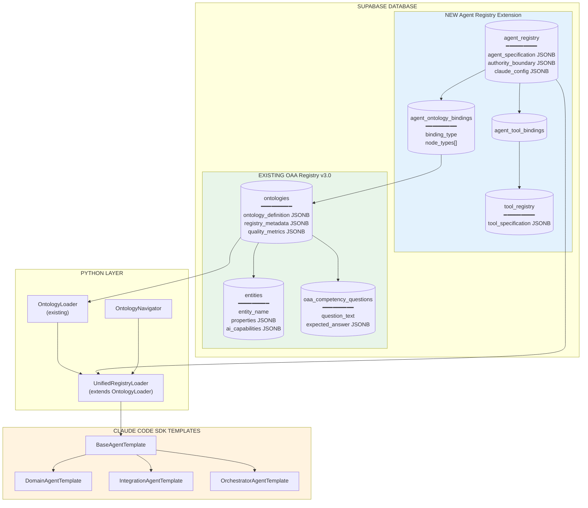

### 1.2 Registry Relationship Graph

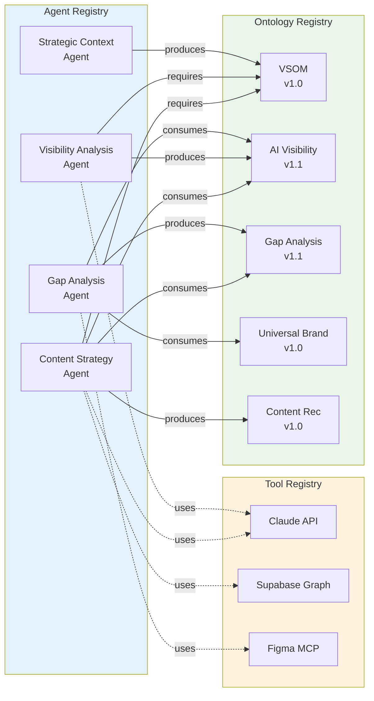

---

## 2. Agent-Ontology Binding Resolution

### 2.1 Binding Resolution Flow

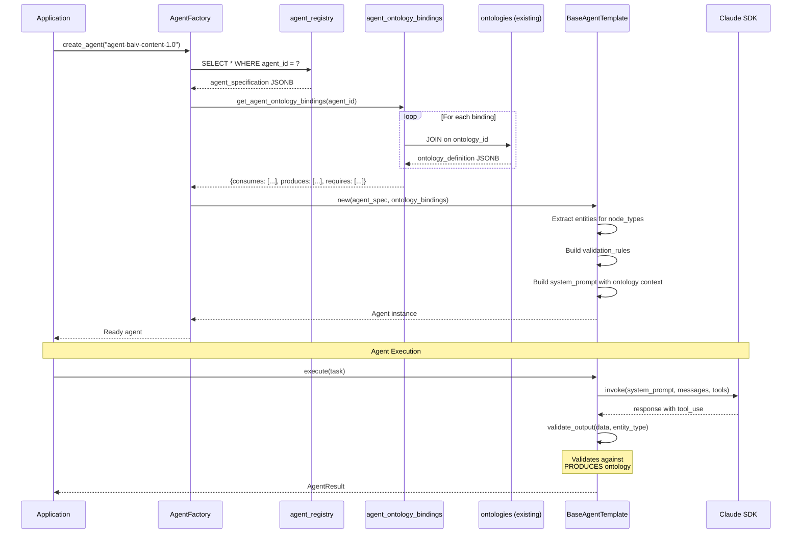

### 2.2 Ontology Context Injection

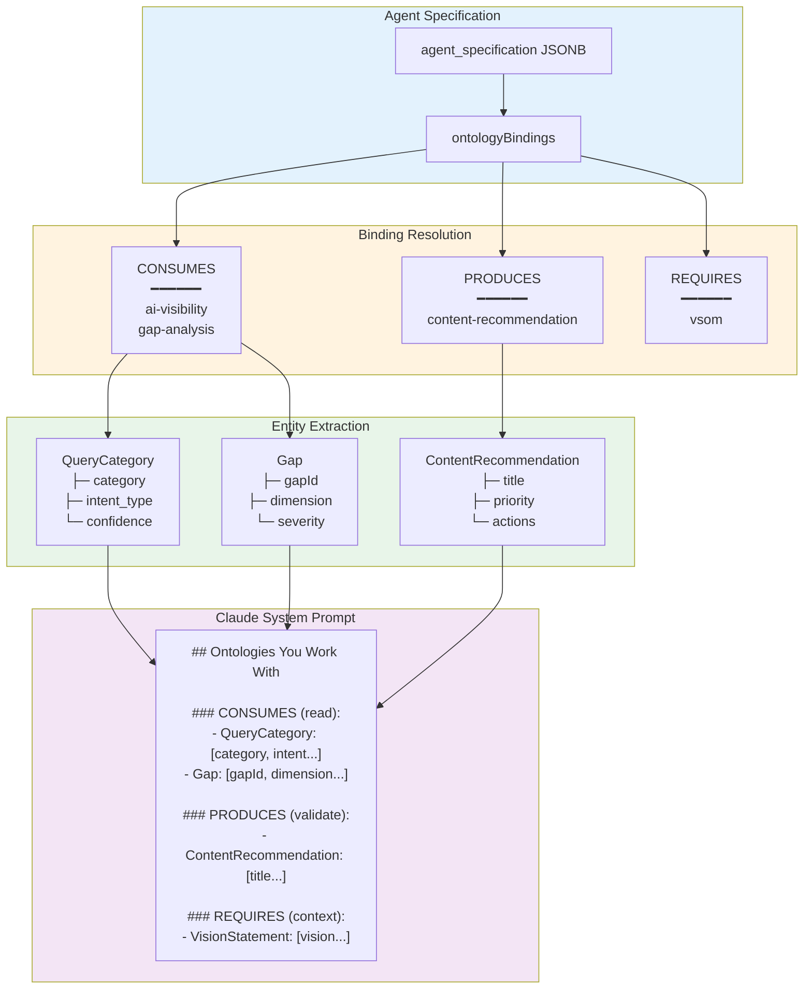

---

## 3. Tiered Graph with Registry Integration

### 3.1 Three-Tier Graph Model

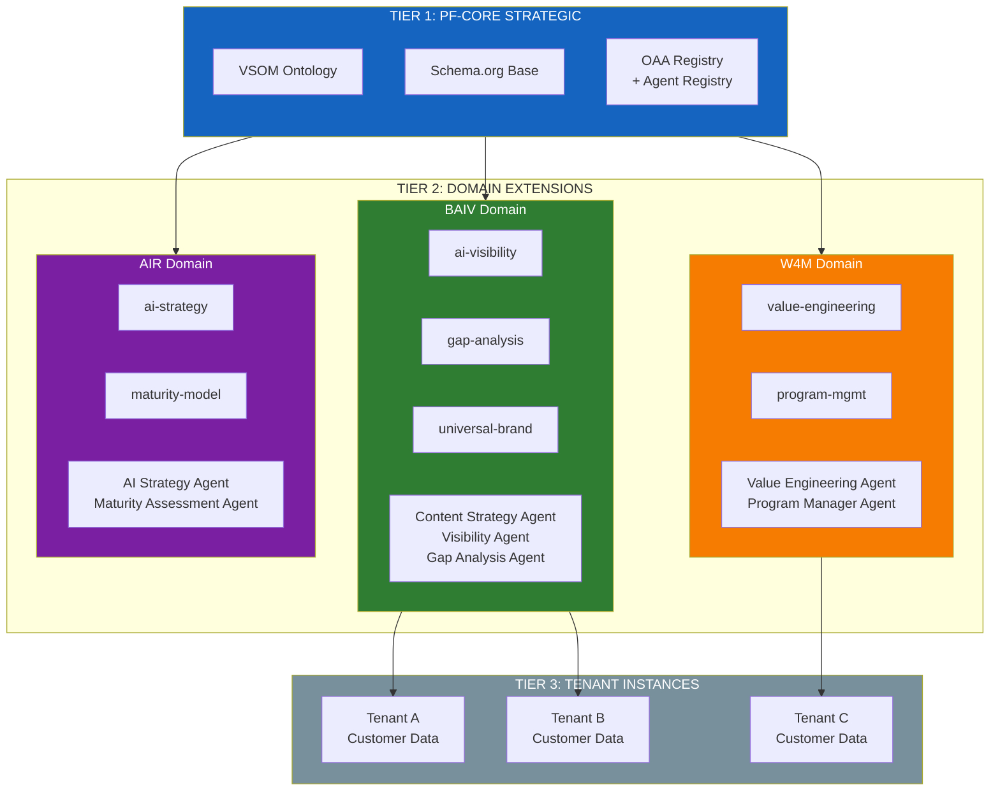

### 3.2 Agent Authority by Tier

```mermaid
flowchart TB
    subgraph ORCHESTRATOR["ORCHESTRATOR AGENTS"]
        direction LR
        O1["Master Orchestrator"]
        O2["Platform Orchestrator"]
    end
    
    subgraph DOMAIN["DOMAIN AGENTS"]
        direction LR
        D1["Content Strategy"]
        D2["Value Engineering"]
        D3["AI Strategy"]
    end
    
    subgraph UTILITY["UTILITY AGENTS"]
        direction LR
        U1["Report Generator"]
        U2["Schema Validator"]
    end
    
    subgraph INTEGRATION["INTEGRATION AGENTS"]
        direction LR
        I1["Figma MCP Bridge"]
        I2["Web Search Agent"]
    end
    
    subgraph TIERS["TIER ACCESS"]
        T1["Tier 1<br/>Strategic"]
        T2["Tier 2<br/>Domain"]
        T3["Tier 3<br/>Tenant"]
    end
    
    %% Orchestrator access
    O1 -->|"R/W"| T1
    O1 -->|"R"| T2
    O1 -.->|"delegate"| T3
    
    %% Domain agent access
    D1 -->|"R"| T1
    D1 -->|"R/W own domain"| T2
    D1 -->|"R/W tenant"| T3
    
    %% Utility agent access
    U1 -->|"R"| T1
    U1 -->|"R"| T2
    U1 -->|"R/W tenant"| T3
    
    %% Integration agent access
    I1 -.->|"❌"| T1
    I1 -.->|"❌"| T2
    I1 -->|"R/W specific"| T3
    
    style ORCHESTRATOR fill:#1565c0,color:#fff
    style DOMAIN fill:#2e7d32,color:#fff
    style UTILITY fill:#f57c00,color:#fff
    style INTEGRATION fill:#78909c,color:#fff
```

---

## 4. Claude Code SDK Integration

### 4.1 Agent Template Hierarchy

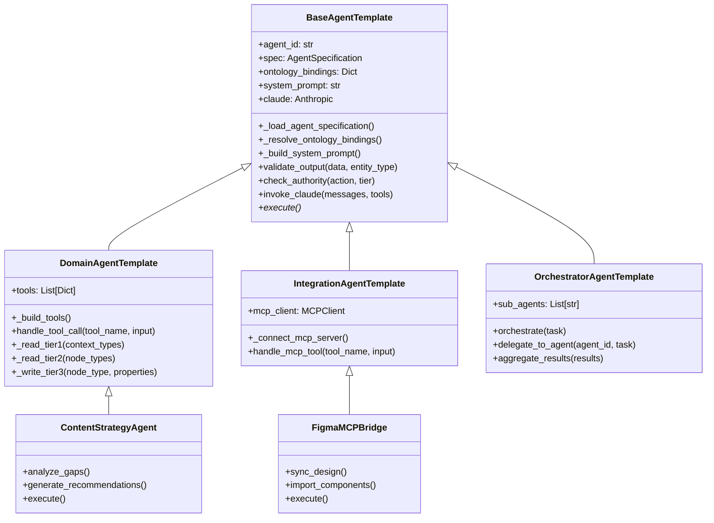

### 4.2 Agent Execution Flow

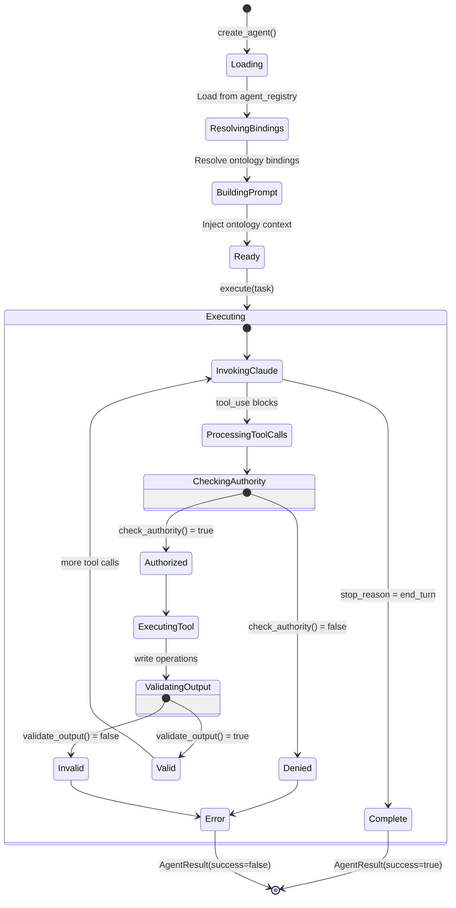

---

## 5. Database Schema

### 5.1 Complete ERD

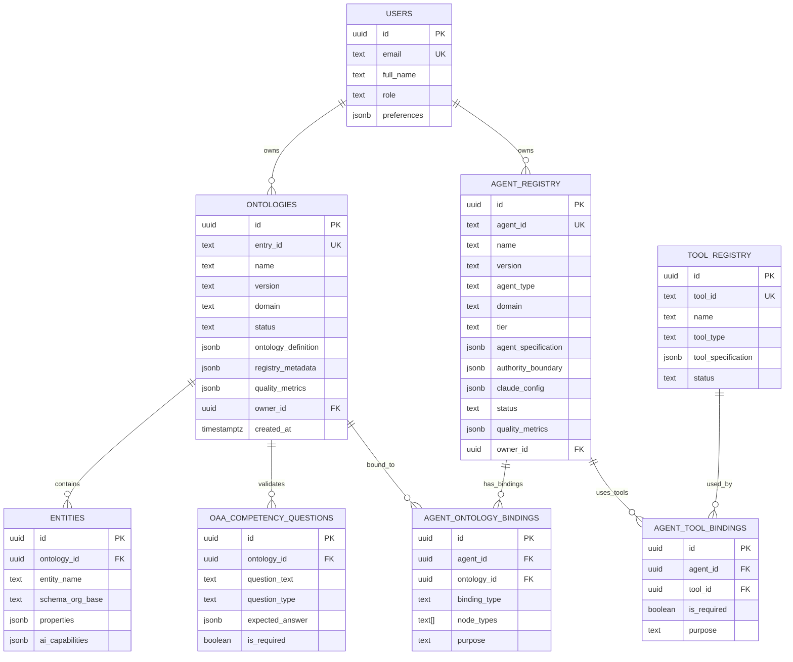

---

## 6. Implementation Timeline

### 6.1 22-Week Roadmap

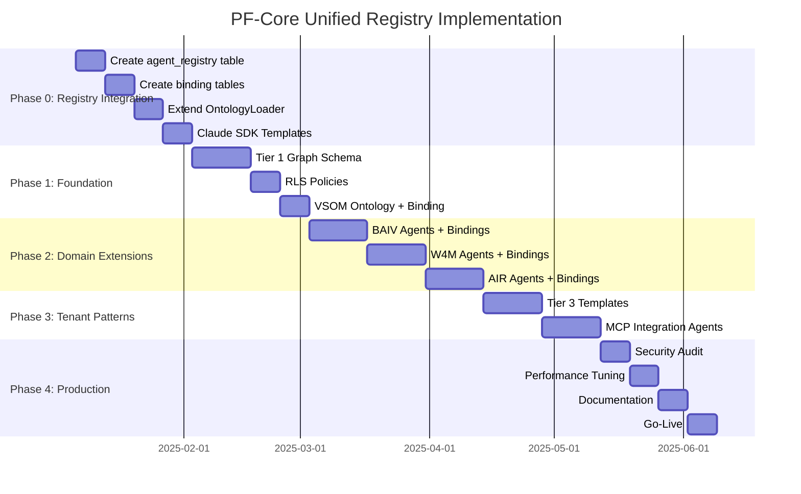

### 6.2 Dependency Graph

```mermaid
flowchart LR
    subgraph P0["Phase 0: Registry"]
        P0A["agent_registry<br/>table"]
        P0B["binding<br/>tables"]
        P0C["UnifiedRegistry<br/>Loader"]
        P0D["Claude SDK<br/>Templates"]
    end
    
    subgraph P1["Phase 1: Foundation"]
        P1A["Tier 1<br/>Schema"]
        P1B["RLS<br/>Policies"]
        P1C["VSOM<br/>Ontology"]
    end
    
    subgraph P2["Phase 2: Domains"]
        P2A["BAIV<br/>Agents"]
        P2B["W4M<br/>Agents"]
        P2C["AIR<br/>Agents"]
    end
    
    subgraph P3["Phase 3: Tenants"]
        P3A["Tier 3<br/>Templates"]
        P3B["MCP<br/>Integration"]
    end
    
    subgraph P4["Phase 4: Production"]
        P4A["Security"]
        P4B["Performance"]
        P4C["Go-Live"]
    end
    
    P0A --> P0B --> P0C --> P0D
    P0D --> P1A --> P1B --> P1C
    P1C --> P2A --> P2B --> P2C
    P2C --> P3A --> P3B
    P3B --> P4A --> P4B --> P4C
    
    style P0 fill:#e3f2fd
    style P1 fill:#e8f5e9
    style P2 fill:#fff3e0
    style P3 fill:#f3e5f5
    style P4 fill:#ffebee
```

---

## 7. Key Integration Points

### 7.1 OntologyLoader → UnifiedRegistryLoader

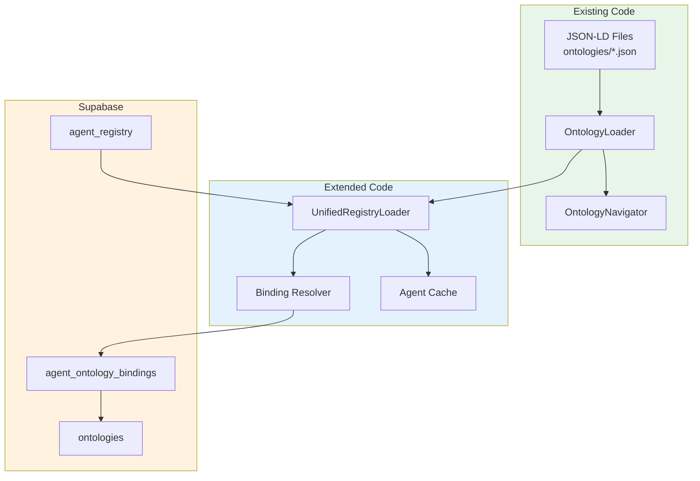

### 7.2 Agent Instantiation

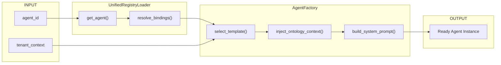

---

*© 2025 Platform Foundation Core Holdings. All rights reserved.*
