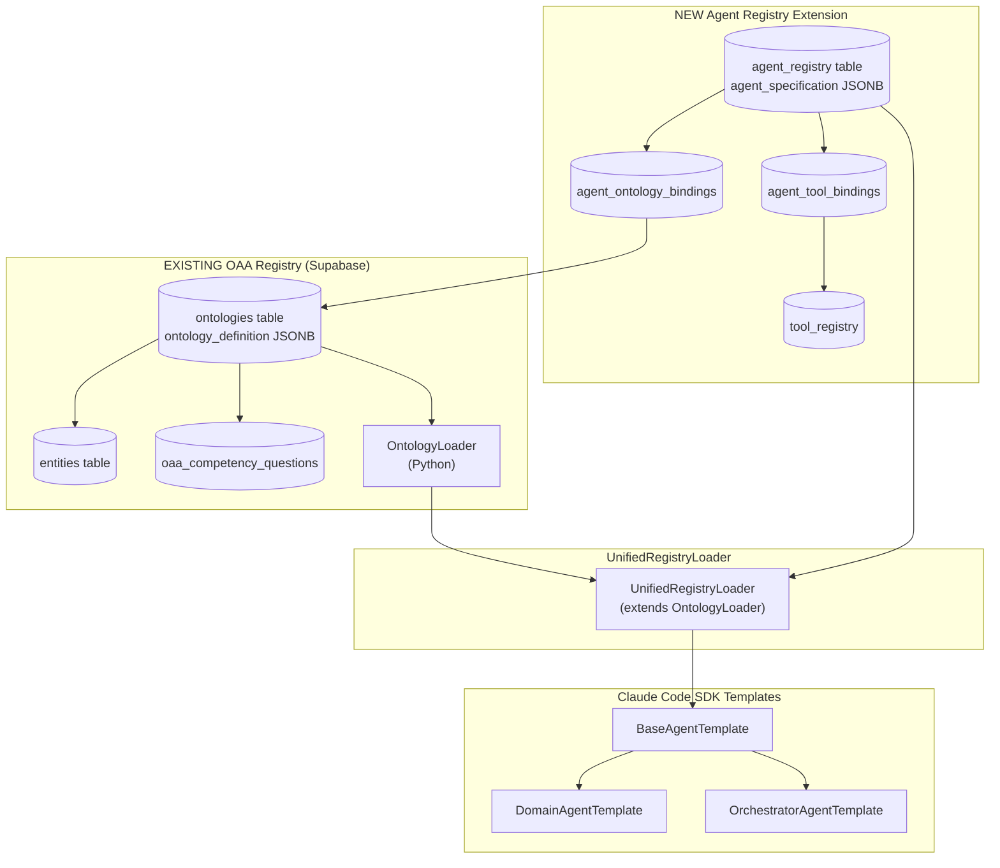
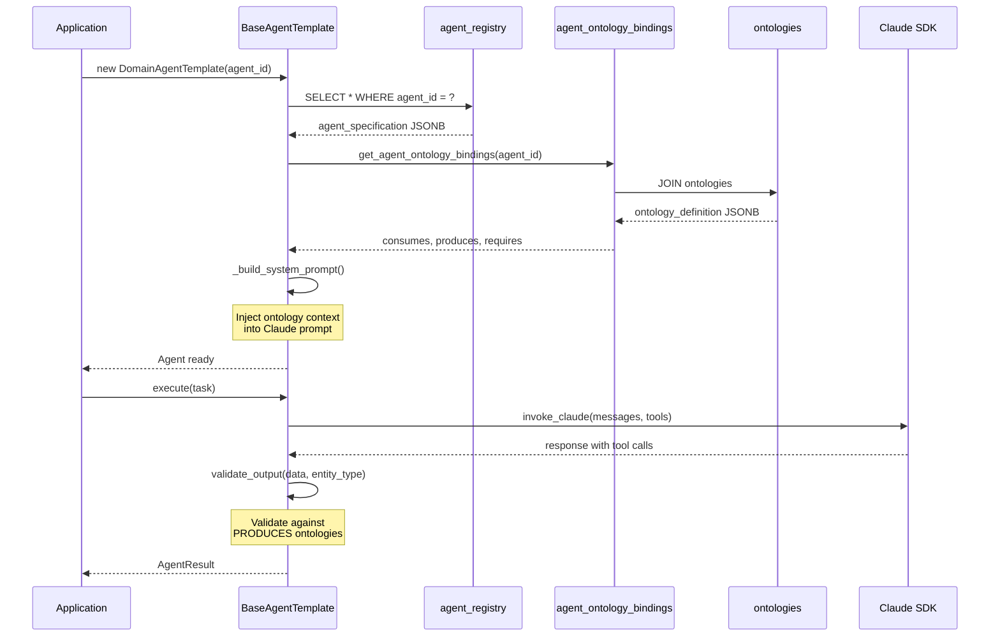
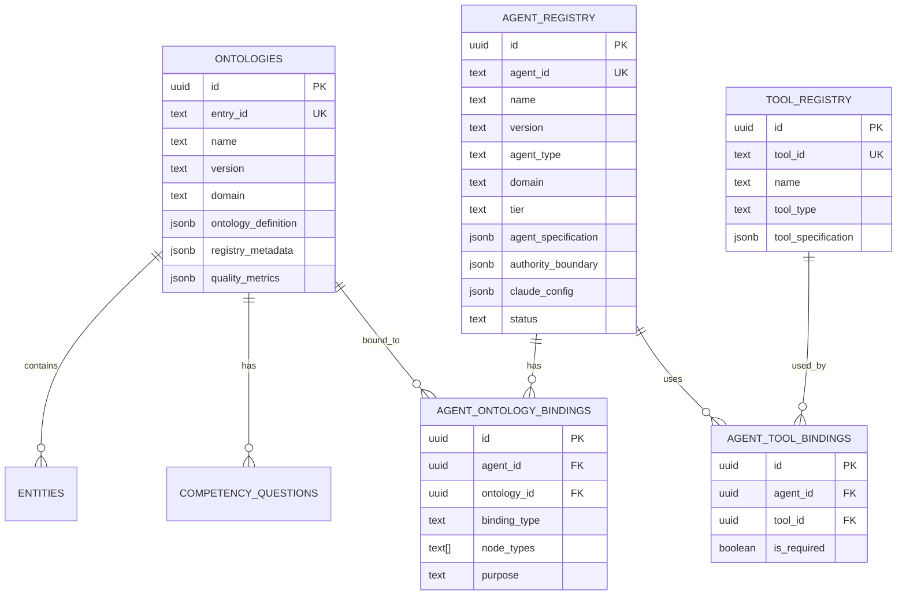

# PF-Core OAA Registry + Agent Integration

**Extending Existing OAA Registry with Agent Specifications & Claude Code SDK**

| Attribute | Value |
|-----------|-------|
| **Document Version** | 2.0.0 |
| **Date** | December 2025 |
| **Classification** | Technical Architecture |
| **Status** | APPROVED |
| **Extends** | Existing OAA Registry (Supabase) |
| **Integrates** | Claude Code SDK, OntologyLoader |

---

## Executive Summary

This document defines how to **extend your existing OAA Registry** (already deployed in Supabase) to include **Agent Specifications** with semantic ontology bindings. The integration enables:

1. **Agents that consume/produce ontologies** - Semantic binding between agents and your existing ontology library
2. **Claude Code SDK templates** - Standardized agent implementation with ontology-aware prompts
3. **Unified governance** - Single registry for ontologies AND agents
4. **Intelligent orchestration** - Platform can reason about agent composition via ontology dependencies

---

## Table of Contents

1. [Existing OAA Registry Structure](#1-existing-oaa-registry-structure)
2. [Agent Registry Extension Schema](#2-agent-registry-extension-schema)
3. [Agent-Ontology Binding](#3-agent-ontology-binding)
4. [Claude Code SDK Templates](#4-claude-code-sdk-templates)
5. [Extended OntologyLoader](#5-extended-ontologyloader)
6. [Implementation Examples](#6-implementation-examples)
7. [Migration SQL](#7-migration-sql)
8. [Mermaid Diagrams](#8-mermaid-diagrams)

---

## 1. Existing OAA Registry Structure

### 1.1 Current Supabase Tables (Already Deployed)

Your existing OAA Registry uses these tables:

```sql
-- EXISTING: ontologies table (main registry)
CREATE TABLE public.ontologies (
    id UUID PRIMARY KEY DEFAULT uuid_generate_v4(),
    entry_id TEXT UNIQUE NOT NULL,           -- Entry-001, Entry-002, etc.
    name TEXT NOT NULL,
    version TEXT NOT NULL DEFAULT '1.0.0',
    domain TEXT NOT NULL,
    status TEXT DEFAULT 'in_development',
    description TEXT,
    
    -- JSONB STORAGE - Complete ontology definition
    ontology_definition JSONB NOT NULL DEFAULT '{}',
    
    -- Registry v3.0 metadata
    registry_metadata JSONB NOT NULL DEFAULT '{}',
    
    -- Quality metrics
    quality_metrics JSONB NOT NULL DEFAULT '{}',
    
    owner_id UUID REFERENCES public.users(id),
    created_at TIMESTAMPTZ DEFAULT NOW(),
    updated_at TIMESTAMPTZ DEFAULT NOW()
);

-- EXISTING: entities table (denormalized for querying)
CREATE TABLE public.entities (
    id UUID PRIMARY KEY DEFAULT uuid_generate_v4(),
    ontology_id UUID REFERENCES public.ontologies(id) ON DELETE CASCADE,
    entity_name TEXT NOT NULL,
    schema_org_base TEXT,
    description TEXT,
    properties JSONB DEFAULT '[]',
    ai_capabilities JSONB DEFAULT '{}'
);

-- EXISTING: competency questions
CREATE TABLE public.oaa_competency_questions (
    id UUID PRIMARY KEY DEFAULT uuid_generate_v4(),
    ontology_id UUID REFERENCES ontologies(id) ON DELETE CASCADE,
    question_text TEXT NOT NULL,
    question_type TEXT,
    expected_answer JSONB NOT NULL,
    is_required BOOLEAN DEFAULT TRUE
);
```

### 1.2 Current OntologyLoader (Python)

Your existing loader in `ontologies/ontology-loader.py`:

```python
class OntologyLoader:
    """Load and validate JSON-LD ontology files"""
    
    def __init__(self, ontologies_dir: str = "ontologies"):
        self.ontologies_dir = Path(ontologies_dir)
        self.loaded_ontologies: Dict[str, Dict] = {}
        self.validation_errors: Dict[str, List[str]] = {}
    
    def load(self, filename: str) -> Optional[Dict]
    def load_all(self) -> Dict[str, Dict]
    def validate_ontology(self, filename: str, data: Dict) -> bool
    def get_ontology(self, filename: str) -> Optional[Dict]
    def get_ontology_by_type(self, ontology_type: str) -> Optional[Dict]

class OntologyNavigator:
    """Query loaded ontologies"""
    
    def get_query_categories(self, platform: Optional[str] = None) -> List[Dict]
    def get_content_formats(self) -> List[Dict]
    def get_discovery_pathways(self) -> Dict
    def get_platform_behavior(self, platform: str) -> Optional[Dict]
```

### 1.3 Current Ontology JSON-LD Structure

Your existing ontologies follow this pattern:

```json
{
  "@context": {
    "@vocab": "https://schema.org/",
    "baiv": "https://baiv.co.uk/ontology/"
  },
  "@type": "Ontology",
  "@id": "baiv:ontology:ai-visibility",
  "name": "AI Visibility Ontology",
  "version": "1.1.0",
  "entities": [
    {
      "@type": "baiv:EntityDefinition",
      "@id": "baiv:QueryCategory",
      "name": "QueryCategory",
      "schemaOrgBase": "schema:Thing",
      "properties": [...]
    }
  ],
  "relationshipMappings": {...}
}
```

---

## 2. Agent Registry Extension Schema

### 2.1 New Tables (Add to Existing Schema)

```sql
-- ============================================================================
-- AGENT REGISTRY EXTENSION
-- Adds agent specifications to existing OAA Registry
-- ============================================================================

-- Agent specifications table
CREATE TABLE public.agent_registry (
    id UUID PRIMARY KEY DEFAULT uuid_generate_v4(),
    
    -- Identity (matches ontology pattern)
    agent_id TEXT UNIQUE NOT NULL,           -- agent-baiv-content-strategy-1.0
    name TEXT NOT NULL,
    version TEXT NOT NULL DEFAULT '1.0.0',
    description TEXT,
    
    -- Classification
    agent_type TEXT NOT NULL CHECK (agent_type IN (
        'orchestrator', 'domain_specialist', 'utility', 'integration'
    )),
    domain TEXT NOT NULL CHECK (domain IN ('pf-core', 'baiv', 'w4m', 'air')),
    tier TEXT NOT NULL CHECK (tier IN ('tier1', 'tier2', 'tier3')),
    
    -- JSONB: Complete agent specification
    agent_specification JSONB NOT NULL DEFAULT '{}',
    -- Structure matches your ontology pattern:
    -- {
    --   "@context": {...},
    --   "@type": "pf:AgentSpecification",
    --   "@id": "pf:agent:...",
    --   "ontologyBindings": {...},
    --   "authorityBoundary": {...},
    --   "claudeConfig": {...}
    -- }
    
    -- Authority boundary (extracted for fast queries)
    authority_boundary JSONB NOT NULL DEFAULT '{}',
    
    -- Claude SDK configuration
    claude_config JSONB NOT NULL DEFAULT '{}',
    
    -- Lifecycle (matches ontology pattern)
    status TEXT DEFAULT 'draft' CHECK (status IN (
        'draft', 'in_development', 'review', 'active', 'deprecated', 'retired'
    )),
    
    -- Quality metrics (matches ontology pattern)
    quality_metrics JSONB DEFAULT '{}',
    
    -- Ownership
    owner_id UUID REFERENCES public.users(id),
    created_at TIMESTAMPTZ DEFAULT NOW(),
    updated_at TIMESTAMPTZ DEFAULT NOW(),
    approved_at TIMESTAMPTZ,
    approved_by UUID REFERENCES public.users(id)
);

-- Agent-Ontology bindings (relationship table)
CREATE TABLE public.agent_ontology_bindings (
    id UUID PRIMARY KEY DEFAULT uuid_generate_v4(),
    
    -- Agent reference
    agent_id UUID NOT NULL REFERENCES agent_registry(id) ON DELETE CASCADE,
    
    -- Ontology reference (links to your existing ontologies table)
    ontology_id UUID NOT NULL REFERENCES ontologies(id) ON DELETE CASCADE,
    
    -- Binding type
    binding_type TEXT NOT NULL CHECK (binding_type IN (
        'consumes',      -- Agent reads from this ontology
        'produces',      -- Agent writes to this ontology
        'requires',      -- Agent needs for context (read-only)
        'validates'      -- Agent validates against this ontology
    )),
    
    -- Which node types from the ontology
    node_types TEXT[] NOT NULL DEFAULT '{}',
    
    -- Purpose description
    purpose TEXT,
    
    -- Version constraint
    version_constraint TEXT,  -- e.g., ">=1.0.0", "~1.1.0"
    
    created_at TIMESTAMPTZ DEFAULT NOW(),
    
    UNIQUE(agent_id, ontology_id, binding_type)
);

-- Tool registry (for MCP and external integrations)
CREATE TABLE public.tool_registry (
    id UUID PRIMARY KEY DEFAULT uuid_generate_v4(),
    
    tool_id TEXT UNIQUE NOT NULL,
    name TEXT NOT NULL,
    version TEXT NOT NULL DEFAULT '1.0.0',
    description TEXT,
    
    -- Tool type
    tool_type TEXT NOT NULL CHECK (tool_type IN (
        'mcp_server', 'api_integration', 'database', 'file_system'
    )),
    
    -- Configuration
    tool_specification JSONB NOT NULL DEFAULT '{}',
    
    -- Status
    status TEXT DEFAULT 'active',
    
    created_at TIMESTAMPTZ DEFAULT NOW(),
    updated_at TIMESTAMPTZ DEFAULT NOW()
);

-- Agent-Tool bindings
CREATE TABLE public.agent_tool_bindings (
    id UUID PRIMARY KEY DEFAULT uuid_generate_v4(),
    
    agent_id UUID NOT NULL REFERENCES agent_registry(id) ON DELETE CASCADE,
    tool_id UUID NOT NULL REFERENCES tool_registry(id) ON DELETE CASCADE,
    
    is_required BOOLEAN DEFAULT TRUE,
    purpose TEXT,
    
    created_at TIMESTAMPTZ DEFAULT NOW(),
    
    UNIQUE(agent_id, tool_id)
);

-- Indexes for performance
CREATE INDEX idx_agent_registry_domain ON agent_registry(domain);
CREATE INDEX idx_agent_registry_type ON agent_registry(agent_type);
CREATE INDEX idx_agent_registry_status ON agent_registry(status);
CREATE INDEX idx_agent_registry_spec ON agent_registry USING GIN(agent_specification);

CREATE INDEX idx_agent_ontology_agent ON agent_ontology_bindings(agent_id);
CREATE INDEX idx_agent_ontology_ontology ON agent_ontology_bindings(ontology_id);
CREATE INDEX idx_agent_ontology_type ON agent_ontology_bindings(binding_type);
```

### 2.2 Agent Specification JSONB Structure

Following your existing ontology JSONB pattern:

```json
{
  "@context": {
    "@vocab": "https://schema.org/",
    "pf": "https://platform-foundation.io/agent/",
    "baiv": "https://baiv.co.uk/ontology/"
  },
  "@type": "pf:AgentSpecification",
  "@id": "pf:agent:baiv-content-strategy-1.0",
  
  "name": "Content Strategy Agent",
  "version": "1.0.0",
  "description": "Generates content recommendations based on gap analysis",
  
  "classification": {
    "agentType": "domain_specialist",
    "domain": "baiv",
    "tier": "tier2",
    "class": 3
  },
  
  "ontologyBindings": {
    "consumes": [
      {
        "@ref": "baiv:ontology:ai-visibility",
        "version": "1.1.0",
        "nodeTypes": ["QueryCategory", "PlatformBehavior", "ContentFormat"],
        "purpose": "Understand AI platform requirements"
      },
      {
        "@ref": "baiv:ontology:gap-analysis",
        "version": "1.1.0",
        "nodeTypes": ["Gap", "ImprovementOpportunity"],
        "purpose": "Read identified gaps"
      }
    ],
    "produces": [
      {
        "@ref": "pf:ontology:content-recommendation",
        "version": "1.0.0",
        "nodeTypes": ["ContentRecommendation", "PriorityScore"],
        "purpose": "Generate recommendations"
      }
    ],
    "requires": [
      {
        "@ref": "pf:ontology:vsom",
        "version": "1.0.0",
        "nodeTypes": ["VisionStatement", "StrategicObjective"],
        "purpose": "Strategic alignment"
      }
    ]
  },
  
  "authorityBoundary": {
    "tier1Access": {
      "read": true,
      "write": false,
      "nodeTypes": ["vsom_vision", "vsom_strategy"]
    },
    "tier2Access": {
      "domains": ["baiv"],
      "read": true,
      "write": true,
      "nodeTypes": ["content_strategy", "gap_analysis"]
    },
    "tier3Access": {
      "tenantScope": "current",
      "read": true,
      "write": true,
      "nodeTypes": ["content_recommendation"]
    },
    "allowedActions": ["graph_read", "graph_write", "edge_create"],
    "prohibitedActions": ["graph_delete", "traverse_up", "export"],
    "limits": {
      "maxNodesPerQuery": 200,
      "maxTraversalDepth": 4,
      "rateLimitPerMinute": 30
    }
  },
  
  "claudeConfig": {
    "model": "claude-sonnet-4-20250514",
    "maxTokens": 4096,
    "temperature": 0.7,
    "tools": [
      "read_strategic_context",
      "read_domain_graph",
      "write_tenant_node",
      "analyze_gaps"
    ]
  },
  
  "implementation": {
    "templateBase": "domain-agent.template.py",
    "className": "ContentStrategyAgent"
  }
}
```

---

## 3. Agent-Ontology Binding

### 3.1 Binding Resolution Flow

```
┌─────────────────────────────────────────────────────────────────────────────┐
│                    AGENT-ONTOLOGY BINDING RESOLUTION                         │
├─────────────────────────────────────────────────────────────────────────────┤
│                                                                             │
│  1. LOAD AGENT FROM agent_registry                                          │
│     ┌──────────────────────────────────────────────┐                       │
│     │  SELECT * FROM agent_registry                │                       │
│     │  WHERE agent_id = 'agent-baiv-content-1.0'   │                       │
│     └──────────────────────────────────────────────┘                       │
│                              │                                              │
│                              ▼                                              │
│  2. RESOLVE ONTOLOGY BINDINGS                                               │
│     ┌──────────────────────────────────────────────┐                       │
│     │  SELECT o.*, aob.binding_type, aob.node_types│                       │
│     │  FROM agent_ontology_bindings aob            │                       │
│     │  JOIN ontologies o ON o.id = aob.ontology_id │                       │
│     │  WHERE aob.agent_id = agent.id               │                       │
│     └──────────────────────────────────────────────┘                       │
│                              │                                              │
│                              ▼                                              │
│  3. EXTRACT ENTITY DEFINITIONS                                              │
│     ┌──────────────────────────────────────────────┐                       │
│     │  For each bound ontology:                    │                       │
│     │    - Extract entities matching node_types    │                       │
│     │    - Extract properties and constraints      │                       │
│     │    - Build validation rules                  │                       │
│     └──────────────────────────────────────────────┘                       │
│                              │                                              │
│                              ▼                                              │
│  4. INJECT INTO CLAUDE SYSTEM PROMPT                                        │
│     ┌──────────────────────────────────────────────┐                       │
│     │  Build ontology-aware prompt with:           │                       │
│     │    - CONSUMES: entities agent can read       │                       │
│     │    - PRODUCES: entities agent must validate  │                       │
│     │    - REQUIRES: strategic context             │                       │
│     └──────────────────────────────────────────────┘                       │
│                                                                             │
└─────────────────────────────────────────────────────────────────────────────┘
```

### 3.2 Binding Query Functions

```sql
-- Get all ontology bindings for an agent
CREATE OR REPLACE FUNCTION get_agent_ontology_bindings(p_agent_id TEXT)
RETURNS TABLE (
    binding_type TEXT,
    ontology_id UUID,
    ontology_name TEXT,
    ontology_version TEXT,
    node_types TEXT[],
    ontology_definition JSONB
) AS $$
BEGIN
    RETURN QUERY
    SELECT 
        aob.binding_type,
        o.id,
        o.name,
        o.version,
        aob.node_types,
        o.ontology_definition
    FROM agent_ontology_bindings aob
    JOIN agent_registry ar ON ar.id = aob.agent_id
    JOIN ontologies o ON o.id = aob.ontology_id
    WHERE ar.agent_id = p_agent_id
    ORDER BY 
        CASE aob.binding_type
            WHEN 'requires' THEN 1
            WHEN 'consumes' THEN 2
            WHEN 'produces' THEN 3
            WHEN 'validates' THEN 4
        END;
END;
$$ LANGUAGE plpgsql;

-- Find agents that can produce a specific ontology
CREATE OR REPLACE FUNCTION find_producing_agents(p_ontology_id UUID)
RETURNS TABLE (
    agent_id TEXT,
    agent_name TEXT,
    agent_domain TEXT,
    node_types TEXT[]
) AS $$
BEGIN
    RETURN QUERY
    SELECT 
        ar.agent_id,
        ar.name,
        ar.domain,
        aob.node_types
    FROM agent_ontology_bindings aob
    JOIN agent_registry ar ON ar.id = aob.agent_id
    WHERE aob.ontology_id = p_ontology_id
    AND aob.binding_type = 'produces'
    AND ar.status = 'active';
END;
$$ LANGUAGE plpgsql;

-- Get agent dependency chain
CREATE OR REPLACE FUNCTION get_agent_dependency_chain(p_agent_id TEXT)
RETURNS TABLE (
    level INT,
    agent_id TEXT,
    produces_ontology TEXT,
    consumed_by TEXT
) AS $$
WITH RECURSIVE chain AS (
    -- Base: agent's consumed ontologies
    SELECT 
        1 as level,
        ar.agent_id,
        o.name as produces_ontology,
        p_agent_id as consumed_by
    FROM agent_ontology_bindings aob
    JOIN agent_registry ar ON ar.id = aob.agent_id
    JOIN ontologies o ON o.id = aob.ontology_id
    WHERE aob.binding_type = 'produces'
    AND aob.ontology_id IN (
        SELECT ontology_id 
        FROM agent_ontology_bindings aob2
        JOIN agent_registry ar2 ON ar2.id = aob2.agent_id
        WHERE ar2.agent_id = p_agent_id
        AND aob2.binding_type = 'consumes'
    )
    
    UNION ALL
    
    -- Recursive: dependencies of dependencies
    SELECT 
        c.level + 1,
        ar.agent_id,
        o.name,
        c.agent_id
    FROM chain c
    JOIN agent_ontology_bindings aob ON aob.binding_type = 'produces'
    JOIN agent_registry ar ON ar.id = aob.agent_id
    JOIN ontologies o ON o.id = aob.ontology_id
    WHERE aob.ontology_id IN (
        SELECT ontology_id 
        FROM agent_ontology_bindings aob2
        JOIN agent_registry ar2 ON ar2.id = aob2.agent_id
        WHERE ar2.agent_id = c.agent_id
        AND aob2.binding_type = 'consumes'
    )
    AND c.level < 10  -- Prevent infinite recursion
)
SELECT * FROM chain ORDER BY level;
$$ LANGUAGE sql;
```

---

## 4. Claude Code SDK Templates

### 4.1 Base Agent Template

```python
"""
BASE AGENT TEMPLATE
===================
Integrates with existing OAA Registry + new Agent Registry
Uses Supabase for ontology resolution
"""

from abc import ABC, abstractmethod
from dataclasses import dataclass, field
from typing import List, Dict, Any, Optional
from datetime import datetime
from uuid import UUID
from anthropic import Anthropic
from supabase import create_client, Client

# Supabase client
supabase: Client = create_client(
    os.environ.get("SUPABASE_URL"),
    os.environ.get("SUPABASE_KEY")
)


@dataclass
class TenantContext:
    """Tenant context for RLS enforcement"""
    tenant_id: UUID
    venture_domain: str
    user_id: Optional[UUID] = None
    user_role: str = 'user'


@dataclass
class OntologyBinding:
    """Resolved ontology binding"""
    binding_type: str  # consumes, produces, requires
    ontology_id: UUID
    ontology_name: str
    ontology_version: str
    node_types: List[str]
    entities: Dict[str, Any]  # Entity definitions
    validation_rules: Dict[str, Any]


@dataclass
class AgentSpecification:
    """Complete agent specification from registry"""
    agent_id: str
    name: str
    version: str
    domain: str
    agent_type: str
    authority_boundary: Dict
    claude_config: Dict
    ontology_bindings: Dict[str, List[OntologyBinding]]


class BaseAgentTemplate(ABC):
    """
    Base template for all PF-Core agents.
    Integrates with:
    - Existing OAA Registry (ontologies table)
    - New Agent Registry (agent_registry table)
    - Claude Code SDK
    """
    
    def __init__(self, agent_id: str, tenant_context: TenantContext):
        self.agent_id = agent_id
        self.tenant_context = tenant_context
        
        # Load agent specification from registry
        self.spec = self._load_agent_specification()
        
        # Resolve ontology bindings
        self.ontology_bindings = self._resolve_ontology_bindings()
        
        # Build ontology-aware system prompt
        self.system_prompt = self._build_system_prompt()
        
        # Initialize Claude client
        self.claude = Anthropic()
    
    def _load_agent_specification(self) -> AgentSpecification:
        """Load agent spec from agent_registry table"""
        result = supabase.table('agent_registry').select('*').eq(
            'agent_id', self.agent_id
        ).single().execute()
        
        if not result.data:
            raise ValueError(f"Agent not found: {self.agent_id}")
        
        data = result.data
        return AgentSpecification(
            agent_id=data['agent_id'],
            name=data['name'],
            version=data['version'],
            domain=data['domain'],
            agent_type=data['agent_type'],
            authority_boundary=data['authority_boundary'],
            claude_config=data['claude_config'],
            ontology_bindings={}  # Resolved separately
        )
    
    def _resolve_ontology_bindings(self) -> Dict[str, List[OntologyBinding]]:
        """Resolve ontology bindings from existing ontologies table"""
        
        # Call the database function
        result = supabase.rpc(
            'get_agent_ontology_bindings',
            {'p_agent_id': self.agent_id}
        ).execute()
        
        bindings = {
            'consumes': [],
            'produces': [],
            'requires': [],
            'validates': []
        }
        
        for row in result.data:
            # Extract entities for requested node types
            ontology_def = row['ontology_definition']
            entities = {}
            validation_rules = {}
            
            for entity in ontology_def.get('entities', []):
                entity_name = entity.get('name', '')
                if entity_name in row['node_types'] or not row['node_types']:
                    entities[entity_name] = entity
                    
                    # Build validation rules from properties
                    for prop in entity.get('properties', []):
                        if prop.get('constraints'):
                            rule_key = f"{entity_name}.{prop['name']}"
                            validation_rules[rule_key] = prop['constraints']
            
            binding = OntologyBinding(
                binding_type=row['binding_type'],
                ontology_id=row['ontology_id'],
                ontology_name=row['ontology_name'],
                ontology_version=row['ontology_version'],
                node_types=row['node_types'],
                entities=entities,
                validation_rules=validation_rules
            )
            
            bindings[row['binding_type']].append(binding)
        
        return bindings
    
    def _build_system_prompt(self) -> str:
        """Build ontology-aware system prompt for Claude"""
        
        auth = self.spec.authority_boundary
        
        return f"""
You are {self.spec.name} (v{self.spec.version}), a specialized agent in the PF-Core platform.

## Agent Classification
- Type: {self.spec.agent_type}
- Domain: {self.spec.domain}
- Agent ID: {self.spec.agent_id}

## Ontologies You Work With

### CONSUMES (you can read these):
{self._format_bindings('consumes')}

### PRODUCES (you must validate outputs against these):
{self._format_bindings('produces')}

### REQUIRES (strategic context):
{self._format_bindings('requires')}

## Authority Boundaries
- Tier 1 (Strategic): Read={auth.get('tier1Access', {}).get('read', False)}, Write={auth.get('tier1Access', {}).get('write', False)}
- Tier 2 (Domain): Domains={auth.get('tier2Access', {}).get('domains', [])}, Read={auth.get('tier2Access', {}).get('read', False)}, Write={auth.get('tier2Access', {}).get('write', False)}
- Tier 3 (Tenant): Scope={auth.get('tier3Access', {}).get('tenantScope', 'none')}

## Allowed Actions
{', '.join(auth.get('allowedActions', []))}

## PROHIBITED Actions (NEVER do these)
{', '.join(auth.get('prohibitedActions', []))}

## Operational Rules
1. ALWAYS validate outputs against PRODUCES ontology schemas
2. NEVER exceed authority boundaries
3. ALWAYS include tenant context in Tier 3 operations
4. Return data matching ontology entity definitions
"""
    
    def _format_bindings(self, binding_type: str) -> str:
        """Format ontology bindings for system prompt"""
        bindings = self.ontology_bindings.get(binding_type, [])
        
        if not bindings:
            return "None"
        
        sections = []
        for binding in bindings:
            entity_list = []
            for name, entity in binding.entities.items():
                props = [p.get('name', '') for p in entity.get('properties', [])[:5]]
                entity_list.append(f"  - {name}: [{', '.join(props)}]")
            
            sections.append(f"""
**{binding.ontology_name}** (v{binding.ontology_version})
Node Types: {', '.join(binding.node_types)}
Entities:
{chr(10).join(entity_list)}
""")
        
        return "\n".join(sections)
    
    # ========================================================================
    # ONTOLOGY VALIDATION
    # ========================================================================
    
    def validate_output(
        self, 
        data: Dict[str, Any], 
        entity_type: str
    ) -> tuple[bool, List[str]]:
        """Validate agent output against PRODUCES ontologies"""
        errors = []
        
        # Find the entity in produces bindings
        entity_def = None
        for binding in self.ontology_bindings.get('produces', []):
            if entity_type in binding.entities:
                entity_def = binding.entities[entity_type]
                validation_rules = binding.validation_rules
                break
        
        if not entity_def:
            return False, [f"Unknown entity type: {entity_type}"]
        
        # Check required fields
        for prop in entity_def.get('properties', []):
            if prop.get('required') and prop['name'] not in data:
                errors.append(f"Missing required field: {prop['name']}")
        
        # Apply validation rules
        for rule_key, rule in validation_rules.items():
            if rule_key.startswith(f"{entity_type}."):
                field_name = rule_key.split('.')[1]
                if field_name in data:
                    value = data[field_name]
                    
                    if 'enum' in rule and value not in rule['enum']:
                        errors.append(f"{field_name} must be one of: {rule['enum']}")
                    
                    if 'minimum' in rule and value < rule['minimum']:
                        errors.append(f"{field_name} must be >= {rule['minimum']}")
                    
                    if 'maximum' in rule and value > rule['maximum']:
                        errors.append(f"{field_name} must be <= {rule['maximum']}")
        
        return len(errors) == 0, errors
    
    # ========================================================================
    # AUTHORITY ENFORCEMENT
    # ========================================================================
    
    def check_authority(
        self, 
        action: str, 
        tier: str, 
        node_types: List[str] = None
    ) -> bool:
        """Check if action is permitted"""
        auth = self.spec.authority_boundary
        
        if action in auth.get('prohibitedActions', []):
            return False
        
        if action not in auth.get('allowedActions', []):
            return False
        
        tier_key = f'{tier}Access'
        tier_access = auth.get(tier_key, {})
        
        if 'read' in action and not tier_access.get('read', False):
            return False
        if 'write' in action and not tier_access.get('write', False):
            return False
        
        if node_types:
            allowed_types = set(tier_access.get('nodeTypes', []))
            if '*' not in allowed_types and not set(node_types).issubset(allowed_types):
                return False
        
        return True
    
    # ========================================================================
    # CLAUDE INTEGRATION
    # ========================================================================
    
    async def invoke_claude(
        self,
        messages: List[Dict],
        tools: List[Dict] = None
    ) -> Dict[str, Any]:
        """Invoke Claude with ontology-aware context"""
        
        config = self.spec.claude_config
        
        response = self.claude.messages.create(
            model=config.get('model', 'claude-sonnet-4-20250514'),
            max_tokens=config.get('maxTokens', 4096),
            temperature=config.get('temperature', 0.7),
            system=self.system_prompt,
            messages=messages,
            tools=tools
        )
        
        return {
            "content": response.content,
            "usage": {
                "input_tokens": response.usage.input_tokens,
                "output_tokens": response.usage.output_tokens
            }
        }
    
    # ========================================================================
    # ABSTRACT METHODS
    # ========================================================================
    
    @abstractmethod
    async def execute(self, **kwargs) -> Dict[str, Any]:
        """Execute agent's primary function"""
        pass
```

### 4.2 Domain Agent Template

```python
"""
DOMAIN AGENT TEMPLATE
=====================
Extends BaseAgentTemplate for venture-specific agents
"""

from base_agent_template import BaseAgentTemplate, TenantContext
from typing import List, Dict, Any

class DomainAgentTemplate(BaseAgentTemplate):
    """
    Template for domain-specific agents (BAIV, W4M, AIR).
    Adds domain-specific tool handling.
    """
    
    def __init__(self, agent_id: str, tenant_context: TenantContext):
        super().__init__(agent_id, tenant_context)
        self.tools = self._build_tools()
    
    def _build_tools(self) -> List[Dict]:
        """Build Claude tools from agent specification"""
        tools = [
            {
                "name": "read_strategic_context",
                "description": "Read VSOM strategic context from Tier 1",
                "input_schema": {
                    "type": "object",
                    "properties": {
                        "context_types": {
                            "type": "array",
                            "items": {"type": "string"}
                        }
                    }
                }
            },
            {
                "name": "read_domain_graph",
                "description": f"Read from {self.spec.domain} Tier 2 domain graph",
                "input_schema": {
                    "type": "object",
                    "properties": {
                        "node_types": {
                            "type": "array",
                            "items": {"type": "string"}
                        }
                    },
                    "required": ["node_types"]
                }
            },
            {
                "name": "write_tenant_node",
                "description": "Write validated node to Tier 3 tenant graph",
                "input_schema": {
                    "type": "object",
                    "properties": {
                        "node_type": {"type": "string"},
                        "properties": {"type": "object"},
                        "entity_type": {"type": "string"}
                    },
                    "required": ["node_type", "properties", "entity_type"]
                }
            }
        ]
        
        return tools
    
    async def handle_tool_call(
        self,
        tool_name: str,
        tool_input: Dict[str, Any]
    ) -> Any:
        """Handle Claude tool calls with authority checking"""
        
        if tool_name == "read_strategic_context":
            if not self.check_authority('graph_read', 'tier1'):
                raise PermissionError("No Tier 1 read access")
            return await self._read_tier1(tool_input.get('context_types', []))
        
        elif tool_name == "read_domain_graph":
            if not self.check_authority('graph_read', 'tier2'):
                raise PermissionError("No Tier 2 read access")
            return await self._read_tier2(tool_input['node_types'])
        
        elif tool_name == "write_tenant_node":
            if not self.check_authority('graph_write', 'tier3'):
                raise PermissionError("No Tier 3 write access")
            
            # Validate against PRODUCES ontology
            valid, errors = self.validate_output(
                tool_input['properties'],
                tool_input['entity_type']
            )
            
            if not valid:
                raise ValueError(f"Ontology validation failed: {errors}")
            
            return await self._write_tier3(
                tool_input['node_type'],
                tool_input['properties']
            )
    
    async def _read_tier1(self, context_types: List[str]) -> List[Dict]:
        """Read from Tier 1 strategic graph"""
        result = supabase.table('pf_graph_nodes').select('*').eq(
            'tier', 'tier1'
        ).in_('node_type', context_types).execute()
        return result.data
    
    async def _read_tier2(self, node_types: List[str]) -> List[Dict]:
        """Read from Tier 2 domain graph"""
        result = supabase.table('pf_graph_nodes').select('*').eq(
            'tier', 'tier2'
        ).eq('domain', self.spec.domain).in_(
            'node_type', node_types
        ).execute()
        return result.data
    
    async def _write_tier3(
        self, 
        node_type: str, 
        properties: Dict
    ) -> Dict:
        """Write to Tier 3 tenant graph"""
        node = {
            'tier': 'tier3',
            'domain': self.spec.domain,
            'tenant_id': str(self.tenant_context.tenant_id),
            'node_type': node_type,
            'properties': properties,
            'created_by': self.agent_id,
            'created_at': datetime.utcnow().isoformat()
        }
        
        result = supabase.table('pf_graph_nodes').insert(node).execute()
        return result.data[0]
```

---

## 5. Extended OntologyLoader

### 5.1 UnifiedRegistryLoader

Extends your existing `OntologyLoader` to include agents:

```python
"""
UNIFIED REGISTRY LOADER
=======================
Extends existing OntologyLoader with Agent Registry support
"""

from pathlib import Path
from typing import Dict, List, Optional, Any
import json
from supabase import create_client, Client

# Import your existing loader
from ontologies.ontology_loader import OntologyLoader, OntologyNavigator


class UnifiedRegistryLoader:
    """
    Unified loader for ontologies AND agents.
    Extends existing OntologyLoader functionality.
    """
    
    def __init__(
        self, 
        ontologies_dir: str = "ontologies",
        supabase_url: str = None,
        supabase_key: str = None
    ):
        # Initialize existing ontology loader
        self.ontology_loader = OntologyLoader(ontologies_dir)
        self.ontology_navigator = OntologyNavigator(self.ontology_loader)
        
        # Initialize Supabase client for agent registry
        self.supabase: Client = create_client(
            supabase_url or os.environ.get("SUPABASE_URL"),
            supabase_key or os.environ.get("SUPABASE_KEY")
        )
        
        # Caches
        self.agents: Dict[str, Dict] = {}
        self.agent_bindings: Dict[str, List[Dict]] = {}
    
    def load_all(self) -> Dict[str, Any]:
        """Load all ontologies and agents"""
        return {
            'ontologies': self.ontology_loader.load_all(),
            'agents': self._load_agents_from_db()
        }
    
    def _load_agents_from_db(self) -> Dict[str, Dict]:
        """Load agent specifications from Supabase"""
        result = self.supabase.table('agent_registry').select('*').eq(
            'status', 'active'
        ).execute()
        
        for agent in result.data:
            self.agents[agent['agent_id']] = agent
            print(f"✅ Loaded agent: {agent['agent_id']}")
        
        return self.agents
    
    def get_agent(self, agent_id: str) -> Optional[Dict]:
        """Get agent specification by ID"""
        if agent_id in self.agents:
            return self.agents[agent_id]
        
        # Try loading from database
        result = self.supabase.table('agent_registry').select('*').eq(
            'agent_id', agent_id
        ).single().execute()
        
        if result.data:
            self.agents[agent_id] = result.data
            return result.data
        
        return None
    
    def get_agent_ontology_bindings(
        self, 
        agent_id: str
    ) -> Dict[str, List[Dict]]:
        """Get ontology bindings for an agent"""
        if agent_id in self.agent_bindings:
            return self.agent_bindings[agent_id]
        
        # Call database function
        result = self.supabase.rpc(
            'get_agent_ontology_bindings',
            {'p_agent_id': agent_id}
        ).execute()
        
        bindings = {
            'consumes': [],
            'produces': [],
            'requires': [],
            'validates': []
        }
        
        for row in result.data:
            bindings[row['binding_type']].append(row)
        
        self.agent_bindings[agent_id] = bindings
        return bindings
    
    def find_agents_for_ontology(
        self, 
        ontology_name: str, 
        binding_type: str = 'produces'
    ) -> List[str]:
        """Find agents that produce/consume a specific ontology"""
        result = self.supabase.table('agent_ontology_bindings').select(
            'agent_id, agent_registry!inner(agent_id, name, status)'
        ).eq('binding_type', binding_type).execute()
        
        agents = []
        for row in result.data:
            # Check if ontology name matches
            if ontology_name.lower() in row.get('ontology_name', '').lower():
                agents.append(row['agent_registry']['agent_id'])
        
        return agents
    
    def get_orchestration_plan(
        self, 
        target_ontology: str
    ) -> List[Dict]:
        """
        Get orchestration plan to produce a target ontology.
        Returns ordered list of agents to execute.
        """
        result = self.supabase.rpc(
            'get_agent_dependency_chain',
            {'p_agent_id': self.find_agents_for_ontology(target_ontology, 'produces')[0]}
        ).execute()
        
        return result.data
```

---

## 6. Implementation Examples

### 6.1 Creating an Agent in the Registry

```python
# Example: Register the Content Strategy Agent

agent_spec = {
    "agent_id": "agent-baiv-content-strategy-1.0",
    "name": "Content Strategy Agent",
    "version": "1.0.0",
    "description": "Generates content recommendations based on gap analysis",
    "agent_type": "domain_specialist",
    "domain": "baiv",
    "tier": "tier2",
    
    "agent_specification": {
        "@context": {
            "@vocab": "https://schema.org/",
            "pf": "https://platform-foundation.io/agent/"
        },
        "@type": "pf:AgentSpecification",
        "@id": "pf:agent:baiv-content-strategy-1.0",
        # ... full spec as shown above
    },
    
    "authority_boundary": {
        "tier1Access": {"read": True, "write": False},
        "tier2Access": {"domains": ["baiv"], "read": True, "write": True},
        "tier3Access": {"tenantScope": "current", "read": True, "write": True},
        "allowedActions": ["graph_read", "graph_write", "edge_create"],
        "prohibitedActions": ["graph_delete", "traverse_up"]
    },
    
    "claude_config": {
        "model": "claude-sonnet-4-20250514",
        "maxTokens": 4096,
        "temperature": 0.7
    },
    
    "status": "active"
}

# Insert into registry
supabase.table('agent_registry').insert(agent_spec).execute()

# Create ontology bindings
bindings = [
    {
        "agent_id": agent_result.data[0]['id'],
        "ontology_id": "uuid-of-ai-visibility-ontology",
        "binding_type": "consumes",
        "node_types": ["QueryCategory", "PlatformBehavior"],
        "purpose": "Understand AI platform requirements"
    },
    {
        "agent_id": agent_result.data[0]['id'],
        "ontology_id": "uuid-of-gap-analysis-ontology",
        "binding_type": "consumes",
        "node_types": ["Gap", "ImprovementOpportunity"],
        "purpose": "Read identified gaps"
    },
    {
        "agent_id": agent_result.data[0]['id'],
        "ontology_id": "uuid-of-content-recommendation-ontology",
        "binding_type": "produces",
        "node_types": ["ContentRecommendation", "PriorityScore"],
        "purpose": "Generate recommendations"
    }
]

supabase.table('agent_ontology_bindings').insert(bindings).execute()
```

### 6.2 Using an Agent

```python
from templates.domain_agent_template import DomainAgentTemplate
from templates.base_agent_template import TenantContext
from uuid import UUID

# Create tenant context
tenant_context = TenantContext(
    tenant_id=UUID("tenant-uuid-here"),
    venture_domain="baiv",
    user_id=UUID("user-uuid-here"),
    user_role="analyst"
)

# Instantiate agent (automatically loads from registry)
agent = DomainAgentTemplate(
    agent_id="agent-baiv-content-strategy-1.0",
    tenant_context=tenant_context
)

# Execute with Claude reasoning
result = await agent.execute(
    task="Generate content recommendations for the identified gaps",
    context={"gap_ids": ["GAP-001", "GAP-002"]}
)

print(result)
```

---

## 7. Migration SQL

### Complete Migration Script

```sql
-- ============================================================================
-- AGENT REGISTRY MIGRATION
-- Run this AFTER your existing OAA Registry tables exist
-- ============================================================================

-- 1. Create agent_registry table
CREATE TABLE IF NOT EXISTS public.agent_registry (
    id UUID PRIMARY KEY DEFAULT uuid_generate_v4(),
    agent_id TEXT UNIQUE NOT NULL,
    name TEXT NOT NULL,
    version TEXT NOT NULL DEFAULT '1.0.0',
    description TEXT,
    agent_type TEXT NOT NULL CHECK (agent_type IN (
        'orchestrator', 'domain_specialist', 'utility', 'integration'
    )),
    domain TEXT NOT NULL CHECK (domain IN ('pf-core', 'baiv', 'w4m', 'air')),
    tier TEXT NOT NULL CHECK (tier IN ('tier1', 'tier2', 'tier3')),
    agent_specification JSONB NOT NULL DEFAULT '{}',
    authority_boundary JSONB NOT NULL DEFAULT '{}',
    claude_config JSONB NOT NULL DEFAULT '{}',
    status TEXT DEFAULT 'draft' CHECK (status IN (
        'draft', 'in_development', 'review', 'active', 'deprecated', 'retired'
    )),
    quality_metrics JSONB DEFAULT '{}',
    owner_id UUID REFERENCES public.users(id),
    created_at TIMESTAMPTZ DEFAULT NOW(),
    updated_at TIMESTAMPTZ DEFAULT NOW(),
    approved_at TIMESTAMPTZ,
    approved_by UUID REFERENCES public.users(id)
);

-- 2. Create agent_ontology_bindings table
CREATE TABLE IF NOT EXISTS public.agent_ontology_bindings (
    id UUID PRIMARY KEY DEFAULT uuid_generate_v4(),
    agent_id UUID NOT NULL REFERENCES agent_registry(id) ON DELETE CASCADE,
    ontology_id UUID NOT NULL REFERENCES ontologies(id) ON DELETE CASCADE,
    binding_type TEXT NOT NULL CHECK (binding_type IN (
        'consumes', 'produces', 'requires', 'validates'
    )),
    node_types TEXT[] NOT NULL DEFAULT '{}',
    purpose TEXT,
    version_constraint TEXT,
    created_at TIMESTAMPTZ DEFAULT NOW(),
    UNIQUE(agent_id, ontology_id, binding_type)
);

-- 3. Create tool_registry table
CREATE TABLE IF NOT EXISTS public.tool_registry (
    id UUID PRIMARY KEY DEFAULT uuid_generate_v4(),
    tool_id TEXT UNIQUE NOT NULL,
    name TEXT NOT NULL,
    version TEXT NOT NULL DEFAULT '1.0.0',
    description TEXT,
    tool_type TEXT NOT NULL CHECK (tool_type IN (
        'mcp_server', 'api_integration', 'database', 'file_system'
    )),
    tool_specification JSONB NOT NULL DEFAULT '{}',
    status TEXT DEFAULT 'active',
    created_at TIMESTAMPTZ DEFAULT NOW(),
    updated_at TIMESTAMPTZ DEFAULT NOW()
);

-- 4. Create agent_tool_bindings table
CREATE TABLE IF NOT EXISTS public.agent_tool_bindings (
    id UUID PRIMARY KEY DEFAULT uuid_generate_v4(),
    agent_id UUID NOT NULL REFERENCES agent_registry(id) ON DELETE CASCADE,
    tool_id UUID NOT NULL REFERENCES tool_registry(id) ON DELETE CASCADE,
    is_required BOOLEAN DEFAULT TRUE,
    purpose TEXT,
    created_at TIMESTAMPTZ DEFAULT NOW(),
    UNIQUE(agent_id, tool_id)
);

-- 5. Create indexes
CREATE INDEX IF NOT EXISTS idx_agent_registry_domain ON agent_registry(domain);
CREATE INDEX IF NOT EXISTS idx_agent_registry_type ON agent_registry(agent_type);
CREATE INDEX IF NOT EXISTS idx_agent_registry_status ON agent_registry(status);
CREATE INDEX IF NOT EXISTS idx_agent_registry_spec ON agent_registry USING GIN(agent_specification);

CREATE INDEX IF NOT EXISTS idx_agent_ontology_agent ON agent_ontology_bindings(agent_id);
CREATE INDEX IF NOT EXISTS idx_agent_ontology_ontology ON agent_ontology_bindings(ontology_id);
CREATE INDEX IF NOT EXISTS idx_agent_ontology_type ON agent_ontology_bindings(binding_type);

-- 6. Create helper functions
CREATE OR REPLACE FUNCTION get_agent_ontology_bindings(p_agent_id TEXT)
RETURNS TABLE (
    binding_type TEXT,
    ontology_id UUID,
    ontology_name TEXT,
    ontology_version TEXT,
    node_types TEXT[],
    ontology_definition JSONB
) AS $$
BEGIN
    RETURN QUERY
    SELECT 
        aob.binding_type,
        o.id,
        o.name,
        o.version,
        aob.node_types,
        o.ontology_definition
    FROM agent_ontology_bindings aob
    JOIN agent_registry ar ON ar.id = aob.agent_id
    JOIN ontologies o ON o.id = aob.ontology_id
    WHERE ar.agent_id = p_agent_id
    ORDER BY 
        CASE aob.binding_type
            WHEN 'requires' THEN 1
            WHEN 'consumes' THEN 2
            WHEN 'produces' THEN 3
            WHEN 'validates' THEN 4
        END;
END;
$$ LANGUAGE plpgsql;

-- 7. Enable RLS
ALTER TABLE agent_registry ENABLE ROW LEVEL SECURITY;
ALTER TABLE agent_ontology_bindings ENABLE ROW LEVEL SECURITY;
ALTER TABLE tool_registry ENABLE ROW LEVEL SECURITY;

-- RLS policies (allow authenticated users to read)
CREATE POLICY "Authenticated users can read agents" ON agent_registry
    FOR SELECT USING (auth.role() = 'authenticated');

CREATE POLICY "Authenticated users can read bindings" ON agent_ontology_bindings
    FOR SELECT USING (auth.role() = 'authenticated');

CREATE POLICY "Authenticated users can read tools" ON tool_registry
    FOR SELECT USING (auth.role() = 'authenticated');

-- 8. Grant permissions
GRANT SELECT ON agent_registry TO authenticated;
GRANT SELECT ON agent_ontology_bindings TO authenticated;
GRANT SELECT ON tool_registry TO authenticated;
GRANT EXECUTE ON FUNCTION get_agent_ontology_bindings TO authenticated;
```

---

## 8. Mermaid Diagrams

### 8.1 Unified Registry Architecture



### 8.2 Agent-Ontology Binding Flow



### 8.3 Database Schema



---

## Summary

This integration extends your **existing OAA Registry** (already in Supabase) to include:

1. **Agent Registry** (`agent_registry` table) - Stores agent specifications in the same JSONB pattern as ontologies
2. **Agent-Ontology Bindings** - Links agents to ontologies with `consumes`, `produces`, `requires` relationships
3. **Tool Registry** - For MCP and external integrations
4. **Claude Code SDK Templates** - Base templates that automatically resolve ontology bindings and inject context into Claude prompts
5. **UnifiedRegistryLoader** - Extends your existing `OntologyLoader` to also load agents

The key principle: **Agents become ontology-aware**, enabling:
- Automatic validation of outputs against PRODUCES ontologies
- Intelligent orchestration based on ontology dependencies
- Consistent authority enforcement tied to ontology node types
- Semantic reasoning in Claude prompts with full ontology context

---

*© 2025 Platform Foundation Core Holdings. All rights reserved.*
