# PF-Core Agentic Development Stack
## MVP Visual Guide v2.2.1

**Document:** PFC_AGENTIC_MVP_VISUAL_GUIDE_v2.2.1.md  
**Version:** 2.2.1  
**Date:** December 2025  
**Timeline:** 6 Weeks to Production  

---

## Document Overview

This guide provides a comprehensive visual walkthrough of the PF-Core Agentic Development Stack. It maps directly to the Figma UI structure (Program Manager/Solution Architect → Plan → Build → Track) and establishes the critical principle that **Value Engineering drives everything**.

**Key Updates in v2.2.1:**
- **PF-Core** is now explicitly defined as the platform foundation containing two major frameworks: **VE (Value Engineering)** and **CE (Context Engineering)**
- **Reusable Core Agents** are defined within PF-Core: OAA (Ontology Architect Agent), PFC (Platform Core Agent), and Gap Analysis Agent
- Context Engineering framework specified for managing AI context, memory, and knowledge across the platform

The document is organized to answer four questions:
1. **What is PF-Core?** (Part 1: Platform Foundation)
2. **What are we building?** (Parts 2-4: Architecture & Components)
3. **How does it work?** (Parts 5-6: Flows & Integration)
4. **How do we build it?** (Parts 7-10: Implementation & Reference)

---

## Part 1: PF-Core Platform Foundation

### 1.1 PF-Core Complete Architecture

**Scope:** This diagram establishes PF-Core as the foundational platform layer. PF-Core contains two major engineering frameworks (Value Engineering and Context Engineering) plus a suite of reusable core agents that power all instances (BAIV, W4M, AIR).

**Purpose:** To show that PF-Core is not just "some code" but a deliberate architectural foundation. Value Engineering (VE) handles the WHAT and WHY—strategic direction, value creation, market fit. Context Engineering (CE) handles the HOW—managing AI context, memory, knowledge, and agent orchestration. The Core Agents are reusable building blocks that all instances leverage.

```mermaid
flowchart TB
    subgraph PF_CORE["🏗️ PF-CORE: PLATFORM FOUNDATION"]
        direction TB
        
        subgraph VE_FRAMEWORK["🎯 VE: VALUE ENGINEERING FRAMEWORK"]
            direction TB
            VE_Strategic[Strategic Foundation<br/>RRR • VSOM • OKR]
            VE_Value[Value Definition<br/>Value Proposition]
            VE_Market[Market Strategy<br/>PMF • GTM]
        end
        
        subgraph CE_FRAMEWORK["🧠 CE: CONTEXT ENGINEERING FRAMEWORK"]
            direction TB
            CE_Context[Context Management<br/>Windows • Compression • Routing]
            CE_Memory[Memory Systems<br/>Short-term • Long-term • Episodic]
            CE_Knowledge[Knowledge Integration<br/>RAG • Graphs • Ontologies]
        end
        
        subgraph CORE_AGENTS["⚙️ REUSABLE CORE AGENTS"]
            direction LR
            OAA_Agent[🔴 OAA<br/>Ontology Architect]
            PFC_Agent[🔵 PFC<br/>Platform Core]
            GAP_Agent[🟢 Gap Analysis<br/>Agent]
        end
        
        VE_FRAMEWORK --> CORE_AGENTS
        CE_FRAMEWORK --> CORE_AGENTS
    end
    
    subgraph INSTANCES["PF-INSTANCES (Extend PF-Core)"]
        BAIV[BAIV Instance]
        W4M[W4M Instance]
        AIR[AIR Instance]
    end
    
    PF_CORE -->|"powers"| INSTANCES
    
    style PF_CORE fill:#1F2937,color:#fff
    style VE_FRAMEWORK fill:#6366F1,color:#fff
    style CE_FRAMEWORK fill:#8B5CF6,color:#fff
    style CORE_AGENTS fill:#DC2626,color:#fff
    style INSTANCES fill:#10B981,color:#fff
```

### 1.2 PF-Core Layer Hierarchy

**Scope:** This diagram shows the hierarchical relationship between PF-Core's components. The two frameworks (VE and CE) sit at the top, feeding into Core Agents, which then power the execution layers (PRD, Plan, Build, Track).

**Purpose:** To establish that VE and CE are PEER frameworks—both essential, neither subordinate. VE determines what value we create and for whom. CE determines how we manage the AI systems that create that value. Core Agents implement capabilities from both frameworks. This hierarchy ensures strategic alignment (VE) AND technical excellence (CE) in every feature we build.

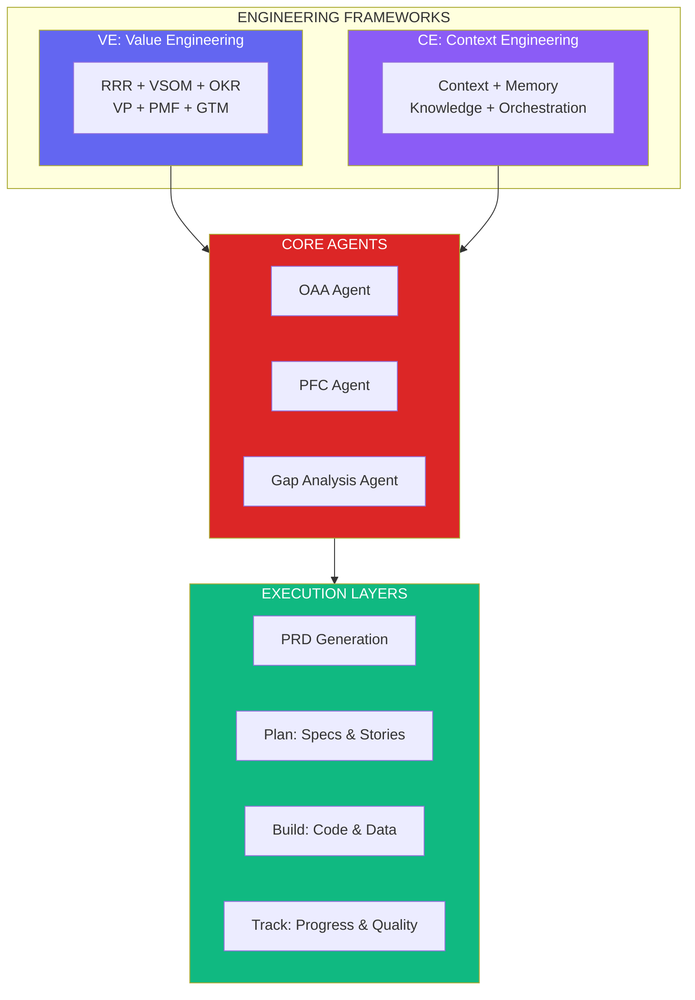

### 1.3 Value Engineering Framework (VE) Detail

**Scope:** This diagram expands the Value Engineering framework, showing its three layers (Strategic Foundation, Value Definition, Market Strategy) and all six modules within. VP, PMF, and GTM are explicitly shown as components within VE.

**Purpose:** To provide complete visibility into VE structure. The Strategic Foundation (RRR, VSOM, OKR) establishes governance and direction. Value Definition (VP) articulates the value we create. Market Strategy (PMF, GTM) validates and plans how we deliver that value. All six must be completed before PRD generation—this is the "Value First" principle in practice.

```mermaid
flowchart TB
    subgraph VE_DETAIL["🎯 VE: VALUE ENGINEERING FRAMEWORK"]
        subgraph STRATEGIC["LAYER 1: STRATEGIC FOUNDATION"]
            RRR["RRR<br/>Roles, Responsibilities, RACI"]
            VSOM["VSOM<br/>Vision, Strategy, Objectives, Metrics"]
            OKR["OKR<br/>Objectives & Key Results"]
        end
        
        subgraph VALUE["LAYER 2: VALUE DEFINITION"]
            VP["💎 VALUE PROPOSITION<br/>Problem • Solution<br/>Benefits • Differentiation"]
        end
        
        subgraph MARKET["LAYER 3: MARKET STRATEGY"]
            PMF["📊 PMF<br/>Product-Market Fit<br/>Hypothesis • Validation • Signals"]
            GTM["🚀 GTM<br/>Go-to-Market<br/>Channels • Pricing • Launch"]
        end
        
        STRATEGIC --> VALUE --> MARKET
    end
    
    subgraph VE_OUTPUT["VE OUTPUT"]
        Complete[Complete VE Package<br/>Ready for PRD]
    end
    
    MARKET --> VE_OUTPUT
    
    style VE_DETAIL fill:#6366F1,color:#fff
    style STRATEGIC fill:#818CF8,color:#fff
    style VALUE fill:#EC4899,color:#fff
    style MARKET fill:#F59E0B,color:#fff
    style VE_OUTPUT fill:#10B981,color:#fff
```

### 1.4 Context Engineering Framework (CE) Detail

**Scope:** This diagram expands the Context Engineering framework, showing its three layers (Context Management, Memory Systems, Knowledge Integration) and the specific capabilities within each. This is where we manage AI context windows, memory persistence, and knowledge retrieval.

**Purpose:** To establish Context Engineering as a first-class concern, not an afterthought. Poor context management leads to AI failures—hallucinations, lost state, inconsistent behavior. CE ensures our agents have the right information at the right time. Context Management handles immediate windows. Memory Systems handle persistence across sessions. Knowledge Integration handles retrieval from external sources (RAG, graphs, ontologies via OAA).

```mermaid
flowchart TB
    subgraph CE_DETAIL["🧠 CE: CONTEXT ENGINEERING FRAMEWORK"]
        subgraph CONTEXT["LAYER 1: CONTEXT MANAGEMENT"]
            Windows["Context Windows<br/>Size optimization, chunking"]
            Compression["Context Compression<br/>Summarization, prioritization"]
            Routing["Context Routing<br/>Agent-specific context delivery"]
        end
        
        subgraph MEMORY["LAYER 2: MEMORY SYSTEMS"]
            ShortTerm["Short-term Memory<br/>Current session state"]
            LongTerm["Long-term Memory<br/>Persistent knowledge"]
            Episodic["Episodic Memory<br/>Past interactions, decisions"]
        end
        
        subgraph KNOWLEDGE["LAYER 3: KNOWLEDGE INTEGRATION"]
            RAG["RAG Pipeline<br/>Retrieval Augmented Generation"]
            Graphs["Knowledge Graphs<br/>Entity relationships"]
            Ontology_Int["Ontology Integration<br/>Schema-driven knowledge"]
        end
        
        CONTEXT --> MEMORY --> KNOWLEDGE
    end
    
    subgraph CE_OUTPUT["CE OUTPUT"]
        Optimized[Optimized Context<br/>For all agents]
    end
    
    KNOWLEDGE --> CE_OUTPUT
    
    style CE_DETAIL fill:#8B5CF6,color:#fff
    style CONTEXT fill:#A78BFA,color:#fff
    style MEMORY fill:#C4B5FD,color:#fff
    style KNOWLEDGE fill:#DDD6FE,color:#000
    style CE_OUTPUT fill:#10B981,color:#fff
```

### 1.5 Reusable Core Agents

**Scope:** This diagram details the three core agents that are part of PF-Core: OAA (Ontology Architect Agent), PFC (Platform Core Agent), and Gap Analysis Agent. Each agent has defined inputs, capabilities, and outputs.

**Purpose:** To define the reusable agent building blocks available to all instances. OAA is already working—it manages ontologies. PFC is the platform orchestrator—it coordinates other agents and manages platform-wide concerns. Gap Analysis identifies gaps between current state and desired state across any domain. These agents are NOT instance-specific; they're shared infrastructure.

```mermaid
flowchart TB
    subgraph CORE_AGENTS["⚙️ PF-CORE REUSABLE AGENTS"]
        subgraph OAA["🔴 OAA: ONTOLOGY ARCHITECT AGENT"]
            OAA_Status["STATUS: ✅ WORKING"]
            OAA_In["INPUTS:<br/>• Schema.org vocabulary<br/>• Business requirements<br/>• Existing ontologies"]
            OAA_Cap["CAPABILITIES:<br/>• Create ontologies from Schema.org<br/>• Validate & test ontologies<br/>• Generate SQL, Types, Docs<br/>• Registry management"]
            OAA_Out["OUTPUTS:<br/>• JSON-LD ontologies<br/>• Supabase schemas<br/>• TypeScript definitions<br/>• Documentation"]
        end
        
        subgraph PFC["🔵 PFC: PLATFORM CORE AGENT"]
            PFC_Status["STATUS: 🔄 IN DEVELOPMENT"]
            PFC_In["INPUTS:<br/>• VE context (VP, PMF, GTM)<br/>• CE context (memory, knowledge)<br/>• Agent requests"]
            PFC_Cap["CAPABILITIES:<br/>• Agent orchestration<br/>• Context distribution<br/>• State management<br/>• Error recovery"]
            PFC_Out["OUTPUTS:<br/>• Coordinated agent actions<br/>• Shared state updates<br/>• Execution logs<br/>• Health metrics"]
        end
        
        subgraph GAP["🟢 GAP ANALYSIS AGENT"]
            GAP_Status["STATUS: ✅ DESIGNED & SPECIFIED"]
            GAP_In["INPUTS:<br/>• Current state data<br/>• Desired state definition<br/>• Domain ontology"]
            GAP_Cap["CAPABILITIES:<br/>• State comparison<br/>• Gap identification<br/>• Priority scoring<br/>• Recommendation generation"]
            GAP_Out["OUTPUTS:<br/>• Gap analysis report<br/>• Prioritized gaps list<br/>• Action recommendations<br/>• Remediation roadmap"]
        end
    end
    
    style OAA fill:#DC2626,color:#fff
    style PFC fill:#3B82F6,color:#fff
    style GAP fill:#10B981,color:#fff
```

### 1.6 Core Agent Interactions

**Scope:** This diagram shows how the three core agents interact with each other and with the VE/CE frameworks. OAA provides ontologies to all. PFC orchestrates all agents. Gap Analysis uses ontologies and provides findings back to VE for iteration.

**Purpose:** To demonstrate that core agents are not isolated—they work together as a system. OAA's ontologies inform Gap Analysis (you need a schema to compare against). Gap Analysis findings feed back to VE (identified gaps may require VP/PMF/GTM updates). PFC coordinates it all, managing context (CE) and ensuring agents have what they need.

```mermaid
flowchart TB
    subgraph FRAMEWORKS["FRAMEWORKS"]
        VE[VE Framework<br/>Value Engineering]
        CE[CE Framework<br/>Context Engineering]
    end
    
    subgraph AGENTS["CORE AGENTS"]
        OAA[🔴 OAA<br/>Ontology Architect]
        PFC[🔵 PFC<br/>Platform Core]
        GAP[🟢 Gap Analysis]
    end
    
    VE -->|"strategic context"| PFC
    CE -->|"operational context"| PFC
    
    PFC -->|"orchestrates"| OAA
    PFC -->|"orchestrates"| GAP
    
    OAA -->|"provides ontologies"| GAP
    OAA -->|"provides schemas"| PFC
    
    GAP -->|"gap findings"| VE
    GAP -->|"recommendations"| PFC
    
    style VE fill:#6366F1,color:#fff
    style CE fill:#8B5CF6,color:#fff
    style OAA fill:#DC2626,color:#fff
    style PFC fill:#3B82F6,color:#fff
    style GAP fill:#10B981,color:#fff
```

### 1.7 PF-Core to Instance Relationship

**Scope:** This diagram shows how PF-Core (with VE, CE, and Core Agents) extends to create instance-specific platforms (BAIV, W4M, AIR). Each instance inherits all PF-Core capabilities and adds instance-specific ontologies, agents, and configurations.

**Purpose:** To establish the inheritance model. BAIV doesn't rebuild VE or CE—it inherits them from PF-Core. BAIV adds AI Visibility ontologies and BAIV-specific agents on top of the shared foundation. This enables code reuse while allowing deep customization. The same is true for W4M and AIR—each extends PF-Core with domain-specific capabilities.

```mermaid
flowchart TB
    subgraph PF_CORE["PF-CORE (Shared Foundation)"]
        VE_Core[VE Framework]
        CE_Core[CE Framework]
        Core_Agents[Core Agents<br/>OAA • PFC • Gap]
    end
    
    subgraph BAIV["BAIV INSTANCE"]
        BAIV_Inherits["Inherits: VE + CE + Core Agents"]
        BAIV_Adds["Adds:<br/>• AI Visibility Ontologies<br/>• Discovery Agents<br/>• Content Generation Agents"]
        BAIV_Config["Config:<br/>• BAIV PMF Signals<br/>• BAIV GTM Channels"]
    end
    
    subgraph W4M["W4M INSTANCE"]
        W4M_Inherits["Inherits: VE + CE + Core Agents"]
        W4M_Adds["Adds:<br/>• Value Engineering Ontologies<br/>• Assessment Agents<br/>• Consulting Workflow Agents"]
        W4M_Config["Config:<br/>• W4M PMF Signals<br/>• W4M GTM Channels"]
    end
    
    subgraph AIR["AIR INSTANCE"]
        AIR_Inherits["Inherits: VE + CE + Core Agents"]
        AIR_Adds["Adds:<br/>• AI Readiness Ontologies<br/>• Assessment Agents<br/>• Roadmap Generation Agents"]
        AIR_Config["Config:<br/>• AIR PMF Signals<br/>• AIR GTM Channels"]
    end
    
    PF_CORE -->|"extends to"| BAIV
    PF_CORE -->|"extends to"| W4M
    PF_CORE -->|"extends to"| AIR
    
    style PF_CORE fill:#1F2937,color:#fff
    style BAIV fill:#3B82F6,color:#fff
    style W4M fill:#8B5CF6,color:#fff
    style AIR fill:#06B6D4,color:#fff
```

---

## Part 2: The Complete Picture

### 2.1 Complete System Flow

**Scope:** This diagram shows the end-to-end flow from PF-Core frameworks through execution. VE and CE feed Core Agents, which power PRD generation, planning, building, and tracking. The feedback loop from Track goes back to VE (PMF signals) and CE (context optimization).

**Purpose:** To provide the single "big picture" view of how PF-Core enables the entire development lifecycle. Note the dual feedback loops: Track sends PMF signals back to VE for value validation, and Track sends usage patterns back to CE for context optimization. This creates a learning system that improves over time.

```mermaid
flowchart TB
    subgraph PF_CORE["🏗️ PF-CORE"]
        subgraph FRAMEWORKS["Engineering Frameworks"]
            VE[🎯 VE: Value Engineering<br/>RRR • VSOM • OKR • VP • PMF • GTM]
            CE[🧠 CE: Context Engineering<br/>Context • Memory • Knowledge]
        end
        
        subgraph AGENTS["Core Agents"]
            OAA[🔴 OAA]
            PFC[🔵 PFC]
            GAP[🟢 Gap]
        end
    end
    
    subgraph EXECUTION["EXECUTION"]
        PRD[📄 PRD Generation]
        PLAN[📋 Plan: Specs & Stories]
        BUILD[🔨 Build: Code & Data]
        TRACK[📊 Track: Progress & Quality]
    end
    
    VE --> AGENTS
    CE --> AGENTS
    AGENTS --> PRD --> PLAN --> BUILD --> TRACK
    
    TRACK -.->|"PMF Signals"| VE
    TRACK -.->|"Context Patterns"| CE
    
    style PF_CORE fill:#1F2937,color:#fff
    style VE fill:#6366F1,color:#fff
    style CE fill:#8B5CF6,color:#fff
    style AGENTS fill:#DC2626,color:#fff
    style EXECUTION fill:#10B981,color:#fff
```

### 2.2 Mapping to Figma UI Structure

**Scope:** This diagram shows how PF-Core maps to the Figma UI. The Program Manager panel now explicitly shows both VE modules (RRR, VSOM, OKR, VP, PMF, GTM) and CE modules (Context, Memory, Knowledge). Core Agents power the Build panel.

**Purpose:** To bridge architecture and UI. When designers work in Figma Make, they need to know which UI sections correspond to which PF-Core components. The Program Manager handles both VE (strategic) and CE (operational) configuration. Plan handles PRD and stories. Build uses Core Agents. Track monitors both value (PMF) and system health.

```mermaid
graph TB
    subgraph "FIGMA UI STRUCTURE"
        subgraph PM["🎯 PROGRAM MANAGER"]
            subgraph VE_UI["VE Modules"]
                RRR_UI[RRR]
                VSOM_UI[VSOM]
                OKR_UI[OKR]
                VP_UI[Value Prop]
                PMF_UI[PMF]
                GTM_UI[GTM]
            end
            subgraph CE_UI["CE Modules"]
                Context_UI[Context Config]
                Memory_UI[Memory Settings]
                Knowledge_UI[Knowledge Sources]
            end
        end
        
        subgraph PLAN["📋 PLAN"]
            PRD_UI[PRD Generator]
            Spec_UI[Spec Manager]
            Story_UI[Story Board]
        end
        
        subgraph BUILD["🔨 BUILD"]
            OAA_UI[OAA Agent Panel]
            PFC_UI[PFC Orchestrator]
            GAP_UI[Gap Analysis Tool]
            TDD_UI[TDD Workspace]
        end
        
        subgraph TRACK["📊 TRACK"]
            Progress_UI[Progress Dashboard]
            PMF_Track[PMF Signals]
            CE_Track[Context Health]
            Quality_UI[Quality Metrics]
        end
    end
    
    PM -->|"VE + CE Complete"| PLAN
    PLAN -->|"Specs & Stories"| BUILD
    BUILD -->|"Status"| TRACK
    TRACK -.->|"Feedback"| PM
    
    style PM fill:#6366F1,color:#fff
    style VE_UI fill:#818CF8,color:#fff
    style CE_UI fill:#A78BFA,color:#fff
    style PLAN fill:#3B82F6,color:#fff
    style BUILD fill:#10B981,color:#fff
    style TRACK fill:#F59E0B,color:#fff
```

---

## Part 3: Value Engineering Framework (VE)

### 3.1 VE Complete Structure

**Scope:** This diagram shows all six VE modules organized into three layers, with their specific outputs and how they flow to PRD generation.

**Purpose:** To provide the complete reference for VE implementation. Each module has specific deliverables. RRR produces governance artifacts. VSOM produces strategic cascade. OKR produces measurable objectives. VP produces value documentation. PMF produces validation evidence. GTM produces market entry plan. All six feed into a complete VE package that enables PRD.

```mermaid
flowchart TB
    subgraph VE_COMPLETE["🎯 VALUE ENGINEERING FRAMEWORK"]
        subgraph FOUNDATION["STRATEGIC FOUNDATION"]
            subgraph RRR_MOD["RRR"]
                RRR_Out[Outputs:<br/>• Role definitions<br/>• RACI matrix<br/>• Governance model]
            end
            
            subgraph VSOM_MOD["VSOM"]
                VSOM_Out[Outputs:<br/>• Vision statement<br/>• Strategy map<br/>• Objectives cascade<br/>• KPI framework]
            end
            
            subgraph OKR_MOD["OKR"]
                OKR_Out[Outputs:<br/>• Objectives<br/>• Key Results<br/>• Initiatives<br/>• Cascade links]
            end
        end
        
        subgraph VALUE_DEF["VALUE DEFINITION"]
            subgraph VP_MOD["VALUE PROPOSITION"]
                VP_Out[Outputs:<br/>• Problem statement<br/>• Solution approach<br/>• Benefits quantified<br/>• Differentiation]
            end
        end
        
        subgraph MARKET_STRATEGY["MARKET STRATEGY"]
            subgraph PMF_MOD["PMF"]
                PMF_Out[Outputs:<br/>• Hypotheses<br/>• Experiment results<br/>• Signal metrics<br/>• Validation status]
            end
            
            subgraph GTM_MOD["GTM"]
                GTM_Out[Outputs:<br/>• Channel strategy<br/>• Pricing model<br/>• Launch plan<br/>• Growth levers]
            end
        end
    end
    
    FOUNDATION --> VALUE_DEF --> MARKET_STRATEGY
    
    MARKET_STRATEGY -->|"Complete VE Package"| PRD[PRD Generation]
    
    style FOUNDATION fill:#6366F1,color:#fff
    style VALUE_DEF fill:#EC4899,color:#fff
    style MARKET_STRATEGY fill:#F59E0B,color:#fff
```

### 3.2 Value Proposition Detail

**Scope:** This diagram zooms into the Value Proposition module, showing its four core components and connections to upstream (VSOM) and downstream (PMF) modules.

**Purpose:** To establish VP as the central artifact of value definition. VP translates strategic intent (VSOM) into testable value claims that PMF will validate. The four components (Problem, Solution, Benefits, Differentiation) must all be defined—missing any creates gaps that PMF will expose.

```mermaid
flowchart TB
    subgraph VP_DETAIL["💎 VALUE PROPOSITION MODULE"]
        subgraph Inputs["FROM VSOM"]
            Vision_In[Vision Alignment]
            Strategy_In[Strategic Fit]
            Metrics_In[Success Metrics]
        end
        
        subgraph Core["VP CORE COMPONENTS"]
            Problem["🎯 PROBLEM<br/>Pain points, frequency, severity<br/>Who has it, how they cope"]
            Solution["💡 SOLUTION<br/>Approach, capabilities<br/>Why this approach wins"]
            Benefits["📈 BENEFITS<br/>Quantified outcomes<br/>Time/cost/quality gains"]
            Diff["🏆 DIFFERENTIATION<br/>Competitive moat<br/>Why hard to replicate"]
        end
        
        subgraph Outputs["TO PMF"]
            Hypotheses[Testable Hypotheses]
            Metrics_Out[Success Metrics]
            Target[Target Segment]
        end
    end
    
    Inputs --> Core
    Problem --> Solution --> Benefits --> Diff
    Core --> Outputs
    
    style VP_DETAIL fill:#EC4899,color:#fff
    style Core fill:#F472B6,color:#fff
```

### 3.3 PMF Module Detail

**Scope:** This diagram details the PMF validation cycle and the specific signals we track to determine product-market fit.

**Purpose:** To make PMF validation rigorous, not gut-feel. The cycle (Hypothesis → Experiment → Measure → Decide) must complete with positive signals before GTM proceeds. Specific signals (retention >40%, NPS >40, organic growth, WTP) provide objective criteria. Failed validation loops back to VP for iteration.

```mermaid
flowchart TB
    subgraph PMF_DETAIL["📊 PMF: PRODUCT-MARKET FIT"]
        subgraph Validation["VALIDATION CYCLE"]
            H["📝 Hypothesis"]
            E["🧪 Experiment"]
            M["📏 Measure"]
            D["⚖️ Decide"]
            
            H --> E --> M --> D
            D -->|"Weak signals"| H
        end
        
        subgraph Signals["PMF SIGNALS"]
            S1[Retention > 40%]
            S2[NPS > 40]
            S3[Organic Growth]
            S4[Word of Mouth]
            S5[Willingness to Pay]
        end
        
        subgraph Gate["PMF GATE"]
            Pass["✅ PMF ACHIEVED"]
            Fail["🔄 ITERATE VP"]
        end
        
        D -->|"Strong signals"| Signals
        Signals --> Gate
    end
    
    style PMF_DETAIL fill:#F59E0B,color:#fff
    style Validation fill:#FBBF24,color:#000
    style Signals fill:#FCD34D,color:#000
    style Gate fill:#10B981,color:#fff
```

### 3.4 GTM Module Detail

**Scope:** This diagram details the Go-to-Market module, showing its four components and how GTM outputs inform PRD features.

**Purpose:** To ensure GTM is defined BEFORE PRD. Channel strategy affects features (API for partners?). Pricing affects scope (free tier?). Launch timing affects priorities. GTM isn't post-build marketing—it's pre-build strategic input that shapes what we build.

```mermaid
flowchart TB
    subgraph GTM_DETAIL["🚀 GTM: GO-TO-MARKET"]
        subgraph Components["GTM COMPONENTS"]
            Channels["📣 CHANNELS<br/>Direct • Partner • PLG<br/>Content • Paid • Events"]
            Pricing["💰 PRICING<br/>Model • Tiers<br/>Packaging"]
            Launch["🎯 LAUNCH<br/>Beta strategy<br/>Launch sequence"]
            Growth["📈 GROWTH<br/>Acquisition loops<br/>Expansion revenue"]
        end
        
        subgraph PRD_Impact["IMPACT ON PRD"]
            I1[Channel Reqs → Features]
            I2[Pricing Reqs → Tier Scope]
            I3[Launch Timeline → Priorities]
            I4[Growth Metrics → Tracking]
        end
    end
    
    Components --> PRD_Impact
    PRD_Impact --> PRD[PRD Generation]
    
    style GTM_DETAIL fill:#10B981,color:#fff
    style Components fill:#34D399,color:#000
    style PRD_Impact fill:#6EE7B7,color:#000
```

---

## Part 4: Context Engineering Framework (CE)

### 4.1 CE Complete Structure

**Scope:** This diagram shows all three CE layers with their specific components and outputs. Context Engineering manages how AI systems receive, process, and retain information.

**Purpose:** To establish CE as critical infrastructure. Without proper context management, agents fail—they lose track of conversations, hallucinate, or provide inconsistent responses. CE ensures every agent has optimal context: the right information, properly compressed, with access to memory and knowledge. This is the "How we do AI right" framework.

```mermaid
flowchart TB
    subgraph CE_COMPLETE["🧠 CONTEXT ENGINEERING FRAMEWORK"]
        subgraph CONTEXT_LAYER["LAYER 1: CONTEXT MANAGEMENT"]
            Windows["Context Windows<br/>• Token budgeting<br/>• Priority allocation<br/>• Overflow handling"]
            Compression["Compression<br/>• Summarization<br/>• Key point extraction<br/>• Redundancy removal"]
            Routing["Routing<br/>• Agent-specific context<br/>• Task-relevant filtering<br/>• Dynamic assembly"]
        end
        
        subgraph MEMORY_LAYER["LAYER 2: MEMORY SYSTEMS"]
            ShortTerm["Short-term<br/>• Session state<br/>• Working memory<br/>• Active context"]
            LongTerm["Long-term<br/>• User preferences<br/>• Historical patterns<br/>• Learned knowledge"]
            Episodic["Episodic<br/>• Past conversations<br/>• Decision history<br/>• Interaction logs"]
        end
        
        subgraph KNOWLEDGE_LAYER["LAYER 3: KNOWLEDGE INTEGRATION"]
            RAG["RAG Pipeline<br/>• Document retrieval<br/>• Chunk ranking<br/>• Context injection"]
            Graphs["Knowledge Graphs<br/>• Entity relations<br/>• Semantic links<br/>• Inference paths"]
            Ontology["Ontology Integration<br/>• OAA connection<br/>• Schema-driven queries<br/>• Type-safe knowledge"]
        end
    end
    
    CONTEXT_LAYER --> MEMORY_LAYER --> KNOWLEDGE_LAYER
    
    KNOWLEDGE_LAYER -->|"Optimized Context"| Agents[All Agents]
    
    style CE_COMPLETE fill:#8B5CF6,color:#fff
    style CONTEXT_LAYER fill:#A78BFA,color:#fff
    style MEMORY_LAYER fill:#C4B5FD,color:#fff
    style KNOWLEDGE_LAYER fill:#DDD6FE,color:#000
```

### 4.2 Context Window Management

**Scope:** This diagram details how context windows are managed—budgeting tokens across different content types, prioritizing what goes into limited context, and handling overflow.

**Purpose:** To show context management as an engineering problem with concrete solutions. Claude has token limits. We must decide what fits. Priority Order ensures critical context (system prompt, VE context, current task) always fits. Compression strategies (summarize history, reference by ID) maximize useful content per token.

```mermaid
flowchart TB
    subgraph CONTEXT_MGMT["CONTEXT WINDOW MANAGEMENT"]
        subgraph Budget["TOKEN BUDGET ALLOCATION"]
            System["System Prompt: ~2K tokens"]
            VE_Ctx["VE Context: ~3K tokens"]
            CE_Ctx["CE Context: ~2K tokens"]
            Task["Current Task: ~5K tokens"]
            History["Conversation History: ~4K tokens"]
            Reserve["Reserve: ~1K tokens"]
        end
        
        subgraph Priority["PRIORITY ORDER"]
            P1["1. System Prompt (always)"]
            P2["2. Current Task (always)"]
            P3["3. VE Context (always)"]
            P4["4. Recent History (compressed)"]
            P5["5. Knowledge (retrieved)"]
            P6["6. Older History (summarized)"]
        end
        
        subgraph Overflow["OVERFLOW HANDLING"]
            Compress["Compress older content"]
            Summarize["Summarize history"]
            Reference["Reference by ID"]
            Retrieve["Retrieve on demand"]
        end
    end
    
    Budget --> Priority --> Overflow
    
    style CONTEXT_MGMT fill:#A78BFA,color:#fff
```

### 4.3 Memory Systems Architecture

**Scope:** This diagram shows the three memory types and how they interact—short-term for session, long-term for persistence, episodic for history. It also shows the storage backends for each.

**Purpose:** To define memory as a system, not a feature. Short-term memory (Supabase session tables) tracks current conversation. Long-term memory (vector store + Supabase) stores user preferences and learned patterns. Episodic memory (Supabase + search) enables "remember when we discussed X?" queries. Together they create continuity across interactions.

```mermaid
flowchart TB
    subgraph MEMORY_SYS["MEMORY SYSTEMS"]
        subgraph ShortTerm["SHORT-TERM MEMORY"]
            ST_What["What: Current session state"]
            ST_Store["Storage: Supabase session table"]
            ST_TTL["TTL: Session duration"]
            ST_Use["Use: Active conversation context"]
        end
        
        subgraph LongTerm["LONG-TERM MEMORY"]
            LT_What["What: Persistent preferences, patterns"]
            LT_Store["Storage: Vector DB + Supabase"]
            LT_TTL["TTL: Permanent (versioned)"]
            LT_Use["Use: Personalization, learning"]
        end
        
        subgraph Episodic["EPISODIC MEMORY"]
            EP_What["What: Past interactions, decisions"]
            EP_Store["Storage: Supabase + search index"]
            EP_TTL["TTL: Configurable retention"]
            EP_Use["Use: Reference past conversations"]
        end
    end
    
    ShortTerm -->|"promotes relevant"| LongTerm
    ShortTerm -->|"logs all"| Episodic
    Episodic -->|"retrieves relevant"| ShortTerm
    LongTerm -->|"informs"| ShortTerm
    
    style MEMORY_SYS fill:#C4B5FD,color:#000
    style ShortTerm fill:#E9D5FF,color:#000
    style LongTerm fill:#F3E8FF,color:#000
    style Episodic fill:#FAF5FF,color:#000
```

### 4.4 Knowledge Integration (RAG + Graphs + Ontologies)

**Scope:** This diagram shows how the three knowledge sources (RAG pipeline, knowledge graphs, OAA ontologies) integrate to provide comprehensive knowledge to agents.

**Purpose:** To show knowledge integration as multi-modal. RAG retrieves document chunks. Graphs provide entity relationships. Ontologies (via OAA) provide schema-driven structure. Different queries use different sources: "What did the PRD say?" → RAG. "How is User X related to Company Y?" → Graph. "What fields does a Discovery Audit have?" → Ontology. The integration layer routes queries to the right source.

```mermaid
flowchart TB
    subgraph KNOWLEDGE_INT["KNOWLEDGE INTEGRATION"]
        subgraph Sources["KNOWLEDGE SOURCES"]
            RAG["RAG Pipeline<br/>• Document chunks<br/>• Semantic search<br/>• Context injection"]
            Graph["Knowledge Graph<br/>• Entities & relations<br/>• Traversal queries<br/>• Inference"]
            Ontology["OAA Ontologies<br/>• Schema definitions<br/>• Type validation<br/>• Structure queries"]
        end
        
        subgraph Router["QUERY ROUTER"]
            R1["Content queries → RAG"]
            R2["Relationship queries → Graph"]
            R3["Schema queries → Ontology"]
            R4["Complex queries → All three"]
        end
        
        subgraph Output["INTEGRATED OUTPUT"]
            Combined["Combined Knowledge Context<br/>Ready for agent consumption"]
        end
    end
    
    Sources --> Router --> Output
    
    style KNOWLEDGE_INT fill:#DDD6FE,color:#000
    style Sources fill:#EDE9FE,color:#000
    style Router fill:#F5F3FF,color:#000
```

---

## Part 5: Core Agents Detail

### 5.1 OAA Agent (Ontology Architect) - WORKING

**Scope:** This diagram provides the complete specification for OAA Agent, which is already working. It shows inputs, processing pipeline, outputs, and registry integration.

**Purpose:** To document the working OAA implementation as the reference for other agents. OAA takes requirements and Schema.org vocabulary, analyzes and maps concepts, extends with custom properties, validates, and outputs JSON-LD ontologies plus generated artifacts (SQL, Types, Docs). The OAA Registry tracks all ontologies with versioning and dependency management.

```mermaid
flowchart TB
    subgraph OAA_COMPLETE["🔴 OAA: ONTOLOGY ARCHITECT AGENT"]
        subgraph Status["STATUS"]
            S["✅ WORKING"]
        end
        
        subgraph Inputs["INPUTS"]
            I1["Schema.org vocabulary"]
            I2["Business requirements"]
            I3["Existing ontologies"]
            I4["Extension requests"]
        end
        
        subgraph Pipeline["PROCESSING PIPELINE"]
            P1["1. Analyze requirements"]
            P2["2. Map to Schema.org"]
            P3["3. Create extensions"]
            P4["4. Generate JSON-LD"]
            P5["5. Validate structure"]
            P6["6. Generate artifacts"]
        end
        
        subgraph Outputs["OUTPUTS"]
            O1["JSON-LD ontology files"]
            O2["Supabase SQL schemas"]
            O3["TypeScript definitions"]
            O4["Zod validation schemas"]
            O5["Documentation (MD)"]
            O6["API contracts"]
        end
        
        subgraph Registry["OAA REGISTRY"]
            R1["Version control"]
            R2["Dependency tracking"]
            R3["Compliance checking"]
            R4["Usage analytics"]
        end
    end
    
    Inputs --> Pipeline --> Outputs --> Registry
    
    style OAA_COMPLETE fill:#DC2626,color:#fff
    style Status fill:#EF4444,color:#fff
    style Pipeline fill:#F87171,color:#fff
    style Outputs fill:#FCA5A5,color:#000
    style Registry fill:#FECACA,color:#000
```

### 5.2 PFC Agent (Platform Core) - IN DEVELOPMENT

**Scope:** This diagram provides the specification for PFC Agent, currently in development. PFC is the orchestrator that coordinates all other agents, manages shared state, and distributes context.

**Purpose:** To define PFC's role as the platform coordinator. PFC doesn't do domain work—it enables other agents to do their work effectively. It receives requests, determines which agents to invoke, assembles context (from VE and CE), dispatches work, monitors execution, handles errors, and maintains shared state. Think of PFC as the "air traffic controller" for agents.

```mermaid
flowchart TB
    subgraph PFC_COMPLETE["🔵 PFC: PLATFORM CORE AGENT"]
        subgraph Status["STATUS"]
            S["🔄 IN DEVELOPMENT"]
        end
        
        subgraph Inputs["INPUTS"]
            I1["Agent requests"]
            I2["VE context (VP, PMF, GTM)"]
            I3["CE context (memory, knowledge)"]
            I4["Execution state"]
        end
        
        subgraph Capabilities["CAPABILITIES"]
            C1["Agent orchestration<br/>• Route requests to agents<br/>• Coordinate multi-agent tasks"]
            C2["Context distribution<br/>• Assemble agent-specific context<br/>• Manage token budgets"]
            C3["State management<br/>• Track execution state<br/>• Maintain shared memory"]
            C4["Error recovery<br/>• Detect failures<br/>• Retry with fallback"]
        end
        
        subgraph Outputs["OUTPUTS"]
            O1["Coordinated agent actions"]
            O2["Shared state updates"]
            O3["Execution logs"]
            O4["Health metrics"]
            O5["Error reports"]
        end
    end
    
    Inputs --> Capabilities --> Outputs
    
    style PFC_COMPLETE fill:#3B82F6,color:#fff
    style Status fill:#60A5FA,color:#fff
    style Capabilities fill:#93C5FD,color:#000
    style Outputs fill:#BFDBFE,color:#000
```

### 5.3 Gap Analysis Agent - DESIGNED & SPECIFIED

**Scope:** This diagram provides the complete specification for Gap Analysis Agent, which is designed and specified but not yet fully implemented. It shows how Gap Analysis compares current state to desired state using ontologies as the comparison framework.

**Purpose:** To document Gap Analysis as a reusable agent for any domain. It takes current state data (e.g., client's AI visibility), desired state (e.g., industry benchmark), and a domain ontology (e.g., AI Visibility ontology from OAA). It outputs a gap analysis report with prioritized gaps and remediation recommendations. This agent is instance-agnostic—BAIV uses it for visibility gaps, W4M for value gaps, AIR for readiness gaps.

```mermaid
flowchart TB
    subgraph GAP_COMPLETE["🟢 GAP ANALYSIS AGENT"]
        subgraph Status["STATUS"]
            S["✅ DESIGNED & SPECIFIED"]
        end
        
        subgraph Inputs["INPUTS"]
            I1["Current state data<br/>(from discovery/assessment)"]
            I2["Desired state definition<br/>(benchmark/target)"]
            I3["Domain ontology<br/>(from OAA)"]
            I4["Priority weights<br/>(business importance)"]
        end
        
        subgraph Pipeline["ANALYSIS PIPELINE"]
            P1["1. Parse current state"]
            P2["2. Parse desired state"]
            P3["3. Map to ontology schema"]
            P4["4. Compare field by field"]
            P5["5. Identify gaps"]
            P6["6. Score gaps (severity × impact)"]
            P7["7. Generate recommendations"]
        end
        
        subgraph Outputs["OUTPUTS"]
            O1["Gap Analysis Report"]
            O2["Prioritized Gap List"]
            O3["Gap Severity Scores"]
            O4["Remediation Recommendations"]
            O5["Effort Estimates"]
            O6["Roadmap Suggestions"]
        end
    end
    
    Inputs --> Pipeline --> Outputs
    
    style GAP_COMPLETE fill:#10B981,color:#fff
    style Status fill:#34D399,color:#fff
    style Pipeline fill:#6EE7B7,color:#000
    style Outputs fill:#A7F3D0,color:#000
```

### 5.4 Gap Analysis Instance Usage

**Scope:** This diagram shows how the same Gap Analysis Agent is used differently by each instance—BAIV, W4M, AIR—with instance-specific inputs and outputs.

**Purpose:** To demonstrate agent reusability across instances. The Gap Analysis Agent doesn't change; the inputs change. BAIV feeds it AI visibility assessments. W4M feeds it value maturity assessments. AIR feeds it AI readiness assessments. Same analysis logic, different domains—this is the power of ontology-driven agents.

```mermaid
flowchart TB
    subgraph GAP_AGENT["🟢 GAP ANALYSIS AGENT"]
        Core["Core Analysis Engine"]
    end
    
    subgraph BAIV_USE["BAIV USAGE"]
        BAIV_In["Input:<br/>• AI Visibility Assessment<br/>• Industry Benchmarks<br/>• AI Visibility Ontology"]
        BAIV_Out["Output:<br/>• Visibility Gap Report<br/>• Citation Improvements<br/>• Content Recommendations"]
    end
    
    subgraph W4M_USE["W4M USAGE"]
        W4M_In["Input:<br/>• Value Maturity Assessment<br/>• Best Practice Targets<br/>• Value Engineering Ontology"]
        W4M_Out["Output:<br/>• Value Gap Report<br/>• VE Improvements<br/>• Process Recommendations"]
    end
    
    subgraph AIR_USE["AIR USAGE"]
        AIR_In["Input:<br/>• AI Readiness Assessment<br/>• Industry Standards<br/>• AI Readiness Ontology"]
        AIR_Out["Output:<br/>• Readiness Gap Report<br/>• Capability Gaps<br/>• Adoption Roadmap"]
    end
    
    BAIV_In --> GAP_AGENT --> BAIV_Out
    W4M_In --> GAP_AGENT --> W4M_Out
    AIR_In --> GAP_AGENT --> AIR_Out
    
    style GAP_AGENT fill:#10B981,color:#fff
    style BAIV_USE fill:#3B82F6,color:#fff
    style W4M_USE fill:#8B5CF6,color:#fff
    style AIR_USE fill:#06B6D4,color:#fff
```

---

## Part 6: Build Phase - Data & Integration

### 6.1 Build Architecture

**Scope:** This diagram shows the Build phase architecture with the three core agents integrated. OAA generates schemas. PFC orchestrates. Gap Analysis identifies issues during development.

**Purpose:** To show how core agents power the Build phase. Validated VE outputs enter Build. OAA generates database schemas and API contracts from ontologies. PFC coordinates development tasks and manages state. Gap Analysis can be used during development to identify gaps between implementation and requirements. TDD ensures quality throughout.

```mermaid
flowchart TB
    subgraph VE_INPUT["FROM VALUE ENGINEERING"]
        VE_Package[Complete VE Package<br/>VP + PMF + GTM validated]
        Ontologies[Validated Ontologies<br/>from OAA]
    end
    
    subgraph BUILD_PHASE["🔨 BUILD PHASE"]
        subgraph Agents["CORE AGENTS IN BUILD"]
            OAA_Build[🔴 OAA<br/>Schema Generation]
            PFC_Build[🔵 PFC<br/>Orchestration]
            GAP_Build[🟢 Gap Analysis<br/>Requirements vs Implementation]
        end
        
        subgraph DataLayer["DATA LAYER"]
            DB[(Supabase PostgreSQL)]
            JSONB[JSONB Storage]
            RLS[Row Level Security]
        end
        
        subgraph APILayer["API LAYER"]
            REST[REST Endpoints]
            Validation[Zod Validation]
            Types[TypeScript Types]
        end
        
        subgraph QA["QUALITY"]
            TDD[TDD Workspace]
            Coverage[80%+ Coverage]
        end
    end
    
    VE_INPUT --> BUILD_PHASE
    Ontologies --> OAA_Build
    OAA_Build --> DataLayer
    OAA_Build --> APILayer
    PFC_Build --> Agents
    GAP_Build --> QA
    
    style VE_INPUT fill:#6366F1,color:#fff
    style Agents fill:#DC2626,color:#fff
    style DataLayer fill:#0891B2,color:#fff
    style APILayer fill:#F59E0B,color:#fff
    style QA fill:#10B981,color:#fff
```

### 6.2 Data Mapping Flow (OAA-Driven)

**Scope:** This diagram shows how OAA-generated ontologies drive all data artifacts: database tables, TypeScript types, API routes, and validation schemas.

**Purpose:** To demonstrate ontology-driven development. One ontology definition generates everything. Change the ontology, regenerate artifacts, maintain consistency. This eliminates schema drift and ensures type safety from database to API to frontend.

```mermaid
flowchart LR
    subgraph Source["ONTOLOGY (OAA Output)"]
        JSON_LD["JSON-LD Definition<br/>@context: schema.org<br/>@type: CustomType<br/>properties: {...}"]
    end
    
    subgraph Generated["GENERATED ARTIFACTS"]
        SQL["Supabase SQL<br/>CREATE TABLE<br/>JSONB columns<br/>RLS policies"]
        TS["TypeScript<br/>Interface definitions<br/>Zod schemas"]
        API["API Routes<br/>CRUD endpoints<br/>Validation middleware"]
        Docs["Documentation<br/>Schema reference<br/>API docs"]
    end
    
    Source -->|"OAA generates"| SQL
    Source -->|"OAA generates"| TS
    Source -->|"OAA generates"| API
    Source -->|"OAA generates"| Docs
    
    style Source fill:#DC2626,color:#fff
    style Generated fill:#10B981,color:#fff
```

---

## Part 7: Implementation Plan

### 7.1 Implementation Roadmap (6 Weeks)

**Scope:** This Gantt chart shows the complete implementation timeline with PF-Core (VE + CE + Core Agents) built in the first two weeks.

**Purpose:** To provide project management visibility. Week 1-2 establishes PF-Core: VE modules, CE modules, and Core Agents (OAA completion, PFC start, Gap Analysis integration). Weeks 3-6 build on this foundation with PRD, Plan, Build, and Track phases.

```mermaid
gantt
    title MVP Implementation Roadmap
    dateFormat  YYYY-MM-DD
    
    section Week 1: PF-Core Foundation
    VE Strategic (RRR,VSOM,OKR)     :w1a, 2025-01-06, 2d
    VE Market (VP,PMF,GTM)          :w1b, after w1a, 2d
    CE Framework Setup              :w1c, after w1b, 1d
    
    section Week 2: Core Agents
    OAA Agent (complete)            :w2a, 2025-01-13, 2d
    PFC Agent (start)               :w2b, after w2a, 2d
    Gap Analysis Integration        :w2c, after w2b, 1d
    
    section Week 3: PRD & Plan
    PRD Generator                   :w3a, 2025-01-20, 2d
    Plan Phase UI                   :w3b, after w3a, 2d
    VE → PRD Flow Testing           :w3c, after w3b, 1d
    
    section Week 4: Build Phase
    Database Schema (OAA)           :w4a, 2025-01-27, 2d
    API Layer                       :w4b, after w4a, 2d
    TDD Framework                   :w4c, after w4b, 1d
    
    section Week 5: Integration
    Agent Orchestration (PFC)       :w5a, 2025-02-03, 2d
    UI Integration                  :w5b, after w5a, 2d
    End-to-End Testing              :w5c, after w5b, 1d
    
    section Week 6: Polish
    Bug Fixes                       :w6a, 2025-02-10, 2d
    Documentation                   :w6b, after w6a, 2d
    Training                        :w6c, after w6b, 1d
```

### 7.2 Week 1: PF-Core Foundation

**Scope:** Week 1 establishes the VE and CE frameworks within PF-Core.

**Purpose:** To build the strategic and operational foundations before any agent work.

```mermaid
flowchart TB
    subgraph Day1_2["Days 1-2: VE Strategic Foundation"]
        A1[Setup VE Module Structure]
        A2[Configure RRR Templates]
        A3[Configure VSOM Templates]
        A4[Configure OKR Templates]
    end
    
    subgraph Day3_4["Days 3-4: VE Market Strategy"]
        B1[Configure VP Module]
        B2[Configure PMF Module]
        B3[Configure GTM Module]
        B4[Setup Instance Config (BAIV)]
    end
    
    subgraph Day5["Day 5: CE Framework"]
        C1[Context Management Setup]
        C2[Memory System Design]
        C3[Knowledge Integration Plan]
        C4[CE Configuration Schema]
    end
    
    Day1_2 --> Day3_4 --> Day5
    
    style Day1_2 fill:#6366F1,color:#fff
    style Day3_4 fill:#EC4899,color:#fff
    style Day5 fill:#8B5CF6,color:#fff
```

### 7.3 Week 2: Core Agents

**Scope:** Week 2 completes OAA, starts PFC, and integrates Gap Analysis.

**Purpose:** To have all three core agents operational (at least MVP) by end of Week 2.

```mermaid
flowchart TB
    subgraph Day1_2["Days 1-2: OAA Completion"]
        A1[Complete OAA Agent]
        A2[BAIV Ontologies]
        A3[VE Ontologies (VP, PMF, GTM)]
        A4[OAA Registry Finalization]
    end
    
    subgraph Day3_4["Days 3-4: PFC Agent Start"]
        B1[PFC Agent Interface]
        B2[Agent Orchestration Logic]
        B3[Context Distribution]
        B4[State Management]
    end
    
    subgraph Day5["Day 5: Gap Analysis"]
        C1[Gap Analysis Integration]
        C2[BAIV Gap Templates]
        C3[Test Gap Analysis Flow]
        C4[Document Agent Interactions]
    end
    
    Day1_2 --> Day3_4 --> Day5
    
    style Day1_2 fill:#DC2626,color:#fff
    style Day3_4 fill:#3B82F6,color:#fff
    style Day5 fill:#10B981,color:#fff
```

### 7.4 Weeks 3-6: Execution

**Scope:** Weeks 3-6 build PRD, Plan, Build, and Track phases on the PF-Core foundation.

**Purpose:** To complete the full execution pipeline leveraging the core agents.

```mermaid
flowchart LR
    subgraph W3["WEEK 3: PRD & Plan"]
        W3_1[PRD Generator]
        W3_2[Plan UI]
        W3_3[Story Generation]
    end
    
    subgraph W4["WEEK 4: Build"]
        W4_1[OAA → Database]
        W4_2[API Layer]
        W4_3[TDD Setup]
    end
    
    subgraph W5["WEEK 5: Integration"]
        W5_1[PFC Orchestration]
        W5_2[UI Integration]
        W5_3[E2E Testing]
    end
    
    subgraph W6["WEEK 6: Polish"]
        W6_1[Bug Fixes]
        W6_2[Documentation]
        W6_3[Training]
    end
    
    W3 --> W4 --> W5 --> W6
    
    style W3 fill:#3B82F6,color:#fff
    style W4 fill:#F59E0B,color:#fff
    style W5 fill:#8B5CF6,color:#fff
    style W6 fill:#10B981,color:#fff
```

---

## Part 8: UI Panel Specifications

### 8.1 Program Manager Panel

**Scope:** The Program Manager panel now includes both VE and CE configuration modules.

**Purpose:** To show that Program Manager is where ALL strategic and operational configuration happens—value engineering AND context engineering.

```mermaid
graph TB
    subgraph PMPanel["PROGRAM MANAGER PANEL"]
        subgraph VE_Section["🎯 VE MODULES"]
            RRR_UI[RRR]
            VSOM_UI[VSOM]
            OKR_UI[OKR]
            VP_UI[Value Prop]
            PMF_UI[PMF]
            GTM_UI[GTM]
        end
        
        subgraph CE_Section["🧠 CE MODULES"]
            Context_Config[Context Config<br/>Window sizes, priorities]
            Memory_Config[Memory Settings<br/>Retention, promotion rules]
            Knowledge_Config[Knowledge Sources<br/>RAG, Graph, Ontology connections]
        end
        
        subgraph Agents_Section["⚙️ CORE AGENTS STATUS"]
            OAA_Status[OAA: ✅ Active]
            PFC_Status[PFC: 🔄 Running]
            GAP_Status[Gap: ✅ Available]
        end
    end
    
    style VE_Section fill:#6366F1,color:#fff
    style CE_Section fill:#8B5CF6,color:#fff
    style Agents_Section fill:#DC2626,color:#fff
```

### 8.2 Build Panel with Core Agents

**Scope:** The Build panel now shows Core Agent tools alongside TDD workspace.

**Purpose:** To give developers direct access to OAA (ontology management), PFC (orchestration monitoring), and Gap Analysis (requirements validation) during development.

```mermaid
graph TB
    subgraph BuildPanel["BUILD PANEL"]
        subgraph Agent_Tools["CORE AGENT TOOLS"]
            OAA_Tool[🔴 OAA Tool<br/>Create/Edit Ontologies<br/>View Schemas<br/>Generate Artifacts]
            PFC_Tool[🔵 PFC Monitor<br/>Agent Status<br/>Execution Logs<br/>State Viewer]
            GAP_Tool[🟢 Gap Analysis<br/>Run Analysis<br/>View Gaps<br/>Track Remediation]
        end
        
        subgraph Dev_Tools["DEVELOPMENT TOOLS"]
            TDD[TDD Workspace<br/>RED → GREEN → REFACTOR]
            Schema[Schema Viewer<br/>Generated from OAA]
            API[API Explorer<br/>Test Endpoints]
        end
    end
    
    style Agent_Tools fill:#DC2626,color:#fff
    style Dev_Tools fill:#10B981,color:#fff
```

---

## Part 9: Quick Reference

### 9.1 PF-Core Summary

```mermaid
graph TB
    subgraph PFCORE["🏗️ PF-CORE"]
        VE["🎯 VE<br/>Value Engineering<br/>RRR•VSOM•OKR•VP•PMF•GTM"]
        CE["🧠 CE<br/>Context Engineering<br/>Context•Memory•Knowledge"]
        AGENTS["⚙️ Core Agents<br/>OAA•PFC•Gap"]
    end
    
    PFCORE --> EXEC["Execution<br/>PRD→Plan→Build→Track"]
    EXEC --> INSTANCES["Instances<br/>BAIV•W4M•AIR"]
    
    style PFCORE fill:#1F2937,color:#fff
    style VE fill:#6366F1,color:#fff
    style CE fill:#8B5CF6,color:#fff
    style AGENTS fill:#DC2626,color:#fff
```

### 9.2 Key Principles

| Principle | Description |
|-----------|-------------|
| **PF-Core Foundation** | VE + CE + Core Agents form the shared platform base |
| **Value Engineering (VE)** | RRR, VSOM, OKR, VP, PMF, GTM—all strategic work |
| **Context Engineering (CE)** | Context, Memory, Knowledge—all AI operations |
| **Core Agents** | OAA (ontology), PFC (orchestration), Gap Analysis—reusable |
| **Instance Extension** | BAIV, W4M, AIR extend PF-Core with domain-specific additions |
| **Ontology Driven** | OAA creates all schemas; consistency guaranteed |
| **TDD Mandatory** | 80%+ coverage; quality built in |

### 9.3 Core Agent Reference

| Agent | Status | Purpose | Key Capabilities |
|-------|--------|---------|------------------|
| **🔴 OAA** | ✅ Working | Ontology management | Create, validate, generate artifacts, registry |
| **🔵 PFC** | 🔄 In Dev | Platform orchestration | Coordinate agents, distribute context, manage state |
| **🟢 Gap** | ✅ Designed | Gap identification | Compare states, score gaps, recommend actions |

### 9.4 Build Order

```
Week 1:
1. 🎯 VE Strategic Modules (RRR, VSOM, OKR)
2. 💎 VE Market Modules (VP, PMF, GTM)
3. 🧠 CE Framework Setup

Week 2:
4. 🔴 OAA Agent (complete + ontologies)
5. 🔵 PFC Agent (start)
6. 🟢 Gap Analysis (integrate)

Weeks 3-6:
7. 📄 PRD Generator
8. 📋 Plan Phase
9. 🔨 Build Phase (OAA-driven)
10. 📊 Track Phase
11. ✨ Polish & Training
```

---

## Part 10: Success Criteria

### 10.1 MVP Complete Checklist

**PF-Core Foundation:**
- [ ] VE Framework: RRR, VSOM, OKR modules functional
- [ ] VE Market: VP, PMF, GTM modules functional
- [ ] CE Framework: Context, Memory, Knowledge configured
- [ ] PF-Instance: BAIV configured and working

**Core Agents:**
- [ ] OAA Agent: Creating, validating, generating artifacts
- [ ] PFC Agent: Orchestrating agents, managing state
- [ ] Gap Analysis: Analyzing gaps, generating reports

**Execution:**
- [ ] PRD Generation: VE → PRD flow working
- [ ] Plan Phase: Specs and Stories generated
- [ ] Build Phase: OAA-driven database and API
- [ ] Track Phase: Progress + PMF signals displayed
- [ ] TDD: 80%+ coverage achieved

**Integration:**
- [ ] Full flow: VE → PRD → Plan → Build → Track
- [ ] Feedback loops: Track → VE (PMF), Track → CE (patterns)
- [ ] Instance deployment: BAIV operational

### 10.2 Definition of Done

```mermaid
graph LR
    subgraph Done["✅ DEFINITION OF DONE"]
        A[VE Aligned]
        B[CE Optimized]
        C[Ontology Valid]
        D[Tests First]
        E[80%+ Coverage]
        F[Documented]
    end
    
    A --> B --> C --> D --> E --> F
    
    style Done fill:#10B981,color:#fff
```

---

*MVP Visual Guide v2.2.1 - PF-Core: VE + CE + Core Agents (OAA, PFC, Gap Analysis)*
