# BAIV AI-Led Business Framework v2.0
## Eight-Layer Architecture for AI-Led Business Transformation

**Version:** 2.0  
**Date:** December 2024  
**Author:** BAIV - Be AI Visible  
**Framework Type:** Enterprise AI Architecture  

---

## Table of Contents

1. [Executive Summary](#executive-summary)
2. [Framework Overview](#framework-overview)
3. [Layer Architecture](#layer-architecture)
4. [Layer Detailed Specifications](#layer-detailed-specifications)
5. [Implementation Scalability](#implementation-scalability)
6. [Technology Stack](#technology-stack)
7. [ROI Analysis](#roi-analysis)
8. [Implementation Methodology](#implementation-methodology)
9. [Governance Framework](#governance-framework)
10. [Appendices](#appendices)

---

## Executive Summary

The BAIV AI-Led Business Framework v2.0 represents a comprehensive, eight-layer architectural approach to enterprise AI transformation. Building upon proven methodologies and incorporating critical governance capabilities, this framework enables organizations to move from "AI projects" to "AI business transformation" with sustainable competitive advantage.

### Key Enhancements in v2.0

- **Layer 7 Addition:** Integration & API Layer for seamless system connectivity
- **Layer 8 Addition:** Governance, Risk & Compliance (GRC) Layer for responsible AI
- **Enhanced ROI:** 60-80% compliance cost reduction through automated governance
- **Regulatory Readiness:** Built-in compliance frameworks for regulated industries
- **Future-Proof Design:** Scalable from small business to large enterprise deployments

### Framework Value Proposition

- **Business Value:** Enhanced customer experience, operational excellence, innovation acceleration
- **Technical Value:** Seamless integration, scalable architecture, robust governance
- **Compliance Value:** Regulatory adherence, risk management, audit readiness
- **Economic Value:** Cost optimization, revenue enhancement, competitive advantage

---

## Framework Overview

### Eight-Layer Architecture Diagram

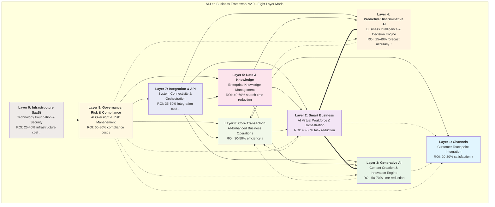

### Layer Relationship Matrix

| Layer | Depends On | Enhances | Orchestrates | Governed By |
|-------|-----------|----------|--------------|-------------|
| L1: Channels | L2, L6 | - | - | L8 |
| L2: Smart Business | L5, L6, L7 | L1, L6 | L3, L4 | L8 |
| L3: Generative AI | L5, L7 | L1, L6 | - | L8 |
| L4: Predictive/Discriminative AI | L5, L7 | L6 | - | L8 |
| L5: Data & Knowledge | L7, L8 | All | - | L8 |
| L6: Core Transaction | L7, L8 | L1, L2 | - | L8 |
| L7: Integration & API | L8, L9 | L2-L6 | - | L8 |
| L8: GRC | L9 | All | - | - |
| L9: Infrastructure | - | All | - | L8 |

---

## Layer Architecture

### Layer Dependencies & Data Flow

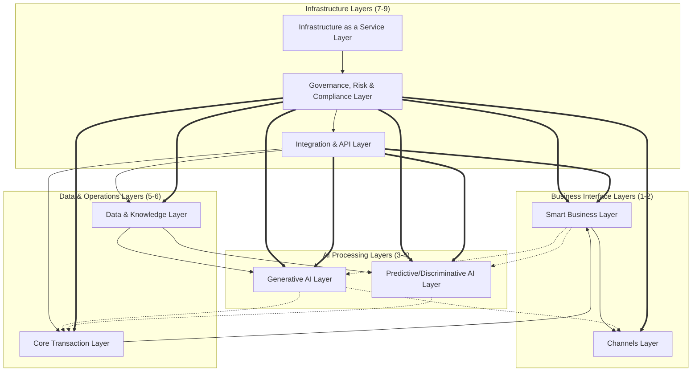

---

## Layer Detailed Specifications

### Layer 1: Channels Layer

**Business Purpose:** Customer Touchpoint Integration and Experience Optimization

#### Capabilities

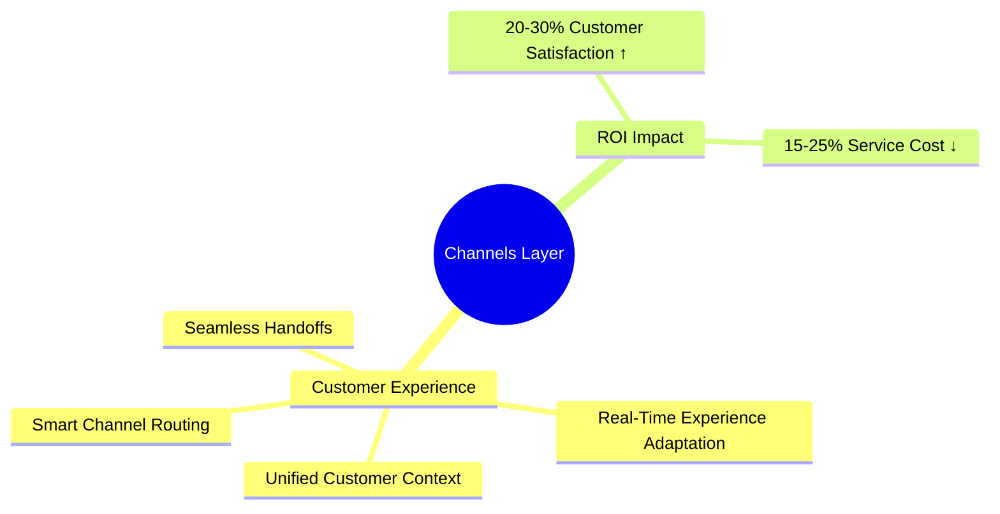

#### Key Features
- **Smart Channel Routing:** AI-driven customer journey optimization across touchpoints
- **Unified Customer Context:** 360-degree view of customer interactions and preferences
- **Real-Time Experience Adaptation:** Dynamic personalization based on behavior and context
- **Seamless Handoffs:** Frictionless transitions between channels and agents

#### Technology Components
- Omnichannel communication platforms
- Customer Data Platforms (CDP)
- Real-time personalization engines
- Conversation AI interfaces

#### Success Metrics
- Customer Satisfaction Score (CSAT): 20-30% improvement
- Service Cost per Interaction: 15-25% reduction
- Channel Switching Rate: 30-40% reduction
- First Contact Resolution: 25-35% improvement

---

### Layer 2: Smart Business Layer

**Business Purpose:** AI-Powered Virtual Workforce and Business Process Automation

#### Capabilities

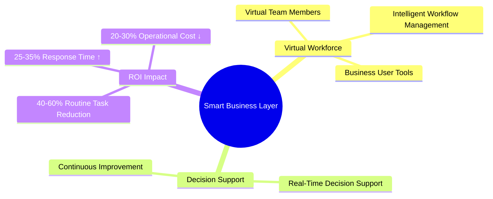

#### Key Features
- **Virtual Team Members:** AI agents performing specialized business functions
- **Intelligent Workflow Management:** Automated process orchestration and optimization
- **Business User Tools:** No-code/low-code AI capability deployment
- **Real-Time Decision Support:** Context-aware recommendations and insights
- **Continuous Improvement:** Self-learning systems that optimize over time

#### Technology Components
- AI Agent orchestration platforms (Claude Agent SDK)
- Workflow automation engines
- Business process management systems
- Decision support frameworks

#### Success Metrics
- Routine Task Automation: 40-60% reduction in manual work
- Response Time: 25-35% improvement
- Operational Cost: 20-30% reduction
- Employee Satisfaction: 15-25% increase

---

### Layer 3: Generative AI Layer

**Business Purpose:** Intelligent Content Creation and Innovation Engine

#### Capabilities

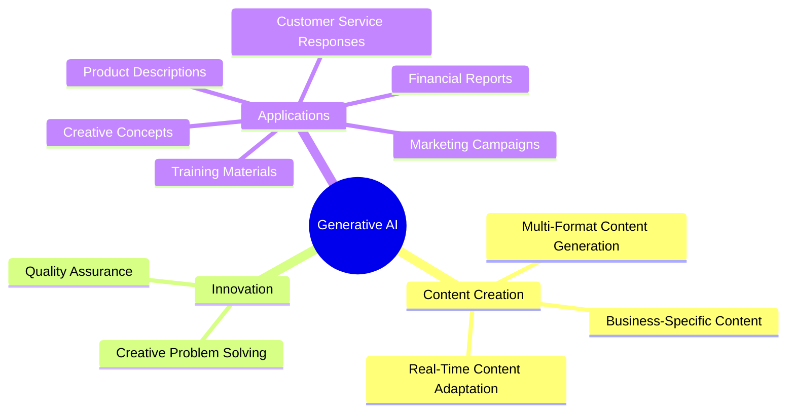

#### Key Features
- **Multi-Format Content Generation:** Text, images, code, data across formats
- **Business-Specific Content:** Domain-adapted models with company knowledge
- **Real-Time Content Adaptation:** Dynamic content optimization based on performance
- **Creative Problem Solving:** Novel solution generation for complex challenges
- **Quality Assurance:** Automated content validation and brand compliance

#### Applications
- Marketing campaigns and creative assets
- Customer service responses and documentation
- Training materials and knowledge articles
- Product descriptions and technical specifications
- Financial reports and business documents
- Innovative concepts and strategic proposals

#### Technology Components
- Foundation models (Claude, GPT-4, etc.)
- Fine-tuned domain models
- Content management systems
- Quality validation frameworks

#### Success Metrics
- Content Creation Time: 50-70% reduction
- Content Volume: 30-40% increase
- Engagement Rate: 25-35% improvement
- Content Quality Score: 20-30% increase

---

### Layer 4: Predictive & Discriminative AI Layer

**Business Purpose:** Business Intelligence and Automated Decision-Making Engine

#### Capabilities

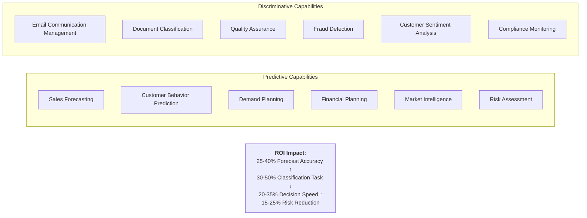

#### Predictive Capabilities
- **Sales Forecasting:** Advanced time-series prediction for revenue planning
- **Customer Behavior Prediction:** Churn, lifetime value, and propensity modeling
- **Demand Planning:** Inventory and supply chain optimization
- **Financial Planning:** Budget forecasting and resource allocation
- **Market Intelligence:** Trend analysis and competitive insights
- **Risk Assessment:** Proactive risk identification and mitigation

#### Discriminative Capabilities
- **Email Communication Management:** Intelligent routing and prioritization
- **Document Classification:** Automated categorization and extraction
- **Quality Assurance:** Automated testing and defect detection
- **Fraud Detection:** Anomaly detection and pattern recognition
- **Customer Sentiment Analysis:** Real-time emotion and intent detection
- **Compliance Monitoring:** Automated policy violation detection

#### Technology Components
- Machine learning model platforms
- Time-series analysis systems
- Classification and clustering algorithms
- Anomaly detection frameworks
- Natural language processing engines

#### Success Metrics
- Forecast Accuracy: 25-40% improvement
- Classification Task Reduction: 30-50%
- Decision Speed: 20-35% increase
- Risk Incident Reduction: 15-25%

---

### Layer 5: Data & Knowledge Layer

**Business Purpose:** Enterprise Knowledge Management and Information Access System

#### Information Types
- Traditional business data (structured databases)
- Documents and communications (unstructured content)
- Multimedia content (images, video, audio)
- Real-time information (streaming data)
- Historical records (archives and logs)

#### Capabilities
- **Business Knowledge Maps:** Semantic understanding of enterprise information
- **Smart Search & Retrieval:** Context-aware information discovery
- **Context-Aware Access:** Personalized information presentation
- **Automatic Organization:** AI-driven taxonomy and classification
- **Intelligent Q&A:** Natural language query processing
- **Relationship Mapping:** Knowledge graph construction and traversal
- **Global Information Access:** Unified view across all data sources

#### Technology Components
- Supabase PostgreSQL with JSONB storage
- Knowledge graph databases
- Vector databases for semantic search
- Data lake and warehouse infrastructure
- Real-time data streaming platforms

#### Success Metrics
- Information Search Time: 40-60% reduction
- Decision Speed: 25-35% improvement
- Data Accessibility: 30-45% increase
- Knowledge Discovery: 35-50% improvement

---

### Layer 6: Core Transaction Layer

**Business Purpose:** Business Operations Foundation with AI Enhancement

#### System Categories
- **AI-Enhanced CRM:** Intelligent customer relationship management
- **AI-Powered ERP:** Smart enterprise resource planning
- **Intelligent Business Process Management:** Automated workflow optimization

#### Capabilities
- **Smart Lead Management:** AI-driven lead scoring and routing
- **Customer Journey Intelligence:** Predictive journey mapping and optimization
- **Opportunity Intelligence:** Win probability and deal optimization
- **Relationship Mapping:** Automated stakeholder and influence analysis
- **Financial Intelligence:** Automated reconciliation and forecasting
- **Supply Chain Optimization:** Demand sensing and inventory optimization
- **Resource Optimization:** Workforce planning and allocation
- **Workflow Optimization:** Process mining and improvement
- **Compliance Automation:** Automated policy enforcement

#### Technology Components
- CRM platforms (Salesforce, HubSpot, etc.)
- ERP systems (SAP, Oracle, Microsoft Dynamics)
- Business process management suites
- Workflow automation platforms

#### Success Metrics
- Operational Efficiency: 30-50% improvement
- Processing Time: 25-40% reduction
- Operational Cost: 20-35% decrease
- Process Compliance: 40-60% improvement

---

### Layer 7: Integration & API Layer

**Business Purpose:** System Connectivity and Orchestration

#### Capabilities

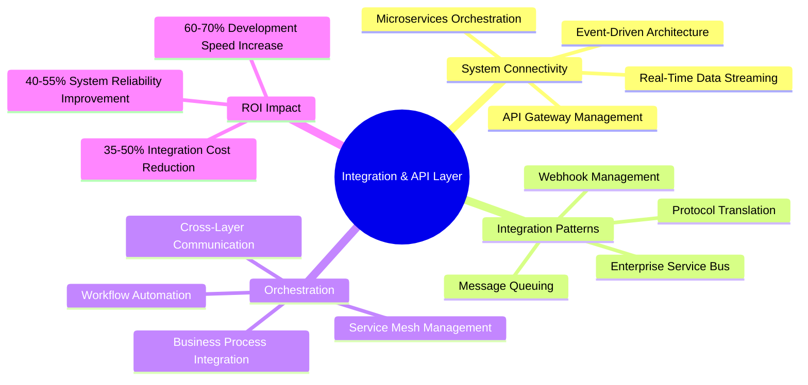

#### Key Features
- **API Gateway Management:** Centralized API access control and monitoring
- **Microservices Orchestration:** Service discovery, routing, and load balancing
- **Event-Driven Architecture:** Asynchronous messaging and event streaming
- **Real-Time Data Streaming:** Low-latency data pipeline management
- **Enterprise Service Bus:** Legacy system integration patterns
- **Message Queuing:** Reliable asynchronous communication
- **Webhook Management:** Event-driven integration with external systems
- **Protocol Translation:** Bridge between different communication standards

#### Technology Components
- API gateways (Kong, Apigee, AWS API Gateway)
- Message brokers (RabbitMQ, Kafka, Azure Service Bus)
- Integration platforms (MuleSoft, Dell Boomi, Zapier)
- Service mesh (Istio, Linkerd)
- MCP (Model Context Protocol) integrations

#### Success Metrics
- Integration Cost: 35-50% reduction
- Development Speed: 60-70% increase
- System Reliability: 40-55% improvement
- API Response Time: 30-45% decrease

---

### Layer 8: Governance, Risk & Compliance (GRC) Layer

**Business Purpose:** AI Oversight and Risk Management

#### Framework Components

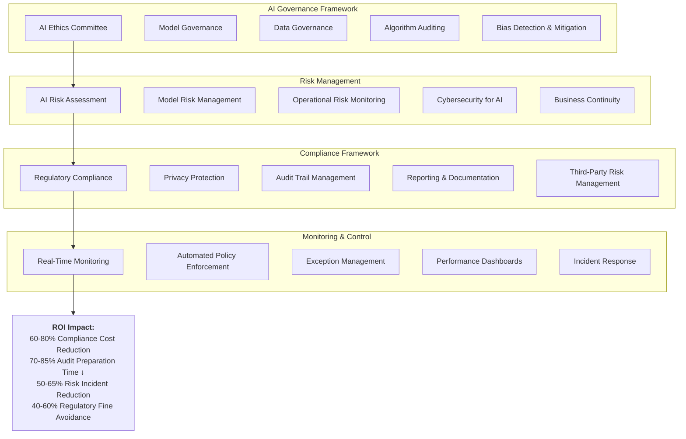

#### AI Governance Capabilities
- **AI Ethics Committee:** Cross-functional oversight of AI initiatives
- **Model Governance:** Version control, approval workflows, performance tracking
- **Data Governance:** Data quality, lineage, and usage policies
- **Algorithm Auditing:** Transparent model behavior documentation
- **Bias Detection & Mitigation:** Fairness testing and remediation

#### Risk Management Capabilities
- **AI Risk Assessment:** Systematic evaluation of AI implementation risks
- **Model Risk Management:** Validation, monitoring, and control of AI models
- **Operational Risk Monitoring:** Real-time tracking of operational failures
- **Cybersecurity for AI:** Protection against adversarial attacks and data breaches
- **Business Continuity:** Disaster recovery and resilience planning

#### Compliance Capabilities
- **Regulatory Compliance:** Adherence to industry and regional regulations (GDPR, CCPA, AI Act)
- **Privacy Protection:** Data minimization, consent management, access controls
- **Audit Trail Management:** Comprehensive logging and traceability
- **Reporting & Documentation:** Automated compliance reporting and evidence collection
- **Third-Party Risk Management:** Vendor assessment and monitoring

#### Monitoring & Control
- **Real-Time Monitoring:** Dashboard visibility into AI system performance and compliance
- **Automated Policy Enforcement:** Rules engine for automatic policy application
- **Exception Management:** Escalation and resolution workflows for violations
- **Performance Dashboards:** Executive and operational metrics visualization
- **Incident Response:** Automated detection and response to compliance breaches

#### Technology Components
- Governance platforms (Collibra, Informatica, Alation)
- Model risk management tools (SAS, Moody's Analytics)
- Compliance management systems (OneTrust, TrustArc)
- Security information and event management (SIEM)
- Policy automation frameworks

#### Success Metrics
- Compliance Cost: 60-80% reduction
- Audit Preparation Time: 70-85% reduction
- Risk Incident Reduction: 50-65%
- Regulatory Fine Avoidance: 40-60% improvement
- Time to Compliance: 55-70% decrease

---

### Layer 9: Infrastructure as a Service (IaaS) Layer

**Business Purpose:** Technology Foundation and Security Architecture

#### Infrastructure Categories
- **Cloud Computing Platforms:** Scalable compute, storage, and networking
- **Security & Compliance Management:** Enterprise-grade security frameworks
- **Development & Innovation Platform:** DevSecOps and CI/CD capabilities
- **Vendor Management & Interoperability:** Multi-cloud and hybrid strategies

#### Capabilities
- **Multi-Cloud Flexibility:** Avoid vendor lock-in with portable architectures
- **Hybrid Integration:** Seamless cloud-to-on-premises connectivity
- **Global Reach:** Geographic distribution for performance and compliance
- **Automatic Scaling:** Dynamic resource allocation based on demand
- **Disaster Recovery:** Automated backup and failover systems
- **Enterprise Security Framework:** Defense-in-depth security architecture
- **Regulatory Compliance:** Built-in compliance controls and certifications
- **Identity Management:** Centralized authentication and authorization
- **Threat Detection:** AI-powered security monitoring and response
- **Rapid Application Development:** Platform-as-a-Service (PaaS) capabilities
- **Continuous Improvement:** Automated patching and updates
- **Innovation Labs:** Sandbox environments for experimentation
- **Vendor Independence:** Technology abstraction and portability
- **Technology Risk Management:** Systematic evaluation of infrastructure risks

#### Technology Components
- DigitalOcean App Platform
- Vercel for frontend optimization
- Supabase for backend and database
- GitHub Actions for CI/CD
- Cloud security platforms (Microsoft Defender, AWS Security Hub)
- Container orchestration (Kubernetes, Docker)

#### Success Metrics
- Infrastructure Cost: 25-40% reduction
- System Reliability: 30-50% improvement (99.9%+ uptime)
- Deployment Speed: 40-60% increase
- Security Incident: 20-35% reduction
- Infrastructure Agility: 50-70% improvement

---

## Implementation Scalability

### Organization Profile-Based Implementation

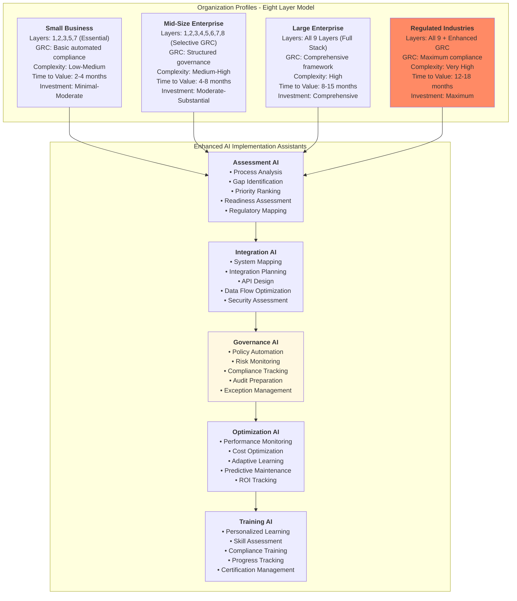

### Implementation Profiles

#### Small Business Profile
- **Recommended Layers:** 1, 2, 3, 5, 7 (Essential AI capabilities)
- **GRC Approach:** Basic automated compliance with lightweight governance
- **Complexity:** Low-Medium
- **Time to Value:** 2-4 months
- **Investment Level:** Minimal-Moderate ($50K-$250K)
- **Target Outcomes:** Quick wins in customer experience and content creation

#### Mid-Size Enterprise Profile
- **Recommended Layers:** 1, 2, 3, 4, 5, 6, 7, 8 (Selective GRC implementation)
- **GRC Approach:** Structured governance with department-level oversight
- **Complexity:** Medium-High
- **Time to Value:** 4-8 months
- **Investment Level:** Moderate-Substantial ($250K-$2M)
- **Target Outcomes:** Operational transformation with measurable ROI

#### Large Enterprise Profile
- **Recommended Layers:** All 9 layers (Full stack implementation)
- **GRC Approach:** Comprehensive governance framework with enterprise-wide policies
- **Complexity:** High
- **Time to Value:** 8-15 months
- **Investment Level:** Comprehensive ($2M-$10M+)
- **Target Outcomes:** Complete digital transformation with strategic competitive advantage

#### Regulated Industries Profile
- **Recommended Layers:** All 9 layers with enhanced GRC capabilities
- **GRC Approach:** Maximum compliance with industry-specific requirements (Financial Services, Healthcare, Government)
- **Complexity:** Very High
- **Time to Value:** 12-18 months
- **Investment Level:** Maximum ($5M-$20M+)
- **Target Outcomes:** Compliant AI transformation with zero regulatory risk tolerance

---

## Technology Stack

### Comprehensive Technology Context

```mermaid
C4Context
    title AI-Led Business Framework v2.0 - Eight Layer Technology Context
    
    Enterprise(org, "Organization", "Business seeking comprehensive AI transformation")
    
    System_Boundary(framework, "AI Business Framework v2.0") {
        System(channels, "Channels Layer", "Customer touchpoint integration")
        System(smartbiz, "Smart Business Layer", "AI virtual workforce orchestration")
        System(genai, "Generative AI Layer", "Content creation and innovation")
        System(predai, "Predictive AI Layer", "Business intelligence and decisions")
        System(data, "Data & Knowledge Layer", "Enterprise knowledge management")
        System(core, "Core Transaction Layer", "AI-enhanced business operations")
        System(integration, "Integration & API Layer", "System connectivity & orchestration")
        System(grc, "GRC Layer", "AI governance, risk & compliance")
        System(iaas, "Infrastructure Layer", "Cloud foundation & security")
    }
    
    System_Ext(customers, "Customers", "End users and business customers")
    System_Ext(regulators, "Regulators", "Compliance and oversight bodies")
    System_Ext(vendors, "Technology Partners", "AI and cloud service providers")
    System_Ext(auditors, "Auditors", "External compliance and risk assessors")
    
    Rel(org, channels, "Manages customer interactions")
    Rel(customers, channels, "Interacts through")
    Rel(regulators, grc, "Monitors compliance")
    Rel(auditors, grc, "Audits framework")
    Rel(grc, smartbiz, "Governs AI operations")
    Rel(grc, genai, "Ensures ethical AI")
    Rel(grc, predai, "Manages model risk")
    Rel(integration, core, "Orchestrates systems")
    Rel(vendors, iaas, "Provides infrastructure")
```

### BAIV Platform Technology Stack

#### Frontend & UI/UX
- **Design System:** Figma Make for design-to-code workflows
- **Framework:** Next.js with React
- **Component Library:** shadcn/ui
- **Styling:** Tailwind CSS

#### Backend & Data
- **Database:** Supabase PostgreSQL with JSONB storage
- **API Layer:** Supabase REST and GraphQL APIs
- **Real-Time:** Supabase Realtime subscriptions
- **Authentication:** Supabase Auth

#### AI & Orchestration
- **Primary AI:** Claude Agent SDK (Anthropic)
- **Model Context Protocol:** MCP integrations for Figma, Google Drive, etc.
- **Ontology Management:** schema.org-grounded JSON-LD structures
- **Knowledge Graphs:** InfraNodus for analysis

#### Integration & Deployment
- **API Gateway:** Custom Next.js API routes
- **CI/CD:** GitHub Actions
- **Hosting:** DigitalOcean App Platform + Vercel hybrid
- **Monitoring:** Built-in observability frameworks

#### Development Tools
- **Code Development:** Claude Code CLI
- **Version Control:** GitHub
- **Testing:** pytest (Python), Jest (JavaScript/TypeScript)
- **Documentation:** Markdown-based with automated generation

---

## ROI Analysis

### Comprehensive ROI Impact Comparison

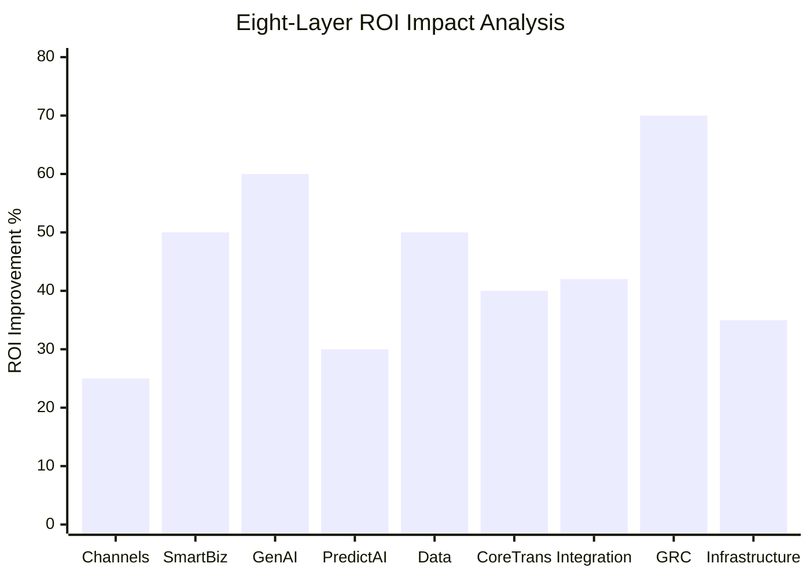

### ROI by Layer Summary

| Layer | Primary ROI Metric | Improvement Range | Time to Realize |
|-------|-------------------|-------------------|-----------------|
| L1: Channels | Customer Satisfaction | 20-30% ↑ | 2-4 months |
| L2: Smart Business | Routine Task Reduction | 40-60% ↓ | 3-6 months |
| L3: Generative AI | Content Creation Time | 50-70% ↓ | 1-3 months |
| L4: Predictive/Discriminative | Forecast Accuracy | 25-40% ↑ | 4-8 months |
| L5: Data & Knowledge | Information Search Time | 40-60% ↓ | 2-5 months |
| L6: Core Transaction | Operational Efficiency | 30-50% ↑ | 4-8 months |
| L7: Integration & API | Integration Cost | 35-50% ↓ | 3-6 months |
| L8: GRC | Compliance Cost | 60-80% ↓ | 6-12 months |
| L9: Infrastructure | Infrastructure Cost | 25-40% ↓ | 2-4 months |

### Composite ROI Calculation

**Example: Mid-Size Enterprise Implementation**

Assumptions:
- Annual Revenue: $100M
- IT Budget: $5M (5% of revenue)
- Implementation Investment: $1.5M
- Implementation Timeline: 6 months

**Year 1 Benefits:**
- Operational Cost Reduction: $1.8M (30% of $6M operational costs)
- Revenue Enhancement: $2.5M (2.5% revenue increase from better customer experience)
- Compliance Cost Savings: $600K (60% reduction of $1M compliance costs)
- **Total Year 1 Benefits:** $4.9M

**ROI Calculation:**
- Net Benefit (Year 1): $4.9M - $1.5M = $3.4M
- ROI: ($3.4M / $1.5M) × 100 = **227%**
- Payback Period: **3.7 months**

---

## Implementation Methodology

### Phase-Based Implementation Approach

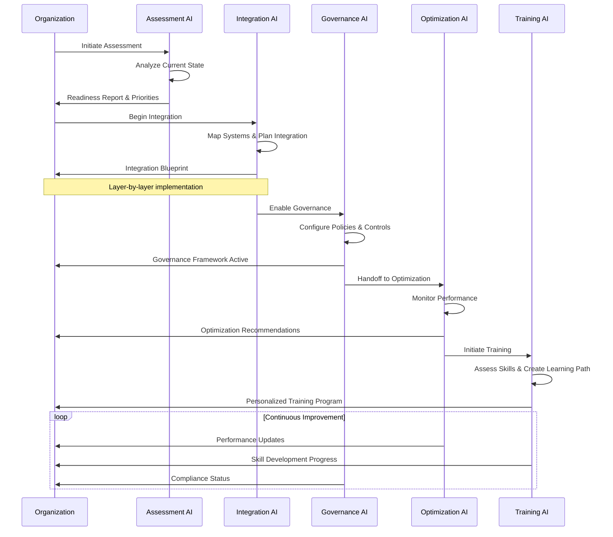

### Implementation Phases

#### Phase 1: Discovery & Assessment (4-6 weeks)
- Current state analysis
- Capability gap assessment
- Regulatory requirement mapping
- Technology stack evaluation
- ROI modeling and business case development

**Deliverables:**
- Assessment report with findings and recommendations
- Prioritized layer implementation roadmap
- Investment and resource requirements
- Risk assessment and mitigation plan

#### Phase 2: Foundation & Architecture (6-8 weeks)
- Infrastructure layer deployment (L9)
- Integration layer setup (L7)
- Data layer foundation (L5)
- Security and governance framework establishment (L8)

**Deliverables:**
- Deployed infrastructure environment
- API gateway and integration platform
- Data architecture and schemas
- Governance policies and procedures

#### Phase 3: Core Capabilities (8-12 weeks)
- Core transaction system enhancement (L6)
- Smart business layer deployment (L2)
- AI model integration preparation (L3, L4)

**Deliverables:**
- Enhanced CRM/ERP systems
- AI agent orchestration platform
- Business process automation workflows
- Initial AI model deployments

#### Phase 4: AI Enhancement (8-10 weeks)
- Generative AI layer activation (L3)
- Predictive/Discriminative AI deployment (L4)
- Channels layer optimization (L1)

**Deliverables:**
- Live generative AI capabilities
- Predictive analytics models
- Enhanced customer experience touchpoints
- Content generation workflows

#### Phase 5: Optimization & Scale (Ongoing)
- Continuous monitoring and improvement
- Model performance optimization
- User adoption and change management
- Governance and compliance refinement

**Deliverables:**
- Performance dashboards
- Optimization recommendations
- User training completion
- Compliance audit reports

---

## Governance Framework

### GRC Implementation Workflow

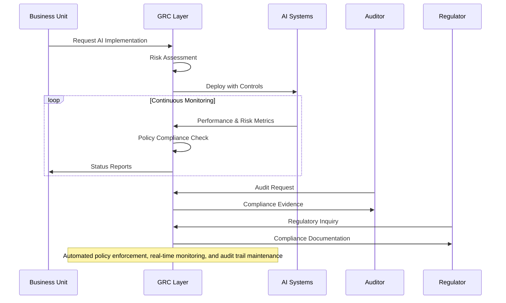

### Governance Principles

#### 1. Responsible AI by Design
- Ethical considerations integrated from inception
- Transparency in AI decision-making processes
- Explainability requirements for high-risk applications
- Human oversight for critical decisions

#### 2. Risk-Based Approach
- AI risk classification framework (Low, Medium, High, Unacceptable)
- Proportional governance controls based on risk level
- Continuous risk reassessment as systems evolve
- Proactive mitigation strategies

#### 3. Regulatory Compliance
- Multi-jurisdiction compliance capability
- Industry-specific requirement adherence
- Automated compliance monitoring and reporting
- Regular compliance audits and assessments

#### 4. Data Privacy & Protection
- Privacy by design and by default
- Data minimization and purpose limitation
- Consent management and user rights
- Cross-border data transfer compliance

#### 5. Continuous Monitoring & Improvement
- Real-time performance and compliance dashboards
- Automated anomaly detection and alerting
- Regular model performance validation
- Continuous governance process refinement

### Compliance Frameworks Supported

- **GDPR** (General Data Protection Regulation)
- **CCPA/CPRA** (California Consumer Privacy Act)
- **EU AI Act** (Artificial Intelligence Act)
- **SOX** (Sarbanes-Oxley Act)
- **HIPAA** (Health Insurance Portability and Accountability Act)
- **PCI DSS** (Payment Card Industry Data Security Standard)
- **ISO 27001** (Information Security Management)
- **SOC 2** (Service Organization Control 2)
- **NIST AI Risk Management Framework**

---

## Appendices

### Appendix A: Value Proposition Summary

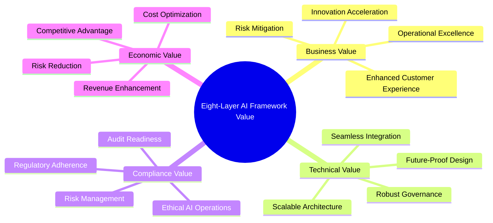

### Appendix B: Glossary of Terms

- **AI Agent:** Autonomous software entity that performs tasks on behalf of users or systems
- **API Gateway:** Centralized entry point for API requests with security, routing, and monitoring
- **Claude Agent SDK:** Anthropic's framework for building AI agent applications
- **GRC:** Governance, Risk, and Compliance - integrated framework for managing these domains
- **IaaS:** Infrastructure as a Service - cloud computing model providing virtualized resources
- **JSON-LD:** JSON for Linking Data - method for encoding linked data using JSON
- **Knowledge Graph:** Structured representation of information showing relationships between entities
- **MCP:** Model Context Protocol - standardized way for AI models to interact with external tools
- **Ontology:** Formal representation of knowledge with defined concepts and relationships
- **RAG:** Retrieval-Augmented Generation - technique combining retrieval and generation for AI responses
- **Schema.org:** Collaborative vocabulary for structured data markup on web pages
- **TDD:** Test-Driven Development - software development approach writing tests before code

### Appendix C: Key Success Factors

1. **Executive Sponsorship:** Strong C-level commitment and accountability
2. **Clear Strategy:** Well-defined vision, objectives, and success metrics
3. **Change Management:** Comprehensive user adoption and training programs
4. **Data Foundation:** High-quality, accessible data infrastructure
5. **Governance Structure:** Established policies, processes, and oversight
6. **Technology Expertise:** Skilled teams or trusted implementation partners
7. **Iterative Approach:** Agile methodology with rapid value delivery
8. **Measurement Culture:** Data-driven decision making and continuous improvement

### Appendix D: Common Pitfalls to Avoid

1. **Technology-First Thinking:** Implementing AI without clear business objectives
2. **Insufficient Governance:** Deploying AI without proper oversight and controls
3. **Data Quality Neglect:** Underestimating the importance of data preparation
4. **Change Resistance:** Failing to address organizational resistance to AI
5. **Vendor Lock-In:** Over-dependence on single vendor solutions
6. **Scope Creep:** Attempting too much too quickly without focused priorities
7. **Compliance Afterthought:** Adding governance after implementation instead of from start
8. **Measurement Gaps:** Failing to establish clear metrics and tracking mechanisms

### Appendix E: Contact Information

**BAIV - Be AI Visible**  
AI/BI & Digital Transformation Consulting  

**Services Offered:**
- AI Strategy & Readiness Assessment
- Framework Implementation & Integration
- Governance & Compliance Setup
- Training & Change Management
- Ongoing Optimization & Support

**Platform Foundation Core (PF-Core):**
- BAIV: Marketing AI Visibility
- AIR: AI Readiness Labs - Strategy & Innovation
- W4M: Wings4Mind.ai - Value Engineering & PF Strategy

---

## Document Control

**Version:** 2.0  
**Last Updated:** December 2024  
**Document Owner:** BAIV  
**Classification:** Public  
**Review Cycle:** Quarterly  

**Change Log:**

| Version | Date | Author | Changes |
|---------|------|--------|---------|
| 1.0 | Nov 2024 | BAIV | Initial seven-layer framework |
| 1.1 | Dec 2024 | BAIV | Added ontology and capability details |
| 2.0 | Dec 2024 | BAIV | Expanded to eight-layer model with GRC and Integration layers |

---

*This document is part of the BAIV AI-Led Business Transformation Framework. For implementation support, customization, or additional information, please contact BAIV.*
