# PF-Core Agentic Development Stack
## MVP Visual Guide v2.1

**Document:** PFC_AGENTIC_MVP_VISUAL_GUIDE_v2.1.md  
**Version:** 2.1.0  
**Date:** December 2025  
**Timeline:** 6 Weeks to Production  

---

## Document Overview

This guide provides a comprehensive visual walkthrough of the PF-Core Agentic Development Stack. It maps directly to the Figma UI structure (Program Manager/Solution Architect → Plan → Build → Track) and establishes the critical principle that **Value Engineering drives everything**.

The document is organized to answer three questions:
1. **What are we building?** (Parts 1-3: Architecture & Components)
2. **How does it work?** (Parts 4-5: Flows & Integration)
3. **How do we build it?** (Parts 6-9: Implementation & Reference)

---

## Part 1: The Complete Picture

### 1.1 Value Engineering First

**Scope:** This diagram establishes the foundational principle of our entire development approach. Unlike traditional feature-driven development where you start with "what feature do we want?", PF-Core starts with "what value are we creating and why does it matter strategically?"

**Purpose:** To show that Value Engineering (RRR, VSOM, OKR modules) combined with Client-Org Context produces the Value Proposition, which then cascades through PRD → Plan → Build → Track. This ensures every line of code we write is traceable back to strategic business value and measurable outcomes.

```mermaid
flowchart TB
    subgraph VE["🎯 VALUE ENGINEERING (Foundation)"]
        direction TB
        RRR[RRR: Roles, Responsibilities, RACI]
        VSOM[VSOM: Vision, Strategy, Objectives, Metrics]
        OKR[OKR: Objectives & Key Results]
        
        RRR --> VSOM
        VSOM --> OKR
    end
    
    subgraph CONTEXT["🏢 CLIENT-ORG CONTEXT"]
        direction TB
        Tenant[Tenant Configuration]
        Instance[PF-Instance: BAIV / W4M / AIR]
        Domain[Domain-Specific Rules]
    end
    
    subgraph VP["💎 VALUE PROPOSITION"]
        direction TB
        Problem[Problem Worth Solving]
        Solution[Solution Approach]
        Benefits[Measurable Benefits]
        Differentiation[Competitive Moat]
    end
    
    VE -->|defines| VP
    CONTEXT -->|contextualizes| VP
    
    VP -->|drives| PRD[📄 PRD Generation]
    PRD -->|creates| PLAN[📋 Plan: Specs & Stories]
    PLAN -->|guides| BUILD[🔨 Build: Code & Data]
    BUILD -->|tracked by| TRACK[📊 Track: Progress & Quality]
    
    style VE fill:#6366F1,color:#fff
    style CONTEXT fill:#8B5CF6,color:#fff
    style VP fill:#EC4899,color:#fff
    style PRD fill:#3B82F6,color:#fff
    style PLAN fill:#10B981,color:#fff
    style BUILD fill:#F59E0B,color:#fff
    style TRACK fill:#06B6D4,color:#fff
```



### 1.2 The Correct Flow Hierarchy

**Scope:** This diagram presents the six distinct layers of our development stack, arranged from strategic foundation to tactical execution. Each layer depends on the layers above it and produces outputs consumed by layers below.

**Purpose:** To establish clear boundaries between strategic planning (Layers 1-3) and tactical execution (Layers 4-6). This separation ensures that developers always have complete context about WHY they're building something, not just WHAT to build. It also enables parallel workstreams where strategic planning can proceed while execution continues on approved work.


### 1.3 Mapping to Figma UI Structure

**Scope:** This diagram shows exactly how our agentic stack maps to the four main sections of the Figma UI design: Program Manager/Solution Architect, Plan, Build, and Track. Each UI section contains specific modules that correspond to our framework components.

**Purpose:** To bridge the gap between conceptual architecture and actual user interface. When designers work in Figma Make and developers implement in Next.js/shadcn, this mapping ensures everyone understands which backend capabilities power which UI components. It also establishes the feedback loop where Track insights flow back to Program Manager for continuous improvement.


---

## Part 2: Value Engineering Foundation

### 2.1 Value Engineering Components

**Scope:** This diagram breaks down the three core modules within Value Engineering: RRR (Roles, Responsibilities, RACI), VSOM (Vision, Strategy, Objectives, Metrics), and OKR (Objectives, Key Results, Initiatives). These modules collectively produce the strategic context, governance framework, and measurement framework that inform all downstream work.

**Purpose:** To show that Value Engineering is not a single monolithic concept but rather three interconnected modules that each serve a distinct purpose. RRR establishes WHO is responsible for what, VSOM establishes the STRATEGIC DIRECTION, and OKR establishes HOW we measure progress. Together, they create the Value Proposition that drives product development.


### 2.2 Client-Org Context & PF-Instance

**Scope:** This diagram illustrates the relationship between PF-Core (the shared platform foundation) and the three PF-Instances (BAIV, W4M, AIR). Each instance inherits core capabilities but extends them with instance-specific context, ontologies, and agents tailored to their domain.

**Purpose:** To demonstrate our multi-tenant architecture where a single codebase serves multiple business ventures. The Client-Org Context captures tenant-specific configuration, while the PF-Instance determines which specialized ontologies and agents are available. This separation enables code reuse while allowing deep customization per venture—critical for scaling the platform across BAIV (AI Visibility), W4M (Value Engineering), and AIR (AI Readiness).


### 2.3 Value Proposition to PRD Flow

**Scope:** This sequence diagram shows the temporal flow of how a Value Proposition transforms into a PRD and then into actionable Plan items. It traces the journey from initial Value Engineering definition through to story creation, highlighting the handoffs between system components.

**Purpose:** To provide a step-by-step understanding of the process flow that existing Python scripts and agents will execute. This is critical for integration work—developers can see exactly which component produces which artifact, enabling them to wire up the existing PRD generation scripts to the new Value Engineering inputs. The sequence also shows approval checkpoints where human review is required.


---

## Part 3: OAA Agent - Critical Early Component

### 3.1 Why OAA Agent First

**Scope:** This diagram emphasizes the critical dependency that makes the OAA (Ontology, Agent, Ability) Agent the first component we must build. It shows OAA's three core functions (Create, Test, Document) and how all other platform components depend on validated ontologies.

**Purpose:** To establish the build order priority. Without OAA Agent, we cannot create validated ontologies. Without validated ontologies, we cannot generate database schemas, type definitions, or API contracts. Without those, we cannot build features. This diagram should end any debate about what to build first—OAA is the critical path. BAIV specifically requires AI Visibility ontologies before any feature development can proceed.


### 3.2 OAA Agent Architecture

**Scope:** This diagram details the internal architecture of the OAA Agent, showing its inputs (Schema.org vocabulary, business requirements, existing ontologies), processing stages, and outputs (JSON-LD ontology, SQL schemas, TypeScript definitions, documentation). It also shows integration with the OAA Registry for version control and compliance.

**Purpose:** To provide developers with a clear specification for building the OAA Agent. Each box represents a distinct capability that must be implemented. The Registry integration is crucial—ontologies must be versioned, tracked for dependencies, and validated for compliance. This architecture ensures ontologies are not just created but properly managed throughout their lifecycle.


### 3.3 OAA Agent for BAIV

**Scope:** This diagram shows the specific ontologies required for the BAIV (Be AI Visible) instance. These are organized into three categories: Discovery ontologies (audit, competitor, gap analysis), Content ontologies (blog, social, schema markup), and Visibility ontologies (citation, presence, authority).

**Purpose:** To define the concrete deliverables the OAA Agent must produce for BAIV to function. These aren't abstract concepts—they're actual JSON-LD files that will be created, validated, and registered. This gives the development team a clear target list for Week 2 of implementation. Without these ontologies, BAIV cannot store discovery results, generate content briefs, or track AI visibility metrics.


---

## Part 4: Build Phase - Data Mapping

### 4.1 Build Architecture

**Scope:** This diagram shows the complete Build phase architecture, organized into four layers: Data Layer (Supabase, JSONB, RLS), API Layer (REST endpoints, validation, transforms), Agent Layer (OAA, PM, Architect, Developer agents), and UI Layer (Figma Make → Next.js → shadcn). It shows how approved Plans flow into the Build phase.

**Purpose:** To establish the technical stack and its interconnections. Developers need to understand that ontologies from OAA feed the Data Layer, which provides the foundation for APIs, which are consumed by Agents, which power the UI. This layered architecture ensures clean separation of concerns while maintaining data integrity through the ontology-driven approach.


### 4.2 Data Mapping Flow

**Scope:** This diagram traces how a single ontology (JSON-LD) generates multiple downstream artifacts: database tables, TypeScript types, and API routes. It shows the transformation chain from semantic definition to executable code.

**Purpose:** To demonstrate the power of ontology-driven development. Write the ontology once, and the OAA Agent generates everything else—database schemas with proper JSONB columns, TypeScript interfaces for type safety, and Zod schemas for runtime validation. This eliminates the "schema drift" problem where database, types, and API fall out of sync. When you change the ontology, regenerate everything.


### 4.3 JSONB Storage Pattern

**Scope:** This diagram details our JSONB storage pattern for Supabase tables. It shows the standard table structure (id, tenant_id, core fields, metadata JSONB, data JSONB, timestamps) and explains why this pattern provides flexibility while maintaining queryability.

**Purpose:** To establish the database design pattern all tables must follow. The combination of fixed columns for frequently-queried fields and JSONB columns for flexible/evolving data gives us the best of both worlds. This pattern enables ontology evolution without database migrations—new ontology properties go into the JSONB columns. The benefits (schema evolution, ontology compliance, query flexibility, version tolerance) justify the slight complexity increase.


---

## Part 5: Complete System Flow

### 5.1 End-to-End Flow with All Components

**Scope:** This comprehensive diagram shows the complete six-phase flow from Value Engineering through to Track. Each phase is expanded to show its key activities, and the arrows show the progression and feedback loops between phases.

**Purpose:** To provide a single "big picture" view of how all components work together. This is the diagram to reference when explaining the system to new team members or stakeholders. It shows that we're not just building features—we're building a complete value delivery system where strategic intent flows through to execution and is continuously measured and improved.


### 5.2 Agent Orchestration

**Scope:** This diagram shows how the various AI agents interact and hand off work to each other. It distinguishes between Core Agents (OAA, VE) that must be built first, Planning Agents (PM, Architect), and Execution Agents (Developer, Test). It also shows the shared orchestration layer that manages context and state.

**Purpose:** To define the agent ecosystem architecture. Not all agents are equal—Core Agents provide foundational capabilities that other agents depend on. The orchestration layer (shared context via CLAUDE.md, handoff protocols, state management) is what makes multi-agent collaboration possible. This diagram helps developers understand agent dependencies when planning build order.


---

## Part 6: Step-by-Step Implementation Plan

### 6.1 Implementation Roadmap (6 Weeks)

**Scope:** This Gantt chart shows the complete 6-week implementation timeline, broken into weekly milestones. Each week has specific deliverables that build on previous weeks, creating a clear critical path to MVP completion.

**Purpose:** To provide project management visibility into the build sequence. Week 1-2 focuses on OAA Agent (critical path), Week 3 on Value Proposition and PRD, Week 4 on Build infrastructure, Week 5 on Integration, and Week 6 on Polish. This timeline accounts for dependencies—you can't build the database layer (Week 4) until ontologies exist (Week 2).


### 6.2 Week 1: Foundation & OAA Start

**Scope:** This flowchart details the Day 1-5 activities for Week 1, organized into three phases: Value Engineering Setup (Days 1-2), Instance Configuration (Day 3), and OAA Agent Start (Days 4-5). Each box represents a specific task to complete.

**Purpose:** To give the development team a clear daily checklist for Week 1. By the end of Week 1, we should have VE module structure in place, BAIV instance configured, and OAA Agent interface defined with core parsing and generation capabilities started. This sets up everything needed for Week 2's ontology work.


### 6.3 Week 2: Complete OAA Agent

**Scope:** This flowchart details Week 2 activities: completing the OAA Agent core (Days 1-2), creating all BAIV ontologies (Days 3-4), and building the testing framework (Day 5). This is the most critical week—OAA Agent must be complete and validated.

**Purpose:** To ensure the critical path item (OAA Agent) is fully functional by end of Week 2. The specific BAIV ontologies listed (Discovery Audit, Gap Analysis, Content Brief, AI Visibility) are the minimum set required to proceed with BAIV feature development. The testing framework ensures ontologies are valid before they're used downstream.


### 6.4 Week 3: Value Proposition & PRD

**Scope:** This flowchart details Week 3 activities: building the Value Proposition module (Days 1-2), integrating the PRD Generator with existing Python scripts (Days 3-4), and creating the Plan Phase UI components (Day 5).

**Purpose:** To connect Value Engineering outputs to PRD generation. The VP module must capture problem statements, solution approaches, benefits, and success metrics. The PRD Generator integration leverages existing Python scripts and agents—we're not rebuilding, we're connecting. By end of Week 3, users can create a Value Proposition and generate a PRD through the UI.


### 6.5 Week 4: Build Phase - Data Layer

**Scope:** This flowchart details Week 4 activities: using OAA to generate database schemas from ontologies (Days 1-2), building the API layer (Days 3-4), and setting up the TDD framework (Day 5).

**Purpose:** To transform ontologies into working infrastructure. The OAA Agent's schema generation capabilities (built in Week 2) now produce actual Supabase tables with RLS policies. The API layer implements CRUD operations with Zod validation derived from ontologies. The TDD setup with Vitest ensures all subsequent code has test coverage from the start.


### 6.6 Week 5: Integration

**Scope:** This flowchart details Week 5 activities: building the agent orchestration layer (Days 1-2), integrating all UI panels with their backend services (Days 3-4), and running end-to-end tests (Day 5).

**Purpose:** To connect all previously-built components into a working system. Agent orchestration enables agents to share context and hand off work. UI integration wires the Figma Make components to actual APIs. End-to-end testing validates the complete flow from Value Engineering through to completed code. This week transforms separate components into an integrated platform.

```mermaid
flowchart TB
    subgraph Day1_2["Days 1-2: Agent Orchestration"]
        A1[Context Sharing Protocol]
        A2[Agent Handoff System]
        A3[State Management]
        A4[Error Handling]
    end
    
    subgraph Day3_4["Days 3-4: UI Integration"]
        B1[Connect Plan Panel to Agents]
        B2[Connect Build Panel to TDD]
        B3[Connect Track Panel to Beads]
        B4[Real-time Updates]
    end
    
    subgraph Day5["Day 5: E2E Testing"]
        C1[Full Flow Test: VE → VP → PRD → Plan → Build]
        C2[Agent Communication Tests]
        C3[Data Integrity Tests]
        C4[Performance Tests]
    end
    
    A1 --> A2 --> A3 --> A4
    A4 --> B1 --> B2 --> B3 --> B4
    B4 --> C1 --> C2 --> C3 --> C4
    
    style Day1_2 fill:#8B5CF6,color:#fff
    style Day3_4 fill:#EC4899,color:#fff
    style Day5 fill:#10B981,color:#fff
```



### 6.7 Week 6: Polish & Training

**Scope:** This flowchart details the final week: fixing integration issues discovered in Week 5 (Days 1-2), completing documentation (Days 3-4), and training the team (Day 5).

**Purpose:** To ensure the MVP is production-ready. Bug fixes address issues found in E2E testing. Documentation includes API docs, agent usage guides, ontology references, and workflow tutorials—essential for team adoption. Training ensures all developers can use the system effectively. By end of Week 6, we have a working MVP with a trained team ready to build features.

```mermaid
flowchart TB
    subgraph Day1_2["Days 1-2: Bug Fixes"]
        A1[Fix Integration Issues]
        A2[Resolve Edge Cases]
        A3[Performance Optimization]
    end
    
    subgraph Day3_4["Days 3-4: Documentation"]
        B1[API Documentation]
        B2[Agent Usage Guide]
        B3[Ontology Reference]
        B4[Workflow Tutorials]
    end
    
    subgraph Day5["Day 5: Team Training"]
        C1[Workflow Walkthrough]
        C2[Agent Interaction Demo]
        C3[Troubleshooting Guide]
        C4[Go-Live Checklist]
    end
    
    A1 --> A2 --> A3
    A3 --> B1 --> B2 --> B3 --> B4
    B4 --> C1 --> C2 --> C3 --> C4
    
    style Day1_2 fill:#DC2626,color:#fff
    style Day3_4 fill:#3B82F6,color:#fff
    style Day5 fill:#10B981,color:#fff
```

---

## Part 7: UI Panel Specifications

### 7.1 Program Manager Panel (Value Engineering)

**Scope:** This diagram shows the component structure for the Program Manager panel in the Figma UI. It has three main sections: Value Engineering (RRR, VSOM, OKR tabs), Context (instance selector, tenant config), and Status (alignment scores, health indicators, alerts).

**Purpose:** To specify what UI components must be built for the Program Manager section. This is where executives and solution architects configure the strategic foundation. The Status section provides real-time visibility into strategic alignment—surfacing issues before they propagate downstream.

```mermaid
graph TB
    subgraph PMPanel["PROGRAM MANAGER PANEL"]
        subgraph VE_Section["Value Engineering Section"]
            RRR_Tab[RRR Tab<br/>Roles & RACI Matrix]
            VSOM_Tab[VSOM Tab<br/>Vision → Metrics Cascade]
            OKR_Tab[OKR Tab<br/>Objectives & Key Results]
        end
        
        subgraph Context_Section["Context Section"]
            Instance_Select[Instance Selector<br/>BAIV / W4M / AIR]
            Tenant_Config[Tenant Configuration]
            Custom_Settings[Custom Settings]
        end
        
        subgraph Status_Section["Status Section"]
            Alignment_Score[Strategic Alignment Score]
            Health_Indicators[Health Indicators]
            Alerts[Active Alerts]
        end
    end
    
    style VE_Section fill:#6366F1,color:#fff
    style Context_Section fill:#8B5CF6,color:#fff
    style Status_Section fill:#10B981,color:#fff
```

### 7.2 Plan Panel (VP → PRD → Stories)

**Scope:** This diagram shows the component structure for the Plan panel. It has four sections: Value Proposition (VP builder, strategic linking, benefits), PRD Generation (generate button, preview, edit), Stories (list, prioritization, issue creation), and Approval (checklist, approve/reject buttons).

**Purpose:** To specify the workflow for creating and approving plans. Users build Value Propositions linked to VSOM, generate PRDs via AI agents, review and refine specs, break into stories, and approve for development. This panel is where strategic intent transforms into actionable work items.

```mermaid
graph TB
    subgraph PlanPanel["PLAN PANEL"]
        subgraph VP_Section["Value Proposition"]
            VP_Form[VP Builder Form]
            Strategic_Link[Link to VSOM]
            Benefits_Calc[Benefits Calculator]
        end
        
        subgraph PRD_Section["PRD Generation"]
            Generate_Btn[Generate PRD Button]
            PRD_Preview[PRD Preview<br/>Markdown Viewer]
            Edit_PRD[Edit & Refine]
        end
        
        subgraph Story_Section["Stories"]
            Story_List[Story List<br/>Estimated Hours]
            Prioritize[Drag & Drop Priority]
            Create_Issues[Create Beads Issues]
        end
        
        subgraph Approval["Approval"]
            Review_Checklist[Review Checklist]
            Approve_Btn[Approve & Proceed]
            Reject_Btn[Request Changes]
        end
    end
    
    VP_Section --> PRD_Section --> Story_Section --> Approval
    
    style VP_Section fill:#EC4899,color:#fff
    style PRD_Section fill:#8B5CF6,color:#fff
    style Story_Section fill:#3B82F6,color:#fff
    style Approval fill:#10B981,color:#fff
```

### 7.3 Build Panel (OAA + TDD + Data)

**Scope:** This diagram shows the component structure for the Build panel. It has four sections: OAA Ontology Agent (browser, create, test, docs), Data Mapping (schema view, API view, types), TDD Workspace (task select, phase indicator, test console, coverage), and Actions (run tests, generate code, complete task).

**Purpose:** To specify the developer workspace. The OAA section provides ontology management—critical for maintaining data consistency. Data Mapping shows what the ontologies produce. TDD Workspace is where actual coding happens with test-first discipline. The Build panel is where specs become working software.

```mermaid
graph TB
    subgraph BuildPanel["BUILD PANEL"]
        subgraph OAA_Section["OAA Ontology Agent"]
            Ontology_List[Ontology Browser]
            Create_Ontology[Create New Ontology]
            Test_Ontology[Test & Validate]
            Doc_Ontology[View Documentation]
        end
        
        subgraph Data_Section["Data Mapping"]
            Schema_View[Database Schema<br/>Generated from Ontology]
            API_View[API Endpoints<br/>Auto-generated]
            Types_View[TypeScript Types]
        end
        
        subgraph TDD_Section["TDD Workspace"]
            Task_Select[Select Ready Task]
            Phase_Indicator[RED → GREEN → REFACTOR]
            Test_Console[Test Output Console]
            Coverage_Gauge[Coverage: 80%+]
        end
        
        subgraph Actions["Actions"]
            Run_Tests[Run Tests]
            Generate_Code[Generate Code]
            Complete_Task[Complete Task]
        end
    end
    
    OAA_Section --> Data_Section --> TDD_Section --> Actions
    
    style OAA_Section fill:#DC2626,color:#fff
    style Data_Section fill:#0891B2,color:#fff
    style TDD_Section fill:#10B981,color:#fff
    style Actions fill:#F59E0B,color:#fff
```

---

## Part 8: Quick Reference

### 8.1 Complete Flow Summary

**Scope:** This simplified diagram shows the entire flow in one line: Value Engineering → Value Proposition → PRD → Plan → Build → Track, with the OAA Agent providing ontologies to multiple stages.

**Purpose:** To provide a memorable summary of the system. When explaining PF-Core to someone in 30 seconds, this is the diagram to draw. Note the iteration loop from Track back to Value Proposition—this represents continuous improvement based on measured outcomes.

```mermaid
graph LR
    A[🎯 Value Engineering] --> B[💎 Value Proposition]
    B --> C[📄 PRD]
    C --> D[📋 Plan]
    D --> E[🔨 Build]
    E --> F[📊 Track]
    F -.->|Iterate| B
    
    OAA[🔴 OAA Agent]
    OAA -.->|"Ontologies to all phases"| C
    OAA -.->|"Schemas"| E
    
    style A fill:#6366F1,color:#fff
    style B fill:#EC4899,color:#fff
    style C fill:#8B5CF6,color:#fff
    style D fill:#3B82F6,color:#fff
    style E fill:#10B981,color:#fff
    style F fill:#F59E0B,color:#fff
    style OAA fill:#DC2626,color:#fff
```

### 8.2 Key Principles

| Principle | Description |
|-----------|-------------|
| **Value First** | Everything starts with Value Engineering—RRR, VSOM, OKR define why we build |
| **Ontology Driven** | OAA Agent creates, tests, and documents all schemas—single source of truth |
| **Context Aware** | Client-Org Context and PF-Instance drive customization per venture |
| **TDD Mandatory** | 80%+ test coverage required—write tests before code |
| **Instance Specific** | BAIV, W4M, AIR each have unique ontologies and agents |

### 8.3 Build Order

```
1. 🔴 OAA Agent (Week 1-2) - CRITICAL FIRST
2. 🎯 Value Engineering Modules (Week 1)
3. 💎 Value Proposition Builder (Week 3)
4. 📄 PRD Generator Integration (Week 3)
5. 🔨 Data Layer (Week 4)
6. 🧪 TDD Framework (Week 4)
7. 🔗 Integration (Week 5)
8. ✨ Polish (Week 6)
```

### 8.4 Agent Quick Reference

| Agent | Purpose | Inputs | Outputs |
|-------|---------|--------|---------|
| **OAA** | Ontology management | Requirements, Schema.org | JSON-LD, SQL, Types, Docs |
| **VE** | Strategic context | VSOM, OKR | Strategic alignment |
| **PM** | PRD & Stories | Value Prop | PRD.md, Stories |
| **Architect** | Technical design | PRD | Schema, API design |
| **Developer** | TDD coding | Stories | Tests, Code |

---

## Part 9: Success Criteria

### 9.1 MVP Complete Checklist

- [ ] **OAA Agent**: Can create, test, and document ontologies
- [ ] **Value Engineering**: RRR, VSOM, OKR modules functional
- [ ] **Value Proposition**: Can create VP linked to VE
- [ ] **PRD Generation**: Automated from VP using existing scripts
- [ ] **Plan Phase**: Specs and Stories generated correctly
- [ ] **Build Phase**: Database, API from ontologies working
- [ ] **TDD**: 80%+ coverage achieved
- [ ] **BAIV Ontologies**: All core ontologies created and validated
- [ ] **Integration**: Full flow works end-to-end

### 9.2 Definition of Done

**Scope:** This simple flow shows the five criteria that must be met for any work item to be considered "done": Value Aligned, Ontology Valid, Tests First, 80%+ Coverage, and Documented.

**Purpose:** To establish a consistent quality bar across all development work. Every PR, every feature, every module must pass all five criteria. This prevents technical debt accumulation and ensures the platform remains maintainable as it grows.

```mermaid
graph LR
    subgraph Done["✅ DEFINITION OF DONE"]
        A[Value Aligned]
        B[Ontology Valid]
        C[Tests First]
        D[80%+ Coverage]
        E[Documented]
    end
    
    A --> B --> C --> D --> E
    
    style Done fill:#10B981,color:#fff
```

---

*MVP Visual Guide v2.1 - Value Engineering First, OAA Agent Critical Path*
