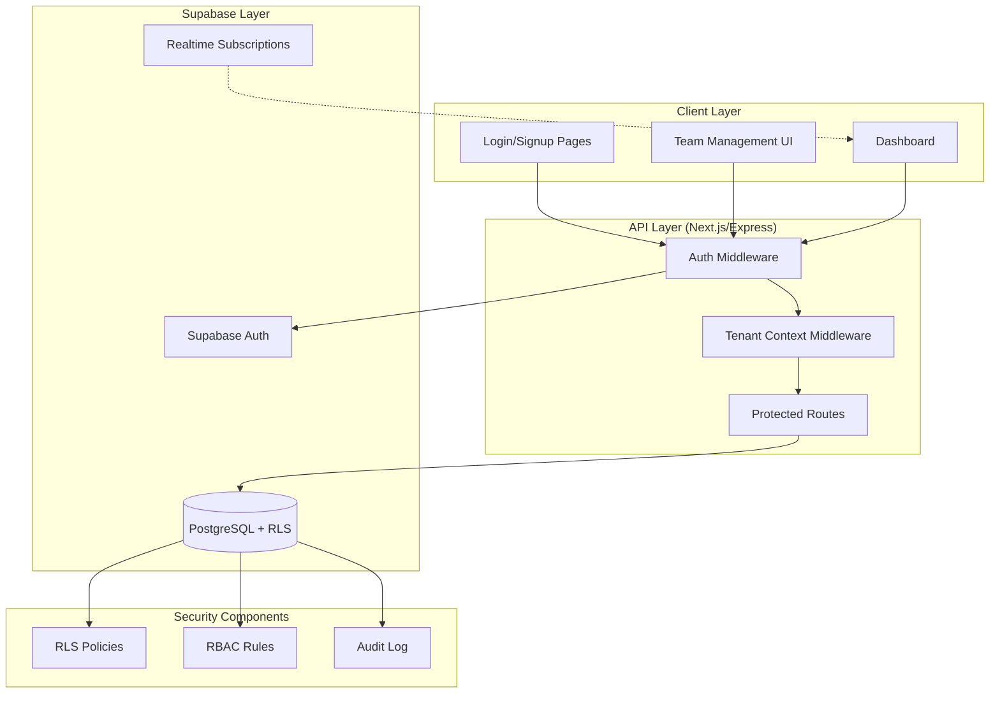
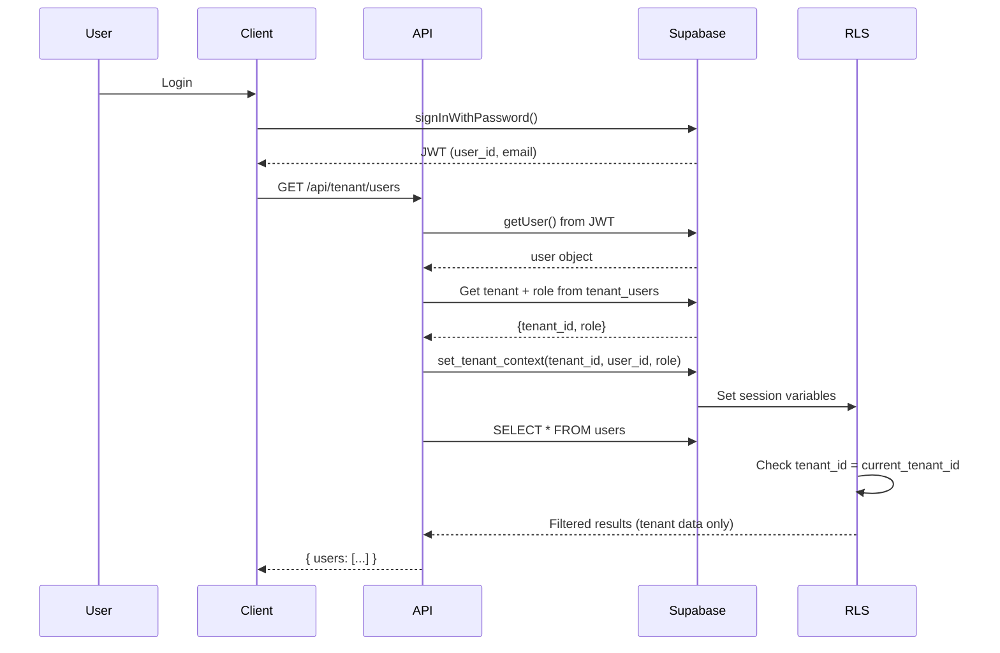
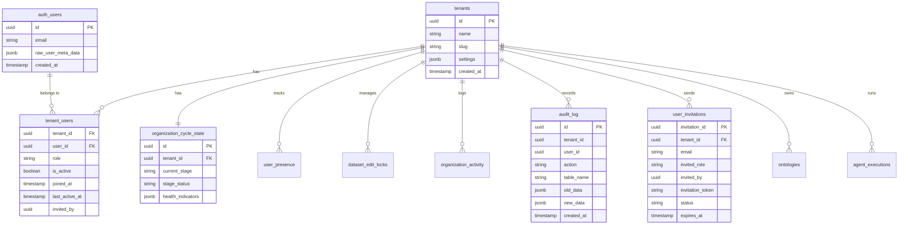

# Unified Security Foundation MVP v1.0
## Complete Security + Authentication + RBAC Implementation

**Version:** 1.0.0  
**Date:** January 5, 2026  
**Parent Documents:** 
- SECURITY_MULTIUSER_MVP_PRD_PBS_WBS.md (Compressed Security Plan)
- ROLE_MANAGEMENT_MINI_PRD_v1.0.md (RBAC Role Management)
- BAIV_MVP_TODO_PLAN_v2.3.0.md (MVP Master Plan)

**Total Effort:** 3-4 days (Week 1 of MVP)  
**Status:** Ready for Implementation  
**Priority:** P0 - Foundation (Must complete before all other MVP work)

---

## Executive Summary

This unified plan combines **compressed security foundation** + **RBAC role management** into a single, cohesive Week 1 deliverable that establishes complete security infrastructure for the MVP. This is the critical first step that enables all subsequent development.

### Why This Must Be First

| Dependency | Blocks Without Security |
|------------|------------------------|
| Agent Orchestration | Cannot determine who can execute agents |
| Multi-tenant Data | Cannot isolate tenant data |
| Dashboard Access | Cannot restrict views by role |
| API Development | Cannot enforce permissions |
| Ontology Management | Cannot track who modified what |
| Testing | Cannot test role-based features |

### What This Delivers

| Component | Status Before | Status After |
|-----------|--------------|--------------|
| Authentication | ❌ None | ✅ Supabase Auth (email, OAuth, magic link) |
| Authorization | ❌ None | ✅ 4-tier RBAC (Owner, Admin, Analyst, Viewer) |
| Multi-tenant Isolation | ❌ None | ✅ RLS policies on all tables |
| User Management | ❌ None | ✅ Complete team management UI/API |
| Audit Trail | ❌ None | ✅ All changes logged |
| Session Management | ❌ None | ✅ Secure JWT with refresh |

### Integration with BAIV MVP Plan

This replaces **Week 1: Foundation Services** (BAIV_MVP_TODO_PLAN_v2.3.0.md Section 4.2) with:

**Old Week 1 (Split Security):**
- Tuesday: Database setup
- Wednesday: Basic auth (incomplete)
- Thursday-Friday: Ontologies

**New Week 1 (Complete Security Foundation):**
- **Day 1:** Auth + RLS + Audit (6-7 hours)
- **Day 2:** Multi-user + Presence + Locks (5-6 hours)
- **Day 3:** Role Management API + UI (5-6 hours)
- **Day 4:** Testing + Documentation (4-5 hours)

**Total:** 20-24 hours = Week 1 complete security foundation

---

## Table of Contents

1. [Unified Requirements](#1-unified-requirements)
2. [Architecture Overview](#2-architecture-overview)
3. [Database Implementation](#3-database-implementation)
4. [API Implementation](#4-api-implementation)
5. [UI/UX Implementation](#5-uiux-implementation)
6. [Integration Points](#6-integration-points)
7. [Work Breakdown Structure (WBS)](#7-work-breakdown-structure-wbs)
8. [Testing Strategy](#8-testing-strategy)
9. [Deployment Checklist](#9-deployment-checklist)
10. [Alignment with BAIV MVP](#10-alignment-with-baiv-mvp)

---

## 1. Unified Requirements

### 1.1 Consolidated Functional Requirements

#### FR-SEC-01: Authentication (Supabase Auth)
**Source:** SECURITY_MULTIUSER_MVP (FR-AUTH-01 to FR-AUTH-08) + BAIV MVP (1.3.1)

**Requirements:**
- ✅ Email/password authentication
- ✅ Magic Link (passwordless)
- ✅ Google OAuth
- ✅ JWT with user_id, email, tenant_id, role
- ✅ Multi-tenant user assignment via `tenant_users`
- ✅ Tenant selector for multi-tenant users
- ✅ Future SAML SSO support (architecture only)

**Acceptance Criteria:**
```gherkin
Scenario: User signs up and joins tenant
  Given a new user with valid email
  When user signs up with email/password
  Then account is created in Supabase Auth
  And user_id is generated
  
Scenario: User accepts invitation
  Given user receives invitation email with token
  When user clicks link and logs in
  Then user is added to tenant with assigned role
  And user sees tenant dashboard
```

#### FR-SEC-02: Role-Based Access Control (RBAC)
**Source:** ROLE_MANAGEMENT_MINI_PRD + BAIV MVP (PFC-SEC-RBAC-Foundation)

**4-Tier Role Hierarchy:**

| Role | Scope | Key Permissions |
|------|-------|-----------------|
| **Owner** | Tenant | All admin + billing + delete tenant |
| **Admin** | Tenant | All data + team management + stage advancement |
| **Analyst** | Tenant | Execute agents + view/edit own data |
| **Viewer** | Tenant | Read-only access to dashboard |

**Permission Matrix (40+ permissions):**

| Permission | Owner | Admin | Analyst | Viewer |
|------------|-------|-------|---------|--------|
| View dashboard | ✅ | ✅ | ✅ | ✅ |
| View all tenant data | ✅ | ✅ | ✅ | ✅ |
| Create/edit own data | ✅ | ✅ | ✅ | ❌ |
| Execute agents | ✅ | ✅ | ✅ | ❌ |
| View team members | ✅ | ✅ | ✅ | ✅ |
| Invite users | ✅ | ✅ | ❌ | ❌ |
| Change user roles | ✅ | ✅ | ❌ | ❌ |
| Remove users | ✅ | ✅ | ❌ | ❌ |
| Advance cycle stage | ✅ | ✅ | ❌ | ❌ |
| Manage ontologies | ✅ | ✅ | ❌ | ❌ |
| Delete tenant | ✅ | ❌ | ❌ | ❌ |
| Access billing | ✅ | ❌ | ❌ | ❌ |

#### FR-SEC-03: Multi-Tenant Isolation (RLS)
**Source:** SECURITY_MULTIUSER_MVP (FR-SEC-01 to FR-SEC-06) + BAIV MVP (PFC-SEC-Multi-Tenant-Isolation)

**Requirements:**
- ✅ RLS enabled on ALL tenant-scoped tables
- ✅ `set_tenant_context(tenant_id, user_id, role)` function
- ✅ Context propagates via PostgreSQL session settings
- ✅ Zero cross-tenant data leakage
- ✅ Service role bypass for system operations

**Tables Requiring RLS (from BAIV schema):**
1. `tenants`
2. `tenant_users`
3. `ontologies`
4. `agent_executions`
5. `citation_tests`
6. `gap_analyses`
7. `audit_log`
8. `organization_cycle_state`
9. `user_presence`
10. `dataset_edit_locks`
11. `organization_activity`
12. `user_invitations`

#### FR-SEC-04: Team Management
**Source:** ROLE_MANAGEMENT_MINI_PRD (FR-RM-01 to FR-RM-04)

**Requirements:**
- ✅ List all users in tenant with roles
- ✅ Invite users via email with token
- ✅ Change user roles (with restrictions)
- ✅ Remove users from tenant (soft delete)
- ✅ Accept invitation flow
- ✅ Pending invitations management

#### FR-SEC-05: Audit Trail
**Source:** SECURITY_MULTIUSER_MVP (FR-SEC-04 to FR-SEC-06)

**Requirements:**
- ✅ Log all INSERT/UPDATE/DELETE on core tables
- ✅ Append-only audit log (no modifications)
- ✅ Tenant-scoped audit access
- ✅ User attribution (who made change)
- ✅ Before/after state capture

#### FR-SEC-06: Multi-User Collaboration
**Source:** SECURITY_MULTIUSER_MVP (FR-CYC-01 to FR-ACT-05)

**Requirements:**
- ✅ Organization cycle state tracking
- ✅ User presence (who's online)
- ✅ Edit locks (prevent conflicts)
- ✅ Activity stream (team visibility)
- ✅ Stage advancement (admin only)

---

## 2. Architecture Overview

### 2.1 Unified Security Architecture



### 2.2 Request Flow



### 2.3 Data Model (Complete)



---

## 3. Database Implementation

### 3.1 Complete Migration Script

```sql
-- ============================================================
-- UNIFIED SECURITY FOUNDATION MIGRATION v1.0
-- Combines: Auth + RLS + Audit + Multi-user + RBAC
-- Run Order: 1st migration for new MVP database
-- ============================================================

BEGIN;

-- ============================================================
-- PART 1: CORE TABLES
-- ============================================================

-- 1.1 Tenants table
CREATE TABLE IF NOT EXISTS tenants (
    id UUID PRIMARY KEY DEFAULT gen_random_uuid(),
    name TEXT NOT NULL,
    slug TEXT UNIQUE NOT NULL,
    settings JSONB DEFAULT '{}',
    created_at TIMESTAMPTZ DEFAULT NOW(),
    updated_at TIMESTAMPTZ DEFAULT NOW()
);

-- 1.2 Tenant Users (with RBAC roles)
CREATE TABLE IF NOT EXISTS tenant_users (
    tenant_id UUID NOT NULL REFERENCES tenants(id) ON DELETE CASCADE,
    user_id UUID NOT NULL REFERENCES auth.users(id) ON DELETE CASCADE,
    role TEXT NOT NULL CHECK (role IN ('owner', 'admin', 'analyst', 'viewer')),
    is_active BOOLEAN DEFAULT TRUE,
    joined_at TIMESTAMPTZ DEFAULT NOW(),
    last_active_at TIMESTAMPTZ DEFAULT NOW(),
    invited_by UUID REFERENCES auth.users(id),
    created_at TIMESTAMPTZ DEFAULT NOW(),
    updated_at TIMESTAMPTZ DEFAULT NOW(),
    PRIMARY KEY (tenant_id, user_id)
);

CREATE INDEX idx_tenant_users_active ON tenant_users(tenant_id, is_active);
CREATE INDEX idx_tenant_users_role ON tenant_users(tenant_id, role);

-- ============================================================
-- PART 2: SECURITY FUNCTIONS
-- ============================================================

-- 2.1 Set Tenant Context Function
CREATE OR REPLACE FUNCTION set_tenant_context(
    p_tenant_id UUID,
    p_user_id UUID DEFAULT NULL,
    p_user_role TEXT DEFAULT 'viewer'
) RETURNS VOID AS $$
BEGIN
    PERFORM set_config('app.current_tenant_id', p_tenant_id::TEXT, false);
    PERFORM set_config('app.user_id', COALESCE(p_user_id::TEXT, ''), false);
    PERFORM set_config('app.user_role', p_user_role, false);
END;
$$ LANGUAGE plpgsql SECURITY DEFINER;

GRANT EXECUTE ON FUNCTION set_tenant_context TO authenticated;

-- ============================================================
-- PART 3: AUDIT INFRASTRUCTURE
-- ============================================================

-- 3.1 Audit Log Table
CREATE TABLE IF NOT EXISTS audit_log (
    id UUID PRIMARY KEY DEFAULT gen_random_uuid(),
    tenant_id UUID,
    user_id UUID,
    action TEXT NOT NULL,
    table_name TEXT,
    record_id UUID,
    old_data JSONB,
    new_data JSONB,
    created_at TIMESTAMPTZ DEFAULT NOW()
);

CREATE INDEX idx_audit_tenant_time ON audit_log(tenant_id, created_at DESC);
CREATE INDEX idx_audit_user ON audit_log(user_id, created_at DESC);

-- 3.2 Enable RLS on Audit Log
ALTER TABLE audit_log ENABLE ROW LEVEL SECURITY;

CREATE POLICY audit_log_insert ON audit_log 
    FOR INSERT WITH CHECK (true);

CREATE POLICY audit_log_read ON audit_log 
    FOR SELECT USING (
        tenant_id = current_setting('app.current_tenant_id', true)::UUID
        OR current_setting('app.user_role', true) = 'owner'
    );

CREATE POLICY audit_log_no_modify ON audit_log
    FOR UPDATE USING (false);

CREATE POLICY audit_log_no_delete ON audit_log
    FOR DELETE USING (false);

-- 3.3 Audit Trigger Function
CREATE OR REPLACE FUNCTION audit_trigger_func() 
RETURNS TRIGGER AS $$
BEGIN
    IF TG_OP = 'INSERT' THEN
        INSERT INTO audit_log (tenant_id, user_id, action, table_name, record_id, new_data)
        VALUES (NEW.tenant_id, current_setting('app.user_id', true)::UUID, 
                'create', TG_TABLE_NAME, NEW.id, to_jsonb(NEW));
        RETURN NEW;
    ELSIF TG_OP = 'UPDATE' THEN
        INSERT INTO audit_log (tenant_id, user_id, action, table_name, record_id, old_data, new_data)
        VALUES (NEW.tenant_id, current_setting('app.user_id', true)::UUID,
                'update', TG_TABLE_NAME, NEW.id, to_jsonb(OLD), to_jsonb(NEW));
        RETURN NEW;
    ELSIF TG_OP = 'DELETE' THEN
        INSERT INTO audit_log (tenant_id, user_id, action, table_name, record_id, old_data)
        VALUES (OLD.tenant_id, current_setting('app.user_id', true)::UUID,
                'delete', TG_TABLE_NAME, OLD.id, to_jsonb(OLD));
        RETURN OLD;
    END IF;
END;
$$ LANGUAGE plpgsql;

-- ============================================================
-- PART 4: MULTI-USER COLLABORATION
-- ============================================================

-- 4.1 Organization Cycle State
CREATE TABLE IF NOT EXISTS organization_cycle_state (
    id UUID PRIMARY KEY DEFAULT gen_random_uuid(),
    tenant_id UUID NOT NULL REFERENCES tenants(id) ON DELETE CASCADE,
    current_stage TEXT NOT NULL DEFAULT 'discovery',
    stage_status TEXT NOT NULL DEFAULT 'not_started',
    stage_started_at TIMESTAMPTZ DEFAULT NOW(),
    stage_owner_user_id UUID,
    health_indicators JSONB DEFAULT '{}',
    cycle_number INTEGER DEFAULT 1,
    created_at TIMESTAMPTZ DEFAULT NOW(),
    updated_at TIMESTAMPTZ DEFAULT NOW(),
    CONSTRAINT valid_stage CHECK (current_stage IN 
        ('discovery','audit','gap_analysis','ideation','planning','execution')),
    CONSTRAINT valid_status CHECK (stage_status IN 
        ('not_started','in_progress','blocked','completed')),
    CONSTRAINT one_per_tenant UNIQUE (tenant_id)
);

-- 4.2 User Presence
CREATE TABLE IF NOT EXISTS user_presence (
    id UUID PRIMARY KEY DEFAULT gen_random_uuid(),
    tenant_id UUID NOT NULL REFERENCES tenants(id) ON DELETE CASCADE,
    user_id UUID NOT NULL,
    user_name TEXT,
    current_view TEXT,
    current_resource_type TEXT,
    current_resource_id UUID,
    status TEXT DEFAULT 'online',
    last_heartbeat_at TIMESTAMPTZ DEFAULT NOW(),
    created_at TIMESTAMPTZ DEFAULT NOW(),
    CONSTRAINT one_presence_per_user UNIQUE (tenant_id, user_id)
);

CREATE INDEX idx_presence_tenant ON user_presence(tenant_id, status);
CREATE INDEX idx_presence_heartbeat ON user_presence(last_heartbeat_at);

-- 4.3 Dataset Edit Locks
CREATE TABLE IF NOT EXISTS dataset_edit_locks (
    id UUID PRIMARY KEY DEFAULT gen_random_uuid(),
    tenant_id UUID NOT NULL REFERENCES tenants(id) ON DELETE CASCADE,
    dataset_type TEXT NOT NULL,
    dataset_id UUID NOT NULL,
    locked_by_user_id UUID NOT NULL,
    locked_by_user_name TEXT,
    locked_at TIMESTAMPTZ DEFAULT NOW(),
    expires_at TIMESTAMPTZ DEFAULT NOW() + INTERVAL '30 minutes',
    is_active BOOLEAN DEFAULT TRUE,
    CONSTRAINT unique_active_lock UNIQUE (tenant_id, dataset_type, dataset_id)
);

CREATE INDEX idx_locks_lookup ON dataset_edit_locks(tenant_id, dataset_type, dataset_id) 
WHERE is_active = true;

-- 4.4 Organization Activity
CREATE TABLE IF NOT EXISTS organization_activity (
    id UUID PRIMARY KEY DEFAULT gen_random_uuid(),
    tenant_id UUID NOT NULL REFERENCES tenants(id) ON DELETE CASCADE,
    actor_type TEXT NOT NULL,
    actor_id TEXT,
    actor_name TEXT,
    action_type TEXT NOT NULL,
    action_category TEXT NOT NULL,
    target_type TEXT,
    target_id UUID,
    target_name TEXT,
    summary TEXT NOT NULL,
    details JSONB,
    is_highlight BOOLEAN DEFAULT FALSE,
    created_at TIMESTAMPTZ DEFAULT NOW()
);

CREATE INDEX idx_activity_feed ON organization_activity(tenant_id, created_at DESC);
CREATE INDEX idx_activity_highlights ON organization_activity(tenant_id, is_highlight, created_at DESC) 
WHERE is_highlight = true;

-- ============================================================
-- PART 5: USER INVITATIONS & TEAM MANAGEMENT
-- ============================================================

-- 5.1 User Invitations Table
CREATE TABLE IF NOT EXISTS user_invitations (
    invitation_id UUID PRIMARY KEY DEFAULT gen_random_uuid(),
    tenant_id UUID NOT NULL REFERENCES tenants(id) ON DELETE CASCADE,
    email TEXT NOT NULL,
    invited_role TEXT NOT NULL CHECK (invited_role IN ('owner', 'admin', 'analyst', 'viewer')),
    invited_by UUID NOT NULL REFERENCES auth.users(id),
    invitation_token TEXT NOT NULL UNIQUE,
    expires_at TIMESTAMPTZ NOT NULL DEFAULT NOW() + INTERVAL '7 days',
    status TEXT DEFAULT 'pending' CHECK (status IN ('pending', 'accepted', 'expired', 'cancelled')),
    accepted_at TIMESTAMPTZ,
    accepted_by_user_id UUID,
    created_at TIMESTAMPTZ DEFAULT NOW(),
    updated_at TIMESTAMPTZ DEFAULT NOW()
);

CREATE INDEX idx_invitations_email ON user_invitations(email, status);
CREATE INDEX idx_invitations_tenant ON user_invitations(tenant_id, status);
CREATE INDEX idx_invitations_token ON user_invitations(invitation_token);

-- ============================================================
-- PART 6: RLS POLICIES (Base Template)
-- ============================================================

-- 6.1 Enable RLS on all tables
ALTER TABLE tenants ENABLE ROW LEVEL SECURITY;
ALTER TABLE tenant_users ENABLE ROW LEVEL SECURITY;
ALTER TABLE organization_cycle_state ENABLE ROW LEVEL SECURITY;
ALTER TABLE user_presence ENABLE ROW LEVEL SECURITY;
ALTER TABLE dataset_edit_locks ENABLE ROW LEVEL SECURITY;
ALTER TABLE organization_activity ENABLE ROW LEVEL SECURITY;
ALTER TABLE user_invitations ENABLE ROW LEVEL SECURITY;

-- 6.2 Tenant-scoped policies
CREATE POLICY tenants_access ON tenants
    FOR ALL
    USING (
        id IN (
            SELECT tenant_id FROM tenant_users 
            WHERE user_id = auth.uid() AND is_active = TRUE
        )
    );

CREATE POLICY tenant_users_access ON tenant_users
    FOR ALL
    USING (tenant_id = current_setting('app.current_tenant_id', true)::UUID);

CREATE POLICY org_cycle_tenant ON organization_cycle_state 
    FOR ALL 
    USING (tenant_id = current_setting('app.current_tenant_id', true)::UUID);

CREATE POLICY presence_tenant ON user_presence 
    FOR ALL 
    USING (tenant_id = current_setting('app.current_tenant_id', true)::UUID);

CREATE POLICY locks_tenant ON dataset_edit_locks 
    FOR ALL 
    USING (tenant_id = current_setting('app.current_tenant_id', true)::UUID);

CREATE POLICY activity_tenant ON organization_activity 
    FOR ALL 
    USING (tenant_id = current_setting('app.current_tenant_id', true)::UUID);

CREATE POLICY invitations_tenant ON user_invitations
    FOR ALL
    USING (tenant_id = current_setting('app.current_tenant_id', true)::UUID);

-- Service role bypass (for system operations)
CREATE POLICY tenants_service ON tenants FOR ALL TO service_role USING (true);
CREATE POLICY tenant_users_service ON tenant_users FOR ALL TO service_role USING (true);
CREATE POLICY org_cycle_service ON organization_cycle_state FOR ALL TO service_role USING (true);
CREATE POLICY presence_service ON user_presence FOR ALL TO service_role USING (true);
CREATE POLICY locks_service ON dataset_edit_locks FOR ALL TO service_role USING (true);
CREATE POLICY activity_service ON organization_activity FOR ALL TO service_role USING (true);

-- ============================================================
-- PART 7: TEAM MANAGEMENT FUNCTIONS
-- ============================================================

-- 7.1 Invite User Function
CREATE OR REPLACE FUNCTION invite_user_to_tenant(
    p_tenant_id UUID,
    p_email TEXT,
    p_role TEXT DEFAULT 'analyst',
    p_inviting_user_id UUID
) RETURNS TABLE (
    success BOOLEAN,
    invitation_id UUID,
    invitation_token TEXT,
    message TEXT
) AS $$
DECLARE
    v_inviter_role TEXT;
    v_token TEXT;
    v_inv_id UUID;
    v_existing_user UUID;
BEGIN
    -- Check inviter has permission
    SELECT role INTO v_inviter_role
    FROM tenant_users
    WHERE tenant_id = p_tenant_id 
      AND user_id = p_inviting_user_id
      AND is_active = TRUE;
    
    IF v_inviter_role NOT IN ('owner', 'admin') THEN
        RETURN QUERY SELECT FALSE, NULL::UUID, NULL::TEXT, 
            'Only owners and admins can invite users'::TEXT;
        RETURN;
    END IF;
    
    -- Check if user already exists
    SELECT user_id INTO v_existing_user
    FROM tenant_users tu
    JOIN auth.users u ON u.id = tu.user_id
    WHERE tu.tenant_id = p_tenant_id 
      AND u.email = p_email
      AND tu.is_active = TRUE;
    
    IF v_existing_user IS NOT NULL THEN
        RETURN QUERY SELECT FALSE, NULL::UUID, NULL::TEXT,
            'User already exists in this tenant'::TEXT;
        RETURN;
    END IF;
    
    -- Generate token
    v_token := encode(gen_random_bytes(32), 'base64');
    
    -- Create invitation
    INSERT INTO user_invitations (
        tenant_id, email, invited_role, invited_by, invitation_token
    ) VALUES (
        p_tenant_id, p_email, p_role, p_inviting_user_id, v_token
    ) RETURNING invitation_id INTO v_inv_id;
    
    -- Log activity
    INSERT INTO organization_activity (
        tenant_id, actor_type, actor_id, action_type, action_category,
        summary, is_highlight
    ) VALUES (
        p_tenant_id, 'user', p_inviting_user_id::TEXT, 'user_invited', 'team',
        'Invited ' || p_email || ' as ' || p_role, FALSE
    );
    
    RETURN QUERY SELECT TRUE, v_inv_id, v_token,
        'Invitation created successfully'::TEXT;
END;
$$ LANGUAGE plpgsql SECURITY DEFINER;

-- 7.2 Accept Invitation Function
CREATE OR REPLACE FUNCTION accept_invitation(
    p_invitation_token TEXT,
    p_user_id UUID
) RETURNS TABLE (
    success BOOLEAN,
    tenant_id UUID,
    assigned_role TEXT,
    message TEXT
) AS $$
DECLARE
    v_invitation RECORD;
BEGIN
    SELECT * INTO v_invitation
    FROM user_invitations
    WHERE invitation_token = p_invitation_token
      AND status = 'pending'
      AND expires_at > NOW();
    
    IF v_invitation IS NULL THEN
        RETURN QUERY SELECT FALSE, NULL::UUID, NULL::TEXT,
            'Invalid or expired invitation'::TEXT;
        RETURN;
    END IF;
    
    -- Add user to tenant
    INSERT INTO tenant_users (
        tenant_id, user_id, role, invited_by, joined_at
    ) VALUES (
        v_invitation.tenant_id, 
        p_user_id, 
        v_invitation.invited_role,
        v_invitation.invited_by,
        NOW()
    ) ON CONFLICT (tenant_id, user_id) DO UPDATE
    SET is_active = TRUE,
        role = v_invitation.invited_role,
        joined_at = NOW();
    
    -- Update invitation
    UPDATE user_invitations
    SET status = 'accepted',
        accepted_at = NOW(),
        accepted_by_user_id = p_user_id,
        updated_at = NOW()
    WHERE invitation_id = v_invitation.invitation_id;
    
    -- Log activity
    INSERT INTO organization_activity (
        tenant_id, actor_type, actor_id, action_type, action_category,
        summary, is_highlight
    ) VALUES (
        v_invitation.tenant_id, 'user', p_user_id::TEXT, 
        'user_joined', 'team',
        'New team member joined', FALSE
    );
    
    RETURN QUERY SELECT TRUE, v_invitation.tenant_id, 
        v_invitation.invited_role, 'Invitation accepted'::TEXT;
END;
$$ LANGUAGE plpgsql SECURITY DEFINER;

-- 7.3 Update User Role Function
CREATE OR REPLACE FUNCTION update_user_role(
    p_tenant_id UUID,
    p_target_user_id UUID,
    p_new_role TEXT,
    p_requesting_user_id UUID
) RETURNS TABLE (
    success BOOLEAN,
    message TEXT
) AS $$
DECLARE
    v_requester_role TEXT;
    v_old_role TEXT;
    v_owner_count INT;
BEGIN
    -- Check requester permission
    SELECT role INTO v_requester_role
    FROM tenant_users
    WHERE tenant_id = p_tenant_id 
      AND user_id = p_requesting_user_id
      AND is_active = TRUE;
    
    IF v_requester_role NOT IN ('owner', 'admin') THEN
        RETURN QUERY SELECT FALSE, 
            'Only owners and admins can change roles'::TEXT;
        RETURN;
    END IF;
    
    -- Cannot change own role
    IF p_requesting_user_id = p_target_user_id THEN
        RETURN QUERY SELECT FALSE, 
            'Cannot change your own role'::TEXT;
        RETURN;
    END IF;
    
    -- Get old role
    SELECT role INTO v_old_role
    FROM tenant_users
    WHERE tenant_id = p_tenant_id 
      AND user_id = p_target_user_id
      AND is_active = TRUE;
    
    -- Check last owner protection
    IF v_old_role = 'owner' AND p_new_role != 'owner' THEN
        SELECT COUNT(*) INTO v_owner_count
        FROM tenant_users
        WHERE tenant_id = p_tenant_id
          AND role = 'owner'
          AND is_active = TRUE;
        
        IF v_owner_count <= 1 THEN
            RETURN QUERY SELECT FALSE,
                'Cannot remove last owner'::TEXT;
            RETURN;
        END IF;
    END IF;
    
    -- Update role
    UPDATE tenant_users
    SET role = p_new_role,
        updated_at = NOW()
    WHERE tenant_id = p_tenant_id
      AND user_id = p_target_user_id;
    
    -- Log activity
    INSERT INTO organization_activity (
        tenant_id, actor_type, actor_id, action_type, action_category,
        summary, details, is_highlight
    ) VALUES (
        p_tenant_id, 'user', p_requesting_user_id::TEXT,
        'role_changed', 'team',
        'User role changed from ' || v_old_role || ' to ' || p_new_role,
        jsonb_build_object(
            'target_user_id', p_target_user_id,
            'old_role', v_old_role,
            'new_role', p_new_role
        ),
        FALSE
    );
    
    RETURN QUERY SELECT TRUE, 'Role updated successfully'::TEXT;
END;
$$ LANGUAGE plpgsql SECURITY DEFINER;

-- 7.4 Remove User Function
CREATE OR REPLACE FUNCTION remove_user_from_tenant(
    p_tenant_id UUID,
    p_target_user_id UUID,
    p_requesting_user_id UUID
) RETURNS TABLE (
    success BOOLEAN,
    message TEXT
) AS $$
DECLARE
    v_requester_role TEXT;
    v_target_role TEXT;
    v_owner_count INT;
BEGIN
    -- Check requester permission
    SELECT role INTO v_requester_role
    FROM tenant_users
    WHERE tenant_id = p_tenant_id 
      AND user_id = p_requesting_user_id
      AND is_active = TRUE;
    
    IF v_requester_role NOT IN ('owner', 'admin') THEN
        RETURN QUERY SELECT FALSE,
            'Only owners and admins can remove users'::TEXT;
        RETURN;
    END IF;
    
    -- Cannot remove self
    IF p_requesting_user_id = p_target_user_id THEN
        RETURN QUERY SELECT FALSE,
            'Cannot remove yourself'::TEXT;
        RETURN;
    END IF;
    
    -- Get target role
    SELECT role INTO v_target_role
    FROM tenant_users
    WHERE tenant_id = p_tenant_id
      AND user_id = p_target_user_id
      AND is_active = TRUE;
    
    -- Check last owner protection
    IF v_target_role = 'owner' THEN
        SELECT COUNT(*) INTO v_owner_count
        FROM tenant_users
        WHERE tenant_id = p_tenant_id
          AND role = 'owner'
          AND is_active = TRUE;
        
        IF v_owner_count <= 1 THEN
            RETURN QUERY SELECT FALSE,
                'Cannot remove last owner'::TEXT;
            RETURN;
        END IF;
    END IF;
    
    -- Soft delete
    UPDATE tenant_users
    SET is_active = FALSE,
        updated_at = NOW()
    WHERE tenant_id = p_tenant_id
      AND user_id = p_target_user_id;
    
    -- Log activity
    INSERT INTO organization_activity (
        tenant_id, actor_type, actor_id, action_type, action_category,
        summary, is_highlight
    ) VALUES (
        p_tenant_id, 'user', p_requesting_user_id::TEXT,
        'user_removed', 'team',
        'User removed from team', FALSE
    );
    
    RETURN QUERY SELECT TRUE, 'User removed successfully'::TEXT;
END;
$$ LANGUAGE plpgsql SECURITY DEFINER;

-- 7.5 Advance Cycle Stage Function
CREATE OR REPLACE FUNCTION advance_cycle_stage(
    p_tenant_id UUID, 
    p_user_id UUID
) RETURNS TABLE (
    success BOOLEAN, 
    new_stage TEXT, 
    message TEXT
) AS $$
DECLARE
    v_current TEXT;
    v_next TEXT;
    v_role TEXT;
    v_user_name TEXT;
BEGIN
    SELECT current_stage INTO v_current 
    FROM organization_cycle_state 
    WHERE tenant_id = p_tenant_id;
    
    -- Get user role
    SELECT tu.role, COALESCE(u.raw_user_meta_data->>'name', u.email)
    INTO v_role, v_user_name
    FROM tenant_users tu
    JOIN auth.users u ON u.id = tu.user_id
    WHERE tu.tenant_id = p_tenant_id AND tu.user_id = p_user_id;
    
    -- Check permission
    IF v_role NOT IN ('owner', 'admin') THEN
        RETURN QUERY SELECT FALSE, v_current, 
            'Only owners and admins can advance stage'::TEXT;
        RETURN;
    END IF;
    
    -- Determine next stage
    v_next := CASE v_current
        WHEN 'discovery' THEN 'audit'
        WHEN 'audit' THEN 'gap_analysis'
        WHEN 'gap_analysis' THEN 'ideation'
        WHEN 'ideation' THEN 'planning'
        WHEN 'planning' THEN 'execution'
        WHEN 'execution' THEN 'audit'
        ELSE 'discovery'
    END;
    
    -- Update stage
    UPDATE organization_cycle_state 
    SET current_stage = v_next,
        stage_status = 'not_started',
        stage_started_at = NOW(),
        stage_owner_user_id = p_user_id,
        updated_at = NOW(),
        cycle_number = CASE WHEN v_current = 'execution' THEN cycle_number + 1 ELSE cycle_number END
    WHERE tenant_id = p_tenant_id;
    
    -- Log activity
    INSERT INTO organization_activity (
        tenant_id, actor_type, actor_id, actor_name,
        action_type, action_category, summary, is_highlight
    ) VALUES (
        p_tenant_id, 'user', p_user_id::TEXT, v_user_name,
        'stage_advanced', 'cycle', 
        'Advanced to ' || v_next || ' stage',
        TRUE
    );
    
    RETURN QUERY SELECT TRUE, v_next, ('Advanced to ' || v_next)::TEXT;
END;
$$ LANGUAGE plpgsql SECURITY DEFINER;

-- Grant execute permissions
GRANT EXECUTE ON FUNCTION invite_user_to_tenant TO authenticated;
GRANT EXECUTE ON FUNCTION accept_invitation TO authenticated;
GRANT EXECUTE ON FUNCTION update_user_role TO authenticated;
GRANT EXECUTE ON FUNCTION remove_user_from_tenant TO authenticated;
GRANT EXECUTE ON FUNCTION advance_cycle_stage TO authenticated;

-- ============================================================
-- PART 8: VERIFICATION
-- ============================================================

DO $$
BEGIN
    -- Check tables exist
    ASSERT (SELECT COUNT(*) FROM pg_tables WHERE schemaname = 'public' AND tablename IN (
        'tenants', 'tenant_users', 'audit_log', 'organization_cycle_state',
        'user_presence', 'dataset_edit_locks', 'organization_activity', 'user_invitations'
    )) = 8, 'Not all tables created';
    
    -- Check RLS enabled
    ASSERT (SELECT COUNT(*) FROM pg_tables WHERE schemaname = 'public' AND rowsecurity = TRUE
        AND tablename IN ('tenants', 'tenant_users', 'audit_log')) = 3,
        'RLS not enabled on all required tables';
    
    -- Check functions exist
    ASSERT (SELECT COUNT(*) FROM pg_proc WHERE proname IN (
        'set_tenant_context', 'invite_user_to_tenant', 'accept_invitation',
        'update_user_role', 'remove_user_from_tenant', 'advance_cycle_stage'
    )) = 6, 'Not all functions created';
    
    RAISE NOTICE '✅ Unified Security Foundation migration completed successfully';
END $$;

COMMIT;
```

---

## 4. API Implementation

### 4.1 Required API Endpoints

| Endpoint | Method | Purpose | Auth Required |
|----------|--------|---------|---------------|
| `/api/auth/signup` | POST | Create new user account | No |
| `/api/auth/login` | POST | Authenticate user | No |
| `/api/auth/logout` | POST | End session | Yes |
| `/api/auth/refresh` | POST | Refresh JWT token | Yes (refresh token) |
| `/api/tenant/users` | GET | List team members | Yes (any role) |
| `/api/tenant/users/invite` | POST | Invite user to tenant | Yes (admin/owner) |
| `/api/tenant/users/:id/role` | PUT | Change user role | Yes (admin/owner) |
| `/api/tenant/users/:id` | DELETE | Remove user | Yes (admin/owner) |
| `/api/invitations/:token` | GET | Get invitation details | No |
| `/api/invitations/:token/accept` | POST | Accept invitation | Yes |
| `/api/presence` | POST | Update user presence | Yes |
| `/api/cycle` | GET | Get cycle state | Yes |
| `/api/cycle/advance` | POST | Advance cycle stage | Yes (admin/owner) |
| `/api/activity` | GET | Get activity feed | Yes |

### 4.2 Middleware Stack

```typescript
// middleware/auth.ts
export async function authMiddleware(req, res, next) {
  try {
    const token = req.headers.authorization?.split(' ')[1];
    const { data: { user }, error } = await supabase.auth.getUser(token);
    
    if (error || !user) {
      return res.status(401).json({ error: 'Unauthorized' });
    }
    
    req.user = user;
    next();
  } catch (error) {
    res.status(401).json({ error: 'Invalid token' });
  }
}

// middleware/tenantContext.ts
export async function tenantContextMiddleware(req, res, next) {
  try {
    const userId = req.user.id;
    
    // Get user's tenant and role
    const { data: membership, error } = await supabase
      .from('tenant_users')
      .select('tenant_id, role')
      .eq('user_id', userId)
      .eq('is_active', true)
      .single();
    
    if (error || !membership) {
      return res.status(403).json({ error: 'No tenant access' });
    }
    
    // Set tenant context
    await supabase.rpc('set_tenant_context', {
      p_tenant_id: membership.tenant_id,
      p_user_id: userId,
      p_user_role: membership.role
    });
    
    req.tenant = membership;
    next();
  } catch (error) {
    res.status(500).json({ error: 'Context setup failed' });
  }
}

// middleware/rbac.ts
export function requireRole(...allowedRoles: string[]) {
  return (req, res, next) => {
    const userRole = req.tenant.role;
    
    if (!allowedRoles.includes(userRole)) {
      return res.status(403).json({ 
        error: 'Insufficient permissions',
        required: allowedRoles,
        current: userRole
      });
    }
    
    next();
  };
}
```

---

## 5. UI/UX Implementation

### 5.1 Required UI Components

| Component | Location | Purpose | Design System |
|-----------|----------|---------|---------------|
| LoginPage | `app/auth/login/page.tsx` | Email/password + OAuth login | Shadcn Form, Button, Input |
| SignupPage | `app/auth/signup/page.tsx` | New user registration | Shadcn Form, Button, Input |
| TenantSelector | `components/auth/TenantSelector.tsx` | Choose tenant for multi-tenant users | Shadcn Select, Card |
| TeamSettingsPage | `app/settings/team/page.tsx` | View/manage team members | Shadcn Card, Table, Badge |
| InviteUserDialog | `components/team/InviteUserDialog.tsx` | Invite form with email + role | Shadcn Dialog, Form, Select |
| UserActionsDropdown | `components/team/UserActionsDropdown.tsx` | Change role/remove user | Shadcn DropdownMenu, AlertDialog |
| AcceptInvitationPage | `app/invitations/[token]/page.tsx` | Accept invitation flow | Shadcn Card, Button, Alert |
| RoleBadge | `components/team/RoleBadge.tsx` | Display user role with color | Shadcn Badge (custom variants) |

### 5.2 UI Layouts (ASCII)

#### TeamSettingsPage Layout
```
┌──────────────────────────────────────────────────────────┐
│ Team Settings                                      [+ Invite] │
├──────────────────────────────────────────────────────────┤
│                                                          │
│ Team Members (5)                                         │
│ ┌────────────────────────────────────────────────────┐   │
│ │ ○ Alice Smith          [Owner]        [⋮]         │   │
│ │   alice@company.com                                │   │
│ │   Joined Dec 2024 · Active now                     │   │
│ ├────────────────────────────────────────────────────┤   │
│ │ ○ Bob Jones            [Admin]        [⋮]         │   │
│ │   bob@company.com                                  │   │
│ │   Joined Jan 2025 · Active 2h ago                  │   │
│ ├────────────────────────────────────────────────────┤   │
│ │ ○ Carol Davis          [Analyst]      [⋮]         │   │
│ │   carol@company.com                                │   │
│ │   Joined Jan 2025 · Active 1d ago                  │   │
│ ├────────────────────────────────────────────────────┤   │
│ │ ○ Dan Wilson           [Viewer]       [⋮]         │   │
│ │   dan@company.com                                  │   │
│ │   Joined Jan 2025 · Offline                        │   │
│ └────────────────────────────────────────────────────┘   │
│                                                          │
│ Pending Invitations (1)                                  │
│ ┌────────────────────────────────────────────────────┐   │
│ │ eve@company.com - Analyst                          │   │
│ │ Invited by Alice · Expires in 5 days   [Cancel]   │   │
│ └────────────────────────────────────────────────────┘   │
└──────────────────────────────────────────────────────────┘
```

---

## 6. Integration Points

### 6.1 BAIV MVP Integration

This security foundation integrates with BAIV MVP components:

| BAIV Component | Security Dependency | Integration Point |
|----------------|---------------------|-------------------|
| **Agent Orchestration** | RBAC permissions | Check role before agent execution |
| **Ontology Management** | Tenant isolation | RLS filters ontologies by tenant_id |
| **Citation Testing** | Audit trail | Log all test executions |
| **Gap Analysis** | Edit locks | Prevent concurrent edits |
| **Dashboard** | Presence tracking | Show who's online |
| **Activity Feed** | Organization activity | Display team actions |

### 6.2 Additional Tables Needing RLS

After Week 1 security foundation, apply RLS to these BAIV tables in Week 2:

```sql
-- Week 2: Apply RLS to BAIV-specific tables
ALTER TABLE ontologies ENABLE ROW LEVEL SECURITY;
ALTER TABLE agent_executions ENABLE ROW LEVEL SECURITY;
ALTER TABLE citation_tests ENABLE ROW LEVEL SECURITY;
ALTER TABLE gap_analyses ENABLE ROW LEVEL SECURITY;

-- Tenant-scoped policies
CREATE POLICY ontologies_tenant ON ontologies
    FOR ALL USING (tenant_id = current_setting('app.current_tenant_id', true)::UUID);

CREATE POLICY agent_executions_tenant ON agent_executions
    FOR ALL USING (tenant_id = current_setting('app.current_tenant_id', true)::UUID);

CREATE POLICY citation_tests_tenant ON citation_tests
    FOR ALL USING (tenant_id = current_setting('app.current_tenant_id', true)::UUID);

CREATE POLICY gap_analyses_tenant ON gap_analyses
    FOR ALL USING (tenant_id = current_setting('app.current_tenant_id', true)::UUID);

-- Add audit triggers
CREATE TRIGGER audit_ontologies AFTER INSERT OR UPDATE OR DELETE ON ontologies
    FOR EACH ROW EXECUTE FUNCTION audit_trigger_func();

CREATE TRIGGER audit_agent_executions AFTER INSERT OR UPDATE OR DELETE ON agent_executions
    FOR EACH ROW EXECUTE FUNCTION audit_trigger_func();
```

---

## 7. Work Breakdown Structure (WBS)

### Day 1: Auth + RLS + Audit (6-7 hours)

| Task | Effort | Deliverable | Dependencies |
|------|--------|-------------|--------------|
| **1.1** Configure Supabase Auth | 30 min | Email, magic link, Google OAuth enabled | Supabase project |
| **1.2** Create core tables (tenants, tenant_users) | 30 min | Tables created | None |
| **1.3** Implement set_tenant_context() function | 20 min | Function deployed | Core tables |
| **1.4** Create audit_log table + trigger | 45 min | Audit infrastructure complete | Core tables |
| **1.5** Apply RLS policies (base tables) | 1 hr | RLS enabled on 8 tables | All tables created |
| **1.6** Create auth middleware (JWT verify) | 45 min | middleware/auth.ts | Supabase Auth |
| **1.7** Create tenant context middleware | 45 min | middleware/tenantContext.ts | set_tenant_context() |
| **1.8** Create RBAC middleware | 30 min | middleware/rbac.ts | Tenant context |
| **1.9** Test RLS isolation | 45 min | Test suite passing | All policies live |
| **1.10** Test audit logging | 30 min | Audit logs generated | Audit trigger live |

**Day 1 Exit Criteria:**
- ✅ Supabase Auth working (email + Google OAuth)
- ✅ RLS enabled on all base tables
- ✅ Tenant context propagates correctly
- ✅ Audit log captures changes
- ✅ Cross-tenant isolation verified

---

### Day 2: Multi-User + Collaboration (5-6 hours)

| Task | Effort | Deliverable | Dependencies |
|------|--------|-------------|--------------|
| **2.1** Create organization_cycle_state table | 20 min | Cycle tracking table | RLS foundation |
| **2.2** Create user_presence table | 20 min | Presence tracking | RLS foundation |
| **2.3** Create dataset_edit_locks table | 20 min | Lock management | RLS foundation |
| **2.4** Create organization_activity table | 20 min | Activity feed | RLS foundation |
| **2.5** Apply RLS policies to new tables | 30 min | 4 tables secured | Tables created |
| **2.6** Implement advance_cycle_stage() function | 30 min | Stage advancement | Cycle table + RBAC |
| **2.7** Create presence API endpoints | 45 min | POST/GET /api/presence | Presence table |
| **2.8** Create lock API endpoints | 45 min | POST/DELETE /api/locks | Locks table |
| **2.9** Create cycle API endpoints | 30 min | GET/POST /api/cycle | Cycle table |
| **2.10** Create activity API endpoint | 30 min | GET /api/activity | Activity table |
| **2.11** Test multi-user scenarios | 45 min | Conflict tests pass | All APIs live |

**Day 2 Exit Criteria:**
- ✅ Cycle state tracking operational
- ✅ User presence heartbeat working
- ✅ Edit locks prevent conflicts
- ✅ Activity feed shows team actions
- ✅ Stage advancement enforces roles

---

### Day 3: Role Management (5-6 hours)

| Task | Effort | Deliverable | Dependencies |
|------|--------|-------------|--------------|
| **3.1** Create user_invitations table | 20 min | Invitations table + RLS | RLS foundation |
| **3.2** Implement invite_user_to_tenant() | 30 min | Invite function | Invitations table |
| **3.3** Implement accept_invitation() | 30 min | Accept function | Invite function |
| **3.4** Implement update_user_role() | 30 min | Role change function | RBAC middleware |
| **3.5** Implement remove_user_from_tenant() | 30 min | Remove function | RBAC middleware |
| **3.6** Create GET /api/tenant/users | 30 min | List users endpoint | tenant_users table |
| **3.7** Create POST /api/tenant/users/invite | 30 min | Invite endpoint | invite_user function |
| **3.8** Create PUT /api/tenant/users/:id/role | 20 min | Role change endpoint | update_user_role |
| **3.9** Create DELETE /api/tenant/users/:id | 20 min | Remove endpoint | remove_user function |
| **3.10** Create invitation endpoints | 30 min | GET/POST /api/invitations/:token | accept_invitation |
| **3.11** Test role management flows | 45 min | RBAC tests pass | All endpoints live |

**Day 3 Exit Criteria:**
- ✅ Admin can invite users
- ✅ Users can accept invitations
- ✅ Roles can be changed (with restrictions)
- ✅ Users can be removed (with safeguards)
- ✅ All role checks enforced

---

### Day 4: UI + Testing + Docs (4-5 hours)

| Task | Effort | Deliverable | Dependencies |
|------|--------|-------------|--------------|
| **4.1** Build LoginPage component | 45 min | Login UI | Supabase Auth |
| **4.2** Build SignupPage component | 30 min | Signup UI | Supabase Auth |
| **4.3** Build TenantSelector component | 30 min | Multi-tenant UX | Auth complete |
| **4.4** Build TeamSettingsPage | 1 hr | Team management UI | All APIs |
| **4.5** Build InviteUserDialog | 45 min | Invite modal | Invite API |
| **4.6** Build AcceptInvitationPage | 30 min | Accept invitation flow | Accept API |
| **4.7** Integration testing | 45 min | E2E tests pass | All UI complete |
| **4.8** Security documentation | 30 min | Security guide | All features |
| **4.9** API documentation | 30 min | API docs | All endpoints |

**Day 4 Exit Criteria:**
- ✅ Complete auth flow works (signup → login → dashboard)
- ✅ Team management UI functional
- ✅ All tests passing
- ✅ Documentation complete
- ✅ Ready for Week 2 development

---

## 8. Testing Strategy

### 8.1 Database Tests

```sql
-- Test: RLS prevents cross-tenant access
DO $$
BEGIN
    PERFORM set_tenant_context('tenant-a-uuid'::UUID);
    ASSERT (SELECT COUNT(*) FROM tenants WHERE id = 'tenant-b-uuid'::UUID) = 0,
        'RLS VIOLATION: Tenant A can see Tenant B';
    RAISE NOTICE '✅ RLS isolation test PASSED';
END $$;

-- Test: Role restrictions enforced
DO $$
BEGIN
    ASSERT (
        SELECT success FROM update_user_role(
            'tenant-uuid'::UUID,
            'user-uuid'::UUID,
            'owner',
            'user-uuid'::UUID  -- Same user trying to change own role
        )
    ) = FALSE, 'User changed own role';
    RAISE NOTICE '✅ Role restriction test PASSED';
END $$;

-- Test: Last owner protection
DO $$
BEGIN
    ASSERT (
        SELECT success FROM remove_user_from_tenant(
            'tenant-uuid'::UUID,
            'last-owner-uuid'::UUID,
            'admin-uuid'::UUID
        )
    ) = FALSE, 'Removed last owner';
    RAISE NOTICE '✅ Last owner protection PASSED';
END $$;
```

### 8.2 API Tests

```typescript
describe('Authentication', () => {
  test('Email signup creates user', async () => {
    const { data, error } = await supabase.auth.signUp({
      email: 'test@example.com',
      password: 'SecurePass123!'
    });
    expect(error).toBeNull();
    expect(data.user).toBeDefined();
  });
  
  test('Google OAuth redirects correctly', async () => {
    const { data, error } = await supabase.auth.signInWithOAuth({
      provider: 'google',
      options: { redirectTo: 'http://localhost:3000/auth/callback' }
    });
    expect(error).toBeNull();
    expect(data.url).toContain('accounts.google.com');
  });
});

describe('RBAC Enforcement', () => {
  test('Viewer cannot execute agents', async () => {
    const viewerToken = await getTokenForRole('viewer');
    const response = await fetch('/api/agents/execute', {
      method: 'POST',
      headers: { Authorization: `Bearer ${viewerToken}` },
      body: JSON.stringify({ agent_id: 'discovery' })
    });
    expect(response.status).toBe(403);
  });
  
  test('Admin can invite users', async () => {
    const adminToken = await getTokenForRole('admin');
    const response = await fetch('/api/tenant/users/invite', {
      method: 'POST',
      headers: { Authorization: `Bearer ${adminToken}` },
      body: JSON.stringify({ email: 'new@user.com', role: 'analyst' })
    });
    expect(response.status).toBe(200);
  });
});
```

### 8.3 Manual Testing Checklist

**Authentication:**
- [ ] Can sign up with email/password
- [ ] Can log in with email/password
- [ ] Can log in with Google OAuth
- [ ] Can request magic link
- [ ] JWT expires and refreshes correctly
- [ ] Logout clears session

**Multi-Tenant:**
- [ ] User with multiple tenants sees selector
- [ ] User with single tenant auto-redirects
- [ ] Switching tenants updates context
- [ ] Tenant A cannot see Tenant B data

**RBAC:**
- [ ] Owner can perform all actions
- [ ] Admin can manage team and execute agents
- [ ] Analyst can execute agents, view data
- [ ] Viewer can only view dashboard
- [ ] Role restrictions enforced in UI

**Team Management:**
- [ ] Admin can invite user
- [ ] Invited user receives email
- [ ] User can accept invitation
- [ ] Admin can change user role
- [ ] Admin can remove user
- [ ] Cannot change own role
- [ ] Cannot remove last owner

---

## 9. Deployment Checklist

### Pre-Deployment
- [ ] Supabase project created
- [ ] Environment variables configured
- [ ] Google OAuth credentials obtained
- [ ] Email templates configured

### Database Deployment
- [ ] Run unified migration script
- [ ] Verify all tables created (12 tables)
- [ ] Verify RLS enabled (12 tables)
- [ ] Verify functions deployed (6 functions)
- [ ] Run database test suite
- [ ] Create first tenant + owner user

### API Deployment
- [ ] Deploy auth middleware
- [ ] Deploy tenant context middleware
- [ ] Deploy RBAC middleware
- [ ] Deploy all API endpoints (14 endpoints)
- [ ] Test with Postman collection
- [ ] Verify CORS configuration

### UI Deployment
- [ ] Deploy auth pages (login, signup)
- [ ] Deploy team management page
- [ ] Deploy invitation accept page
- [ ] Verify responsive design
- [ ] Test on mobile devices
- [ ] Run accessibility audit

### Post-Deployment
- [ ] Smoke test in production
- [ ] Create test tenant
- [ ] Test complete invite flow
- [ ] Monitor error logs
- [ ] Update documentation

---

## 10. Alignment with BAIV MVP

### 10.1 Updated BAIV MVP Week 1 Schedule

**Replaces:** BAIV_MVP_TODO_PLAN_v2.3.0.md Section 4.2 (Week 1: Monday-Friday)

**Old Week 1 (Lines 656-730):**
```
Monday: Supabase setup + basic tables
Tuesday: Database setup continues
Wednesday: Auth foundation (partial)
Thursday-Friday: Ontology loading
```

**New Week 1 (Unified Security Foundation):**

#### Monday (Day 1): Auth + RLS + Audit
- [ ] **Morning:** Configure Supabase Auth + create core tables (1.5 hrs)
- [ ] **Midday:** Implement set_tenant_context() + audit infrastructure (2 hrs)
- [ ] **Afternoon:** Apply RLS policies + middleware (2.5 hrs)
- [ ] **EOD:** Test isolation + audit logging (1.5 hrs)

#### Tuesday (Day 2): Multi-User + Collaboration
- [ ] **Morning:** Create collaboration tables (cycle, presence, locks, activity) (1.5 hrs)
- [ ] **Midday:** Implement cycle + presence functions (1.5 hrs)
- [ ] **Afternoon:** Build collaboration API endpoints (2 hrs)
- [ ] **EOD:** Test multi-user scenarios (1 hr)

#### Wednesday (Day 3): Role Management
- [ ] **Morning:** Create invitations table + invite/accept functions (1.5 hrs)
- [ ] **Midday:** Implement role management functions (1.5 hrs)
- [ ] **Afternoon:** Build team management API endpoints (2 hrs)
- [ ] **EOD:** Test RBAC enforcement (1 hr)

#### Thursday (Day 4): UI + Testing
- [ ] **Morning:** Build auth UI components (login, signup, selector) (2 hrs)
- [ ] **Midday:** Build team management UI (1.5 hrs)
- [ ] **Afternoon:** Integration testing (1 hr)
- [ ] **EOD:** Documentation (1 hr)

#### Friday: Buffer + Week 2 Prep
- [ ] **Morning:** Fix any issues from testing
- [ ] **Midday:** Security audit
- [ ] **Afternoon:** Prep for Week 2 (ontology loading)

### 10.2 Dependencies Unblocked for Week 2+

After Week 1 completion, these Week 2+ tasks can proceed:

| Week | Task | Now Possible Because |
|------|------|---------------------|
| **Week 2** | Load BAIV ontologies | RLS + audit ready for ontology table |
| **Week 2** | Agent infrastructure | RBAC enforces who can execute agents |
| **Week 3** | Discovery Agent | Audit logs agent executions |
| **Week 3** | Citation Tester | Multi-tenant isolation protects test data |
| **Week 4** | Gap Analyzer | Edit locks prevent concurrent analysis |
| **Week 4** | Dashboard BSC | User presence shows team activity |
| **Week 5** | Dashboard widgets | Activity feed populates from org_activity |
| **Week 6** | Production deploy | Complete security foundation in place |

### 10.3 Updated PF-Core Module Checklist

From BAIV_MVP_TODO_PLAN_v2.3.0.md Section 5.2 (Security Modules):

**Before This Plan:**
```
Week 1: Partial security (basic auth only)
Week 2: Add RLS
Week 3: Add RBAC
Week 6: Add team management (rushed)
```

**After This Plan:**
```
Week 1: Complete security foundation (all modules)
✅ PFC-SEC-Auth-Foundation
✅ PFC-SEC-RBAC-Foundation  
✅ PFC-SEC-Multi-Tenant-Isolation
✅ VE-RRR (Roles, RACI, RBAC)
```

All 4 security modules delivered in Week 1 instead of spread across 6 weeks.

---

## Summary

This Unified Security Foundation combines:

1. **SECURITY_MULTIUSER_MVP_PRD_PBS_WBS.md** (Auth + RLS + Multi-user)
2. **ROLE_MANAGEMENT_MINI_PRD_v1.0.md** (RBAC + Team Management)
3. **BAIV MVP Requirements** (4-tier roles + 40+ permissions)

Into a **single, cohesive Week 1 deliverable** that:

✅ Enables all subsequent MVP development  
✅ Provides complete security from Day 1  
✅ Establishes proper RBAC foundation  
✅ Supports multi-tenant SaaS architecture  
✅ Includes full team management capabilities  
✅ Delivers audit trail for compliance  
✅ Supports collaboration features (presence, locks, activity)  

**Next Steps:**
1. Review and approve this unified plan
2. Update BAIV_MVP_TODO_PLAN_v2.3.0.md Week 1 section
3. Begin Day 1 implementation (Supabase Auth + RLS)
4. Complete Week 1 security foundation
5. Proceed to Week 2 (ontology loading + agent infrastructure)

---

*Document Version 1.0.0 - Ready for Implementation*  
*Replaces: Split security implementation across 6 weeks*  
*Delivers: Complete security foundation in Week 1*
