# Registry-Security Integration PRD

**Unified Registry + MVP Security Foundation Integration Plan**

| Attribute | Value |
|-----------|-------|
| **Document Version** | 1.0.0 |
| **Date** | January 5, 2026 |
| **Classification** | Product Requirements Document |
| **Status** | 🟢 PROPOSED |
| **Integrates** | PFC-PFI-BAIV-UNIFIED-REGISTRY-v2.1.0.md + BAIV_MVP_TODO_PLAN_v2.4.1.md |
| **Target Timeline** | Week 2 of BAIV MVP (Post-Security Foundation) |
| **Dependencies** | Week 1 Security Foundation Complete |
| **Author** | Solution Architect |
| **Approvers** | Platform Team, Security Architect, BAIV Lead |

---

## Table of Contents

1. [Executive Summary](#1-executive-summary)
2. [Product Vision & Goals](#2-product-vision--goals)
3. [Integration Architecture](#3-integration-architecture)
4. [Security Integration Points](#4-security-integration-points)
5. [Database Schema Integration](#5-database-schema-integration)
6. [Implementation Roadmap](#6-implementation-roadmap)
7. [PBS: Product Breakdown Structure](#7-pbs-product-breakdown-structure)
8. [WBS: Work Breakdown Structure](#8-wbs-work-breakdown-structure)
9. [Risk Assessment & Mitigation](#9-risk-assessment--mitigation)
10. [Success Metrics](#10-success-metrics)

---

## 1. Executive Summary

### 1.1 Purpose

This PRD defines how the **Unified OAA Registry** (comprehensive artifact management for ontologies, agents, APIs, UI/UX, design tokens, and tools) integrates with the **MVP Security Foundation** (Auth + RLS + RBAC + Multi-user collaboration) within the context of **BAIV MVP v2.4.1**.

### 1.2 Problem Statement

The BAIV MVP requires:
1. **Registry Foundation** - Centralized management of 6+ ontologies, 3+ agents, APIs, and design artifacts
2. **Security Foundation** - Multi-tenant isolation, role-based access control, audit logging
3. **Seamless Integration** - Agents must respect security boundaries while accessing ontology-driven data

**Current Gap:** Registry architecture (v2.1.0) and Security Foundation (Week 1 MVP) were designed independently and need integration strategy.

### 1.3 Proposed Solution

Integrate Registry and Security via **Security-Aware Registry Layer** that:
- Applies RLS policies to registry tables (`oaa_registry`, `oaa_registry_edges`)
- Enforces RBAC on registry operations (create/read/update agents, ontologies)
- Binds agent authority boundaries to tenant context
- Provides audit trail for all registry modifications

### 1.4 Key Benefits

| Benefit | Impact | Metric |
|---------|--------|--------|
| **Secure Registry Access** | Only authorized tenants can view/modify their registry entries | 100% tenant isolation |
| **RBAC-Controlled Artifacts** | Owner/Admin roles required for registry modifications | Permission enforcement |
| **Agent Security Context** | Agents inherit tenant context and respect authority boundaries | Zero cross-tenant access violations |
| **Audit Compliance** | All registry changes logged with user attribution | Full audit trail |
| **Unified Architecture** | Single security model across application and registry | Reduced complexity |

### 1.5 Timeline & Scope

- **Implementation Window:** Week 2 of BAIV MVP (5 days)
- **Prerequisites:** Week 1 Security Foundation complete (Auth, RLS, RBAC, Team Management)
- **Deliverables:** 
  - Registry tables with RLS policies
  - Security-aware `UnifiedRegistryLoader`
  - Agent factory with tenant context injection
  - 3 BAIV agents deployed with authority boundaries

---

## 2. Product Vision & Goals

### 2.1 Vision Statement

> Enable BAIV to deploy intelligent, ontology-driven agents that operate within secure multi-tenant boundaries, with all artifacts (ontologies, agents, APIs, design tokens) centrally managed and change-controlled through a unified registry.

### 2.2 Strategic Alignment

**Aligns with PF-Core Strategic Goals:**
- **Security First:** Multi-tenant isolation at platform foundation level
- **Ontology-Driven:** All agents validated against semantic definitions
- **Change Control:** Versioned, audited registry enables compliance
- **Scalability:** Support 50+ agents across multiple ventures (BAIV, W4M, AIR)

**Aligns with BAIV MVP Goals (v2.4.1):**
- **Week 1:** Security foundation operational ✅
- **Week 2:** Ontology Service + Agent deployment ⬅️ **THIS PRD**
- **Week 3-6:** Dashboard, testing, deployment

### 2.3 User Personas

| Persona | Registry Needs | Security Needs |
|---------|----------------|----------------|
| **Platform Admin** | Deploy agents, manage ontologies, configure tools | Full registry access across all tenants |
| **Tenant Owner** | View tenant-scoped agents, customize configurations | Read tenant registry, manage team |
| **Tenant Admin** | Configure agent parameters, view ontology schemas | Read tenant registry, execute agents |
| **Tenant Analyst** | Run agents, view results | Execute agents within authority boundaries |
| **Tenant Viewer** | View agent outputs, read-only dashboard | No registry access, read-only data |

### 2.4 Core Requirements

#### Functional Requirements

**FR-1: Tenant-Scoped Registry**
- Registry entries (`oaa_registry`) must be scoped to tenant via `tenant_id` or `domain`
- Platform-level artifacts (tier1) visible to all tenants (read-only)
- Tenant-specific artifacts (tier3) isolated via RLS

**FR-2: RBAC on Registry Operations**
- **CREATE registry entries:** Platform Admin only
- **READ registry entries:** All authenticated users (within tenant scope)
- **UPDATE registry entries:** Platform Admin or Tenant Owner
- **DELETE registry entries:** Platform Admin only

**FR-3: Agent Authority Boundaries**
- Agents load with `authorityBoundary` from registry spec
- Agent factory injects `TenantContext` at instantiation
- Agents enforce tier access (tier1=read-only, tier2=domain-scoped, tier3=tenant-scoped)

**FR-4: Audit Trail**
- All registry modifications logged to `audit_log` table
- Include: user_id, tenant_id, action, resource (registry URI), timestamp, metadata

#### Non-Functional Requirements

**NFR-1: Performance**
- Registry load time: <200ms for 50 entries
- Agent instantiation: <500ms including ontology binding resolution

**NFR-2: Security**
- Zero cross-tenant data leakage (validated via automated tests)
- All registry mutations require authentication
- Audit logs immutable (append-only)

**NFR-3: Scalability**
- Support 6 ontologies, 16 agents in MVP
- Design for 50+ agents, 30+ ontologies in production

---

## 3. Integration Architecture

### 3.1 High-Level Architecture

```mermaid
graph TB
    subgraph FRONTEND["🖥️ Frontend Layer"]
        UI[Dashboard UI<br/>Shadcn Components]
    end
    
    subgraph SECURITY["🔒 Security Foundation (Week 1)"]
        AUTH[Supabase Auth<br/>JWT + Sessions]
        RLS[Row-Level Security<br/>tenant_id isolation]
        RBAC[Role-Based Access<br/>Owner/Admin/Analyst/Viewer]
        AUDIT[Audit Logging<br/>audit_log table]
    end
    
    subgraph REGISTRY["🏛️ Unified Registry (Week 2)"]
        REG_TABLES[Registry Tables<br/>oaa_registry + edges]
        ONT_LOADER[UnifiedRegistryLoader<br/>Ontology + Agent specs]
        AGENT_FACTORY[AgentFactory<br/>Tenant-aware instantiation]
    end
    
    subgraph AGENTS["🤖 BAIV Agents"]
        DISC[Discovery Agent<br/>tier2+tier3 access]
        CITE[Citation Tester<br/>tier3 write]
        GAP[Gap Analyzer<br/>tier3 write]
    end
    
    subgraph DATA["💾 Supabase Database"]
        TENANT_TABLES[Tenant Tables<br/>tenants, tenant_users]
        GRAPH_TABLES[Graph Tables<br/>ontology instances]
        REG_DATA[Registry Data<br/>agent/ontology specs]
    end
    
    %% Authentication Flow
    UI -->|Login| AUTH
    AUTH -->|JWT Token| UI
    
    %% Registry Access
    UI -->|Load Agents| ONT_LOADER
    ONT_LOADER -->|Query with tenant_id| REG_TABLES
    RLS -->|Enforce isolation| REG_TABLES
    REG_TABLES -->|Specs| ONT_LOADER
    
    %% Agent Instantiation
    ONT_LOADER -->|Resolved specs| AGENT_FACTORY
    AGENT_FACTORY -->|Inject tenant context| AGENTS
    RBAC -->|Authority boundaries| AGENTS
    
    %% Agent Execution
    AGENTS -->|Query/Write| GRAPH_TABLES
    RLS -->|Enforce tier access| GRAPH_TABLES
    AGENTS -->|Log actions| AUDIT
    
    %% Data Layer
    REG_TABLES -.->|Stored in| DATA
    TENANT_TABLES -.->|Stored in| DATA
    GRAPH_TABLES -.->|Stored in| DATA
    
    classDef securityStyle fill:#ffe0e0,stroke:#c00,stroke-width:2px
    classDef registryStyle fill:#e0f0ff,stroke:#00c,stroke-width:2px
    classDef agentStyle fill:#e0ffe0,stroke:#0c0,stroke-width:2px
    
    class SECURITY,AUTH,RLS,RBAC,AUDIT securityStyle
    class REGISTRY,REG_TABLES,ONT_LOADER,AGENT_FACTORY registryStyle
    class AGENTS,DISC,CITE,GAP agentStyle
```



### 3.2 Integration Layers

#### Layer 1: Database Schema Integration

```
┌─────────────────────────────────────────────────────────────────┐
│                    SUPABASE DATABASE                             │
├─────────────────────────────────────────────────────────────────┤
│                                                                  │
│  ┌────────────────────────────┐  ┌─────────────────────────┐   │
│  │  SECURITY TABLES (Week 1)  │  │  REGISTRY TABLES (Week 2)│   │
│  │                            │  │                          │   │
│  │  • tenants                 │  │  • oaa_registry         │   │
│  │  • tenant_users            │  │  • oaa_registry_edges   │   │
│  │  • user_invitations        │  │                          │   │
│  │  • audit_log              │  │  [WITH TENANT_ID]       │   │
│  │  • organization_cycle_state│  │  [WITH RLS POLICIES]    │   │
│  │  • user_presence           │  │                          │   │
│  └────────────────────────────┘  └─────────────────────────┘   │
│                 │                            │                  │
│                 └─────────── ⚡ ─────────────┘                  │
│                          LINKED VIA                             │
│                     tenant_id + RLS                             │
│                                                                  │
└─────────────────────────────────────────────────────────────────┘
```

**Key Integration:**
- `oaa_registry` table adds `tenant_id` column (NULL for platform-level, UUID for tenant-level)
- RLS policies on `oaa_registry`:
  - Platform admins see all
  - Tenant users see only: (1) platform-level (tenant_id IS NULL) + (2) their tenant entries
- `audit_log` captures all registry INSERT/UPDATE/DELETE operations

#### Layer 2: Application Layer Integration

```typescript
// UnifiedRegistryLoader with Security Context
class SecureRegistryLoader extends UnifiedRegistryLoader {
  constructor(
    registryDir: string,
    tenantContext: TenantContext,
    authClient: SupabaseAuthClient
  ) {
    super(registryDir);
    this.tenantContext = tenantContext;
    this.authClient = authClient;
  }
  
  // Override to apply tenant filtering
  async loadRegistryFromDB(): Promise<void> {
    // Set tenant context for RLS
    await this.setTenantContext(this.tenantContext.tenant_id);
    
    // Query registry - RLS automatically filters
    const { data, error } = await this.supabase
      .from('oaa_registry')
      .select('*')
      .or(`tenant_id.is.null,tenant_id.eq.${this.tenantContext.tenant_id}`);
    
    // Platform-level + tenant-specific entries returned
    this.parseRegistryEntries(data);
  }
  
  async resolveAgentSpecification(agentId: string): Promise<AgentSpecification> {
    const spec = await super.resolveAgentSpecification(agentId);
    
    // Inject tenant context into agent authority
    spec.authority.tenantContext = this.tenantContext;
    
    return spec;
  }
}
```

#### Layer 3: Agent Execution Integration

```typescript
// Agent Factory with Tenant Context
class SecureAgentFactory {
  constructor(
    registryLoader: SecureRegistryLoader,
    graphClient: GraphClient,
    auditLogger: AuditLogger
  ) {
    this.registry = registryLoader;
    this.graph = graphClient;
    this.audit = auditLogger;
  }
  
  async instantiateAgent(
    agentId: string,
    tenantContext: TenantContext
  ): Promise<BaseAgentTemplate> {
    // Load agent spec (already tenant-filtered via RLS)
    const spec = await this.registry.resolveAgentSpecification(agentId);
    
    // Verify user has permission to execute this agent
    await this.verifyAgentExecutionPermission(spec, tenantContext);
    
    // Instantiate agent with security context
    const agent = new spec.implementation.className(
      spec,
      this.graph,
      this.audit
    );
    
    // Inject immutable tenant context
    agent.setTenantContext(tenantContext);
    
    // Log instantiation
    await this.audit.log({
      agent_id: agentId,
      action: 'agent_instantiated',
      tenant_id: tenantContext.tenant_id,
      user_id: tenantContext.user_id
    });
    
    return agent;
  }
  
  private async verifyAgentExecutionPermission(
    spec: AgentSpecification,
    context: TenantContext
  ): Promise<void> {
    // Check RBAC: Viewer role cannot execute agents
    if (context.user_role === 'viewer') {
      throw new PermissionError('Viewer role cannot execute agents');
    }
    
    // Check domain access
    const userDomains = await this.getUserDomains(context.user_id);
    if (!userDomains.includes(spec.classification.domain)) {
      throw new PermissionError(`No access to domain: ${spec.classification.domain}`);
    }
  }
}
```

---

## 4. Security Integration Points

### 4.1 RLS Policy Design

#### Registry Table RLS Policies

```sql
-- ============================================================================
-- RLS POLICIES FOR oaa_registry
-- Integrates with Week 1 security foundation (set_tenant_context)
-- ============================================================================

-- Policy 1: Platform admins see all registry entries
CREATE POLICY registry_platform_admin_all
ON oaa_registry
FOR ALL
TO authenticated
USING (
  EXISTS (
    SELECT 1 FROM tenant_users
    WHERE tenant_users.user_id = auth.uid()
    AND tenant_users.role = 'platform_admin'
  )
);

-- Policy 2: Tenant users see platform-level + their tenant entries
CREATE POLICY registry_tenant_read
ON oaa_registry
FOR SELECT
TO authenticated
USING (
  -- Platform-level artifacts (visible to all)
  tenant_id IS NULL
  OR
  -- Tenant-specific artifacts (filtered by tenant_id)
  tenant_id = current_setting('app.current_tenant_id', true)::uuid
);

-- Policy 3: Only platform admins or tenant owners can modify registry
CREATE POLICY registry_modify_admin_only
ON oaa_registry
FOR INSERT, UPDATE, DELETE
TO authenticated
USING (
  EXISTS (
    SELECT 1 FROM tenant_users
    WHERE tenant_users.user_id = auth.uid()
    AND (
      tenant_users.role = 'platform_admin'
      OR (
        tenant_users.role = 'owner'
        AND tenant_users.tenant_id = oaa_registry.tenant_id
      )
    )
  )
);

-- Enable RLS
ALTER TABLE oaa_registry ENABLE ROW LEVEL SECURITY;
```

#### Registry Edges RLS Policies

```sql
-- ============================================================================
-- RLS POLICIES FOR oaa_registry_edges
-- Agent-ontology relationships respect tenant boundaries
-- ============================================================================

CREATE POLICY registry_edges_tenant_read
ON oaa_registry_edges
FOR SELECT
TO authenticated
USING (
  -- User can see edges if they can see BOTH source AND target
  EXISTS (
    SELECT 1 FROM oaa_registry r1
    WHERE r1.uri = source_uri
    AND (r1.tenant_id IS NULL OR r1.tenant_id = current_setting('app.current_tenant_id', true)::uuid)
  )
  AND EXISTS (
    SELECT 1 FROM oaa_registry r2
    WHERE r2.uri = target_uri
    AND (r2.tenant_id IS NULL OR r2.tenant_id = current_setting('app.current_tenant_id', true)::uuid)
  )
);

ALTER TABLE oaa_registry_edges ENABLE ROW LEVEL SECURITY;
```

### 4.2 RBAC Permission Matrix

| Operation | Platform Admin | Tenant Owner | Tenant Admin | Tenant Analyst | Tenant Viewer |
|-----------|----------------|--------------|--------------|----------------|---------------|
| **Registry Operations** |
| Create platform-level ontology | ✅ | ❌ | ❌ | ❌ | ❌ |
| Create platform-level agent | ✅ | ❌ | ❌ | ❌ | ❌ |
| Create tenant-specific agent config | ✅ | ✅ | ❌ | ❌ | ❌ |
| Read platform ontologies | ✅ | ✅ | ✅ | ✅ | ✅ |
| Read tenant agents | ✅ | ✅ | ✅ | ✅ | ❌ |
| Update registry entry | ✅ | ✅ (tenant only) | ❌ | ❌ | ❌ |
| Delete registry entry | ✅ | ❌ | ❌ | ❌ | ❌ |
| **Agent Operations** |
| Instantiate agent | ✅ | ✅ | ✅ | ✅ | ❌ |
| Execute agent | ✅ | ✅ | ✅ | ✅ | ❌ |
| View agent results | ✅ | ✅ | ✅ | ✅ | ✅ |
| Configure agent parameters | ✅ | ✅ | ✅ | ❌ | ❌ |

### 4.3 Audit Trail Requirements

All registry operations must be logged:

```typescript
interface RegistryAuditEvent {
  id: UUID;
  tenant_id: UUID;
  user_id: UUID;
  action: 'registry_create' | 'registry_update' | 'registry_delete' | 'agent_instantiate' | 'agent_execute';
  resource_type: 'ontology' | 'agent' | 'tool' | 'capability';
  resource_uri: string;  // Registry URI (e.g., "pf:agent:baiv-content-strategy-1.0")
  resource_version: string;
  metadata: {
    changes?: object;     // For updates: old vs new values
    execution_params?: object;  // For agent executions
    authority_boundary?: object;  // For agent instantiations
  };
  timestamp: ISO8601;
}
```

**Retention Policy:**
- Registry audit logs: 7 years (compliance requirement)
- Agent execution logs: 90 days (operational)

---

## 5. Database Schema Integration

### 5.1 Extended Registry Schema

```sql
-- ============================================================================
-- REGISTRY TABLES WITH SECURITY INTEGRATION
-- Extends PFC-PFI-BAIV-UNIFIED-REGISTRY-v2.1.0.md schema
-- ============================================================================

-- Registry entries (agents, tools, capabilities, ontologies)
CREATE TABLE oaa_registry (
    id UUID PRIMARY KEY DEFAULT gen_random_uuid(),
    
    -- Type classification
    registry_type VARCHAR(20) NOT NULL 
        CHECK (registry_type IN ('ontology', 'agent', 'tool', 'capability', 'api', 'ui_component', 'design_token')),
    
    -- JSON-LD identity
    uri VARCHAR(500) NOT NULL UNIQUE,
    type VARCHAR(100) NOT NULL,
    name VARCHAR(200) NOT NULL,
    version VARCHAR(20) NOT NULL,
    
    -- Domain classification
    domain VARCHAR(20) NOT NULL 
        CHECK (domain IN ('pf-core', 'baiv', 'w4m', 'air')),
    tier VARCHAR(10) NOT NULL 
        CHECK (tier IN ('tier1', 'tier2', 'tier3')),
    
    -- ⚡ NEW: Tenant scope (NULL = platform-level, UUID = tenant-specific)
    tenant_id UUID REFERENCES tenants(id) ON DELETE CASCADE,
    
    -- Full specification (JSON)
    specification JSONB NOT NULL,
    
    -- Lifecycle
    status VARCHAR(20) DEFAULT 'active' 
        CHECK (status IN ('draft', 'active', 'deprecated', 'retired')),
    
    -- ⚡ NEW: Change control metadata
    created_by UUID REFERENCES auth.users(id),
    updated_by UUID REFERENCES auth.users(id),
    change_notes TEXT,
    approval_status VARCHAR(20) DEFAULT 'pending'
        CHECK (approval_status IN ('pending', 'approved', 'rejected')),
    approved_by UUID REFERENCES auth.users(id),
    approved_at TIMESTAMPTZ,
    
    -- Timestamps
    created_at TIMESTAMPTZ DEFAULT NOW(),
    updated_at TIMESTAMPTZ DEFAULT NOW()
);

-- Registry relationships (agent-ontology bindings)
CREATE TABLE oaa_registry_edges (
    id UUID PRIMARY KEY DEFAULT gen_random_uuid(),
    
    source_uri VARCHAR(500) NOT NULL,
    target_uri VARCHAR(500) NOT NULL,
    
    relationship_type VARCHAR(50) NOT NULL
        CHECK (relationship_type IN (
            'consumes',
            'produces',
            'requires',
            'validates_against',
            'requires_tool',
            'implements',
            'extends',
            'supersedes'
        )),
    
    -- Additional binding metadata
    node_types JSONB DEFAULT '[]',
    properties JSONB DEFAULT '{}',
    
    -- ⚡ NEW: Tenant scope (inherited from source/target)
    tenant_id UUID REFERENCES tenants(id) ON DELETE CASCADE,
    
    created_at TIMESTAMPTZ DEFAULT NOW(),
    
    UNIQUE(source_uri, target_uri, relationship_type)
);

-- ⚡ NEW: Agent execution history
CREATE TABLE agent_execution_log (
    id UUID PRIMARY KEY DEFAULT gen_random_uuid(),
    
    -- Identity
    tenant_id UUID NOT NULL REFERENCES tenants(id) ON DELETE CASCADE,
    user_id UUID NOT NULL REFERENCES auth.users(id),
    agent_uri VARCHAR(500) NOT NULL,
    agent_version VARCHAR(20) NOT NULL,
    
    -- Execution context
    execution_params JSONB DEFAULT '{}',
    tenant_context JSONB NOT NULL,  -- Immutable snapshot of TenantContext
    
    -- Results
    status VARCHAR(20) NOT NULL CHECK (status IN ('running', 'success', 'failed', 'cancelled')),
    result JSONB,
    errors JSONB,
    
    -- Performance
    started_at TIMESTAMPTZ NOT NULL DEFAULT NOW(),
    completed_at TIMESTAMPTZ,
    duration_ms INTEGER GENERATED ALWAYS AS (EXTRACT(EPOCH FROM (completed_at - started_at)) * 1000) STORED,
    
    -- Audit
    created_at TIMESTAMPTZ DEFAULT NOW()
);

-- Indexes
CREATE INDEX idx_registry_type ON oaa_registry(registry_type);
CREATE INDEX idx_registry_domain ON oaa_registry(domain);
CREATE INDEX idx_registry_tenant ON oaa_registry(tenant_id);
CREATE INDEX idx_registry_status ON oaa_registry(status);
CREATE INDEX idx_registry_edges_source ON oaa_registry_edges(source_uri);
CREATE INDEX idx_registry_edges_target ON oaa_registry_edges(target_uri);
CREATE INDEX idx_registry_edges_type ON oaa_registry_edges(relationship_type);
CREATE INDEX idx_agent_exec_tenant ON agent_execution_log(tenant_id);
CREATE INDEX idx_agent_exec_user ON agent_execution_log(user_id);
CREATE INDEX idx_agent_exec_agent ON agent_execution_log(agent_uri);
CREATE INDEX idx_agent_exec_started ON agent_execution_log(started_at);

-- Full-text search on registry
CREATE INDEX idx_registry_search ON oaa_registry USING GIN(to_tsvector('english', name || ' ' || COALESCE(specification->>'description', '')));
```

### 5.2 Database Functions

```sql
-- ============================================================================
-- REGISTRY DATABASE FUNCTIONS
-- ============================================================================

-- Get registry entries for tenant (respects RLS)
CREATE OR REPLACE FUNCTION get_tenant_registry(
    p_tenant_id UUID,
    p_registry_type VARCHAR DEFAULT NULL
)
RETURNS TABLE (
    uri VARCHAR,
    name VARCHAR,
    version VARCHAR,
    domain VARCHAR,
    tier VARCHAR,
    specification JSONB
) AS $$
BEGIN
    -- Set tenant context for RLS
    PERFORM set_tenant_context(p_tenant_id);
    
    RETURN QUERY
    SELECT 
        r.uri,
        r.name,
        r.version,
        r.domain,
        r.tier,
        r.specification
    FROM oaa_registry r
    WHERE (p_registry_type IS NULL OR r.registry_type = p_registry_type)
    AND r.status = 'active'
    ORDER BY r.domain, r.name;
END;
$$ LANGUAGE plpgsql SECURITY DEFINER;

-- Register new agent (with change control)
CREATE OR REPLACE FUNCTION register_agent(
    p_tenant_id UUID,
    p_user_id UUID,
    p_agent_spec JSONB
)
RETURNS UUID AS $$
DECLARE
    v_agent_id UUID;
    v_uri VARCHAR;
BEGIN
    -- Verify user has permission (platform_admin or tenant owner)
    IF NOT has_permission(p_user_id, p_tenant_id, 'registry_write') THEN
        RAISE EXCEPTION 'Insufficient permissions to register agent';
    END IF;
    
    -- Extract URI from spec
    v_uri := p_agent_spec->>'@id';
    
    -- Insert registry entry
    INSERT INTO oaa_registry (
        registry_type,
        uri,
        type,
        name,
        version,
        domain,
        tier,
        tenant_id,
        specification,
        created_by,
        approval_status
    ) VALUES (
        'agent',
        v_uri,
        p_agent_spec->>'@type',
        p_agent_spec->>'name',
        p_agent_spec->>'version',
        (p_agent_spec->'classification'->>'domain'),
        (p_agent_spec->'classification'->>'tier'),
        p_tenant_id,
        p_agent_spec,
        p_user_id,
        CASE WHEN is_platform_admin(p_user_id) THEN 'approved' ELSE 'pending' END
    ) RETURNING id INTO v_agent_id;
    
    -- Log to audit
    INSERT INTO audit_log (tenant_id, user_id, action, resource, metadata)
    VALUES (
        p_tenant_id,
        p_user_id,
        'registry_create',
        v_uri,
        jsonb_build_object('agent_id', v_agent_id, 'version', p_agent_spec->>'version')
    );
    
    RETURN v_agent_id;
END;
$$ LANGUAGE plpgsql SECURITY DEFINER;

-- Log agent execution
CREATE OR REPLACE FUNCTION log_agent_execution(
    p_tenant_id UUID,
    p_user_id UUID,
    p_agent_uri VARCHAR,
    p_agent_version VARCHAR,
    p_execution_params JSONB,
    p_tenant_context JSONB
)
RETURNS UUID AS $$
DECLARE
    v_execution_id UUID;
BEGIN
    INSERT INTO agent_execution_log (
        tenant_id,
        user_id,
        agent_uri,
        agent_version,
        execution_params,
        tenant_context,
        status
    ) VALUES (
        p_tenant_id,
        p_user_id,
        p_agent_uri,
        p_agent_version,
        p_execution_params,
        p_tenant_context,
        'running'
    ) RETURNING id INTO v_execution_id;
    
    RETURN v_execution_id;
END;
$$ LANGUAGE plpgsql SECURITY DEFINER;
```

---

## 6. Implementation Roadmap

### 6.1 Implementation Phases

```mermaid
gantt
    title Registry-Security Integration Timeline
    dateFormat YYYY-MM-DD
    section Week 1
    Security Foundation Complete    :done, w1, 2026-01-06, 5d
    section Week 2
    Phase 1: Database Schema       :active, p1, 2026-01-13, 1d
    Phase 2: RLS Policies          :p2, after p1, 1d
    Phase 3: Registry Loader       :p3, after p2, 1d
    Phase 4: Agent Factory         :p4, after p3, 1d
    Phase 5: Testing & Validation  :p5, after p4, 1d
    section Week 3
    Agent Deployment               :w3, 2026-01-20, 5d
```

### 6.2 Phase Details

#### Phase 1: Database Schema Extension (Day 1 - Monday)
**Duration:** 8 hours
**Owner:** Backend Engineer + DBA

**Tasks:**
1. Extend `oaa_registry` table with `tenant_id`, change control fields (2 hours)
2. Create `agent_execution_log` table (1 hour)
3. Add indexes for tenant-scoped queries (1 hour)
4. Create database functions (`get_tenant_registry`, `register_agent`, etc.) (3 hours)
5. Write migration script with rollback plan (1 hour)

**Deliverables:**
- ✅ SQL migration script (`002_registry_security_integration.sql`)
- ✅ Rollback script tested
- ✅ Database functions operational

**Success Criteria:**
- [ ] `oaa_registry` table includes `tenant_id` column
- [ ] All indexes created successfully
- [ ] `get_tenant_registry()` function returns filtered results

---

#### Phase 2: RLS Policy Implementation (Day 2 - Tuesday)
**Duration:** 8 hours
**Owner:** Security Engineer + Backend Engineer

**Tasks:**
1. Implement RLS policies on `oaa_registry` (3 hours)
   - Platform admin policy (all access)
   - Tenant user policy (platform + tenant entries)
   - Modify policy (admin/owner only)
2. Implement RLS policies on `oaa_registry_edges` (2 hours)
3. Test RLS enforcement with multiple tenant contexts (2 hours)
4. Document RLS policy behavior (1 hour)

**Deliverables:**
- ✅ RLS policies deployed
- ✅ Test suite for RLS validation
- ✅ Policy documentation

**Success Criteria:**
- [ ] Tenant A cannot see Tenant B registry entries
- [ ] Platform-level entries visible to all tenants
- [ ] Owner can modify tenant entries, Analyst cannot

---

#### Phase 3: Secure Registry Loader (Day 3 - Wednesday)
**Duration:** 8 hours
**Owner:** Backend Engineer

**Tasks:**
1. Extend `UnifiedRegistryLoader` with security context (3 hours)
   - Add `TenantContext` to constructor
   - Override `loadRegistryFromDB()` to set tenant context
   - Implement tenant filtering logic
2. Add permission checks to registry operations (2 hours)
3. Integrate audit logging for registry access (1 hour)
4. Write unit tests for `SecureRegistryLoader` (2 hours)

**Deliverables:**
- ✅ `SecureRegistryLoader` class
- ✅ Unit tests (85%+ coverage)
- ✅ API documentation

**Success Criteria:**
- [ ] Registry loader respects RLS policies
- [ ] Tenant context injection working
- [ ] All registry operations logged to `audit_log`

---

#### Phase 4: Secure Agent Factory (Day 4 - Thursday)
**Duration:** 8 hours
**Owner:** Backend Engineer + Platform Team

**Tasks:**
1. Implement `SecureAgentFactory` (3 hours)
   - Tenant context injection at agent instantiation
   - RBAC permission verification
   - Authority boundary enforcement
2. Extend `BaseAgentTemplate` with security methods (2 hours)
   - `setTenantContext()` (immutable)
   - `verifyAuthorityBoundary()` checks
3. Deploy 3 BAIV agents with authority boundaries (2 hours)
   - Discovery Agent (tier2 + tier3 read)
   - Citation Tester (tier3 write)
   - Gap Analyzer (tier3 write)
4. Write integration tests (1 hour)

**Deliverables:**
- ✅ `SecureAgentFactory` operational
- ✅ 3 BAIV agents deployed
- ✅ Integration test suite

**Success Criteria:**
- [ ] Agents instantiate with correct tenant context
- [ ] Authority boundaries enforced at runtime
- [ ] Agent execution logged to `agent_execution_log`

---

#### Phase 5: Testing & Validation (Day 5 - Friday)
**Duration:** 6 hours
**Owner:** QA Engineer + Security Architect

**Tasks:**
1. End-to-end security testing (3 hours)
   - Cross-tenant isolation tests
   - RBAC permission matrix validation
   - Agent authority boundary tests
2. Performance benchmarking (1 hour)
   - Registry load time (<200ms)
   - Agent instantiation time (<500ms)
3. Security audit review (1 hour)
4. Documentation & handoff (1 hour)

**Deliverables:**
- ✅ Security test report
- ✅ Performance benchmark results
- ✅ Integration complete

**Success Criteria:**
- [ ] Zero cross-tenant data leakage
- [ ] All RBAC permissions enforced correctly
- [ ] Performance targets met

---

## 7. PBS: Product Breakdown Structure

```
Registry-Security Integration
├── 1.0 Database Layer
│   ├── 1.1 Schema Extensions
│   │   ├── 1.1.1 oaa_registry table (tenant_id, change control)
│   │   ├── 1.1.2 agent_execution_log table
│   │   └── 1.1.3 Indexes & constraints
│   ├── 1.2 RLS Policies
│   │   ├── 1.2.1 oaa_registry policies
│   │   └── 1.2.2 oaa_registry_edges policies
│   └── 1.3 Database Functions
│       ├── 1.3.1 get_tenant_registry()
│       ├── 1.3.2 register_agent()
│       └── 1.3.3 log_agent_execution()
│
├── 2.0 Application Layer
│   ├── 2.1 SecureRegistryLoader
│   │   ├── 2.1.1 Tenant context injection
│   │   ├── 2.1.2 RLS-aware queries
│   │   └── 2.1.3 Permission checks
│   ├── 2.2 SecureAgentFactory
│   │   ├── 2.2.1 Agent instantiation with context
│   │   ├── 2.2.2 RBAC verification
│   │   └── 2.2.3 Authority boundary enforcement
│   └── 2.3 BaseAgentTemplate Extensions
│       ├── 2.3.1 Tenant context management
│       └── 2.3.2 Security method implementations
│
├── 3.0 Agent Deployment
│   ├── 3.1 Discovery Agent
│   │   ├── 3.1.1 Authority boundary (tier2+tier3 read)
│   │   └── 3.1.2 Ontology bindings
│   ├── 3.2 Citation Tester Agent
│   │   ├── 3.2.1 Authority boundary (tier3 write)
│   │   └── 3.2.2 Multi-platform integration
│   └── 3.3 Gap Analyzer Agent
│       ├── 3.3.1 Authority boundary (tier3 write)
│       └── 3.3.2 Gap detection logic
│
└── 4.0 Testing & Documentation
    ├── 4.1 Security Tests
    │   ├── 4.1.1 Cross-tenant isolation
    │   ├── 4.1.2 RBAC enforcement
    │   └── 4.1.3 Authority boundary validation
    ├── 4.2 Performance Tests
    │   ├── 4.2.1 Registry load benchmarks
    │   └── 4.2.2 Agent instantiation benchmarks
    └── 4.3 Documentation
        ├── 4.3.1 Architecture documentation
        ├── 4.3.2 API documentation
        └── 4.3.3 Security runbook
```

---

## 8. WBS: Work Breakdown Structure

| WBS | Task | Duration | Dependencies | Owner | Deliverable |
|-----|------|----------|--------------|-------|-------------|
| **1.0** | **Database Layer** | **2 days** | Week 1 complete | Backend + DBA | Database ready |
| 1.1 | Schema Extensions | 4 hours | - | DBA | Tables updated |
| 1.1.1 | Extend oaa_registry table | 2 hours | - | DBA | tenant_id column added |
| 1.1.2 | Create agent_execution_log | 1 hour | 1.1.1 | DBA | Execution log table |
| 1.1.3 | Create indexes | 1 hour | 1.1.2 | DBA | Indexes operational |
| 1.2 | RLS Policies | 5 hours | 1.1 | Security Eng | RLS active |
| 1.2.1 | oaa_registry RLS | 3 hours | 1.1 | Security Eng | 3 policies deployed |
| 1.2.2 | oaa_registry_edges RLS | 2 hours | 1.2.1 | Security Eng | Edge policies deployed |
| 1.3 | Database Functions | 3 hours | 1.2 | Backend Dev | 3 functions operational |
| 1.3.1 | get_tenant_registry() | 1 hour | 1.2 | Backend Dev | Query function |
| 1.3.2 | register_agent() | 1 hour | 1.3.1 | Backend Dev | Registration function |
| 1.3.3 | log_agent_execution() | 1 hour | 1.3.2 | Backend Dev | Logging function |
| **2.0** | **Application Layer** | **2 days** | 1.0 | Backend Dev | App layer ready |
| 2.1 | SecureRegistryLoader | 6 hours | 1.0 | Backend Dev | Loader operational |
| 2.1.1 | Tenant context injection | 2 hours | 1.0 | Backend Dev | Context management |
| 2.1.2 | RLS-aware queries | 2 hours | 2.1.1 | Backend Dev | Filtered queries |
| 2.1.3 | Permission checks | 2 hours | 2.1.2 | Backend Dev | RBAC enforcement |
| 2.2 | SecureAgentFactory | 6 hours | 2.1 | Backend Dev | Factory operational |
| 2.2.1 | Agent instantiation | 2 hours | 2.1 | Backend Dev | Instantiation logic |
| 2.2.2 | RBAC verification | 2 hours | 2.2.1 | Backend Dev | Permission checks |
| 2.2.3 | Authority enforcement | 2 hours | 2.2.2 | Backend Dev | Boundary enforcement |
| 2.3 | BaseAgentTemplate Extensions | 4 hours | 2.2 | Backend Dev | Template updated |
| 2.3.1 | Tenant context management | 2 hours | 2.2 | Backend Dev | Context methods |
| 2.3.2 | Security methods | 2 hours | 2.3.1 | Backend Dev | Security helpers |
| **3.0** | **Agent Deployment** | **6 hours** | 2.0 | Backend Dev | 3 agents deployed |
| 3.1 | Discovery Agent | 2 hours | 2.0 | Backend Dev | Agent operational |
| 3.1.1 | Authority boundary config | 1 hour | 2.0 | Backend Dev | Tier2+3 read access |
| 3.1.2 | Ontology bindings | 1 hour | 3.1.1 | Backend Dev | 5 ontologies bound |
| 3.2 | Citation Tester Agent | 2 hours | 3.1 | Backend Dev | Agent operational |
| 3.2.1 | Authority boundary config | 1 hour | 3.1 | Backend Dev | Tier3 write access |
| 3.2.2 | Platform integrations | 1 hour | 3.2.1 | Backend Dev | 4 platforms |
| 3.3 | Gap Analyzer Agent | 2 hours | 3.2 | Backend Dev | Agent operational |
| 3.3.1 | Authority boundary config | 1 hour | 3.2 | Backend Dev | Tier3 write access |
| 3.3.2 | Gap detection logic | 1 hour | 3.3.1 | Backend Dev | Gap analysis |
| **4.0** | **Testing & Docs** | **6 hours** | 3.0 | QA + Tech Writer | Testing complete |
| 4.1 | Security Tests | 3 hours | 3.0 | QA Engineer | Tests passing |
| 4.1.1 | Cross-tenant isolation | 1 hour | 3.0 | QA Engineer | Isolation verified |
| 4.1.2 | RBAC enforcement | 1 hour | 4.1.1 | QA Engineer | Permissions verified |
| 4.1.3 | Authority validation | 1 hour | 4.1.2 | QA Engineer | Boundaries verified |
| 4.2 | Performance Tests | 1 hour | 4.1 | QA Engineer | Benchmarks met |
| 4.2.1 | Registry load time | 0.5 hour | 4.1 | QA Engineer | <200ms validated |
| 4.2.2 | Agent instantiation | 0.5 hour | 4.2.1 | QA Engineer | <500ms validated |
| 4.3 | Documentation | 2 hours | 4.2 | Tech Writer | Docs complete |
| 4.3.1 | Architecture docs | 1 hour | 4.2 | Tech Writer | README + diagrams |
| 4.3.2 | API docs | 0.5 hour | 4.3.1 | Tech Writer | OpenAPI specs |
| 4.3.3 | Security runbook | 0.5 hour | 4.3.2 | Tech Writer | Ops procedures |

**Total Estimated Effort:** 5 days (40 hours)

---

## 9. Risk Assessment & Mitigation

| Risk | Impact | Probability | Mitigation Strategy |
|------|--------|-------------|---------------------|
| **RLS policy misconfiguration allows cross-tenant data leakage** | 🔴 Critical | Medium | Automated security tests in CI/CD, security audit review before production |
| **Performance degradation with RLS overhead** | 🟡 High | Low | Benchmark registry load times, optimize indexes, consider materialized views |
| **Agent authority boundary bypass** | 🔴 Critical | Low | Unit tests for all authority checks, integration tests with multiple tenants |
| **Registry schema changes break existing ontologies** | 🟡 High | Medium | Backward compatibility tests, migration scripts with rollback, versioned registry |
| **Audit log storage grows too large** | 🟢 Medium | High | Implement log rotation (90 days for execution logs), archive to S3 |
| **RBAC permission matrix too complex for users** | 🟢 Medium | Medium | Clear UI indicators, role descriptions, permission tooltips |
| **Week 1 security foundation incomplete** | 🔴 Critical | Low | Validate Week 1 completion before starting, clear go/no-go criteria |
| **Agent factory instantiation failures** | 🟡 High | Medium | Comprehensive error handling, fallback mechanisms, health checks |

---

## 10. Success Metrics

### 10.1 Functional Metrics

| Metric | Target | Measurement Method |
|--------|--------|-------------------|
| **Cross-tenant isolation** | 100% (zero leakage) | Automated tests: Tenant A cannot access Tenant B registry entries |
| **RBAC enforcement** | 100% compliance | Test all 30 permission matrix scenarios |
| **Agent authority boundaries** | 100% enforcement | Test tier1/tier2/tier3 access restrictions for each agent |
| **Audit trail completeness** | 100% of registry operations logged | Verify audit_log entries for all CREATE/UPDATE/DELETE |
| **Registry entries deployed** | 6 ontologies + 3 agents | Count entries in `oaa_registry` table |

### 10.2 Performance Metrics

| Metric | Target | Baseline |
|--------|--------|----------|
| **Registry load time** | <200ms | TBD (measure in Phase 1) |
| **Agent instantiation time** | <500ms | TBD (measure in Phase 4) |
| **RLS query overhead** | <10% vs non-RLS | Measure with/without RLS enabled |
| **Audit log write latency** | <50ms | PostgreSQL async insert |

### 10.3 Operational Metrics

| Metric | Target | Monitoring |
|--------|--------|------------|
| **Uptime** | 99.5% | UptimeRobot health checks |
| **Error rate** | <0.5% of agent executions | Error tracking (Sentry) |
| **Audit log storage** | <1GB/month | Database monitoring |
| **Documentation coverage** | 100% of public APIs | API docs review |

---

## Appendix A: Traceability Matrix

### BAIV MVP v2.4.1 Integration Points

| MVP Component | Registry Integration | Security Integration | Status |
|---------------|---------------------|---------------------|--------|
| **Week 1: Security Foundation** | Foundation for registry RLS | ✅ Complete | ✅ Done |
| **Week 2: Ontology Service** | Load 6 ontologies into registry | RBAC on ontology access | 🟡 In Scope |
| **Week 2: Agent Deployment** | Deploy 3 agents via registry | Agent authority boundaries | 🟡 In Scope |
| **Week 3: Dashboard** | Query registry for agent list | Display user's agents only | 🔵 Future |
| **Week 4: Testing** | Test registry isolation | Validate RBAC enforcement | 🔵 Future |

---

## Appendix B: Example Agent Specification with Security

```json
{
  "@context": {
    "@vocab": "https://schema.org/",
    "pf": "https://platform-foundation.io/agent/",
    "baiv": "https://baiv.co.uk/ontology/"
  },
  "@type": "pf:AgentSpecification",
  "@id": "pf:agent:baiv-discovery-1.0",
  
  "name": "BAIV Discovery Agent",
  "version": "1.0.0",
  "description": "Brand discovery pathway analysis agent",
  
  "classification": {
    "agentType": "domain_specialist",
    "domain": "baiv",
    "tier": "tier2"
  },
  
  "ontologyBindings": {
    "consumes": [
      {
        "@ref": "baiv:ontology:universal-brand",
        "version": "1.0.0",
        "nodeTypes": ["DiscoveryPathway", "BrandCore"],
        "purpose": "Read brand discovery pathways"
      }
    ],
    "produces": [
      {
        "@ref": "baiv:ontology:discovery-analysis",
        "version": "1.0.0",
        "nodeTypes": ["DiscoveryInsight", "PathwayScore"],
        "purpose": "Generate discovery analysis results"
      }
    ]
  },
  
  "authorityBoundary": {
    "tier1Access": {
      "read": false,
      "write": false
    },
    "tier2Access": {
      "domains": ["baiv"],
      "read": true,
      "write": false,
      "nodeTypes": ["brand_core", "discovery_pathway"]
    },
    "tier3Access": {
      "tenantScope": "current",
      "read": true,
      "write": true,
      "nodeTypes": ["discovery_analysis", "pathway_score"]
    },
    "allowedActions": [
      "graph_read",
      "graph_write",
      "edge_create",
      "traverse_lateral"
    ],
    "prohibitedActions": [
      "graph_delete",
      "traverse_up"
    ],
    "limits": {
      "maxNodesPerQuery": 100,
      "maxTraversalDepth": 3,
      "rateLimitPerMinute": 10
    }
  },
  
  "rbacRequirements": {
    "minimumRole": "analyst",
    "allowedRoles": ["owner", "admin", "analyst"]
  },
  
  "claudeConfig": {
    "model": "claude-sonnet-4-20250514",
    "maxTokens": 4096,
    "temperature": 0.7,
    "systemPromptTemplate": "domain-agent-prompt.md"
  }
}
```

---

## Appendix C: Testing Checklist

### Security Tests

- [ ] **Cross-Tenant Isolation**
  - [ ] Tenant A cannot see Tenant B registry entries
  - [ ] Tenant A cannot execute Tenant B agents
  - [ ] Platform-level entries visible to all tenants
  
- [ ] **RBAC Enforcement**
  - [ ] Owner can create/update tenant registry entries
  - [ ] Admin can view but not modify registry
  - [ ] Analyst can execute agents but not modify registry
  - [ ] Viewer cannot execute agents or access registry
  
- [ ] **Authority Boundaries**
  - [ ] Agent cannot access tier1 when tier1Access.read = false
  - [ ] Agent cannot write to tier2 when tier2Access.write = false
  - [ ] Agent cannot traverse up hierarchy when prohibited
  - [ ] Agent rate limits enforced (10 requests/min)

### Performance Tests

- [ ] **Registry Load Time**
  - [ ] Load 50 registry entries in <200ms
  - [ ] Load with RLS overhead <10% vs baseline
  
- [ ] **Agent Instantiation**
  - [ ] Instantiate agent with 5 ontology bindings in <500ms
  - [ ] 10 concurrent agent instantiations <5s total
  
- [ ] **Audit Logging**
  - [ ] Audit log write <50ms per entry
  - [ ] 1000 audit log entries queryable in <1s

---

## Appendix D: Deployment Checklist

### Pre-Deployment

- [ ] Week 1 Security Foundation validated complete
- [ ] Database backup created
- [ ] Rollback plan documented and tested
- [ ] Security audit review completed
- [ ] Performance benchmarks baseline established

### Deployment Steps

1. [ ] Apply database migration (`002_registry_security_integration.sql`)
2. [ ] Deploy RLS policies
3. [ ] Deploy database functions
4. [ ] Deploy `SecureRegistryLoader` code
5. [ ] Deploy `SecureAgentFactory` code
6. [ ] Register 6 ontologies in `oaa_registry`
7. [ ] Register 3 agents in `oaa_registry`
8. [ ] Run smoke tests (security + performance)
9. [ ] Monitor error logs for 1 hour
10. [ ] Mark deployment complete

### Post-Deployment

- [ ] Verify all security tests passing
- [ ] Confirm performance metrics met
- [ ] Check audit log entries for registry operations
- [ ] Review Sentry for any errors
- [ ] Update documentation with deployment notes

---

**Document Status:** ✅ Ready for Review

**Next Steps:**
1. Review with Platform Team + Security Architect
2. Approve PRD (requires Platform Lead + Security Architect sign-off)
3. Begin Phase 1 implementation (Monday, Week 2)

---

*© 2026 Platform Foundation Core. All rights reserved.*
