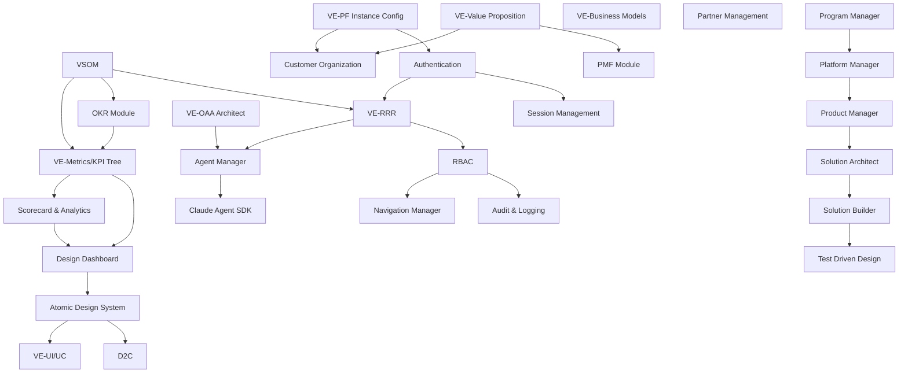

# PFC-PFI-BAIV Module Catalog v1.0.0

**Platform Foundation Core to BAIV Instance Module Mapping**

| Attribute | Value |
|-----------|-------|
| **Document Version** | 1.0.0 |
| **Date** | December 31, 2025 |
| **Purpose** | Complete inventory of PF-Core modules with BAIV instance mappings |
| **Status** | 🟢 Active |
| **Owner** | Platform Architecture Team |
| **Parent Documents** | BAIV_INTEGRATION_PLAN.md, BAIV_PRD_PFC_Integration_v2.0 |
| **Related Artifacts** | PFC-PFI-BAIV_INTEGRATION_BRIDGES.md |

---

## Executive Summary

This catalog provides a comprehensive inventory of all 30+ Platform Foundation Core (PF-Core) modules and their mappings to BAIV (Be AI Visible) instance implementations. Each module is classified as:

- **PFC-Only**: Platform-level module with no direct instance mapping
- **Transferable**: Module that cascades to instances with configuration
- **Instance-Specific**: Module that requires instance-level implementation

**Module Distribution:**
- 10 Value Engineering modules
- 4 Security modules
- 6 Design modules
- 2 CRM modules
- 2 Agent Management modules
- 6 Agentic Builder modules
- **Total: 30 modules**

**BAIV Integration Status:**
- P0 Critical: 16 modules
- P1 High: 10 modules
- P2 Medium: 4 modules

---

## Module Categories

### 1. Value Engineering (10 Modules)

Value Engineering modules establish strategic context, objectives, and value proposition frameworks that cascade from platform to instances.

#### 1.1 VSOM (Vision, Strategy, Objectives, Metrics)

**Module ID:** `pfc-mod-ve-vsom-v1.0.0`  
**Type:** PFC-Only  
**BAIV Mapping:** No Direct Mapping (provides context via BAIV RRR-VSOM)  
**Priority:** P0 - Critical  
**Transferable:** BAIV, W4M, AIR, all instances

**Description:**
VSOM operates at the Platform Foundation Core layer providing strategic context to all instances. It defines the organizational vision, strategy framework, strategic objectives, and success metrics.

**Components:**
- **Vision (V):** Organizational purpose and future state
- **Strategy (S):** Approach to achieve vision
- **Objectives (O):** Strategic goals with measurable outcomes
- **Metrics (M):** KPIs and success measurements

**Value Cascade Pattern:**
```
VSOM (PFC Layer)
├── Provides strategic context to Agent Manager
├── Feeds VE-RRR for role-based objective assignment
├── Cascades to OKR Module for execution tracking
└── Consumed by instances via Integration Bridges
    ├── BAIV → via BAIV RRR-VSOM
    ├── W4M → via W4M RRR-VSOM
    └── AIR → via AIR RRR-VSOM
```

**BAIV Integration:**
- **Bridge:** Value Engineering Bridge
- **Context Loading:** Agents load VSOM context via ve-context ontology
- **Manifestation:** BAIV RRR-VSOM module (see Module 1.4)
- **Usage:** All 16 BAIV agents require VSOM context for aligned decision-making

**Ontology References:**
- `PFC-ONT-VSOM` (platform)
- `ve-context` (shared context ontology)

**Dependencies:**
- None (foundational module)

**Action Items:**
- [ ] Define Vision/Mission statements
- [ ] Configure BSC perspectives (5)
- [ ] Set strategic objectives (3-5 per perspective)
- [ ] Define success metrics and thresholds

---

#### 1.2 OKR Module (CMO-OKR-ONTOLOGY)

**Module ID:** `pfc-mod-ve-okr-v3.0.0`  
**Type:** Transferable  
**BAIV Mapping:** Marketing OKRs & KPIs  
**Priority:** P0 - Critical  
**Transferable:** Yes (with instance-specific objectives)

**Description:**
The OKR (Objectives and Key Results) module provides a structured framework for cascading strategic objectives into measurable, time-bound outcomes. Based on CMO-OKR-ONTOLOGY v3.0.0.

**Components:**
- **Objectives:** Qualitative, aspirational goals
- **Key Results:** Quantitative, measurable outcomes (3-5 per objective)
- **Initiatives:** Projects and activities to achieve KRs
- **Progress Tracking:** Weekly/monthly check-ins
- **Alignment Mapping:** Objective-to-objective cascade

**OKR Hierarchy:**
```
Company-Level Objectives (CEO)
├── Functional Objectives (CMO, CTO, etc.)
│   └── BAIV: Marketing Objectives
│       ├── Objective 1: Increase AI Visibility
│       │   ├── KR1: Citation rate ≥ 25%
│       │   ├── KR2: 4 platform coverage
│       │   └── KR3: 100 priority keywords
│       ├── Objective 2: Scale Content Production
│       │   └── [Key Results...]
│       └── Objective 3: Improve Lead Quality
│           └── [Key Results...]
└── Team Objectives (VP, Director)
    └── BAIV: Campaign & Audit execution
```

**BAIV Integration:**
- **Module:** BAIV Marketing OKRs
- **Ontology:** BAIV-ONT-CMO-OKR (v05)
- **Mapped Metrics:** Citation rate, Gap closure %, Content velocity, RPI score
- **Dashboard:** Strategic Dashboard → OKR Progress Tracking panel
- **Agents:** Discovery, Gap Analyzer, Content Generator consume OKR targets

**Ontology References:**
- `PFC-ONT-OKR` (platform)
- `BAIV-ONT-CMO-OKR` (instance)

**Dependencies:**
- VSOM (strategic objectives source)
- VE-Metrics/KPI Tree (metrics definitions)

**Action Items:**
- [ ] Create CMO OKRs for BAIV product
- [ ] Link OKR key results to BAIV metrics
- [ ] Configure progress tracking cadence
- [ ] Set up OKR dashboard widgets

---

#### 1.3 PMF Module (Product-Market Fit)

**Module ID:** `pfc-mod-ve-pmf-v1.0.0`  
**Type:** Transferable  
**BAIV Mapping:** PMF Surveys & Analysis  
**Priority:** P1 - High  
**Transferable:** Yes (with instance-specific surveys)

**Description:**
The PMF (Product-Market Fit) module provides frameworks for measuring and validating product-market alignment through structured surveys, customer feedback analysis, and retention metrics.

**Components:**
- **Sean Ellis Test:** "How disappointed would you be if this product disappeared?"
- **PMF Score Calculation:** % of users who answer "very disappointed"
- **Retention Cohorts:** Weekly/monthly retention analysis
- **Customer Feedback:** Qualitative feedback categorization
- **Validation Thresholds:** PMF achievement criteria (>40% score)

**PMF Assessment Framework:**
```
PMF Module
├── Survey Design
│   └── BAIV: AI Visibility value prop questions
├── Distribution & Collection
│   └── BAIV: In-app surveys, email outreach
├── Score Calculation
│   └── BAIV: Automated PMF score tracking
├── Cohort Analysis
│   └── BAIV: Retention by ICP segment
└── Action Planning
    └── BAIV: Product roadmap prioritization
```

**BAIV Integration:**
- **Module:** BAIV PMF Surveys & Analysis
- **Target Segment:** B2B SaaS Marketing Leaders
- **Survey Triggers:** Post-audit completion, 30-day milestone, churn risk
- **Metrics:** PMF score, NPS, Feature importance ranking
- **Dashboard:** Customer Perspective BSC card

**Ontology References:**
- `PFC-ONT-PMF` (platform)
- `BAIV-ONT-Customer-Organization` (instance, v03)

**Dependencies:**
- VE-Value Proposition (ICP definition)
- CRM (customer profiles)

**Action Items:**
- [ ] Configure PMF surveys for BAIV
- [ ] Set validation thresholds (target: >40%)
- [ ] Define survey distribution triggers
- [ ] Build PMF score dashboard widget

---

#### 1.4 VE-RRR (Roles, RACI, RBAC)

**Module ID:** `pfc-mod-ve-rrr-v1.0.0`  
**Type:** Transferable  
**BAIV Mapping:** BAIV RRR-VSOM  
**Priority:** P0 - Critical  
**Transferable:** Yes (with instance role mappings)

**Description:**
The VE-RRR module establishes organizational role structures, responsibility assignment (RACI), and role-based access control that cascade through platform instances. In BAIV, this manifests as BAIV RRR-VSOM.

**Components:**
- **Roles:** Organizational hierarchy (C-Suite to IC)
- **RACI Matrix:** Responsible, Accountable, Consulted, Informed
- **RBAC:** Role-based access control and permissions
- **VSOM Link:** Strategic objective ownership by role

**Role Hierarchy:**
```
VE-RRR → BAIV RRR-VSOM Cascade:
├── C-Suite Roles (CEO, CMO, CTO, COO, CFO)
│   └── BAIV RRR-VSOM: Strategic objective ownership, OKR accountability
├── VP/Director Roles
│   └── BAIV RRR-VSOM: Campaign management, team oversight
├── Manager Roles
│   └── BAIV RRR-VSOM: Audit execution, content approval
└── IC Roles (Analyst, Specialist)
    └── BAIV RRR-VSOM: Task execution, report viewing
```

**RACI Application (BAIV Example):**
| Activity | CMO | Marketing Director | Content Manager | Marketing Analyst |
|----------|-----|-------------------|----------------|-------------------|
| Strategic OKR Setting | A | R | C | I |
| Audit Campaign Planning | A | R | C | I |
| Audit Execution | I | A | R | C |
| Gap Analysis | I | C | R | R |
| Content Generation | C | A | R | I |
| Content Publishing | I | A | R | C |

**RBAC Permissions (BAIV Example):**
| Role | Audit Access | Content Access | Config Access | Admin Access |
|------|--------------|----------------|---------------|--------------|
| CMO | Read All | Read All | Read | Full |
| Director | Read Team | Edit Team | None | None |
| Manager | Execute | Approve | None | None |
| Analyst | Execute | View | None | None |

**BAIV Integration:**
- **Module:** BAIV RRR-VSOM
- **Role Mapping:** PFC roles → BAIV user roles
- **Workflow Integration:** RACI matrix drives approval workflows
- **Permission System:** RBAC enforced via Supabase RLS policies
- **Context Loading:** All agents load user role context

**Ontology References:**
- `PFC-ONT-RRR` (platform)
- `ve-context` (role context for agents)

**Dependencies:**
- VSOM (objective assignments)
- Security/RBAC Module (permission enforcement)

**Action Items:**
- [ ] Define role hierarchy for BAIV
- [ ] Map RACI to workflows (audit, content, etc.)
- [ ] Configure RBAC permission sets
- [ ] Implement RLS policies in Supabase

---

#### 1.5 VE-Metrics/KPI Tree

**Module ID:** `pfc-mod-ve-metrics-v1.0.0`  
**Type:** Transferable  
**BAIV Mapping:** BAIV KPI Dashboard & Ontology Mapping  
**Priority:** P1 - High  
**Transferable:** Yes (with instance metrics)

**Description:**
Hierarchical metrics framework with ontology mapping that organizes KPIs from strategic to operational to activity levels.

**KPI Tree Structure:**
```
VE-Metrics/KPI Tree:
├── Strategic KPIs (VSOM Layer 4)
│   ├── Financial: Revenue, MRR, LTV
│   ├── Customer: NPS, Retention, Citation Rate
│   ├── Process: Audit Velocity, Content Coverage
│   ├── Learning: Agent Accuracy, Model Updates
│   └── Stakeholder: Partner Revenue, Affiliate Conv.
│
├── Operational KPIs (OKR Key Results)
│   └── BAIV Ontology Mapping:
│       ├── BAIV-ONT-AI-Visibility → Citation metrics
│       ├── BAIV-ONT-Gap-Analysis → Gap closure %
│       └── BAIV-ONT-Content → Content velocity
│
└── Activity Metrics (Leading Indicators)
    └── Daily/Weekly tracking feeds
```

**Balanced Scorecard (5 Perspectives):**

**Financial Perspective:**
- MRR (Monthly Recurring Revenue)
- LTV (Lifetime Value)
- Revenue per customer
- Gross margin

**Customer Perspective:**
- NPS (Net Promoter Score)
- Retention rate
- Citation satisfaction score
- Customer acquisition rate

**Process Perspective:**
- Audit velocity (audits/week)
- Content throughput (pieces/week)
- Gap closure rate
- Time-to-publish

**Learning Perspective:**
- Agent accuracy score
- Model improvement rate
- Innovation index
- Employee satisfaction

**Stakeholder Perspective:**
- Partner revenue
- Affiliate conversion rate
- Shareholder value
- Regulatory compliance %

**BAIV Integration:**
- **Module:** BAIV KPI Dashboard
- **Ontology Mapping:** Each BAIV-ONT maps to specific KPIs
- **Dashboard:** Strategic Dashboard with BSC perspective cards
- **Refresh Rates:** Real-time, hourly, daily, weekly based on metric type
- **Alerting:** Threshold-based alerts for at-risk metrics

**Ontology References:**
- `PFC-ONT-Metrics` (platform)
- `BAIV-ONT-AI-Visibility` (citation metrics)
- `BAIV-ONT-Gap-Analysis` (gap metrics)

**Dependencies:**
- VSOM (strategic alignment)
- OKR Module (operational KPIs)
- Design Dashboard (visualization)

**Action Items:**
- [ ] Build KPI hierarchy for BAIV
- [ ] Map ontology to metrics
- [ ] Configure BSC perspective cards
- [ ] Set threshold alerts

---

#### 1.6 VE-Value Proposition

**Module ID:** `pfc-mod-ve-vp-v1.0.0`  
**Type:** Transferable  
**BAIV Mapping:** BAIV Brand Value Props & Positioning  
**Priority:** P1 - High  
**Transferable:** Yes (with instance value props)

**Description:**
Value proposition framework for positioning and messaging that defines target customers, problems, solutions, differentiators, and value delivered.

**Value Proposition Canvas:**
| VP Component | PFC Definition | BAIV Instantiation |
|--------------|----------------|-------------------|
| **Target Customer** | ICP Profile Ontology | B2B SaaS, Marketing Leaders |
| **Problem Statement** | Gap Analysis Output | "Invisible to AI platforms" |
| **Solution** | Platform Capability | AI Visibility Optimization |
| **Unique Differentiator** | Competitive Analysis | Ontology-driven, Agent-powered |
| **Value Delivered** | KPI Improvement | Citation rate ↑, Lead quality ↑ |

**BAIV Value Proposition:**

**For:** B2B SaaS Marketing Leaders  
**Who:** Struggle to be discovered by AI platforms (ChatGPT, Claude, Perplexity)  
**The BAIV Platform:** Is an AI Visibility Optimization solution  
**That:** Audits, identifies gaps, and generates content to increase citation rates  
**Unlike:** Manual SEO tools or generic content platforms  
**BAIV:** Uses ontology-driven, multi-agent architecture for systematic AI discoverability

**Value Delivered:**
- Citation rate increase: +15-25%
- Content production efficiency: 3x faster
- Lead quality improvement: Higher-intent leads from AI platforms
- Competitive intelligence: Track competitor AI visibility

**BAIV Integration:**
- **Module:** BAIV Brand Value Props & Positioning
- **Ontology:** BAIV-ONT-Universal-Brand (v02)
- **ICP Definition:** B2B SaaS companies with $1M-$50M ARR
- **Messaging Framework:** Homepage, landing pages, sales collateral
- **Agent Usage:** Discovery Agent uses VP to identify relevant queries

**Ontology References:**
- `PFC-ONT-Value-Proposition` (platform)
- `BAIV-ONT-Universal-Brand` (instance, v02)

**Dependencies:**
- PMF Module (customer validation)
- CRM (ICP profiles)

**Action Items:**
- [ ] Define ICP for BAIV
- [ ] Document value propositions
- [ ] Create messaging framework
- [ ] Build competitive positioning matrix

---

#### 1.7 VE-UI/UC (User Interface / Use Case)

**Module ID:** `pfc-mod-ve-ui-uc-v1.0.0`  
**Type:** Transferable  
**BAIV Mapping:** BAIV UI Patterns & Use Case Flows  
**Priority:** P1 - High  
**Transferable:** Yes (with instance UI patterns)

**Description:**
Framework for defining user interface patterns and use case flows that establish reusable interaction models across instances.

**UI Pattern Library:**
```
VE-UI/UC Pattern Library:
├── Discovery Patterns
│   └── BAIV: Search, Filter, Drill-down, Compare
├── Data Entry Patterns
│   └── BAIV: Wizard, Form, Inline Edit, Bulk Import
├── Visualization Patterns
│   └── BAIV: Charts, Tables, Cards, Timelines
└── Action Patterns
    └── BAIV: Generate, Export, Share, Schedule
```

**Use Case Flows (BAIV):**

**Primary Flow: Audit → Gap → Content → Publish**
```
1. Discovery Phase
   ├── User inputs competitor URL
   ├── Discovery Agent runs queries
   └── System displays citation analysis

2. Gap Analysis Phase
   ├── Gap Analyzer identifies missing topics
   ├── Priority scoring applied
   └── User reviews gap report

3. Content Generation Phase
   ├── User selects gaps to address
   ├── Content Generator creates drafts
   └── User reviews and edits content

4. Publishing Phase
   ├── User approves final content
   ├── System publishes to CMS
   └── Performance tracking initiated
```

**Interaction Models:**
| Interaction | Pattern | BAIV Example |
|-------------|---------|--------------|
| **Navigation** | Hierarchical, Tabbed | Dashboard → Audits → Audit Detail |
| **Search** | Type-ahead, Faceted | Query search, Keyword filter |
| **Selection** | Single, Multiple, Bulk | Select gaps, Select content items |
| **Action** | Primary, Secondary, Contextual | Run audit (primary), Export (secondary) |
| **Feedback** | Toast, Modal, Inline | Audit complete (toast), Error (modal) |

**State Management:**
- Form states: Empty, Editing, Validating, Saving, Saved, Error
- Navigation states: Active page, Breadcrumb trail
- Data states: Loading, Loaded, Empty, Error

**BAIV Integration:**
- **Module:** BAIV UI Patterns & Use Case Flows
- **Component Library:** Built on Atomic Design System
- **Design System:** BAIV tokens (#00A4BF, #E84E1C, #CEC528)
- **Responsive:** Desktop-first with tablet/mobile breakpoints
- **Accessibility:** WCAG 2.1 AA compliant

**Ontology References:**
- `PFC-ONT-UI-Patterns` (platform)

**Dependencies:**
- Atomic Design System (component primitives)
- Design Dashboard (layout templates)

**Action Items:**
- [ ] Document UI patterns for BAIV
- [ ] Map user journeys (audit, content, etc.)
- [ ] Build component library
- [ ] Create interaction specifications

---

#### 1.8 VE-PF Instance Config Management

**Module ID:** `pfc-mod-ve-config-v1.0.0`  
**Type:** Transferable  
**BAIV Mapping:** BAIV Instance Configuration  
**Priority:** P0 - Critical  
**Transferable:** Yes (with instance configs)

**Description:**
Platform Foundation Instance Configuration for multi-tenant deployment with hierarchical configuration management.

**Configuration Hierarchy:**
```
VE-PF Instance Config Hierarchy:
├── Platform Defaults (PFC)
│   └── Base configuration for all instances
├── Instance Overrides (BAIV)
│   └── BAIV-specific feature settings
├── Tenant Customization
│   └── Per-customer configuration
└── User Preferences
    └── Individual user settings
```

**Configuration Categories:**

**1. Tenant Configuration**
- Company profile (name, industry, size)
- Branding (logo, colors, custom domain)
- Domain settings (custom URLs)
- Tenant isolation settings

**2. Feature Flags**
- Module enablement (which PFC modules active)
- Beta feature access
- A/B test assignments
- Experimental features

**3. Integration Configuration**
- API keys (DataForSEO, Airtable, OpenAI)
- Webhook URLs
- OAuth credentials (Google, Microsoft, SAML)
- Third-party connections

**4. Limit Configuration**
- Audit limits per tier
- Content quotas per tier
- API rate limits
- Storage limits

**5. Environment Configuration**
- Dev/Staging/Prod URLs
- Database connections
- CDN settings
- Log levels

**BAIV Integration:**
- **Module:** BAIV Instance Configuration
- **Storage:** Supabase `tenant_config` table
- **UI:** Admin Configuration panel
- **Validation:** Schema validation on config changes
- **Versioning:** Config change history

**Configuration Schema (BAIV Example):**
```json
{
  "tenant_id": "baiv-tenant-001",
  "company_profile": {
    "name": "Acme Corp",
    "industry": "B2B SaaS",
    "size": "50-200"
  },
  "branding": {
    "primary_color": "#00A4BF",
    "logo_url": "https://cdn.baiv.io/acme-logo.png",
    "custom_domain": "ai-visibility.acmecorp.com"
  },
  "feature_flags": {
    "gap_analyzer_v2": true,
    "content_generator_beta": false
  },
  "integrations": {
    "dataforseo_api_key": "{{DATAFORSEO_KEY}}",
    "airtable_token": "{{AIRTABLE_TOKEN}}"
  },
  "limits": {
    "tier": "growth",
    "audits_per_month": 50,
    "content_pieces": 250
  }
}
```

**Ontology References:**
- `PFC-ONT-Config` (platform)

**Dependencies:**
- Security/RBAC (admin permissions)
- CRM (tenant profiles)

**Action Items:**
- [ ] Configure tenant settings for BAIV
- [ ] Set feature flags per environment
- [ ] Implement configuration UI
- [ ] Document configuration API

---

#### 1.9 VE-Business Models

**Module ID:** `pfc-mod-ve-biz-v1.0.0`  
**Type:** Transferable  
**BAIV Mapping:** BAIV Revenue & Pricing Models  
**Priority:** P1 - High  
**Transferable:** Yes (with instance pricing)

**Description:**
Framework for defining revenue models, pricing strategies, monetization rules, and unit economics.

**Revenue Models:**

**1. Subscription Model (SaaS)**
- Monthly recurring revenue
- Annual prepay discounts (10-20%)
- Tier-based feature access

**2. Usage Model (Credits)**
- Pay-per-audit credits
- Content generation credits
- Overage pricing

**3. Hybrid Model**
- Base subscription + usage credits
- Freemium tier with upgrade path

**BAIV Pricing Tiers:**
| Tier | Audits/Month | Content Pieces | Price | Target ICP |
|------|--------------|----------------|-------|------------|
| **Starter** | 10 | 50 | $499/mo | Small business, Solopreneurs |
| **Growth** | 50 | 250 | $1,999/mo | Mid-market, Marketing teams |
| **Enterprise** | Unlimited | Unlimited | Custom | Enterprise, Agencies |

**Unit Economics Framework:**
- **CAC (Customer Acquisition Cost):** Target: <$5,000
- **LTV (Lifetime Value):** Target: >$20,000
- **LTV:CAC Ratio:** Target: 3:1 or higher
- **Payback Period:** Target: <12 months
- **Gross Margin:** Target: 80%+
- **Churn Rate:** Target: <5% monthly

**Partner Economics:**
```
VE-Business Models Framework:
├── Direct Revenue
│   └── BAIV: Subscription MRR, Usage fees, Add-ons
├── Partner Revenue
│   └── BAIV: Agency white-label (20% margin), Affiliate referrals (15%)
├── Pricing Strategy
│   ├── Value Metric: Audits per month
│   ├── Tier Structure: 3-tier + Enterprise
│   └── Usage Limits: Content pieces, API calls
└── Unit Economics
    └── BAIV: CAC, LTV, Payback period tracking
```

**BAIV Integration:**
- **Module:** BAIV Revenue & Pricing Models
- **Billing System:** Stripe integration
- **Usage Tracking:** Audit and content quota enforcement
- **Upgrade/Downgrade:** Self-service tier changes
- **Reporting:** Revenue dashboard, cohort analysis

**Ontology References:**
- `PFC-ONT-Business-Models` (platform)

**Dependencies:**
- VE-Metrics/KPI Tree (unit economics tracking)
- CRM (customer tier management)

**Action Items:**
- [ ] Define pricing tiers for BAIV
- [ ] Configure usage limits per tier
- [ ] Set up billing integration (Stripe)
- [ ] Implement credit tracking system
- [ ] Create upgrade/downgrade workflows

---

#### 1.10 VE-OAA Architect (Ontology Architect Agent)

**Module ID:** `pfc-mod-ve-oaa-v1.0.0`  
**Type:** PFC-Only  
**BAIV Mapping:** BAIV Ontology Governance  
**Priority:** P0 - Critical  
**Transferable:** BAIV, W4M, AIR, all instances

**Description:**
Centralized ontology governance and registry management that ensures ontology quality, versioning, and discoverability across the platform.

**OAA Functions:**
| OAA Governance Function | Description | BAIV Impact |
|------------------------|-------------|-------------|
| **Registration** | New ontology onboarding | BAIV ontology catalog |
| **Validation** | Schema.org compliance | Quality assurance |
| **Versioning** | SemVer management | Change tracking |
| **Deprecation** | Sunset planning | Migration support |
| **Discovery** | Ontology search & browse | Agent context loading |

**Ontology Registry Structure:**
```
VE-OAA Architect Registry:
├── Platform Ontologies (PFC-ONT)
│   ├── PFC-ONT-VSOM
│   ├── PFC-ONT-RRR
│   ├── PFC-ONT-Gap-Analysis
│   └── PFC-ONT-Business-Models
│
├── Instance Ontologies (BAIV-ONT)
│   ├── BAIV-ONT-AI-Visibility (01)
│   ├── BAIV-ONT-Universal-Brand (02)
│   ├── BAIV-ONT-Customer-Organization (03)
│   ├── BAIV-ONT-Gap-Analysis (04)
│   └── BAIV-ONT-CMO-OKR (05)
│
└── Agent Ontologies (SpecialAgents-ONTs)
    ├── Discovery Agent Ontology
    ├── Gap Analyzer Ontology
    └── Content Generator Ontology
```

**Versioning Rules:**
- **Major (X.0.0):** Breaking changes (schema restructure)
- **Minor (x.Y.0):** New properties, backwards compatible
- **Patch (x.y.Z):** Bug fixes, documentation updates

**BAIV Integration:**
- **Module:** BAIV Ontology Governance
- **Registry:** Supabase `ontologies` table
- **Agent Bindings:** `agent_ontology_bindings` table
- **Validation:** Automated Schema.org compliance checks
- **Versioning:** All BAIV-ONTs use semantic versioning

**Ontology References:**
- All PFC-ONT-* (platform ontologies)
- All BAIV-ONT-* (instance ontologies)

**Dependencies:**
- Agent Manager (ontology consumption)

**Action Items:**
- [ ] Register BAIV ontologies in OAA Registry
- [ ] Set validation rules for BAIV-ONT
- [ ] Document ontology versioning policy
- [ ] Create migration paths for breaking changes

---

### 2. Security (4 Modules)

Security modules provide authentication, authorization, session management, and audit logging capabilities.

#### 2.1 Authentication Module

**Module ID:** `pfc-mod-sec-auth-v1.0.0`  
**Type:** Transferable  
**BAIV Mapping:** BAIV User Authentication  
**Priority:** P0 - Critical  
**Transferable:** Yes (with instance OAuth configs)

**Description:**
Centralized authentication for platform access with support for OAuth2/OIDC, MFA, and service-to-service authentication.

**Components:**
| Component | PFC Definition | BAIV Application |
|-----------|----------------|------------------|
| **Identity Provider** | OAuth2/OIDC integration | Google, Microsoft, SAML SSO |
| **MFA** | Multi-factor authentication | TOTP, SMS, Email verification |
| **API Authentication** | Service-to-service auth | JWT tokens, API keys |
| **Session Tokens** | User session management | Access/Refresh token pairs |

**Authentication Flow:**
```
Authentication Flow:
├── User Authentication
│   └── BAIV: Login → MFA → Session → Dashboard
├── Service Authentication
│   └── BAIV: Agent → Token → API → Response
└── Webhook Authentication
    └── BAIV: External → Signature → Validation → Process
```

**BAIV Integration:**
- **Module:** BAIV User Authentication
- **Provider:** Supabase Auth
- **OAuth:** Google, Microsoft Azure AD, SAML 2.0
- **MFA:** TOTP (authenticator app)
- **Session:** 1 hour access token, 30 day refresh token
- **API Keys:** Per-tenant API keys for programmatic access

**Ontology References:**
- `PFC-ONT-Auth` (platform)

**Dependencies:**
- VE-RRR (role assignment post-auth)

**Action Items:**
- [ ] Configure OAuth providers (Google, Microsoft)
- [ ] Enable MFA for all users
- [ ] Set session timeout policies
- [ ] Generate tenant API keys

---

#### 2.2 RBAC Module

**Module ID:** `pfc-mod-sec-rbac-v1.0.0`  
**Type:** Transferable  
**BAIV Mapping:** BAIV Role Permissions  
**Priority:** P0 - Critical  
**Transferable:** Yes (with instance permissions)

**Description:**
Role-Based Access Control module that enforces permissions based on user roles and organizational hierarchy.

**Permission Model:**
- **Subjects:** Users, Service accounts
- **Objects:** Audits, Content, Ontologies, Configuration
- **Actions:** Read, Write, Delete, Execute, Approve
- **Conditions:** Tenant isolation, team membership, data ownership

**BAIV Permission Matrix:**
| Role | Audit Access | Content Access | Config Access | Admin Access |
|------|--------------|----------------|---------------|--------------|
| **CMO** | Read All | Read All | Read | Full |
| **Director** | Read Team | Edit Team | None | None |
| **Manager** | Execute | Approve | None | None |
| **Analyst** | Execute | View | None | None |
| **Guest** | View Shared | None | None | None |

**BAIV Integration:**
- **Module:** BAIV Role Permissions
- **Enforcement:** Supabase Row-Level Security (RLS) policies
- **Roles:** Defined in VE-RRR module
- **Granularity:** Row-level (per audit, per content item)
- **Inheritance:** Team-based permission inheritance

**Ontology References:**
- `PFC-ONT-RBAC` (platform)
- `PFC-ONT-RRR` (role definitions)

**Dependencies:**
- Authentication Module (user identity)
- VE-RRR (role hierarchy)

**Action Items:**
- [ ] Define permission sets for BAIV roles
- [ ] Map roles to features and data
- [ ] Implement RLS policies in Supabase
- [ ] Test permission enforcement

---

#### 2.3 Session Management

**Module ID:** `pfc-mod-sec-session-v1.0.0`  
**Type:** Transferable  
**BAIV Mapping:** BAIV User Sessions  
**Priority:** P0 - Critical  
**Transferable:** Yes (with instance session configs)

**Description:**
User session lifecycle management including session creation, refresh, timeout, and termination.

**Session Lifecycle:**
1. **Creation:** User authenticates → Access token issued
2. **Active:** Token validated on each API call
3. **Refresh:** Access token expires → Refresh token used
4. **Timeout:** Inactivity timeout → Session terminated
5. **Logout:** User-initiated or admin-forced logout

**Session Configuration:**
- **Access Token TTL:** 1 hour
- **Refresh Token TTL:** 30 days
- **Inactivity Timeout:** 2 hours
- **Concurrent Sessions:** Max 3 per user
- **Device Tracking:** IP, User-Agent logging

**BAIV Integration:**
- **Module:** BAIV User Sessions
- **Storage:** Supabase auth.sessions table
- **Token Format:** JWT (JSON Web Token)
- **Refresh Strategy:** Sliding window (extends on activity)
- **Audit:** All session events logged

**Ontology References:**
- `PFC-ONT-Session` (platform)

**Dependencies:**
- Authentication Module (session creation)
- Audit & Logging (session tracking)

**Action Items:**
- [ ] Set session timeouts for BAIV
- [ ] Configure refresh token strategy
- [ ] Implement concurrent session limits
- [ ] Enable session event logging

---

#### 2.4 Audit & Logging Control

**Module ID:** `pfc-mod-sec-audit-v1.0.0`  
**Type:** Transferable  
**BAIV Mapping:** BAIV Audit Trail & Activity Logs  
**Priority:** P0 - Critical  
**Transferable:** Yes (with instance log configs)

**Description:**
Comprehensive audit trail and activity logging for security, compliance, and operational visibility.

**Log Categories:**
```
Audit & Logging Hierarchy:
├── Security Events (P0)
│   └── BAIV: Auth failures, permission violations
├── User Activity (P1)
│   └── BAIV: Audits run, content generated, exports
├── Agent Activity (P1)
│   └── BAIV: Agent executions, decisions, handoffs
├── System Events (P2)
│   └── BAIV: API calls, integrations, errors
└── Compliance Trail (P0)
    └── BAIV: GDPR requests, data retention, deletions
```

**Log Structure:**
- **Timestamp:** ISO 8601 with timezone
- **Event Type:** Category and action
- **Actor:** User ID or service account
- **Subject:** Resource affected (audit ID, content ID)
- **Result:** Success, failure, error code
- **Metadata:** Additional context (IP, User-Agent)

**BAIV Integration:**
- **Module:** BAIV Audit Trail & Activity Logs
- **Storage:** Supabase `audit_logs` table
- **Retention:** 90 days operational, 7 years compliance
- **Search:** Full-text search on log events
- **Alerting:** Real-time alerts for security events

**Ontology References:**
- `PFC-ONT-Audit` (platform)

**Dependencies:**
- Authentication Module (user context)
- RBAC Module (permission context)

**Action Items:**
- [ ] Enable audit logging for BAIV
- [ ] Set retention policies (90 days / 7 years)
- [ ] Configure security event alerts
- [ ] Build audit log viewer UI

---

### 3. Design (6 Modules)

Design modules provide dashboard layouts, scorecards, navigation, component systems, and design-to-code workflows.

#### 3.1 Design Dashboard

**Module ID:** `pfc-mod-design-dash-v1.0.0`  
**Type:** Transferable  
**BAIV Mapping:** BAIV Strategic Dashboard  
**Priority:** P0 - Critical  
**Transferable:** Yes (with instance layouts)

**Description:**
Visual framework for strategic information display with customizable layouts, widgets, and perspectives.

**Design Dashboard Components:**
| PFC Design Dashboard Component | BAIV Strategic Dashboard Implementation |
|-------------------------------|----------------------------------------|
| **Vision Display Widget** | BAIV Brand Mission & Vision Panel |
| **BSC Perspective Cards** | BAIV 5-Perspective Performance Cards |
| **KPI Trend Visualizations** | BAIV Citation Rate, Gap %, Coverage Charts |
| **OKR Progress Tracking** | BAIV Marketing OKR Progress Bars |
| **Health Status Indicators** | BAIV At-Risk Objective Alerts |
| **Strategic Alignment View** | BAIV Module-to-Objective Mapping |

**Layout Templates:**
```
Design Dashboard → BAIV Strategic Dashboard:
├── Layout Templates
│   └── BAIV: Executive overview, Manager detail, Analyst drill-down
├── Widget Library
│   └── BAIV: Citation widgets, Gap widgets, Content velocity
├── Theme System
│   └── BAIV: Brand-aligned color schemes
└── Responsive Breakpoints
    └── BAIV: Desktop (1920px), Tablet (1024px), Mobile (375px)
```

**BAIV Dashboard Layout:**
1. **Executive Overview:** Top-level KPIs, health status, OKR progress
2. **Manager View:** Campaign performance, team metrics, action items
3. **Analyst View:** Detailed audit results, gap analysis, content queue

**BAIV Integration:**
- **Module:** BAIV Strategic Dashboard
- **Design Tool:** Figma with BAIV design tokens
- **Implementation:** React + Recharts/D3.js
- **Refresh:** Real-time (WebSocket), hourly, daily based on widget
- **Personalization:** User-configurable layouts

**Ontology References:**
- `PFC-ONT-Dashboard` (platform)

**Dependencies:**
- VE-Metrics/KPI Tree (data sources)
- Atomic Design System (components)

**Action Items:**
- [ ] Create Figma layouts using BAIV tokens
- [ ] Generate dashboard components
- [ ] Implement widget library
- [ ] Configure refresh rates per widget

---

#### 3.2 Scorecard & Analytics

**Module ID:** `pfc-mod-design-scorecard-v1.0.0`  
**Type:** Transferable  
**BAIV Mapping:** BAIV Performance Scorecards  
**Priority:** P0 - Critical  
**Transferable:** Yes (with instance scorecards)

**Description:**
Structured performance measurement and analytical capabilities including Balanced Scorecard, KPI tracking, and predictive analytics.

**Scorecard Framework:**
```
Scorecard & Analytics:
├── Strategic Scorecards
│   ├── Financial Scorecard
│   │   └── BAIV: MRR, LTV, Revenue per customer
│   ├── Customer Scorecard
│   │   └── BAIV: NPS, Retention, Citation satisfaction
│   ├── Process Scorecard
│   │   └── BAIV: Audit velocity, Content throughput
│   ├── Learning Scorecard
│   │   └── BAIV: Agent accuracy, Model improvements
│   └── Stakeholder Scorecard
│       └── BAIV: Partner revenue, Affiliate conversions
│
├── Operational Scorecards
│   ├── Discovery Scorecard
│   │   └── BAIV: Queries tested, Citations found, Turn coverage
│   ├── Gap Scorecard
│   │   └── BAIV: Gaps identified, Gaps closed, Priority distribution
│   └── Content Scorecard
│       └── BAIV: Content generated, Published, Performance
│
└── Analytics Capabilities
    ├── Descriptive: What happened?
    ├── Diagnostic: Why did it happen?
    ├── Predictive: What will happen?
    └── Prescriptive: What should we do?
```

**BAIV Scorecards:**
| BAIV Scorecard Type | Key Metrics | Refresh Rate |
|--------------------|-------------|--------------|
| **Executive Summary** | Top 10 KPIs, Health status | Daily |
| **Discovery Performance** | Citation rate, Query coverage | Per audit |
| **Gap Analysis** | Gap count, Priority mix, Closure rate | Weekly |
| **Content Velocity** | Generation rate, Publish rate | Daily |

**BAIV Integration:**
- **Module:** BAIV Performance Scorecards
- **BSC Perspectives:** 5-perspective cards on Strategic Dashboard
- **Metrics:** Pulled from VE-Metrics/KPI Tree
- **Visualization:** Cards, charts, trend lines
- **Alerting:** Threshold-based alerts (red/yellow/green)

**Ontology References:**
- `PFC-ONT-Scorecard` (platform)
- `PFC-ONT-Metrics` (metric definitions)

**Dependencies:**
- Design Dashboard (visualization)
- VE-Metrics/KPI Tree (data sources)

**Action Items:**
- [ ] Configure BSC views for BAIV
- [ ] Build analytics widgets
- [ ] Map KPIs to VSOM metrics
- [ ] Integrate with BAIV RRR-VSOM

---

#### 3.3 Navigation Manager

**Module ID:** `pfc-mod-design-nav-v1.0.0`  
**Type:** Transferable  
**BAIV Mapping:** BAIV Nav Hierarchy  
**Priority:** P1 - High  
**Transferable:** Yes (with instance nav structure)

**Description:**
Navigation hierarchy and structure management with role-based access control on navigation items.

**BAIV Navigation Structure:**
```
Primary Navigation:
├── Dashboard (All roles)
├── Audits (Execute: Manager+)
│   ├── Run New Audit
│   ├── Audit History
│   └── Scheduled Audits
├── Gaps (View: Analyst+)
│   ├── Gap Analysis
│   ├── Priority Queue
│   └── Closed Gaps
├── Content (View: Analyst+, Approve: Manager+)
│   ├── Content Queue
│   ├── Published Content
│   └── Performance
├── Analytics (View: All)
│   ├── Citation Performance
│   ├── Competitor Analysis
│   └── Reports
└── Settings (Admin only)
    ├── Configuration
    ├── Integrations
    └── Users & Roles
```

**BAIV Integration:**
- **Module:** BAIV Nav Hierarchy
- **Access Control:** RBAC-based nav item visibility
- **Breadcrumbs:** Hierarchical breadcrumb trail
- **State:** Active page highlighting

**Ontology References:**
- `PFC-ONT-Navigation` (platform)

**Dependencies:**
- RBAC Module (access control)
- VE-UI/UC (navigation patterns)

**Action Items:**
- [ ] Define nav structure for BAIV
- [ ] Set access controls per nav item
- [ ] Implement breadcrumb navigation
- [ ] Build mobile navigation drawer

---

#### 3.4 Atomic Design System

**Module ID:** `pfc-mod-design-atomic-v1.0.0`  
**Type:** Transferable  
**BAIV Mapping:** BAIV UI Components  
**Priority:** P1 - High  
**Transferable:** Yes (with instance tokens)

**Description:**
Component library based on Atomic Design methodology (Atoms, Molecules, Organisms, Templates, Pages) with instance-specific design tokens.

**Atomic Design Hierarchy:**
- **Atoms:** Button, Input, Label, Icon, Color, Typography
- **Molecules:** Form field (Label + Input), Search bar (Input + Button)
- **Organisms:** Navigation bar, Card list, Data table
- **Templates:** Dashboard layout, Form layout, List layout
- **Pages:** Audit page, Gap analysis page, Dashboard page

**BAIV Design Tokens:**
- **Primary Color:** #00A4BF (Teal)
- **Secondary Color:** #E84E1C (Orange)
- **Accent Color:** #CEC528 (Yellow)
- **Typography:** Titillium Web (headings), Open Sans (body)
- **Spacing:** 4px base unit (4, 8, 12, 16, 24, 32, 48, 64)
- **Border Radius:** 4px (small), 8px (medium), 12px (large)

**BAIV Integration:**
- **Module:** BAIV UI Components
- **Library:** React component library
- **Design System:** BAIV design tokens applied
- **Storybook:** Component documentation and testing
- **Accessibility:** WCAG 2.1 AA compliant

**Ontology References:**
- `PFC-ONT-Design-System` (platform)

**Dependencies:**
- VE-UI/UC (interaction patterns)

**Action Items:**
- [ ] Build component library from BAIV tokens
- [ ] Document patterns in Storybook
- [ ] Implement accessibility standards
- [ ] Create component usage guidelines

---

#### 3.5 D2C (Design-to-Code)

**Module ID:** `pfc-mod-design-d2c-v1.0.0`  
**Type:** Transferable  
**BAIV Mapping:** BAIV Figma → Code Pipeline  
**Priority:** P1 - High  
**Transferable:** Yes (with instance Figma configs)

**Description:**
Design-to-Code pipeline that converts Figma designs to production-ready React components using automation tools.

**D2C Workflow:**
1. Design in Figma with BAIV design tokens
2. Annotate components with metadata
3. Export via Figma API
4. Transform to React components
5. Apply design tokens
6. Generate TypeScript types
7. Integrate into codebase

**BAIV Integration:**
- **Module:** BAIV Figma → Code Pipeline
- **Tool:** Figma Make (or similar)
- **Output:** React + TypeScript components
- **Tokens:** BAIV design tokens automatically applied
- **Validation:** Linting, type checking, accessibility checks

**Ontology References:**
- `PFC-ONT-D2C` (platform)

**Dependencies:**
- Atomic Design System (token definitions)
- Design Dashboard (target components)

**Action Items:**
- [ ] Configure Figma Make for BAIV
- [ ] Set code generation rules
- [ ] Define component mapping
- [ ] Automate design token application

---

#### 3.6 C2D (Code-to-Design) & P2D (Prompt-to-Design)

**Module ID:** `pfc-mod-design-c2d-v1.0.0` & `pfc-mod-design-p2d-v1.0.0`  
**Type:** Transferable  
**BAIV Mapping:** BAIV Code → Figma Sync, BAIV AI Design Generation  
**Priority:** P2 - Medium  
**Transferable:** Yes (experimental)

**Description:**
- **C2D:** Reverse sync from code changes back to Figma designs
- **P2D:** AI-powered design generation from text prompts

**BAIV Integration:**
- **C2D:** Enable reverse sync for component changes
- **P2D:** Configure AI prompts for design constraints
- **Status:** Experimental / Future roadmap

**Action Items:**
- [ ] Research C2D tools
- [ ] Evaluate P2D AI capabilities
- [ ] Pilot with low-risk components

---

### 4. CRM (2 Modules)

CRM modules manage customer and partner relationships.

#### 4.1 Customer Organization Profile

**Module ID:** `pfc-mod-crm-customer-v1.0.0`  
**Type:** Transferable  
**BAIV Mapping:** BAIV Client Profiles  
**Priority:** P1 - High  
**Transferable:** Yes (with instance profile schemas)

**Description:**
Customer and organization profile management with ICP definitions, firmographic data, and relationship tracking.

**Profile Schema:**
- Company name, industry, size (employee count, revenue)
- ICP classification (target segment)
- Contact information (primary contacts, roles)
- Relationship data (customer since, tier, health score)
- Custom fields (BAIV: competitor list, brand URLs)

**BAIV Integration:**
- **Module:** BAIV Client Profiles
- **Ontology:** BAIV-ONT-Customer-Organization (v03)
- **Storage:** Supabase `customers` table
- **Usage:** Discovery Agent loads customer context

**Ontology References:**
- `PFC-ONT-Customer` (platform)
- `BAIV-ONT-Customer-Organization` (instance, v03)

**Dependencies:**
- VE-Value Proposition (ICP definition)

**Action Items:**
- [ ] Define profile schema for BAIV
- [ ] Configure ICP fields
- [ ] Integrate with Discovery Agent
- [ ] Build customer management UI

---

#### 4.2 Partner Management

**Module ID:** `pfc-mod-crm-partner-v1.0.0`  
**Type:** Transferable  
**BAIV Mapping:** BAIV Agency/Affiliate  
**Priority:** P2 - Medium  
**Transferable:** Yes (with instance partner tiers)

**Description:**
Partner relationship management including agency white-label and affiliate programs.

**Partner Types:**
- Agency partners (white-label resellers)
- Affiliate partners (referral commissions)
- Technology partners (integrations)

**BAIV Integration:**
- **Module:** BAIV Agency/Affiliate
- **Tiers:** Silver (15%), Gold (20%), Platinum (25%)
- **Tracking:** Partner revenue share, referral tracking

**Action Items:**
- [ ] Set partner tiers
- [ ] Configure revenue share
- [ ] Build partner portal

---

### 5. Agent Management (2 Modules)

Agent modules handle agent orchestration and SDK integration.

#### 5.1 Agent Manager

**Module ID:** `pfc-mod-agent-manager-v1.0.0`  
**Type:** PFC-Only  
**BAIV Mapping:** No Direct Mapping (orchestrates BAIV agents)  
**Priority:** P0 - Critical  
**Transferable:** BAIV, W4M, AIR, all instances

**Description:**
Centralized agent orchestration, registration, and lifecycle management for all platform agents.

**Agent Manager Functions:**
- Agent registration in OAA Registry
- Agent discovery and invocation
- Context passing (VSOM, tenant, user)
- Error handling and retries
- Agent-to-agent handoffs

**BAIV Integration:**
- **Orchestration:** Agent Manager orchestrates BAIV 16 agents
- **Context:** Provides VSOM, RRR, tenant context to agents
- **Execution:** Manages agent execution lifecycle
- **Monitoring:** Tracks agent performance and errors

**Ontology References:**
- `PFC-ONT-Agent` (platform)

**Dependencies:**
- VE-OAA Architect (agent registration)
- VSOM (strategic context)

**Action Items:**
- [ ] Register BAIV agents in Agent Manager
- [ ] Configure orchestration rules
- [ ] Set agent execution policies
- [ ] Implement agent monitoring

---

#### 5.2 Claude Agent SDK

**Module ID:** `pfc-mod-agent-sdk-v1.0.0`  
**Type:** Transferable  
**BAIV Mapping:** BAIV AI Agents  
**Priority:** P0 - Critical  
**Transferable:** Yes (all agent implementations)

**Description:**
SDK for building AI agents using Claude API with standardized patterns for context loading, execution, and error handling.

**SDK Features:**
- BaseAgent class with common patterns
- Ontology loading utilities
- Tenant context management
- Error handling and retries
- Logging and telemetry

**BAIV Integration:**
- **Module:** BAIV AI Agents (16 primary agents)
- **Implementation:** All BAIV agents extend BaseAgent
- **Agents:** Discovery, ICP Discovery, Citation Tester, Gap Analyzer, Query Expansion, LLM Mentions, Content Generator, Publishing, Scorecard, KPI, OKR, PMF, RPI, Analytics, Reporting, Alert

**Action Items:**
- [ ] Implement 16 primary agents using SDK
- [ ] Deploy sub-agents per UAT
- [ ] Configure agent context loading
- [ ] Set up agent monitoring

---

### 6. Agentic Builder (6 Modules)

Agentic Builder modules are meta-agents that build other agents using the Universal Agent Template. These are PFC-only modules.

#### 6.1 Program Manager

**Module ID:** `pfc-mod-builder-program-v1.0.0`  
**Type:** PFC-Only  
**BAIV Mapping:** No BAIV Mapping  
**Priority:** P0 - Critical  
**Transferable:** Platform-level only

**Description:**
Defines program roadmap, sets milestone gates, and manages multi-instance program orchestration.

**Action Items:**
- [ ] Define program roadmap
- [ ] Set milestone gates
- [ ] Configure program-level orchestration

---

#### 6.2 Platform Manager

**Module ID:** `pfc-mod-builder-platform-v1.0.0`  
**Type:** PFC-Only  
**BAIV Mapping:** No BAIV Mapping  
**Priority:** P0 - Critical  
**Transferable:** Platform-level only

**Description:**
Configures infrastructure, sets scaling policies, and manages platform operations.

**Action Items:**
- [ ] Configure infrastructure
- [ ] Set scaling policies
- [ ] Define operational procedures

---

#### 6.3 Product Manager

**Module ID:** `pfc-mod-builder-product-v1.0.0`  
**Type:** PFC-Only  
**BAIV Mapping:** No BAIV Mapping  
**Priority:** P0 - Critical  
**Transferable:** Platform-level only

**Description:**
Builds product backlog, prioritizes features, and manages product requirements.

**Action Items:**
- [ ] Build product backlog
- [ ] Prioritize features
- [ ] Define product requirements

---

#### 6.4 Solution Architect

**Module ID:** `pfc-mod-builder-architect-v1.0.0`  
**Type:** PFC-Only  
**BAIV Mapping:** No BAIV Mapping  
**Priority:** P0 - Critical  
**Transferable:** Platform-level only

**Description:**
Creates architecture documents, defines tech standards, and establishes design patterns.

**Action Items:**
- [ ] Create architecture docs (HLD, UAT)
- [ ] Define tech standards
- [ ] Establish design patterns

---

#### 6.5 Solution Builder (PRD-PBS-WBS)

**Module ID:** `pfc-mod-builder-solution-v1.0.0`  
**Type:** PFC-Only  
**BAIV Mapping:** No BAIV Mapping  
**Priority:** P0 - Critical  
**Transferable:** Platform-level only

**Description:**
Generates PRDs (Product Requirements Documents), builds PBS/WBS breakdowns, and manages solution execution.

**Action Items:**
- [ ] Generate PRDs
- [ ] Build PBS/WBS breakdowns
- [ ] Manage solution execution

---

#### 6.6 Test Driven Design (TDD)

**Module ID:** `pfc-mod-builder-tdd-v1.0.0`  
**Type:** PFC-Only  
**BAIV Mapping:** No BAIV Mapping  
**Priority:** P0 - Critical  
**Transferable:** Platform-level only

**Description:**
Defines test cases first, validates with 80%+ coverage, and ensures quality across all implementations.

**Action Items:**
- [ ] Define test cases first
- [ ] Validate 80%+ coverage
- [ ] Ensure quality standards

---

## Module Dependency Graph



---

## Module Implementation Priority

### Phase 1: Foundation (P0 Critical) - Week 1
1. VSOM
2. VE-RRR → BAIV RRR-VSOM
3. OKR Module
4. VE-PF Instance Config Management
5. VE-OAA Architect
6. Authentication Module
7. RBAC Module
8. Session Management
9. Audit & Logging Control
10. Design Dashboard → BAIV Strategic Dashboard
11. Scorecard & Analytics
12. Agent Manager
13. Claude Agent SDK
14. Agentic Builder (all 6 modules)

### Phase 2: Enhancement (P1 High) - Week 2
15. PMF Module
16. VE-Metrics/KPI Tree
17. VE-Value Proposition
18. VE-UI/UC
19. VE-Business Models
20. Navigation Manager
21. Atomic Design System
22. D2C
23. Customer Organization Profile

### Phase 3: Extension (P2 Medium) - Week 3
24. C2D
25. P2D
26. Partner Management

---

## BAIV-Specific Implementations

### BAIV Modules (Instance-Level)
| BAIV Module | PFC Source | Status |
|-------------|------------|--------|
| BAIV RRR-VSOM | VE-RRR | ⬜ To Implement |
| BAIV Marketing OKRs | OKR Module | ⬜ To Implement |
| BAIV PMF Surveys | PMF Module | ⬜ To Implement |
| BAIV KPI Dashboard | VE-Metrics/KPI Tree, Design Dashboard | ⬜ To Implement |
| BAIV Strategic Dashboard | Design Dashboard, Scorecard & Analytics | ⬜ To Implement |
| BAIV Brand Value Props | VE-Value Proposition | ⬜ To Implement |
| BAIV UI Patterns | VE-UI/UC, Atomic Design System | ⬜ To Implement |
| BAIV Instance Config | VE-PF Instance Config | ⬜ To Implement |
| BAIV Revenue Models | VE-Business Models | ⬜ To Implement |
| BAIV Ontology Governance | VE-OAA Architect | ⬜ To Implement |
| BAIV User Auth | Authentication | ⬜ To Implement |
| BAIV Role Permissions | RBAC | ⬜ To Implement |
| BAIV User Sessions | Session Management | ⬜ To Implement |
| BAIV Audit Trail | Audit & Logging | ⬜ To Implement |
| BAIV Nav Hierarchy | Navigation Manager | ⬜ To Implement |
| BAIV UI Components | Atomic Design System | ⬜ To Implement |
| BAIV Figma Pipeline | D2C | ⬜ To Implement |
| BAIV Client Profiles | Customer Organization | ⬜ To Implement |
| BAIV Agency/Affiliate | Partner Management | ⬜ To Implement |
| BAIV AI Agents (16) | Claude Agent SDK | ⬜ To Implement |

---

## Appendix: Quick Reference

### Module Count by Category
- **Value Engineering:** 10 modules
- **Security:** 4 modules
- **Design:** 6 modules
- **CRM:** 2 modules
- **Agent:** 2 modules
- **Agentic Builder:** 6 modules
- **Total:** 30 modules

### Priority Distribution
- **P0 Critical:** 16 modules
- **P1 High:** 10 modules
- **P2 Medium:** 4 modules

### Transferability
- **PFC-Only:** 8 modules (no instance mapping)
- **Transferable:** 22 modules (cascade to instances)

### BAIV Implementation Status
- **Implemented:** 0 modules
- **In Progress:** 0 modules
- **To Implement:** 30+ BAIV-specific implementations

---

**Document Version:** 1.0.0  
**Status:** 🟢 Active  
**Next Review:** After Phase 1 implementation  
**Related Documents:** PFC-PFI-BAIV_INTEGRATION_BRIDGES.md, BAIV_INTEGRATION_PLAN.md
