# PF-CORE Value Engineering Framework
## Product Breakdown Structure (PBS) Lineage

**Version:** 1.0.0 DRAFT  
**Date:** December 2025  
**Module Type:** PBS Generation & Value Engineering Orchestration  
**Platform:** PF-CORE Agentic Platform Foundation  
**Ontology Compliance:** Schema.org Grounded | OAA Registry v3.0 | VSOM Framework  
**Transferability:** BAIV, AIR, Wings4Mind.ai, Client Deployments

---

## 1. Executive Summary

This Value Engineering Framework establishes the complete lineage from strategic intent to autonomous Product Breakdown Structure (PBS) generation. The framework connects organizational Roles, Responsibilities, and Requirements (RRR) through Context Engineering to the VSOM strategic cascade, with PRD serving as the authoritative requirements specification that governs PBS generation.

### 1.1 Complete Value Lineage

The framework implements an **eight-layer value cascade** that propagates strategic context through to tactical decomposition:

```mermaid
flowchart TB
    subgraph L1["Layer 1: RRR Framework"]
        RRR[("RRR Context<br/>Roles • Responsibilities • Requirements")]
    end
    
    subgraph L2["Layer 2: Context Engineering"]
        CTX[("Context Assembly<br/>Strategic • Organizational • Market • Technical")]
    end
    
    subgraph L3["Layer 3: VSOM Framework"]
        VSOM[("VSOM Cascade<br/>Vision → Strategy → Objectives → Metrics")]
    end
    
    subgraph L4["Layer 4: OKR Integration"]
        OKR[("OKR Module<br/>Objectives • Key Results • Initiatives")]
    end
    
    subgraph L5["Layer 5: Platform Foundation"]
        PFC[("PF-CORE<br/>Transferable Infrastructure")]
        PFI[("PF Instance<br/>Tenant Configuration")]
    end
    
    subgraph L6["Layer 6: Product Definition"]
        PROD[("Product<br/>Capability Scope")]
    end
    
    subgraph L7["Layer 7: PRD Authority"]
        PRD[("PRD<br/>Requirements Specification<br/>★ CONTROLLING DOCUMENT ★")]
    end
    
    subgraph L8["Layer 8: PBS Generation"]
        PBS[("PBS Instance<br/>Product Breakdown Structure")]
    end
    
    RRR --> CTX
    CTX --> VSOM
    VSOM --> OKR
    OKR --> PFC
    PFC --> PFI
    PFI --> PROD
    PROD --> PRD
    PRD --> PBS
    
    style PRD fill:#e74c3c,stroke:#c0392b,stroke-width:3px,color:#fff
    style PBS fill:#27ae60,stroke:#1e8449,stroke-width:2px,color:#fff
    style VSOM fill:#3498db,stroke:#2980b9,stroke-width:2px,color:#fff
```

### 1.2 Value Engineering Cascade Table

| Layer | Component | Value Contribution | Downstream Impact |
|-------|-----------|-------------------|-------------------|
| L1 | RRR Context | Defines WHO is accountable, WHAT authority they hold, HOW they interact | Governs all agent authority boundaries |
| L2 | Context Engineering | Establishes organizational, market, and technical context for reasoning | Informs decomposition granularity |
| L3 | VSOM Framework | Vision → Strategy → Objectives → Metrics cascade with BSC perspectives | Provides strategic alignment criteria |
| L4 | OKR Integration | Operationalizes strategy through measurable Key Results | Maps PBS elements to measurable outcomes |
| L5 | PF-CORE / Instance | Platform capabilities with tenant-specific configuration | Constrains technical implementation |
| L6 | Product Definition | Defines product scope, capabilities, and boundaries | Scopes PBS generation |
| L7 | **PRD (Controlling)** | **Authoritative requirements with acceptance criteria** | **Governs PBS structure and validation** |
| L8 | PBS Instance | Hierarchical product decomposition with value attribution | Realizes PRD requirements |

---

## 2. RRR Framework: Roles, Responsibilities, Requirements

The RRR Framework establishes the human and agentic accountability model that governs PBS generation and value engineering.

### 2.1 Role Authority Model

```mermaid
flowchart LR
    subgraph Human["Human Roles"]
        SA["Solution Architect<br/>━━━━━━━━━━━━<br/>WHAT to Build<br/>Structure Approval"]
        PM["Program Manager<br/>━━━━━━━━━━━━<br/>WHEN & WHO<br/>Delivery Orchestration"]
        PO["Product Owner<br/>━━━━━━━━━━━━<br/>WHY & VALUE<br/>Priority Decisions"]
        TL["Technical Lead<br/>━━━━━━━━━━━━<br/>HOW to Build<br/>Implementation"]
    end
    
    subgraph Agentic["AI Agent Roles"]
        PGA["PBS Generator Agent<br/>━━━━━━━━━━━━<br/>Hierarchy Creation<br/>Decomposition Rules"]
        SCA["Strategic Context Agent<br/>━━━━━━━━━━━━<br/>VSOM Provider<br/>Alignment Check"]
        OCA["OKR Cascade Agent<br/>━━━━━━━━━━━━<br/>Objective Mapping<br/>Contribution Scoring"]
        OAA["Ontology Architect Agent<br/>━━━━━━━━━━━━<br/>Schema Validation<br/>Compliance Check"]
    end
    
    SA -.->|"Approves"| PGA
    PM -.->|"Sequences"| PGA
    PO -.->|"Prioritizes"| PGA
    TL -.->|"Validates"| PGA
    
    SCA -->|"Context"| PGA
    OCA -->|"OKR Map"| PGA
    OAA -->|"Validate"| PGA
    
    style SA fill:#2c3e50,stroke:#1a252f,color:#fff
    style PM fill:#2c3e50,stroke:#1a252f,color:#fff
    style PO fill:#2c3e50,stroke:#1a252f,color:#fff
    style TL fill:#2c3e50,stroke:#1a252f,color:#fff
    style PGA fill:#16a085,stroke:#1abc9c,color:#fff
    style SCA fill:#2980b9,stroke:#3498db,color:#fff
    style OCA fill:#8e44ad,stroke:#9b59b6,color:#fff
    style OAA fill:#d35400,stroke:#e67e22,color:#fff
```

### 2.2 RACI Matrix for PBS Generation

| Activity | Solution Architect | Program Manager | Product Owner | Technical Lead | AI Agent |
|----------|-------------------|-----------------|---------------|----------------|----------|
| Define PBS Hierarchy | **A** | C | I | C | **R** |
| Validate Value Attribution | C | I | **A** | C | **R** |
| Assign PBS Ownership | C | **A** | I | C | **R** |
| Generate PBS Draft | C | I | I | I | **R/A** |
| Maintain Ontology Compliance | I | I | I | C | **R/A** |
| Approve PBS Release | **A** | **R** | C | C | I |
| Escalate Scope Changes | I | **A** | C | C | **R** |

> **Legend:** R = Responsible | A = Accountable | C = Consulted | I = Informed

### 2.3 Agent Authority Boundaries


---

## 3. Context Engineering Framework

Context Engineering provides the semantic foundation that enables AI agents to reason about PBS elements with full organizational awareness.

### 3.1 Context Dimension Model

```mermaid
flowchart TB
    subgraph ContextLayers["Context Dimensions"]
        SC["Strategic Context<br/>━━━━━━━━━━━━━━━<br/>• Vision Statement<br/>• Mission Definition<br/>• Strategic Objectives<br/>• BSC Perspectives"]
        
        OC["Organizational Context<br/>━━━━━━━━━━━━━━━<br/>• Company Size/Maturity<br/>• Team Structure<br/>• Skill Inventory<br/>• Budget Constraints"]
        
        MC["Market Context<br/>━━━━━━━━━━━━━━━<br/>• ICP Definition<br/>• Competitive Landscape<br/>• Regulatory Requirements<br/>• Market Timing"]
        
        TC["Technical Context<br/>━━━━━━━━━━━━━━━<br/>• Architecture Patterns<br/>• Technology Stack<br/>• Integration Points<br/>• Performance Targets"]
        
        IC["Instance Context<br/>━━━━━━━━━━━━━━━<br/>• Tenant Configuration<br/>• Product Variant<br/>• Deployment Environment<br/>• Data Residency"]
    end
    
    SC --> ContextEngine
    OC --> ContextEngine
    MC --> ContextEngine
    TC --> ContextEngine
    IC --> ContextEngine
    
    ContextEngine[("Context<br/>Assembly<br/>Engine")]
    
    ContextEngine --> PBSGen["PBS Generator Agent"]
    
    style SC fill:#3498db,stroke:#2980b9,color:#fff
    style OC fill:#9b59b6,stroke:#8e44ad,color:#fff
    style MC fill:#e74c3c,stroke:#c0392b,color:#fff
    style TC fill:#1abc9c,stroke:#16a085,color:#fff
    style IC fill:#f39c12,stroke:#d68910,color:#fff
    style ContextEngine fill:#2c3e50,stroke:#1a252f,color:#fff
```

### 3.2 Context Propagation & Inheritance

The context model follows inheritance semantics with override capability at each layer:

```mermaid
flowchart TB
    subgraph Inheritance["Context Inheritance Chain"]
        CORE["PF-CORE Context<br/>━━━━━━━━━━━━━━━<br/>Base platform capabilities<br/>Shared ontologies<br/>Common services<br/><br/>🔵 INHERITED by all"]
        
        INST["PF Instance Context<br/>━━━━━━━━━━━━━━━<br/>Tenant configuration<br/>RLS policies<br/>Custom extensions<br/><br/>🟡 OVERRIDES PF-CORE"]
        
        PRODC["Product Context<br/>━━━━━━━━━━━━━━━<br/>Product-specific VSOM<br/>ICP profiles<br/>Feature flags<br/><br/>🟢 EXTENDS Instance"]
        
        PRDC["PRD Context<br/>━━━━━━━━━━━━━━━<br/>Requirement constraints<br/>Acceptance criteria<br/>Success metrics<br/><br/>🔴 CONSTRAINS PBS"]
        
        PBSC["PBS Element Context<br/>━━━━━━━━━━━━━━━<br/>Element value<br/>Dependencies<br/>Ownership<br/><br/>✅ REALIZES PRD"]
    end
    
    CORE -->|"inherits"| INST
    INST -->|"extends"| PRODC
    PRODC -->|"constrains"| PRDC
    PRDC -->|"realizes"| PBSC
    
    style CORE fill:#3498db,stroke:#2980b9,color:#fff
    style INST fill:#f39c12,stroke:#d68910,color:#fff
    style PRODC fill:#27ae60,stroke:#1e8449,color:#fff
    style PRDC fill:#e74c3c,stroke:#c0392b,color:#fff
    style PBSC fill:#1abc9c,stroke:#16a085,color:#fff
```

### 3.3 Context Assembly Rules

| Context Layer | Inheritance Rule | Override Behavior | Validation |
|---------------|------------------|-------------------|------------|
| PF-CORE | Base layer (no parent) | N/A | Schema compliance |
| PF Instance | Inherits PF-CORE | Explicit override with audit | Tenant isolation check |
| Product | Inherits Instance | Additive extension only | VSOM alignment |
| PRD | Inherits Product | Constrain scope only | Acceptance criteria |
| PBS Element | Inherits PRD | No override (leaf node) | Ontology compliance |

---

## 4. VSOM-OKR Strategic Integration

The VSOM framework provides the strategic backbone for PBS value engineering, with direct cascade to OKRs for operational measurement.

### 4.1 Four-Layer Strategic Framework

```mermaid
flowchart TB
    subgraph VSOM["VSOM Strategic Framework"]
        subgraph L1V["Layer 1: Vision & Mission"]
            V["Vision Statement<br/>3-10 Year Aspirational Future"]
            M["Mission Statement<br/>Purpose • Customers • Value"]
            CV["Core Values<br/>5-7 Guiding Principles"]
        end
        
        subgraph L2S["Layer 2: Strategic Objectives"]
            BSC["Balanced Scorecard<br/>5 Perspectives"]
            SO["Strategic Objectives<br/>8-12 High-Level Goals"]
        end
        
        subgraph L3O["Layer 3: Operational Strategies"]
            OS["Strategy Hierarchy<br/>Corporate → Functional → Team"]
            OKR["OKR Framework<br/>Objectives + Key Results"]
        end
        
        subgraph L4M["Layer 4: Metrics & KPIs"]
            LI["Leading Indicators<br/>Predictive Metrics"]
            LAG["Lagging Indicators<br/>Outcome Metrics"]
            HS["Health Status<br/>Green • Yellow • Red"]
        end
    end
    
    V --> BSC
    M --> BSC
    CV --> BSC
    BSC --> SO
    SO --> OS
    OS --> OKR
    OKR --> LI
    OKR --> LAG
    LI --> HS
    LAG --> HS
    
    style V fill:#2c3e50,stroke:#1a252f,color:#fff
    style M fill:#2c3e50,stroke:#1a252f,color:#fff
    style CV fill:#2c3e50,stroke:#1a252f,color:#fff
    style BSC fill:#3498db,stroke:#2980b9,color:#fff
    style SO fill:#3498db,stroke:#2980b9,color:#fff
    style OS fill:#9b59b6,stroke:#8e44ad,color:#fff
    style OKR fill:#9b59b6,stroke:#8e44ad,color:#fff
    style LI fill:#27ae60,stroke:#1e8449,color:#fff
    style LAG fill:#e74c3c,stroke:#c0392b,color:#fff
    style HS fill:#f39c12,stroke:#d68910,color:#fff
```

### 4.2 Balanced Scorecard to PBS Mapping

```mermaid
flowchart LR
    subgraph BSC["Balanced Scorecard Perspectives"]
        FIN["💰 Financial<br/>Revenue • ROI • Cost"]
        CUS["👥 Customer<br/>Satisfaction • Retention"]
        INT["⚙️ Internal Process<br/>Efficiency • Quality"]
        LRN["📚 Learning & Growth<br/>Development • Innovation"]
        STK["🤝 Stakeholder<br/>Partners • Compliance"]
    end
    
    subgraph PBS["PBS Element Types"]
        MON["Monetization<br/>Features"]
        UX["UX Components<br/>Engagement"]
        AUTO["Automation<br/>Monitoring"]
        DOC["Documentation<br/>Analytics"]
        API["Integration APIs<br/>Compliance"]
    end
    
    FIN -->|"maps to"| MON
    CUS -->|"maps to"| UX
    INT -->|"maps to"| AUTO
    LRN -->|"maps to"| DOC
    STK -->|"maps to"| API
    
    style FIN fill:#27ae60,stroke:#1e8449,color:#fff
    style CUS fill:#3498db,stroke:#2980b9,color:#fff
    style INT fill:#9b59b6,stroke:#8e44ad,color:#fff
    style LRN fill:#f39c12,stroke:#d68910,color:#fff
    style STK fill:#e74c3c,stroke:#c0392b,color:#fff
```

### 4.3 OKR to PBS Element Cascade

| OKR Component | PBS Element Type | Value Attribution | Measurement |
|---------------|------------------|-------------------|-------------|
| **Objective** | PBS Module | Strategic Value Weight (SVW) | Qualitative alignment |
| **Key Result** | PBS Feature/Component | OKR Contribution Score (OCS) | Quantitative target |
| **Initiative** | PBS Work Package | Effort Value Units (EVU) | Delivery milestone |
| **Task** | PBS Task | Atomic effort allocation | Completion status |

---

## 5. PRD as Controlling Document

The PRD serves as the **authoritative requirements specification** that governs PBS generation. All PBS elements must trace directly to PRD requirements.

### 5.1 PRD Authority in Value Chain

```mermaid
flowchart TB
    subgraph ValueChain["Value Engineering Chain"]
        VSOM2["VSOM<br/>Strategic Intent"]
        OKR2["OKR<br/>Operational Goals"]
        PROD2["Product<br/>Capability Scope"]
        
        PRD2["PRD<br/>━━━━━━━━━━━━━━━━━<br/>★ CONTROLLING DOCUMENT ★<br/>━━━━━━━━━━━━━━━━━<br/>• Functional Requirements<br/>• Non-Functional Requirements<br/>• Acceptance Criteria<br/>• Success Metrics<br/>• Constraints & Dependencies"]
        
        PBS2["PBS Instance<br/>Product Breakdown"]
    end
    
    VSOM2 -->|"informs"| OKR2
    OKR2 -->|"operationalizes"| PROD2
    PROD2 -->|"defines scope for"| PRD2
    PRD2 -->|"GOVERNS"| PBS2
    
    PRD2 -.->|"validates against"| VSOM2
    PBS2 -.->|"traces to"| PRD2
    
    style PRD2 fill:#e74c3c,stroke:#c0392b,stroke-width:4px,color:#fff
    style PBS2 fill:#27ae60,stroke:#1e8449,stroke-width:2px,color:#fff
```

### 5.2 PRD Structure for PBS Generation

```mermaid
flowchart TB
    subgraph PRDStructure["PRD Document Structure"]
        subgraph Meta["Metadata"]
            VER["Version & Status"]
            OWN["Ownership & RACI"]
            DEP["Dependencies"]
        end
        
        subgraph Req["Requirements"]
            FR["Functional Requirements<br/>━━━━━━━━━━━━━━━<br/>FR-001: System SHALL...<br/>FR-002: System SHALL...<br/>FR-nnn: System SHALL..."]
            
            NFR["Non-Functional Requirements<br/>━━━━━━━━━━━━━━━<br/>Performance • Security<br/>Scalability • Compliance"]
        end
        
        subgraph Valid["Validation"]
            AC["Acceptance Criteria<br/>━━━━━━━━━━━━━━━<br/>Given/When/Then<br/>Testable Conditions"]
            
            SM["Success Metrics<br/>━━━━━━━━━━━━━━━<br/>KPIs • Thresholds<br/>Measurement Methods"]
        end
        
        subgraph Trace["Traceability"]
            VSOM_LINK["VSOM Alignment<br/>Vision → Objective"]
            OKR_LINK["OKR Mapping<br/>Key Results"]
        end
    end
    
    Meta --> Req
    Req --> Valid
    Valid --> Trace
    
    FR -->|"generates"| PBS_MOD["PBS Modules & Features"]
    NFR -->|"constrains"| PBS_NFR["PBS Quality Attributes"]
    AC -->|"validates"| PBS_TEST["PBS Test Criteria"]
    
    style FR fill:#3498db,stroke:#2980b9,color:#fff
    style NFR fill:#9b59b6,stroke:#8e44ad,color:#fff
    style AC fill:#27ae60,stroke:#1e8449,color:#fff
    style SM fill:#f39c12,stroke:#d68910,color:#fff
```

### 5.3 PRD to PBS Traceability Matrix

| PRD Element | PBS Element | Traceability Rule | Validation |
|-------------|-------------|-------------------|------------|
| Functional Requirement | Module/Feature | 1:1 or 1:N mapping required | All FRs must have PBS coverage |
| Non-Functional Requirement | Quality Attribute | Constrains implementation | NFRs applied to relevant elements |
| Acceptance Criteria | Test Specification | Direct derivation | AC drives test case generation |
| Success Metric | KPI Binding | Measurement linkage | Metrics tracked at PBS level |
| Dependency | PBS Dependency | Explicit relationship | Cross-element dependencies |

---

## 6. PBS Ontology Architecture

The PBS Ontology provides the semantic structure for product decomposition with schema.org grounding and OAA Registry compliance.

### 6.1 PBS Hierarchy Model

```mermaid
flowchart TB
    subgraph PBSHierarchy["PBS Element Hierarchy"]
        L0["L0: PRODUCT<br/>━━━━━━━━━━━━━━━<br/>baiv:Product<br/>100% Value Allocation"]
        
        L1A["L1: MODULE A<br/>baiv:ProductModule<br/>Strategic Weight"]
        L1B["L1: MODULE B<br/>baiv:ProductModule<br/>Strategic Weight"]
        
        L2A1["L2: Feature A1<br/>baiv:ProductFeature<br/>OKR Contribution"]
        L2A2["L2: Feature A2<br/>baiv:ProductFeature<br/>OKR Contribution"]
        L2B1["L2: Feature B1<br/>baiv:ProductFeature<br/>OKR Contribution"]
        
        L3A1a["L3: Component<br/>baiv:ProductComponent"]
        L3A1b["L3: Component<br/>baiv:ProductComponent"]
        
        L4["L4: Work Package<br/>baiv:WorkPackage<br/>Effort Units"]
        
        L5["L5: Task<br/>baiv:Task<br/>Atomic Effort"]
    end
    
    L0 --> L1A
    L0 --> L1B
    L1A --> L2A1
    L1A --> L2A2
    L1B --> L2B1
    L2A1 --> L3A1a
    L2A1 --> L3A1b
    L3A1a --> L4
    L4 --> L5
    
    style L0 fill:#2c3e50,stroke:#1a252f,stroke-width:3px,color:#fff
    style L1A fill:#3498db,stroke:#2980b9,color:#fff
    style L1B fill:#3498db,stroke:#2980b9,color:#fff
    style L2A1 fill:#9b59b6,stroke:#8e44ad,color:#fff
    style L2A2 fill:#9b59b6,stroke:#8e44ad,color:#fff
    style L2B1 fill:#9b59b6,stroke:#8e44ad,color:#fff
    style L3A1a fill:#27ae60,stroke:#1e8449,color:#fff
    style L3A1b fill:#27ae60,stroke:#1e8449,color:#fff
    style L4 fill:#f39c12,stroke:#d68910,color:#fff
    style L5 fill:#e74c3c,stroke:#c0392b,color:#fff
```

### 6.2 PBS Element Schema (JSON-LD)

```json
{
  "@context": {
    "@vocab": "https://schema.org/",
    "baiv": "https://baiv.ai/ontology/",
    "pf": "https://platform.foundation/core/"
  },
  "@type": "baiv:PBSElement",
  "@id": "baiv:tenant-001:pbs:module-vsom",
  
  "baiv:elementType": "Module",
  "baiv:hierarchyLevel": 1,
  "name": "VSOM Module",
  "description": "Vision, Strategy, Objectives & Metrics management",
  
  "baiv:valueLineage": {
    "vision": "baiv:tenant-001:vsom:vision-001",
    "strategicObjective": "baiv:tenant-001:vsom:so-financial-001",
    "okr": "baiv:tenant-001:okr:obj-001",
    "prd": "baiv:tenant-001:prd:vsom-module-v1"
  },
  
  "baiv:valueAttribution": {
    "strategicValueWeight": 0.85,
    "okrContributionScore": 0.72,
    "effortValueUnits": 120,
    "compositeValueScore": 0.78
  },
  
  "baiv:ownership": {
    "accountable": "solution-architect",
    "responsible": "pbs-generator-agent",
    "consulted": ["product-owner", "technical-lead"],
    "informed": ["program-manager"]
  },
  
  "baiv:dependencies": [
    {"@id": "baiv:tenant-001:pbs:auth-module", "type": "requires"},
    {"@id": "baiv:tenant-001:pbs:tenant-module", "type": "requires"}
  ],
  
  "baiv:status": "draft",
  "baiv:version": "1.0.0",
  "dateCreated": "2025-12-01",
  "dateModified": "2025-12-01"
}
```

### 6.3 Value Attribution Model

```mermaid
flowchart LR
    subgraph Inputs["Value Inputs"]
        BSC_IN["BSC Perspective<br/>Alignment"]
        OKR_IN["OKR Key Result<br/>Contribution"]
        EFF_IN["Effort<br/>Estimation"]
    end
    
    subgraph Calculation["Value Calculation Engine"]
        SVW["SVW<br/>Strategic Value Weight<br/>━━━━━━━━━━━━<br/>0.0 - 1.0"]
        OCS["OCS<br/>OKR Contribution Score<br/>━━━━━━━━━━━━<br/>0.0 - 1.0"]
        EVU["EVU<br/>Effort Value Units<br/>━━━━━━━━━━━━<br/>Normalized Hours"]
    end
    
    subgraph Output["Composite Score"]
        CVS["CVS = (SVW × 0.4) + (OCS × 0.4) + (EVU_eff × 0.2)<br/>━━━━━━━━━━━━━━━━━━━━━━━━━━━━━━━<br/>Composite Value Score"]
    end
    
    BSC_IN --> SVW
    OKR_IN --> OCS
    EFF_IN --> EVU
    
    SVW --> CVS
    OCS --> CVS
    EVU --> CVS
    
    style SVW fill:#3498db,stroke:#2980b9,color:#fff
    style OCS fill:#9b59b6,stroke:#8e44ad,color:#fff
    style EVU fill:#f39c12,stroke:#d68910,color:#fff
    style CVS fill:#27ae60,stroke:#1e8449,stroke-width:3px,color:#fff
```

| Metric | Description | Range | Weight in CVS |
|--------|-------------|-------|---------------|
| **SVW** | Strategic Value Weight - BSC perspective alignment | 0.0 - 1.0 | 40% |
| **OCS** | OKR Contribution Score - Key Result impact | 0.0 - 1.0 | 40% |
| **EVU** | Effort Value Units - Normalized effort (efficiency) | 0.0 - 1.0 | 20% |
| **CVS** | Composite Value Score - Aggregate prioritization | 0.0 - 1.0 | 100% |

---

## 7. Agentic PBS Generation Process

The autonomous PBS generation process leverages the complete value engineering lineage to produce ontology-compliant product breakdown structures.

### 7.1 End-to-End Generation Flow


### 7.2 Agent Orchestration Model

```mermaid
flowchart TB
    subgraph Orchestrator["Agent Manager Orchestrator"]
        AM["Agent Manager<br/>━━━━━━━━━━━━━━━<br/>Workflow Coordination<br/>State Management<br/>Error Handling"]
    end
    
    subgraph PrimaryAgents["Primary Agents"]
        PGA2["PBS Generator Agent<br/>━━━━━━━━━━━━━━━<br/>• Hierarchy Creation<br/>• Decomposition Rules<br/>• Draft Generation"]
        
        SCA2["Strategic Context Agent<br/>━━━━━━━━━━━━━━━<br/>• VSOM Provider<br/>• Vision Alignment<br/>• BSC Mapping"]
        
        OCA2["OKR Cascade Agent<br/>━━━━━━━━━━━━━━━<br/>• Objective Mapping<br/>• KR Attribution<br/>• Contribution Scoring"]
    end
    
    subgraph SupportAgents["Support Agents"]
        OAA2["Ontology Architect Agent<br/>━━━━━━━━━━━━━━━<br/>• Schema Validation<br/>• JSON-LD Compliance<br/>• OAA Registry Check"]
        
        VEA2["Value Engineer Agent<br/>━━━━━━━━━━━━━━━<br/>• SVW Calculation<br/>• OCS Scoring<br/>• CVS Aggregation"]
        
        DMA["Dependency Mapper Agent<br/>━━━━━━━━━━━━━━━<br/>• Relationship Analysis<br/>• Conflict Detection<br/>• Feasibility Check"]
    end
    
    AM --> PGA2
    AM --> SCA2
    AM --> OCA2
    AM --> OAA2
    AM --> VEA2
    AM --> DMA
    
    PGA2 <-->|"context"| SCA2
    PGA2 <-->|"okr map"| OCA2
    PGA2 <-->|"validate"| OAA2
    PGA2 <-->|"value"| VEA2
    PGA2 <-->|"deps"| DMA
    
    style AM fill:#2c3e50,stroke:#1a252f,stroke-width:3px,color:#fff
    style PGA2 fill:#16a085,stroke:#1abc9c,color:#fff
    style SCA2 fill:#2980b9,stroke:#3498db,color:#fff
    style OCA2 fill:#8e44ad,stroke:#9b59b6,color:#fff
    style OAA2 fill:#d35400,stroke:#e67e22,color:#fff
    style VEA2 fill:#27ae60,stroke:#1e8449,color:#fff
    style DMA fill:#c0392b,stroke:#e74c3c,color:#fff
```

### 7.3 Decomposition Rules Engine

| Rule ID | Rule Name | Condition | Action | Validation |
|---------|-----------|-----------|--------|------------|
| DR-001 | Module Boundary | PRD has >5 FRs in same domain | Create new Module | Module count ≤12 |
| DR-002 | Feature Scope | FR has >3 distinct behaviors | Create Feature per behavior | Feature size ≤20 story points |
| DR-003 | Component Extraction | Feature has reusable logic | Extract as Component | Component used by ≥2 features |
| DR-004 | Work Package Size | Component has >40 hours effort | Split into Work Packages | WP ≤40 hours |
| DR-005 | Task Atomicity | Work Package has distinct activities | Create atomic Tasks | Task ≤8 hours |
| DR-006 | Dependency Depth | Circular dependency detected | Escalate to SA | Max depth = 5 levels |

---

## 8. Functional Requirements

### 8.1 Context Management

| ID | Requirement | Priority |
|----|-------------|----------|
| FR-CM-001 | System SHALL assemble complete context chain from PF-CORE through Instance to PRD | Critical |
| FR-CM-002 | System SHALL support context inheritance with override semantics at each layer | Critical |
| FR-CM-003 | System SHALL maintain context version history with rollback capability | High |
| FR-CM-004 | System SHALL validate context completeness before PBS generation initiation | Critical |
| FR-CM-005 | System SHALL propagate context changes to dependent PBS elements | High |

### 8.2 PRD Processing

| ID | Requirement | Priority |
|----|-------------|----------|
| FR-PRD-001 | System SHALL parse PRD functional requirements and map to PBS elements | Critical |
| FR-PRD-002 | System SHALL extract acceptance criteria for PBS validation rules | Critical |
| FR-PRD-003 | System SHALL maintain bidirectional traceability between PRD and PBS | Critical |
| FR-PRD-004 | System SHALL detect PRD changes and propagate to affected PBS elements | High |
| FR-PRD-005 | System SHALL validate PRD completeness before PBS generation | High |

### 8.3 PBS Generation

| ID | Requirement | Priority |
|----|-------------|----------|
| FR-PBS-001 | System SHALL generate PBS hierarchy from PRD requirements with VSOM traceability | Critical |
| FR-PBS-002 | System SHALL support PBS element types: Product, Module, Feature, Component, Work Package, Task | Critical |
| FR-PBS-003 | System SHALL calculate value attribution (SVW, OCS, EVU, CVS) for each PBS element | Critical |
| FR-PBS-004 | System SHALL map PBS elements to OKRs with contribution scoring | High |
| FR-PBS-005 | System SHALL identify and validate inter-element dependencies | High |
| FR-PBS-006 | System SHALL assign RRR roles to PBS elements based on organizational context | High |
| FR-PBS-007 | System SHALL apply decomposition rules based on configured thresholds | High |

### 8.4 Ontology Compliance

| ID | Requirement | Priority |
|----|-------------|----------|
| FR-ONT-001 | System SHALL generate schema.org-grounded JSON-LD for all PBS elements | Critical |
| FR-ONT-002 | System SHALL validate PBS structure against OAA Registry v3.0 standards | Critical |
| FR-ONT-003 | System SHALL maintain semantic relationships between PBS and VSOM elements | High |
| FR-ONT-004 | System SHALL export PBS ontology as JSON-LD for cross-platform transfer | Medium |

### 8.5 Human Oversight

| ID | Requirement | Priority |
|----|-------------|----------|
| FR-HO-001 | System SHALL require Solution Architect approval for PBS structure release | Critical |
| FR-HO-002 | System SHALL escalate scope changes >10% for human review | Critical |
| FR-HO-003 | System SHALL provide audit trail for all PBS modifications with approver attribution | High |
| FR-HO-004 | System SHALL support PBS versioning with semantic version numbers | High |
| FR-HO-005 | System SHALL notify stakeholders of PBS status changes per RACI matrix | Medium |

---

## 9. Non-Functional Requirements

### 9.1 Performance

| ID | Requirement | Target |
|----|-------------|--------|
| NFR-PERF-001 | PBS generation SHALL complete within 30 seconds for PRDs with <100 requirements | <30s |
| NFR-PERF-002 | Value attribution calculation SHALL complete within 5 seconds per PBS element | <5s |
| NFR-PERF-003 | Ontology validation SHALL complete within 2 seconds per PBS structure | <2s |
| NFR-PERF-004 | Context assembly SHALL complete within 10 seconds for full lineage chain | <10s |
| NFR-PERF-005 | Dashboard load time SHALL not exceed 2 seconds for 100+ PBS elements | <2s |

### 9.2 Scalability

| ID | Requirement | Target |
|----|-------------|--------|
| NFR-SCALE-001 | System SHALL support 1000+ concurrent PBS instances across tenants | 1000+ |
| NFR-SCALE-002 | System SHALL support PBS hierarchies with up to 10,000 elements per product | 10,000 |
| NFR-SCALE-003 | System SHALL maintain 5+ years of PBS version history per tenant | 5 years |
| NFR-SCALE-004 | System SHALL support 100+ concurrent agent operations | 100+ |

### 9.3 Security & Compliance

| ID | Requirement | Implementation |
|----|-------------|----------------|
| NFR-SEC-001 | PBS data SHALL be isolated per tenant via Row-Level Security (RLS) | Supabase RLS |
| NFR-SEC-002 | System SHALL maintain complete audit trail for all PBS modifications | Audit table |
| NFR-SEC-003 | System SHALL enforce role-based access per RRR framework | RBAC policies |
| NFR-SEC-004 | Agent actions SHALL be logged with accountability attribution | Agent audit log |
| NFR-SEC-005 | PBS exports SHALL be encrypted in transit and at rest | TLS + AES-256 |

### 9.4 Transferability

| ID | Requirement | Validation |
|----|-------------|------------|
| NFR-TRANS-001 | PBS framework SHALL deploy across BAIV, AIR, Wings4Mind.ai without code modification | Multi-deploy test |
| NFR-TRANS-002 | PBS ontology SHALL export as JSON-LD for cross-platform interoperability | Schema validation |
| NFR-TRANS-003 | Context engineering patterns SHALL be configuration-driven with no hardcoded logic | Config audit |
| NFR-TRANS-004 | Decomposition rules SHALL be externalized and tenant-configurable | Rule engine test |

### 9.5 Quality & Testing

| ID | Requirement | Target |
|----|-------------|--------|
| NFR-QUAL-001 | Test coverage SHALL exceed 85% with TDD methodology | >85% |
| NFR-QUAL-002 | PBS generation accuracy SHALL exceed 85% against human-validated baselines | >85% |
| NFR-QUAL-003 | Ontology compliance validation SHALL achieve 100% schema.org conformance | 100% |
| NFR-QUAL-004 | Agent competency validation SHALL pass before production deployment | 100% |

---

## 10. Implementation Strategy

### 10.1 Phase Roadmap


### 10.2 Success Metrics

| Metric | Target | Measurement Method |
|--------|--------|-------------------|
| PBS Generation Accuracy | >85% | Comparison to human-validated reference structures |
| Value Traceability | 100% | All PBS elements linked to VSOM/OKR/PRD lineage |
| Ontology Compliance | 100% | Schema.org validation passing |
| Agent Autonomy Rate | >70% | PBS elements generated without human intervention |
| Transferability Index | 3+ ventures | Successful deployment without code changes |
| Context Assembly Time | <10s | Performance monitoring |
| Human Review Turnaround | <4 hours | Workflow metrics |

---

## 11. Appendix

### 11.1 Glossary

| Term | Definition |
|------|------------|
| **PBS** | Product Breakdown Structure - hierarchical decomposition of product elements |
| **VSOM** | Vision, Strategy, Objectives & Metrics - four-layer strategic framework |
| **RRR** | Roles, Responsibilities, Requirements - accountability framework |
| **OKR** | Objectives and Key Results - operational measurement framework |
| **BSC** | Balanced Scorecard - five-perspective strategic assessment |
| **PF-CORE** | Platform Foundation Core - transferable infrastructure layer |
| **PRD** | Product Requirements Document - authoritative requirements specification |
| **OAA Registry** | Ontology Architect Agent Registry - governance system for ontologies |
| **SVW** | Strategic Value Weight - BSC-aligned importance weighting (0.0-1.0) |
| **OCS** | OKR Contribution Score - Key Result impact measurement |
| **EVU** | Effort Value Units - normalized effort measure |
| **CVS** | Composite Value Score - weighted aggregate value metric |
| **RACI** | Responsible, Accountable, Consulted, Informed - accountability matrix |
| **RLS** | Row-Level Security - database isolation mechanism |
| **JSON-LD** | JSON for Linked Data - semantic data serialization format |

### 11.2 Related Documentation

- PRD_PF_CORE_VSOM_Module_v1.0.docx
- CMO-OKR-ONTOLOGY v3.0.0 (ontologies/05-cmo-okr-ontology.json)
- Ontology Relationships Guide (ontologies/ontology-relationships.md)
- DATABASE_SCHEMA_COMPLETE.md
- Platform Foundation Core Transferable Functions Registry
- Agent Manager Orchestration Patterns

### 11.3 Version History

| Version | Date | Author | Changes |
|---------|------|--------|---------|
| 1.0.0 DRAFT | December 2025 | Platform Architecture Team | Initial framework definition |

---

**Document Classification:** CONFIDENTIAL - LIMITED USE LICENSE  
**Asset Status:** BETA - COMMERCIAL TERMS PENDING  
**Licensing Governance:** MANAGED VIA DIGITAL CONTRACTS

© 2025 Platform Foundation Core Holdings. W4M and BAIV licensed under PF-CORE Participant Arrangements.

--- END OF DOCUMENT ---
