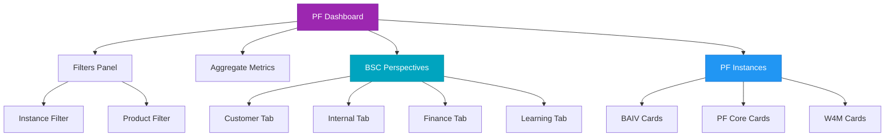

# Platform Dashboard - Complete Feature Summary

## Overview

The Platform Dashboard (PF Dashboard) is a comprehensive business intelligence interface that provides multi-dimensional visibility into platform performance across organizational, product, and strategic perspectives.

## Major Features

### 1. Top-Level Filters
**Location:** Top of dashboard

**Components:**
- PF Instance Filter (BAIV, PF Core, W4M, All)
- Product Filter (Dynamic list of all products)
- Active Filter Indicators
- Clear All button

**Documentation:** `/docs/PF_DASHBOARD_FILTERS.md`

---

### 2. Aggregate Metrics Grid
**Location:** Below filters

**Displays:**
- Total Users: 4,200 (+22%)
- Revenue: $135,000 (+18%)
- Active Sessions: 2,847 (+15%)

Each metric shows:
- Current value
- Trend indicator (up/down arrow)
- Change percentage

---

### 3. Balanced Scorecard Perspectives (NEW)
**Location:** Middle section with 4 subtabs

**Perspectives:**

#### Customer 👥
- Focus: Satisfaction & retention
- Color: #00a4bf (Primary Blue)
- 6 key metrics with targets
- Strategic goals & initiatives

#### Internal 💼
- Focus: Process efficiency & quality
- Color: #2196f3 (Blue)
- **Section Structure:**
  1. Platform Operations Metrics (6 metrics)
     - Platform Uptime, API Response Time, Data Processing, etc.
  2. Customer Feedback & PMF KPIs (placeholder)
     - *Future section for customer feedback and product-market fit metrics*
  3. **Sales & Marketing KPIs (8 metrics with sparklines)** ✨
     - Lead Conversion Rate
     - Marketing Qualified Leads (MQL)
     - Sales Qualified Leads (SQL)
     - Sales Cycle Length
     - Marketing ROI
     - Campaign Success Rate
     - Pipeline Velocity
     - Customer Acquisition Cost (CAC)
  4. Strategic Goals (4 goals)
  5. Current Initiatives (4 initiatives)

#### Finance 💰
- Focus: Revenue & profitability
- Color: #4caf50 (Green)
- 6 financial KPIs
- Growth & efficiency targets

#### Learning 🎓
- Focus: Innovation & development
- Color: #9c27b0 (Purple)
- 6 capability metrics
- R&D & training initiatives

**Documentation:** `/docs/BSC_PERSPECTIVES.md`

---

### 4. PF Instances Section
**Location:** Bottom of dashboard

**Instances:**
- **BAIV** - Business AI Visibility Platform (3 products)
- **PF Core** - Platform Foundation & Core Services (8 products)
- **W4M** - Workflow Management System (2 products)

**Features:**
- Expandable product lists
- Instance metrics (users, revenue, growth)
- Status badges
- Product filtering integration

---

## Navigation Flow

```
Admin Tab
  └─ PF Dashboard
       ├─ Filters (Instance + Product)
       ├─ Aggregate Metrics (3 cards)
       ├─ BSC Perspectives
       │    ├─ Customer
       │    ├─ Internal
       │    ├─ Finance
       │    └─ Learning
       └─ PF Instances
            ├─ BAIV
            ├─ PF Core
            └─ W4M
```

## Data Summary

### Total Platform Metrics
- **Users:** 4,200 across all instances
- **Revenue:** $135,000 combined
- **Growth:** Averaging 22% across instances
- **Products:** 13 total products (3 BAIV, 8 PF Core, 2 W4M)

### Instance Breakdown

| Instance | Users | Revenue | Growth | Products |
|----------|-------|---------|--------|----------|
| BAIV | 1,250 | $45K | 23% | 3 |
| PF Core | 2,100 | $58K | 28% | 8 |
| W4M | 850 | $32K | 18% | 2 |

### BSC Metrics Overview

| Perspective | Metrics Count | Current Avg | Target Gap |
|-------------|---------------|-------------|------------|
| Customer | 6 | ~70% | -20% |
| Internal | 6 | ~85% | -12% |
| Finance | 6 | ~78% | -18% |
| Learning | 6 | ~65% | -28% |

---

## User Workflows

### Scenario 1: Executive Review
1. View aggregate metrics for high-level performance
2. Switch through BSC perspectives for balanced view
3. Check instance performance in Instances section

### Scenario 2: Product Focus
1. Select specific product from filter
2. View filtered instance cards
3. Review BSC metrics related to that product

### Scenario 3: Instance Analysis
1. Select specific instance (e.g., BAIV)
2. View only that instance's data
3. Expand products to see details
4. Review BSC metrics with instance context

### Scenario 4: Strategic Planning
1. Review each BSC perspective tab
2. Analyze current vs. target gaps
3. Review initiatives and goals
4. Identify areas needing attention

---

## Technical Architecture

### Components
- **Main:** `PlatformDashboard.tsx`
- **Types:** `types.ts`
- **Data Source:** `Baiv2App.tsx` (mockPlatforms, mockMetrics)

### State Management
```tsx
// Filters
const [selectedInstance, setSelectedInstance] = useState<string>("all");
const [selectedProduct, setSelectedProduct] = useState<string>("all");

// BSC
const [bscPerspective, setBscPerspective] = useState<string>("customer");

// UI
const [expandedPlatforms, setExpandedPlatforms] = useState<string[]>([]);
```

### Key Functions
- `filteredPlatforms` - Applies instance filter
- `getFilteredProducts()` - Applies product filter
- `getTrendIcon()` - Displays trend indicators

---

## Integration Points

### Value Engineering
- BSC perspectives align with VE 150 (Business Framework)
- Financial metrics support VE 300 (OKR) tracking
- Customer metrics feed VE 500 (Canvas) insights

### Product Manager
- Product list integrates with PM feature prioritization
- Customer metrics inform product decisions
- Learning metrics track feature adoption

### CRM
- Customer perspective metrics from CRM data
- Lead/customer lifecycle integration
- NPS and CSAT scores

### Solution Architect
- Internal perspective tracks technical metrics
- Platform architecture impacts operational metrics
- Infrastructure scaling initiatives

---

## Mermaid Diagrams

### Complete Dashboard Structure


See `/docs/PF_DASHBOARD_ARCHITECTURE.md` for more diagrams.

---

## Future Roadmap

### Planned Enhancements

#### Phase 1: Configuration
- [ ] PF Instance ontology data input/edit UI (TODO added)
- [ ] Custom metric definitions
- [ ] Configurable targets

#### Phase 2: Analytics
- [ ] Historical trend charts
- [ ] Predictive analytics
- [ ] Correlation analysis between perspectives

#### Phase 3: Interactivity
- [ ] Drill-down metric details
- [ ] Export reports (PDF/Excel)
- [ ] Scheduled email reports

#### Phase 4: Integration
- [ ] Live data connections (vs. mock)
- [ ] Real-time updates
- [ ] API for external systems

#### Phase 5: Collaboration
- [ ] Metric comments/notes
- [ ] Goal tracking workflows
- [ ] Initiative assignment

---

## Files Modified

1. `/modules/baiv2/PlatformDashboard.tsx`
   - Added BSC perspectives data structure
   - Added 4 subtabs with metrics
   - Added goals and initiatives display
   - Integrated filters with BSC
   - Added Sales & Marketing KPIs with sparklines to Internal perspective ✨

2. `/modules/baiv2/Baiv2App.tsx`
   - Added PF Core instance
   - Updated aggregate metrics
   - Expanded product definitions
   - Reorganized products (VE Suite, SA Module, AI Assistant, Analytics moved to PF Core)

3. `/components/Sparkline.tsx` (NEW) ✨
   - Created sparkline visualization component using recharts
   - Supports custom colors and data arrays
   - Used for sales & marketing KPI trends

4. `/components/MermaidDiagram.tsx` (Previously added)
   - Supports BSC visualization

---

## Documentation Files

1. `/docs/PF_DASHBOARD_FILTERS.md` - Filter system guide
2. `/docs/BSC_PERSPECTIVES.md` - BSC detailed documentation
3. `/docs/SALES_MARKETING_KPIS.md` - Sales & Marketing KPIs with sparklines ✨
4. `/docs/INTERNAL_PERSPECTIVE_STRUCTURE.md` - Internal tab section hierarchy ✨
5. `/docs/RBAC_PLATFORM_ACCESS.md` - Role-Based Access Control tables ✨
6. `/docs/RBAC_RRR_SECURITY_ARCHITECT.md` - RBAC cross-reference to RRR ontology & Security Architect ✨
7. `/docs/PF_DASHBOARD_ARCHITECTURE.md` - Mermaid diagrams
8. `/docs/PLATFORM_DASHBOARD_SUMMARY.md` - This file
9. `/docs/PRODUCT_ORGANIZATION.md` - Product structure and organization
10. `/docs/MERMAID_GUIDE.md` - Diagram creation guide
11. `/docs/MERMAID_QUICK_START.md` - Quick reference

---

## Quick Start

### For End Users
1. Navigate: Admin → PF Dashboard
2. Use filters to focus on specific instances/products
3. Review aggregate metrics at top
4. Switch between BSC perspective tabs
5. Scroll to instances section for detailed view

### For Developers
1. Read `/docs/PF_DASHBOARD_FILTERS.md` for filter logic
2. Read `/docs/BSC_PERSPECTIVES.md` for BSC implementation
3. Review `PlatformDashboard.tsx` component structure
4. Check `types.ts` for data models

### For Admins
1. Update metrics data in `Baiv2App.tsx`
2. Adjust targets in BSC perspectives
3. Configure instances and products
4. Plan ontology configuration (future)

---

**Version:** 2.0
**Last Updated:** December 12, 2025
**Status:** Production Ready ✅

All features fully implemented with comprehensive documentation!