# PF-Core: VE Value Proposition PRD v1.0.0

## Strategic Bridge from VSOM to Execution

*Value Engineering Layer 4 | Platform Foundation Core*

---

| | |
|---------------------|-------|
| **Document ID** | PF-Core_VE_ValueProposition_PRD_v1.0.0 |
| **Document Type** | PRD (Product Requirements Document) |
| **Version** | 1.0.0 |
| **Date** | December 2025 |
| **Author** | Platform Architecture Team |
| **Platform** | BAIV Agentic Platform - Platform Foundation Core |
| **Module Type** | Value Engineering (Transferable Core Function) |
| **Upstream Module** | VSOM (Vision, Strategy, Objectives & Metrics) |
| **Downstream Modules** | OKR Module, PRD Generation, Context Engineering |
| **Ontology Compliance** | Schema.org Grounded \| OAA Registry v3.0 |
| **Transferability** | BAIV, AIR, Wings4Mind.ai, Client Deployments |

---

## LICENSE AND CONDITIONS

> **DIGITAL ASSET - BETA STATUS**
>
> This Digital Asset is Beta and Subject to IP and Commercial Arrangements to be managed via Platform Digital Contracts. The Assets remain licensed for continuing review and limited use until commercial contract management is fully agreed and implemented.
>
> **PF-CORE LICENSING ARRANGEMENTS**
>
> Wings4Mind.ai (W4M) and Be AI Visible (BAIV) are licensed under Platform Foundation Core (PF-CORE) arrangements for authorized participants. All licensing terms, usage rights, royalty structures, and compliance obligations are governed and enforced through Digital Contracts deployed on the platform infrastructure.
>
> © 2025 Platform Foundation Core Holdings. W4M and BAIV licensed under PF-CORE Participant Arrangements.
>
> **Asset Status: BETA - COMMERCIAL TERMS PENDING**

---

## 1. Executive Summary

The **Value Proposition Module** represents Layer 4 of the Platform Foundation Core's Value Engineering architecture. This module provides systematic methodology for articulating how products, services, projects, and processes create measurable value for specific customer segments by addressing validated problems with quantifiable outcomes.

As the critical bridge between strategic intent (VSOM) and operational execution (OKR/PRD), the Value Proposition Module enables:

- **Hypothesis-Driven Development** using IF-FOR-THEN-BECAUSE structured formulation
- **Customer-Centric Problem Definition** with severity, frequency, and consequence mapping
- **Value Driver Quantification** linking benefits to measurable business outcomes
- **Competitive Differentiation** using Blue Ocean Strategy framework
- **AI Visibility Optimization** ensuring value propositions are discoverable by AI systems
- **VSOM Strategic Alignment** with traceability to organizational objectives

### 1.1 Value Engineering Cascade Position

```mermaid
flowchart TB
    subgraph CASCADE["VALUE ENGINEERING CASCADE"]
        direction TB
        
        L1["🎯 Layer 1: VSOM Strategic Foundation"]
        L1_detail["Vision → Strategy → Objectives → Metrics"]
        
        L2["👥 Layer 2: RACI Accountability Matrix"]
        L2_detail["C-Suite → Directors → Managers → ICs"]
        
        L3["📊 Layer 3: OKR Domain Scoping"]
        L3_detail["Domain Objectives → Key Results → Alignment"]
        
        L4["⭐ Layer 4: VALUE PROPOSITION MODULE"]
        L4_detail["Hypothesis → Segment → Problem → Value Drivers"]
        
        L5["🔧 Layer 5: Context Engineering"]
        L5_detail["Market → Organizational → Competitive Context"]
        
        L6["📋 Layer 6: PRD Generation"]
        L6_detail["Decomposition → Requirements → TDD Specs"]
        
        L7["✅ Layer 7: TDD-Driven Execution"]
        L7_detail["Tests → Implementation → Validation"]
        
        L1 --> L1_detail --> L2
        L2 --> L2_detail --> L3
        L3 --> L3_detail --> L4
        L4 --> L4_detail --> L5
        L5 --> L5_detail --> L6
        L6 --> L6_detail --> L7
        L7 --> L7_detail
    end
    
    style L4 fill:#1A365D,color:#fff,stroke:#2C5282,stroke-width:3px
    style L4_detail fill:#2C5282,color:#fff
    style L1 fill:#4A5568,color:#fff
    style L2 fill:#4A5568,color:#fff
    style L3 fill:#4A5568,color:#fff
    style L5 fill:#4A5568,color:#fff
    style L6 fill:#4A5568,color:#fff
    style L7 fill:#4A5568,color:#fff
```



### 1.2 Strategic Value Proposition

- **Unified Value Framework:** Single source of truth for all value proposition elements with semantic linkage to VSOM strategic objectives
- **Hypothesis Validation Pipeline:** Systematic approach to testing assumptions before major investment
- **AI-Ready Articulation:** Schema.org-grounded JSON-LD structures enabling AI discovery and recommendation
- **Blue Ocean Integration:** Eliminate-Reduce-Raise-Create framework for sustainable differentiation
- **Context Engineering Feed:** Rich context for AI agents to reason about value delivery
- **Platform Transferability:** Core module applicable across BAIV, AIR, Wings4Mind.ai, and client deployments

---

## 2. Problem Statement

### 2.1 Current State Challenges

Organizations deploying AI-driven platforms face critical gaps in value articulation:

| Challenge | Business Impact | Cost of Inaction |
|-----------|-----------------|------------------|
| **Unclear Value Propositions** | Sales cycles 2-3x longer | Lost deals to competitors with clearer messaging |
| **Unvalidated Assumptions** | 70% of features unused | Wasted development resources |
| **Customer Segment Confusion** | Marketing spend inefficiency | CAC increases 40-60% |
| **Problem-Solution Mismatch** | Product-market fit failure | Pivot costs $500K-$2M |
| **Missing AI Visibility** | AI systems recommend competitors | Lost discovery opportunities |
| **No Strategic Alignment** | Value props contradict strategy | Brand inconsistency and confusion |

### 2.2 Impact Analysis

Without systematic value proposition development:

1. **Strategic Fragmentation:** Value propositions created ad-hoc without VSOM alignment
2. **Hypothesis Debt:** Assumptions accumulate without validation, leading to pivot debt
3. **Customer Blindness:** Pain points assumed rather than discovered and validated
4. **Commodity Positioning:** Differentiation claims without sustainable competitive gaps
5. **AI Invisibility:** Value articulation not optimized for AI citation and recommendation

---

## 3. Solution Overview

### 3.1 Value Proposition Module Architecture

The Value Proposition Module implements a comprehensive five-stage development framework with ontology-driven data structures and AI-assisted guidance.

```mermaid
flowchart LR
    subgraph WIZARD["Value Proposition Wizard Flow"]
        direction LR
        S1["1️⃣ Customer<br/>Segment"]
        S2["2️⃣ Problem<br/>Definition"]
        S3["3️⃣ Value<br/>Drivers"]
        S4["4️⃣ Differentiation<br/>Strategy"]
        S5["5️⃣ Hypothesis<br/>Formulation"]
        
        S1 --> S2 --> S3 --> S4 --> S5
    end
    
    subgraph OUTPUTS["Module Outputs"]
        direction TB
        VP["Value Proposition<br/>Document"]
        CTX["Agent Context<br/>Package"]
        VIS["AI Visibility<br/>Report"]
    end
    
    S5 --> VP
    S5 --> CTX
    S5 --> VIS
    
    style S1 fill:#02A4BF,color:#fff
    style S2 fill:#02A4BF,color:#fff
    style S3 fill:#02A4BF,color:#fff
    style S4 fill:#02A4BF,color:#fff
    style S5 fill:#1A365D,color:#fff
    style VP fill:#10B981,color:#fff
    style CTX fill:#10B981,color:#fff
    style VIS fill:#10B981,color:#fff
```



#### Stage 1: Customer Segment Definition

**Purpose:** Define target customer segments with precision and clarity.

- **Segment Identification:** Industry, company size, geography, maturity stage
- **Decision Maker Mapping:** C-Suite roles, influencers, gatekeepers
- **Pain Point Discovery:** Economic, functional, emotional, social, process pains
- **Goal Articulation:** Functional, social, emotional, strategic goals
- **Willingness to Pay Assessment:** Pain intensity correlated with budget allocation

#### Stage 2: Problem Definition

**Purpose:** Structure problems using validated methodology.

**Problem Statement Format:**
```
[TARGET SEGMENT] struggles with [CHALLENGE] 
when trying to [DESIRED OUTCOME], 
resulting in [CONSEQUENCES].
```

- **Problem Categories:** Functional, Economic, Emotional, Social, Strategic
- **Severity Assessment:** Critical, High, Medium, Low with impact quantification
- **Frequency Analysis:** Constant, Daily, Weekly, Monthly, Occasional
- **Consequence Mapping:** Direct costs, opportunity costs, risks, reputation, compliance
- **Current Solution Analysis:** Competitor products, manual processes, workarounds, status quo

#### Stage 3: Value Driver Identification

**Purpose:** Articulate how the solution creates measurable value.

- **Driver Types:** Cost Reduction, Revenue Growth, Risk Mitigation, Efficiency Gain, Capability Enhancement, Competitive Advantage
- **Quantifiable Value:** Baseline → Target with timeframe and unit
- **Evidence Classification:** Case Study, Metric, Testimonial, Benchmark, Research
- **ROI Calculation:** Time-to-value with investment recovery analysis

#### Stage 4: Differentiation Strategy

**Purpose:** Establish sustainable competitive advantage.

```mermaid
quadrantChart
    title Blue Ocean Strategy Framework
    x-axis Reduce --> Raise
    y-axis Eliminate --> Create
    quadrant-1 CREATE: New Value
    quadrant-2 RAISE: Above Standard
    quadrant-3 ELIMINATE: No Value
    quadrant-4 REDUCE: Below Standard
    
    "Multi-AI Monitoring": [0.85, 0.90]
    "Semantic Engine": [0.75, 0.85]
    "Manual Reporting": [0.15, 0.10]
    "Complex Setup": [0.20, 0.25]
    "Real-time Alerts": [0.80, 0.70]
    "Basic Analytics": [0.35, 0.30]
```

**Blue Ocean Strategy Framework:**

| Action | Definition | Application |
|--------|------------|-------------|
| **Eliminate** | Factors to remove | What industry takes for granted but creates no value |
| **Reduce** | Factors to scale back | What to reduce below industry standard |
| **Raise** | Factors to elevate | What to raise above industry standard |
| **Create** | New factors | What industry has never offered |

- **Competitive Gap Identification:** What competitors cannot easily replicate
- **Sustainability Period:** How long advantage can be maintained
- **Moat Documentation:** Technical, network, data, switching cost moats

#### Stage 5: Hypothesis Formulation & Validation

**Purpose:** Create testable assumptions with validation plans.


**IF-FOR-THEN-BECAUSE Format:**
```
IF we [SOLUTION/ACTION]
FOR [TARGET CUSTOMER SEGMENT]
THEN they will [EXPECTED OUTCOME/BENEFIT]
BECAUSE [UNDERLYING RATIONALE/MECHANISM]
```

- **Validation Methods:** Customer Interview, A/B Test, Prototype Test, Market Research, Pilot Program
- **Success Criteria:** Quantitative metrics and qualitative signals
- **Confidence Scoring:** 0-100% confidence level with evidence links
- **Iteration Tracking:** Hypothesis versioning with refinement history

---

## 4. Functional Requirements

### 4.1 Customer Segment Manager

1. **FR-CS-001:** System SHALL provide CRUD operations for Customer Segments with industry taxonomy alignment
2. **FR-CS-002:** System SHALL support company size classification: Startup, SMB, Mid-Market, Enterprise, Global Enterprise
3. **FR-CS-003:** System SHALL enable decision maker role mapping with RACI/RBAC integration
4. **FR-CS-004:** System SHALL track pain points with intensity scoring (1-10) and willingness-to-pay assessment
5. **FR-CS-005:** System SHALL support customer goal definition across Functional, Social, Emotional, Strategic types
6. **FR-CS-006:** System SHALL generate schema.org-compliant JSON-LD for Customer Segment ontology
7. **FR-CS-007:** System SHALL validate that each segment has at least one documented pain point

### 4.2 Problem Definition Manager

1. **FR-PD-001:** System SHALL enforce structured problem statement format: TARGET-CHALLENGE-OUTCOME-CONSEQUENCES
2. **FR-PD-002:** System SHALL classify problems by category: Functional, Economic, Emotional, Social, Strategic
3. **FR-PD-003:** System SHALL track severity levels: Critical, High, Medium, Low with business impact quantification
4. **FR-PD-004:** System SHALL capture frequency: Constant, Daily, Weekly, Monthly, Occasional
5. **FR-PD-005:** System SHALL document consequences with consequence type classification and monetary impact estimation
6. **FR-PD-006:** System SHALL track current solutions with gap analysis and satisfaction scoring (1-10)
7. **FR-PD-007:** System SHALL enforce that Critical severity problems have at least one documented consequence

### 4.3 Value Driver Manager

1. **FR-VD-001:** System SHALL support value driver types: Cost Reduction, Revenue Growth, Risk Mitigation, Efficiency Gain, Capability Enhancement, Competitive Advantage
2. **FR-VD-002:** System SHALL capture quantifiable value with baseline, target, improvement percentage, unit, and time-to-value
3. **FR-VD-003:** System SHALL track evidence type: Case Study, Metric, Testimonial, Benchmark, Research
4. **FR-VD-004:** System SHALL calculate ROI projections based on quantified value drivers
5. **FR-VD-005:** System SHALL link value drivers to VSOM strategic objectives for alignment validation
6. **FR-VD-006:** System SHALL support both quantitative and qualitative value articulation

### 4.4 Differentiator Manager

1. **FR-DM-001:** System SHALL support Blue Ocean Strategy actions: Eliminate, Reduce, Raise, Create
2. **FR-DM-002:** System SHALL track differentiator types: Feature, Technology, Methodology, Experience, Integration, Support, Pricing
3. **FR-DM-003:** System SHALL document competitive gaps with sustainability period (ISO 8601 Duration)
4. **FR-DM-004:** System SHALL assess differentiation strength with scoring mechanism
5. **FR-DM-005:** System SHALL enforce that differentiators with competitive gaps specify sustainability period

### 4.5 Hypothesis Manager

1. **FR-HM-001:** System SHALL enforce IF-FOR-THEN-BECAUSE hypothesis structure with all four components required
2. **FR-HM-002:** System SHALL track validation status: Untested, In Progress, Validated, Invalidated, Needs Refinement
3. **FR-HM-003:** System SHALL capture validation method selection with evidence linking
4. **FR-HM-004:** System SHALL track confidence level (0-100%) with historical trending
5. **FR-HM-005:** System SHALL support hypothesis versioning with refinement history
6. **FR-HM-006:** System SHALL generate validation experiment specifications

### 4.6 Value Proposition Assembler

1. **FR-VP-001:** System SHALL assemble complete Value Proposition from components: Segment, Problem, Value Drivers, Differentiators, Hypothesis
2. **FR-VP-002:** System SHALL generate value proposition statement using IF-FOR-THEN-BECAUSE format
3. **FR-VP-003:** System SHALL validate proposition completeness against business rules
4. **FR-VP-004:** System SHALL link to VSOM strategic objectives with alignment scoring
5. **FR-VP-005:** System SHALL export schema.org-compliant JSON-LD for ontology compliance
6. **FR-VP-006:** System SHALL support proposition types: Product, Service, Project, Process, Initiative

### 4.7 AI Visibility Optimizer

1. **FR-AV-001:** System SHALL analyze value proposition semantic clarity for AI discoverability
2. **FR-AV-002:** System SHALL assess entity recognition potential across major AI platforms
3. **FR-AV-003:** System SHALL evaluate citation potential based on content structure
4. **FR-AV-004:** System SHALL generate AI-optimized content recommendations
5. **FR-AV-005:** System SHALL score AI visibility (0-100) with improvement suggestions
6. **FR-AV-006:** System SHALL integrate with BAIV AI Visibility Assessment pipeline

---

## 5. Technical Requirements

### 5.1 Ontology Architecture

All Value Proposition data structures SHALL be grounded in schema.org vocabulary with custom extensions.

**JSON-LD Structure Requirements:**
- **@context:** Schema.org base with `vp:` namespace extensions
- **@type:** Custom type hierarchy (ValueProposition, CustomerSegment, ProblemDefinition, ValueDriver, Differentiator, Hypothesis)
- **@id:** Unique identifiers with URI structure
- **Semantic Relationships:** Explicit linkage between Segment → Problem → Value Drivers → Proposition

**Core Entities:**


| Entity | Base Type | Key Properties |
|--------|-----------|----------------|
| ValueProposition | Intangible | propositionId, propositionStatement, propositionType, validationStatus |
| CustomerSegment | Audience | segmentId, industry, companySize, decisionMakers, painPoints |
| ProblemDefinition | Intangible | problemId, problemStatement, severity, frequency, consequences |
| ValueDriver | Intangible | driverId, driverType, quantifiableValue, evidenceType |
| Differentiator | Intangible | differentiatorId, blueOceanStrategy, competitiveGap, sustainabilityPeriod |
| Hypothesis | Intangible | hypothesisId, ifComponent, forComponent, thenComponent, becauseComponent |

### 5.2 Database Schema

**Supabase PostgreSQL with JSONB Storage Pattern:**


**SQL Schema Definition:**

```sql
-- Value Propositions
CREATE TABLE value_propositions (
    id UUID PRIMARY KEY DEFAULT gen_random_uuid(),
    tenant_id UUID NOT NULL REFERENCES tenants(id) ON DELETE CASCADE,
    proposition_id VARCHAR(50) NOT NULL,
    proposition_name VARCHAR(100) NOT NULL,
    proposition_statement TEXT NOT NULL,
    proposition_type VARCHAR(50) CHECK (proposition_type IN ('Product', 'Service', 'Project', 'Process', 'Initiative')),
    target_segment_id UUID REFERENCES customer_segments(id),
    problem_addressed_id UUID REFERENCES problem_definitions(id),
    validation_status VARCHAR(50) DEFAULT 'Hypothesis',
    vsom_alignment_id UUID,
    ai_visibility_score INTEGER CHECK (ai_visibility_score BETWEEN 0 AND 100),
    ontology_data JSONB NOT NULL,
    created_at TIMESTAMPTZ DEFAULT NOW(),
    updated_at TIMESTAMPTZ DEFAULT NOW(),
    created_by UUID REFERENCES users(id)
);

-- Customer Segments
CREATE TABLE customer_segments (
    id UUID PRIMARY KEY DEFAULT gen_random_uuid(),
    tenant_id UUID NOT NULL REFERENCES tenants(id) ON DELETE CASCADE,
    segment_id VARCHAR(50) NOT NULL,
    segment_name VARCHAR(100) NOT NULL,
    segment_description TEXT,
    industry TEXT[],
    company_size VARCHAR(50),
    decision_makers TEXT[],
    influencers TEXT[],
    pain_points JSONB,
    goals JSONB,
    ontology_data JSONB NOT NULL,
    created_at TIMESTAMPTZ DEFAULT NOW(),
    updated_at TIMESTAMPTZ DEFAULT NOW()
);

-- Problem Definitions
CREATE TABLE problem_definitions (
    id UUID PRIMARY KEY DEFAULT gen_random_uuid(),
    tenant_id UUID NOT NULL REFERENCES tenants(id) ON DELETE CASCADE,
    problem_id VARCHAR(50) NOT NULL,
    problem_statement TEXT NOT NULL,
    problem_category VARCHAR(50),
    severity VARCHAR(20),
    frequency VARCHAR(50),
    consequences JSONB,
    current_solutions JSONB,
    ontology_data JSONB NOT NULL,
    created_at TIMESTAMPTZ DEFAULT NOW(),
    updated_at TIMESTAMPTZ DEFAULT NOW()
);

-- Value Drivers
CREATE TABLE value_drivers (
    id UUID PRIMARY KEY DEFAULT gen_random_uuid(),
    tenant_id UUID NOT NULL REFERENCES tenants(id) ON DELETE CASCADE,
    proposition_id UUID REFERENCES value_propositions(id) ON DELETE CASCADE,
    driver_id VARCHAR(50) NOT NULL,
    driver_name VARCHAR(100) NOT NULL,
    driver_type VARCHAR(50),
    quantifiable_value JSONB,
    qualitative_value TEXT,
    evidence_type VARCHAR(50),
    ontology_data JSONB NOT NULL,
    created_at TIMESTAMPTZ DEFAULT NOW(),
    updated_at TIMESTAMPTZ DEFAULT NOW()
);

-- Differentiators
CREATE TABLE differentiators (
    id UUID PRIMARY KEY DEFAULT gen_random_uuid(),
    tenant_id UUID NOT NULL REFERENCES tenants(id) ON DELETE CASCADE,
    proposition_id UUID REFERENCES value_propositions(id) ON DELETE CASCADE,
    differentiator_id VARCHAR(50) NOT NULL,
    differentiator_name VARCHAR(100) NOT NULL,
    differentiator_type VARCHAR(50),
    blue_ocean_strategy VARCHAR(20),
    competitive_gap TEXT,
    sustainability_period VARCHAR(50),
    ontology_data JSONB NOT NULL,
    created_at TIMESTAMPTZ DEFAULT NOW(),
    updated_at TIMESTAMPTZ DEFAULT NOW()
);

-- Hypotheses
CREATE TABLE hypotheses (
    id UUID PRIMARY KEY DEFAULT gen_random_uuid(),
    tenant_id UUID NOT NULL REFERENCES tenants(id) ON DELETE CASCADE,
    proposition_id UUID REFERENCES value_propositions(id) ON DELETE CASCADE,
    hypothesis_id VARCHAR(50) NOT NULL,
    hypothesis_statement TEXT NOT NULL,
    if_component TEXT NOT NULL,
    for_component TEXT NOT NULL,
    then_component TEXT NOT NULL,
    because_component TEXT NOT NULL,
    validation_method VARCHAR(50),
    validation_status VARCHAR(50) DEFAULT 'Untested',
    confidence_level INTEGER CHECK (confidence_level BETWEEN 0 AND 100),
    ontology_data JSONB NOT NULL,
    created_at TIMESTAMPTZ DEFAULT NOW(),
    updated_at TIMESTAMPTZ DEFAULT NOW()
);

-- Multi-tenant isolation via RLS
ALTER TABLE value_propositions ENABLE ROW LEVEL SECURITY;
ALTER TABLE customer_segments ENABLE ROW LEVEL SECURITY;
ALTER TABLE problem_definitions ENABLE ROW LEVEL SECURITY;
ALTER TABLE value_drivers ENABLE ROW LEVEL SECURITY;
ALTER TABLE differentiators ENABLE ROW LEVEL SECURITY;
ALTER TABLE hypotheses ENABLE ROW LEVEL SECURITY;
```

### 5.3 UI/UX Architecture

**Figma Make → Next.js with shadcn/ui Pipeline:**

- **Value Proposition Wizard:** 5-stage guided interface (Segment → Problem → Value → Differentiation → Hypothesis)
- **Component Library:** shadcn/ui primitives with BAIV design system tokens
- **AI Help Panel:** Contextual AI assistance at each wizard stage
- **Value Prop Canvas:** Visual representation of proposition components
- **Export Controls:** JSON-LD, PDF, Markdown export options
- **Responsive Design:** Desktop-first with tablet/mobile adaptations
- **Accessibility:** WCAG 2.1 AA compliance

### 5.4 Agent Integration

**Claude Agent SDK Orchestration:**

| Agent | Function | Ontologies Consumed |
|-------|----------|---------------------|
| **Value Proposition Wizard Agent** | Guides users through 5-stage VP development | Value Proposition, VSOM |
| **Customer Discovery Agent** | AI-powered segment and pain point discovery | Customer Segment, Customer Organization |
| **Hypothesis Validator Agent** | Generates validation experiment designs | Hypothesis, PMF |
| **AI Visibility Optimizer Agent** | Analyzes and optimizes for AI discoverability | Value Proposition, AI Visibility |
| **Differentiation Analyst Agent** | Blue Ocean Strategy analysis and recommendations | Differentiator, Gap Analysis |

---

## 6. User Stories

### 6.1 Executive User Stories

**US-EX-001:** As a CEO, I want to review all value propositions aligned with our strategic objectives so that I can ensure market-facing messaging supports our vision.

**US-EX-002:** As a CMO, I want to create value propositions for each customer segment so that marketing campaigns have clear, differentiated messaging.

**US-EX-003:** As a CPO, I want to link value propositions to product features so that development priorities align with customer value delivery.

**US-EX-004:** As an Executive, I want to see hypothesis validation status so that I can make data-driven decisions about strategic initiatives.

### 6.2 Product & Marketing User Stories

**US-PM-001:** As a Product Manager, I want to define customer segments with detailed pain points so that feature prioritization addresses real problems.

**US-PM-002:** As a Marketing Manager, I want to generate IF-FOR-THEN-BECAUSE hypotheses so that campaigns have testable assumptions.

**US-PM-003:** As a Content Strategist, I want AI-optimized value proposition content so that our brand appears in AI-powered discovery.

**US-PM-004:** As a Sales Enablement Lead, I want exportable value proposition documents so that sales teams have consistent messaging.

### 6.3 Platform User Stories

**US-PL-001:** As an AI Agent, I want to access value proposition context so that my recommendations align with articulated customer value.

**US-PL-002:** As a Platform Administrator, I want to configure value proposition templates so that each tenant starts with best-practice structures.

**US-PL-003:** As a Product Owner, I want to transfer the Value Proposition Module to new ventures so that AIR and Wings4Mind.ai benefit from the same framework.

### 6.4 Validation User Stories

**US-VAL-001:** As a Product Manager, I want to design validation experiments for hypotheses so that assumptions are tested before major investment.

**US-VAL-002:** As a UX Researcher, I want to track hypothesis confidence levels over time so that I can see how customer discovery improves our understanding.

**US-VAL-003:** As a Data Analyst, I want to correlate hypothesis validation with PMF metrics so that I can prove value proposition effectiveness.

---

## 7. Acceptance Criteria

### 7.1 Customer Segment Manager

**AC-CS-001:** Given a user creates a customer segment, when they save without a pain point, then the system displays validation error requiring at least one pain point.

**AC-CS-002:** Given a segment is created, when decision makers are added, then the system validates against RACI/RBAC role taxonomy.

**AC-CS-003:** Given pain points are defined, when intensity exceeds 7, then the system prompts for willingness-to-pay assessment.

### 7.2 Problem Definition Manager

**AC-PD-001:** Given a problem statement is entered, when it lacks TARGET-CHALLENGE-OUTCOME-CONSEQUENCES structure, then the system highlights missing components.

**AC-PD-002:** Given severity is set to Critical, when consequences are empty, then the system prevents save with validation message.

**AC-PD-003:** Given current solutions are documented, when satisfaction score is below 5, then the system highlights as opportunity.

### 7.3 Hypothesis Manager

**AC-HM-001:** Given a hypothesis is created, when any IF-FOR-THEN-BECAUSE component is missing, then the system prevents save.

**AC-HM-002:** Given validation status changes to Validated, when no evidence is linked, then the system prompts for evidence documentation.

**AC-HM-003:** Given confidence level is updated, when it changes by more than 20 points, then the system logs the change with reason capture.

### 7.4 Value Proposition Assembler

**AC-VP-001:** Given a value proposition is assembled, when it lacks target segment or problem definition, then completeness validation fails.

**AC-VP-002:** Given VSOM alignment is selected, when strategic objective status is "On Hold", then system displays alignment warning.

**AC-VP-003:** Given export is requested, when JSON-LD format is selected, then output validates against schema.org and OAA Registry standards.

### 7.5 AI Visibility Optimizer

**AC-AV-001:** Given AI visibility analysis runs, when score is below 50, then system generates specific improvement recommendations.

**AC-AV-002:** Given recommendations are implemented, when analysis re-runs, then score reflects improvements.

---

## 8. Integration Requirements

### 8.1 Integration Architecture


### 8.2 Upstream Module Integration

**VSOM Integration:**
- Value Propositions → VSOM Strategic Objectives mapping
- Alignment scoring based on objective priority and status
- Cascade visibility: Vision → Strategy → Objective → Value Proposition

**RACI/RBAC Integration:**
- Customer Segment decision makers → Organizational Roles mapping
- Permission-based access to value proposition editing
- Stakeholder context for value articulation

### 8.2 Downstream Module Integration

**OKR Module Integration:**
- Validated value propositions → OKR Objectives feeding
- Value driver metrics → Key Results targets
- Hypothesis validation → OKR confidence levels

**PRD Generation Integration:**
- Value Proposition → PRD scope definition
- Customer Segment → User Stories generation
- Value Drivers → Acceptance Criteria translation

**Context Engineering Integration:**
- Value Proposition context → Agent prompts
- Customer Segment → Market context assembly
- Differentiators → Competitive context

### 8.3 Platform Ecosystem Integration

| External System | Integration Type | Data Flow |
|-----------------|------------------|-----------|
| BAIV AI Visibility | Native platform | VP → Visibility Assessment → Optimization |
| PMF Module | Bidirectional API | Hypothesis ↔ PMF Survey validation |
| Gap Analysis | Read access | Competitive gaps → Differentiator inputs |
| Agent Manager | Native platform | VP context for all platform agents |

---

## 9. Non-Functional Requirements

### 9.1 Performance

- **Wizard Load Time:** < 1 second for wizard stage transitions
- **AI Assistance Response:** < 3 seconds for AI-powered suggestions
- **JSON-LD Export:** < 2 seconds for complete ontology export
- **Visibility Analysis:** < 5 seconds for AI visibility scoring

### 9.2 Scalability

- **Multi-Tenant Support:** 1000+ organizations with isolated VP instances
- **Propositions per Tenant:** 500+ value propositions with full versioning
- **Historical Data:** 5+ years of hypothesis validation history

### 9.3 Security & Compliance

- **Data Isolation:** Row-Level Security (RLS) enforced at database level
- **Audit Trail:** Complete version history for all value proposition changes
- **Role-Based Access:** Creator, Editor, Viewer, Admin permission levels
- **Export Controls:** Watermarking and access logging for exports

### 9.4 Transferability

- **Platform Independence:** Module deployable across BAIV, AIR, Wings4Mind.ai
- **Configuration-Driven:** All business rules in ontology definitions
- **Schema Export:** One-click JSON-LD export for ontology transfer
- **Template Library:** Pre-built templates for common industry verticals

---

## 10. Value Engineer Agent Outputs

The Value Proposition Module produces the following outputs for downstream consumption:

### 10.1 Structured Deliverables

| Output | Format | Consumer |
|--------|--------|----------|
| **Value Proposition Document** | Markdown, PDF, DOCX | Sales, Marketing, Stakeholders |
| **Customer Segment Profile** | JSON-LD, Markdown | Agents, PRD Generation |
| **Problem Definition Brief** | JSON-LD, Markdown | Product, Engineering |
| **Hypothesis Validation Plan** | JSON-LD, Markdown | UX Research, PMF Module |
| **Differentiation Analysis** | JSON-LD, Markdown | Strategy, Competitive Intel |
| **AI Visibility Report** | JSON, PDF | Marketing, SEO/AIO Teams |

### 10.2 Agent Context Outputs


**Context Package Structure:**

```json
{
  "@type": "vp:ValuePropositionContext",
  "propositionId": "VP-2025-001",
  "targetSegment": {
    "name": "Mid-Market B2B CMOs",
    "primaryPainPoint": "AI systems don't mention our brand",
    "willingnessToPay": "High"
  },
  "coreHypothesis": {
    "if": "Real-time AI visibility monitoring",
    "for": "Mid-market CMOs",
    "then": "30% improvement in AI citations",
    "because": "Semantic optimization aligns with AI processing"
  },
  "differentiators": [
    {
      "type": "Technology",
      "description": "Multi-AI platform monitoring",
      "sustainability": "18 months"
    }
  ],
  "vsomAlignment": {
    "objectiveId": "SO-MKT-001",
    "objectiveName": "Market Leadership in AI Visibility",
    "alignmentScore": 92
  }
}
```

### 10.3 Visualization Outputs

- **Value Proposition Canvas:** Visual diagram of segment → problem → value → differentiation
- **Hypothesis Validation Funnel:** Status visualization of all hypotheses
- **Competitive Position Map:** Blue Ocean strategy visualization
- **VSOM Alignment Tree:** Traceability from VP to strategic objectives

---

## 11. Implementation Phases


### Phase 1: Foundation (Weeks 1-3)
- Design Value Proposition ontology with schema.org grounding
- Create Supabase database schema with JSONB storage
- Implement Customer Segment Manager CRUD operations
- Build basic Wizard UI skeleton with Figma Make pipeline

### Phase 2: Problem & Value (Weeks 4-6)
- Implement Problem Definition Manager with structured format
- Build Value Driver Manager with quantification support
- Create consequence and current solution tracking
- Integrate with PMF Module for validation data

### Phase 3: Differentiation & Hypothesis (Weeks 7-9)
- Implement Differentiator Manager with Blue Ocean framework
- Build Hypothesis Manager with IF-FOR-THEN-BECAUSE structure
- Create validation experiment specification generator
- Implement confidence tracking with historical trending

### Phase 4: Assembly & Export (Weeks 10-12)
- Build Value Proposition Assembler with completeness validation
- Implement VSOM alignment linking and scoring
- Create export pipeline (JSON-LD, Markdown, PDF, DOCX)
- Deploy AI Visibility Optimizer integration

### Phase 5: Agent Integration (Weeks 13-15)
- Build Value Proposition Wizard Agent with Claude SDK
- Implement Customer Discovery Agent for AI-assisted segmentation
- Create Hypothesis Validator Agent for experiment design
- Integrate with Agent Manager orchestration system

### Phase 6: Transferability & Polish (Weeks 16-18)
- Package as Platform Foundation Core transferable module
- Create configuration templates for AIR and Wings4Mind.ai
- Build comprehensive documentation and API guides
- Execute TDD validation with >85% test coverage

---

## 12. Success Metrics

### 12.1 Module Adoption Metrics

- **VP Completion Rate:** 80% of started value propositions completed within 14 days
- **Hypothesis Validation Rate:** 60% of hypotheses move from Untested to Validated/Invalidated
- **Segment Coverage:** Average 3+ customer segments per tenant with documented pain points

### 12.2 Platform Value Metrics

- **Time to Value Proposition:** Reduce from 4-6 weeks (manual) to 1-2 days (guided)
- **Hypothesis Pivot Rate:** Track percentage of invalidated hypotheses leading to successful pivots
- **AI Visibility Improvement:** 30% improvement in AI visibility scores post-optimization

### 12.3 Technical Quality Metrics

- **Test Coverage:** >85% with TDD methodology
- **Ontology Compliance:** 100% schema.org validation passing
- **Transferability Index:** Successful deployment to 3+ ventures without code changes

---

## 13. Appendix

### 13.1 Value Proposition Ontology Structure (JSON-LD)

See `ontologies/value-proposition-ontology-v1.0.0.jsonld` for complete definition.

### 13.2 Mermaid Diagrams

**Value Proposition Development Flow:**
See `diagrams/value-proposition-mindmap.mermaid`

**Value Engineering Cascade:**
See `diagrams/value-engineering-cascade.mermaid`

### 13.3 Related Documentation

- VSOM Module PRD (PRD_PF_CORE_VSOM_Module_v1.0)
- CMO-OKR-ONTOLOGY v3.0.0 (ontologies/05-cmo-okr-ontology.json)
- Ontology Relationships Guide (ontologies/ontology-relationships.md)
- Database Schema Complete (DATABASE_SCHEMA_COMPLETE.md)
- Platform Foundation Core Transferable Functions Registry

### 13.4 Glossary

| Term | Definition |
|------|------------|
| **Value Proposition** | Statement of how a solution creates value for a customer segment |
| **IF-FOR-THEN-BECAUSE** | Structured hypothesis format for testable assumptions |
| **Blue Ocean Strategy** | Framework for creating uncontested market space |
| **Pain Point** | Specific frustration or unmet need experienced by customers |
| **Value Driver** | Mechanism by which solution creates measurable value |
| **Differentiator** | Unique characteristic distinguishing from competitors |
| **VSOM** | Vision, Strategy, Objectives & Metrics framework |
| **PF-Core** | Platform Foundation Core |
| **OAA Registry** | Ontology Architect Agent Registry |

---

**--- END OF DOCUMENT ---**
