# PF-Core BSC-OKR Configurable Framework
## Visual Architecture Guide

**Document Version:** 1.1  
**Module:** PF-CORE-BSC-OKR-VISUAL-GUIDE  
**Purpose:** Executive & Technical Visual Reference  
**Date:** December 2025  
**Change Log:** v1.1 - Renamed to BSC-OKR Framework, added Power BI to scope, clarified ERP/LOB integration approach

---

## 1. Vision, Purpose & Scope

### 1.1 Vision Statement

> **"Every person in the organization, from CEO to floor operative, has instant mobile access to strategically-aligned OKRs and balanced scorecard metrics—powered by real-time operational data from integrated LOB systems, with enterprise BI capabilities through Power BI."**

### 1.2 Purpose


### 1.3 Scope Definition

```mermaid
block-beta
    columns 3
    
    block:included:3
        A["✅ IN SCOPE - Build & Configure"]
    end
    
    B["BSC-OKR Framework"]
    C["Role-Based Scorecards"]
    D["Mobile-First UI"]
    
    E["Real-Time SOP Integration"]
    F["BSC 5-Perspective Model"]
    G["OKR Cascade Tracking"]
    
    H["Power BI Dashboards"]
    I["Agent Orchestration"]
    J["Push Notifications"]
    
    block:integrate:3
        K["🔗 IN SCOPE - Integrate via API"]
    end
    
    L["ERP Systems"]
    M["LOB Applications"]
    N["IoT Platforms"]
    
    block:excluded:3
        O["❌ OUT OF SCOPE - Do Not Reinvent"]
    end
    
    P["ERP Core Functions"]
    Q["Transaction Processing"]
    R["Master Data Management"]
```

### 1.4 Integration Philosophy

```mermaid
flowchart LR
    subgraph DoNotBuild["❌ DO NOT BUILD - Use Existing LOB"]
        ERP["ERP Systems<br/>(SAP, D365, NetSuite)"]
        TXN["Transaction Processing<br/>(Orders, Invoices, Payments)"]
        MDM["Master Data<br/>(Products, Customers, Vendors)"]
        WMS["WMS/TMS<br/>(Warehouse, Transport)"]
        MES["MES/SCADA<br/>(Production, IoT)"]
    end
    
    subgraph Integrate["🔗 INTEGRATE VIA API"]
        API["REST/GraphQL APIs"]
        WEBHOOK["Webhooks & Events"]
        CDC["Change Data Capture"]
        ETL["ETL/ELT Pipelines"]
    end
    
    subgraph Build["✅ BUILD - BSC-OKR Platform"]
        BSCOKR["BSC-OKR Engine"]
        MOBILE["Mobile Scorecards"]
        AGENT["AI Configuration Agent"]
        PBI["Power BI Integration"]
        ALERTS["Intelligent Alerts"]
    end
    
    DoNotBuild -->|"Events & Data"| Integrate
    Integrate -->|"KPIs & Metrics"| Build
    
    style DoNotBuild fill:#ffcdd2
    style Integrate fill:#fff9c4
    style Build fill:#c8e6c9
```

**Key Principle:** *"Integrate, Don't Replicate"* - We consume data from existing LOB systems via APIs and events. We do NOT rebuild ERP functionality, transaction processing, or master data management.

---

## 2. High-Level Architecture

### 2.1 System Architecture Overview

```mermaid
flowchart TB
    subgraph Users["👥 USERS (Mobile-First)"]
        CEO["📱 CEO"]
        GM["📱 Site GM"]
        MGR["📱 Managers"]
        SUP["📱 Supervisors"]
        OPS["📱 Operatives"]
    end
    
    subgraph Mobile["📱 MOBILE LAYER"]
        APP["React Native / Flutter App"]
        OFFLINE["Offline Storage"]
        PUSH["Push Notifications"]
        PBI_MOB["Power BI Mobile"]
    end
    
    subgraph API["🔌 API LAYER"]
        REST["RESTful APIs"]
        RT["Real-Time Subscriptions"]
        AUTH["Authentication & RLS"]
    end
    
    subgraph Core["⚙️ BSC-OKR PLATFORM (Supabase)"]
        DB[(PostgreSQL Database)]
        REALTIME["Supabase Realtime"]
        EDGE["Edge Functions"]
        STORAGE["File Storage"]
    end
    
    subgraph BI["📊 ENTERPRISE BI (Power BI)"]
        SEMANTIC["Semantic Models"]
        REPORTS["Reports & Dashboards"]
        EMBED["Embedded Analytics"]
    end
    
    subgraph Agent["🤖 AI LAYER"]
        CONFIG["BSC-OKR Config Agent"]
        PREDICT["Predictive Analytics"]
        COPILOT["Copilot Integration"]
    end
    
    subgraph LOB["🏢 LOB SYSTEMS (Integrate Only)"]
        ERP["ERP<br/>(SAP/D365/NetSuite)"]
        SOP["SOP Apps"]
        IOT["IoT Platforms"]
        CRM["CRM Systems"]
    end
    
    Users --> Mobile
    Mobile --> API
    API --> Core
    Core --> BI
    Core --> Agent
    LOB -->|"API/Events"| Core
    BI --> Mobile
    
    style Users fill:#e1f5fe
    style Mobile fill:#f3e5f5
    style API fill:#fff3e0
    style Core fill:#e8f5e9
    style BI fill:#fce4ec
    style Agent fill:#e0f7fa
    style LOB fill:#eceff1
```

### 2.2 Data Flow Architecture


---

## 3. BSC-OKR Framework

### 3.1 BSC-OKR Integration Model

```mermaid
flowchart TB
    subgraph Strategy["🎯 STRATEGIC ALIGNMENT"]
        VISION["Vision & Mission"]
        SO["Strategic Objectives"]
    end
    
    subgraph BSC["📊 BALANCED SCORECARD"]
        FIN["💰 Financial"]
        CUS["👥 Customer"]
        PRO["⚙️ Process"]
        LRN["📚 Learning"]
        STK["🤝 Stakeholder"]
    end
    
    subgraph OKR["🎯 OKR CASCADE"]
        O_ENT["Enterprise OKRs"]
        O_REG["Regional OKRs"]
        O_SITE["Site OKRs"]
        O_TEAM["Team OKRs"]
        O_IND["Individual OKRs"]
    end
    
    subgraph KPI["📈 KPI MEASUREMENT"]
        KPI_LEAD["Leading Indicators"]
        KPI_LAG["Lagging Indicators"]
        KPI_DIAG["Diagnostic Metrics"]
    end
    
    VISION --> SO
    SO --> BSC
    BSC --> OKR
    OKR --> KPI
    KPI -.->|"Feedback"| SO
    
    style Strategy fill:#e8eaf6
    style BSC fill:#e3f2fd
    style OKR fill:#e8f5e9
    style KPI fill:#fff3e0
```

### 3.2 Five Perspectives Model


### 3.2 Role-Based Perspective Weighting


**Legend:** Financial | Customer | Process | Learning | Stakeholder

---

## 4. Hierarchical Cascade Model

### 4.1 VSOM to OKR Cascade


### 4.2 Role Visibility & Cascade Access

```mermaid
flowchart TB
    subgraph Visibility["SCORECARD VISIBILITY BY ROLE"]
        direction LR
        
        subgraph CEO_V["CEO View"]
            CEO_UP["⬆️ Strategic Objectives"]
            CEO_OWN["📍 Own OKRs"]
            CEO_DOWN["⬇️ All C-Suite + GMs<br/>Full Depth"]
        end
        
        subgraph GM_V["Site GM View"]
            GM_UP["⬆️ COO OKRs<br/>Strategic Objectives"]
            GM_OWN["📍 Own OKRs"]
            GM_DOWN["⬇️ Site Directors<br/>2 Levels Down"]
        end
        
        subgraph MGR_V["Manager View"]
            MGR_UP["⬆️ Director OKRs"]
            MGR_OWN["📍 Own OKRs"]
            MGR_DOWN["⬇️ Supervisors<br/>1 Level Down"]
        end
        
        subgraph SUP_V["Supervisor View"]
            SUP_UP["⬆️ Manager OKRs"]
            SUP_OWN["📍 Own OKRs"]
            SUP_DOWN["⬇️ Team Members"]
        end
    end
    
    CEO_V --> GM_V --> MGR_V --> SUP_V
    
    style CEO_V fill:#c8e6c9
    style GM_V fill:#bbdefb
    style MGR_V fill:#fff9c4
    style SUP_V fill:#ffccbc
```

---

## 5. LOB & SOP Integration Architecture

### 5.1 LOB System Integration Approach

```mermaid
flowchart TB
    subgraph LOB["🏢 LINE OF BUSINESS SYSTEMS (External - Integrate Only)"]
        subgraph ERP_SYS["ERP Systems"]
            SAP["SAP S/4HANA"]
            D365["Dynamics 365"]
            NETSUITE["NetSuite"]
        end
        
        subgraph Ops["Operational Systems"]
            MES["MES/SCADA"]
            WMS["WMS"]
            TMS["TMS"]
            QMS["QMS"]
        end
        
        subgraph Other["Other LOB"]
            CRM["CRM"]
            HCM["HCM/HRIS"]
            PLM["PLM"]
        end
    end
    
    subgraph Integration["🔗 INTEGRATION PATTERNS"]
        REST_API["REST APIs"]
        ODATA["OData Feeds"]
        WEBHOOK["Webhooks"]
        CDC["Change Data Capture"]
        FILE["File/Batch"]
    end
    
    subgraph BSCOKR["✅ BSC-OKR PLATFORM (Build)"]
        INGEST["Event Ingestion"]
        KPI_CALC["KPI Calculation"]
        OKR_TRACK["OKR Tracking"]
        ALERT_ENG["Alert Engine"]
    end
    
    LOB -->|"Events & Data"| Integration
    Integration -->|"Transformed KPIs"| BSCOKR
    
    style LOB fill:#eceff1
    style Integration fill:#fff9c4
    style BSCOKR fill:#c8e6c9
```

### 5.2 SOP Apps & Event Flows (via LOB Integration)


### 5.2 SOP-to-Scorecard Data Pipeline

```mermaid
sequenceDiagram
    participant SOP as SOP App
    participant WH as Webhook Handler
    participant EF as Edge Function
    participant DB as Database
    participant RT as Realtime
    participant MOB as Mobile App
    participant USER as User
    
    SOP->>WH: Event (ORDER_DISPATCHED)
    WH->>EF: Process Event
    EF->>EF: Validate & Transform
    EF->>DB: Update KPI Value
    EF->>DB: Check Thresholds
    
    alt Threshold Breached
        EF->>DB: Create Alert
        DB->>RT: Broadcast Alert
        RT->>MOB: Push Notification
        MOB->>USER: 🔔 Alert!
    end
    
    DB->>RT: Broadcast KPI Update
    RT->>MOB: Real-time Update
    MOB->>USER: Dashboard Refresh
```

---

## 6. Mobile-First Design

### 6.1 Mobile UI Architecture

```mermaid
flowchart TB
    subgraph Mobile["📱 MOBILE APP STRUCTURE"]
        direction TB
        
        subgraph Home["🏠 HOME SCREEN"]
            HEALTH["BSC Health Summary"]
            KPIS["Key Metrics (6 max)"]
            OKRS["My OKRs"]
            TEAM["Team Status"]
            ALERTS["Alert Stream"]
        end
        
        subgraph Actions["⚡ QUICK ACTIONS"]
            QA1["Role-Specific<br/>Primary Action"]
            QA2["Scan/Capture"]
            QA3["Voice Command"]
            QA4["Escalate"]
        end
        
        subgraph Drill["🔍 DRILL-DOWN"]
            DETAIL["Metric Detail"]
            TREND["Trend Charts"]
            BREAKDOWN["Dimension Analysis"]
            RELATED["Related Actions"]
        end
        
        subgraph Offline["📴 OFFLINE MODE"]
            CACHE["Cached Data"]
            QUEUE["Action Queue"]
            SYNC["Sync on Connect"]
        end
    end
    
    Home --> Actions
    Home --> Drill
    Offline -.-> Home
    
    style Home fill:#e3f2fd
    style Actions fill:#fff3e0
    style Drill fill:#e8f5e9
    style Offline fill:#f3e5f5
```

### 6.2 Role-Specific Mobile Experience

```mermaid
flowchart LR
    subgraph Roles["👥 ROLES"]
        R1["CEO"]
        R2["Site GM"]
        R3["QC Supervisor"]
        R4["Dispatch Sup"]
        R5["Sales Rep"]
    end
    
    subgraph Widgets["📊 PRIMARY WIDGETS"]
        W1["BSC Summary<br/>Revenue<br/>EBITDA"]
        W2["Throughput<br/>Yield<br/>Cold Chain"]
        W3["CCP Compliance<br/>Temp Zones<br/>Open NCRs"]
        W4["Orders Pending<br/>Vehicles<br/>OTIF"]
        W5["My Revenue<br/>Pipeline<br/>Orders"]
    end
    
    subgraph Actions["⚡ QUICK ACTIONS"]
        A1["Voice Query<br/>Board Pack"]
        A2["Walkthrough<br/>Approvals"]
        A3["Log CCP<br/>Raise NCR"]
        A4["Confirm Dispatch<br/>Assign Route"]
        A5["Create Order<br/>Check Stock"]
    end
    
    R1 --> W1 --> A1
    R2 --> W2 --> A2
    R3 --> W3 --> A3
    R4 --> W4 --> A4
    R5 --> W5 --> A5
    
    style Roles fill:#e8eaf6
    style Widgets fill:#e3f2fd
    style Actions fill:#fff3e0
```

---

## 7. Agent Orchestration

### 7.1 BSC-OKR Configuration Agent Flow

```mermaid
flowchart TB
    subgraph Agent["🤖 BSC-OKR CONFIGURATION AGENT"]
        direction TB
        
        START([Start Configuration]) --> GATHER
        
        GATHER["1️⃣ GATHER CONTEXT<br/>Business info, industry,<br/>size, LOB systems"]
        
        GATHER --> SECTOR
        
        SECTOR["2️⃣ SELECT SECTOR<br/>Match to template<br/>(Meat Trade, Retail, etc.)"]
        
        SECTOR --> ROLES
        
        ROLES["3️⃣ MAP ROLES<br/>Org structure to<br/>role templates"]
        
        ROLES --> OKRS
        
        OKRS["4️⃣ CONFIGURE OKRs<br/>Cascade from strategy<br/>Set key results"]
        
        OKRS --> KPIS
        
        KPIS["5️⃣ CONFIGURE KPIs<br/>Select from library<br/>Set thresholds"]
        
        KPIS --> LOB_INT
        
        LOB_INT["6️⃣ BIND LOB SYSTEMS<br/>Connect ERP/MES via API<br/>Map events to KPIs"]
        
        LOB_INT --> PBI
        
        PBI["7️⃣ CONFIGURE POWER BI<br/>Semantic model<br/>Report templates"]
        
        PBI --> MOBILE
        
        MOBILE["8️⃣ CONFIGURE MOBILE<br/>Widgets, embedded PBI,<br/>notifications"]
        
        MOBILE --> DEPLOY
        
        DEPLOY["9️⃣ DEPLOY<br/>Instantiate BSC-OKR<br/>Provision users"]
        
        DEPLOY --> DONE([BSC-OKR Live 🎉])
    end
    
    style GATHER fill:#e3f2fd
    style SECTOR fill:#e8f5e9
    style ROLES fill:#fff3e0
    style OKRS fill:#e8eaf6
    style KPIS fill:#fce4ec
    style LOB_INT fill:#eceff1
    style PBI fill:#f3e5f5
    style MOBILE fill:#e0f7fa
    style DEPLOY fill:#c8e6c9
```

### 7.2 Agent Decision Tree

```mermaid
flowchart TB
    Q1{"Business has<br/>perishable products?"}
    Q2{"Temperature<br/>controlled?"}
    Q3{"Export/Import<br/>regulated?"}
    Q4{"Manufacturing<br/>or distribution?"}
    Q5{"Consumer-facing<br/>or B2B?"}
    
    T1["🥩 MEAT TRADE<br/>Template"]
    T2["❄️ COLD CHAIN<br/>Template"]
    T3["🏭 MANUFACTURING<br/>Template"]
    T4["🛒 RETAIL<br/>Template"]
    T5["📦 LOGISTICS<br/>Template"]
    T6["💼 SERVICES<br/>Template"]
    
    Q1 -->|Yes| Q2
    Q1 -->|No| Q4
    
    Q2 -->|Yes| Q3
    Q2 -->|No| T3
    
    Q3 -->|Yes| T1
    Q3 -->|No| T2
    
    Q4 -->|Manufacturing| T3
    Q4 -->|Distribution| Q5
    
    Q5 -->|Consumer| T4
    Q5 -->|B2B| T5
    
    style T1 fill:#ffcdd2
    style T2 fill:#bbdefb
    style T3 fill:#fff9c4
    style T4 fill:#c8e6c9
    style T5 fill:#e1bee7
    style T6 fill:#ffe0b2
```

---

## 8. Strategic Alignment Framework

### 8.1 AI/IT Augmented Strategy Model

```mermaid
flowchart TB
    subgraph Strategy["🎯 STRATEGIC LAYER"]
        VISION["Vision & Mission"]
        SO["Strategic Objectives"]
        CSF["Critical Success Factors"]
    end
    
    subgraph Alignment["🔗 ALIGNMENT LAYER"]
        BSC["BSC Perspectives"]
        OKR["OKR Cascade"]
        KPI["KPI Framework"]
    end
    
    subgraph Augmentation["🤖 AI/IT AUGMENTATION"]
        AGENT["Configuration Agent"]
        PREDICT["Predictive Analytics"]
        AUTOMATE["Automation"]
        INSIGHT["AI Insights"]
    end
    
    subgraph Execution["⚡ EXECUTION LAYER"]
        SOP["SOP Applications"]
        MOBILE["Mobile Scorecards"]
        ALERTS["Intelligent Alerts"]
        ACTIONS["Guided Actions"]
    end
    
    subgraph Outcomes["📈 OUTCOMES"]
        PERFORM["Improved Performance"]
        AGILITY["Faster Response"]
        FOCUS["Focus on What Matters"]
        ROI["Measurable ROI"]
    end
    
    Strategy --> Alignment
    Alignment --> Augmentation
    Augmentation --> Execution
    Execution --> Outcomes
    Outcomes -.->|Feedback Loop| Strategy
    
    style Strategy fill:#e8eaf6
    style Alignment fill:#e3f2fd
    style Augmentation fill:#fce4ec
    style Execution fill:#e8f5e9
    style Outcomes fill:#fff3e0
```

### 8.2 Focus on What Matters Most

```mermaid
flowchart TB
    subgraph Problem["❌ TRADITIONAL APPROACH"]
        P1["Information Overload"]
        P2["Desktop-Bound Reports"]
        P3["Stale Data"]
        P4["No Context for Role"]
        P5["Reactive Management"]
    end
    
    subgraph Solution["✅ BSC FRAMEWORK APPROACH"]
        S1["6 KPIs Max per Role"]
        S2["Mobile-First Anywhere"]
        S3["Real-Time SOP Feeds"]
        S4["Role-Specific Views"]
        S5["Proactive Alerts"]
    end
    
    subgraph Impact["🎯 FOCUS ON WHAT MATTERS"]
        I1["See Problems Early"]
        I2["Act Immediately"]
        I3["Align to Strategy"]
        I4["Measure What Counts"]
        I5["Improve Continuously"]
    end
    
    P1 -->|Solved by| S1
    P2 -->|Solved by| S2
    P3 -->|Solved by| S3
    P4 -->|Solved by| S4
    P5 -->|Solved by| S5
    
    S1 --> I4
    S2 --> I2
    S3 --> I1
    S4 --> I3
    S5 --> I5
    
    style Problem fill:#ffcdd2
    style Solution fill:#c8e6c9
    style Impact fill:#bbdefb
```

### 8.3 Strategic Value Chain

```mermaid
flowchart LR
    subgraph Input["📥 INPUTS"]
        DATA["Real-Time<br/>Operational Data"]
        CONFIG["Sector & Role<br/>Configuration"]
        RULES["Business Rules<br/>& Thresholds"]
    end
    
    subgraph Process["⚙️ PROCESSING"]
        AGGREGATE["KPI<br/>Aggregation"]
        ANALYZE["AI<br/>Analysis"]
        CONTEXTUALIZE["Role<br/>Contextualization"]
    end
    
    subgraph Output["📤 OUTPUTS"]
        SCORECARD["Personalized<br/>Scorecard"]
        ALERTS_O["Intelligent<br/>Alerts"]
        ACTIONS_O["Recommended<br/>Actions"]
    end
    
    subgraph Value["💎 VALUE DELIVERED"]
        V1["Faster<br/>Decisions"]
        V2["Better<br/>Outcomes"]
        V3["Strategic<br/>Alignment"]
        V4["Continuous<br/>Improvement"]
    end
    
    Input --> Process --> Output --> Value
    
    style Input fill:#e3f2fd
    style Process fill:#fff3e0
    style Output fill:#e8f5e9
    style Value fill:#f3e5f5
```

---

## 9. Benefits Summary

### 9.1 Benefits by Stakeholder

```mermaid
mindmap
  root((BENEFITS))
    Executive Leadership
      Strategic visibility
      Risk identification
      Performance accountability
      Board-ready dashboards
    General Managers
      P&L transparency
      Team performance view
      Operational insights
      Quick interventions
    Functional Directors
      Functional KPIs
      Cross-team coordination
      Resource optimization
      Capability gaps
    Operational Managers
      Daily performance tracking
      Team productivity
      Process bottlenecks
      Quality monitoring
    Frontline Supervisors
      Real-time metrics
      Quick actions
      Offline capability
      Alert notifications
    IT / Technology
      Low-code configuration
      API integrations
      Scalable architecture
      Reduced maintenance
```

### 9.2 Quantified Benefits Model

```mermaid
xychart-beta
    title "Expected Benefits (% Improvement)"
    x-axis ["Decision Speed", "Alert Response", "Strategic Alignment", "Data Accuracy", "User Adoption"]
    y-axis "Improvement %" 0 --> 100
    bar [70, 85, 60, 90, 80]
```

### 9.3 ROI Framework

```mermaid
flowchart TB
    subgraph Investment["💰 INVESTMENT"]
        I1["Platform Setup"]
        I2["Configuration"]
        I3["Integration"]
        I4["Training"]
    end
    
    subgraph Returns["📈 RETURNS"]
        R1["10x Faster Decisions"]
        R2["80% Reduction in<br/>Report Generation"]
        R3["50% Faster<br/>Issue Resolution"]
        R4["30% Improvement in<br/>Strategic Alignment"]
    end
    
    subgraph Timeline["📅 TIMELINE"]
        T1["Month 1-2:<br/>Foundation"]
        T2["Month 3-4:<br/>Rollout"]
        T3["Month 5-6:<br/>Optimization"]
        T4["Month 7+:<br/>Value Realization"]
    end
    
    Investment --> Timeline --> Returns
    
    style Investment fill:#ffcdd2
    style Returns fill:#c8e6c9
    style Timeline fill:#fff9c4
```

---

## 10. Data Platform & Power BI Integration

### 10.1 Enterprise Data Amanda Mooreure

```mermaid
flowchart TB
    subgraph Sources["📥 DATA SOURCES"]
        SOP["SOP Applications"]
        ERP["ERP Systems"]
        IOT["IoT Sensors"]
        CRM["CRM Systems"]
        EXT["External Data"]
    end
    
    subgraph Ingestion["⚡ INGESTION LAYER"]
        STREAM["Real-Time Streaming<br/>(Kafka/EventHub)"]
        BATCH["Batch ETL<br/>(Airflow/ADF)"]
        CDC["Change Data Capture"]
    end
    
    subgraph Storage["💾 STORAGE LAYER (Lakehouse)"]
        BRONZE["🥉 Bronze Layer<br/>Raw Data"]
        SILVER["🥈 Silver Layer<br/>Cleansed & Conformed"]
        GOLD["🥇 Gold Layer<br/>Business-Ready"]
    end
    
    subgraph Semantic["🧠 SEMANTIC LAYER"]
        DM["Data Models<br/>(Star Schema)"]
        METRICS["Metric Definitions"]
        CALC["Calculated Measures"]
        RLS["Row-Level Security"]
    end
    
    subgraph Consumption["📊 CONSUMPTION LAYER"]
        PBI["Power BI<br/>Enterprise Dashboards"]
        MOBILE_APP["Mobile BSC App<br/>Real-Time Scorecards"]
        API_OUT["APIs<br/>Embedded Analytics"]
        EXCEL["Excel<br/>Ad-hoc Analysis"]
    end
    
    subgraph Governance["🔒 GOVERNANCE"]
        CATALOG["Data Catalog"]
        LINEAGE["Data Lineage"]
        QUALITY["Data Quality"]
        SECURITY["Security & Compliance"]
    end
    
    Sources --> Ingestion
    Ingestion --> BRONZE
    BRONZE --> SILVER
    SILVER --> GOLD
    GOLD --> Semantic
    Semantic --> Consumption
    Governance -.-> Storage
    Governance -.-> Semantic
    
    style Sources fill:#e3f2fd
    style Ingestion fill:#fff3e0
    style Storage fill:#e8f5e9
    style Semantic fill:#fce4ec
    style Consumption fill:#f3e5f5
    style Governance fill:#eceff1
```

### 10.2 Lakehouse Medallion Architecture

```mermaid
flowchart LR
    subgraph Bronze["🥉 BRONZE - Raw Zone"]
        B1["Raw SOP Events"]
        B2["Raw IoT Telemetry"]
        B3["Raw ERP Extracts"]
        B4["Raw External Data"]
    end
    
    subgraph Silver["🥈 SILVER - Curated Zone"]
        S1["Fact: Sales Orders"]
        S2["Fact: Production Events"]
        S3["Fact: Quality Checks"]
        S4["Dim: Products"]
        S5["Dim: Customers"]
        S6["Dim: Locations"]
        S7["Dim: Time"]
    end
    
    subgraph Gold["🥇 GOLD - Business Zone"]
        G1["BSC KPI Aggregates"]
        G2["OKR Progress Metrics"]
        G3["Executive Summaries"]
        G4["Operational Scorecards"]
        G5["Compliance Reports"]
    end
    
    Bronze -->|"Cleanse<br/>Validate<br/>Conform"| Silver
    Silver -->|"Aggregate<br/>Calculate<br/>Enrich"| Gold
    
    style Bronze fill:#cd7f32
    style Silver fill:#c0c0c0
    style Gold fill:#ffd700
```

### 10.3 Power BI Integration Architecture

```mermaid
flowchart TB
    subgraph DataPlatform["🗄️ DATA PLATFORM"]
        LAKE["Data Lakehouse<br/>(Databricks/Fabric/Synapse)"]
        SUPA["Supabase<br/>Operational DB"]
        CACHE["Redis Cache<br/>Real-Time KPIs"]
    end
    
    subgraph PowerBI["📊 POWER BI ECOSYSTEM"]
        subgraph Datasets["Semantic Models"]
            DS_EXEC["Executive BSC<br/>Dataset"]
            DS_OPS["Operational BSC<br/>Dataset"]
            DS_DETAIL["Detailed Analysis<br/>Dataset"]
        end
        
        subgraph Reports["Reports & Dashboards"]
            R_BOARD["Board Dashboard"]
            R_CSUITE["C-Suite Scorecard"]
            R_OPS["Operations Dashboard"]
            R_DETAIL["Detailed Analytics"]
        end
        
        subgraph Distribution["Distribution"]
            WORKSPACE["Power BI Workspace"]
            APP["Power BI App"]
            EMBED["Embedded Analytics"]
            PAGINATED["Paginated Reports"]
        end
    end
    
    subgraph MobileApp["📱 MOBILE BSC APP"]
        RT_DASH["Real-Time Dashboard"]
        ALERTS["Push Alerts"]
        ACTIONS["Quick Actions"]
        PBI_EMBED["Embedded PBI Tiles"]
    end
    
    LAKE -->|DirectQuery/Import| Datasets
    SUPA -->|API| MobileApp
    CACHE -->|WebSocket| RT_DASH
    
    Datasets --> Reports
    Reports --> Distribution
    
    EMBED --> PBI_EMBED
    APP --> MobileApp
    
    style DataPlatform fill:#e3f2fd
    style PowerBI fill:#f3e5f5
    style MobileApp fill:#e8f5e9
```

### 10.4 BSC Data Model for Power BI

```mermaid
erDiagram
    DIM_DATE ||--o{ FACT_KPI_VALUES : "has"
    DIM_ORGANIZATION ||--o{ FACT_KPI_VALUES : "has"
    DIM_ROLE ||--o{ FACT_KPI_VALUES : "has"
    DIM_KPI ||--o{ FACT_KPI_VALUES : "has"
    DIM_BSC_PERSPECTIVE ||--o{ DIM_KPI : "contains"
    
    DIM_DATE {
        int date_key PK
        date full_date
        int year
        int quarter
        int month
        int week
        int day
        string fiscal_period
        boolean is_current_period
    }
    
    DIM_ORGANIZATION {
        int org_key PK
        string org_id
        string org_name
        string org_type
        string region
        string site
        string business_unit
        int parent_org_key FK
        int hierarchy_level
    }
    
    DIM_ROLE {
        int role_key PK
        string role_code
        string role_name
        int role_level
        string scope_type
        boolean has_pnl_accountability
    }
    
    DIM_BSC_PERSPECTIVE {
        int perspective_key PK
        string perspective_code
        string perspective_name
        int display_order
    }
    
    DIM_KPI {
        int kpi_key PK
        string kpi_code
        string kpi_name
        string kpi_description
        int perspective_key FK
        string unit_of_measure
        string aggregation_type
        boolean higher_is_better
    }
    
    FACT_KPI_VALUES {
        int date_key FK
        int org_key FK
        int role_key FK
        int kpi_key FK
        decimal actual_value
        decimal target_value
        decimal prior_year_value
        decimal variance_pct
        string status
    }
```

### 10.5 Real-Time vs Batch Data Flow

```mermaid
flowchart TB
    subgraph RealTime["⚡ REAL-TIME PATH (< 5 min latency)"]
        RT_SRC["SOP Events<br/>IoT Sensors"]
        RT_STREAM["Event Stream<br/>(Kafka/EventHub)"]
        RT_PROCESS["Stream Processing<br/>(Spark Streaming)"]
        RT_CACHE["Redis Cache"]
        RT_SUPA["Supabase<br/>Real-Time"]
        RT_MOBILE["Mobile App<br/>Live Dashboard"]
    end
    
    subgraph Batch["📦 BATCH PATH (Hourly/Daily)"]
        B_SRC["ERP Extracts<br/>Historical Data"]
        B_ETL["ETL Pipeline<br/>(Airflow/ADF)"]
        B_LAKE["Data Lakehouse<br/>Gold Layer"]
        B_SEMANTIC["Power BI<br/>Semantic Model"]
        B_REPORT["Power BI<br/>Reports"]
    end
    
    subgraph Hybrid["🔄 HYBRID CONSUMPTION"]
        H_MOBILE["Mobile App"]
        H_PBI["Power BI"]
        H_EXEC["Executive View"]
    end
    
    RT_SRC --> RT_STREAM --> RT_PROCESS --> RT_CACHE --> RT_SUPA --> RT_MOBILE
    
    B_SRC --> B_ETL --> B_LAKE --> B_SEMANTIC --> B_REPORT
    
    RT_CACHE -.->|"Snapshot"| B_LAKE
    RT_MOBILE --> H_MOBILE
    B_REPORT --> H_PBI
    
    H_MOBILE --> H_EXEC
    H_PBI --> H_EXEC
    
    style RealTime fill:#fff3e0
    style Batch fill:#e3f2fd
    style Hybrid fill:#e8f5e9
```

### 10.6 Power BI Report Structure

```mermaid
flowchart TB
    subgraph Workspace["📁 POWER BI WORKSPACE: BSC Analytics"]
        subgraph Executive["🎯 Executive App"]
            E1["Board Pack Dashboard"]
            E2["CEO Scorecard"]
            E3["Strategic OKR Tracker"]
            E4["Risk & Compliance"]
        end
        
        subgraph Operational["⚙️ Operations App"]
            O1["Site Performance"]
            O2["Production Dashboard"]
            O3["Quality Metrics"]
            O4["Logistics & Cold Chain"]
        end
        
        subgraph Detailed["🔍 Detailed Analysis"]
            D1["Financial Deep Dive"]
            D2["Customer Analysis"]
            D3["Process Analytics"]
            D4["Trend Analysis"]
        end
        
        subgraph Embedded["📱 Embedded Tiles"]
            M1["Mobile KPI Tiles"]
            M2["Alert Visuals"]
            M3["Trend Sparklines"]
        end
    end
    
    subgraph Security["🔒 ROW-LEVEL SECURITY"]
        RLS1["Enterprise: Full Access"]
        RLS2["Region: Regional Data"]
        RLS3["Site: Site Data Only"]
        RLS4["Function: Functional Data"]
    end
    
    Executive --> Security
    Operational --> Security
    Detailed --> Security
    Embedded --> Security
    
    style Executive fill:#c8e6c9
    style Operational fill:#fff9c4
    style Detailed fill:#bbdefb
    style Embedded fill:#f3e5f5
    style Security fill:#ffcdd2
```

### 10.7 Data Refresh Strategy

```mermaid
flowchart LR
    subgraph Frequency["⏱️ REFRESH FREQUENCIES"]
        direction TB
        
        subgraph RT["Real-Time (Seconds)"]
            RT1["Critical Alerts"]
            RT2["Cold Chain Temps"]
            RT3["Safety Incidents"]
        end
        
        subgraph Near["Near Real-Time (5-15 min)"]
            NRT1["Production KPIs"]
            NRT2["Order Status"]
            NRT3["Quality Checks"]
        end
        
        subgraph Hourly["Hourly"]
            H1["Financial Summaries"]
            H2["OTIF Calculations"]
            H3["Yield Metrics"]
        end
        
        subgraph Daily["Daily"]
            D1["Historical Trends"]
            D2["Compliance Scores"]
            D3["OKR Progress"]
        end
    end
    
    subgraph Method["📡 REFRESH METHOD"]
        M_PUSH["Push via<br/>Supabase Realtime"]
        M_STREAM["Streaming<br/>Dataset"]
        M_SCHEDULED["Scheduled<br/>Refresh"]
        M_INCREMENTAL["Incremental<br/>Refresh"]
    end
    
    RT --> M_PUSH
    Near --> M_STREAM
    Hourly --> M_SCHEDULED
    Daily --> M_INCREMENTAL
    
    style RT fill:#ffcdd2
    style Near fill:#fff9c4
    style Hourly fill:#c8e6c9
    style Daily fill:#bbdefb
```

### 10.8 Integration Patterns

```mermaid
flowchart TB
    subgraph Pattern1["PATTERN 1: Direct Query"]
        P1_SRC["Gold Layer<br/>(Lakehouse)"]
        P1_DQ["DirectQuery<br/>Connection"]
        P1_PBI["Power BI<br/>Report"]
        
        P1_SRC --> P1_DQ --> P1_PBI
    end
    
    subgraph Pattern2["PATTERN 2: Import + Incremental"]
        P2_SRC["Gold Layer"]
        P2_IMP["Import with<br/>Incremental Refresh"]
        P2_PBI["Power BI<br/>Dataset"]
        
        P2_SRC --> P2_IMP --> P2_PBI
    end
    
    subgraph Pattern3["PATTERN 3: Composite Model"]
        P3_DQ["DirectQuery<br/>(Large Facts)"]
        P3_IMP["Import<br/>(Dimensions)"]
        P3_COMP["Composite<br/>Model"]
        
        P3_DQ --> P3_COMP
        P3_IMP --> P3_COMP
    end
    
    subgraph Pattern4["PATTERN 4: Embedded + Real-Time"]
        P4_PBI["Power BI<br/>Embedded Tile"]
        P4_SUPA["Supabase<br/>Real-Time"]
        P4_MOB["Mobile App<br/>Hybrid View"]
        
        P4_PBI --> P4_MOB
        P4_SUPA --> P4_MOB
    end
    
    style Pattern1 fill:#e3f2fd
    style Pattern2 fill:#e8f5e9
    style Pattern3 fill:#fff3e0
    style Pattern4 fill:#fce4ec
```

### 10.9 Microsoft Fabric / Azure Integration

```mermaid
flowchart TB
    subgraph Azure["☁️ AZURE / MICROSOFT FABRIC"]
        subgraph Ingest["Ingestion"]
            ADF["Azure Data Factory"]
            EH["Event Hubs"]
            ADLS["Data Lake Storage"]
        end
        
        subgraph Process["Processing"]
            SYN["Synapse Analytics"]
            DBR["Databricks"]
            STREAM["Stream Analytics"]
        end
        
        subgraph Serve["Serving"]
            FABRIC["Microsoft Fabric<br/>Lakehouse"]
            ONELAKE["OneLake"]
            WAREHOUSE["Fabric Warehouse"]
        end
        
        subgraph BI["Business Intelligence"]
            PBI_SVC["Power BI Service"]
            PBI_EMBED["Power BI Embedded"]
            COPILOT["Copilot in Power BI"]
        end
    end
    
    subgraph External["🔗 EXTERNAL SYSTEMS"]
        SUPA_EXT["Supabase<br/>(Operational)"]
        SOP_EXT["SOP Apps"]
        IOT_EXT["IoT Platform"]
    end
    
    subgraph Mobile["📱 MOBILE BSC"]
        MOB_APP["React Native App"]
        MOB_PBI["Embedded PBI"]
    end
    
    External -->|Events| Ingest
    Ingest --> Process
    Process --> Serve
    Serve --> BI
    
    BI --> MOB_PBI
    SUPA_EXT --> MOB_APP
    MOB_PBI --> MOB_APP
    
    style Azure fill:#0078d4,color:#fff
    style External fill:#e8f5e9
    style Mobile fill:#fce4ec
```

### 10.10 Data Governance Framework

```mermaid
flowchart TB
    subgraph Governance["🏛️ DATA GOVERNANCE FRAMEWORK"]
        subgraph Catalog["📚 Data Catalog"]
            CAT1["Business Glossary"]
            CAT2["Data Dictionary"]
            CAT3["KPI Definitions"]
            CAT4["Metric Ownership"]
        end
        
        subgraph Quality["✅ Data Quality"]
            DQ1["Validation Rules"]
            DQ2["Completeness Checks"]
            DQ3["Accuracy Monitoring"]
            DQ4["Timeliness SLAs"]
        end
        
        subgraph Lineage["🔗 Data Lineage"]
            LIN1["Source to Report"]
            LIN2["Transformation Tracking"]
            LIN3["Impact Analysis"]
        end
        
        subgraph Security["🔒 Security & Compliance"]
            SEC1["Classification"]
            SEC2["Access Control"]
            SEC3["Encryption"]
            SEC4["Audit Logging"]
        end
    end
    
    subgraph Purview["Microsoft Purview"]
        PV["Unified Governance<br/>Platform"]
    end
    
    Catalog --> PV
    Quality --> PV
    Lineage --> PV
    Security --> PV
    
    style Catalog fill:#e3f2fd
    style Quality fill:#e8f5e9
    style Lineage fill:#fff3e0
    style Security fill:#ffcdd2
    style Purview fill:#0078d4,color:#fff
```

### 10.11 BSC + Power BI Integration Summary

| Component | Technology | Purpose | Latency |
|-----------|------------|---------|---------|
| **Real-Time Alerts** | Supabase Realtime → Mobile | Critical notifications | < 5 sec |
| **Live KPIs** | Redis Cache → Mobile App | Operational metrics | < 1 min |
| **Operational Reports** | Power BI DirectQuery | Site/Function dashboards | < 5 min |
| **Executive Dashboards** | Power BI Import | Strategic scorecards | Hourly |
| **Deep Analysis** | Power BI + Lakehouse | Ad-hoc exploration | Daily |
| **Embedded Tiles** | Power BI Embedded | Mobile hybrid views | Varies |

### 10.12 Benefits of Data Platform Approach

```mermaid
mindmap
  root((Data Platform<br/>Benefits))
    Single Source of Truth
      Consistent metrics
      Trusted data
      Reduced silos
    Scalability
      Handle growth
      Multi-tenant ready
      Cloud elastic
    Governance
      Data quality
      Security
      Compliance
    Flexibility
      Multiple consumers
      Self-service BI
      API access
    Cost Efficiency
      Reduced duplication
      Optimized storage
      Shared compute
    AI/ML Ready
      Feature store
      Model training
      Predictive analytics
```

---

## 11. Implementation Roadmap

### 11.1 Phased Implementation (with Data Platform)

```mermaid
gantt
    title BSC Framework Implementation Roadmap
    dateFormat  YYYY-MM-DD
    section Foundation
    Ontology Setup           :a1, 2025-01-01, 14d
    Database Schema          :a2, after a1, 7d
    Base Templates           :a3, after a2, 7d
    
    section Data Platform
    Lakehouse Setup          :dp1, after a1, 14d
    Bronze Layer ETL         :dp2, after dp1, 14d
    Silver Layer Transform   :dp3, after dp2, 14d
    Gold Layer Aggregates    :dp4, after dp3, 14d
    
    section Power BI
    Semantic Model Design    :pbi1, after dp3, 7d
    Executive Dashboards     :pbi2, after pbi1, 14d
    Operational Reports      :pbi3, after pbi2, 14d
    Embedded Tiles           :pbi4, after pbi3, 7d
    
    section Agent Integration
    Agent Development        :b1, after a3, 14d
    Template Configuration   :b2, after b1, 7d
    
    section SOP Integration
    Sales Order Integration  :c1, after b2, 7d
    Purchase Order Integration :c2, after c1, 7d
    QC Integration           :c3, after c2, 7d
    Logistics Integration    :c4, after c3, 7d
    
    section Mobile Development
    Core App Framework       :d1, after b2, 14d
    Widget Library           :d2, after d1, 14d
    PBI Embedded Integration :d3, after pbi4, 7d
    Offline Capability       :d4, after d3, 7d
    Push Notifications       :d5, after d4, 7d
    
    section Rollout
    Pilot Users              :e1, after d5, 14d
    Full Rollout             :e2, after e1, 21d
    
    section Optimization
    Performance Tuning       :f1, after e2, 14d
    AI Enhancement           :f2, after f1, 30d
```

### 11.2 Success Metrics

```mermaid
flowchart TB
    subgraph Adoption["📱 ADOPTION METRICS"]
        A1["Daily Active Users > 80%"]
        A2["Mobile vs Desktop > 70%"]
        A3["Offline Actions Synced > 99%"]
    end
    
    subgraph Performance["⚡ PERFORMANCE METRICS"]
        P1["Data Freshness < 5 min"]
        P2["Alert Delivery < 30 sec"]
        P3["App Load Time < 2 sec"]
    end
    
    subgraph Business["💼 BUSINESS METRICS"]
        B1["Decision Time -50%"]
        B2["Issue Resolution -40%"]
        B3["Strategic Alignment +30%"]
    end
    
    subgraph Satisfaction["😊 SATISFACTION METRICS"]
        S1["User NPS > 50"]
        S2["Executive Satisfaction > 85%"]
        S3["Support Tickets < 5/week"]
    end
    
    Adoption --> Performance --> Business --> Satisfaction
    
    style Adoption fill:#e3f2fd
    style Performance fill:#fff3e0
    style Business fill:#e8f5e9
    style Satisfaction fill:#fce4ec
```

---

## 12. Summary

### 12.1 Key Takeaways

```mermaid
mindmap
  root((BSC-OKR Configurable Framework))
    Agent-Orchestrated
      Automatic sector detection
      Role template selection
      OKR cascade configuration
      One-click deployment
    Mobile-First
      Phone and tablet optimized
      Offline capable
      Push notifications
      Voice commands
    Real-Time
      LOB system integration
      Live data feeds
      Instant alerts
      Current state always
    Role-Specific
      Personalized views
      Right level of detail
      Contextual actions
      Clear accountability
    Strategy-Aligned
      Vision to action cascade
      OKR hierarchy
      BSC perspectives
      Focus on what matters
    Data Platform
      Lakehouse architecture
      Single source of truth
      Governed & secure
      AI/ML ready
    Power BI Integrated
      Enterprise dashboards
      Embedded analytics
      Self-service BI
      Unified reporting
    LOB Integration
      API-first approach
      ERP connectivity
      No reinvention
      Event-driven
```

### 12.2 Call to Action

```mermaid
flowchart LR
    TODAY["📍 TODAY<br/>Fragmented data<br/>Desktop reports<br/>Stale information<br/>Disconnected LOB systems"]
    
    JOURNEY["🚀 THE JOURNEY<br/>1. Map existing LOB systems<br/>2. Configure sector template<br/>3. Map organization roles<br/>4. Cascade OKRs from strategy<br/>5. Connect LOB via APIs<br/>6. Configure Power BI<br/>7. Deploy mobile app<br/>8. Enable users"]
    
    FUTURE["🎯 FUTURE STATE<br/>Real-time visibility<br/>Mobile-first access<br/>Strategic alignment<br/>Proactive management<br/>Unified BI & Operations"]
    
    TODAY -->|"Start Here"| JOURNEY -->|"Achieve This"| FUTURE
    
    style TODAY fill:#ffcdd2
    style JOURNEY fill:#fff9c4
    style FUTURE fill:#c8e6c9
```

### 12.3 Integration Principles

| Principle | Description |
|-----------|-------------|
| **Integrate, Don't Replicate** | Consume data from LOB systems via APIs; never rebuild ERP functionality |
| **Single Source of Truth** | LOB systems own transactions; BSC-OKR owns performance metrics |
| **Event-Driven** | React to LOB events in real-time; don't poll unnecessarily |
| **API-First** | All integrations via documented APIs; no direct database access |
| **Governance** | Row-level security from source to consumption |

---

## Document Information

| Attribute | Value |
|-----------|-------|
| **Document** | PF-Core BSC-OKR Configurable Framework Visual Guide |
| **Version** | 1.1 |
| **Date** | December 2025 |
| **Related Documents** | PF_CORE_CONFIGURABLE_BSC_ONTOLOGY_v1.0.md |
| **Registry Compliance** | OAA Registry v3.0 |
| **Change History** | v1.0 Initial, v1.1 Renamed BSC-OKR, added Power BI scope, LOB integration |

---

**--- END OF VISUAL GUIDE ---**
