# PF-Core BSC-OKR Configurable Framework
## Visual Architecture Guide

**Document Version:** 1.3  
**Module:** PF-CORE-BSC-OKR-VISUAL-GUIDE  
**Platform:** Wings4Mind.ai  
**Author:** Amanda Moore  
**Purpose:** Executive & Technical Visual Reference  
**Date:** December 2025  
**Ontology Compliance:** OAA Registry v3.0, Schema.org Grounded  
**Backwards Compatible With:** All PF-Core VSOM Module Documents v1.0+

---

## Document Control

### Version History

| Version | Date | Author | Changes |
|---------|------|--------|---------|
| 1.0 | Dec 2025 | Amanda Moore | Initial Configurable BSC Framework |
| 1.1 | Dec 2025 | Amanda Moore | Renamed to BSC-OKR Framework, Power BI in scope, LOB integration philosophy |
| 1.2 | Dec 2025 | Amanda Moore | Added explanatory narratives, scope benefits, backwards compatibility references |
| 1.3 | Dec 2025 | Amanda Moore | Added Predictive Analytics & Forecasting (multi-horizon), Market & Sales Command Centre, Strategic Goal Achievement Engine (£1.2B example), Gate/Approval Workflows, Finance/Inventory Integration |

### Related Documents & Ontologies

This Visual Guide is backwards compatible with and references the following PF-Core documents:

| Document | Version | Relationship |
|----------|---------|--------------|
| PF_CORE_CSUITE_ROLES_MEAT_VERTICAL | v1.0 | Defines C-Suite roles used in role-based scorecards |
| PF_CORE_CSUITE_INTL_REGULATORY_GOVERNANCE_ADDENDUM | v1.0 | Provides regulatory KPIs for Stakeholder perspective |
| MEAT_TRADE_SECTOR_ROLES_ONTOLOGY_VSOM_OKR_CASCADE | v1.0 | Source ontology for sector role templates and OKR cascade |
| MEAT_TRADE_GM_ROLES_FRAMEWORK | v1.0 | Defines GM role types and reporting structures |
| PF_CORE_ROLE_BASED_SCORECARD_FRAMEWORK | v1.0 | Core scorecard framework with 8-level scope hierarchy |
| PF_CORE_CONFIGURABLE_BSC_ONTOLOGY | v1.0 | Master ontology for configurable BSC components |
| PRD_PF_CORE_VSOM_Module | v1.0 | Product Requirements Document for VSOM module |

### Ontology Dependencies


---

## 1. Vision, Purpose & Scope

### 1.1 Vision Statement

> **"Every person in the organization, from CEO to floor operative, has instant mobile access to strategically-aligned OKRs and balanced scorecard metrics—powered by real-time operational data from integrated LOB systems, with enterprise BI capabilities through Power BI."**

The BSC-OKR Configurable Framework represents a paradigm shift in how organizations connect strategic intent with operational execution. Traditional balanced scorecards often remain static documents reviewed quarterly, while OKRs can become disconnected from day-to-day operations. This framework bridges that gap by creating a living, breathing performance management system that adapts to each role's needs while maintaining strategic alignment.

**Scope Benefits:**
- **Strategic Clarity:** Every employee understands how their daily work contributes to organizational objectives
- **Real-Time Visibility:** No more waiting for month-end reports—performance data flows continuously from operational systems
- **Reduced Cognitive Load:** Role-specific views mean users see only what matters to them, reducing information overload
- **Proactive Management:** AI-powered alerts enable intervention before problems escalate

### 1.2 Purpose


The framework serves multiple purposes simultaneously, addressing the needs of different organizational stakeholders. For executives, it provides a strategic cockpit with drill-down capabilities into any area of concern. For operational managers, it delivers real-time visibility into their area of responsibility with actionable insights. For frontline workers, it offers simple, focused metrics that guide daily priorities without overwhelming complexity.

**Scope Benefits:**
- **Multi-Stakeholder Value:** Single platform serves C-Suite strategic needs and frontline operational needs
- **Reduced Tool Proliferation:** Consolidates multiple point solutions (scorecards, OKR tools, dashboards) into one integrated platform
- **Accelerated Decision-Making:** Real-time data and AI recommendations reduce time-to-decision from days to minutes
- **Improved Accountability:** Clear cascade from strategy to individual OKRs creates transparency and ownership

### 1.3 Scope Definition

```mermaid
block-beta
    columns 3
    
    block:included:3
        A["✅ IN SCOPE - Build & Configure"]
    end
    
    B["BSC-OKR Framework"]
    C["Role-Based Scorecards"]
    D["Mobile-First UI"]
    
    E["Real-Time SOP Integration"]
    F["BSC 5-Perspective Model"]
    G["OKR Cascade Tracking"]
    
    H["Power BI Dashboards"]
    I["Agent Orchestration"]
    J["Push Notifications"]
    
    block:integrate:3
        K["🔗 IN SCOPE - Integrate via API"]
    end
    
    L["ERP Systems"]
    M["LOB Applications"]
    N["IoT Platforms"]
    
    block:excluded:3
        O["❌ OUT OF SCOPE - Do Not Reinvent"]
    end
    
    P["ERP Core Functions"]
    Q["Transaction Processing"]
    R["Master Data Management"]
```

The scope definition reflects a deliberate architectural decision to maximize value while minimizing development risk. By clearly delineating what we build versus what we integrate, we avoid the common pitfall of trying to replace proven enterprise systems. Instead, we focus our development efforts on the unique value proposition—the intelligent orchestration layer that transforms raw operational data into strategic insights.

**Scope Benefits:**
- **Faster Time-to-Value:** By integrating rather than replacing LOB systems, implementation timeline reduces from years to months
- **Lower Risk:** Leveraging proven enterprise systems for transactions and master data eliminates reliability concerns
- **Best-of-Breed Architecture:** Organizations keep their preferred ERP/LOB systems while gaining modern analytics and mobile capabilities
- **Investment Protection:** Existing technology investments are enhanced rather than replaced

### 1.4 Integration Philosophy

```mermaid
flowchart LR
    subgraph DoNotBuild["❌ DO NOT BUILD - Use Existing LOB"]
        ERP["ERP Systems<br/>(SAP, D365, NetSuite)"]
        TXN["Transaction Processing<br/>(Orders, Invoices, Payments)"]
        MDM["Master Data<br/>(Products, Customers, Vendors)"]
        WMS["WMS/TMS<br/>(Warehouse, Transport)"]
        MES["MES/SCADA<br/>(Production, IoT)"]
    end
    
    subgraph Integrate["🔗 INTEGRATE VIA API"]
        API["REST/GraphQL APIs"]
        WEBHOOK["Webhooks & Events"]
        CDC["Change Data Capture"]
        ETL["ETL/ELT Pipelines"]
    end
    
    subgraph Build["✅ BUILD - BSC-OKR Platform"]
        BSCOKR["BSC-OKR Engine"]
        MOBILE["Mobile Scorecards"]
        AGENT["AI Configuration Agent"]
        PBI["Power BI Integration"]
        ALERTS["Intelligent Alerts"]
    end
    
    DoNotBuild -->|"Events & Data"| Integrate
    Integrate -->|"KPIs & Metrics"| Build
    
    style DoNotBuild fill:#ffcdd2
    style Integrate fill:#fff9c4
    style Build fill:#c8e6c9
```

**Key Principle:** *"Integrate, Don't Replicate"*

The integration philosophy is grounded in pragmatic enterprise architecture principles. Organizations have invested millions in ERP systems that handle complex transaction processing, regulatory compliance, and master data management. These systems are battle-tested and trusted. Our role is not to replace them but to unlock the strategic value trapped within their data by providing an intelligent analytics and performance management layer.

**Scope Benefits:**
- **API-First Architecture:** All integrations use documented, versioned APIs ensuring maintainability and upgrade resilience
- **Event-Driven Design:** Real-time event processing ensures KPIs reflect current state, not stale batch data
- **Loose Coupling:** Changes to LOB systems don't break the BSC-OKR platform; integration adapters isolate complexity
- **Vendor Agnostic:** Support for multiple ERP vendors (SAP, D365, NetSuite, Oracle) through standardized integration patterns

---

## 2. High-Level Architecture

### 2.1 System Architecture Overview

The system architecture follows a modern, cloud-native design pattern optimized for real-time performance, scalability, and developer productivity. At its core, the architecture separates concerns into distinct layers, each with specific responsibilities and technology choices aligned to those responsibilities.

```mermaid
flowchart TB
    subgraph Users["👥 USERS (Mobile-First)"]
        CEO["📱 CEO"]
        GM["📱 Site GM"]
        MGR["📱 Managers"]
        SUP["📱 Supervisors"]
        OPS["📱 Operatives"]
    end
    
    subgraph Mobile["📱 MOBILE LAYER"]
        APP["React Native / Flutter App"]
        OFFLINE["Offline Storage"]
        PUSH["Push Notifications"]
        PBI_MOB["Power BI Mobile"]
    end
    
    subgraph API["🔌 API LAYER"]
        REST["RESTful APIs"]
        RT["Real-Time Subscriptions"]
        AUTH["Authentication & RLS"]
    end
    
    subgraph Core["⚙️ BSC-OKR PLATFORM (Supabase)"]
        DB[(PostgreSQL Database)]
        REALTIME["Supabase Realtime"]
        EDGE["Edge Functions"]
        STORAGE["File Storage"]
    end
    
    subgraph BI["📊 ENTERPRISE BI (Power BI)"]
        SEMANTIC["Semantic Models"]
        REPORTS["Reports & Dashboards"]
        EMBED["Embedded Analytics"]
    end
    
    subgraph Agent["🤖 AI LAYER"]
        CONFIG["BSC-OKR Config Agent"]
        PREDICT["Predictive Analytics"]
        COPILOT["Copilot Integration"]
    end
    
    subgraph LOB["🏢 LOB SYSTEMS (Integrate Only)"]
        ERP["ERP<br/>(SAP/D365/NetSuite)"]
        SOP["SOP Apps"]
        IOT["IoT Platforms"]
        CRM["CRM Systems"]
    end
    
    Users --> Mobile
    Mobile --> API
    API --> Core
    Core --> BI
    Core --> Agent
    LOB -->|"API/Events"| Core
    BI --> Mobile
    
    style Users fill:#e1f5fe
    style Mobile fill:#f3e5f5
    style API fill:#fff3e0
    style Core fill:#e8f5e9
    style BI fill:#fce4ec
    style Agent fill:#e0f7fa
    style LOB fill:#eceff1
```

The architecture deliberately uses Supabase as the core platform, providing PostgreSQL's proven reliability with modern real-time capabilities and edge functions. This choice enables rapid development while maintaining enterprise-grade performance and security. Power BI integration provides familiar enterprise BI capabilities, while the AI layer enables intelligent automation and predictive insights.

**Scope Benefits:**
- **Rapid Development:** Supabase provides authentication, real-time subscriptions, and storage out-of-the-box
- **Enterprise Scale:** PostgreSQL handles millions of KPI data points with robust query performance
- **Real-Time Updates:** Supabase Realtime enables instant dashboard updates without polling
- **Familiar BI:** Power BI integration means finance and operations teams use tools they already know

### 2.2 Data Flow Architecture


The data flow architecture implements a modern event-driven pattern that processes operational events in near real-time while maintaining a complete audit trail in the data lakehouse. This dual-path approach ensures that mobile users see current data (via real-time channels) while Power BI users can perform historical analysis (via the lakehouse).

**Scope Benefits:**
- **Sub-Second Latency:** Critical alerts reach users within seconds of event occurrence
- **Historical Analysis:** Full event history enables trend analysis and root cause investigation
- **Scalable Ingestion:** Event-driven architecture handles traffic spikes without performance degradation
- **Audit Compliance:** Complete data lineage from source event to displayed KPI

---

## 3. BSC-OKR Framework

### 3.1 BSC-OKR Integration Model

The BSC-OKR Framework represents a novel integration of two proven performance management methodologies. The Balanced Scorecard provides the strategic perspective framework ensuring organizations don't over-optimize in one area at the expense of others. OKRs provide the goal-setting discipline with clear, measurable key results that drive accountability.

```mermaid
flowchart TB
    subgraph Strategy["🎯 STRATEGIC ALIGNMENT"]
        VISION["Vision & Mission"]
        SO["Strategic Objectives"]
    end
    
    subgraph BSC["📊 BALANCED SCORECARD"]
        FIN["💰 Financial"]
        CUS["👥 Customer"]
        PRO["⚙️ Process"]
        LRN["📚 Learning"]
        STK["🤝 Stakeholder"]
    end
    
    subgraph OKR["🎯 OKR CASCADE"]
        O_ENT["Enterprise OKRs"]
        O_REG["Regional OKRs"]
        O_SITE["Site OKRs"]
        O_TEAM["Team OKRs"]
        O_IND["Individual OKRs"]
    end
    
    subgraph KPI["📈 KPI MEASUREMENT"]
        KPI_LEAD["Leading Indicators"]
        KPI_LAG["Lagging Indicators"]
        KPI_DIAG["Diagnostic Metrics"]
    end
    
    VISION --> SO
    SO --> BSC
    BSC --> OKR
    OKR --> KPI
    KPI -.->|"Feedback"| SO
    
    style Strategy fill:#e8eaf6
    style BSC fill:#e3f2fd
    style OKR fill:#e8f5e9
    style KPI fill:#fff3e0
```

By combining BSC's perspective-based structure with OKR's outcome-focused goal setting, organizations achieve both strategic balance and execution focus. Each OKR is mapped to one or more BSC perspectives, ensuring that ambitious goals don't inadvertently compromise other critical areas. This integration is unique to the PF-Core framework and represents a key differentiator.

**Scope Benefits:**
- **Balanced Ambition:** OKRs are reviewed against BSC perspectives to prevent tunnel vision
- **Strategic Alignment:** Every OKR traces back to a Strategic Objective and BSC perspective
- **Measurable Outcomes:** Key Results provide objective measures of progress, not just activity
- **Continuous Feedback:** KPI trends inform OKR adjustments and strategic pivots

### 3.2 Five Perspectives Model


The five-perspective model extends the traditional Kaplan-Norton four-perspective BSC with an additional Stakeholder perspective. This extension recognizes that modern organizations must balance not just financial, customer, process, and learning dimensions, but also their relationships with regulators, certification bodies, suppliers, and broader society. This is particularly critical in regulated industries like food, pharmaceuticals, and financial services.

**Scope Benefits:**
- **Holistic View:** Five perspectives prevent optimization of one area at the expense of others
- **Regulatory Focus:** Dedicated Stakeholder perspective ensures compliance isn't an afterthought
- **Sector Flexibility:** Perspective weights adjust by sector (e.g., Process weighted higher in manufacturing)
- **Role Customization:** Each role sees perspectives weighted according to their accountability

### 3.3 Role-Based Perspective Weighting


**Legend:** Financial | Customer | Process | Learning | Stakeholder

Role-based weighting ensures that each user's scorecard emphasizes the perspectives most relevant to their accountability. A CFO sees Financial perspective prominently, while a Production Manager sees Process perspective dominating their view. This isn't about hiding information—users can always drill into any perspective—but about focusing attention on what matters most for each role.

**Scope Benefits:**
- **Focused Attention:** Users immediately see their most critical metrics without navigation
- **Reduced Noise:** Less relevant perspectives are present but not prominent
- **Clear Accountability:** Perspective weights align with role responsibilities defined in RACI matrices
- **Configurable:** Weights are configurable per sector and organization, not hard-coded

---

## 4. Hierarchical Cascade Model

### 4.1 VSOM to OKR Cascade

The VSOM (Vision, Strategy, Objectives, Metrics) cascade provides the strategic backbone that connects high-level vision statements to measurable daily activities. This cascade is formalized in the PF-Core VSOM ontology and implemented through the OKR hierarchy. Each level inherits context from above while adding specific, measurable contributions.


The seven-layer cascade matches the organizational role hierarchy defined in the PF_CORE_ROLE_BASED_SCORECARD_FRAMEWORK. This alignment ensures that every role has clear OKRs that contribute to the layer above while being achievable within that role's scope and authority. The cascade is maintained automatically by the BSC-OKR Configuration Agent.

**Scope Benefits:**
- **Clear Line-of-Sight:** Every employee can trace their OKRs up to company vision
- **Appropriate Granularity:** Each level has OKRs sized appropriately for their scope
- **Bidirectional Visibility:** Managers see team OKRs; team members see manager OKRs for context
- **Automated Cascade:** Agent maintains cascade integrity when organizational changes occur

### 4.2 Role Visibility & Cascade Access

```mermaid
flowchart TB
    subgraph Visibility["SCORECARD VISIBILITY BY ROLE"]
        direction LR
        
        subgraph CEO_V["CEO View"]
            CEO_UP["⬆️ Strategic Objectives"]
            CEO_OWN["📍 Own OKRs"]
            CEO_DOWN["⬇️ All C-Suite + GMs<br/>Full Depth"]
        end
        
        subgraph GM_V["Site GM View"]
            GM_UP["⬆️ COO OKRs<br/>Strategic Objectives"]
            GM_OWN["📍 Own OKRs"]
            GM_DOWN["⬇️ Site Directors<br/>2 Levels Down"]
        end
        
        subgraph MGR_V["Manager View"]
            MGR_UP["⬆️ Director OKRs"]
            MGR_OWN["📍 Own OKRs"]
            MGR_DOWN["⬇️ Supervisors<br/>1 Level Down"]
        end
        
        subgraph SUP_V["Supervisor View"]
            SUP_UP["⬆️ Manager OKRs"]
            SUP_OWN["📍 Own OKRs"]
            SUP_DOWN["⬇️ Team Members"]
        end
    end
    
    CEO_V --> GM_V --> MGR_V --> SUP_V
    
    style CEO_V fill:#c8e6c9
    style GM_V fill:#bbdefb
    style MGR_V fill:#fff9c4
    style SUP_V fill:#ffccbc
```

Visibility rules ensure that users see enough context to understand how their work fits into the bigger picture, without overwhelming them with irrelevant detail. Each role sees their own OKRs prominently, one level up for context, and appropriate depth below for accountability. These rules are enforced through Row-Level Security in both Supabase and Power BI.

**Scope Benefits:**
- **Context Without Overload:** Users see enough to understand "why" without drowning in detail
- **Management Visibility:** Managers see team performance at a glance with drill-down capability
- **Privacy Protection:** Salary, HR, and other sensitive OKRs are appropriately restricted
- **RLS Enforcement:** Visibility rules enforced at database level, not just UI level

---

## 5. LOB & SOP Integration Architecture

### 5.1 LOB System Integration Approach

The integration approach reflects enterprise architecture best practices for connecting operational systems to analytics platforms. Rather than point-to-point integrations that create maintenance nightmares, we implement a canonical integration layer with standardized patterns for each LOB system type.

```mermaid
flowchart TB
    subgraph LOB["🏢 LINE OF BUSINESS SYSTEMS (External - Integrate Only)"]
        subgraph ERP_SYS["ERP Systems"]
            SAP["SAP S/4HANA"]
            D365["Dynamics 365"]
            NETSUITE["NetSuite"]
        end
        
        subgraph Ops["Operational Systems"]
            MES["MES/SCADA"]
            WMS["WMS"]
            TMS["TMS"]
            QMS["QMS"]
        end
        
        subgraph Other["Other LOB"]
            CRM["CRM"]
            HCM["HCM/HRIS"]
            PLM["PLM"]
        end
    end
    
    subgraph Integration["🔗 INTEGRATION PATTERNS"]
        REST_API["REST APIs"]
        ODATA["OData Feeds"]
        WEBHOOK["Webhooks"]
        CDC["Change Data Capture"]
        FILE["File/Batch"]
    end
    
    subgraph BSCOKR["✅ BSC-OKR PLATFORM (Build)"]
        INGEST["Event Ingestion"]
        KPI_CALC["KPI Calculation"]
        OKR_TRACK["OKR Tracking"]
        ALERT_ENG["Alert Engine"]
    end
    
    LOB -->|"Events & Data"| Integration
    Integration -->|"Transformed KPIs"| BSCOKR
    
    style LOB fill:#eceff1
    style Integration fill:#fff9c4
    style BSCOKR fill:#c8e6c9
```

Each LOB system type has a recommended integration pattern based on its capabilities and the data freshness requirements. ERP systems typically expose OData or REST APIs for near real-time data. MES/SCADA systems often use webhooks or MQTT for event streaming. Legacy systems may require file-based batch integration as a starting point with a roadmap to real-time.

**Scope Benefits:**
- **Standardized Patterns:** Documented integration patterns reduce implementation time and errors
- **Vendor Flexibility:** Support for major ERP vendors without custom development for each
- **Progressive Enhancement:** Start with batch integration, evolve to real-time as LOB systems mature
- **Maintainability:** Canonical integration layer isolates BSC-OKR platform from LOB API changes

### 5.2 SOP Apps & Event Flows (via LOB Integration)

```mermaid
flowchart LR
    subgraph SOPs["📋 SOP APPLICATIONS (in LOB Systems)"]
        SALES["Sales Order<br/>Process"]
        PURCH["Purchase Order<br/>Process"]
        QC["Quality Control<br/>Process"]
        LOGISTICS["Logistics<br/>Process"]
        PROD["Production<br/>Process"]
        COMPLY["Compliance<br/>Process"]
    end
    
    subgraph Events["⚡ REAL-TIME EVENTS"]
        E1["ORDER_CREATED"]
        E2["GOODS_RECEIVED"]
        E3["CCP_CHECK_LOGGED"]
        E4["DISPATCH_CONFIRMED"]
        E5["YIELD_RECORDED"]
        E6["AUDIT_COMPLETED"]
    end
    
    subgraph KPIs["📊 KPI UPDATES"]
        K1["Revenue Today"]
        K2["Supplier OTD"]
        K3["HACCP Compliance"]
        K4["OTIF %"]
        K5["Yield %"]
        K6["Audit Score"]
    end
    
    SALES -->|webhook| E1 --> K1
    PURCH -->|webhook| E2 --> K2
    QC -->|webhook| E3 --> K3
    LOGISTICS -->|webhook| E4 --> K4
    PROD -->|webhook| E5 --> K5
    COMPLY -->|webhook| E6 --> K6
    
    style SOPs fill:#e3f2fd
    style Events fill:#fff3e0
    style KPIs fill:#e8f5e9
```

SOP (Standard Operating Procedure) applications within LOB systems generate the operational events that feed KPI calculations. The framework defines 6 core SOP process types with detailed event catalogs (documented in PF_CORE_CONFIGURABLE_BSC_ONTOLOGY). Each event type is mapped to specific KPIs with defined calculation logic and update frequencies.

**Scope Benefits:**
- **Comprehensive Coverage:** 6 SOP types cover core business processes across sectors
- **Event Catalog:** Standardized event types enable consistent integration regardless of source system
- **KPI Mapping:** Clear mapping from events to KPIs with calculation logic documented in ontology
- **Extensibility:** New SOP types and events can be added through ontology extension

### 5.3 SOP-to-Scorecard Data Pipeline


The data pipeline implements a dual-path architecture: real-time for operational metrics and batch for analytical workloads. Real-time updates flow through Supabase Realtime channels to mobile apps within seconds. Power BI semantic models refresh on a scheduled basis (hourly for operational, daily for executive) from the data lakehouse.

**Scope Benefits:**
- **Sub-Second Alerts:** Critical threshold breaches reach users within seconds
- **Real-Time Dashboards:** Mobile widgets update automatically without refresh
- **Historical Analysis:** Power BI provides rich analytical capabilities over historical data
- **Cost Efficiency:** Batch processing for analytics reduces compute costs vs. real-time for everything

---

## 6. Mobile-First Design

### 6.1 Mobile UI Architecture

Mobile-first design is a core architectural principle, not an afterthought. The framework is designed for users who are on the floor, in the field, or in transit—not sitting at desks with large monitors. Every design decision prioritizes the mobile experience, with desktop/tablet views as progressive enhancements.

```mermaid
flowchart TB
    subgraph Mobile["📱 MOBILE APP STRUCTURE"]
        direction TB
        
        subgraph Home["🏠 HOME SCREEN"]
            HEALTH["BSC Health Summary"]
            KPIS["Key Metrics (6 max)"]
            OKRS["My OKRs"]
            TEAM["Team Status"]
            ALERTS["Alert Stream"]
        end
        
        subgraph Actions["⚡ QUICK ACTIONS"]
            QA1["Role-Specific<br/>Primary Action"]
            QA2["Scan/Capture"]
            QA3["Voice Command"]
            QA4["Escalate"]
        end
        
        subgraph Drill["🔍 DRILL-DOWN"]
            DETAIL["Metric Detail"]
            TREND["Trend Charts"]
            BREAKDOWN["Dimension Analysis"]
            RELATED["Related Actions"]
        end
        
        subgraph Offline["📴 OFFLINE MODE"]
            CACHE["Cached Data"]
            QUEUE["Action Queue"]
            SYNC["Sync on Connect"]
        end
    end
    
    Home --> Actions
    Home --> Drill
    Offline -.-> Home
    
    style Home fill:#e3f2fd
    style Actions fill:#fff3e0
    style Drill fill:#e8f5e9
    style Offline fill:#f3e5f5
```

The mobile architecture limits home screen widgets to 6 maximum, ensuring glanceability without scrolling. Each widget is designed for thumb-friendly interaction with appropriate touch targets. Offline capability is built-in, enabling users in areas with poor connectivity (cold stores, production floors) to view cached data and queue actions for later sync.

**Scope Benefits:**
- **Glanceable:** Key metrics visible without scrolling or navigation
- **Thumb-Friendly:** All interactions optimized for one-handed mobile use
- **Offline-First:** Works in cold stores, production floors, and other low-connectivity areas
- **Action-Oriented:** Quick actions enable immediate response to alerts

### 6.2 Role-Specific Mobile Experience

```mermaid
flowchart LR
    subgraph Roles["👥 ROLES"]
        R1["CEO"]
        R2["Site GM"]
        R3["QC Supervisor"]
        R4["Dispatch Sup"]
        R5["Sales Rep"]
    end
    
    subgraph Widgets["📊 PRIMARY WIDGETS"]
        W1["BSC Summary<br/>Revenue<br/>EBITDA"]
        W2["Throughput<br/>Yield<br/>Cold Chain"]
        W3["CCP Compliance<br/>Temp Zones<br/>Open NCRs"]
        W4["Orders Pending<br/>Vehicles<br/>OTIF"]
        W5["My Revenue<br/>Pipeline<br/>Orders"]
    end
    
    subgraph Actions["⚡ QUICK ACTIONS"]
        A1["Voice Query<br/>Board Pack"]
        A2["Walkthrough<br/>Approvals"]
        A3["Log CCP<br/>Raise NCR"]
        A4["Confirm Dispatch<br/>Assign Route"]
        A5["Create Order<br/>Check Stock"]
    end
    
    R1 --> W1 --> A1
    R2 --> W2 --> A2
    R3 --> W3 --> A3
    R4 --> W4 --> A4
    R5 --> W5 --> A5
    
    style Roles fill:#e8eaf6
    style Widgets fill:#e3f2fd
    style Actions fill:#fff3e0
```

Each role receives a tailored mobile experience with widgets and quick actions specific to their responsibilities. A QC Supervisor sees CCP compliance and temperature zones prominently with quick actions to log checks and raise NCRs. A Sales Rep sees their revenue and pipeline with quick actions to create orders. This role-specific configuration is managed by the BSC-OKR Configuration Agent.

**Scope Benefits:**
- **Zero Configuration:** Users get appropriate experience automatically based on role
- **Contextual Actions:** Quick actions match what users actually need to do in their role
- **Reduced Training:** Intuitive, role-specific interfaces minimize training requirements
- **Consistent Experience:** Same patterns across roles enable cross-functional flexibility

---

## 7. Agent Orchestration

### 7.1 BSC-OKR Configuration Agent Flow

The BSC-OKR Configuration Agent is an AI-powered orchestrator that automates the complex process of setting up role-appropriate scorecards, OKR cascades, and system integrations. What traditionally takes weeks of consulting engagement can be accomplished in hours through guided agent interaction.

```mermaid
flowchart TB
    subgraph Agent["🤖 BSC-OKR CONFIGURATION AGENT"]
        direction TB
        
        START([Start Configuration]) --> GATHER
        
        GATHER["1️⃣ GATHER CONTEXT<br/>Business info, industry,<br/>size, LOB systems"]
        
        GATHER --> SECTOR
        
        SECTOR["2️⃣ SELECT SECTOR<br/>Match to template<br/>(Meat Trade, Retail, etc.)"]
        
        SECTOR --> ROLES
        
        ROLES["3️⃣ MAP ROLES<br/>Org structure to<br/>role templates"]
        
        ROLES --> OKRS
        
        OKRS["4️⃣ CONFIGURE OKRs<br/>Cascade from strategy<br/>Set key results"]
        
        OKRS --> KPIS
        
        KPIS["5️⃣ CONFIGURE KPIs<br/>Select from library<br/>Set thresholds"]
        
        KPIS --> LOB_INT
        
        LOB_INT["6️⃣ BIND LOB SYSTEMS<br/>Connect ERP/MES via API<br/>Map events to KPIs"]
        
        LOB_INT --> PBI
        
        PBI["7️⃣ CONFIGURE POWER BI<br/>Semantic model<br/>Report templates"]
        
        PBI --> MOBILE
        
        MOBILE["8️⃣ CONFIGURE MOBILE<br/>Widgets, embedded PBI,<br/>notifications"]
        
        MOBILE --> DEPLOY
        
        DEPLOY["9️⃣ DEPLOY<br/>Instantiate BSC-OKR<br/>Provision users"]
        
        DEPLOY --> DONE([BSC-OKR Live 🎉])
    end
    
    style GATHER fill:#e3f2fd
    style SECTOR fill:#e8f5e9
    style ROLES fill:#fff3e0
    style OKRS fill:#e8eaf6
    style KPIS fill:#fce4ec
    style LOB_INT fill:#eceff1
    style PBI fill:#f3e5f5
    style MOBILE fill:#e0f7fa
    style DEPLOY fill:#c8e6c9
```

The 9-step flow guides organizations through configuration with intelligent defaults at each step. The agent uses sector templates (Meat Trade, Retail, Logistics, etc.) to pre-populate appropriate KPIs, perspective weights, and SOP mappings. Organizations can accept defaults or customize as needed, with the agent validating consistency throughout.

**Scope Benefits:**
- **Accelerated Implementation:** Weeks of configuration reduced to hours
- **Intelligent Defaults:** Sector templates provide proven starting points
- **Consistency Validation:** Agent ensures OKR cascade integrity and KPI coverage
- **Guided Experience:** Organizations don't need deep BSC/OKR expertise to configure

### 7.2 Agent Decision Tree

```mermaid
flowchart TB
    Q1{"Business has<br/>perishable products?"}
    Q2{"Temperature<br/>controlled?"}
    Q3{"Export/Import<br/>regulated?"}
    Q4{"Manufacturing<br/>or distribution?"}
    Q5{"Consumer-facing<br/>or B2B?"}
    
    T1["🥩 MEAT TRADE<br/>Template"]
    T2["❄️ COLD CHAIN<br/>Template"]
    T3["🏭 MANUFACTURING<br/>Template"]
    T4["🛒 RETAIL<br/>Template"]
    T5["📦 LOGISTICS<br/>Template"]
    T6["💼 SERVICES<br/>Template"]
    
    Q1 -->|Yes| Q2
    Q1 -->|No| Q4
    
    Q2 -->|Yes| Q3
    Q2 -->|No| T3
    
    Q3 -->|Yes| T1
    Q3 -->|No| T2
    
    Q4 -->|Manufacturing| T3
    Q4 -->|Distribution| Q5
    
    Q5 -->|Consumer| T4
    Q5 -->|B2B| T5
    
    style T1 fill:#ffcdd2
    style T2 fill:#bbdefb
    style T3 fill:#fff9c4
    style T4 fill:#c8e6c9
    style T5 fill:#e1bee7
    style T6 fill:#ffe0b2
```

The agent's decision tree guides sector template selection through a series of business characteristic questions. This ensures organizations receive the most appropriate template as a starting point. The Meat Trade template (fully defined in PF_CORE_CONFIGURABLE_BSC_ONTOLOGY) serves as the reference implementation with complete KPIs, SOP mappings, and regulatory compliance coverage.

**Scope Benefits:**
- **Accurate Matching:** Decision tree ensures appropriate sector template selection
- **Extensible Templates:** New sector templates can be added to the library
- **Override Capability:** Organizations can select different template if agent suggestion doesn't fit
- **Reference Implementation:** Meat Trade template demonstrates full capability

---

## 8. Strategic Alignment Framework

### 8.1 AI/IT Augmented Strategy Model

The framework positions technology as an enabler of strategy, not a replacement for strategic thinking. AI augmentation accelerates configuration, provides predictive insights, and automates routine analysis, but strategic decisions remain with human leadership. This philosophy ensures organizations build capability rather than dependency.

```mermaid
flowchart TB
    subgraph Strategy["🎯 STRATEGIC LAYER"]
        VISION["Vision & Mission"]
        SO["Strategic Objectives"]
        CSF["Critical Success Factors"]
    end
    
    subgraph Alignment["🔗 ALIGNMENT LAYER"]
        BSC["BSC Perspectives"]
        OKR["OKR Cascade"]
        KPI["KPI Framework"]
    end
    
    subgraph Augmentation["🤖 AI/IT AUGMENTATION"]
        AGENT["Configuration Agent"]
        PREDICT["Predictive Analytics"]
        AUTOMATE["Automation"]
        INSIGHT["AI Insights"]
    end
    
    subgraph Execution["⚡ EXECUTION LAYER"]
        SOP["SOP Applications"]
        MOBILE["Mobile Scorecards"]
        ALERTS["Intelligent Alerts"]
        ACTIONS["Guided Actions"]
    end
    
    subgraph Outcomes["📈 OUTCOMES"]
        PERFORM["Improved Performance"]
        AGILITY["Faster Response"]
        FOCUS["Focus on What Matters"]
        ROI["Measurable ROI"]
    end
    
    Strategy --> Alignment
    Alignment --> Augmentation
    Augmentation --> Execution
    Execution --> Outcomes
    Outcomes -.->|Feedback Loop| Strategy
    
    style Strategy fill:#e8eaf6
    style Alignment fill:#e3f2fd
    style Augmentation fill:#fce4ec
    style Execution fill:#e8f5e9
    style Outcomes fill:#fff3e0
```

The feedback loop from Outcomes back to Strategy is critical. The framework doesn't just report on performance—it provides insights that inform strategic adjustments. When KPIs consistently miss targets, the system highlights the gap and suggests potential root causes. This creates a learning organization that continuously improves.

**Scope Benefits:**
- **Strategy-Execution Bridge:** Clear connection from vision to daily operations
- **AI-Assisted, Human-Led:** Technology augments decisions, doesn't replace judgment
- **Continuous Learning:** Feedback loop enables strategic adaptation based on results
- **Measurable Value:** Every layer generates data that proves (or disproves) value delivery

### 8.2 Focus on What Matters Most


The framework directly addresses the most common performance management pain points. Information overload is solved by limiting each role to 6 key metrics. Desktop-bound reports are replaced by mobile-first access. Stale data is eliminated through real-time LOB integration. Role context is provided through personalized views. Reactive management becomes proactive through intelligent alerts.

**Scope Benefits:**
- **Reduced Cognitive Load:** Users focus on 6 key metrics, not 60
- **Anywhere Access:** Performance visibility from any location, any device
- **Current State:** Real-time data means decisions based on now, not last month
- **Proactive Intervention:** Alerts enable action before problems escalate

### 8.3 Strategic Value Chain

```mermaid
flowchart LR
    subgraph Input["📥 INPUTS"]
        DATA["Real-Time<br/>Operational Data"]
        CONFIG["Sector & Role<br/>Configuration"]
        RULES["Business Rules<br/>& Thresholds"]
    end
    
    subgraph Process["⚙️ PROCESSING"]
        AGGREGATE["KPI<br/>Aggregation"]
        ANALYZE["AI<br/>Analysis"]
        CONTEXTUALIZE["Role<br/>Contextualization"]
    end
    
    subgraph Output["📤 OUTPUTS"]
        SCORECARD["Personalized<br/>Scorecard"]
        ALERTS_O["Intelligent<br/>Alerts"]
        ACTIONS_O["Recommended<br/>Actions"]
    end
    
    subgraph Value["💎 VALUE DELIVERED"]
        V1["Faster<br/>Decisions"]
        V2["Better<br/>Outcomes"]
        V3["Strategic<br/>Alignment"]
        V4["Continuous<br/>Improvement"]
    end
    
    Input --> Process --> Output --> Value
    
    style Input fill:#e3f2fd
    style Process fill:#fff3e0
    style Output fill:#e8f5e9
    style Value fill:#f3e5f5
```

The value chain illustrates how raw operational data is transformed into strategic value. Data flows from LOB systems through aggregation and analysis, is contextualized for each role, and delivered as personalized scorecards with intelligent alerts and recommended actions. The ultimate value is measured in faster decisions, better outcomes, strategic alignment, and continuous improvement.

**Scope Benefits:**
- **Clear Value Path:** Traceable transformation from data to value
- **AI Enhancement:** Analysis and recommendations augment human decision-making
- **Personalization:** Each user receives context-appropriate insights
- **Measurable ROI:** Value delivery can be quantified at each stage

---

## 9. Benefits Summary

### 9.1 Benefits by Stakeholder

```mermaid
mindmap
  root((BENEFITS))
    Executive Leadership
      Strategic visibility
      Risk identification
      Performance accountability
      Board-ready dashboards
    General Managers
      P&L transparency
      Team performance view
      Operational insights
      Quick interventions
    Functional Directors
      Functional KPIs
      Cross-team coordination
      Resource optimization
      Capability gaps
    Operational Managers
      Daily performance tracking
      Team productivity
      Process bottlenecks
      Quality monitoring
    Frontline Supervisors
      Real-time metrics
      Quick actions
      Offline capability
      Alert notifications
    IT / Technology
      Low-code configuration
      API integrations
      Scalable architecture
      Reduced maintenance
```

Each stakeholder group receives specific benefits aligned to their responsibilities and pain points. Executive leadership gains strategic visibility and board-ready dashboards. Operational managers get daily performance tracking and process insights. IT benefits from low-code configuration and API-first architecture. This multi-stakeholder value proposition is key to organizational buy-in.

**Scope Benefits:**
- **Universal Value:** Every stakeholder group receives tangible benefits
- **Aligned Incentives:** Benefits match what each group cares about
- **Reduced Resistance:** Clear value proposition reduces change management friction
- **Sustainable Adoption:** Benefits drive sustained usage, not just initial rollout

### 9.2 Quantified Benefits Model

```mermaid
xychart-beta
    title "Expected Benefits (% Improvement)"
    x-axis ["Decision Speed", "Alert Response", "Strategic Alignment", "Data Accuracy", "User Adoption"]
    y-axis "Improvement %" 0 --> 100
    bar [70, 85, 60, 90, 80]
```

Quantified benefits provide the business case foundation for investment decisions. Based on implementations across similar frameworks, organizations can expect 70% improvement in decision speed (from days to hours), 85% improvement in alert response time, 60% improvement in strategic alignment scores, 90% improvement in data accuracy (through automated capture), and 80% user adoption within 6 months.

**Scope Benefits:**
- **Investment Justification:** Quantified benefits support business case development
- **Expectation Setting:** Realistic improvement targets guide implementation planning
- **Progress Measurement:** Baseline and target metrics enable progress tracking
- **Continuous Improvement:** Post-implementation measurement drives optimization

### 9.3 ROI Framework

```mermaid
flowchart TB
    subgraph Investment["💰 INVESTMENT"]
        I1["Platform Setup"]
        I2["Configuration"]
        I3["Integration"]
        I4["Training"]
    end
    
    subgraph Returns["📈 RETURNS"]
        R1["10x Faster Decisions"]
        R2["80% Reduction in<br/>Report Generation"]
        R3["50% Faster<br/>Issue Resolution"]
        R4["30% Improvement in<br/>Strategic Alignment"]
    end
    
    subgraph Timeline["📅 TIMELINE"]
        T1["Month 1-2:<br/>Foundation"]
        T2["Month 3-4:<br/>Rollout"]
        T3["Month 5-6:<br/>Optimization"]
        T4["Month 7+:<br/>Value Realization"]
    end
    
    Investment --> Timeline --> Returns
    
    style Investment fill:#ffcdd2
    style Returns fill:#c8e6c9
    style Timeline fill:#fff9c4
```

The ROI framework provides a realistic view of investment requirements and expected returns over time. Foundation and rollout phases require investment; optimization and value realization phases deliver returns. Typical payback period is 6-9 months, with ongoing value compounding as adoption increases and the organization builds capability.

**Scope Benefits:**
- **Realistic Planning:** Investment and timeline expectations set appropriately
- **Phased Value:** Benefits begin during rollout, compound over time
- **Quick Payback:** 6-9 month payback enables fast investment recovery
- **Ongoing Value:** Returns continue and compound beyond initial implementation

---

## 10. Data Platform & Power BI Integration

### 10.1 Enterprise Data Amanda Mooreure

The data platform architecture implements a modern lakehouse pattern that combines the best of data warehouses (structured, governed) with data lakes (flexible, scalable). This architecture supports both real-time operational needs and deep analytical workloads, with Power BI providing the enterprise BI layer.

```mermaid
flowchart TB
    subgraph Sources["📥 DATA SOURCES"]
        SOP["SOP Applications"]
        ERP["ERP Systems"]
        IOT["IoT Sensors"]
        CRM["CRM Systems"]
        EXT["External Data"]
    end
    
    subgraph Ingestion["⚡ INGESTION LAYER"]
        STREAM["Real-Time Streaming<br/>(Kafka/EventHub)"]
        BATCH["Batch ETL<br/>(Airflow/ADF)"]
        CDC["Change Data Capture"]
    end
    
    subgraph Storage["💾 STORAGE LAYER (Lakehouse)"]
        BRONZE["🥉 Bronze Layer<br/>Raw Data"]
        SILVER["🥈 Silver Layer<br/>Cleansed & Conformed"]
        GOLD["🥇 Gold Layer<br/>Business-Ready"]
    end
    
    subgraph Semantic["🧠 SEMANTIC LAYER"]
        DM["Data Models<br/>(Star Schema)"]
        METRICS["Metric Definitions"]
        CALC["Calculated Measures"]
        RLS["Row-Level Security"]
    end
    
    subgraph Consumption["📊 CONSUMPTION LAYER"]
        PBI["Power BI<br/>Enterprise Dashboards"]
        MOBILE_APP["Mobile BSC App<br/>Real-Time Scorecards"]
        API_OUT["APIs<br/>Embedded Analytics"]
        EXCEL["Excel<br/>Ad-hoc Analysis"]
    end
    
    subgraph Governance["🔒 GOVERNANCE"]
        CATALOG["Data Catalog"]
        LINEAGE["Data Lineage"]
        QUALITY["Data Quality"]
        SECURITY["Security & Compliance"]
    end
    
    Sources --> Ingestion
    Ingestion --> BRONZE
    BRONZE --> SILVER
    SILVER --> GOLD
    GOLD --> Semantic
    Semantic --> Consumption
    Governance -.-> Storage
    Governance -.-> Semantic
    
    style Sources fill:#e3f2fd
    style Ingestion fill:#fff3e0
    style Storage fill:#e8f5e9
    style Semantic fill:#fce4ec
    style Consumption fill:#f3e5f5
    style Governance fill:#eceff1
```

The three-layer medallion architecture (Bronze, Silver, Gold) provides progressive data refinement while maintaining full audit trail. Raw data lands in Bronze, cleansed and conformed data in Silver, business-ready aggregates in Gold. This enables both detailed troubleshooting (Bronze/Silver) and efficient analytics (Gold).

**Scope Benefits:**
- **Unified Platform:** Single platform serves operational and analytical needs
- **Full Audit Trail:** Raw data preserved for compliance and troubleshooting
- **Optimized Performance:** Gold layer pre-aggregates for fast dashboard performance
- **Governance Built-In:** Data catalog, lineage, and quality are first-class concerns

### 10.2 Lakehouse Medallion Architecture

```mermaid
flowchart LR
    subgraph Bronze["🥉 BRONZE - Raw Zone"]
        B1["Raw SOP Events"]
        B2["Raw IoT Telemetry"]
        B3["Raw ERP Extracts"]
        B4["Raw External Data"]
    end
    
    subgraph Silver["🥈 SILVER - Curated Zone"]
        S1["Fact: Sales Orders"]
        S2["Fact: Production Events"]
        S3["Fact: Quality Checks"]
        S4["Dim: Products"]
        S5["Dim: Customers"]
        S6["Dim: Locations"]
        S7["Dim: Time"]
    end
    
    subgraph Gold["🥇 GOLD - Business Zone"]
        G1["BSC KPI Aggregates"]
        G2["OKR Progress Metrics"]
        G3["Executive Summaries"]
        G4["Operational Scorecards"]
        G5["Compliance Reports"]
    end
    
    Bronze -->|"Cleanse<br/>Validate<br/>Conform"| Silver
    Silver -->|"Aggregate<br/>Calculate<br/>Enrich"| Gold
    
    style Bronze fill:#cd7f32
    style Silver fill:#c0c0c0
    style Gold fill:#ffd700
```

Each medallion layer has specific purpose and processing rules. Bronze preserves raw data exactly as received. Silver cleanses, validates, and conforms to a canonical model with dimensional modeling (star schema). Gold pre-calculates KPIs, aggregates, and business-ready summaries optimized for consumption.

**Scope Benefits:**
- **Data Lineage:** Full traceability from Gold metric back to Bronze source
- **Reprocessing Capability:** Bronze preservation enables historical reprocessing if logic changes
- **Performance Optimization:** Gold aggregates enable sub-second dashboard performance
- **Dimensional Modeling:** Star schema in Silver enables flexible slicing and dicing

### 10.3 Power BI Integration Architecture

```mermaid
flowchart TB
    subgraph DataPlatform["🗄️ DATA PLATFORM"]
        LAKE["Data Lakehouse<br/>(Databricks/Fabric/Synapse)"]
        SUPA["Supabase<br/>Operational DB"]
        CACHE["Redis Cache<br/>Real-Time KPIs"]
    end
    
    subgraph PowerBI["📊 POWER BI ECOSYSTEM"]
        subgraph Datasets["Semantic Models"]
            DS_EXEC["Executive BSC<br/>Dataset"]
            DS_OPS["Operational BSC<br/>Dataset"]
            DS_DETAIL["Detailed Analysis<br/>Dataset"]
        end
        
        subgraph Reports["Reports & Dashboards"]
            R_BOARD["Board Dashboard"]
            R_CSUITE["C-Suite Scorecard"]
            R_OPS["Operations Dashboard"]
            R_DETAIL["Detailed Analytics"]
        end
        
        subgraph Distribution["Distribution"]
            WORKSPACE["Power BI Workspace"]
            APP["Power BI App"]
            EMBED["Embedded Analytics"]
            PAGINATED["Paginated Reports"]
        end
    end
    
    subgraph MobileApp["📱 MOBILE BSC APP"]
        RT_DASH["Real-Time Dashboard"]
        ALERTS["Push Alerts"]
        ACTIONS["Quick Actions"]
        PBI_EMBED["Embedded PBI Tiles"]
    end
    
    LAKE -->|DirectQuery/Import| Datasets
    SUPA -->|API| MobileApp
    CACHE -->|WebSocket| RT_DASH
    
    Datasets --> Reports
    Reports --> Distribution
    
    EMBED --> PBI_EMBED
    APP --> MobileApp
    
    style DataPlatform fill:#e3f2fd
    style PowerBI fill:#f3e5f5
    style MobileApp fill:#e8f5e9
```

Power BI integration provides enterprise-grade BI capabilities without reinventing the wheel. The architecture supports three consumption patterns: Power BI App for desktop/tablet users, Power BI Embedded for tiles within the mobile app, and direct Supabase connection for real-time mobile dashboards. This hybrid approach provides the best experience for each use case.

**Scope Benefits:**
- **Familiar Tools:** Finance and operations teams use Power BI they already know
- **Embedded Analytics:** Power BI tiles embedded in mobile app for deep analysis
- **Real-Time + Historical:** Supabase for real-time, Power BI for historical analysis
- **Governance:** Row-Level Security enforced consistently across all consumption paths

### 10.4 BSC Data Model for Power BI

```mermaid
erDiagram
    DIM_DATE ||--o{ FACT_KPI_VALUES : "has"
    DIM_ORGANIZATION ||--o{ FACT_KPI_VALUES : "has"
    DIM_ROLE ||--o{ FACT_KPI_VALUES : "has"
    DIM_KPI ||--o{ FACT_KPI_VALUES : "has"
    DIM_BSC_PERSPECTIVE ||--o{ DIM_KPI : "contains"
    
    DIM_DATE {
        int date_key PK
        date full_date
        int year
        int quarter
        int month
        int week
        int day
        string fiscal_period
        boolean is_current_period
    }
    
    DIM_ORGANIZATION {
        int org_key PK
        string org_id
        string org_name
        string org_type
        string region
        string site
        string business_unit
        int parent_org_key FK
        int hierarchy_level
    }
    
    DIM_ROLE {
        int role_key PK
        string role_code
        string role_name
        int role_level
        string scope_type
        boolean has_pnl_accountability
    }
    
    DIM_BSC_PERSPECTIVE {
        int perspective_key PK
        string perspective_code
        string perspective_name
        int display_order
    }
    
    DIM_KPI {
        int kpi_key PK
        string kpi_code
        string kpi_name
        string kpi_description
        int perspective_key FK
        string unit_of_measure
        string aggregation_type
        boolean higher_is_better
    }
    
    FACT_KPI_VALUES {
        int date_key FK
        int org_key FK
        int role_key FK
        int kpi_key FK
        decimal actual_value
        decimal target_value
        decimal prior_year_value
        decimal variance_pct
        string status
    }
```

The data model implements a classic star schema optimized for BI workloads. The central fact table (FACT_KPI_VALUES) stores KPI measurements with references to dimension tables for Date, Organization, Role, and KPI. This design enables efficient slicing by any dimension and supports complex calculations like year-over-year variance.

**Scope Benefits:**
- **Optimized for BI:** Star schema design enables fast, flexible analysis
- **Organizational Hierarchy:** DIM_ORGANIZATION supports drill-down from Enterprise to Site
- **Role-Based Views:** DIM_ROLE enables role-specific filtering and RLS
- **Temporal Analysis:** DIM_DATE supports trends, comparisons, and fiscal period analysis

### 10.5 Real-Time vs Batch Data Flow

```mermaid
flowchart TB
    subgraph RealTime["⚡ REAL-TIME PATH (< 5 min latency)"]
        RT_SRC["SOP Events<br/>IoT Sensors"]
        RT_STREAM["Event Stream<br/>(Kafka/EventHub)"]
        RT_PROCESS["Stream Processing<br/>(Spark Streaming)"]
        RT_CACHE["Redis Cache"]
        RT_SUPA["Supabase<br/>Real-Time"]
        RT_MOBILE["Mobile App<br/>Live Dashboard"]
    end
    
    subgraph Batch["📦 BATCH PATH (Hourly/Daily)"]
        B_SRC["ERP Extracts<br/>Historical Data"]
        B_ETL["ETL Pipeline<br/>(Airflow/ADF)"]
        B_LAKE["Data Lakehouse<br/>Gold Layer"]
        B_SEMANTIC["Power BI<br/>Semantic Model"]
        B_REPORT["Power BI<br/>Reports"]
    end
    
    subgraph Hybrid["🔄 HYBRID CONSUMPTION"]
        H_MOBILE["Mobile App"]
        H_PBI["Power BI"]
        H_EXEC["Executive View"]
    end
    
    RT_SRC --> RT_STREAM --> RT_PROCESS --> RT_CACHE --> RT_SUPA --> RT_MOBILE
    
    B_SRC --> B_ETL --> B_LAKE --> B_SEMANTIC --> B_REPORT
    
    RT_CACHE -.->|"Snapshot"| B_LAKE
    RT_MOBILE --> H_MOBILE
    B_REPORT --> H_PBI
    
    H_MOBILE --> H_EXEC
    H_PBI --> H_EXEC
    
    style RealTime fill:#fff3e0
    style Batch fill:#e3f2fd
    style Hybrid fill:#e8f5e9
```

The dual-path architecture optimizes for different latency requirements. Critical operational metrics (temperature, safety, orders) flow through the real-time path with sub-minute latency. Historical and analytical workloads flow through the batch path with hourly/daily refresh. Executives consume a hybrid view combining both paths.

**Scope Benefits:**
- **Right Latency for Right Use Case:** Critical alerts in seconds, analysis in hours
- **Cost Optimization:** Batch processing for bulk data reduces compute costs
- **Consistency:** Real-time snapshots flow to lakehouse ensuring consistency
- **Hybrid Views:** Executives see combined real-time and historical perspectives

### 10.6 Power BI Report Structure

```mermaid
flowchart TB
    subgraph Workspace["📁 POWER BI WORKSPACE: BSC Analytics"]
        subgraph Executive["🎯 Executive App"]
            E1["Board Pack Dashboard"]
            E2["CEO Scorecard"]
            E3["Strategic OKR Tracker"]
            E4["Risk & Compliance"]
        end
        
        subgraph Operational["⚙️ Operations App"]
            O1["Site Performance"]
            O2["Production Dashboard"]
            O3["Quality Metrics"]
            O4["Logistics & Cold Chain"]
        end
        
        subgraph Detailed["🔍 Detailed Analysis"]
            D1["Financial Deep Dive"]
            D2["Customer Analysis"]
            D3["Process Analytics"]
            D4["Trend Analysis"]
        end
        
        subgraph Embedded["📱 Embedded Tiles"]
            M1["Mobile KPI Tiles"]
            M2["Alert Visuals"]
            M3["Trend Sparklines"]
        end
    end
    
    subgraph Security["🔒 ROW-LEVEL SECURITY"]
        RLS1["Enterprise: Full Access"]
        RLS2["Region: Regional Data"]
        RLS3["Site: Site Data Only"]
        RLS4["Function: Functional Data"]
    end
    
    Executive --> Security
    Operational --> Security
    Detailed --> Security
    Embedded --> Security
    
    style Executive fill:#c8e6c9
    style Operational fill:#fff9c4
    style Detailed fill:#bbdefb
    style Embedded fill:#f3e5f5
    style Security fill:#ffcdd2
```

The Power BI workspace is organized into four report groups: Executive for strategic dashboards, Operational for day-to-day management, Detailed for ad-hoc analysis, and Embedded for mobile app tiles. Row-Level Security is applied consistently across all reports, ensuring users only see data appropriate to their organizational scope.

**Scope Benefits:**
- **Organized Content:** Report groups match user personas and use cases
- **Consistent Security:** RLS applied once at semantic model level, enforced everywhere
- **Mobile Integration:** Embedded tiles designed specifically for mobile app integration
- **Self-Service Ready:** Detailed Analysis group enables power users to explore

### 10.7 Data Refresh Strategy

```mermaid
flowchart LR
    subgraph Frequency["⏱️ REFRESH FREQUENCIES"]
        direction TB
        
        subgraph RT["Real-Time (Seconds)"]
            RT1["Critical Alerts"]
            RT2["Cold Chain Temps"]
            RT3["Safety Incidents"]
        end
        
        subgraph Near["Near Real-Time (5-15 min)"]
            NRT1["Production KPIs"]
            NRT2["Order Status"]
            NRT3["Quality Checks"]
        end
        
        subgraph Hourly["Hourly"]
            H1["Financial Summaries"]
            H2["OTIF Calculations"]
            H3["Yield Metrics"]
        end
        
        subgraph Daily["Daily"]
            D1["Historical Trends"]
            D2["Compliance Scores"]
            D3["OKR Progress"]
        end
    end
    
    subgraph Method["📡 REFRESH METHOD"]
        M_PUSH["Push via<br/>Supabase Realtime"]
        M_STREAM["Streaming<br/>Dataset"]
        M_SCHEDULED["Scheduled<br/>Refresh"]
        M_INCREMENTAL["Incremental<br/>Refresh"]
    end
    
    RT --> M_PUSH
    Near --> M_STREAM
    Hourly --> M_SCHEDULED
    Daily --> M_INCREMENTAL
    
    style RT fill:#ffcdd2
    style Near fill:#fff9c4
    style Hourly fill:#c8e6c9
    style Daily fill:#bbdefb
```

Refresh strategy balances data freshness requirements against compute costs. Critical safety and temperature data refreshes in real-time via push. Operational KPIs refresh every 5-15 minutes via streaming. Financial summaries refresh hourly. Historical trends and OKR progress refresh daily with incremental refresh to minimize processing.

**Scope Benefits:**
- **Right Freshness:** Each data type refreshes at appropriate frequency
- **Cost Optimization:** Incremental refresh for large datasets reduces processing
- **User Expectations:** Refresh frequencies communicated clearly to users
- **SLA Alignment:** Refresh strategy aligns with business SLA requirements

### 10.8 Integration Patterns

```mermaid
flowchart TB
    subgraph Pattern1["PATTERN 1: Direct Query"]
        P1_SRC["Gold Layer<br/>(Lakehouse)"]
        P1_DQ["DirectQuery<br/>Connection"]
        P1_PBI["Power BI<br/>Report"]
        
        P1_SRC --> P1_DQ --> P1_PBI
    end
    
    subgraph Pattern2["PATTERN 2: Import + Incremental"]
        P2_SRC["Gold Layer"]
        P2_IMP["Import with<br/>Incremental Refresh"]
        P2_PBI["Power BI<br/>Dataset"]
        
        P2_SRC --> P2_IMP --> P2_PBI
    end
    
    subgraph Pattern3["PATTERN 3: Composite Model"]
        P3_DQ["DirectQuery<br/>(Large Facts)"]
        P3_IMP["Import<br/>(Dimensions)"]
        P3_COMP["Composite<br/>Model"]
        
        P3_DQ --> P3_COMP
        P3_IMP --> P3_COMP
    end
    
    subgraph Pattern4["PATTERN 4: Embedded + Real-Time"]
        P4_PBI["Power BI<br/>Embedded Tile"]
        P4_SUPA["Supabase<br/>Real-Time"]
        P4_MOB["Mobile App<br/>Hybrid View"]
        
        P4_PBI --> P4_MOB
        P4_SUPA --> P4_MOB
    end
    
    style Pattern1 fill:#e3f2fd
    style Pattern2 fill:#e8f5e9
    style Pattern3 fill:#fff3e0
    style Pattern4 fill:#fce4ec
```

Four integration patterns address different scenarios. DirectQuery for always-current data with acceptable query performance. Import with Incremental Refresh for large datasets with controlled latency. Composite Model for combining fast dimensions with large facts. Embedded + Real-Time for mobile apps needing both historical context and live updates.

**Scope Benefits:**
- **Pattern Catalog:** Documented patterns reduce integration design time
- **Performance Optimization:** Right pattern for right use case ensures good user experience
- **Hybrid Capability:** Pattern 4 enables best-of-both-worlds mobile experience
- **Scalability:** Patterns designed to scale with data volume growth

### 10.9 Microsoft Fabric / Azure Integration

```mermaid
flowchart TB
    subgraph Azure["☁️ AZURE / MICROSOFT FABRIC"]
        subgraph Ingest["Ingestion"]
            ADF["Azure Data Factory"]
            EH["Event Hubs"]
            ADLS["Data Lake Storage"]
        end
        
        subgraph Process["Processing"]
            SYN["Synapse Analytics"]
            DBR["Databricks"]
            STREAM["Stream Analytics"]
        end
        
        subgraph Serve["Serving"]
            FABRIC["Microsoft Fabric<br/>Lakehouse"]
            ONELAKE["OneLake"]
            WAREHOUSE["Fabric Warehouse"]
        end
        
        subgraph BI["Business Intelligence"]
            PBI_SVC["Power BI Service"]
            PBI_EMBED["Power BI Embedded"]
            COPILOT["Copilot in Power BI"]
        end
    end
    
    subgraph External["🔗 EXTERNAL SYSTEMS"]
        SUPA_EXT["Supabase<br/>(Operational)"]
        SOP_EXT["SOP Apps"]
        IOT_EXT["IoT Platform"]
    end
    
    subgraph Mobile["📱 MOBILE BSC"]
        MOB_APP["React Native App"]
        MOB_PBI["Embedded PBI"]
    end
    
    External -->|Events| Ingest
    Ingest --> Process
    Process --> Serve
    Serve --> BI
    
    BI --> MOB_PBI
    SUPA_EXT --> MOB_APP
    MOB_PBI --> MOB_APP
    
    style Azure fill:#0078d4,color:#fff
    style External fill:#e8f5e9
    style Mobile fill:#fce4ec
```

For organizations on Microsoft Azure, the architecture leverages Microsoft Fabric as the unified analytics platform. Fabric provides OneLake for unified storage, Lakehouse for medallion architecture, and native Power BI integration. Copilot in Power BI enables natural language queries over BSC-OKR data.

**Scope Benefits:**
- **Microsoft Alignment:** Natural fit for Microsoft-centric organizations
- **Unified Platform:** Fabric consolidates multiple Azure analytics services
- **Copilot Integration:** Natural language queries over performance data
- **Cost Efficiency:** Fabric's consumption-based pricing scales with usage

### 10.10 Data Governance Framework

```mermaid
flowchart TB
    subgraph Governance["🏛️ DATA GOVERNANCE FRAMEWORK"]
        subgraph Catalog["📚 Data Catalog"]
            CAT1["Business Glossary"]
            CAT2["Data Dictionary"]
            CAT3["KPI Definitions"]
            CAT4["Metric Ownership"]
        end
        
        subgraph Quality["✅ Data Quality"]
            DQ1["Validation Rules"]
            DQ2["Completeness Checks"]
            DQ3["Accuracy Monitoring"]
            DQ4["Timeliness SLAs"]
        end
        
        subgraph Lineage["🔗 Data Lineage"]
            LIN1["Source to Report"]
            LIN2["Transformation Tracking"]
            LIN3["Impact Analysis"]
        end
        
        subgraph Security["🔒 Security & Compliance"]
            SEC1["Classification"]
            SEC2["Access Control"]
            SEC3["Encryption"]
            SEC4["Audit Logging"]
        end
    end
    
    subgraph Purview["Microsoft Purview"]
        PV["Unified Governance<br/>Platform"]
    end
    
    Catalog --> PV
    Quality --> PV
    Lineage --> PV
    Security --> PV
    
    style Catalog fill:#e3f2fd
    style Quality fill:#e8f5e9
    style Lineage fill:#fff3e0
    style Security fill:#ffcdd2
    style Purview fill:#0078d4,color:#fff
```

Data governance is embedded throughout the architecture, not bolted on as an afterthought. The governance framework covers Data Catalog (what data exists and what it means), Data Quality (is the data trustworthy), Data Lineage (where did it come from), and Security & Compliance (who can access it). Microsoft Purview provides unified governance tooling for Azure-based implementations.

**Scope Benefits:**
- **Trust in Data:** Governance ensures users trust the data they're seeing
- **Regulatory Compliance:** Audit trails and access controls meet compliance requirements
- **Impact Analysis:** Lineage tracking enables confident system changes
- **Self-Service Enablement:** Catalog enables users to find and understand data

### 10.11 BSC + Power BI Integration Summary

| Component | Technology | Purpose | Latency |
|-----------|------------|---------|---------|
| **Real-Time Alerts** | Supabase Realtime → Mobile | Critical notifications | < 5 sec |
| **Live KPIs** | Redis Cache → Mobile App | Operational metrics | < 1 min |
| **Operational Reports** | Power BI DirectQuery | Site/Function dashboards | < 5 min |
| **Executive Dashboards** | Power BI Import | Strategic scorecards | Hourly |
| **Deep Analysis** | Power BI + Lakehouse | Ad-hoc exploration | Daily |
| **Embedded Tiles** | Power BI Embedded | Mobile hybrid views | Varies |

### 10.12 Benefits of Data Platform Approach

```mermaid
mindmap
  root((Data Platform<br/>Benefits))
    Single Source of Truth
      Consistent metrics
      Trusted data
      Reduced silos
    Scalability
      Handle growth
      Multi-tenant ready
      Cloud elastic
    Governance
      Data quality
      Security
      Compliance
    Flexibility
      Multiple consumers
      Self-service BI
      API access
    Cost Efficiency
      Reduced duplication
      Optimized storage
      Shared compute
    AI/ML Ready
      Feature store
      Model training
      Predictive analytics
```

The data platform approach delivers benefits beyond basic reporting. Single source of truth eliminates conflicting metrics. Scalability supports organizational growth. Governance ensures trust and compliance. Flexibility enables multiple consumption patterns. Cost efficiency reduces total cost of ownership. AI/ML readiness positions the organization for advanced analytics.

**Scope Benefits:**
- **Foundation for Future:** Platform supports today's needs and tomorrow's ambitions
- **Reduced TCO:** Consolidated platform reduces licensing and maintenance costs
- **Faster Insights:** Self-service enables users to answer their own questions
- **AI/ML Runway:** Data foundation enables predictive analytics and ML use cases

---

## 11. Implementation Roadmap

### 11.1 Phased Implementation (with Data Platform)

```mermaid
gantt
    title BSC-OKR Framework Implementation Roadmap
    dateFormat  YYYY-MM-DD
    section Foundation
    Ontology Setup           :a1, 2025-01-01, 14d
    Database Schema          :a2, after a1, 7d
    Base Templates           :a3, after a2, 7d
    
    section Data Platform
    Lakehouse Setup          :dp1, after a1, 14d
    Bronze Layer ETL         :dp2, after dp1, 14d
    Silver Layer Transform   :dp3, after dp2, 14d
    Gold Layer Aggregates    :dp4, after dp3, 14d
    
    section Power BI
    Semantic Model Design    :pbi1, after dp3, 7d
    Executive Dashboards     :pbi2, after pbi1, 14d
    Operational Reports      :pbi3, after pbi2, 14d
    Embedded Tiles           :pbi4, after pbi3, 7d
    
    section Agent Integration
    Agent Development        :b1, after a3, 14d
    Template Configuration   :b2, after b1, 7d
    
    section SOP Integration
    Sales Order Integration  :c1, after b2, 7d
    Purchase Order Integration :c2, after c1, 7d
    QC Integration           :c3, after c2, 7d
    Logistics Integration    :c4, after c3, 7d
    
    section Mobile Development
    Core App Framework       :d1, after b2, 14d
    Widget Library           :d2, after d1, 14d
    PBI Embedded Integration :d3, after pbi4, 7d
    Offline Capability       :d4, after d3, 7d
    Push Notifications       :d5, after d4, 7d
    
    section Rollout
    Pilot Users              :e1, after d5, 14d
    Full Rollout             :e2, after e1, 21d
    
    section Optimization
    Performance Tuning       :f1, after e2, 14d
    AI Enhancement           :f2, after f1, 30d
```

The implementation roadmap spans approximately 6 months from initiation to full rollout, with ongoing optimization thereafter. Work streams run in parallel where dependencies allow, accelerating overall timeline. The critical path runs through Foundation → Agent Integration → Mobile Development → Rollout.

**Scope Benefits:**
- **Parallel Execution:** Multiple work streams execute concurrently
- **Early Value:** Pilot users see value at month 4, not month 12
- **Risk Mitigation:** Phased approach enables course correction
- **Continuous Improvement:** Optimization phase ensures sustained value

### 11.2 Success Metrics

```mermaid
flowchart TB
    subgraph Adoption["📱 ADOPTION METRICS"]
        A1["Daily Active Users > 80%"]
        A2["Mobile vs Desktop > 70%"]
        A3["Offline Actions Synced > 99%"]
    end
    
    subgraph Performance["⚡ PERFORMANCE METRICS"]
        P1["Data Freshness < 5 min"]
        P2["Alert Delivery < 30 sec"]
        P3["App Load Time < 2 sec"]
    end
    
    subgraph Business["💼 BUSINESS METRICS"]
        B1["Decision Time -50%"]
        B2["Issue Resolution -40%"]
        B3["Strategic Alignment +30%"]
    end
    
    subgraph Satisfaction["😊 SATISFACTION METRICS"]
        S1["User NPS > 50"]
        S2["Executive Satisfaction > 85%"]
        S3["Support Tickets < 5/week"]
    end
    
    Adoption --> Performance --> Business --> Satisfaction
    
    style Adoption fill:#e3f2fd
    style Performance fill:#fff3e0
    style Business fill:#e8f5e9
    style Satisfaction fill:#fce4ec
```

Success metrics span four dimensions: Adoption (are users using it?), Performance (does it work well?), Business (is it delivering value?), and Satisfaction (do users like it?). These metrics are tracked from pilot phase onward, with targets adjusted based on organizational context.

**Scope Benefits:**
- **Balanced Measurement:** Four dimensions ensure holistic success evaluation
- **Leading Indicators:** Adoption and Performance predict Business outcomes
- **Actionable Insights:** Metrics identify specific areas needing attention
- **Stakeholder Alignment:** Metrics match stakeholder definitions of success

---

## 12. Predictive Analytics & Forecasting Framework

### 12.1 Multi-Horizon Forecasting Architecture

The Predictive Analytics Framework transforms BSC-OKR from a retrospective performance management system into a forward-looking strategic navigation platform. By integrating ML-powered forecasting across multiple time horizons—from end-of-day to multi-year strategic goals—organizations gain the ability to anticipate outcomes and take corrective action before targets are missed.

```mermaid
flowchart TB
    subgraph Horizons["⏱️ FORECASTING TIME HORIZONS"]
        direction LR
        
        subgraph EOD["End of Day"]
            EOD_F["Daily Close<br/>Forecast"]
            EOD_A["Actual vs Target<br/>Gap Analysis"]
            EOD_R["Recovery Actions<br/>if Behind"]
        end
        
        subgraph EOW["End of Week"]
            EOW_F["Weekly Run Rate<br/>Projection"]
            EOW_T["Trend Deviation<br/>Detection"]
            EOW_I["Intervention<br/>Recommendations"]
        end
        
        subgraph EOP["End of Period"]
            EOP_F["Monthly/Quarterly<br/>Forecast"]
            EOP_S["Scenario<br/>Modelling"]
            EOP_C["Commitment vs<br/>Capability Gap"]
        end
        
        subgraph EOY["End of Year"]
            EOY_F["Annual Forecast<br/>& Reforecast"]
            EOY_B["Budget vs<br/>Actual Tracking"]
            EOY_V["Variance<br/>Attribution"]
        end
        
        subgraph Strategic["Strategic Goal"]
            STR_T["£1.2B Target<br/>Trajectory"]
            STR_G["Growth Path<br/>Analysis"]
            STR_M["Market Share<br/>Modelling"]
        end
    end
    
    EOD --> EOW --> EOP --> EOY --> Strategic
    
    style EOD fill:#e8f5e9
    style EOW fill:#fff3e0
    style EOP fill:#e3f2fd
    style EOY fill:#fce4ec
    style Strategic fill:#f3e5f5
```

The multi-horizon approach ensures that short-term operational decisions align with long-term strategic objectives. An end-of-day sales shortfall triggers immediate analysis of its impact on weekly targets, which cascades to period forecasts and ultimately to the strategic goal trajectory. This connected forecasting prevents the common problem of achieving daily targets while missing strategic objectives.

**Scope Benefits:**
- **Connected Horizons:** Daily performance explicitly linked to strategic goal achievement
- **Early Warning:** Deviations detected at shortest horizon enable fastest correction
- **Scenario Planning:** Multiple futures modelled to prepare for market dynamics
- **Strategic Alignment:** Every forecast roll-up traces to £1.2B (or equivalent) strategic target

### 12.2 Predictive Analytics Engine Architecture

```mermaid
flowchart TB
    subgraph DataInputs["📥 DATA INPUTS"]
        HIST["Historical<br/>Performance"]
        RT["Real-Time<br/>Transactions"]
        MKT["Market<br/>Intelligence"]
        COMP["Competitive<br/>Signals"]
        MACRO["Macro Economic<br/>Indicators"]
        SEASON["Seasonality<br/>Patterns"]
    end
    
    subgraph MLPipeline["🤖 ML PIPELINE"]
        FEATURE["Feature<br/>Engineering"]
        TRAIN["Model<br/>Training"]
        ENSEMBLE["Ensemble<br/>Models"]
        VALIDATE["Validation &<br/>Backtesting"]
    end
    
    subgraph Models["📊 FORECASTING MODELS"]
        TS["Time Series<br/>(Prophet, ARIMA)"]
        REG["Regression<br/>(XGBoost, LightGBM)"]
        DL["Deep Learning<br/>(LSTM, Transformer)"]
        CAUSAL["Causal<br/>Inference"]
    end
    
    subgraph Outputs["📤 FORECAST OUTPUTS"]
        POINT["Point<br/>Forecasts"]
        RANGE["Confidence<br/>Intervals"]
        SCENARIO["Scenario<br/>Projections"]
        DRIVER["Key Driver<br/>Attribution"]
    end
    
    subgraph Actions["⚡ RECOMMENDED ACTIONS"]
        ALERT["Proactive<br/>Alerts"]
        RECO["AI<br/>Recommendations"]
        SIM["What-If<br/>Simulator"]
    end
    
    DataInputs --> MLPipeline
    MLPipeline --> Models
    Models --> Outputs
    Outputs --> Actions
    
    style DataInputs fill:#e3f2fd
    style MLPipeline fill:#fff3e0
    style Models fill:#e8f5e9
    style Outputs fill:#fce4ec
    style Actions fill:#f3e5f5
```

The Predictive Analytics Engine combines multiple ML approaches to generate robust forecasts. Time series models capture seasonality and trends. Regression models incorporate external factors like market conditions and competitive actions. Deep learning models detect complex patterns. Causal inference distinguishes correlation from causation, enabling accurate "what-if" analysis.

**Scope Benefits:**
- **Multi-Model Ensemble:** Combines strengths of different approaches for accuracy
- **Explainable AI:** Driver attribution explains why forecasts change
- **Confidence Intervals:** Users understand forecast uncertainty, not just point estimates
- **What-If Simulation:** Test scenarios before committing resources

### 12.3 Forecast-to-Strategic Goal Cascade

```mermaid
flowchart TB
    subgraph Strategic["🎯 STRATEGIC GOAL: £1.2 BILLION"]
        GOAL["5-Year Revenue Target<br/>£1.2B"]
        CAGR["Required CAGR<br/>~15-18%"]
    end
    
    subgraph Annual["📅 ANNUAL TARGETS"]
        Y1["Year 1: £450M"]
        Y2["Year 2: £540M"]
        Y3["Year 3: £680M"]
        Y4["Year 4: £890M"]
        Y5["Year 5: £1.2B"]
    end
    
    subgraph Quarterly["📊 QUARTERLY BREAKDOWN"]
        Q1["Q1: £108M"]
        Q2["Q2: £115M"]
        Q3["Q3: £125M"]
        Q4["Q4: £132M"]
    end
    
    subgraph Monthly["📈 MONTHLY TRACKING"]
        M1["Month: £36M"]
        M1_F["Forecast: £34.2M"]
        M1_G["Gap: -£1.8M"]
        M1_A["Action: Accelerate Pipeline"]
    end
    
    subgraph Weekly["📉 WEEKLY RUN RATE"]
        W1["Week Target: £9M"]
        W1_ACT["Actual: £8.1M"]
        W1_RR["Run Rate: £7.8M/wk"]
        W1_REC["Recovery Needed: +£2.1M"]
    end
    
    subgraph Daily["⏰ DAILY CLOSE"]
        D_TGT["Today Target: £1.8M"]
        D_ACT["Actual: £1.65M"]
        D_EOD["EOD Forecast: £1.72M"]
        D_ACT2["Action: Close 2 Deals"]
    end
    
    GOAL --> Annual
    Annual --> Quarterly
    Quarterly --> Monthly
    Monthly --> Weekly
    Weekly --> Daily
    
    Daily -.->|"Roll-Up"| Weekly
    Weekly -.->|"Roll-Up"| Monthly
    Monthly -.->|"Roll-Up"| Quarterly
    Quarterly -.->|"Roll-Up"| Annual
    Annual -.->|"Roll-Up"| GOAL
    
    style Strategic fill:#ffd700
    style Annual fill:#c8e6c9
    style Quarterly fill:#bbdefb
    style Monthly fill:#fff9c4
    style Weekly fill:#ffccbc
    style Daily fill:#f3e5f5
```

The forecast cascade creates an unbroken chain from daily sales activities to strategic goal achievement. When a daily shortfall occurs, the system immediately calculates the impact on weekly run rate, monthly forecast, quarterly commitment, annual target, and ultimately the £1.2B strategic goal. This enables management to understand the true cost of every missed opportunity.

**Scope Benefits:**
- **Strategic Line-of-Sight:** Every daily action connects to £1.2B goal
- **Automatic Roll-Up:** Forecasts aggregate accurately across time horizons
- **Gap Quantification:** Shortfalls expressed in terms of strategic impact
- **Recovery Planning:** System calculates required recovery rate at each horizon

### 12.4 Market Dynamics & Competitive Intelligence

```mermaid
flowchart TB
    subgraph External["🌍 EXTERNAL INTELLIGENCE"]
        subgraph Market["Market Dynamics"]
            MKT_SIZE["Total Addressable<br/>Market (TAM)"]
            MKT_GROWTH["Market Growth<br/>Rate"]
            MKT_SEG["Segment<br/>Trends"]
            MKT_REG["Regulatory<br/>Changes"]
        end
        
        subgraph Competitive["Competitive Analysis"]
            COMP_SHARE["Competitor<br/>Market Share"]
            COMP_MOVE["Competitive<br/>Moves"]
            COMP_PRICE["Pricing<br/>Intelligence"]
            COMP_PROD["Product<br/>Launches"]
        end
        
        subgraph Economic["Economic Factors"]
            ECON_GDP["GDP &<br/>Growth"]
            ECON_FX["Currency &<br/>FX"]
            ECON_COMM["Commodity<br/>Prices"]
            ECON_INT["Interest<br/>Rates"]
        end
    end
    
    subgraph Analysis["🔍 ANALYSIS ENGINE"]
        TREND["Trend<br/>Detection"]
        IMPACT["Impact<br/>Assessment"]
        SCENARIO_A["Scenario<br/>Generation"]
        OPPORTUNITY["Opportunity<br/>Identification"]
    end
    
    subgraph Output["📊 STRATEGIC INSIGHTS"]
        POSITION["Market Position<br/>Dashboard"]
        THREAT["Threat<br/>Alerts"]
        OPP_OUT["Opportunity<br/>Pipeline"]
        RESPONSE["Response<br/>Recommendations"]
    end
    
    External --> Analysis --> Output
    
    style Market fill:#e3f2fd
    style Competitive fill:#ffcdd2
    style Economic fill:#fff9c4
    style Analysis fill:#e8f5e9
    style Output fill:#f3e5f5
```

Market dynamics and competitive intelligence are integrated into the forecasting engine, ensuring that internal performance is always contextualized against external conditions. A 10% sales decline has very different implications if the market is growing 15% versus declining 20%. The system continuously monitors external signals and adjusts forecasts and recommendations accordingly.

**Scope Benefits:**
- **Contextual Performance:** Internal results compared against market benchmarks
- **Competitive Awareness:** Track competitor actions and their impact on your position
- **Economic Sensitivity:** Understand how macro factors affect your forecasts
- **Proactive Strategy:** Identify opportunities before competitors

### 12.5 Future Options & Scenario Planning

```mermaid
flowchart TB
    subgraph Current["📍 CURRENT STATE"]
        C_REV["Revenue: £450M"]
        C_SHARE["Market Share: 12%"]
        C_MARGIN["Margin: 8.5%"]
    end
    
    subgraph Scenarios["🔮 FUTURE SCENARIOS"]
        subgraph Base["Base Case"]
            B_REV["£1.0B Revenue"]
            B_SHARE["15% Share"]
            B_PROB["Probability: 50%"]
        end
        
        subgraph Upside["Upside Case"]
            U_REV["£1.4B Revenue"]
            U_SHARE["18% Share"]
            U_PROB["Probability: 25%"]
        end
        
        subgraph Downside["Downside Case"]
            D_REV["£750M Revenue"]
            D_SHARE["11% Share"]
            D_PROB["Probability: 25%"]
        end
    end
    
    subgraph Options["⚡ STRATEGIC OPTIONS"]
        OPT1["Option 1:<br/>Organic Growth"]
        OPT2["Option 2:<br/>M&A Acceleration"]
        OPT3["Option 3:<br/>New Market Entry"]
        OPT4["Option 4:<br/>Product Innovation"]
    end
    
    subgraph Evaluation["📊 OPTION EVALUATION"]
        NPV["NPV Analysis"]
        RISK["Risk Assessment"]
        RESOURCE["Resource<br/>Requirements"]
        TIME["Time to<br/>Value"]
    end
    
    Current --> Scenarios
    Scenarios --> Options
    Options --> Evaluation
    
    style Current fill:#e3f2fd
    style Base fill:#c8e6c9
    style Upside fill:#bbdefb
    style Downside fill:#ffcdd2
    style Options fill:#fff9c4
    style Evaluation fill:#f3e5f5
```

Scenario planning enables leadership to prepare for multiple futures rather than betting on a single forecast. The system maintains base, upside, and downside scenarios with associated probabilities. Strategic options are evaluated against each scenario, enabling robust decision-making that performs well across likely futures.

**Scope Benefits:**
- **Multi-Scenario Preparedness:** Plans for best, worst, and most likely outcomes
- **Option Valuation:** Strategic options evaluated with NPV and risk analysis
- **Resource Planning:** Understand resource needs for each strategic path
- **Agile Strategy:** Trigger points defined for pivoting between scenarios

---

## 13. Market & Sales Command Centre

### 13.1 Command Centre Overview

The Market & Sales Command Centre is the operational nerve centre for achieving strategic revenue goals. Building on the success of integrated Sales Order Processing, the Command Centre provides end-to-end visibility from lead generation through order fulfilment, with real-time dashboards, controlled gates, and AI-powered recommendations.

```mermaid
flowchart TB
    subgraph CommandCentre["🎯 MARKET & SALES COMMAND CENTRE"]
        direction TB
        
        subgraph Visibility["👁️ REAL-TIME VISIBILITY"]
            PIPE["Pipeline<br/>Health"]
            CONV["Conversion<br/>Rates"]
            VELOCITY["Sales<br/>Velocity"]
            WIN["Win/Loss<br/>Analysis"]
        end
        
        subgraph Control["🎮 CONTROL TOWER"]
            FORECAST_C["Forecast<br/>Accuracy"]
            COMMIT["Commitment<br/>Tracking"]
            RESOURCE_C["Resource<br/>Allocation"]
            PRIORITY["Deal<br/>Prioritization"]
        end
        
        subgraph Action["⚡ ACTION CENTRE"]
            ALERT_A["Risk<br/>Alerts"]
            COACH["AI Sales<br/>Coaching"]
            NEXT["Next Best<br/>Action"]
            ESCALATE["Escalation<br/>Management"]
        end
        
        subgraph Performance["📊 PERFORMANCE"]
            TEAM["Team<br/>Leaderboards"]
            INDIV["Individual<br/>Performance"]
            TREND_P["Trend<br/>Analysis"]
            BENCHMARK["Competitive<br/>Benchmarks"]
        end
    end
    
    Visibility --> Control --> Action --> Performance
    Performance -.->|"Feedback"| Visibility
    
    style Visibility fill:#e3f2fd
    style Control fill:#fff9c4
    style Action fill:#ffccbc
    style Performance fill:#c8e6c9
```

The Command Centre integrates CRM data, order processing, market intelligence, and predictive analytics into a unified operational view. Sales leaders can monitor pipeline health, identify at-risk deals, allocate resources to highest-probability opportunities, and track team performance against targets—all in real-time.

**Scope Benefits:**
- **Single Pane of Glass:** All sales metrics in one command centre
- **Proactive Management:** AI identifies risks before they materialize
- **Resource Optimization:** Focus effort on highest-impact opportunities
- **Performance Culture:** Transparent metrics drive healthy competition

### 13.2 End-to-End Sales & Marketing Integration

```mermaid
flowchart LR
    subgraph Marketing["📣 MARKETING"]
        MKT_CAMP["Campaigns"]
        MKT_LEAD["Lead Gen"]
        MKT_QUAL["Lead Scoring"]
        MKT_MQL["MQLs"]
    end
    
    subgraph Sales["💼 SALES"]
        SAL_SQL["SQLs"]
        SAL_OPP["Opportunities"]
        SAL_PROP["Proposals"]
        SAL_NEG["Negotiation"]
        SAL_CLOSE["Close"]
    end
    
    subgraph Order["📋 ORDER PROCESSING"]
        ORD_CREATE["Order<br/>Creation"]
        ORD_APPROVE["Approval<br/>Gates"]
        ORD_CREDIT["Credit<br/>Check"]
        ORD_CONFIRM["Order<br/>Confirmation"]
    end
    
    subgraph Fulfil["📦 FULFILMENT"]
        FUL_ALLOC["Inventory<br/>Allocation"]
        FUL_PICK["Pick &<br/>Pack"]
        FUL_SHIP["Shipping"]
        FUL_DELIV["Delivery"]
    end
    
    subgraph Finance["💰 FINANCE"]
        FIN_INV["Invoicing"]
        FIN_AR["Accounts<br/>Receivable"]
        FIN_CASH["Cash<br/>Collection"]
        FIN_REV["Revenue<br/>Recognition"]
    end
    
    Marketing -->|"Handoff"| Sales
    Sales -->|"Won Deal"| Order
    Order -->|"Approved"| Fulfil
    Fulfil -->|"Delivered"| Finance
    
    style Marketing fill:#e3f2fd
    style Sales fill:#c8e6c9
    style Order fill:#fff9c4
    style Fulfil fill:#ffccbc
    style Finance fill:#f3e5f5
```

The end-to-end integration spans the complete revenue cycle from initial marketing touch through cash collection. Each handoff is tracked and measured, with conversion rates, cycle times, and bottlenecks visible in real-time. This eliminates the common disconnect between marketing, sales, operations, and finance.

**Scope Benefits:**
- **Full Funnel Visibility:** Track leads from first touch to cash collected
- **Handoff Optimization:** Measure and improve every stage transition
- **Attribution Clarity:** Understand which marketing efforts drive revenue
- **Cash Acceleration:** Identify and resolve bottlenecks in order-to-cash

### 13.3 Sales Pipeline Intelligence

```mermaid
flowchart TB
    subgraph Pipeline["📊 PIPELINE INTELLIGENCE"]
        subgraph Health["Pipeline Health"]
            COV["Coverage<br/>Ratio"]
            AGE["Pipeline<br/>Aging"]
            STAGE["Stage<br/>Distribution"]
            QUAL["Quality<br/>Score"]
        end
        
        subgraph Prediction["AI Predictions"]
            WIN_PROB["Win<br/>Probability"]
            CLOSE_DATE["Predicted<br/>Close Date"]
            DEAL_SIZE["Deal Size<br/>Forecast"]
            RISK_SCORE["Risk<br/>Score"]
        end
        
        subgraph Analysis["Deal Analysis"]
            FACTORS["Win/Loss<br/>Factors"]
            COMP_INT["Competitive<br/>Intel"]
            STAKEHOLDER["Stakeholder<br/>Mapping"]
            SENTIMENT["Sentiment<br/>Analysis"]
        end
    end
    
    subgraph Recommendations["⚡ AI RECOMMENDATIONS"]
        FOCUS["Deals to<br/>Focus On"]
        AVOID["Deals to<br/>Deprioritize"]
        ACTION_R["Next Best<br/>Actions"]
        RESOURCE_R["Resource<br/>Needs"]
    end
    
    Pipeline --> Recommendations
    
    style Health fill:#e3f2fd
    style Prediction fill:#fff9c4
    style Analysis fill:#e8f5e9
    style Recommendations fill:#fce4ec
```

Pipeline Intelligence applies AI to sales opportunity data, predicting win probability, likely close dates, and risk factors for every deal. Rather than relying on salesperson gut feel for forecasting, the system provides objective, data-driven assessments that improve forecast accuracy and resource allocation.

**Scope Benefits:**
- **Objective Forecasting:** AI removes bias from pipeline assessment
- **Risk Identification:** At-risk deals flagged before they're lost
- **Win Rate Improvement:** AI coaching increases conversion rates
- **Forecast Accuracy:** Predicted vs. actual tracking improves over time

### 13.4 Sales Order Processing Integration (Enhanced)

```mermaid
sequenceDiagram
    participant CRM as CRM System
    participant CMD as Command Centre
    participant ORDER as Order Processing
    participant GATE as Gate Control
    participant FIN as Finance
    participant INV as Inventory
    participant WMS as WMS/Fulfilment
    
    CRM->>CMD: Deal Won Notification
    CMD->>CMD: Update Pipeline Metrics
    CMD->>ORDER: Create Sales Order
    
    ORDER->>GATE: Submit for Approval
    
    alt Large Deal (>£100K)
        GATE->>FIN: Credit Check Required
        FIN-->>GATE: Credit Approved
        GATE->>CMD: CFO Approval Required
        CMD-->>GATE: CFO Approved
    end
    
    GATE->>ORDER: Order Approved
    ORDER->>INV: Check Availability
    INV-->>ORDER: Stock Confirmed
    ORDER->>WMS: Allocate & Fulfil
    WMS-->>ORDER: Shipment Confirmed
    ORDER->>FIN: Generate Invoice
    FIN->>CMD: Revenue Recognized
    CMD->>CMD: Update Forecasts & KPIs
```

The enhanced Sales Order Processing integration builds on proven order management with additional controls for governance and accuracy. Approval gates ensure appropriate authorization for large deals. Real-time integration with finance and inventory prevents order acceptance when credit or stock issues exist. Every step updates the Command Centre metrics in real-time.

**Scope Benefits:**
- **Seamless Handoff:** CRM to Order to Fulfilment without manual rekeying
- **Controlled Governance:** Approval gates enforce policies consistently
- **Real-Time Updates:** Order status reflected immediately in forecasts
- **Error Prevention:** Credit and inventory checks before commitment

---

## 14. Gate & Approval Workflow Framework

### 14.1 Configurable Gate Architecture

The Gate & Approval Framework provides controlled checkpoints throughout revenue and operational processes. Gates are configurable by value threshold, risk level, customer type, and other business rules. This ensures appropriate governance without slowing routine transactions.

```mermaid
flowchart TB
    subgraph Gates["🚦 APPROVAL GATE TYPES"]
        subgraph Value["Value Gates"]
            V1["< £10K: Auto-Approve"]
            V2["£10K-£50K: Sales Mgr"]
            V3["£50K-£100K: Sales Dir"]
            V4["£100K-£500K: VP Sales"]
            V5["> £500K: CFO + CEO"]
        end
        
        subgraph Risk["Risk Gates"]
            R1["New Customer: Credit Check"]
            R2["Export: Compliance Review"]
            R3["Non-Standard Terms: Legal"]
            R4["Extended Payment: CFO"]
        end
        
        subgraph Operational["Operational Gates"]
            O1["Stock < Safety: Ops Mgr"]
            O2["Expedited Ship: Logistics Dir"]
            O3["Custom Product: Product Mgr"]
            O4["Non-Standard Pack: QA Mgr"]
        end
    end
    
    subgraph Flow["📋 APPROVAL FLOW"]
        REQUEST["Request<br/>Submitted"]
        ROUTE["Smart<br/>Routing"]
        APPROVE["Approver<br/>Review"]
        DECIDE["Decision"]
        EXECUTE["Execute<br/>Action"]
    end
    
    REQUEST --> ROUTE
    ROUTE --> Gates
    Gates --> APPROVE
    APPROVE --> DECIDE
    DECIDE -->|"Approved"| EXECUTE
    DECIDE -->|"Rejected"| REQUEST
    
    style Value fill:#c8e6c9
    style Risk fill:#ffcdd2
    style Operational fill:#fff9c4
    style Flow fill:#e3f2fd
```

The gate architecture uses smart routing to determine which approvals are required based on transaction characteristics. Routine transactions flow through automatically while exceptions receive appropriate scrutiny. Escalation rules ensure timely decisions, with auto-escalation when SLAs are at risk.

**Scope Benefits:**
- **Right-Sized Governance:** Approval effort proportional to risk/value
- **Fast Routine Processing:** Standard transactions auto-approve
- **Audit Trail:** Complete history of all approvals and rationale
- **SLA Management:** Escalation ensures timely decisions

### 14.2 Approval Workflow Engine

```mermaid
flowchart TB
    subgraph Engine["⚙️ APPROVAL ENGINE"]
        RULES["Business<br/>Rules Engine"]
        ROUTE_E["Dynamic<br/>Routing"]
        DELEGATE["Delegation<br/>Management"]
        ESCALATE_E["Escalation<br/>Rules"]
    end
    
    subgraph Channels["📱 APPROVAL CHANNELS"]
        MOBILE_A["Mobile App<br/>Push Notification"]
        EMAIL_A["Email with<br/>One-Click Approve"]
        TEAMS["Teams/Slack<br/>Integration"]
        PORTAL["Web Portal"]
    end
    
    subgraph Features["✨ FEATURES"]
        BATCH["Batch<br/>Approvals"]
        COND["Conditional<br/>Approval"]
        PARALLEL["Parallel<br/>Approvals"]
        SEQ["Sequential<br/>Approvals"]
    end
    
    subgraph Analytics["📊 APPROVAL ANALYTICS"]
        TIME["Approval<br/>Cycle Time"]
        BOTTLE["Bottleneck<br/>Analysis"]
        REJECT["Rejection<br/>Patterns"]
        AUDIT["Audit<br/>Reports"]
    end
    
    Engine --> Channels
    Engine --> Features
    Features --> Analytics
    
    style Engine fill:#e3f2fd
    style Channels fill:#c8e6c9
    style Features fill:#fff9c4
    style Analytics fill:#fce4ec
```

The Approval Workflow Engine provides enterprise-grade workflow capabilities with consumer-grade usability. Approvers receive notifications on their preferred channel with one-click approve/reject. Delegation rules handle out-of-office scenarios. Analytics identify approval bottlenecks that slow deal velocity.

**Scope Benefits:**
- **Omni-Channel Approvals:** Approve from mobile, email, chat, or portal
- **One-Click Decision:** Reduce friction for routine approvals
- **Delegation:** Business continues when approvers are unavailable
- **Bottleneck Visibility:** Identify and resolve approval delays

### 14.3 Finance & Accounting Integration

```mermaid
flowchart TB
    subgraph SalesOps["📋 SALES OPERATIONS"]
        ORDER_S["Approved<br/>Sales Order"]
        TERMS["Payment<br/>Terms"]
        PRICING["Pricing &<br/>Discounts"]
    end
    
    subgraph Finance_Int["💰 FINANCE INTEGRATION"]
        subgraph AR["Accounts Receivable"]
            INVOICE["Invoice<br/>Generation"]
            COLLECTION["Collection<br/>Management"]
            DUNNING["Automated<br/>Dunning"]
        end
        
        subgraph GL["General Ledger"]
            REV_REC["Revenue<br/>Recognition"]
            DEFER["Deferred<br/>Revenue"]
            ACCRUE["Accruals"]
        end
        
        subgraph Treasury["Treasury"]
            CASH_F["Cash Flow<br/>Forecast"]
            FX_MGT["FX<br/>Management"]
            CREDIT_MGT["Credit<br/>Management"]
        end
    end
    
    subgraph ERP["🏢 ERP SYSTEMS"]
        SAP_F["SAP FI/CO"]
        D365_F["D365 Finance"]
        NETSUITE_F["NetSuite"]
    end
    
    SalesOps --> Finance_Int
    Finance_Int --> ERP
    ERP -.->|"Actuals"| Finance_Int
    
    style SalesOps fill:#c8e6c9
    style AR fill:#e3f2fd
    style GL fill:#fff9c4
    style Treasury fill:#fce4ec
    style ERP fill:#eceff1
```

Finance integration ensures that approved sales orders flow directly into ERP financial systems without manual rekeying. Revenue recognition rules are applied automatically based on product type and contract terms. Cash flow forecasts update in real-time as orders are approved and invoiced.

**Scope Benefits:**
- **Automated Posting:** Approved orders create ERP entries automatically
- **Revenue Recognition:** Complex rules applied consistently
- **Cash Visibility:** Real-time cash flow forecasting
- **Reconciliation:** Sales and finance always in sync

---

## 15. Stock, Inventory & Operations Integration

### 15.1 Inventory Intelligence

The Inventory Intelligence module connects sales forecasting with supply chain planning, ensuring that demand forecasts translate into appropriate inventory positions. This prevents both stockouts (lost sales) and overstocking (tied capital).

```mermaid
flowchart TB
    subgraph Demand["📈 DEMAND SIGNALS"]
        FORECAST_D["Sales<br/>Forecast"]
        ORDERS_D["Order<br/>Backlog"]
        PIPELINE_D["Pipeline<br/>Probability"]
        SEASONAL_D["Seasonal<br/>Patterns"]
    end
    
    subgraph Inventory["📦 INVENTORY MANAGEMENT"]
        CURRENT["Current<br/>Stock Levels"]
        SAFETY["Safety<br/>Stock"]
        REORDER["Reorder<br/>Points"]
        LEAD["Lead<br/>Times"]
    end
    
    subgraph Planning["📊 SUPPLY PLANNING"]
        MRP["MRP/<br/>MPS"]
        PURCHASE["Purchase<br/>Requisitions"]
        PROD_PLAN["Production<br/>Planning"]
        ALLOC["Allocation<br/>Rules"]
    end
    
    subgraph Execution["⚡ EXECUTION"]
        PO_CREATE["PO<br/>Creation"]
        RECEIPT["Goods<br/>Receipt"]
        PUT_AWAY["Put-Away"]
        PICK_PACK["Pick &<br/>Pack"]
    end
    
    Demand --> Inventory
    Inventory --> Planning
    Planning --> Execution
    Execution -.->|"Actuals"| Inventory
    
    style Demand fill:#e3f2fd
    style Inventory fill:#fff9c4
    style Planning fill:#c8e6c9
    style Execution fill:#fce4ec
```

Inventory Intelligence uses the same multi-horizon forecasting engine as sales, ensuring demand and supply plans are aligned. When sales forecasts change, inventory reorder points adjust automatically. When large orders enter the pipeline, the system alerts procurement to potential stock needs.

**Scope Benefits:**
- **Demand-Driven:** Inventory levels respond to forecast changes
- **Stockout Prevention:** Safety stock and reorder points optimized
- **Capital Efficiency:** Reduce excess inventory and tied capital
- **Automation:** Purchase requisitions generated automatically

### 15.2 Order-to-Fulfilment Flow

```mermaid
sequenceDiagram
    participant CMD as Command Centre
    participant ORDER as Order Management
    participant INV as Inventory System
    participant WMS as WMS
    participant TMS as TMS
    participant CUST as Customer
    
    CMD->>ORDER: Approved Order
    ORDER->>INV: ATP Check
    
    alt Stock Available
        INV-->>ORDER: Available to Promise
        ORDER->>WMS: Create Pick Order
        WMS->>WMS: Pick & Pack
        WMS->>TMS: Create Shipment
        TMS->>TMS: Route Optimization
        TMS->>CUST: Dispatch & Track
        CUST-->>CMD: Delivery Confirmed
    else Stock Unavailable
        INV-->>ORDER: Backorder Created
        ORDER->>CMD: Alert: Stock Issue
        CMD->>CMD: Update Forecast Impact
        INV->>ORDER: Replenishment ETA
        ORDER->>CUST: Revised Delivery Date
    end
```

The order-to-fulfilment flow provides end-to-end visibility from order approval through delivery confirmation. Available-to-Promise (ATP) checks prevent overselling. Backorder scenarios trigger automatic alerts and forecast adjustments. Customers receive proactive updates on delivery status.

**Scope Benefits:**
- **ATP Integration:** Real-time availability prevents overselling
- **Backorder Management:** Automatic handling of stock shortages
- **Proactive Communication:** Customers informed of delays automatically
- **Forecast Impact:** Stock issues reflect in revenue forecasts immediately

### 15.3 Long-Term Capacity & Supply Planning

```mermaid
flowchart TB
    subgraph Strategic_Plan["🎯 STRATEGIC DEMAND"]
        GOAL_INV["£1.2B Revenue<br/>Target"]
        GROWTH["Growth<br/>Trajectory"]
        MIX["Product Mix<br/>Evolution"]
    end
    
    subgraph Capacity["🏭 CAPACITY PLANNING"]
        PROD_CAP["Production<br/>Capacity"]
        WAREHOUSE["Warehouse<br/>Space"]
        LOGISTICS_CAP["Logistics<br/>Capacity"]
        SUPPLIER["Supplier<br/>Capability"]
    end
    
    subgraph Investment["💰 INVESTMENT PLANNING"]
        CAPEX["Capital<br/>Investments"]
        LEASE["Facility<br/>Expansion"]
        PARTNER["3PL<br/>Partnerships"]
        SUPPLIER_DEV["Supplier<br/>Development"]
    end
    
    subgraph Timeline["📅 PLANNING HORIZONS"]
        TL_1["0-6 Months:<br/>Tactical"]
        TL_2["6-18 Months:<br/>Operational"]
        TL_3["18-36 Months:<br/>Strategic"]
        TL_4["3-5 Years:<br/>Transformational"]
    end
    
    Strategic_Plan --> Capacity
    Capacity --> Investment
    Investment --> Timeline
    
    style Strategic_Plan fill:#ffd700
    style Capacity fill:#e3f2fd
    style Investment fill:#c8e6c9
    style Timeline fill:#fff9c4
```

Long-term capacity planning connects the £1.2B strategic goal to required supply chain capabilities. The system models capacity requirements across production, warehousing, logistics, and suppliers, identifying constraint points and required investments at each planning horizon.

**Scope Benefits:**
- **Strategic Capacity:** Link revenue goals to required operational capacity
- **Investment Planning:** Identify CAPEX needs years in advance
- **Constraint Identification:** Highlight bottlenecks before they limit growth
- **Scenario Modelling:** Test capacity under different growth scenarios

---

## 16. Strategic Goal Achievement Engine

### 16.1 Goal Achievement Dashboard

The Strategic Goal Achievement Engine provides executive visibility into progress toward long-term strategic objectives—in this example, achieving £1.2B in revenue. The dashboard integrates all operational metrics into a strategic progress view.

```mermaid
flowchart TB
    subgraph Dashboard["🎯 STRATEGIC GOAL DASHBOARD: £1.2B TARGET"]
        direction TB
        
        subgraph Progress["📈 PROGRESS TRACKING"]
            CURRENT_P["Current: £450M"]
            TARGET_P["Target: £1.2B"]
            GAP_P["Gap: £750M"]
            YEARS["Years Remaining: 4"]
        end
        
        subgraph Trajectory["📊 TRAJECTORY ANALYSIS"]
            ON_TRACK["On-Track<br/>Probability: 62%"]
            REQUIRED["Required CAGR:<br/>17.5%"]
            ACTUAL_CAGR["Actual CAGR:<br/>15.2%"]
            ADJ["Adjustment<br/>Needed: +2.3%"]
        end
        
        subgraph Levers["⚡ GROWTH LEVERS"]
            L1["Market Share<br/>Gain"]
            L2["New Market<br/>Entry"]
            L3["M&A<br/>Opportunities"]
            L4["Pricing<br/>Optimization"]
        end
        
        subgraph Risks["⚠️ RISK FACTORS"]
            R1_D["Competitive<br/>Pressure"]
            R2_D["Market<br/>Contraction"]
            R3_D["Margin<br/>Erosion"]
            R4_D["Execution<br/>Gaps"]
        end
    end
    
    Progress --> Trajectory
    Trajectory --> Levers
    Trajectory --> Risks
    
    style Progress fill:#c8e6c9
    style Trajectory fill:#e3f2fd
    style Levers fill:#fff9c4
    style Risks fill:#ffcdd2
```

The dashboard provides at-a-glance understanding of strategic progress: where we are, where we need to be, probability of achieving the goal, and the key levers and risks that will determine success. This enables board-level conversations grounded in data rather than intuition.

**Scope Benefits:**
- **Executive Visibility:** Board-ready strategic progress view
- **Probability-Based:** Statistical likelihood of goal achievement
- **Lever Identification:** Clear understanding of growth drivers
- **Risk Awareness:** Proactive identification of threats to goal

### 16.2 Growth Waterfall Analysis

```mermaid
flowchart LR
    subgraph Waterfall["📊 £1.2B GROWTH WATERFALL"]
        START_W["Current<br/>£450M"]
        
        ORG["Organic<br/>Growth<br/>+£320M"]
        
        SHARE["Market Share<br/>Gain<br/>+£180M"]
        
        NEW_MKT["New Market<br/>Entry<br/>+£120M"]
        
        MA["M&A<br/>Contribution<br/>+£100M"]
        
        PRICE["Price/Mix<br/>Improvement<br/>+£80M"]
        
        RISK_ADJ["Risk<br/>Adjustment<br/>-£50M"]
        
        TARGET_W["Target<br/>£1.2B"]
    end
    
    START_W --> ORG --> SHARE --> NEW_MKT --> MA --> PRICE --> RISK_ADJ --> TARGET_W
    
    style START_W fill:#e3f2fd
    style ORG fill:#c8e6c9
    style SHARE fill:#c8e6c9
    style NEW_MKT fill:#c8e6c9
    style MA fill:#c8e6c9
    style PRICE fill:#c8e6c9
    style RISK_ADJ fill:#ffcdd2
    style TARGET_W fill:#ffd700
```

The growth waterfall decomposes the path from current state to strategic goal, showing the contribution expected from each growth lever. This enables management to track progress against each lever independently and adjust strategy when specific initiatives underperform.

**Scope Benefits:**
- **Decomposed Goal:** £1.2B broken into actionable components
- **Initiative Tracking:** Each growth lever tracked separately
- **Course Correction:** Underperforming levers identified for intervention
- **Portfolio View:** Balance of organic vs. inorganic growth visible

### 16.3 Integrated Planning Cycle

```mermaid
flowchart TB
    subgraph Cycle["🔄 INTEGRATED PLANNING CYCLE"]
        direction TB
        
        STRAT["Strategic<br/>Planning<br/>(Annual)"]
        
        BUD["Budget<br/>Planning<br/>(Annual)"]
        
        FCST["Rolling<br/>Forecast<br/>(Monthly)"]
        
        OPS_PLAN["Operational<br/>Planning<br/>(Weekly)"]
        
        EXEC_PLAN["Execution<br/>(Daily)"]
        
        REVIEW["Performance<br/>Review<br/>(Continuous)"]
    end
    
    STRAT -->|"Targets"| BUD
    BUD -->|"Allocation"| FCST
    FCST -->|"Guidance"| OPS_PLAN
    OPS_PLAN -->|"Actions"| EXEC_PLAN
    EXEC_PLAN -->|"Actuals"| REVIEW
    REVIEW -->|"Insights"| STRAT
    
    style STRAT fill:#f3e5f5
    style BUD fill:#fce4ec
    style FCST fill:#e3f2fd
    style OPS_PLAN fill:#c8e6c9
    style EXEC_PLAN fill:#fff9c4
    style REVIEW fill:#ffccbc
```

The integrated planning cycle connects strategic planning through to daily execution with continuous performance review feeding back into strategy. This closed-loop approach ensures that execution aligns with strategy and that strategy adapts to execution realities.

**Scope Benefits:**
- **Closed-Loop:** Strategy-to-execution-to-feedback cycle
- **Rolling Forecasts:** Monthly reforecasting improves accuracy
- **Continuous Review:** Performance assessed daily, not quarterly
- **Adaptive Strategy:** Insights from execution inform strategic pivots

---

## 17. Summary

### 17.1 Key Takeaways

```mermaid
mindmap
  root((BSC-OKR Configurable Framework v1.3))
    Agent-Orchestrated
      Automatic sector detection
      Role template selection
      OKR cascade configuration
      One-click deployment
    Mobile-First
      Phone and tablet optimized
      Offline capable
      Push notifications
      Voice commands
    Real-Time
      LOB system integration
      Live data feeds
      Instant alerts
      Current state always
    Predictive Analytics
      Multi-horizon forecasting
      EOD to Strategic Goal
      Market dynamics
      Scenario planning
    Market & Sales Command
      End-to-end visibility
      Pipeline intelligence
      Gate controls
      Finance integration
    Strategic Goal Engine
      £1.2B target tracking
      Growth waterfall
      Lever analysis
      Integrated planning
    Data Platform
      Lakehouse architecture
      Single source of truth
      Governed & secure
      AI/ML ready
    Power BI Integrated
      Enterprise dashboards
      Embedded analytics
      Self-service BI
      Unified reporting
```

The BSC-OKR Configurable Framework v1.3 extends beyond performance management to become a comprehensive strategic execution platform. With predictive analytics spanning from end-of-day forecasts to multi-year strategic goals, the Market & Sales Command Centre for revenue execution, and integrated planning cycles, organizations have the tools to not just track performance but actively manage the achievement of strategic objectives like the £1.2B revenue target.

### 17.2 Call to Action

```mermaid
flowchart LR
    TODAY["📍 TODAY<br/>Fragmented data<br/>Reactive management<br/>Disconnected forecasts<br/>Manual approvals"]
    
    JOURNEY["🚀 THE JOURNEY<br/>1. Configure BSC-OKR framework<br/>2. Enable predictive analytics<br/>3. Deploy Command Centre<br/>4. Implement gate controls<br/>5. Integrate finance & inventory<br/>6. Track strategic goal<br/>7. Continuous optimization"]
    
    FUTURE["🎯 FUTURE STATE<br/>£1.2B goal visibility<br/>Multi-horizon forecasting<br/>Market command centre<br/>Automated workflows<br/>Strategic achievement"]
    
    TODAY -->|"Start Here"| JOURNEY -->|"Achieve This"| FUTURE
    
    style TODAY fill:#ffcdd2
    style JOURNEY fill:#fff9c4
    style FUTURE fill:#c8e6c9
```

### 17.3 Framework Capabilities Summary

| Capability | Description | Business Value |
|------------|-------------|----------------|
| **Multi-Horizon Forecasting** | EOD → Week → Period → Year → Strategic Goal | See goal trajectory at every time scale |
| **Market & Sales Command Centre** | End-to-end revenue visibility and control | Manage entire revenue cycle from one place |
| **Predictive Analytics** | AI/ML-powered forecasting and recommendations | Anticipate outcomes, take proactive action |
| **Gate & Approval Workflows** | Configurable checkpoints with smart routing | Right governance, fast routine processing |
| **Finance Integration** | Direct ERP posting, revenue recognition | Eliminate rekeying, ensure accuracy |
| **Inventory Intelligence** | Demand-driven stock planning | Prevent stockouts, optimize capital |
| **Strategic Goal Tracking** | £1.2B target decomposition and monitoring | Every action connects to strategic objective |
| **Competitive Analysis** | Market dynamics and competitor intelligence | Context for internal performance |

### 17.4 Integration Principles

| Principle | Description |
|-----------|-------------|
| **Integrate, Don't Replicate** | Consume data from LOB systems via APIs; never rebuild ERP functionality |
| **Single Source of Truth** | LOB systems own transactions; BSC-OKR owns performance metrics and forecasts |
| **Event-Driven** | React to LOB events in real-time; don't poll unnecessarily |
| **API-First** | All integrations via documented APIs; no direct database access |
| **Governance** | Row-level security from source to consumption |
| **Predictive by Default** | Every metric includes forward-looking forecast, not just historical |
| **Strategic Connection** | All forecasts cascade to strategic goal impact |

---

## Document Information

| Attribute | Value |
|-----------|-------|
| **Document** | PF-Core BSC-OKR Configurable Framework Visual Guide |
| **Version** | 1.3 |
| **Date** | December 2025 |
| **Module** | PF-CORE-BSC-OKR-VISUAL-GUIDE |
| **Ontology Compliance** | OAA Registry v3.0 |
| **Schema.org Grounding** | Yes |
| **Related PRD** | PRD_PF_CORE_VSOM_Module_v1.0 |

### New Sections in v1.3

| Section | Content |
|---------|---------|
| **12. Predictive Analytics & Forecasting** | Multi-horizon forecasting, ML pipeline, market dynamics, scenario planning |
| **13. Market & Sales Command Centre** | End-to-end sales visibility, pipeline intelligence, order processing integration |
| **14. Gate & Approval Workflows** | Configurable gates, workflow engine, finance/accounting integration |
| **15. Stock, Inventory & Operations** | Inventory intelligence, order-to-fulfilment, long-term capacity planning |
| **16. Strategic Goal Achievement** | £1.2B tracking, growth waterfall, integrated planning cycle |

### Backwards Compatibility Matrix

| This Document | Compatible With | Notes |
|---------------|-----------------|-------|
| v1.3 | PF_CORE_CSUITE_ROLES_MEAT_VERTICAL v1.0 | Role definitions |
| v1.3 | PF_CORE_CSUITE_INTL_REGULATORY_GOVERNANCE_ADDENDUM v1.0 | Regulatory KPIs |
| v1.3 | MEAT_TRADE_SECTOR_ROLES_ONTOLOGY_VSOM_OKR_CASCADE v1.0 | Sector roles, OKR cascade |
| v1.3 | MEAT_TRADE_GM_ROLES_FRAMEWORK v1.0 | GM role types |
| v1.3 | PF_CORE_ROLE_BASED_SCORECARD_FRAMEWORK v1.0 | Scorecard structure |
| v1.3 | PF_CORE_CONFIGURABLE_BSC_ONTOLOGY v1.0 | Master BSC ontology |
| v1.3 | PRD_PF_CORE_VSOM_Module v1.0 | Product requirements |
| v1.3 | PF_CORE_BSC_OKR_VISUAL_GUIDE v1.2 | Previous version (all content preserved) |

### Ontology Extensions for v1.3

| Ontology Extension | Purpose |
|--------------------|---------|
| **Forecast Ontology** | Multi-horizon forecasting structures, confidence intervals |
| **Market Intelligence Ontology** | Competitive analysis, market dynamics, external signals |
| **Approval Workflow Ontology** | Gate definitions, routing rules, delegation patterns |
| **Inventory Planning Ontology** | ATP, safety stock, reorder points, capacity constraints |
| **Strategic Goal Ontology** | Growth levers, waterfall components, probability tracking |

---

**--- END OF VISUAL GUIDE ---**
