# PF-Core Stock Codes Ontology & GP Optimization Framework
## Sales Order Processing App - Container Use Case Analysis

**Document Version:** 1.0  
**Module:** PF-CORE-STOCK-CODES-ONTOLOGY  
**Platform:** Wings4Mind.ai  
**Author:** Amanda Moore  
**Purpose:** Stock Code Ontology, Container Economics & GP Optimization  
**Date:** December 2025  
**Ontology Compliance:** OAA Registry v3.0, Schema.org Grounded  
**Use Case Reference:** POP 47404 - Brazilian Beef Import

---

## Document Control

### Version History

| Version | Date | Author | Changes |
|---------|------|--------|---------|
| 1.0 | Dec 2025 | Amanda Moore | Initial Stock Codes Ontology, Container Analysis, GP Optimization Framework |

---

## Executive Summary

This document analyzes the real operational data from container **POP 47404** - a Brazilian beef import transaction - to define a Stock Codes Ontology for the PF-Core platform and identify GP (Gross Profit) optimization opportunities for both the **Importer** and **Exporter** through an intelligent Sales Order Processing App.

### Key Container Metrics: POP 47404

| Metric | Value |
|--------|-------|
| **Container Value (FOB)** | £210,706.73 |
| **Exporter** | Prima Foods S.A. Araguar (Brazil) |
| **Product Brand** | Mataboi |
| **Product Type** | Frozen Aged Beef - Multiple Cuts |
| **Stock Codes** | 9 (47404A through 47404I) |
| **Total Pallets** | 35 |
| **Total Cases** | 1,238 |
| **Total Weight** | ~23,800 kg |
| **Bonded Warehouse** | Magnavale (via WW Giles) |
| **Receipt Date** | 02/08/2025 |
| **Sell-Through Period** | Aug - Nov 2025 (~3.5 months) |
| **Storage Cost** | £1,039.25 total (£3.25/pallet/week) |

---

## Part 1: Real-World Data Analysis

### 1.1 Container Receipt Breakdown

Based on the Receipt Note data, container 47404 contained 9 distinct product cuts across 35 pallets:


### 1.2 Product Details from Receipt Note

| Stock Code | Description | Pallets | Cases | Kilos | Avg Case Weight |
|------------|-------------|---------|-------|-------|-----------------|
| **47404A** | Frozen Aged Cap off Rumps (Mataboi) | 21 | 845 | 17,982 kg | 21.28 kg |
| **47404B** | Frozen Aged 2+ Cube Rolls (Mataboi) | 2 | 84 | 1,833 kg | 21.82 kg |
| **47404C** | Frozen Aged 1.5-2kg Cube Rolls (Mataboi) | 1 | 7 | 147 kg | 21.00 kg |
| **47404D** | Frozen Aged 4/5 Striploin (Mataboi) | 2 | 55 | 1,248 kg | 22.69 kg |
| **47404E** | Frozen Aged 5-6kg Striploin (Mataboi) | 1 | 29 | 623 kg | 21.48 kg |
| **47404F** | Frozen Aged 6+ Striploin (Mataboi) | 1 | 5 | 98 kg | 19.52 kg |
| **47404G** | Frozen Aged 3/4 Fillets C/Off (Mataboi) | 1 | 27 | 364 kg | 13.50 kg |
| **47404H** | Frozen Aged 4/5 Fillets C/Off (Mataboi) | 4 | 139 | 1,966 kg | 14.14 kg |
| **47404I** | Frozen Aged 5+ Fillets C/Off (Mataboi) | 2 | 47 | 671 kg | 14.28 kg |
| **TOTAL** | | **35** | **1,238** | **24,932 kg** | |

### 1.3 Sales Order Distribution

From the SOP (Sales Order Processing) screen, container 47404 products were sold to multiple UK customers:

| Customer | Stock Codes Purchased | Order Pattern |
|----------|----------------------|---------------|
| **Harrogate Wholesale** | 47404A, 47404H/I | Major customer, multiple orders |
| **Houlton Meats Ltd** | 47404A | Single order |
| **D B Foods Ltd** | 47404A, 47404D/F | Multiple orders |
| **Stanley Gibson** | 47404G, 47404H | Multiple orders |
| **Underwood Meats** | 47404A | Single order |
| **Berkshire Meats** | 47404A, 47404A/B/C | Multiple orders |
| **Sykes Seafood** | 47404E | Single order |

### 1.4 Stock Drawdown Analysis (Cold Storage Costs)

The cost.xlsx file shows weekly pallet counts and storage costs from Aug 4 to Nov 17, 2025:


**Storage Cost Analysis:**

| Week | Date | Total Pallets | Weekly Cost (£3.25/pallet) |
|------|------|---------------|----------------------------|
| 1 | 04/08/2025 | 35 | £262.50 (includes R&D) |
| 2 | 11/08/2025 | 35 | £113.75 |
| 3 | 18/08/2025 | 33 | £107.25 |
| 4 | 25/08/2025 | 27 | £87.75 |
| 5 | 01/09/2025 | 27 | £87.75 |
| 6 | 08/09/2025 | 23 | £74.75 |
| 7 | 15/09/2025 | 18 | £58.50 |
| 8 | 22/09/2025 | 18 | £58.50 |
| 9 | 29/09/2025 | 14 | £45.50 |
| 10 | 06/10/2025 | 11 | £35.75 |
| 11 | 13/10/2025 | 11 | £35.75 |
| 12 | 20/10/2025 | 9 | £29.25 |
| 13 | 27/10/2025 | 7 | £22.75 |
| 14 | 03/11/2025 | 6 | £19.50 |
| **TOTAL** | | | **£1,039.25** |

---

## Part 2: Stock Codes Ontology

### 2.1 Ontology Overview

The Stock Codes Ontology provides a semantic framework for managing product codes across the import/export supply chain, enabling:
- Consistent product identification across parties
- Hierarchical classification for reporting
- Traceability from origin to customer
- GP calculation at multiple granularities

### 2.2 Stock Code Ontology (JSON-LD Format)

```json
{
  "@context": {
    "@vocab": "https://schema.org/",
    "pf": "https://platformfoundation.io/ontology/",
    "meat": "https://platformfoundation.io/ontology/meat-trade/"
  },
  "@type": "pf:StockCodeOntology",
  "@id": "pf:stock-codes-ontology-v1.0",
  "name": "PF-Core Stock Codes Ontology",
  "version": "1.0",
  "description": "Hierarchical stock code classification for meat trade imports/exports",
  
  "pf:stockCodeHierarchy": {
    "@type": "pf:HierarchyDefinition",
    "levels": [
      {
        "level": 1,
        "name": "Container/POP",
        "description": "Purchase Order Position - Container level grouping",
        "codePattern": "^[0-9]{5}$",
        "example": "47404"
      },
      {
        "level": 2,
        "name": "ProductVariant",
        "description": "Specific product cut within container",
        "codePattern": "^[0-9]{5}[A-Z]$",
        "example": "47404A"
      },
      {
        "level": 3,
        "name": "PalletBatch",
        "description": "Individual pallet/batch within product",
        "codePattern": "^[0-9]{7}$",
        "example": "6595789"
      }
    ]
  },
  
  "pf:stockCodeClasses": [
    {
      "@type": "pf:StockCodeClass",
      "@id": "meat:beef-primal-cuts",
      "name": "Beef Primal Cuts",
      "parentClass": null,
      "subClasses": [
        {
          "@id": "meat:beef-rump",
          "name": "Rump Cuts",
          "description": "Cap off rumps and related cuts"
        },
        {
          "@id": "meat:beef-cube-roll",
          "name": "Cube Roll Cuts",
          "description": "Ribeye/cube roll in various weight grades"
        },
        {
          "@id": "meat:beef-striploin",
          "name": "Striploin Cuts",
          "description": "Striploin in various weight grades"
        },
        {
          "@id": "meat:beef-fillet",
          "name": "Fillet Cuts",
          "description": "Tenderloin/fillet in various weight grades"
        }
      ]
    }
  ],
  
  "pf:productAttributes": {
    "@type": "pf:AttributeDefinition",
    "attributes": [
      {
        "name": "processingState",
        "type": "enum",
        "values": ["Fresh", "Frozen", "Chilled"],
        "required": true
      },
      {
        "name": "agingMethod",
        "type": "enum",
        "values": ["Wet Aged", "Dry Aged", "None"],
        "required": false
      },
      {
        "name": "weightGrade",
        "type": "string",
        "description": "Weight classification (e.g., '4/5', '5-6kg', '6+')",
        "required": true
      },
      {
        "name": "brandOrigin",
        "type": "string",
        "description": "Producer/brand name",
        "required": true
      },
      {
        "name": "chainOfCustody",
        "type": "boolean",
        "description": "Chain cut specification (C/Off = Chain Off)",
        "required": false
      }
    ]
  }
}
```

### 2.3 Stock Code Instance Example (47404A)

```json
{
  "@context": {
    "@vocab": "https://schema.org/",
    "pf": "https://platformfoundation.io/ontology/",
    "meat": "https://platformfoundation.io/ontology/meat-trade/"
  },
  "@type": "pf:StockCode",
  "@id": "pf:stock-code-47404A",
  
  "identifier": "47404A",
  "name": "Frozen Aged Cap off Rumps (Mataboi brand)",
  
  "pf:containerReference": {
    "@type": "pf:ContainerPOP",
    "popNumber": "47404",
    "purchaseOrderNumber": "0000047404",
    "supplier": {
      "@type": "Organization",
      "name": "Prima Foods S.A. Araguar",
      "address": {
        "@type": "PostalAddress",
        "addressCountry": "BR"
      }
    }
  },
  
  "pf:productClassification": {
    "primalCut": "meat:beef-rump",
    "processingState": "Frozen",
    "agingMethod": "Wet Aged",
    "weightGrade": "Standard",
    "brandOrigin": "Mataboi",
    "chainOfCustody": false
  },
  
  "pf:quantityReceived": {
    "pallets": 21,
    "cases": 845,
    "totalWeight": {
      "@type": "QuantitativeValue",
      "value": 17982.29,
      "unitCode": "KGM"
    },
    "averageCaseWeight": {
      "@type": "QuantitativeValue",
      "value": 21.28,
      "unitCode": "KGM"
    }
  },
  
  "pf:warehouseLocation": {
    "@type": "Place",
    "name": "Magnavale - WW Giles Bonded",
    "identifier": "WGB001",
    "warehouseType": "BondedColdStore"
  },
  
  "pf:palletBatches": [
    {"batchId": "6595789", "cases": 40, "kilos": 865.923},
    {"batchId": "6596453", "cases": 40, "kilos": 835.683},
    {"batchId": "6596456", "cases": 40, "kilos": 832.866},
    {"batchId": "6596457", "cases": 40, "kilos": 851.353},
    {"batchId": "6596458", "cases": 40, "kilos": 867.594},
    {"batchId": "6596460", "cases": 40, "kilos": 826.580},
    {"batchId": "6596462", "cases": 40, "kilos": 817.084},
    {"batchId": "6596463", "cases": 40, "kilos": 854.761},
    {"batchId": "6596464", "cases": 40, "kilos": 876.764},
    {"batchId": "6596466", "cases": 45, "kilos": 942.993},
    {"batchId": "6596467", "cases": 40, "kilos": 867.705},
    {"batchId": "6596469", "cases": 40, "kilos": 827.618},
    {"batchId": "6596471", "cases": 40, "kilos": 878.676},
    {"batchId": "6596473", "cases": 40, "kilos": 859.004},
    {"batchId": "6596505", "cases": 40, "kilos": 861.687},
    {"batchId": "6596511", "cases": 40, "kilos": 817.747},
    {"batchId": "6596512", "cases": 40, "kilos": 843.909},
    {"batchId": "6596515", "cases": 40, "kilos": 865.480},
    {"batchId": "6596517", "cases": 40, "kilos": 873.319},
    {"batchId": "6596518", "cases": 40, "kilos": 864.916},
    {"batchId": "6596519", "cases": 40, "kilos": 850.628}
  ]
}
```

### 2.4 Complete Stock Code Registry for Container 47404

```json
{
  "@context": {
    "@vocab": "https://schema.org/",
    "pf": "https://platformfoundation.io/ontology/"
  },
  "@type": "pf:StockCodeRegistry",
  "@id": "pf:registry-pop-47404",
  
  "containerPOP": "47404",
  "registryDate": "2025-08-02",
  
  "stockCodes": [
    {
      "code": "47404A",
      "description": "Frozen Aged Cap off Rumps (Mataboi brand)",
      "primalCut": "Rump",
      "weightGrade": "Standard",
      "pallets": 21,
      "cases": 845,
      "kilos": 17982.29,
      "salesVelocity": "High",
      "targetCustomerSegment": "Wholesale Butchers"
    },
    {
      "code": "47404B",
      "description": "Frozen Aged 2+ Cube Rolls (Mataboi brand)",
      "primalCut": "Cube Roll",
      "weightGrade": "2kg+",
      "pallets": 2,
      "cases": 84,
      "kilos": 1832.98,
      "salesVelocity": "Medium",
      "targetCustomerSegment": "Foodservice"
    },
    {
      "code": "47404C",
      "description": "Frozen Aged 1.5-2kg Cube Rolls (Mataboi brand)",
      "primalCut": "Cube Roll",
      "weightGrade": "1.5-2kg",
      "pallets": 1,
      "cases": 7,
      "kilos": 146.73,
      "salesVelocity": "Low",
      "targetCustomerSegment": "Specialist Retail"
    },
    {
      "code": "47404D",
      "description": "Frozen Aged 4/5 Striploin (Mataboi brand)",
      "primalCut": "Striploin",
      "weightGrade": "4-5kg",
      "pallets": 2,
      "cases": 55,
      "kilos": 1248.02,
      "salesVelocity": "Medium",
      "targetCustomerSegment": "Foodservice"
    },
    {
      "code": "47404E",
      "description": "Frozen Aged 5-6kg Striploin (Mataboi brand)",
      "primalCut": "Striploin",
      "weightGrade": "5-6kg",
      "pallets": 1,
      "cases": 29,
      "kilos": 623.30,
      "salesVelocity": "Low",
      "targetCustomerSegment": "Premium Foodservice"
    },
    {
      "code": "47404F",
      "description": "Frozen Aged 6+ Striploin (Mataboi brand)",
      "primalCut": "Striploin",
      "weightGrade": "6kg+",
      "pallets": 1,
      "cases": 5,
      "kilos": 97.61,
      "salesVelocity": "Very Low",
      "targetCustomerSegment": "Premium Specialist"
    },
    {
      "code": "47404G",
      "description": "Frozen Aged 3/4 Fillets C/Off (Mataboi brand)",
      "primalCut": "Fillet",
      "weightGrade": "3-4kg",
      "pallets": 1,
      "cases": 27,
      "kilos": 364.49,
      "salesVelocity": "Medium",
      "targetCustomerSegment": "Premium Foodservice"
    },
    {
      "code": "47404H",
      "description": "Frozen Aged 4/5 Fillets C/Off (Mataboi brand)",
      "primalCut": "Fillet",
      "weightGrade": "4-5kg",
      "pallets": 4,
      "cases": 139,
      "kilos": 1966.02,
      "salesVelocity": "High",
      "targetCustomerSegment": "Premium Wholesale"
    },
    {
      "code": "47404I",
      "description": "Frozen Aged 5+ Fillets C/Off (Mataboi brand)",
      "primalCut": "Fillet",
      "weightGrade": "5kg+",
      "pallets": 2,
      "cases": 47,
      "kilos": 670.70,
      "salesVelocity": "Medium",
      "targetCustomerSegment": "Premium Foodservice"
    }
  ]
}
```

---

## Part 3: GP Optimization Framework

### 3.1 Current State: GP Leakage Points

Based on the container 47404 data, we can identify several GP leakage points:


### 3.2 Container Economics Model

```mermaid
flowchart LR
    subgraph Costs["💰 IMPORTER COSTS"]
        FOB["FOB Value<br/>£210,707"]
        FREIGHT["Freight & Insurance<br/>~£8,000"]
        DUTY["Duty & Clearance<br/>~£5,000"]
        STORAGE["Cold Storage<br/>£1,039"]
        HANDLING["Handling & Dist<br/>~£3,500"]
    end
    
    subgraph Landed["📊 LANDED COST"]
        TOTAL_COST["Total: ~£228,246<br/>£9.15/kg"]
    end
    
    subgraph Revenue["💵 REVENUE"]
        SALES["Sales Revenue<br/>~£262,000"]
        AVG_PRICE["Avg Price: £10.50/kg"]
    end
    
    subgraph GP["📈 GROSS PROFIT"]
        GP_VAL["GP: ~£33,754<br/>12.9% Margin"]
    end
    
    Costs --> Landed --> Revenue --> GP
    
    style FOB fill:#e3f2fd
    style TOTAL_COST fill:#fff9c4
    style SALES fill:#c8e6c9
    style GP_VAL fill:#4caf50,color:#fff
```



### 3.3 GP Optimization Opportunities

#### For the IMPORTER


#### For the EXPORTER


### 3.4 Joint Value Creation Model

```mermaid
flowchart TB
    subgraph JointValue["🤝 JOINT VALUE CREATION"]
        direction TB
        
        subgraph Shared["SHARED PLATFORM"]
            SH1["Single Source of Truth"]
            SH2["Real-time Data Exchange"]
            SH3["Common Ontology"]
            SH4["Aligned KPIs"]
        end
        
        subgraph Importer_Gain["IMPORTER GAINS"]
            IG1["Faster sell-through"]
            IG2["Better pricing"]
            IG3["Lower storage"]
            IG_TOTAL["Total: +£20,500/container"]
        end
        
        subgraph Exporter_Gain["EXPORTER GAINS"]
            EG1["Demand visibility"]
            EG2["Production optimization"]
            EG3["Price premium"]
            EG_TOTAL["Total: +£12,300/container"]
        end
    end
    
    Shared --> Importer_Gain
    Shared --> Exporter_Gain
    
    Importer_Gain --> JOINT_TOTAL["JOINT VALUE<br/>+£32,800/container<br/>+15.6% combined margin"]
    Exporter_Gain --> JOINT_TOTAL
    
    style JointValue fill:#f3e5f5
    style JOINT_TOTAL fill:#7b1fa2,color:#fff
```



---

## Part 4: Sales Order Processing App - Optimization Features

### 4.1 App Architecture Overview

```mermaid
flowchart TB
    subgraph SOPApp["📱 SALES ORDER PROCESSING APP"]
        direction TB
        
        subgraph Core["CORE MODULES"]
            C1["📦 Container<br/>Management"]
            C2["📋 Stock Code<br/>Registry"]
            C3["🛒 Order<br/>Processing"]
            C4["🎯 Customer<br/>Allocation"]
        end
        
        subgraph Intelligence["AI INTELLIGENCE"]
            I1["🔮 Demand<br/>Forecasting"]
            I2["💰 Price<br/>Optimization"]
            I3["🎯 Customer<br/>Matching"]
            I4["⚡ Sell-Through<br/>Prediction"]
        end
        
        subgraph Integration["INTEGRATIONS"]
            INT1["🏭 Exporter<br/>Portal"]
            INT2["🏪 Customer<br/>Portal"]
            INT3["🏢 ERP<br/>(Finance/Inventory)"]
            INT4["🌡️ Cold Chain<br/>Monitoring"]
        end
        
        subgraph Analytics["ANALYTICS"]
            A1["📊 GP<br/>Dashboard"]
            A2["📈 Velocity<br/>Tracking"]
            A3["⏱️ Storage<br/>Cost Monitor"]
            A4["🎯 Target<br/>Achievement"]
        end
    end
    
    Core --> Intelligence
    Intelligence --> Integration
    Integration --> Analytics
    
    style Core fill:#e3f2fd
    style Intelligence fill:#fff3e0
    style Integration fill:#e8f5e9
    style Analytics fill:#fce4ec
```



### 4.2 Key Optimization Features

#### Feature 1: Pre-Arrival Sales Commitment


**GP Impact:** Reduce average storage from 14 weeks to 7 weeks = £500 saving per container

#### Feature 2: Dynamic Age-Based Pricing

```mermaid
flowchart LR
    subgraph Pricing["💰 DYNAMIC PRICING ENGINE"]
        W1["Week 0-2<br/>Premium: +5%"]
        W2["Week 3-4<br/>Standard: 0%"]
        W3["Week 5-8<br/>Incentive: -3%"]
        W4["Week 9+<br/>Clearance: -8%"]
    end
    
    W1 --> W2 --> W3 --> W4
    
    style W1 fill:#4caf50,color:#fff
    style W2 fill:#8bc34a
    style W3 fill:#ffc107
    style W4 fill:#f44336,color:#fff
```



**GP Impact:** Accelerate early sales at premium, clear slow movers faster = +£13,000 revenue per container

#### Feature 3: AI Customer-Product Matching

```mermaid
flowchart TB
    subgraph Matching["🎯 AI CUSTOMER MATCHING"]
        subgraph Inputs["INPUTS"]
            IN1["Stock Available"]
            IN2["Customer History"]
            IN3["Price Sensitivity"]
            IN4["Volume Capacity"]
        end
        
        subgraph AI_Match["AI ENGINE"]
            AM1["Propensity Model"]
            AM2["Margin Optimizer"]
            AM3["Mix Optimizer"]
        end
        
        subgraph Outputs["RECOMMENDATIONS"]
            OUT1["Customer A: 47404A x 5 pallets"]
            OUT2["Customer B: 47404H x 2 pallets"]
            OUT3["Customer C: 47404D+E bundle"]
        end
    end
    
    Inputs --> AI_Match --> Outputs
    
    style Inputs fill:#e3f2fd
    style AI_Match fill:#fff3e0
    style Outputs fill:#c8e6c9
```



**GP Impact:** Optimal allocation improves average margin by 2% = +£5,000 per container

#### Feature 4: Exporter Visibility Portal

```mermaid
flowchart TB
    subgraph Portal["🌐 EXPORTER PORTAL"]
        subgraph RealTime["REAL-TIME DATA"]
            RT1["📦 Inventory Position"]
            RT2["📈 Sales Velocity"]
            RT3["💰 Pricing Achieved"]
            RT4["👥 Customer Mix"]
        end
        
        subgraph Insights["INSIGHTS"]
            INS1["🔮 Demand Forecast"]
            INS2["📊 Mix Performance"]
            INS3["⚡ Fast/Slow Movers"]
            INS4["🎯 Next Order Rec"]
        end
        
        subgraph Actions["ACTIONS"]
            ACT1["📋 Production Planning"]
            ACT2["💲 Price Adjustment"]
            ACT3["📦 Mix Optimization"]
            ACT4["🤝 Joint Promotions"]
        end
    end
    
    RealTime --> Insights --> Actions
    
    style RealTime fill:#e3f2fd
    style Insights fill:#fff9c4
    style Actions fill:#c8e6c9
```



---

## Part 5: Gate & Approval Integration

### 5.1 Sales Order Approval Workflow

```mermaid
flowchart TB
    subgraph OrderFlow["📋 SALES ORDER FLOW"]
        START["Order Created"] --> CHECK1{"Value > £10K?"}
        
        CHECK1 -->|No| AUTO["Auto-Approve"]
        CHECK1 -->|Yes| CHECK2{"Value > £50K?"}
        
        CHECK2 -->|No| MGR["Sales Manager<br/>Approval"]
        CHECK2 -->|Yes| CHECK3{"Value > £100K?"}
        
        CHECK3 -->|No| DIR["Sales Director<br/>Approval"]
        CHECK3 -->|Yes| CFO["CFO Approval"]
        
        AUTO --> CREDIT["Credit Check"]
        MGR --> CREDIT
        DIR --> CREDIT
        CFO --> CREDIT
        
        CREDIT -->|Pass| ALLOC["Stock Allocation"]
        CREDIT -->|Fail| HOLD["Credit Hold"]
        
        ALLOC --> PRICE{"Margin Check<br/>> Min GP?"}
        PRICE -->|Yes| CONFIRM["Order Confirmed"]
        PRICE -->|No| PRICING["Pricing Review"]
        PRICING --> CONFIRM
        
        CONFIRM --> FINANCE["Post to Finance"]
        CONFIRM --> INVENTORY["Update Inventory"]
        CONFIRM --> EXPORTER["Notify Exporter"]
    end
    
    style START fill:#e3f2fd
    style CONFIRM fill:#4caf50,color:#fff
    style HOLD fill:#f44336,color:#fff
```



### 5.2 Finance & Inventory Integration


---

## Part 6: Implementation Roadmap

### 6.1 Phased Delivery


### 6.2 Expected ROI

| Metric | Current | Optimized | Improvement |
|--------|---------|-----------|-------------|
| **Average Storage Duration** | 14 weeks | 7 weeks | -50% |
| **Storage Cost per Container** | £1,039 | £520 | -50% |
| **Average Selling Price** | £10.50/kg | £11.00/kg | +5% |
| **Gross Margin %** | 12.9% | 18.5% | +5.6 pts |
| **GP per Container** | £33,754 | £54,254 | +60% |
| **Annual Impact (20 containers)** | £675,080 | £1,085,080 | +£410,000 |

---

## Part 7: Ontology Dependencies

```mermaid
flowchart TB
    subgraph Foundation["🏗️ FOUNDATION LAYER"]
        SCHEMA["schema.org<br/>Base Types"]
        VSOM["PF-Core VSOM<br/>Ontology"]
    end
    
    subgraph Core["⚙️ CORE LAYER"]
        STOCK["Stock Codes<br/>Ontology ⭐"]
        PRODUCT["Product<br/>Ontology"]
        ORG["Organization<br/>Ontology"]
    end
    
    subgraph Trade["🌍 TRADE LAYER"]
        CONTAINER["Container/POP<br/>Ontology"]
        CUSTOMS["Customs/Duty<br/>Ontology"]
        COLDCHAIN["Cold Chain<br/>Ontology"]
    end
    
    subgraph Process["📋 PROCESS LAYER"]
        SOP_ONT["Sales Order<br/>Processing"]
        APPROVAL["Gate/Approval<br/>Ontology"]
        GP["GP Calculation<br/>Ontology"]
    end
    
    Foundation --> Core
    Core --> Trade
    Trade --> Process
    
    STOCK -.->|"references"| PRODUCT
    STOCK -.->|"references"| CONTAINER
    SOP_ONT -.->|"uses"| STOCK
    GP -.->|"calculates from"| STOCK
    
    style STOCK fill:#ffd700,stroke:#000,stroke-width:3px
```



---

## Document Information

| Attribute | Value |
|-----------|-------|
| **Document** | PF-Core Stock Codes Ontology & GP Optimization Framework |
| **Version** | 1.0 |
| **Date** | December 2025 |
| **Module** | PF-CORE-STOCK-CODES-ONTOLOGY |
| **Ontology Compliance** | OAA Registry v3.0 |
| **Schema.org Grounding** | Yes |
| **Use Case Reference** | POP 47404 - Brazilian Beef Import |
| **Related Documents** | PRD_PF_CORE_VSOM_Module v1.0, BSC-OKR Visual Guide v1.3 |

### Backwards Compatibility

| This Document | Compatible With | Notes |
|---------------|-----------------|-------|
| v1.0 | PF_CORE_BSC_OKR_VISUAL_GUIDE v1.3 | Predictive analytics, forecasting |
| v1.0 | PF_CORE_CONFIGURABLE_BSC_ONTOLOGY v1.0 | KPI definitions |
| v1.0 | MEAT_TRADE_SECTOR_ROLES_ONTOLOGY v1.0 | Role definitions |
| v1.0 | PRD_PF_CORE_VSOM_Module v1.0 | Product requirements |

---

**--- END OF DOCUMENT ---**
