# Platform Foundation ROLES/RACI/RBAC Ontology
## Visual Documentation & Architecture Diagrams v3.0.0

**Version:** 3.0.0  
**Date:** 2025-10-11  
**Purpose:** Comprehensive visual documentation with Mermaid diagrams

---

## Table of Contents

1. [Entity Relationship Diagram](#entity-relationship-diagram)
2. [Ontology Architecture Overview](#ontology-architecture-overview)
3. [Integration Architecture](#integration-architecture)
4. [Multi-Venture Role Assignment Flow](#multi-venture-role-assignment-flow)
5. [RACI Accountability Chain](#raci-accountability-chain)
6. [RBAC Permission Resolution Flow](#rbac-permission-resolution-flow)
7. [Cross-Ontology Dependencies](#cross-ontology-dependencies)
8. [Authorization Decision Flow](#authorization-decision-flow)
9. [Organizational Hierarchy Visualization](#organizational-hierarchy-visualization)
10. [Data Flow Diagrams](#data-flow-diagrams)

---

## Entity Relationship Diagram

### Complete ERD with All Entities and Relationships

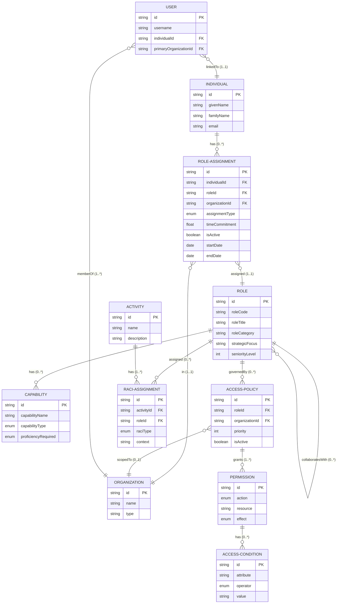

---

## Ontology Architecture Overview

### High-Level Component Architecture

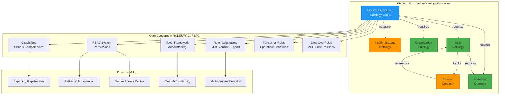

---

## Integration Architecture

### How ROLES/RACI/RBAC Connects to Other Ontologies

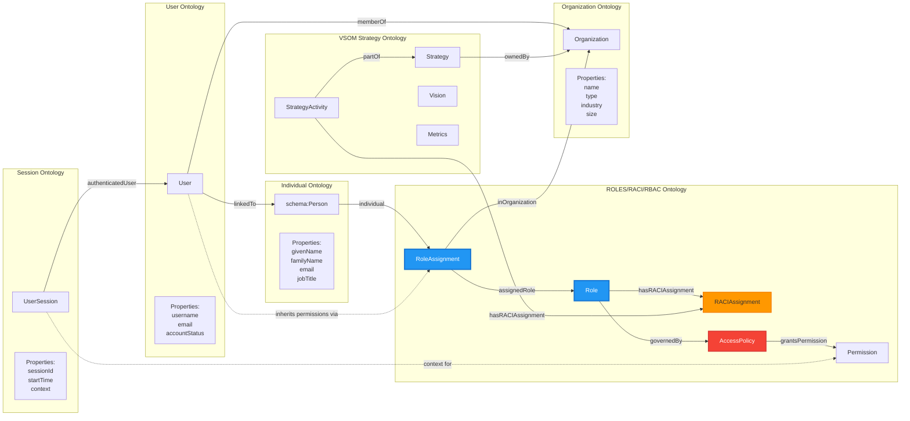

---

## Multi-Venture Role Assignment Flow

### How Individuals Hold Multiple Roles Across Organizations

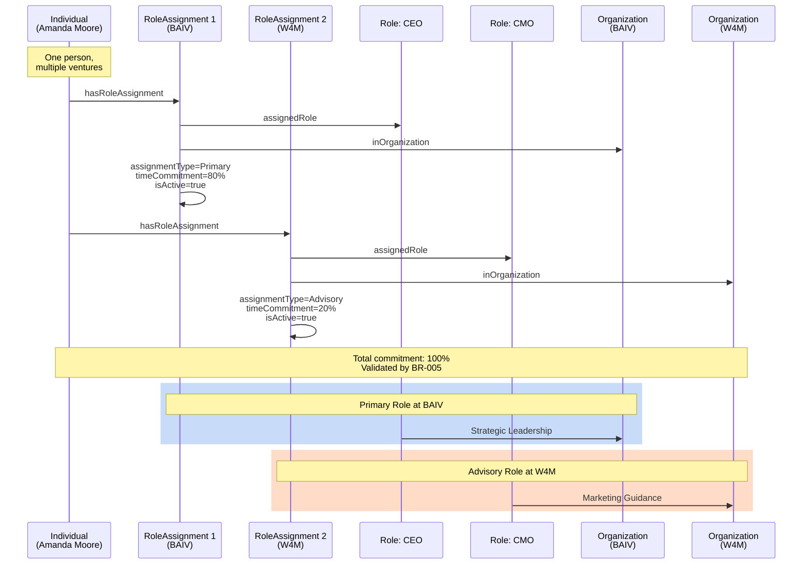

---

## RACI Accountability Chain

### From Strategy to Execution via RACI

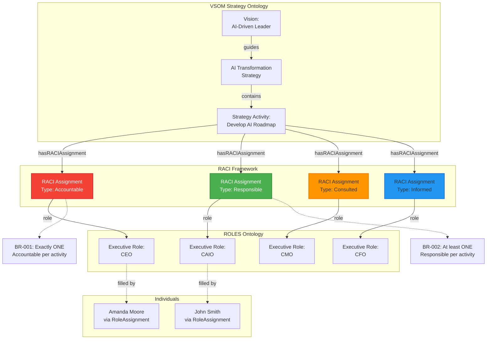

---

## RBAC Permission Resolution Flow

### How Users Get Permissions Through Roles

```mermaid
flowchart TD
    START([User Action Request:<br/>Approve $15K Budget]) --> USER
    
    USER[User:<br/>amanda.moore@baiv.io]
    
    USER --> LINK{Linked to<br/>Individual?}
    LINK -->|Yes| IND[Individual:<br/>Amanda Moore]
    LINK -->|No| DENY1[❌ DENY:<br/>No linked individual]
    
    IND --> RA_CHECK{Active Role<br/>Assignments?}
    RA_CHECK -->|Yes| RA[RoleAssignments in BAIV:<br/>CEO (Primary, Active)]
    RA_CHECK -->|No| DENY2[❌ DENY:<br/>No active roles]
    
    RA --> ROLE[Role: CEO]
    
    ROLE --> POLICY_CHECK{Access<br/>Policies?}
    POLICY_CHECK -->|Yes| POLICIES[AccessPolicies:<br/>CEO-Full-Access<br/>priority=100]
    POLICY_CHECK -->|No| DENY3[❌ DENY:<br/>No policies]
    
    POLICIES --> PERM_CHECK{Matching<br/>Permissions?}
    PERM_CHECK -->|Yes| PERMS[Permission:<br/>action=Approve<br/>resource=Budget<br/>effect=Allow]
    PERM_CHECK -->|No| DENY4[❌ DENY:<br/>No matching permission]
    
    PERMS --> COND_CHECK{Has<br/>Conditions?}
    COND_CHECK -->|Yes| EVAL_COND{Conditions<br/>Met?}
    COND_CHECK -->|No| ALLOW
    
    EVAL_COND -->|Yes| ALLOW[✅ ALLOW]
    EVAL_COND -->|No| DENY5[❌ DENY:<br/>Conditions failed]
    
    ALLOW --> END([Action Permitted])
    
    DENY1 --> END2([Action Denied])
    DENY2 --> END2
    DENY3 --> END2
    DENY4 --> END2
    DENY5 --> END2
    
    style START fill:#2196F3,stroke:#1976D2,stroke-width:2px,color:#fff
    style ALLOW fill:#4CAF50,stroke:#388E3C,stroke-width:3px,color:#fff
    style DENY1 fill:#F44336,stroke:#D32F2F,stroke-width:2px,color:#fff
    style DENY2 fill:#F44336,stroke:#D32F2F,stroke-width:2px,color:#fff
    style DENY3 fill:#F44336,stroke:#D32F2F,stroke-width:2px,color:#fff
    style DENY4 fill:#F44336,stroke:#D32F2F,stroke-width:2px,color:#fff
    style DENY5 fill:#F44336,stroke:#D32F2F,stroke-width:2px,color:#fff
    style END fill:#4CAF50,stroke:#388E3C,stroke-width:2px,color:#fff
    style END2 fill:#F44336,stroke:#D32F2F,stroke-width:2px,color:#fff
```

---

## Cross-Ontology Dependencies

### Dependency Graph and Integration Points

```mermaid
graph TD
    subgraph "Required Dependencies (MUST EXIST)"
        IND_ONT[Individual Ontology<br/>pf:ontology:individual-v1]
        USER_ONT[User Ontology<br/>pf:ontology:user-v1]
        ORG_ONT[Organization Ontology<br/>pf:ontology:organization-v1]
    end
    
    subgraph "ROLES/RACI/RBAC Ontology v3.0.0"
        ROLES_ONT[Core Ontology]
        
        RA_ENT[RoleAssignment Entity]
        ROLE_ENT[Role Entity]
        RACI_ENT[RACIAssignment Entity]
        POLICY_ENT[AccessPolicy Entity]
        
        ROLES_ONT --> RA_ENT
        ROLES_ONT --> ROLE_ENT
        ROLES_ONT --> RACI_ENT
        ROLES_ONT --> POLICY_ENT
    end
    
    subgraph "Supporting Dependencies (OPTIONAL)"
        VSOM_ONT[VSOM Strategy Ontology<br/>pf:ontology:vsom-strategy-v1]
        SESSION_ONT[Session Ontology<br/>pf:ontology:session-v1]
        PROC_ONT[Business Process Ontology<br/>pf:ontology:process-v1]
    end
    
    IND_ONT -->|schema:Person<br/>fills roles| RA_ENT
    USER_ONT -->|User accounts<br/>linked to Person| RA_ENT
    ORG_ONT -->|Organization<br/>context| RA_ENT
    ORG_ONT -->|Organization<br/>owns roles| ROLE_ENT
    
    VSOM_ONT -.->|Strategy activities<br/>have RACI| RACI_ENT
    SESSION_ONT -.->|Session context<br/>for permissions| POLICY_ENT
    PROC_ONT -.->|Process steps<br/>have RACI| RACI_ENT
    
    IND_ONT -.->|Provides| P1[Properties:<br/>name, email,<br/>jobTitle]
    USER_ONT -.->|Provides| P2[Properties:<br/>username,<br/>accountStatus]
    ORG_ONT -.->|Provides| P3[Properties:<br/>name, type,<br/>industry]
    
    INT1[Integration Point 1:<br/>RoleAssignment.individual<br/>references Person]
    INT2[Integration Point 2:<br/>User inherits permissions<br/>via Person→RoleAssignment]
    INT3[Integration Point 3:<br/>RoleAssignment.organization<br/>references Organization]
    INT4[Integration Point 4:<br/>RACI.activity references<br/>Strategy/Process activities]
    
    RA_ENT -.-> INT1
    RA_ENT -.-> INT2
    RA_ENT -.-> INT3
    RACI_ENT -.-> INT4
    
    style ROLES_ONT fill:#2196F3,stroke:#1976D2,stroke-width:4px,color:#fff
    style IND_ONT fill:#4CAF50,stroke:#388E3C,stroke-width:2px,color:#fff
    style USER_ONT fill:#4CAF50,stroke:#388E3C,stroke-width:2px,color:#fff
    style ORG_ONT fill:#4CAF50,stroke:#388E3C,stroke-width:2px,color:#fff
    style VSOM_ONT fill:#FF9800,stroke:#F57C00,stroke-width:2px
    style SESSION_ONT fill:#FF9800,stroke:#F57C00,stroke-width:2px
    style PROC_ONT fill:#FF9800,stroke:#F57C00,stroke-width:2px
```

---

## Authorization Decision Flow

### Complete Permission Resolution with Conflict Resolution

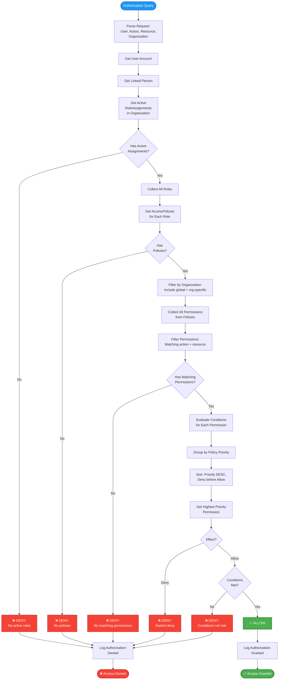

---

## Organizational Hierarchy Visualization

### Example Organization Chart with Matrix Relationships

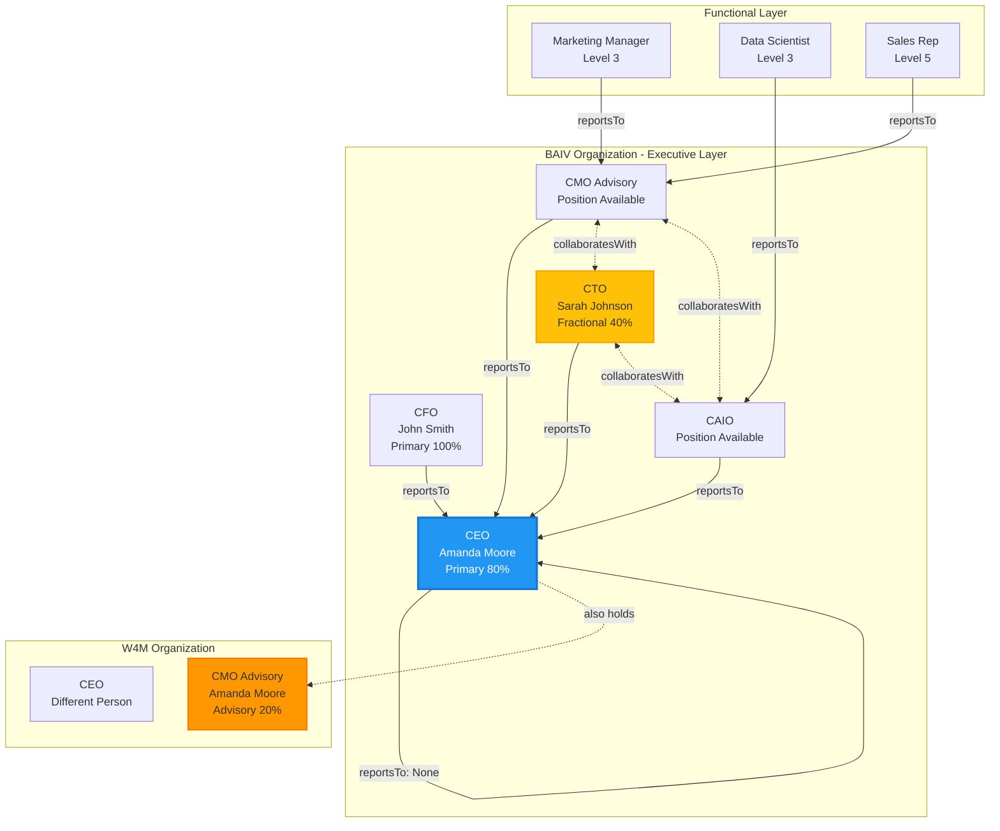

---

## Data Flow Diagrams

### Complete Data Flow from Individual to Permission

```mermaid
flowchart LR
    subgraph "Identity Layer"
        P[Person:<br/>Amanda Moore]
        U[User:<br/>amanda.moore@baiv.io]
    end
    
    subgraph "Assignment Layer"
        RA1[RoleAssignment 1:<br/>CEO at BAIV<br/>Primary, 80%]
        RA2[RoleAssignment 2:<br/>CMO at W4M<br/>Advisory, 20%]
    end
    
    subgraph "Role Layer"
        R1[Role: CEO<br/>seniorityLevel=1]
        R2[Role: CMO<br/>seniorityLevel=1]
    end
    
    subgraph "Context Layer"
        O1[Organization:<br/>BAIV]
        O2[Organization:<br/>W4M]
    end
    
    subgraph "Policy Layer"
        POL1[AccessPolicy:<br/>CEO-Full-Access<br/>priority=100]
        POL2[AccessPolicy:<br/>CMO-Limited-Access<br/>priority=50]
    end
    
    subgraph "Permission Layer"
        PERM1[Permission:<br/>Approve Budget<br/>Unlimited]
        PERM2[Permission:<br/>Read Strategy]
        PERM3[Permission:<br/>Approve Budget<br/>< $10K]
    end
    
    subgraph "RACI Layer"
        RACI1[RACI:<br/>Accountable for<br/>AI Strategy]
        RACI2[RACI:<br/>Consulted for<br/>Marketing Strategy]
    end
    
    P -->|linkedTo| U
    P -->|hasRoleAssignment| RA1
    P -->|hasRoleAssignment| RA2
    
    RA1 -->|assignedRole| R1
    RA1 -->|inOrganization| O1
    RA2 -->|assignedRole| R2
    RA2 -->|inOrganization| O2
    
    R1 -->|governedBy| POL1
    R2 -->|governedBy| POL2
    
    POL1 -->|grantsPermission| PERM1
    POL1 -->|grantsPermission| PERM2
    POL2 -->|grantsPermission| PERM2
    POL2 -->|grantsPermission| PERM3
    
    R1 -->|hasRACIAssignment| RACI1
    R2 -->|hasRACIAssignment| RACI2
    
    style P fill:#4CAF50,stroke:#388E3C,stroke-width:2px,color:#fff
    style U fill:#4CAF50,stroke:#388E3C,stroke-width:2px,color:#fff
    style RA1 fill:#2196F3,stroke:#1976D2,stroke-width:2px,color:#fff
    style RA2 fill:#2196F3,stroke:#1976D2,stroke-width:2px,color:#fff
    style PERM1 fill:#F44336,stroke:#D32F2F,stroke-width:2px,color:#fff
```

---

## Integration Patterns

### Pattern 1: User Session to Permission Check

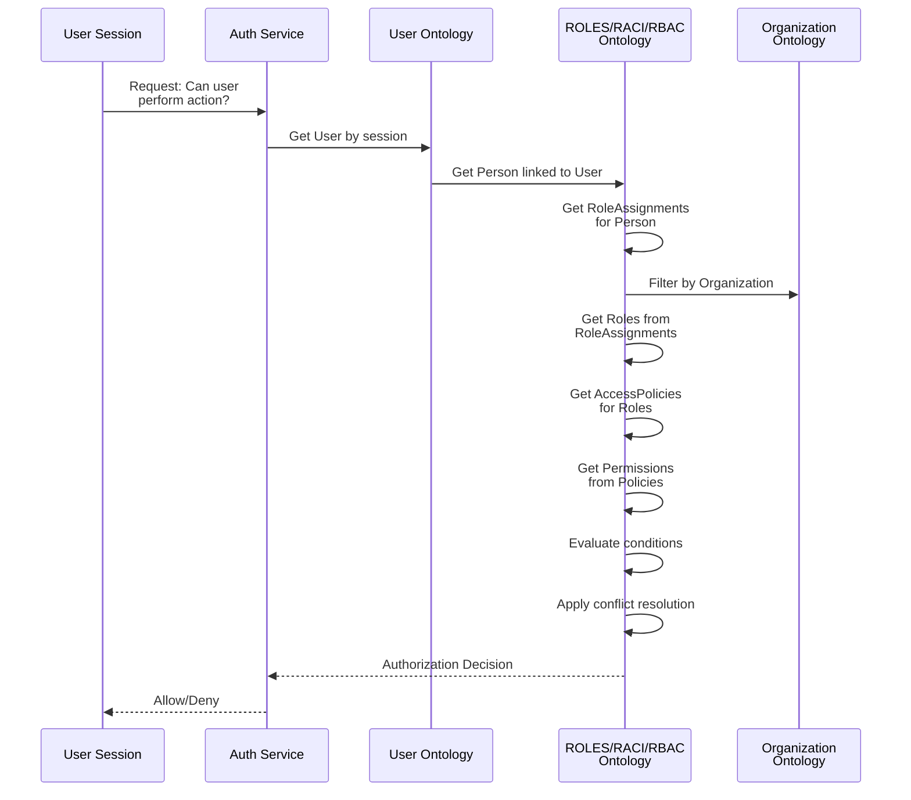

### Pattern 2: RACI Query to Individual Resolution

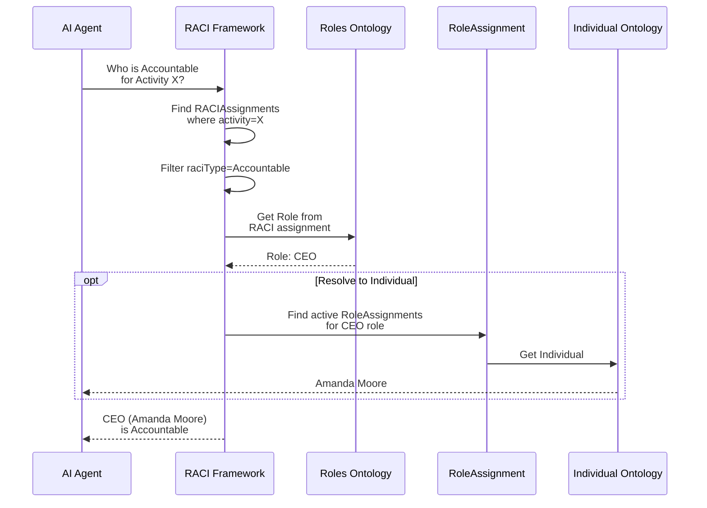

---

## Version History & Evolution

### Ontology Versioning from v1.0 to v3.0.0

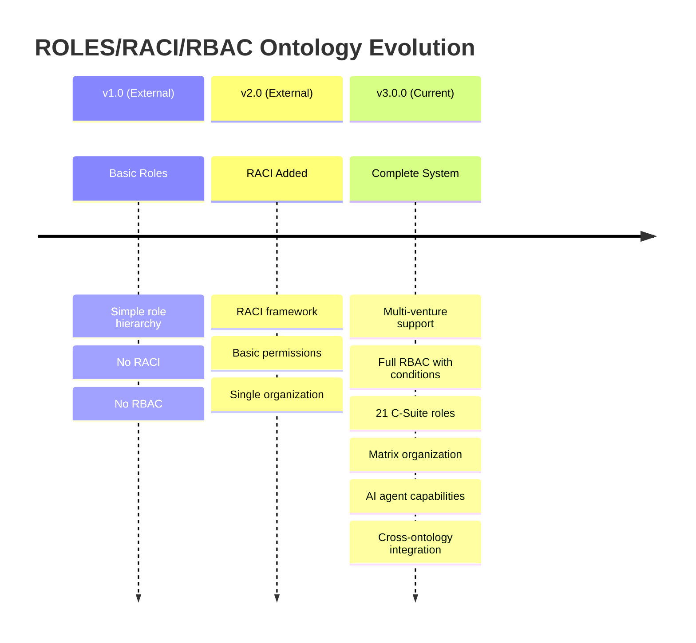

---

## Summary

This visual documentation provides comprehensive diagrams for understanding:

1. **Entity relationships** - Complete ERD
2. **Architecture** - Component and integration views
3. **Multi-venture patterns** - How individuals span organizations
4. **RACI accountability** - From strategy to roles
5. **RBAC authorization** - Permission resolution flow
6. **Dependencies** - Integration with other ontologies
7. **Decision flows** - Authorization logic
8. **Organizational structures** - Hierarchy and matrix
9. **Data flows** - Complete permission inheritance
10. **Integration patterns** - Common usage scenarios

All diagrams use Mermaid syntax and can be:
- Rendered in Markdown viewers
- Embedded in documentation
- Used in presentations
- Updated as the ontology evolves

---

**Version:** 3.0.0  
**Last Updated:** 2025-10-11  
**Maintained By:** Platform Foundation Team
