# PF-Core: VE Agent SDK Scope v1.0.0

## Claude Agent SDK Approach to Value Engineering

*Platform Foundation Core | Agentic Architecture Specification*

---

| | |
|---------------------|-------|
| **Document ID** | PF-Core_VE_AgentSDK_Scope_v1.0.0 |
| **Document Type** | SCOPE (Architecture Scope Definition) |
| **Version** | 1.0.0 |
| **Date** | December 2025 |
| **Author** | Platform Architecture Team |
| **Platform** | PF-Core Value Engineering Module |
| **Scope Coverage** | Value Engineering, GTM, PMF |
| **BAIV Enhancement** | AI Visibility Domain Specialization |

---

## Table of Contents

1. [Executive Summary](#1-executive-summary)
2. [Value Engineering Domain Overview](#2-value-engineering-domain-overview)
3. [Claude Agent SDK Architecture](#3-claude-agent-sdk-architecture)
4. [OAA Integration Framework](#4-oaa-integration-framework)
5. [Value Proposition Agent Cluster](#5-value-proposition-agent-cluster)
6. [GTM Module Scope](#6-gtm-module-scope)
7. [PMF Module Scope](#7-pmf-module-scope)
8. [Cross-Module Ontology Relationships](#8-cross-module-ontology-relationships)
9. [BAIV PF-Instance Enhancement](#9-baiv-pf-instance-enhancement)
10. [Implementation Roadmap](#10-implementation-roadmap)

---

## 1. Executive Summary

This document defines the Claude Agent SDK approach to implementing Value Engineering within Platform Foundation Core (PF-Core). The architecture leverages ontology-centric design through the Ontology Architect Agent (OAA) framework, connecting Value Proposition, Go-to-Market (GTM), and Product-Market Fit (PMF) modules into a cohesive value cascade.

### Strategic Objectives

1. **Ontology-First Design**: All agents consume and produce schema.org-grounded JSON-LD
2. **OAA Registry Integration**: Centralized ontology governance via OAA Registry v3.0
3. **Claude Agent SDK Native**: Pure Claude API implementation (migrating from n8n dependency)
4. **Value Cascade Traceability**: Complete traceability from VSOM → Value Prop → GTM → PMF
5. **BAIV Domain Enhancement**: AI Visibility specialization for marketing-focused deployments

### Scope Boundaries

```
┌─────────────────────────────────────────────────────────────────────────┐
│                    PF-CORE VALUE ENGINEERING SCOPE                      │
├─────────────────────────────────────────────────────────────────────────┤
│  IN SCOPE                           │  OUT OF SCOPE (This Phase)       │
│  ─────────────────────────────────  │  ──────────────────────────────  │
│  • Value Proposition Module         │  • Full P1-P16 Agent Migration   │
│  • GTM Strategy Module              │  • n8n Workflow Replacement      │
│  • PMF Validation Module            │  • External API Integrations     │
│  • OAA Registry Integration         │  • WordPress Plugin Development  │
│  • BAIV AI Visibility Enhancement   │  • Multi-tenant SaaS Features    │
│  • Core Agent Definitions           │  • Billing/Payment Systems       │
└─────────────────────────────────────────────────────────────────────────┘
```

---

## 2. Value Engineering Domain Overview

### High-Level Entity Graph

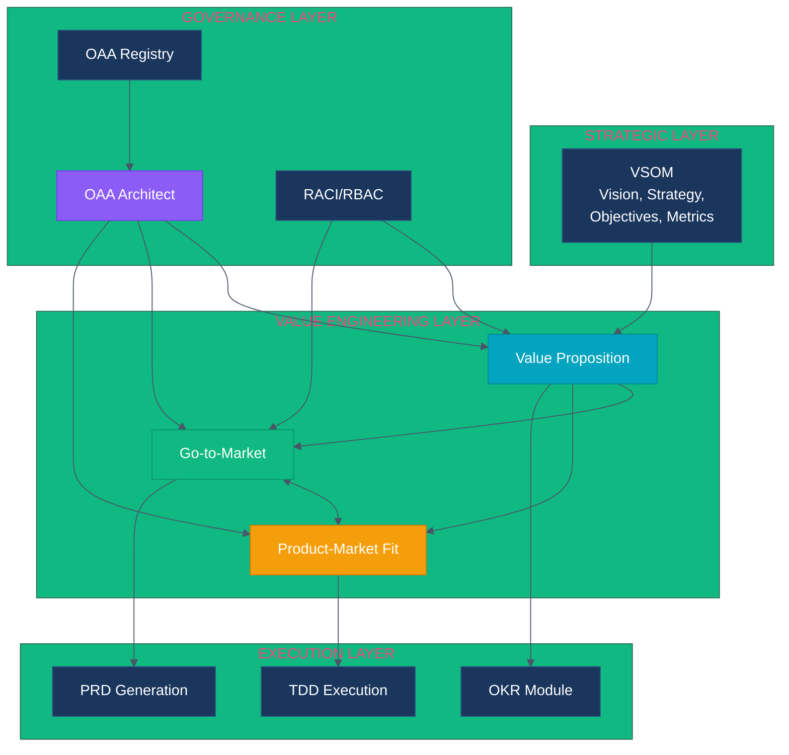

### Domain Entity Summary

| Domain | Core Entities | Ontology Status | Agent Count |
|--------|--------------|-----------------|-------------|
| **VSOM** | Vision, Strategy, Objective, Metric | v1.0.0 Production | 2 |
| **Value Proposition** | ValueProp, CustomerSegment, Problem, Hypothesis | v1.0.0 Production | 5 |
| **GTM** | Campaign, Channel, Messaging, Launch | v0.1.0 Draft | 4 |
| **PMF** | PMFState, Validation, Survey, Indicator | v2.0.0 Production | 3 |
| **OKR** | Objective, KeyResult, Initiative, Metric | v1.0.0 Production | 2 |

---

## 3. Claude Agent SDK Architecture

### Agent SDK Design Principles

The Claude Agent SDK approach replaces n8n workflow orchestration with native Claude API implementation, enabling:

1. **Pure API Architecture**: Direct Claude API calls without middleware
2. **Context Engineering**: Optimized context window management per agent
3. **Tool Use Integration**: Native Claude tool use for structured operations
4. **Streaming Responses**: Real-time output for interactive agents
5. **Memory Management**: Session and persistent memory via Supabase

### Agent Execution Model

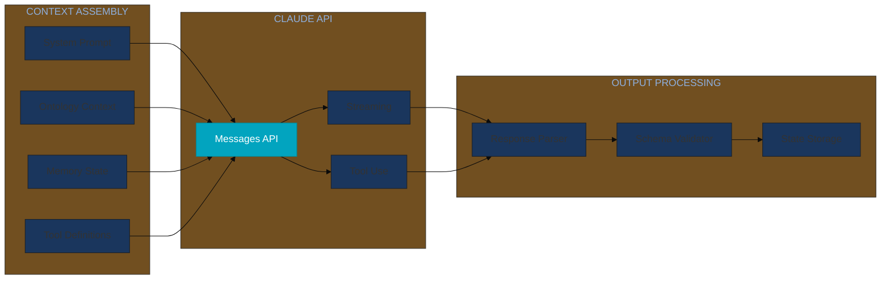

### Agent Classification

Agents are classified into three operational clusters aligned with the Value Engineering cascade:

| Cluster | Mode | Agents | Primary Function |
|---------|------|--------|------------------|
| **Strategic** | REASON | VSOM Architect, Strategy Validator | Strategic alignment and validation |
| **Generation** | OPERATE | VP Wizard, GTM Strategist, PMF Validator | Content and artifact creation |
| **Intelligence** | ANALYZE | Gap Analyst, Hypothesis Validator, Trend Forecaster | Analysis and recommendation |

---

## 4. OAA Integration Framework

### OAA Registry v3.0 Architecture

The Ontology Architect Agent (OAA) serves as the central governance layer for all Value Engineering ontologies.

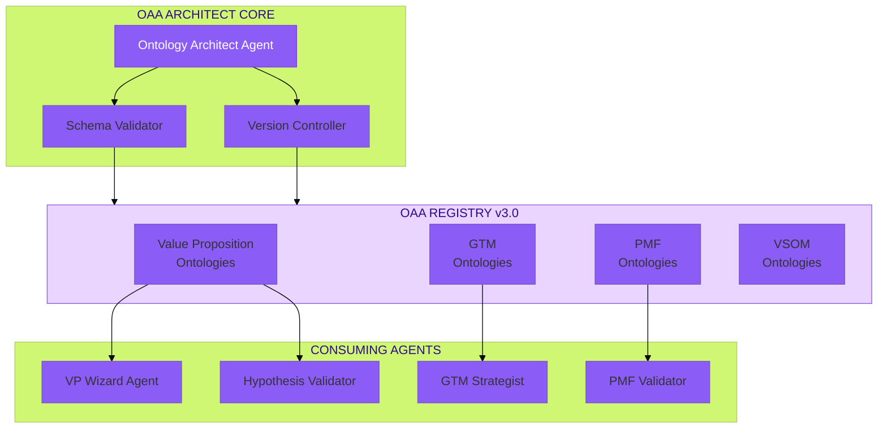

### Ontology Consumption Pattern

All agents follow a standardized ontology consumption pattern:

```json
{
  "agentId": "pf-core:agent:value-proposition-wizard",
  "ontologyDependencies": [
    {
      "ontologyId": "PF-Core_VE_ValueProposition_Ontology_v1.0.0",
      "accessMode": "READ_WRITE",
      "entities": ["ValueProposition", "CustomerSegment", "Hypothesis"]
    },
    {
      "ontologyId": "PF-Core_VE_VSOM_Ontology_v1.0.0",
      "accessMode": "READ",
      "entities": ["StrategicObjective", "Metric"]
    }
  ],
  "contextInjection": {
    "includeGlossary": true,
    "includeBusinessRules": true,
    "includeRelationships": true
  }
}
```

---

## 5. Value Proposition Agent Cluster

### VP Module Agent Definitions

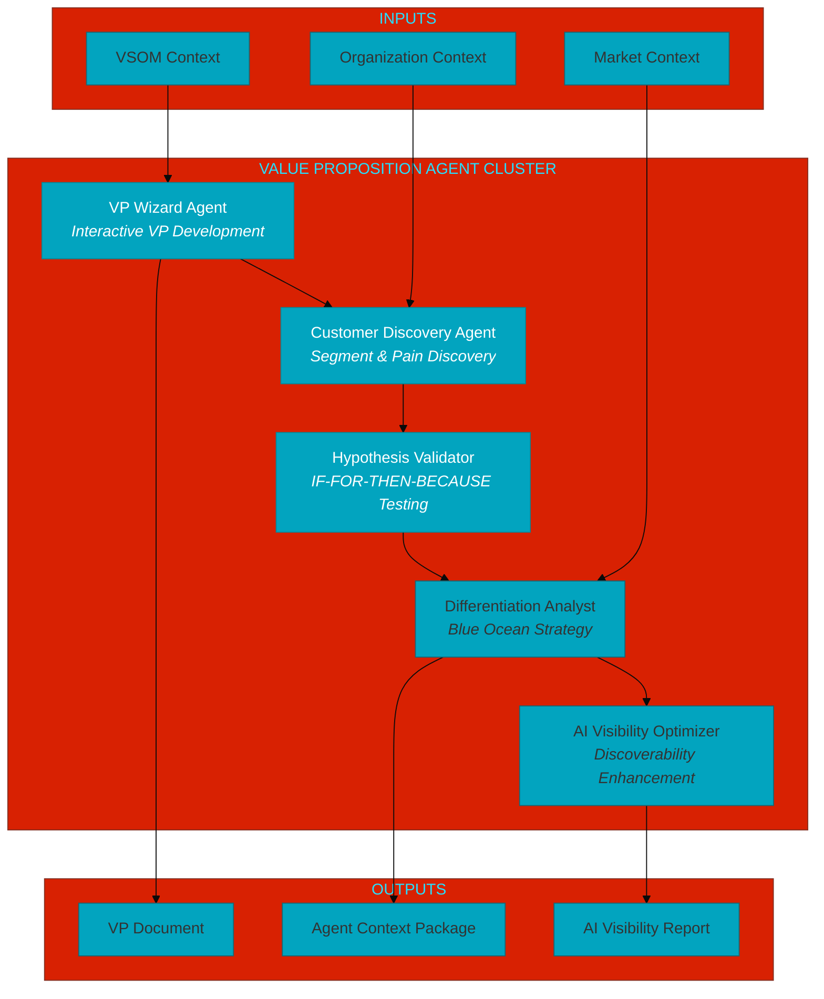

### Agent Specifications Summary

| Agent | Mode | Tools | Primary Ontologies |
|-------|------|-------|-------------------|
| **VP Wizard** | OPERATE | segment_manager, problem_definer, hypothesis_generator | ValueProposition, CustomerSegment |
| **Customer Discovery** | ANALYZE | pain_extractor, segment_profiler, icp_generator | CustomerSegment, Organization |
| **Hypothesis Validator** | REASON | experiment_designer, confidence_scorer, evidence_linker | Hypothesis, PMFState |
| **Differentiation Analyst** | ANALYZE | blue_ocean_mapper, gap_identifier, moat_evaluator | Differentiator, GapAnalysis |
| **AI Visibility Optimizer** | OPERATE | semantic_analyzer, entity_mapper, citation_scorer | AIVisibility, ValueProposition |

---

## 6. GTM Module Scope

### Go-to-Market Module Definition

The GTM module translates validated Value Propositions into executable market launch strategies.

### GTM Entity Relationship Diagram

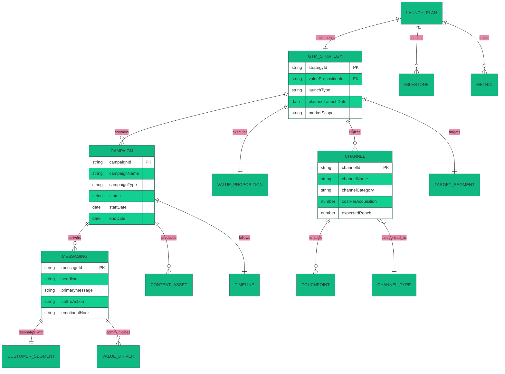

### GTM Ontology Scope (v0.1.0 Draft)

| Entity | Description | Key Properties |
|--------|-------------|----------------|
| **GTMStrategy** | Overall go-to-market approach | strategyId, valuePropositionId, launchType, marketScope |
| **Campaign** | Marketing campaign definition | campaignId, type, status, budget, timeline |
| **Channel** | Distribution/communication channel | channelId, category, reach, CPA, conversionRate |
| **Messaging** | Customer-facing communication | headline, valueStatement, CTA, emotionalHook |
| **LaunchPlan** | Execution timeline and milestones | planId, milestones, dependencies, metrics |
| **Touchpoint** | Customer interaction point | touchpointId, channel, stage, intent |

### GTM Agent Cluster

| Agent | Function | Consumes | Produces |
|-------|----------|----------|----------|
| **GTM Strategist** | Designs overall GTM approach | ValueProposition, CustomerSegment | GTMStrategy, ChannelMix |
| **Campaign Architect** | Structures marketing campaigns | GTMStrategy, Messaging | Campaign, Timeline |
| **Message Crafter** | Creates customer messaging | ValueProposition, PainPoints | Messaging, CTAs |
| **Launch Coordinator** | Manages launch execution | LaunchPlan, Resources | Milestones, StatusReports |

---

## 7. PMF Module Scope

### Product-Market Fit Module Definition

The PMF module provides continuous validation of value propositions against actual market response.

### PMF Validation Lifecycle

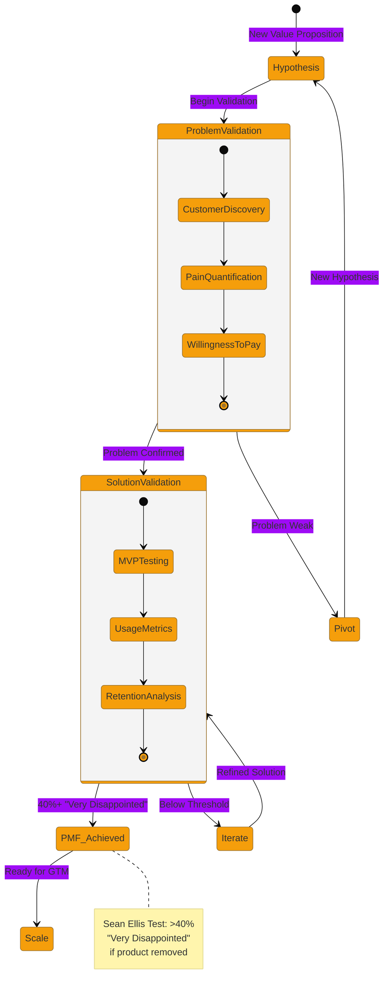

### PMF Ontology Entities (v2.0.0)

| Entity | Description | Key Properties |
|--------|-------------|----------------|
| **PMFState** | Current product-market fit status | stateId, validationLevel, confidenceScore, hypothesisId |
| **ValidationExperiment** | Test design and execution | experimentId, method, hypothesis, successCriteria |
| **SurveyResponse** | Customer feedback data | responseId, segment, seanEllisScore, verbatimFeedback |
| **PMFIndicator** | Quantitative PMF signal | indicatorId, type, value, trend, benchmark |
| **RetentionCohort** | Customer retention tracking | cohortId, period, retentionRate, churnReasons |
| **PivotDecision** | Strategic direction change | decisionId, trigger, fromHypothesis, toHypothesis |

### PMF Agent Cluster

| Agent | Function | Mode | Key Tools |
|-------|----------|------|-----------|
| **PMF Assessor** | Evaluates current PMF state | ANALYZE | survey_analyzer, retention_calculator, engagement_scorer |
| **Experiment Designer** | Creates validation experiments | OPERATE | ab_test_designer, survey_generator, interview_planner |
| **Pivot Advisor** | Recommends strategic pivots | REASON | hypothesis_comparator, market_signal_analyzer, risk_assessor |

### PMF ↔ Value Proposition Integration

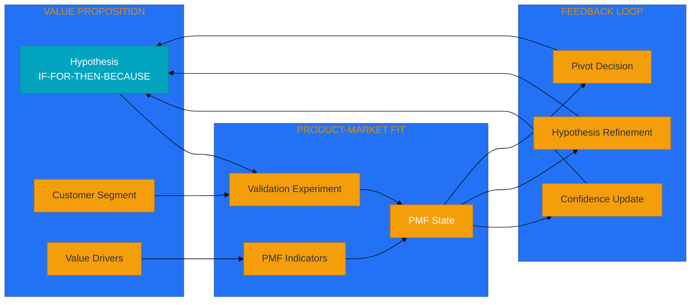

---

## 8. Cross-Module Ontology Relationships

### Unified Value Engineering Graph

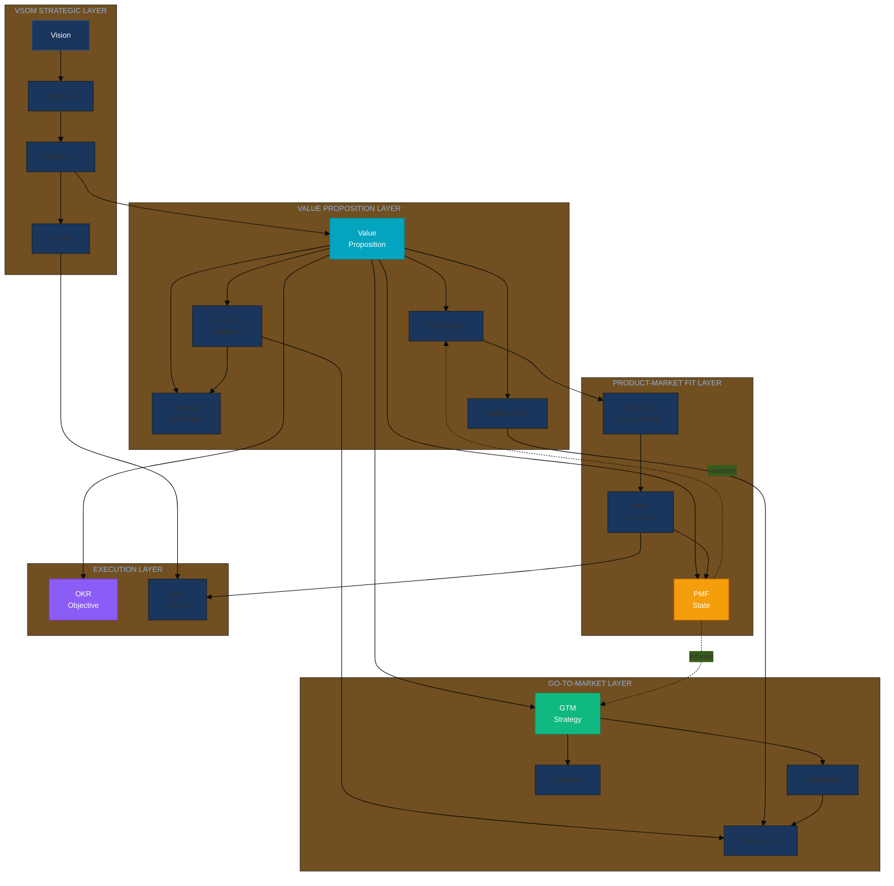

### Cross-Module Relationship Matrix

| From Entity | To Entity | Relationship | Cardinality | Purpose |
|-------------|-----------|--------------|-------------|---------|
| VSOM.Objective | VP.ValueProposition | strategiclyAligns | 1:N | VP traces to strategic objectives |
| VP.ValueProposition | GTM.Strategy | executes | 1:1 | GTM implements the VP |
| VP.CustomerSegment | GTM.Messaging | resonatesWith | 1:N | Messaging targets segments |
| VP.Hypothesis | PMF.Experiment | validates | 1:N | Experiments test hypotheses |
| PMF.State | VP.Hypothesis | informs | 1:1 | PMF updates hypothesis confidence |
| GTM.Campaign | PMF.Indicator | generates | 1:N | Campaigns produce PMF signals |
| VP.ValueDriver | OKR.KeyResult | measuredBy | N:M | Value drivers become KR targets |

---

## 9. BAIV PF-Instance Enhancement

### AI Visibility Domain Specialization

The BAIV platform instance extends the core PF-Core Value Engineering with AI Visibility-specific enhancements.

### BAIV Enhancement Architecture

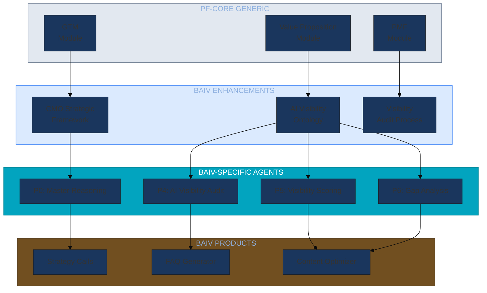

### BAIV-Specific Ontology Extensions

| Base Ontology | BAIV Extension | Additional Entities |
|---------------|----------------|---------------------|
| ValueProposition | AI Visibility VP | VisibilityScore, AIRecommendation, CitationPotential |
| CustomerSegment | CMO Profile | CMOContext, MarketingBudget, AIAdoptionStage |
| GTM.Channel | AI Discovery Channel | AIAssistant, SearchEngine, VoiceAssistant |
| PMF.Indicator | Visibility Indicator | BrandMention, TopicAuthority, EntityRecognition |

### BAIV Agent Process Flow (P0-P16 Integration)

```mermaid
%%{init: {'theme': 'base', 'themeVariables': {'primaryColor': '#1A365D'}}}%%
flowchart LR
    subgraph DISCOVERY["DISCOVERY PHASE"]
        P1["P1: Config"]
        P2["P2: Discovery"]
        P3["P3: Capture"]
    end
    
    subgraph ANALYSIS["ANALYSIS PHASE"]
        P4["P4: Audit"]
        P5["P5: Analytics"]
        P6["P6: Gap Analysis"]
    end
    
    subgraph STRATEGY["STRATEGY PHASE"]
        P7["P7: Ideation"]
        P8["P8: Selection"]
    end
    
    subgraph EXECUTION["EXECUTION PHASE"]
        P9["P9: Content"]
        P10["P10: Optimize"]
        P11["P11: Schedule"]
        P12["P12: Publish"]
    end
    
    subgraph LEARNING["LEARNING PHASE"]
        P13["P13: Re-audit"]
        P14["P14: Predictive"]
        P15["P15: Reasoning"]
        P16["P16: CX Optimize"]
    end
    
    subgraph ORCHESTRATION["ORCHESTRATION"]
        P0["P0: Master<br/>Reasoning Agent"]
    end
    
    P0 --> DISCOVERY
    P0 --> ANALYSIS
    P0 --> STRATEGY
    P0 --> EXECUTION
    P0 --> LEARNING
    
    P1 --> P2 --> P3
    P3 --> P4 --> P5 --> P6
    P6 --> P7 --> P8
    P8 --> P9 --> P10 --> P11 --> P12
    P12 --> P13 --> P14 --> P15 --> P16
    
    P16 -.->|feedback| P0
    
    style P0 fill:#8B5CF6,stroke:#7C3AED,color:#fff
```

### BAIV PMF Checklist Integration

Based on the BAIV PMF Primer, the PMF module implements:

1. **Problem Validation Phase**
   - Customer discovery interviews (10-15+)
   - "5 Whys" root cause analysis
   - Problem statement formulation
   - Workaround/competitor identification

2. **Solution Validation Phase**
   - Sean Ellis Test (40% threshold)
   - Retention curve analysis
   - Engagement metrics (DAU, time-on-task)
   - Qualitative power user interviews

3. **Monetization Validation**
   - Willingness-to-pay assessment
   - A/B pricing tests
   - Value-price alignment scoring

---

## 10. Implementation Roadmap

### Phase Overview

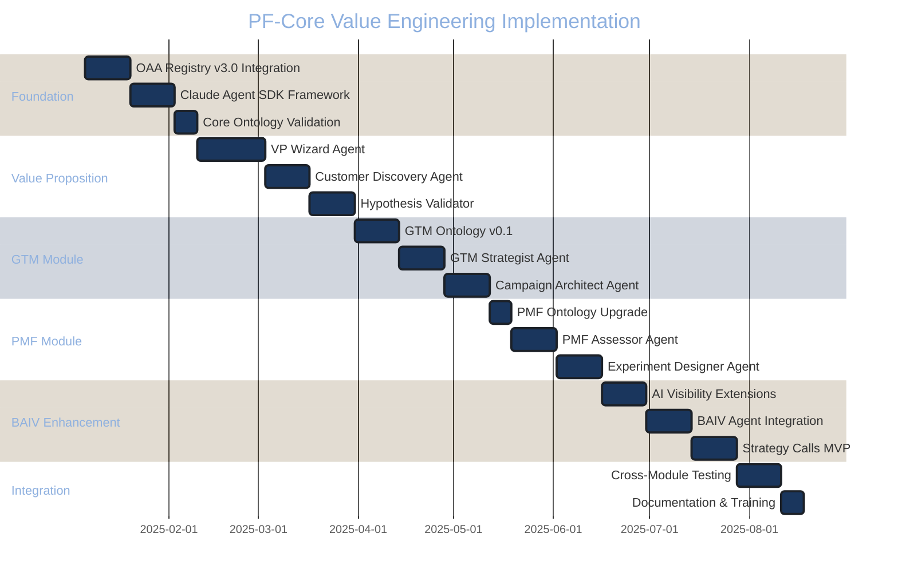

### Deliverables Summary

| Phase | Duration | Key Deliverables |
|-------|----------|------------------|
| **Foundation** | 5 weeks | OAA Registry integration, Claude SDK framework, ontology validation |
| **Value Proposition** | 7 weeks | VP Wizard, Customer Discovery, Hypothesis Validator agents |
| **GTM Module** | 6 weeks | GTM ontology v0.1, Strategist agent, Campaign Architect |
| **PMF Module** | 5 weeks | PMF ontology upgrade, Assessor agent, Experiment Designer |
| **BAIV Enhancement** | 6 weeks | AI Visibility extensions, BAIV agents, Strategy Calls MVP |
| **Integration** | 3 weeks | Cross-module testing, documentation, training |
| **TOTAL** | ~32 weeks | Complete Value Engineering suite with BAIV enhancement |

### Success Metrics

| Metric | Target | Measurement |
|--------|--------|-------------|
| Agent Response Quality | >90% accuracy | Ontology validation scores |
| Value Proposition Completion | 80% within 14 days | Wizard stage progression |
| PMF Validation Cycle | <4 weeks | Time from hypothesis to validated |
| GTM Campaign Generation | 3 campaigns per VP | Agent output count |
| BAIV Strategy Call Efficiency | 50% time reduction | Call duration analytics |

---

## Appendix A: Ontology Registry Entries

### Value Engineering Module Ontologies

| Ontology ID | Version | Status | Domain |
|-------------|---------|--------|--------|
| PF-Core_VE_ValueProposition_Ontology | v1.0.0 | Production | Value Proposition |
| PF-Core_VE_VSOM_Ontology | v1.0.0 | Production | Strategic Planning |
| PF-Core_VE_OKR_Ontology | v1.0.0 | Production | Execution Management |
| PF-Core_VE_GTM_Ontology | v0.1.0 | Draft | Go-to-Market |
| PF-Core_VE_PMF_Ontology | v2.0.0 | Production | Market Validation |
| BAIV_AIVisibility_Ontology | v2.0.0 | Production | AI Visibility |

---

## Appendix B: Agent Tool Definitions

### Value Proposition Agent Tools

```json
{
  "tools": [
    {
      "name": "segment_manager",
      "description": "Creates and manages customer segment definitions",
      "input_schema": {
        "type": "object",
        "properties": {
          "action": {"type": "string", "enum": ["create", "update", "validate"]},
          "segment_data": {"$ref": "#/definitions/CustomerSegment"}
        }
      }
    },
    {
      "name": "hypothesis_generator",
      "description": "Generates IF-FOR-THEN-BECAUSE formatted hypotheses",
      "input_schema": {
        "type": "object",
        "properties": {
          "customer_segment": {"type": "string"},
          "problem_statement": {"type": "string"},
          "proposed_solution": {"type": "string"}
        }
      }
    },
    {
      "name": "ai_visibility_scorer",
      "description": "Calculates AI discoverability score for content",
      "input_schema": {
        "type": "object",
        "properties": {
          "content": {"type": "string"},
          "target_entities": {"type": "array", "items": {"type": "string"}},
          "ai_platforms": {"type": "array", "items": {"type": "string"}}
        }
      }
    }
  ]
}
```

---

*Document Version: 1.0.0 | Last Updated: December 2025 | Author: Platform Architecture Team*
