# PF-Core Configurable BSC Framework
## Visual Architecture Guide

**Document Version:** 1.0  
**Module:** PF-CORE-BSC-VISUAL-GUIDE  
**Purpose:** Executive & Technical Visual Reference  
**Date:** December 2025  

---

## 1. Vision, Purpose & Scope

### 1.1 Vision Statement

> **"Every person in the organization, from CEO to floor operative, has instant mobile access to the metrics that matter most to their role—powered by real-time operational data and aligned to strategic objectives."**

### 1.2 Purpose


### 1.3 Scope Definition

```mermaid
block-beta
    columns 3
    
    block:included:3
        A["✅ IN SCOPE"]
    end
    
    B["Sector-Configurable Templates"]
    C["Role-Based Scorecards"]
    D["Mobile-First UI"]
    
    E["Real-Time SOP Integration"]
    F["BSC 5-Perspective Model"]
    G["OKR Cascade Tracking"]
    
    H["Offline Capability"]
    I["Push Notifications"]
    J["Agent Orchestration"]
    
    block:excluded:3
        K["❌ OUT OF SCOPE"]
    end
    
    L["ERP Replacement"]
    M["Full BI Platform"]
    N["Transactional Processing"]
```

---

## 2. High-Level Architecture

### 2.1 System Architecture Overview

```mermaid
flowchart TB
    subgraph Users["👥 USERS (Mobile-First)"]
        CEO["📱 CEO"]
        GM["📱 Site GM"]
        MGR["📱 Managers"]
        SUP["📱 Supervisors"]
        OPS["📱 Operatives"]
    end
    
    subgraph Mobile["📱 MOBILE LAYER"]
        APP["React Native / Flutter App"]
        OFFLINE["Offline Storage"]
        PUSH["Push Notifications"]
    end
    
    subgraph API["🔌 API LAYER"]
        REST["RESTful APIs"]
        RT["Real-Time Subscriptions"]
        AUTH["Authentication & RLS"]
    end
    
    subgraph Core["⚙️ CORE PLATFORM (Supabase)"]
        DB[(PostgreSQL Database)]
        REALTIME["Supabase Realtime"]
        EDGE["Edge Functions"]
        STORAGE["File Storage"]
    end
    
    subgraph Agent["🤖 AI LAYER"]
        CONFIG["BSC Configuration Agent"]
        PREDICT["Predictive Analytics"]
        RECOMMEND["Recommendation Engine"]
    end
    
    subgraph Integration["🔗 INTEGRATION LAYER"]
        SOP["SOP Apps"]
        ERP["ERP Systems"]
        IOT["IoT Sensors"]
        EXT["External APIs"]
    end
    
    Users --> Mobile
    Mobile --> API
    API --> Core
    Core --> Agent
    Integration --> Core
    
    style Users fill:#e1f5fe
    style Mobile fill:#f3e5f5
    style API fill:#fff3e0
    style Core fill:#e8f5e9
    style Agent fill:#fce4ec
    style Integration fill:#f5f5f5
```

### 2.2 Data Flow Architecture

```mermaid
flowchart LR
    subgraph Sources["📥 DATA SOURCES"]
        SO["Sales Orders"]
        PO["Purchase Orders"]
        QC["Quality Control"]
        PROD["Production"]
        TEMP["IoT Sensors"]
    end
    
    subgraph Processing["⚡ REAL-TIME PROCESSING"]
        INGEST["Event Ingestion"]
        TRANSFORM["Transform & Enrich"]
        AGGREGATE["Aggregate KPIs"]
        ALERT["Alert Detection"]
    end
    
    subgraph Storage["💾 STORAGE"]
        KPI[(KPI Values)]
        OKR[(OKR Progress)]
        ALERTS[(Alerts)]
        HIST[(History)]
    end
    
    subgraph Delivery["📤 DELIVERY"]
        RTCHAN["Real-Time Channels"]
        PUSHSVC["Push Service"]
        CACHE["Mobile Cache"]
    end
    
    subgraph Display["📱 DISPLAY"]
        DASH["Dashboard Widgets"]
        NOTIF["Notifications"]
        OFFLINE_V["Offline View"]
    end
    
    Sources -->|Webhooks/MQTT| INGEST
    INGEST --> TRANSFORM
    TRANSFORM --> AGGREGATE
    AGGREGATE --> Storage
    TRANSFORM --> ALERT
    ALERT --> ALERTS
    
    Storage --> RTCHAN
    ALERTS --> PUSHSVC
    Storage --> CACHE
    
    RTCHAN --> DASH
    PUSHSVC --> NOTIF
    CACHE --> OFFLINE_V
    
    style Sources fill:#bbdefb
    style Processing fill:#c8e6c9
    style Storage fill:#fff9c4
    style Delivery fill:#ffccbc
    style Display fill:#e1bee7
```

---

## 3. Balanced Scorecard Framework

### 3.1 Five Perspectives Model


### 3.2 Role-Based Perspective Weighting


**Legend:** Financial | Customer | Process | Learning | Stakeholder

---

## 4. Hierarchical Cascade Model

### 4.1 VSOM to OKR Cascade


### 4.2 Role Visibility & Cascade Access

```mermaid
flowchart TB
    subgraph Visibility["SCORECARD VISIBILITY BY ROLE"]
        direction LR
        
        subgraph CEO_V["CEO View"]
            CEO_UP["⬆️ Strategic Objectives"]
            CEO_OWN["📍 Own OKRs"]
            CEO_DOWN["⬇️ All C-Suite + GMs<br/>Full Depth"]
        end
        
        subgraph GM_V["Site GM View"]
            GM_UP["⬆️ COO OKRs<br/>Strategic Objectives"]
            GM_OWN["📍 Own OKRs"]
            GM_DOWN["⬇️ Site Directors<br/>2 Levels Down"]
        end
        
        subgraph MGR_V["Manager View"]
            MGR_UP["⬆️ Director OKRs"]
            MGR_OWN["📍 Own OKRs"]
            MGR_DOWN["⬇️ Supervisors<br/>1 Level Down"]
        end
        
        subgraph SUP_V["Supervisor View"]
            SUP_UP["⬆️ Manager OKRs"]
            SUP_OWN["📍 Own OKRs"]
            SUP_DOWN["⬇️ Team Members"]
        end
    end
    
    CEO_V --> GM_V --> MGR_V --> SUP_V
    
    style CEO_V fill:#c8e6c9
    style GM_V fill:#bbdefb
    style MGR_V fill:#fff9c4
    style SUP_V fill:#ffccbc
```

---

## 5. SOP Integration Architecture

### 5.1 SOP Apps & Event Flows


### 5.2 SOP-to-Scorecard Data Pipeline

```mermaid
sequenceDiagram
    participant SOP as SOP App
    participant WH as Webhook Handler
    participant EF as Edge Function
    participant DB as Database
    participant RT as Realtime
    participant MOB as Mobile App
    participant USER as User
    
    SOP->>WH: Event (ORDER_DISPATCHED)
    WH->>EF: Process Event
    EF->>EF: Validate & Transform
    EF->>DB: Update KPI Value
    EF->>DB: Check Thresholds
    
    alt Threshold Breached
        EF->>DB: Create Alert
        DB->>RT: Broadcast Alert
        RT->>MOB: Push Notification
        MOB->>USER: 🔔 Alert!
    end
    
    DB->>RT: Broadcast KPI Update
    RT->>MOB: Real-time Update
    MOB->>USER: Dashboard Refresh
```

---

## 6. Mobile-First Design

### 6.1 Mobile UI Architecture

```mermaid
flowchart TB
    subgraph Mobile["📱 MOBILE APP STRUCTURE"]
        direction TB
        
        subgraph Home["🏠 HOME SCREEN"]
            HEALTH["BSC Health Summary"]
            KPIS["Key Metrics (6 max)"]
            OKRS["My OKRs"]
            TEAM["Team Status"]
            ALERTS["Alert Stream"]
        end
        
        subgraph Actions["⚡ QUICK ACTIONS"]
            QA1["Role-Specific<br/>Primary Action"]
            QA2["Scan/Capture"]
            QA3["Voice Command"]
            QA4["Escalate"]
        end
        
        subgraph Drill["🔍 DRILL-DOWN"]
            DETAIL["Metric Detail"]
            TREND["Trend Charts"]
            BREAKDOWN["Dimension Analysis"]
            RELATED["Related Actions"]
        end
        
        subgraph Offline["📴 OFFLINE MODE"]
            CACHE["Cached Data"]
            QUEUE["Action Queue"]
            SYNC["Sync on Connect"]
        end
    end
    
    Home --> Actions
    Home --> Drill
    Offline -.-> Home
    
    style Home fill:#e3f2fd
    style Actions fill:#fff3e0
    style Drill fill:#e8f5e9
    style Offline fill:#f3e5f5
```

### 6.2 Role-Specific Mobile Experience

```mermaid
flowchart LR
    subgraph Roles["👥 ROLES"]
        R1["CEO"]
        R2["Site GM"]
        R3["QC Supervisor"]
        R4["Dispatch Sup"]
        R5["Sales Rep"]
    end
    
    subgraph Widgets["📊 PRIMARY WIDGETS"]
        W1["BSC Summary<br/>Revenue<br/>EBITDA"]
        W2["Throughput<br/>Yield<br/>Cold Chain"]
        W3["CCP Compliance<br/>Temp Zones<br/>Open NCRs"]
        W4["Orders Pending<br/>Vehicles<br/>OTIF"]
        W5["My Revenue<br/>Pipeline<br/>Orders"]
    end
    
    subgraph Actions["⚡ QUICK ACTIONS"]
        A1["Voice Query<br/>Board Pack"]
        A2["Walkthrough<br/>Approvals"]
        A3["Log CCP<br/>Raise NCR"]
        A4["Confirm Dispatch<br/>Assign Route"]
        A5["Create Order<br/>Check Stock"]
    end
    
    R1 --> W1 --> A1
    R2 --> W2 --> A2
    R3 --> W3 --> A3
    R4 --> W4 --> A4
    R5 --> W5 --> A5
    
    style Roles fill:#e8eaf6
    style Widgets fill:#e3f2fd
    style Actions fill:#fff3e0
```

---

## 7. Agent Orchestration

### 7.1 BSC Configuration Agent Flow

```mermaid
flowchart TB
    subgraph Agent["🤖 BSC CONFIGURATION AGENT"]
        direction TB
        
        START([Start Configuration]) --> GATHER
        
        GATHER["1️⃣ GATHER CONTEXT<br/>Business info, industry,<br/>size, operations"]
        
        GATHER --> SECTOR
        
        SECTOR["2️⃣ SELECT SECTOR<br/>Match to template<br/>(Meat Trade, Retail, etc.)"]
        
        SECTOR --> ROLES
        
        ROLES["3️⃣ MAP ROLES<br/>Org structure to<br/>role templates"]
        
        ROLES --> KPIS
        
        KPIS["4️⃣ CONFIGURE KPIs<br/>Select from library<br/>Set thresholds"]
        
        KPIS --> SOPS
        
        SOPS["5️⃣ BIND SOPs<br/>Connect apps<br/>Map events to KPIs"]
        
        SOPS --> MOBILE
        
        MOBILE["6️⃣ CONFIGURE MOBILE<br/>Widgets, actions,<br/>notifications"]
        
        MOBILE --> DEPLOY
        
        DEPLOY["7️⃣ DEPLOY<br/>Instantiate scorecard<br/>Provision users"]
        
        DEPLOY --> DONE([Scorecard Live])
    end
    
    style GATHER fill:#e3f2fd
    style SECTOR fill:#e8f5e9
    style ROLES fill:#fff3e0
    style KPIS fill:#fce4ec
    style SOPS fill:#f3e5f5
    style MOBILE fill:#e0f7fa
    style DEPLOY fill:#c8e6c9
```

### 7.2 Agent Decision Tree

```mermaid
flowchart TB
    Q1{"Business has<br/>perishable products?"}
    Q2{"Temperature<br/>controlled?"}
    Q3{"Export/Import<br/>regulated?"}
    Q4{"Manufacturing<br/>or distribution?"}
    Q5{"Consumer-facing<br/>or B2B?"}
    
    T1["🥩 MEAT TRADE<br/>Template"]
    T2["❄️ COLD CHAIN<br/>Template"]
    T3["🏭 MANUFACTURING<br/>Template"]
    T4["🛒 RETAIL<br/>Template"]
    T5["📦 LOGISTICS<br/>Template"]
    T6["💼 SERVICES<br/>Template"]
    
    Q1 -->|Yes| Q2
    Q1 -->|No| Q4
    
    Q2 -->|Yes| Q3
    Q2 -->|No| T3
    
    Q3 -->|Yes| T1
    Q3 -->|No| T2
    
    Q4 -->|Manufacturing| T3
    Q4 -->|Distribution| Q5
    
    Q5 -->|Consumer| T4
    Q5 -->|B2B| T5
    
    style T1 fill:#ffcdd2
    style T2 fill:#bbdefb
    style T3 fill:#fff9c4
    style T4 fill:#c8e6c9
    style T5 fill:#e1bee7
    style T6 fill:#ffe0b2
```

---

## 8. Strategic Alignment Framework

### 8.1 AI/IT Augmented Strategy Model

```mermaid
flowchart TB
    subgraph Strategy["🎯 STRATEGIC LAYER"]
        VISION["Vision & Mission"]
        SO["Strategic Objectives"]
        CSF["Critical Success Factors"]
    end
    
    subgraph Alignment["🔗 ALIGNMENT LAYER"]
        BSC["BSC Perspectives"]
        OKR["OKR Cascade"]
        KPI["KPI Framework"]
    end
    
    subgraph Augmentation["🤖 AI/IT AUGMENTATION"]
        AGENT["Configuration Agent"]
        PREDICT["Predictive Analytics"]
        AUTOMATE["Automation"]
        INSIGHT["AI Insights"]
    end
    
    subgraph Execution["⚡ EXECUTION LAYER"]
        SOP["SOP Applications"]
        MOBILE["Mobile Scorecards"]
        ALERTS["Intelligent Alerts"]
        ACTIONS["Guided Actions"]
    end
    
    subgraph Outcomes["📈 OUTCOMES"]
        PERFORM["Improved Performance"]
        AGILITY["Faster Response"]
        FOCUS["Focus on What Matters"]
        ROI["Measurable ROI"]
    end
    
    Strategy --> Alignment
    Alignment --> Augmentation
    Augmentation --> Execution
    Execution --> Outcomes
    Outcomes -.->|Feedback Loop| Strategy
    
    style Strategy fill:#e8eaf6
    style Alignment fill:#e3f2fd
    style Augmentation fill:#fce4ec
    style Execution fill:#e8f5e9
    style Outcomes fill:#fff3e0
```

### 8.2 Focus on What Matters Most

```mermaid
flowchart TB
    subgraph Problem["❌ TRADITIONAL APPROACH"]
        P1["Information Overload"]
        P2["Desktop-Bound Reports"]
        P3["Stale Data"]
        P4["No Context for Role"]
        P5["Reactive Management"]
    end
    
    subgraph Solution["✅ BSC FRAMEWORK APPROACH"]
        S1["6 KPIs Max per Role"]
        S2["Mobile-First Anywhere"]
        S3["Real-Time SOP Feeds"]
        S4["Role-Specific Views"]
        S5["Proactive Alerts"]
    end
    
    subgraph Impact["🎯 FOCUS ON WHAT MATTERS"]
        I1["See Problems Early"]
        I2["Act Immediately"]
        I3["Align to Strategy"]
        I4["Measure What Counts"]
        I5["Improve Continuously"]
    end
    
    P1 -->|Solved by| S1
    P2 -->|Solved by| S2
    P3 -->|Solved by| S3
    P4 -->|Solved by| S4
    P5 -->|Solved by| S5
    
    S1 --> I4
    S2 --> I2
    S3 --> I1
    S4 --> I3
    S5 --> I5
    
    style Problem fill:#ffcdd2
    style Solution fill:#c8e6c9
    style Impact fill:#bbdefb
```

### 8.3 Strategic Value Chain

```mermaid
flowchart LR
    subgraph Input["📥 INPUTS"]
        DATA["Real-Time<br/>Operational Data"]
        CONFIG["Sector & Role<br/>Configuration"]
        RULES["Business Rules<br/>& Thresholds"]
    end
    
    subgraph Process["⚙️ PROCESSING"]
        AGGREGATE["KPI<br/>Aggregation"]
        ANALYZE["AI<br/>Analysis"]
        CONTEXTUALIZE["Role<br/>Contextualization"]
    end
    
    subgraph Output["📤 OUTPUTS"]
        SCORECARD["Personalized<br/>Scorecard"]
        ALERTS_O["Intelligent<br/>Alerts"]
        ACTIONS_O["Recommended<br/>Actions"]
    end
    
    subgraph Value["💎 VALUE DELIVERED"]
        V1["Faster<br/>Decisions"]
        V2["Better<br/>Outcomes"]
        V3["Strategic<br/>Alignment"]
        V4["Continuous<br/>Improvement"]
    end
    
    Input --> Process --> Output --> Value
    
    style Input fill:#e3f2fd
    style Process fill:#fff3e0
    style Output fill:#e8f5e9
    style Value fill:#f3e5f5
```

---

## 9. Benefits Summary

### 9.1 Benefits by Stakeholder


### 9.2 Quantified Benefits Model


### 9.3 ROI Framework


---

## 10. Implementation Roadmap

### 10.1 Phased Implementation

```mermaid
gantt
    title BSC Framework Implementation Roadmap
    dateFormat  YYYY-MM-DD
    section Foundation
    Ontology Setup           :a1, 2025-01-01, 14d
    Database Schema          :a2, after a1, 7d
    Base Templates           :a3, after a2, 7d
    
    section Agent Integration
    Agent Development        :b1, after a3, 14d
    Template Configuration   :b2, after b1, 7d
    
    section SOP Integration
    Sales Order Integration  :c1, after b2, 7d
    Purchase Order Integration :c2, after c1, 7d
    QC Integration           :c3, after c2, 7d
    Logistics Integration    :c4, after c3, 7d
    
    section Mobile Development
    Core App Framework       :d1, after b2, 14d
    Widget Library           :d2, after d1, 14d
    Offline Capability       :d3, after d2, 7d
    Push Notifications       :d4, after d3, 7d
    
    section Rollout
    Pilot Users              :e1, after d4, 14d
    Full Rollout             :e2, after e1, 21d
    
    section Optimization
    Performance Tuning       :f1, after e2, 14d
    AI Enhancement           :f2, after f1, 30d
```

### 10.2 Success Metrics

```mermaid
flowchart TB
    subgraph Adoption["📱 ADOPTION METRICS"]
        A1["Daily Active Users > 80%"]
        A2["Mobile vs Desktop > 70%"]
        A3["Offline Actions Synced > 99%"]
    end
    
    subgraph Performance["⚡ PERFORMANCE METRICS"]
        P1["Data Freshness < 5 min"]
        P2["Alert Delivery < 30 sec"]
        P3["App Load Time < 2 sec"]
    end
    
    subgraph Business["💼 BUSINESS METRICS"]
        B1["Decision Time -50%"]
        B2["Issue Resolution -40%"]
        B3["Strategic Alignment +30%"]
    end
    
    subgraph Satisfaction["😊 SATISFACTION METRICS"]
        S1["User NPS > 50"]
        S2["Executive Satisfaction > 85%"]
        S3["Support Tickets < 5/week"]
    end
    
    Adoption --> Performance --> Business --> Satisfaction
    
    style Adoption fill:#e3f2fd
    style Performance fill:#fff3e0
    style Business fill:#e8f5e9
    style Satisfaction fill:#fce4ec
```

---

## 11. Summary

### 11.1 Key Takeaways

```mermaid
mindmap
  root((Configurable BSC Framework))
    Agent-Orchestrated
      Automatic sector detection
      Role template selection
      KPI configuration
      One-click deployment
    Mobile-First
      Phone and tablet optimized
      Offline capable
      Push notifications
      Voice commands
    Real-Time
      SOP app integration
      Live data feeds
      Instant alerts
      Current state always
    Role-Specific
      Personalized views
      Right level of detail
      Contextual actions
      Clear accountability
    Strategy-Aligned
      Vision to action cascade
      OKR hierarchy
      BSC perspectives
      Focus on what matters
```

### 11.2 Call to Action

```mermaid
flowchart LR
    TODAY["📍 TODAY<br/>Fragmented data<br/>Desktop reports<br/>Stale information<br/>Reactive management"]
    
    JOURNEY["🚀 THE JOURNEY<br/>1. Configure sector template<br/>2. Map organization roles<br/>3. Connect SOP apps<br/>4. Deploy mobile app<br/>5. Enable users"]
    
    FUTURE["🎯 FUTURE STATE<br/>Real-time visibility<br/>Mobile-first access<br/>Strategic alignment<br/>Proactive management"]
    
    TODAY -->|"Start Here"| JOURNEY -->|"Achieve This"| FUTURE
    
    style TODAY fill:#ffcdd2
    style JOURNEY fill:#fff9c4
    style FUTURE fill:#c8e6c9
```

---

## Document Information

| Attribute | Value |
|-----------|-------|
| **Document** | PF-Core Configurable BSC Framework Visual Guide |
| **Version** | 1.0 |
| **Date** | December 2025 |
| **Related Documents** | PF_CORE_CONFIGURABLE_BSC_ONTOLOGY_v1.0.md |
| **Registry Compliance** | OAA Registry v3.0 |

---

**--- END OF VISUAL GUIDE ---**
