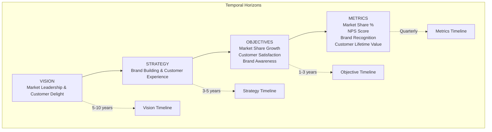
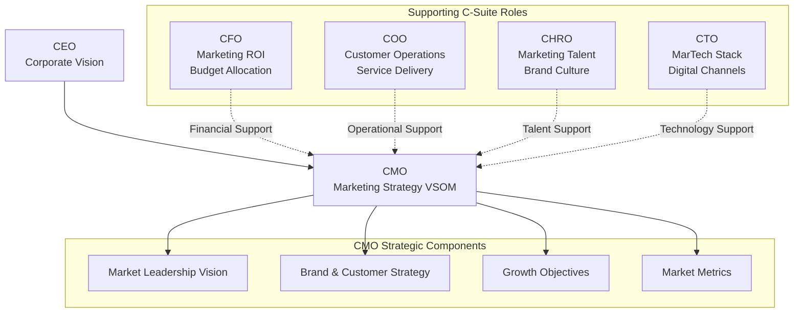
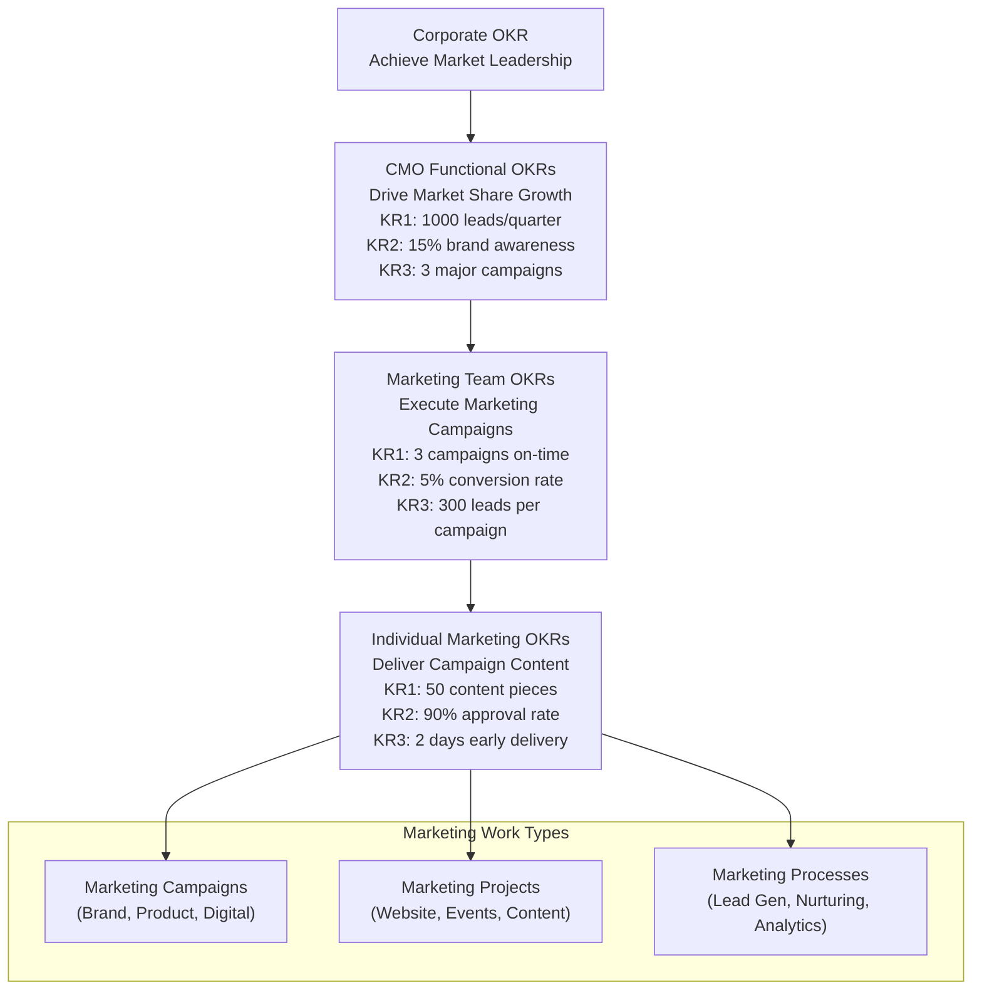
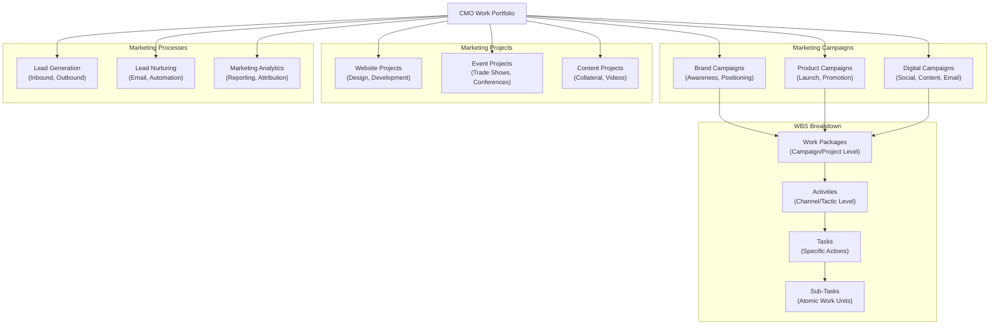
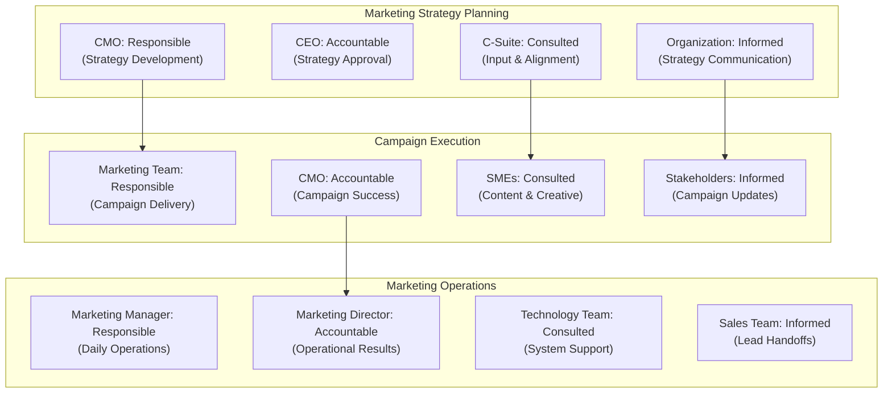
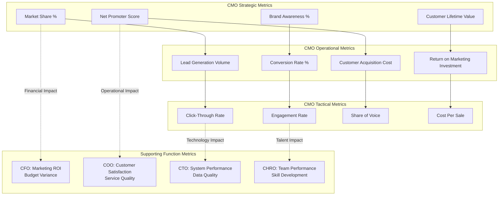

# VSOM Framework: CMO Marketing Perspective - Mermaid Diagrams

Below are precise Mermaid diagrams focused on the CMO's functional strategy within the VSOM framework, showing how marketing drives organizational objectives with C-Suite support.

***

## 1. CMO VSOM Core Framework (Marketing-Centric)

***

## 2. CMO Functional Strategy Cascade with C-Suite Support

***

## 3. CMO OKR Cascade to Marketing Execution

***

## 4. CMO Work Classification \& WBS Structure

***

## 5. CMO Strategic Framework Integration (BSC + Blue Ocean)

```mermaid
flowchart TD
    CMO["CMO Strategic Framework"]
    
    subgraph "BSC Customer Perspective"
        CS["Customer Satisfaction"]
        CR["Customer Retention"]
        CA["Customer Acquisition"]
        CLV["Customer Lifetime Value"]
    end

    subgraph "Blue Ocean Marketing Actions"
        ELIM["ELIMINATE\nTraditional Advertising\nMass Marketing"]
        RED["REDUCE\nBroadcast Spend\nGeneric Messaging"]
        RAISE["RAISE\nDigital Engagement\nPersonalization"]
        CREATE["CREATE\nCommunity Building\nExperience Marketing"]
    end

    CMO --> CS
    CMO --> CR
    CMO --> CA
    CMO --> CLV

    CMO --> ELIM
    CMO --> RED
    CMO --> RAISE
    CMO --> CREATE

    subgraph "Supporting Functions Integration"
        CFO_SUP["CFO: Marketing ROI\nBudget Optimization"]
        COO_SUP["COO: Customer Journey\nService Integration"]
        CTO_SUP["CTO: MarTech Stack\nData Integration"]
        CHRO_SUP["CHRO: Marketing Skills\nBrand Ambassador Training"]
    end

    CMO -.->|Financial Alignment| CFO_SUP
    CMO -.->|Operational Alignment| COO_SUP
    CMO -.->|Technology Alignment| CTO_SUP
    CMO -.->|Talent Alignment| CHRO_SUP
```

***

## 6. CMO RACI Matrix for Marketing Strategy Execution

***

## 7. CMO Metrics Dashboard Integration

***

## Usage Instructions

- Each diagram focuses specifically on CMO's functional strategy within the VSOM framework
- Copy and paste any diagram into Mermaid-compatible tools (GitHub, VSCode, Obsidian, etc.)
- Diagrams show how marketing drives organizational objectives while receiving C-Suite support
- Modular design allows mixing and matching for presentations focused on marketing strategy execution

