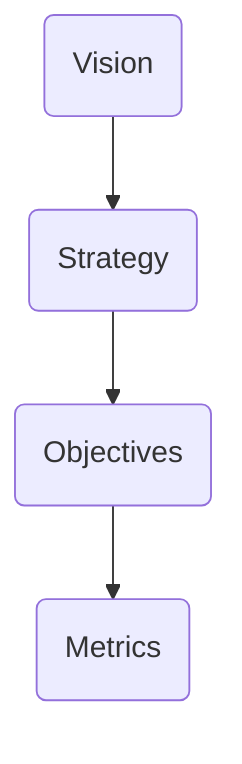
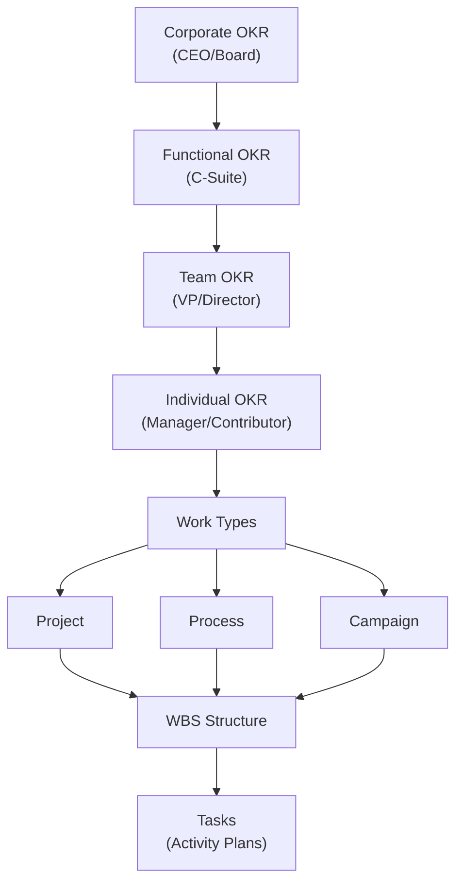
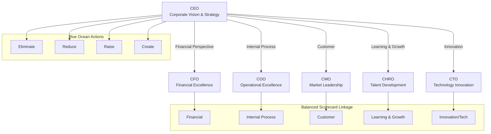
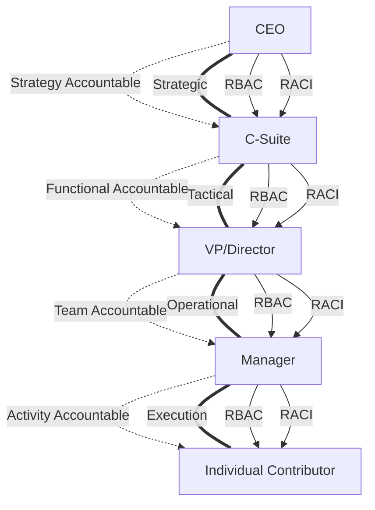

# VSOM Framework: Hierarchical Mermaid Diagrams

Below are precise Mermaid diagrams to visualize VSOM chaining, C-Suite strategy mapping, and OKR/work breakdown across the organizational cascade. These are optimized for slide usage and can be copied directly into any Mermaid-compatible renderer.

***

## 1. VSOM High-Level Cascade (Vision → Strategy → Objectives → Metrics)




***

## 2. Organizational Cascade: VSOM, Functional Strategy, OKR Hierarchy

```mermaid
flowchart TD
    A[Corporate VSOM\n(CEO)]
    B1[Financial VSOM\n(CFO)]
    B2[Operations VSOM\n(COO)]
    B3[Marketing VSOM\n(CMO)]
    B4[HR VSOM\n(CHRO)]
    B5[Tech VSOM\n(CTO)]
    C1[Corporate OKRs]
    C2[Functional OKRs]
    C3[Team OKRs]
    C4[Individual OKRs]
    D1[Projects]
    D2[Processes]
    D3[Campaigns]
    E1[WBS]
    F1[Activities / Tasks]

    A -->|Cascades to| B1
    A --> B2
    A --> B3
    A --> B4
    A --> B5
    A --> C1
    B1 --> C2
    B2 --> C2
    B3 --> C2
    B4 --> C2
    B5 --> C2
    C1 --> C2
    C2 --> C3
    C2 --> C4
    C3 --> D1
    C3 --> D2
    C3 --> D3
    C4 --> D1
    C4 --> D2
    C4 --> D3
    D1 --> E1
    D2 --> E1
    D3 --> E1
    E1 --> F1
```


***

## 3. OKR and Activity Cascade (with RACI/RBAC governance)




***

## 4. C-Suite Strategic Role Map (including BSC/Blue Ocean connection)




***

## 5. RACI/RBAC Governance Overlay (roles and responsibilities)




***

## Usage

- Copy and paste each diagram into your Mermaid renderer (Markdown slides, VSCode, Obsidian, etc.) for immediate visualization.
- Each diagram is modular and can be used individually or combined as required for enterprise slides.
- These diagrams precisely reflect the VSOM, strategy, C-Suite cascades, and governance overlays for best-in-class enterprise architecture.

