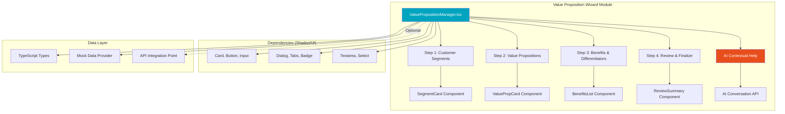

# Value Proposition Engineering Wizard - Modular Specification

**Module Name:** Value Proposition Wizard  
**Version:** 1.0.0  
**Status:** ✅ Production-Ready  
**License:** Reusable across projects  
**Last Updated:** November 13, 2025

---

## 📋 Executive Summary

A modular, multi-step wizard for engineering value propositions with AI-powered contextual help. Guides users through customer segment identification, value proposition creation, and benefit articulation. Fully self-contained and portable across projects.

**Key Features:**
- ✅ 4-step wizard workflow (Segments → Value Props → Benefits → Review)
- ✅ AI conversational help integrated at each step
- ✅ Multi-customer-segment support
- ✅ CRUD operations for value propositions
- ✅ Markdown rendering with syntax highlighting
- ✅ Toast notifications for UX feedback
- ✅ Fully typed with TypeScript
- ✅ Shadcn/UI components (portable design system)

---

## 🎯 Use Cases

### Primary Use Case (BAIV)
B2B SaaS companies defining value propositions for different customer segments (SMB, Mid-Market, Enterprise).

### Adaptable To:
1. **Product Management:** Feature value prop definition
2. **Marketing:** Campaign messaging frameworks
3. **Sales:** Pitch deck value propositions
4. **Strategy:** Competitive positioning statements
5. **Consulting:** Client deliverable frameworks
6. **Any multi-stakeholder value definition**

---

## 🏗️ Architecture



---

## 📦 Module Structure

```
value-proposition-wizard/
├── README.md                          # Installation guide
├── INTEGRATION.md                     # Integration instructions
├── components/
│   └── ValuePropositionManager.tsx    # Main wizard component ⭐
├── types/
│   └── valueProposition.types.ts      # TypeScript interfaces
├── utils/
│   ├── mockValueProps.ts              # Sample data
│   └── valuePropsHelpers.ts           # Helper functions
├── hooks/
│   └── useValuePropositions.ts        # State management hook (optional)
└── examples/
    └── basic-usage.tsx                # Integration example
```

---

## 🔧 Core Components

### 1. ValuePropositionManager (Main Component)

**File:** `components/ValuePropositionManager.tsx`

**Props:**
```typescript
interface ValuePropositionManagerProps {
  organizationId: string;              // Parent organization ID
  organizationName?: string;           // Display name
  onSave?: (valueProps: ValueProp[]) => void;  // Optional save callback
  onCancel?: () => void;               // Optional cancel callback
  aiEnabled?: boolean;                 // Enable AI help (default: true)
  readOnly?: boolean;                  // View-only mode (default: false)
  theme?: {                            // Optional theming
    primaryColor?: string;
    secondaryColor?: string;
  };
}
```

**Features:**
- 4-step wizard navigation
- State management for segments, value props, benefits
- AI contextual help toggle
- Progress indicator
- Validation at each step
- Auto-save support (optional)

---

### 2. AI Contextual Help Pattern

**Integration Pattern:**
```typescript
// AI Help Panel Component
const AIHelpPanel = ({ 
  context, 
  onSuggestion 
}: { 
  context: string; 
  onSuggestion: (suggestion: string) => void;
}) => {
  const [messages, setMessages] = useState([]);
  const [input, setInput] = useState('');
  
  const askAI = async (question: string) => {
    // Call AI API with context
    const response = await fetch('/api/ai/help', {
      method: 'POST',
      body: JSON.stringify({ 
        context, 
        question,
        conversationHistory: messages 
      })
    });
    
    const { answer, suggestions } = await response.json();
    
    setMessages(prev => [...prev, 
      { role: 'user', content: question },
      { role: 'assistant', content: answer }
    ]);
    
    return { answer, suggestions };
  };
  
  return (
    <Card className="ai-help-panel">
      {/* Conversation history */}
      {/* Input field */}
      {/* Suggestions */}
    </Card>
  );
};
```

**Context Examples:**
```typescript
// Step 1 - Customer Segments
context: "Defining customer segments for B2B SaaS. Current segments: SMB, Enterprise."

// Step 2 - Value Propositions
context: "Creating value proposition for SMB segment. Product: AI-powered analytics."

// Step 3 - Benefits
context: "Articulating benefits for 'Faster Time to Insights' value prop."
```

---

## 📊 Data Models

### TypeScript Interfaces

**File:** `types/valueProposition.types.ts`

```typescript
export interface CustomerSegment {
  id: string;
  name: string;                    // "Small Business (1-50 employees)"
  description: string;             // "Small teams with limited resources"
  characteristics: string[];       // ["Budget-conscious", "Self-service"]
  painPoints: string[];            // ["Lack of analytics expertise"]
  valueDrivers: string[];          // ["Cost savings", "Ease of use"]
  createdAt: Date;
  updatedAt: Date;
}

export interface ValueProposition {
  id: string;
  segmentId: string;               // FK to CustomerSegment
  title: string;                   // "Faster Time to Insights"
  statement: string;               // Full value prop statement
  category: 'efficiency' | 'cost-savings' | 'quality' | 'innovation' | 'risk-reduction';
  priority: number;                // 1-5 (1 = highest)
  benefits: Benefit[];
  differentiators: string[];       // How we're different
  proofPoints: string[];           // Evidence (case studies, metrics)
  createdAt: Date;
  updatedAt: Date;
}

export interface Benefit {
  id: string;
  description: string;             // "Reduce analysis time by 80%"
  type: 'tangible' | 'intangible'; // Measurable vs emotional
  impact: 'high' | 'medium' | 'low';
  metrics?: string;                // "Save 20 hours/week"
}

export interface ValuePropWizardState {
  currentStep: 1 | 2 | 3 | 4;
  segments: CustomerSegment[];
  valueProps: ValueProposition[];
  selectedSegment: CustomerSegment | null;
  selectedValueProp: ValueProposition | null;
  isDirty: boolean;                // Unsaved changes
  aiHelpEnabled: boolean;
}
```

---

## 🎨 UI/UX Patterns

### Step 1: Customer Segments

```
┌─────────────────────────────────────────────┐
│  Step 1 of 4: Define Customer Segments     │
├─────────────────────────────────────────────┤
│                                             │
│  [+ Add Customer Segment]     [AI Help 🤖] │
│                                             │
│  ┌───────────────────────────────────────┐ │
│  │ 📊 Small Business (1-50 employees)    │ │
│  │ Small teams, limited resources        │ │
│  │                                        │ │
│  │ Pain Points:                           │ │
│  │ • Lack of analytics expertise          │ │
│  │ • Budget constraints                   │ │
│  │                                        │ │
│  │ [Edit] [Delete]                        │ │
│  └───────────────────────────────────────┘ │
│                                             │
│  ┌───────────────────────────────────────┐ │
│  │ 🏢 Enterprise (500+ employees)        │ │
│  │ Complex needs, compliance focus       │ │
│  │                                        │ │
│  │ Pain Points:                           │ │
│  │ • Data silos across departments        │ │
│  │ • Governance requirements              │ │
│  │                                        │ │
│  │ [Edit] [Delete]                        │ │
│  └───────────────────────────────────────┘ │
│                                             │
│            [Cancel]  [Next: Value Props >] │
└─────────────────────────────────────────────┘
```

### Step 2: Value Propositions

```
┌─────────────────────────────────────────────┐
│  Step 2 of 4: Define Value Propositions    │
├─────────────────────────────────────────────┤
│                                             │
│  Select Segment: [Small Business ▼]        │
│                                             │
│  [+ Add Value Proposition]   [AI Help 🤖]  │
│                                             │
│  ┌───────────────────────────────────────┐ │
│  │ 🎯 Faster Time to Insights            │ │
│  │ Category: Efficiency | Priority: ⭐⭐⭐⭐⭐│ │
│  │                                        │ │
│  │ "Get actionable insights in minutes,  │ │
│  │  not days, without needing a data     │ │
│  │  science team."                        │ │
│  │                                        │ │
│  │ Differentiators:                       │ │
│  │ • AI-powered auto-analysis             │ │
│  │ • Natural language queries             │ │
│  │                                        │ │
│  │ [Edit] [Delete]                        │ │
│  └───────────────────────────────────────┘ │
│                                             │
│         [< Back]  [Cancel]  [Next: Benefits >]│
└─────────────────────────────────────────────┘
```

### Step 3: Benefits & Differentiators

```
┌─────────────────────────────────────────────┐
│  Step 3 of 4: Articulate Benefits          │
├─────────────────────────────────────────────┤
│                                             │
│  Value Prop: Faster Time to Insights       │
│                                             │
│  [+ Add Benefit]              [AI Help 🤖] │
│                                             │
│  Benefits:                                  │
│  ┌───────────────────────────────────────┐ │
│  │ ✅ Reduce analysis time by 80%         │ │
│  │    Type: Tangible | Impact: High      │ │
│  │    Metric: Save 20 hours/week         │ │
│  │    [Edit] [Delete]                     │ │
│  └───────────────────────────────────────┘ │
│                                             │
│  ┌───────────────────────────────────────┐ │
│  │ ✅ Empower non-technical users         │ │
│  │    Type: Intangible | Impact: Medium  │ │
│  │    No data science skills required    │ │
│  │    [Edit] [Delete]                     │ │
│  └───────────────────────────────────────┘ │
│                                             │
│  Proof Points:                              │
│  • Customer X reduced reporting from 2 days│
│    to 15 minutes                            │
│  • 95% of users create their first report  │
│    without training                         │
│                                             │
│      [< Back]  [Cancel]  [Next: Review >]  │
└─────────────────────────────────────────────┘
```

### Step 4: Review & Finalize

```
┌─────────────────────────────────────────────┐
│  Step 4 of 4: Review & Finalize            │
├─────────────────────────────────────────────┤
│                                             │
│  📊 Summary                                 │
│                                             │
│  Customer Segments: 2                       │
│  • Small Business (1-50 employees)          │
│  • Enterprise (500+ employees)              │
│                                             │
│  Value Propositions: 4                      │
│  • Faster Time to Insights (Priority: 5)   │
│  • Cost Savings (Priority: 4)               │
│  • Self-Service Analytics (Priority: 4)    │
│  • Enterprise-Grade Security (Priority: 3) │
│                                             │
│  Total Benefits: 12                         │
│  Total Differentiators: 8                   │
│                                             │
│  ┌───────────────────────────────────────┐ │
│  │ 📝 Next Steps:                         │ │
│  │ • Export to pitch deck                 │ │
│  │ • Share with sales team                │ │
│  │ • Create marketing messaging           │ │
│  └───────────────────────────────────────┘ │
│                                             │
│  [< Back]  [Cancel]  [💾 Save & Finalize]  │
└─────────────────────────────────────────────┘
```

---

## 🔌 Integration Guide

### Minimal Integration

```tsx
import { ValuePropositionManager } from './components/ValuePropositionManager';

function App() {
  const handleSave = (valueProps) => {
    console.log('Saved value props:', valueProps);
    // Save to your database
  };
  
  return (
    <ValuePropositionManager
      organizationId="org-123"
      organizationName="Acme Corp"
      onSave={handleSave}
    />
  );
}
```

### Advanced Integration (with API)

```tsx
import { ValuePropositionManager } from './components/ValuePropositionManager';
import { useValuePropositions } from './hooks/useValuePropositions';

function App() {
  const { 
    valueProps, 
    loading, 
    save 
  } = useValuePropositions('org-123');
  
  const handleSave = async (data) => {
    await save(data);
    toast.success('Value propositions saved!');
  };
  
  return (
    <>
      {loading ? <Spinner /> : (
        <ValuePropositionManager
          organizationId="org-123"
          organizationName="Acme Corp"
          onSave={handleSave}
          aiEnabled={true}
          theme={{
            primaryColor: '#00a4bf',
            secondaryColor: '#e84e1c'
          }}
        />
      )}
    </>
  );
}
```

---

## 🤖 AI Contextual Help Integration

### API Endpoint Required

```typescript
// POST /api/ai/help
interface AIHelpRequest {
  context: string;                    // Current wizard step context
  question: string;                   // User's question
  conversationHistory?: Message[];    // Previous conversation
  organizationData?: {                // Optional context
    industry: string;
    productType: string;
    targetMarket: string;
  };
}

interface AIHelpResponse {
  answer: string;                     // AI's response
  suggestions: string[];              // Quick suggestions
  relatedQuestions: string[];         // Follow-up questions
}
```

### Example Context Prompts

**Step 1 - Customer Segments:**
```
System: You are helping define customer segments for a B2B SaaS product. 
Current segments: Small Business (1-50 employees), Enterprise (500+).

User: "What pain points should I consider for small businesses?"

AI Response: "For small businesses, common pain points include:
1. Budget constraints (limited resources for tools/staff)
2. Lack of technical expertise (need simple, self-service solutions)
3. Time pressure (wear multiple hats, need efficiency)
4. Scalability concerns (solution must grow with them)
5. Limited IT support (must be easy to implement/maintain)

For your analytics product, focus on:
- High cost of hiring data analysts
- Complex tools requiring training
- Difficulty getting quick insights for decisions"

Suggestions: ["Add 'Budget Constraints' pain point", "Add 'Self-service need' pain point"]
```

**Step 2 - Value Propositions:**
```
System: Defining value proposition for Small Business segment. 
Product: AI-powered analytics platform.

User: "How do I articulate the 'faster insights' value prop?"

AI Response: "For 'Faster Time to Insights', structure it as:

**Statement:** 'Get actionable insights in minutes, not days, without needing a data science team.'

**Category:** Efficiency

**Differentiators:**
- AI auto-generates analysis (vs manual SQL queries)
- Natural language interface (vs technical dashboards)
- Pre-built templates for common questions

**Proof Points:**
- 'Customers reduce reporting time from 2 days to 15 minutes'
- '95% of users create first report without training'

Focus on TIME SAVED and EASE OF USE for small businesses."

Suggestions: ["Use this value prop statement", "Add AI auto-analysis differentiator"]
```

**Step 3 - Benefits:**
```
System: Articulating benefits for 'Faster Time to Insights' value prop.

User: "What's the difference between tangible and intangible benefits?"

AI Response: "Tangible Benefits (Measurable):
- 'Reduce analysis time by 80%' (can measure hours saved)
- 'Save $50k/year in analyst costs' (quantifiable ROI)
- 'Generate 10x more reports' (countable output)

Intangible Benefits (Emotional/Qualitative):
- 'Empower non-technical teams' (confidence, autonomy)
- 'Reduce frustration with data tools' (satisfaction)
- 'Improve decision-making confidence' (peace of mind)

For small businesses, lead with TANGIBLE (cost/time savings), 
then support with INTANGIBLE (ease, empowerment).

Example: 'Save 20 hours/week on reporting (tangible) while 
empowering your team to make data-driven decisions independently (intangible).'"

Suggestions: ["Add time savings benefit", "Add cost savings benefit", "Add empowerment benefit"]
```

---

## 📚 Dependencies

### Required Shadcn/UI Components

```bash
# Install these Shadcn components
npx shadcn-ui@latest add card
npx shadcn-ui@latest add button
npx shadcn-ui@latest add input
npx shadcn-ui@latest add textarea
npx shadcn-ui@latest add dialog
npx shadcn-ui@latest add tabs
npx shadcn-ui@latest add badge
npx shadcn-ui@latest add select
npx shadcn-ui@latest add label
npx shadcn-ui@latest add separator
npx shadcn-ui@latest add scroll-area
```

### NPM Packages

```json
{
  "dependencies": {
    "react": "^18.2.0",
    "lucide-react": "latest",
    "sonner": "^2.0.3",
    "class-variance-authority": "latest",
    "clsx": "latest",
    "tailwind-merge": "latest"
  },
  "devDependencies": {
    "typescript": "^5.0.0",
    "@types/react": "^18.2.0"
  }
}
```

---

## 🎯 Customization Points

### 1. Theming

```typescript
// Override default colors
<ValuePropositionManager
  theme={{
    primaryColor: '#00a4bf',      // BAIV teal
    secondaryColor: '#e84e1c',    // BAIV orange
    accentColor: '#cf057d'        // BAIV magenta
  }}
/>
```

### 2. Step Configuration

```typescript
// Hide/show specific steps
<ValuePropositionManager
  steps={{
    segments: true,
    valueProps: true,
    benefits: true,
    review: true,
    aiHelp: true              // Toggle AI help
  }}
/>
```

### 3. Validation Rules

```typescript
// Custom validation
<ValuePropositionManager
  validation={{
    minSegments: 1,
    minValueProps: 2,
    minBenefitsPerValueProp: 2,
    requireProofPoints: true
  }}
/>
```

### 4. Data Persistence

```typescript
// Custom save handler
const handleSave = async (data) => {
  // Save to Supabase
  await supabase
    .from('value_propositions')
    .upsert(data);
  
  // Or save to KV store
  await kv.set(`value-props:${orgId}`, data);
  
  // Or save to file
  await fs.writeFile('value-props.json', JSON.stringify(data));
};
```

---

## 📖 Example Use Cases

### Use Case 1: BAIV Platform (Original)

```tsx
// BAIV: B2B SaaS companies defining value props
<ValuePropositionManager
  organizationId={organization.id}
  organizationName={organization.name}
  onSave={handleSaveToSupabase}
  aiEnabled={true}
  theme={{
    primaryColor: '#00a4bf',
    secondaryColor: '#e84e1c'
  }}
/>
```

### Use Case 2: Product Management Tool

```tsx
// Product teams defining feature value props
<ValuePropositionManager
  organizationId={productId}
  organizationName={productName}
  onSave={handleSaveFeatureValueProps}
  aiEnabled={true}
  // Rename "Customer Segments" to "User Personas"
  labels={{
    segments: 'User Personas',
    valueProps: 'Feature Benefits',
    benefits: 'User Value'
  }}
/>
```

### Use Case 3: Marketing Campaign Tool

```tsx
// Marketing teams defining campaign messaging
<ValuePropositionManager
  organizationId={campaignId}
  organizationName={campaignName}
  onSave={handleSaveCampaignMessaging}
  aiEnabled={true}
  labels={{
    segments: 'Target Audiences',
    valueProps: 'Key Messages',
    benefits: 'Campaign Benefits'
  }}
/>
```

### Use Case 4: Sales Enablement

```tsx
// Sales teams defining pitch value props
<ValuePropositionManager
  organizationId={opportunityId}
  organizationName={prospectName}
  onSave={handleSavePitchDeck}
  readOnly={false}
  aiEnabled={true}
  labels={{
    segments: 'Stakeholder Groups',
    valueProps: 'Pitch Points',
    benefits: 'Customer Wins'
  }}
/>
```

---

## 🚀 Installation Steps

### Step 1: Copy Module Files

```bash
# Copy the module to your project
cp -r value-proposition-wizard/ /your-project/src/modules/

# Or install as npm package (if published)
npm install @baiv/value-proposition-wizard
```

### Step 2: Install Dependencies

```bash
# Install Shadcn components
npx shadcn-ui@latest add card button input textarea dialog tabs badge select label separator scroll-area

# Install other dependencies
npm install lucide-react sonner
```

### Step 3: Configure Tailwind (if needed)

```javascript
// tailwind.config.js
module.exports = {
  content: [
    './src/**/*.{js,jsx,ts,tsx}',
    './src/modules/value-proposition-wizard/**/*.{js,jsx,ts,tsx}' // ⭐ Add this
  ],
  theme: {
    extend: {
      colors: {
        // Add your theme colors
        primary: '#00a4bf',
        secondary: '#e84e1c'
      }
    }
  }
}
```

### Step 4: Integrate Component

```tsx
// src/App.tsx
import { ValuePropositionManager } from './modules/value-proposition-wizard';

function App() {
  return (
    <ValuePropositionManager
      organizationId="test-org-1"
      organizationName="Test Organization"
      onSave={(data) => console.log('Saved:', data)}
    />
  );
}
```

---

## 🧪 Testing

### Unit Tests

```typescript
// valueProposition.test.tsx
import { render, screen, fireEvent } from '@testing-library/react';
import { ValuePropositionManager } from './ValuePropositionManager';

describe('ValuePropositionManager', () => {
  it('renders all 4 steps', () => {
    render(<ValuePropositionManager organizationId="test" />);
    expect(screen.getByText(/Step 1 of 4/i)).toBeInTheDocument();
  });
  
  it('navigates through wizard steps', () => {
    render(<ValuePropositionManager organizationId="test" />);
    
    // Add a segment
    fireEvent.click(screen.getByText(/Add Customer Segment/i));
    // ... fill form
    fireEvent.click(screen.getByText(/Save/i));
    
    // Navigate to next step
    fireEvent.click(screen.getByText(/Next/i));
    expect(screen.getByText(/Step 2 of 4/i)).toBeInTheDocument();
  });
  
  it('calls onSave when finalized', () => {
    const handleSave = jest.fn();
    render(
      <ValuePropositionManager 
        organizationId="test" 
        onSave={handleSave}
      />
    );
    
    // ... complete all steps
    fireEvent.click(screen.getByText(/Save & Finalize/i));
    expect(handleSave).toHaveBeenCalled();
  });
});
```

---

## 📊 Performance Considerations

### Optimization Tips

1. **Lazy Loading:**
```typescript
const ValuePropositionManager = lazy(() => 
  import('./modules/value-proposition-wizard')
);

// Use with Suspense
<Suspense fallback={<Loading />}>
  <ValuePropositionManager {...props} />
</Suspense>
```

2. **Memoization:**
```typescript
// Memoize expensive computations
const sortedValueProps = useMemo(() => 
  valueProps.sort((a, b) => b.priority - a.priority),
  [valueProps]
);
```

3. **Debounced Auto-Save:**
```typescript
const debouncedSave = useDebouncedCallback(
  (data) => handleSave(data),
  1000 // Save 1 second after last change
);
```

---

## 🔒 Security Considerations

### Data Validation

```typescript
// Validate on save
const validateValueProp = (data: ValueProposition) => {
  if (!data.title || data.title.length < 5) {
    throw new Error('Title must be at least 5 characters');
  }
  
  if (!data.statement || data.statement.length < 20) {
    throw new Error('Statement must be at least 20 characters');
  }
  
  if (data.benefits.length < 1) {
    throw new Error('At least one benefit is required');
  }
  
  return true;
};
```

### Sanitization

```typescript
import DOMPurify from 'dompurify';

// Sanitize user input before saving
const sanitizedTitle = DOMPurify.sanitize(inputTitle);
const sanitizedStatement = DOMPurify.sanitize(inputStatement);
```

---

## 📄 License & Attribution

**License:** MIT (or your license)

**Attribution:**
```
Value Proposition Wizard Module
Originally developed for BAIV Platform
Modularized for reuse: November 13, 2025
```

**Credits:**
- Design Pattern: BAIV Platform Team
- AI Integration: Claude (Anthropic)
- UI Components: Shadcn/UI

---

## 🆘 Support & Troubleshooting

### Common Issues

**Issue 1: Shadcn components not found**
```bash
# Solution: Install missing components
npx shadcn-ui@latest add [component-name]
```

**Issue 2: TypeScript errors on types**
```bash
# Solution: Update TypeScript
npm install typescript@latest
```

**Issue 3: Tailwind styles not applying**
```javascript
// Solution: Add module to Tailwind content
content: [
  './src/modules/value-proposition-wizard/**/*.{js,jsx,ts,tsx}'
]
```

---

## 🗺️ Roadmap

### v1.1 (Planned)
- [ ] Export to PDF/PowerPoint
- [ ] Collaborative editing (multi-user)
- [ ] Version history
- [ ] Templates library (SaaS, E-commerce, etc.)

### v1.2 (Future)
- [ ] AI-generated value props (full auto-fill)
- [ ] Competitive analysis integration
- [ ] ROI calculator
- [ ] Integration with CRM systems

---

## 📞 Contact

For questions or support:
- GitHub Issues: [Link to repo]
- Email: support@baiv.io
- Documentation: [Link to full docs]

---

**End of Specification Document**
