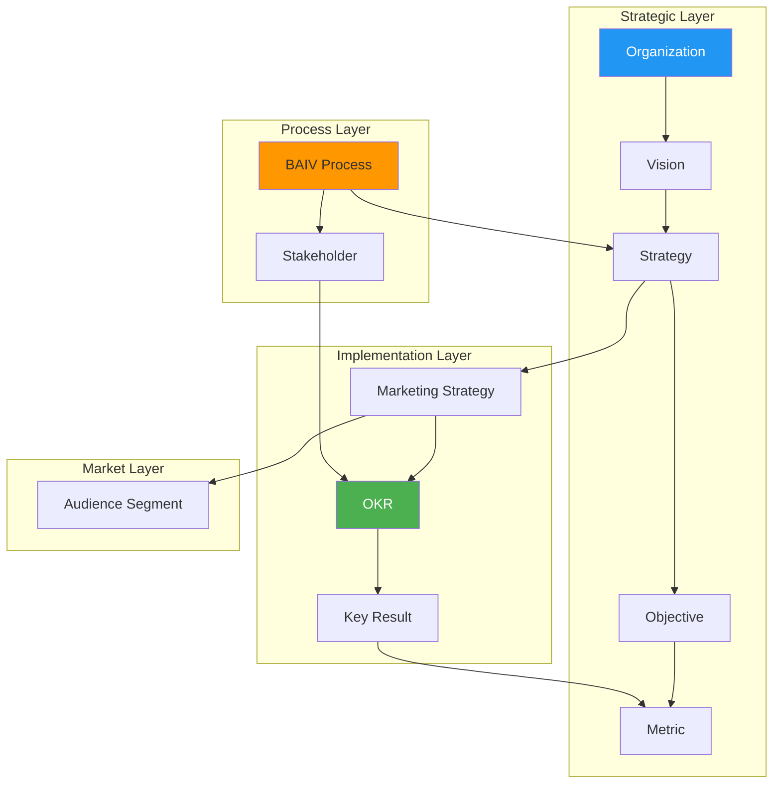

# VSOM Marketing Strategy & OKR Implementation Ontology
## Complete Implementation Guide

**Version**: 1.0.0  
**Release Date**: October 3, 2025  
**Created by**: Ontology Architect Agent  
**Status**: Production Ready ✅

---

## 🎯 Overview

The VSOM (Vision, Strategy, Objectives, Metrics) Marketing Strategy & OKR Implementation Ontology is a comprehensive knowledge framework designed specifically for AI-led business transformation consulting. It creates a connected semantic structure linking organizational vision through strategy to marketing OKRs and implementation, enabling systematic strategy development and performance measurement.

### Key Capabilities
- **Strategic Alignment**: Connect vision to execution through structured relationships
- **AI-Powered Analysis**: Enable intelligent strategy optimization and performance prediction
- **Marketing Integration**: Bridge business strategy to marketing implementation
- **Performance Tracking**: Systematic OKR and metrics management
- **Consulting Methodology**: Support BAIV process framework (Early Access → Strategy Calls → Onboarding)

---

## 🏗️ Architecture Overview



---

## 📋 Entity Reference

### Core Strategic Entities

#### Organization
**Purpose**: Client companies engaging with BAIV transformation consulting  
**Key Properties**: `maturityLevel`, `transformationStage`, `competitivePosition`  
**AI Usage**: Maturity assessment, transformation readiness analysis

```json
{
  "@id": "org:techcorp-inc",
  "@type": "Organization",
  "organizationName": "TechCorp Inc.",
  "maturityLevel": "Intermediate",
  "transformationStage": "Scaling"
}
```

#### Vision
**Purpose**: Long-term aspirational goals with AI readiness metrics  
**Key Properties**: `visionStatement`, `timeHorizon`, `aiReadiness`  
**AI Usage**: Strategic direction analysis, capability gap identification

#### Strategy  
**Purpose**: High-level approaches for achieving vision objectives  
**Key Properties**: `strategyType`, `competitiveApproach`, `aiLeverage`  
**AI Usage**: Competitive positioning analysis, strategy optimization

### Implementation Entities

#### OKR (Objectives and Key Results)
**Purpose**: Quarterly implementation framework connecting strategy to execution  
**Key Properties**: `okrObjective`, `quarter`, `year`, `confidenceLevel`  
**AI Usage**: Progress prediction, achievement probability analysis

#### MarketingStrategy
**Purpose**: Marketing-specific approaches with AI capabilities  
**Key Properties**: `focusArea`, `visibilityBeyondSEO`, `aiMarketingCapabilities`  
**AI Usage**: Audience optimization, visibility strategy enhancement

#### BAIVProcess
**Purpose**: Structured consulting engagement methodology  
**Types**: `Process1_EarlyAccess`, `Process2_StrategyCalls`, `Process3_Onboarding`  
**AI Usage**: Process optimization, client journey analysis

---

## 🔄 Relationship Patterns

### Strategic Hierarchy
```
Organization → hasVision → Vision
Vision ← supportsVision ← Strategy  
Strategy → hasObjective → Objective
Objective → translatesTo → OKR
```

### Implementation Chain
```
Strategy → informsMarketingStrategy → MarketingStrategy
MarketingStrategy ← implements ← OKR
OKR → hasKeyResult → KeyResult
```

### Process Integration
```
Organization ← engagesOrganization ← BAIVProcess
BAIVProcess → informsStrategy → Strategy
Stakeholder → responsibleForOKR → OKR
```

---

## 🤖 AI Agent Capabilities

### Strategic Analysis
```sparql
# Find strategies without vision alignment
SELECT ?strategy ?name WHERE {
  ?strategy a :Strategy ;
           :strategyName ?name .
  FILTER NOT EXISTS { ?strategy :supportsVision ?vision }
}
```

### Performance Monitoring
```sparql
# Identify at-risk OKRs (confidence < 60% or progress < 50%)
SELECT ?okr ?objective ?confidence ?progress WHERE {
  ?okr a :OKR ;
       :okrObjective ?objective ;
       :confidenceLevel ?confidence ;
       :hasKeyResult/progressPercent ?progress .
  FILTER (?confidence < 0.6 || ?progress < 50)
}
```

### Competitive Intelligence
```sparql
# Analyze competitive approaches by organization
SELECT ?org ?approach (COUNT(?strategy) as ?count) WHERE {
  ?org a :Organization ;
       :hasVision/alignsWith ?strategy .
  ?strategy :competitiveApproach ?approach .
} GROUP BY ?org ?approach ORDER BY ?count DESC
```

---

## 📊 Implementation Examples

### Complete Strategic Chain
```json
{
  "organization": {
    "@id": "org:innovate-corp",
    "organizationName": "InnovateCorp",
    "maturityLevel": "Advanced",
    "transformationStage": "Optimization"
  },
  "vision": {
    "@id": "vision:market-leader-2027",
    "visionStatement": "Become the leading AI-powered solution provider by 2027",
    "timeHorizon": "P3Y",
    "aiReadiness": 85.0
  },
  "strategy": {
    "@id": "strategy:ai-differentiation",
    "strategyName": "AI-First Market Differentiation",
    "competitiveApproach": "Differentiation",
    "aiLeverage": "Proprietary AI algorithms and automated optimization"
  },
  "marketingStrategy": {
    "@id": "mstrategy:thought-leadership",
    "focusArea": "Visibility",
    "visibilityBeyondSEO": "AI research publication, executive podcasts, peer referral networks"
  },
  "okr": {
    "@id": "okr:q1-market-leadership",
    "okrObjective": "Establish thought leadership in AI optimization",
    "quarter": "Q1",
    "year": 2025,
    "confidenceLevel": 0.8
  }
}
```

### BAIV Process Integration
```json
{
  "process": {
    "@id": "process:innovate-corp-strategy",
    "processType": "Process2_StrategyCalls",
    "stage": "In_Progress",
    "deliverables": "Strategic roadmap, competitive analysis, implementation timeline"
  },
  "stakeholder": {
    "@id": "stakeholder:ceo-innovate",
    "name": "Jennifer Martinez",
    "role": "Chief Executive Officer",
    "stakeholderType": "Executive",
    "influence": "High"
  }
}
```

---

## 🔧 Implementation Guide

### Step 1: Environment Setup
```bash
# Install required dependencies
npm install @baiv/ontology-client
pip install rdflib sparqlwrapper --break-system-packages

# Clone ontology repository
git clone https://github.com/baiv/ontologies
cd ontologies/vsom-marketing-okr
```

### Step 2: Load Ontology
```python
from baiv_ontology import OntologyClient

# Initialize client
client = OntologyClient()

# Load VSOM ontology
ontology = client.load_ontology("vsom-marketing-okr", version="1.0.0")

# Validate structure
validation_result = ontology.validate()
print(f"Validation: {validation_result.status}")
```

### Step 3: Create Strategic Data
```python
# Create organization
org = ontology.create_entity("Organization", {
    "organizationId": "ORG-NEW-001",
    "organizationName": "New Client Corp",
    "industry": "Technology",
    "maturityLevel": "Intermediate",
    "transformationStage": "Scaling"
})

# Create vision
vision = ontology.create_entity("Vision", {
    "visionId": "VIS-NEW-001", 
    "visionStatement": "Transform into AI-native organization",
    "timeHorizon": "P2Y",
    "aiReadiness": 75.0,
    "belongsTo": org.id
})

# Create relationships
ontology.create_relationship(org, "hasVision", vision)
```

### Step 4: Execute AI Queries
```python
# Strategic alignment analysis
alignment_query = """
SELECT ?org ?vision ?strategy ?okr WHERE {
  ?org a :Organization ;
       :hasVision ?vision .
  ?vision :alignsWith ?strategy .
  ?strategy :hasObjective/:translatesTo ?okr .
}
"""

results = ontology.execute_sparql(alignment_query)
for result in results:
    print(f"Alignment: {result['org']} → {result['vision']} → {result['strategy']} → {result['okr']}")
```

---

## 📈 Performance Optimization

### Query Performance
- **Index Key Properties**: `organizationId`, `strategyId`, `okrId`, `quarter`, `year`
- **Optimize Filters**: Use specific date ranges for temporal queries
- **Batch Operations**: Group related entity creation/updates

### Memory Management
```python
# Efficient data loading
client.set_cache_size(1000)  # Cache frequent entities
client.enable_lazy_loading()  # Load relationships on demand

# Batch processing for large datasets
batch_size = 100
for i in range(0, len(data), batch_size):
    batch = data[i:i+batch_size]
    ontology.batch_create_entities(batch)
```

### Monitoring Queries
```sparql
# Performance monitoring
SELECT ?entity_type (COUNT(?entity) as ?count) WHERE {
  ?entity a ?entity_type .
} GROUP BY ?entity_type ORDER BY ?count DESC

# Recent activity tracking  
SELECT ?entity ?modified WHERE {
  ?entity :lastModified ?modified .
  FILTER (?modified > "2025-10-01T00:00:00Z"^^xsd:dateTime)
} ORDER BY DESC(?modified)
```

---

## 🚀 Advanced Use Cases

### 1. Strategic Portfolio Analysis
```python
def analyze_strategic_portfolio(client, org_id):
    """Analyze complete strategic portfolio for organization"""
    
    query = f"""
    SELECT ?strategy ?objective ?okr ?progress WHERE {{
      <{org_id}> :hasVision/:alignsWith ?strategy .
      ?strategy :hasObjective ?objective .
      ?objective :translatesTo ?okr .
      OPTIONAL {{ ?okr :hasKeyResult/:progressPercent ?progress }}
    }}
    """
    
    results = client.execute_sparql(query)
    
    # Calculate portfolio health metrics
    portfolio_health = {
        'total_strategies': len(set(r['strategy'] for r in results)),
        'total_okrs': len(set(r['okr'] for r in results)),
        'avg_progress': sum(r.get('progress', 0) for r in results) / len(results),
        'at_risk_count': len([r for r in results if r.get('progress', 0) < 50])
    }
    
    return portfolio_health
```

### 2. Competitive Intelligence Dashboard
```python
def generate_competitive_analysis(client):
    """Generate competitive positioning analysis"""
    
    query = """
    SELECT ?org ?approach ?ai_readiness ?market_focus WHERE {
      ?org a :Organization ;
           :hasVision ?vision .
      ?vision :alignsWith ?strategy ;
              :aiReadiness ?ai_readiness .
      ?strategy :competitiveApproach ?approach ;
               :informsMarketingStrategy ?ms .
      ?ms :focusArea ?market_focus .
    }
    """
    
    results = client.execute_sparql(query)
    
    # Analyze competitive landscape
    competitive_map = {}
    for result in results:
        org = result['org']
        competitive_map[org] = {
            'approach': result['approach'],
            'ai_readiness': result['ai_readiness'],
            'market_focus': result['market_focus']
        }
    
    return competitive_map
```

### 3. AI-Powered Recommendations
```python
class StrategyRecommendationEngine:
    def __init__(self, ontology_client):
        self.client = ontology_client
    
    def recommend_okr_adjustments(self, org_id, quarter):
        """Recommend OKR adjustments based on performance patterns"""
        
        # Get underperforming OKRs
        underperforming = self.client.execute_sparql(f"""
        SELECT ?okr ?objective ?progress ?confidence WHERE {{
          <{org_id}> :hasVision/:alignsWith/:hasObjective/:translatesTo ?okr .
          ?okr :okrObjective ?objective ;
               :quarter "{quarter}" ;
               :confidenceLevel ?confidence ;
               :hasKeyResult/:progressPercent ?progress .
          FILTER (?progress < 50 || ?confidence < 0.6)
        }}
        """)
        
        recommendations = []
        for okr in underperforming:
            if okr['progress'] < 30:
                recommendations.append({
                    'okr': okr['okr'],
                    'type': 'resource_reallocation',
                    'reason': 'Critically low progress',
                    'action': 'Consider additional resources or scope reduction'
                })
            elif okr['confidence'] < 0.5:
                recommendations.append({
                    'okr': okr['okr'],
                    'type': 'risk_mitigation',
                    'reason': 'Low confidence level',
                    'action': 'Identify and address risk factors'
                })
        
        return recommendations
```

---

## 🔒 Security & Governance

### Access Control
```python
# Role-based access control
class OntologyAccessControl:
    ROLES = {
        'admin': ['read', 'write', 'delete', 'manage'],
        'strategist': ['read', 'write'],
        'analyst': ['read'],
        'client': ['read_own_data']
    }
    
    def check_permission(self, user_role, action, entity_type=None):
        return action in self.ROLES.get(user_role, [])
```

### Data Privacy
- **Client Data Isolation**: Each organization's data in separate namespaces
- **PII Handling**: No personal identifiable information stored in ontology
- **Audit Logging**: All changes tracked with user attribution

### Compliance Features
```python
# GDPR compliance utilities
def anonymize_stakeholder_data(stakeholder_id):
    """Remove PII while preserving strategic relationships"""
    
    update_query = f"""
    DELETE {{ <{stakeholder_id}> :name ?name }}
    INSERT {{ <{stakeholder_id}> :name "Anonymized User" }}
    WHERE {{ <{stakeholder_id}> :name ?name }}
    """
```

---

## 📚 Integration Examples

### CRM Integration
```python
# Salesforce integration example
class SalesforceOntologySync:
    def sync_stakeholder_data(self):
        """Sync stakeholder roles from Salesforce to ontology"""
        
        sf_contacts = self.salesforce_client.get_contacts()
        for contact in sf_contacts:
            stakeholder = self.ontology.create_entity("Stakeholder", {
                "stakeholderId": f"STK-SF-{contact['Id']}",
                "role": contact['Title'],
                "stakeholderType": self.map_sf_role(contact['Title']),
                "belongsToOrganization": self.get_org_mapping(contact['AccountId'])
            })
```

### Analytics Platform Integration
```python
# Power BI dashboard integration
class PowerBIDashboard:
    def generate_okr_dataset(self, quarter, year):
        """Generate dataset for OKR performance dashboard"""
        
        query = f"""
        SELECT ?org_name ?okr_objective ?progress ?confidence ?target_value WHERE {{
          ?org :organizationName ?org_name ;
               :hasVision/:alignsWith/:hasObjective/:translatesTo ?okr .
          ?okr :okrObjective ?okr_objective ;
               :quarter "{quarter}" ;
               :year {year} ;
               :confidenceLevel ?confidence ;
               :hasKeyResult ?kr .
          ?kr :progressPercent ?progress ;
              :targetValue ?target_value .
        }}
        """
        
        return self.ontology.execute_sparql(query)
```

---

## 🔄 Version Management

### Schema Evolution
```python
# Handle ontology version updates
class OntologyVersionManager:
    def migrate_v1_0_to_v1_1(self, data):
        """Migrate data from v1.0 to v1.1"""
        
        migrations = [
            self.add_roi_tracking,
            self.enhance_competitive_analysis,
            self.add_risk_management
        ]
        
        for migration in migrations:
            data = migration(data)
        
        return data
```

### Backward Compatibility
- **API Versioning**: Maintain v1.0 API endpoints during transition
- **Data Migration**: Automated scripts for schema updates
- **Rollback Capability**: Ability to revert to previous versions

---

## 📞 Support & Resources

### Getting Help
- **Documentation**: [https://baiv.ai/docs/ontologies/vsom-marketing-okr](https://baiv.ai/docs/ontologies/vsom-marketing-okr)
- **API Reference**: [https://baiv.ai/api/ontologies/vsom-marketing-okr](https://baiv.ai/api/ontologies/vsom-marketing-okr)
- **Support Email**: ontology-support@baiv.ai
- **Community Forum**: [https://community.baiv.ai/ontologies](https://community.baiv.ai/ontologies)

### Contributing
1. **Fork Repository**: Create feature branch from `main`
2. **Follow Standards**: Use established naming conventions
3. **Add Tests**: Include test data for new entities/relationships
4. **Submit PR**: Include validation report and impact analysis

### Training Resources
- **Ontology Fundamentals**: 4-hour online course
- **VSOM Implementation Workshop**: 2-day hands-on training
- **AI Agent Development**: Advanced 3-day bootcamp

---

## 🎯 Quick Start Checklist

- [ ] **Environment Setup**: Install dependencies and clone repository
- [ ] **Load Ontology**: Initialize client and load VSOM ontology v1.0.0
- [ ] **Create Test Data**: Use provided test instances to validate setup
- [ ] **Execute Sample Queries**: Run strategic alignment and performance queries
- [ ] **Integrate with Systems**: Connect to existing CRM/analytics platforms
- [ ] **Configure Access Control**: Set up role-based permissions
- [ ] **Monitor Performance**: Implement query performance monitoring
- [ ] **Plan Enhancement**: Identify organization-specific customizations

---

**Last Updated**: October 3, 2025  
**Next Review**: January 3, 2026  
**Maintained By**: BAIV Enterprise Architecture Team

For the most current version and updates, visit: [https://baiv.ai/ontologies/vsom-marketing-okr](https://baiv.ai/ontologies/vsom-marketing-okr)
