# PF-Core to BAIV Integration Architecture Diagrams

**Visual Reference for BAIV_PRD_PFC_Integration_v2.0_from_BAIV_Instance_PRD_v1.7.2**

---

## 1. Master Integration Architecture

```mermaid
graph TB
    subgraph "Platform Foundation Core (PF-Core)"
        direction TB
        
        subgraph "Value Engineering Layer"
            VSOM[VSOM Module<br/>PFC Only - No Direct BAIV Mapping]
            OKR[OKR Module<br/>CMO-OKR-ONTOLOGY v3.0.0]
            PMF[PMF Module<br/>Product-Market Fit]
            RRR[VE-RRR<br/>Roles • RACI • RBAC]
            KPI[VE-Metrics/KPI Tree<br/>Ontology Mapping]
            VP[VE-Value Proposition<br/>Positioning Framework]
            UIUC[VE-UI/UC<br/>UI Patterns • Use Cases]
            ICM[VE-Instance Config<br/>Multi-tenant Config]
            BM[VE-Business Models<br/>Revenue • Pricing]
            OAA[VE-OAA Architect<br/>Ontology Governance]
        end
        
        subgraph "Security Layer"
            AUTH[Authentication Module<br/>OAuth2 • MFA • SSO]
            SEC[Security Manager<br/>RBAC • Sessions]
            AUDIT[Audit & Logging<br/>Activity • Compliance]
        end
        
        subgraph "Platform Services Layer"
            NAV[Navigation Manager<br/>Hierarchy • Access]
            AGT[Agent Manager<br/>PFC Only - No BAIV Mapping]
        end
        
        subgraph "Design Layer"
            DDASH[Design Dashboard<br/>Strategic View Framework]
            SCORE[Scorecard & Analytics<br/>BSC • KPI • Trends]
            D2C[D2C Design-to-Code<br/>Figma → Next.js]
            C2D[C2D Code-to-Design<br/>Next.js → Figma]
            P2D[P2D Prompt-to-Design<br/>AI → Figma]
        end
        
        subgraph "Data Layer"
            ONT[Ontology Registry<br/>OAA v3.0 Compliant]
            SCH[Database Schema<br/>Supabase + JSONB]
        end
        
        subgraph "Agentic Builder Layer - PFC Only"
            PRGM[Program Manager]
            PLTM[Platform Manager]
            PRDM[Product Manager]
            SOLA[Solution Architect]
            SOLB[Solution Builder<br/>PRD-PBS-WBS]
            TDD[Test Driven Design]
            CTXE[Context Engineer]
        end
    end
    
    subgraph "Integration Bridges"
        VEB[Value Engineering Bridge]
        SECB[Security Bridge]
        CTB[Context Bridge]
        DSB[Design Bridge]
        ORB[Orchestration Bridge]
    end
    
    subgraph "BAIV Instance"
        direction TB
        
        subgraph "Strategic Layer"
            DASH[BAIV Strategic Dashboard]
            BSCORE[BAIV Performance Scorecards]
            BRRR[BAIV RRR-VSOM]
            BCFG[BAIV Instance Config]
            BBM[BAIV Revenue Models]
        end
        
        subgraph "Security Layer BAIV"
            BAUTH[BAIV Authentication]
            BAUDIT[BAIV Audit Trail]
        end
        
        subgraph "Discovery Cluster"
            DISC[Discovery & Citation<br/>11 Tables]
            GAP[Gap Analysis<br/>4 Tables]
        end
        
        subgraph "Generation Cluster"
            CONT[Content Generation<br/>15 Tables]
            LEAD[Lead Generation<br/>5 Tables]
        end
        
        subgraph "UI Layer"
            UI[BAIV UI Components<br/>shadcn/ui]
        end
        
        subgraph "Agent Cluster"
            A16[16 Primary Agents]
            A12[12 Sub-Agents]
        end
    end
    
    VSOM -.->|context| RRR
    OKR --> VEB
    PMF --> VEB
    RRR --> VEB
    KPI --> VEB
    VP --> VEB
    UIUC --> VEB
    ICM --> VEB
    BM --> VEB
    OAA --> VEB
    VEB --> BRRR
    VEB --> GAP
    VEB --> BCFG
    VEB --> BBM
    
    AUTH --> SECB
    SEC --> SECB
    AUDIT --> SECB
    SECB --> BAUTH
    SECB --> BAUDIT
    
    NAV --> CTB
    CTB --> DISC
    CTB --> CONT
    
    DDASH --> DSB
    SCORE --> DSB
    D2C --> DSB
    C2D --> DSB
    P2D --> DSB
    DSB --> DASH
    DSB --> BSCORE
    DSB --> UI
    
    AGT --> ORB
    OAA -.->|ontology context| ORB
    ONT --> ORB
    ORB --> A16
    A16 --> A12
    
    SCH --> DISC
    SCH --> CONT
    SCH --> LEAD
    
    %% Agentic Builder relationships
    VSOM -.->|objectives| PRGM
    PRGM --> PLTM
    PRGM --> PRDM
    PRDM --> SOLA
    SOLA --> SOLB
    SOLB --> TDD
    TDD -.->|quality gates| SOLB
    SOLA --> CTXE
    CTXE -.->|context patterns| ORB
    AGT -.->|orchestrates| PRGM

    style VSOM fill:#bd10e0,color:#fff
    style AGT fill:#bd10e0,color:#fff
    style PRGM fill:#bd10e0,color:#fff
    style PLTM fill:#bd10e0,color:#fff
    style PRDM fill:#bd10e0,color:#fff
    style SOLA fill:#bd10e0,color:#fff
    style SOLB fill:#bd10e0,color:#fff
    style TDD fill:#bd10e0,color:#fff
    style CTXE fill:#bd10e0,color:#fff
    style OKR fill:#4a90d9,color:#fff
    style PMF fill:#4a90d9,color:#fff
    style RRR fill:#4a90d9,color:#fff
    style KPI fill:#4a90d9,color:#fff
    style VP fill:#4a90d9,color:#fff
    style UIUC fill:#4a90d9,color:#fff
    style ICM fill:#4a90d9,color:#fff
    style BM fill:#4a90d9,color:#fff
    style OAA fill:#4a90d9,color:#fff
    style DDASH fill:#4a90d9,color:#fff
    style SCORE fill:#4a90d9,color:#fff
    style AUTH fill:#d0021b,color:#fff
    style SEC fill:#d0021b,color:#fff
    style AUDIT fill:#d0021b,color:#fff
    style VEB fill:#f5a623,color:#fff
    style SECB fill:#f5a623,color:#fff
    style CTB fill:#f5a623,color:#fff
    style DSB fill:#f5a623,color:#fff
    style ORB fill:#f5a623,color:#fff
    style DASH fill:#7ed321,color:#fff
    style BSCORE fill:#7ed321,color:#fff
    style BRRR fill:#7ed321,color:#fff
    style BCFG fill:#7ed321,color:#fff
    style BBM fill:#7ed321,color:#fff
    style BAUTH fill:#7ed321,color:#fff
    style BAUDIT fill:#7ed321,color:#fff
    style UI fill:#7ed321,color:#fff
    style A16 fill:#7ed321,color:#fff
```

**Legend:**
- **Purple**: PFC-Only modules (VSOM, Agent Manager, Agentic Builder) - no direct BAIV mapping
- **Blue**: Value Engineering & Design PFC modules
- **Red**: Security PFC modules
- **Orange**: Integration bridges
- **Green**: BAIV Instance modules

---

## 2. Value Engineering Cascade

---

## 3. PFC vs BAIV Gap Analysis (Two Distinct Forms)

### Gap Analysis Comparison Table

| Attribute | PFC-SpecAgent-Gap-Analysis | BAIV-Product-Gap-Analysis |
|-----------|---------------------------|---------------------------|
| **Scope** | Platform-wide | BAIV Instance only |
| **Ontology** | PFC-ONT-Gap-Analysis | BAIV-ONT-Gap-Analysis |
| **Focus** | Module coverage, Integration | Content, Citations, Keywords |
| **Transferable** | Yes - All Instances | No - BAIV Only |
| **BSC Perspective** | Internal Process, Learning | Customer, Financial |

---

## 4. Balanced Scorecard to BAIV Module Mapping

```mermaid
graph LR
    subgraph "BSC Perspectives"
        FIN[📊 Financial]
        CUS[👥 Customer]
        INT[⚙️ Internal Process]
        LNG[📚 Learning & Growth]
        STK[🤝 Stakeholder]
    end
    
    subgraph "BAIV Metrics"
        M_REV[Revenue Metrics<br/>MRR • ARR • LTV]
        M_SAT[Client Success<br/>Citation ↑ • NPS • Retention]
        M_OPS[Platform Operations<br/>Audit Time • Content Velocity]
        M_CAP[Team Capabilities<br/>Agent Accuracy • Model Updates]
        M_PRT[Partner Network<br/>Agency Revenue • Affiliate Conv.]
    end
    
    FIN --> M_REV
    CUS --> M_SAT
    INT --> M_OPS
    LNG --> M_CAP
    STK --> M_PRT

    style FIN fill:#d0021b,color:#fff
    style CUS fill:#f5a623,color:#fff
    style INT fill:#4a90d9,color:#fff
    style LNG fill:#7ed321,color:#fff
    style STK fill:#bd10e0,color:#fff
```

---

## 5. BAIV Agent Architecture (16 + 12)

```mermaid
graph TB
    subgraph "PF-Core"
        AM[Agent Manager]
        SDK[Claude Agent SDK]
    end
    
    subgraph "Discovery Cluster - 4 Agents"
        DA[🔍 Discovery Audit]
        CT[📋 Citation Tester]
        TA[🔄 Turn Analysis]
        AT[📊 Attribution Metrics]
    end
    
    subgraph "Analysis Cluster - 4 Agents"
        GA[📉 Gap Analyzer]
        CA[⚔️ Competitive Analysis]
        IA[🎯 ICP Alignment]
        BA[🏷️ Brand Analyzer]
    end
    
    subgraph "Generation Cluster - 4 Agents"
        CG[✍️ Content Generator]
        SG[📱 Social Media]
        BG[📝 Blog Writer]
        FG[❓ FAQ Generator]
    end
    
    subgraph "Optimization Cluster - 4 Agents"
        RO[💡 Recommendation]
        PR[📌 Prioritization]
        SC[🎓 Strategy Coach]
        PM[📈 Performance Monitor]
    end
    
    subgraph "Sub-Agents - 12"
        SA[Query Expander • Schema Builder • Keyword Enricher<br/>Tone Analyzer • CTA Generator • Hook Creator<br/>SEO Optimizer • Link Suggester • Meta Generator<br/>Score Calculator • Trend Analyzer • Alert Manager]
    end
    
    AM --> DA
    AM --> GA
    AM --> CG
    AM --> RO
    
    SDK --> DA
    SDK --> GA
    SDK --> CG
    SDK --> RO
    
    DA --> CT
    DA --> TA
    DA --> AT
    
    GA --> CA
    GA --> IA
    GA --> BA
    
    CG --> SG
    CG --> BG
    CG --> FG
    
    RO --> PR
    RO --> SC
    RO --> PM
    
    CT --> SA
    TA --> SA
    CA --> SA
    SG --> SA

    style AM fill:#4a90d9,color:#fff
    style SDK fill:#4a90d9,color:#fff
    style DA fill:#f5a623,color:#fff
    style GA fill:#f5a623,color:#fff
    style CG fill:#7ed321,color:#fff
    style RO fill:#bd10e0,color:#fff
```

---

## 6. COO-GP Guardian Pattern

---

## 7. Database Integration Schema

---

## 8. Implementation Phases Timeline

---

## 9. Data Flow Sequence

---

## 10. Module Dependency Matrix

---

## 11. Transferability Pattern (W4M Instance)

```mermaid
graph TB
    subgraph "PF-Core Transferable Modules"
        CORE[PF-Core Package<br/>VSOM • OKR • Security • Agent]
    end
    
    subgraph "Instance Configurations"
        CFG_BAIV[BAIV Config<br/>AI Visibility Focus]
        CFG_W4M[W4M Config<br/>Value Engineering Focus]
        CFG_AIR[AIR Config<br/>AI Strategy Focus]
    end
    
    subgraph "Product Instances"
        BAIV[BAIV Instance<br/>AI Visibility Platform]
        W4M[W4M Instance<br/>Value Engineering Platform]
        AIR[AIR Instance<br/>AI Strategy Platform]
    end
    
    CORE --> CFG_BAIV
    CORE --> CFG_W4M
    CORE --> CFG_AIR
    
    CFG_BAIV --> BAIV
    CFG_W4M --> W4M
    CFG_AIR --> AIR

    style CORE fill:#4a90d9,color:#fff
    style CFG_BAIV fill:#f5a623,color:#fff
    style CFG_W4M fill:#f5a623,color:#fff
    style CFG_AIR fill:#f5a623,color:#fff
    style BAIV fill:#7ed321,color:#fff
    style W4M fill:#7ed321,color:#fff
    style AIR fill:#7ed321,color:#fff
```

---

## Document Control

| Version | Date | Author | Changes |
|---------|------|--------|---------|
| 1.0.0 | December 2025 | Platform Architecture Team | Initial visualization guide |

---

**--- END OF DOCUMENT ---**
