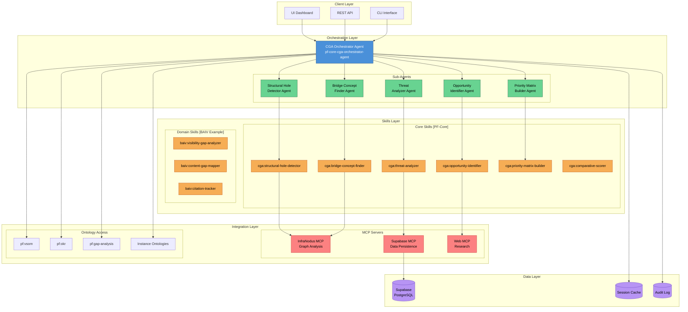
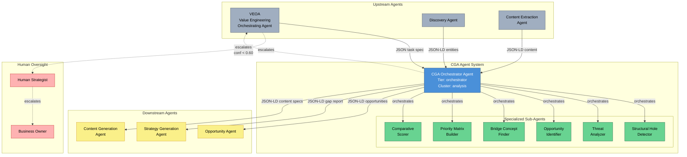
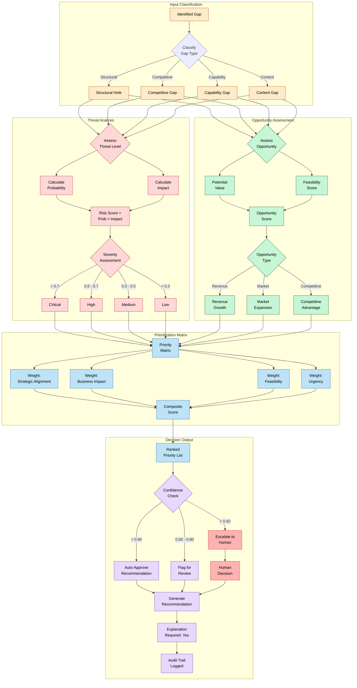
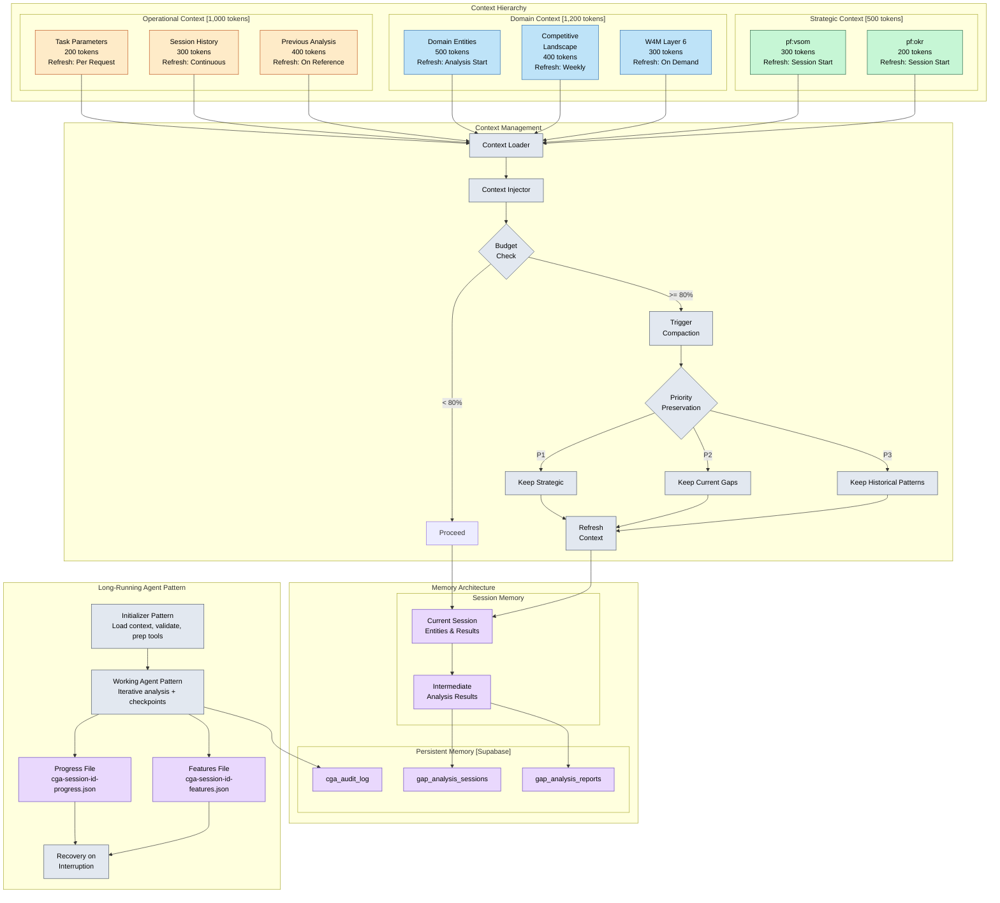
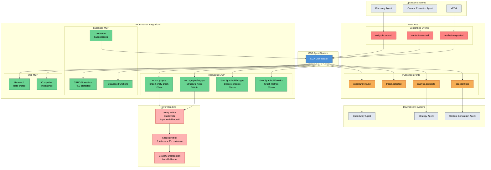
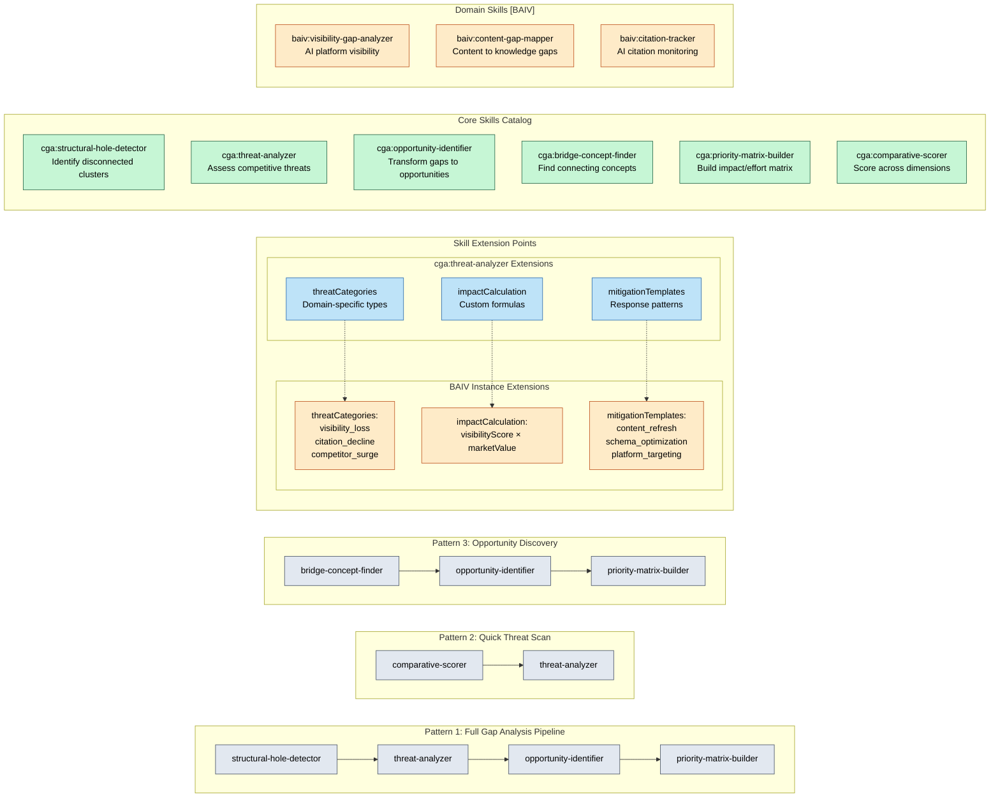
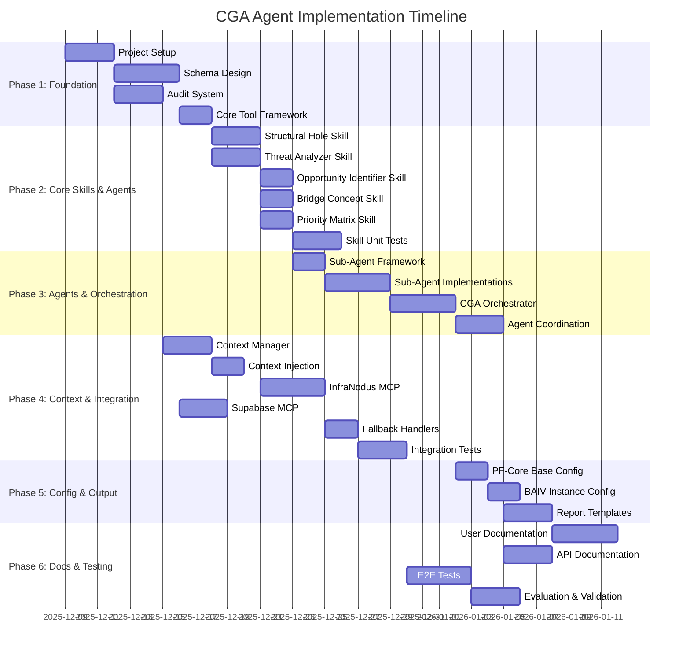
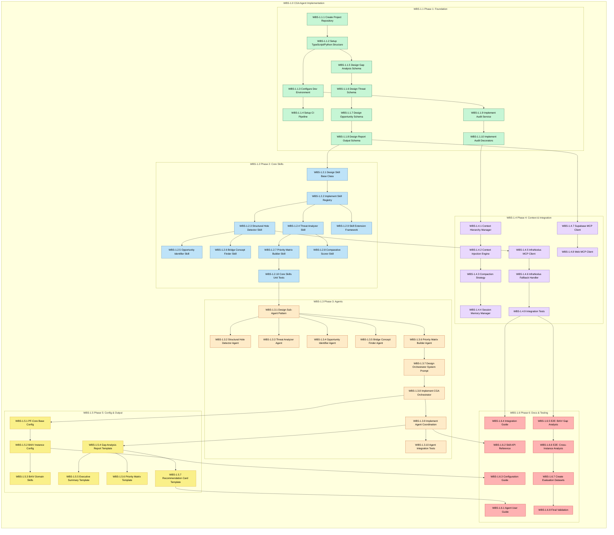

# PF-Core: Comparative Gap Analysis Agent Visual Guide

## PBS & WBS for SDK Implementation

**Document ID:** VIS-CGA-001
**Version:** 1.0.0
**Status:** Draft
**Author:** Platform Foundation
**Date:** December 6, 2025
**Source PRD:** PRD-CGA-001 v1.0.0

---

## Table of Contents

1. [System Architecture Overview](#1-system-architecture-overview)
2. [Agent Hierarchy & Communication Flow](#2-agent-hierarchy--communication-flow)
3. [Gap Analysis Processing Pipeline](#3-gap-analysis-processing-pipeline)
4. [Decision Framework Flow](#4-decision-framework-flow)
5. [Context & Memory Architecture](#5-context--memory-architecture)
6. [Integration Points & Event Flow](#6-integration-points--event-flow)
7. [Skill Composition Patterns](#7-skill-composition-patterns)
8. [Product Breakdown Structure (PBS)](#8-product-breakdown-structure-pbs)
9. [Work Breakdown Structure (WBS)](#9-work-breakdown-structure-wbs)

---

## 1. System Architecture Overview

The Comparative Gap Analysis (CGA) Agent System is designed as a domain-agnostic, reusable analysis framework built on the Claude Agent SDK. The architecture follows a layered approach where the core gap analysis capabilities are separated from domain-specific implementations, allowing the same skills to be reused across different PF-Instances such as BAIV (AI Visibility), AIR (AI Readiness), and W4M (Works 4 Me).

The system consists of three primary layers: the Orchestration Layer that coordinates all analysis activities, the Skills Layer that provides reusable analytical capabilities, and the Integration Layer that connects to external services like InfraNodus for graph analysis and Supabase for data persistence. This separation of concerns ensures that adding new domain instances requires only configuration changes rather than core system modifications.

At the heart of the architecture sits the CGA Orchestrator Agent, which receives analysis requests, loads appropriate context from the ontology stores, coordinates the execution of specialized skills, and produces comprehensive gap analysis reports. The orchestrator maintains strategic alignment by continuously referencing VSOM (Vision, Strategy, Objectives, Measures) context and ensuring all recommendations map back to business objectives.



---

## 2. Agent Hierarchy & Communication Flow

The agent hierarchy follows a clear chain of command and responsibility, with the CGA Orchestrator at the apex receiving requests from upstream agents like VEOA (Value Engineering Orchestrating Agent) and delegating specialized tasks to purpose-built sub-agents. This hierarchical structure ensures clear accountability while maintaining flexibility in how individual analysis tasks are executed.

Each sub-agent in the system has a specific domain of expertise and is equipped with the skills necessary to perform its function autonomously. The Structural Hole Detector Agent specializes in identifying disconnected clusters in knowledge graphs, while the Threat Analyzer Agent focuses on assessing competitive threats from identified gaps. This specialization allows each agent to maintain focused context and produce higher quality outputs within their domain.

Communication between agents follows a publish-subscribe pattern through the event bus, enabling loose coupling and allowing multiple agents to respond to the same events. For example, when a gap is identified, both the Threat Analyzer and Opportunity Identifier may be triggered to assess different aspects of that gap. The escalation path ensures that decisions requiring human judgment are surfaced appropriately: CGA Orchestrator escalates to VEOA, which escalates to Human Strategist, who escalates to Business Owner.



---

## 3. Gap Analysis Processing Pipeline

The gap analysis processing pipeline represents the core workflow that transforms raw input data into actionable strategic recommendations. The pipeline is designed to be fault-tolerant, with graceful degradation at each stage ensuring that partial results are still valuable even when some components fail. For example, if InfraNodus becomes unavailable, the system falls back to local graph algorithms with appropriate confidence adjustments.

The pipeline begins with input validation and entity resolution, ensuring all references can be linked to known ontology entities. Domain context is then loaded to parameterize the analysis for the specific PF-Instance being analyzed. The core analysis phase runs multiple skills in parallel where possible: structural hole detection, threat analysis, and opportunity identification can all proceed simultaneously once the knowledge graph is constructed.

Results from each analysis skill are aggregated and fed into the priority matrix builder, which applies configurable weighting based on strategic alignment, business impact, and feasibility. The final stage generates recommendations with full traceability back to the gaps, threats, and opportunities they address. Each recommendation includes implementation phases, dependencies, and expected outcomes with measurable metrics.

```mermaid
flowchart TB
    subgraph "1. Input Processing"
        IN[Analysis Request] --> VAL{Validate<br/>Input Schema}
        VAL -->|Valid| RES[Resolve Entity<br/>References]
        VAL -->|Invalid| ERR1[Return<br/>Validation Errors]
        RES --> CTX[Load Domain<br/>Context]
        CTX --> CHK{Check Graph<br/>Connectivity}
        CHK -->|Connected| VSM[Inject VSOM<br/>Context]
        CHK -->|Disconnected| RETRY[Queue for<br/>Retry/Degrade]
    end

    subgraph "2. Graph Construction"
        VSM --> BLD[Build Knowledge<br/>Graph]
        RETRY --> BLD
        BLD --> ENR[Enrich with<br/>External Data]
        ENR --> NORM[Normalize<br/>Graph Structure]
    end

    subgraph "3. Gap Detection"
        NORM --> PAR1[Parallel Analysis]

        subgraph "Concurrent Skills"
            direction LR
            SHD[Structural Hole<br/>Detection]
            MET[Graph Metrics<br/>Calculation]
            COM[Competitor<br/>Comparison]
        end

        PAR1 --> SHD
        PAR1 --> MET
        PAR1 --> COM

        SHD --> AGG1[Aggregate<br/>Detected Gaps]
        MET --> AGG1
        COM --> AGG1
    end

    subgraph "4. Analysis & Scoring"
        AGG1 --> PAR2[Parallel Assessment]

        subgraph "Assessment Skills"
            direction LR
            THR[Threat<br/>Analysis]
            OPP[Opportunity<br/>Identification]
            BRG[Bridge Concept<br/>Finding]
        end

        PAR2 --> THR
        PAR2 --> OPP
        PAR2 --> BRG

        THR --> SCR[Score & Rank<br/>All Items]
        OPP --> SCR
        BRG --> SCR
    end

    subgraph "5. Prioritization"
        SCR --> PMX[Build Priority<br/>Matrix]
        PMX --> QDR[Assign to<br/>Quadrants]

        subgraph "Priority Quadrants"
            direction LR
            QW[Quick Wins<br/>High Impact/Low Effort]
            MP[Major Projects<br/>High Impact/High Effort]
            FI[Fill-Ins<br/>Low Impact/Low Effort]
            HS[Hard Slogs<br/>Low Impact/High Effort]
        end

        QDR --> QW
        QDR --> MP
        QDR --> FI
        QDR --> HS
    end

    subgraph "6. Recommendation Generation"
        QW --> REC[Generate<br/>Recommendations]
        MP --> REC
        FI --> REC
        REC --> PHS[Define<br/>Implementation Phases]
        PHS --> MTR[Set Metrics<br/>& Targets]
    end

    subgraph "7. Output"
        MTR --> RPT[Compile<br/>Gap Analysis Report]
        RPT --> VAL2{Validate<br/>Output Schema}
        VAL2 -->|Valid| PUB[Publish to<br/>Supabase + UI]
        VAL2 -->|Invalid| FIX[Fix & Retry]
        PUB --> EVT[Emit Events:<br/>analysis.complete]
    end

    classDef input fill:#e2e8f0,stroke:#4a5568,color:#000
    classDef process fill:#bee3f8,stroke:#2b6cb0,color:#000
    classDef skill fill:#c6f6d5,stroke:#276749,color:#000
    classDef decision fill:#feebc8,stroke:#c05621,color:#000
    classDef output fill:#e9d8fd,stroke:#6b46c1,color:#000
    classDef error fill:#fed7d7,stroke:#c53030,color:#000

    class IN,VAL,RES,CTX,CHK,VSM input
    class BLD,ENR,NORM,AGG1,SCR,PMX,QDR,REC,PHS,MTR,RPT process
    class SHD,MET,COM,THR,OPP,BRG skill
    class VAL,CHK,VAL2 decision
    class PUB,EVT output
    class ERR1,RETRY,FIX error
```



---

## 4. Decision Framework Flow

The decision framework provides a structured approach to classifying gaps, assessing threats and opportunities, and prioritizing actions. The framework combines rules-based logic with ML-assisted scoring to achieve consistent, explainable decisions while benefiting from pattern recognition capabilities. Each decision point has explicit confidence thresholds that trigger escalation when the system cannot make a high-confidence determination autonomously.

The primary decision criteria include strategic alignment (how well does addressing this gap support VSOM objectives?), business impact (what is the revenue risk, competitive risk, or opportunity cost?), and feasibility (given current capabilities and resources, how achievable is the mitigation or opportunity capture?). These criteria are weighted according to instance-specific configuration, allowing different ventures to prioritize different factors.

Transparency is a core requirement of the decision framework. Every gap classification, threat assessment, and recommendation includes a full explanation of the reasoning chain, the evidence sources consulted, and the confidence level of the determination. This audit trail enables human reviewers to quickly validate or override decisions and builds trust in the system's recommendations over time.



---

## 5. Context & Memory Architecture

The context management system is critical for maintaining strategic coherence across analysis sessions while operating within the token budget constraints of LLM-based agents. The architecture implements a three-tier context hierarchy: Strategic Context from PF-Core (VSOM, OKRs) that rarely changes, Domain Context from the specific PF-Instance being analyzed that changes per analysis, and Operational Context from the current session that evolves continuously.

The total context budget of 2,700 tokens is carefully allocated across these tiers, with Strategic Context receiving 500 tokens for stable strategic guidance, Domain Context receiving 1,200 tokens for instance-specific knowledge, and Operational Context receiving 1,000 tokens for current task parameters and history. When context consumption reaches 80% of budget (2,160 tokens), the compaction strategy triggers, preserving strategic context with highest priority.

Session memory maintains current analysis entities and intermediate results for the duration of an analysis session, while persistent memory stored in Supabase preserves completed analyses and learned patterns across sessions. The long-running agent pattern uses progress files to enable checkpoint saves during complex analyses, allowing the system to recover gracefully from interruptions and resume analysis without losing work.



---

## 6. Integration Points & Event Flow

The integration architecture connects the CGA Agent System to three primary MCP (Model Context Protocol) servers that provide specialized capabilities. InfraNodus MCP provides graph analysis services including structural hole detection and bridge concept finding. Supabase MCP enables data persistence with RLS-protected queries. Web MCP supports competitor research and market intelligence gathering with appropriate rate limiting.

The event bus implements a publish-subscribe pattern that decouples agent communication and enables reactive workflows. The CGA system publishes events such as `gap.identified`, `threat.detected`, `opportunity.found`, and `analysis.complete`. It subscribes to events from upstream systems including `entity.discovered`, `content.extracted`, and `analysis.requested`. This event-driven architecture allows new agents to be added without modifying existing components.

Error handling for external integrations follows a consistent pattern: retry with exponential backoff (3 retries with 2s, 4s, 8s delays), circuit breaker protection (5 failures trigger 60-second cooldown), and graceful degradation to local fallbacks when external services are unavailable. For example, when InfraNodus is unavailable, the system falls back to local NetworkX calculations for betweenness centrality with appropriate confidence adjustments in the output.



---

## 7. Skill Composition Patterns

The skill composition system enables flexible construction of analysis workflows by chaining reusable skills in different patterns. Each skill is designed as an independent unit with well-defined inputs and outputs, allowing them to be composed in various sequences depending on the analysis requirements. This composability is key to the system's reusability across different PF-Instances.

Three primary composition patterns are defined: the Full Gap Analysis Pipeline for comprehensive analysis (structural-hole-detector → threat-analyzer → opportunity-identifier → priority-matrix-builder), the Quick Threat Scan for rapid competitive assessment (comparative-scorer → threat-analyzer), and the Opportunity Discovery pattern for innovation-focused analysis (bridge-concept-finder → opportunity-identifier → priority-matrix-builder). Each pattern can be invoked as a named workflow.

Skills expose extension points that allow domain-specific customization without modifying the core skill implementation. For example, the threat-analyzer skill has extension points for threatCategories (domain-specific threat types), impactCalculation (custom impact formulas), and mitigationTemplates (domain-specific response patterns). The BAIV instance extends these with visibility_loss, citation_decline, and competitor_surge threat categories specific to AI visibility analysis.



---

## 8. Product Breakdown Structure (PBS)

The Product Breakdown Structure decomposes the CGA Agent System into deliverable components organized hierarchically from the complete system down to individual files. Each PBS element maps directly to PRD requirements and forms the basis for the Work Breakdown Structure. The PBS follows the same structure used for other PF-Core agents to ensure consistency across the platform.

The decomposition identifies ten major component areas: Core Agent System (orchestrator, configuration, conversation handling, audit), Sub-Agent Suite (specialized analysis agents), Skill Library (reusable analytical capabilities), Context Management System (hierarchy, injection, compaction), Ontology Schemas (gap analysis data model, output schemas), MCP Integrations (InfraNodus, Supabase, Web), Instance Configurations (BAIV, AIR, W4M parameterization), Output Templates (report generation, visualization), Documentation (user guides, API reference), and Testing & Validation (unit, integration, E2E tests).

The PBS prioritization follows MoSCoW methodology, with Must Have items required for MVP functionality (core agent, key skills, essential integrations), Should Have items providing important but not critical capabilities (additional skills, enhanced reporting), Could Have items offering valuable enhancements (predictive forecasting, advanced visualization), and Won't Have items deferred to future releases (multi-language support, custom model training).

```mermaid
graph TB
    subgraph "PBS-1.0 Comparative Gap Analysis Agent System"
        direction TB

        subgraph "PBS-1.1 Core Agent System"
            PBS111[PBS-1.1.1<br/>CGA Orchestrator Agent]
            PBS112[PBS-1.1.2<br/>Agent Configuration Framework]
            PBS113[PBS-1.1.3<br/>Conversation Interface]
            PBS114[PBS-1.1.4<br/>Audit & Logging System]
        end

        subgraph "PBS-1.2 Sub-Agent Suite"
            PBS121[PBS-1.2.1<br/>Structural Hole Detector Agent]
            PBS122[PBS-1.2.2<br/>Threat Analyzer Agent]
            PBS123[PBS-1.2.3<br/>Opportunity Identifier Agent]
            PBS124[PBS-1.2.4<br/>Bridge Concept Finder Agent]
            PBS125[PBS-1.2.5<br/>Priority Matrix Builder Agent]
        end

        subgraph "PBS-1.3 Skill Library"
            PBS131[PBS-1.3.1<br/>Core Gap Analysis Skills]
            PBS132[PBS-1.3.2<br/>BAIV Domain Skills]
            PBS133[PBS-1.3.3<br/>Skill Extension Framework]
            PBS134[PBS-1.3.4<br/>Skill Registry]
        end

        subgraph "PBS-1.4 Context Management System"
            PBS141[PBS-1.4.1<br/>Context Hierarchy Manager]
            PBS142[PBS-1.4.2<br/>Context Injection Engine]
            PBS143[PBS-1.4.3<br/>Compaction Strategy]
            PBS144[PBS-1.4.4<br/>Session Memory Manager]
        end

        subgraph "PBS-1.5 Ontology Schemas"
            PBS151[PBS-1.5.1<br/>Gap Analysis Core Schema]
            PBS152[PBS-1.5.2<br/>Threat Assessment Schema]
            PBS153[PBS-1.5.3<br/>Opportunity Schema]
            PBS154[PBS-1.5.4<br/>Report Output Schema]
        end

        subgraph "PBS-1.6 MCP Integrations"
            PBS161[PBS-1.6.1<br/>InfraNodus MCP Connector]
            PBS162[PBS-1.6.2<br/>Supabase MCP Connector]
            PBS163[PBS-1.6.3<br/>Web MCP Connector]
            PBS164[PBS-1.6.4<br/>Fallback Handlers]
        end

        subgraph "PBS-1.7 Instance Configurations"
            PBS171[PBS-1.7.1<br/>PF-Core Base Config]
            PBS172[PBS-1.7.2<br/>BAIV Instance Config]
            PBS173[PBS-1.7.3<br/>AIR Instance Config]
            PBS174[PBS-1.7.4<br/>W4M Instance Config]
        end

        subgraph "PBS-1.8 Output Templates"
            PBS181[PBS-1.8.1<br/>Gap Analysis Report Template]
            PBS182[PBS-1.8.2<br/>Executive Summary Template]
            PBS183[PBS-1.8.3<br/>Priority Matrix Visualization]
            PBS184[PBS-1.8.4<br/>Recommendation Cards]
        end

        subgraph "PBS-1.9 Documentation"
            PBS191[PBS-1.9.1<br/>Agent User Guide]
            PBS192[PBS-1.9.2<br/>Skill API Reference]
            PBS193[PBS-1.9.3<br/>Configuration Guide]
            PBS194[PBS-1.9.4<br/>Integration Guide]
        end

        subgraph "PBS-1.10 Testing & Validation"
            PBS1101[PBS-1.10.1<br/>Unit Tests]
            PBS1102[PBS-1.10.2<br/>Integration Tests]
            PBS1103[PBS-1.10.3<br/>E2E Scenario Tests]
            PBS1104[PBS-1.10.4<br/>Evaluation Datasets]
        end
    end

    classDef core fill:#4a90d9,stroke:#2c5282,color:#fff
    classDef subagent fill:#68d391,stroke:#276749,color:#000
    classDef skill fill:#f6ad55,stroke:#c05621,color:#000
    classDef context fill:#fc8181,stroke:#c53030,color:#000
    classDef schema fill:#e9d8fd,stroke:#6b46c1,color:#000
    classDef mcp fill:#faf089,stroke:#d69e2e,color:#000
    classDef config fill:#b2f5ea,stroke:#319795,color:#000
    classDef output fill:#fbb6ce,stroke:#b83280,color:#000
    classDef docs fill:#c6f6d5,stroke:#276749,color:#000
    classDef test fill:#e2e8f0,stroke:#4a5568,color:#000

    class PBS111,PBS112,PBS113,PBS114 core
    class PBS121,PBS122,PBS123,PBS124,PBS125 subagent
    class PBS131,PBS132,PBS133,PBS134 skill
    class PBS141,PBS142,PBS143,PBS144 context
    class PBS151,PBS152,PBS153,PBS154 schema
    class PBS161,PBS162,PBS163,PBS164 mcp
    class PBS171,PBS172,PBS173,PBS174 config
    class PBS181,PBS182,PBS183,PBS184 output
    class PBS191,PBS192,PBS193,PBS194 docs
    class PBS1101,PBS1102,PBS1103,PBS1104 test
```



### PBS Element Details

| PBS ID | Element | Description | PRD Reference | Deliverables |
|--------|---------|-------------|---------------|--------------|
| **PBS-1.1.1** | CGA Orchestrator Agent | Main Claude Agent SDK agent coordinating all analysis | P0.1, P0.2 | `agents/cga_orchestrator.py` |
| **PBS-1.1.2** | Agent Configuration Framework | System for configuring agent behavior and tool access | P0.5 | `agents/config/agent_config.yaml` |
| **PBS-1.1.3** | Conversation Interface | Natural language interaction layer | P0.3 | `agents/conversation.py` |
| **PBS-1.1.4** | Audit & Logging System | Immutable audit trail for all actions | P0.11 | `services/audit_service.py` |
| **PBS-1.2.1** | Structural Hole Detector Agent | Identifies disconnected clusters in graphs | P0.5.2 | `agents/sub_agents/structural_hole_agent.py` |
| **PBS-1.2.2** | Threat Analyzer Agent | Assesses competitive threats from gaps | P0.5.2 | `agents/sub_agents/threat_analyzer_agent.py` |
| **PBS-1.2.3** | Opportunity Identifier Agent | Transforms gaps into opportunities | P0.5.2 | `agents/sub_agents/opportunity_agent.py` |
| **PBS-1.2.4** | Bridge Concept Finder Agent | Finds connecting concepts | P0.5.2 | `agents/sub_agents/bridge_finder_agent.py` |
| **PBS-1.2.5** | Priority Matrix Builder Agent | Builds impact/effort matrices | P0.5.2 | `agents/sub_agents/priority_matrix_agent.py` |
| **PBS-1.3.1** | Core Gap Analysis Skills | Domain-agnostic reusable skills | Appendix A | `skills/core/` |
| **PBS-1.3.2** | BAIV Domain Skills | AI visibility specific skills | P0.5.3 | `skills/baiv/` |
| **PBS-1.3.3** | Skill Extension Framework | Extension points for customization | Appendix A.3 | `skills/framework/extensions.py` |
| **PBS-1.3.4** | Skill Registry | Skill discovery and registration | P0.5 | `skills/registry.py` |
| **PBS-1.4.1** | Context Hierarchy Manager | Manages 3-tier context hierarchy | P0.8.1 | `services/context_manager.py` |
| **PBS-1.4.2** | Context Injection Engine | Injects context into agent prompts | P0.3.3 | `services/context_injector.py` |
| **PBS-1.4.3** | Compaction Strategy | Context compaction when budget exceeded | P0.8.3 | `services/context_compactor.py` |
| **PBS-1.4.4** | Session Memory Manager | Session and persistent memory | P0.8.2 | `services/memory_manager.py` |
| **PBS-1.5.1** | Gap Analysis Core Schema | JSON-LD schema for gap data | P0.6.4 | `schemas/gap_analysis.schema.json` |
| **PBS-1.5.2** | Threat Assessment Schema | Schema for threat data | P0.6.1 | `schemas/threat_assessment.schema.json` |
| **PBS-1.5.3** | Opportunity Schema | Schema for opportunity data | P0.6.1 | `schemas/opportunity.schema.json` |
| **PBS-1.5.4** | Report Output Schema | Full report schema | P0.6.4 | `schemas/report.schema.json` |
| **PBS-1.6.1** | InfraNodus MCP Connector | Graph analysis integration | Appendix B | `integrations/infranodus_mcp.py` |
| **PBS-1.6.2** | Supabase MCP Connector | Data persistence integration | P0.10.3 | `integrations/supabase_mcp.py` |
| **PBS-1.6.3** | Web MCP Connector | Web research integration | P0.5.4 | `integrations/web_mcp.py` |
| **PBS-1.6.4** | Fallback Handlers | Graceful degradation handlers | P0.7.3 | `integrations/fallbacks/` |
| **PBS-1.7.1** | PF-Core Base Config | Base platform configuration | P0.1.4 | `config/pf-core.yaml` |
| **PBS-1.7.2** | BAIV Instance Config | BAIV-specific configuration | P0.9.5 | `config/instances/baiv.yaml` |
| **PBS-1.7.3** | AIR Instance Config | AIR-specific configuration | P0.9.5 | `config/instances/air.yaml` |
| **PBS-1.7.4** | W4M Instance Config | W4M-specific configuration | P0.9.5 | `config/instances/w4m.yaml` |
| **PBS-1.8.1** | Gap Analysis Report Template | Report generation template | P0.6.1 | `templates/report.jinja2` |
| **PBS-1.8.2** | Executive Summary Template | Summary generation | P0.6.1 | `templates/executive_summary.jinja2` |
| **PBS-1.8.3** | Priority Matrix Visualization | Matrix visualization | P0.6.1 | `templates/priority_matrix.jinja2` |
| **PBS-1.8.4** | Recommendation Cards | Recommendation display | P0.6.1 | `templates/recommendation_card.jinja2` |
| **PBS-1.9.1** | Agent User Guide | User documentation | P0.14.4 | `docs/user-guide.md` |
| **PBS-1.9.2** | Skill API Reference | Skill documentation | P0.14.4 | `docs/skill-api.md` |
| **PBS-1.9.3** | Configuration Guide | Configuration documentation | P0.14.4 | `docs/configuration.md` |
| **PBS-1.9.4** | Integration Guide | Integration documentation | P0.14.4 | `docs/integrations.md` |
| **PBS-1.10.1** | Unit Tests | Unit test suite | P0.13.1 | `tests/unit/` |
| **PBS-1.10.2** | Integration Tests | Integration test suite | P0.13.2 | `tests/integration/` |
| **PBS-1.10.3** | E2E Scenario Tests | End-to-end scenarios | P0.12 | `tests/e2e/` |
| **PBS-1.10.4** | Evaluation Datasets | Golden datasets for evaluation | P0.13.3 | `tests/eval/` |

### PBS Prioritization (MoSCoW)

**Must Have (MVP):**
| PBS ID | Element | Rationale |
|--------|---------|-----------|
| PBS-1.1.1 | CGA Orchestrator Agent | Core functionality |
| PBS-1.2.1 | Structural Hole Detector | Primary gap detection |
| PBS-1.2.2 | Threat Analyzer | Essential threat assessment |
| PBS-1.3.1 | Core Gap Analysis Skills | Reusable analysis foundation |
| PBS-1.4.1 | Context Hierarchy Manager | Context management |
| PBS-1.5.1 | Gap Analysis Core Schema | Data structure |
| PBS-1.6.1 | InfraNodus MCP Connector | Graph analysis capability |
| PBS-1.6.2 | Supabase MCP Connector | Data persistence |

**Should Have (Phase 2):**
| PBS ID | Element | Rationale |
|--------|---------|-----------|
| PBS-1.2.3 | Opportunity Identifier | Value creation |
| PBS-1.2.4 | Bridge Concept Finder | Enhanced analysis |
| PBS-1.2.5 | Priority Matrix Builder | Prioritization |
| PBS-1.3.2 | BAIV Domain Skills | Instance specialization |
| PBS-1.7.2 | BAIV Instance Config | Initial instance |

**Could Have (Phase 3):**
| PBS ID | Element | Rationale |
|--------|---------|-----------|
| PBS-1.7.3, PBS-1.7.4 | AIR/W4M Configs | Additional instances |
| PBS-1.8.3 | Priority Matrix Visualization | Enhanced output |
| PBS-1.9.1-4 | Documentation | Full docs |

---

## 9. Work Breakdown Structure (WBS)

The Work Breakdown Structure decomposes the PBS elements into actionable tasks with dependencies, creating a comprehensive implementation plan. The WBS is organized into five phases: Foundation (project setup, schemas, core infrastructure), Core Skills & Agents (skill implementation, sub-agents), Context & Integration (context management, MCP connectors), Instance Configuration & Templates (parameterization, output templates), and Documentation & Testing (documentation, test suites, validation).

Each WBS task includes effort estimates, dependencies on prior tasks, and specific deliverables. The critical path runs through the core orchestrator implementation, as most subsequent work depends on having a functional agent framework in place. Parallel work streams are identified where tasks have no dependencies, allowing multiple developers to work concurrently on skills, integrations, and tests.

The WBS follows test-driven development principles, with test tasks integrated throughout rather than concentrated at the end. Each major component has associated unit tests that must pass before the component is considered complete. Integration tests validate the interactions between components, and E2E scenario tests validate complete workflows against the golden datasets defined in the PRD.



### WBS Detailed Task Breakdown



### WBS Task Details

| WBS ID | Task | PBS Ref | Dependencies | Deliverable |
|--------|------|---------|--------------|-------------|
| **Phase 1: Foundation** |||||
| WBS-1.1.1 | Create Project Repository | PBS-1.1 | None | GitHub repo |
| WBS-1.1.2 | Setup TypeScript/Python Structure | PBS-1.1 | WBS-1.1.1 | src/ structure, package.json |
| WBS-1.1.3 | Configure Dev Environment | PBS-1.1 | WBS-1.1.2 | .env.example, dev setup |
| WBS-1.1.4 | Setup CI Pipeline | PBS-1.10 | WBS-1.1.3 | .github/workflows/ci.yml |
| WBS-1.1.5 | Design Gap Analysis Schema | PBS-1.5.1 | WBS-1.1.2 | gap_analysis.schema.json |
| WBS-1.1.6 | Design Threat Schema | PBS-1.5.2 | WBS-1.1.5 | threat_assessment.schema.json |
| WBS-1.1.7 | Design Opportunity Schema | PBS-1.5.3 | WBS-1.1.6 | opportunity.schema.json |
| WBS-1.1.8 | Design Report Output Schema | PBS-1.5.4 | WBS-1.1.7 | report.schema.json |
| WBS-1.1.9 | Implement Audit Service | PBS-1.1.4 | WBS-1.1.3 | audit_service.py |
| WBS-1.1.10 | Implement Audit Decorators | PBS-1.1.4 | WBS-1.1.9 | @audit_action decorator |
| **Phase 2: Core Skills** |||||
| WBS-1.2.1 | Design Skill Base Class | PBS-1.3.3 | WBS-1.1.8 | base_skill.py |
| WBS-1.2.2 | Implement Skill Registry | PBS-1.3.4 | WBS-1.2.1 | skill_registry.py |
| WBS-1.2.3 | Structural Hole Detector Skill | PBS-1.3.1 | WBS-1.2.2 | structural_hole_detector.py |
| WBS-1.2.4 | Threat Analyzer Skill | PBS-1.3.1 | WBS-1.2.2 | threat_analyzer.py |
| WBS-1.2.5 | Opportunity Identifier Skill | PBS-1.3.1 | WBS-1.2.3 | opportunity_identifier.py |
| WBS-1.2.6 | Bridge Concept Finder Skill | PBS-1.3.1 | WBS-1.2.3 | bridge_concept_finder.py |
| WBS-1.2.7 | Priority Matrix Builder Skill | PBS-1.3.1 | WBS-1.2.4 | priority_matrix_builder.py |
| WBS-1.2.8 | Comparative Scorer Skill | PBS-1.3.1 | WBS-1.2.4 | comparative_scorer.py |
| WBS-1.2.9 | Skill Extension Framework | PBS-1.3.3 | WBS-1.2.2 | extensions.py |
| WBS-1.2.10 | Core Skills Unit Tests | PBS-1.10.1 | WBS-1.2.7 | tests/unit/skills/ |
| **Phase 3: Agents** |||||
| WBS-1.3.1 | Design Sub-Agent Pattern | PBS-1.2 | WBS-1.2.10 | sub_agent_base.py |
| WBS-1.3.2 | Structural Hole Detector Agent | PBS-1.2.1 | WBS-1.3.1 | structural_hole_agent.py |
| WBS-1.3.3 | Threat Analyzer Agent | PBS-1.2.2 | WBS-1.3.1 | threat_analyzer_agent.py |
| WBS-1.3.4 | Opportunity Identifier Agent | PBS-1.2.3 | WBS-1.3.1 | opportunity_agent.py |
| WBS-1.3.5 | Bridge Concept Finder Agent | PBS-1.2.4 | WBS-1.3.1 | bridge_finder_agent.py |
| WBS-1.3.6 | Priority Matrix Builder Agent | PBS-1.2.5 | WBS-1.3.1 | priority_matrix_agent.py |
| WBS-1.3.7 | Design Orchestrator System Prompt | PBS-1.1.1 | WBS-1.3.6 | system_prompt.md |
| WBS-1.3.8 | Implement CGA Orchestrator | PBS-1.1.1 | WBS-1.3.7 | cga_orchestrator.py |
| WBS-1.3.9 | Implement Agent Coordination | PBS-1.1.1 | WBS-1.3.8 | agent_coordinator.py |
| WBS-1.3.10 | Agent Integration Tests | PBS-1.10.2 | WBS-1.3.9 | tests/integration/agents/ |
| **Phase 4: Context & Integration** |||||
| WBS-1.4.1 | Context Hierarchy Manager | PBS-1.4.1 | WBS-1.1.10 | context_manager.py |
| WBS-1.4.2 | Context Injection Engine | PBS-1.4.2 | WBS-1.4.1 | context_injector.py |
| WBS-1.4.3 | Compaction Strategy | PBS-1.4.3 | WBS-1.4.2 | context_compactor.py |
| WBS-1.4.4 | Session Memory Manager | PBS-1.4.4 | WBS-1.4.3 | memory_manager.py |
| WBS-1.4.5 | InfraNodus MCP Client | PBS-1.6.1 | WBS-1.2.3 | infranodus_mcp.py |
| WBS-1.4.6 | InfraNodus Fallback Handler | PBS-1.6.4 | WBS-1.4.5 | infranodus_fallback.py |
| WBS-1.4.7 | Supabase MCP Client | PBS-1.6.2 | WBS-1.1.8 | supabase_mcp.py |
| WBS-1.4.8 | Web MCP Client | PBS-1.6.3 | WBS-1.4.7 | web_mcp.py |
| WBS-1.4.9 | Integration Tests | PBS-1.10.2 | WBS-1.4.6 | tests/integration/mcp/ |
| **Phase 5: Config & Output** |||||
| WBS-1.5.1 | PF-Core Base Config | PBS-1.7.1 | WBS-1.3.8 | config/pf-core.yaml |
| WBS-1.5.2 | BAIV Instance Config | PBS-1.7.2 | WBS-1.5.1 | config/instances/baiv.yaml |
| WBS-1.5.3 | BAIV Domain Skills | PBS-1.3.2 | WBS-1.5.2 | skills/baiv/ |
| WBS-1.5.4 | Gap Analysis Report Template | PBS-1.8.1 | WBS-1.3.9 | templates/report.jinja2 |
| WBS-1.5.5 | Executive Summary Template | PBS-1.8.2 | WBS-1.5.4 | templates/executive_summary.jinja2 |
| WBS-1.5.6 | Priority Matrix Template | PBS-1.8.3 | WBS-1.5.4 | templates/priority_matrix.jinja2 |
| WBS-1.5.7 | Recommendation Card Template | PBS-1.8.4 | WBS-1.5.4 | templates/recommendation.jinja2 |
| **Phase 6: Docs & Testing** |||||
| WBS-1.6.1 | Agent User Guide | PBS-1.9.1 | WBS-1.5.7 | docs/user-guide.md |
| WBS-1.6.2 | Skill API Reference | PBS-1.9.2 | WBS-1.3.9 | docs/skill-api.md |
| WBS-1.6.3 | Configuration Guide | PBS-1.9.3 | WBS-1.5.2 | docs/configuration.md |
| WBS-1.6.4 | Integration Guide | PBS-1.9.4 | WBS-1.4.9 | docs/integrations.md |
| WBS-1.6.5 | E2E: BAIV Gap Analysis | PBS-1.10.3 | WBS-1.4.9 | tests/e2e/test_baiv_analysis.py |
| WBS-1.6.6 | E2E: Cross-Instance Analysis | PBS-1.10.3 | WBS-1.6.5 | tests/e2e/test_cross_instance.py |
| WBS-1.6.7 | Create Evaluation Datasets | PBS-1.10.4 | WBS-1.6.6 | tests/eval/ |
| WBS-1.6.8 | Final Validation | PBS-1.10 | WBS-1.6.7 | Validation report |

### Critical Path

The critical path for the CGA Agent implementation runs through:

```
WBS-1.1.5 → WBS-1.2.1 → WBS-1.2.2 → WBS-1.2.3 → WBS-1.2.5 → WBS-1.3.1 →
WBS-1.3.6 → WBS-1.3.7 → WBS-1.3.8 → WBS-1.3.9 → WBS-1.5.4 → WBS-1.6.1
```

**Schema Design → Skill Framework → Core Skills → Sub-Agent Pattern → Orchestrator → Templates → Documentation**

---

## Document Approval

| Role | Name | Date | Signature |
|------|------|------|-----------|
| Author | Platform Foundation Architecture | Dec 6, 2025 | |
| Technical Reviewer | | | |
| Product Owner | | | |

---

## Version History

| Version | Date | Changes | Author |
|---------|------|---------|--------|
| 1.0.0 | 2025-12-06 | Initial visual guide with PBS/WBS | Platform Foundation |

---

*Document Version: 1.0.0 | Framework: PF-Core v3.0 | Source: PRD-CGA-001*
