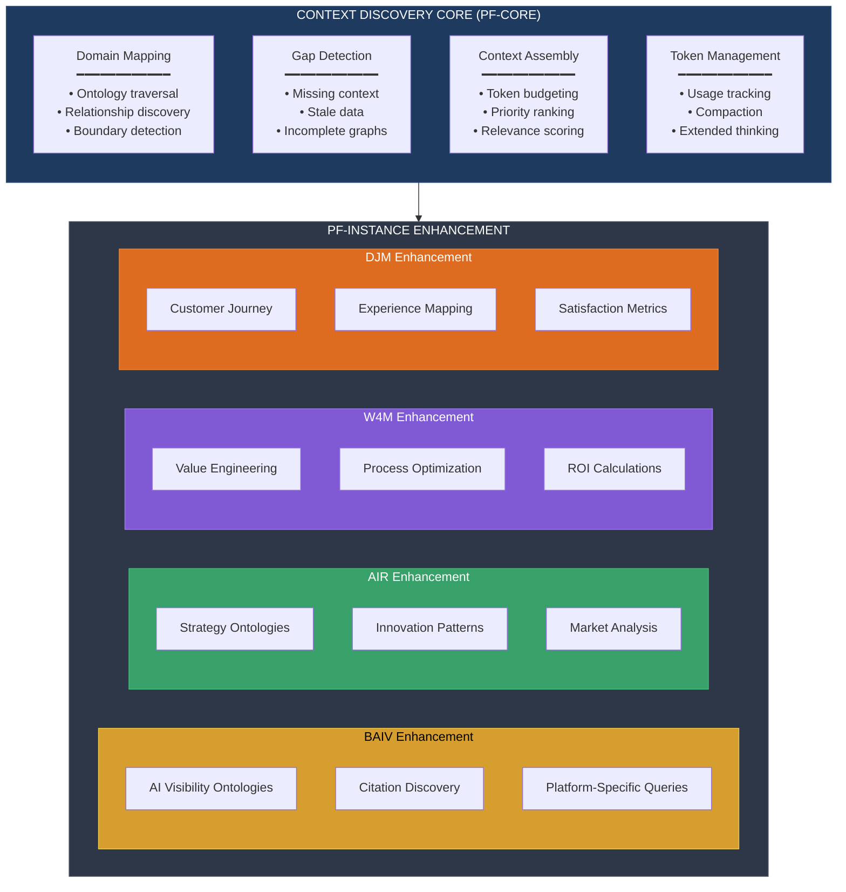
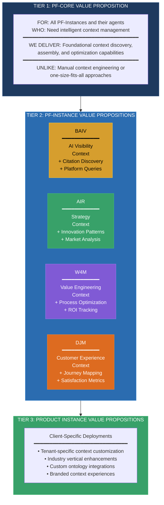
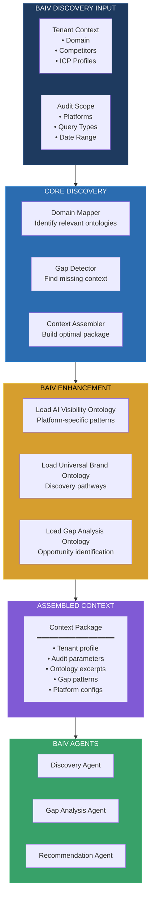
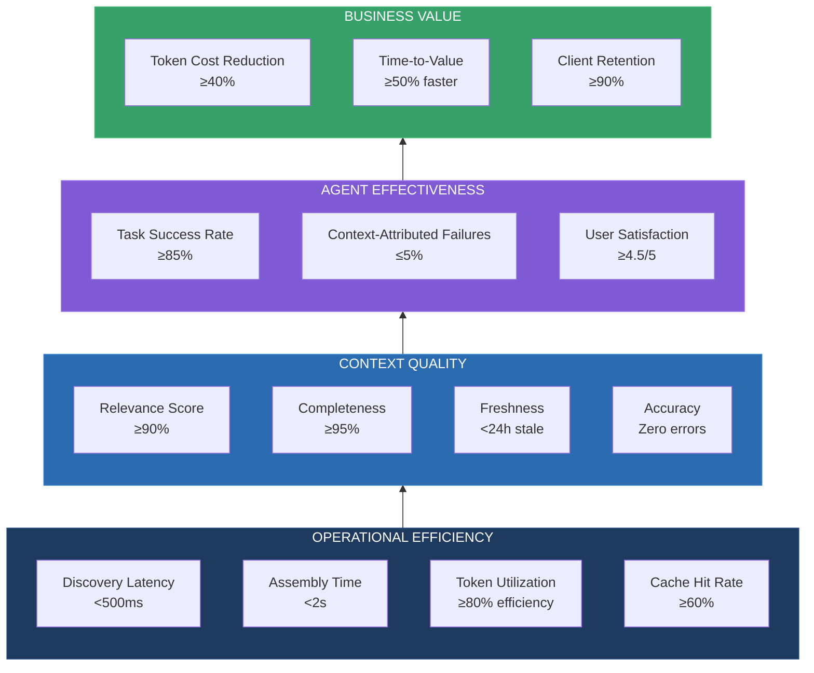

# PF-Core Context Engineering
## Value Engineering OKR Framework

**Strategic Context Integration: RRR + VSOM + OKR for Discovery-Enabled Agents**

---

### Document Controls

| Attribute | Value |
|-----------|-------|
| Document ID | **PF-CORE-CE-VE-OKR-001** |
| Document Title | Context Engineering Value Engineering OKR Framework |
| Document Type | **VSOM** (Vision, Strategy, Objectives, Metrics) |
| Document Version | **1.0.0** |
| Version Date | 01 December 2025 |
| Status | DRAFT |
| Platform | **PF-CORE** (Platform Foundation Core) |
| Platform Instances | AIR, BAIV, W4M, DJM |
| Parent Documents | PF-CORE-CE-EXP-001 v1.4, PF-CORE-VSOM-PRD v1.0 |
| Ontology References | ONT-VSOM-0001, ONT-CTXE-0001, ONT-RRR-0001, ONT-VP-0001 |

### Change Log

| Version | Date | Author | Changes |
|---------|------|--------|---------|
| **1.0.0** | **01 Dec 2025** | **PF-CORE Architecture** | **Initial VE OKR framework; RRR integration model; Discovery Core + Enhancement pattern; BAIV exemplar; Value Proposition cascade** |

---

## Executive Summary

This document establishes the **Value Engineering OKR Framework** for Context Engineering, integrating:

- **RRR (Requirements, Risks, Resources)** as foundational context inputs
- **VSOM (Vision, Strategy, Objectives, Metrics)** as strategic alignment layer
- **OKR (Objectives & Key Results)** as operational execution cascade

The framework enables **Context Discovery** with a dual-layer approach:
1. **Core Discovery Functions** — Platform-wide, reusable across all PF-Instances
2. **PF-Instance Enhancement** — Domain-specific customization (BAIV, AIR, W4M, DJM)

**BAIV** serves as the first implementation exemplar, demonstrating how the Context Engineer Agent delivers value through AI Visibility-specific context assembly.

---

## 1. RRR Framework Integration

### 1.1 RRR as Strategic Context Inputs

The **Requirements, Risks, Resources (RRR)** framework provides essential contextual inputs that enable intelligent agent decision-making:

```mermaid
flowchart LR
    subgraph RRR["RRR CONTEXT INPUTS"]
        direction TB
        REQ["REQUIREMENTS<br/>━━━━━━━━━━━━<br/>• Functional specs<br/>• Constraints<br/>• Dependencies<br/>• Acceptance criteria"]
        RISK["RISKS<br/>━━━━━━━━━━━━<br/>• Technical risks<br/>• Business risks<br/>• Mitigation plans<br/>• Probability/Impact"]
        RES["RESOURCES<br/>━━━━━━━━━━━━<br/>• Token budgets<br/>• API limits<br/>• Human capital<br/>• Time constraints"]
    end
    
    RRR --> VSOM
    
    subgraph VSOM["VSOM STRATEGIC LAYER"]
        direction TB
        VIS["Vision & Mission"]
        STRAT["Strategic Objectives"]
        OPS["Operational Strategies"]
        MET["Metrics & KPIs"]
    end
    
    VSOM --> OKR
    
    subgraph OKR["OKR EXECUTION"]
        direction TB
        OBJ["Objectives"]
        KR["Key Results"]
        INIT["Initiatives"]
    end
    
    OKR --> AGENT["Context Engineer Agent"]
    
    style RRR fill:#1e3a5f,stroke:#2c5282,color:#fff
    style VSOM fill:#2b6cb0,stroke:#3182ce,color:#fff
    style OKR fill:#38a169,stroke:#48bb78,color:#fff
    style AGENT fill:#805ad5,stroke:#9f7aea,color:#fff
```



### 1.2 RRR Ontology Structure (ONT-RRR-0001)

```json
{
  "@context": {
    "schema": "https://schema.org/",
    "pf": "https://ontology.pf-core.io/",
    "rrr": "https://ontology.pf-core.io/rrr/"
  },
  "@type": "rrr:ContextInputFramework",
  "version": "1.0.0",
  
  "requirements": {
    "@type": "rrr:RequirementsSet",
    "functional": {
      "@type": "rrr:FunctionalRequirements",
      "capabilities": ["Array of required capabilities"],
      "constraints": ["Array of technical/business constraints"],
      "dependencies": {
        "upstream": ["Dependencies this component requires"],
        "downstream": ["Components that depend on this"]
      },
      "acceptanceCriteria": ["Measurable criteria for completion"]
    },
    "nonFunctional": {
      "@type": "rrr:NonFunctionalRequirements",
      "performance": {"latency": "number", "throughput": "number"},
      "scalability": {"concurrent_users": "number", "data_volume": "string"},
      "security": {"classification": "string", "compliance": ["Array"]}
    }
  },
  
  "risks": {
    "@type": "rrr:RiskRegistry",
    "technical": [
      {
        "@type": "rrr:Risk",
        "id": "string",
        "description": "string",
        "probability": "high|medium|low",
        "impact": "critical|high|medium|low",
        "mitigation": "string",
        "owner": "string",
        "status": "open|mitigating|closed"
      }
    ],
    "business": ["Same structure as technical"],
    "operational": ["Same structure as technical"]
  },
  
  "resources": {
    "@type": "rrr:ResourceAllocation",
    "compute": {
      "tokenBudget": {
        "perRequest": "number",
        "daily": "number",
        "monthly": "number"
      },
      "apiLimits": {
        "rateLimit": "requests per minute",
        "dailyQuota": "number"
      }
    },
    "human": {
      "roles": ["Array of required roles"],
      "allocation": {"role": "FTE or hours"}
    },
    "financial": {
      "budget": "number",
      "costCenter": "string"
    },
    "temporal": {
      "deadline": "ISO date",
      "milestones": [{"name": "string", "date": "ISO date"}]
    }
  }
}
```

### 1.3 RRR → VSOM → OKR Cascade

| RRR Input | VSOM Mapping | OKR Translation |
|-----------|--------------|-----------------|
| **Functional Requirements** | Strategic Objectives (Internal Process) | Key Results with capability metrics |
| **Constraints** | Context Engineering parameters | Objective constraints and guardrails |
| **Dependencies** | Strategy hierarchy relationships | Cross-functional OKR alignment |
| **Technical Risks** | Risk mitigation strategies | Leading indicators for early warning |
| **Business Risks** | BSC Financial/Customer perspectives | Lagging indicators for outcome tracking |
| **Token Budgets** | Resource allocation strategy | Cost optimization Key Results |
| **Human Capital** | Learning & Growth objectives | Capability development initiatives |
| **Time Constraints** | Timeframe and milestones | Quarterly OKR cadence alignment |

---

## 2. Context Discovery Architecture

### 2.1 Core + PF-Instance Enhancement Pattern

Following the **Milana Discovery Model**, Context Engineering implements a dual-layer architecture:



### 2.2 Discovery Function Specifications

#### Core Discovery Functions (Platform-Wide)

| Function | Purpose | Input | Output |
|----------|---------|-------|--------|
| `discoverDomainOntologies()` | Map available ontologies for domain | Domain identifier, scope | Ontology graph with relationships |
| `detectContextGaps()` | Identify missing or stale context | Current context, requirements | Gap report with severity |
| `rankContextRelevance()` | Score context elements by relevance | Context candidates, objective | Ranked list with scores |
| `assembleOptimalContext()` | Build token-optimized context package | Ranked elements, token budget | Assembled context JSON |
| `validateContextBoundaries()` | Ensure context respects instance scope | Context package, instance config | Validation result |

#### PF-Instance Enhancement Functions (Domain-Specific)

**BAIV Enhancements:**

| Function | Purpose | Input | Output |
|----------|---------|-------|--------|
| `discoverAIVisibilityContext()` | Load AI visibility ontologies | Tenant ID, audit scope | Visibility context package |
| `detectCitationOpportunities()` | Find citation gaps vs competitors | Domain, platforms, competitors | Citation opportunity map |
| `assemblePlatformQueries()` | Build platform-specific query sets | ICP profiles, journey stage | Query classification set |
| `discoverContentGaps()` | Identify content opportunities | Gap analysis, RRF scores | Prioritized gap list |

---

## 3. Value Engineering OKR: Context Engineering

### 3.1 Strategic Alignment

> **VISION ALIGNMENT**
>
> *Context Engineering enables "Right Context, Right Time, Right Agent, Right Instance" — delivering measurably superior AI agent performance through intelligent context discovery, assembly, and optimization.*

### 3.2 Annual Objective (2026)

> **ANNUAL OBJECTIVE**
>
> *"Establish Context Engineering as the foundational capability that enables all PF-Instance agents to autonomously discover, assemble, and optimize context for superior task performance."*

### 3.3 Annual Key Results

| KR ID | Key Result | Baseline | Target | Weight |
|-------|------------|----------|--------|--------|
| **KR-CE-2026-001** | Deploy Context Discovery Core to all 4 PF-Instances | 0 | 4 | 20% |
| **KR-CE-2026-002** | Achieve ≥40% token cost reduction through intelligent assembly | 100% | ≤60% | 20% |
| **KR-CE-2026-003** | Reduce context-related agent failures by ≥80% | TBD | ≥80% reduction | 15% |
| **KR-CE-2026-004** | Implement PF-Instance enhancements for BAIV and W4M | 0 | 2 | 15% |
| **KR-CE-2026-005** | Achieve ≥90% context relevance score in agent evaluations | N/A | ≥90% | 15% |
| **KR-CE-2026-006** | Complete RRR → VSOM → OKR integration with 100% traceability | 0% | 100% | 15% |

### 3.4 Q4 2025 OKR: Foundation Phase

> **Q4 2025 OBJECTIVE**
>
> *"Establish Context Discovery Core capabilities and deploy BAIV as first PF-Instance enhancement."*

| KR ID | Key Result | Target | Owner |
|-------|------------|--------|-------|
| **KR-Q4-CE-001** | Complete Context Discovery Core with 4 core functions | 100% functional | Context Engineering Lead |
| **KR-Q4-CE-002** | Implement RRR ontology (ONT-RRR-0001) | Ontology released | Ontology Architect |
| **KR-Q4-CE-003** | Deploy BAIV enhancement with AI Visibility integration | Production ready | BAIV Product Owner |
| **KR-Q4-CE-004** | Achieve ≥85% test coverage on Core functions | ≥85% coverage | Platform Engineer |
| **KR-Q4-CE-005** | Complete context awareness integration for Claude 4.5 | 100% activation | Platform Engineer |

### 3.5 Q1 2026 OKR: Expansion Phase

> **Q1 2026 OBJECTIVE**
>
> *"Expand Context Discovery to W4M instance and establish RRR → VSOM → OKR pipeline."*

| KR ID | Key Result | Target | Owner |
|-------|------------|--------|-------|
| **KR-Q1-CE-001** | Deploy W4M enhancement with Value Engineering integration | Production ready | W4M Product Owner |
| **KR-Q1-CE-002** | Implement VSOM ↔ Context bidirectional integration | Full cascade working | Platform Engineer |
| **KR-Q1-CE-003** | Reduce BAIV token costs by ≥25% through optimization | ≥25% reduction | Context Engineering Lead |
| **KR-Q1-CE-004** | Complete gap detection function with automated alerting | Zero missed gaps | Platform Engineer |
| **KR-Q1-CE-005** | Establish metrics dashboard for Context Engineering KPIs | Dashboard live | Analytics Lead |

---

## 4. Context Engineer Agent Specification

### 4.1 Agent Overview

The **Context Engineer Agent** is a PF-CORE foundational agent that:

1. **Discovers** relevant context from ontologies, databases, and external sources
2. **Assembles** optimal context packages within token budgets
3. **Manages** context lifecycle including caching, invalidation, and refresh
4. **Optimizes** based on usage patterns and performance feedback

### 4.2 Agent Architecture

```mermaid
flowchart TB
    subgraph INPUTS["CONTEXT INPUTS"]
        direction LR
        RRR_IN["RRR<br/>Requirements<br/>Risks<br/>Resources"]
        VSOM_IN["VSOM<br/>Vision<br/>Strategy<br/>Objectives"]
        OKR_IN["OKR<br/>Objectives<br/>Key Results"]
    end
    
    INPUTS --> AGENT
    
    subgraph AGENT["CONTEXT ENGINEER AGENT"]
        direction TB
        
        subgraph DISCOVER["Discovery Layer"]
            DM["Domain<br/>Mapper"]
            GD["Gap<br/>Detector"]
            RD["Relationship<br/>Discoverer"]
        end
        
        subgraph ASSEMBLE["Assembly Layer"]
            REL["Relevance<br/>Scorer"]
            TOK["Token<br/>Optimizer"]
            PKG["Context<br/>Packager"]
        end
        
        subgraph MANAGE["Management Layer"]
            CACHE["Cache<br/>Manager"]
            LIFE["Lifecycle<br/>Controller"]
            ALERT["Alert<br/>Handler"]
        end
        
        subgraph OPTIMIZE["Optimization Layer"]
            LEARN["Usage<br/>Learner"]
            TUNE["Auto<br/>Tuner"]
            REPORT["Performance<br/>Reporter"]
        end
        
        DISCOVER --> ASSEMBLE --> MANAGE --> OPTIMIZE
    end
    
    AGENT --> CONSUMERS
    
    subgraph CONSUMERS["DOWNSTREAM AGENTS"]
        direction LR
        BAIV_AG["BAIV<br/>Agents"]
        AIR_AG["AIR<br/>Agents"]
        W4M_AG["W4M<br/>Agents"]
        DJM_AG["DJM<br/>Agents"]
    end
    
    style INPUTS fill:#1e3a5f,stroke:#2c5282,color:#fff
    style AGENT fill:#2b6cb0,stroke:#3182ce,color:#fff
    style CONSUMERS fill:#38a169,stroke:#48bb78,color:#fff
    style DISCOVER fill:#805ad5,stroke:#9f7aea,color:#fff
    style ASSEMBLE fill:#d69e2e,stroke:#ecc94b,color:#000
    style MANAGE fill:#dd6b20,stroke:#ed8936,color:#fff
    style OPTIMIZE fill:#c53030,stroke:#e53e3e,color:#fff
```



### 4.3 Core Capabilities

| Capability | Description | PF-Core | PF-Instance |
|------------|-------------|---------|-------------|
| **Domain Mapping** | Traverse ontology graphs to identify relevant context domains | ✓ Core | Enhanced with domain-specific ontologies |
| **Gap Detection** | Identify missing, stale, or incomplete context | ✓ Core | Enhanced with instance-specific gap patterns |
| **Relevance Scoring** | Rank context elements by relevance to current task | ✓ Core | Enhanced with domain-specific relevance models |
| **Token Optimization** | Minimize token usage while maximizing context value | ✓ Core | Instance-specific token budgets |
| **Context Packaging** | Assemble context into optimized JSON-LD packages | ✓ Core | Instance-specific package structures |
| **Cache Management** | Manage context cache with intelligent invalidation | ✓ Core | Instance-specific cache policies |
| **Lifecycle Control** | Manage context freshness and refresh cycles | ✓ Core | Instance-specific lifecycle rules |
| **Usage Learning** | Learn from context usage patterns to improve future assembly | ✓ Core | Instance-specific learning models |

### 4.4 Claude Agent SDK Integration

```python
# Context Engineer Agent Configuration (Claude Agent SDK)
context_engineer_config = {
    "agent_id": "pf-core-context-engineer",
    "name": "Context Engineer",
    "description": "Foundational agent for context discovery, assembly, and optimization",
    
    "model": "claude-sonnet-4-20250514",
    "max_tokens": 8192,
    
    "system_prompt": """You are the Context Engineer Agent for PF-CORE.

Your responsibilities:
1. DISCOVER relevant context from available ontologies and data sources
2. ASSEMBLE optimal context packages within token budgets
3. MANAGE context lifecycle including caching and refresh
4. OPTIMIZE based on usage patterns and feedback

Context Engineering Principles:
- Right Context: Include only relevant information
- Right Time: Deliver context when needed, refresh proactively
- Right Agent: Customize context for consuming agent's needs
- Right Instance: Respect PF-Instance boundaries and customizations

RRR Integration:
- Check Requirements before context assembly
- Consider Risks in context selection
- Respect Resource constraints (especially token budgets)

VSOM Alignment:
- Context should enable strategic objective achievement
- Include relevant metrics and KPIs when appropriate
- Support BSC perspectives in context selection
""",
    
    "tools": [
        "ontology_traverser",
        "gap_detector",
        "relevance_scorer",
        "token_counter",
        "context_assembler",
        "cache_manager",
        "performance_reporter"
    ],
    
    "context_awareness": {
        "enabled": True,
        "budget_tracking": True,
        "tool_result_updates": True
    },
    
    "extended_thinking": {
        "enabled": True,
        "preserve_in_tool_use": True,
        "budget_tokens": 10000
    }
}
```

---

## 5. Value Proposition Cascade

### 5.1 Three-Tier Value Proposition Architecture

The Context Engineer delivers value at three levels, each building on the previous:



### 5.2 PF-CORE Value Proposition (Tier 1)

| Element | Value Statement |
|---------|-----------------|
| **FOR** | All PF-Instance Operators (AIR, BAIV, W4M, DJM), AI Agent Developers, Platform Customers |
| **WHO** | Need AI agents that maximize context window utilization with intelligent token management and continuous optimization |
| **THE** | PF-Core Context Engineer |
| **IS A** | Self-optimizing agentic system leveraging Anthropic's context awareness, extended thinking, and semantic governance |
| **THAT** | Discovers relevant knowledge, assembles optimal context, manages token budgets, and improves with every interaction |
| **UNLIKE** | Manual prompt engineering or generic context management that ignores context window mechanics |
| **WE DELIVER** | Measurably superior agent performance through deep Anthropic integration, proprietary ontology governance, and instance-specific customization |

### 5.3 BAIV Value Proposition (Tier 2 Exemplar)

| Element | Value Statement |
|---------|-----------------|
| **FOR** | CMOs, Marketing Teams, and Digital Agencies seeking AI Visibility |
| **WHO** | Need to understand and optimize their brand's presence in AI-powered search and recommendation systems |
| **THE** | BAIV Context-Enhanced Discovery Suite |
| **IS A** | AI Visibility platform powered by intelligent context engineering that delivers relevant insights from multi-platform discovery |
| **THAT** | Automatically discovers citation opportunities, identifies content gaps, and assembles optimized context for visibility agents |
| **UNLIKE** | Generic analytics tools that ignore AI platform dynamics and require manual context configuration |
| **WE DELIVER** | Actionable AI Visibility insights with 40%+ faster discovery, 50%+ token cost reduction, and measurably improved citation rates |

### 5.4 Product Instance Value Proposition (Tier 3)

| Element | Value Statement |
|---------|-----------------|
| **FOR** | Enterprise clients with specific industry, regulatory, or brand requirements |
| **WHO** | Need customized AI agent experiences that align with their unique business context |
| **THE** | Client-Specific Context Configuration |
| **IS A** | Tenant-isolated context environment with custom ontologies, industry-specific enhancements, and branded experiences |
| **THAT** | Delivers context tailored to client industry verticals, competitive landscapes, and strategic objectives |
| **UNLIKE** | Generic SaaS platforms that treat all clients identically regardless of context needs |
| **WE DELIVER** | 80/20 platform leverage with 20% customization yielding 100% client-specific context relevance |

---

## 6. BAIV Implementation Exemplar

### 6.1 BAIV-Specific RRR Context

```json
{
  "@context": {
    "pf": "https://ontology.pf-core.io/",
    "baiv": "https://ontology.baiv.io/",
    "rrr": "https://ontology.pf-core.io/rrr/"
  },
  "@type": "rrr:ContextInputFramework",
  "@id": "baiv:rrr-context-001",
  "instanceId": "BAIV",
  
  "requirements": {
    "functional": {
      "capabilities": [
        "AI platform visibility analysis",
        "Citation discovery and tracking",
        "Content gap identification",
        "Competitive benchmarking",
        "Query classification and optimization"
      ],
      "ontologyDependencies": [
        "ONT-AIV-0001 (AI Visibility)",
        "ONT-UB-0001 (Universal Brand)",
        "ONT-GAP-0001 (Gap Analysis)",
        "ONT-CMO-OKR-0001 (CMO OKR)"
      ]
    }
  },
  
  "risks": {
    "technical": [
      {
        "id": "BAIV-RISK-001",
        "description": "AI platform API rate limiting",
        "probability": "high",
        "impact": "medium",
        "mitigation": "Implement intelligent caching and request batching"
      },
      {
        "id": "BAIV-RISK-002",
        "description": "Context staleness for real-time visibility",
        "probability": "medium",
        "impact": "high",
        "mitigation": "Implement proactive refresh with freshness scoring"
      }
    ]
  },
  
  "resources": {
    "compute": {
      "tokenBudget": {
        "perDiscoveryRequest": 5000,
        "perAssemblyRequest": 10000,
        "dailyTenantLimit": 500000
      }
    }
  }
}
```

### 6.2 BAIV Context Discovery Flow



### 6.3 BAIV OKR Alignment

| BAIV Objective | Context Engineering Contribution | Key Result |
|----------------|----------------------------------|------------|
| Increase client citation rates | Discovery Agent receives optimized context with citation opportunities | ≥25% citation rate improvement |
| Reduce discovery report generation time | Pre-assembled context reduces agent assembly overhead | ≥40% time reduction |
| Improve gap analysis accuracy | Context includes comprehensive competitor and market data | ≥90% gap detection accuracy |
| Decrease token costs per audit | Intelligent context assembly with relevance scoring | ≥30% cost reduction |

---

## 7. Metrics & Success Criteria

### 7.1 Context Engineering Metrics Pyramid



### 7.2 Leading & Lagging Indicators

| Indicator Type | Metric | Measurement | Target |
|----------------|--------|-------------|--------|
| **Leading** | Context relevance score | Per-request scoring | ≥90% |
| **Leading** | Gap detection rate | Gaps found / total gaps | ≥95% |
| **Leading** | Cache hit rate | Cache hits / total requests | ≥60% |
| **Leading** | Token efficiency | Useful tokens / total tokens | ≥80% |
| **Lagging** | Agent task success rate | Successful tasks / total tasks | ≥85% |
| **Lagging** | Token cost per operation | Monthly cost / operations | ≤$X (TBD) |
| **Lagging** | Client satisfaction | NPS or CSAT | ≥4.5/5 |
| **Lagging** | Context-related failures | Failures due to context / total failures | ≤5% |

### 7.3 Health Status Definitions

| Status | Criteria | Action |
|--------|----------|--------|
| **On Track** (Green) | All leading indicators ≥75% of target | Continue current approach |
| **At Risk** (Yellow) | Any leading indicator 50-74% of target | Review and adjust |
| **Behind** (Red) | Any leading indicator <50% of target | Escalate and remediate |
| **Achieved** (Green) | All lagging indicators meet target | Document and celebrate |

---

## 8. Implementation Roadmap

### 8.1 Phase Overview

| Phase | Duration | Focus | Deliverables |
|-------|----------|-------|--------------|
| **Phase 1: Foundation** | Weeks 1-4 | Core Discovery + RRR | Core functions, RRR ontology, BAIV PoC |
| **Phase 2: BAIV MVP** | Weeks 5-8 | BAIV Enhancement | BAIV context integration, Discovery Agent |
| **Phase 3: Optimization** | Weeks 9-12 | Performance + Learning | Cache layer, usage learning, dashboards |
| **Phase 4: Expansion** | Weeks 13-16 | W4M + Additional Instances | W4M enhancement, AIR preparation |
| **Phase 5: Scale** | Weeks 17-20 | Production Hardening | Multi-tenant scale, observability, docs |

### 8.2 Phase 1 Detailed Tasks

| Week | Tasks | Owner | Acceptance Criteria |
|------|-------|-------|---------------------|
| 1 | Design RRR ontology structure | Ontology Architect | ONT-RRR-0001 draft complete |
| 1-2 | Implement Domain Mapper function | Platform Engineer | Unit tests passing |
| 2-3 | Implement Gap Detector function | Platform Engineer | Integration tests passing |
| 3 | Implement Context Assembler function | Platform Engineer | End-to-end test passing |
| 3-4 | Create BAIV proof-of-concept | BAIV Product Owner | Demo to stakeholders |
| 4 | Integration testing and documentation | QA Lead | ≥85% coverage, docs complete |

---

## 9. Governance & Ownership

### 9.1 RACI Matrix

| Activity | Context Eng Lead | Platform Engineer | Ontology Architect | Instance PO | QA Lead |
|----------|------------------|-------------------|-------------------|-------------|---------|
| Core Discovery Design | A | R | C | I | C |
| RRR Ontology | C | I | R/A | I | I |
| BAIV Enhancement | C | R | C | A | C |
| Token Optimization | A | R | I | I | C |
| Performance Testing | I | C | I | I | A/R |
| Production Deployment | A | R | I | C | C |

**Legend:** R=Responsible, A=Accountable, C=Consulted, I=Informed

### 9.2 Decision Authority

| Decision Type | Authority Level | Escalation Path |
|---------------|-----------------|-----------------|
| **Core function design** | Context Engineering Lead | CTO |
| **Ontology structure** | Ontology Architect | Context Engineering Lead |
| **Instance enhancements** | Instance Product Owner | Context Engineering Lead |
| **Token budget allocation** | Platform Operations | CFO |
| **Production release** | QA Lead + Context Eng Lead | CTO |

---

## 10. Appendices

### 10.1 Glossary

| Term | Definition |
|------|------------|
| **RRR** | Requirements, Risks, Resources — foundational context inputs |
| **VSOM** | Vision, Strategy, Objectives, Metrics — strategic planning framework |
| **OKR** | Objectives and Key Results — execution framework |
| **Context Discovery** | Process of identifying and retrieving relevant context for agent tasks |
| **Context Assembly** | Process of packaging context within token budgets |
| **PF-Instance Enhancement** | Domain-specific customizations layered on core capabilities |
| **Token Budget** | Allocated token capacity for context within context window limits |

### 10.2 Related Documents

| Document ID | Title | Type | Version |
|-------------|-------|------|---------|
| PF-CORE-CE-EXP-001 | Context Engineering Exploration | EXP | 1.4.0 |
| PF-CORE-CE-VSOM-001 | Context Engineering VSOM Framework | VSOM | 1.2.0 |
| PF-CORE-VSOM-PRD | VSOM Module PRD | PRD | 1.0.0 |
| ONT-RRR-0001 | RRR Context Input Ontology | ONT | 1.0.0 |
| ONT-VP-0001 | Value Proposition Cascade Ontology | ONT | TBD |

### 10.3 Revision Schedule

| Review Type | Frequency | Participants |
|-------------|-----------|--------------|
| OKR Progress | Weekly | Context Engineering Team |
| Metrics Review | Bi-weekly | Context Eng Lead + Instance POs |
| Strategic Alignment | Monthly | CTO + Context Eng Lead |
| Annual Planning | Annually | Executive Team |

---

**--- END OF DOCUMENT ---**

```
┌─────────────────────────────────────────────────────────────────────────────┐
│  © 2025 Platform Foundation Core Holdings. All Rights Reserved.             │
│                                                                             │
│  Document ID: PF-CORE-CE-VE-OKR-001                                         │
│  Document Type: VSOM (Value Engineering OKR)                                │
│  Classification: CONFIDENTIAL - PF-CORE Strategy Team                       │
│                                                                             │
│  Licensed to PF-Instances (AIR, BAIV, W4M, DJM) under PF-CORE Platform     │
│  License Agreement.                                                         │
└─────────────────────────────────────────────────────────────────────────────┘
```
