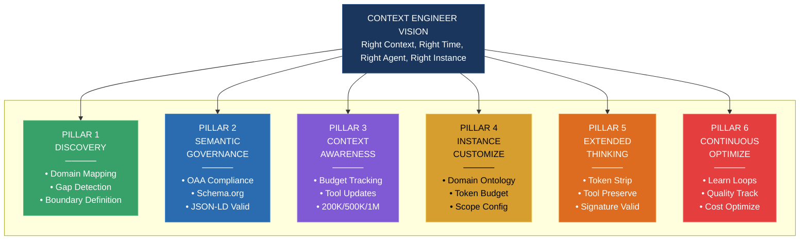
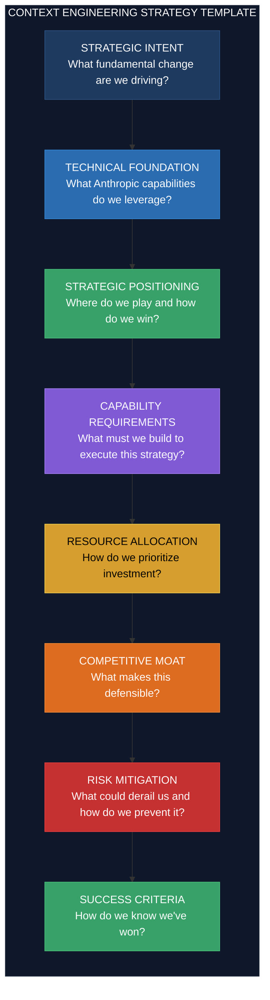
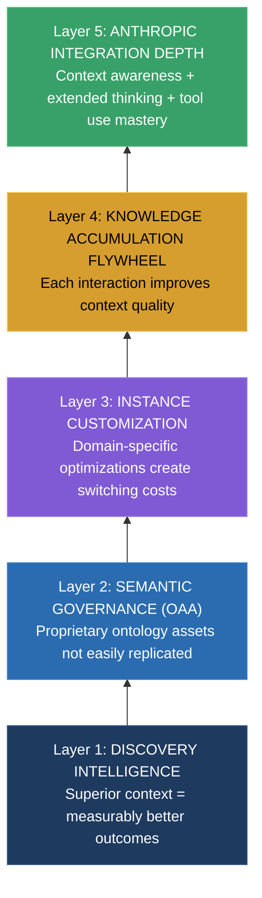
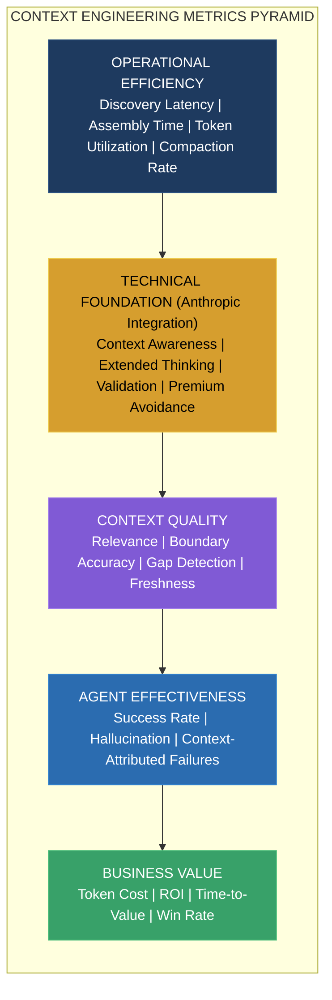
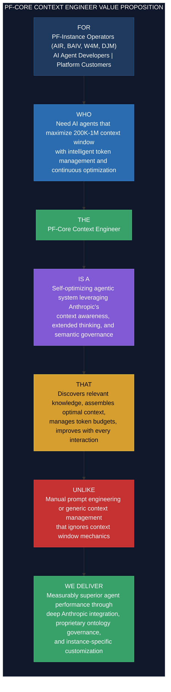

# PF-Core Context Engineering
## VSOM Framework: Vision, Strategy, Objectives & Metrics

**Agentic Set-Up Process with PF-Instance Customization**

---

### Document Controls

| Attribute | Value |
|-----------|-------|
| Document ID | **PF-CORE-CE-VSOM-001** |
| Document Title | PF-Core Context Engineering VSOM Framework |
| Document Type | **VSOM** (Vision, Strategy, Objectives, Metrics) |
| Document Version | **1.2.0** |
| Version Date | 01 December 2025 |
| Status | DRAFT |
| Review Date | 15 December 2025 |
| Platform | **PF-CORE** (Platform Foundation Core) |
| Platform Instances | AIR, BAIV, W4M, DJM |
| Parent Document | PF-CORE-CE-EXP-001 v1.4 (Context Engineering Exploration) |
| Ontology References | ONT-VSOM-0001, ONT-PROC-0001, ONT-CTXE-0001, ONT-CTXW-0001 |

### Change Log

| Version | Date | Author | Changes |
|---------|------|--------|---------|
| 1.0.0 | 30 Nov 2025 | PF-CORE Architecture | Initial VSOM framework |
| **1.1.0** | **01 Dec 2025** | **PF-CORE Architecture** | **Integrated Anthropic context window specifications; Extended thinking patterns; Context awareness metrics; Token budget management in strategy; File naming standardized** |
| **1.2.0** | **01 Dec 2025** | **PF-CORE Architecture** | **Replaced ASCII diagrams with Mermaid for: Vision Pillars, Strategy Template, Metrics Pyramid, Competitive Moat, Value Proposition Canvas; Objective boxes converted to blockquotes** |

### Related Documents

| Document ID | Title | Type | Version |
|-------------|-------|------|---------|
| PF-CORE-CE-EXP-001 | Context Engineering Exploration | EXP | 1.4.0 |
| PF-CORE-CE-PRD-001 | Context Engineer Agent PRD | PRD | TBD |
| PF-CORE-CE-PBS-001 | Context Engineering Product Breakdown | PBS | TBD |
| PF-CORE-CE-AGT-001 | Context Engineer Agent Specification | AGT | TBD |

### Related Ontologies

| Ontology ID | Name | Status | Purpose |
|-------------|------|--------|---------|
| **ONT-CTXE-0001** | Context Engineering Ontology | TO BE CREATED | Context Engineering entities and processes |
| **ONT-CTXA-0001** | Context Engineer Agent Ontology | TO BE CREATED | Agent specifications and capabilities |
| **ONT-DISC-0001** | Discovery Functions Ontology | TO BE CREATED | Domain mapping and gap detection |
| **ONT-CTXW-0001** | Context Window Ontology | ACTIVE | Token management, extended thinking, compaction |

### Copyright & Licensing

```
┌─────────────────────────────────────────────────────────────────────────────┐
│  © 2025 Platform Foundation Core Holdings. All Rights Reserved.             │
│                                                                             │
│  Document ID: PF-CORE-CE-VSOM-001                                           │
│  Document Type: VSOM (Vision, Strategy, Objectives, Metrics)                │
│  Classification: CONFIDENTIAL - PF-CORE Strategy Team                       │
│                                                                             │
│  Licensed to PF-Instances (AIR, BAIV, W4M, DJM) under PF-CORE Platform     │
│  License Agreement.                                                         │
└─────────────────────────────────────────────────────────────────────────────┘
```

---

## Table of Contents

1. [Vision](#1-vision)
2. [Strategy Template & Draft](#2-strategy-template--draft)
3. [SMART Objectives](#3-smart-objectives)
4. [Success Metrics](#4-success-metrics)
5. [OKRs](#5-okrs)
6. [Value Proposition](#6-value-proposition)
7. [PF-Instance Customization Framework](#7-pf-instance-customization-framework)
8. [Appendix: Ontology Specifications](#8-appendix-ontology-specifications)

---

## 1. Vision

### 1.1 Vision Statement

> **"Every AI agent operates with precisely the right context—no more, no less—dynamically curated through intelligent discovery, semantic governance, and continuous optimization, leveraging native context awareness in Claude Sonnet 4.5 and Haiku 4.5 to maximize the 200K-1M token window while establishing an unassailable competitive moat through proprietary context intelligence across all PF-Instances."**

### 1.2 Vision Definition

The **PF-Core Context Engineer Vision** defines an aspirational future state where:

#### 1.2.1 Intelligent Context Curation
Context is **dynamically discovered, assembled, and optimized** by an agentic system that understands:
- What knowledge exists within the platform and tenant ecosystems
- What knowledge is relevant to the current task, user, and organizational goals
- How to balance token efficiency with context completeness within the 200K standard (or 1M beta) context window
- When to trigger compaction based on context awareness budget tracking

#### 1.2.2 Technical Excellence
Context Engineering leverages Anthropic's latest capabilities:
- **Context Awareness (Claude Sonnet 4.5 & Haiku 4.5):** Native token budget tracking throughout conversations
- **Extended Thinking Optimization:** Automatic stripping of thinking tokens between turns
- **Interleaved Thinking (Claude 4):** Reasoning between tool calls for sophisticated analysis
- **Tool Use Integrity:** Proper preservation of thinking blocks during tool cycles
- **Validation-First:** Pre-check token counts to prevent overflow errors (not silent truncation)

#### 1.2.3 Semantic Governance at Scale
Every piece of context is **semantically validated** through OAA Registry compliance:
- Schema.org grounding for interoperability
- JSON-LD structure integrity for AI reasoning
- Ontology alignment for domain accuracy
- Cross-tenant isolation for security

#### 1.2.4 PF-Instance Customization
Each PF-Instance receives a **customized context configuration** that:
- Reflects instance-specific domain ontologies
- Adapts discovery boundaries to instance knowledge domains
- Applies instance-specific token budgets and compaction strategies
- Inherits PF-Core governance while enabling instance-level extensions

### 1.3 Vision Pillars



### 1.4 Vision Success Indicators

| Indicator | Current State | Vision State | Timeline |
|-----------|--------------|--------------|----------|
| Context Assembly | Manual configuration | Fully automated agentic | 18 months |
| Discovery Coverage | Ad-hoc | 100% domain coverage | 12 months |
| Token Efficiency | Unoptimized | 50-70% reduction | 6 months |
| Context Awareness | Not utilized | 100% Claude 4.5 integration | 6 months |
| Extended Thinking | Manual handling | Automatic optimization | 3 months |
| Agent Accuracy | Baseline | 15-30% improvement | 9 months |
| Instance Customization | None | Full PF-Instance support | 12 months |

---

## 2. Strategy Template & Draft

### 2.1 Strategy Template



### 2.2 Context Engineering Strategy Draft

#### 2.2.1 Strategic Intent

**Transform context management from a manual, error-prone configuration task into an intelligent, self-optimizing agentic system that fully leverages Anthropic's context window capabilities (200K standard, 1M beta), context awareness, and extended thinking to deliver measurably superior AI agent performance across all PF-Instances.**

#### 2.2.2 Technical Foundation (Anthropic Capabilities)

| Capability | Strategic Leverage |
|------------|-------------------|
| **Context Window (200K/1M)** | Maximize working memory utilization with intelligent compaction |
| **Context Awareness (4.5)** | Native budget tracking for autonomous context management |
| **Extended Thinking** | Efficient reasoning without token accumulation waste |
| **Tool Use Integration** | Proper thinking block preservation during tool cycles |
| **Token Counting API** | Pre-validation to prevent overflow errors |
| **Validation Behavior** | Proactive management vs. silent truncation |

#### 2.2.3 Strategic Positioning

**Where We Play:**
- PF-Core platform infrastructure layer (shared across all instances)
- PF-Instance customization layer (domain-specific optimization)
- Agent-context interface (the critical handoff point)
- Context window management layer (Anthropic technical integration)

**How We Win:**
1. **Discovery-First Approach:** We discover context requirements before we assemble context
2. **Context Awareness Integration:** Native Claude 4.5 budget tracking for autonomous operation
3. **Semantic Governance:** OAA Registry ensures every token is validated
4. **Instance Customization:** Each PF-Instance gets optimized context
5. **Extended Thinking Optimization:** Token-efficient reasoning without waste

#### 2.2.4 Capability Requirements

| Capability | Priority | Timeline | Anthropic Dependency |
|------------|----------|----------|---------------------|
| Discovery Layer Agents | P0 | Q1 2026 | None |
| Context Awareness Integration | P0 | Q4 2025 | Claude 4.5 |
| Extended Thinking Handler | P0 | Q4 2025 | All models with thinking |
| OAA Integration | P0 | Q4 2025 | None |
| Context Assembly Engine | P0 | Q1 2026 | Token Counting API |
| Token Budget Manager | P1 | Q1 2026 | Context Awareness |
| InfraNodus Integration | P1 | Q1 2026 | MCP Server |
| Instance Customization Framework | P1 | Q2 2026 | None |
| 1M Context Support | P2 | Q2 2026 | Beta Access (Tier 4) |
| Learning & Feedback Loop | P2 | Q3 2026 | None |

#### 2.2.5 Resource Allocation

| Resource Category | Allocation | Rationale |
|------------------|------------|-----------|
| Engineering (Agent Development) | 35% | Core capability build |
| Anthropic Integration | 15% | Context awareness, extended thinking |
| Ontology Development | 20% | Semantic foundation |
| Infrastructure (PaaS-CI-CD) | 15% | Deployment & monitoring |
| Testing & Quality | 15% | TDDD compliance, token validation |

#### 2.2.6 Competitive Moat



#### 2.2.7 Risk Mitigation

| Risk | Probability | Impact | Mitigation |
|------|------------|--------|------------|
| Context window overflow | High | High | Token Counting API pre-validation |
| Extended thinking mishandling | Medium | High | Mandatory preservation during tool use |
| Context rot at scale | Medium | High | Aggressive compaction with context awareness |
| Premium pricing (>200K) | Medium | Medium | Optimize to stay below threshold when possible |
| Ontology drift across instances | Medium | Medium | OAA validation in CI/CD |
| 1M beta access denied | Low | Medium | Design for 200K with 1M as enhancement |

#### 2.2.8 Success Criteria

| Criterion | Threshold | Measurement |
|-----------|-----------|-------------|
| Agent accuracy improvement | ≥15% | A/B testing vs. baseline |
| Token cost reduction | ≥50% | Monthly cost tracking |
| Context awareness utilization | 100% | Claude 4.5 budget tracking active |
| Extended thinking efficiency | Zero waste | No thinking token accumulation |
| Premium pricing avoidance | ≥90% requests | Requests staying ≤200K tokens |
| Context quality score | ≥85% | Automated quality tests |

---

## 3. SMART Objectives

### 3.1 Context Engineering Process Objectives

| ID | Objective | Measurable | Time-bound |
|----|-----------|------------|------------|
| **CE-PROC-001** | Implement context awareness integration for all Claude 4.5 agent interactions | 100% of 4.5 agents with budget tracking | Q4 2025 |
| **CE-PROC-002** | Establish automated discovery-to-assembly pipeline | 100% context assemblies triggered by discovery | Q1 2026 |
| **CE-PROC-003** | Implement extended thinking handler with mandatory tool use preservation | 100% compliance, zero signature errors | Q4 2025 |
| **CE-PROC-004** | Deploy token validation gate in CI/CD pipeline | Zero overflow errors in production | Q1 2026 |
| **CE-PROC-005** | Implement TDDD for all context configurations | ≥85% test coverage | Q1 2026 |
| **CE-PROC-006** | Deploy PF-Instance customization framework | 4 instances with custom configs | Q2 2026 |

### 3.2 Context Engineer Agent Objectives

| ID | Objective | Measurable | Time-bound |
|----|-----------|------------|------------|
| **CE-AGNT-001** | Deploy Domain Mapping Agent | 100% tenant coverage within 24h of onboarding | Q1 2026 |
| **CE-AGNT-002** | Deploy Gap Detection Agent | ≥90% precision, ≤10% false positive | Q1 2026 |
| **CE-AGNT-003** | Deploy Context Assembly Agent with token pre-validation | <500ms P95, zero overflow | Q2 2026 |
| **CE-AGNT-004** | Deploy Token Budget Manager Agent | Real-time budget tracking, compaction triggers | Q1 2026 |
| **CE-AGNT-005** | Deploy Extended Thinking Handler Agent | Automatic stripping/preservation per rules | Q4 2025 |
| **CE-AGNT-006** | Deploy Boundary Enforcement Agent | 100% out-of-scope query blocking | Q2 2026 |

### 3.3 Context Engineering Ontology Objectives

| ID | Objective | Measurable | Time-bound |
|----|-----------|------------|------------|
| **CE-ONTO-001** | Create ONT-CTXE-0001 (Context Engineering Ontology) | 100% schema.org grounding, OAA compliant | Q4 2025 |
| **CE-ONTO-002** | Create ONT-CTXA-0001 (Context Engineer Agent Ontology) | ≥20 capability definitions | Q4 2025 |
| **CE-ONTO-003** | Create ONT-DISC-0001 (Discovery Functions Ontology) | InfraNodus integration complete | Q1 2026 |
| **CE-ONTO-004** | Create ONT-CTXW-0001 (Context Window Ontology) | Extended thinking, compaction entities | Q4 2025 |
| **CE-ONTO-005** | Create PF-Instance context extension ontologies | 4 extensions with ≥10 entities each | Q2 2026 |

---

## 4. Success Metrics

### 4.1 Metrics Framework



### 4.2 Technical Foundation Metrics (NEW)

| Metric ID | Metric Name | Definition | Target | Frequency |
|-----------|-------------|------------|--------|-----------|
| **CE-M-TEC-001** | Context Awareness Activation | % of Claude 4.5 requests with budget tracking | 100% | Per request |
| **CE-M-TEC-002** | Extended Thinking Efficiency | Thinking tokens properly stripped between turns | 100% | Per conversation |
| **CE-M-TEC-003** | Tool Use Thinking Preservation | Thinking blocks preserved during tool cycles | 100% | Per tool use |
| **CE-M-TEC-004** | Token Pre-Validation Rate | Requests validated before submission | 100% | Per request |
| **CE-M-TEC-005** | Overflow Error Rate | Context window overflow errors | 0% | Per request |
| **CE-M-TEC-006** | Premium Threshold Avoidance | Requests staying ≤200K tokens | ≥90% | Weekly |

### 4.3 Operational Efficiency Metrics

| Metric ID | Metric Name | Definition | Target | Frequency |
|-----------|-------------|------------|--------|-----------|
| **CE-M-OPS-001** | Discovery Latency | Time from knowledge update to discovery completion | <24 hours | Daily |
| **CE-M-OPS-002** | Context Assembly Time | Time to assemble context for agent request | <500ms (P95) | Per request |
| **CE-M-OPS-003** | Token Utilization Rate | % of context window used | 70-85% | Per request |
| **CE-M-OPS-004** | Compaction Trigger Rate | Frequency of context compaction events | <10% sessions | Weekly |
| **CE-M-OPS-005** | Ontology Validation Pass Rate | Context payloads passing OAA validation | ≥99.5% | Per request |

### 4.4 Context Quality Metrics

| Metric ID | Metric Name | Definition | Target | Frequency |
|-----------|-------------|------------|--------|-----------|
| **CE-M-QTY-001** | Context Relevance Score | % of context tokens relevant to task | ≥90% | Sampled weekly |
| **CE-M-QTY-002** | Domain Boundary Accuracy | Queries correctly scoped to domain | ≥95% | Per request |
| **CE-M-QTY-003** | Gap Detection Precision | True positive rate for identified gaps | ≥90% | Monthly audit |
| **CE-M-QTY-004** | Semantic Consistency Score | Cross-reference accuracy across ontologies | ≥95% | Weekly |

### 4.5 Agent Effectiveness Metrics

| Metric ID | Metric Name | Definition | Target | Frequency |
|-----------|-------------|------------|--------|-----------|
| **CE-M-AGT-001** | Agent Task Success Rate | Tasks completed successfully | ≥85% (+15%) | Per task |
| **CE-M-AGT-002** | Hallucination Rate | Outputs with fabricated information | <5% | Sampled weekly |
| **CE-M-AGT-003** | Context-Attributed Failures | Failures traced to context issues | <10% | Per failure |
| **CE-M-AGT-004** | Long-Running Task Completion | Tasks utilizing context awareness to completion | ≥95% | Per long task |

### 4.6 Business Value Metrics

| Metric ID | Metric Name | Definition | Target | Frequency |
|-----------|-------------|------------|--------|-----------|
| **CE-M-BIZ-001** | Token Cost per Transaction | Average token spend per transaction | 50% reduction | Monthly |
| **CE-M-BIZ-002** | Premium Pricing Cost Avoidance | Costs avoided by staying ≤200K | Track savings | Monthly |
| **CE-M-BIZ-003** | Context Engineering ROI | (Value - Cost) / Cost | ≥300% | Quarterly |
| **CE-M-BIZ-004** | Time-to-Value for New Instances | Instance creation to production | <2 weeks | Per instance |

---

## 5. OKRs

### 5.1 Annual OKR: Context Engineering Foundation (2026)

> **ANNUAL OBJECTIVE (2026)**
> 
> *"Establish Context Engineering as a self-optimizing agentic system that fully leverages Anthropic's context window capabilities to deliver measurably superior AI agent performance across all PF-Instances."*

| KR ID | Key Result | Baseline | Target | Weight |
|-------|------------|----------|--------|--------|
| **KR-2026-001** | Achieve ≥50% token cost reduction | 100% | ≤50% | 20% |
| **KR-2026-002** | Improve agent task success rate by ≥15pp | TBD | +15pp | 20% |
| **KR-2026-003** | Deploy to all 4 PF-Instances | 0 | 4 | 15% |
| **KR-2026-004** | Achieve 100% context awareness utilization | 0% | 100% | 15% |
| **KR-2026-005** | Zero context overflow errors | TBD | 0 | 15% |
| **KR-2026-006** | Achieve ≥85% context quality score | N/A | ≥85% | 15% |

### 5.2 Q4 2025 OKRs: Technical Foundation

> **Q4 2025 OBJECTIVE**
> 
> *"Establish Anthropic technical integration as foundation for Context Engineering."*

| KR ID | Key Result | Target | Owner |
|-------|------------|--------|-------|
| **KR-Q4-001** | Implement context awareness integration for Claude 4.5 | 100% activation | Platform Engineer |
| **KR-Q4-002** | Deploy Extended Thinking Handler with tool use rules | Zero signature errors | Context Engineering Lead |
| **KR-Q4-003** | Implement Token Counting API pre-validation | 100% pre-checked | Platform Engineer |
| **KR-Q4-004** | Complete ONT-CTXW-0001 (Context Window Ontology) | Ontology released | Ontology Architect |
| **KR-Q4-005** | Complete ONT-CTXE-0001, ONT-CTXA-0001 ontologies | 2 ontologies released | Ontology Architect |

### 5.3 Q1 2026 OKRs: Discovery & Assembly

| KR ID | Key Result | Target | Owner |
|-------|------------|--------|-------|
| **KR-Q1-001** | Deploy Domain Mapping Agent | 100% coverage | Context Engineering Lead |
| **KR-Q1-002** | Deploy Gap Detection Agent | ≥90% precision | Context Engineering Lead |
| **KR-Q1-003** | Deploy Token Budget Manager Agent | Real-time tracking | Platform Engineer |
| **KR-Q1-004** | Integrate InfraNodus MCP server | Integration complete | Platform Engineer |
| **KR-Q1-005** | Establish context quality test suite | ≥85% coverage | QA Lead |

### 5.4 Q2 2026 OKRs: Instance Deployment

| KR ID | Key Result | Target | Owner |
|-------|------------|--------|-------|
| **KR-Q2-001** | Deploy Context Assembly Agent | <500ms P95 | Context Engineering Lead |
| **KR-Q2-002** | Launch BAIV instance with custom context | BAIV live | BAIV Product Lead |
| **KR-Q2-003** | Launch AIR instance with custom context | AIR live | AIR Product Lead |
| **KR-Q2-004** | Achieve ≥30% token cost reduction | ≥30% reduction | Platform Engineer |
| **KR-Q2-005** | Premium threshold avoidance ≥90% | ≥90% requests | Platform Engineer |

---

## 6. Value Proposition

### 6.1 Value Proposition Statement

> **"PF-Core Context Engineer transforms AI agent performance by intelligently discovering, curating, and optimizing context within Anthropic's 200K-1M token window—leveraging native context awareness and extended thinking optimization to deliver 50%+ token cost reduction, 15%+ accuracy improvement, and seamless customization for every PF-Instance, all governed by proprietary semantic standards that create an unassailable competitive moat."**

### 6.2 Value Proposition Canvas



### 6.3 Value Drivers by Stakeholder

#### For PF-Instance Operators

| Value Driver | Benefit | Quantified Impact |
|-------------|---------|-------------------|
| **Context Awareness Integration** | Agents track their own budget | 100% autonomous management |
| **Extended Thinking Efficiency** | No wasted reasoning tokens | Zero accumulation waste |
| **Premium Cost Avoidance** | Optimize to stay ≤200K | ≥90% requests avoid premium |
| **Rapid Instance Deployment** | Production-ready context in days | <2 weeks time-to-value |
| **Domain-Specific Optimization** | Context tailored to domain | +15% agent accuracy |

#### For AI Agent Developers

| Value Driver | Benefit | Quantified Impact |
|-------------|---------|-------------------|
| **Token Pre-Validation** | No runtime overflow errors | 0% overflow rate |
| **Context Awareness Hooks** | Native budget tracking | Automatic compaction triggers |
| **Extended Thinking Handler** | Automatic rule compliance | Zero signature errors |
| **Discovery-First Development** | Know domain before build | 100% domain coverage |
| **TDDD Integration** | Context tests in CI/CD | >85% test coverage |

#### For Platform Customers

| Value Driver | Benefit | Quantified Impact |
|-------------|---------|-------------------|
| **Superior Agent Accuracy** | Agents understand domain deeply | <5% hallucination |
| **Long-Running Task Completion** | Context awareness enables persistence | ≥95% completion |
| **Consistent Experience** | Same quality across interactions | 90% consistency |
| **Cost Efficiency** | Optimized token usage | 50-70% cost reduction |

### 6.4 Value Proposition by PF-Instance

#### BAIV (Be AI Visible)
> "Context Engineer ensures your marketing AI agents leverage the full 200K token window for comprehensive competitive analysis and content strategy—with context awareness enabling sustained AI visibility optimization campaigns."

#### AIR (AI Strategy & Innovation)
> "Context Engineer gives your strategy AI agents deep understanding of AI maturity frameworks within optimized context windows—enabling extended consulting sessions with continuous context awareness."

#### W4M (Wings4Mind.ai)
> "Context Engineer powers your product AI agents with efficient Idea-to-MVP-to-PMF process knowledge—maximizing token utility while enabling long-running validation workflows."

#### DJM (Digital Journey Management)
> "Context Engineer equips your CX AI agents with journey mapping knowledge optimized for complex multi-touchpoint analysis within managed context windows."

---

## 7. PF-Instance Customization Framework

### 7.1 Customization Configuration Schema

```json
{
  "@context": {
    "@vocab": "https://schema.org/",
    "pf": "https://pf-core.io/ontology/",
    "ctx": "https://pf-core.io/context/",
    "anthropic": "https://anthropic.com/context/"
  },
  "@type": "ctx:InstanceContextConfiguration",
  "@id": "ctx:config:baiv-001",
  
  "instanceId": "BAIV",
  "version": "1.1.0",
  "effectiveDate": "2026-04-01",
  
  "inheritsFrom": "ctx:config:pf-core-base",
  
  "contextWindowConfiguration": {
    "standardWindow": 200000,
    "enterpriseWindow": 500000,
    "premiumWindowEnabled": false,
    "premiumWindow": 1000000,
    "compactionThreshold": 160000,
    "reservedForResponse": 20000,
    "alertThreshold": 180000,
    "premiumPricingThreshold": 200000
  },
  
  "contextAwareness": {
    "enabled": true,
    "supportedModels": ["claude-sonnet-4-5", "claude-haiku-4-5"],
    "budgetTag": "<budget:token_budget>{budget}</budget:token_budget>",
    "updateTag": "<system_warning>Token usage: {used}/{total}; {remaining} remaining</system_warning>",
    "toolCallUpdates": true
  },
  
  "extendedThinking": {
    "enabled": true,
    "autoStripping": true,
    "toolUsePreservation": "mandatory",
    "signatureValidation": "enforced",
    "interleavedThinking": {
      "claude4Models": true,
      "claude37Sonnet": false
    }
  },
  
  "domainOntologies": [
    {"ontologyId": "ONT-AIVS-0001", "required": true},
    {"ontologyId": "ONT-CMOO-0001", "required": true}
  ],
  
  "discoveryConfiguration": {
    "primaryDomains": ["marketing", "content-strategy", "ai-visibility"],
    "excludedDomains": ["finance", "hr", "legal"]
  },
  
  "qualityThresholds": {
    "minRelevanceScore": 0.85,
    "maxHallucinationRate": 0.05,
    "minDomainBoundaryAccuracy": 0.95
  }
}
```

### 7.2 Instance Deployment Process

| Phase | Activities | Duration | Gate Criteria |
|-------|-----------|----------|---------------|
| **1. Technical Setup** | Context awareness, extended thinking config | 1 day | Anthropic integration verified |
| **2. Discovery** | Run Domain Mapping Agent | 1-2 days | Domain boundaries defined |
| **3. Ontology Selection** | Select/extend ontologies | 1 day | OAA registered |
| **4. Configuration** | Create instance config | 1 day | Configuration validated |
| **5. Testing** | TDDD test suite + token validation | 2-3 days | >85% coverage, zero overflow |
| **6. Staging** | Deploy to staging | 1 day | Staging validation complete |
| **7. Production** | Deploy to production | 1 day | Smoke tests pass |
| **Total** | | **8-11 days** | |

---

## 8. Appendix: Ontology Specifications

### 8.1 ONT-CTXW-0001: Context Window Ontology

```json
{
  "@type": "pf:Ontology",
  "@id": "pf:ontology:context-window",
  "identifier": "ONT-CTXW-0001",
  "name": "Context Window Ontology",
  "version": "1.0.0",
  "status": "ACTIVE",
  "source": "https://docs.anthropic.com/en/docs/build-with-claude/context-windows",
  
  "entities": [
    {
      "@id": "pf:ContextWindow",
      "description": "Working memory capacity for LLM inference",
      "properties": {
        "maxTokens": {"type": "Integer", "values": [200000, 500000, 1000000]},
        "usedTokens": {"type": "Integer"},
        "remainingTokens": {"type": "Integer"},
        "premiumThreshold": {"type": "Integer", "default": 200000},
        "tier": {"type": "String", "enum": ["standard", "enterprise", "beta_1m"]}
      }
    },
    {
      "@id": "pf:ExtendedThinking",
      "description": "Reasoning tokens with lifecycle rules",
      "properties": {
        "thinkingTokens": {"type": "Integer"},
        "redactedThinkingTokens": {"type": "Integer"},
        "signatureValid": {"type": "Boolean"},
        "toolUsePreserved": {"type": "Boolean", "required": true},
        "interleavedSupported": {"type": "Boolean", "note": "Claude 4 only"}
      }
    },
    {
      "@id": "pf:TokenBudget",
      "description": "Context awareness budget tracking",
      "properties": {
        "totalBudget": {"type": "Integer"},
        "consumed": {"type": "Integer"},
        "remaining": {"type": "Integer"},
        "budgetTag": {"type": "String", "format": "<budget:token_budget>{budget}</budget:token_budget>"},
        "updateTag": {"type": "String", "format": "<system_warning>Token usage: {used}/{total}; {remaining} remaining</system_warning>"}
      }
    },
    {
      "@id": "pf:CompactionEvent",
      "description": "Context summarization event",
      "properties": {
        "triggerThreshold": {"type": "Integer"},
        "preCompactionTokens": {"type": "Integer"},
        "postCompactionTokens": {"type": "Integer"}
      }
    },
    {
      "@id": "pf:ContextAwareness",
      "description": "Model capability for tracking token budget",
      "properties": {
        "supportedModels": {"type": "Array", "values": ["claude-sonnet-4-5", "claude-haiku-4-5"]},
        "imageTokensIncluded": {"type": "Boolean", "default": true}
      }
    }
  ]
}
```

### 8.2 ONT-CTXE-0001: Context Engineering Ontology

```json
{
  "@type": "pf:Ontology",
  "identifier": "ONT-CTXE-0001",
  "name": "Context Engineering Ontology",
  "version": "1.0.0",
  "status": "DRAFT",
  
  "entities": [
    {"@id": "pf:ContextAssembly", "description": "Packaged context for agent consumption"},
    {"@id": "pf:DiscoveryScope", "description": "Boundaries for knowledge discovery"},
    {"@id": "pf:CompactionStrategy", "description": "Rules for context summarization"},
    {"@id": "pf:QualityThreshold", "description": "Context quality requirements"}
  ]
}
```

### 8.3 ONT-CTXA-0001: Context Engineer Agent Ontology

```json
{
  "@type": "pf:Ontology",
  "identifier": "ONT-CTXA-0001",
  "name": "Context Engineer Agent Ontology",
  "version": "1.0.0",
  "status": "DRAFT",
  
  "agentTypes": [
    {"@id": "pf:DomainMappingAgent", "capabilities": ["topicClustering", "boundaryDefinition"]},
    {"@id": "pf:GapDetectionAgent", "capabilities": ["gapIdentification", "blindSpotDetection"]},
    {"@id": "pf:ContextAssemblyAgent", "capabilities": ["contextPackaging", "tokenOptimization", "preValidation"]},
    {"@id": "pf:TokenBudgetManagerAgent", "capabilities": ["budgetTracking", "compactionTrigger", "premiumAvoidance"]},
    {
      "@id": "pf:ExtendedThinkingHandlerAgent", 
      "capabilities": ["thinkingStrip", "toolUsePreserve", "signatureValidation"],
      "modelSupport": {
        "interleavedThinking": {
          "claude4Models": true,
          "claude37Sonnet": false
        }
      }
    },
    {"@id": "pf:BoundaryEnforcementAgent", "capabilities": ["queryValidation", "scopeEnforcement"]},
    {"@id": "pf:ContextOptimizationAgent", "capabilities": ["performanceAnalysis", "configTuning", "learningFromOutcomes"]}
  ]
}
```

---

## Document Footer

### Approval & Sign-Off

| Role | Name | Date | Signature |
|------|------|------|-----------|
| Context Engineering Lead | | | |
| CTO | | | |
| Platform Architect | | | |

---

**END OF DOCUMENT**

*File: PF-Core_Context_Engr_VSOM_Framework_v1.1_VSOM.md*
