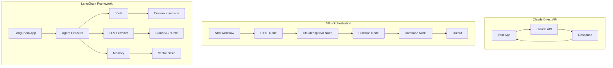
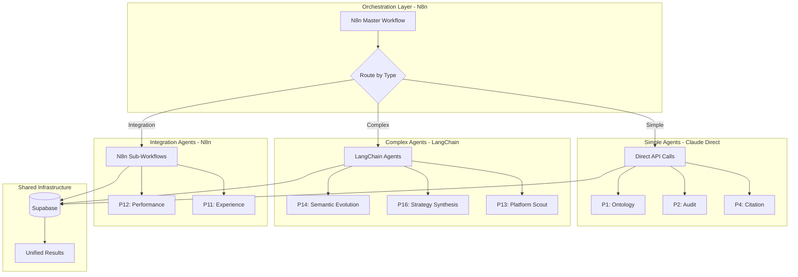
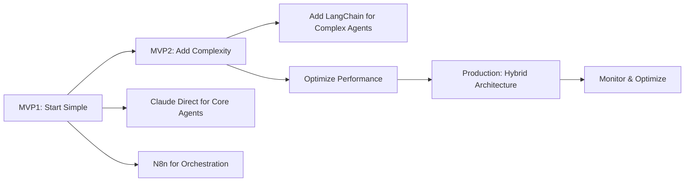

# Agent Architecture Comparison: Claude vs N8n vs LangChain

## 1. Architecture Overview



## 2. Detailed Comparison

### **Claude Direct API Approach**

```javascript
// Direct Claude API Usage
const anthropic = new Anthropic({ apiKey: process.env.CLAUDE_KEY });

async function executeAgent(context) {
  const response = await anthropic.messages.create({
    model: "claude-3-opus-20240229",
    messages: [{
      role: "user",
      content: `You are agent P1 (Ontology Mapper). 
                Context: ${JSON.stringify(context)}
                Task: Map entities to ontology...`
    }],
    max_tokens: 4000
  });
  
  return response.content[0].text;
}
```

**Pros:**
- 🚀 **Maximum control** over prompts and responses
- 💰 **Lowest cost** - only pay for tokens used
- ⚡ **Fastest execution** - no middleware overhead
- 🎯 **Direct access** to latest Claude features
- 🔧 **Simple debugging** - just API calls

**Cons:**
- 🏗️ **Must build everything** - orchestration, memory, tools
- 📝 **More code to write** - error handling, retries, logging
- 🔄 **No built-in persistence** - must implement state management
- 🤹 **Complex orchestration** - managing multiple agents is hard
- 📊 **No visual monitoring** - must build observability

**Best For:**
- Simple, single-purpose agents
- Maximum performance requirements
- Cost-sensitive applications
- Custom integration needs

---

### **N8n Workflow Approach**

```javascript
// N8n Workflow Definition
{
  "nodes": [
    {
      "name": "Trigger",
      "type": "webhook",
      "parameters": {
        "path": "/execute-agent"
      }
    },
    {
      "name": "Load Context",
      "type": "Postgres",
      "parameters": {
        "operation": "select",
        "query": "SELECT * FROM sessions WHERE id = {{$json.session_id}}"
      }
    },
    {
      "name": "Claude Agent",
      "type": "Claude",
      "parameters": {
        "prompt": "You are agent P1...",
        "model": "claude-3-opus-20240229"
      }
    },
    {
      "name": "Process Response",
      "type": "Function",
      "parameters": {
        "code": "// Parse and structure response"
      }
    },
    {
      "name": "Save Results",
      "type": "Postgres",
      "parameters": {
        "operation": "insert"
      }
    }
  ]
}
```

**Pros:**
- 👁️ **Visual orchestration** - see your entire flow
- 🔌 **Pre-built integrations** - 400+ nodes available
- 🔄 **Built-in error handling** - retry logic included
- 📊 **Execution monitoring** - see what's happening in real-time
- 🚦 **Easy parallelization** - split/merge nodes for parallel execution
- 💾 **State management** - built-in workflow variables
- 🛠️ **No-code friendly** - business users can modify flows

**Cons:**
- 💵 **Additional infrastructure** - need to host N8n
- 🎨 **Limited customization** - constrained by node capabilities
- 🐌 **Overhead latency** - each node adds processing time
- 📦 **Version control challenges** - JSON workflows are hard to diff
- 🔒 **Vendor lock-in** - tied to N8n's architecture

**Best For:**
- Complex multi-step workflows
- Team collaboration needs
- Integration-heavy scenarios
- Business user involvement
- Visual debugging requirements

---

### **LangChain Framework Approach**

```python
# LangChain Agent Implementation
from langchain.agents import Tool, AgentExecutor, BaseAgent
from langchain.llms import Claude
from langchain.memory import ConversationBufferMemory
from langchain.vectorstores import Pinecone

class OntologyMapperAgent(BaseAgent):
    def __init__(self):
        self.llm = Claude(model="claude-3-opus-20240229")
        self.memory = ConversationBufferMemory()
        self.tools = [
            Tool(name="search_ontology", func=self.search_ontology),
            Tool(name="validate_mapping", func=self.validate_mapping),
            Tool(name="store_results", func=self.store_results)
        ]
        
    async def execute(self, context):
        executor = AgentExecutor(
            agent=self,
            tools=self.tools,
            memory=self.memory,
            max_iterations=5
        )
        
        return await executor.arun(
            input=f"Map these entities to ontology: {context}"
        )
```

**Pros:**
- 🧰 **Rich tooling ecosystem** - pre-built tools and chains
- 🧠 **Advanced memory systems** - conversation, summary, knowledge graph
- 🔗 **Chain composition** - combine multiple LLMs and tools
- 🎛️ **Prompt management** - templates, few-shot examples
- 🔍 **Built-in RAG** - vector stores, retrievers, embeddings
- 🔄 **Agent patterns** - ReAct, Plan-and-Execute, etc.
- 📚 **Multiple LLM support** - switch between Claude, GPT, Llama

**Cons:**
- 📖 **Steep learning curve** - complex abstractions
- 🏗️ **Heavy framework** - lots of dependencies
- 🐛 **Debugging complexity** - many abstraction layers
- 📦 **Version instability** - rapid changes, breaking updates
- 💰 **Resource intensive** - higher memory/CPU usage
- 🔧 **Over-engineering risk** - tempting to over-complicate

**Best For:**
- Complex reasoning chains
- RAG-heavy applications
- Multi-LLM orchestration
- Research/experimentation
- Advanced agent patterns

---

## 3. Decision Framework for BAIV

### **When to Use Each Approach**

```javascript
const decisionFramework = {
  use_claude_direct: {
    when: [
      "Simple prompt-response patterns",
      "Cost is primary concern",
      "Need maximum performance",
      "Building proprietary orchestration",
      "Minimal external dependencies"
    ],
    example_agents: ["P1: Ontology Mapper", "P4: Citation Architect"]
  },
  
  use_n8n: {
    when: [
      "Complex multi-system integration",
      "Visual debugging needed",
      "Non-technical team members involved",
      "Heavy database/API interactions",
      "Workflow branching and conditions"
    ],
    example_agents: ["Po: Orchestrator", "P12: Performance Analyzer"]
  },
  
  use_langchain: {
    when: [
      "Complex reasoning chains",
      "Need RAG capabilities",
      "Research and experimentation",
      "Multi-step planning required",
      "Academic or advanced patterns"
    ],
    example_agents: ["P14: Semantic Evolution", "P16: Strategy Synthesis"]
  }
};
```

---

## 4. Hybrid Architecture (Recommended for BAIV)



### **Recommended Hybrid Implementation**

```javascript
// N8n Master Orchestrator
const hybridOrchestrator = {
  determineAgentType: function(agentId) {
    const agentTypes = {
      // Simple agents - use Claude direct
      'P1': 'direct',
      'P2': 'direct', 
      'P3': 'direct',
      'P4': 'direct',
      
      // Integration-heavy - use N8n
      'P11': 'n8n',
      'P12': 'n8n',
      'P15': 'n8n',
      
      // Complex reasoning - use LangChain
      'P13': 'langchain',
      'P14': 'langchain',
      'P16': 'langchain',
      
      // Mixed approach
      'P5': 'n8n', // Content strategy needs integrations
      'P6': 'direct', // Brand reach is straightforward
      'P7': 'langchain', // Influence network needs graph reasoning
      'P8': 'n8n', // UGC needs social integrations
      'P9': 'direct', // Reputation is prompt-based
      'P10': 'langchain' // Recommendations need complex logic
    };
    
    return agentTypes[agentId] || 'direct';
  },
  
  executeAgent: async function(agentId, context) {
    const type = this.determineAgentType(agentId);
    
    switch(type) {
      case 'direct':
        return await executeDirectClaude(agentId, context);
      
      case 'n8n':
        return await triggerN8nWorkflow(agentId, context);
      
      case 'langchain':
        return await executeLangChainAgent(agentId, context);
      
      default:
        throw new Error(`Unknown agent type for ${agentId}`);
    }
  }
};
```

---

## 5. Cost Analysis

```javascript
const costComparison = {
  claude_direct: {
    infrastructure: "$0 (just API calls)",
    token_costs: "$15 per million input / $75 per million output tokens",
    development_time: "High (build everything)",
    maintenance: "Medium (your code)",
    total_monthly: "~$100-500 depending on usage"
  },
  
  n8n: {
    infrastructure: "$20-100/month (hosting)",
    token_costs: "Same as direct (pass-through)",
    development_time: "Low (visual building)",
    maintenance: "Low (visual debugging)",
    total_monthly: "~$120-600"
  },
  
  langchain: {
    infrastructure: "$50-200/month (compute for framework)",
    token_costs: "Same + 10-20% overhead (retries, chain steps)",
    development_time: "Medium (learn framework)",
    maintenance: "High (framework updates)",
    total_monthly: "~$200-800"
  },
  
  hybrid_recommended: {
    infrastructure: "$20-50/month (N8n + light compute)",
    token_costs: "Optimized by approach",
    development_time: "Medium (best of all worlds)",
    maintenance: "Medium (multiple systems)",
    total_monthly: "~$150-600",
    benefit: "Optimal cost/performance ratio"
  }
};
```

---

## 6. Performance Comparison

```javascript
const performanceMetrics = {
  response_time: {
    claude_direct: "500-1000ms (API call only)",
    n8n: "1000-3000ms (workflow overhead)",
    langchain: "1500-5000ms (framework + tools)",
    hybrid: "500-3000ms (depends on agent)"
  },
  
  scalability: {
    claude_direct: "Excellent (stateless)",
    n8n: "Good (worker pools)",
    langchain: "Moderate (memory intensive)",
    hybrid: "Excellent (distributed)"
  },
  
  reliability: {
    claude_direct: "Manual (you implement)",
    n8n: "Built-in (retry, error handling)",
    langchain: "Framework-provided",
    hybrid: "Best of both"
  },
  
  observability: {
    claude_direct: "DIY logging",
    n8n: "Visual execution history",
    langchain: "LangSmith integration",
    hybrid: "Comprehensive"
  }
};
```

---

## 7. Implementation Examples

### **Simple Agent (Claude Direct)**
```javascript
// P1: Ontology Mapper - Direct Implementation
async function P1_OntologyMapper(context) {
  const prompt = `
    You are an Ontology Mapping specialist.
    Map these business entities to our standard ontology:
    ${JSON.stringify(context.entities)}
    
    Return JSON with mappings and confidence scores.
  `;
  
  const response = await anthropic.messages.create({
    model: "claude-3-opus-20240229",
    messages: [{ role: "user", content: prompt }],
    max_tokens: 2000
  });
  
  return JSON.parse(response.content[0].text);
}
```

### **Integration Agent (N8n)**
```javascript
// P12: Performance Analyzer - N8n Workflow
{
  "name": "P12_Performance_Analyzer",
  "nodes": [
    {
      "name": "Fetch Metrics",
      "type": "Postgres",
      "operation": "select",
      "query": "SELECT * FROM agent_executions WHERE session_id = {{$json.session_id}}"
    },
    {
      "name": "Analyze Performance",
      "type": "Claude",
      "prompt": "Analyze these performance metrics and identify bottlenecks..."
    },
    {
      "name": "Generate Dashboard",
      "type": "Function",
      "code": "// Create visualization data"
    },
    {
      "name": "Store Results",
      "type": "Supabase",
      "operation": "upsert"
    }
  ]
}
```

### **Complex Agent (LangChain)**
```python
# P16: Strategy Synthesis - LangChain Implementation
from langchain.agents import initialize_agent, AgentType
from langchain.tools import Tool

class StrategySynthesisAgent:
    def __init__(self):
        self.tools = [
            Tool(
                name="analyze_dependencies",
                func=self.analyze_strategy_dependencies,
                description="Analyze dependencies between strategies"
            ),
            Tool(
                name="evaluate_conflicts",
                func=self.evaluate_conflicts,
                description="Find conflicts in strategies"
            ),
            Tool(
                name="generate_synthesis",
                func=self.synthesize_strategies,
                description="Create unified strategy"
            )
        ]
        
        self.agent = initialize_agent(
            tools=self.tools,
            llm=Claude(model="claude-3-opus-20240229"),
            agent=AgentType.STRUCTURED_CHAT_ZERO_SHOT_REACT_DESCRIPTION,
            verbose=True
        )
    
    async def execute(self, all_strategies):
        result = await self.agent.arun(
            f"Synthesize these strategies into a cohesive plan: {all_strategies}"
        )
        return result
```

---

## 8. Migration Path



### **Recommended Implementation Timeline**

**Phase 1 (Weeks 1-2): Foundation**
- Set up N8n for orchestration
- Implement P1-P4 with Claude Direct API
- Basic Supabase integration

**Phase 2 (Weeks 3-4): Integration**
- Add N8n workflows for P11, P12
- Implement monitoring and logging
- Test orchestration patterns

**Phase 3 (Weeks 5-6): Complexity**
- Introduce LangChain for P14, P16
- Implement RAG for semantic search
- Add advanced reasoning chains

**Phase 4 (Weeks 7-8): Optimization**
- Performance tuning
- Cost optimization
- Production deployment

---

## 9. Decision Matrix

| Factor | Claude Direct | N8n | LangChain | Hybrid |
|--------|--------------|-----|-----------|---------|
| **Development Speed** | Slow | Fast | Medium | Medium |
| **Flexibility** | High | Medium | High | Highest |
| **Cost** | Low | Medium | High | Medium |
| **Scalability** | High | Good | Medium | High |
| **Maintenance** | High | Low | High | Medium |
| **Team Skills Needed** | High | Low | High | Medium |
| **Visual Debugging** | No | Yes | No | Partial |
| **Integration Capability** | Manual | Excellent | Good | Excellent |
| **Agent Complexity Support** | Low | Medium | High | High |
| **Production Readiness** | Manual | Built-in | Framework | Best |

---

## 10. Final Recommendation for BAIV

```javascript
const baivRecommendation = {
  architecture: "Hybrid",
  
  rationale: [
    "N8n provides visual orchestration and monitoring",
    "Claude Direct for simple, cost-effective agents",
    "LangChain for complex reasoning when needed",
    "Flexibility to evolve as requirements grow"
  ],
  
  implementation: {
    orchestration: "N8n (Po, Po.1, Po.2)",
    simple_agents: "Claude Direct (P1, P2, P3, P4, P6, P9)",
    integration_agents: "N8n Workflows (P5, P8, P11, P12, P15)",
    complex_agents: "LangChain (P7, P10, P13, P14, P16)",
    data_layer: "Supabase (all agents)"
  },
  
  benefits: [
    "Start simple, add complexity as needed",
    "Optimize cost per agent type",
    "Visual debugging where helpful",
    "Maximum flexibility for future",
    "Best performance per use case"
  ]
};
```

This hybrid approach gives you the best of all worlds: simplicity where possible, power where needed, and the flexibility to evolve as your BAIV platform grows.