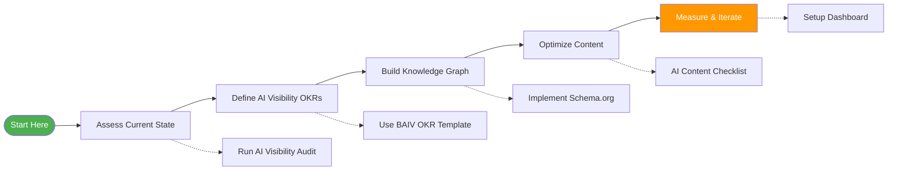
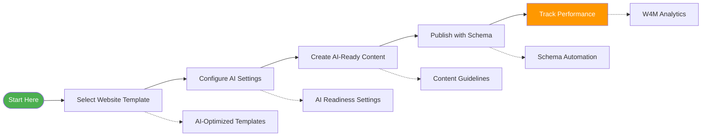
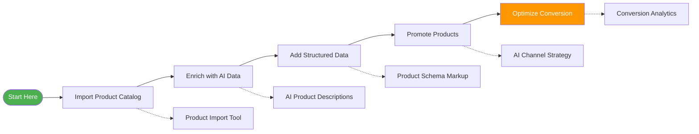
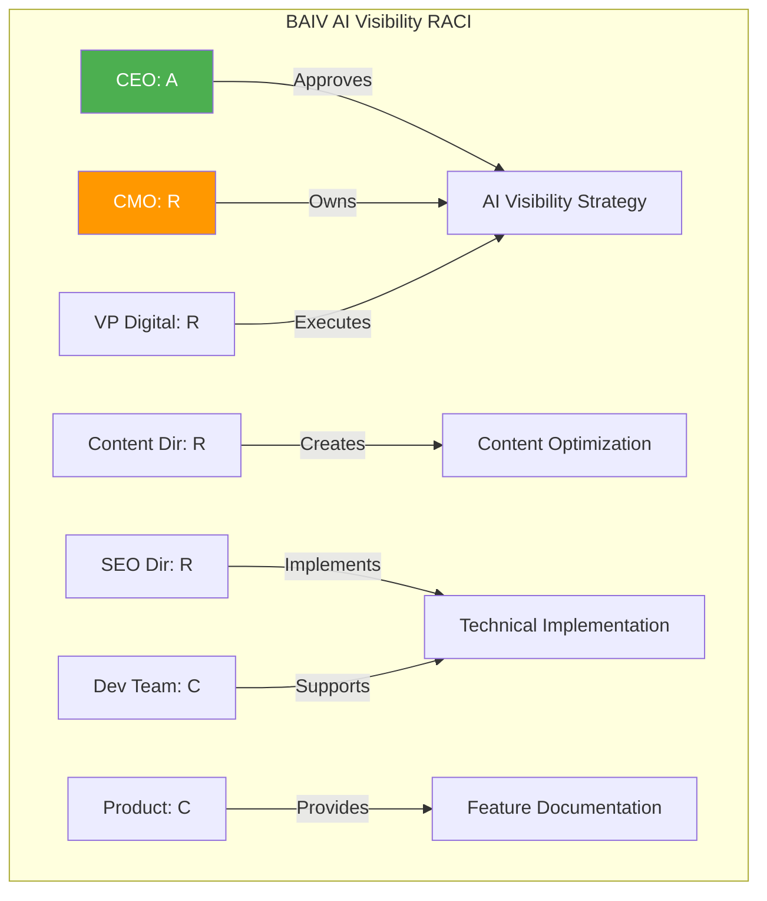
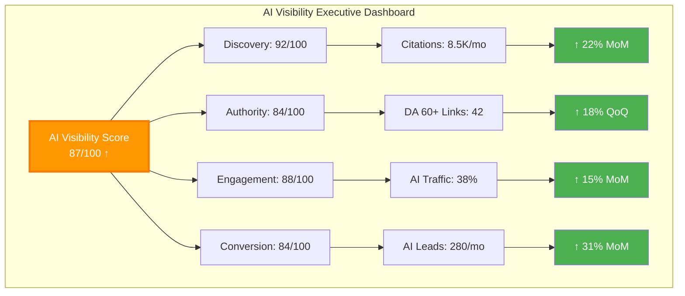
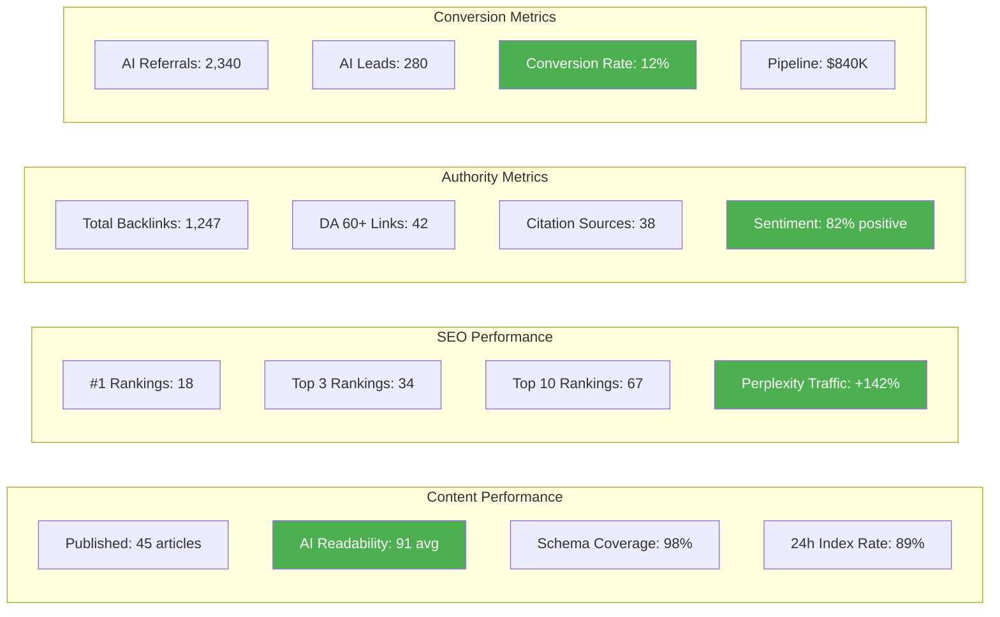
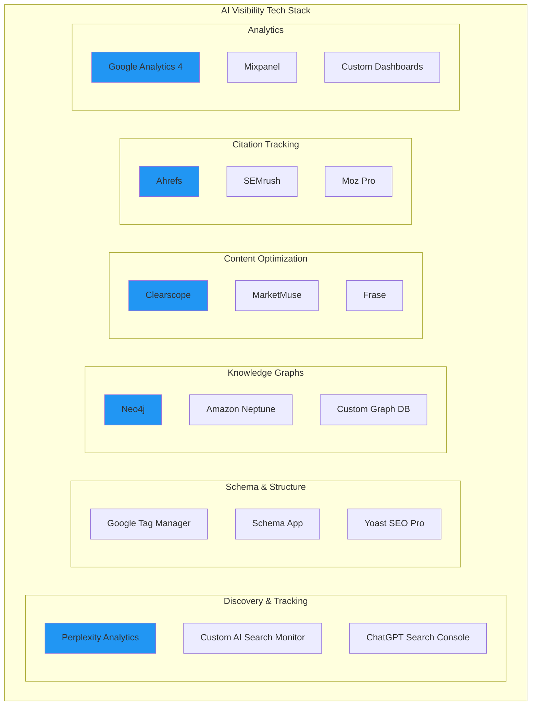

# AI Visibility Marketing Framework v2.0
## Visual Implementation Guide & Platform Templates

**Version:** 2.0.0  
**Date:** 2025-10-10  
**Purpose:** Practical implementation guide with templates, checklists, and dashboards

---

## Quick Start Guide

### For BAIV (AI Visibility Platform)



### For W4M (Website for Marketing)



### For ECOOAI (AI E-commerce)



---

## Platform-Specific OKR Templates

### BAIV: AI Visibility Platform OKRs

#### Corporate Level
```yaml
corporate_objective:
  id: BAIV-CORP-Q1-2026-01
  objective: "Establish BAIV as the Authority in AI Visibility"
  owner: CEO
  timeframe: Q1 2026
  
  key_results:
    - id: BAIV-CORP-KR1
      description: "Recognized as 'AI Visibility' category creator"
      metric: "Brand recall in category creation surveys"
      target: 85%
      current: 62%
      due_date: 2026-03-31
      
    - id: BAIV-CORP-KR2
      description: "Featured in AI agent recommendations"
      metric: "Percentage of AI responses mentioning BAIV for 'AI visibility solutions'"
      target: 80%
      current: 45%
      due_date: 2026-03-31
      
    - id: BAIV-CORP-KR3
      description: "Achieve market leadership"
      metric: "Market share in AI visibility software category"
      target: 40%
      current: 15%
      due_date: 2026-03-31
```

#### Marketing Level
```yaml
marketing_objective:
  id: BAIV-MKT-Q1-2026-01
  objective: "Demonstrate Thought Leadership in AI Search Optimization"
  owner: CMO
  timeframe: Q1 2026
  aligns_with: BAIV-CORP-Q1-2026-01
  
  key_results:
    - id: BAIV-MKT-KR1
      description: "Achieve top AI visibility score"
      metric: "Composite AI Visibility Score"
      target: 90
      current: 72
      due_date: 2026-03-31
      measurement_frequency: Weekly
      
    - id: BAIV-MKT-KR2
      description: "Dominate AI search rankings"
      metric: "#1 ranking in ChatGPT for target keywords"
      target: 25 keywords
      current: 8 keywords
      due_date: 2026-03-31
      target_keywords:
        - "AI visibility strategy"
        - "AI search optimization"
        - "AI discoverability"
        - "schema.org for AI"
        - [... 21 more]
      
    - id: BAIV-MKT-KR3
      description: "Generate AI-attributed pipeline"
      metric: "Qualified leads from AI channels"
      target: 500
      current: 145
      due_date: 2026-03-31
```

#### AI Visibility Team Level
```yaml
ai_visibility_objective:
  id: BAIV-AIV-Q1-2026-01
  objective: "Perfect AI Visibility Implementation (Dogfooding)"
  owner: VP Digital Marketing
  timeframe: Q1 2026
  cascades_from: BAIV-MKT-Q1-2026-01
  
  key_results:
    - id: BAIV-AIV-KR1
      description: "100% content AI-optimized"
      metric: "Percentage of published content meeting AI readability threshold"
      target: 100%
      current: 78%
      threshold: "AI Readability Score >= 90"
      due_date: 2026-03-31
      
    - id: BAIV-AIV-KR2
      description: "Maximize AI citations"
      metric: "Monthly AI system citations of BAIV content"
      target: 1000
      current: 340
      due_date: 2026-03-31
      
    - id: BAIV-AIV-KR3
      description: "Build citation authority"
      metric: "Number of high-authority domains linking to BAIV"
      target: 75
      current: 32
      authority_threshold: "Domain Authority >= 60"
      due_date: 2026-03-31
      
    - id: BAIV-AIV-KR4
      description: "Complete knowledge graph"
      metric: "Product catalog coverage in knowledge graph"
      target: 100%
      current: 65%
      due_date: 2026-03-31
```

#### Execution Level - Content Team
```yaml
content_team_objective:
  id: BAIV-CONTENT-Q1-2026-01
  objective: "Produce AI-Optimized Thought Leadership Content"
  owner: Content Director
  timeframe: Q1 2026
  cascades_from: BAIV-AIV-Q1-2026-01
  
  key_results:
    - id: BAIV-CONTENT-KR1
      description: "Publish AI-ready articles"
      metric: "Number of blog posts published with AI readability >= 90"
      target: 60
      current: 18
      cadence: "5 per week"
      due_date: 2026-03-31
      
    - id: BAIV-CONTENT-KR2
      description: "100% schema.org coverage"
      metric: "Percentage of content with semantic markup"
      target: 100%
      current: 85%
      due_date: 2026-03-31
      
    - id: BAIV-CONTENT-KR3
      description: "Fast AI indexing"
      metric: "Percentage of content indexed by Perplexity within 24 hours"
      target: 95%
      current: 72%
      due_date: 2026-03-31
```

---

### W4M: Marketing Website Platform OKRs

#### Corporate Level
```yaml
corporate_objective:
  id: W4M-CORP-Q1-2026-01
  objective: "Position W4M as Essential AI Marketing Tool"
  owner: CEO
  timeframe: Q1 2026
  
  key_results:
    - id: W4M-CORP-KR1
      description: "AI-native website builder recognition"
      metric: "Aided brand awareness in 'AI marketing tools' category"
      target: 70%
      current: 38%
      due_date: 2026-03-31
      
    - id: W4M-CORP-KR2
      description: "Revenue growth"
      metric: "ARR from new AI-focused customers"
      target: "$5M"
      current: "$1.8M"
      due_date: 2026-03-31
      
    - id: W4M-CORP-KR3
      description: "AI recommendations"
      metric: "Featured in top 5 AI recommendations for 'marketing website tools'"
      target: 5
      current: 12
      ranking_target: "Top 5"
      due_date: 2026-03-31
```

#### Marketing Level
```yaml
marketing_objective:
  id: W4M-MKT-Q1-2026-01
  objective: "Drive Adoption Through AI Visibility"
  owner: CMO
  timeframe: Q1 2026
  aligns_with: W4M-CORP-Q1-2026-01
  
  key_results:
    - id: W4M-MKT-KR1
      description: "AI visibility score"
      metric: "Composite AI Visibility Score"
      target: 80
      current: 58
      due_date: 2026-03-31
      
    - id: W4M-MKT-KR2
      description: "AI-referred leads"
      metric: "Percentage of new leads from AI channels"
      target: 35%
      current: 18%
      due_date: 2026-03-31
      
    - id: W4M-MKT-KR3
      description: "Feature discoverability"
      metric: "Percentage of product features discoverable in AI search"
      target: 100%
      current: 62%
      due_date: 2026-03-31
```

#### AI Visibility Team Level
```yaml
ai_visibility_objective:
  id: W4M-AIV-Q1-2026-01
  objective: "Maximize Product & Feature Discoverability"
  owner: Product Marketing Manager
  timeframe: Q1 2026
  cascades_from: W4M-MKT-Q1-2026-01
  
  key_results:
    - id: W4M-AIV-KR1
      description: "Complete feature documentation"
      metric: "Product features with schema.org markup"
      target: 100%
      current: 62%
      due_date: 2026-03-31
      
    - id: W4M-AIV-KR2
      description: "AI search rankings"
      metric: "Top 3 ranking in AI search for target keywords"
      target: 20 keywords
      current: 7 keywords
      due_date: 2026-03-31
      
    - id: W4M-AIV-KR3
      description: "Template visibility"
      metric: "AI-optimized website templates published"
      target: 50
      current: 15
      optimization_criteria: "Demonstrates AI readiness features"
      due_date: 2026-03-31
```

---

### ECOOAI: AI E-commerce Platform OKRs

#### Corporate Level
```yaml
corporate_objective:
  id: ECOO-CORP-Q1-2026-01
  objective: "Lead AI-Enabled E-commerce Narrative"
  owner: CEO
  timeframe: Q1 2026
  
  key_results:
    - id: ECOO-CORP-KR1
      description: "Category leadership"
      metric: "Ranked in Gartner Magic Quadrant for AI E-commerce"
      target: "Leaders Quadrant"
      current: "Challengers Quadrant"
      due_date: 2026-03-31
      
    - id: ECOO-CORP-KR2
      description: "AI-driven growth"
      metric: "Gross Merchandise Value (GMV) through AI recommendations"
      target: "$50M"
      current: "$12M"
      due_date: 2026-03-31
      
    - id: ECOO-CORP-KR3
      description: "Brand recall"
      metric: "Top-of-mind awareness in AI e-commerce conversations"
      target: 75%
      current: 42%
      due_date: 2026-03-31
```

#### Marketing Level
```yaml
marketing_objective:
  id: ECOO-MKT-Q1-2026-01
  objective: "Establish Thought Leadership in AI Commerce"
  owner: CMO
  timeframe: Q1 2026
  aligns_with: ECOO-CORP-Q1-2026-01
  
  key_results:
    - id: ECOO-MKT-KR1
      description: "AI visibility in comparisons"
      metric: "Featured in AI-generated e-commerce platform comparisons"
      target: 90%
      current: 55%
      platforms_tracked: ["ChatGPT", "Claude", "Perplexity", "Gemini"]
      due_date: 2026-03-31
      
    - id: ECOO-MKT-KR2
      description: "Demo requests from AI"
      metric: "Percentage of demo requests from AI channels"
      target: 50%
      current: 22%
      due_date: 2026-03-31
      
    - id: ECOO-MKT-KR3
      description: "Case study visibility"
      metric: "Customer success stories cited by AI systems"
      target: 40
      current: 12
      due_date: 2026-03-31
```

#### AI Visibility Team Level
```yaml
ai_visibility_objective:
  id: ECOO-AIV-Q1-2026-01
  objective: "Ensure Product & Capability AI Discoverability"
  owner: VP Marketing
  timeframe: Q1 2026
  cascades_from: ECOO-MKT-Q1-2026-01
  
  key_results:
    - id: ECOO-AIV-KR1
      description: "Product catalog in AI"
      metric: "Percentage of product capabilities documented in AI knowledge bases"
      target: 100%
      current: 58%
      due_date: 2026-03-31
      
    - id: ECOO-AIV-KR2
      description: "Strategic citations"
      metric: "High-authority sources linking to ECOOAI"
      target: 60
      current: 28
      authority_minimum: "DA 55+"
      due_date: 2026-03-31
      
    - id: ECOO-AIV-KR3
      description: "Positive sentiment"
      metric: "Positive sentiment score in AI-generated content"
      target: 85%
      current: 68%
      due_date: 2026-03-31
```

---

## RACI Matrices by Platform

### BAIV RACI Matrix



| Activity | CEO | CMO | VP Digital | Content Dir | SEO Dir | Dev | Product |
|----------|-----|-----|------------|-------------|---------|-----|---------|
| **AI Visibility Strategy** | A | R | C | C | C | I | I |
| **OKR Setting** | A | R | C | C | C | I | I |
| **Budget Allocation** | A | R | C | I | I | I | I |
| **Content Production** | I | A | C | R | C | I | I |
| **Schema Implementation** | I | A | R | C | R | R | C |
| **Citation Building** | I | A | C | R | R | I | I |
| **Knowledge Graph** | I | C | A | C | C | R | R |
| **Performance Tracking** | I | A | R | C | C | C | I |

### W4M RACI Matrix

| Activity | CEO | CMO | Product Mktg | Dev Team | Content | Customer Success |
|----------|-----|-----|--------------|----------|---------|------------------|
| **AI Visibility Strategy** | A | R | C | C | I | I |
| **Feature Documentation** | I | A | R | C | C | I |
| **Template Creation** | I | C | R | R | C | I |
| **Customer Education** | I | C | C | I | R | R |
| **Schema Automation** | I | A | C | R | I | I |
| **AI Optimization** | I | A | R | C | R | I |

### ECOOAI RACI Matrix

| Activity | CEO | CMO | Product Mktg | E-comm Team | Content | Sales |
|----------|-----|-----|--------------|-------------|---------|-------|
| **AI Visibility Strategy** | A | R | C | C | I | I |
| **Product Catalog AI** | I | A | R | R | C | I |
| **Case Study Creation** | I | C | C | I | R | R |
| **Citation Network** | I | A | R | I | R | C |
| **Sentiment Monitoring** | I | A | R | I | C | I |
| **AI Channel Strategy** | I | A | R | C | C | C |

---

## Implementation Checklists

### Phase 1: Foundation (Weeks 1-4)

```markdown
#### Week 1: Assessment
- [ ] Conduct AI Visibility audit
- [ ] Measure baseline metrics
- [ ] Identify gaps vs. targets
- [ ] Document current state
- [ ] Estimate resource needs

#### Week 2: Strategy
- [ ] Define AI Visibility strategy
- [ ] Set corporate OKRs
- [ ] Cascade to marketing OKRs
- [ ] Define AI Visibility team OKRs
- [ ] Get stakeholder buy-in

#### Week 3: Planning
- [ ] Create implementation roadmap
- [ ] Assign RACI responsibilities
- [ ] Allocate budget
- [ ] Select tools & platforms
- [ ] Define measurement framework

#### Week 4: Foundation Setup
- [ ] Setup tracking systems
- [ ] Create content guidelines
- [ ] Establish review processes
- [ ] Train team on AI optimization
- [ ] Launch communication plan
```

### Phase 2: Infrastructure (Weeks 5-12)

```markdown
#### Technical Infrastructure
- [ ] Implement schema.org sitewide
- [ ] Build/expand knowledge graph
- [ ] Setup structured data testing
- [ ] Configure AI tracking tools
- [ ] Integrate with analytics

#### Content Infrastructure
- [ ] Audit existing content
- [ ] Create content templates
- [ ] Define AI readability standards
- [ ] Build content workflow
- [ ] Setup content calendar

#### Measurement Infrastructure
- [ ] Create dashboard
- [ ] Setup automated reporting
- [ ] Define alert thresholds
- [ ] Establish review cadence
- [ ] Train team on metrics
```

### Phase 3: Execution (Weeks 13-24)

```markdown
#### Content Optimization
- [ ] Optimize priority pages (Top 20%)
- [ ] Create new AI-optimized content
- [ ] Add semantic markup to all
- [ ] Build internal linking
- [ ] Optimize for target queries

#### Authority Building
- [ ] Identify citation targets (50+)
- [ ] Create outreach plan
- [ ] Publish thought leadership
- [ ] Guest post on authority sites
- [ ] Build strategic partnerships

#### Continuous Improvement
- [ ] Weekly metric reviews
- [ ] Monthly OKR check-ins
- [ ] Quarterly strategy reviews
- [ ] Iterate based on data
- [ ] Scale what works
```

---

## Measurement Dashboards

### Executive Dashboard



### Operational Dashboard



---

## AI Visibility Content Checklist

### Pre-Publishing Checklist

```markdown
Before publishing any content, ensure:

#### Structure & Semantics
- [ ] Has clear H1 with target keyword
- [ ] Uses H2-H6 hierarchy properly
- [ ] Includes semantic HTML5 tags
- [ ] Has schema.org markup (Article, FAQPage, HowTo, etc.)
- [ ] Includes structured data for entities mentioned

#### AI Optimization
- [ ] AI Readability Score >= 90
- [ ] Answers specific user queries
- [ ] Includes clear definitions
- [ ] Uses entity-attribute-value patterns
- [ ] Has context-rich introductions

#### Citations & Authority
- [ ] Links to 3+ authoritative sources
- [ ] Cites research/data properly
- [ ] Includes expert quotes
- [ ] References schema.org entities
- [ ] Has internal links to related content

#### Technical
- [ ] Meta title optimized (50-60 chars)
- [ ] Meta description (150-160 chars)
- [ ] Open Graph tags complete
- [ ] Images have alt text
- [ ] Page loads < 2 seconds

#### Quality
- [ ] No grammatical errors
- [ ] Clear, concise language
- [ ] Actionable takeaways
- [ ] Meets minimum word count (800+)
- [ ] Mobile-friendly formatting
```

---

## Tool & Technology Stack

### Recommended Tools by Function



### Platform-Specific Tool Recommendations

#### BAIV
- **Priority**: Discovery tracking, schema implementation, content optimization
- **Stack**: Perplexity Analytics, Schema App, Clearscope, Ahrefs, GA4
- **Custom**: AI Citation Monitor (build in-house)

#### W4M
- **Priority**: Template automation, feature documentation, customer education
- **Stack**: Built-in schema generator, Yoast SEO, GA4
- **Custom**: Template AI Readiness Checker

#### ECOOAI
- **Priority**: Product catalog optimization, sentiment analysis, conversion tracking
- **Stack**: Product schema automation, sentiment analysis tool, attribution platform
- **Custom**: E-commerce AI Visibility Score Calculator

---

## Success Metrics by Platform

### BAIV Success Metrics

| Metric | Q1 Target | Q2 Target | Q3 Target | Q4 Target |
|--------|-----------|-----------|-----------|-----------|
| **AI Visibility Score** | 85 | 88 | 90 | 92 |
| **ChatGPT #1 Rankings** | 20 | 30 | 40 | 50 |
| **Monthly AI Citations** | 1,000 | 1,500 | 2,000 | 2,500 |
| **AI-Referred Leads** | 400 | 600 | 800 | 1,000 |
| **Content AI Readability** | 90 | 92 | 94 | 95 |

### W4M Success Metrics

| Metric | Q1 Target | Q2 Target | Q3 Target | Q4 Target |
|--------|-----------|-----------|-----------|-----------|
| **AI Visibility Score** | 78 | 82 | 85 | 88 |
| **Feature Discoverability** | 85% | 92% | 97% | 100% |
| **AI Traffic Share** | 30% | 35% | 40% | 45% |
| **Demo Requests (AI)** | 150 | 200 | 250 | 300 |
| **Template AI Readiness** | 80% | 90% | 95% | 100% |

### ECOOAI Success Metrics

| Metric | Q1 Target | Q2 Target | Q3 Target | Q4 Target |
|--------|-----------|-----------|-----------|-----------|
| **AI Visibility Score** | 80 | 84 | 87 | 90 |
| **Product Catalog AI** | 90% | 95% | 98% | 100% |
| **Case Study Citations** | 35 | 50 | 70 | 90 |
| **Positive Sentiment** | 82% | 85% | 87% | 90% |
| **AI-Attributed GMV** | $30M | $40M | $50M | $60M |

---

## Monthly Review Template

### AI Visibility Monthly Review

```markdown
# AI Visibility Review - [Month] [Year]

## Executive Summary
- Overall AI Visibility Score: [X/100] (▲/▼ [Y] vs last month)
- Key Wins: [3 major achievements]
- Key Challenges: [2-3 obstacles]
- Next Month Focus: [Top 3 priorities]

## OKR Progress

### Corporate OKRs
| OKR | Target | Current | % Complete | On Track? |
|-----|--------|---------|------------|-----------|
| ... | ... | ... | ... | ✅/⚠️/❌ |

### Marketing OKRs
[Same format]

### AI Visibility OKRs
[Same format]

## Metrics Deep Dive

### Discovery Metrics
- AI Citations: [X] (target: [Y])
- AI Recommendations: [X] (target: [Y])
- Entity Recognition: [X]% (target: [Y]%)

### Authority Metrics
- Citation Source Quality: [X] (target: [Y])
- Sentiment Score: [X]% (target: [Y]%)
- Domain Authority Growth: [X] (target: [Y])

### Engagement Metrics
- AI-Referred Traffic: [X] (target: [Y])
- Engagement Rate: [X]% (target: [Y]%)
- Time on Site: [X] min (target: [Y] min)

### Conversion Metrics
- AI-Sourced Leads: [X] (target: [Y])
- Conversion Rate: [X]% (target: [Y]%)
- Revenue Attribution: $[X] (target: $[Y])

## Content Performance
- Articles Published: [X] (target: [Y])
- Avg AI Readability: [X] (target: 90+)
- Schema Coverage: [X]% (target: 100%)
- 24h Index Rate: [X]% (target: 95%)

## Citation Network
- New Citations This Month: [X]
- Total Active Citations: [X]
- High-Authority Links: [X] (DA 60+)
- Citation Quality Score: [X/100]

## Action Items
1. [Action item with owner and due date]
2. [Action item with owner and due date]
3. [Action item with owner and due date]

## Risks & Mitigation
| Risk | Impact | Probability | Mitigation |
|------|--------|-------------|------------|
| ... | High/Med/Low | High/Med/Low | ... |

## Budget & Resources
- Budget Spent: $[X] of $[Y] ([Z]%)
- Budget Variance: +/-$[X]
- Resource Allocation: [Team bandwidth update]

## Next Month Priorities
1. [Priority 1]
2. [Priority 2]
3. [Priority 3]
```

---

## Quick Reference Cards

### For CMOs

```
┌─────────────────────────────────────────┐
│   AI VISIBILITY CMO QUICK REFERENCE     │
├─────────────────────────────────────────┤
│                                          │
│ ✓ AI Visibility is FOUNDATIONAL        │
│   Not a tactic - it's infrastructure    │
│                                          │
│ ✓ Target: 85+ Visibility Score         │
│   Discovery + Authority + Engagement    │
│                                          │
│ ✓ Budget: 15-20% of marketing budget   │
│   Content, schema, tools, monitoring    │
│                                          │
│ ✓ Review: Monthly OKR check-ins        │
│   Quarterly strategic review            │
│                                          │
│ ✓ RACI: You're Accountable             │
│   VP Digital is Responsible             │
│                                          │
│ ✓ Cross-C-Suite: Collaborate with      │
│   CTO (tech), CDO (data), CAO (AI)     │
│                                          │
└─────────────────────────────────────────┘
```

### For Content Teams

```
┌─────────────────────────────────────────┐
│   AI VISIBILITY CONTENT CHECKLIST       │
├─────────────────────────────────────────┤
│                                          │
│ Before Publishing:                      │
│                                          │
│ □ AI Readability Score >= 90          │
│ □ Schema.org markup added              │
│ □ Entity-attribute-value format        │
│ □ Clear definitions included           │
│ □ 3+ authoritative sources cited       │
│ □ Mobile-friendly                       │
│ □ Load time < 2 seconds               │
│ □ Meta tags optimized                  │
│                                          │
│ After Publishing:                       │
│                                          │
│ □ Test in AI systems (24-48h)         │
│ □ Monitor citations                    │
│ □ Track rankings                       │
│ □ Review engagement                    │
│                                          │
└─────────────────────────────────────────┘
```

### For SEO Teams

```
┌─────────────────────────────────────────┐
│   AI VISIBILITY SEO FOCUS AREAS         │
├─────────────────────────────────────────┤
│                                          │
│ Priority 1: Schema Implementation       │
│ • Article, Product, FAQ, HowTo         │
│ • 100% coverage target                 │
│                                          │
│ Priority 2: AI Search Rankings          │
│ • ChatGPT, Claude, Perplexity          │
│ • Target: Top 3 in 50 queries         │
│                                          │
│ Priority 3: Citation Building           │
│ • High DA (60+) sources                │
│ • Target: 50+ citations                │
│                                          │
│ Priority 4: Knowledge Graph             │
│ • Build/maintain entity graph          │
│ • 100% product catalog coverage        │
│                                          │
│ Weekly: Monitor AI indexing             │
│ Monthly: Report on visibility score     │
│                                          │
└─────────────────────────────────────────┘
```

---

## Troubleshooting Guide

### Common Issues & Solutions

| Issue | Diagnosis | Solution |
|-------|-----------|----------|
| **Low AI Citation Count** | Content not AI-readable | Increase AI readability score, add schema |
| **Poor Rankings in ChatGPT** | Weak authority signals | Build citation network, increase DA |
| **Low AI Traffic** | Not appearing in AI results | Optimize for specific queries, improve indexing |
| **Low Conversion from AI** | Poor landing page experience | Optimize post-click experience, A/B test |
| **Slow AI Indexing** | Technical barriers | Check robots.txt, improve crawlability |
| **Negative Sentiment** | Poor brand perception | Address negative signals, build positive content |

---

## Appendix: Platform Comparison Matrix

| Feature | BAIV | W4M | ECOOAI |
|---------|------|-----|--------|
| **Primary Focus** | AI Visibility | Marketing Websites | E-commerce |
| **Target Audience** | CMOs, Marketing Leaders | SMB Marketers | E-comm Businesses |
| **AI Visibility Priority** | Critical (core product) | High (enabler) | High (differentiator) |
| **Content Volume Needed** | Very High | High | Medium-High |
| **Technical Complexity** | High | Medium | High |
| **Citation Strategy** | Thought leadership | Feature education | Case studies |
| **Primary KPI** | Citation count | Feature discoverability | GMV attribution |
| **Budget Allocation** | 20% of marketing | 15% of marketing | 15% of marketing |
| **Team Size Needed** | 5-7 people | 3-4 people | 4-5 people |

---

## Next Steps

### Immediate Actions (This Week)
1. Review this guide with leadership team
2. Assess current AI visibility baseline
3. Select appropriate platform template (BAIV/W4M/ECOOAI)
4. Schedule OKR workshop
5. Assign RACI responsibilities

### Short-Term (This Month)
1. Define AI Visibility OKRs
2. Audit current content
3. Implement schema.org on priority pages
4. Setup measurement dashboard
5. Begin team training

### Long-Term (This Quarter)
1. Execute full implementation roadmap
2. Build citation network
3. Optimize content library
4. Establish review cadence
5. Scale what works

---

**Document Version:** 2.0.0  
**Last Updated:** 2025-10-10  
**Owner:** CMO Office  
**Maintained By:** Marketing Operations

*This guide is designed to be used in conjunction with the CMO Strategic Framework v2.0 and AI Visibility Marketing Ontology v2.0.*