# CMO Strategic Framework v2.0: AI Visibility Integration

**Version:** 2.0.0  
**Date:** 2025-10-10  
**Purpose:** Integrated CMO framework with AI Visibility as foundational strategic capability  
**Scope:** Enterprise marketing strategy with AI-disrupted search landscape  
**Applicable To:** BAIV, W4M, ECOOAI, and all platform instances

---

## Executive Summary

### What Changed in v2.0

**CRITICAL STRATEGIC INSIGHT:** 
> **AI Visibility is not a marketing tactic—it's a foundational business capability that precedes all other marketing activities.**

In the AI-disrupted search landscape where ChatGPT, Claude, Perplexity, and other AI agents answer user queries directly without traditional search results, **being visible to AI systems is existential**:

- ❌ If AI doesn't know you exist → **No awareness**
- ❌ If AI doesn't recommend you → **No consideration**  
- ❌ If AI doesn't surface your content → **No engagement**
- ❌ If AI doesn't cite your expertise → **No credibility**

**Therefore: AI Visibility must be elevated from tactical SEO to strategic imperative.**

### Framework Enhancements

| Aspect | v1.0 | v2.0 |
|--------|------|------|
| **Strategic Layer** | Traditional brand awareness | AI Visibility as foundational capability |
| **Search Model** | Google/Bing keyword SEO | AI agent knowledge representation |
| **Measurement** | Page rankings, impressions | AI citation rate, recommendation frequency |
| **Dependency Model** | Hierarchical cascade | Graph-based with AI Visibility as root node |
| **OKR Structure** | Standard alignment | AI Visibility OKRs cascade to all marketing |
| **RACI** | CMO owns digital | Cross-C-Suite AI Visibility governance |

---

## Table of Contents

1. [Strategic Foundation](#strategic-foundation)
2. [AI Visibility: The New Marketing Foundation](#ai-visibility-the-new-marketing-foundation)
3. [Updated Strategic Architecture](#updated-strategic-architecture)
4. [Cascading OKR Framework with AI Visibility](#cascading-okr-framework-with-ai-visibility)
5. [Graph-Based Dependency Model](#graph-based-dependency-model)
6. [RACI with AI Visibility](#raci-with-ai-visibility)
7. [Platform Implementation Guide](#platform-implementation-guide)
8. [Measurement Framework](#measurement-framework)

---

## Strategic Foundation

### The Disruption Context

```mermaid
graph TB
    subgraph "Traditional Search Era (Pre-2023)"
        T1[User Query] --> T2[Search Engine]
        T2 --> T3[10 Blue Links]
        T3 --> T4[User Clicks & Evaluates]
        T4 --> T5[Brand Discovery]
    end
    
    subgraph "AI Search Era (2023+)"
        A1[User Query] --> A2[AI Agent]
        A2 --> A3[Direct Answer + Recommendations]
        A3 --> A4[User Acts Immediately]
        A4 --> A5[Brand Discovery OR Invisibility]
    end
    
    style T2 fill:#90CAF9,stroke:#1976D2
    style A2 fill:#FF9800,stroke:#F57C00,stroke-width:3px
    style A3 fill:#4CAF50,stroke:#388E3C
    style A5 fill:#F44336,stroke:#C62828,color:#fff
```

### Why AI Visibility is Foundational

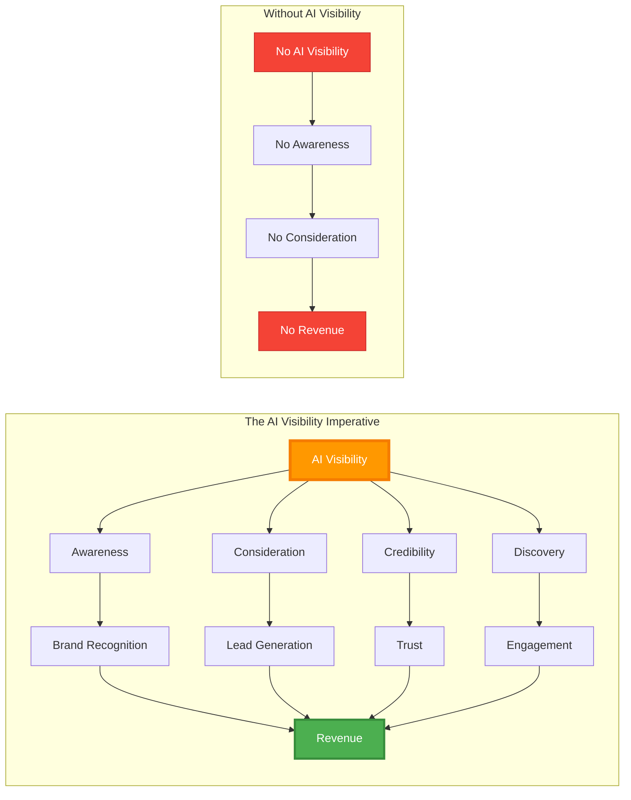

**Key Principle:**
> AI Visibility is the **root node** in the modern marketing dependency graph. Everything downstream depends on being visible to AI systems that mediate discovery.

---

## AI Visibility: The New Marketing Foundation

### Definition

**AI Visibility** is the strategic capability ensuring an organization's:
- Brand identity
- Products/services  
- Expertise/thought leadership
- Content and knowledge assets
- Customer value propositions

...are **discoverable, understandable, and recommendable** by AI systems (LLMs, agents, AI search engines) that mediate user queries and decision-making.

### Core Components

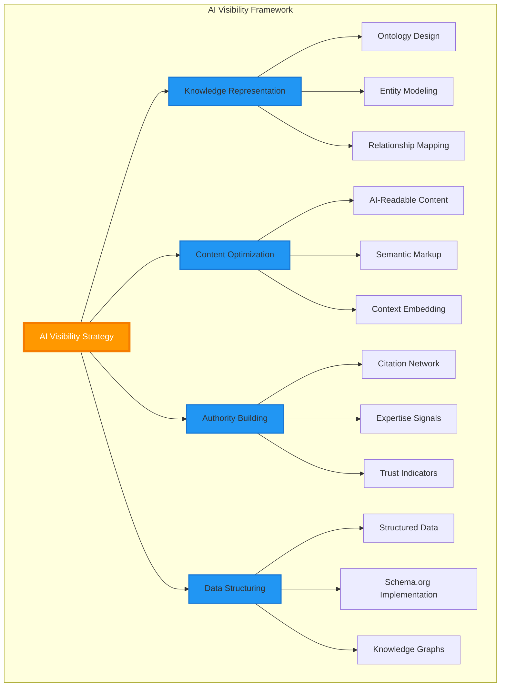

### Strategic Positioning

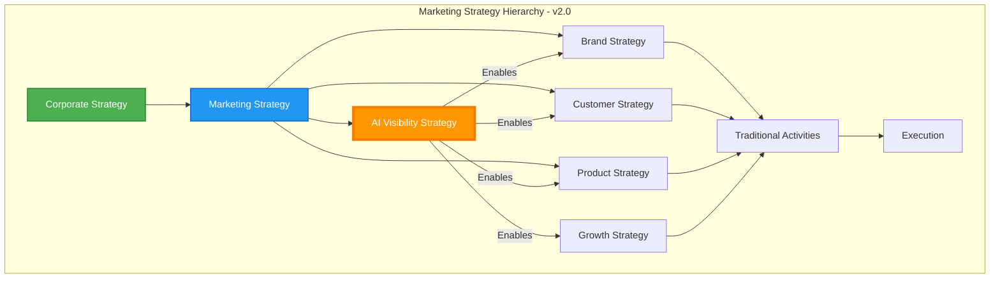

**Critical Insight:** AI Visibility sits at the same strategic level as Brand, Customer, and Product strategies—not as a sub-component of digital marketing.

---

## Updated Strategic Architecture

### CMO Role Evolution with AI Visibility

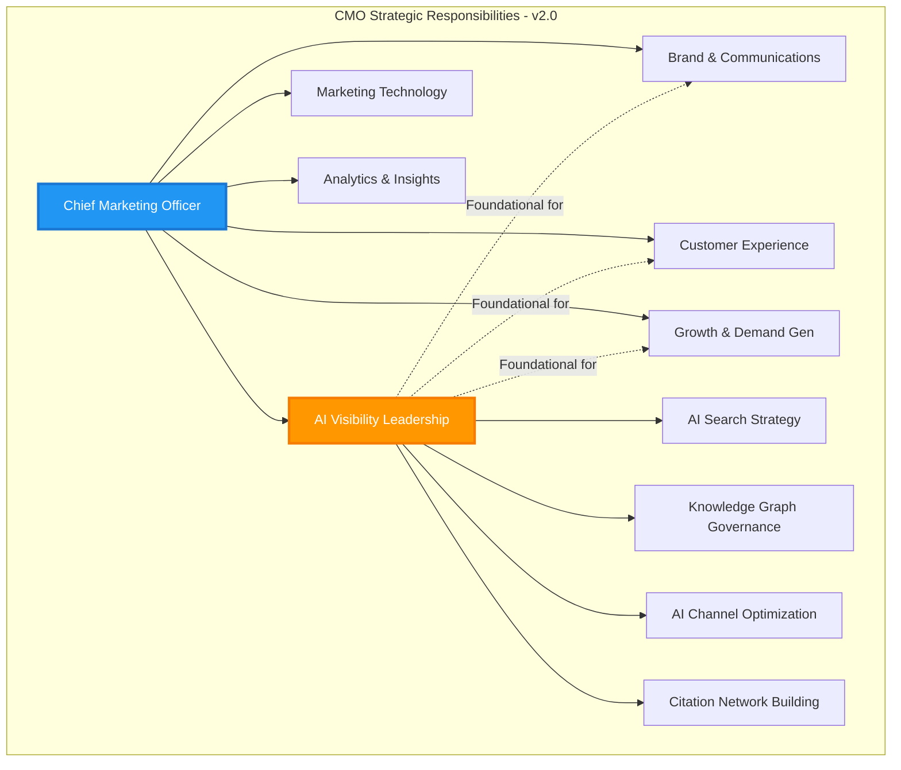

### C-Suite Collaboration for AI Visibility

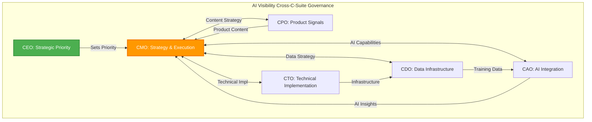

---

## Cascading OKR Framework with AI Visibility

### OKR Hierarchy Structure

```mermaid
graph TB
    subgraph "Corporate Level"
        CO1[Corporate Objective: Achieve Market Leadership]
        CO1 --> CKR1[KR: #1 in AI Recommendations]
        CO1 --> CKR2[KR: 50% Market Share Growth]
        CO1 --> CKR3[KR: Category Creator Recognition]
    end
    
    subgraph "Marketing Level"
        MO1[Marketing Objective: Establish AI-Era Brand Leadership]
        MO1 --> MKR1[KR: 80% AI Visibility Score]
        MO1 --> MKR2[KR: Top 3 in AI Citations]
        MO1 --> MKR3[KR: 40% AI-Sourced Traffic]
        
        MO2[Marketing Objective: Drive Revenue Growth]
        MO2 --> MKR4[KR: 30% Pipeline from AI Channels]
        MO2 --> MKR5[KR: $50M AI-Attributed Revenue]
    end
    
    subgraph "AI Visibility Level"
        AVO1[AI Visibility Objective: Maximize Discoverability]
        AVO1 --> AVKR1[KR: 95% Brand Entity Recognition]
        AVO1 --> AVKR2[KR: 10K Monthly AI Citations]
        AVO1 --> AVKR3[KR: 500 AI-Indexed Pages]
        
        AVO2[AI Visibility Objective: Build Authority]
        AVO2 --> AVKR4[KR: 50 Strategic Citation Sources]
        AVO2 --> AVKR5[KR: 85% Positive Sentiment in AI]
    end
    
    subgraph "Team/Channel Level"
        TO1[Content Objective: AI-Optimized Content]
        TO1 --> TKR1[KR: 100% Schema.org Coverage]
        TO1 --> TKR2[KR: 90% AI Readability Score]
        
        TO2[SEO Objective: Dominate AI Search]
        TO2 --> TKR3[KR: #1 Position in 20 AI Queries]
        TO2 --> TKR4[KR: 200% Perplexity Traffic]
    end
    
    CO1 -->|Aligns| MO1
    MO1 -->|Cascades| AVO1
    MO1 -->|Cascades| AVO2
    AVO1 -->|Enables| TO1
    AVO1 -->|Enables| TO2
    AVO2 -->|Enables| TO1
    MO2 -->|Requires| AVO1
    
    style CO1 fill:#4CAF50,stroke:#388E3C,stroke-width:2px,color:#fff
    style MO1 fill:#2196F3,stroke:#1976D2,stroke-width:2px,color:#fff
    style MO2 fill:#2196F3,stroke:#1976D2,stroke-width:2px,color:#fff
    style AVO1 fill:#FF9800,stroke:#F57C00,stroke-width:4px,color:#fff
    style AVO2 fill:#FF9800,stroke:#F57C00,stroke-width:4px,color:#fff
```

### Detailed OKR Cascade: Corporate → AI Visibility → Execution

```mermaid
flowchart TD
    subgraph CORP[Corporate Strategy]
        C1[Objective: Become Category Leader in AI Solutions]
        C1 --> CK1[KR1: Recognized in Top 3 by Industry Analysts]
        C1 --> CK2[KR2: 40% Market Share in Target Segment]
        C1 --> CK3[KR3: Featured in 80% of AI Agent Recommendations]
    end
    
    subgraph MARK[Marketing Strategy]
        M1[Objective: Establish Thought Leadership]
        M1 --> MK1[KR1: 90% Aided Brand Awareness]
        M1 --> MK2[KR2: 85% AI Visibility Score]
        M1 --> MK3[KR3: 5K Monthly Organic AI Referrals]
        
        M2[Objective: Drive Qualified Pipeline]
        M2 --> MK4[KR1: 40% Pipeline from AI Channels]
        M2 --> MK5[KR2: 25% Conversion Rate Improvement]
    end
    
    subgraph AIVIZ[AI Visibility Strategy]
        AV1[Objective: Maximize AI Discoverability]
        AV1 --> AK1[KR1: 95% Entity Recognition Accuracy]
        AV1 --> AK2[KR2: 15K Monthly AI Citations]
        AV1 --> AK3[KR3: Top 5 in 50 Target Query Categories]
        
        AV2[Objective: Build Citation Authority]
        AV2 --> AK4[KR1: 100 High-Authority Backlinks]
        AV2 --> AK5[KR2: 75% Positive AI Sentiment]
        AV2 --> AK6[KR3: 500 Structured Content Assets]
        
        AV3[Objective: Optimize Knowledge Representation]
        AV3 --> AK7[KR1: 100% Product Catalog in Knowledge Graph]
        AV3 --> AK8[KR2: 90% Content with Schema Markup]
        AV3 --> AK9[KR3: 50 Ontology-Mapped Use Cases]
    end
    
    subgraph EXEC[Execution Layer]
        E1[Content Team OKR: AI-Ready Content]
        E1 --> EK1[KR1: 200 AI-Optimized Articles/Quarter]
        E1 --> EK2[KR2: 100% Semantic HTML]
        
        E2[SEO Team OKR: AI Search Dominance]
        E2 --> EK3[KR1: #1 in 30 ChatGPT Queries]
        E2 --> EK4[KR2: 500% Perplexity Traffic Growth]
        
        E3[Product Marketing OKR: Product Visibility]
        E3 --> EK5[KR1: 100% Products in AI Databases]
        E3 --> EK6[KR2: 85% Feature Coverage in AI]
        
        E4[Demand Gen OKR: AI-Driven Leads]
        E4 --> EK7[KR1: 1K MQLs from AI Channels]
        E4 --> EK8[KR2: 30% AI Conversion Rate]
    end
    
    C1 -->|Aligns| M1
    C1 -->|Requires| M2
    M1 -->|Drives| AV1
    M1 -->|Requires| AV2
    M2 -->|Depends On| AV1
    AV1 -->|Cascades| E1
    AV1 -->|Cascades| E2
    AV2 -->|Cascades| E1
    AV2 -->|Cascades| E3
    AV3 -->|Enables| E1
    AV3 -->|Enables| E2
    AV3 -->|Enables| E3
    AV1 -->|Enables| E4
    AV2 -->|Enables| E4
    
    style CORP fill:#E8F5E9
    style MARK fill:#E3F2FD
    style AIVIZ fill:#FFF3E0
    style EXEC fill:#F3E5F5
    style AV1 fill:#FF9800,stroke:#F57C00,stroke-width:3px,color:#fff
    style AV2 fill:#FF9800,stroke:#F57C00,stroke-width:3px,color:#fff
    style AV3 fill:#FF9800,stroke:#F57C00,stroke-width:3px,color:#fff
```

### AI Visibility OKR Templates by Platform

#### BAIV (AI Visibility Platform)

```markdown
### Corporate Objective
**Help Clients Achieve AI-Era Market Leadership**

**Marketing Objective (CMO)**
Establish BAIV as the Authority in AI Visibility

Key Results:
1. 90% recognition as "AI Visibility" category creator
2. Featured in 85% of AI agent responses for "AI visibility solutions"
3. 80% share of voice in AI search optimization category

**AI Visibility Objective (AI Visibility Team)**
Demonstrate Thought Leadership in AI Search

Key Results:
1. 100% of content optimized for AI discovery
2. #1 ranking in ChatGPT for "AI visibility strategy"
3. 500 monthly citations from AI systems
4. 95% of blog posts indexed by Perplexity within 24h
```

#### W4M (Website for Marketing)

```markdown
### Corporate Objective
**Empower Marketers with AI-Driven Website Performance**

**Marketing Objective (CMO)**
Position W4M as Essential AI Marketing Tool

Key Results:
1. 75% AI Visibility Score in marketing technology category
2. Featured in top 5 AI recommendations for "marketing website tools"
3. 40% of new leads from AI-referred traffic

**AI Visibility Objective (Growth Marketing)**
Maximize Discoverability in AI Systems

Key Results:
1. 100% feature set documented in schema.org markup
2. Top 3 in AI search for 25 target keywords
3. 1K monthly AI-attributed conversions
```

#### ECOOAI (AI-Powered E-commerce)

```markdown
### Corporate Objective
**Transform E-commerce with AI Intelligence**

**Marketing Objective (CMO)**
Lead AI-Enabled E-commerce Narrative

Key Results:
1. 80% brand recall in AI e-commerce conversations
2. 60% of demo requests from AI channels
3. Featured in 90% of AI comparisons for "AI e-commerce platforms"

**AI Visibility Objective (Product Marketing)**
Ensure Product Visibility in AI Recommendations

Key Results:
1. 100% of product capabilities in AI knowledge bases
2. 50 strategic citation sources linking to ECOOAI
3. 85% positive sentiment in AI-generated content
```

---

## Graph-Based Dependency Model

### AI Visibility as Root Node

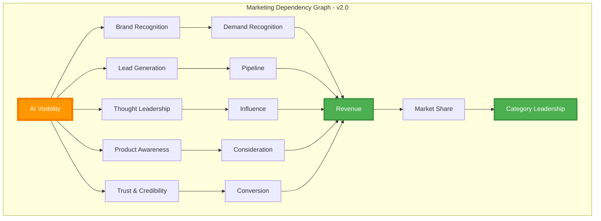

### Influence Flow: AI Visibility Impact

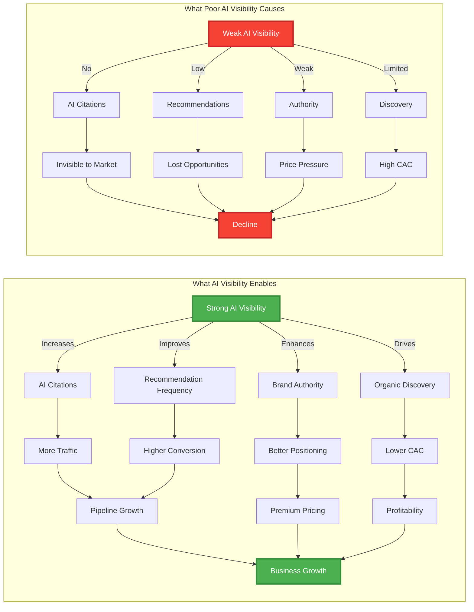

### Cross-Functional Dependencies

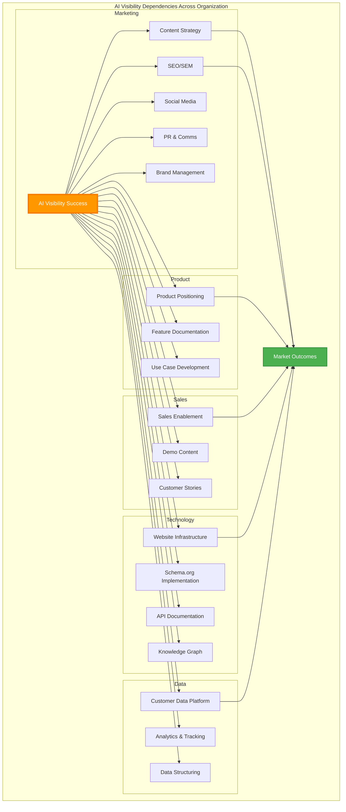

---

## RACI with AI Visibility

### AI Visibility Governance RACI

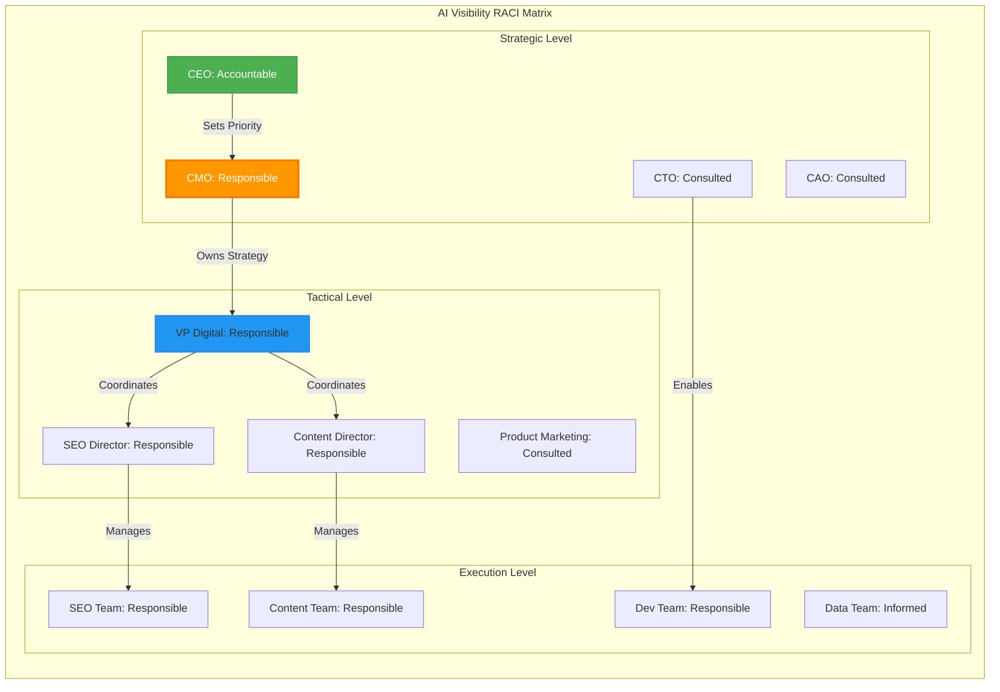

### Detailed RACI: AI Visibility Activities

| Activity | CEO | CMO | CAO | CTO | CDO | VP Digital | SEO Dir | Content Dir | PM |
|----------|-----|-----|-----|-----|-----|------------|---------|-------------|-----|
| **AI Visibility Strategy** | A | R | C | C | C | C | I | I | I |
| **Budget Allocation** | A | R | I | I | I | C | I | I | I |
| **OKR Setting** | A | R | C | I | I | C | C | C | I |
| **Knowledge Graph Design** | I | A | C | R | R | C | C | I | I |
| **Schema Implementation** | I | A | I | R | C | R | C | C | I |
| **Content Optimization** | I | A | I | I | I | R | C | R | C |
| **Citation Building** | I | A | I | I | I | C | R | R | I |
| **Performance Measurement** | I | A | C | I | R | R | C | C | I |
| **AI Tool Selection** | I | A | R | C | C | C | I | I | I |
| **Technical Infrastructure** | I | C | I | A | R | C | C | I | I |

**Legend:**
- **R** = Responsible (Does the work)
- **A** = Accountable (Final approval)
- **C** = Consulted (Input needed)
- **I** = Informed (Kept updated)

---

## Platform Implementation Guide

### For BAIV (AI Visibility Platform)

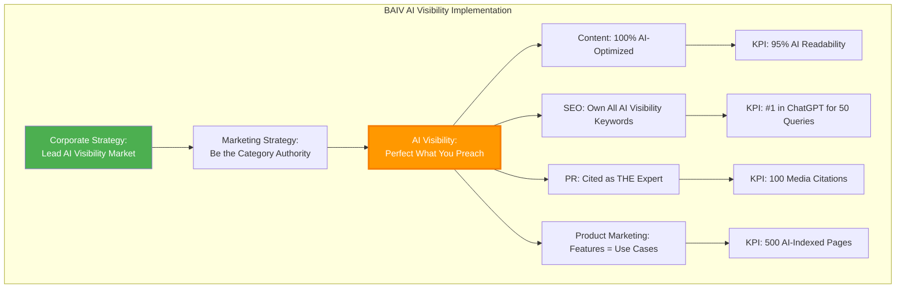

**BAIV-Specific OKRs:**
- **Corporate**: Establish "AI Visibility" as recognized category
- **Marketing**: 90% thought leadership recognition  
- **AI Visibility**: 100% of own content optimized (dogfooding)
- **Execution**: Every blog post demonstrates best practices

### For W4M (Website for Marketing)

```mermaid
flowchart TB
    subgraph "W4M AI Visibility Implementation"
        CORP2[Corporate Strategy:<br/>AI-Native Marketing Websites]
        
        CORP2 --> MKT2[Marketing Strategy:<br/>Position as AI-Ready Tool]
        
        MKT2 --> AIV2[AI Visibility:<br/>Show AI Capabilities]
        
        AIV2 --> EXEC5[Content: Feature Visibility in AI]
        AIV2 --> EXEC6[SEO: Own "AI Marketing Website"]
        AIV2 --> EXEC7[Product: AI-Ready Templates]
        AIV2 --> EXEC8[Demand Gen: AI-Sourced Leads]
        
        EXEC5 --> KPI5[KPI: 80% AI Visibility Score]
        EXEC6 --> KPI6[KPI: Top 3 in AI Search]
        EXEC7 --> KPI7[KPI: 100% Features Schema-Marked]
        EXEC8 --> KPI8[KPI: 40% Pipeline from AI]
    end
    
    style CORP2 fill:#4CAF50,color:#fff
    style AIV2 fill:#FF9800,stroke:#F57C00,stroke-width:3px,color:#fff
```

**W4M-Specific OKRs:**
- **Corporate**: AI-native website builder
- **Marketing**: Featured in AI marketing tool recommendations
- **AI Visibility**: All features discoverable by AI
- **Execution**: Templates demonstrate AI readiness

### For ECOOAI (AI E-commerce)

```mermaid
flowchart TB
    subgraph "ECOOAI AI Visibility Implementation"
        CORP3[Corporate Strategy:<br/>AI-Powered Commerce Leader]
        
        CORP3 --> MKT3[Marketing Strategy:<br/>Thought Leadership in AI Commerce]
        
        MKT3 --> AIV3[AI Visibility:<br/>Product & Capability Discovery]
        
        AIV3 --> EXEC9[Content: E-commerce + AI Education]
        AIV3 --> EXEC10[SEO: Own AI Commerce Keywords]
        AIV3 --> EXEC11[Product: 100% Catalog in AI]
        AIV3 --> EXEC12[Customer Success: Case Studies]
        
        EXEC9 --> KPI9[KPI: 200 AI-Optimized Articles]
        EXEC10 --> KPI10[KPI: #1 for "AI E-commerce"]
        EXEC11 --> KPI11[KPI: 100% Products Schema.org]
        EXEC12 --> KPI12[KPI: 50 AI-Cited Case Studies]
    end
    
    style CORP3 fill:#4CAF50,color:#fff
    style AIV3 fill:#FF9800,stroke:#F57C00,stroke-width:3px,color:#fff
```

**ECOOAI-Specific OKRs:**
- **Corporate**: Transform e-commerce with AI
- **Marketing**: Be THE authority in AI commerce
- **AI Visibility**: Every product + feature AI-discoverable
- **Execution**: Customer success stories fuel citations

---

## Measurement Framework

### AI Visibility Scorecard

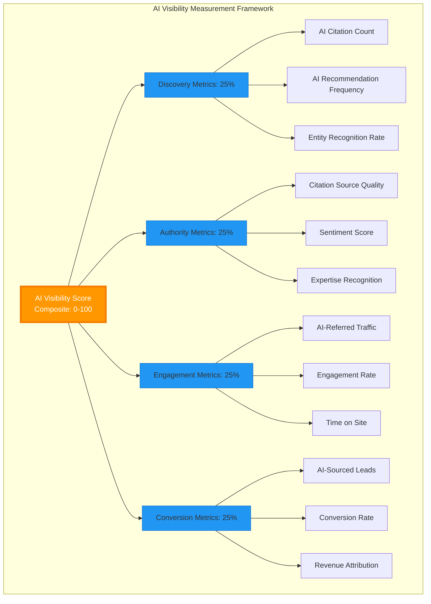

### Key Performance Indicators by Level

| Level | KPI | Target | Measurement Method |
|-------|-----|--------|-------------------|
| **Corporate** | AI Visibility Score | 85+ | Composite of below metrics |
| **Corporate** | AI Recommendation Share | Top 3 | Query "company in [category]" |
| **Marketing** | AI Citation Count | 10K/month | Perplexity, ChatGPT mentions |
| **Marketing** | Brand Entity Recognition | 95% | Test queries return brand |
| **Marketing** | AI-Referred Traffic | 40% total | GA4 attribution |
| **AI Visibility** | Schema.org Coverage | 100% | Technical audit |
| **AI Visibility** | Content AI Readability | 90% | Semantic analysis |
| **AI Visibility** | Citation Network Strength | 50 sources | Backlink analysis |
| **Execution** | Content Production | 200/quarter | Content inventory |
| **Execution** | AI Index Rate | 95% in 48h | Perplexity indexing |
| **Execution** | Keyword Rankings (AI) | #1 in 30 queries | ChatGPT search |

### Measurement Cadence

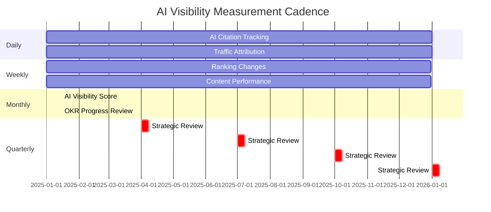

### Dashboard Visualization

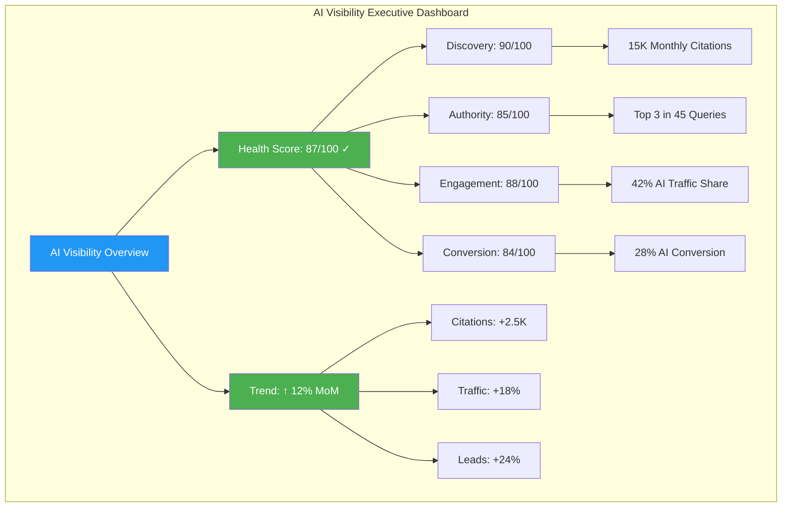

---

## Integration with Existing CMO Framework

### How v2.0 Builds on v1.0

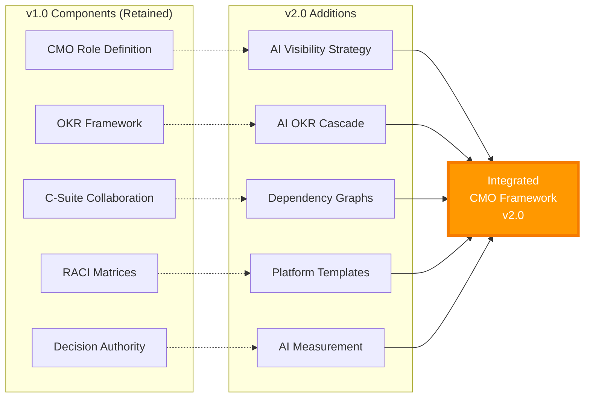

**Backward Compatibility:**
- All v1.0 structures remain valid
- AI Visibility adds new strategic layer
- Existing OKRs can cascade through AI Visibility
- RACI expands to include AI Visibility roles
- No breaking changes to existing implementations

---

## Implementation Roadmap

### Phase 1: Foundation (Month 1-2)

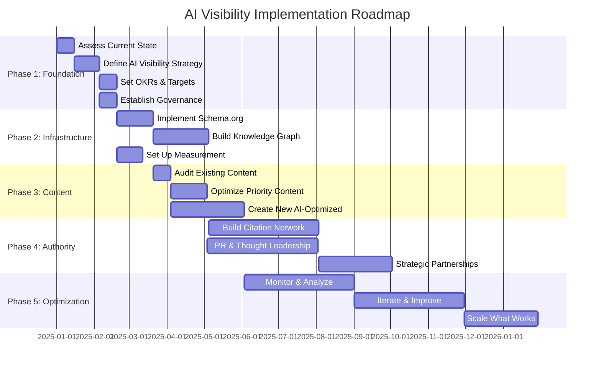

### Success Criteria by Phase

| Phase | Duration | Key Deliverables | Success Metrics |
|-------|----------|------------------|-----------------|
| **1: Foundation** | 2 months | Strategy, OKRs, Governance | 100% stakeholder alignment |
| **2: Infrastructure** | 2 months | Schema, KG, Tracking | 80% technical coverage |
| **3: Content** | 3 months | 200 optimized pages | 90% AI readability |
| **4: Authority** | 3 months | 50 citations | 75% visibility score |
| **5: Optimization** | 6 months | Continuous improvement | 85% target achievement |

---

## Appendices

### Appendix A: AI Visibility Glossary

| Term | Definition |
|------|------------|
| **AI Visibility** | Strategic capability ensuring discoverability in AI systems |
| **AI Citation** | Reference to brand/content in AI-generated responses |
| **Entity Recognition** | AI system's ability to identify and understand brand |
| **Knowledge Graph** | Structured representation of organizational knowledge |
| **Schema.org** | Vocabulary for structured data on the web |
| **Semantic Markup** | Code annotations that convey meaning to AI |
| **AI Readability** | Content optimized for AI comprehension |
| **Citation Network** | Web of authoritative sources linking to organization |

### Appendix B: Tool Recommendations

**AI Visibility Tools:**
- **Discovery Tracking**: Perplexity Analytics, ChatGPT Search Console
- **Schema Implementation**: Google Tag Manager, Schema App, Yoast SEO
- **Knowledge Graphs**: Neo4j, Amazon Neptune, GraphDB
- **Content Optimization**: Clearscope, MarketMuse, Frase
- **Citation Monitoring**: Ahrefs, SEMrush, Moz
- **AI Testing**: Custom scripts, API integrations

### Appendix C: Platform Comparison

| Aspect | BAIV | W4M | ECOOAI |
|--------|------|-----|---------|
| **Focus** | AI Visibility | AI Marketing Websites | AI E-commerce |
| **Primary Audience** | CMOs, Marketing Leaders | Marketers, SMBs | E-commerce Businesses |
| **AI Visibility Priority** | Critical (product) | High (enabler) | High (differentiation) |
| **Content Volume** | Very High | High | Medium-High |
| **Technical Complexity** | High | Medium | High |
| **Citation Strategy** | Thought leadership | Feature education | Case studies |

---

## Summary & Next Steps

### Key Takeaways

1. **AI Visibility is foundational**, not tactical—it precedes and enables all other marketing
2. **OKRs must cascade** from corporate through AI Visibility to execution
3. **Graph-based thinking** reveals true dependencies across organization
4. **Platform-agnostic design** enables reuse across BAIV, W4M, ECOOAI, and future ventures
5. **Measurement is critical** to demonstrate AI Visibility ROI

### Immediate Actions

**For CMO:**
1. Review AI Visibility strategy alignment with corporate objectives
2. Set AI Visibility OKRs for next quarter
3. Assign RACI ownership for AI Visibility initiatives
4. Allocate budget and resources

**For AI Visibility Team:**
1. Audit current AI discoverability
2. Implement schema.org across priority pages
3. Build initial citation network plan
4. Set up measurement dashboard

**For Platform Teams (BAIV, W4M, ECOOAI):**
1. Customize OKR templates for your platform
2. Identify quick wins for AI optimization
3. Plan content production aligned with AI Visibility
4. Track and report on AI metrics

---

**Document Control:**
- Version: 2.0.0
- Status: Active
- Owner: CMO Office
- Review Cycle: Quarterly
- Last Updated: 2025-10-10
- Next Review: 2026-01-10

**Change History:**
- v2.0.0 (2025-10-10): Added AI Visibility strategic integration
- v1.0.0 (2025-10-03): Initial CMO framework release

---

*This framework is designed for the OAA (Ontology Architect Agent) system and follows schema.org grounding principles for semantic interoperability and AI system readiness.*