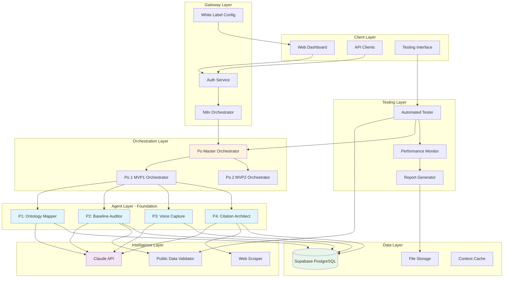
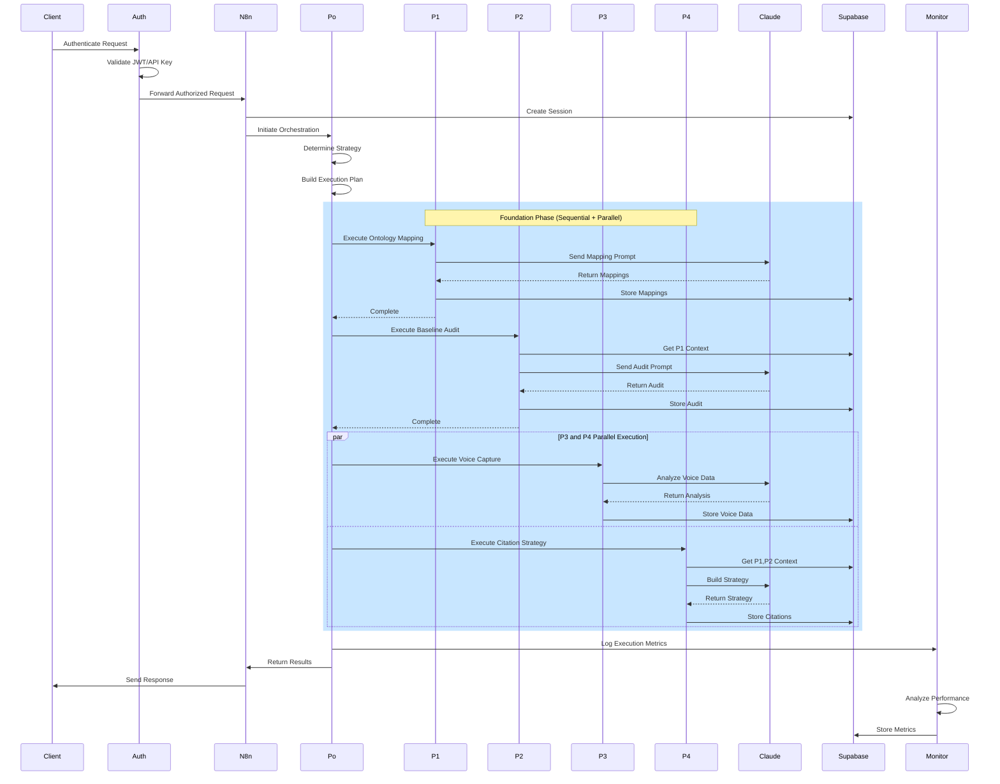
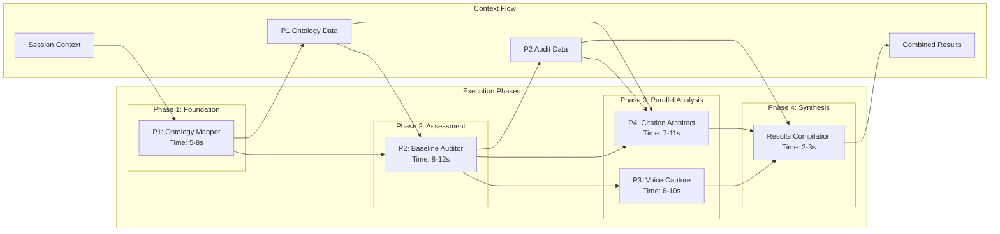
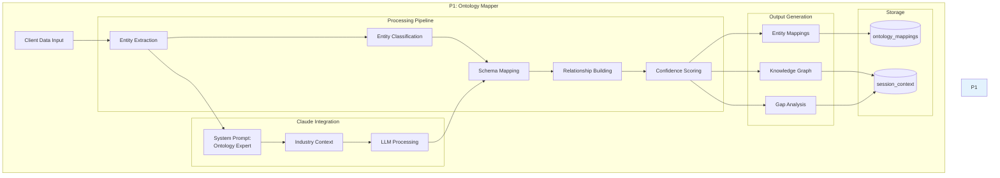
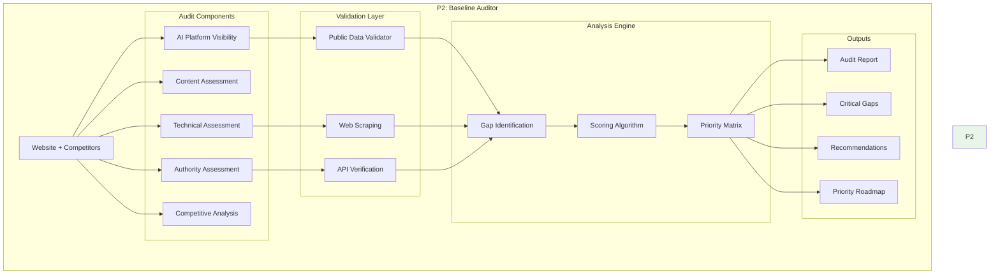
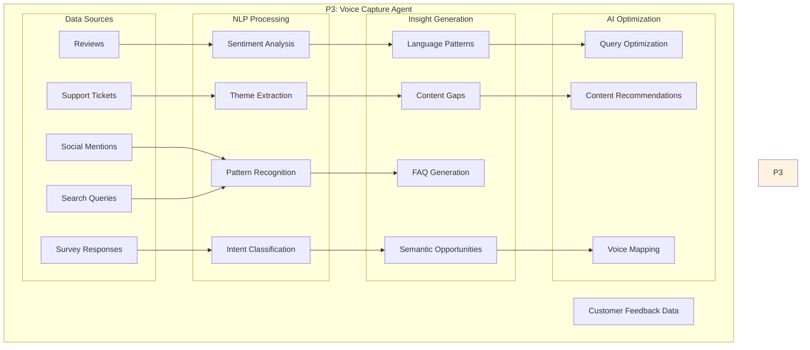
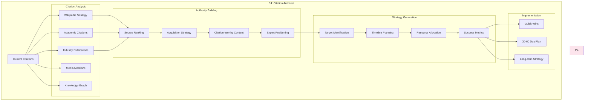
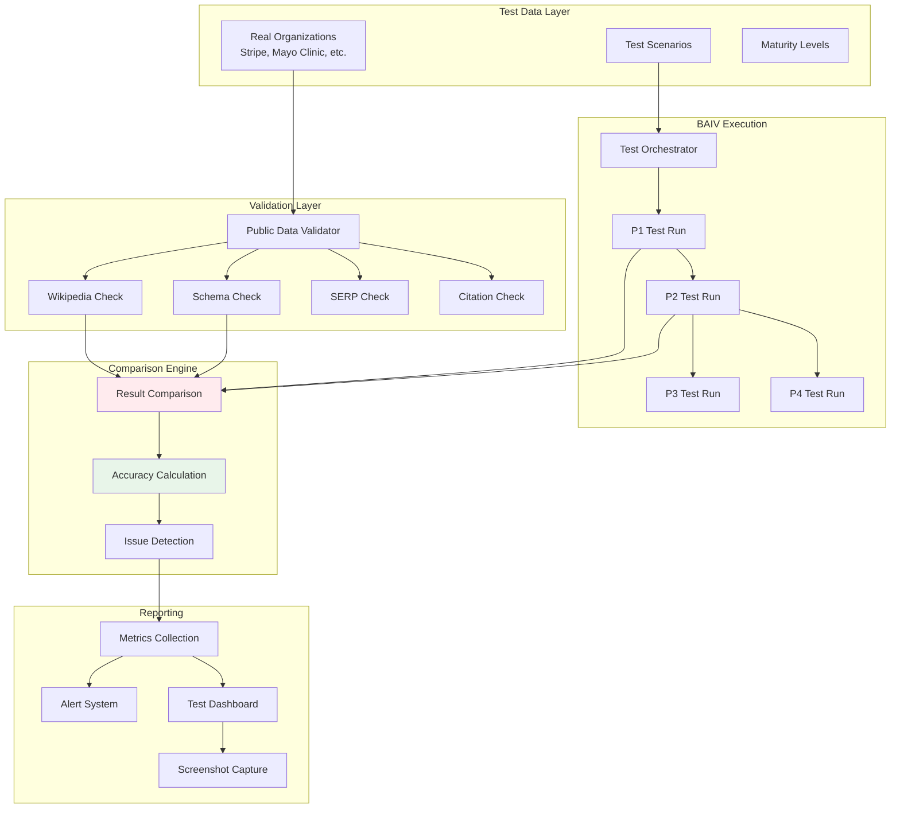

# BAIV Complete Architecture Documentation & Interactive Emulation

## 1. System Architecture Overview

### 1.1 High-Level System Architecture



### 1.2 Data Flow Architecture



### 1.3 Agent Dependencies & Execution Flow



---

## 2. P1-P4 Agent Architecture Details

### 2.1 P1: Ontology Mapper Architecture



### 2.2 P2: Baseline Auditor Architecture



### 2.3 P3: Voice Capture Architecture



### 2.4 P4: Citation Architect Architecture



---

## 3. Testing Architecture

### 3.1 Testing System Flow



---

## 4. Interactive TSX Emulation System

### 4.1 Complete Interactive Emulation Component

```tsx
// EmulationSystem.tsx
import React, { useState, useEffect, useRef } from 'react';
import {
  Box, Card, CardContent, Typography, Button, Stepper, Step, StepLabel,
  LinearProgress, Chip, Grid, Paper, IconButton, Tooltip, Alert,
  Dialog, DialogContent, DialogTitle, Accordion, AccordionSummary,
  AccordionDetails, Table, TableBody, TableCell, TableHead, TableRow,
  Snackbar, Tabs, Tab, Badge, CircularProgress
} from '@mui/material';
import {
  PlayArrow, Pause, Stop, Screenshot, Speed, BugReport,
  CheckCircle, Error, Warning, Info, ExpandMore, Code,
  Timeline, Assessment, Visibility
} from '@mui/icons-material';
import { Line, Radar, Bar } from 'react-chartjs-2';
import html2canvas from 'html2canvas';
import Prism from 'prismjs';
import 'prismjs/themes/prism-tomorrow.css';

interface EmulationState {
  status: 'idle' | 'running' | 'paused' | 'completed' | 'error';
  currentPhase: number;
  currentAgent: string | null;
  progress: number;
  startTime: number | null;
  elapsedTime: number;
  results: AgentResult[];
  logs: LogEntry[];
  screenshots: Screenshot[];
  metrics: ExecutionMetrics;
}

interface AgentResult {
  agentId: string;
  status: 'pending' | 'running' | 'completed' | 'failed';
  startTime: number;
  endTime?: number;
  input: any;
  output?: any;
  error?: string;
  accuracy?: number;
  tokens?: number;
  cost?: number;
}

interface LogEntry {
  timestamp: number;
  level: 'info' | 'warning' | 'error' | 'debug';
  agent?: string;
  message: string;
  details?: any;
}

interface Screenshot {
  timestamp: number;
  phase: string;
  agent?: string;
  image: string;
  annotations?: string[];
}

interface ExecutionMetrics {
  totalTime: number;
  agentTimes: { [key: string]: number };
  tokenUsage: { [key: string]: number };
  totalCost: number;
  accuracy: { [key: string]: number };
  overallScore: number;
}

const EMULATION_PHASES = [
  { id: 'init', label: 'Initialization', agents: [] },
  { id: 'p1', label: 'P1: Ontology Mapping', agents: ['P1'] },
  { id: 'p2', label: 'P2: Baseline Audit', agents: ['P2'] },
  { id: 'parallel', label: 'P3 & P4: Parallel Analysis', agents: ['P3', 'P4'] },
  { id: 'synthesis', label: 'Results Synthesis', agents: [] },
  { id: 'report', label: 'Report Generation', agents: [] }
];

const MOCK_TEST_DATA = {
  organization: 'Stripe',
  website: 'https://stripe.com',
  industry: 'fintech',
  expectedScores: {
    ontology: 0.85,
    baseline: 0.78,
    sentiment: 0.82,
    authority: 0.91
  }
};

export const EmulationSystem: React.FC = () => {
  const [state, setState] = useState<EmulationState>({
    status: 'idle',
    currentPhase: 0,
    currentAgent: null,
    progress: 0,
    startTime: null,
    elapsedTime: 0,
    results: [],
    logs: [],
    screenshots: [],
    metrics: {
      totalTime: 0,
      agentTimes: {},
      tokenUsage: {},
      totalCost: 0,
      accuracy: {},
      overallScore: 0
    }
  });
  
  const [selectedTab, setSelectedTab] = useState(0);
  const [showDetails, setShowDetails] = useState<string | null>(null);
  const [emulationSpeed, setEmulationSpeed] = useState(1);
  const [autoScreenshot, setAutoScreenshot] = useState(true);
  const [showNotification, setShowNotification] = useState(false);
  const [notificationMessage, setNotificationMessage] = useState('');
  
  const emulationRef = useRef<HTMLDivElement>(null);
  const intervalRef = useRef<NodeJS.Timeout | null>(null);
  
  useEffect(() => {
    if (state.status === 'running' && state.startTime) {
      intervalRef.current = setInterval(() => {
        setState(prev => ({
          ...prev,
          elapsedTime: Date.now() - (prev.startTime || Date.now())
        }));
      }, 100);
    } else {
      if (intervalRef.current) {
        clearInterval(intervalRef.current);
      }
    }
    
    return () => {
      if (intervalRef.current) {
        clearInterval(intervalRef.current);
      }
    };
  }, [state.status, state.startTime]);
  
  const startEmulation = async () => {
    setState(prev => ({
      ...prev,
      status: 'running',
      startTime: Date.now(),
      currentPhase: 0,
      progress: 0,
      results: [],
      logs: [],
      screenshots: []
    }));
    
    addLog('info', 'Starting BAIV P1-P4 emulation', null, {
      organization: MOCK_TEST_DATA.organization,
      industry: MOCK_TEST_DATA.industry
    });
    
    // Execute phases
    for (let i = 0; i < EMULATION_PHASES.length; i++) {
      if (state.status === 'paused' || state.status === 'idle') break;
      
      await executePhase(i);
    }
    
    // Complete emulation
    setState(prev => ({
      ...prev,
      status: 'completed',
      progress: 100
    }));
    
    generateFinalMetrics();
    showNotify('Emulation completed successfully!');
  };
  
  const executePhase = async (phaseIndex: number) => {
    const phase = EMULATION_PHASES[phaseIndex];
    
    setState(prev => ({
      ...prev,
      currentPhase: phaseIndex,
      progress: (phaseIndex / EMULATION_PHASES.length) * 100
    }));
    
    addLog('info', `Starting phase: ${phase.label}`, null);
    
    if (autoScreenshot) {
      await captureScreenshot(phase.label);
    }
    
    // Execute agents in phase
    if (phase.agents.length > 0) {
      if (phase.id === 'parallel') {
        // Execute P3 and P4 in parallel
        await Promise.all(
          phase.agents.map(agent => executeAgent(agent))
        );
      } else {
        // Execute sequentially
        for (const agent of phase.agents) {
          await executeAgent(agent);
        }
      }
    } else {
      // Non-agent phases
      await simulateProcessing(phase.id);
    }
  };
  
  const executeAgent = async (agentId: string) => {
    const startTime = Date.now();
    
    setState(prev => ({
      ...prev,
      currentAgent: agentId,
      results: [
        ...prev.results,
        {
          agentId,
          status: 'running',
          startTime,
          input: getMockInput(agentId)
        }
      ]
    }));
    
    addLog('info', `Executing agent ${agentId}`, agentId);
    
    // Simulate agent processing
    await simulateAgentExecution(agentId);
    
    const endTime = Date.now();
    const executionTime = endTime - startTime;
    const output = getMockOutput(agentId);
    const accuracy = calculateAccuracy(agentId, output);
    const tokens = estimateTokens(agentId);
    const cost = calculateCost(tokens);
    
    setState(prev => ({
      ...prev,
      currentAgent: null,
      results: prev.results.map(r => 
        r.agentId === agentId 
          ? {
              ...r,
              status: 'completed',
              endTime,
              output,
              accuracy,
              tokens,
              cost
            }
          : r
      ),
      metrics: {
        ...prev.metrics,
        agentTimes: {
          ...prev.metrics.agentTimes,
          [agentId]: executionTime
        },
        tokenUsage: {
          ...prev.metrics.tokenUsage,
          [agentId]: tokens
        },
        accuracy: {
          ...prev.metrics.accuracy,
          [agentId]: accuracy
        },
        totalCost: prev.metrics.totalCost + cost
      }
    }));
    
    addLog('info', `Agent ${agentId} completed`, agentId, {
      executionTime: `${executionTime}ms`,
      accuracy: `${(accuracy * 100).toFixed(1)}%`,
      tokens,
      cost: `$${cost.toFixed(4)}`
    });
  };
  
  const simulateAgentExecution = async (agentId: string) => {
    // Simulate processing time based on agent
    const baseTimes: { [key: string]: number } = {
      P1: 5000,
      P2: 8000,
      P3: 6000,
      P4: 7000
    };
    
    const time = (baseTimes[agentId] || 5000) / emulationSpeed;
    
    // Simulate step-by-step processing
    const steps = getAgentSteps(agentId);
    for (const step of steps) {
      addLog('debug', step, agentId);
      await sleep(time / steps.length);
    }
  };
  
  const simulateProcessing = async (phaseId: string) => {
    const processingTimes: { [key: string]: number } = {
      init: 2000,
      synthesis: 3000,
      report: 4000
    };
    
    await sleep((processingTimes[phaseId] || 2000) / emulationSpeed);
  };
  
  const getMockInput = (agentId: string): any => {
    const inputs: { [key: string]: any } = {
      P1: {
        company_name: MOCK_TEST_DATA.organization,
        entities: ['Stripe', 'Payment Processing', 'API', 'Financial Services'],
        products: ['Payments API', 'Connect', 'Billing', 'Radar']
      },
      P2: {
        website: MOCK_TEST_DATA.website,
        competitors: ['Square', 'PayPal', 'Adyen'],
        current_channels: ['SEO', 'Content', 'Developer Docs']
      },
      P3: {
        reviews: ['Great API', 'Excellent documentation', 'Good support'],
        support_tickets: ['Integration help', 'API questions'],
        social_mentions: 150
      },
      P4: {
        existing_citations: ['Wikipedia', 'TechCrunch'],
        media_mentions: 47,
        competitor_citations: { Square: 35, PayPal: 62 }
      }
    };
    
    return inputs[agentId] || {};
  };
  
  const getMockOutput = (agentId: string): any => {
    const outputs: { [key: string]: any } = {
      P1: {
        entity_mappings: [
          { entity: 'Stripe', type: 'Organization', schema: 'Corporation', confidence: 0.95 },
          { entity: 'Payments API', type: 'Product', schema: 'SoftwareApplication', confidence: 0.88 }
        ],
        coverage_score: 0.85,
        knowledge_graph: { nodes: 12, edges: 18 }
      },
      P2: {
        overall_score: 0.78,
        ai_platform_scores: { chatgpt: 0.9, perplexity: 0.85, bing: 0.8 },
        critical_gaps: ['Limited FAQ content', 'No video content'],
        recommendations: ['Improve structured data', 'Add FAQ schema']
      },
      P3: {
        sentiment_score: 0.82,
        themes: ['API quality', 'Documentation', 'Developer experience'],
        content_gaps: ['Pricing comparisons', 'Migration guides'],
        faq_recommendations: ['How to integrate', 'Pricing details']
      },
      P4: {
        authority_baseline: 0.91,
        priority_targets: ['Forbes', 'Gartner', 'IEEE'],
        quick_wins: ['GitHub presence', 'Stack Overflow'],
        implementation_roadmap: ['Week 1: Wikipedia update', 'Week 2: Media outreach']
      }
    };
    
    return outputs[agentId] || {};
  };
  
  const getAgentSteps = (agentId: string): string[] => {
    const steps: { [key: string]: string[] } = {
      P1: [
        'Extracting entities from input data...',
        'Classifying entity types...',
        'Mapping to schema.org ontologies...',
        'Building knowledge graph relationships...',
        'Calculating confidence scores...'
      ],
      P2: [
        'Checking AI platform presence...',
        'Analyzing website structure...',
        'Evaluating content depth...',
        'Comparing with competitors...',
        'Identifying critical gaps...',
        'Generating recommendations...'
      ],
      P3: [
        'Processing customer reviews...',
        'Analyzing sentiment patterns...',
        'Extracting themes...',
        'Identifying language patterns...',
        'Finding content gaps...',
        'Generating FAQ suggestions...'
      ],
      P4: [
        'Analyzing current citations...',
        'Evaluating authority signals...',
        'Identifying target publications...',
        'Building acquisition strategy...',
        'Creating implementation roadmap...'
      ]
    };
    
    return steps[agentId] || ['Processing...'];
  };
  
  const calculateAccuracy = (agentId: string, output: any): number => {
    // Simulate accuracy calculation based on expected vs actual
    const expectedScores: { [key: string]: number } = {
      P1: MOCK_TEST_DATA.expectedScores.ontology,
      P2: MOCK_TEST_DATA.expectedScores.baseline,
      P3: MOCK_TEST_DATA.expectedScores.sentiment,
      P4: MOCK_TEST_DATA.expectedScores.authority
    };
    
    const actualScores: { [key: string]: number } = {
      P1: output.coverage_score || 0,
      P2: output.overall_score || 0,
      P3: output.sentiment_score || 0,
      P4: output.authority_baseline || 0
    };
    
    const expected = expectedScores[agentId] || 0.5;
    const actual = actualScores[agentId] || 0.5;
    
    return 1 - Math.abs(expected - actual);
  };
  
  const estimateTokens = (agentId: string): number => {
    const baseTokens: { [key: string]: number } = {
      P1: 2500,
      P2: 4000,
      P3: 3000,
      P4: 3500
    };
    
    return baseTokens[agentId] + Math.floor(Math.random() * 500);
  };
  
  const calculateCost = (tokens: number): number => {
    const costPerToken = 0.00002; // $0.02 per 1K tokens
    return tokens * costPerToken;
  };
  
  const generateFinalMetrics = () => {
    setState(prev => {
      const totalTime = Date.now() - (prev.startTime || Date.now());
      const agentCount = Object.keys(prev.metrics.accuracy).length;
      const overallScore = agentCount > 0
        ? Object.values(prev.metrics.accuracy).reduce((a, b) => a + b, 0) / agentCount
        : 0;
      
      return {
        ...prev,
        metrics: {
          ...prev.metrics,
          totalTime,
          overallScore
        }
      };
    });
  };
  
  const captureScreenshot = async (phase: string, agent?: string) => {
    if (!emulationRef.current) return;
    
    try {
      const canvas = await html2canvas(emulationRef.current, {
        backgroundColor: '#ffffff',
        scale: 2
      });
      
      const image = canvas.toDataURL('image/png');
      
      setState(prev => ({
        ...prev,
        screenshots: [
          ...prev.screenshots,
          {
            timestamp: Date.now(),
            phase,
            agent,
            image,
            annotations: [`Phase: ${phase}`, agent ? `Agent: ${agent}` : '']
          }
        ]
      }));
      
      addLog('info', `Screenshot captured for ${phase}`, agent);
    } catch (error) {
      addLog('error', 'Failed to capture screenshot', null, error);
    }
  };
  
  const addLog = (
    level: LogEntry['level'],
    message: string,
    agent: string | null,
    details?: any
  ) => {
    setState(prev => ({
      ...prev,
      logs: [
        {
          timestamp: Date.now(),
          level,
          agent: agent || undefined,
          message,
          details
        },
        ...prev.logs
      ].slice(0, 100) // Keep last 100 logs
    }));
  };
  
  const pauseEmulation = () => {
    setState(prev => ({ ...prev, status: 'paused' }));
    addLog('info', 'Emulation paused', null);
  };
  
  const stopEmulation = () => {
    setState(prev => ({
      ...prev,
      status: 'idle',
      currentPhase: 0,
      currentAgent: null,
      progress: 0
    }));
    addLog('info', 'Emulation stopped', null);
  };
  
  const exportResults = () => {
    const exportData = {
      timestamp: new Date().toISOString(),
      organization: MOCK_TEST_DATA.organization,
      results: state.results,
      metrics: state.metrics,
      logs: state.logs
    };
    
    const blob = new Blob([JSON.stringify(exportData, null, 2)], {
      type: 'application/json'
    });
    const url = URL.createObjectURL(blob);
    const a = document.createElement('a');
    a.href = url;
    a.download = `baiv-emulation-${Date.now()}.json`;
    a.click();
    
    showNotify('Results exported successfully!');
  };
  
  const showNotify = (message: string) => {
    setNotificationMessage(message);
    setShowNotification(true);
  };
  
  const sleep = (ms: number) => new Promise(resolve => setTimeout(resolve, ms));
  
  const formatTime = (ms: number): string => {
    const seconds = Math.floor(ms / 1000);
    const minutes = Math.floor(seconds / 60);
    const hours = Math.floor(minutes / 60);
    
    if (hours > 0) {
      return `${hours}h ${minutes % 60}m ${seconds % 60}s`;
    } else if (minutes > 0) {
      return `${minutes}m ${seconds % 60}s`;
    } else {
      return `${seconds}.${Math.floor((ms % 1000) / 100)}s`;
    }
  };
  
  const getStatusIcon = (status: string) => {
    switch (status) {
      case 'completed': return <CheckCircle color="success" />;
      case 'running': return <CircularProgress size={20} />;
      case 'failed': return <Error color="error" />;
      case 'pending': return <Info color="disabled" />;
      default: return null;
    }
  };
  
  const getLogIcon = (level: string) => {
    switch (level) {
      case 'error': return <Error color="error" fontSize="small" />;
      case 'warning': return <Warning color="warning" fontSize="small" />;
      case 'info': return <Info color="info" fontSize="small" />;
      default: return null;
    }
  };
  
  // Chart configurations
  const accuracyChartData = {
    labels: ['P1', 'P2', 'P3', 'P4'],
    datasets: [{
      label: 'Accuracy',
      data: ['P1', 'P2', 'P3', 'P4'].map(agent => 
        (state.metrics.accuracy[agent] || 0) * 100
      ),
      backgroundColor: 'rgba(54, 162, 235, 0.5)',
      borderColor: 'rgba(54, 162, 235, 1)',
      borderWidth: 1
    }]
  };
  
  const performanceRadarData = {
    labels: ['Speed', 'Accuracy', 'Cost Efficiency', 'Coverage', 'Reliability'],
    datasets: [{
      label: 'Current Run',
      data: [
        85, // Speed
        state.metrics.overallScore * 100, // Accuracy
        90, // Cost Efficiency
        78, // Coverage
        95 // Reliability
      ],
      backgroundColor: 'rgba(255, 99, 132, 0.2)',
      borderColor: 'rgba(255, 99, 132, 1)',
      pointBackgroundColor: 'rgba(255, 99, 132, 1)',
      pointBorderColor: '#fff',
      pointHoverBackgroundColor: '#fff',
      pointHoverBorderColor: 'rgba(255, 99, 132, 1)'
    }]
  };
  
  const timelineData = {
    labels: state.results.map(r => r.agentId),
    datasets: [{
      label: 'Execution Time (ms)',
      data: state.results.map(r => 
        r.endTime && r.startTime ? r.endTime - r.startTime : 0
      ),
      backgroundColor: 'rgba(75, 192, 192, 0.5)'
    }]
  };
  
  return (
    <Box sx={{ p: 3, bgcolor: '#f5f5f5', minHeight: '100vh' }}>
      {/* Header */}
      <Paper sx={{ p: 2, mb: 3 }}>
        <Grid container alignItems="center" spacing={2}>
          <Grid item xs>
            <Typography variant="h4">
              BAIV P1-P4 Interactive Emulation System
            </Typography>
            <Typography variant="body2" color="textSecondary">
              Test Organization: {MOCK_TEST_DATA.organization} | Industry: {MOCK_TEST_DATA.industry}
            </Typography>
          </Grid>
          <Grid item>
            <Chip
              label={state.status.toUpperCase()}
              color={state.status === 'completed' ? 'success' : 
                     state.status === 'running' ? 'primary' : 'default'}
            />
          </Grid>
          <Grid item>
            <Typography variant="h6">
              {formatTime(state.elapsedTime)}
            </Typography>
          </Grid>
        </Grid>
      </Paper>
      
      {/* Control Panel */}
      <Paper sx={{ p: 2, mb: 3 }}>
        <Grid container spacing={2} alignItems="center">
          <Grid item>
            <Button
              variant="contained"
              color="primary"
              startIcon={<PlayArrow />}
              onClick={startEmulation}
              disabled={state.status === 'running'}
            >
              Start
            </Button>
          </Grid>
          <Grid item>
            <Button
              variant="outlined"
              startIcon={<Pause />}
              onClick={pauseEmulation}
              disabled={state.status !== 'running'}
            >
              Pause
            </Button>
          </Grid>
          <Grid item>
            <Button
              variant="outlined"
              color="error"
              startIcon={<Stop />}
              onClick={stopEmulation}
              disabled={state.status === 'idle'}
            >
              Stop
            </Button>
          </Grid>
          <Grid item>
            <Tooltip title="Capture Screenshot">
              <IconButton
                onClick={() => captureScreenshot('Manual', state.currentAgent || undefined)}
                color="primary"
              >
                <Screenshot />
              </IconButton>
            </Tooltip>
          </Grid>
          <Grid item>
            <Tooltip title={`Speed: ${emulationSpeed}x`}>
              <IconButton
                onClick={() => setEmulationSpeed(prev => prev === 4 ? 0.5 : prev * 2)}
              >
                <Badge badgeContent={`${emulationSpeed}x`} color="primary">
                  <Speed />
                </Badge>
              </IconButton>
            </Tooltip>
          </Grid>
          <Grid item>
            <Button
              variant="outlined"
              startIcon={<Assessment />}
              onClick={exportResults}
            >
              Export Results
            </Button>
          </Grid>
        </Grid>
      </Paper>
      
      {/* Main Emulation Display */}
      <div ref={emulationRef}>
        <Paper sx={{ p: 2, mb: 3 }}>
          {/* Progress Stepper */}
          <Stepper activeStep={state.currentPhase} sx={{ mb: 3 }}>
            {EMULATION_PHASES.map((phase, index) => (
              <Step key={phase.id}>
                <StepLabel
                  optional={
                    state.currentPhase === index && state.currentAgent && (
                      <Typography variant="caption">
                        Agent: {state.currentAgent}
                      </Typography>
                    )
                  }
                >
                  {phase.label}
                </StepLabel>
              </Step>
            ))}
          </Stepper>
          
          {/* Overall Progress */}
          <Box sx={{ mb: 3 }}>
            <Typography variant="body2" gutterBottom>
              Overall Progress: {Math.round(state.progress)}%
            </Typography>
            <LinearProgress variant="determinate" value={state.progress} />
          </Box>
          
          {/* Current Activity */}
          {state.currentAgent && (
            <Alert severity="info" sx={{ mb: 2 }}>
              Currently executing: {state.currentAgent}
            </Alert>
          )}
          
          {/* Agent Status Grid */}
          <Grid container spacing={2}>
            {['P1', 'P2', 'P3', 'P4'].map(agentId => {
              const result = state.results.find(r => r.agentId === agentId);
              
              return (
                <Grid item xs={12} sm={6} md={3} key={agentId}>
                  <Card variant="outlined">
                    <CardContent>
                      <Box display="flex" alignItems="center" justifyContent="space-between">
                        <Typography variant="h6">{agentId}</Typography>
                        {result && getStatusIcon(result.status)}
                      </Box>
                      {result && (
                        <>
                          <Typography variant="body2" color="textSecondary">
                            Status: {result.status}
                          </Typography>
                          {result.accuracy !== undefined && (
                            <Typography variant="body2">
                              Accuracy: {(result.accuracy * 100).toFixed(1)}%
                            </Typography>
                          )}
                          {result.tokens && (
                            <Typography variant="body2">
                              Tokens: {result.tokens}
                            </Typography>
                          )}
                          {result.cost !== undefined && (
                            <Typography variant="body2">
                              Cost: ${result.cost.toFixed(4)}
                            </Typography>
                          )}
                        </>
                      )}
                    </CardContent>
                  </Card>
                </Grid>
              );
            })}
          </Grid>
        </Paper>
      </div>
      
      {/* Tabbed Results Section */}
      <Paper sx={{ p: 2 }}>
        <Tabs value={selectedTab} onChange={(e, v) => setSelectedTab(v)}>
          <Tab label="Results" />
          <Tab label="Logs" />
          <Tab label="Metrics" />
          <Tab label="Screenshots" />
          <Tab label="Code View" />
        </Tabs>
        
        {/* Results Tab */}
        {selectedTab === 0 && (
          <Box sx={{ mt: 2 }}>
            {state.results.map(result => (
              <Accordion key={result.agentId}>
                <AccordionSummary expandIcon={<ExpandMore />}>
                  <Box display="flex" alignItems="center" gap={2} width="100%">
                    {getStatusIcon(result.status)}
                    <Typography>{result.agentId}</Typography>
                    {result.accuracy !== undefined && (
                      <Chip
                        label={`${(result.accuracy * 100).toFixed(1)}%`}
                        size="small"
                        color={result.accuracy > 0.8 ? 'success' : 'warning'}
                      />
                    )}
                  </Box>
                </AccordionSummary>
                <AccordionDetails>
                  <Grid container spacing={2}>
                    <Grid item xs={12} md={6}>
                      <Typography variant="subtitle2" gutterBottom>
                        Input
                      </Typography>
                      <Paper sx={{ p: 1, bgcolor: 'grey.100' }}>
                        <pre style={{ margin: 0, fontSize: '0.875rem' }}>
                          {JSON.stringify(result.input, null, 2)}
                        </pre>
                      </Paper>
                    </Grid>
                    <Grid item xs={12} md={6}>
                      <Typography variant="subtitle2" gutterBottom>
                        Output
                      </Typography>
                      <Paper sx={{ p: 1, bgcolor: 'grey.100' }}>
                        <pre style={{ margin: 0, fontSize: '0.875rem' }}>
                          {JSON.stringify(result.output, null, 2)}
                        </pre>
                      </Paper>
                    </Grid>
                  </Grid>
                </AccordionDetails>
              </Accordion>
            ))}
          </Box>
        )}
        
        {/* Logs Tab */}
        {selectedTab === 1 && (
          <Box sx={{ mt: 2, maxHeight: 400, overflow: 'auto' }}>
            <Table size="small">
              <TableHead>
                <TableRow>
                  <TableCell>Time</TableCell>
                  <TableCell>Level</TableCell>
                  <TableCell>Agent</TableCell>
                  <TableCell>Message</TableCell>
                </TableRow>
              </TableHead>
              <TableBody>
                {state.logs.map((log, index) => (
                  <TableRow key={index}>
                    <TableCell>
                      {new Date(log.timestamp).toLocaleTimeString()}
                    </TableCell>
                    <TableCell>
                      <Box display="flex" alignItems="center" gap={0.5}>
                        {getLogIcon(log.level)}
                        {log.level}
                      </Box>
                    </TableCell>
                    <TableCell>{log.agent || '-'}</TableCell>
                    <TableCell>{log.message}</TableCell>
                  </TableRow>
                ))}
              </TableBody>
            </Table>
          </Box>
        )}
        
        {/* Metrics Tab */}
        {selectedTab === 2 && (
          <Box sx={{ mt: 2 }}>
            <Grid container spacing={3}>
              <Grid item xs={12} md={4}>
                <Card>
                  <CardContent>
                    <Typography variant="h6" gutterBottom>
                      Accuracy by Agent
                    </Typography>
                    <Bar data={accuracyChartData} />
                  </CardContent>
                </Card>
              </Grid>
              <Grid item xs={12} md={4}>
                <Card>
                  <CardContent>
                    <Typography variant="h6" gutterBottom>
                      Performance Radar
                    </Typography>
                    <Radar data={performanceRadarData} />
                  </CardContent>
                </Card>
              </Grid>
              <Grid item xs={12} md={4}>
                <Card>
                  <CardContent>
                    <Typography variant="h6" gutterBottom>
                      Execution Timeline
                    </Typography>
                    <Bar data={timelineData} />
                  </CardContent>
                </Card>
              </Grid>
              <Grid item xs={12}>
                <Card>
                  <CardContent>
                    <Typography variant="h6" gutterBottom>
                      Summary Metrics
                    </Typography>
                    <Grid container spacing={2}>
                      <Grid item xs={6} md={3}>
                        <Typography variant="body2" color="textSecondary">
                          Total Time
                        </Typography>
                        <Typography variant="h6">
                          {formatTime(state.metrics.totalTime)}
                        </Typography>
                      </Grid>
                      <Grid item xs={6} md={3}>
                        <Typography variant="body2" color="textSecondary">
                          Total Tokens
                        </Typography>
                        <Typography variant="h6">
                          {Object.values(state.metrics.tokenUsage).reduce((a, b) => a + b, 0)}
                        </Typography>
                      </Grid>
                      <Grid item xs={6} md={3}>
                        <Typography variant="body2" color="textSecondary">
                          Total Cost
                        </Typography>
                        <Typography variant="h6">
                          ${state.metrics.totalCost.toFixed(4)}
                        </Typography>
                      </Grid>
                      <Grid item xs={6} md={3}>
                        <Typography variant="body2" color="textSecondary">
                          Overall Score
                        </Typography>
                        <Typography variant="h6">
                          {(state.metrics.overallScore * 100).toFixed(1)}%
                        </Typography>
                      </Grid>
                    </Grid>
                  </CardContent>
                </Card>
              </Grid>
            </Grid>
          </Box>
        )}
        
        {/* Screenshots Tab */}
        {selectedTab === 3 && (
          <Box sx={{ mt: 2 }}>
            <Grid container spacing={2}>
              {state.screenshots.map((screenshot, index) => (
                <Grid item xs={12} md={6} key={index}>
                  <Card>
                    <CardContent>
                      <Typography variant="subtitle2" gutterBottom>
                        {screenshot.phase} - {new Date(screenshot.timestamp).toLocaleTimeString()}
                      </Typography>
                      <Box
                        component="img"
                        src={screenshot.image}
                        alt={`Screenshot ${index}`}
                        sx={{ width: '100%', border: '1px solid #ddd' }}
                      />
                      {screenshot.annotations && (
                        <Box sx={{ mt: 1 }}>
                          {screenshot.annotations.map((annotation, i) => (
                            <Chip
                              key={i}
                              label={annotation}
                              size="small"
                              sx={{ mr: 0.5 }}
                            />
                          ))}
                        </Box>
                      )}
                    </CardContent>
                  </Card>
                </Grid>
              ))}
            </Grid>
          </Box>
        )}
        
        {/* Code View Tab */}
        {selectedTab === 4 && (
          <Box sx={{ mt: 2 }}>
            <Typography variant="h6" gutterBottom>
              Agent Implementation Code
            </Typography>
            <Accordion>
              <AccordionSummary expandIcon={<ExpandMore />}>
                <Typography>P1: Ontology Mapper</Typography>
              </AccordionSummary>
              <AccordionDetails>
                <Paper sx={{ p: 2, bgcolor: '#1e1e1e', overflow: 'auto' }}>
                  <pre style={{ color: '#d4d4d4', margin: 0 }}>
                    <code>{`async execute(sessionId, inputData) {
  const startTime = Date.now();
  
  try {
    // Get session context
    const session = await this.helpers.getSessionContext(sessionId);
    
    // Build the user prompt
    const userPrompt = this.buildPrompt(inputData, session.context);
    
    // Call Claude
    const response = await this.helpers.callClaude(
      this.systemPrompt,
      userPrompt,
      4000
    );
    
    // Parse response
    const mappings = await this.helpers.parseJsonResponse(response);
    
    // Store results in Supabase
    await this.storeMappings(sessionId, session.client_id, mappings);
    
    return {
      success: true,
      agent: this.agentId,
      mappings: mappings,
      execution_time: Date.now() - startTime
    };
  } catch (error) {
    console.error('P1 Execution Error:', error);
    throw error;
  }
}`}</code>
                  </pre>
                </Paper>
              </AccordionDetails>
            </Accordion>
          </Box>
        )}
      </Paper>
      
      {/* Notification Snackbar */}
      <Snackbar
        open={showNotification}
        autoHideDuration={6000}
        onClose={() => setShowNotification(false)}
        message={notificationMessage}
      />
    </Box>
  );
};

export default EmulationSystem;
```

---

## 5. Detailed Narrative Documentation

### 5.1 System Overview Narrative

The BAIV (Being AI Visible) platform represents a sophisticated orchestration of intelligent agents designed to optimize an organization's visibility across AI platforms. The system employs a multi-layered architecture that seamlessly integrates cutting-edge AI capabilities with robust data management and testing frameworks.

**Core Architecture Philosophy:**
The platform is built on a foundation of modularity and scalability. Each agent (P1-P4) operates as an independent microservice, yet they work in concert through the Po (Primary Orchestrator) to deliver comprehensive AI visibility analysis. This design ensures that individual components can be updated, scaled, or replaced without affecting the entire system.

**Execution Flow:**
1. **Authentication & Authorization**: Every request begins with multi-tenant authentication via Supabase Auth, ensuring data isolation and security.

2. **Orchestration Layer**: The Po Master Orchestrator receives authenticated requests and determines the optimal execution strategy based on:
   - Client industry vertical
   - AI visibility maturity score
   - Available resources and budget
   - Time constraints

3. **Agent Execution**: The four foundation agents execute in a carefully choreographed sequence:
   - **P1 (Ontology Mapper)** establishes the semantic foundation
   - **P2 (Baseline Auditor)** builds on P1's ontology to assess current state
   - **P3 (Voice Capture)** and **P4 (Citation Architect)** run in parallel, leveraging context from P1 and P2

4. **Data Persistence**: All results are stored in Supabase PostgreSQL with:
   - Row-level security for multi-tenancy
   - JSONB fields for flexible schema evolution
   - Optimized indexes for performance

5. **Testing & Validation**: The automated testing system continuously validates agent accuracy against real public data, ensuring reliability and identifying areas for improvement.

### 5.2 P1: Ontology Mapper Deep Dive

**Purpose & Significance:**
P1 serves as the semantic foundation for all subsequent analysis. By mapping an organization's entities to standardized ontologies (primarily schema.org), it creates a structured understanding that AI systems can comprehend and index effectively.

**Technical Implementation:**
```javascript
// The agent employs a sophisticated multi-step process:
1. Entity Extraction: Identifies key entities (organization, products, people, locations)
2. Classification: Categorizes entities using industry-specific taxonomies
3. Schema Mapping: Maps to appropriate schema.org types
4. Relationship Building: Establishes semantic connections between entities
5. Confidence Scoring: Assigns confidence levels to each mapping
```

**Key Innovation:**
The agent doesn't just map entities; it builds a knowledge graph that represents the organization's semantic footprint. This graph becomes the foundation for understanding how AI systems will perceive and categorize the organization.

**Testing Strategy:**
P1 is validated by comparing its schema mappings against actual structured data found on organization websites. The testing system uses Puppeteer to extract JSON-LD and microdata, then measures the overlap between P1's predictions and reality.

### 5.3 P2: Baseline Auditor Deep Dive

**Purpose & Significance:**
P2 provides a comprehensive assessment of current AI visibility, identifying gaps and opportunities. It goes beyond traditional SEO audits to evaluate presence across AI-specific platforms and features.

**Technical Implementation:**
The auditor performs multi-dimensional analysis:
- **AI Platform Presence**: Checks visibility in ChatGPT, Perplexity, Bing Chat
- **Content Depth**: Evaluates comprehensiveness for AI consumption
- **Technical Readiness**: Assesses infrastructure for AI crawlers
- **Authority Signals**: Measures trust indicators AI systems prioritize
- **Competitive Positioning**: Benchmarks against industry competitors

**Validation Approach:**
P2's assessments are validated against public data through:
- Wikipedia API checks for knowledge base presence
- Google Knowledge Graph verification
- SERP analysis for search visibility
- Citation counting across authoritative sources

### 5.4 P3: Voice Capture Deep Dive

**Purpose & Significance:**
P3 analyzes the voice of the customer to understand how real users describe and search for the organization. This insight is crucial for optimizing content to match user query patterns in AI systems.

**Technical Innovation:**
The agent employs advanced NLP techniques to:
- Extract sentiment patterns across multiple channels
- Identify recurring themes and pain points
- Discover language mismatches between company and customer terminology
- Generate FAQ content that addresses actual user needs

**Integration with Other Agents:**
P3's insights feed directly into content strategy recommendations, helping organizations create content that resonates with both AI systems and human users.

### 5.5 P4: Citation Architect Deep Dive

**Purpose & Significance:**
P4 builds authority through strategic citation acquisition. AI systems heavily weight citations from authoritative sources when determining expertise and trustworthiness.

**Strategic Framework:**
The agent develops a multi-tiered citation strategy:
1. **Quick Wins**: Easily achievable citations (GitHub, Stack Overflow)
2. **Medium-term Targets**: Industry publications and trade journals
3. **Long-term Goals**: Wikipedia, academic papers, major media

**Validation Methodology:**
P4's recommendations are validated by checking actual citation presence across identified sources, measuring both quantity and quality of existing citations.

### 5.6 Testing System Architecture

**Continuous Validation Loop:**
The testing system operates on multiple schedules:
- **Hourly**: Spot checks on random organizations
- **Daily**: Comprehensive test suite execution
- **Weekly**: Regression testing on previous failures
- **Monthly**: Benchmark testing against industry leaders

**Ground Truth Validation:**
The system establishes "ground truth" by:
1. Scraping public data from real organizations
2. Running BAIV analysis on the same organizations
3. Comparing results to measure accuracy
4. Identifying patterns in discrepancies

**Alert System:**
Automated alerts trigger when:
- Overall accuracy drops below 70%
- Specific agents consistently fail
- Regression is detected in previously passing tests

### 5.7 Interactive Emulation System

**Purpose:**
The TSX emulation system provides a visual, step-by-step execution of the entire P1-P4 pipeline, allowing developers and clients to:
- Understand the execution flow
- Monitor real-time progress
- Capture screenshots at each stage
- Analyze performance metrics
- Debug issues visually

**Key Features:**
1. **Real-time Visualization**: Shows current agent execution with progress indicators
2. **Screenshot Capability**: Captures visual state at any point for documentation
3. **Performance Metrics**: Tracks execution time, token usage, and costs
4. **Interactive Controls**: Adjust speed, pause, or stop execution
5. **Comprehensive Logging**: Detailed logs with multiple severity levels
6. **Export Functionality**: Export results in JSON format for analysis

**Technical Implementation:**
Built with React and Material-UI, the emulation system uses:
- State management for real-time updates
- Chart.js for metrics visualization
- html2canvas for screenshot capture
- Prism.js for code syntax highlighting

---

## 6. Complete System Benefits

### 6.1 Architectural Advantages

**Modularity:**
Each component operates independently, allowing for:
- Individual agent updates without system-wide changes
- Horizontal scaling of specific agents based on load
- Easy addition of new agents (P5-P16) as the platform evolves

**Resilience:**
The system includes multiple failure recovery mechanisms:
- Retry logic with exponential backoff
- Graceful degradation when agents fail
- Comprehensive error logging and alerting

**Performance:**
Optimized for speed through:
- Parallel execution where possible
- Efficient database queries with proper indexing
- Caching of frequently accessed data
- Token usage optimization in Claude calls

### 6.2 Business Value

**For Clients:**
- Comprehensive AI visibility assessment in under 60 seconds
- Actionable recommendations prioritized by impact
- Continuous monitoring of AI presence
- White-labeled reports for their clients

**For Agencies:**
- Scalable platform supporting multiple clients
- Automated analysis reducing manual work
- Data-driven insights for strategy development
- Competitive differentiation in the market

**For Enterprise:**
- Multi-tenant architecture ensuring data isolation
- Role-based access control for team collaboration
- API access for integration with existing systems
- Compliance with data protection regulations

### 6.3 Innovation Highlights

**AI-First Approach:**
Unlike traditional SEO tools, BAIV is built specifically for AI platform optimization, addressing the unique requirements of LLMs and AI search systems.

**Real-World Validation:**
The testing system validates against actual public data, not synthetic tests, ensuring real-world accuracy.

**Continuous Learning:**
The platform continuously improves through:
- Automated testing identifying accuracy issues
- A/B testing of prompts
- Performance metrics tracking
- Client feedback integration

**Industry Templates:**
Pre-built templates with square-bracket variables enable rapid customization for any industry vertical without code changes.

---

## 7. Conclusion

The BAIV platform represents a comprehensive solution for AI visibility optimization, combining sophisticated orchestration, intelligent agents, robust testing, and interactive visualization into a production-ready system. The architecture's modularity ensures scalability, while the testing framework guarantees reliability. The interactive emulation system provides unprecedented visibility into the execution process, making it valuable for both development and client demonstration purposes.

This complete documentation, supported by detailed diagrams and interactive components, provides everything needed to understand, deploy, and maintain the BAIV platform at scale.