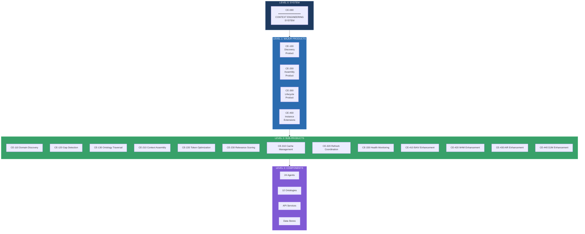
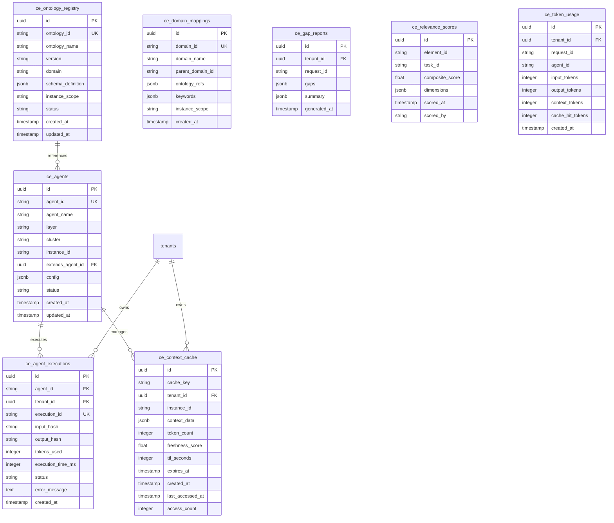
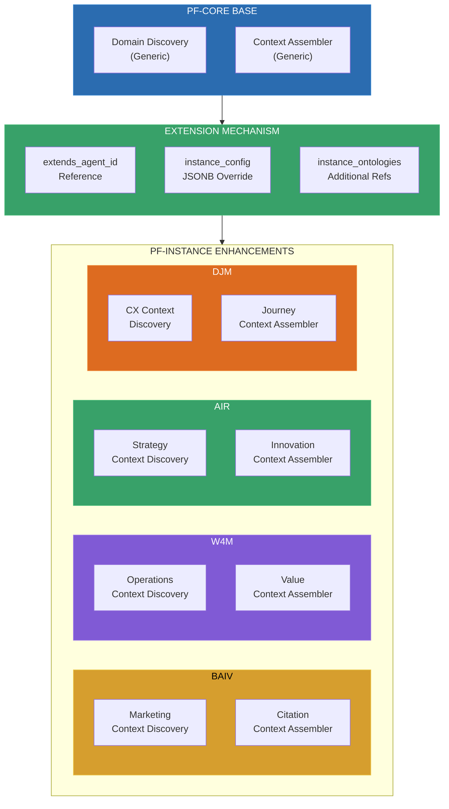
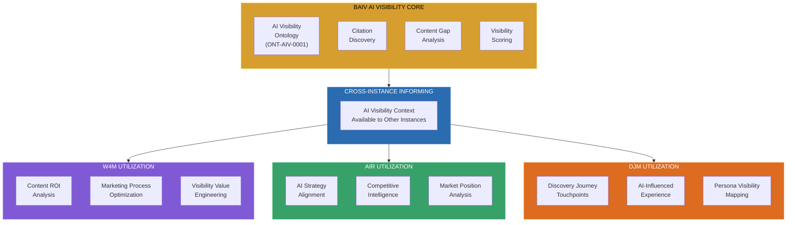

# Product Breakdown Structure (PBS)

## PF-CORE Context Engineering System

**Complete Product Decomposition with Ontologies, Data, and PF-Instance Enhancements**

---

### Document Controls

| Attribute | Value |
|-----------|-------|
| Document ID | **PBS-PF-CORE-CE-001** |
| Document Title | Context Engineering Product Breakdown Structure |
| Document Type | **PBS** (Product Breakdown Structure) |
| Document Version | **1.0.0** |
| Version Date | 01 December 2025 |
| Status | DRAFT |
| Platform | **PF-CORE** (Platform Foundation Core) |
| Platform Instances | AIR, BAIV, W4M, DJM |
| Parent Documents | PRD-PF-CORE-CEA-001 v1.0, PF-CORE-CE-VE-OKR-001 v1.0 |
| Ontology Registry | OAA Registry v3.0 |

### Change Log

| Version | Date | Author | Changes |
|---------|------|--------|---------|
| **1.0.0** | **01 Dec 2025** | **PF-CORE Architecture** | **Initial PBS; Complete product hierarchy; 12 ontology specifications; Data model definitions; PF-Instance enhancement patterns; BAIV AI Visibility cross-instance capability** |

### Copyright & Licensing

```
┌─────────────────────────────────────────────────────────────────────────────┐
│  © 2025 Platform Foundation Core Holdings. All Rights Reserved.             │
│                                                                             │
│  This document and its contents are the confidential intellectual           │
│  property of PF-CORE Holdings.                                              │
│                                                                             │
│  LICENSE GRANT: This document is licensed to authorized PF-Instances        │
│  (AIR, BAIV, W4M, DJM) under the PF-CORE Platform License Agreement.       │
└─────────────────────────────────────────────────────────────────────────────┘
```

---

## Executive Summary

This Product Breakdown Structure (PBS) defines the complete decomposition of the **Context Engineering System** into its constituent products, sub-products, ontologies, and data structures. The PBS follows a hierarchical approach:

**Level 0:** Context Engineering System (Complete System)
**Level 1:** Major Product Components (4 components)
**Level 2:** Sub-Products and Modules (16+ modules)
**Level 3:** Individual Components and Services (24+ agents, 12+ ontologies)
**Level 4:** Data Structures and Schemas

The PBS establishes **BAIV AI Visibility** as a cross-cutting capability that can inform and enhance all PF-Instance products within its Marketing AI Visibility scope.

---

## 1. PBS Hierarchy Overview

### 1.1 Complete Product Hierarchy



### 1.2 PBS Reference Table

| PBS Code | Product Name | Level | Parent | Type |
|----------|--------------|-------|--------|------|
| **CE-000** | Context Engineering System | 0 | — | System |
| **CE-100** | Discovery Product | 1 | CE-000 | Product |
| **CE-110** | Domain Discovery Module | 2 | CE-100 | Module |
| **CE-120** | Gap Detection Module | 2 | CE-100 | Module |
| **CE-130** | Ontology Traversal Module | 2 | CE-100 | Module |
| **CE-200** | Assembly Product | 1 | CE-000 | Product |
| **CE-210** | Context Assembly Module | 2 | CE-200 | Module |
| **CE-220** | Token Optimization Module | 2 | CE-200 | Module |
| **CE-230** | Relevance Scoring Module | 2 | CE-200 | Module |
| **CE-300** | Lifecycle Product | 1 | CE-000 | Product |
| **CE-310** | Cache Management Module | 2 | CE-300 | Module |
| **CE-320** | Refresh Coordination Module | 2 | CE-300 | Module |
| **CE-330** | Health Monitoring Module | 2 | CE-300 | Module |
| **CE-340** | Usage Learning Module | 2 | CE-300 | Module |
| **CE-350** | Performance Tuning Module | 2 | CE-300 | Module |
| **CE-360** | Metrics Reporting Module | 2 | CE-300 | Module |
| **CE-400** | Instance Extensions Product | 1 | CE-000 | Product |
| **CE-410** | BAIV Enhancement Layer | 2 | CE-400 | Extension |
| **CE-420** | W4M Enhancement Layer | 2 | CE-400 | Extension |
| **CE-430** | AIR Enhancement Layer | 2 | CE-400 | Extension |
| **CE-440** | DJM Enhancement Layer | 2 | CE-400 | Extension |
| **CE-500** | Orchestration Product | 1 | CE-000 | Product |
| **CE-510** | Agent Management Module | 2 | CE-500 | Module |
| **CE-520** | Lifecycle Control Module | 2 | CE-500 | Module |
| **CE-530** | Inter-Agent Communication Module | 2 | CE-500 | Module |

---

## 2. Level 1: Major Products

### 2.1 CE-100: Discovery Product

**Purpose:** Intelligent identification and mapping of relevant knowledge domains, ontologies, and context gaps.

| Attribute | Specification |
|-----------|---------------|
| **PBS Code** | CE-100 |
| **Product Name** | Context Discovery Product |
| **Owner** | Context Engineering Lead |
| **Dependencies** | OAA Registry, Ontology Store |
| **Consumers** | All PF-Instance Agents |

**Contained Modules:**

| Module | PBS Code | Description | Agents |
|--------|----------|-------------|--------|
| Domain Discovery | CE-110 | Map tasks to relevant domains | AG-CORE-DD-001 |
| Gap Detection | CE-120 | Identify missing/stale context | AG-CORE-GD-001 |
| Ontology Traversal | CE-130 | Navigate ontology graphs | AG-CORE-OT-001 |

**Required Ontologies:**
- ONT-CTXE-0001 (Context Engineering Core)
- ONT-DOM-0001 (Domain Mapping)
- ONT-GAP-0001 (Gap Analysis)

---

### 2.2 CE-200: Assembly Product

**Purpose:** Optimal context package assembly from discovered elements within token and relevance constraints.

| Attribute | Specification |
|-----------|---------------|
| **PBS Code** | CE-200 |
| **Product Name** | Context Assembly Product |
| **Owner** | Context Engineering Lead |
| **Dependencies** | CE-100 Discovery, Token Counter |
| **Consumers** | All PF-Instance Agents |

**Contained Modules:**

| Module | PBS Code | Description | Agents |
|--------|----------|-------------|--------|
| Context Assembly | CE-210 | Build context packages | AG-CORE-CA-001 |
| Token Optimization | CE-220 | Compress/optimize tokens | AG-CORE-TO-001 |
| Relevance Scoring | CE-230 | Score context elements | AG-CORE-RS-001 |

**Required Ontologies:**
- ONT-PKG-0001 (Context Package)
- ONT-TOK-0001 (Token Management)
- ONT-REL-0001 (Relevance Model)

---

### 2.3 CE-300: Lifecycle Product

**Purpose:** Context lifecycle management including caching, refresh, health monitoring, learning, and optimization.

| Attribute | Specification |
|-----------|---------------|
| **PBS Code** | CE-300 |
| **Product Name** | Context Lifecycle Product |
| **Owner** | Platform Operations |
| **Dependencies** | CE-100, CE-200, Cache Store |
| **Consumers** | Platform Operations, All Agents |

**Contained Modules:**

| Module | PBS Code | Description | Agents |
|--------|----------|-------------|--------|
| Cache Management | CE-310 | Store/retrieve/invalidate | AG-CORE-CM-001 |
| Refresh Coordination | CE-320 | Proactive refresh scheduling | AG-CORE-RF-001 |
| Health Monitoring | CE-330 | Monitor context health | AG-CORE-HM-001 |
| Usage Learning | CE-340 | Learn from usage patterns | AG-CORE-UL-001 |
| Performance Tuning | CE-350 | Tune CE parameters | AG-CORE-PT-001 |
| Metrics Reporting | CE-360 | Generate metrics/reports | AG-CORE-MR-001 |

**Required Ontologies:**
- ONT-CACHE-0001 (Cache Management)
- ONT-HEALTH-0001 (Health Metrics)
- ONT-PERF-0001 (Performance Model)

---

### 2.4 CE-400: Instance Extensions Product

**Purpose:** PF-Instance specific context enhancements that extend Core capabilities with domain knowledge.

| Attribute | Specification |
|-----------|---------------|
| **PBS Code** | CE-400 |
| **Product Name** | Instance Extensions Product |
| **Owner** | PF-Instance Product Owners |
| **Dependencies** | CE-100, CE-200, CE-300 |
| **Consumers** | Instance-Specific Agents |

**Contained Extensions:**

| Extension | PBS Code | Instance | Agents | Domain |
|-----------|----------|----------|--------|--------|
| BAIV Enhancement | CE-410 | BAIV | 3 agents | Marketing & AI Visibility |
| W4M Enhancement | CE-420 | W4M | 2 agents | Operations & Value Engineering |
| AIR Enhancement | CE-430 | AIR | 2 agents | Strategy & Innovation |
| DJM Enhancement | CE-440 | DJM | 2 agents | Customer Experience |

**Cross-Instance Capability:** BAIV AI Visibility may inform other PF-Instance products (see Section 7).

---

### 2.5 CE-500: Orchestration Product

**Purpose:** Agent coordination, lifecycle management, and inter-agent communication.

| Attribute | Specification |
|-----------|---------------|
| **PBS Code** | CE-500 |
| **Product Name** | Orchestration Product |
| **Owner** | Platform Architecture |
| **Dependencies** | All CE Products |
| **Consumers** | All Context Engineering Agents |

**Contained Modules:**

| Module | PBS Code | Description | Agents |
|--------|----------|-------------|--------|
| Agent Management | CE-510 | Agent lifecycle orchestration | AG-ORCH-AM-001 |
| Lifecycle Control | CE-520 | State tracking, timeouts | AG-ORCH-LC-001 |
| Inter-Agent Communication | CE-530 | Message routing, queuing | AG-ORCH-IC-001 |

**Required Ontologies:**
- ONT-ORCH-0001 (Orchestration)
- ONT-MSG-0001 (Messaging)

---

## 3. Ontology Registry

### 3.1 Complete Ontology Catalog

The Context Engineering system requires **12 ontologies** across PF-Core and PF-Instance layers:

```mermaid
flowchart TB
    subgraph CORE_ONT["PF-CORE ONTOLOGIES"]
        direction TB
        O1["ONT-CTXE-0001<br/>Context Engineering Core"]
        O2["ONT-DOM-0001<br/>Domain Mapping"]
        O3["ONT-GAP-0001<br/>Gap Analysis"]
        O4["ONT-PKG-0001<br/>Context Package"]
        O5["ONT-TOK-0001<br/>Token Management"]
        O6["ONT-REL-0001<br/>Relevance Model"]
        O7["ONT-RRR-0001<br/>Requirements/Risks/Resources"]
    end
    
    subgraph INSTANCE_ONT["PF-INSTANCE ONTOLOGIES"]
        direction TB
        O8["ONT-AIV-0001<br/>AI Visibility"]
        O9["ONT-VE-0001<br/>Value Engineering"]
        O10["ONT-STRAT-0001<br/>Strategy & Innovation"]
        O11["ONT-CX-0001<br/>Customer Experience"]
        O12["ONT-CMO-OKR-0001<br/>CMO OKR"]
    end
    
    subgraph SHARED_ONT["SHARED PLATFORM ONTOLOGIES"]
        direction TB
        O13["ONT-VSOM-0001<br/>Vision/Strategy/Objectives/Metrics"]
        O14["ONT-UB-0001<br/>Universal Brand"]
    end
    
    CORE_ONT --> CONTEXT["Context<br/>Engineer<br/>Agents"]
    INSTANCE_ONT --> CONTEXT
    SHARED_ONT --> CONTEXT
    
    style CORE_ONT fill:#2b6cb0,stroke:#3182ce,color:#fff
    style INSTANCE_ONT fill:#805ad5,stroke:#9f7aea,color:#fff
    style SHARED_ONT fill:#38a169,stroke:#48bb78,color:#fff
```



### 3.2 PF-Core Ontology Specifications

#### 3.2.1 ONT-CTXE-0001: Context Engineering Core

**Purpose:** Foundational ontology for all context engineering operations.

```json
{
  "@context": {
    "schema": "https://schema.org/",
    "pf": "https://ontology.pf-core.io/",
    "ctxe": "https://ontology.pf-core.io/context-engineering/"
  },
  "@type": "pf:Ontology",
  "@id": "ctxe:context-engineering-core",
  
  "ontologyMetadata": {
    "name": "Context Engineering Core Ontology",
    "version": "1.0.0",
    "status": "active",
    "domain": "Context Engineering",
    "schemaOrgAlignment": ["CreativeWork", "Dataset", "DataCatalog"]
  },
  
  "entities": {
    "ContextRequest": {
      "@type": "ctxe:ContextRequest",
      "schemaOrgBase": "schema:Action",
      "properties": {
        "requestId": {"type": "string", "required": true},
        "taskDescription": {"type": "string", "required": true},
        "instanceId": {"type": "string", "enum": ["BAIV", "W4M", "AIR", "DJM"]},
        "requesterAgent": {"type": "string", "required": true},
        "tokenBudget": {"type": "number", "default": 4096},
        "priorityLevel": {"type": "string", "enum": ["critical", "high", "medium", "low"]},
        "freshnessRequirement": {"type": "number", "description": "Max age in hours"},
        "scopeHints": {"type": "array", "items": {"type": "string"}}
      }
    },
    
    "ContextPackage": {
      "@type": "ctxe:ContextPackage",
      "schemaOrgBase": "schema:Dataset",
      "properties": {
        "packageId": {"type": "string", "required": true},
        "assembledAt": {"type": "datetime", "required": true},
        "tokenCount": {"type": "number", "required": true},
        "relevanceScore": {"type": "number", "min": 0, "max": 100},
        "freshnessScore": {"type": "number", "min": 0, "max": 100},
        "coreContext": {"type": "object", "required": true},
        "domainContext": {"type": "object"},
        "referenceContext": {"type": "object"},
        "sourceAttribution": {"type": "array", "items": {"$ref": "#/entities/SourceReference"}}
      }
    },
    
    "ContextElement": {
      "@type": "ctxe:ContextElement",
      "schemaOrgBase": "schema:CreativeWork",
      "properties": {
        "elementId": {"type": "string", "required": true},
        "elementType": {"type": "string", "enum": ["ontology", "data", "config", "reference"]},
        "content": {"type": "object", "required": true},
        "sourceOntology": {"type": "string"},
        "relevanceScore": {"type": "number"},
        "tokenCount": {"type": "number"},
        "freshness": {"type": "datetime"},
        "priority": {"type": "number", "min": 1, "max": 10}
      }
    },
    
    "SourceReference": {
      "@type": "ctxe:SourceReference",
      "schemaOrgBase": "schema:Citation",
      "properties": {
        "sourceId": {"type": "string", "required": true},
        "sourceType": {"type": "string", "enum": ["ontology", "database", "api", "cache"]},
        "sourceUri": {"type": "string", "format": "uri"},
        "retrievedAt": {"type": "datetime"},
        "confidence": {"type": "number", "min": 0, "max": 1}
      }
    }
  },
  
  "relationships": [
    {
      "name": "assembledFrom",
      "domain": "ContextPackage",
      "range": "ContextElement",
      "cardinality": "1:N"
    },
    {
      "name": "requestedBy",
      "domain": "ContextPackage",
      "range": "ContextRequest",
      "cardinality": "N:1"
    }
  ]
}
```

---

#### 3.2.2 ONT-DOM-0001: Domain Mapping

**Purpose:** Domain identification and ontology mapping structures.

```json
{
  "@context": {
    "schema": "https://schema.org/",
    "pf": "https://ontology.pf-core.io/",
    "dom": "https://ontology.pf-core.io/domain/"
  },
  "@type": "pf:Ontology",
  "@id": "dom:domain-mapping",
  
  "ontologyMetadata": {
    "name": "Domain Mapping Ontology",
    "version": "1.0.0",
    "status": "active",
    "domain": "Knowledge Organization",
    "schemaOrgAlignment": ["CategoryCode", "DefinedTerm"]
  },
  
  "entities": {
    "Domain": {
      "@type": "dom:Domain",
      "schemaOrgBase": "schema:DefinedTerm",
      "properties": {
        "domainId": {"type": "string", "required": true, "pattern": "DOM-[A-Z]+-[0-9]+"},
        "domainName": {"type": "string", "required": true},
        "domainDescription": {"type": "string"},
        "parentDomain": {"type": "string", "description": "Parent domain ID for hierarchy"},
        "ontologyRefs": {"type": "array", "items": {"type": "string"}, "description": "Associated ontology IDs"},
        "keywords": {"type": "array", "items": {"type": "string"}},
        "instanceScope": {"type": "array", "items": {"type": "string", "enum": ["BAIV", "W4M", "AIR", "DJM", "ALL"]}}
      }
    },
    
    "DomainMapping": {
      "@type": "dom:DomainMapping",
      "properties": {
        "mappingId": {"type": "string", "required": true},
        "taskDescription": {"type": "string", "required": true},
        "mappedDomains": {
          "type": "array",
          "items": {
            "type": "object",
            "properties": {
              "domainId": {"type": "string"},
              "confidence": {"type": "number", "min": 0, "max": 1},
              "relevanceScore": {"type": "number", "min": 0, "max": 100},
              "coverageEstimate": {"type": "number", "min": 0, "max": 100}
            }
          }
        },
        "crossDomainRelationships": {"type": "array", "items": {"$ref": "#/entities/DomainRelationship"}}
      }
    },
    
    "DomainRelationship": {
      "@type": "dom:DomainRelationship",
      "properties": {
        "sourceDomain": {"type": "string", "required": true},
        "targetDomain": {"type": "string", "required": true},
        "relationshipType": {"type": "string", "enum": ["contains", "overlaps", "depends_on", "extends", "related_to"]},
        "strength": {"type": "number", "min": 0, "max": 1}
      }
    }
  },
  
  "domainHierarchy": {
    "root": "DOM-ROOT-000",
    "structure": [
      {
        "id": "DOM-PLATFORM-001",
        "name": "Platform Foundation",
        "children": ["DOM-VSOM-001", "DOM-CTXE-001", "DOM-AGENT-001"]
      },
      {
        "id": "DOM-MARKETING-001",
        "name": "Marketing & Visibility",
        "instanceScope": ["BAIV"],
        "children": ["DOM-AIV-001", "DOM-BRAND-001", "DOM-CONTENT-001"]
      },
      {
        "id": "DOM-OPERATIONS-001",
        "name": "Operations & Value",
        "instanceScope": ["W4M"],
        "children": ["DOM-VE-001", "DOM-PROCESS-001"]
      },
      {
        "id": "DOM-STRATEGY-001",
        "name": "Strategy & Innovation",
        "instanceScope": ["AIR"],
        "children": ["DOM-INNOV-001", "DOM-MARKET-001"]
      },
      {
        "id": "DOM-CX-001",
        "name": "Customer Experience",
        "instanceScope": ["DJM"],
        "children": ["DOM-JOURNEY-001", "DOM-PERSONA-001"]
      }
    ]
  }
}
```

---

#### 3.2.3 ONT-GAP-0001: Gap Analysis

**Purpose:** Context gap identification, categorization, and remediation.

```json
{
  "@context": {
    "schema": "https://schema.org/",
    "pf": "https://ontology.pf-core.io/",
    "gap": "https://ontology.pf-core.io/gap-analysis/"
  },
  "@type": "pf:Ontology",
  "@id": "gap:gap-analysis",
  
  "ontologyMetadata": {
    "name": "Gap Analysis Ontology",
    "version": "1.0.0",
    "status": "active",
    "domain": "Quality Assurance",
    "schemaOrgAlignment": ["Report", "Review"]
  },
  
  "entities": {
    "ContextGap": {
      "@type": "gap:ContextGap",
      "properties": {
        "gapId": {"type": "string", "required": true, "pattern": "GAP-[A-Z]+-[0-9]+"},
        "gapType": {
          "type": "string",
          "required": true,
          "enum": ["missing", "stale", "incomplete", "inconsistent", "inaccessible"]
        },
        "description": {"type": "string", "required": true},
        "affectedElement": {"type": "string", "required": true},
        "affectedOntology": {"type": "string"},
        "severity": {"type": "string", "enum": ["critical", "high", "medium", "low"], "required": true},
        "taskImpact": {"type": "string", "enum": ["blocking", "degrading", "minor"], "required": true},
        "detectedAt": {"type": "datetime", "required": true},
        "detectedBy": {"type": "string", "description": "Agent ID that detected gap"}
      }
    },
    
    "GapRemediation": {
      "@type": "gap:GapRemediation",
      "properties": {
        "remediationId": {"type": "string", "required": true},
        "gapId": {"type": "string", "required": true},
        "action": {"type": "string", "required": true},
        "actionType": {"type": "string", "enum": ["fetch", "refresh", "fallback", "escalate", "skip"]},
        "estimatedEffort": {"type": "string"},
        "fallbackOption": {"type": "string"},
        "status": {"type": "string", "enum": ["pending", "in_progress", "completed", "failed"]},
        "completedAt": {"type": "datetime"}
      }
    },
    
    "GapReport": {
      "@type": "gap:GapReport",
      "schemaOrgBase": "schema:Report",
      "properties": {
        "reportId": {"type": "string", "required": true},
        "contextRequestId": {"type": "string", "required": true},
        "gaps": {"type": "array", "items": {"$ref": "#/entities/ContextGap"}},
        "summary": {
          "type": "object",
          "properties": {
            "totalGaps": {"type": "number"},
            "blockingGaps": {"type": "number"},
            "coverageScore": {"type": "number", "min": 0, "max": 100}
          }
        },
        "generatedAt": {"type": "datetime", "required": true}
      }
    }
  },
  
  "gapTypeDefinitions": {
    "missing": {
      "description": "Required context element not available in any source",
      "defaultSeverity": "high",
      "remediationActions": ["fetch_from_source", "request_from_user", "use_fallback"]
    },
    "stale": {
      "description": "Context exists but exceeds freshness threshold",
      "defaultSeverity": "medium",
      "remediationActions": ["refresh_from_source", "use_cached_with_warning"]
    },
    "incomplete": {
      "description": "Partial context available but key elements missing",
      "defaultSeverity": "medium",
      "remediationActions": ["fetch_missing_elements", "use_partial_with_warning"]
    },
    "inconsistent": {
      "description": "Conflicting context from multiple sources",
      "defaultSeverity": "high",
      "remediationActions": ["resolve_conflict", "use_authoritative_source", "escalate"]
    },
    "inaccessible": {
      "description": "Context exists but cannot be retrieved",
      "defaultSeverity": "high",
      "remediationActions": ["retry_with_backoff", "use_fallback", "escalate"]
    }
  }
}
```

---

#### 3.2.4 ONT-PKG-0001: Context Package

**Purpose:** Standard structure for assembled context packages.

```json
{
  "@context": {
    "schema": "https://schema.org/",
    "pf": "https://ontology.pf-core.io/",
    "pkg": "https://ontology.pf-core.io/context-package/"
  },
  "@type": "pf:Ontology",
  "@id": "pkg:context-package",
  
  "ontologyMetadata": {
    "name": "Context Package Ontology",
    "version": "1.0.0",
    "status": "active",
    "domain": "Data Packaging",
    "schemaOrgAlignment": ["Dataset", "DataDownload"]
  },
  
  "entities": {
    "AssembledContext": {
      "@type": "pkg:AssembledContext",
      "schemaOrgBase": "schema:Dataset",
      "properties": {
        "@context": {"type": "object", "required": true, "description": "JSON-LD context"},
        "@type": {"type": "string", "const": "pf:AssembledContext"},
        "@id": {"type": "string", "format": "uri"},
        
        "packageMetadata": {
          "type": "object",
          "required": true,
          "properties": {
            "packageId": {"type": "string", "required": true},
            "version": {"type": "string", "default": "1.0.0"},
            "assembledAt": {"type": "datetime", "required": true},
            "assembledBy": {"type": "string", "description": "Assembler agent ID"},
            "requestId": {"type": "string"},
            "instanceId": {"type": "string", "enum": ["BAIV", "W4M", "AIR", "DJM"]},
            "tokenCount": {"type": "number", "required": true},
            "budgetUtilization": {"type": "number", "min": 0, "max": 100},
            "qualityMetrics": {
              "type": "object",
              "properties": {
                "relevanceScore": {"type": "number", "min": 0, "max": 100},
                "coverageScore": {"type": "number", "min": 0, "max": 100},
                "freshnessScore": {"type": "number", "min": 0, "max": 100}
              }
            }
          }
        },
        
        "coreContext": {
          "type": "object",
          "required": true,
          "description": "Always-included platform context",
          "properties": {
            "vsom": {"type": "object", "description": "Vision/Strategy/Objectives/Metrics"},
            "rrr": {"type": "object", "description": "Requirements/Risks/Resources"},
            "tenant": {"type": "object", "description": "Tenant configuration"},
            "session": {"type": "object", "description": "Current session context"}
          }
        },
        
        "domainContext": {
          "type": "object",
          "description": "Task-specific domain context",
          "additionalProperties": true
        },
        
        "instanceContext": {
          "type": "object",
          "description": "PF-Instance specific context",
          "additionalProperties": true
        },
        
        "referenceContext": {
          "type": "object",
          "description": "Supporting reference information"
        },
        
        "sourceAttribution": {
          "type": "array",
          "items": {
            "type": "object",
            "properties": {
              "sourceId": {"type": "string"},
              "sourceType": {"type": "string"},
              "retrievedAt": {"type": "datetime"},
              "tokenContribution": {"type": "number"}
            }
          }
        }
      }
    }
  },
  
  "packageTemplates": {
    "minimal": {
      "description": "Minimal context for simple tasks",
      "maxTokens": 2048,
      "includeSections": ["coreContext"]
    },
    "standard": {
      "description": "Standard context for typical tasks",
      "maxTokens": 4096,
      "includeSections": ["coreContext", "domainContext"]
    },
    "comprehensive": {
      "description": "Full context for complex tasks",
      "maxTokens": 8192,
      "includeSections": ["coreContext", "domainContext", "instanceContext", "referenceContext"]
    }
  }
}
```

---

#### 3.2.5 ONT-TOK-0001: Token Management

**Purpose:** Token budgeting, tracking, and optimization structures.

```json
{
  "@context": {
    "schema": "https://schema.org/",
    "pf": "https://ontology.pf-core.io/",
    "tok": "https://ontology.pf-core.io/token-management/"
  },
  "@type": "pf:Ontology",
  "@id": "tok:token-management",
  
  "ontologyMetadata": {
    "name": "Token Management Ontology",
    "version": "1.0.0",
    "status": "active",
    "domain": "Resource Management",
    "schemaOrgAlignment": ["MonetaryAmount", "QuantitativeValue"]
  },
  
  "entities": {
    "TokenBudget": {
      "@type": "tok:TokenBudget",
      "properties": {
        "budgetId": {"type": "string", "required": true},
        "tenantId": {"type": "string", "required": true},
        "instanceId": {"type": "string"},
        "allocations": {
          "type": "object",
          "properties": {
            "perRequest": {"type": "number", "default": 4096},
            "perAssembly": {"type": "number", "default": 8192},
            "dailyLimit": {"type": "number", "default": 500000},
            "monthlyLimit": {"type": "number"}
          }
        },
        "currentUsage": {
          "type": "object",
          "properties": {
            "today": {"type": "number", "default": 0},
            "thisMonth": {"type": "number", "default": 0}
          }
        },
        "effectiveFrom": {"type": "datetime"},
        "effectiveTo": {"type": "datetime"}
      }
    },
    
    "TokenUsage": {
      "@type": "tok:TokenUsage",
      "properties": {
        "usageId": {"type": "string", "required": true},
        "requestId": {"type": "string", "required": true},
        "agentId": {"type": "string", "required": true},
        "inputTokens": {"type": "number", "required": true},
        "outputTokens": {"type": "number", "required": true},
        "contextTokens": {"type": "number"},
        "cacheHitTokens": {"type": "number", "default": 0},
        "timestamp": {"type": "datetime", "required": true}
      }
    },
    
    "TokenOptimization": {
      "@type": "tok:TokenOptimization",
      "properties": {
        "optimizationId": {"type": "string", "required": true},
        "originalTokens": {"type": "number", "required": true},
        "optimizedTokens": {"type": "number", "required": true},
        "reductionRatio": {"type": "number", "description": "optimizedTokens/originalTokens"},
        "techniquesApplied": {
          "type": "array",
          "items": {
            "type": "string",
            "enum": ["compression", "summarization", "pruning", "reference_replacement", "deduplication"]
          }
        },
        "semanticPreservationScore": {"type": "number", "min": 0, "max": 100}
      }
    }
  },
  
  "budgetPolicies": {
    "standard": {
      "perRequest": 4096,
      "perAssembly": 8192,
      "dailyLimit": 500000,
      "alertThreshold": 0.8
    },
    "premium": {
      "perRequest": 8192,
      "perAssembly": 16384,
      "dailyLimit": 2000000,
      "alertThreshold": 0.9
    },
    "enterprise": {
      "perRequest": 16384,
      "perAssembly": 32768,
      "dailyLimit": 10000000,
      "alertThreshold": 0.95
    }
  }
}
```

---

#### 3.2.6 ONT-REL-0001: Relevance Model

**Purpose:** Multi-dimensional relevance scoring model.

```json
{
  "@context": {
    "schema": "https://schema.org/",
    "pf": "https://ontology.pf-core.io/",
    "rel": "https://ontology.pf-core.io/relevance/"
  },
  "@type": "pf:Ontology",
  "@id": "rel:relevance-model",
  
  "ontologyMetadata": {
    "name": "Relevance Model Ontology",
    "version": "1.0.0",
    "status": "active",
    "domain": "Information Retrieval",
    "schemaOrgAlignment": ["Rating", "Review"]
  },
  
  "entities": {
    "RelevanceScore": {
      "@type": "rel:RelevanceScore",
      "properties": {
        "scoreId": {"type": "string", "required": true},
        "elementId": {"type": "string", "required": true},
        "taskId": {"type": "string", "required": true},
        "compositeScore": {"type": "number", "min": 0, "max": 100, "required": true},
        "dimensions": {
          "type": "object",
          "properties": {
            "semantic": {
              "type": "object",
              "properties": {
                "score": {"type": "number", "min": 0, "max": 100},
                "weight": {"type": "number", "default": 0.35},
                "rationale": {"type": "string"}
              }
            },
            "temporal": {
              "type": "object",
              "properties": {
                "score": {"type": "number", "min": 0, "max": 100},
                "weight": {"type": "number", "default": 0.20},
                "ageHours": {"type": "number"}
              }
            },
            "authority": {
              "type": "object",
              "properties": {
                "score": {"type": "number", "min": 0, "max": 100},
                "weight": {"type": "number", "default": 0.20},
                "sourceType": {"type": "string"}
              }
            },
            "specificity": {
              "type": "object",
              "properties": {
                "score": {"type": "number", "min": 0, "max": 100},
                "weight": {"type": "number", "default": 0.15}
              }
            },
            "actionability": {
              "type": "object",
              "properties": {
                "score": {"type": "number", "min": 0, "max": 100},
                "weight": {"type": "number", "default": 0.10}
              }
            }
          }
        },
        "scoredAt": {"type": "datetime", "required": true},
        "scoredBy": {"type": "string", "description": "Scorer agent ID"}
      }
    },
    
    "RelevanceProfile": {
      "@type": "rel:RelevanceProfile",
      "description": "Task-specific relevance weighting profile",
      "properties": {
        "profileId": {"type": "string", "required": true},
        "profileName": {"type": "string", "required": true},
        "taskTypes": {"type": "array", "items": {"type": "string"}},
        "weights": {
          "type": "object",
          "properties": {
            "semantic": {"type": "number"},
            "temporal": {"type": "number"},
            "authority": {"type": "number"},
            "specificity": {"type": "number"},
            "actionability": {"type": "number"}
          }
        },
        "instanceScope": {"type": "array", "items": {"type": "string", "enum": ["BAIV", "W4M", "AIR", "DJM", "ALL"]}}
      }
    }
  },
  
  "defaultProfiles": {
    "discovery": {
      "semantic": 0.40,
      "temporal": 0.15,
      "authority": 0.25,
      "specificity": 0.10,
      "actionability": 0.10
    },
    "analysis": {
      "semantic": 0.30,
      "temporal": 0.25,
      "authority": 0.25,
      "specificity": 0.10,
      "actionability": 0.10
    },
    "recommendation": {
      "semantic": 0.25,
      "temporal": 0.20,
      "authority": 0.15,
      "specificity": 0.15,
      "actionability": 0.25
    },
    "reporting": {
      "semantic": 0.20,
      "temporal": 0.30,
      "authority": 0.30,
      "specificity": 0.10,
      "actionability": 0.10
    }
  }
}
```

---

#### 3.2.7 ONT-RRR-0001: Requirements, Risks, Resources

**Purpose:** Strategic context input framework for agent decision-making.

```json
{
  "@context": {
    "schema": "https://schema.org/",
    "pf": "https://ontology.pf-core.io/",
    "rrr": "https://ontology.pf-core.io/rrr/"
  },
  "@type": "pf:Ontology",
  "@id": "rrr:requirements-risks-resources",
  
  "ontologyMetadata": {
    "name": "Requirements, Risks, Resources Ontology",
    "version": "1.0.0",
    "status": "active",
    "domain": "Strategic Planning",
    "schemaOrgAlignment": ["Project", "Organization"]
  },
  
  "entities": {
    "RRRContext": {
      "@type": "rrr:RRRContext",
      "properties": {
        "contextId": {"type": "string", "required": true},
        "instanceId": {"type": "string", "enum": ["BAIV", "W4M", "AIR", "DJM"]},
        "tenantId": {"type": "string", "required": true},
        "effectiveDate": {"type": "datetime"},
        
        "requirements": {"$ref": "#/entities/RequirementsSet"},
        "risks": {"$ref": "#/entities/RiskRegistry"},
        "resources": {"$ref": "#/entities/ResourceAllocation"}
      }
    },
    
    "RequirementsSet": {
      "@type": "rrr:RequirementsSet",
      "properties": {
        "functional": {
          "type": "object",
          "properties": {
            "capabilities": {"type": "array", "items": {"type": "string"}},
            "constraints": {"type": "array", "items": {"type": "string"}},
            "dependencies": {
              "type": "object",
              "properties": {
                "upstream": {"type": "array", "items": {"type": "string"}},
                "downstream": {"type": "array", "items": {"type": "string"}}
              }
            },
            "acceptanceCriteria": {"type": "array", "items": {"type": "string"}}
          }
        },
        "nonFunctional": {
          "type": "object",
          "properties": {
            "performance": {
              "type": "object",
              "properties": {
                "latencyMs": {"type": "number"},
                "throughputRps": {"type": "number"}
              }
            },
            "scalability": {
              "type": "object",
              "properties": {
                "concurrentUsers": {"type": "number"},
                "dataVolumeGb": {"type": "number"}
              }
            },
            "security": {
              "type": "object",
              "properties": {
                "classification": {"type": "string"},
                "compliance": {"type": "array", "items": {"type": "string"}}
              }
            }
          }
        }
      }
    },
    
    "RiskRegistry": {
      "@type": "rrr:RiskRegistry",
      "properties": {
        "technical": {"type": "array", "items": {"$ref": "#/entities/Risk"}},
        "business": {"type": "array", "items": {"$ref": "#/entities/Risk"}},
        "operational": {"type": "array", "items": {"$ref": "#/entities/Risk"}}
      }
    },
    
    "Risk": {
      "@type": "rrr:Risk",
      "properties": {
        "riskId": {"type": "string", "required": true, "pattern": "RISK-[A-Z]+-[0-9]+"},
        "description": {"type": "string", "required": true},
        "probability": {"type": "string", "enum": ["high", "medium", "low"]},
        "impact": {"type": "string", "enum": ["critical", "high", "medium", "low"]},
        "riskScore": {"type": "number", "min": 1, "max": 25, "description": "probability * impact"},
        "mitigation": {"type": "string"},
        "owner": {"type": "string"},
        "status": {"type": "string", "enum": ["open", "mitigating", "closed", "accepted"]}
      }
    },
    
    "ResourceAllocation": {
      "@type": "rrr:ResourceAllocation",
      "properties": {
        "compute": {
          "type": "object",
          "properties": {
            "tokenBudget": {"$ref": "tok:TokenBudget"},
            "apiLimits": {
              "type": "object",
              "properties": {
                "rateLimit": {"type": "number"},
                "dailyQuota": {"type": "number"}
              }
            }
          }
        },
        "human": {
          "type": "object",
          "properties": {
            "roles": {"type": "array", "items": {"type": "string"}},
            "allocation": {"type": "object", "additionalProperties": {"type": "number"}}
          }
        },
        "financial": {
          "type": "object",
          "properties": {
            "budget": {"type": "number"},
            "costCenter": {"type": "string"},
            "currency": {"type": "string", "default": "USD"}
          }
        },
        "temporal": {
          "type": "object",
          "properties": {
            "deadline": {"type": "datetime"},
            "milestones": {
              "type": "array",
              "items": {
                "type": "object",
                "properties": {
                  "name": {"type": "string"},
                  "date": {"type": "datetime"},
                  "status": {"type": "string", "enum": ["pending", "completed", "missed"]}
                }
              }
            }
          }
        }
      }
    }
  }
}
```

---

### 3.3 PF-Instance Ontology Specifications

#### 3.3.1 ONT-AIV-0001: AI Visibility (BAIV)

**Purpose:** AI platform visibility assessment and citation tracking for marketing context.

```json
{
  "@context": {
    "schema": "https://schema.org/",
    "pf": "https://ontology.pf-core.io/",
    "baiv": "https://ontology.baiv.co.uk/",
    "aiv": "https://ontology.baiv.co.uk/ai-visibility/"
  },
  "@type": "pf:Ontology",
  "@id": "aiv:ai-visibility",
  
  "ontologyMetadata": {
    "name": "AI Visibility Assessment Ontology",
    "version": "1.0.0",
    "status": "active",
    "domain": "Marketing, AI Visibility",
    "instanceScope": ["BAIV"],
    "schemaOrgAlignment": ["Brand", "Organization", "Article"],
    "crossInstanceCapability": true,
    "informsInstances": ["W4M", "AIR", "DJM"]
  },
  
  "entities": {
    "AIVisibilityAudit": {
      "@type": "aiv:AIVisibilityAudit",
      "properties": {
        "auditId": {"type": "string", "required": true, "pattern": "AUD-AIV-[0-9]+"},
        "tenantId": {"type": "string", "required": true},
        "brandId": {"type": "string", "required": true},
        "auditDate": {"type": "datetime", "required": true},
        "auditType": {"type": "string", "enum": ["baseline", "periodic", "competitive", "deep_dive"]},
        "platforms": {
          "type": "array",
          "items": {
            "type": "object",
            "properties": {
              "platform": {"type": "string", "enum": ["ChatGPT", "Claude", "Perplexity", "Gemini", "CoPilot", "SearchGPT"]},
              "visibilityScore": {"type": "number", "min": 0, "max": 100},
              "citationCount": {"type": "number"},
              "sentimentScore": {"type": "number", "min": -1, "max": 1}
            }
          }
        },
        "overallScore": {"type": "number", "min": 0, "max": 100},
        "recommendations": {"type": "array", "items": {"$ref": "#/entities/VisibilityRecommendation"}}
      }
    },
    
    "CitationOpportunity": {
      "@type": "aiv:CitationOpportunity",
      "properties": {
        "opportunityId": {"type": "string", "required": true},
        "queryCategory": {"type": "string", "required": true},
        "queryExamples": {"type": "array", "items": {"type": "string"}},
        "currentCitationRate": {"type": "number", "min": 0, "max": 100},
        "competitorCitationRate": {"type": "number", "min": 0, "max": 100},
        "opportunityScore": {"type": "number", "min": 0, "max": 100},
        "requiredContent": {"type": "array", "items": {"type": "string"}},
        "estimatedImpact": {"type": "string", "enum": ["high", "medium", "low"]},
        "implementationEffort": {"type": "string", "enum": ["high", "medium", "low"]}
      }
    },
    
    "ContentGap": {
      "@type": "aiv:ContentGap",
      "properties": {
        "gapId": {"type": "string", "required": true},
        "gapType": {"type": "string", "enum": ["missing_topic", "weak_coverage", "outdated", "competitor_advantage"]},
        "topic": {"type": "string", "required": true},
        "currentCoverage": {"type": "number", "min": 0, "max": 100},
        "targetCoverage": {"type": "number", "min": 0, "max": 100},
        "competitorCoverage": {"type": "number", "min": 0, "max": 100},
        "businessImpact": {"type": "string", "enum": ["revenue", "brand", "competitive", "regulatory"]},
        "priority": {"type": "number", "min": 1, "max": 10}
      }
    },
    
    "QueryClassification": {
      "@type": "aiv:QueryClassification",
      "properties": {
        "classificationId": {"type": "string", "required": true},
        "queryPattern": {"type": "string", "required": true},
        "intent": {"type": "string", "enum": ["informational", "navigational", "transactional", "commercial"]},
        "journeyStage": {"type": "string", "enum": ["awareness", "consideration", "decision", "retention"]},
        "personaAlignment": {"type": "array", "items": {"type": "string"}},
        "contentRequirements": {"type": "array", "items": {"type": "string"}}
      }
    },
    
    "VisibilityRecommendation": {
      "@type": "aiv:VisibilityRecommendation",
      "properties": {
        "recommendationId": {"type": "string", "required": true},
        "category": {"type": "string", "enum": ["content", "technical", "strategic", "competitive"]},
        "title": {"type": "string", "required": true},
        "description": {"type": "string", "required": true},
        "expectedImpact": {"type": "number", "min": 0, "max": 100},
        "effort": {"type": "string", "enum": ["low", "medium", "high"]},
        "timeframe": {"type": "string", "enum": ["immediate", "short_term", "medium_term", "long_term"]},
        "dependencies": {"type": "array", "items": {"type": "string"}}
      }
    }
  },
  
  "contextExtensions": {
    "description": "BAIV-specific context extensions for CE Assembly",
    "extensions": {
      "citationContext": {
        "currentCitations": "Array of current citations across platforms",
        "citationOpportunities": "Array of identified opportunities",
        "competitorCitations": "Competitor citation analysis"
      },
      "contentOptimizationContext": {
        "schemaRequirements": "schema.org markup requirements",
        "contentFormatRecommendations": "Content format optimization",
        "keywordCoverage": "Topic and keyword coverage analysis"
      },
      "campaignAlignmentContext": {
        "activeCMOOKRs": "Current CMO objectives",
        "campaignObjectives": "Active campaign goals",
        "successMetrics": "Campaign success metrics"
      }
    }
  }
}
```

---

#### 3.3.2 ONT-VE-0001: Value Engineering (W4M)

**Purpose:** Operations and value engineering context for process optimization.

```json
{
  "@context": {
    "schema": "https://schema.org/",
    "pf": "https://ontology.pf-core.io/",
    "w4m": "https://ontology.wings4mind.ai/",
    "ve": "https://ontology.wings4mind.ai/value-engineering/"
  },
  "@type": "pf:Ontology",
  "@id": "ve:value-engineering",
  
  "ontologyMetadata": {
    "name": "Value Engineering Ontology",
    "version": "1.0.0",
    "status": "active",
    "domain": "Operations, Value Engineering",
    "instanceScope": ["W4M"],
    "schemaOrgAlignment": ["Service", "Product", "MonetaryAmount"]
  },
  
  "entities": {
    "ValueStream": {
      "@type": "ve:ValueStream",
      "properties": {
        "streamId": {"type": "string", "required": true},
        "streamName": {"type": "string", "required": true},
        "description": {"type": "string"},
        "stages": {"type": "array", "items": {"$ref": "#/entities/ValueStage"}},
        "totalCycleTime": {"type": "number", "description": "Minutes"},
        "valueAddRatio": {"type": "number", "min": 0, "max": 100},
        "bottlenecks": {"type": "array", "items": {"type": "string"}}
      }
    },
    
    "ValueStage": {
      "@type": "ve:ValueStage",
      "properties": {
        "stageId": {"type": "string", "required": true},
        "stageName": {"type": "string", "required": true},
        "stageType": {"type": "string", "enum": ["value_add", "necessary_non_value", "waste"]},
        "cycleTime": {"type": "number"},
        "waitTime": {"type": "number"},
        "resourceCost": {"type": "number"},
        "qualityRate": {"type": "number", "min": 0, "max": 100}
      }
    },
    
    "ROICalculation": {
      "@type": "ve:ROICalculation",
      "schemaOrgBase": "schema:MonetaryAmount",
      "properties": {
        "calculationId": {"type": "string", "required": true},
        "projectId": {"type": "string", "required": true},
        "investment": {"type": "number", "required": true},
        "expectedReturn": {"type": "number", "required": true},
        "timeframeMonths": {"type": "number", "required": true},
        "roiPercentage": {"type": "number"},
        "paybackPeriodMonths": {"type": "number"},
        "npv": {"type": "number"},
        "irr": {"type": "number"},
        "assumptions": {"type": "array", "items": {"type": "string"}},
        "risks": {"type": "array", "items": {"type": "string"}}
      }
    },
    
    "ProcessOptimization": {
      "@type": "ve:ProcessOptimization",
      "properties": {
        "optimizationId": {"type": "string", "required": true},
        "processId": {"type": "string", "required": true},
        "currentState": {"type": "object"},
        "targetState": {"type": "object"},
        "improvements": {
          "type": "array",
          "items": {
            "type": "object",
            "properties": {
              "improvementType": {"type": "string"},
              "description": {"type": "string"},
              "expectedBenefit": {"type": "string"},
              "effort": {"type": "string", "enum": ["low", "medium", "high"]}
            }
          }
        },
        "expectedSavings": {"type": "number"},
        "implementationCost": {"type": "number"}
      }
    }
  },
  
  "contextExtensions": {
    "valueEngineeringContext": {
      "valueStreams": "Current value stream mappings",
      "roiModels": "Active ROI calculations",
      "processMetrics": "Process performance metrics"
    },
    "resourceContext": {
      "capacityPlanning": "Resource capacity data",
      "utilizationMetrics": "Resource utilization",
      "costCenters": "Cost allocation data"
    }
  }
}
```

---

#### 3.3.3 ONT-STRAT-0001: Strategy & Innovation (AIR)

**Purpose:** Strategic planning and innovation context for strategy formulation.

```json
{
  "@context": {
    "schema": "https://schema.org/",
    "pf": "https://ontology.pf-core.io/",
    "air": "https://ontology.air-strategy.io/",
    "strat": "https://ontology.air-strategy.io/strategy/"
  },
  "@type": "pf:Ontology",
  "@id": "strat:strategy-innovation",
  
  "ontologyMetadata": {
    "name": "Strategy & Innovation Ontology",
    "version": "1.0.0",
    "status": "active",
    "domain": "Strategy, Innovation",
    "instanceScope": ["AIR"],
    "schemaOrgAlignment": ["Organization", "BusinessPlan"]
  },
  
  "entities": {
    "StrategicInitiative": {
      "@type": "strat:StrategicInitiative",
      "properties": {
        "initiativeId": {"type": "string", "required": true},
        "initiativeName": {"type": "string", "required": true},
        "strategicObjective": {"type": "string", "required": true},
        "bscPerspective": {"type": "string", "enum": ["financial", "customer", "internal_process", "learning_growth", "stakeholder"]},
        "status": {"type": "string", "enum": ["planning", "active", "completed", "on_hold", "cancelled"]},
        "priority": {"type": "string", "enum": ["critical", "high", "medium", "low"]},
        "sponsor": {"type": "string"},
        "budget": {"type": "number"},
        "startDate": {"type": "datetime"},
        "targetDate": {"type": "datetime"},
        "keyResults": {"type": "array", "items": {"type": "string"}}
      }
    },
    
    "InnovationOpportunity": {
      "@type": "strat:InnovationOpportunity",
      "properties": {
        "opportunityId": {"type": "string", "required": true},
        "opportunityName": {"type": "string", "required": true},
        "category": {"type": "string", "enum": ["product", "process", "business_model", "technology", "market"]},
        "description": {"type": "string"},
        "marketPotential": {"type": "string", "enum": ["high", "medium", "low"]},
        "technicalFeasibility": {"type": "string", "enum": ["proven", "feasible", "experimental", "speculative"]},
        "strategicFit": {"type": "number", "min": 0, "max": 100},
        "competitiveAdvantage": {"type": "string"},
        "timeToMarket": {"type": "string"}
      }
    },
    
    "MarketAnalysis": {
      "@type": "strat:MarketAnalysis",
      "schemaOrgBase": "schema:Report",
      "properties": {
        "analysisId": {"type": "string", "required": true},
        "marketSegment": {"type": "string", "required": true},
        "analysisDate": {"type": "datetime"},
        "marketSize": {"type": "number"},
        "growthRate": {"type": "number"},
        "competitorAnalysis": {"type": "array", "items": {"type": "object"}},
        "opportunities": {"type": "array", "items": {"type": "string"}},
        "threats": {"type": "array", "items": {"type": "string"}},
        "recommendations": {"type": "array", "items": {"type": "string"}}
      }
    },
    
    "AIMaturityAssessment": {
      "@type": "strat:AIMaturityAssessment",
      "properties": {
        "assessmentId": {"type": "string", "required": true},
        "organizationId": {"type": "string", "required": true},
        "assessmentDate": {"type": "datetime"},
        "maturityLevel": {"type": "string", "enum": ["ai_unaware", "ai_aware", "ai_exploring", "ai_adopting", "ai_mature", "ai_leader"]},
        "dimensions": {
          "type": "object",
          "properties": {
            "strategy": {"type": "number", "min": 1, "max": 5},
            "data": {"type": "number", "min": 1, "max": 5},
            "technology": {"type": "number", "min": 1, "max": 5},
            "people": {"type": "number", "min": 1, "max": 5},
            "governance": {"type": "number", "min": 1, "max": 5}
          }
        },
        "roadmap": {"type": "array", "items": {"type": "object"}}
      }
    }
  },
  
  "contextExtensions": {
    "strategyContext": {
      "vsomAlignment": "Current VSOM framework",
      "strategicObjectives": "Active strategic objectives",
      "bscMetrics": "Balanced scorecard metrics"
    },
    "innovationContext": {
      "opportunityPipeline": "Innovation opportunities",
      "emergingTechnologies": "Relevant emerging tech",
      "competitiveLandscape": "Competitive analysis"
    }
  }
}
```

---

#### 3.3.4 ONT-CX-0001: Customer Experience (DJM)

**Purpose:** Customer journey and experience context for CX optimization.

```json
{
  "@context": {
    "schema": "https://schema.org/",
    "pf": "https://ontology.pf-core.io/",
    "djm": "https://ontology.djm.io/",
    "cx": "https://ontology.djm.io/customer-experience/"
  },
  "@type": "pf:Ontology",
  "@id": "cx:customer-experience",
  
  "ontologyMetadata": {
    "name": "Customer Experience Ontology",
    "version": "1.0.0",
    "status": "active",
    "domain": "Customer Experience, Journey Mapping",
    "instanceScope": ["DJM"],
    "schemaOrgAlignment": ["Person", "Service", "Review"]
  },
  
  "entities": {
    "CustomerJourney": {
      "@type": "cx:CustomerJourney",
      "properties": {
        "journeyId": {"type": "string", "required": true},
        "journeyName": {"type": "string", "required": true},
        "personaId": {"type": "string", "required": true},
        "stages": {
          "type": "array",
          "items": {
            "type": "object",
            "properties": {
              "stageName": {"type": "string"},
              "stageType": {"type": "string", "enum": ["awareness", "consideration", "decision", "purchase", "retention", "advocacy"]},
              "touchpoints": {"type": "array", "items": {"$ref": "#/entities/Touchpoint"}},
              "emotions": {"type": "array", "items": {"type": "string"}},
              "painPoints": {"type": "array", "items": {"type": "string"}},
              "opportunities": {"type": "array", "items": {"type": "string"}}
            }
          }
        },
        "overallSatisfaction": {"type": "number", "min": 0, "max": 10}
      }
    },
    
    "Touchpoint": {
      "@type": "cx:Touchpoint",
      "properties": {
        "touchpointId": {"type": "string", "required": true},
        "channel": {"type": "string", "enum": ["web", "mobile", "email", "phone", "chat", "social", "in_person", "ai_assistant"]},
        "interactionType": {"type": "string"},
        "satisfactionScore": {"type": "number", "min": 0, "max": 10},
        "effortScore": {"type": "number", "min": 1, "max": 7},
        "resolutionRate": {"type": "number", "min": 0, "max": 100}
      }
    },
    
    "CustomerPersona": {
      "@type": "cx:CustomerPersona",
      "schemaOrgBase": "schema:Person",
      "properties": {
        "personaId": {"type": "string", "required": true},
        "personaName": {"type": "string", "required": true},
        "demographics": {"type": "object"},
        "psychographics": {"type": "object"},
        "goals": {"type": "array", "items": {"type": "string"}},
        "frustrations": {"type": "array", "items": {"type": "string"}},
        "preferredChannels": {"type": "array", "items": {"type": "string"}},
        "valueDrivers": {"type": "array", "items": {"type": "string"}}
      }
    },
    
    "ExperienceMetrics": {
      "@type": "cx:ExperienceMetrics",
      "properties": {
        "metricsId": {"type": "string", "required": true},
        "periodStart": {"type": "datetime"},
        "periodEnd": {"type": "datetime"},
        "nps": {"type": "number", "min": -100, "max": 100},
        "csat": {"type": "number", "min": 0, "max": 100},
        "ces": {"type": "number", "min": 1, "max": 7},
        "churnRate": {"type": "number", "min": 0, "max": 100},
        "retentionRate": {"type": "number", "min": 0, "max": 100},
        "ltv": {"type": "number"}
      }
    }
  },
  
  "contextExtensions": {
    "journeyContext": {
      "activeJourneys": "Current customer journeys",
      "touchpointPerformance": "Touchpoint metrics",
      "momentOfTruth": "Critical interaction points"
    },
    "experienceContext": {
      "satisfactionTrends": "CSAT/NPS trends",
      "sentimentAnalysis": "Customer sentiment data",
      "feedbackThemes": "Common feedback themes"
    }
  }
}
```

---

## 4. Data Model Specifications

### 4.1 Database Schema Overview



### 4.2 Core Tables SQL

```sql
-- ============================================================================
-- CONTEXT ENGINEERING DATABASE SCHEMA
-- PF-CORE Platform Foundation
-- Version: 1.0.0
-- ============================================================================

-- Enable required extensions
CREATE EXTENSION IF NOT EXISTS "uuid-ossp";
CREATE EXTENSION IF NOT EXISTS "pg_trgm";

-- ============================================================================
-- AGENT REGISTRY
-- ============================================================================

CREATE TABLE ce_agents (
    id UUID PRIMARY KEY DEFAULT uuid_generate_v4(),
    agent_id VARCHAR(100) UNIQUE NOT NULL,
    agent_name VARCHAR(255) NOT NULL,
    layer VARCHAR(50) NOT NULL CHECK (layer IN ('orchestration', 'core', 'enhancement')),
    cluster VARCHAR(50) CHECK (cluster IN ('discovery', 'assembly', 'lifecycle', 'optimization', NULL)),
    instance_id VARCHAR(20) CHECK (instance_id IN ('BAIV', 'W4M', 'AIR', 'DJM', NULL)),
    extends_agent_id UUID REFERENCES ce_agents(id),
    config JSONB NOT NULL DEFAULT '{}',
    status VARCHAR(20) NOT NULL DEFAULT 'active' CHECK (status IN ('active', 'inactive', 'deprecated')),
    created_at TIMESTAMP WITH TIME ZONE DEFAULT NOW(),
    updated_at TIMESTAMP WITH TIME ZONE DEFAULT NOW()
);

CREATE INDEX idx_ce_agents_layer ON ce_agents(layer);
CREATE INDEX idx_ce_agents_cluster ON ce_agents(cluster);
CREATE INDEX idx_ce_agents_instance ON ce_agents(instance_id);
CREATE INDEX idx_ce_agents_status ON ce_agents(status);

-- ============================================================================
-- AGENT EXECUTIONS
-- ============================================================================

CREATE TABLE ce_agent_executions (
    id UUID PRIMARY KEY DEFAULT uuid_generate_v4(),
    agent_id VARCHAR(100) NOT NULL REFERENCES ce_agents(agent_id),
    tenant_id UUID NOT NULL,
    execution_id VARCHAR(100) UNIQUE NOT NULL,
    input_hash VARCHAR(64),
    output_hash VARCHAR(64),
    tokens_used INTEGER NOT NULL DEFAULT 0,
    execution_time_ms INTEGER,
    status VARCHAR(20) NOT NULL CHECK (status IN ('pending', 'running', 'completed', 'failed', 'timeout')),
    error_message TEXT,
    created_at TIMESTAMP WITH TIME ZONE DEFAULT NOW()
);

CREATE INDEX idx_ce_executions_agent ON ce_agent_executions(agent_id);
CREATE INDEX idx_ce_executions_tenant ON ce_agent_executions(tenant_id);
CREATE INDEX idx_ce_executions_status ON ce_agent_executions(status);
CREATE INDEX idx_ce_executions_created ON ce_agent_executions(created_at DESC);

-- ============================================================================
-- CONTEXT CACHE
-- ============================================================================

CREATE TABLE ce_context_cache (
    id UUID PRIMARY KEY DEFAULT uuid_generate_v4(),
    cache_key VARCHAR(255) NOT NULL,
    tenant_id UUID NOT NULL,
    instance_id VARCHAR(20),
    context_data JSONB NOT NULL,
    token_count INTEGER,
    freshness_score FLOAT CHECK (freshness_score >= 0 AND freshness_score <= 100),
    ttl_seconds INTEGER NOT NULL DEFAULT 3600,
    expires_at TIMESTAMP WITH TIME ZONE NOT NULL,
    created_at TIMESTAMP WITH TIME ZONE DEFAULT NOW(),
    last_accessed_at TIMESTAMP WITH TIME ZONE DEFAULT NOW(),
    access_count INTEGER DEFAULT 0,
    UNIQUE(cache_key, tenant_id, instance_id)
);

CREATE INDEX idx_ce_cache_key ON ce_context_cache(cache_key, tenant_id);
CREATE INDEX idx_ce_cache_expires ON ce_context_cache(expires_at);
CREATE INDEX idx_ce_cache_instance ON ce_context_cache(instance_id);

-- ============================================================================
-- ONTOLOGY REGISTRY
-- ============================================================================

CREATE TABLE ce_ontology_registry (
    id UUID PRIMARY KEY DEFAULT uuid_generate_v4(),
    ontology_id VARCHAR(50) UNIQUE NOT NULL,
    ontology_name VARCHAR(255) NOT NULL,
    version VARCHAR(20) NOT NULL DEFAULT '1.0.0',
    domain VARCHAR(100) NOT NULL,
    schema_definition JSONB NOT NULL,
    instance_scope VARCHAR(50)[] DEFAULT ARRAY['ALL'],
    cross_instance_capability BOOLEAN DEFAULT FALSE,
    informs_instances VARCHAR(20)[] DEFAULT '{}',
    status VARCHAR(20) NOT NULL DEFAULT 'active',
    created_at TIMESTAMP WITH TIME ZONE DEFAULT NOW(),
    updated_at TIMESTAMP WITH TIME ZONE DEFAULT NOW()
);

CREATE INDEX idx_ce_ontology_domain ON ce_ontology_registry(domain);
CREATE INDEX idx_ce_ontology_status ON ce_ontology_registry(status);
CREATE INDEX idx_ce_ontology_scope ON ce_ontology_registry USING GIN(instance_scope);

-- ============================================================================
-- DOMAIN MAPPINGS
-- ============================================================================

CREATE TABLE ce_domain_mappings (
    id UUID PRIMARY KEY DEFAULT uuid_generate_v4(),
    domain_id VARCHAR(50) UNIQUE NOT NULL,
    domain_name VARCHAR(255) NOT NULL,
    parent_domain_id VARCHAR(50) REFERENCES ce_domain_mappings(domain_id),
    ontology_refs VARCHAR(50)[] NOT NULL DEFAULT '{}',
    keywords TEXT[] DEFAULT '{}',
    instance_scope VARCHAR(20)[] DEFAULT ARRAY['ALL'],
    created_at TIMESTAMP WITH TIME ZONE DEFAULT NOW(),
    updated_at TIMESTAMP WITH TIME ZONE DEFAULT NOW()
);

CREATE INDEX idx_ce_domain_parent ON ce_domain_mappings(parent_domain_id);
CREATE INDEX idx_ce_domain_keywords ON ce_domain_mappings USING GIN(keywords);

-- ============================================================================
-- GAP REPORTS
-- ============================================================================

CREATE TABLE ce_gap_reports (
    id UUID PRIMARY KEY DEFAULT uuid_generate_v4(),
    tenant_id UUID NOT NULL,
    request_id VARCHAR(100) NOT NULL,
    gaps JSONB NOT NULL DEFAULT '[]',
    summary JSONB NOT NULL DEFAULT '{}',
    generated_at TIMESTAMP WITH TIME ZONE DEFAULT NOW()
);

CREATE INDEX idx_ce_gap_tenant ON ce_gap_reports(tenant_id);
CREATE INDEX idx_ce_gap_request ON ce_gap_reports(request_id);

-- ============================================================================
-- RELEVANCE SCORES
-- ============================================================================

CREATE TABLE ce_relevance_scores (
    id UUID PRIMARY KEY DEFAULT uuid_generate_v4(),
    element_id VARCHAR(100) NOT NULL,
    task_id VARCHAR(100) NOT NULL,
    composite_score FLOAT NOT NULL CHECK (composite_score >= 0 AND composite_score <= 100),
    dimensions JSONB NOT NULL DEFAULT '{}',
    scored_at TIMESTAMP WITH TIME ZONE DEFAULT NOW(),
    scored_by VARCHAR(100) NOT NULL
);

CREATE INDEX idx_ce_relevance_element ON ce_relevance_scores(element_id);
CREATE INDEX idx_ce_relevance_task ON ce_relevance_scores(task_id);
CREATE INDEX idx_ce_relevance_score ON ce_relevance_scores(composite_score DESC);

-- ============================================================================
-- TOKEN USAGE
-- ============================================================================

CREATE TABLE ce_token_usage (
    id UUID PRIMARY KEY DEFAULT uuid_generate_v4(),
    tenant_id UUID NOT NULL,
    request_id VARCHAR(100) NOT NULL,
    agent_id VARCHAR(100) NOT NULL,
    input_tokens INTEGER NOT NULL DEFAULT 0,
    output_tokens INTEGER NOT NULL DEFAULT 0,
    context_tokens INTEGER DEFAULT 0,
    cache_hit_tokens INTEGER DEFAULT 0,
    created_at TIMESTAMP WITH TIME ZONE DEFAULT NOW()
);

CREATE INDEX idx_ce_token_tenant ON ce_token_usage(tenant_id);
CREATE INDEX idx_ce_token_agent ON ce_token_usage(agent_id);
CREATE INDEX idx_ce_token_created ON ce_token_usage(created_at DESC);

-- ============================================================================
-- TOKEN BUDGETS
-- ============================================================================

CREATE TABLE ce_token_budgets (
    id UUID PRIMARY KEY DEFAULT uuid_generate_v4(),
    tenant_id UUID NOT NULL,
    instance_id VARCHAR(20),
    budget_type VARCHAR(20) NOT NULL DEFAULT 'standard' CHECK (budget_type IN ('standard', 'premium', 'enterprise')),
    allocations JSONB NOT NULL DEFAULT '{}',
    current_usage JSONB NOT NULL DEFAULT '{"today": 0, "thisMonth": 0}',
    effective_from TIMESTAMP WITH TIME ZONE DEFAULT NOW(),
    effective_to TIMESTAMP WITH TIME ZONE,
    created_at TIMESTAMP WITH TIME ZONE DEFAULT NOW(),
    updated_at TIMESTAMP WITH TIME ZONE DEFAULT NOW(),
    UNIQUE(tenant_id, instance_id)
);

CREATE INDEX idx_ce_budget_tenant ON ce_token_budgets(tenant_id);

-- ============================================================================
-- RLS POLICIES
-- ============================================================================

ALTER TABLE ce_context_cache ENABLE ROW LEVEL SECURITY;
ALTER TABLE ce_agent_executions ENABLE ROW LEVEL SECURITY;
ALTER TABLE ce_gap_reports ENABLE ROW LEVEL SECURITY;
ALTER TABLE ce_token_usage ENABLE ROW LEVEL SECURITY;
ALTER TABLE ce_token_budgets ENABLE ROW LEVEL SECURITY;

-- Tenant isolation policies (to be configured with actual auth context)
-- CREATE POLICY tenant_isolation ON ce_context_cache
--     USING (tenant_id = current_setting('app.current_tenant_id')::UUID);

-- ============================================================================
-- TRIGGERS
-- ============================================================================

CREATE OR REPLACE FUNCTION update_updated_at()
RETURNS TRIGGER AS $$
BEGIN
    NEW.updated_at = NOW();
    RETURN NEW;
END;
$$ LANGUAGE plpgsql;

CREATE TRIGGER ce_agents_updated_at
    BEFORE UPDATE ON ce_agents
    FOR EACH ROW EXECUTE FUNCTION update_updated_at();

CREATE TRIGGER ce_ontology_updated_at
    BEFORE UPDATE ON ce_ontology_registry
    FOR EACH ROW EXECUTE FUNCTION update_updated_at();

CREATE TRIGGER ce_domain_updated_at
    BEFORE UPDATE ON ce_domain_mappings
    FOR EACH ROW EXECUTE FUNCTION update_updated_at();

CREATE TRIGGER ce_budget_updated_at
    BEFORE UPDATE ON ce_token_budgets
    FOR EACH ROW EXECUTE FUNCTION update_updated_at();

-- ============================================================================
-- COMMENTS
-- ============================================================================

COMMENT ON TABLE ce_agents IS 'Registry of all Context Engineering agents';
COMMENT ON TABLE ce_agent_executions IS 'Execution log for agent invocations';
COMMENT ON TABLE ce_context_cache IS 'Cached context packages with TTL';
COMMENT ON TABLE ce_ontology_registry IS 'Registered ontologies for context engineering';
COMMENT ON TABLE ce_domain_mappings IS 'Domain hierarchy and ontology mappings';
COMMENT ON TABLE ce_gap_reports IS 'Context gap analysis reports';
COMMENT ON TABLE ce_relevance_scores IS 'Relevance scoring results';
COMMENT ON TABLE ce_token_usage IS 'Token usage tracking per request';
COMMENT ON TABLE ce_token_budgets IS 'Token budget allocations per tenant';
```

---

## 5. Agent Component Breakdown

### 5.1 Agent Registry by PBS Code

| PBS Code | Agent ID | Agent Name | Layer | Cluster | Model |
|----------|----------|------------|-------|---------|-------|
| CE-110-AG-001 | AG-CORE-DD-001 | Domain Discovery | Core | Discovery | Sonnet |
| CE-120-AG-001 | AG-CORE-GD-001 | Gap Detection | Core | Discovery | Sonnet |
| CE-130-AG-001 | AG-CORE-OT-001 | Ontology Traversal | Core | Discovery | Sonnet |
| CE-210-AG-001 | AG-CORE-CA-001 | Context Assembler | Core | Assembly | Sonnet |
| CE-220-AG-001 | AG-CORE-TO-001 | Token Optimizer | Core | Assembly | Sonnet |
| CE-230-AG-001 | AG-CORE-RS-001 | Relevance Scorer | Core | Assembly | Sonnet |
| CE-310-AG-001 | AG-CORE-CM-001 | Cache Manager | Core | Lifecycle | Haiku |
| CE-320-AG-001 | AG-CORE-RF-001 | Refresh Coordinator | Core | Lifecycle | Haiku |
| CE-330-AG-001 | AG-CORE-HM-001 | Health Monitor | Core | Lifecycle | Haiku |
| CE-340-AG-001 | AG-CORE-UL-001 | Usage Learning | Core | Optimization | Sonnet |
| CE-350-AG-001 | AG-CORE-PT-001 | Performance Tuner | Core | Optimization | Sonnet |
| CE-360-AG-001 | AG-CORE-MR-001 | Metrics Reporter | Core | Optimization | Haiku |
| CE-410-AG-001 | AG-BAIV-MCD-001 | Marketing Context Discovery | Enhancement | Discovery | Sonnet |
| CE-410-AG-002 | AG-BAIV-CCA-001 | Citation Context Assembler | Enhancement | Assembly | Sonnet |
| CE-410-AG-003 | AG-BAIV-GAC-001 | Gap Analysis Context | Enhancement | Analysis | Sonnet |
| CE-420-AG-001 | AG-W4M-OCD-001 | Operations Context Discovery | Enhancement | Discovery | Sonnet |
| CE-420-AG-002 | AG-W4M-VCA-001 | Value Context Assembler | Enhancement | Assembly | Sonnet |
| CE-430-AG-001 | AG-AIR-SCD-001 | Strategy Context Discovery | Enhancement | Discovery | Sonnet |
| CE-430-AG-002 | AG-AIR-ICA-001 | Innovation Context Assembler | Enhancement | Assembly | Sonnet |
| CE-440-AG-001 | AG-DJM-CXD-001 | CX Context Discovery | Enhancement | Discovery | Sonnet |
| CE-440-AG-002 | AG-DJM-JCA-001 | Journey Context Assembler | Enhancement | Assembly | Sonnet |
| CE-510-AG-001 | AG-ORCH-AM-001 | Agent Manager | Orchestration | — | Sonnet |
| CE-520-AG-001 | AG-ORCH-LC-001 | Lifecycle Controller | Orchestration | — | Haiku |
| CE-530-AG-001 | AG-ORCH-IC-001 | Inter-Agent Communicator | Orchestration | — | Haiku |

### 5.2 Agent Tool Requirements

| Agent ID | Tools Required |
|----------|----------------|
| AG-CORE-DD-001 | ontology_registry_lookup, semantic_analyzer, domain_relationship_mapper, coverage_estimator |
| AG-CORE-GD-001 | context_validator, freshness_checker, consistency_analyzer, access_verifier |
| AG-CORE-OT-001 | graph_query, relationship_resolver, node_scorer, path_optimizer |
| AG-CORE-CA-001 | context_merger, token_counter, priority_ranker, package_formatter |
| AG-CORE-TO-001 | token_counter, semantic_compressor, redundancy_detector, summary_generator |
| AG-CORE-RS-001 | semantic_scorer, temporal_scorer, authority_scorer, composite_calculator |
| AG-CORE-CM-001 | cache_store, cache_retrieve, cache_invalidate, cache_metrics |
| AG-CORE-RF-001 | refresh_scheduler, priority_calculator, coordination_manager |
| AG-CORE-HM-001 | health_checker, alert_manager, metrics_collector |
| AG-CORE-UL-001 | usage_tracker, pattern_analyzer, recommendation_generator |
| AG-CORE-PT-001 | parameter_optimizer, ab_test_manager, performance_analyzer |
| AG-CORE-MR-001 | metrics_aggregator, report_generator, dashboard_updater |
| AG-BAIV-MCD-001 | ai_visibility_analyzer, brand_discovery_mapper, competitor_gap_finder, icp_journey_mapper |
| AG-BAIV-CCA-001 | citation_analyzer, content_optimizer, campaign_aligner |
| AG-BAIV-GAC-001 | content_inventory_compiler, competitor_coverage_analyzer, query_pattern_analyzer |
| AG-W4M-OCD-001 | value_stream_mapper, process_analyzer, resource_optimizer, risk_assessor |
| AG-W4M-VCA-001 | roi_calculator, process_metrics_compiler, resource_context_assembler |
| AG-AIR-SCD-001 | strategic_analyzer, innovation_scanner, market_intelligence, ai_maturity_assessor |
| AG-AIR-ICA-001 | vsom_aligner, innovation_context_compiler, market_context_assembler |
| AG-DJM-CXD-001 | journey_mapper, sentiment_analyzer, touchpoint_analyzer, experience_scorer |
| AG-DJM-JCA-001 | journey_context_compiler, experience_metrics_assembler, persona_context_builder |

---

## 6. PF-Instance Enhancement Architecture

### 6.1 Core + Enhancement Pattern



### 6.2 Enhancement Configuration Schema

```json
{
  "@type": "pf:AgentEnhancement",
  "enhancementSchema": {
    "enhancementId": {"type": "string", "required": true},
    "baseAgentId": {"type": "string", "required": true, "description": "Core agent being extended"},
    "instanceId": {"type": "string", "enum": ["BAIV", "W4M", "AIR", "DJM"], "required": true},
    
    "ontologyExtensions": {
      "type": "array",
      "items": {"type": "string"},
      "description": "Additional ontology IDs to load"
    },
    
    "toolExtensions": {
      "type": "array",
      "items": {
        "type": "object",
        "properties": {
          "toolId": {"type": "string"},
          "toolName": {"type": "string"},
          "toolDescription": {"type": "string"},
          "toolSchema": {"type": "object"}
        }
      }
    },
    
    "promptExtensions": {
      "type": "object",
      "properties": {
        "additionalInstructions": {"type": "string"},
        "domainContext": {"type": "string"},
        "outputFormatExtensions": {"type": "object"}
      }
    },
    
    "configOverrides": {
      "type": "object",
      "properties": {
        "maxTokens": {"type": "number"},
        "temperature": {"type": "number"},
        "relevanceWeights": {"type": "object"}
      }
    }
  }
}
```

---

## 7. BAIV Cross-Instance Capability

### 7.1 AI Visibility as Informing Capability

BAIV's AI Visibility ontology and context capabilities can inform other PF-Instance products within the Marketing AI Visibility scope:



### 7.2 Cross-Instance Context Interface

```json
{
  "@context": {
    "pf": "https://ontology.pf-core.io/",
    "baiv": "https://ontology.baiv.co.uk/"
  },
  "@type": "pf:CrossInstanceContextInterface",
  
  "interfaceDefinition": {
    "sourceInstance": "BAIV",
    "capability": "AI Visibility Context",
    "version": "1.0.0",
    
    "exposedContext": {
      "visibilityScores": {
        "description": "Brand visibility scores across AI platforms",
        "dataType": "object",
        "refreshFrequency": "daily"
      },
      "citationOpportunities": {
        "description": "Identified citation improvement opportunities",
        "dataType": "array",
        "refreshFrequency": "weekly"
      },
      "contentGaps": {
        "description": "Content gaps affecting AI visibility",
        "dataType": "array",
        "refreshFrequency": "weekly"
      },
      "competitorBenchmarks": {
        "description": "Competitor visibility comparison",
        "dataType": "object",
        "refreshFrequency": "weekly"
      },
      "queryClassifications": {
        "description": "AI query pattern classifications",
        "dataType": "array",
        "refreshFrequency": "daily"
      }
    },
    
    "consumerInstances": [
      {
        "instanceId": "W4M",
        "useCases": [
          "Content ROI calculation using visibility metrics",
          "Marketing process optimization based on citation performance",
          "Value stream analysis including AI visibility touchpoints"
        ],
        "requiredContext": ["visibilityScores", "citationOpportunities"]
      },
      {
        "instanceId": "AIR",
        "useCases": [
          "AI strategy formulation using visibility data",
          "Competitive intelligence from visibility benchmarks",
          "Market positioning analysis"
        ],
        "requiredContext": ["competitorBenchmarks", "queryClassifications"]
      },
      {
        "instanceId": "DJM",
        "useCases": [
          "Discovery journey mapping with AI touchpoints",
          "Customer experience optimization for AI-influenced paths",
          "Persona-specific visibility requirements"
        ],
        "requiredContext": ["queryClassifications", "contentGaps"]
      }
    ],
    
    "accessControl": {
      "authorizationRequired": true,
      "tenantIsolation": true,
      "dataMinimization": true,
      "auditLogging": true
    }
  }
}
```

### 7.3 BAIV-Informed Context Assembly Example

```json
{
  "@context": {
    "pf": "https://ontology.pf-core.io/",
    "pkg": "https://ontology.pf-core.io/context-package/",
    "baiv": "https://ontology.baiv.co.uk/"
  },
  "@type": "pkg:AssembledContext",
  
  "packageMetadata": {
    "packageId": "PKG-W4M-2025-001",
    "assembledAt": "2025-12-01T10:30:00Z",
    "assembledBy": "AG-W4M-VCA-001",
    "instanceId": "W4M",
    "tokenCount": 4500,
    "qualityMetrics": {
      "relevanceScore": 92,
      "coverageScore": 88,
      "freshnessScore": 95
    }
  },
  
  "coreContext": {
    "vsom": { "...standard VSOM context..." },
    "rrr": { "...standard RRR context..." }
  },
  
  "domainContext": {
    "valueEngineering": {
      "currentValueStreams": ["..."],
      "processMetrics": ["..."]
    }
  },
  
  "instanceContext": {
    "w4mOperations": {
      "resourceAllocation": ["..."],
      "capacityPlanning": ["..."]
    }
  },
  
  "crossInstanceContext": {
    "baivInformedContext": {
      "sourceInstance": "BAIV",
      "contextType": "AI Visibility",
      "retrievedAt": "2025-12-01T10:29:55Z",
      
      "marketingVisibility": {
        "overallScore": 72,
        "platformBreakdown": {
          "ChatGPT": 68,
          "Claude": 75,
          "Perplexity": 71
        }
      },
      
      "contentROIContext": {
        "highPerformingContent": [
          {"contentId": "CONT-001", "citationRate": 45, "estimatedValue": 15000}
        ],
        "underperformingContent": [
          {"contentId": "CONT-015", "citationRate": 5, "improvementPotential": "high"}
        ]
      },
      
      "processOptimizationContext": {
        "contentProductionEfficiency": {
          "currentCycleTime": 72,
          "targetCycleTime": 48,
          "bottlenecks": ["review_approval", "schema_implementation"]
        }
      }
    }
  },
  
  "sourceAttribution": [
    {"sourceId": "ONT-VE-0001", "sourceType": "ontology", "tokenContribution": 1200},
    {"sourceId": "ONT-AIV-0001", "sourceType": "ontology", "tokenContribution": 800},
    {"sourceId": "BAIV-VISIBILITY-CACHE", "sourceType": "cache", "tokenContribution": 500}
  ]
}
```

---

## 8. Implementation Traceability Matrix

### 8.1 PBS to PRD Mapping

| PBS Code | PBS Element | PRD Reference | Agent ID | Ontology |
|----------|-------------|---------------|----------|----------|
| CE-110 | Domain Discovery | Section 3.1.1 | AG-CORE-DD-001 | ONT-DOM-0001 |
| CE-120 | Gap Detection | Section 3.1.2 | AG-CORE-GD-001 | ONT-GAP-0001 |
| CE-130 | Ontology Traversal | Section 3.1.3 | AG-CORE-OT-001 | ONT-CTXE-0001 |
| CE-210 | Context Assembly | Section 3.2.1 | AG-CORE-CA-001 | ONT-PKG-0001 |
| CE-220 | Token Optimization | Section 3.2.2 | AG-CORE-TO-001 | ONT-TOK-0001 |
| CE-230 | Relevance Scoring | Section 3.2.3 | AG-CORE-RS-001 | ONT-REL-0001 |
| CE-310 | Cache Management | Section 3.3.1 | AG-CORE-CM-001 | ONT-CTXE-0001 |
| CE-320 | Refresh Coordination | Section 3.3.2 | AG-CORE-RF-001 | ONT-CTXE-0001 |
| CE-330 | Health Monitoring | Section 3.3.3 | AG-CORE-HM-001 | ONT-CTXE-0001 |
| CE-340 | Usage Learning | Section 3.4.1 | AG-CORE-UL-001 | ONT-CTXE-0001 |
| CE-350 | Performance Tuning | Section 3.4.2 | AG-CORE-PT-001 | ONT-CTXE-0001 |
| CE-360 | Metrics Reporting | Section 3.4.3 | AG-CORE-MR-001 | ONT-CTXE-0001 |
| CE-410 | BAIV Enhancement | Section 4.1 | AG-BAIV-* | ONT-AIV-0001 |
| CE-420 | W4M Enhancement | Section 4.2 | AG-W4M-* | ONT-VE-0001 |
| CE-430 | AIR Enhancement | Section 4.3 | AG-AIR-* | ONT-STRAT-0001 |
| CE-440 | DJM Enhancement | Section 4.4 | AG-DJM-* | ONT-CX-0001 |
| CE-510 | Agent Management | Section 5.1 | AG-ORCH-AM-001 | — |
| CE-520 | Lifecycle Control | Section 5.2 | AG-ORCH-LC-001 | — |
| CE-530 | Inter-Agent Comm | Section 5.3 | AG-ORCH-IC-001 | — |

### 8.2 Ontology Dependency Matrix

| Ontology | Depends On | Used By |
|----------|------------|---------|
| ONT-CTXE-0001 | schema.org | All CE agents |
| ONT-DOM-0001 | ONT-CTXE-0001 | CE-110 agents |
| ONT-GAP-0001 | ONT-CTXE-0001 | CE-120 agents |
| ONT-PKG-0001 | ONT-CTXE-0001, ONT-TOK-0001 | CE-210 agents |
| ONT-TOK-0001 | ONT-CTXE-0001 | CE-220 agents |
| ONT-REL-0001 | ONT-CTXE-0001 | CE-230 agents |
| ONT-RRR-0001 | ONT-VSOM-0001 | All CE agents |
| ONT-AIV-0001 | ONT-CTXE-0001, ONT-UB-0001 | BAIV agents |
| ONT-VE-0001 | ONT-CTXE-0001, ONT-RRR-0001 | W4M agents |
| ONT-STRAT-0001 | ONT-CTXE-0001, ONT-VSOM-0001 | AIR agents |
| ONT-CX-0001 | ONT-CTXE-0001 | DJM agents |

---

## 9. Appendices

### 9.1 PBS Code Structure

| Level | Format | Example | Description |
|-------|--------|---------|-------------|
| 0 | CE-000 | CE-000 | System level |
| 1 | CE-X00 | CE-100 | Product level |
| 2 | CE-XX0 | CE-110 | Module level |
| 3 | CE-XXX-YY-NNN | CE-110-AG-001 | Component level |

### 9.2 Ontology ID Structure

| Format | Example | Description |
|--------|---------|-------------|
| ONT-{DOMAIN}-{NNNN} | ONT-CTXE-0001 | Core ontology |
| ONT-{INSTANCE}-{DOMAIN}-{NNNN} | ONT-BAIV-AIV-0001 | Instance ontology |

### 9.3 Related Documents

| Document ID | Title | Version |
|-------------|-------|---------|
| PRD-PF-CORE-CEA-001 | Context Engineer Agent Ecosystem PRD | 1.0.0 |
| PF-CORE-CE-VE-OKR-001 | Context Engineering VE OKR Framework | 1.0.0 |
| PF-CORE-CE-EXP-001 | Context Engineering Exploration | 1.4.0 |
| PF-CORE-VSOM-PRD | VSOM Module PRD | 1.0.0 |
| OAA-REG-001 | OAA Registry Specification | 3.0.0 |

### 9.4 Glossary

| Term | Definition |
|------|------------|
| **PBS** | Product Breakdown Structure — hierarchical decomposition of products |
| **PF-Core** | Platform Foundation Core — shared platform capabilities |
| **PF-Instance** | Platform Foundation Instance — product-specific deployment (BAIV, W4M, AIR, DJM) |
| **Ontology** | Formal specification of domain concepts and relationships |
| **Context Package** | Assembled context ready for agent consumption |
| **Cross-Instance Context** | Context shared between PF-Instances |

---

**--- END OF DOCUMENT ---**

```
┌─────────────────────────────────────────────────────────────────────────────┐
│  © 2025 Platform Foundation Core Holdings. All Rights Reserved.             │
│                                                                             │
│  Document ID: PBS-PF-CORE-CE-001                                            │
│  Document Type: PBS (Product Breakdown Structure)                           │
│  Classification: CONFIDENTIAL - PF-CORE Engineering Team                    │
│                                                                             │
│  Licensed to PF-Instances (AIR, BAIV, W4M, DJM) under PF-CORE Platform     │
│  License Agreement.                                                         │
└─────────────────────────────────────────────────────────────────────────────┘
```
