# PF-Core Context Engineering
## Platform Foundation Core — Exploration Document

**Definition, Business Value, TDDD Process, Organizational Placement & Technical Architecture**

---

### Document Controls

| Attribute | Value |
|-----------|-------|
| Document ID | **PF-CORE-CE-EXP-001** |
| Document Title | PF-Core Context Engineering Exploration |
| Document Type | **EXP** (Exploration) |
| Document Version | **1.4.0** |
| Version Date | 01 December 2025 |
| Status | DRAFT - Under Review |
| Review Date | 15 December 2025 |
| Platform | **PF-CORE** (Platform Foundation Core) |
| Platform Instances | AIR, BAIV, W4M, DJM |
| Sub-Instances | Client Deployments, Product Extensions, Whitelabel, Co-Branding |
| Primary Sources | Anthropic Best Practices, Anthropic Context Windows Documentation, VSOM Module PRD, OAA Registry v3.0 |

### Change Log

| Version | Date | Author | Changes |
|---------|------|--------|---------|
| 1.0.0 | Nov 2025 | PF-CORE Architecture | Initial exploration document |
| 1.1.0 | Nov 2025 | PF-CORE Architecture | Added OAA integration, Knowledge Graphs, Ontology Management Strategy, Discovery Functions |
| 1.1.1 | Nov 2025 | PF-CORE Architecture | Corrected platform hierarchy |
| 1.2.0 | 30 Nov 2025 | PF-CORE Architecture | Discovery & Scope formally assigned to Context Engineer; Ontology classification with IDs; TDDD expanded; PaaS-CI-CD added |
| **1.3.0** | **01 Dec 2025** | **PF-CORE Architecture** | **Integrated Anthropic context window technical specifications; Extended thinking patterns; Context awareness for Claude 4.5; Token budget management; File naming conventions standardized** |
| **1.4.0** | **01 Dec 2025** | **PF-CORE Architecture** | **Replaced ASCII diagrams with Mermaid for: Platform Hierarchy, Context Window Architecture, Extended Thinking flows, Discovery Agent Architecture** |

### Copyright & Licensing

```
┌─────────────────────────────────────────────────────────────────────────────┐
│  © 2025 Platform Foundation Core Holdings. All Rights Reserved.             │
│                                                                             │
│  This document and its contents are the confidential intellectual           │
│  property of PF-CORE Holdings.                                              │
│                                                                             │
│  LICENSE GRANT: This document is licensed to authorized PF-Instances        │
│  (AIR, BAIV, W4M, DJM) under the PF-CORE Platform License Agreement.       │
│                                                                             │
│  Sub-Instance licensing (Client Deployments, Whitelabel, Co-Branding)       │
│  is governed by the respective PF-Instance License Terms.                   │
│                                                                             │
│  Unauthorized reproduction, distribution, or disclosure is prohibited.      │
└─────────────────────────────────────────────────────────────────────────────┘
```

---

## Platform Hierarchy


### Platform Instance Definitions

| Instance | Full Name | Domain | Description |
|----------|-----------|--------|-------------|
| **AIR** | AI Strategy & Innovation | AI Consulting | Enterprise AI strategy, capability building, transformation |
| **BAIV** | Be AI Visible | Marketing AI | AI visibility, citation optimization, content strategy |
| **W4M** | Wings4Mind.ai | Value Engineering | Idea→MVP→PMF acceleration, business model validation |
| **DJM** | Digital Journey Management | Customer Experience | Digital transformation, journey mapping, CX optimization |

---

## 1. Executive Summary

Context Engineering represents a fundamental shift in how AI-augmented systems are designed and operated. Moving beyond traditional prompt engineering, Context Engineering encompasses the holistic practice of designing, curating, and maintaining the optimal set of information (tokens) available to AI models at any given inference point.

For Platform Foundation Core (PF-CORE), Context Engineering is not merely a technical function—it is a **first-order business decision** that directly impacts agent effectiveness, user experience, operational costs, and ultimately the competitive moat of the platform.

### 1.1 Key Findings

1. **Context as Finite Resource:** LLMs experience 'context rot'—performance degrades as token count increases. Every token competes for the model's attention budget.

2. **Technical Constraints:** Standard context windows are 200K tokens; 500K for Claude.ai Enterprise; 1M token beta available for Claude Sonnet 4/4.5 at premium pricing (2x input, 1.5x output above 200K).

3. **Context Awareness (Claude 4.5):** Native token budget tracking in Sonnet 4.5 and Haiku 4.5 enables agents to understand remaining capacity—critical for long-running tasks and multi-window workflows.

4. **Extended Thinking Patterns:** Thinking tokens count toward context but are automatically stripped from subsequent turns. Claude 4 models support interleaved thinking (reasoning between tool calls); Claude 3.7 does not.

5. **Validation Behavior:** Starting with Claude Sonnet 3.7, context overflow returns validation error rather than silent truncation—requiring proactive token management.

6. **Business Value Impact:** Graph-based context architectures deliver 50-70% token cost reductions and 15-30% accuracy improvements over traditional RAG.

7. **OAA as Context Foundation:** The Ontology Architect Agent (OAA) Registry v3.0 provides the governance layer for all context structures.

8. **Discovery-Informed Context:** Knowledge search and discovery functions are essential components of Context Engineering.

9. **TDDD Integration:** Context Engineering must be embedded within Test-Driven Design, Development & Deployment processes.

### 1.2 Critical Question: Discovery as Context Engineering Function

> **Should knowledge search and discovery be part of the Context Engineer's agents when implementing an application or setting the context to design and develop autonomous agents and domain/application-specific agents?**

**ACCEPTED: YES — Discovery and Scope Definition ARE Context Engineering Functions**

Following comprehensive analysis (see Section 10), this document formally establishes that:

1. **Discovery Functions** (domain mapping, gap detection, relationship extraction, boundary definition) are integral responsibilities of the Context Engineer role.

2. **Scope Definition** for potential solutions—determining what knowledge domains, ontologies, and semantic boundaries apply to a given agent or application—is a Context Engineering deliverable.

3. **Rationale:** Context cannot be effectively curated without first discovering what context exists and defining the scope within which it applies.

*Citation: This determination aligns with Anthropic's "just-in-time context" pattern and context awareness capabilities in Claude 4.5.*

---

## 2. What is Context Engineering?

### 2.1 Definition and Evolution

According to Anthropic's engineering team, **Context Engineering** is "the art and science of curating what will go into the limited context window from a constantly evolving universe of possible information."

The **context window** is the model's "working memory"—different from the training corpus. It represents the entirety of text a language model can reference when generating new text, plus the new text it generates.

### 2.2 Evolution from Prompt Engineering to Context Engineering

| Prompt Engineering | Context Engineering |
|-------------------|---------------------|
| Focus on writing effective prompts | Focus on curating entire context state |
| Primarily system prompt optimization | System prompts, tools, RAG, memory, message history |
| One-shot or few-shot interactions | Multi-turn agents operating over extended horizons |
| Static prompt templates | Dynamic, cyclically refined context |
| Craft input → evaluate output | Design system → orchestrate context → iterate continuously |

### 2.3 Why Context Engineering Matters

The architectural constraints of Large Language Models create fundamental limitations:

1. **Attention Scarcity:** Transformer architecture enables every token to attend to every other token (n² relationships). As context grows, attention "gets stretched thin."

2. **Context Rot:** Research demonstrates that as tokens increase, recall accuracy decreases—a characteristic across all models.

3. **Training Distribution Bias:** Models develop attention patterns where shorter sequences are more common, meaning less specialized parameters for long-range dependencies.

4. **Diminishing Marginal Returns:** Context must be treated as a finite resource where every additional token depletes the attention budget.

---

## 3. Anthropic Context Window Technical Architecture

### 3.1 Context Window Fundamentals

Based on Anthropic's official documentation, the context window operates as follows:


### 3.2 Context Window Capacity by Model

| Model | Standard Context | Extended Context (Beta) | Premium Pricing Threshold |
|-------|-----------------|------------------------|---------------------------|
| Claude Sonnet 4.5 | 200,000 tokens | 1,000,000 tokens | >200K: 2x input, 1.5x output |
| Claude Sonnet 4 | 200,000 tokens | 1,000,000 tokens | >200K: 2x input, 1.5x output |
| Claude Opus 4.5 | 200,000 tokens | N/A | N/A |
| Claude Haiku 4.5 | 200,000 tokens | N/A | N/A |

**Context Window by Platform:**
| Platform | Token Budget |
|----------|-------------|
| Standard API | 200,000 tokens |
| Claude.ai Enterprise | 500,000 tokens |
| 1M Beta (Tier 4) | 1,000,000 tokens |

**1M Context Window Requirements:**
- Organization must be in Usage Tier 4 or have custom rate limits
- Requires beta header: `context-1m-2025-08-07`
- Subject to dedicated rate limits for long context requests
- Available on: Claude API, Microsoft Foundry, Amazon Bedrock, Google Vertex AI

### 3.3 Extended Thinking Token Management

When extended thinking is enabled, token management follows specific rules:

```mermaid
flowchart TB
    subgraph TURN1["TURN 1"]
        direction TB
        IN1["INPUT<br/>User Message"]
        OUT1["OUTPUT<br/>• Extended Thinking (billed once)<br/>• Text Response"]
        IN1 --> OUT1
    end
    
    TURN1 --> STRIP["⚡ THINKING STRIPPED AUTOMATICALLY"]
    
    subgraph TURN2["TURN 2"]
        direction TB
        IN2["INPUT<br/>Turn 1 (thinking removed) + User Message 2"]
        OUT2["OUTPUT<br/>• NEW Extended Thinking<br/>• Text Response"]
        IN2 --> OUT2
    end
    
    STRIP --> TURN2
    
    TURN2 --> FORMULA
    
    FORMULA["📐 EFFECTIVE CALCULATION<br/>context_window = (input_tokens - previous_thinking_tokens) + current_turn"]
    
    style TURN1 fill:#1e3a5f,stroke:#2c5282,color:#fff
    style TURN2 fill:#1e3a5f,stroke:#2c5282,color:#fff
    style STRIP fill:#38a169,stroke:#48bb78,color:#fff
    style FORMULA fill:#2d3748,stroke:#4a5568,color:#fff
```



**Key Rules:**
- Thinking blocks are billed as output tokens only once (during generation)
- API automatically strips thinking blocks from previous turns
- Thinking tokens include both `thinking` and `redacted_thinking` blocks
- This architecture prevents token waste from reasoning accumulation

### 3.4 Extended Thinking with Tool Use

**CRITICAL:** Tool use with extended thinking has mandatory requirements:

```mermaid
flowchart TB
    subgraph TURN1["TURN 1: Tool Request"]
        direction TB
        IN1["INPUT<br/>Tools Config + User Message"]
        OUT1["OUTPUT<br/>• Extended Thinking<br/>• Text Response<br/>• Tool Use Request"]
        IN1 --> OUT1
    end
    
    TURN1 --> MANDATORY["🔒 THINKING MUST BE RETURNED"]
    
    subgraph TURN2["TURN 2: Tool Result"]
        direction TB
        IN2["INPUT<br/>Turn 1 (WITH thinking) + tool_result"]
        OUT2["OUTPUT<br/>• Text Response ONLY<br/>(no new thinking until user turn)"]
        IN2 --> OUT2
    end
    
    MANDATORY --> TURN2
    
    TURN2 --> CANSTRIP["✅ Thinking can be stripped now"]
    
    subgraph TURN3["TURN 3: New User Turn"]
        direction TB
        IN3["INPUT<br/>Previous turns (thinking stripped) + User Message"]
        OUT3["OUTPUT<br/>• NEW Extended Thinking<br/>• Text/Tool Response"]
        IN3 --> OUT3
    end
    
    CANSTRIP --> TURN3
    
    style TURN1 fill:#1e3a5f,stroke:#2c5282,color:#fff
    style TURN2 fill:#1e3a5f,stroke:#2c5282,color:#fff
    style TURN3 fill:#1e3a5f,stroke:#2c5282,color:#fff
    style MANDATORY fill:#c53030,stroke:#e53e3e,color:#fff
    style CANSTRIP fill:#38a169,stroke:#48bb78,color:#fff
```



**Mandatory Requirements:**
1. When posting tool results, the **entire unmodified thinking block** must be included
2. Thinking blocks have cryptographic signatures for authenticity verification
3. **Modifying thinking blocks will return an API error**
4. Failing to preserve thinking blocks breaks Claude's reasoning continuity

**Interleaved Thinking Support:**
- **Claude 4 models:** Support interleaved thinking—Claude can think between tool calls and make more sophisticated reasoning after receiving tool results
- **Claude Sonnet 3.7:** Does NOT support interleaved thinking—no interleaving of extended thinking and tool calls without a non-`tool_result` user turn in between

### 3.5 Context Awareness (Claude 4.5 Models)

Claude Sonnet 4.5 **and Claude Haiku 4.5** feature **native context awareness**—the ability to track remaining token budget throughout a conversation. This enables Claude to execute tasks and manage context more effectively by understanding how much space it has to work.

> *"For a model, lacking context awareness is like competing in a cooking show without a clock. Claude 4.5 models change this by explicitly informing the model about its remaining context, so it can take maximum advantage of the available tokens."* — Anthropic Documentation

**How It Works:**

At conversation start, Claude receives its total budget via XML tag:
```xml
<budget:token_budget>200000</budget:token_budget>
```

After each tool call, Claude receives an update on remaining capacity:
```xml
<system_warning>Token usage: 35000/200000; 165000 remaining</system_warning>
```

**Budget Configurations by Platform:**
| Platform | Token Budget |
|----------|-------------|
| Standard API | 200,000 tokens |
| Claude.ai Enterprise | 500,000 tokens |
| 1M Beta (Tier 4) | 1,000,000 tokens |

**Benefits for Context Engineering:**
- Agents can determine remaining capacity for work
- Enables effective execution on long-running tasks
- Critical for multi-context-window workflows where state transitions matter
- Image tokens are included in budget tracking
- Claude is natively trained to persist in tasks until the very end

### 3.6 Validation Behavior (Newer Models)

**IMPORTANT:** Starting with Claude Sonnet 3.7, if `prompt_tokens + output_tokens > context_window`, the API returns a **validation error** rather than silently truncating.

**Implications for Context Engineering:**
- Requires proactive token management
- Use Token Counting API to estimate usage before sending
- Build compaction triggers based on accurate token counts
- Implement graceful handling of validation errors

### 3.7 PF-CORE Context Window Strategy

Based on Anthropic specifications, PF-CORE implements the following strategy:

```yaml
# PF-CORE Context Window Strategy

standard_configuration:
  max_context_window: 200000
  compaction_threshold: 160000  # 80% utilization trigger
  reserved_for_response: 20000  # 10% reserved for output
  alert_threshold: 180000       # 90% warning
  
extended_configuration:  # Beta, Tier 4 only
  max_context_window: 1000000
  compaction_threshold: 800000
  reserved_for_response: 100000
  alert_threshold: 900000
  premium_pricing_threshold: 200000
  platforms: [claude_api, microsoft_foundry, amazon_bedrock, google_vertex_ai]

enterprise_configuration:  # Claude.ai Enterprise
  max_context_window: 500000
  compaction_threshold: 400000
  reserved_for_response: 50000
  alert_threshold: 450000

extended_thinking_rules:
  preserve_during_tool_use: MANDATORY
  strip_after_tool_cycle: AUTOMATIC
  signature_validation: ENFORCED
  interleaved_thinking:
    claude_4_models: SUPPORTED  # Can think between tool calls
    claude_3_7_sonnet: NOT_SUPPORTED  # Requires user turn between cycles
  
context_awareness:
  enabled_models: [claude-sonnet-4-5, claude-haiku-4-5]
  budget_tracking: ENABLED
  tool_call_updates: ENABLED
  budget_tag: "<budget:token_budget>{budget}</budget:token_budget>"
  update_tag: "<system_warning>Token usage: {used}/{total}; {remaining} remaining</system_warning>"
  
validation_handling:
  on_overflow: REJECT_WITH_ERROR  # Not silent truncation
  pre_check: USE_TOKEN_COUNTING_API
  graceful_degradation: TRIGGER_COMPACTION
```

---

## 4. Ontology Architect Agent (OAA) and Context Engineering

### 4.1 OAA Registry v3.0 Role in PF-CORE

The **Ontology Architect Agent (OAA)** is the deployed governance layer for all semantic structures within PF-CORE:

| OAA Function | Context Engineering Impact |
|-------------|---------------------------|
| Schema.org Grounding | Ensures all context structures are semantically interoperable |
| JSON-LD Validation | Validates context payloads before agent consumption |
| Ontology Registry | Central repository of domain ontologies for context selection |
| Version Control | Tracks ontology evolution for context consistency |
| Compliance Enforcement | 100% schema.org validation passing requirement |

### 4.2 Deployed Ontologies in PF-CORE

#### Ontology Registry Overview

All ontologies are governed by OAA Registry v3.0 and must comply with:
- **Unique Identifier:** ONT-{DOMAIN}-{SEQUENCE} format
- **Version Control:** Semantic versioning (MAJOR.MINOR.PATCH)
- **Release Management:** Dated releases with change logs
- **Classification:** PF-Core (platform-wide) vs. PF-Instance (instance-specific)

#### PF-CORE Platform Ontologies

| Ontology ID | Name | Version | PF-Core | Domain |
|-------------|------|---------|:-------:|--------|
| **ONT-PROC-0001** | PF-Core Process Ontology | 1.0.0 | ✓ | Platform Architecture |
| **ONT-VSOM-0001** | VSOM Ontology | 1.0.0 | ✓ | Value Engineering |
| **ONT-BRND-0001** | Universal Brand Ontology | 1.0.0 | ✓ | Brand Management |
| **ONT-CORG-0001** | Customer Organization Ontology | 1.0.0 | ✓ | CRM |
| **ONT-GAPS-0001** | Gap Analysis Ontology (Core) | 1.1.0 | ✓ | Strategy |
| **ONT-TDDD-0001** | TDDD Process Ontology | 1.0.0 | ✓ | Quality Engineering |
| **ONT-CICD-0001** | PaaS-CI-CD Ontology | 1.0.0 | ✓ | Platform Engineering |
| **ONT-CTXW-0001** | Context Window Ontology | 1.0.0 | ✓ | Context Engineering |

#### PF-Instance Specific Ontologies

| Ontology ID | Name | Version | Instance | Domain |
|-------------|------|---------|----------|--------|
| **ONT-AIVS-0001** | AI Visibility Ontology | 1.0.0 | BAIV | Citation Optimization |
| **ONT-CMOO-0001** | CMO-OKR Ontology | 3.0.0 | BAIV | Marketing Execution |
| **ONT-AIST-0001** | AI Strategy Ontology | 1.0.0 | AIR | AI Consulting |
| **ONT-CSOO-0001** | CSO-OKR Ontology | 1.0.0 | AIR | Strategy Execution |
| **ONT-VENG-0001** | Value Engineering Ontology | 1.0.0 | W4M | Value Engineering |
| **ONT-CPOO-0001** | CPO-OKR Ontology | 1.0.0 | W4M | Product Execution |
| **ONT-DJRN-0001** | Digital Journey Ontology | 1.0.0 | DJM | Customer Experience |
| **ONT-CXOO-0001** | CXO-OKR Ontology | 1.0.0 | DJM | CX Execution |

### 4.3 Context Window Ontology (ONT-CTXW-0001)

**NEW:** Based on Anthropic specifications, PF-CORE introduces a dedicated ontology for context window management:

```json
{
  "@context": {
    "@vocab": "https://schema.org/",
    "pf": "https://pf-core.io/ontology/",
    "anthropic": "https://anthropic.com/context/"
  },
  "@type": "pf:Ontology",
  "@id": "pf:ontology:context-window",
  "identifier": "ONT-CTXW-0001",
  "name": "Context Window Ontology",
  "version": "1.0.0",
  "status": "ACTIVE",
  
  "entities": [
    {
      "@id": "pf:ContextWindow",
      "description": "Working memory capacity for LLM inference",
      "properties": {
        "maxTokens": {"type": "Integer", "values": [200000, 500000, 1000000]},
        "usedTokens": {"type": "Integer"},
        "remainingTokens": {"type": "Integer"},
        "premiumThreshold": {"type": "Integer", "default": 200000}
      }
    },
    {
      "@id": "pf:ExtendedThinking",
      "description": "Reasoning tokens with special lifecycle rules",
      "properties": {
        "thinkingTokens": {"type": "Integer"},
        "redactedThinkingTokens": {"type": "Integer"},
        "signatureValid": {"type": "Boolean"},
        "toolUsePreserved": {"type": "Boolean", "required": true}
      }
    },
    {
      "@id": "pf:TokenBudget",
      "description": "Context awareness budget tracking",
      "properties": {
        "totalBudget": {"type": "Integer"},
        "consumed": {"type": "Integer"},
        "remaining": {"type": "Integer"},
        "lastUpdateTrigger": {"type": "String", "enum": ["tool_call", "turn_complete"]}
      }
    },
    {
      "@id": "pf:CompactionEvent",
      "description": "Context summarization and reinitialization",
      "properties": {
        "triggerThreshold": {"type": "Integer"},
        "preCompactionTokens": {"type": "Integer"},
        "postCompactionTokens": {"type": "Integer"},
        "preservedElements": {"type": "Array"},
        "discardedElements": {"type": "Array"}
      }
    }
  ]
}
```

---

## 5. Knowledge Graphs and Context Discovery

### 5.1 Strategic Role of Knowledge Graphs

Knowledge graphs serve Context Engineering in two critical ways:

1. **Context Discovery:** Identifying relevant domain knowledge and relationships before context assembly
2. **Context Enrichment:** Adding semantic relationships that improve agent reasoning

### 5.2 Graph Tool Landscape for PF-CORE

| Tool Category | Tool Options | PF-CORE Use Case |
|--------------|--------------|------------------|
| **Discovery & Gap Analysis** | InfraNodus | Content gap detection, topic clustering |
| **Lightweight Graph Storage** | Supabase JSONB + pg_graphql | Relationship storage |
| **High-Performance Graph** | Memgraph, FalkorDB | Real-time graph queries |
| **Multi-Model** | ArangoDB | Combined document + graph |
| **Visualization** | Graphlytic, Cosmograph | Debugging, visualization |

### 5.3 Supabase JSONB as Graph Foundation

```sql
-- Ontology entities with embedded relationships
CREATE TABLE ontology_entities (
  id UUID PRIMARY KEY DEFAULT gen_random_uuid(),
  tenant_id UUID NOT NULL REFERENCES tenants(id),
  entity_type TEXT NOT NULL,
  entity_data JSONB NOT NULL,
  relationships JSONB DEFAULT '[]',
  created_at TIMESTAMPTZ DEFAULT NOW(),
  updated_at TIMESTAMPTZ DEFAULT NOW()
);

-- Index for graph-style queries
CREATE INDEX idx_entity_relationships ON ontology_entities 
  USING GIN (relationships);
```

---

## 6. Context Engineering Scope for PF-CORE

### 6.1 Platform Foundation Context (PF-Core Level)

| Context Layer | Components | Purpose |
|--------------|------------|---------|
| **Ontology Layer** | OAA Registry v3.0, JSON-LD structures | Semantic interoperability |
| **Context Window Layer** | Token management, compaction, extended thinking | Technical optimization |
| **Discovery Layer** | InfraNodus integration, domain boundaries | Scope optimization |
| **VSOM Context** | Vision, Strategy, Objectives, Metrics | Strategic alignment |
| **Agent Context** | Agent Manager, capability definitions | Orchestration |
| **Multi-Tenant Context** | RLS policies, tenant isolation | Security |

### 6.2 PF-Instance Context (Tenant Level)

Each tenant deployment inherits PF-Core context while adding instance-specific configurations:

1. **Organizational Profile:** Company-specific VSOM
2. **Industry Vertical Context:** Sector-specific terminology and compliance
3. **User State Management:** Preferences, expertise levels, history
4. **Workflow Context:** Active tasks, dependencies, completion criteria
5. **Token Budget Configuration:** Instance-specific context window settings

---

## 7. Business Value Creation through Context Engineering

### 7.1 Direct Value Metrics

| Value Driver | Impact | Mechanism |
|-------------|--------|-----------|
| Token Cost Reduction | **50-70%** | Graph architectures, compaction strategies |
| Accuracy Improvement | **15-30%** | Ontology-driven semantic precision |
| Development Velocity | **10x** | Reusable context modules |
| Premium Cost Avoidance | **Variable** | Stay below 200K threshold when possible |
| Extended Thinking Efficiency | **Token-neutral** | Automatic stripping prevents waste |

### 7.2 Competitive Moat Mechanisms

- **Proprietary Ontology Assets:** Schema.org-grounded domain ontologies
- **Knowledge Accumulation Flywheel:** Each deployment enriches platform intelligence
- **Agent Performance Gap:** Superior context = measurably better outcomes
- **Context Awareness Integration:** Native Claude 4.5 budget tracking

---

## 8. Context Engineer Role in TDDD Process

### 8.1 TDDD Overview

**TDDD: Test-Driven Design, Development & Deployment**

For ontology-augmented applications, TDDD extends to encompass:
- **Design:** Semantic correctness, ontology alignment, context architecture
- **Development:** Implementation quality, code coverage, integration testing
- **Deployment:** Production readiness, CI/CD validation, context window validation

### 8.2 Context Quality Gates

| Gate | Context Validation | Failure Action |
|------|-------------------|----------------|
| **Build Gate** | Ontology schema validation, JSON-LD syntax | Block build |
| **Unit Test Gate** | Context unit tests (>80% coverage) | Block merge |
| **Token Validation Gate** | Pre-check against context window limits | Block if overflow predicted |
| **Integration Gate** | Agent-context integration, extended thinking handling | Block staging |
| **Staging Gate** | End-to-end context quality, tool use cycles | Block production |
| **Production Gate** | Smoke tests, context awareness verification | Trigger rollback |

---

## 9. C-Suite Organizational Placement

### 9.1 Recommended Reporting Structure

The Context Engineering Lead should report to the **Chief Technology Officer (CTO)** with strong accountability to other C-Suite functions.

### 9.2 Cross-Functional Accountability Matrix

| C-Suite Role | Accountability Type |
|-------------|---------------------|
| **CTO** | Direct Reporting — Platform architecture, TDDD, OAA governance |
| **CMO** | Strong Dotted Line — Product context for BAIV, market positioning |
| **CPO** | Dotted Line — Product-specific context requirements |
| **CEO** | Strategic Oversight — VSOM strategic context |
| **CFO** | Metrics Reporting — Token cost optimization, ROI |

---

## 10. Discovery Functions in Context Engineering

### 10.1 Formal Acceptance

**STATUS: ACCEPTED** — Discovery and Scope Definition are formally Context Engineering functions.

### 10.2 Discovery Agent Architecture


### 10.3 Implementation Path

1. Integrate InfraNodus MCP server for discovery capabilities
2. Build Discovery Layer agents within Context Engineering system
3. Establish discovery-first workflow: **Discover → Scope → Assemble → Validate**
4. Include discovery tests in TDDD coverage requirements (>80% coverage)
5. Implement context awareness integration for Claude 4.5 models

---

## 11. PaaS-CI-CD Engineer Context

### 11.1 CI/CD Context Quality Gates

| Gate | Context Validation | Failure Action |
|------|-------------------|----------------|
| **Build Gate** | Ontology schema validation | Block build |
| **Unit Test Gate** | Context tests (>80% coverage) | Block merge |
| **Token Gate** | Context window limit pre-check | Block if overflow |
| **Integration Gate** | Extended thinking handling | Block staging |
| **Staging Gate** | Full context quality validation | Block production |
| **Production Gate** | Context awareness verification | Rollback |

### 11.2 Environment Configuration

```yaml
environments:
  development:
    context_window_limit: 100000
    compaction_threshold: 80000
    extended_thinking: enabled
    context_awareness: enabled
    
  staging:
    context_window_limit: 150000
    compaction_threshold: 120000
    extended_thinking: enabled
    context_awareness: enabled
    
  production:
    context_window_limit: 200000
    compaction_threshold: 160000
    extended_thinking: enabled
    context_awareness: enabled
    premium_context_enabled: false  # Set true for 1M beta
```

---

## 12. Appendix: Key Definitions

| Term | Definition |
|------|------------|
| **Context Window** | The model's "working memory"—total text capacity for reference and generation |
| **Context Rot** | Degradation in recall accuracy as token count increases |
| **Extended Thinking** | Reasoning tokens that are billed once but stripped from subsequent turns |
| **Context Awareness** | Claude 4.5 native ability to track remaining token budget |
| **Token Budget** | Allocated token capacity with tracking updates after tool calls |
| **Compaction** | Summarizing context and reinitializing a new context window |
| **TDDD** | Test-Driven Design, Development & Deployment |
| **OAA Registry** | Ontology Architect Agent Registry for governance |

---

## 13. References

### Anthropic Sources
- [Context Windows Documentation](https://docs.anthropic.com/en/docs/build-with-claude/context-windows) — Primary technical reference
- [Extended Thinking Guide](https://docs.anthropic.com/en/docs/build-with-claude/extended-thinking)
- [Effective Context Engineering](https://www.anthropic.com/engineering/effective-context-engineering-for-ai-agents)
- [Claude Code Best Practices](https://www.anthropic.com/engineering/claude-code-best-practices)
- [Token Counting API](https://docs.anthropic.com/en/docs/build-with-claude/token-counting)
- [Claude 4 Best Practices - Context Awareness](https://docs.anthropic.com/en/docs/build-with-claude/prompt-engineering/claude-4-best-practices#context-awareness-and-multi-window-workflows)
- [Rate Limits - Long Context](https://docs.anthropic.com/en/docs/api/rate-limits#long-context-rate-limits)
- [Pricing - Long Context](https://docs.anthropic.com/en/docs/about-claude/pricing#long-context-pricing)
- [Model Comparison Table](https://docs.anthropic.com/en/docs/about-claude/models/overview#model-comparison-table)

### PF-CORE Documentation
- PRD_PF_CORE_VSOM_Module_v1.0
- OAA Registry v3.0 Compliance Standards
- CMO-OKR-ONTOLOGY v3.0.0

---

## 14. Document History & Version Control

| Version | Date | Author | Status | Changes |
|---------|------|--------|--------|---------|
| 1.0.0 | Nov 2025 | PF-CORE Architecture | Released | Initial exploration |
| 1.1.0 | Nov 2025 | PF-CORE Architecture | Released | OAA, Knowledge Graphs, Discovery |
| 1.2.0 | 30 Nov 2025 | PF-CORE Architecture | Released | Ontology classification, TDDD, PaaS-CI-CD |
| **1.3.0** | **01 Dec 2025** | **PF-CORE Architecture** | **Current** | Anthropic context window specs, extended thinking, context awareness |

---

## 15. Copyright, Licensing & Legal

```
┌─────────────────────────────────────────────────────────────────────────────┐
│  © 2025 Platform Foundation Core Holdings. All Rights Reserved.             │
│                                                                             │
│  Document ID: PF-CORE-CE-EXP-001                                            │
│  Document Type: EXP (Exploration)                                           │
│  Classification: CONFIDENTIAL - PF-CORE Architecture Team                   │
│                                                                             │
│  Licensed to PF-Instances (AIR, BAIV, W4M, DJM) under PF-CORE Platform     │
│  License Agreement.                                                         │
└─────────────────────────────────────────────────────────────────────────────┘
```

---

**END OF DOCUMENT**

*File: PF-Core_Context_Engr_Exploration_v1.3_EXP.md*
