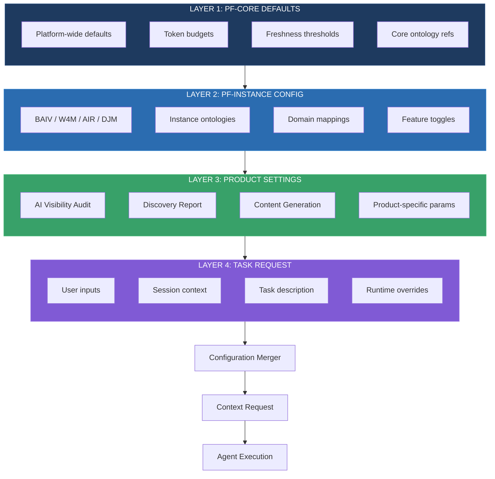
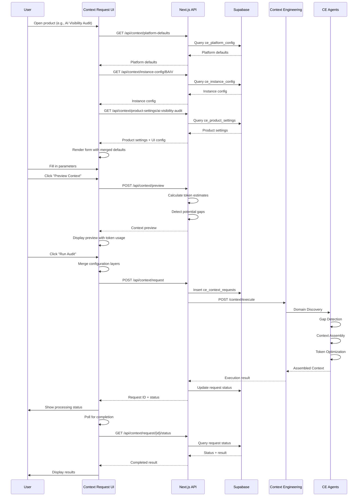

# Product Requirements Document (PRD)

## Context Request & Configuration UI/UX System

**Input Flow Architecture: UI → PF-Core → PF-Instance → Agent Execution**

---

### Document Controls

| Attribute | Value |
|-----------|-------|
| Document ID | **PRD-PF-CORE-CRUI-001** |
| Document Title | Context Request & Configuration UI/UX System |
| Document Type | **PRD** (Product Requirements Document) |
| Document Version | **1.0.0** |
| Version Date | 02 December 2025 |
| Status | DRAFT |
| Platform | **PF-CORE** (Platform Foundation Core) |
| Dependencies | PBS-PF-CORE-CE-001, WBS-PF-CORE-CE-BUILD-001 |
| UI Framework | **Next.js 14 + shadcn/ui** |
| Design Tool | **Figma Make** |

---

## 1. Executive Summary

### 1.1 Problem Statement

Context Engineering agents require structured inputs (seeds, parameters, constraints) to assemble appropriate context for tasks. Currently, there is no defined UI/UX pattern for:

1. **Configuring** agent parameters at multiple levels (platform, instance, product, task)
2. **Passing** dynamic context requirements from user interfaces to agents
3. **Managing** the hierarchy of configuration inheritance
4. **Visualizing** what context will be assembled before agent execution

### 1.2 Solution Overview

This PRD defines a **Context Request Builder** UI/UX system that:

- Provides **layered configuration** from PF-Core defaults through product-specific overrides
- Enables **dynamic parameter input** via intuitive UI components
- Supports **context preview** before agent invocation
- Implements **smart defaults** with progressive disclosure for advanced options

### 1.3 Input Flow Architecture

```
┌─────────────────────────────────────────────────────────────────────────────┐
│                        CONTEXT INPUT FLOW ARCHITECTURE                       │
├─────────────────────────────────────────────────────────────────────────────┤
│                                                                             │
│  ┌─────────────┐    ┌─────────────┐    ┌─────────────┐    ┌─────────────┐  │
│  │  LAYER 1    │    │  LAYER 2    │    │  LAYER 3    │    │  LAYER 4    │  │
│  │  PF-CORE    │───▶│ PF-INSTANCE │───▶│  PRODUCT    │───▶│   TASK      │  │
│  │  Defaults   │    │  Config     │    │  Settings   │    │  Request    │  │
│  └─────────────┘    └─────────────┘    └─────────────┘    └─────────────┘  │
│        │                  │                  │                  │          │
│        ▼                  ▼                  ▼                  ▼          │
│  ┌─────────────────────────────────────────────────────────────────────┐   │
│  │                    CONFIGURATION MERGER                              │   │
│  │  • Inheritance chain resolution                                      │   │
│  │  • Override application                                              │   │
│  │  • Validation & constraint checking                                  │   │
│  └─────────────────────────────────────────────────────────────────────┘   │
│                                    │                                        │
│                                    ▼                                        │
│  ┌─────────────────────────────────────────────────────────────────────┐   │
│  │                    CONTEXT REQUEST OBJECT                            │   │
│  │  {                                                                   │   │
│  │    requestId, tenantId, instanceId, productId,                       │   │
│  │    taskDescription, tokenBudget, freshnessRequirement,               │   │
│  │    scopeHints[], ontologyRefs[], constraints{},                      │   │
│  │    userInputs{}, sessionContext{}                                    │   │
│  │  }                                                                   │   │
│  └─────────────────────────────────────────────────────────────────────┘   │
│                                    │                                        │
│                                    ▼                                        │
│  ┌─────────────────────────────────────────────────────────────────────┐   │
│  │                    CONTEXT ENGINEERING AGENTS                        │   │
│  │  Discovery → Gap Detection → Assembly → Optimization                 │   │
│  └─────────────────────────────────────────────────────────────────────┘   │
│                                                                             │
└─────────────────────────────────────────────────────────────────────────────┘
```

---

## 2. Configuration Layer Architecture

### 2.1 Four-Layer Configuration Model



### 2.2 Configuration Schema

```typescript
// types/context-configuration.ts

/**
 * Layer 1: PF-Core Platform Defaults
 * Applies to ALL instances and products
 */
interface PFCoreDefaults {
  // Token Management
  tokenBudgets: {
    perRequest: number;      // Default: 4096
    perAssembly: number;     // Default: 8192
    dailyLimit: number;      // Default: 500000
    alertThreshold: number;  // Default: 0.8 (80%)
  };
  
  // Freshness Requirements
  freshnessThresholds: {
    critical: number;        // Hours before stale (default: 1)
    standard: number;        // Default: 24
    archival: number;        // Default: 168 (1 week)
  };
  
  // Core Ontology References (always included)
  coreOntologies: string[];  // ['ONT-CTXE-0001', 'ONT-VSOM-0001', 'ONT-RRR-0001']
  
  // Relevance Scoring Weights
  defaultRelevanceProfile: {
    semantic: number;        // Default: 0.35
    temporal: number;        // Default: 0.20
    authority: number;       // Default: 0.25
    specificity: number;     // Default: 0.10
    actionability: number;   // Default: 0.10
  };
  
  // Processing
  maxConcurrentAgents: number;  // Default: 5
  timeoutSeconds: number;       // Default: 30
}

/**
 * Layer 2: PF-Instance Configuration
 * Specific to BAIV, W4M, AIR, or DJM
 */
interface PFInstanceConfig {
  instanceId: 'BAIV' | 'W4M' | 'AIR' | 'DJM';
  instanceName: string;
  
  // Instance-specific ontologies (extends core)
  instanceOntologies: string[];
  
  // Domain focus areas
  primaryDomains: string[];
  
  // Cross-instance capabilities
  crossInstanceEnabled: boolean;
  informsInstances?: string[];
  consumesFromInstances?: string[];
  
  // Feature toggles
  features: {
    extendedThinking: boolean;
    promptCaching: boolean;
    learningMode: boolean;
  };
  
  // Override platform defaults
  overrides?: Partial<PFCoreDefaults>;
}

/**
 * Layer 3: Product Settings
 * Specific to a product within an instance
 */
interface ProductSettings {
  productId: string;
  productName: string;
  instanceId: string;
  
  // Product-specific ontologies
  productOntologies: string[];
  
  // Required context sections
  requiredContext: {
    coreContext: boolean;
    domainContext: boolean;
    instanceContext: boolean;
    referenceContext: boolean;
  };
  
  // Product-specific parameters schema
  parameterSchema: JSONSchema;
  
  // Default parameter values
  defaultParameters: Record<string, any>;
  
  // UI Configuration
  uiConfig: {
    showAdvancedOptions: boolean;
    requiredFields: string[];
    fieldOrder: string[];
    fieldGroups: FieldGroup[];
  };
  
  // Override instance config
  overrides?: Partial<PFInstanceConfig>;
}

/**
 * Layer 4: Task Request
 * Runtime request with user inputs
 */
interface TaskRequest {
  // Identity
  requestId: string;
  tenantId: string;
  userId: string;
  
  // Context chain
  instanceId: string;
  productId: string;
  
  // Task specification
  taskDescription: string;
  taskType: string;
  
  // User inputs (from UI)
  userInputs: Record<string, any>;
  
  // Session context
  sessionContext: {
    currentPage: string;
    previousActions: string[];
    selectedEntities: string[];
    filters: Record<string, any>;
  };
  
  // Runtime overrides
  overrides?: {
    tokenBudget?: number;
    freshnessHours?: number;
    relevanceProfile?: string;
    scopeHints?: string[];
    excludeOntologies?: string[];
  };
  
  // Execution preferences
  preferences: {
    priority: 'low' | 'normal' | 'high' | 'critical';
    waitForCompletion: boolean;
    includeDebugInfo: boolean;
  };
}

/**
 * Final Merged Context Request
 * Sent to Context Engineering agents
 */
interface ContextRequest {
  // Request identity
  requestId: string;
  tenantId: string;
  instanceId: string;
  productId: string;
  
  // Task
  taskDescription: string;
  taskType: string;
  
  // Merged configuration
  tokenBudget: number;
  freshnessRequirement: number;
  relevanceProfile: RelevanceProfile;
  
  // Ontology scope
  ontologyRefs: string[];
  scopeHints: string[];
  excludedOntologies: string[];
  
  // User context
  userInputs: Record<string, any>;
  sessionContext: SessionContext;
  
  // Constraints
  constraints: {
    maxTokens: number;
    timeoutSeconds: number;
    requiredSections: string[];
  };
  
  // Metadata
  priority: string;
  createdAt: string;
  configurationChain: string[];  // ['PF-CORE', 'BAIV', 'AI-VISIBILITY-AUDIT', 'task-123']
}
```

---

## 3. UI/UX Component Architecture

### 3.1 Component Hierarchy

```
Context Request UI Components
├── ContextRequestProvider (React Context)
│   ├── ConfigurationLoader
│   ├── ConfigurationMerger
│   └── RequestBuilder
│
├── Admin Configuration UIs
│   ├── PlatformDefaultsManager (Super Admin)
│   ├── InstanceConfigManager (Instance Admin)
│   └── ProductSettingsManager (Product Admin)
│
├── Task Request UIs
│   ├── ContextRequestBuilder (Main component)
│   │   ├── TaskDescriptionInput
│   │   ├── ParameterInputPanel
│   │   ├── AdvancedOptionsPanel
│   │   └── ContextPreviewPanel
│   │
│   ├── QuickRequestButton (Simplified)
│   └── ContextRequestModal (Overlay)
│
└── Visualization Components
    ├── ConfigurationChainViewer
    ├── ContextPreview
    ├── TokenBudgetIndicator
    └── OntologyScopeViewer
```

### 3.2 Main UI Screens

#### 3.2.1 Platform Defaults Manager (Super Admin)

```
┌─────────────────────────────────────────────────────────────────────────────┐
│  ⚙️ Platform Foundation - Core Defaults                    [Save] [Reset]   │
├─────────────────────────────────────────────────────────────────────────────┤
│                                                                             │
│  ┌─────────────────────────────────────────────────────────────────────┐   │
│  │  TOKEN MANAGEMENT                                          [Expand] │   │
│  ├─────────────────────────────────────────────────────────────────────┤   │
│  │                                                                     │   │
│  │  Per-Request Budget          Per-Assembly Budget                    │   │
│  │  ┌─────────────────────┐    ┌─────────────────────┐                │   │
│  │  │ 4,096 tokens    [▼]│    │ 8,192 tokens    [▼]│                │   │
│  │  └─────────────────────┘    └─────────────────────┘                │   │
│  │                                                                     │   │
│  │  Daily Limit                 Alert Threshold                        │   │
│  │  ┌─────────────────────┐    ┌─────────────────────┐                │   │
│  │  │ 500,000 tokens  [▼]│    │ 80%             [▼]│                │   │
│  │  └─────────────────────┘    └─────────────────────┘                │   │
│  │                                                                     │   │
│  └─────────────────────────────────────────────────────────────────────┘   │
│                                                                             │
│  ┌─────────────────────────────────────────────────────────────────────┐   │
│  │  FRESHNESS THRESHOLDS                                      [Expand] │   │
│  ├─────────────────────────────────────────────────────────────────────┤   │
│  │                                                                     │   │
│  │  Critical         Standard          Archival                        │   │
│  │  ┌───────────┐   ┌───────────┐     ┌───────────┐                   │   │
│  │  │ 1 hour    │   │ 24 hours  │     │ 168 hours │                   │   │
│  │  └───────────┘   └───────────┘     └───────────┘                   │   │
│  │                                                                     │   │
│  └─────────────────────────────────────────────────────────────────────┘   │
│                                                                             │
│  ┌─────────────────────────────────────────────────────────────────────┐   │
│  │  DEFAULT RELEVANCE PROFILE                                 [Expand] │   │
│  ├─────────────────────────────────────────────────────────────────────┤   │
│  │                                                                     │   │
│  │  Semantic      ████████████████████████████████████░░░░░░  35%     │   │
│  │  Temporal      ████████████████░░░░░░░░░░░░░░░░░░░░░░░░░░  20%     │   │
│  │  Authority     █████████████████████████░░░░░░░░░░░░░░░░░  25%     │   │
│  │  Specificity   ████████░░░░░░░░░░░░░░░░░░░░░░░░░░░░░░░░░░  10%     │   │
│  │  Actionability ████████░░░░░░░░░░░░░░░░░░░░░░░░░░░░░░░░░░  10%     │   │
│  │                                                        Total: 100%  │   │
│  └─────────────────────────────────────────────────────────────────────┘   │
│                                                                             │
│  ┌─────────────────────────────────────────────────────────────────────┐   │
│  │  CORE ONTOLOGIES (Always Included)                         [Expand] │   │
│  ├─────────────────────────────────────────────────────────────────────┤   │
│  │                                                                     │   │
│  │  ☑ ONT-CTXE-0001  Context Engineering Core                         │   │
│  │  ☑ ONT-VSOM-0001  Vision Strategy Objectives Metrics               │   │
│  │  ☑ ONT-RRR-0001   Requirements Risks Resources                     │   │
│  │  ☑ ONT-DOM-0001   Domain Mapping                                   │   │
│  │                                                    [+ Add Ontology] │   │
│  └─────────────────────────────────────────────────────────────────────┘   │
│                                                                             │
└─────────────────────────────────────────────────────────────────────────────┘
```

#### 3.2.2 Instance Configuration Manager

```
┌─────────────────────────────────────────────────────────────────────────────┐
│  🎯 Instance Configuration: BAIV                           [Save] [Reset]   │
├─────────────────────────────────────────────────────────────────────────────┤
│                                                                             │
│  ┌─────────────────────────────────────────────────────────────────────┐   │
│  │  INSTANCE IDENTITY                                                  │   │
│  ├─────────────────────────────────────────────────────────────────────┤   │
│  │                                                                     │   │
│  │  Instance ID: BAIV                                                  │   │
│  │  Instance Name: Be AI Visible                                       │   │
│  │  Description: AI Visibility & Marketing Platform                    │   │
│  │                                                                     │   │
│  └─────────────────────────────────────────────────────────────────────┘   │
│                                                                             │
│  ┌─────────────────────────────────────────────────────────────────────┐   │
│  │  INSTANCE ONTOLOGIES                                       [Expand] │   │
│  ├─────────────────────────────────────────────────────────────────────┤   │
│  │                                                                     │   │
│  │  Inherited from PF-Core:                                            │   │
│  │  ├── ONT-CTXE-0001 (Context Engineering Core)                       │   │
│  │  ├── ONT-VSOM-0001 (VSOM)                                          │   │
│  │  └── ONT-RRR-0001 (RRR)                                            │   │
│  │                                                                     │   │
│  │  BAIV-Specific:                                                     │   │
│  │  ├── ☑ ONT-AIV-0001  AI Visibility           [Cross-Instance: ✓]   │   │
│  │  ├── ☑ ONT-UB-0001   Universal Brand                               │   │
│  │  ├── ☑ ONT-CMO-OKR   CMO OKR Framework                             │   │
│  │  └── ☐ ONT-CONTENT   Content Ontology        [+ Add]               │   │
│  │                                                                     │   │
│  └─────────────────────────────────────────────────────────────────────┘   │
│                                                                             │
│  ┌─────────────────────────────────────────────────────────────────────┐   │
│  │  CROSS-INSTANCE CAPABILITIES                               [Expand] │   │
│  ├─────────────────────────────────────────────────────────────────────┤   │
│  │                                                                     │   │
│  │  ☑ Enable Cross-Instance Data Sharing                              │   │
│  │                                                                     │   │
│  │  BAIV Informs:                    BAIV Consumes From:              │   │
│  │  ┌──────────────────┐            ┌──────────────────┐              │   │
│  │  │ ☑ W4M            │            │ ☐ W4M            │              │   │
│  │  │ ☑ AIR            │            │ ☐ AIR            │              │   │
│  │  │ ☑ DJM            │            │ ☑ DJM            │              │   │
│  │  └──────────────────┘            └──────────────────┘              │   │
│  │                                                                     │   │
│  │  Exposed Context:                                                   │   │
│  │  ├── visibilityScores (Daily refresh)                              │   │
│  │  ├── citationOpportunities (Weekly refresh)                        │   │
│  │  ├── contentGaps (Weekly refresh)                                  │   │
│  │  └── competitorBenchmarks (Weekly refresh)                         │   │
│  │                                                                     │   │
│  └─────────────────────────────────────────────────────────────────────┘   │
│                                                                             │
│  ┌─────────────────────────────────────────────────────────────────────┐   │
│  │  PLATFORM DEFAULT OVERRIDES                                [Expand] │   │
│  ├─────────────────────────────────────────────────────────────────────┤   │
│  │                                                                     │   │
│  │  Token Budgets:                                                     │   │
│  │  ☑ Override Per-Request Budget    ┌─────────────────┐              │   │
│  │                                    │ 6,144 tokens    │              │   │
│  │                                    └─────────────────┘              │   │
│  │                                                                     │   │
│  │  Relevance Profile: Marketing Focus                                │   │
│  │  Semantic      ████████████████████████████░░░░░░░░░░░░░░  30%     │   │
│  │  Temporal      ████████████████████░░░░░░░░░░░░░░░░░░░░░░  25%     │   │
│  │  Authority     ████████████████░░░░░░░░░░░░░░░░░░░░░░░░░░  20%     │   │
│  │  Specificity   ████████░░░░░░░░░░░░░░░░░░░░░░░░░░░░░░░░░░  10%     │   │
│  │  Actionability ███████████████░░░░░░░░░░░░░░░░░░░░░░░░░░░  15%     │   │
│  │                                                                     │   │
│  └─────────────────────────────────────────────────────────────────────┘   │
│                                                                             │
└─────────────────────────────────────────────────────────────────────────────┘
```

#### 3.2.3 Product Settings Manager

```
┌─────────────────────────────────────────────────────────────────────────────┐
│  📊 Product Settings: AI Visibility Audit                  [Save] [Reset]   │
│  Instance: BAIV                                                             │
├─────────────────────────────────────────────────────────────────────────────┤
│                                                                             │
│  ┌─────────────────────────────────────────────────────────────────────┐   │
│  │  PRODUCT PARAMETERS SCHEMA                                 [Expand] │   │
│  ├─────────────────────────────────────────────────────────────────────┤   │
│  │                                                                     │   │
│  │  Define the parameters users can configure for this product:       │   │
│  │                                                                     │   │
│  │  ┌─────────────────────────────────────────────────────────────┐   │   │
│  │  │ Parameter       Type       Required   Default    UI Control │   │   │
│  │  ├─────────────────────────────────────────────────────────────┤   │   │
│  │  │ brand_id        string     ✓          -         Select     │   │   │
│  │  │ domain_url      url        ✓          -         Input      │   │   │
│  │  │ ai_platforms    string[]   ✓          [All]     MultiCheck │   │   │
│  │  │ audit_type      enum       ✓          baseline  Select     │   │   │
│  │  │ competitor_ids  string[]   -          []        MultiSelect│   │   │
│  │  │ icp_ids         string[]   -          []        MultiSelect│   │   │
│  │  │ time_range      enum       -          30days    Select     │   │   │
│  │  │ include_gaps    boolean    -          true      Toggle     │   │   │
│  │  │ include_recs    boolean    -          true      Toggle     │   │   │
│  │  └─────────────────────────────────────────────────────────────┘   │   │
│  │                                                    [+ Add Parameter]│   │
│  └─────────────────────────────────────────────────────────────────────┘   │
│                                                                             │
│  ┌─────────────────────────────────────────────────────────────────────┐   │
│  │  UI CONFIGURATION                                          [Expand] │   │
│  ├─────────────────────────────────────────────────────────────────────┤   │
│  │                                                                     │   │
│  │  Field Groups:                                                      │   │
│  │  ┌─────────────────────────────────────────────────────────────┐   │   │
│  │  │ Group: "Basic Settings" (Always Visible)                    │   │   │
│  │  │   └── brand_id, domain_url, audit_type                      │   │   │
│  │  │                                                              │   │   │
│  │  │ Group: "AI Platforms" (Always Visible)                      │   │   │
│  │  │   └── ai_platforms                                          │   │   │
│  │  │                                                              │   │   │
│  │  │ Group: "Advanced Options" (Collapsible)                     │   │   │
│  │  │   └── competitor_ids, icp_ids, time_range                   │   │   │
│  │  │                                                              │   │   │
│  │  │ Group: "Report Options" (Collapsible)                       │   │   │
│  │  │   └── include_gaps, include_recs                            │   │   │
│  │  └─────────────────────────────────────────────────────────────┘   │   │
│  │                                                                     │   │
│  │  ☑ Show Advanced Options by Default                                │   │
│  │  ☑ Enable Context Preview                                          │   │
│  │  ☐ Enable Debug Mode for Users                                     │   │
│  │                                                                     │   │
│  └─────────────────────────────────────────────────────────────────────┘   │
│                                                                             │
│  ┌─────────────────────────────────────────────────────────────────────┐   │
│  │  REQUIRED CONTEXT SECTIONS                                 [Expand] │   │
│  ├─────────────────────────────────────────────────────────────────────┤   │
│  │                                                                     │   │
│  │  ☑ Core Context (VSOM, RRR, Tenant, Session)                       │   │
│  │  ☑ Domain Context (Marketing, AI Visibility)                       │   │
│  │  ☑ Instance Context (BAIV-specific)                                │   │
│  │  ☑ Reference Context (Ontologies, Competitors)                     │   │
│  │                                                                     │   │
│  └─────────────────────────────────────────────────────────────────────┘   │
│                                                                             │
└─────────────────────────────────────────────────────────────────────────────┘
```

---

## 4. Task Request UI Components

### 4.1 Context Request Builder (Main Component)

This is the primary UI component users interact with when invoking agents.

```
┌─────────────────────────────────────────────────────────────────────────────┐
│  🚀 AI Visibility Audit - New Request                                       │
│  ─────────────────────────────────────────────────────────────────────────  │
│  Configuration: PF-Core → BAIV → AI Visibility Audit                        │
├─────────────────────────────────────────────────────────────────────────────┤
│                                                                             │
│  ┌─────────────────────────────────────────────────────────────────────┐   │
│  │  📝 BASIC SETTINGS                                                  │   │
│  ├─────────────────────────────────────────────────────────────────────┤   │
│  │                                                                     │   │
│  │  Brand *                           Domain URL *                     │   │
│  │  ┌─────────────────────────┐      ┌─────────────────────────────┐  │   │
│  │  │ Acme Corporation    [▼] │      │ https://acme.com            │  │   │
│  │  └─────────────────────────┘      └─────────────────────────────┘  │   │
│  │                                                                     │   │
│  │  Audit Type *                                                       │   │
│  │  ┌─────────────────────────────────────────────────────────────┐   │   │
│  │  │ ○ Baseline    ● Periodic    ○ Competitive    ○ Deep Dive   │   │   │
│  │  └─────────────────────────────────────────────────────────────┘   │   │
│  │                                                                     │   │
│  └─────────────────────────────────────────────────────────────────────┘   │
│                                                                             │
│  ┌─────────────────────────────────────────────────────────────────────┐   │
│  │  🤖 AI PLATFORMS *                                                  │   │
│  ├─────────────────────────────────────────────────────────────────────┤   │
│  │                                                                     │   │
│  │  ☑ ChatGPT      ☑ Claude       ☑ Perplexity    ☑ Gemini          │   │
│  │  ☐ CoPilot      ☐ Grok         ☐ Meta AI       [Select All]       │   │
│  │                                                                     │   │
│  └─────────────────────────────────────────────────────────────────────┘   │
│                                                                             │
│  ┌─────────────────────────────────────────────────────────────────────┐   │
│  │  ⚡ ADVANCED OPTIONS                                        [▼ Hide]│   │
│  ├─────────────────────────────────────────────────────────────────────┤   │
│  │                                                                     │   │
│  │  Competitors (optional)                                             │   │
│  │  ┌─────────────────────────────────────────────────────────────┐   │   │
│  │  │ ✕ CompetitorA  ✕ CompetitorB                    [+ Add]     │   │   │
│  │  └─────────────────────────────────────────────────────────────┘   │   │
│  │                                                                     │   │
│  │  ICPs (optional)                                                    │   │
│  │  ┌─────────────────────────────────────────────────────────────┐   │   │
│  │  │ ✕ Enterprise CMO  ✕ SMB Marketing Director      [+ Add]     │   │   │
│  │  └─────────────────────────────────────────────────────────────┘   │   │
│  │                                                                     │   │
│  │  Time Range                                                         │   │
│  │  ┌───────────────────┐                                             │   │
│  │  │ Last 30 Days  [▼] │                                             │   │
│  │  └───────────────────┘                                             │   │
│  │                                                                     │   │
│  └─────────────────────────────────────────────────────────────────────┘   │
│                                                                             │
│  ┌─────────────────────────────────────────────────────────────────────┐   │
│  │  📊 REPORT OPTIONS                                         [▼ Hide]│   │
│  ├─────────────────────────────────────────────────────────────────────┤   │
│  │                                                                     │   │
│  │  ☑ Include Gap Analysis                                            │   │
│  │  ☑ Include Recommendations                                         │   │
│  │  ☐ Include Competitor Deep Dive                                    │   │
│  │                                                                     │   │
│  └─────────────────────────────────────────────────────────────────────┘   │
│                                                                             │
│  ┌─────────────────────────────────────────────────────────────────────┐   │
│  │  🔧 CONTEXT SETTINGS                                       [▼ Hide]│   │
│  ├─────────────────────────────────────────────────────────────────────┤   │
│  │                                                                     │   │
│  │  Token Budget          Freshness           Priority                │   │
│  │  ┌─────────────┐      ┌─────────────┐     ┌─────────────┐         │   │
│  │  │ 6,144   [▼] │      │ Standard [▼]│     │ Normal  [▼] │         │   │
│  │  └─────────────┘      └─────────────┘     └─────────────┘         │   │
│  │  (Inherited: 6,144)   (24 hours)          (Default)               │   │
│  │                                                                     │   │
│  │  Relevance Profile                                                 │   │
│  │  ┌─────────────────────────────────────────────────────────────┐   │   │
│  │  │ ○ Discovery  ○ Analysis  ● Recommendation  ○ Reporting     │   │   │
│  │  └─────────────────────────────────────────────────────────────┘   │   │
│  │                                                                     │   │
│  │  Additional Scope Hints (optional)                                 │   │
│  │  ┌─────────────────────────────────────────────────────────────┐   │   │
│  │  │ Focus on B2B SaaS, enterprise content...                    │   │   │
│  │  └─────────────────────────────────────────────────────────────┘   │   │
│  │                                                                     │   │
│  └─────────────────────────────────────────────────────────────────────┘   │
│                                                                             │
├─────────────────────────────────────────────────────────────────────────────┤
│                                                                             │
│  ┌─────────────────────────────────────────────────────────────────────┐   │
│  │  👁️ CONTEXT PREVIEW                                       [Refresh]│   │
│  ├─────────────────────────────────────────────────────────────────────┤   │
│  │                                                                     │   │
│  │  Estimated Token Usage: 4,892 / 6,144 (79.6%)                      │   │
│  │  ████████████████████████████████████████████████░░░░░░░░░░░░░░░   │   │
│  │                                                                     │   │
│  │  Context Sections:                                                  │   │
│  │  ├── Core Context (VSOM, Tenant)           ~1,200 tokens  ✓        │   │
│  │  ├── Domain Context (AI Visibility)        ~1,800 tokens  ✓        │   │
│  │  ├── Instance Context (BAIV Config)        ~800 tokens    ✓        │   │
│  │  └── Reference Context (Competitors)       ~1,092 tokens  ✓        │   │
│  │                                                                     │   │
│  │  Ontologies to Query:                                               │   │
│  │  ONT-CTXE-0001, ONT-AIV-0001, ONT-UB-0001, ONT-CMO-OKR-0001        │   │
│  │                                                                     │   │
│  │  [View Full Context Preview...]                                     │   │
│  │                                                                     │   │
│  └─────────────────────────────────────────────────────────────────────┘   │
│                                                                             │
├─────────────────────────────────────────────────────────────────────────────┤
│                                                                             │
│     [Cancel]                              [Save Draft]    [▶ Run Audit]     │
│                                                                             │
└─────────────────────────────────────────────────────────────────────────────┘
```

### 4.2 Quick Request Button (Simplified)

For common use cases with smart defaults:

```
┌─────────────────────────────────────────────────────────────────┐
│  ⚡ Quick Audit                                                 │
│  ──────────────────────────────────────────────────────────────│
│                                                                 │
│  Brand: Acme Corporation                                        │
│  Domain: acme.com                                               │
│  Platforms: All (4)                                             │
│  Type: Periodic                                                 │
│                                                                 │
│  Using: Standard settings (6,144 tokens, 24h freshness)         │
│                                                                 │
│  [⚙️ Customize]                           [▶ Run Now]           │
│                                                                 │
└─────────────────────────────────────────────────────────────────┘
```

### 4.3 Context Preview Modal

Detailed preview of what context will be assembled:

```
┌─────────────────────────────────────────────────────────────────────────────┐
│  👁️ Context Preview                                              [✕ Close] │
├─────────────────────────────────────────────────────────────────────────────┤
│                                                                             │
│  Configuration Chain:                                                       │
│  ┌─────────────────────────────────────────────────────────────────────┐   │
│  │ PF-Core ──▶ BAIV ──▶ AI Visibility Audit ──▶ Task Request          │   │
│  │   (4,096)    (6,144)      (6,144)              (6,144)              │   │
│  └─────────────────────────────────────────────────────────────────────┘   │
│                                                                             │
│  ┌──────────────────────┬──────────────────────────────────────────────┐   │
│  │ SECTION              │ CONTENT PREVIEW                              │   │
│  ├──────────────────────┼──────────────────────────────────────────────┤   │
│  │                      │                                              │   │
│  │ 📋 Core Context      │ Vision: "Be the leading AI visibility..."   │   │
│  │    ~1,200 tokens     │ Mission: "Empower brands to achieve..."     │   │
│  │                      │ Strategic Objectives: [5 objectives]         │   │
│  │                      │ Tenant: Acme Corporation                     │   │
│  │                      │ Session: Dashboard > Audits > New            │   │
│  │                      │                                              │   │
│  ├──────────────────────┼──────────────────────────────────────────────┤   │
│  │                      │                                              │   │
│  │ 🎯 Domain Context    │ AI Visibility Score: 68/100                  │   │
│  │    ~1,800 tokens     │ Platform Breakdown:                          │   │
│  │                      │   ChatGPT: 72, Claude: 65, Perplexity: 68   │   │
│  │                      │ Recent Citations: 142 (last 30 days)         │   │
│  │                      │ Top Query Categories: [list]                 │   │
│  │                      │                                              │   │
│  ├──────────────────────┼──────────────────────────────────────────────┤   │
│  │                      │                                              │   │
│  │ 🔧 Instance Context  │ BAIV Configuration:                          │   │
│  │    ~800 tokens       │   Extended Thinking: Enabled                 │   │
│  │                      │   Prompt Caching: Enabled                    │   │
│  │                      │   Cross-Instance: W4M, AIR, DJM             │   │
│  │                      │                                              │   │
│  ├──────────────────────┼──────────────────────────────────────────────┤   │
│  │                      │                                              │   │
│  │ 📚 Reference Context │ Competitors:                                 │   │
│  │    ~1,092 tokens     │   CompetitorA: Score 75, +3 vs last month   │   │
│  │                      │   CompetitorB: Score 71, -2 vs last month   │   │
│  │                      │ ICPs: Enterprise CMO, SMB Director           │   │
│  │                      │                                              │   │
│  └──────────────────────┴──────────────────────────────────────────────┘   │
│                                                                             │
│  Ontologies Being Queried:                                                  │
│  ┌─────────────────────────────────────────────────────────────────────┐   │
│  │ ONT-CTXE-0001 │ ONT-AIV-0001 │ ONT-UB-0001 │ ONT-CMO-OKR-0001      │   │
│  │ Context Eng   │ AI Visibility │ Universal   │ CMO OKR              │   │
│  │ Core          │ (BAIV)       │ Brand       │ Framework             │   │
│  └─────────────────────────────────────────────────────────────────────┘   │
│                                                                             │
│  ⚠️ Potential Gaps Detected:                                               │
│  • Competitor CompetitorC not in system (add or exclude)                   │
│  • ICP "Enterprise CIO" has stale data (last updated 8 days ago)          │
│                                                                             │
├─────────────────────────────────────────────────────────────────────────────┤
│                                                                             │
│     [View JSON]    [Copy Context]              [Close]    [▶ Proceed]      │
│                                                                             │
└─────────────────────────────────────────────────────────────────────────────┘
```

---

## 5. React Component Implementation

### 5.1 Context Request Provider

```tsx
// components/context-engineering/ContextRequestProvider.tsx

'use client';

import React, { createContext, useContext, useReducer, useCallback } from 'react';
import { ContextRequest, PFCoreDefaults, PFInstanceConfig, ProductSettings, TaskRequest } from '@/types/context-configuration';

// State
interface ContextRequestState {
  // Configuration layers
  platformDefaults: PFCoreDefaults | null;
  instanceConfig: PFInstanceConfig | null;
  productSettings: ProductSettings | null;
  
  // Current task request
  taskRequest: Partial<TaskRequest>;
  
  // Merged configuration
  mergedConfig: ContextRequest | null;
  
  // UI state
  isLoading: boolean;
  isPreviewLoading: boolean;
  errors: Record<string, string>;
  
  // Preview data
  contextPreview: ContextPreview | null;
}

// Actions
type ContextRequestAction =
  | { type: 'SET_PLATFORM_DEFAULTS'; payload: PFCoreDefaults }
  | { type: 'SET_INSTANCE_CONFIG'; payload: PFInstanceConfig }
  | { type: 'SET_PRODUCT_SETTINGS'; payload: ProductSettings }
  | { type: 'UPDATE_TASK_REQUEST'; payload: Partial<TaskRequest> }
  | { type: 'SET_USER_INPUT'; payload: { field: string; value: any } }
  | { type: 'SET_OVERRIDE'; payload: { field: string; value: any } }
  | { type: 'MERGE_CONFIGURATION' }
  | { type: 'SET_PREVIEW'; payload: ContextPreview }
  | { type: 'SET_LOADING'; payload: boolean }
  | { type: 'SET_ERROR'; payload: { field: string; message: string } }
  | { type: 'CLEAR_ERRORS' }
  | { type: 'RESET' };

// Context
interface ContextRequestContextValue {
  state: ContextRequestState;
  
  // Actions
  loadConfiguration: (instanceId: string, productId: string) => Promise<void>;
  updateUserInput: (field: string, value: any) => void;
  setOverride: (field: string, value: any) => void;
  mergeConfiguration: () => ContextRequest;
  generatePreview: () => Promise<ContextPreview>;
  submitRequest: () => Promise<string>;
  reset: () => void;
  
  // Computed
  isValid: boolean;
  tokenUsage: { used: number; budget: number; percentage: number };
  validationErrors: string[];
}

const ContextRequestContext = createContext<ContextRequestContextValue | null>(null);

// Reducer
function contextRequestReducer(
  state: ContextRequestState,
  action: ContextRequestAction
): ContextRequestState {
  switch (action.type) {
    case 'SET_PLATFORM_DEFAULTS':
      return { ...state, platformDefaults: action.payload };
      
    case 'SET_INSTANCE_CONFIG':
      return { ...state, instanceConfig: action.payload };
      
    case 'SET_PRODUCT_SETTINGS':
      return { ...state, productSettings: action.payload };
      
    case 'UPDATE_TASK_REQUEST':
      return {
        ...state,
        taskRequest: { ...state.taskRequest, ...action.payload }
      };
      
    case 'SET_USER_INPUT':
      return {
        ...state,
        taskRequest: {
          ...state.taskRequest,
          userInputs: {
            ...state.taskRequest.userInputs,
            [action.payload.field]: action.payload.value
          }
        }
      };
      
    case 'SET_OVERRIDE':
      return {
        ...state,
        taskRequest: {
          ...state.taskRequest,
          overrides: {
            ...state.taskRequest.overrides,
            [action.payload.field]: action.payload.value
          }
        }
      };
      
    case 'SET_PREVIEW':
      return { ...state, contextPreview: action.payload, isPreviewLoading: false };
      
    case 'SET_LOADING':
      return { ...state, isLoading: action.payload };
      
    case 'SET_ERROR':
      return {
        ...state,
        errors: { ...state.errors, [action.payload.field]: action.payload.message }
      };
      
    case 'CLEAR_ERRORS':
      return { ...state, errors: {} };
      
    case 'RESET':
      return initialState;
      
    default:
      return state;
  }
}

// Initial state
const initialState: ContextRequestState = {
  platformDefaults: null,
  instanceConfig: null,
  productSettings: null,
  taskRequest: {},
  mergedConfig: null,
  isLoading: false,
  isPreviewLoading: false,
  errors: {},
  contextPreview: null
};

// Provider component
export function ContextRequestProvider({ children }: { children: React.ReactNode }) {
  const [state, dispatch] = useReducer(contextRequestReducer, initialState);
  
  // Load configuration for instance and product
  const loadConfiguration = useCallback(async (instanceId: string, productId: string) => {
    dispatch({ type: 'SET_LOADING', payload: true });
    
    try {
      // Load platform defaults
      const platformRes = await fetch('/api/context/platform-defaults');
      const platformDefaults = await platformRes.json();
      dispatch({ type: 'SET_PLATFORM_DEFAULTS', payload: platformDefaults });
      
      // Load instance config
      const instanceRes = await fetch(`/api/context/instance-config/${instanceId}`);
      const instanceConfig = await instanceRes.json();
      dispatch({ type: 'SET_INSTANCE_CONFIG', payload: instanceConfig });
      
      // Load product settings
      const productRes = await fetch(`/api/context/product-settings/${productId}`);
      const productSettings = await productRes.json();
      dispatch({ type: 'SET_PRODUCT_SETTINGS', payload: productSettings });
      
      // Initialize task request with defaults
      dispatch({
        type: 'UPDATE_TASK_REQUEST',
        payload: {
          instanceId,
          productId,
          userInputs: productSettings.defaultParameters,
          preferences: {
            priority: 'normal',
            waitForCompletion: true,
            includeDebugInfo: false
          }
        }
      });
      
    } catch (error) {
      dispatch({ type: 'SET_ERROR', payload: { field: 'load', message: 'Failed to load configuration' } });
    } finally {
      dispatch({ type: 'SET_LOADING', payload: false });
    }
  }, []);
  
  // Update user input
  const updateUserInput = useCallback((field: string, value: any) => {
    dispatch({ type: 'SET_USER_INPUT', payload: { field, value } });
  }, []);
  
  // Set override
  const setOverride = useCallback((field: string, value: any) => {
    dispatch({ type: 'SET_OVERRIDE', payload: { field, value } });
  }, []);
  
  // Merge configuration layers
  const mergeConfiguration = useCallback((): ContextRequest => {
    const { platformDefaults, instanceConfig, productSettings, taskRequest } = state;
    
    if (!platformDefaults || !instanceConfig || !productSettings) {
      throw new Error('Configuration not loaded');
    }
    
    // Start with platform defaults
    let tokenBudget = platformDefaults.tokenBudgets.perRequest;
    let freshnessRequirement = platformDefaults.freshnessThresholds.standard;
    let relevanceProfile = { ...platformDefaults.defaultRelevanceProfile };
    let ontologyRefs = [...platformDefaults.coreOntologies];
    
    // Apply instance overrides
    if (instanceConfig.overrides?.tokenBudgets?.perRequest) {
      tokenBudget = instanceConfig.overrides.tokenBudgets.perRequest;
    }
    ontologyRefs = [...ontologyRefs, ...instanceConfig.instanceOntologies];
    
    // Apply product settings
    ontologyRefs = [...ontologyRefs, ...productSettings.productOntologies];
    
    // Apply task overrides
    if (taskRequest.overrides?.tokenBudget) {
      tokenBudget = taskRequest.overrides.tokenBudget;
    }
    if (taskRequest.overrides?.freshnessHours) {
      freshnessRequirement = taskRequest.overrides.freshnessHours;
    }
    
    // Build final request
    const contextRequest: ContextRequest = {
      requestId: `REQ-${Date.now()}`,
      tenantId: taskRequest.tenantId || '',
      instanceId: instanceConfig.instanceId,
      productId: productSettings.productId,
      taskDescription: taskRequest.taskDescription || '',
      taskType: taskRequest.taskType || 'default',
      tokenBudget,
      freshnessRequirement,
      relevanceProfile,
      ontologyRefs: [...new Set(ontologyRefs)], // Deduplicate
      scopeHints: taskRequest.overrides?.scopeHints || [],
      excludedOntologies: taskRequest.overrides?.excludeOntologies || [],
      userInputs: taskRequest.userInputs || {},
      sessionContext: taskRequest.sessionContext || {},
      constraints: {
        maxTokens: tokenBudget,
        timeoutSeconds: 30,
        requiredSections: Object.entries(productSettings.requiredContext)
          .filter(([_, required]) => required)
          .map(([section]) => section)
      },
      priority: taskRequest.preferences?.priority || 'normal',
      createdAt: new Date().toISOString(),
      configurationChain: [
        'PF-CORE',
        instanceConfig.instanceId,
        productSettings.productId,
        `task-${Date.now()}`
      ]
    };
    
    return contextRequest;
  }, [state]);
  
  // Generate preview
  const generatePreview = useCallback(async (): Promise<ContextPreview> => {
    const contextRequest = mergeConfiguration();
    
    const response = await fetch('/api/context/preview', {
      method: 'POST',
      headers: { 'Content-Type': 'application/json' },
      body: JSON.stringify(contextRequest)
    });
    
    const preview = await response.json();
    dispatch({ type: 'SET_PREVIEW', payload: preview });
    
    return preview;
  }, [mergeConfiguration]);
  
  // Submit request
  const submitRequest = useCallback(async (): Promise<string> => {
    dispatch({ type: 'SET_LOADING', payload: true });
    
    try {
      const contextRequest = mergeConfiguration();
      
      const response = await fetch('/api/context/request', {
        method: 'POST',
        headers: { 'Content-Type': 'application/json' },
        body: JSON.stringify(contextRequest)
      });
      
      const result = await response.json();
      return result.requestId;
      
    } finally {
      dispatch({ type: 'SET_LOADING', payload: false });
    }
  }, [mergeConfiguration]);
  
  // Reset
  const reset = useCallback(() => {
    dispatch({ type: 'RESET' });
  }, []);
  
  // Computed values
  const isValid = Boolean(
    state.taskRequest.userInputs &&
    state.productSettings?.uiConfig.requiredFields.every(
      field => state.taskRequest.userInputs?.[field]
    )
  );
  
  const tokenUsage = {
    used: state.contextPreview?.totalTokens || 0,
    budget: state.taskRequest.overrides?.tokenBudget ||
            state.instanceConfig?.overrides?.tokenBudgets?.perRequest ||
            state.platformDefaults?.tokenBudgets.perRequest || 4096,
    percentage: 0
  };
  tokenUsage.percentage = (tokenUsage.used / tokenUsage.budget) * 100;
  
  const validationErrors = state.productSettings?.uiConfig.requiredFields
    .filter(field => !state.taskRequest.userInputs?.[field])
    .map(field => `${field} is required`) || [];
  
  const value: ContextRequestContextValue = {
    state,
    loadConfiguration,
    updateUserInput,
    setOverride,
    mergeConfiguration,
    generatePreview,
    submitRequest,
    reset,
    isValid,
    tokenUsage,
    validationErrors
  };
  
  return (
    <ContextRequestContext.Provider value={value}>
      {children}
    </ContextRequestContext.Provider>
  );
}

// Hook
export function useContextRequest() {
  const context = useContext(ContextRequestContext);
  if (!context) {
    throw new Error('useContextRequest must be used within ContextRequestProvider');
  }
  return context;
}
```

### 5.2 Context Request Builder Component

```tsx
// components/context-engineering/ContextRequestBuilder.tsx

'use client';

import React, { useEffect, useState } from 'react';
import { useContextRequest } from './ContextRequestProvider';
import { Card, CardContent, CardHeader, CardTitle } from '@/components/ui/card';
import { Button } from '@/components/ui/button';
import { Input } from '@/components/ui/input';
import { Label } from '@/components/ui/label';
import { Select, SelectContent, SelectItem, SelectTrigger, SelectValue } from '@/components/ui/select';
import { Checkbox } from '@/components/ui/checkbox';
import { Collapsible, CollapsibleContent, CollapsibleTrigger } from '@/components/ui/collapsible';
import { Progress } from '@/components/ui/progress';
import { Badge } from '@/components/ui/badge';
import { ChevronDown, ChevronUp, Eye, Play, Settings, Loader2 } from 'lucide-react';

interface ContextRequestBuilderProps {
  instanceId: string;
  productId: string;
  onSubmit?: (requestId: string) => void;
}

export function ContextRequestBuilder({
  instanceId,
  productId,
  onSubmit
}: ContextRequestBuilderProps) {
  const {
    state,
    loadConfiguration,
    updateUserInput,
    setOverride,
    generatePreview,
    submitRequest,
    isValid,
    tokenUsage,
    validationErrors
  } = useContextRequest();
  
  const [showAdvanced, setShowAdvanced] = useState(false);
  const [showContextSettings, setShowContextSettings] = useState(false);
  const [showPreview, setShowPreview] = useState(false);
  
  // Load configuration on mount
  useEffect(() => {
    loadConfiguration(instanceId, productId);
  }, [instanceId, productId, loadConfiguration]);
  
  // Render loading state
  if (state.isLoading && !state.productSettings) {
    return (
      <Card>
        <CardContent className="flex items-center justify-center py-12">
          <Loader2 className="h-8 w-8 animate-spin text-primary" />
          <span className="ml-2">Loading configuration...</span>
        </CardContent>
      </Card>
    );
  }
  
  if (!state.productSettings) {
    return (
      <Card>
        <CardContent className="py-12 text-center text-muted-foreground">
          Failed to load product configuration
        </CardContent>
      </Card>
    );
  }
  
  const { productSettings } = state;
  const { uiConfig, parameterSchema } = productSettings;
  
  // Group fields by UI config
  const fieldGroups = uiConfig.fieldGroups;
  
  // Handle submit
  const handleSubmit = async () => {
    const requestId = await submitRequest();
    onSubmit?.(requestId);
  };
  
  // Handle preview
  const handlePreview = async () => {
    await generatePreview();
    setShowPreview(true);
  };
  
  return (
    <div className="space-y-6">
      {/* Header */}
      <Card>
        <CardHeader>
          <div className="flex items-center justify-between">
            <div>
              <CardTitle className="flex items-center gap-2">
                🚀 {productSettings.productName}
              </CardTitle>
              <p className="text-sm text-muted-foreground mt-1">
                Configuration: PF-Core → {state.instanceConfig?.instanceName} → {productSettings.productName}
              </p>
            </div>
            <Badge variant="outline">
              {tokenUsage.used} / {tokenUsage.budget} tokens
            </Badge>
          </div>
        </CardHeader>
      </Card>
      
      {/* Field Groups */}
      {fieldGroups.map((group, idx) => (
        <Card key={group.name}>
          <Collapsible defaultOpen={!group.collapsible}>
            <CardHeader className="pb-3">
              <CollapsibleTrigger className="flex items-center justify-between w-full">
                <CardTitle className="text-base">{group.icon} {group.name}</CardTitle>
                {group.collapsible && (
                  <ChevronDown className="h-4 w-4" />
                )}
              </CollapsibleTrigger>
            </CardHeader>
            <CollapsibleContent>
              <CardContent className="pt-0">
                <div className="grid gap-4 md:grid-cols-2">
                  {group.fields.map(fieldName => {
                    const fieldSchema = parameterSchema.properties?.[fieldName];
                    if (!fieldSchema) return null;
                    
                    return (
                      <FieldRenderer
                        key={fieldName}
                        name={fieldName}
                        schema={fieldSchema}
                        value={state.taskRequest.userInputs?.[fieldName]}
                        onChange={(value) => updateUserInput(fieldName, value)}
                        required={uiConfig.requiredFields.includes(fieldName)}
                        error={state.errors[fieldName]}
                      />
                    );
                  })}
                </div>
              </CardContent>
            </CollapsibleContent>
          </Collapsible>
        </Card>
      ))}
      
      {/* Context Settings (Advanced) */}
      <Card>
        <Collapsible open={showContextSettings} onOpenChange={setShowContextSettings}>
          <CardHeader className="pb-3">
            <CollapsibleTrigger className="flex items-center justify-between w-full">
              <CardTitle className="text-base flex items-center gap-2">
                <Settings className="h-4 w-4" />
                Context Settings
              </CardTitle>
              {showContextSettings ? <ChevronUp className="h-4 w-4" /> : <ChevronDown className="h-4 w-4" />}
            </CollapsibleTrigger>
          </CardHeader>
          <CollapsibleContent>
            <CardContent className="pt-0">
              <div className="grid gap-4 md:grid-cols-3">
                <div className="space-y-2">
                  <Label>Token Budget</Label>
                  <Select
                    value={String(state.taskRequest.overrides?.tokenBudget || tokenUsage.budget)}
                    onValueChange={(v) => setOverride('tokenBudget', parseInt(v))}
                  >
                    <SelectTrigger>
                      <SelectValue />
                    </SelectTrigger>
                    <SelectContent>
                      <SelectItem value="2048">2,048 (Minimal)</SelectItem>
                      <SelectItem value="4096">4,096 (Standard)</SelectItem>
                      <SelectItem value="6144">6,144 (Extended)</SelectItem>
                      <SelectItem value="8192">8,192 (Comprehensive)</SelectItem>
                    </SelectContent>
                  </Select>
                  <p className="text-xs text-muted-foreground">
                    Inherited: {state.instanceConfig?.overrides?.tokenBudgets?.perRequest || state.platformDefaults?.tokenBudgets.perRequest}
                  </p>
                </div>
                
                <div className="space-y-2">
                  <Label>Freshness Requirement</Label>
                  <Select
                    value={String(state.taskRequest.overrides?.freshnessHours || 24)}
                    onValueChange={(v) => setOverride('freshnessHours', parseInt(v))}
                  >
                    <SelectTrigger>
                      <SelectValue />
                    </SelectTrigger>
                    <SelectContent>
                      <SelectItem value="1">Critical (1 hour)</SelectItem>
                      <SelectItem value="24">Standard (24 hours)</SelectItem>
                      <SelectItem value="168">Archival (1 week)</SelectItem>
                    </SelectContent>
                  </Select>
                </div>
                
                <div className="space-y-2">
                  <Label>Priority</Label>
                  <Select
                    value={state.taskRequest.preferences?.priority || 'normal'}
                    onValueChange={(v) => updateUserInput('priority', v)}
                  >
                    <SelectTrigger>
                      <SelectValue />
                    </SelectTrigger>
                    <SelectContent>
                      <SelectItem value="low">Low</SelectItem>
                      <SelectItem value="normal">Normal</SelectItem>
                      <SelectItem value="high">High</SelectItem>
                      <SelectItem value="critical">Critical</SelectItem>
                    </SelectContent>
                  </Select>
                </div>
              </div>
              
              <div className="mt-4 space-y-2">
                <Label>Relevance Profile</Label>
                <div className="flex gap-2">
                  {['discovery', 'analysis', 'recommendation', 'reporting'].map(profile => (
                    <Button
                      key={profile}
                      variant={state.taskRequest.overrides?.relevanceProfile === profile ? 'default' : 'outline'}
                      size="sm"
                      onClick={() => setOverride('relevanceProfile', profile)}
                    >
                      {profile.charAt(0).toUpperCase() + profile.slice(1)}
                    </Button>
                  ))}
                </div>
              </div>
              
              <div className="mt-4 space-y-2">
                <Label>Additional Scope Hints</Label>
                <Input
                  placeholder="e.g., Focus on B2B SaaS, enterprise content..."
                  value={state.taskRequest.overrides?.scopeHints?.join(', ') || ''}
                  onChange={(e) => setOverride('scopeHints', e.target.value.split(',').map(s => s.trim()))}
                />
              </div>
            </CardContent>
          </CollapsibleContent>
        </Collapsible>
      </Card>
      
      {/* Context Preview */}
      {state.contextPreview && (
        <Card>
          <CardHeader>
            <CardTitle className="text-base flex items-center gap-2">
              <Eye className="h-4 w-4" />
              Context Preview
            </CardTitle>
          </CardHeader>
          <CardContent>
            <div className="space-y-4">
              <div>
                <div className="flex justify-between mb-2 text-sm">
                  <span>Token Usage</span>
                  <span>{tokenUsage.used} / {tokenUsage.budget} ({tokenUsage.percentage.toFixed(1)}%)</span>
                </div>
                <Progress value={tokenUsage.percentage} />
              </div>
              
              <div className="space-y-2">
                <p className="text-sm font-medium">Context Sections:</p>
                {state.contextPreview.sections.map(section => (
                  <div key={section.name} className="flex items-center justify-between text-sm">
                    <span className="flex items-center gap-2">
                      {section.included ? '✓' : '○'} {section.name}
                    </span>
                    <span className="text-muted-foreground">~{section.tokenCount} tokens</span>
                  </div>
                ))}
              </div>
              
              <div className="space-y-2">
                <p className="text-sm font-medium">Ontologies:</p>
                <div className="flex flex-wrap gap-1">
                  {state.contextPreview.ontologies.map(ont => (
                    <Badge key={ont} variant="secondary" className="text-xs">
                      {ont}
                    </Badge>
                  ))}
                </div>
              </div>
            </div>
          </CardContent>
        </Card>
      )}
      
      {/* Validation Errors */}
      {validationErrors.length > 0 && (
        <Card className="border-destructive">
          <CardContent className="pt-4">
            <ul className="text-sm text-destructive space-y-1">
              {validationErrors.map((error, idx) => (
                <li key={idx}>• {error}</li>
              ))}
            </ul>
          </CardContent>
        </Card>
      )}
      
      {/* Actions */}
      <div className="flex justify-end gap-3">
        <Button variant="outline" onClick={handlePreview}>
          <Eye className="h-4 w-4 mr-2" />
          Preview Context
        </Button>
        <Button onClick={handleSubmit} disabled={!isValid || state.isLoading}>
          {state.isLoading ? (
            <Loader2 className="h-4 w-4 mr-2 animate-spin" />
          ) : (
            <Play className="h-4 w-4 mr-2" />
          )}
          Run {productSettings.productName}
        </Button>
      </div>
    </div>
  );
}

// Field Renderer Component
interface FieldRendererProps {
  name: string;
  schema: any;
  value: any;
  onChange: (value: any) => void;
  required?: boolean;
  error?: string;
}

function FieldRenderer({ name, schema, value, onChange, required, error }: FieldRendererProps) {
  const label = schema.title || name.split('_').map(w => w.charAt(0).toUpperCase() + w.slice(1)).join(' ');
  
  // Render based on type
  switch (schema.type) {
    case 'string':
      if (schema.enum) {
        return (
          <div className="space-y-2">
            <Label>{label}{required && <span className="text-destructive ml-1">*</span>}</Label>
            <Select value={value || ''} onValueChange={onChange}>
              <SelectTrigger className={error ? 'border-destructive' : ''}>
                <SelectValue placeholder={`Select ${label.toLowerCase()}`} />
              </SelectTrigger>
              <SelectContent>
                {schema.enum.map((opt: string) => (
                  <SelectItem key={opt} value={opt}>{opt}</SelectItem>
                ))}
              </SelectContent>
            </Select>
            {error && <p className="text-xs text-destructive">{error}</p>}
          </div>
        );
      }
      return (
        <div className="space-y-2">
          <Label>{label}{required && <span className="text-destructive ml-1">*</span>}</Label>
          <Input
            value={value || ''}
            onChange={(e) => onChange(e.target.value)}
            placeholder={schema.description}
            className={error ? 'border-destructive' : ''}
          />
          {error && <p className="text-xs text-destructive">{error}</p>}
        </div>
      );
      
    case 'boolean':
      return (
        <div className="flex items-center space-x-2">
          <Checkbox
            id={name}
            checked={value || false}
            onCheckedChange={onChange}
          />
          <Label htmlFor={name}>{label}</Label>
        </div>
      );
      
    case 'array':
      // Multi-select implementation
      return (
        <div className="space-y-2">
          <Label>{label}{required && <span className="text-destructive ml-1">*</span>}</Label>
          <div className="flex flex-wrap gap-2 p-3 border rounded-md min-h-[42px]">
            {(value || []).map((item: string, idx: number) => (
              <Badge key={idx} variant="secondary" className="gap-1">
                {item}
                <button
                  onClick={() => onChange((value || []).filter((_: any, i: number) => i !== idx))}
                  className="ml-1 hover:text-destructive"
                >
                  ×
                </button>
              </Badge>
            ))}
          </div>
          {error && <p className="text-xs text-destructive">{error}</p>}
        </div>
      );
      
    default:
      return null;
  }
}
```

---

## 6. API Endpoints

### 6.1 Configuration APIs

```typescript
// app/api/context/platform-defaults/route.ts

import { NextResponse } from 'next/server';
import { createClient } from '@/lib/supabase/server';

export async function GET() {
  const supabase = createClient();
  
  const { data, error } = await supabase
    .from('ce_platform_config')
    .select('*')
    .eq('config_type', 'defaults')
    .single();
  
  if (error) {
    return NextResponse.json({ error: error.message }, { status: 500 });
  }
  
  return NextResponse.json(data.config);
}

export async function PUT(request: Request) {
  const supabase = createClient();
  const updates = await request.json();
  
  const { data, error } = await supabase
    .from('ce_platform_config')
    .update({ config: updates, updated_at: new Date().toISOString() })
    .eq('config_type', 'defaults')
    .select()
    .single();
  
  if (error) {
    return NextResponse.json({ error: error.message }, { status: 500 });
  }
  
  return NextResponse.json(data.config);
}
```

```typescript
// app/api/context/request/route.ts

import { NextResponse } from 'next/server';
import { createClient } from '@/lib/supabase/server';
import { ContextRequest } from '@/types/context-configuration';

export async function POST(request: Request) {
  const supabase = createClient();
  const contextRequest: ContextRequest = await request.json();
  
  // Validate request
  if (!contextRequest.tenantId || !contextRequest.instanceId) {
    return NextResponse.json(
      { error: 'Missing required fields' },
      { status: 400 }
    );
  }
  
  // Store request
  const { data: requestRecord, error: insertError } = await supabase
    .from('ce_context_requests')
    .insert({
      request_id: contextRequest.requestId,
      tenant_id: contextRequest.tenantId,
      instance_id: contextRequest.instanceId,
      product_id: contextRequest.productId,
      task_description: contextRequest.taskDescription,
      configuration: contextRequest,
      status: 'pending'
    })
    .select()
    .single();
  
  if (insertError) {
    return NextResponse.json({ error: insertError.message }, { status: 500 });
  }
  
  // Trigger agent execution (async)
  const agentResponse = await fetch(`${process.env.AGENT_API_URL}/context/execute`, {
    method: 'POST',
    headers: {
      'Content-Type': 'application/json',
      'Authorization': `Bearer ${process.env.AGENT_API_KEY}`
    },
    body: JSON.stringify(contextRequest)
  });
  
  if (!agentResponse.ok) {
    // Update status to failed
    await supabase
      .from('ce_context_requests')
      .update({ status: 'failed' })
      .eq('request_id', contextRequest.requestId);
    
    return NextResponse.json(
      { error: 'Agent execution failed' },
      { status: 500 }
    );
  }
  
  // Update status to processing
  await supabase
    .from('ce_context_requests')
    .update({ status: 'processing' })
    .eq('request_id', contextRequest.requestId);
  
  return NextResponse.json({
    requestId: contextRequest.requestId,
    status: 'processing'
  });
}
```

```typescript
// app/api/context/preview/route.ts

import { NextResponse } from 'next/server';
import { ContextRequest } from '@/types/context-configuration';

export async function POST(request: Request) {
  const contextRequest: ContextRequest = await request.json();
  
  // Calculate token estimates for each section
  const sections = [
    {
      name: 'Core Context',
      included: contextRequest.constraints.requiredSections.includes('coreContext'),
      tokenCount: estimateCoreContextTokens(contextRequest)
    },
    {
      name: 'Domain Context',
      included: contextRequest.constraints.requiredSections.includes('domainContext'),
      tokenCount: estimateDomainContextTokens(contextRequest)
    },
    {
      name: 'Instance Context',
      included: contextRequest.constraints.requiredSections.includes('instanceContext'),
      tokenCount: estimateInstanceContextTokens(contextRequest)
    },
    {
      name: 'Reference Context',
      included: contextRequest.constraints.requiredSections.includes('referenceContext'),
      tokenCount: estimateReferenceContextTokens(contextRequest)
    }
  ];
  
  const totalTokens = sections
    .filter(s => s.included)
    .reduce((sum, s) => sum + s.tokenCount, 0);
  
  // Check for potential gaps
  const gaps = await detectPotentialGaps(contextRequest);
  
  return NextResponse.json({
    sections,
    totalTokens,
    budget: contextRequest.tokenBudget,
    utilization: (totalTokens / contextRequest.tokenBudget) * 100,
    ontologies: contextRequest.ontologyRefs,
    configurationChain: contextRequest.configurationChain,
    gaps,
    estimatedProcessingTime: estimateProcessingTime(contextRequest)
  });
}

// Helper functions
function estimateCoreContextTokens(request: ContextRequest): number {
  // Base estimates
  let tokens = 500; // VSOM baseline
  tokens += 300; // RRR baseline
  tokens += 200; // Tenant config
  tokens += 200; // Session context
  return tokens;
}

function estimateDomainContextTokens(request: ContextRequest): number {
  const ontologyCount = request.ontologyRefs.length;
  const basePerOntology = 300;
  return ontologyCount * basePerOntology;
}

function estimateInstanceContextTokens(request: ContextRequest): number {
  return 800; // Instance config baseline
}

function estimateReferenceContextTokens(request: ContextRequest): number {
  let tokens = 0;
  const inputs = request.userInputs;
  
  if (inputs.competitor_ids?.length) {
    tokens += inputs.competitor_ids.length * 200;
  }
  if (inputs.icp_ids?.length) {
    tokens += inputs.icp_ids.length * 150;
  }
  
  return tokens || 500; // Minimum baseline
}

async function detectPotentialGaps(request: ContextRequest): Promise<any[]> {
  // This would query the database to detect potential issues
  return [];
}

function estimateProcessingTime(request: ContextRequest): number {
  const baseTime = 5; // seconds
  const ontologyFactor = request.ontologyRefs.length * 2;
  return baseTime + ontologyFactor;
}
```

---

## 7. Database Schema Extensions

```sql
-- migrations/xxx_context_request_configuration.sql

-- Platform configuration table
CREATE TABLE ce_platform_config (
    id UUID PRIMARY KEY DEFAULT gen_random_uuid(),
    config_type TEXT NOT NULL UNIQUE, -- 'defaults', 'features', etc.
    config JSONB NOT NULL DEFAULT '{}',
    created_at TIMESTAMPTZ DEFAULT NOW(),
    updated_at TIMESTAMPTZ DEFAULT NOW()
);

-- Instance configuration table
CREATE TABLE ce_instance_config (
    id UUID PRIMARY KEY DEFAULT gen_random_uuid(),
    instance_id TEXT NOT NULL UNIQUE, -- 'BAIV', 'W4M', 'AIR', 'DJM'
    instance_name TEXT NOT NULL,
    config JSONB NOT NULL DEFAULT '{}',
    overrides JSONB DEFAULT '{}',
    created_at TIMESTAMPTZ DEFAULT NOW(),
    updated_at TIMESTAMPTZ DEFAULT NOW()
);

-- Product settings table
CREATE TABLE ce_product_settings (
    id UUID PRIMARY KEY DEFAULT gen_random_uuid(),
    product_id TEXT NOT NULL UNIQUE,
    product_name TEXT NOT NULL,
    instance_id TEXT NOT NULL REFERENCES ce_instance_config(instance_id),
    parameter_schema JSONB NOT NULL DEFAULT '{}',
    default_parameters JSONB NOT NULL DEFAULT '{}',
    ui_config JSONB NOT NULL DEFAULT '{}',
    required_context JSONB NOT NULL DEFAULT '{}',
    overrides JSONB DEFAULT '{}',
    created_at TIMESTAMPTZ DEFAULT NOW(),
    updated_at TIMESTAMPTZ DEFAULT NOW()
);

-- Context requests table
CREATE TABLE ce_context_requests (
    id UUID PRIMARY KEY DEFAULT gen_random_uuid(),
    request_id TEXT NOT NULL UNIQUE,
    tenant_id UUID NOT NULL REFERENCES tenants(id),
    instance_id TEXT NOT NULL,
    product_id TEXT NOT NULL,
    task_description TEXT,
    configuration JSONB NOT NULL,
    status TEXT NOT NULL DEFAULT 'pending',
    result JSONB,
    error_message TEXT,
    processing_time_ms INTEGER,
    tokens_used INTEGER,
    created_at TIMESTAMPTZ DEFAULT NOW(),
    completed_at TIMESTAMPTZ
);

-- Indexes
CREATE INDEX idx_ce_requests_tenant ON ce_context_requests(tenant_id);
CREATE INDEX idx_ce_requests_status ON ce_context_requests(status);
CREATE INDEX idx_ce_requests_instance ON ce_context_requests(instance_id);
CREATE INDEX idx_ce_product_instance ON ce_product_settings(instance_id);

-- RLS policies
ALTER TABLE ce_context_requests ENABLE ROW LEVEL SECURITY;

CREATE POLICY "Tenant isolation for context requests"
    ON ce_context_requests
    FOR ALL
    USING (tenant_id = current_setting('app.current_tenant_id')::uuid);

-- Insert default platform configuration
INSERT INTO ce_platform_config (config_type, config) VALUES (
    'defaults',
    '{
        "tokenBudgets": {
            "perRequest": 4096,
            "perAssembly": 8192,
            "dailyLimit": 500000,
            "alertThreshold": 0.8
        },
        "freshnessThresholds": {
            "critical": 1,
            "standard": 24,
            "archival": 168
        },
        "coreOntologies": ["ONT-CTXE-0001", "ONT-VSOM-0001", "ONT-RRR-0001", "ONT-DOM-0001"],
        "defaultRelevanceProfile": {
            "semantic": 0.35,
            "temporal": 0.20,
            "authority": 0.25,
            "specificity": 0.10,
            "actionability": 0.10
        },
        "maxConcurrentAgents": 5,
        "timeoutSeconds": 30
    }'::jsonb
);

-- Insert BAIV instance configuration
INSERT INTO ce_instance_config (instance_id, instance_name, config, overrides) VALUES (
    'BAIV',
    'Be AI Visible',
    '{
        "instanceOntologies": ["ONT-AIV-0001", "ONT-UB-0001", "ONT-CMO-OKR-0001"],
        "primaryDomains": ["DOM-MARKETING-001", "DOM-CONTENT-001"],
        "crossInstanceEnabled": true,
        "informsInstances": ["W4M", "AIR", "DJM"],
        "consumesFromInstances": ["DJM"],
        "features": {
            "extendedThinking": true,
            "promptCaching": true,
            "learningMode": true
        }
    }'::jsonb,
    '{
        "tokenBudgets": {
            "perRequest": 6144
        },
        "defaultRelevanceProfile": {
            "semantic": 0.30,
            "temporal": 0.25,
            "authority": 0.20,
            "specificity": 0.10,
            "actionability": 0.15
        }
    }'::jsonb
);

-- Insert AI Visibility Audit product settings
INSERT INTO ce_product_settings (product_id, product_name, instance_id, parameter_schema, default_parameters, ui_config, required_context) VALUES (
    'ai-visibility-audit',
    'AI Visibility Audit',
    'BAIV',
    '{
        "type": "object",
        "properties": {
            "brand_id": {"type": "string", "title": "Brand"},
            "domain_url": {"type": "string", "format": "uri", "title": "Domain URL"},
            "ai_platforms": {
                "type": "array",
                "items": {"type": "string", "enum": ["ChatGPT", "Claude", "Perplexity", "Gemini", "CoPilot"]},
                "title": "AI Platforms"
            },
            "audit_type": {
                "type": "string",
                "enum": ["baseline", "periodic", "competitive", "deep_dive"],
                "title": "Audit Type"
            },
            "competitor_ids": {"type": "array", "items": {"type": "string"}, "title": "Competitors"},
            "icp_ids": {"type": "array", "items": {"type": "string"}, "title": "ICPs"},
            "time_range": {
                "type": "string",
                "enum": ["7days", "30days", "90days"],
                "title": "Time Range"
            },
            "include_gaps": {"type": "boolean", "title": "Include Gap Analysis"},
            "include_recs": {"type": "boolean", "title": "Include Recommendations"}
        },
        "required": ["brand_id", "domain_url", "ai_platforms", "audit_type"]
    }'::jsonb,
    '{
        "ai_platforms": ["ChatGPT", "Claude", "Perplexity", "Gemini"],
        "audit_type": "baseline",
        "time_range": "30days",
        "include_gaps": true,
        "include_recs": true
    }'::jsonb,
    '{
        "showAdvancedOptions": true,
        "requiredFields": ["brand_id", "domain_url", "ai_platforms", "audit_type"],
        "fieldOrder": ["brand_id", "domain_url", "audit_type", "ai_platforms", "competitor_ids", "icp_ids", "time_range", "include_gaps", "include_recs"],
        "fieldGroups": [
            {"name": "Basic Settings", "icon": "📝", "fields": ["brand_id", "domain_url", "audit_type"], "collapsible": false},
            {"name": "AI Platforms", "icon": "🤖", "fields": ["ai_platforms"], "collapsible": false},
            {"name": "Advanced Options", "icon": "⚡", "fields": ["competitor_ids", "icp_ids", "time_range"], "collapsible": true},
            {"name": "Report Options", "icon": "📊", "fields": ["include_gaps", "include_recs"], "collapsible": true}
        ]
    }'::jsonb,
    '{
        "coreContext": true,
        "domainContext": true,
        "instanceContext": true,
        "referenceContext": true
    }'::jsonb
);
```

---

## 8. User Flow Diagrams

### 8.1 Complete Input Flow



---

## 9. Implementation Roadmap

### Phase 1: Foundation (Week 1-2)
- [ ] Database schema deployment
- [ ] Platform defaults API
- [ ] Instance config API
- [ ] Product settings API

### Phase 2: Core Components (Week 3-4)
- [ ] ContextRequestProvider implementation
- [ ] ContextRequestBuilder component
- [ ] Field renderer components
- [ ] Context preview component

### Phase 3: Admin UIs (Week 5-6)
- [ ] Platform defaults manager
- [ ] Instance config manager
- [ ] Product settings manager

### Phase 4: Integration (Week 7-8)
- [ ] Agent execution integration
- [ ] Real-time status updates
- [ ] Error handling and recovery
- [ ] Performance optimization

---

## 10. Appendix

### 10.1 Related Documents

| Document ID | Title | Version |
|-------------|-------|---------|
| PBS-PF-CORE-CE-001 | Context Engineering PBS | 1.0.0 |
| WBS-PF-CORE-CE-BUILD-001 | Agent Build WBS | 1.0.0 |
| PRD-PF-CORE-CEA-001 | Agent Ecosystem PRD | 1.0.0 |

---

**--- END OF DOCUMENT ---**

```
┌─────────────────────────────────────────────────────────────────────────────┐
│  © 2025 Platform Foundation Core Holdings. All Rights Reserved.             │
│                                                                             │
│  Document ID: PRD-PF-CORE-CRUI-001                                          │
│  Document Type: PRD (Product Requirements Document)                          │
│  Classification: CONFIDENTIAL - PF-CORE Engineering Team                    │
└─────────────────────────────────────────────────────────────────────────────┘
```
