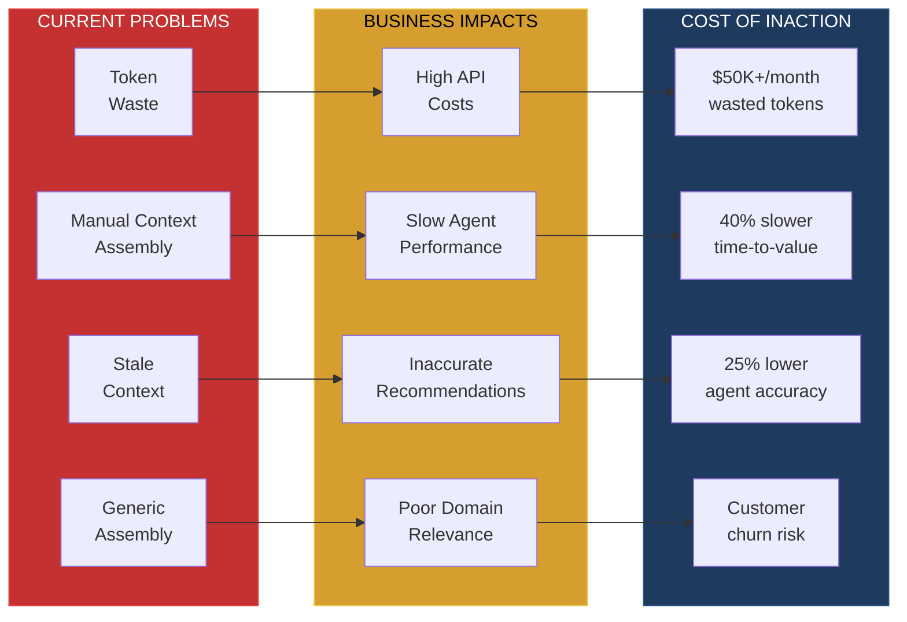
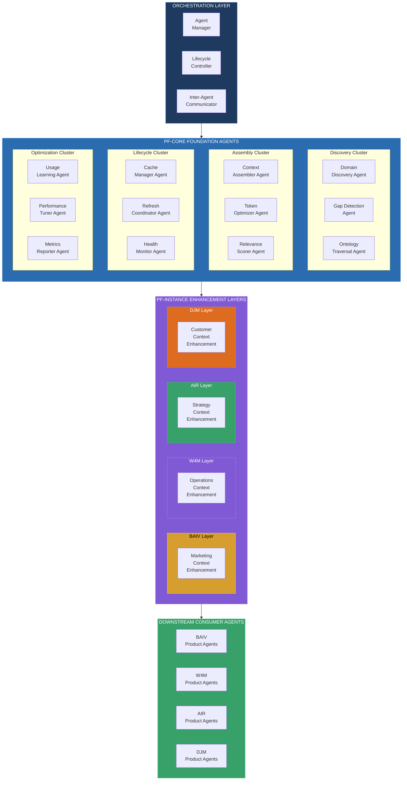
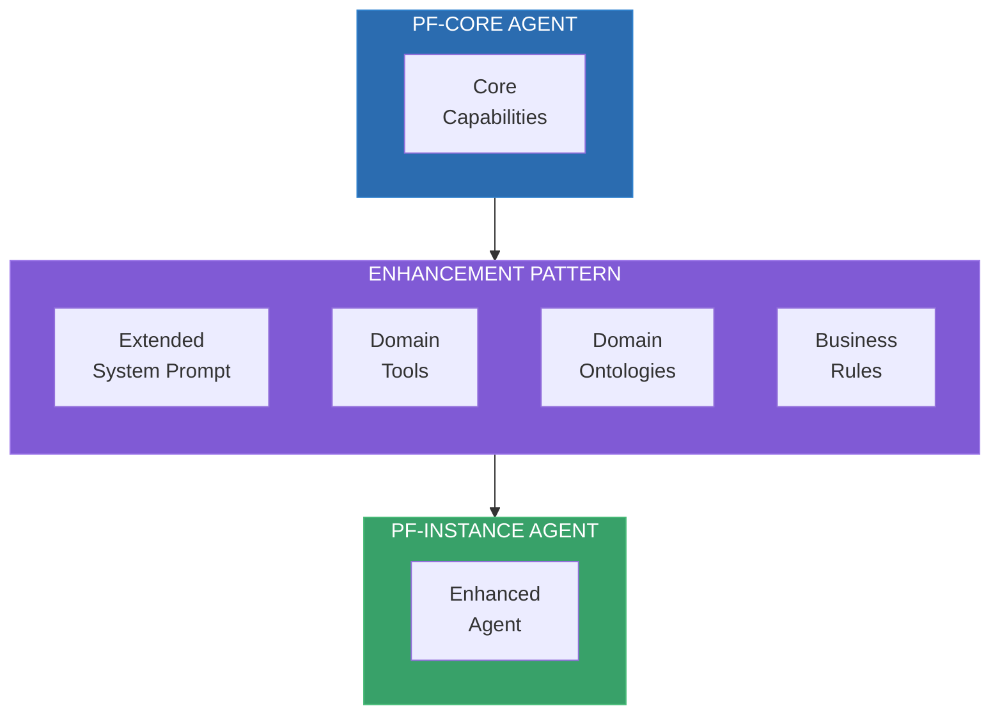
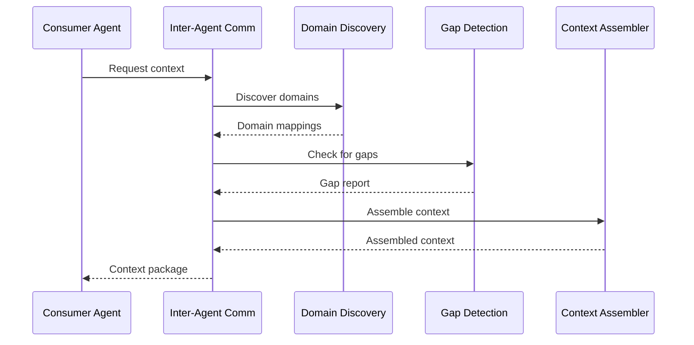
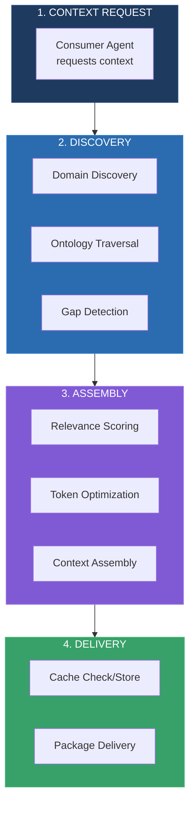

# Product Requirements Document

## PF-CORE Context Engineer Agent Ecosystem

**Multi-Layer Agent Architecture for Context Discovery, Assembly & Optimization**

---

### Document Controls

| Attribute | Value |
|-----------|-------|
| Document ID | **PRD-PF-CORE-CEA-001** |
| Document Title | Context Engineer Agent Ecosystem PRD |
| Document Type | **PRD** (Product Requirements Document) |
| Document Version | **1.0.0** |
| Version Date | 01 December 2025 |
| Status | DRAFT |
| Platform | **PF-CORE** (Platform Foundation Core) |
| Platform Instances | AIR, BAIV, W4M, DJM |
| Parent Documents | PF-CORE-CE-EXP-001 v1.4, PF-CORE-CE-VE-OKR-001 v1.0 |
| Ontology Compliance | Schema.org Grounded, OAA Registry v3.0 |
| SDK Framework | Claude Agent SDK (Anthropic) |

### Change Log

| Version | Date | Author | Changes |
|---------|------|--------|---------|
| **1.0.0** | **01 Dec 2025** | **PF-CORE Architecture** | **Initial PRD; Core agent specifications; PF-Instance enhancement layers; BAIV, W4M, AIR, DJM agent definitions; Integration patterns; Acceptance criteria** |

### Copyright & Licensing

```
┌─────────────────────────────────────────────────────────────────────────────┐
│  © 2025 Platform Foundation Core Holdings. All Rights Reserved.             │
│                                                                             │
│  This document and its contents are the confidential intellectual           │
│  property of PF-CORE Holdings.                                              │
│                                                                             │
│  LICENSE GRANT: This document is licensed to authorized PF-Instances        │
│  (AIR, BAIV, W4M, DJM) under the PF-CORE Platform License Agreement.       │
└─────────────────────────────────────────────────────────────────────────────┘
```

---

## Executive Summary

This PRD defines the **Context Engineer Agent Ecosystem** — a multi-layer agent architecture that implements, supports, and operates the PF-Core Context Engineering capability. The ecosystem comprises:

1. **PF-Core Foundation Layer** — Platform-wide agents providing core context discovery, assembly, and optimization capabilities

2. **PF-Instance Enhancement Layers** — Domain-specific agent enhancements for:
   - **BAIV** — Marketing & AI Visibility context specialization
   - **W4M** — Operations & Value Engineering context specialization
   - **AIR** — Strategy & Innovation context specialization
   - **DJM** — Customer Experience context specialization

3. **Orchestration Layer** — Agent coordination, lifecycle management, and inter-agent communication

The architecture follows the **"Core + Enhancement"** pattern, enabling maximum reuse of foundational capabilities while supporting deep domain customization.

---

## 1. Problem Statement

### 1.1 Current State Challenges

| Challenge | Impact | Root Cause |
|-----------|--------|------------|
| **Context Assembly Overhead** | 40% of agent processing time spent on context preparation | No dedicated context management capability |
| **Token Budget Waste** | 30-50% of tokens carry irrelevant context | Manual, one-size-fits-all context loading |
| **Cross-Instance Inconsistency** | Each PF-Instance implements context differently | No platform-wide context standard |
| **Context Staleness** | Agents operate on outdated information | No proactive context refresh mechanism |
| **Discovery Inefficiency** | Agents miss relevant ontology relationships | No intelligent ontology traversal |
| **Instance-Specific Blindness** | Generic context ignores domain requirements | No domain-aware context assembly |

### 1.2 Impact Analysis



---

## 2. Solution Overview

### 2.1 Agent Ecosystem Architecture



### 2.2 Agent Summary

| Layer | Agent Count | Purpose |
|-------|-------------|---------|
| **Orchestration** | 3 | Coordinate, manage lifecycle, enable communication |
| **PF-Core Foundation** | 12 | Core context discovery, assembly, lifecycle, optimization |
| **PF-Instance Enhancement** | 4 (extensible) | Domain-specific context customization |
| **Total** | **19** | Complete context engineering capability |

---

## 3. PF-Core Foundation Agents

### 3.1 Discovery Cluster

#### 3.1.1 Domain Discovery Agent (AG-CORE-DD-001)

**Purpose:** Identify and map relevant knowledge domains for a given task or query.

| Attribute | Specification |
|-----------|---------------|
| **Agent ID** | `pf-core-domain-discovery` |
| **Model** | claude-sonnet-4-20250514 |
| **Max Tokens** | 4096 |
| **Temperature** | 0.3 |
| **Cluster** | Discovery |

**System Prompt:**
```
You are the Domain Discovery Agent for PF-CORE.

Your responsibility is to identify relevant knowledge domains for agent tasks.

Given a task description or query:
1. ANALYZE the semantic content to identify topic domains
2. MAP to available ontologies in the OAA Registry
3. IDENTIFY boundary conditions and scope limits
4. RECOMMEND which ontologies and data sources are relevant
5. ESTIMATE coverage completeness

Output structured domain mapping with confidence scores.

Context Engineering Principles:
- Be thorough but not exhaustive — identify high-value domains first
- Consider cross-domain relationships
- Flag ambiguous or uncertain mappings for human review
```

**Tools:**
- `ontology_registry_lookup` — Query OAA Registry for matching ontologies
- `semantic_analyzer` — Extract semantic topics from input
- `domain_relationship_mapper` — Map cross-domain dependencies
- `coverage_estimator` — Estimate context coverage percentage

**Functional Requirements:**

| FR ID | Requirement | Priority |
|-------|-------------|----------|
| FR-DD-001 | Agent SHALL accept natural language task descriptions | Must |
| FR-DD-002 | Agent SHALL query OAA Registry for matching ontologies | Must |
| FR-DD-003 | Agent SHALL return domain mappings with confidence scores | Must |
| FR-DD-004 | Agent SHALL identify cross-domain relationships | Should |
| FR-DD-005 | Agent SHALL estimate context coverage percentage | Should |
| FR-DD-006 | Agent SHALL respect PF-Instance scope boundaries | Must |

**Input Schema:**
```json
{
  "task_description": "string — Natural language task description",
  "instance_id": "string — PF-Instance identifier (BAIV, W4M, AIR, DJM)",
  "scope_hints": ["array — Optional scope guidance"],
  "max_domains": "number — Maximum domains to return (default: 5)"
}
```

**Output Schema:**
```json
{
  "domains": [
    {
      "domain_id": "string",
      "domain_name": "string",
      "ontology_refs": ["array of ontology IDs"],
      "confidence": "number (0-1)",
      "relevance_score": "number (0-100)",
      "coverage_estimate": "number (0-100)"
    }
  ],
  "cross_domain_relationships": [
    {
      "source_domain": "string",
      "target_domain": "string",
      "relationship_type": "string"
    }
  ],
  "scope_boundaries": {
    "included": ["array"],
    "excluded": ["array"],
    "instance_filtered": "boolean"
  },
  "metadata": {
    "processing_time_ms": "number",
    "tokens_used": "number"
  }
}
```

---

#### 3.1.2 Gap Detection Agent (AG-CORE-GD-001)

**Purpose:** Identify missing, stale, or incomplete context that could impact agent performance.

| Attribute | Specification |
|-----------|---------------|
| **Agent ID** | `pf-core-gap-detection` |
| **Model** | claude-sonnet-4-20250514 |
| **Max Tokens** | 4096 |
| **Temperature** | 0.2 |
| **Cluster** | Discovery |

**System Prompt:**
```
You are the Gap Detection Agent for PF-CORE.

Your responsibility is to identify context gaps that could impact agent performance.

Gap Categories:
1. MISSING — Required context not available
2. STALE — Context exists but is outdated (>freshness threshold)
3. INCOMPLETE — Partial context available but key elements missing
4. INCONSISTENT — Conflicting context from multiple sources
5. INACCESSIBLE — Context exists but cannot be retrieved (permissions, errors)

For each gap:
- Assess severity (critical/high/medium/low)
- Estimate impact on task success
- Recommend remediation action
- Identify potential fallback options

Prioritize gaps that block task completion.
```

**Tools:**
- `context_validator` — Validate context completeness against requirements
- `freshness_checker` — Check context age against freshness thresholds
- `consistency_analyzer` — Detect conflicting information
- `access_verifier` — Verify context accessibility

**Functional Requirements:**

| FR ID | Requirement | Priority |
|-------|-------------|----------|
| FR-GD-001 | Agent SHALL detect missing required context | Must |
| FR-GD-002 | Agent SHALL identify stale context beyond freshness thresholds | Must |
| FR-GD-003 | Agent SHALL flag incomplete context with missing elements | Must |
| FR-GD-004 | Agent SHALL detect inconsistent/conflicting context | Should |
| FR-GD-005 | Agent SHALL assess gap severity and task impact | Must |
| FR-GD-006 | Agent SHALL recommend remediation for each gap | Should |

**Input Schema:**
```json
{
  "current_context": "object — Currently assembled context",
  "required_context": "object — Context requirements for task",
  "freshness_threshold_hours": "number — Maximum age for valid context",
  "instance_id": "string — PF-Instance identifier"
}
```

**Output Schema:**
```json
{
  "gaps": [
    {
      "gap_id": "string",
      "gap_type": "missing|stale|incomplete|inconsistent|inaccessible",
      "description": "string",
      "affected_element": "string",
      "severity": "critical|high|medium|low",
      "task_impact": "blocking|degrading|minor",
      "remediation": {
        "action": "string",
        "estimated_effort": "string",
        "fallback_option": "string"
      }
    }
  ],
  "summary": {
    "total_gaps": "number",
    "blocking_gaps": "number",
    "coverage_score": "number (0-100)"
  }
}
```

---

#### 3.1.3 Ontology Traversal Agent (AG-CORE-OT-001)

**Purpose:** Navigate ontology graphs to discover related concepts and relationships.

| Attribute | Specification |
|-----------|---------------|
| **Agent ID** | `pf-core-ontology-traversal` |
| **Model** | claude-sonnet-4-20250514 |
| **Max Tokens** | 8192 |
| **Temperature** | 0.1 |
| **Cluster** | Discovery |

**System Prompt:**
```
You are the Ontology Traversal Agent for PF-CORE.

Your responsibility is to navigate ontology graphs intelligently.

Traversal Strategies:
1. BREADTH-FIRST — Explore immediate relationships before going deeper
2. DEPTH-FIRST — Follow relationship chains to completion
3. RELEVANCE-GUIDED — Prioritize paths with higher relevance scores
4. BUDGET-CONSTRAINED — Stay within token/depth limits

For each traversal:
- Start from seed concepts
- Follow semantic relationships
- Collect relevant nodes and edges
- Respect depth and budget constraints
- Return structured graph fragment

Optimize for relevance, not completeness.
```

**Tools:**
- `graph_query` — Execute graph queries on ontology store
- `relationship_resolver` — Resolve semantic relationships
- `node_scorer` — Score node relevance to context
- `path_optimizer` — Find optimal traversal paths

**Functional Requirements:**

| FR ID | Requirement | Priority |
|-------|-------------|----------|
| FR-OT-001 | Agent SHALL traverse ontology graphs from seed concepts | Must |
| FR-OT-002 | Agent SHALL support multiple traversal strategies | Should |
| FR-OT-003 | Agent SHALL respect depth and token budget constraints | Must |
| FR-OT-004 | Agent SHALL return structured graph fragments | Must |
| FR-OT-005 | Agent SHALL score nodes by relevance | Must |
| FR-OT-006 | Agent SHALL handle circular references without infinite loops | Must |

---

### 3.2 Assembly Cluster

#### 3.2.1 Context Assembler Agent (AG-CORE-CA-001)

**Purpose:** Assemble optimal context packages from discovered elements within constraints.

| Attribute | Specification |
|-----------|---------------|
| **Agent ID** | `pf-core-context-assembler` |
| **Model** | claude-sonnet-4-20250514 |
| **Max Tokens** | 8192 |
| **Temperature** | 0.2 |
| **Cluster** | Assembly |

**System Prompt:**
```
You are the Context Assembler Agent for PF-CORE.

Your responsibility is to build optimal context packages.

Assembly Principles:
1. RELEVANCE — Include only information relevant to the task
2. COMPLETENESS — Ensure all required context elements are present
3. EFFICIENCY — Minimize tokens while maximizing value
4. STRUCTURE — Organize context logically for consuming agent
5. TRACEABILITY — Maintain source attribution for all elements

Package Structure:
- Core context (always included)
- Domain context (task-specific)
- Reference context (supporting information)
- Metadata (sources, freshness, confidence)

Respect token budgets strictly — prioritize high-value context.
```

**Tools:**
- `context_merger` — Merge context from multiple sources
- `token_counter` — Count tokens in context elements
- `priority_ranker` — Rank context elements by priority
- `package_formatter` — Format context into standard structure

**Functional Requirements:**

| FR ID | Requirement | Priority |
|-------|-------------|----------|
| FR-CA-001 | Agent SHALL assemble context from multiple sources | Must |
| FR-CA-002 | Agent SHALL respect token budget constraints | Must |
| FR-CA-003 | Agent SHALL prioritize high-relevance elements | Must |
| FR-CA-004 | Agent SHALL structure context for consuming agent | Must |
| FR-CA-005 | Agent SHALL maintain source attribution | Should |
| FR-CA-006 | Agent SHALL generate context in JSON-LD format | Must |

**Input Schema:**
```json
{
  "context_elements": [
    {
      "source": "string",
      "content": "object",
      "relevance_score": "number",
      "freshness": "ISO datetime"
    }
  ],
  "token_budget": "number — Maximum tokens for assembled context",
  "consuming_agent_id": "string — Agent that will receive context",
  "instance_id": "string — PF-Instance identifier",
  "structure_template": "string — Optional structure template"
}
```

**Output Schema:**
```json
{
  "@context": {
    "schema": "https://schema.org/",
    "pf": "https://ontology.pf-core.io/"
  },
  "@type": "pf:AssembledContext",
  "core_context": {
    "vsom": "object — VSOM strategic context",
    "rrr": "object — RRR requirements/risks/resources"
  },
  "domain_context": "object — Task-specific context",
  "reference_context": "object — Supporting information",
  "metadata": {
    "assembled_at": "ISO datetime",
    "token_count": "number",
    "budget_utilization": "number (0-100%)",
    "sources": ["array of source references"],
    "coverage_score": "number"
  }
}
```

---

#### 3.2.2 Token Optimizer Agent (AG-CORE-TO-001)

**Purpose:** Optimize context for minimum token usage while preserving semantic value.

| Attribute | Specification |
|-----------|---------------|
| **Agent ID** | `pf-core-token-optimizer` |
| **Model** | claude-sonnet-4-20250514 |
| **Max Tokens** | 4096 |
| **Temperature** | 0.1 |
| **Cluster** | Assembly |

**System Prompt:**
```
You are the Token Optimizer Agent for PF-CORE.

Your responsibility is to minimize token usage while preserving value.

Optimization Techniques:
1. COMPRESSION — Remove redundant or verbose elements
2. SUMMARIZATION — Replace detailed content with summaries
3. PRUNING — Remove low-value elements entirely
4. REFERENCE — Replace inline content with references
5. CACHING — Identify cacheable vs. dynamic elements

Never sacrifice critical information for token savings.
Preserve semantic meaning and relationship structure.
Track optimization ratio: original_tokens / optimized_tokens.
```

**Tools:**
- `token_counter` — Count tokens accurately
- `semantic_compressor` — Compress while preserving meaning
- `redundancy_detector` — Find redundant content
- `summary_generator` — Generate concise summaries

**Functional Requirements:**

| FR ID | Requirement | Priority |
|-------|-------------|----------|
| FR-TO-001 | Agent SHALL reduce token count without losing critical info | Must |
| FR-TO-002 | Agent SHALL track optimization ratio | Must |
| FR-TO-003 | Agent SHALL preserve semantic relationships | Must |
| FR-TO-004 | Agent SHALL identify cacheable elements | Should |
| FR-TO-005 | Agent SHALL provide optimization report | Should |

---

#### 3.2.3 Relevance Scorer Agent (AG-CORE-RS-001)

**Purpose:** Score context elements by relevance to the current task.

| Attribute | Specification |
|-----------|---------------|
| **Agent ID** | `pf-core-relevance-scorer` |
| **Model** | claude-sonnet-4-20250514 |
| **Max Tokens** | 4096 |
| **Temperature** | 0.2 |
| **Cluster** | Assembly |

**System Prompt:**
```
You are the Relevance Scorer Agent for PF-CORE.

Your responsibility is to score context relevance for tasks.

Scoring Dimensions:
1. SEMANTIC RELEVANCE — How closely related to task topic (0-100)
2. TEMPORAL RELEVANCE — How current/fresh the information is (0-100)
3. AUTHORITY — Source credibility and trustworthiness (0-100)
4. SPECIFICITY — How specific vs. general the information is (0-100)
5. ACTIONABILITY — How actionable for the task (0-100)

Composite Score = weighted average based on task type.

Return ranked list with dimension breakdown.
```

**Functional Requirements:**

| FR ID | Requirement | Priority |
|-------|-------------|----------|
| FR-RS-001 | Agent SHALL score elements across multiple dimensions | Must |
| FR-RS-002 | Agent SHALL compute composite relevance score | Must |
| FR-RS-003 | Agent SHALL rank elements by composite score | Must |
| FR-RS-004 | Agent SHALL provide dimension breakdown | Should |
| FR-RS-005 | Agent SHALL support custom weighting by task type | Should |

---

### 3.3 Lifecycle Cluster

#### 3.3.1 Cache Manager Agent (AG-CORE-CM-001)

**Purpose:** Manage context caching with intelligent invalidation and refresh.

| Attribute | Specification |
|-----------|---------------|
| **Agent ID** | `pf-core-cache-manager` |
| **Model** | claude-haiku-3-5-20241022 |
| **Max Tokens** | 2048 |
| **Temperature** | 0.0 |
| **Cluster** | Lifecycle |

**System Prompt:**
```
You are the Cache Manager Agent for PF-CORE.

Your responsibility is to manage context cache efficiently.

Cache Operations:
1. STORE — Cache context with TTL and metadata
2. RETRIEVE — Get cached context if valid
3. INVALIDATE — Mark cache entries as stale
4. REFRESH — Trigger proactive cache refresh
5. EVICT — Remove low-value entries when capacity exceeded

Cache Policies:
- TTL-based expiration per context type
- LRU eviction when capacity exceeded
- Proactive refresh before expiration
- Instance-isolated cache namespaces

Track hit rates and optimize caching strategy.
```

**Functional Requirements:**

| FR ID | Requirement | Priority |
|-------|-------------|----------|
| FR-CM-001 | Agent SHALL store context with configurable TTL | Must |
| FR-CM-002 | Agent SHALL retrieve valid cached context | Must |
| FR-CM-003 | Agent SHALL invalidate stale cache entries | Must |
| FR-CM-004 | Agent SHALL trigger proactive refresh | Should |
| FR-CM-005 | Agent SHALL maintain instance-isolated namespaces | Must |
| FR-CM-006 | Agent SHALL track and report cache metrics | Should |

---

#### 3.3.2 Refresh Coordinator Agent (AG-CORE-RF-001)

**Purpose:** Coordinate proactive context refresh to maintain freshness.

| Attribute | Specification |
|-----------|---------------|
| **Agent ID** | `pf-core-refresh-coordinator` |
| **Model** | claude-haiku-3-5-20241022 |
| **Max Tokens** | 2048 |
| **Temperature** | 0.0 |
| **Cluster** | Lifecycle |

**Functional Requirements:**

| FR ID | Requirement | Priority |
|-------|-------------|----------|
| FR-RF-001 | Agent SHALL schedule refresh based on freshness policies | Must |
| FR-RF-002 | Agent SHALL prioritize refresh by usage frequency | Should |
| FR-RF-003 | Agent SHALL coordinate refresh without disrupting active tasks | Must |
| FR-RF-004 | Agent SHALL support manual refresh triggers | Should |

---

#### 3.3.3 Health Monitor Agent (AG-CORE-HM-001)

**Purpose:** Monitor context engineering health and alert on issues.

| Attribute | Specification |
|-----------|---------------|
| **Agent ID** | `pf-core-health-monitor` |
| **Model** | claude-haiku-3-5-20241022 |
| **Max Tokens** | 2048 |
| **Temperature** | 0.0 |
| **Cluster** | Lifecycle |

**Functional Requirements:**

| FR ID | Requirement | Priority |
|-------|-------------|----------|
| FR-HM-001 | Agent SHALL monitor context assembly success rates | Must |
| FR-HM-002 | Agent SHALL alert on critical context failures | Must |
| FR-HM-003 | Agent SHALL track context quality metrics | Must |
| FR-HM-004 | Agent SHALL generate health dashboards | Should |

---

### 3.4 Optimization Cluster

#### 3.4.1 Usage Learning Agent (AG-CORE-UL-001)

**Purpose:** Learn from context usage patterns to improve future assembly.

| Attribute | Specification |
|-----------|---------------|
| **Agent ID** | `pf-core-usage-learning` |
| **Model** | claude-sonnet-4-20250514 |
| **Max Tokens** | 4096 |
| **Temperature** | 0.3 |
| **Cluster** | Optimization |

**System Prompt:**
```
You are the Usage Learning Agent for PF-CORE.

Your responsibility is to learn from context usage patterns.

Learning Objectives:
1. Which context elements are most frequently used
2. Which elements are rarely used (candidates for pruning)
3. Correlation between context and task success
4. Optimal context structures for different task types
5. Instance-specific usage patterns

Generate recommendations for improving context assembly.
Feed learnings back to Assembly cluster agents.
```

**Functional Requirements:**

| FR ID | Requirement | Priority |
|-------|-------------|----------|
| FR-UL-001 | Agent SHALL track context element usage | Must |
| FR-UL-002 | Agent SHALL identify high-value vs. low-value elements | Must |
| FR-UL-003 | Agent SHALL correlate context with task outcomes | Should |
| FR-UL-004 | Agent SHALL generate assembly recommendations | Should |

---

#### 3.4.2 Performance Tuner Agent (AG-CORE-PT-001)

**Purpose:** Tune context engineering parameters for optimal performance.

| Attribute | Specification |
|-----------|---------------|
| **Agent ID** | `pf-core-performance-tuner` |
| **Model** | claude-sonnet-4-20250514 |
| **Max Tokens** | 4096 |
| **Temperature** | 0.2 |
| **Cluster** | Optimization |

**Functional Requirements:**

| FR ID | Requirement | Priority |
|-------|-------------|----------|
| FR-PT-001 | Agent SHALL optimize token budget allocation | Must |
| FR-PT-002 | Agent SHALL tune cache TTL settings | Should |
| FR-PT-003 | Agent SHALL adjust relevance scoring weights | Should |
| FR-PT-004 | Agent SHALL provide A/B testing recommendations | Could |

---

#### 3.4.3 Metrics Reporter Agent (AG-CORE-MR-001)

**Purpose:** Generate comprehensive metrics reports for context engineering.

| Attribute | Specification |
|-----------|---------------|
| **Agent ID** | `pf-core-metrics-reporter` |
| **Model** | claude-haiku-3-5-20241022 |
| **Max Tokens** | 4096 |
| **Temperature** | 0.1 |
| **Cluster** | Optimization |

**Functional Requirements:**

| FR ID | Requirement | Priority |
|-------|-------------|----------|
| FR-MR-001 | Agent SHALL generate daily metrics summaries | Must |
| FR-MR-002 | Agent SHALL calculate KPIs per VSOM alignment | Must |
| FR-MR-003 | Agent SHALL provide trend analysis | Should |
| FR-MR-004 | Agent SHALL support custom report generation | Should |

---

## 4. PF-Instance Enhancement Layers

### 4.1 Enhancement Pattern

Each PF-Instance extends the core agents with domain-specific capabilities:



---

### 4.2 BAIV Enhancement Layer (Marketing Context)

#### 4.2.1 Marketing Context Discovery Agent (AG-BAIV-MCD-001)

**Purpose:** Extend Domain Discovery with marketing and AI visibility context.

| Attribute | Specification |
|-----------|---------------|
| **Agent ID** | `baiv-marketing-context-discovery` |
| **Extends** | AG-CORE-DD-001 (Domain Discovery) |
| **Model** | claude-sonnet-4-20250514 |
| **Instance** | BAIV |

**Enhancement System Prompt Extension:**
```
BAIV MARKETING CONTEXT EXTENSION

Additional Discovery Domains:
1. AI VISIBILITY — AI platform citation patterns, query classification
2. BRAND DISCOVERY — Discovery pathways, brand presence, competitive positioning
3. CONTENT GAPS — Content opportunities, competitor coverage
4. CMO OBJECTIVES — Marketing OKRs, campaign alignment

Marketing-Specific Ontologies:
- ONT-AIV-0001: AI Visibility Assessment Ontology
- ONT-UB-0001: Universal Brand Ontology
- ONT-GAP-0001: Gap Analysis & Diagnosis Ontology
- ONT-CMO-OKR-0001: CMO OKR Ontology

For marketing tasks, prioritize:
- Platform-specific citation opportunities
- Competitor visibility gaps
- ICP journey stage alignment
- Content format effectiveness
```

**Additional Tools:**
- `ai_visibility_analyzer` — Analyze AI platform citation patterns
- `brand_discovery_mapper` — Map brand discovery pathways
- `competitor_gap_finder` — Identify competitive content gaps
- `icp_journey_mapper` — Map ICP buyer journey stages

**Functional Requirements:**

| FR ID | Requirement | Priority |
|-------|-------------|----------|
| FR-BAIV-MCD-001 | Agent SHALL load AI Visibility ontology for marketing tasks | Must |
| FR-BAIV-MCD-002 | Agent SHALL identify citation opportunities by platform | Must |
| FR-BAIV-MCD-003 | Agent SHALL map brand discovery pathways | Should |
| FR-BAIV-MCD-004 | Agent SHALL integrate ICP journey context | Must |
| FR-BAIV-MCD-005 | Agent SHALL support competitor benchmarking | Should |

---

#### 4.2.2 Citation Context Assembler Agent (AG-BAIV-CCA-001)

**Purpose:** Extend Context Assembler with citation optimization context.

| Attribute | Specification |
|-----------|---------------|
| **Agent ID** | `baiv-citation-context-assembler` |
| **Extends** | AG-CORE-CA-001 (Context Assembler) |
| **Model** | claude-sonnet-4-20250514 |
| **Instance** | BAIV |

**Enhancement System Prompt Extension:**
```
BAIV CITATION CONTEXT EXTENSION

Additional Context Sections:
1. CITATION CONTEXT
   - Platform-specific citation requirements
   - Query classification data
   - Current citation performance
   - Competitor citation analysis

2. CONTENT OPTIMIZATION CONTEXT
   - Schema.org requirements
   - Content format recommendations
   - Keyword/topic coverage

3. CAMPAIGN ALIGNMENT CONTEXT
   - Active CMO OKRs
   - Campaign objectives
   - Success metrics

Structure marketing context for Discovery Audit agents.
```

**BAIV-Specific Output Schema Extension:**
```json
{
  "marketing_context": {
    "citation_analysis": {
      "platforms": ["array of platform analyses"],
      "current_citation_rate": "number",
      "competitor_comparison": "object"
    },
    "content_strategy": {
      "priority_topics": ["array"],
      "content_gaps": ["array"],
      "schema_requirements": ["array"]
    },
    "campaign_context": {
      "active_okrs": ["array"],
      "campaign_id": "string",
      "success_metrics": "object"
    }
  }
}
```

---

#### 4.2.3 Gap Analysis Context Agent (AG-BAIV-GAC-001)

**Purpose:** Specialized agent for content gap analysis context.

| Attribute | Specification |
|-----------|---------------|
| **Agent ID** | `baiv-gap-analysis-context` |
| **Model** | claude-sonnet-4-20250514 |
| **Instance** | BAIV |

**System Prompt:**
```
You are the Gap Analysis Context Agent for BAIV.

Your responsibility is to assemble context for content gap analysis.

Gap Context Elements:
1. Current content inventory and performance
2. Competitor content coverage
3. Search query landscape
4. AI platform query patterns
5. ICP information needs by journey stage

Prioritize gaps by:
- Business impact (revenue potential)
- Competitive urgency
- Implementation effort
- Strategic alignment with OKRs

Output structured gap context for Gap Analysis Agent consumption.
```

**Functional Requirements:**

| FR ID | Requirement | Priority |
|-------|-------------|----------|
| FR-BAIV-GAC-001 | Agent SHALL compile current content inventory context | Must |
| FR-BAIV-GAC-002 | Agent SHALL include competitor coverage data | Must |
| FR-BAIV-GAC-003 | Agent SHALL integrate AI platform query patterns | Must |
| FR-BAIV-GAC-004 | Agent SHALL prioritize gaps by business impact | Should |

---

### 4.3 W4M Enhancement Layer (Operations Context)

#### 4.3.1 Operations Context Discovery Agent (AG-W4M-OCD-001)

**Purpose:** Extend Domain Discovery with operations and value engineering context.

| Attribute | Specification |
|-----------|---------------|
| **Agent ID** | `w4m-operations-context-discovery` |
| **Extends** | AG-CORE-DD-001 (Domain Discovery) |
| **Model** | claude-sonnet-4-20250514 |
| **Instance** | W4M |

**Enhancement System Prompt Extension:**
```
W4M OPERATIONS CONTEXT EXTENSION

Additional Discovery Domains:
1. VALUE ENGINEERING — Cost optimization, ROI analysis, value streams
2. PROCESS OPTIMIZATION — Workflow efficiency, bottleneck identification
3. RESOURCE MANAGEMENT — Capacity planning, utilization metrics
4. OPERATIONAL RISK — Risk registers, mitigation strategies

Operations-Specific Ontologies:
- ONT-VE-0001: Value Engineering Ontology
- ONT-PROC-0001: Process Optimization Ontology
- ONT-RES-0001: Resource Management Ontology
- ONT-RRR-0001: Requirements, Risks, Resources Ontology

For operations tasks, prioritize:
- Cost and efficiency metrics
- Process flow dependencies
- Resource constraints
- Risk mitigation context
```

**Additional Tools:**
- `value_stream_mapper` — Map value streams and identify waste
- `process_analyzer` — Analyze process efficiency
- `resource_optimizer` — Optimize resource allocation
- `risk_assessor` — Assess operational risks

**Functional Requirements:**

| FR ID | Requirement | Priority |
|-------|-------------|----------|
| FR-W4M-OCD-001 | Agent SHALL load Value Engineering ontology | Must |
| FR-W4M-OCD-002 | Agent SHALL identify process optimization opportunities | Should |
| FR-W4M-OCD-003 | Agent SHALL integrate resource constraint context | Must |
| FR-W4M-OCD-004 | Agent SHALL include risk mitigation strategies | Should |

---

#### 4.3.2 Value Engineering Context Assembler Agent (AG-W4M-VCA-001)

**Purpose:** Extend Context Assembler with value engineering and ROI context.

| Attribute | Specification |
|-----------|---------------|
| **Agent ID** | `w4m-value-context-assembler` |
| **Extends** | AG-CORE-CA-001 (Context Assembler) |
| **Model** | claude-sonnet-4-20250514 |
| **Instance** | W4M |

**W4M-Specific Output Schema Extension:**
```json
{
  "operations_context": {
    "value_engineering": {
      "cost_baseline": "number",
      "efficiency_metrics": "object",
      "roi_projections": "object"
    },
    "process_context": {
      "current_workflow": "object",
      "bottlenecks": ["array"],
      "optimization_targets": ["array"]
    },
    "resource_context": {
      "capacity": "object",
      "utilization": "object",
      "constraints": ["array"]
    }
  }
}
```

---

### 4.4 AIR Enhancement Layer (Strategy Context)

#### 4.4.1 Strategy Context Discovery Agent (AG-AIR-SCD-001)

**Purpose:** Extend Domain Discovery with strategy and innovation context.

| Attribute | Specification |
|-----------|---------------|
| **Agent ID** | `air-strategy-context-discovery` |
| **Extends** | AG-CORE-DD-001 (Domain Discovery) |
| **Model** | claude-sonnet-4-20250514 |
| **Instance** | AIR |

**Enhancement System Prompt Extension:**
```
AIR STRATEGY CONTEXT EXTENSION

Additional Discovery Domains:
1. STRATEGIC PLANNING — VSOM alignment, BSC perspectives, strategic objectives
2. INNOVATION PATTERNS — Emerging technologies, market disruptions, opportunity mapping
3. MARKET ANALYSIS — Competitive landscape, market trends, positioning
4. AI STRATEGY — AI maturity assessment, adoption roadmaps

Strategy-Specific Ontologies:
- ONT-VSOM-0001: Vision, Strategy, Objectives, Metrics Ontology
- ONT-INNOV-0001: Innovation Patterns Ontology
- ONT-MARKET-0001: Market Analysis Ontology

For strategy tasks, prioritize:
- Strategic alignment context
- Innovation opportunity identification
- Competitive intelligence
- AI adoption maturity
```

**Additional Tools:**
- `strategic_analyzer` — Analyze strategic alignment
- `innovation_scanner` — Scan for innovation patterns
- `market_intelligence` — Gather market insights
- `ai_maturity_assessor` — Assess AI adoption maturity

---

#### 4.4.2 Innovation Context Assembler Agent (AG-AIR-ICA-001)

**Purpose:** Extend Context Assembler with innovation and strategy context.

| Attribute | Specification |
|-----------|---------------|
| **Agent ID** | `air-innovation-context-assembler` |
| **Extends** | AG-CORE-CA-001 (Context Assembler) |
| **Model** | claude-sonnet-4-20250514 |
| **Instance** | AIR |

**AIR-Specific Output Schema Extension:**
```json
{
  "strategy_context": {
    "vsom_alignment": {
      "vision": "string",
      "relevant_objectives": ["array"],
      "kpis": ["array"]
    },
    "innovation_context": {
      "emerging_technologies": ["array"],
      "opportunity_areas": ["array"],
      "disruption_risks": ["array"]
    },
    "market_context": {
      "competitive_landscape": "object",
      "market_trends": ["array"],
      "positioning_opportunities": ["array"]
    }
  }
}
```

---

### 4.5 DJM Enhancement Layer (Customer Experience Context)

#### 4.5.1 Customer Experience Context Discovery Agent (AG-DJM-CXD-001)

**Purpose:** Extend Domain Discovery with customer experience context.

| Attribute | Specification |
|-----------|---------------|
| **Agent ID** | `djm-cx-context-discovery` |
| **Extends** | AG-CORE-DD-001 (Domain Discovery) |
| **Model** | claude-sonnet-4-20250514 |
| **Instance** | DJM |

**Enhancement System Prompt Extension:**
```
DJM CUSTOMER EXPERIENCE EXTENSION

Additional Discovery Domains:
1. CUSTOMER JOURNEY — Journey mapping, touchpoints, moments of truth
2. EXPERIENCE METRICS — NPS, CSAT, CES, sentiment analysis
3. PERSONA CONTEXT — Customer personas, preferences, behaviors
4. SERVICE DESIGN — Service blueprints, pain points, opportunities

CX-Specific Ontologies:
- ONT-CJ-0001: Customer Journey Ontology
- ONT-CX-0001: Customer Experience Ontology
- ONT-PERS-0001: Persona Ontology

For CX tasks, prioritize:
- Journey stage context
- Customer sentiment signals
- Pain point identification
- Experience improvement opportunities
```

**Additional Tools:**
- `journey_mapper` — Map customer journey stages
- `sentiment_analyzer` — Analyze customer sentiment
- `touchpoint_analyzer` — Analyze customer touchpoints
- `experience_scorer` — Score experience quality

---

#### 4.5.2 Journey Context Assembler Agent (AG-DJM-JCA-001)

**Purpose:** Extend Context Assembler with customer journey context.

| Attribute | Specification |
|-----------|---------------|
| **Agent ID** | `djm-journey-context-assembler` |
| **Extends** | AG-CORE-CA-001 (Context Assembler) |
| **Model** | claude-sonnet-4-20250514 |
| **Instance** | DJM |

**DJM-Specific Output Schema Extension:**
```json
{
  "cx_context": {
    "journey_context": {
      "current_stage": "string",
      "touchpoints": ["array"],
      "moments_of_truth": ["array"]
    },
    "experience_metrics": {
      "nps": "number",
      "csat": "number",
      "ces": "number",
      "sentiment": "object"
    },
    "persona_context": {
      "persona_id": "string",
      "preferences": "object",
      "pain_points": ["array"]
    }
  }
}
```

---

## 5. Orchestration Layer

### 5.1 Agent Manager (AG-ORCH-AM-001)

**Purpose:** Coordinate agent lifecycle and resource allocation.

| Attribute | Specification |
|-----------|---------------|
| **Agent ID** | `pf-core-agent-manager` |
| **Model** | claude-sonnet-4-20250514 |
| **Max Tokens** | 4096 |
| **Temperature** | 0.1 |
| **Layer** | Orchestration |

**Functional Requirements:**

| FR ID | Requirement | Priority |
|-------|-------------|----------|
| FR-AM-001 | Agent SHALL manage agent lifecycle (start, stop, restart) | Must |
| FR-AM-002 | Agent SHALL allocate resources across agents | Must |
| FR-AM-003 | Agent SHALL monitor agent health | Must |
| FR-AM-004 | Agent SHALL handle agent failures gracefully | Must |
| FR-AM-005 | Agent SHALL support dynamic scaling | Should |

---

### 5.2 Lifecycle Controller (AG-ORCH-LC-001)

**Purpose:** Control agent execution lifecycle and state management.

| Attribute | Specification |
|-----------|---------------|
| **Agent ID** | `pf-core-lifecycle-controller` |
| **Model** | claude-haiku-3-5-20241022 |
| **Max Tokens** | 2048 |
| **Layer** | Orchestration |

**Functional Requirements:**

| FR ID | Requirement | Priority |
|-------|-------------|----------|
| FR-LC-001 | Agent SHALL track agent state | Must |
| FR-LC-002 | Agent SHALL enforce execution timeouts | Must |
| FR-LC-003 | Agent SHALL manage agent dependencies | Should |
| FR-LC-004 | Agent SHALL support graceful shutdown | Must |

---

### 5.3 Inter-Agent Communicator (AG-ORCH-IC-001)

**Purpose:** Enable communication between agents in the ecosystem.

| Attribute | Specification |
|-----------|---------------|
| **Agent ID** | `pf-core-inter-agent-comm` |
| **Model** | claude-haiku-3-5-20241022 |
| **Max Tokens** | 2048 |
| **Layer** | Orchestration |

**Functional Requirements:**

| FR ID | Requirement | Priority |
|-------|-------------|----------|
| FR-IC-001 | Agent SHALL route messages between agents | Must |
| FR-IC-002 | Agent SHALL maintain message queues | Must |
| FR-IC-003 | Agent SHALL handle async communication | Should |
| FR-IC-004 | Agent SHALL support broadcast messages | Should |

---

## 6. Integration Patterns

### 6.1 Agent-to-Agent Communication



### 6.2 Context Request Flow



---

## 7. Technical Requirements

### 7.1 Claude Agent SDK Configuration

```python
# Base agent configuration template
base_agent_config = {
    "model": "claude-sonnet-4-20250514",
    "max_tokens": 4096,
    "temperature": 0.2,
    
    "context_awareness": {
        "enabled": True,
        "budget_tracking": True,
        "tool_result_updates": True
    },
    
    "extended_thinking": {
        "enabled": True,
        "preserve_in_tool_use": True,
        "budget_tokens": 10000
    },
    
    "prompt_caching": {
        "enabled": True,
        "cache_prefix_tokens": 1024,
        "cache_ttl_seconds": 300
    }
}
```

### 7.2 Database Schema

```sql
-- Agent Registry Table
CREATE TABLE ce_agents (
    id UUID PRIMARY KEY DEFAULT uuid_generate_v4(),
    agent_id VARCHAR(100) UNIQUE NOT NULL,
    agent_name VARCHAR(200) NOT NULL,
    layer VARCHAR(50) NOT NULL, -- orchestration, core, enhancement
    cluster VARCHAR(50), -- discovery, assembly, lifecycle, optimization
    instance_id VARCHAR(50), -- NULL for core, BAIV/W4M/AIR/DJM for enhancements
    extends_agent_id VARCHAR(100), -- For enhancement agents
    config JSONB NOT NULL,
    status VARCHAR(50) DEFAULT 'active',
    created_at TIMESTAMP DEFAULT NOW(),
    updated_at TIMESTAMP DEFAULT NOW()
);

-- Agent Execution Log
CREATE TABLE ce_agent_executions (
    id UUID PRIMARY KEY DEFAULT uuid_generate_v4(),
    agent_id VARCHAR(100) REFERENCES ce_agents(agent_id),
    tenant_id UUID NOT NULL,
    execution_id UUID NOT NULL,
    input_hash VARCHAR(64),
    output_hash VARCHAR(64),
    tokens_used INTEGER,
    execution_time_ms INTEGER,
    status VARCHAR(50),
    error_message TEXT,
    created_at TIMESTAMP DEFAULT NOW()
);

-- Context Cache Table
CREATE TABLE ce_context_cache (
    id UUID PRIMARY KEY DEFAULT uuid_generate_v4(),
    cache_key VARCHAR(255) NOT NULL,
    tenant_id UUID NOT NULL,
    instance_id VARCHAR(50) NOT NULL,
    context_data JSONB NOT NULL,
    token_count INTEGER,
    freshness_score FLOAT,
    ttl_seconds INTEGER,
    expires_at TIMESTAMP,
    created_at TIMESTAMP DEFAULT NOW(),
    last_accessed_at TIMESTAMP,
    access_count INTEGER DEFAULT 0,
    UNIQUE(cache_key, tenant_id, instance_id)
);

-- Create indexes
CREATE INDEX idx_ce_agents_layer ON ce_agents(layer);
CREATE INDEX idx_ce_agents_instance ON ce_agents(instance_id);
CREATE INDEX idx_ce_executions_agent ON ce_agent_executions(agent_id);
CREATE INDEX idx_ce_executions_tenant ON ce_agent_executions(tenant_id);
CREATE INDEX idx_ce_cache_key ON ce_context_cache(cache_key, tenant_id);
CREATE INDEX idx_ce_cache_expires ON ce_context_cache(expires_at);
```

### 7.3 API Endpoints

| Endpoint | Method | Purpose |
|----------|--------|---------|
| `/api/v1/context/request` | POST | Request context for a task |
| `/api/v1/context/discover` | POST | Trigger domain discovery |
| `/api/v1/context/assemble` | POST | Assemble context package |
| `/api/v1/context/cache` | GET/POST/DELETE | Cache operations |
| `/api/v1/agents/status` | GET | Get agent ecosystem status |
| `/api/v1/agents/{id}/health` | GET | Get specific agent health |
| `/api/v1/metrics/context` | GET | Get context engineering metrics |

---

## 8. Acceptance Criteria

### 8.1 Core Agent Acceptance

| AC ID | Criteria | Agent(s) |
|-------|----------|----------|
| AC-CORE-001 | Given a task description, when Domain Discovery runs, then relevant ontologies are identified with >80% precision | AG-CORE-DD-001 |
| AC-CORE-002 | Given assembled context, when Gap Detection runs, then all critical gaps are identified | AG-CORE-GD-001 |
| AC-CORE-003 | Given context elements, when Context Assembler runs, then output respects token budget ±5% | AG-CORE-CA-001 |
| AC-CORE-004 | Given context to optimize, when Token Optimizer runs, then tokens reduced by ≥20% without semantic loss | AG-CORE-TO-001 |
| AC-CORE-005 | Given context elements, when Relevance Scorer runs, then scores correlate with task success >70% | AG-CORE-RS-001 |
| AC-CORE-006 | Given cacheable context, when Cache Manager stores, then retrieval latency <50ms | AG-CORE-CM-001 |

### 8.2 Enhancement Layer Acceptance

| AC ID | Criteria | Instance |
|-------|----------|----------|
| AC-BAIV-001 | Given marketing task, when BAIV Discovery runs, then AI Visibility ontology is loaded | BAIV |
| AC-BAIV-002 | Given content gap request, when BAIV Gap Agent runs, then competitor coverage included | BAIV |
| AC-W4M-001 | Given operations task, when W4M Discovery runs, then Value Engineering ontology loaded | W4M |
| AC-W4M-002 | Given ROI context request, when W4M Assembler runs, then cost metrics included | W4M |
| AC-AIR-001 | Given strategy task, when AIR Discovery runs, then VSOM context aligned | AIR |
| AC-DJM-001 | Given CX task, when DJM Discovery runs, then journey stage context included | DJM |

### 8.3 Integration Acceptance

| AC ID | Criteria |
|-------|----------|
| AC-INT-001 | Given inter-agent message, when routed, then delivery <100ms |
| AC-INT-002 | Given agent failure, when detected, then fallback triggered <5s |
| AC-INT-003 | Given context request, when end-to-end processed, then total latency <2s |
| AC-INT-004 | Given 100 concurrent requests, when processed, then throughput >50 req/s |

---

## 9. Implementation Phases

### 9.1 Phase Overview

| Phase | Duration | Focus | Deliverables |
|-------|----------|-------|--------------|
| **Phase 1** | Weeks 1-4 | Core Discovery Cluster | DD, GD, OT agents |
| **Phase 2** | Weeks 5-8 | Core Assembly Cluster | CA, TO, RS agents |
| **Phase 3** | Weeks 9-12 | Core Lifecycle + Optimization | CM, RF, HM, UL, PT, MR agents |
| **Phase 4** | Weeks 13-16 | BAIV Enhancement Layer | 3 BAIV agents |
| **Phase 5** | Weeks 17-20 | W4M + AIR Enhancements | 4 agents (2 per instance) |
| **Phase 6** | Weeks 21-24 | DJM + Orchestration | 2 DJM + 3 orchestration agents |

### 9.2 Phase 1 Detail: Core Discovery

| Week | Tasks | Acceptance |
|------|-------|------------|
| 1 | Design agent interfaces & schemas | Interface specs approved |
| 2 | Implement Domain Discovery Agent | Unit tests passing |
| 3 | Implement Gap Detection Agent | Unit tests passing |
| 4 | Implement Ontology Traversal Agent | Integration tests passing |

---

## 10. Success Metrics

### 10.1 Operational Metrics

| Metric | Target | Current |
|--------|--------|---------|
| Context assembly latency | <2s | N/A |
| Token optimization ratio | ≥1.4x | N/A |
| Cache hit rate | ≥60% | N/A |
| Agent uptime | ≥99.5% | N/A |

### 10.2 Quality Metrics

| Metric | Target | Current |
|--------|--------|---------|
| Context relevance score | ≥90% | N/A |
| Gap detection accuracy | ≥95% | N/A |
| Task success correlation | ≥70% | N/A |
| Consumer agent satisfaction | ≥4.5/5 | N/A |

### 10.3 Business Metrics

| Metric | Target | Current |
|--------|--------|---------|
| Token cost reduction | ≥40% | N/A |
| Time-to-context | ≥50% faster | N/A |
| Context-related failures | ≤5% | N/A |

---

## 11. Risks & Mitigations

| Risk | Probability | Impact | Mitigation |
|------|-------------|--------|------------|
| Agent complexity overhead | Medium | High | Modular design, incremental deployment |
| Inter-agent latency | Medium | Medium | Async patterns, message queuing |
| Token budget overruns | Low | High | Strict budget enforcement, alerts |
| Enhancement scope creep | Medium | Medium | Clear instance boundaries, governance |
| Learning model drift | Low | Medium | Regular model evaluation, human review |

---

## 12. Appendices

### 12.1 Agent Registry Summary

| Agent ID | Layer | Cluster | Instance | Model |
|----------|-------|---------|----------|-------|
| pf-core-domain-discovery | Core | Discovery | — | Sonnet |
| pf-core-gap-detection | Core | Discovery | — | Sonnet |
| pf-core-ontology-traversal | Core | Discovery | — | Sonnet |
| pf-core-context-assembler | Core | Assembly | — | Sonnet |
| pf-core-token-optimizer | Core | Assembly | — | Sonnet |
| pf-core-relevance-scorer | Core | Assembly | — | Sonnet |
| pf-core-cache-manager | Core | Lifecycle | — | Haiku |
| pf-core-refresh-coordinator | Core | Lifecycle | — | Haiku |
| pf-core-health-monitor | Core | Lifecycle | — | Haiku |
| pf-core-usage-learning | Core | Optimization | — | Sonnet |
| pf-core-performance-tuner | Core | Optimization | — | Sonnet |
| pf-core-metrics-reporter | Core | Optimization | — | Haiku |
| baiv-marketing-context-discovery | Enhancement | Discovery | BAIV | Sonnet |
| baiv-citation-context-assembler | Enhancement | Assembly | BAIV | Sonnet |
| baiv-gap-analysis-context | Enhancement | Analysis | BAIV | Sonnet |
| w4m-operations-context-discovery | Enhancement | Discovery | W4M | Sonnet |
| w4m-value-context-assembler | Enhancement | Assembly | W4M | Sonnet |
| air-strategy-context-discovery | Enhancement | Discovery | AIR | Sonnet |
| air-innovation-context-assembler | Enhancement | Assembly | AIR | Sonnet |
| djm-cx-context-discovery | Enhancement | Discovery | DJM | Sonnet |
| djm-journey-context-assembler | Enhancement | Assembly | DJM | Sonnet |
| pf-core-agent-manager | Orchestration | — | — | Sonnet |
| pf-core-lifecycle-controller | Orchestration | — | — | Haiku |
| pf-core-inter-agent-comm | Orchestration | — | — | Haiku |

### 12.2 Related Documents

| Document ID | Title | Version |
|-------------|-------|---------|
| PF-CORE-CE-EXP-001 | Context Engineering Exploration | 1.4.0 |
| PF-CORE-CE-VE-OKR-001 | Context Engineering VE OKR | 1.0.0 |
| PF-CORE-VSOM-PRD | VSOM Module PRD | 1.0.0 |
| ONT-RRR-0001 | RRR Context Input Ontology | 1.0.0 |

### 12.3 Glossary

| Term | Definition |
|------|------------|
| **Agent Cluster** | Logical grouping of related agents (Discovery, Assembly, Lifecycle, Optimization) |
| **Enhancement Layer** | PF-Instance specific agent extensions |
| **Context Package** | Assembled context ready for consumer agent consumption |
| **Token Budget** | Maximum tokens allocated for context assembly |

---

**--- END OF DOCUMENT ---**

```
┌─────────────────────────────────────────────────────────────────────────────┐
│  © 2025 Platform Foundation Core Holdings. All Rights Reserved.             │
│                                                                             │
│  Document ID: PRD-PF-CORE-CEA-001                                           │
│  Document Type: PRD (Product Requirements Document)                         │
│  Classification: CONFIDENTIAL - PF-CORE Engineering Team                    │
│                                                                             │
│  Licensed to PF-Instances (AIR, BAIV, W4M, DJM) under PF-CORE Platform     │
│  License Agreement.                                                         │
└─────────────────────────────────────────────────────────────────────────────┘
```
