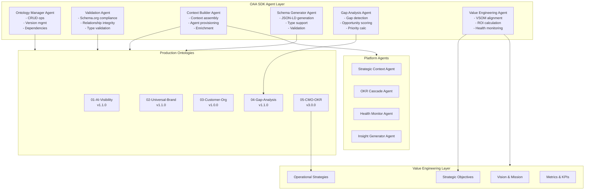
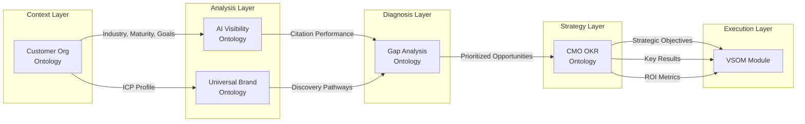
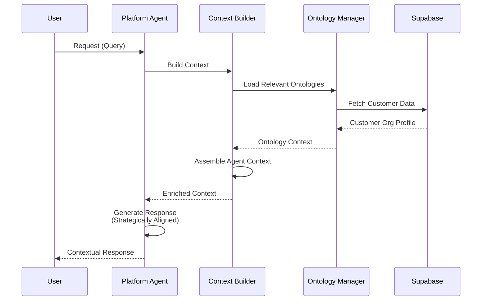
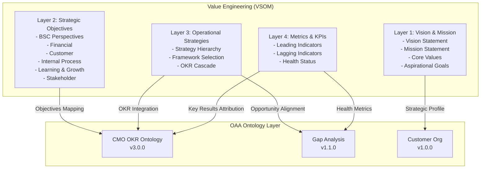
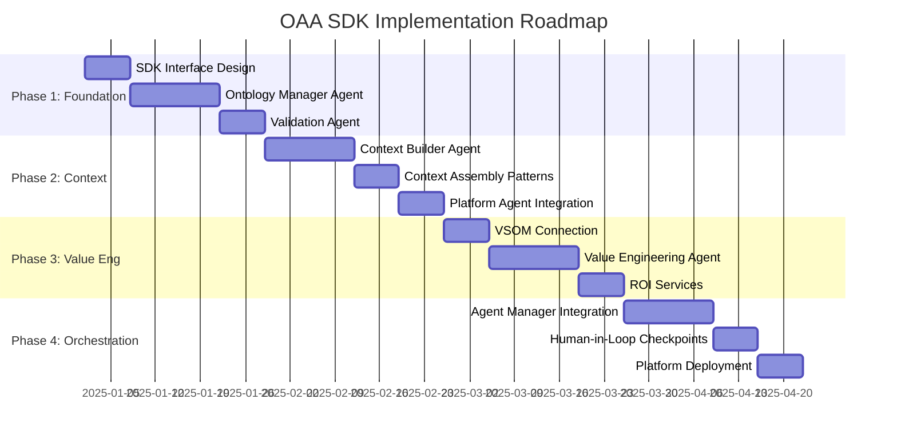
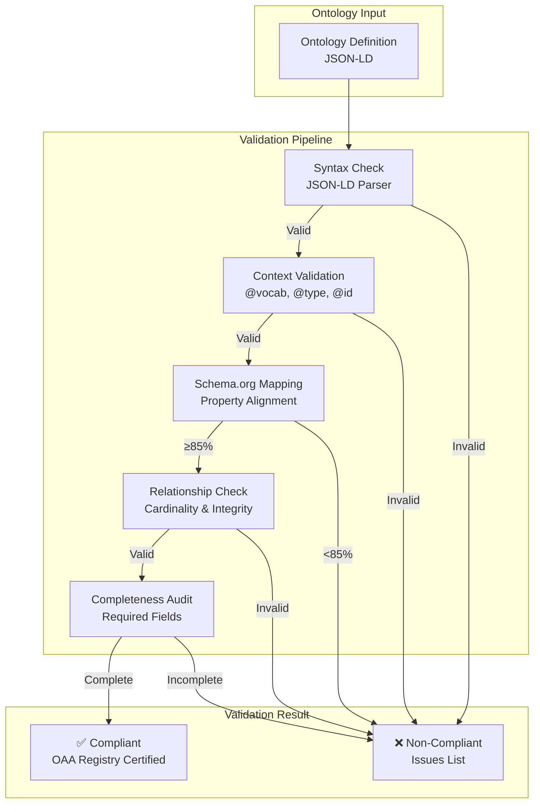
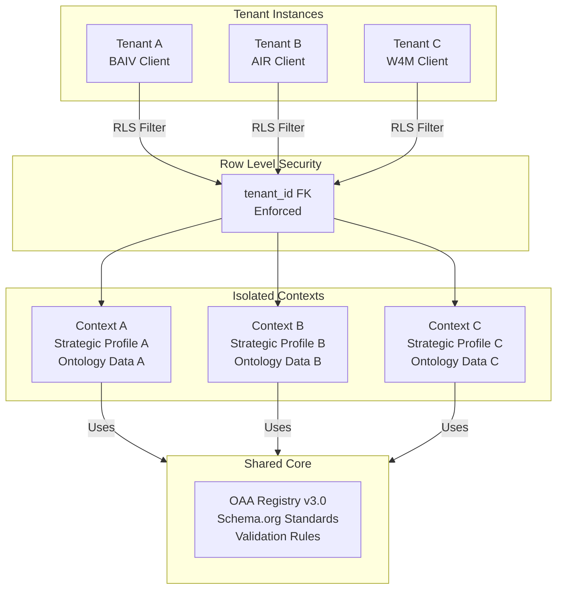

# OAA SDK Architecture Diagrams

## 1. OAA SDK Agent Architecture

## 2. Ontology Data Flow

## 3. Context Engineering Flow

## 4. Value Engineering Integration

## 5. SDK Implementation Phases

## 6. Schema.org Compliance Validation

## 7. Multi-Tenant Context Isolation

---

## Usage Notes

These diagrams are designed to be rendered using:
- **Mermaid Live Editor**: https://mermaid.live
- **GitHub Markdown**: Native rendering in `.md` files
- **Figma/Design Tools**: Export as SVG for inclusion

For artifact creation, use `.mermaid` extension for direct rendering in supported environments.
