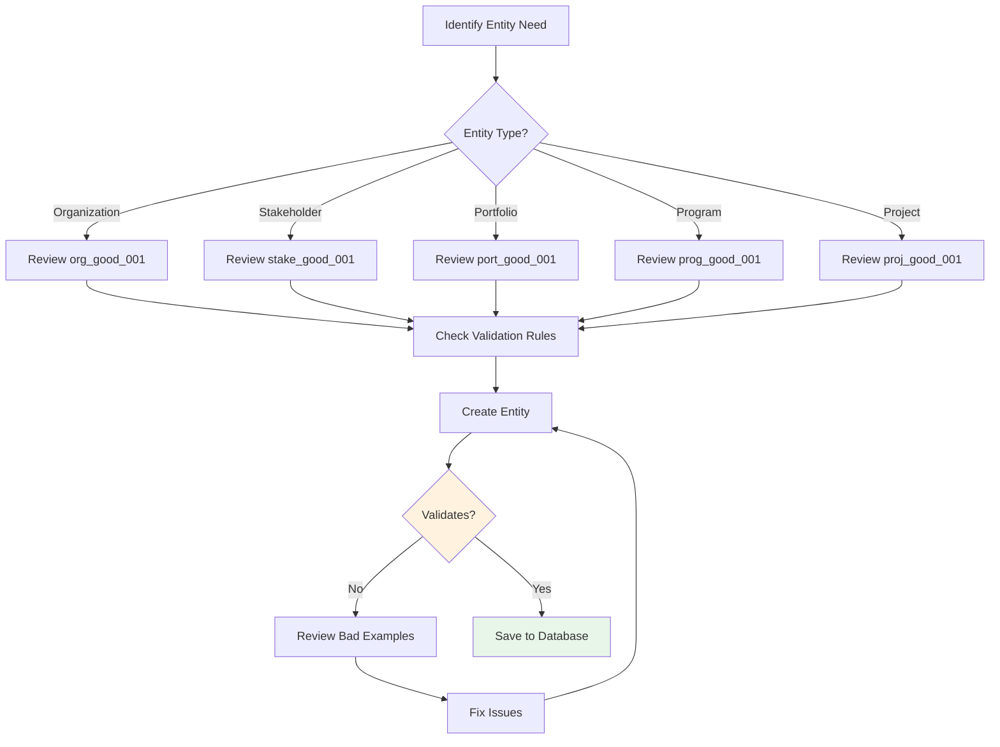

# Self-Documenting PPM Ontology
## Implementation Guide with Examples and Best Practices

---

## Document Overview

**Version:** 2.0.0  
**Status:** Production Ready  
**Last Updated:** 2025-01-01  
**Owner:** Enterprise Architecture Team  
**Classification:** Internal Use

This guide demonstrates how to use the self-documenting PPM ontology, including built-in examples, validation rules, and best practices.

---

## What Makes This Ontology Self-Documenting?

### 1. **Integrated Glossary**
Every term has a standardized definition, synonyms, related terms, business context, and technical notes.

```json
{
  "glossary": {
    "terms": {
      "portfolio": {
        "definition": "A collection of programs, projects, and operational activities...",
        "synonyms": ["investment portfolio", "strategic portfolio"],
        "business_context": "Portfolios align organizational strategy with execution...",
        "technical_note": "Portfolios are the primary grouping mechanism..."
      }
    }
  }
}
```

### 2. **Built-in Examples**
Each entity includes 2-3 good examples and 2-3 bad examples with explanations.

### 3. **Validation Rules**
Structured validation rules with severity levels (error, warning).

### 4. **Best Practices**
Practical guidance on naming, structure, and common pitfalls.

### 5. **Ownership & Change Control**
Clear ownership, approval authority, and change management process.

---

## Using the Ontology

### Quick Start: Creating Your First Portfolio


#### Step 1: Understand the Entity

Review the glossary definition:

**Portfolio Definition:** "A collection of programs, projects, and operational activities that are grouped together to facilitate effective management and achieve strategic business objectives."

**When to use:** Group related programs/projects that share strategic objectives, funding sources, or resource pools.

#### Step 2: Review Good Examples

```json
{
  "example_id": "port_good_001",
  "description": "Strategic transformation portfolio with clear alignment",
  "portfolio_name": "AI Transformation Portfolio",
  "portfolio_type": "transformation",
  "strategic_alignment": ["550e8400-e29b-41d4-a716-446655440001"],
  "success_criteria": [
    "AI adoption in 80% of business processes",
    "30% efficiency gain across operations",
    "Launch 5 AI-powered products"
  ],
  "why_good": "Clear strategic alignment, measurable success criteria, realistic budget and timeline"
}
```

#### Step 3: Avoid Bad Example Patterns

```json
{
  "example_id": "port_bad_001",
  "portfolio_name": "Stuff",
  "strategic_alignment": [],
  "why_bad": "Vague name, invalid portfolio_type, no strategic alignment",
  "validation_errors": [
    "portfolio_name 'Stuff' too vague - use descriptive business-oriented name",
    "strategic_alignment array empty - must reference organizational objective"
  ]
}
```

#### Step 4: Create Your Portfolio

```json
{
  "portfolio_id": "{{generate_uuid}}",
  "org_id": "{{your_org_id}}",
  "portfolio_name": "Customer Experience Transformation",
  "description": "Multi-year initiative to digitize customer journey",
  "portfolio_type": "transformation",
  "strategic_alignment": ["{{strategic_objective_id}}"],
  "portfolio_sponsor_id": "{{sponsor_stakeholder_id}}",
  "portfolio_manager_id": "{{manager_stakeholder_id}}",
  "budget_allocated": 10000000,
  "budget_currency": "USD",
  "status": "active"
}
```

#### Step 5: Validate

Check against validation rules:

✅ **portfolio_name**: Descriptive and business-focused  
✅ **portfolio_type**: Valid enum value  
✅ **strategic_alignment**: Non-empty, references valid objective  
✅ **sponsor != manager**: Different stakeholders  
✅ **budget_allocated**: Positive number  
✅ **dates**: start_date < target_end_date

---

## Validation Rule Reference

### Understanding Severity Levels


### Common Validation Patterns

#### Pattern 1: Required Fields
```json
{
  "rule": "org_name cannot be empty",
  "severity": "error",
  "example_violation": {
    "org_name": ""
  },
  "fix": {
    "org_name": "Global Technology Solutions Inc."
  }
}
```

#### Pattern 2: Enum Validation
```json
{
  "rule": "portfolio_type must be valid enum",
  "severity": "error",
  "valid_values": ["strategic", "operational", "innovation", "transformation", "compliance"],
  "example_violation": {
    "portfolio_type": "misc"
  },
  "fix": {
    "portfolio_type": "transformation"
  }
}
```

#### Pattern 3: Relationship Integrity
```json
{
  "rule": "parent_org_id must reference valid organization",
  "severity": "error",
  "example_violation": {
    "parent_org_id": "non-existent-id"
  },
  "fix": {
    "parent_org_id": "550e8400-e29b-41d4-a716-446655440000"
  }
}
```

#### Pattern 4: Business Logic
```json
{
  "rule": "portfolio_sponsor_id != portfolio_manager_id",
  "severity": "warning",
  "rationale": "Separation of duties recommended for governance",
  "example_violation": {
    "portfolio_sponsor_id": "550e8400-e29b-41d4-a716-446655440010",
    "portfolio_manager_id": "550e8400-e29b-41d4-a716-446655440010"
  },
  "fix": {
    "portfolio_sponsor_id": "550e8400-e29b-41d4-a716-446655440040",
    "portfolio_manager_id": "550e8400-e29b-41d4-a716-446655440010"
  }
}
```

---

## Best Practices by Entity Type

### Organization Best Practices


**Example Naming Conventions:**

✅ **Good:**
- "Global Technology Solutions Inc."
- "Cloud Services Division"
- "EMEA Operations"

❌ **Bad:**
- "GTS" (abbreviation without context)
- "The Company" (too vague)
- "IT" (unclear which IT department)

### Stakeholder Best Practices

**Competency Management:**

```json
{
  "best_practice": "Maintain verified certifications",
  "example": {
    "competency_name": "Program Management",
    "proficiency_level": "expert",
    "certification": "PgMP - Program Management Professional",
    "certification_date": "2022-06-15",
    "expiry_date": "2025-06-15",
    "verified": true
  },
  "rationale": "Enables accurate resource matching and capacity planning"
}
```

**Role Assignment:**


### Portfolio Best Practices

**Success Criteria Definition:**

```json
{
  "guideline": "Define 3-7 measurable success criteria",
  "good_example": {
    "success_criteria": [
      "AI adoption in 80% of business processes",
      "30% efficiency gain across operations",
      "Launch 5 AI-powered products",
      "$50M in cost savings",
      "Customer satisfaction score increase by 20 points"
    ]
  },
  "why_good": "Specific, measurable, achievable, relevant, time-bound (SMART)",
  "bad_example": {
    "success_criteria": [
      "Be successful",
      "Make improvements",
      "Achieve goals"
    ]
  },
  "why_bad": "Vague, not measurable, no clear targets"
}
```

### OKR Best Practices

**Objective Writing:**


**Key Result Design:**

| **Attribute** | **Good Example** | **Bad Example** |
|---------------|------------------|-----------------|
| **Specificity** | "Achieve 60% query resolution via AI chatbot" | "Improve chatbot" |
| **Measurability** | Target: 60%, Current: 35%, Unit: percentage | Target: "Better", Current: Unknown |
| **Baseline** | Start: 0%, Current: 35%, Target: 60% | No baseline defined |
| **Timeline** | Target Date: 2025-06-30 | No date specified |
| **Ownership** | Owner: Sarah Johnson (ID: xxx) | No owner assigned |

---

## Common Mistakes and How to Avoid Them

### Mistake 1: Over-Allocating Resources

**Problem:**
```json
{
  "stakeholder_id": "xxx",
  "roles": [
    {
      "role_name": "project_manager",
      "allocation_percentage": 100
    },
    {
      "role_name": "program_manager",
      "allocation_percentage": 80
    }
  ]
}
```
**Total Allocation:** 180% ❌

**Solution:**
```json
{
  "stakeholder_id": "xxx",
  "roles": [
    {
      "role_name": "project_manager",
      "allocation_percentage": 60
    },
    {
      "role_name": "program_manager",
      "allocation_percentage": 40
    }
  ]
}
```
**Total Allocation:** 100% ✅

### Mistake 2: Vague Naming

**Problem:**
```json
{
  "portfolio_name": "Stuff",
  "program_name": "Things",
  "project_name": "Work"
}
```

**Solution:**
```json
{
  "portfolio_name": "AI Transformation Portfolio",
  "program_name": "Customer Service AI Implementation",
  "project_name": "AI Chatbot Development - Phase 1"
}
```

### Mistake 3: Multiple RACI Accountable

**Problem:**
```json
{
  "activity": "Architecture Design",
  "raci": [
    {"stakeholder": "Alice", "responsibility": "accountable"},
    {"stakeholder": "Bob", "responsibility": "accountable"}
  ]
}
```
**Two people accountable = confusion about final decision maker** ❌

**Solution:**
```json
{
  "activity": "Architecture Design",
  "raci": [
    {"stakeholder": "Alice", "responsibility": "accountable"},
    {"stakeholder": "Bob", "responsibility": "responsible"},
    {"stakeholder": "Carol", "responsibility": "consulted"}
  ]
}
```
**One accountable (decision maker), others have supporting roles** ✅

---

## Change Control Process

### Requesting Changes to the Ontology


### Change Request Template

```json
{
  "change_request": {
    "cr_id": "CR-2025-001",
    "submitted_by": "john.doe@example.com",
    "submission_date": "2025-01-15",
    "change_type": "entity_addition",
    "priority": "medium",
    "title": "Add 'Initiative' entity type",
    "description": "Request to add Initiative as a new entity type between Portfolio and Program",
    "business_justification": "Our organization uses initiatives as a grouping mechanism",
    "impact_assessment": {
      "breaking_changes": false,
      "affected_entities": ["portfolio", "program"],
      "migration_required": false,
      "backward_compatible": true
    },
    "proposed_implementation": {
      "schema_changes": "Add new entity type 'initiative' with foreign keys to portfolio",
      "documentation_updates": "Add glossary entry, examples, validation rules",
      "timeline": "2 weeks"
    },
    "approval_status": "pending"
  }
}
```

### Change Types

| **Change Type** | **Approval Required** | **Migration Impact** | **Notice Period** |
|-----------------|----------------------|---------------------|-------------------|
| **Bug Fix** | Architect | Low | Immediate |
| **Best Practice Update** | Architect | None | 30 days |
| **New Optional Attribute** | Review Board | Low | 60 days |
| **New Entity Type** | Review Board | Medium | 90 days |
| **Breaking Schema Change** | Review Board + Exec | High | 180 days |

---

## Testing Your Implementation

### Test Data Sets

The ontology includes test data for validation:

```json
{
  "test_suite": "portfolio_validation",
  "tests": [
    {
      "test_id": "port_test_001",
      "description": "Valid portfolio creation",
      "input": "{{port_good_001}}",
      "expected_result": "success",
      "expected_errors": []
    },
    {
      "test_id": "port_test_002",
      "description": "Invalid portfolio with missing alignment",
      "input": "{{port_bad_001}}",
      "expected_result": "failure",
      "expected_errors": [
        "strategic_alignment array empty",
        "portfolio_name too vague",
        "invalid portfolio_type"
      ]
    }
  ]
}
```

### Validation Checklist

Before deploying to production:

- [ ] All entities have valid UUIDs
- [ ] All foreign keys reference existing entities
- [ ] Enum values match allowed values
- [ ] Required fields populated
- [ ] Date ranges logical (start < end)
- [ ] Numeric values within valid ranges
- [ ] At least one good example implemented
- [ ] Validation rules tested with bad examples
- [ ] Schema.org compliance verified

---

## Support and Resources

### Getting Help

**Documentation:**
- Glossary: Reference section for all term definitions
- Examples: Good and bad examples for each entity
- Validation Rules: Complete rule reference with severity levels

**Change Requests:**
- Submit to: architecture@organization.example
- Include: Business justification and impact assessment
- Response time: 5 business days

**Questions:**
- Technical: Data architecture team
- Business: PMO team
- Process: Enterprise architects

### Version History

| **Version** | **Date** | **Changes** | **Impact** |
|-------------|----------|-------------|------------|
| 2.0.0 | 2025-01-01 | Self-documenting features added | None (new capability) |
| 1.0.0 | 2024-06-01 | Initial ontology release | N/A |

---

## Quick Reference Cards

### Entity Creation Flowchart



### Validation Quick Check

**Before Saving Any Entity:**

1. ✅ UUID format valid?
2. ✅ Required fields populated?
3. ✅ Foreign keys exist?
4. ✅ Enum values valid?
5. ✅ Business rules satisfied?
6. ✅ Matches good example pattern?
7. ✅ Doesn't match bad example pattern?

---

## Conclusion

This self-documenting ontology provides everything needed for successful implementation:

✅ **Comprehensive Definitions** - Glossary with business and technical context  
✅ **Learning by Example** - Good and bad examples with explanations  
✅ **Built-in Validation** - Structured rules with severity levels  
✅ **Best Practices** - Practical guidance for common scenarios  
✅ **Change Control** - Clear ownership and approval process  
✅ **Schema.org Compliance** - Enhanced discoverability and AI processing

By following the examples, validation rules, and best practices documented within the ontology itself, teams can implement PPM solutions with confidence and consistency.

---

**Document Control:**
- **Version**: 2.0.0
- **Owner**: Enterprise Architecture Team
- **Review Cycle**: Quarterly
- **Next Review**: 2025-04-01
- **Classification**: Internal Use
- **Distribution**: All PPM Implementation Teams